# 三、电源

系统中最常被忽视的部分之一往往是电源——至少在一切正常的情况下是如此。只有当事情出错时，电源才开始受到一些审查。

树莓派的主人需要给电源额外的尊重。与许多 AVR 级电路板不同，原始输入电压后接一个板载 5 V 调节器，Pi 期望其功率在输入端得到调节。Pi 确实包含板载调节器，但这些调节器可调节较低的电压(3.3 V 及更低)。

图 [3-1](#Fig1) 显示了相当脆弱的微型 USB 电源输入连接器。最初的型号 B 在连接器后面有一个大的圆形电容器，经常被抓住以发挥杠杆作用。避免这样做，因为许多人报告说是不小心“突然关掉”的。

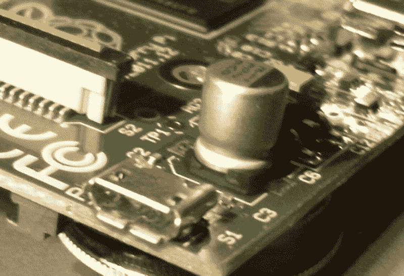

图 3-1

微型 USB 电源输入

自最初的型号 B 以来的这些年里，已经生产了没有大电容器的其他型号。但它们都使用脆弱的微型 USB 电源输入，如图 [3-1](#Fig1) 所示。插入电源连接器时，请小心轻放。

## 计算能力

有时，电源是根据电压和功率处理能力(瓦特)来指定的。Pi 的 5 V 输入电压必须支持根据所用型号而变化的输入电流。表 [3-1](#Tab1) 总结了模型功率需求最小值。

表 3-1

Raspberry Pi 最低功耗要求汇总

<colgroup><col class="tcol1 align-left"> <col class="tcol2 align-left"> <col class="tcol3 align-left"></colgroup> 
| 

模型

 | 

低值电流

 | 

电源

 |
| --- | --- | --- |
| Pi 模型 B | 700 毫安 | 3.5 瓦 |
| Pi 2 模型 B | 820 毫安 | 4.1 瓦 |
| Pi 3 模型 B | 1.34 A | 6.7 瓦 |
| Pi 3 型号 B+ | 1.13 A | 5.65 瓦 |
| 圆周率零和 W | 350 毫安 | 1.75 瓦 |

让我们以瓦特为单位验证 Raspberry Pi 3 型号的电源数字(这不包括任何添加的外围设备):

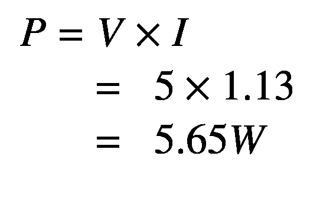

5.65 W 代表最低要求，因此我们应该额外超额配置 50%:

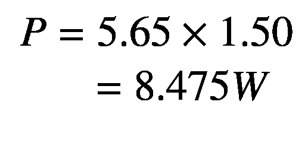

额外的 50%产生大约 8.5 W 的功率需求

### 小费

为您的电源预留 50%的额外容量。电源变坏可能会导致损坏或其他一些问题。Pi 的一个常见电源相关问题是 SD 卡上的数据丢失。

## 当前需求

由于正在寻找的电源产生一个输出电压(5 V)，您可能会看到具有广告的*电流*额定值而不是功率的电源适配器。在这种情况下，您可以简单地考虑 50%的额外电流(对于 Pi 3):

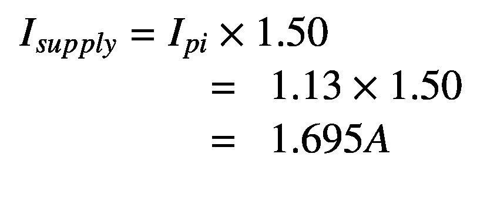

为了仔细检查我们的工作，让我们看看这是否与我们之前计算的额定功率一致:

结果一致。根据这一评估，您可以得出这样的结论:您*至少需要一个 5 V 电源来产生以下结果之一:*

*   8.475 瓦或以上

*   1.695 A 或更高(忽略外设)

能够满足任一要求的电源应该足够了。然而，你应该意识到，并不是所有的广告收视率是他们所看到的。廉价的供应品往往不能满足他们自己的要求，因此必须考虑额外的利润。

## 外围电源

功耗预算中必须考虑每个额外的耗电电路，尤其是 USB 外设。根据其类型，插入 USB 2 端口的给定 USB 外设可以期望高达 500 mA 的电流，假设它可以获得它。

众所周知，无线适配器非常耗电。使用时不要忘记键盘和鼠标，因为它们也会增加功耗。如果您已经连接了一个 RS-232 电平转换器电路(可能使用 MAX232CPE)，您也应该在 3.3 V 电源预算中为这一小部分做预算。这将间接增加你的+5 V 预算，因为 3.3 V 稳压器是由它供电。(USB 端口使用+5 V 电源。)任何从你的树莓派汲取能量的东西都应该被记录下来。

## 3.3 伏电源

Raspberry Pi 的输入是调节后的 5 伏电压。但是 Pi 本身依赖于 3.3 V 电源，该电源由板载调节器提供。板载稳压器可为其他支持 IC 提供额外的较低电压，具体取决于型号。由于 3.3 V 电源是从 5 V 输入电源间接获得的，因此原始型号 B 的最大过量电流为 50mA；Pi 耗尽了调节器的剩余容量。

规划设计时，需要仔细预算 3.3 V 电源。每个 GPIO 输出引脚从该电源获得额外的 3 至 16 mA 电流，具体取决于其使用方式。电流预算较高的项目可能需要包括自己的 3.3 V 稳压器，从输入 5 V 输入供电。

## 供电 USB 集线器

如果您的电源预算因 USB 外设而捉襟见肘，您可能会考虑使用由*供电的* USB 集线器。这样，*集线器*而不是你的树莓派为下游外设提供必要的电力。

并非所有的 USB 集线器都能与(Raspbian) Linux 兼容。内核需要与连接的 USB 集线器协作，因此软件支持至关重要。以下网页列出了已知工作正常的 USB 集线器:

[T2`http://elinux.org/RPi_Powered_USB_Hubs`](http://elinux.org/RPi_Powered_USB_Hubs)

## 电源适配器

对于树莓派的高电流四核型号，您只需购买一个合适的适配器。不要在你的高性能装备上浪费廉价或劣质的供应品。

对于低功耗 Pi，如旧型号 B、Zero 或 Zero W，您可能会尝试一些更便宜的解决方案。让我们检查一些选项。

### 不合适的供应

图 [3-2](#Fig2) 所示的例子是在易贝花 1.18 美元购买的，免运费(见即将发布的假货警告)。因此，使用它是很有诱惑力的。

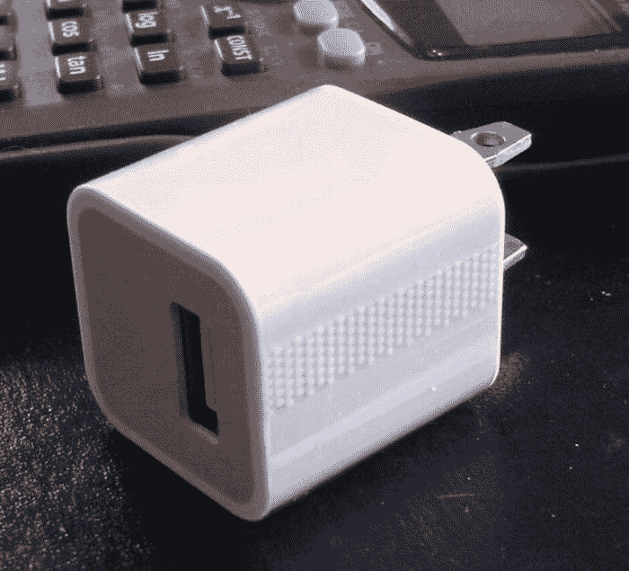

图 3-2

型号 A1265 苹果适配器

这是一个具有以下额定值的适配器/充电器:

*   *型号* : A1265

*   *输入*:100–240 伏交流电

*   *输出* : 5 V，1 A

当插上电源时，Raspberry Pi 的电源 LED 立即亮起，这是适配器(相对于充电器)的一个好迹象。电源的快速上升时间导致成功的上电复位。测量电压时，在+5 V 电源上的读数为+4.88 V。虽然不理想，但在可接受的电压范围内。(电压应在+5V-4.75 和 5.25 V 的 10%以内。)

当没有使用 HDMI 显卡时(使用串行控制台、SSH 或 VNC)，苹果设备似乎工作得相当好。然而，我发现当使用 HDMI 并且 GPU 有工作要做时(例如，在桌面上移动一个窗口)，系统往往会卡住。这清楚地表明适配器没有完全输送或调节得足够好。

### 警告

非常小心假冒的苹果充电器/适配器。Raspberry Pi 基金会已经看到被这些损坏的返回单元。有关视频和更多信息，请参见 [`www.raspberrypi.org/archives/2151`](https://www.raspberrypi.org/archives/2151) 。

### 电子书适配器

一些人报告说使用电子书电源适配器是成功的。我也成功使用过 2 A 的 Kobo 充电器。

### 电源质量

虽然低价购买 USB 电源适配器是可能的，但更明智的做法是花更多的钱购买高质量的设备。为了节省几美元而扔掉你的树莓派或者经历随机的失败是不值得的。

如果你没有示波器，你将无法检查你的电源电流是干净还是肮脏。一个好的电源适配器比示波器便宜。不稳定/有噪音的电源会导致各种不明显的间歇性问题。

一个很好的开始是简单地谷歌“推荐电源树莓派。”做你的研究，并把你的 USB 外设包括在电力预算中。请记住，无线 USB 适配器消耗大量电流，高达 500 mA。

### 注意

一项随机互联网调查显示，无线 USB 适配器的功耗范围为 330 mA 至 480 mA。

### 电压测试

如果您有一个 DMM(数字万用表),在 Pi 上电后进行测试是值得的。如果您遇到问题，这可能是您应该做的第一件事。

按照以下步骤执行电压测试(假设现在标准化的 40 引脚排线用于引脚编号):

1.  将 Raspberry Pi 的微型 USB 端口插入电源适配器的 USB 端口。

2.  插入电源适配器。

3.  测量 P1-02 (+5 V)和 P1-39 或 P1-06(接地)间的电压:预期+4.75 至+5.25 V

4.  测量 P1-01 (+3.3 V)和 P1-39 或 P1-06(接地)间的电压:预期+3.135 至+3.465 V

### 警告

小心你的万用表表笔绕过 P1 的针脚。*特别注意不要将+5 V 短接到+3.3 V 引脚*，哪怕是几分之一秒。这样做会使你的 Pi 崩溃！为了安全起见，请使用杜邦线。

图 [3-3](#Fig3) 显示了在 Raspberry Pi 3 型号 B+上测试+5 V 电源。请注意+5V 电源(P1-02 引脚)的接头带上使用了红色杜邦导线。一根蓝色的杜邦线连接到地线。

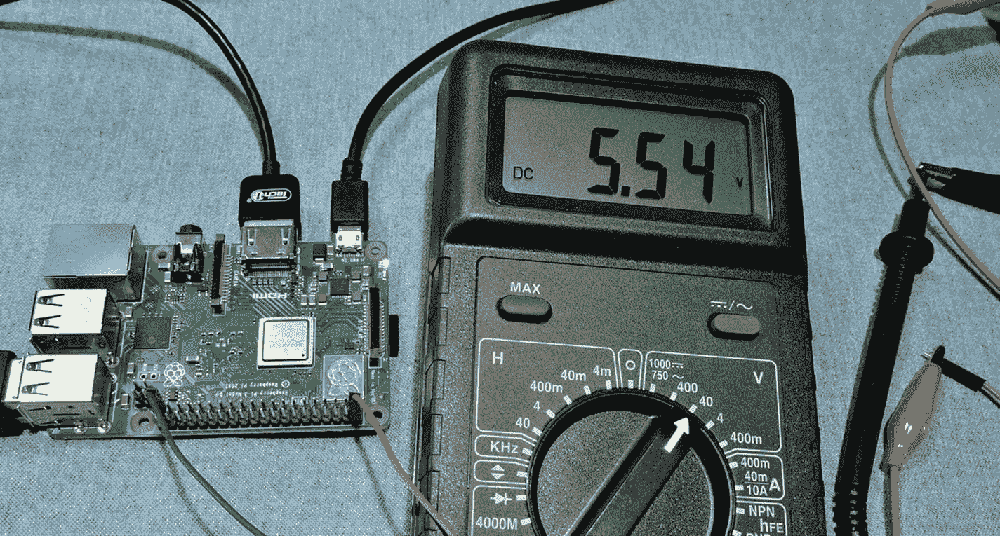

图 3-3

测试 Raspberry Pi 3 型号 B+的+5V 电源

图 [3-4](#Fig4) 同样显示了从 Pi 的板载调节器测量调节后的 3.3 V 电源。图中红色的杜邦线连接到出现调节输出的 P1-01。

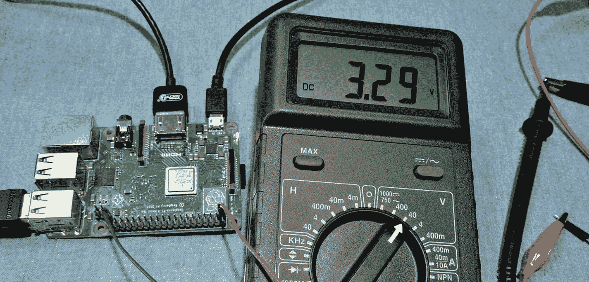

图 3-4

测试 Raspberry Pi 3 B+的+3.3 V 电源

附录 B 列出了 ATX 电源标准电压等级，包括+5±0.25V 和+3.3±0.165V，作为比较指南。

## 电池电量

由于 Raspberry Pi 的尺寸较小，因此可能需要使用电池电源来运行它(尤其是对于零 W 或零 W)。这样做需要一个监管机构和一些仔细的规划。为了满足 Raspberry Pi 的要求，您必须制定功耗预算。一旦你知道你的最大电流需求，你就可以充实其余的。以下示例假设需要 1 A。

### 要求

为了清楚起见，让我们列出电池电源必须满足的功率要求:

*   电压 5 V，在 0.25 V 范围内

*   电流 1 A

### 净空高度

最简单的方法是使用线性 LM7805 作为 5 V 调节器。但是这种方法也有缺点:

*   输入电压之上必须有一定的裕量(约 2 V)。

*   允许过多的净空会增加调节器的功耗，导致*浪费*电池电量。

*   也可能导致较低的最大输出电流。

您的电池应提供最低 5+2 V (7 V)的输入。调节器的任何较低输入电压都会导致调节器“下降”并降至 5 V 以下，显然，6 V 电池输入是不行的。

### LM7805 法规

图 [3-5](#Fig5) 显示了一个使用 LM7805 线性稳压器的非常简单的电池电路。电池电源进入中的 V ，从右边的引脚 1 输出+5 V 的调节输出。

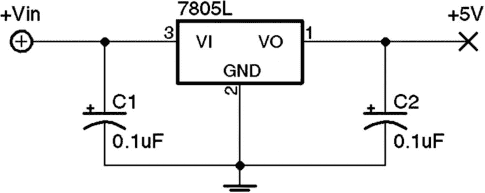

图 3-5

使用 LM7805 稳压芯片的电池稳压电路

8.4 V 电池电源可以由 7 个 NiCad 电池串联而成，每个电池产生 1.2 V 电压，8.4 V 输入允许电池电压降至 7 V，不会超过 2 V 的最小裕量。

根据所选的确切 7805 调节器器件，典型的散热参数设置可能如下:

*   *输入电压*:7–25v

*   *输出电压* : 1.5 A(散热)

*   *工作温度:125 摄氏度*

务必在调节器上使用散热器，以便将热能散发到周围空气中。没有一个，调节器可以进入热关断状态，减少电流以防止损坏。发生这种情况时，输出电压将降至+5 V 以下。

请记住，电池消耗的功率大于负载接收的功率。如果我们假设 Raspberry Pi Zero 的功耗为 350 mA，则通过调节器从电池中汲取的电流最少也有 350 mA(这可能略高)。要知道，由于输入电压较高，稳压器正在消耗额外的能量。调节器(P R )和负载(P L )消耗的总功率如下:

调节器必须消除输入和输出电压之间的差异(1.19 W)。这些额外的能量加热调节器，并通过散热器散发出去。由于这个问题，设计者避免在线性调节器电路上使用高输入电压。

如果调节器在 7 V(输入)时的最大额定电流为 1.5 A，则调节器的最大功率约为 10.5 W，如果我们施加 8.4 V 而不是 7V 的输入电压，则我们可以得出 5 V 最大电流:

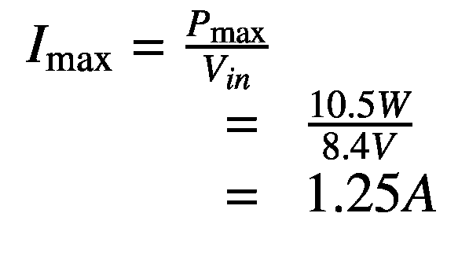

由此我们发现，8.4 V 电池稳压器电路可以在输出端提供最大 1.25 A 的电流，而不会超过稳压器的额定功率。用 8.4 V 乘以 1.25 A 来说服自己这等于 10.5 W。

### DC-DC 降压转换器

例如，如果应用是为数据采集而设计的，则希望它在给定的一组电池或充电周期内运行尽可能长的时间。开关调节器可能比线性调节器更合适，因为其效率更高。

图 [3-6](#Fig6) 显示了一个非常小的 pcb，长度约为 1.5 SD 卡。这个单位是从易贝购买的 1.40 美元，免费送货。以这样的价格，你为什么要建一个呢？

图 3-6

DC-DC 降压转换器

它们使用起来也很简单。转换器提供+和–输入连接以及+和–输出连接。在一个电压下输入功率，在另一个电压下输出功率。

*但是不要马上把它接到你的树莓 Pi* 上，直到你校准了输出电压。虽然它*可能*来预校准为 5 V，最好不要指望它。如果该装置产生更高的电压，您可能会烧坏 Pi。

通过 pcb 上的多匝调整电位计，可以轻松调整调节后的输出电压。当你读你的数字万用表的时候调整锅。

表 [3-2](#Tab2) 提供了我购买的设备的规格，供您参考。请注意宽范围的输入电压，以及它可以在低至–40°c 的温度下工作的事实，宽范围的输入电压和高达 3 A 的电流显然使这款器件非常适合连接到电压可能变化很大的太阳能电池板。

表 3-2

DC-DC 降压转换器规格

<colgroup><col class="tcol1 align-left"> <col class="tcol2 align-left"> <col class="tcol3 align-left"> <col class="tcol4 align-left"> <col class="tcol5 align-left"> <col class="tcol6 align-left"> <col class="tcol7 align-left"> <col class="tcol8 align-left"></colgroup> 
| 

参数

 | 

福建话

 | 

最大

 | 

单位

 | 

参数

 | 

福建话

 | 

最大

 | 

单位

 |
| --- | --- | --- | --- | --- | --- | --- | --- |
| 输入电压 | Four | Thirty-five | 伏特 | 输出脉动 |   | Thirty point nine | 妈 |
| 输入电流 |   |  3.0 | 安培数 | 负载调节 | ±0.5 | % |   |
| 输出电压 | One point two three | Thirty | 伏特 | 电压调整 | ±2.5 | % |   |
| 换能效率 |   | Ninety-two | % | 工作温度 | –40 | +85 | C |
| 开关频率 |   | One hundred and fifty | 千赫 | PCB 尺寸 |   | 45×20×12 | 毫米 |
|   |   |   |   | 净重 |   | Ten | g |

该规范声称高达 92%的转换效率。在输入端使用 15 V 电压，我进行了自己的测量实验。将装置调整到在输出端产生 5.1 V，读取表 [3-3](#Tab3) 中所示的读数。

表 3-3

从实验中获得的读数

<colgroup><col class="tcol1 align-left"> <col class="tcol2 align-left"> <col class="tcol3 align-left"> <col class="tcol4 align-left"></colgroup> 
| 

参数

 | 

投入

 | 

输出

 | 

单位

 |
| --- | --- | --- | --- |
| 电压 | Fifteen point one three | Five point one | 伏特 |
| 目前的 | Zero point one nine | Zero point four one | 安培数 |
| 电源 | Two point eight seven | Two point zero nine | 瓦茨 |

从表中我们可以看到输入端使用了更多的功率(2.87 W)。输出端使用的功率为 2.09 W。效率就变成了除法问题:

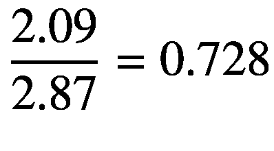

由此我们可以得出结论，测得的转换效率约为 72.8%。

如果使用 LM7805 调节器，我们能做得多好？以下是最好的情况估计，因为我没有这种情况下的实际电流读数。但我们知道，从调节器流出的电流至少有同样多的电流必须流入调节器(可能更多)。那么，LM7805 调节器理论上能做到的最好水平是什么呢？让我们在 5.10 V 下对 Raspberry Pi 应用同样的 410 mA 电流消耗，如表 [3-4](#Tab4) 所示。(这是在没有使用 HDMI 输出的情况下进行的。)

表 3-4

假设的 LM7805 功耗

<colgroup><col class="tcol1 align-left"> <col class="tcol2 align-left"> <col class="tcol3 align-left"> <col class="tcol4 align-left"></colgroup> 
| 

参数

 | 

投入

 | 

输出

 | 

单位

 |
| --- | --- | --- | --- |
| 电压 | Seven point one | Five point one | 伏特 |
| 目前的 | Zero point four one | Zero point four one | 安培数 |
| 电源 | Two point nine one | Two point zero nine | 瓦茨 |

这种最佳情况下的功效相当于:

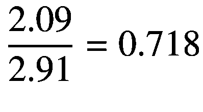

LM7805 调节器的绝对最佳效率为 71.8%。但这是在其*最佳输入*电压下实现的。将输入电压提高至 12 V 会导致功耗大幅上升，从而产生 42.5%的效率(这一计算留给读者作为练习)。试图在 15.13 V 下操作 LM7805 调节器，就像我们对降压转换器所做的那样，会导致效率下降到 33.7%以下。显然，降压转换器在转换来自更高电压源的功率时效率要高得多。

## 电力不足的迹象

在论坛中，有报道称 ping 有时在桌面上无法工作(使用 HDMI)，但在控制台模式下可以正常工作。此外，我发现如果移动桌面窗口，它们会冻结(HDMI)。例如，当您开始移动终端窗口时，移动会在中途停止，就好像鼠标停止工作一样。

这些都是树莓派电力不足的迹象。GPU 在活动时消耗更多的功率，执行加速图形。桌面冻结(GPU 饥饿)或网络接口失败(ping)。可能还有其他与 HDMI 活动相关的症状。

另一个被报道的问题是在启动后不久，树莓 Pi 被重置。随着内核启动，主板开始消耗更多的功率，这可能导致 Pi 被耗尽。 3

如果您在插入 USB 设备时失去了以太网连接，这也可能是电量不足的迹象。 4

虽然看起来 1 A 电源应该足以提供 700 mA 的 Raspberry Pi，但使用 2 A 电源会更好。许多电源根本达不到其宣传的额定功率。

微型 USB 电缆是另一个值得怀疑的东西。有些是用细导体制造的，这可能导致显著的电压降。如前面“电压测试”一节所示测量电压可能有助于诊断。尝试更高质量的电缆，看看是否有所改善。

## 摘要

本章简要介绍了您在使用 Raspberry Pi 时可能会遇到的一些电源问题。现在，您应该准备好做出关于电源适配器或电池供电选项的明智选择。