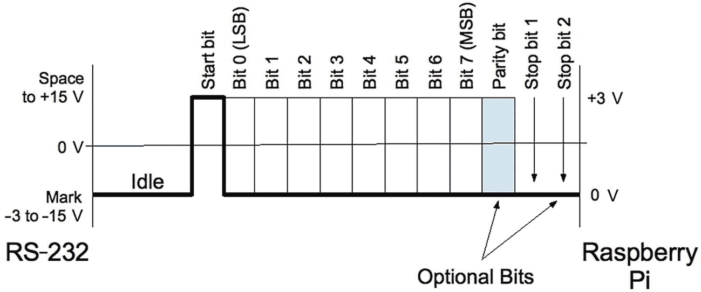
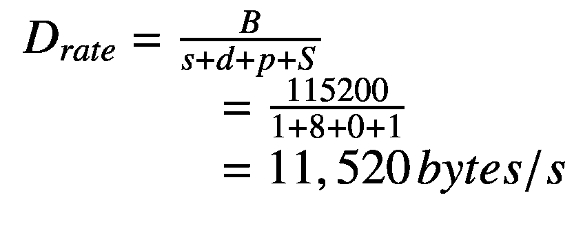
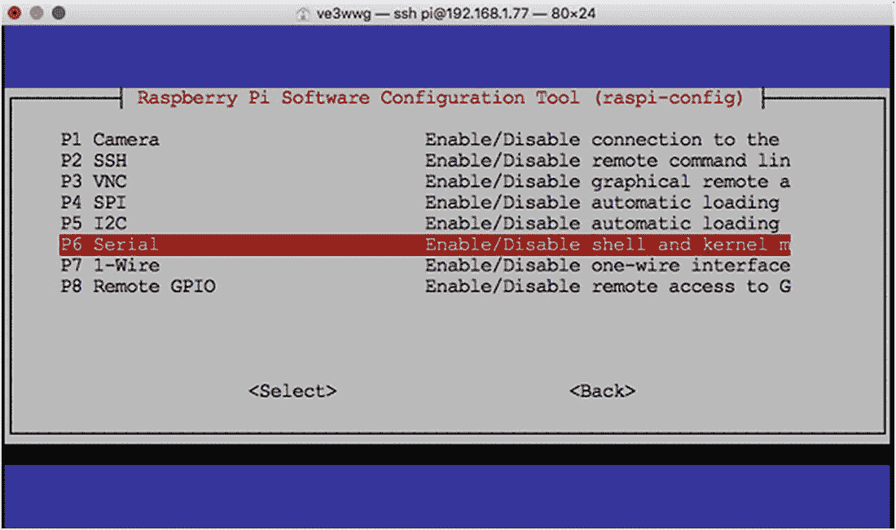
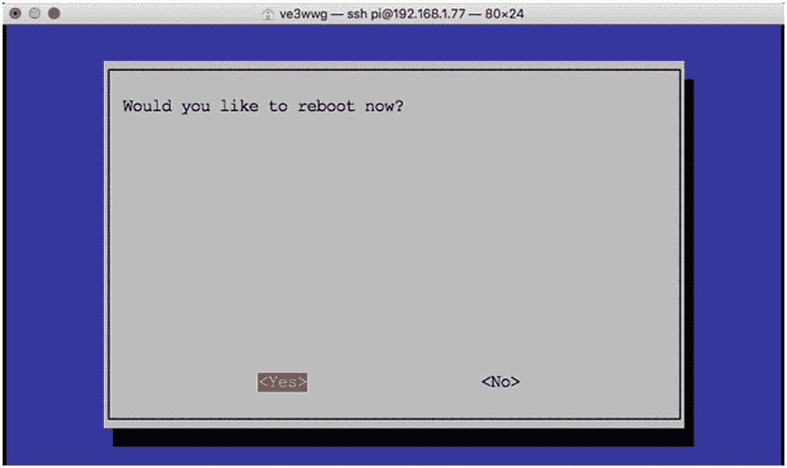
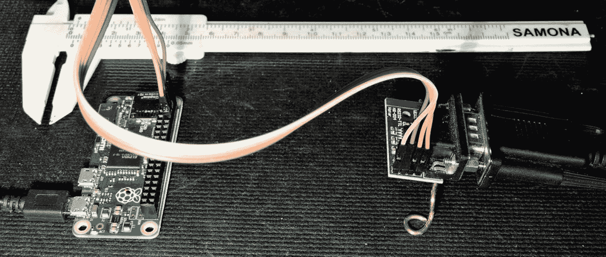

# 十、通用非同步收发传输器

Raspberry Pi 有一个 UART 接口，允许它执行串行数据通信。使用的数据线是 3.3 V 逻辑电平信号，应该*而不是*连接到 TTL 逻辑(+5 V)(它们也是*不兼容 RS-232)*。要使用 RS-232 与设备通信，您需要一个转换器模块。

## RS-232 转换器

虽然勤劳的人可以自己构建 RS-232 转换器，但如果有 pcb 上的廉价转换器，就没什么必要这么做了。

图 [10-1](#Fig1) 是我用过的一个 MAX232CSE 芯片 pcb。这个特殊的单元只支持 RX 和 TX 线路，没有硬件流量控制。当寻找一个单位，得到一个工作与 3.3 伏逻辑电平。有些单元只能用 TTL (+5 V)逻辑工作，这对你的 Pi 是有害的。当 MAX232CSE 芯片的 VCC 电源引脚连接到+3.3 V 时，该芯片支持 3.3 V 工作电压


图 10-1

MAX232CSE 接口

我还建议你选择一个支持硬件流控制信号的单元。寻找 CTS 和 DTR 信号。完整的 RS-232 转换器还包括 DTR、DSR 和 CD 信号。

### 注意

在本文中，我们将参考 *3 V* ，知道它更准确地说是 3.3 V。

### TTL 适配器

您也可以使用 TTL 适配器，而不是将信号转换为 RS-232 所需的+/-电压。Pi 要求信号端(TTL)应能在+3.3 V 而不是通常的+5 V 下工作，使用+5 V 适配器可能会损坏 Pi。可以连接+3.3 V 的单元可能会有一个跳线来选择电压。

### DTE 或 DCE

选择 RS-232 转换器时，请记住有两种串行连接:

*   *DCE* :数据通信设备(母接头)

*   *DTE* :数据终端设备(公接头)

一个普通的 USB 串行适配器(例如，用于笔记本电脑)将提供一个 DTE(公)连接器。这种电缆的布线是这样的，它预计插入到 DCE(阴)连接。当这适用于你的 Raspberry Pi 适配器时，笔记本电脑的串行适配器可以直接插入 DCE(母)连接器，*消除了*对交叉电缆或零调制解调器的需要。

因此，对于您的 Pi，请选择提供母(DCE)连接器的 RS-232 转换器。同样，确保您为笔记本电脑/台式机购买了一个具有公(DTE)连接的电缆或 USB 设备。连接 DTE 到 DTE 或 DCE 到 DCE 需要一根交叉电缆，根据电缆的不同，还需要一个“性别修理工”。最好从一开始就把事情“搞清楚”。

假设您对 Pi 使用了 DCE 转换器，将 RS-232 转换器的 3 V 逻辑 TX 连接到 Pi 的 TXD0，将 RX 连接到 Pi 的 RXD0 数据线。

所有这些关于 DCE 和 DTR 的事情总是让人很困惑。如果你也觉得这令人困惑，有另一种实用的方法来看待它。从您计划使用的连接器和电缆开始。确保它们在两端匹配，并且串行电缆是已知的*直电缆*(相对于*交叉电缆*)。一旦解决了这些物理问题，您就可以正确布线了。将 TX 连接到 RX，并将 RX 连接到 TX。换句话说，*你*在 RS-232 适配器和 Raspberry Pi 之间自己布线交叉。需要记住的重要一点是，发射端需要向接收端双向发送信号。

### 注意

在 DB9 或 DB25 电缆上，直串行电缆将引脚 2 连接到引脚 2，引脚 3 连接到引脚 3。一根交叉电缆将穿过这两条信号线以及其他信号线。

## RS-232

RS-232 是与串行通信相关的一系列标准的传统名称。它是在 1962 年由 EIA 的无线电部门首次引入的。第一个数据终端是与调制解调器(DCE)通信的电传打字机(DTE)。早期的串行通信受到不兼容的困扰，直到后来的标准发展。

串行链路包括两条数据线，数据从一个终端发送，由同一个终端接收。除了这些数据线，还有几个握手信号(比如 RTS 和 CTS)。默认情况下，Raspberry Pi 不提供这些功能。

图 [10-2](#Fig2) 显示了一个串行信号传输，时间从左到右。RS-232 设备要求信号在–15V 至+15 V 范围内变化。



图 10-2

串行信号

标准规定，当电压在–3 和–15v 之间时，信号被视为处于*标记状态*。如果电压在+3 和+15 V 之间，信号被视为处于*空间状态*。当线路空闲时，RS-232 数据线处于标记状态。

### 开始位

当要发送数据的异步字符时，该行首先在 1 比特的持续时间内转换到一个空间电平。这就是所谓的*起始位* (0)。数据位紧随其后。

异步线路不像同步链路那样使用时钟信号。异步接收器的时钟必须与发送器的波特率匹配。接收器在位单元时间内对线路采样 16 次，以确定其值。采样有助于避免噪声脉冲触发错误的数据读取。

### 数据位

数据位紧跟在起始位之后，最低有效位在前。空格是 0 数据位，而标记代表 1 位。早期的电传设备使用 5 个数据位发送 5 位博多码中的字符。 <sup>11</sup> 因此，串行端口可以配置为 5、6、7 或 8 个数据位。在 ASCII 字符集扩展到 8 位之前，通常使用 7 位串行数据。

### 奇偶校验位

可选的奇偶校验位可以在发送时生成，也可以在接收端检测到。奇偶性可以是奇数、偶数或固定的(标记或空格)。目前最常用的设置是无奇偶校验，这样可以节省 1 位时间，从而加快通信速度。旧设备通常使用奇偶校验来防止来自噪声串行线路的错误。奇数奇偶校验优于偶数奇偶校验，因为它强制字节传输中至少有一次信号转换。这有助于提高数据的可靠性。

传号或空号奇偶校验并不常见，而且用处有限。标记奇偶校验可以与 2 个停止位一起使用，以便为非常慢的电传打字机设备有效地提供 3 个停止位。标记或空间奇偶校验降低了数据的有效吞吐量，但除了可能用于诊断目的之外，没有提供任何好处。表 [10-1](#Tab1) 总结了各种奇偶校验配置。

表 10-1

RS-232 奇偶校验设置

<colgroup><col class="tcol1 align-left"> <col class="tcol2 align-left"> <col class="tcol3 align-left"></colgroup> 
| 

平价

 | 

X

 | 

笔记

 |
| --- | --- | --- |
| 没有人 | 普通 | 无奇偶校验位 |
| 平的 | E | 1 如果偶数个数据 1 位 |
| 奇数的 | O | 1 如果奇数个数据 1 位 |
| 标记 | M | 始终处于标记水平(1) |
| 空间 | S | 总是在空间级别(0) |

### 停止位

异步通信要求接收机与发射机同步。因此，存在一个或多个停止位，以便接收器可以与下一个起始位的前沿同步。实际上，每个停止位后跟一个开始位，提供了内置的同步。

许多 UARTs 支持 1、1.5 或 2 个停止位。Broadcom SoC 仅支持 1 或 2 个停止位。使用两个停止位在电传打字机设备中很常见，现在可能很少使用了。使用 1 个停止位可提高整体数据吞吐量。表 [10-2](#Tab2) 总结了停止位配置。

表 10-2

停止位配置

<colgroup><col class="tcol1 align-left"> <col class="tcol2 align-left"></colgroup> 
| 

停止位

 | 

描述

 |
| --- | --- |
| one | 1 个停止位 |
| One point five | 1.5 个停止位() |
| Two | 2 个停止位 |

*？不受树莓派的支持*

### 波特率

*波特率*是根据每秒位数计算的，包括起始位、数据位、奇偶位和停止位。使用 115200 波特、无奇偶校验和 1 个停止位的链路提供以下数据字节速率:



在哪里

*B* 是波特率。

*s* 是起始位(总是 1 位)。

*d* 是数据位数(5、6、7 或 8)。

*p* 是校验位(0 或 1)。

*S* 是停止位(1、1.5 或 2)。

115200 波特链路允许每秒 11250 字节。如果添加一个奇偶校验位，吞吐量会降低:


添加一个奇偶校验位会将传输速率降低到每秒 10，472.7 字节。

表 [10-3](#Tab3) 列出了在 Raspberry Pi 上串行链路可以配置的标准波特率。

表 10-3

标准波特率

<colgroup><col class="tcol1 align-left"> <col class="tcol2 align-left"></colgroup> 
| 

速度

 | 

笔记

 |
| --- | --- |
| Seventy-five | 电传打字机 |
| One hundred and ten | 电传打字机 |
| Three hundred | 低速(声学)调制解调器 |
| One thousand two hundred |   |
| Two thousand four hundred |   |
| Four thousand eight hundred |   |
| Nine thousand six hundred |   |
| Nineteen thousand two hundred |   |
| Thirty-eight thousand four hundred |   |
| Fifty-seven thousand six hundred |   |
| One hundred and fifteen thousand two hundred | Raspberry Pi 控制台 |

### 破裂

通过异步通信，还可以发送和接收*中断信号*。这是通过将起始位扩展到数据位和停止位之外，并最终将行返回到标记状态来实现的。当接收器看到一个空格而不是停止位的标记时，它会看到一个*帧错误*。

一些 UARTs 通过记录线路保持在空白状态的时间来区分成帧错误和中断。一个简单的成帧错误可能作为噪声串行线路通信的一部分发生(特别是当使用调制解调器时),通常归因于接收字符错误。在没有中断检测的情况下，当序列中出现几个成帧错误时，可以假定已经接收到中断。然而，短序列的成帧错误也可能只是表明两个端点之间的波特率不匹配。

### 流控制

任何从一端传输到另一端接收器的链路都存在流量控制问题。想象一条工厂装配线，待装配的零件到达工人工作站的速度比他/她装配它们的速度快。在某些时候，传送带必须暂时停止，否则一些零件将无法组装。或者，如果传送带速度降低，装配工人将能够跟上，但速度低于最佳速度。

除非串行链路接收器能够像数据到达一样快地处理数据的每个字符，否则它将需要流量控制。最简单的方法是简单地降低波特率，这样接收器就能一直跟上。但是这并不总是令人满意的。日志记录应用可能能够快速写入信息，例如，当写入 SD 卡时除外。

一个更好的方法是当接收者陷入困境时，向发送者发出停止发送的信号。一旦接收器赶上，它就可以告诉发送器恢复传输。请注意，串行链路的两端都存在此问题:

*   传输到终端的数据(DTE)

*   数据传输到数据通信设备(DCE)

使用两种形式的流量控制:

*   硬件流控制

*   软件流程控制

#### 硬件流控制

硬件流量控制使用额外的信号线来调节数据流。RS-232 标准定义了一组相当复杂的信号，但流量控制所需的主要信号如表 [10-4](#Tab4) 所示。与数据线不同，这些信号在空间状态下是无效的，而在标记状态下是有效的。

表 10-4

硬件流控制

<colgroup><col class="tcol1 align-left"> <col class="tcol2 align-left"> <col class="tcol3 align-left"> <col class="tcol4 align-left"> <col class="tcol5 align-left"></colgroup> 
| 

数据终端设备(Data Terminal Equipment)

 | 

方向

 | 

数据通信设备(Data Communications Equipment)

 | 

描述

 | 

活跃的

 |
| --- | --- | --- | --- | --- |
| 即时战略游戏 | →中 | 即时战略游戏 | 请求发送 | 低的 |
| 同ＣARPAL TUNNEL SYNDROME | ← | 同ＣARPAL TUNNEL SYNDROME | 允许发送() |
| 每日业务报告(Daily Service Report) | ← | 每日业务报告(Daily Service Report) | 数据集就绪 | 低的 |
| 负荷型定额(Duty Type Rating) | →中 | 负荷型定额(Duty Type Rating) | 数据终端就绪 |

主要流量控制信号

最重要的信号是表 [10-4](#Tab4) 中用匕首标记的信号。例如，当 CTS 激活(标记)时，DCE (Pi)表示可以发送数据。如果 DCE 因数据量过大而不堪重负，CTS 信号将变为非活动(空白)状态。看到这个，DTE(桌面)被要求停止发送数据。否则，可能会丢失数据。

类似地，作为 DTE 运行的桌面从 DCE (Pi)接收数据。如果笔记本电脑被输入的大量数据淹没，RTS 信号将变为非活动状态(space)。然后，远端(DCE)将停止传输。当桌面赶上时，它会重新声明，允许 DCE 恢复。

DTR 和 DSR 信号旨在传达两端设备的就绪状态。如果终端被认为没有准备好(DTR)，DSR 不会被 DCE 激活。类似地，终端不会断言 DTR，除非它准备好了。在现代串行链路中，DTR 和 DSR 通常被认为是正确的，只留下 CTS 和 RTS 来处理流量控制。

在需要流量控制的地方，硬件流量控制被认为比软件流量控制更可靠。

#### 软件流程控制

为了简化串行通信的布线和支持硬件，可以省略/忽略硬件流控制。取而代之的是使用数据协议。

最初，链路的每一端都假定准备好接收数据。发送数据，直到收到一个`XOFF`字符，表示传输应该停止。当接收器准备好再次恢复接收时，发送`XON`字符。这些软件流程控制字符如表 [10-5](#Tab5) 所示。

表 10-5

软件流控制字符

<colgroup><col class="tcol1 align-left"> <col class="tcol2 align-left"> <col class="tcol3 align-left"> <col class="tcol4 align-left"> <col class="tcol5 align-left"></colgroup> 
| 

密码

 | 

意义

 | 

美国信息交换标准代码

 | 

十六进制

 | 

键盘

 |
| --- | --- | --- | --- | --- |
| 唇 | 暂停传输 | DC3 | Thirteen | 控制-S |
| 发送朴通 | 恢复传输 | DC1 | Eleven | 控制 |

在终端会话中，键盘命令可用于控制串行连接。例如，如果信息显示得太快，用户可以键入 Ctrl-S 来停止传输。按 Ctrl-Q 允许它继续。

软件流控制的缺点包括以下几点:

1.  线路噪声会阻止接收器看到`XOFF`字符，并导致数据丢失(由于数据溢出)。

2.  线路噪声会使远端看不到`XON`字符，并可能无法恢复传输(导致链路“锁定”)。

3.  线路噪声会导致接收到错误的`XON` / `XOFF`字符(数据丢失或链路锁定)。

4.  如果接收缓冲区已满，远程终端看到发送的`XOFF`字符的延迟会导致数据丢失。

5.  `XON`和`XOFF`字符不能用于传输链路中的数据。

问题 1 至 3 可能会导致链路锁定或数据丢失。如果缓冲区足够早地通知另一端以防止溢出，问题 4 是可以避免的。问题 5 是二进制数据传输的问题。

## 树莓馅饼

Raspberry Pi 支持两种 UARTs:

<colgroup><col class="tcol1 align-left"> <col class="tcol2 align-left"> <col class="tcol3 align-left"> <col class="tcol4 align-left"> <col class="tcol5 align-left"></colgroup> 
| 

通用非同步收发传输器(Universal Asynchronous Receiver/Transmitter)

 | 

五金器具

 | 

结节

 | 

通用输入输出接口

 | 

中高音

 |
| --- | --- | --- | --- | --- |
| UART0 | PL011 | /dev/ttyAMA0 | 14 & 15 | Zero |
| UART1 | **迷你 UART** | /dev/ttys 0 | 14 & 15 | five |

使用 PL011 还是迷你 UART 取决于 Raspberry Pi 的型号。本来这个问题回答起来很简单。B 型和 A 型 Pi 只是使用 PL011 ( `/dev/ttyAMA0`)设备作为控制台。迷你 UART ( `/dev/ttyS0`)是一个不同的硬件模块，也是可用的，尽管功能有限。

随着 Pi 3 和 Pi Zero W 上无线和蓝牙功能的增加，PL011 UART 被用于 BT(蓝牙)和 WIFI 支持，而 mini UART 则取代了串行控制台。所有其他型号都使用首选的 PL011 设备作为控制台。

但是，由于使用了设备树覆盖，分配内容的规则变得更加复杂。更多细节可从 raspberrypi 获得。org 。下面的在线文件，不包括日期戳，有更多的血淋淋的细节:

[`https://www.raspberrypi.org/documentation/configuration/uart.md`](https://www.raspberrypi.org/documentation/configuration/uart.md)

### 哪个在用？

您可以验证正在使用哪个串行设备，如下所示:

```sh
$ cat /boot/cmdline.txt
dwc_otg.lpm_enable=0 console=serial0,115200 console=tty1 ...

```

`console=`选项可以在内核命令行中出现多次。在这个 Raspberry Pi 3 Model B 示例中，我们看到定义了两个控制台，但只有一个是串口(`serial0`)。列出串行设备显示:

```sh
$ ls -l /dev/serial0
lrwxrwxrwx 1 root root 5 Jun 19 22:04 /dev/serial0 -> ttyS0

```

名称`/dev/serial0`是实际设备`/dev/ttyS0`的符号链接。

```sh
$ ls -l /dev/ttyS0
crw--w---- 1 root tty 4, 64 Jun 19 22:04 /dev/ttyS0

```

所以这个 Pi 被配置为使用迷你 UART ( `/dev/ttyS0`)。

在我的 Raspberry Pi 3 B+上列出引导命令行产生了:

```sh
$ cat /boot/cmdline.txt
dwc_otg.lpm_enable=0 console=serial0,115200 console=tty1 ...

```

它号称用的是/dev/serial0，但是这个配置有*没有* `serial0` *设备*:

```sh
$ ls /dev/serial0
ls: cannot access '/dev/serial0': No such file or directory

```

raspberrypi.org 页面还指出:

> *如果 cmdline.txt 使用别名 serial0 来指代用户可访问的端口，无论是否使用该覆盖，固件都会将其替换为适当的端口。*

### 禁用串行控制台

如果你想将串行设备用于*非控制台*的目的，那么显然我们必须禁用控制台。最简单的方法是成为 root 用户并使用`raspi-config`:

```sh
# raspi-config

```

光标向下选择“界面选项”并按回车键(图 [10-3](#Fig3) `)`)。


图 10-3

raspi-config 的打开对话框，选择了“接口选项”

然后光标向下(图 [10-4](#Fig4) )选择“串行”并按`Return`。



图 10-4

在 raspi-config 中选择“串行”,然后按回车键

然后选择`<No>`禁用控制台，按`Return`(图 [10-5](#Fig5) )。


图 10-5

选择<no>，禁用 raspi-config 中的控制台</no>

通过提示您是否要重启，对话框结束(图 [10-6](#Fig6) )。这对于内核中的控制台更改是必要的。如果您已经有了选择的设置，可以跳过此提示。



图 10-6

raspi-config 对话框最后会询问您是否要重新启动

#### Raspberry Pi 3 串行控制台

在连接串口并启用控制台*的情况下启动 Raspberry Pi 3*时，启动后会显示以下登录提示:

```sh
Raspbian GNU/Linux 9 rpi3bplus ttyS0
rpi3bplus login: pi
Password:

```

注意提示上方的“`ttyS0`”。尽管事实上`/dev/serial0`并不存在(在 B+上)，拉斯边安排`/dev/ttyS0`(迷你 UART)用作控制台。

#### Raspberry Zero 串行控制台

在串行控制台*启用*的情况下启动 Raspberry Pi Zero(非 W)确认其使用 PL011 `(/dev/ttyAMA0`设备作为控制台:

```sh
Raspbian GNU/Linux 8 raspberrypi ttyAMA0

raspberrypi login: pi
Password:

```

图 [10-7](#Fig7) 所示的 Raspberry Pi Zero 有一个焊接到电路板上的母接头带。串行端口适配器是使用 MAX232CSE IC 的真正 RS232C 转换器。这些连接是:

*   P1-01 (+3.3 伏)至 VCC

*   P1-06 呼叫地面

*   P1-08 (GPIO14)至 TX

*   P1-10 (GPIO15)至 RX



图 10-7

Raspberry Pi Zero，串行控制台连接到 RS232C 适配器。该适配器插入了真正的 RS232C 转 USB 接口。

在这种安排下，没有流量控制。考虑到波特率很高，如果需要提高数据完整性，可以将波特率降低到 9600 波特。

### PL011 和微型 UART 的区别

迷你 UART 的 FIFOs 较小，不支持硬件流控制。如果没有流量控制，它将很容易在高数据速率下丢失数据。mini 的波特率也与 VPU 时钟相关，这导致了其他问题。

微型 UART 在以下方面也有缺陷:

*   无中断检测

*   无成帧错误检测

*   不支持奇偶校验位

*   无接收超时中断

*   没有 DCD，DSR，DTR，或里的信号

VPU 时钟给 UART 带来了一个问题，因为 VPU 频率调节器通常会改变内核频率。这将导致 UART 波特率也发生变化。raspberrypi.org 国家:

> 通过将 enable_uart=1 添加到 config.txt，可以重新启用 Linux 控制台。这也将 core_freq 固定为 250Mhz(除非设置了 force_turbo，否则它将固定为 400Mhz)，这意味着 uart 波特率保持一致。

尽可能避免使用微型 UART。

#### PL011 UART 特性

Broadcom *BCM2835 ARM 外设*手册声明以下功能*不支持*:

*   *无*红外数据协会(IrDA)支持

*   *否*串行红外(SIR)协议编码器/解码器(endec)

*   *否*直接内存访问(DMA)

*   *不支持*DCD、DSR、DTR 和里的信号

然而，支持以下功能*:*

*   独立的 16×8 发送和 16×12 接收 FIFO 缓冲器

*   可编程波特率发生器

*   错误起始位检测

*   断线生成和检测

*   支持控制功能 CTS 和 RTS

*   可编程硬件流量控制

*   完全可编程串行接口特性:
    *   数据可以是 5、6、7 或 8 位。

    *   偶数、奇数、标记、空白或非奇偶校验位的生成和检测。

    *   1 或 2 个停止位生成。

    *   波特率生成，DC 高达 UARTCLK/16。

Broadcom 还表示，其 UART 和 16C650 UART 的实现存在一些差异。但是这些主要是设备驱动程序的细节:

*   接收 FIFO 触发电平为 1/8、1/4、1/2、3/4 和 7/8。

*   发送 FIFO 触发电平为 1/8、1/4、1/2、3/4 和 7/8。

*   内部寄存器映射地址空间和每个寄存器的位功能不同。

*   1.5 停止位*不支持*。

*   *无*独立接收时钟。

应用开发人员唯一真正关心的是 1.5 停止位配置选项是*而不是*可用的，这在最近很少使用。

如果需要 RS-232 DCD、DSR、DTR 和 RI 信号，可以使用 GPIO 输入和输出引脚(以及适当的 RS-232 线路电平转换器)来实现。这些是变化相对较慢的信号，可以在用户空间中轻松处理。然而，这种方法的一个限制是缺少设备驱动程序提供的挂起 TTY 控制。要改变这种情况，可以修改设备驱动程序源代码，使用 GPIO 来支持这些信号。对此感兴趣的 Raspbian Linux 模块如下:

```sh
drivers/tty/serial/amba-pl011.c

```

## UART GPIO 引脚

默认情况下，发送和接收引脚是 GPIO 14 (TX)和 15 (RX)，分别是 GPIO 头上的 P1-08 和 P1-10 引脚。当 PL011 器件可用时，当选择备用功能 5 时，硬件流控制信号也可以出现在 GPIO 头上。表 [10-6](#Tab6) 列出了这些连接。

表 10-6

UART 引脚

<colgroup><col class="tcol1 align-left"> <col class="tcol2 align-left"> <col class="tcol3 align-left"> <col class="tcol4 align-left"> <col class="tcol5 align-left"> <col class="tcol6 align-left"></colgroup> 
| 

功能

 | 

通用输入输出接口

 | 

P1/P5

 | 

中高音

 | 

方向

 | 

描述

 |
| --- | --- | --- | --- | --- | --- |
| 数据发送 | Fourteen | P1-08 | Zero | 在外 | DTE 传输数据 |
| 接收数据 | Fifteen | P1-10 | Zero | 在…里 | DTE 接收数据 |
| 即时战略游戏 | Seventeen | P1-11 | five | 在外 | 请求发送 |
| 同ＣARPAL TUNNEL SYNDROME | Thirty | P1-36 | five | 在…里 | 清除发送 |

### RTS/CTS 访问

配置后，硬件流控制 CTS 和 RTS 分别在 GPIO 30 (P1-26)和 17 (P1-11)上可用。默认情况下，这些是 GPIO 输入，但可以重新配置。要访问 UART 的 CTS 和 RTS 信号，将 GPIO 30 和 17 配置为*备用功能 5。*

## 摘要

随着 Raspberry Pi 成熟成为新的型号，与串行设备相关的功能变得更加复杂。然而 Raspberry Pi Foundation 已经为您提供了`raspi-config`工具来简化串行控制台或专用串行线的配置。

有了提供的信息，您将能够使用串行适配器登录到您的无头 Raspberry Pi Zero。这些信息让你尽可能地利用这一宝贵的资源。