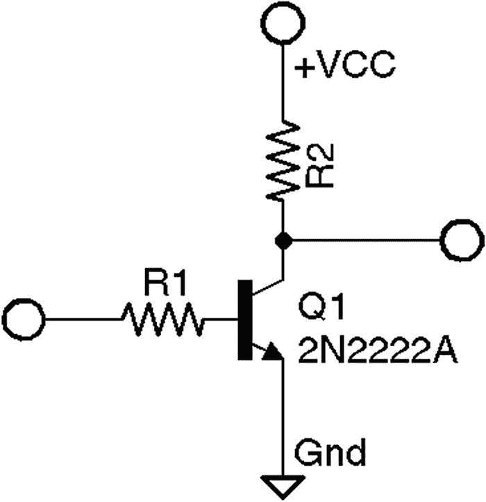
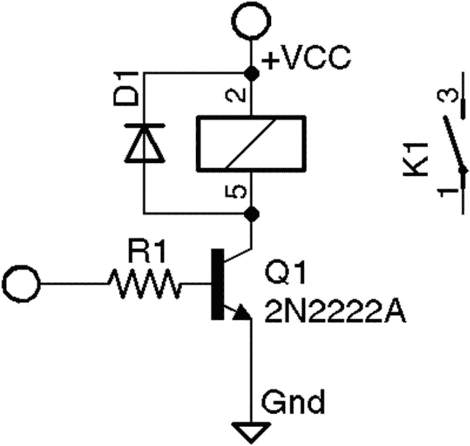

# 13.c 程序 GPIO

无论您的应用程序需要 GPIO 的快速访问还是专门访问，C/C++程序都是最方便的方法。Python 程序同样可以在模块的帮助下直接访问。

本章着眼于如何从程序内部直接访问 GPIO 端口，从使用`uevent`文件的未竟事业开始，在后台中断的帮助下检测输入 GPIO 的变化。

## 边缘事件

前一章介绍了 GPIO 驱动程序提供的`uevents`伪文件。那里解释说你需要使用一个系统调用`poll(2)`或`select(2)`来利用这个通知。这里我将说明`poll(2)`的用法，因为它是两者中首选的系统调用。

`poll(2)`背后的思想是提供一个开放文件描述符的结构化数组，并指出您感兴趣的事件。poll(2)使用的结构被定义为:

```sh
struct pollfd {
    int   fd;         /* file descriptor */
    short events;     /* requested events */
    short revents;    /* returned events */
};

```

打开的文件描述符被放入成员`fd`中，而感兴趣的事件被保存到成员`events`中。结构成员`revents`由系统调用填充，返回后可用。

在目录`~/RPi/evinput`中你会找到 C 程序源文件`evinput.c`。清单 [13-1](#PC2) 展示了执行`poll(2)`调用的部分。

```sh
0126: static int
0127: gpio_poll(int fd) {
0128:   struct pollfd polls[1];
0129:   char buf[32];
0130:   int rc, n;
0131:
0132:   polls[0].fd = fd;           /* /sys/class/gpio17/value */
0133:   polls[0].events = POLLPRI;  /* Events */
0134:
0135:   do  {
0136:       rc = poll(polls,1,-1);  /* Block */
0137:       if ( is_signaled )
0138:           return -1;          /* Exit if ^C received */
0139:   } while ( rc < 0 && errno == EINTR );
0140:
0141:   assert(rc > 0);
0142:
0143:   lseek(fd,0,SEEK_SET);
0144:   n = read(fd,buf,sizeof buf); /* Read value */
0145:   assert(n>0);
0146:   buf[n] = 0;
0147:
0148:   rc = sscanf(buf,"%d",&n);
0149:   assert(rc==1);
0150:   return n;                    /* Return value */
0151: }

Listing 13-1The gpio_poll() function, invoking the poll(2) system call

```

在这个程序中，我们只对一个 GPIO 感兴趣，所以数组用一个元素声明:

```sh
0128:   struct pollfd polls[1];

```

在调用 poll(2)之前，结构 polls[0]被初始化:

```sh
0132:   polls[0].fd = fd;          /* /sys/class/gpio17/value */
0133:   polls[0].events = POLLPRI; /* Events */

```

如果有第二个条目，那么 polls[1]也将被初始化。此后，可以调用系统调用:

```sh
0136:       rc = poll(polls,1,-1);  /* Block */

```

第一个参数提供第一个结构条目的地址(相当于`&polls[0]`)。第二个参数表明有多少条目适用于这个调用(只有一个)。最后一个参数是以毫秒为单位的超时参数，负值表示永远阻塞。

如果系统调用返回一个正值(`rc`)，这表明有多少结构条目返回了一个事件(在成员`revents`中)。当这种情况发生时，调用者必须扫描数组(`polls`)寻找任何返回的事件。理论上，程序应该测试:

```sh
if ( polls[0].revents & POLLPRI )

```

查看该文件描述符是否有活动。在这个程序中，我们不测试它，因为只提供了一个文件描述符(它是唯一可以返回活动的文件描述符)。但是如果你测试两个或者更多的 GPIOs，这个测试是必须的。

当 poll(2)的返回值为零时，这仅仅意味着超时已经发生。在这个程序中，没有使用超时，所以这不会发生。

如果返回值为-1，则系统调用因出错而返回。有一个特殊的错误代码，EINTR，稍后将会解释。

对于正常读取数据，要使用的事件宏名称是`POLLIN`。对于`uevent`伪文件，事件宏名为`POLLPRI`，表示有紧急数据需要读取。要读取的数据确实很紧急，因为当您读取`value`伪文件时，GPIO 端口的状态可能会改变。因此，如果你希望抓住上升的事件，不要惊讶你有时读回零。当这种情况发生时，在读取 GPIO 状态之前，上升事件已经来了又去。

### 输入错误

Unix 老手很快就掌握了 EINTR 错误代码。我们在这个循环中看到对它的引用:

```sh
0135:   do  {
0136:       rc = poll(polls,1,-1);  /* Block */
0137:       if ( is_signaled )
0138:           return -1;          /* Exit if ^C received */
0139:   } while ( rc < 0 && errno == EINTR );

```

`poll(2)`的问题是，当不可能超时时，没有办法响应信号(像终端 Control-C)。信号处理程序的功能有限，因为它是一个异步调用，例如，它可能会中断 malloc(3)调用。出于这个原因，`evinput.c`程序为 Control-C 指定了一个安全的中断处理程序。它只是将变量`is_signaled`设置为`1`。

```sh
0018: static int is_signaled = 0;   /* Exit program when signaled */
...
0156: static void
0157: sigint_handler(int signo) {
0158:   is_signaled = 1;            /* Signal to exit program */
0159: }

```

为了让程序注意到变量已经变为非零，内核返回`rc=-1`来指示错误，并设置`errno=EINTR`。代码 EINTR 仅仅意味着系统调用被*中断*，应该重试。在给出的代码中，第 137 行测试该变量是否被设置为非零。如果是，函数会立即返回。否则，第 139 行中的`while`循环保持第 136 行中重试的系统调用。

### 阅读事件

一旦确定有紧急数据需要读取，接下来需要执行两步操作。这是*不是*的`poll(2)`要求，而是伪文件`uevent`的驱动程序要求:

```sh
0143:   lseek(fd,0,SEEK_SET);
0144:   n = read(fd,buf,sizeof buf); /* Read value */
0145:   assert(n>0);
0146:   buf[n] = 0;
0147:
0148:   rc = sscanf(buf,"%d",&n);
0149:   assert(rc==1);
0150:   return n;                    /* Return value */

```

第 143 行在读取第 144 行中的文件描述符之前，有效地执行了一次*倒带*。这通知驱动程序使其事件数据可用于即将到来的读取。第 146 行只是将一个空字节放在读取数据的末尾，以便`sscanf(3)`可以使用它。因为我们期待文本形式的`0`或`1`，所以在第 148 行将其转换为整数值`n`，然后返回。

### 示范

要构建一个演示程序，请执行以下操作(如果需要强制重建，请执行“`make clobber`”):

```sh
$ make
gcc -c -Wall -O0 -g evinput.c -o evinput.o
gcc evinput.o -o evinput
sudo chown root ./evinput
sudo chmod u+s ./evinput

```

这个程序不需要你 sudo，因为它将`evinput`可执行文件设置为`setuid root`。在安全系统上，您可能想回顾一下。

要显示使用信息，使用`-h`选项:

```sh
$ ./evinput -h
Usage: ./evinput -g gpio [-f] [-r] [-b]
where:
       -f    detect rising edges
       -r    detect falling edges
       -b    detect both edges

Defaults are: -g17 -b

```

用`-g`选项指定想要输入的 GPIO(默认为 17)。默认情况下，程序采用`-b`选项来报告上升沿和下降沿。现在让我们试试这个:

```sh
$ ./evinput -g 17 -b
Monitoring for GPIO input changes:

GPIO 17 changed: 0
GPIO 17 changed: 1
GPIO 17 changed: 0
GPIO 17 changed: 1
GPIO 17 changed: 0
^C

```

示例会话显示了从零到一以及从零到一的一些变化。由于接触反弹和这些变化发生的速度，这不会总是如此干净。现在就用上升的变化试试:

```sh
$ ./evinput -g 17 -r
Monitoring for GPIO input changes:

GPIO 17 changed: 0
GPIO 17 changed: 1
GPIO 17 changed: 1
GPIO 17 changed: 1
GPIO 17 changed: 0
GPIO 17 changed: 1
^C

```

预期读取值是上升沿后的一个`1`。然而，请注意，一个零溜了进来，这提醒我们接触反弹和时间起了作用。这个程序显示的第一个值总是 GPIO 的初始状态。

### 多 GPIO

为了便于说明，`evinput.c`程序保持简单。但是边沿检测的有用性可能会让您一次将它应用于多个 GPIO 端口。`poll(2)`方法的美妙之处在于您的应用程序不会浪费 CPU 周期等待事件发生。相反，GPIO *中断*会在变化发生时通知内核，从而通知`uevent`驱动程序。当在伪文件上执行时，这将依次通知`poll(2)`。

为了将演示代码扩展到多个 GPIO，在将 GPIO 放入正确的配置中之后，首先需要打开多个`uevent`伪文件。然后您需要扩展数组`polls[]`来包含感兴趣的 GPIOs 的数量(第 128 行)。然后初始化每个条目，如第 132 和 133 行所示。

第 136 行中调用`poll(2)`的第二个参数需要匹配初始化数组元素的数量。如果您正在监控五个 GPIOs，那么参数二需要是值`5`。

在第 139 行结束的`do while`循环之后，您将需要扫描数组 polls【】，以确定哪些 GPIO 文件描述符报告了一个类似如下的事件:

```sh
for ( x=0; x<rc; ++x ) {
    if ( polls[x].revents & EPOLLPRI ) {
        // read polls[x].fd for GPIO value
    }
}

```

通过这种方式，您的应用程序可以非常有效地监控几个 GPIO 输入的变化。然而，你的代码必须能够处理接触反弹。一些 IC，如 PCF8574 I2C GPIO 扩展器，带有一个 *INT* 引脚，可以使用这种方法进行监控。

## 直接寄存器访问

出于性能或其他原因，用户模式程序有时需要直接访问 GPIO 寄存器。这需要 root 访问权限来控制用户访问，因为如果操作不当，可能会导致系统崩溃。崩溃是非常不可取的，因为它会导致文件丢失。

新的 Raspberry Pi 模型的引入增加了处理不同硬件平台的挑战。在最初的 Raspberry Pi 型和后来的 A 型中，外设寄存器有一个固定的硬件偏移。然而，这种情况已经改变，我们现在需要根据所涉及的硬件型号来计算正确的寄存器地址。

### 外围设备基址

为了访问 GPIO 外设寄存器，我们需要完成两件事:

1.  确定我们寄存器组的基址

2.  需要将物理内存映射到虚拟地址空间

鉴于 Raspberry Pis 现在在寄存器的物理位置上有所不同，我们需要确定外设基址。清单 [13-2](#PC15) 显示了如何打开和读取伪文件，以确定实际的基地址。

```sh
0315: uint32_t
0316: peripheral_base() {
0317:   static uint32_t pbase = 0;
0318:   int fd, rc;
0319:   unsigned char buf[8];
0320:
0321:   fd = open("/proc/device-tree/soc/ranges",O_RDONLY);
0322:   if ( fd >= 0 ) {
0323:       rc = read(fd,buf,sizeof buf);
0324:       assert(rc==sizeof buf);
0325:       close(fd);
0326:       pbase = buf[4] << 24 | buf[5] << 16 | buf[6] << 8 | buf[7] << 0;
0327:   } else  {
0328:       // Punt: Assume RPi2
0329:       pbase = BCM2708_PERI_BASE;
0330:   }
0331:
0332:   return pbase;
0333: }

Listing 13-2Determining the peripheral base address

```

基本步骤是:

1.  打开伪文件(第 321 行)。

2.  将前 8 个字节读入字符数组 buf(第 323 行)。

3.  一旦被读取，文件描述符可以被关闭(第 325 行)。

4.  把地址拼凑在 326 行。

5.  如果步骤 1 失败，采用宏`BCM2708_PERI_BASE (which is 0x3F00000).`的值

### 映射存储器

直接访问 GPIO 寄存器的下一步涉及到将物理内存映射到 C/C++程序的虚拟内存。清单 [13-3](#PC16) 展示了物理内存是如何映射的。

```sh
0274: void *
0275: mailbox_map(off_t offset,size_t bytes) {
0276:   int fd;
0277:
0278:   fd = open("/dev/mem",O_RDWR|O_SYNC);
0279:   if ( fd < 0 )
0280:       return 0;       // Failed (see errno)
0281:
0282:   void *map = (char *) mmap(
0283:       NULL,                   // Any address
0284:       bytes,                  // # of bytes
0285:       PROT_READ|PROT_WRITE,
0286:       MAP_SHARED,             // Shared
0287:       fd,                     // /dev/mem
0288:       offset
0289:   );
0290:
0291:   if ( (long)map == -1L ) {
0292:       int er = errno;     // Save errno
0293:       close(fd);
0294:       errno = er;         // Restore errno
0295:       return 0;
0296:   }
0297:
0298:   close(fd);
0299:   return map;
0300: }

Listing 13-3
Mapping physical memory

```

执行的基本步骤如下:

1.  通过打开`/dev/mem`访问第一个存储器，用于读取和写入(第 278 行)。此步骤需要 root 访问权限来保护系统的完整性。

2.  一旦文件被打开，`mmap(2)`系统调用被用来将它映射到调用者的虚拟内存中(第 282 到 289 行)。
    1.  调用的第一个参数为 NULL，指定任何虚拟内存地址都是可接受的。可以指定这个地址，但是如果内核认为它不可接受，调用就会失败。

    2.  第二个参数是该区域要映射的字节数。在我们的演示程序中，这被设置为内核的页面大小。它需要是页面大小的倍数。

    3.  第三个参数表示我们想要读取和写入映射内存。如果你只想查询寄存器，宏`PROT_WRITE`可以被删除。

    4.  第四个参数是`MAP_SHARED`允许我们的调用程序与系统中任何其他可能访问相同区域的进程共享。

    5.  第五个参数是我们打开的文件描述符。

    6.  最后一个参数是我们希望访问的物理内存的起始偏移量。

3.  如果`mmap(2)`调用由于任何原因失败，返回值将是一个长的负值。值`errno`将反映原因(第 291 到 296 行)。

4.  否则，该文件可以被关闭(行 298 ),因为存储器访问已经被授权。在 299 中返回虚拟存储器地址。

### 寄存器访问

一旦所需的存储器被*映射*，就可以直接访问外设寄存器。要计算给定寄存器的正确虚拟内存地址，可以像这样使用宏:

```sh
0040: #define GPIO_BASE_OFFSET  0x200000    // 0x7E20_0000

```

附加宏引用相对于基址偏移量的特定寄存器。例如，该宏向寄存器提供一个偏移量，允许设置 GPIO 位。

```sh
0052: #define GPIO_GPSET0   0x7E20001C

```

这些寄存器访问相当混乱。在示例`gp.c`程序中，下面的`gpio_read()`函数使用 set_gpio32()辅助函数来确定:

1.  寄存器地址(保存到`gpiolev`，第 232 行)。

2.  所需的位`shift`(保存到变量移位，第 227 行)。

3.  从需要访问的寄存器(`GPIO_GPLEV0`，第 232 行)。

该程序在`gpiolev`中提供计算出的字地址，并提供一个`shift`值用于参考特定位。清单 [13-4](#PC19) 展示了该程序的代码。

```sh
0225: int
0226: gpio_read(int gpio) {
0227:     int shift;
0228:
0229:     if ( gpio < 0 || gpio > 31 )
0230:         return EINVAL;
0231:
0232:     uint32_v *gpiolev = set_gpio32(gpio,&shift,GPIO_GPLEV0);
0233:
0234:     return !!(*gpiolev & (1<<shift));
0235: }

Listing 13-4C function, gpio_read() to read a GPIO input bit

```

然后，线 234 访问包含感兴趣的 GPIO 位的寄存器，并将其返回给调用者。

写访问是类似的，除了寄存器写入值(列表 [13-5](#PC20) )。

```sh
0241: int
0242: gpio_write(int gpio,int bit) {
0243:   int shift;
0244:
0245:   if ( gpio < 0 || gpio > 31 )
0246:       return EINVAL;
0247:
0248:   if ( bit ) {
0249:       uint32_v *gpiop = set_gpio32(gpio,&shift,GPIO_GPSET0);
0250:           *gpiop = 1u << shift;
0251:   } else  {
0252:       uint32_v *gpiop = set_gpio32(gpio,&shift,GPIO_GPCLR0);
0253:       *gpiop = 1u << shift;
0254:   }
0255:   return 0;
0256: }

Listing 13-5Writing GPIO registers

by writing to the register address

```

读和写的唯一区别。Pi 有不同的寄存器来设置 GPIO 位(第 249 行)和另一个寄存器来清除它们(第 252 行)。

## 演示程序

在~/RPi/gpio 中构建源代码(如果您希望强制完全重建，请执行“make clobber”):

```sh
$ make
gcc -c -Wall -O0 -g gp.c -o gp.o
gcc gp.o -o gp
sudo chown root ./gp
sudo chmod u+s ./gp

```

同样，这个程序使用 setuid root，这样您就不会被迫使用 sudo。应用`-h`选项，程序具有使用信息:

```sh
$ ./gp -h | expand -t 8
Usage: ./gp -g gpio { input_opts | output_opts | -a | drive_opts} [-v]
where:
        -g gpio GPIO number to operate on
        -A n    Set alternate function n
        -a      Query alt function
        -q      Query drive, slew and hysteresis
        -v      Verbose messages

Input options:
        -i n    Selects input mode, reading for n seconds
        -I      Input mode, but performing one read only
        -u      Selects pull-up resistor
        -d      Selects pull-down resistor
        -n      Selects no pull-up/down resistor

Output options:
        -o n    Write 0 or 1 to gpio output
        -b n    Blink for n seconds

Drive Options:
        -D n    Set drive level to 0-7
        -S      Enable slew rate limiting
        -H      Enable hysteresis

```

所有调用都需要指定`-g`选项来提供 GPIO 号进行操作。可以添加选项`-v`以提供额外的输出。

### GPIO 输入

以下示例会话将 GPIO 端口 17 配置为输入，并选择 60 秒的上拉高读数:

```sh
$ ./gp -g17 -i60
GPIO = 1
GPIO = 0
GPIO = 1
GPIO = 0
GPIO = 1
GPIO = 0
GPIO = 1
GPIO = 0

```

您的会话输出可能会显示一些接触反弹，所以不要期望所有的转换都是一个零一个地交替。

对于输入的一次性读取，使用`-I`代替:

```sh
$ ./gp -g17 -I
GPIO = 1

```

### GPIO 输出

要将 GPIO 配置为输出并向其写入值，请使用以下命令:

```sh
$ ./gp -g17 -o1 -v
gpio_peri_base = 3F000000
Wrote 1 to gpio 17
$ ./gp -g17 -o0 -v
gpio_peri_base = 3F000000
Wrote 0 to gpio 17

```

在此会话中，添加了 verbose 选项用于直观确认。

测试时有闪烁的输出是很有用的。使用-b 选项来完成此操作。该参数指定闪烁的秒数:

```sh
$ ./gp -g17 -b4 -v
gpio_peri_base = 3F000000
GPIO 17 -> 1
GPIO 17 -> 0
GPIO 17 -> 1
GPIO 17 -> 0

```

### 驱动、迟滞和压摆率

驱动、压摆率限制和迟滞选项均可通过`-D`和`-q`选项进行设置和查询。`-D`设定值和`-q`查询:

```sh
$ ./gp -g17 -D7, -S1 -H0 -q -v
gpio_peri_base = 3F000000
  Set Drive=7, slew=true, hysteresis=false
  Got Drive=7, slew=true, hysteresis=false

```

不使用 verbose 选项时，Set Drive 行被取消。-q 选项在 set 操作后执行，并报告更改后的配置。它只能用于查询:

```sh
$ ./gp -g17 -q
  Got Drive=7, slew=true, hysteresis=false

```

### 交替方式

也可以查询和设置 GPIO 的备用模式:

```sh
$ ./gp -g17 -a
GPIO 17 is in Output mode.

```

使用-A 选项设置备用模式:

```sh
$ ./gp -g17 -A5
$ ./gp -g17 -a
GPIO 17 is in ALT5 mode.

```

## 晶体管驱动器

在我们结束 GPIO 的话题之前，让我们回顾一下一个简单的晶体管驱动器，它可以用在一个完整的 ic 解决方案可能有些过头的情况下。Raspberry Pi 的 GPIO 引脚驱动电流的能力有限。即使配置为全驱动，它们也被限制为 16 mA。

您可能会发现，您只需要缓冲一个信号，而不是使用缓冲 IC。像 2N2222A 这样的廉价实用晶体管可能就是你所需要的。图 [13-1](#Fig1) 说明了该电路。



图 13-1

一种简单的双极晶体管驱动器

输入信号从电路左侧的 GPIO 输出端到达，流经电阻 R1，通过基极发射极结接地。R1 将该电流限制在安全值。电阻 R2 连接在 Q1 的集电极和电源之间，电源电压可能略高于+3.3 V，这是安全的，因为集电极基极结反向偏置。但是，注意不要超过集电极基极电压。

Q1 在 25°c 时可以处理的最大功率为 0.5 W。当晶体管导通(饱和)时，Q1 两端的电压(V <sub>CE</sub> )在 0.3 到 1 V 之间。电压的剩余部分在负载上产生。如果我们假设 V <sub>CE</sub> 的最坏情况为 1 V，我们可以计算出 Q1 的最大电流:


该计算电流超过数据手册中 I <sub>C</sub> =600 mA 的限值，因此我们现在改用 600 mA。假设我们只需要 100 mA，而不是绝对极限。

接下来，我们想知道在所选集电极电流下所用器件的最低适用 H <sub>FE</sub> 。基于 STMicroelectronic 数据表，估计最低的 H <sub>FE</sub> 在 100 mA 附近约为 50。这个值很重要，因为它影响需要多少基极电流驱动。


现在知道了驱动晶体管的最小基极电流，我们可以计算基极电阻 R1:


最接近 10%的电阻值为 1.2 千欧。

### 感性负载

当涉及更大的电流或电压时，驱动继电器线圈并不罕见。然而，感性负载的问题是，当磁场崩溃时，驱动电路中会感应出反向电压。这发生在线圈电流被移除时。必须特别注意抑制这种情况。图 [13-2](#Fig2) 显示了驱动继电器线圈的晶体管。继电器断开和闭合负载触点 K1。



图 13-2

由 Q1 驱动的感性负载

继电器线圈需要一个反向偏置二极管(D1 ),以泄放当电流从线圈(图中的引脚 5 和 2)移除时发生的任何反向冲击。这将具有减缓触点释放的效果。但是这优于导致系统崩溃的感应尖峰。

## 摘要

`gp.c`中提供的源代码完全是用 C 语言编写的，并保留了最基本的内容。它不仅演示了所涉及的直接寄存器访问步骤，还为您提供了可以在自己的 C/C++程序中重用的代码。

本章最后简要介绍了在需要驱动器时如何使用驱动晶体管。当更便宜的单晶体管解决方案可能就足够了时，人们往往会寻求 IC。