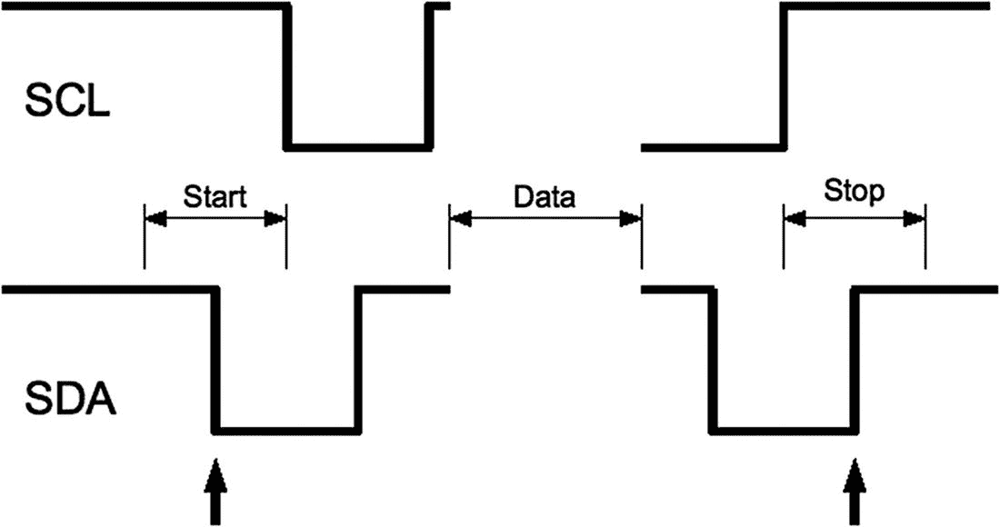
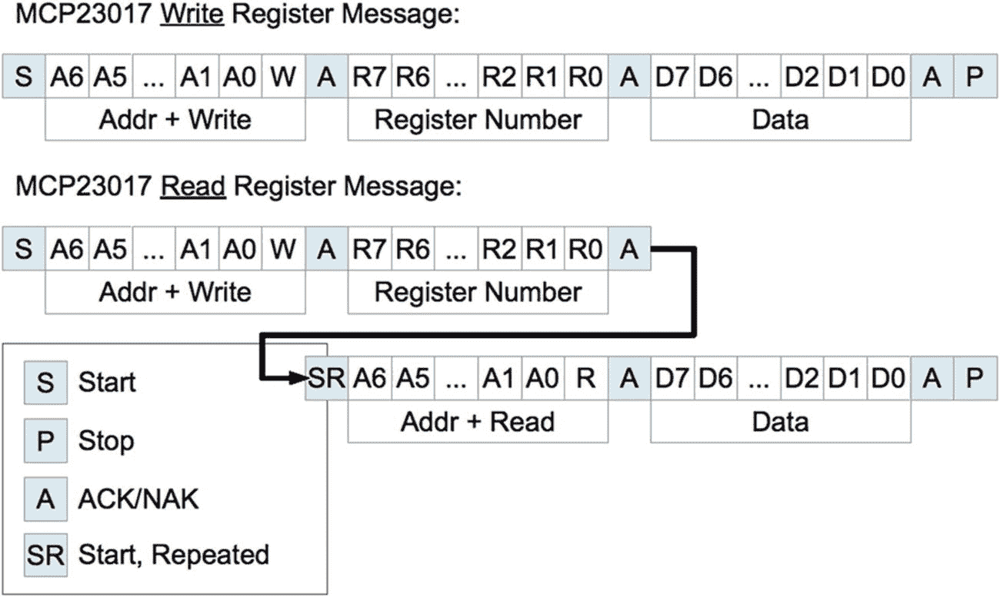
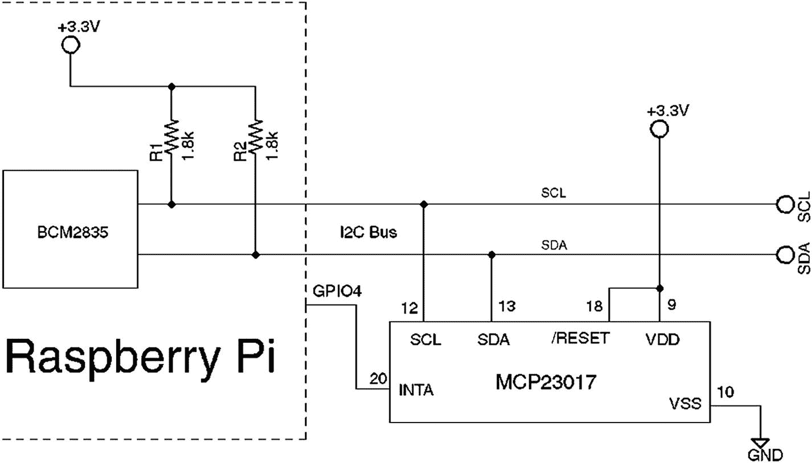

# 十五、I2C 总线

I <sup>2</sup> C 总线，也称为双线接口(TWI ),由 Philips 于 1982 年左右开发，用于与低速外设进行通信。 <sup>17</sup> 它也很经济，因为它只需要两根电线(不包括地线和电源)。从那以后，在这个框架的基础上，又设计出了其他标准，比如 SMBus。然而，最初的 I <sup>2</sup> C 总线作为一种简单、经济的外设连接方式仍然很受欢迎。

## I <sup>2</sup> C 概述

图 [15-1](#Fig1) 显示了树莓 Pi 环境中的 I <sup>2</sup> C 总线。Raspberry Pi 使用 BCM2835 器件作为总线主机来提供总线。注意，Pi 还提供外部上拉电阻*R*T6】1 和*R*T10】2，如虚线所示。表 [15-1](#Tab1) 列出了在顶条上提供的两条 I2C 总线。

表 15-1

I2C 公交线路

<colgroup><col class="tcol1 align-center"> <col class="tcol2 align-center"> <col class="tcol3 align-left"></colgroup> 
| 

关系

 | 

通用输入输出接口

 | 

描述

 |
| --- | --- | --- |
| P1-03 | GPIO-2 | SDA1(串行总线数据) |
| P1-05 | GPIO-3 | SCL1(串行总线时钟) |

I2C 总线的设计允许多个外设连接到 SDA 和 SCL 线。每个从外设都有自己唯一的 7 位地址。例如，MCP23017 GPIO 扩展器外设可能配置为地址 0x20。主机使用该地址引用每个外设。非寻址外设应该保持安静。


图 15-1

树莓派上的 I <sup>2</sup> C 总线

## 民主行动党和 SCL

主人和奴隶在不同的时间轮流“抢公共汽车”。主机和从机使用开漏晶体管来驱动总线。因为所有参与者都使用开漏驱动器，所以必须使用上拉电阻(由 Pi 提供)。否则，数据和时钟线会在切换之间浮动。

开漏驱动器设计允许所有参与者驱动总线线路，只是不能同时驱动。例如，从设备关闭其线路驱动器，让主设备驱动信号线。奴隶们只是听着，直到主人按地址叫他们。当从机需要应答时，从机将断言它的驱动程序，抢占线路。从机认为此时主机已经释放了总线。当从机完成自身的传输后，它会释放总线，让主机继续工作。

两条线路的空闲状态都为高。Raspberry Pi 的高电平状态为+3.3 V，其它系统可能使用+5 V 信号。购买 I <sup>2</sup> C 外设时，选择工作在 3.3 V 电平的外设。有时，通过仔细的信号规划或使用适配器，可以使用 5 V 外设。

## 总线信号

开始和停止位在 I <sup>2</sup> C 协议中是特殊的。起始位如图 [15-2](#Fig2) 所示。注意 SDA 线从高电平变为低电平，而时钟保持在高电平(空闲)状态。SDA 转换后 1/2 位时间后，时钟将变为低电平。这种特殊的信号组合通知所有连接的设备“监听”，因为下一条传输的信息将是设备地址。



图 15-2

I2C 启动/停止信号

停止位的特殊之处还在于，它允许从设备知道是否有更多信息到来。当 SDA 线在一个位单元的中途从低电平变为高电平时，它被解释为一个*停止位*。停止位表示消息结束。

还有一个*重复开始*的概念，在图中通常标记为 *SR* 。该信号在电学上与起始位相同，除了它出现在消息中代替停止位。这向外设发出信号，表明正在发送或需要更多数据作为另一个消息的一部分。

## 数据位

数据位时序大致如图 [15-3](#Fig3) 所示。在 SCL 线变为高电平之前，SDA 线应根据发送的数据位稳定在高电平或低电平。接收器在 SCL 的下降沿输入数据，并对下一个数据位重复该过程。请注意，最高有效位首先传输(网络顺序，或大端)。


图 15-3

I2C 数据位传输

## 消息格式

图 [15-4](#Fig4) 显示了可用于 MCP23017 芯片的两个 I2C 消息示例。最简单的消息是写寄存器请求。



图 15-4

I2C 消息示例

该图显示了以 S(开始)位开始并以 P(停止)位结束的每条消息。在起始位之后，每条消息以一个包含 7 位外设地址和一个读/写位的字节开始。每个外设都必须读取该字节，以确定该报文是否发给它。

地址发送后，被寻址的外设会返回一个 ACK/NAK 位。如果外设因任何原因未能响应，线路将因上拉电阻而变高，表示 NAK。主机在看到 NAK 后，将发送停止位并终止传输。

当被寻址的外设确认地址字节时，当请求是写操作时，主机继续写操作。第一个示例显示了接下来要写入的 MCP23017 8 位寄存器编号。这表示要写入外设的哪个寄存器。然后，外设将确认寄存器编号，允许主机将数据字节写入选定的寄存器。这也必须得到承认。如果主机没有更多的数据要发送，则发送 P(停止)位以结束传输。

图 [15-4](#Fig4) 中的第二个例子显示了一条消息如何由写消息和读消息组成。初始序列看起来像写操作，但这只是将一个寄存器号写入外设。一旦寄存器编号被确认，主机就会发送一个 SR(开始，重复)位。这告诉外设没有更多的写数据到达，并期待一个外设地址跟随其后。由于发送的地址指定了*相同的*外围设备，相同的外围设备以 ACK 响应。该请求是一个读请求，因此外设继续以所请求的 8 位读数据响应，主机应答。主机用 P (stop)终止消息，表示不再读取数据。

许多外设将支持*自动递增*寄存器模式。然而，这是外围设备的一个特征。并非所有设备都支持此功能。一旦通过写操作建立了外设的寄存器，就可以在自动递增模式下进行连续的读或写操作，每传输一个字节，寄存器就递增一次。这导致了高效的传输。

## I <sup>2</sup> C 总线速度

与 SPI 总线不同，I <sup>2</sup> C 总线在 Raspbian Linux 中以固定速度运行。SoC 文档声称 I <sup>2</sup> C 工作频率高达 400 kHz，但默认为 100 kHz。

要使用 I <sup>2</sup> C，您必须在您的`/boot/config.txt`文件中通过取消注释来启用它。您还可以通过指定`i2c_arm_baudrate`参数来指定时钟频率。以下使能 I <sup>2</sup> C 并将时钟设置为 400 kHz:

```sh
dtparam=i2c_arm=on,i2c_arm_baudrate=400000

```

默认时钟速率相当于:

```sh
dtparam=i2c_arm=on,i2c_arm_baudrate=100000

```

保存 config.txt 文件并重新启动。您可以按如下方式确认时钟速率被接受:

*   `xxd`命令将一组 4 字节(`-g4`)报告为 00061a80。

*   `gdb`命令用于以十进制打印(`p`命令)该值(不要忘记在报告的数字前加上前缀`0x`以表示该值是十六进制)。

```sh
# xxd -g4 /sys/class/i2c-adapter/i2c-1/of_node/clock-frequency
00000000: 00061a80                             ....
# gdb
GNU gdb (Raspbian 7.12-6) 7.12.0.20161007-git
Copyright (C) 2016 Free Software Foundation, Inc.
...
(gdb) p 0x00061a80
$1 = 400000
(gdb) quit
#

```

## I <sup>2</sup> C 工具

一些实用程序使得使用 I <sup>2</sup> C 外设变得更加容易。这些可能预装在您的 Raspbian Linux 中，但如果需要，也可以轻松安装。

```sh
$ sudo apt−get install i2c−tools

```

`i2c-tools`包包括以下实用程序:

*   `i2cdetect`:检测 I2C 线上的外围设备

*   `i2cdump`:从 I2C 外设转储值

*   `i2cset`:设置 I2C 寄存器和值

*   `i2cget`:获取 I2C 寄存器和值

这些实用程序中的每一个都有一个手册页来提供更多信息。

## MCP23017

MCP23S17 是 I2C 芯片，提供 16 个扩展 GPIO 端口。启动时，这些引脚默认为输入，但也可以像本地 Pi GPIO 端口一样配置为输出。MCP23S17 是 SPI 总线的配套芯片。

该芯片允许有线配置八个不同的 I2C 地址。与本机 Pi GPIOs 一样，端口可以配置为高电平有效或低电平有效。该芯片采用 1.8 至 5.5 V 电源供电，非常适合 Pi 3.3 V 工作电压。

输出模式 GPIO 可以吸电流高达 8 mA，源电流为 3 mA。驱动负载(甚至是 led)时，应考虑到这一点。

对于输入 GPIOs，它具有中断功能，可通过 INTA (GPIOA0 至 GPIOA7)或 INTB 引脚(GPIOB0 至 GPIOB7)发出输入变化信号。该芯片可以配置为报告 INTA 上的所有更改，这就是它在这里的使用方式。这对于输入非常重要，因为否则您将需要持续轮询设备。

也许最好的部分是它有一个内核驱动程序。这使得使用起来非常方便。

### 驱动程序设置

必须配置的第一件事是必须启用 I <sup>2</sup> C，如果你还没有这么做的话。`/boot/config.txt`文件必须有以下未注释的行:

```sh
dtparam=i2c_arm=on,i2c_arm_baudrate=100000

```

接下来，您必须在`config.txt`中启用驱动程序:

*   可选参数`gpiopin=4`指定 GPIO4 将用于检测芯片中的中断。GPIO4 是默认值。

*   可选参数`addr=0x20`指定 MCP23017 芯片的 I <sup>2</sup> C 地址。默认值为 0x20。

```sh
dtoverlay=mcp23017,gpiopin=4,addr=0x20

```

编辑这些更改后，重新启动:

```sh
# sync
# /sbin/shutdown -r now

```

Pi 重新启动后，使用`dmesg`命令登录并检查可疑的错误消息。如果你觉得幸运，你可以跳过这一步。

如果一切顺利，您应该在`/sys/class/gpio`目录中看到如下内容:

```sh
# ls /sys/class/gpio
export  gpiochip0  gpiochip128  gpiochip496  unexport

```

如果您使用 I2C 地址 0x20，并且您将 MCP23017 连接到总线，您应该会看到子目录名称`gpiochip496`(其他地址更高)。如果您没有看到列出的芯片，则:

*   仔细检查`dmesg`日志中的错误。

*   检查配置和接线。

*   确保 MCP23017 芯片的引脚连接到+3.3 V。

### 接线

图 [15-5](#Fig5) 显示了本例中使用的接线。关于该电路，有几点值得注意:



图 15-5

MCP23017 至 Raspberry Pi 的接线

*   从+3.3 V(不是 5 V)为 MCP23017 芯片供电。

*   总线不需要电阻，因为树莓 Pi 已经提供了 R <sub>1</sub> 和 R <sub>2</sub> 。

*   重要！将线连接到+3.3 V。否则会发生随机或完全故障。

*   如果您仅计划使用*输出*模式 GPIOs，则不需要布线 INTA 线。但是，无论是否使用，驱动程序都会消耗配置的 GPIO。

当线没有连接到+3.3 V 时，芯片的输入会浮动。有时 CMOS 输入会浮动在高电平，有时浮动在低电平(导致芯片复位)。我最初连接电路时碰到了这个。最糟糕的是，驱动程序和芯片工作了一段时间，但后来出现了问题。

INTA 线(以及图 [15-5](#Fig5) 中的 GPIO4)的目的是通知 Pi 输入 GPIO 端口已经改变状态。这通知 mcp23017 驱动器发送 I <sup>2</sup> C 请求来读取输入。如果没有这个通知，驱动程序将不得不忙于 I <sup>2</sup> C 总线，重复读取请求以查看是否有新的输入。

### 测试 GPIO 输出

连接好电路，设置好配置，重新启动系统后，如果您使用 0x20 的 I <sup>2</sup> C 地址，您应该会看到驱动程序在`/sys/class/gpio`中以`gpiochip496`的形式报告其存在。

按照第 [12 章](12.html)中访问本地 GPIO 的相同方式，我们可以导出该 GPIO。但是首先我们需要确定每个 MCP23017 GPIO 端口对应哪个 GPIO 号。为此有两个伪文件:

1.  gpiochip496/base 列出了该设备的起始 GPIO 号(496)。

2.  gpiochip496/ngpio 列出了支持的 gpio 数量(16)。

下面显示了一个发现会话示例:

```sh
# cd /sys/class/gpio
# ls
export    gpio503  gpiochip0  gpiochip128  gpiochip496  unexport
# ls gpiochip496
base  device  label  ngpio  power  subsystem  uevent
# cat gpiochip496/base
496
# cat gpiochip496/ngpio
16
#

```

该信息允许在表 [15-2](#Tab2) 中创建图表。

表 15-2

Gpiochip496 (I <sup>2</sup> C 地址 0x20)的 GPIO 关联

<colgroup><col class="tcol1 align-center"> <col class="tcol2 align-center"> <col class="tcol3 align-center"> <col class="tcol4 align-center"> <col class="tcol5 align-center"> <col class="tcol6 align-center"></colgroup> 
| 

通用输入输出接口

 | 

别针

 | 

MCP23017

 | 

通用输入输出接口

 | 

别针

 | 

MCP23017

 |
| --- | --- | --- | --- | --- | --- |
| GPIO496 | Twenty-one | A0 | GPIO504 | one | B0 |
| GPIO497 | Twenty-two | 一流的 | GPIO505 | Two | B1 |
| GPIO498 | Twenty-three | 主动脉第二声 | GPIO506 | three | B2 |
| GPIO499 | Twenty-four | A3 号 | GPIO507 | four | B3 |
| GPIO500 | Twenty-five | A4 号 | GPIO508 | five | B4 |
| GPIO501 | Twenty-six | A5 号 | GPIO509 | six | B5 |
| GPIO502 | Twenty-seven | A6 | GPIO510 | seven | B6 |
| GPIO503 | Twenty-eight | A7 | GPIO511 | eight | B7 |

要将 MCP23017 GPIO A7 用作输出，我们需要:

```sh
# pwd
/sys/class/gpio
# echo out >gpio503/direction
# cat gpio503/direction
out
# echo 1 >gpio503/value
# cat gpio503/value
1

```

如果在高电平有效配置中有一个 LED 连接到 A7，它应该会亮起。否则，用数字式万用表测量，你应该在针脚 28 上看到+3.3 V。

```sh
# echo 0 >gpio503/value
# cat gpio503/value
0

```

完成上述操作后，GPIO A7 现在应该会变低。

### 测试 GPIO 输入

在 GPIO A7 仍配置为输出的情况下，将 MCP23017 GPIO A6 配置为输入:

```sh
# ls
export    gpio503  gpiochip0  gpiochip128  gpiochip496  unexport
# echo 502 >export
# ls
export    gpio502  gpio503  gpiochip0  gpiochip128  gpiochip496  unexport
# echo in >gpio502/direction

```

在 A7(针脚 28)和 A6(针脚 27)之间连接一根跨接导线。现在让我们看看输入 A6 是否与输出 A7 一致:

```sh
# cat gpio502/value
0
# cat gpio503/value
0
# cat gpio502/value
0
# echo 1 >gpio503/value
# cat gpio502/value
1

```

不出所料，当我们更改 A7 时，输入 A6 随之而来。

### 测试 GPIO 输入中断

仅仅能够读取一个 GPIO 通常是不够的。我们需要知道*何时*发生了变化，以便可以在那个时间点读取。在图 [15-5](#Fig5) 中，MCP23017 芯片的 INTA 引脚连接到 Pi 的 GPIO4。MCP23017 将在输入发生未读变化时激活该线路，在 Pi 中提醒驾驶员。只有这样，驱动程序才需要读取芯片的当前输入状态。

为了测试这是否可行，我们将重用 evinput 程序来监控 gpio502 (GPIO 输入 A6):

```sh
$ cd ~/RPi/evinput
$ ./evinput -g502 -b

```

转到根终端会话，让我们切换 A7 几次:

```sh
# pwd
/sys/class/gpio
# ls
export    gpio502  gpio503  gpiochip0  gpiochip128  gpiochip496  unexport
# echo 1 >gpio503/value
# echo 0 >gpio503/value
# echo 1 >gpio503/value
# echo 0 >gpio503/value

```

切换回 evinput 会话，查看是否有边沿(- `b`选项监控上升沿和下降沿):

```sh
$ ./evinput -g502 -b
Monitoring for GPIO input changes:

GPIO 502 changed: 1
GPIO 502 changed: 0
GPIO 502 changed: 1
GPIO 502 changed: 0
^C

```

事实上，这证实了中断设施的工作。注意，我们监控的是 GPIO502 (A6)而不是 GPIO4。只有驱动程序需要监控 GPIO4。

### 限制

MCP23017 的驱动程序支持为您的 Raspberry Pi 添加 16 个 GPIOs 提供了一种非常方便的方式。尽管这很好，但仍有几点需要考虑:

*   扩展 gpio 没有原生 Pi GPIOs 快。

*   添加多个 MCP23017 芯片可能需要做一些功课。虽然总线支持多达八个唯一寻址的 MCP23017 芯片，但设备驱动程序可能不支持。通过向设备树添加节点，这是可能的。

*   I/O 性能与 I <sup>2</sup> C 时钟速率直接相关。

*   GPIOs 是通过 sysfs 伪文件系统访问的，这进一步影响了性能。

需要记住的主要一点是，所有 GPIO 交互都以时钟速率(100 kHz 或 400 kHz)通过 I <sup>2</sup> C 总线进行。每个 I/O 可能需要几个字节的传输，因为 MCP23017 有一大组寄存器。传输每个字节都需要时间。默认为 100 kHz 时，一个字节的传输需要:


读取一个 GPIO 输入寄存器需要一个起始位、三个字节的数据和一个停止位。这导致最小处理时间为 260 μs。这将 GPIO 读取次数限制在大约 3，800 次读取/秒。这还不包括与其它器件共享总线的情况。

最后，适用性取决于应用。通过将速率最高的 GPIO 事务转移到 Pi 的本机 GPIO，并将较慢的 I/o 转移到扩展 GPIO，您可能会发现这种安排非常有效。

## I2c API

本节将介绍用于 I <sup>2</sup> C 总线事务的裸机 C 语言 API。使用该 API，您可以使用另一个 GPIO 扩展器(如 PCF8574)编写自己的接口。该芯片提供了 8 个额外的 GPIOs，但经济实惠且+3.3 V 友好。它只有一个配置寄存器，易于直接使用。

### 内核模块支持

通过使用内核模块来提供对 I2C 总线的访问。如果您已经在 config.txt 中启用了 I2C，您应该能够列出总线控制器:

```sh
# i2cdetect -l
i2c-1 i2c        bcm2835 I2C adapter             I2C adapter

```

对驱动程序的访问由以下节点提供:

```sh
# ls -l /dev/i2c*
crw-rw---- 1 root i2c 89, 1 Jul  7 16:23 /dev/i2c-1

```

### 头文件

以下头文件应包含在 I <sup>2</sup> C 程序中:

```sh
#include <sys/ioctl.h>
#include <linux/i2c.h>
#include <linux/i2c−dev.h>

```

### 打开(2)

使用 I <sup>2</sup> C 设备很像使用文件。你打开一个文件描述符，用它做一些 I/O 操作，然后关闭它。一个区别是使用了`ioctl(2)`调用，而不是通常的`read(2)`和`write(2)`。

```sh
#include <sys/types.h>
#include <sys/stat.h>
#include <fcntl.h>

int open(const char *pathname,int flags,mode_t mode);

```

在哪里

<colgroup><col class="tcol1 align-left"> <col class="tcol2 align-left"></colgroup> 
| 

错误

 | 

描述

 |
| --- | --- |
| 电子会议 | 不允许访问该文件。 |
| 这是一次很好的尝试。 | 路径名指向可访问的地址空间之外。 |
| 电磁场 | 进程已经打开了最大数量的文件。 |
| 最后一个 | 已达到系统对打开文件总数的限制。 |
| 伊诺梅 | 可用的内核内存不足。 |

*   `pathname`是您需要打开/创建的文件/目录/驱动程序的名称。

*   `flags`是可选标志的列表(使用`O_RDWR`进行读写)。

*   `mode`是创建文件的权限位(省略参数，或在不创建时提供零)。

*   返回`-1`(错误代码在`errno`中)或打开文件描述符> =0。

要使用 I <sup>2</sup> C 总线控制器，您的应用必须打开设备节点上的驱动程序:

```sh
int fd;

fd = open("/dev/i2c−1",O_RDWR);
if ( fd < 0 ) {
    perror("Opening /dev/i2c−1");

```

注意，设备节点`(/dev/i2c-1`由 root 所有，所以您需要提升权限来打开它或者让您的程序使用`setuid(2)`。

### ioctl(2，FUNC I2C)

在 I <sup>2</sup> C 代码中，通常会执行一个检查来确保驱动程序有正确的支持。`I2C_FUNC ioctl(2)`调用允许调用程序查询 I <sup>2</sup> C 能力。返回的能力标志记录在表 [15-3](#Tab3) 中。

表 15-3

I2C_FUNC 位

<colgroup><col class="tcol1 align-left"> <col class="tcol2 align-left"></colgroup> 
| 

位屏蔽

 | 

描述

 |
| --- | --- |
| I2C FUNC I2C | 支持普通 I2C(非 SMBus) |
| FUNC I2C ADDR 10 比特 | 支持 10 位地址 |
| FUNC I2C 协议芒林 | *支持:* |
|   | I2C _ M _ 忽略 _NAK |
|   | ADDR I2C 机场 |
|   | -= ytet-伊甸园字幕组=-翻译 |
|   | I2C_M_NO_RD_ACK |

```sh
long funcs;
int rc;

rc = ioctl(fd,I2C_FUNCS,&funcs);
if ( rc < 0 ) {
    perror("ioctl(2,I2C_FUNCS)");
    abort();
}

/* Check that we have plain I2C support */
assert(funcs & I2C_FUNC_I2C);

```

用于检查至少普通 I2C 支持存在的宏。否则，程序中止。

### ioctl(2，I2C_RDWR)

虽然可以使用`ioctl(2,I2C_SLAVE)`然后使用`read(2)`和`write(2)`调用，但这不太实际。因此，系统调用`ioctl(2,I2C_RDWR)`的使用将被提升。这个系统调用允许在执行复杂的 I/O 事务时有相当大的灵活性。

任何`ioctl(2)`调用的通用 API 如下:

```sh
#include <sys/ioctl.h>

int ioctl(int fd,int request,argp);

```

在哪里

<colgroup><col class="tcol1 align-left"> <col class="tcol2 align-left"></colgroup> 
| 

错误

 | 

描述

 |
| --- | --- |
| ebadf(消歧义) | fd 不是有效的描述符。 |
| 这是一次很好的尝试。 | argp 引用了不可访问的内存区域。 |
| 埃因瓦尔 | 请求或 argp 无效。 |

*   `fd`是打开的文件描述符。

*   `request`是要执行的 I/O 命令。

*   `argp`是与命令相关的参数(类型根据`request`而变化)。

*   返回`-1`(`errno`中的错误代码)，完成的消息数(当`request = I2C_RDWR`时)。

当`request`参数作为`I2C_RDWR`提供时，`argp`参数是指向`struct i2c_rdwr_ioctl_data`的指针。这个结构指向一个消息列表，并指出涉及到多少条消息。

```sh
struct i2c_rdwr_ioctl_data {
    struct i2c_msg   *msgs;   /* ptr to array of simple messages */
    int              nmsgs;   /* number of messages to exchange */
};

```

前述结构引用的单个 I/O 消息由`struct i2c_msg`描述:

```sh
struct i2c_msg {
    __u16     addr;   /* 7/10 bit slave address */
    __u16     flags;  /* Read/Write & options */
    __u16     len;    /* No. of bytes in buf */
    __u8     *buf;    /* Data buffer */
};

```

该结构的成员如下:

表 15-4

I2C 能力标志

<colgroup><col class="tcol1 align-left"> <col class="tcol2 align-left"></colgroup> 
| 

旗

 | 

描述

 |
| --- | --- |
| I2C _ 十点 | 使用 10 位从机地址 |
| I2C 月日 | 读入缓冲区 |
| -= ytet-伊甸园字幕组=-翻译 | 抑制(重新)开始位 |
| ADDR I2C 机场 | 反相读/写位 |
| I2C _ M _ 忽略 _NAK | 将 NAK 视为 ACK |
| I2C_M_NO_RD_ACK | 读取不会有 ACK |
| I2C 大学 | 缓冲区可以容纳 32 个额外的字节 |

*   `addr`:通常这是 7 位从地址，除非标志`I2C_M_TEN`和功能

*   `I2C_FUNC_10BIT_ADDR`都用上了。必须为每条消息提供。

*   `flags`:有效标志列在表 [15-4](#Tab4) 中。标志`I2C_M_RD`表示该操作是读操作。否则，当该标志不存在时，假设写操作。

*   `buf`:用于读/写该报文组件的 I/O 缓冲区。

*   `len`:该报文组件中要读/写的字节数。

实际的`ioctl(2,I2C_RDWR)`调用将编码如下。本例中，MCP23017 *寄存器*地址 0x15 被写入外设地址 0x20，随后读取 1 个字节:

```sh
int fd;
struct i2c_rdwr_ioctl_data msgset;
struct i2c_msg iomsgs[2];
static unsigned char reg_addr[] = {0x15};
unsigned char rbuf[1];
int rc;

iomsgs[0].addr   = 0x20;            /* MCP23017−A */
iomsgs[0].flags  = 0;               /* Write operation. */
iomsgs[0].buf    = reg_addr;
iomsgs[0].len    = 1;

iomsgs[1].addr   = iomsgs[0].addr;  /* Same MCP23017-A */
iomsgs[1].flags  = I2C_M_RD;        /* Read operation */
iomsgs[1].buf    = rbuf;
iomsgs[1].len    = 1;

msgset.msgs      = iomsgs;
msgset.nmsgs     = 2;

rc = ioctl(fd,I2C_RDWR,&msgset);
if ( rc < 0 ) {
    perror("ioctl (2, I2C_RDWR)");

```

所示示例将`iomsgs[0]`定义为 1 个字节的写入，包含一个寄存器号。条目`iomsgs[1]`描述了从外设读取 1 个字节。这两条消息在一个`ioctl(2)`事务中执行。`iomsgs[x]`中的 flags 成员决定操作是读(`I2C_M_RD`)还是写(0)。

### 注意

不要混淆外围设备的内部寄存器号和外围设备的 I2C 地址。

每个`iomsgs[x].addr`成员必须包含一个有效的 I <sup>2</sup> C 外设地址。每个消息可能寻址不同的外设。第一条消息失败时，`ioctl(2)`将返回一个错误。因此，您可能不希望在一次`ioctl(2)`通话中包含多条信息，尤其是在涉及不同设备的时候。

成功时，返回值是成功执行的`struct i2c_msg`消息的数量。

## 摘要

从这一章中，你看到了在你的 Pi 中增加 16 个 GPIOs 可以通过增加一个芯片和一点连线来实现。考虑到附加板的成本，这可以大大节省您的项目。有了 MCP23017 的驱动程序支持，使用这些扩展 GPIOs 就像使用本地端口一样简单。

对于希望通过 I <sup>2</sup> C 直接与他的设备交互的开发人员来说，C API 就是这样做的。不管是通过驱动程序还是直接通过 C API，没有一个 PI 开发者想要访问 GPIO 端口。