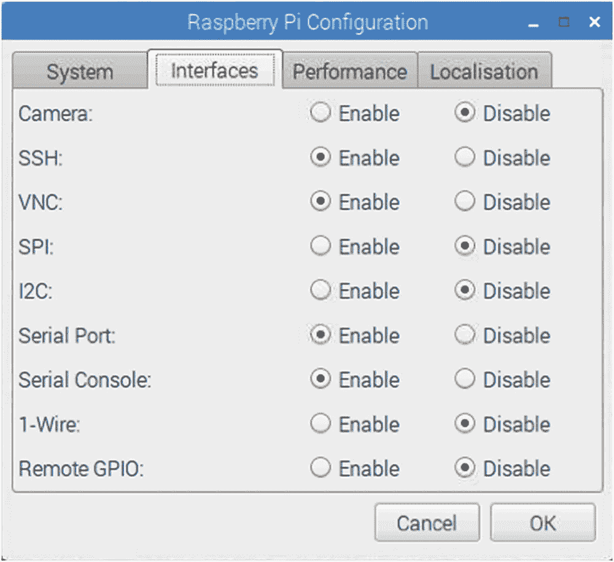
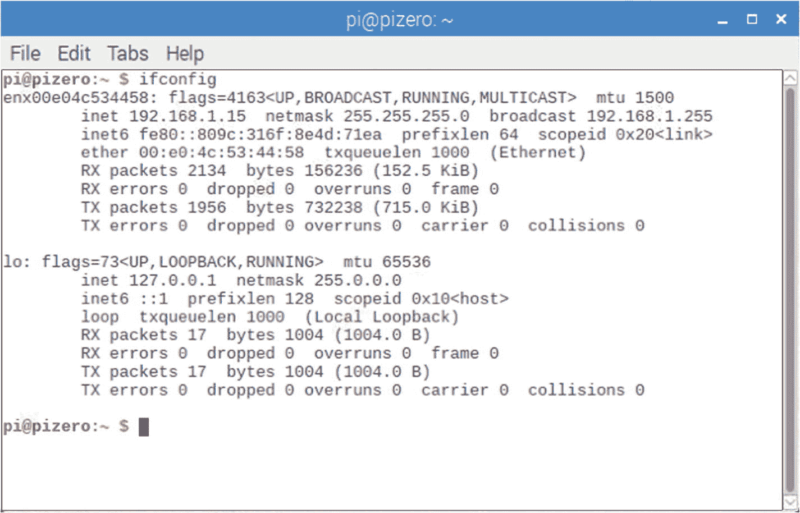

# 十九、Linux 控制台和 Pi Zero

Raspbian Linux 控制台是由内核命令行在引导时配置的。不过，在我们研究串行控制台访问之前，让我们先了解一下设置 Pi Zero 或 Zero W 的挑战，主要挑战是使用单个 USB 端口和正确的适配器。然后，我们将研究串行设备控制台的选项。

## Pi 零/零 W

启动 Pi 零点是一个问题，主要有两个原因:

1.  ssh 访问在新的 Raspbian 映像上被禁用。

2.  只有一个 USB 端口可以连接键盘和鼠标。

为了看到你在做什么，你需要一个迷你 HDMI 转 HDMI 适配器。

ssh 在默认情况下被禁用的原因是 Pi 的映像附带了一个默认的`Pi`帐户密码。每个人都知道，尤其是黑客。不知情的用户可以启动一个 Pi 并让它连接到网络，从而吸引各种讨厌的业务。所以 Raspbian 映像禁用了 ssh。

你真正需要的是一个由 Raspbian 支持的 USB 集线器。我尝试了一个旧的苹果集线器，运气不好。所以我换了一个最近的。一些键盘提供一两个额外的 USB 端口。如果 Raspbian Linux 支持的话，这可能是有用的。

如果你有耐心的话，你可能根本不需要网络中心。打开 Zero 电源，仅将鼠标插入 USB 适配器电缆。然后将鼠标移至您的系统偏好。当你需要输入东西的时候，你可以拔掉鼠标，插上键盘。对于大部分初始配置，您可能不需要键盘。

### 需要适配器

以下是你手头应该有的适配器列表，即使你只使用它们一次来设置你的 Zero。图 19-1 举例说明。


图 19-1

配有迷你 HDMI 适配器、USB 适配器电缆和可选 USB 以太网适配器的 Pi Zero 照片

*   电源适配器(黑色插头插入右边的零点)。

*   USB 2.0 Micro B 5 针至母 USB 2.0 A 型适配器电缆(中间为白色电缆)。

*   HDMI 迷你适配器(Pi 左侧的白色适配器)。

*   可选的 USB 转以太网适配器(最右侧，白色)。

如果您在本章后面使用串行端口控制台，您可以不用 USB 和 mini HDMI 适配器。

### 启用 ssh 和 VNC 访问

如果你有一个支持的 USB 到以太网适配器，然后连接你的 HDMI，键盘，和/或鼠标，启动 Raspbian Linux。我的 USB 以太网适配器只消耗大约 42 毫安。如果在没有集线器的情况下操作，请单独插入鼠标。一旦你有了图形化的桌面，用鼠标打开 Raspberry Pi 配置。单击接口选项卡，然后单击以下条目以启用它们:

*   启用 SSH

*   启用 VNC

*   可选地启用串行端口(默认情况下启用)

*   可选地启用串行控制台(默认情况下启用)

不要忘记点击右下角的 OK。然后仍然使用你的鼠标，点击重启来应用这些新的设置。图 19-2 显示了所涉及的控制面板。



图 19-2

Raspberry Pi 配置，接口面板

一旦您的 Zero 重新启动，您应该能够:

1.  拔下鼠标(如果不使用集线器)。

2.  插入 USB 转以太网适配器。

3.  将以太网电缆插入路由器。

4.  扫描您的网络以发现分配的 IP 地址。

如果您使用集线器，请使用键盘和鼠标打开终端窗口，并键入`ifconfig`命令来确定分配的地址。图 19-3 中的例子显示地址为`192.168.1.15`。



图 19-3

使用 ifconfig 命令在终端窗口中显示您的 USB 转以太网地址

否则，从桌面扫描您的 Pi Zero。以下示例在 Mac/Linux 上扫描 192.168.1.2 到 192.168.1.254 之间的地址:

```sh
$ nmap -sP 192.168.1.2-254

Starting Nmap 7.40 ( https://nmap.org ) at 2018-07-12 20:04 EDT
Nmap scan report for 192.168.1.3
Host is up (0.077s latency).
...
Nmap scan report for 192.168.1.15
Host is up (0.0017s latency).
...
Nmap done: 253 IP addresses (6 hosts up) scanned in 2.86 seconds
$ ssh pi@192.168.1.15
pi@192.168.1.15's password:
Linux pizero 4.14.52+ #1123 Wed Jun 27 17:05:32 BST 2018 armv6l
...

```

在这个例子中，我知道 Pi 将被分配一个 192.168.1。*地址，因为以太网电缆插入了路由器。我通过实验发现圆周率零点的地址是 192.168.1.15。

## 串行控制台

如果鼠标和 HDMI 方法不合适，可能是因为您缺少适配器，您可以尝试串行控制台方法。Raspbian Linux 映像默认启用串行控制台。它使用 115200 波特的波特率，没有硬件流量控制。

然而，使用工作在 3.3 V 电平的串行适配器是至关重要的。不要使用 5 V 串行适配器，因为它们会损坏 Pi。通过跳线配置，一些适配器可以在任一级别上运行。

连接适配器，以便 Pi +3.3 V (P1-01)为串行适配器供电(一些 USB 适配器自己供电)。这些联系总结如下:

*   Pi +3.3 V (P1-01)电源至适配器+3.3 V(可标为 V <sub>CC</sub> )。

*   Pi 接地(P1-06)到适配器接地(通常标记为 Gnd)。

*   Pi TX (P1-08)至适配器 TX。

*   Pi RX (P1-10)到适配器 RX。

### 警告

不要连接 5 伏 TTL 串行适配器。这可能会造成损坏。一些适配器有一个跳线来选择 3.3 或 5 伏操作。

如果你发现这样不行，试着把 TX 接到 RX，RX 接到 TX。一些适配器可能是根据 DCE(数据通信设备)的观点来标记的，而另一些适配器将使用 DTE(数据终端设备)的惯例。

连接后，将您的 USB 适配器插入您的桌面，启动`minicom`(或其他喜爱的终端程序)，并将您的串行参数设置为:

*   155200 波特

*   8 位，无奇偶校验，1 个停止位(8-N-1)

*   硬件流量控制关闭

启动你的圆周率零点，让它出现。留出额外的时间，尤其是当桌面即将打开时。一旦它出现，请按 Enter 键以显示登录提示。然后，您可以像往常一样登录:

```sh
Welcome to minicom 2.7

OPTIONS:
Compiled on Sep 17 2016, 05:53:15.
Port /dev/cu.usbserial-A100MX3L, 20:52:57

Press Meta-Z for help on special keys

Raspbian GNU/Linux 9 pizero ttyAMA0
pizero login: pi
Password:
Last login

: ...

```

## 摘要

当您缺少所有其他设备:键盘、鼠标和屏幕时，串行端口控制台非常有用。这通常是为您的特殊项目初始化 Pi Zero 或 Pi Zero W 所需的全部内容。

患者用户只需一根 USB 适配器电缆和一个迷你 HDMI 适配器进行初始设置即可。键盘和鼠标可以根据需要更换。一旦 ssh 或 VNC 启用，您就可以在您最喜欢的桌面上舒适地操作了。