# 20.交叉编译

嵌入式计算机经常缺乏开发和编译软件的必要资源。Raspberry Pi 在这方面比较特别，因为它已经包含了`gcc`编译器和所需的链接工具(在 Raspbian Linux 下)。但是，虽然可以在 Raspberry Pi 上开发和构建代码，但它可能并不总是最适合软件开发的地方。一个原因是 SD 卡的性能较低，而 Pi Zero 或 Zero W 在这方面可能表现不佳。

要为 Raspberry Pi 编译*本机*代码，您需要一个知道如何生成 ARM 二进制可执行文件的编译器和链接器。然而，它必须运行在不同架构的主机上(例如，Mac OS X)。因此它被称为*交叉*编译器。交叉编译器将获取本地(编译)平台上的源代码，并生成 ARM 二进制可执行文件，安装在目标 Pi 上。

在这一章中，你将逐步了解如何构建你自己的交叉编译器。这将允许您使用现有的 Linux 平台完成工作。

## 术语

让我们先来看看本章中用到的一些术语:

*   *build* :也叫*本地*平台，这是你执行编译的平台(比如 Mac OS X)。

*   *target* :目的平台，本章为 Raspberry Pi (ARM)。

在你冒险之前，让我们先考虑一些交叉编译的问题。交叉编译有两个主要的问题领域:

*   Raspberry Pi (ARM)的所有 C/C++包含文件和库必须在您的构建平台上可用(例如，在构建内核时)。

*   交叉编译器和相关工具必须生成适合目标平台的代码。

在您决定要构建一个交叉编译器环境之前，您准备好了吗

*   提供 ARM 平台所有匹配的 C/C++头文件？

*   提供所有需要的 ARM 库，包括您打算链接的 sqlite3 等第三方产品的库？

*   为交叉编译器和工具提供足够的磁盘空间？

crosstool-NG 软件将缓解其中一些问题。例如，通过本章后面显示的配置步骤选择正确的 Linux 头文件。

磁盘空间通过在构建平台上保存 Raspberry Pi 根文件系统的副本来解决许多问题。简单的程序不需要这样做(例如，Hello World 程序)。但是链接到库的软件可能需要这样做。即使磁盘空间有限，您也可以在构建平台上安装 Raspbian SD 卡，从而访问 Raspberry Pi 的根文件系统。

## 操作系统

用于构建交叉编译器环境的过程有些复杂和脆弱。使用 crosstool-NG 软件大大简化了事情。尽管有这个优势，最好还是坚持使用经过验证的交叉编译器平台和配置。

你可能会说，“源代码是开放的，所以它应该可以在任何操作系统上工作。”(你甚至可以说，“我会自己解决问题。”)现实并非如此简单。除非你愿意花时间在互联网论坛上等待答案，否则我建议你采取一种更务实的方法——在最近稳定的 Ubuntu 或 Debian/Devuan 环境上构建你的交叉编译环境。

本章使用了最近安装的 Devuan，它是基于捐赠给实验室的旧 32 位计算机的 Debian。你可以在 Mac OS X MacBook Pro 上使用 VirtualBox 4.3.12 ( [`www.virtualbox.org`](https://www.virtualbox.org) )，如果你愿意，也可以运行英特尔 i7 处理器。推荐使用当前版本的 Debian 或 Devuan Linux。

## 宿主、来宾、构建和目标

在这一点上，一个简短的说明是合适的，因为这些术语可能会变得混乱，尤其是第一次。让我们列出环境术语，这些术语将在本章的剩余部分提到:

*   *主机*环境

*   *客人*环境

*   *构建/本地*环境

*   *目标*环境

这么多环境！当你使用像 VirtualBox 这样的虚拟机时，术语*主机*和*客户*环境就会出现。VirtualBox 被用来在你正在使用的操作系统之上*托管*另一个操作系统。例如，您可能在笔记本电脑上运行 Mac OS X。在这个例子中，OS X 环境*在 VirtualBox 中托管了* Linux 实例。该 Linux 操作系统因此被称为*客户*操作系统。

术语*构建*(或*本地*)环境指的是执行交叉编译器和工具的 Linux 环境。这些 Linux 工具为*目标*环境(Raspberry Pi 的 ARM CPU)产生或操作代码。

### 平台限制

今天，许多人都在使用 64 位平台，如配备英特尔 i7 处理器或类似处理器的 MacBook Pro。如果您想为 Raspberry Pi(32 位平台)构建一个交叉编译器，这可能会带来一个问题。32 位交叉编译器必须建立在 32 位处理器上。

另一个可能让一些人感到困惑的项目是 Raspberry Pi 3 型号 B+，它运行 64 位处理器。虽然它是一个 64 位处理器，但 Raspbian Linux 的当前版本是以 32 位模式运行的。在 64 位 Linux 可用之前，您需要 32 位工具。其他 Linux 发行版，如 SUSE SLES，将支持原生 64 位 Linux，但你可能会遇到固件 blobs 等其他挑战。此问题在论坛中提出，并添加了以下回复:

> 回复:我们能得到 64 位操作系统吗？

> *2017 年 12 月 23 日星期六下午 3:30*

> 不，没有。他们不想分割操作系统，所以他们必须支持两种不同的操作系统，一种仅用于 PI3，另一种用于所有旧的 PI，这让许多困惑的用户抱怨 64 位操作系统无法在他们的旧 PI 上工作。

> 此外，转换到 64 位 CPU 几乎没有带来任何东西，比如说速度没有提高多少。

如果您使用的是 64 位平台，那么您可能希望选择 VirtualBox 解决方案或使用较旧的 Linux 32 位服务器。这为您提供了一个 32 位操作系统来托管交叉编译器。另一方面，如果您已经在运行 32 位操作系统，那么创建原生交叉编译器应该是轻而易举的事情。

### 注意

您需要在 32 位平台上运行交叉编译器。交叉编译器不能在 64 位平台上构建。

### 不带 VirtualBox(本机)

如果您已经在使用 Debian、Devuan 或 Ubuntu 等 Linux 开发环境，术语 *host* 相当于构建(或本地)环境。主机和客户环境同样是等价的，尽管在这个场景中说没有客户操作系统可能更正确。这个更简单的场景只留给我们两种环境:

*   *主机/客户/构建*:运行交叉编译工具的本地环境

*   *目标*:目标执行环境(Raspberry Pi)

### 使用 VirtualBox (Debian/Linux)

如果您没有合适的 Linux 环境，可以在您现有的平台上托管一个。您可以使用从以下网站下载的 VirtualBox 从 Windows、Mac OS X、Solaris 或其他 Linux 发行版托管 Linux:

[T2`www.virtualbox.org`](https://www.virtualbox.org)

使用 VirtualBox 时，*主机*环境是运行 VirtualBox 的环境(例如，Mac OS X)。*客户*操作系统将会像 Debian 一样有点 Linux 的味道。这样我们总共有三种环境:

*   *主机*:或者本机，运行 VirtualBox(例如 Windows)

*   *Guest/build*:VirtualBox 内的 Debian/Ubuntu 开发环境

*   *目标*:目标执行环境(你的 Raspberry Pi)

## 规划您的交叉开发环境

此时主要考虑的通常是磁盘空间。如果您使用的是 VirtualBox，有限的内存可能是另一个因素。如果您使用的是 Linux 或 Mac OS X，请检查您装载的磁盘的可用空间(或 Windows 工具，视情况而定):

```sh
$ df -k
Filesystem     1K-blocks      Used  Available Use% Mounted on
/dev/sda1      151903380  15768740  128395300  11% /
udev               10240         0      10240   0% /dev
tmpfs             181080       388     180692   1% /run
tmpfs               5120         4       5116   1% /run/lock
tmpfs             727920         0     727920   0% /run/shm

```

在前面的输出示例中，我们看到根文件系统有足够的空间。但是您的文件系统可能会有所不同。必要时可以使用符号链接将更大的磁盘区域移植到您的主目录中。

如果您正在使用 VirtualBox，请为 Linux 操作系统和交叉编译器环境创建具有足够空间的虚拟磁盘。您可能希望将您的 Linux 软件放在一个最小大小约为 10 GB 的虚拟磁盘上(允许它变得更大)。

为您的交叉编译器环境留出至少 10 GB 的空间(并允许其增长)。您还必须考虑为 Raspberry Linux 内核、其包含文件和所有其他可能需要构建的第三方库(更好的是，Raspberry Pi 根文件系统的副本)提供额外的空间。

在您的开发 Linux 构建环境中，确保您的交叉编译器和构建区域正在使用具有可用空间的磁盘区域。很容易在某个方便的地方创建一个目录，然后发现您认为要使用的空间不可用。

## 构建交叉编译器

此时，我将假设您已经在 VirtualBox 中设置并安装了 Linux，如果有必要的话，或者使用 32 位 Linux 的一个实例。我将使用基于 Debian 的 Devuan Linux。

### 下载 crosstool-NG

已发布的 crosstool-NG 下载可在以下网址找到:

[T2`http://crosstool-ng.org`](http://crosstool-ng.org)

从网站上找到最新下载的链接。在撰写本文时，以下内容是最新的:

```sh
$ wget http://crosstool-ng.org/download/crosstool-ng/crosstool-ng-1.23.0.tar.bz2

```

### 暂存目录

我将假设您已经用符号链接到您的具有足够可用磁盘空间的磁盘区域。本章将使用~/xrpi 作为交叉编译器的平台。

```sh
$ mkdir ~/xrpi
$ cd ~/xrpi

```

接下来，我将假设您已经创建了一个指向您的磁盘空间区域的符号链接，或者如果当前目录已经有了空间，则只是创建了一个子目录:

```sh
$ symlink /some/big/area/of/disk ~/xrpi/devel

```

但是如果~/xrpi 已经有足够的空间，那么只需执行以下操作:

```sh
$ mkdir ~/xrpi/devel

```

为了方便起见，我们现在转到该目录:

```sh
$ cd ~/xrpi/devel

```

在目录`~/xrpi/devel`中，创建一个名为`staging` ( `~/devel/staging`)的子目录，并将其更改为:

```sh
$ mkdir ./staging
$ cd ./staging          # Dir is ~/xrpi/devel/staging

$ pwd
/home/myuserid/xrpi/devel/staging
$

```

### 打开包装

假设 tarball `crosstool-ng-1.23.0.tar.bz2`被下载到您的主目录，您将执行以下操作(如果后缀不是`.bz2`，则更改选项`j`):

```sh
$ tar xjvf ~/crosstool-ng-1.23.0.tar.bz2
. . .
$

```

解包完成后，在您的`staging`目录中应该有一个名为`crosstoolng-1.23.0`的子目录。

### 创建/选择/x 工具

如果愿意，您可以选择不同的位置，但是为了便于参考，我将假设 crosstool-NG 软件将安装到`/opt/x-tools`中。我们还假设您的用户 ID 是`fred`(替换您自己的 ID)。

```sh
$ sudo mkdir -p /opt/x−tools
$ sudo chown fred /opt/x−tools

```

或者，安装完成后，您可以将所有权改回`root`进行保护。

### 安装软件包依赖项

crosstool-NG 构建依赖于您的 Linux 发行版作为可选安装软件提供的几个包。现在至少要安装以下软件:

```sh
# apt-get install bison
# apt-get install flex
# apt-get install libtool
# apt-get install texinfo
# apt-get install gawk
# apt-get install gperf
# apt-get install automake
# apt-get install subversion
# apt-get install help2man

```

如果在配置 crosstools-ng 的过程中，您发现您需要其他软件包，那么可以安装它们，然后重新配置。

### 配置交叉工具-NG

安装了软件包依赖项后，您现在就可以制作 crosstool-NG 软件了(根据本章剩余部分的需要替换 crosstool-ng 版本):

```sh
$ cd ~/xrpi/devel/staging/crosstool-ng-1.23.0
$ ./configure --prefix=/opt/x-tools

```

如果完成后没有出现错误，您就可以构建和安装软件了。如果它报告您缺少软件包依赖项，请立即安装并重复。

### 补丁 inputbox.c

我对一些现代 Linux 和工具非常恼火的一点是，它们不能很好地支持 *backspac* e 字符(Control-H)。这是一个标准的 ASCII 字符，专门用于此目的。为什么被放逐了？我会尽量克制自己，不再对此大吼大叫。

`crosstool-ng`所使用的菜单程序遭遇了与 linux 内核`menuconfig`相同的问题:没有退格字符(Control-H)支持。这可能会让你陷入无法退格或删除输入的糟糕境地。

要解决该问题，请执行以下操作:

1.  CD ~/xrpi/devel/staging/cross tool-ng-1 . 23 . 0/kconfig/LX dialog

2.  编辑文件`inputbox.c`并转到大约第 128 行，在那里您应该看到一行文字:

    ```sh
    case KEY_BACKSPACE:

    ```

3.  在它下面加一行简单的文字:

    ```sh
    case 8:

    ```

4.  保存文件(`inputbox.c`)。

如果您已经知道退格键发送的是转义序列而不是 Control-H，那么您可以安全地跳过这一更改。否则，这种事情会让你发疯。随着文件的保存，一些理智的表象将随之而来。

### 制作十字工具

此时，构建 crosstool-NG 应该没有问题(包括上面的修复)。执行以下`make`命令:

```sh
$ cd ~/devel/staging/crosstool-ng-1.23.0
$ make
  SED    'ct-ng'
  SED    'scripts/scripts.mk'
  SED    'scripts/crosstool-NG.sh'
  SED    'scripts/saveSample.sh'
  SED    'scripts/showConfig.sh'
  GEN    'config/configure.in'
  GEN    'paths.mk'
  GEN    'paths.sh'
  DEP    'nconf.gui.dep'
  DEP    'nconf.dep'
  DEP    'lxdialog/yesno.dep'
  DEP    'lxdialog/util.dep'
  DEP    'lxdialog/textbox.dep'
  DEP    'lxdialog/menubox.dep'
  DEP    'lxdialog/inputbox.dep'
  DEP    'lxdialog/checklist.dep'
  DEP    'mconf.dep'
  DEP    'conf.dep'
  BISON  'zconf.tab.c'
  GPERF  'zconf.hash.c'
  LEX    'zconf.lex.c'
  DEP    'zconf.tab.dep'
  CC     'zconf.tab.o'
  CC     'conf.o'
  LD     'conf'
  CC     'lxdialog/checklist.o'
  CC     'lxdialog/inputbox.o'
  CC     'lxdialog/menubox.o'
  CC     'lxdialog/textbox.o'
  CC     'lxdialog/util.o'
  CC     'lxdialog/yesno.o'
  CC     'mconf.o'
  LD     'mconf'
  CC     'nconf.o'
  CC     'nconf.gui.o'
  LD     'nconf'
  SED    'docs/ct-ng.1'
  GZIP   'docs/ct-ng.1.gz'
$

```

这需要很少的时间，似乎没有麻烦。

### 制作安装

crosstool-NG 包编译完成后，就可以安装到`/opt/x-tools`中了。来自同一目录:

```sh
$ sudo make install
  GEN    'config/configure.in'
  GEN    'paths.mk'
  GEN    'paths.sh'
  MKDIR   '/opt/x-tools/bin/'
  INST    'ct-ng'
  MKDIR   '/opt/x-tools/lib/crosstool-ng-1.23.0/'
  INSTDIR 'config/'
  INSTDIR 'contrib/'
  INSTDIR 'patches/'
  INSTDIR 'scripts/'
  INST    'steps.mk'
  INST    'paths'
  INSTDIR 'samples/'
  INST    'kconfig/'
  MKDIR   '/opt/x-tools/share/doc/crosstool-ng/crosstool-ng-1.23.0/'
  INST    'docs/manual/*.md'
  MKDIR   '/opt/x-tools/share/man/man1/'
  INST    'ct-ng.1.gz'

For auto-completion, do not forget to install 'ct-ng.comp' into
your bash completion directory (usually /etc/bash_completion.d)

```

如果您仍然拥有前面的目录`/opt/x-tools`(回想一下`sudo chown fred /opt/x` - `tools`)，您就不需要在前面的步骤中使用`sudo`。执行完`make install`后，您将在目录`/opt/x-tools/bin`中安装 crosstool-NG 命令`ct-ng`。

### 小路

要使用新安装的`ct-ng`命令，您需要调整您的`PATH`环境变量(以及每次登录时):

```sh
$ PATH="/opt/x-tools/bin:$PATH"

```

该网站还指出，如果您的平台已经定义了环境变量`LD_LIBRARY_PATH`，您可能必须取消设置该变量。如果是这样，则按如下方式取消设置，以避免任何不必要的麻烦:

```sh
$ unset LD_LIBRARY_PATH

```

现在，您应该能够运行`ct-ng`来获取版本信息(注意，在下面的命令中，`version`前面没有连字符)。查看版本输出可以确认您的`ct-ng`命令已经安装并且运行正常:

```sh
$ ct-ng version
This is crosstool-NG version crosstool-ng-1.23.0

Copyright (C) 2008  Yann E. MORIN <yann.morin.1998@free.fr>
This is free software; see the source for copying conditions.
There is NO warranty; not even for MERCHANTABILITY or FITNESS FOR A \
  PARTICULAR PURPOSE

.

```

## 交叉编译器配置

命令`ct-ng`简化了配置和构建交叉编译器工具链的必要工作。从这里开始，我们关心的是构建交叉编译器工具本身。当这个过程完成时，您已经将交叉编译器工具填充到了目录`/opt/x-tools/arm-unknown-linux-gnueabi`中。

在`ct-ng`可以构建您的交叉编译器之前，必须首先配置它:

```sh
$ cd ~/xrpi/devel/staging
$ ct-ng menuconfig

```

如果收到“未找到命令”的错误信息，请检查`PATH`变量是否设置正确。

### 路径和杂项选项

当 ct-ng 命令启动时，出现如图 [20-1](#Fig1) 所示的菜单配置画面。按 Enter 键打开路径和杂项选项子菜单。

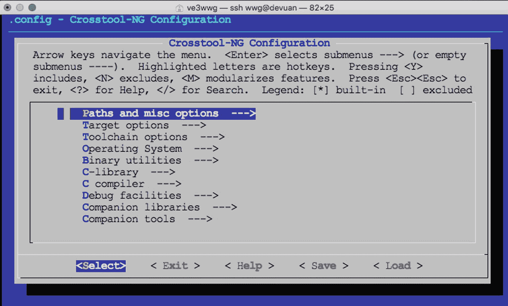

图 20-1

ct-ng 菜单配置打开对话框

一旦进入路径和杂项选项菜单，如图 [20-2](#Fig2) 所示，使用光标键向下移动，尝试标记为实验的功能。突出显示该行后，按空格键将星号放在方括号内以选择该选项(再次按空格键将切换设置)。


图 20-2

ct-ng 启用“尝试标记为实验性的功能”(按空格键)

之后，在同一个菜单中，将光标向下移动到标有前缀目录的中间条目，并按回车键选择它(图 [20-3](#Fig3) )。不幸的是，最近的默认设置阻止你在菜单选项的最右边看到“前缀目录”文本。

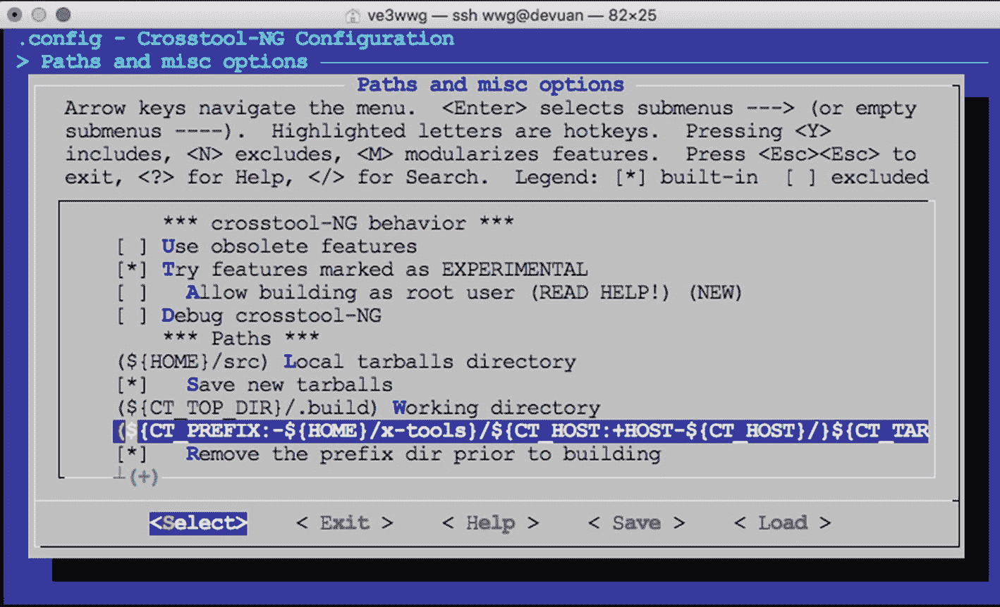

图 20-3

选择 CT_PREFIX 行以设置前缀

对于本章中使用的过程，请将路径修改为以下内容:

```sh
/opt/x-tools/${CT_TARGET}

```

图 [20-4](#Fig4) 显示了输入对话框。如果您发现无法使用退格键，请应用“修补 inputbox.c”一节中讨论的修复方法。


图 20-4

设置前缀目录

建立路径名后，在显示的“OK”按钮上按 Enter 键。这将使您返回到路径和杂项选项菜单。

然后选择底部显示的退出按钮，并再次按 Enter 键。如果您更改了任何需要保存的内容，则选择“是”(图 [20-5](#Fig5) )。


图 20-5

“保存配置”对话框

### 目标选项

重新启动菜单，用光标选择目标选项，按回车键打开菜单(图 [20-6](#Fig6) )。

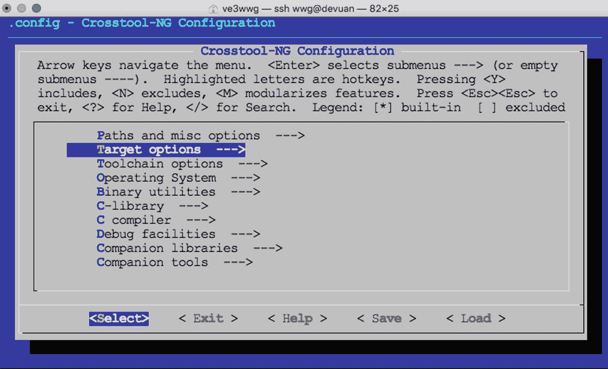

图 20-6

选择目标选项

然后选择目标架构并按回车键(图 [20-7](#Fig7) )。

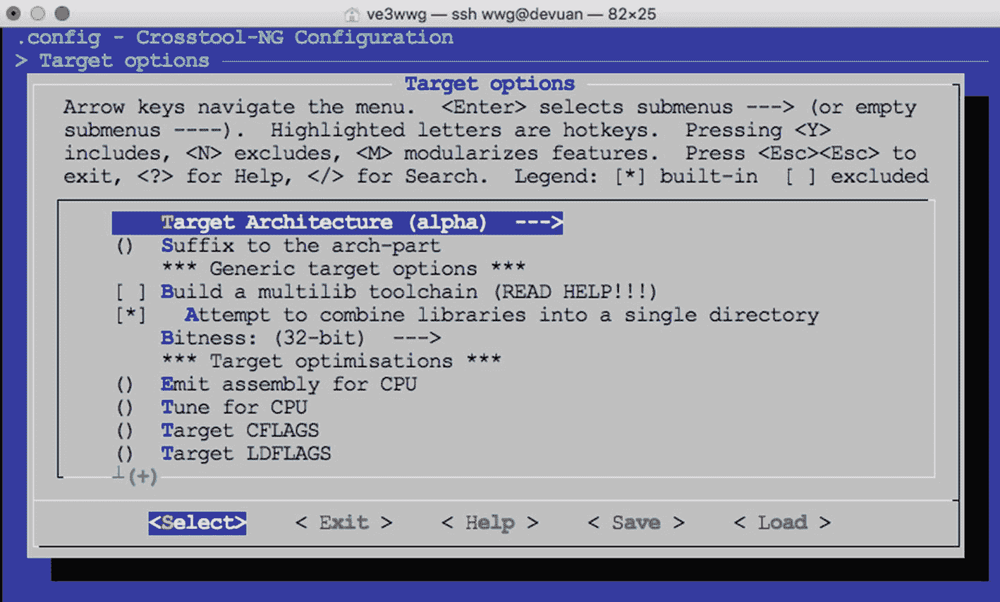

图 20-7

选择目标架构

在菜单中，选择`arm`并按空格键(图 [20-8](#Fig8) )。然后使用底部的选择按钮。这将使您返回目标选项菜单。

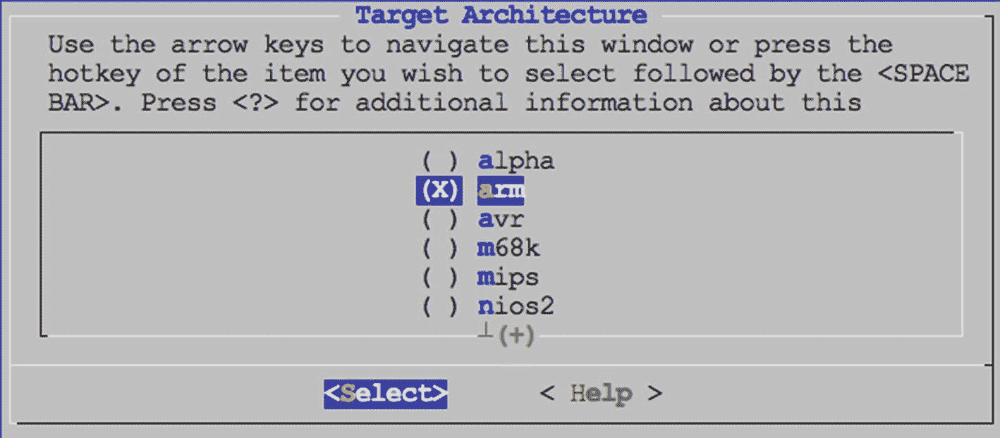

图 20-8

选择 arm 架构

在目标选项菜单中(如下所示)，通过查看圆括号中的状态来验证字节序设置。它应该读小端(图 [20-9](#Fig9) )。如果没有，进入那个菜单，把它改成*小端*。Endianness 菜单项下面是 Bitness 选项。它应该已经显示为 32 位。如果没有，那就换一个。

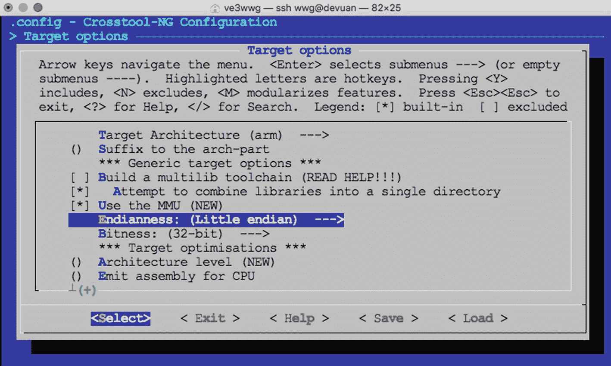

图 20-9

检查字节序和字节序

最后，用 exit 按钮退出这个子菜单。

### 操作系统

再次进入主菜单(图 [20-10](#Fig10) ，选择操作系统，然后选择目标 OS(裸机)，如图 [20-11](#Fig11) 所示。

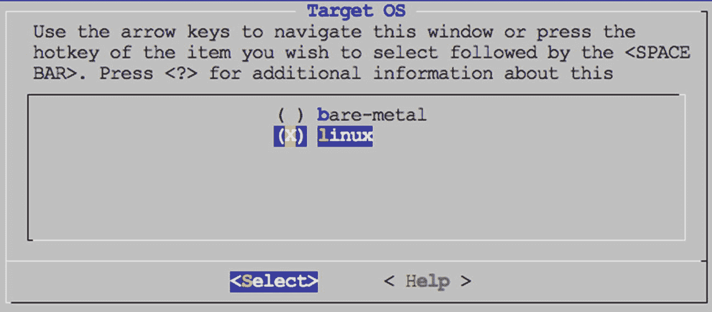

图 20-12

选择 Linux(不是裸机)

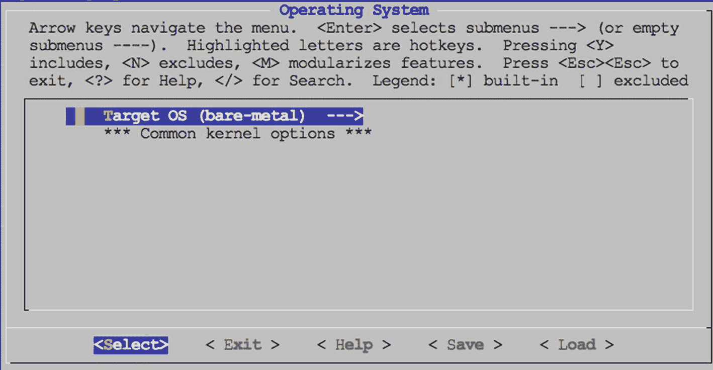

图 20-11

选择目标操作系统(裸机)

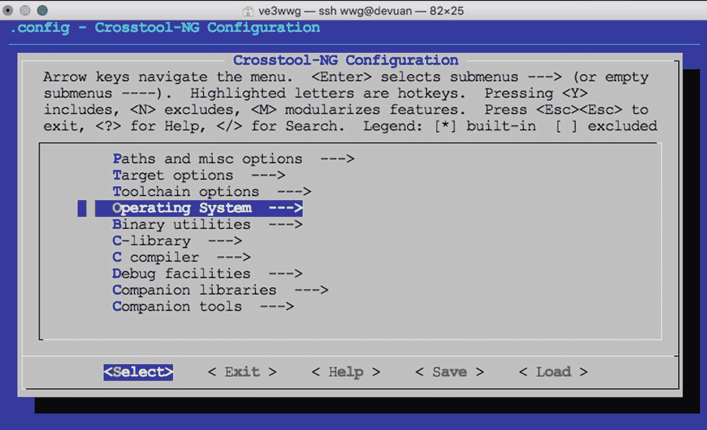

图 20-10

选择操作系统

在图 [20-12](#Fig12) 中选择“linux”后，退出并返回主菜单。

### 二元实用程序

在主菜单上，打开二进制实用程序菜单(图 [20-13](#Fig13) )。

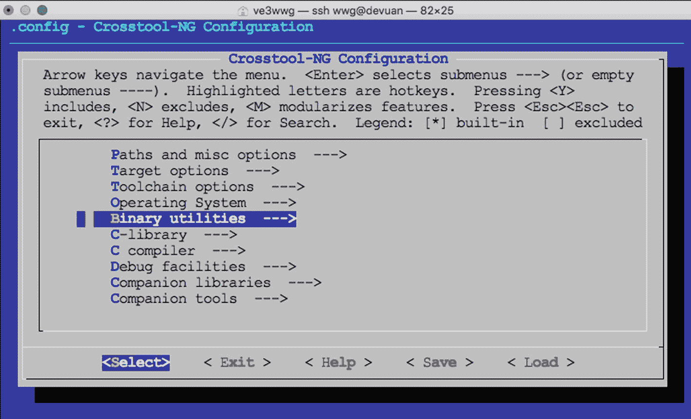

图 20-13

二进制实用程序菜单

光标向下移动到 Binutils 版本并打开它(图 [20-14](#Fig14) )。

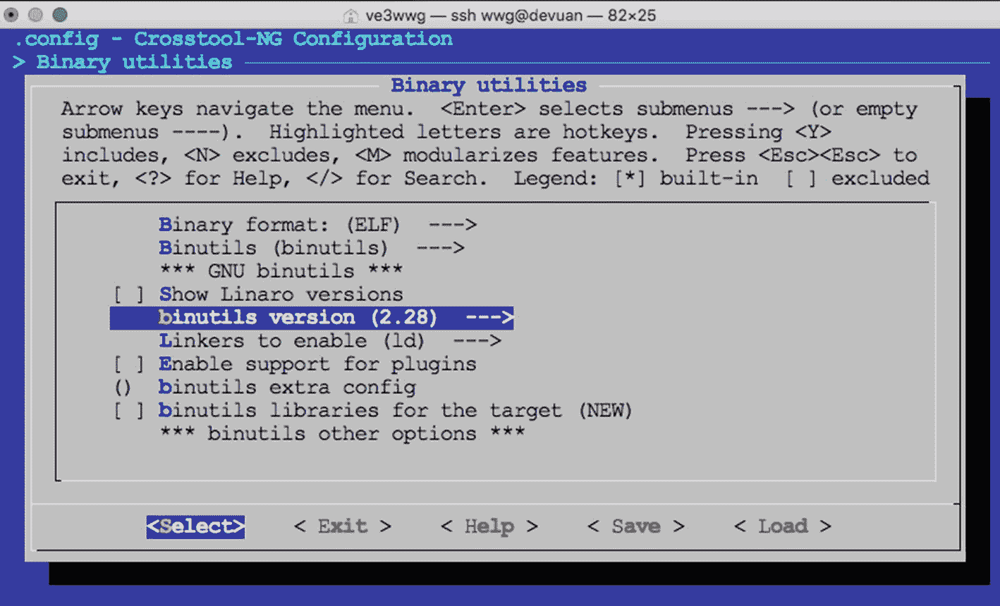

图 20-14

binutils 版本菜单

一旦进入最终的 binutils 版本选择菜单，选择最新的版本，除非您在之前的构建尝试中遇到了麻烦(图 [20-15](#Fig15) )。


图 20-15

选择 binutils 版本(通常是最新的)

退出回到主菜单。

### c 编译器

在主菜单上，打开 C 编译器子菜单(图 [20-16](#Fig16) )。

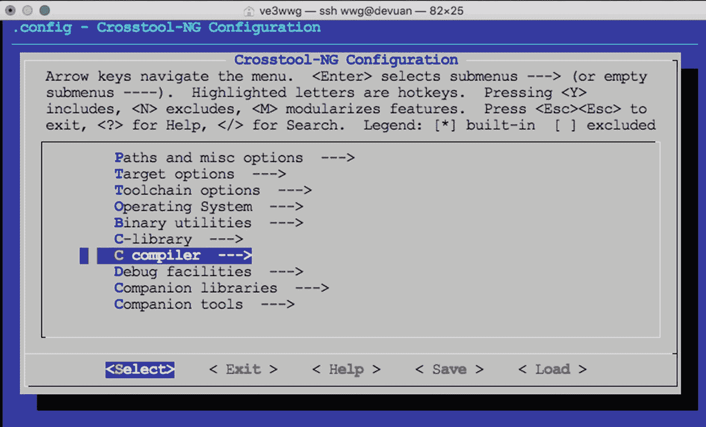

图 20-16

主菜单的 C 编译器子菜单

这里建议您启用显示 Linaro 版本选项(图 [20-17](#Fig17) )。


图 20-17

启用“显示 Linaro 版本”

启用后，您可以选择 Gcc 版本子菜单(图 [20-18](#Fig18) )。

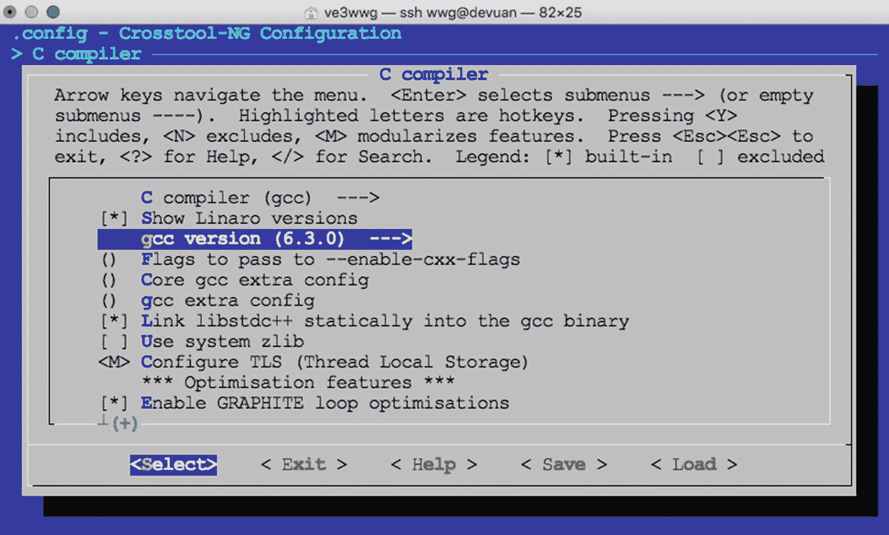

图 20-18

选择菜单“gcc 版本”

图 [20-19](#Fig19) 显示了选择的 Linaro 编译器的最新版本。


图 20-19

选择最新的 linaro 编译器

然后再次选择退出以返回主菜单。

### 保存配置

除非您有理由更改其他内容，否则请再次退出菜单，以显示保存提示:


选择`Yes`后，命令在保存配置后退出。此时，值得一提的是，您可能希望将您的配置保存在当前目录之外的某个位置。配置保存在名为`.config`的文件中，可以复制到其他地方进行备份:

```sh
$ cp .config ~/ct-ng.config.bak

```

如果使用`ct-ng distclean`，将文件保存在当前目录之外将防止意外丢失。

## 构建交叉编译器

检查`/opt/x-tools`的所有权。如果您不拥有此目录，现在更改所有权(用您的用户 id 代替`fred`):

```sh
$ sudo chown -R fred /opt/x-tools

```

这将使您不必使用 root 权限执行构建过程。现在您可以开始构建交叉编译器了。请注意，您的系统需要连接到互联网才能下载，除非之前已经尝试过下载:

```sh
$ cd ~/xrpi/devel/staging
$ ct-ng build

```

为这项工作留出四个小时的时间，如果是重复的话就更少了(第一次下载文件)。理想情况下，您可以让命令运行，并在早上检查是否成功完成。在这一阶段出现不同的软件问题并不罕见，但是如果确实出现了，请阅读下一节，了解一些故障排除技巧。如果一切顺利，`ct-ng`将工具编译并安装到`/opt/x-tools`中，无需任何进一步的交互。

```sh
$ ct-ng build
[INFO ]  Performing some trivial sanity checks
[INFO ]  Build started 20180713.233346
[INFO ]  Building environment variables
[WARN ]  Directory '/home/wwg/src' does not exist.
[WARN ]  Will not save downloaded tarballs to local storage.
[EXTRA]  Preparing working directories
[EXTRA]  Installing user-supplied crosstool-NG configuration
[EXTRA]  ======================================================
[EXTRA]  Dumping internal crosstool-NG configuration
[EXTRA]    Building a toolchain for:
[EXTRA]      build  = i686-pc-linux-gnu
[EXTRA]      host   = i686-pc-linux-gnu
[EXTRA]      target = arm-unknown-linux-gnueabi
[EXTRA]  Dumping internal crosstool-NG configuration

: done in 0.20s (at 00:03)
[INFO ]  ======================================================
[INFO ]  Retrieving needed toolchain components' tarballs
[EXTRA]    Retrieving 'automake-1.15'
[EXTRA]    Retrieving 'libtool-2.4.6'
[EXTRA]    Retrieving 'linux-4.10.8'
...
[INFO ]  Installing C library: done in 1950.45s (at 165:01)
[INFO ]  ======================================================
[INFO ]  Installing final gcc compiler
[EXTRA]    Configuring final gcc compiler
[EXTRA]    Building final gcc compiler
[EXTRA]    Installing final gcc compiler
[EXTRA]    Housekeeping for final gcc compiler
[EXTRA]       " --> lib (gcc)   lib (os)
[INFO ]  Installing final gcc compiler: done in 3446.75s (at 222:28)
[INFO ]  ======================================================
[INFO ]  Finalizing the toolchain's directory
[INFO ]    Stripping all toolchain executables
[EXTRA]    Installing the populate helper
[EXTRA]    Installing a cross-ldd helper
[EXTRA]    Creating toolchain aliases
[EXTRA]    Removing installed documentation
[INFO ]  Finalizing the toolchain's directory: done in 4.55s (at 222:33)
[INFO ]  Build completed at 20180714.031618
[INFO ]  (elapsed: 222:32.13)
[INFO ]  Finishing installation (may take a few seconds)...
[222:33] /
$

```

根据所报告的 222:33 的数字，完成这个下载和构建大约需要 4 小时 15 分钟。这个构建是在一个旧的单处理器 Devuan Linux 实例上执行的。

### 解决纷争

从这个构建过程中获得的会话输出非常简洁。因此，你并不总是清楚地知道真正的失败是什么。出于这个原因，您将经常需要检查`build.log`文件:

```sh
$ less build.log

```

使用`less`，您可以通过键入一个大写的 g 来导航到`build.log`文件的末尾。

一开始经常发生的一个故障是*下载失败*。虽然构建过程会重试下载并尝试不同的下载方法，但仍然可能会失败。您需要做的就是重试构建。它将只下载其余需要的文件。有时，它会在第二次或第三次重试时成功。

有时组件会在其*配置阶段*失败。首先检查`build.log`文件，以准确确定涉及的组件。接下来，您将需要检查这个特定组件的`config.log`文件。例如，假设`isl`组件失败了。深入到`.build`子目录，直到找到它的`config.log`文件:

```sh
$ cd .build/arm-unknown-linux-gnueabi/build/build-isl-host-i686-build_pc-linux-gnu
$ less config.log

```

导航到`config.log`的结尾并向后工作几页。最后，您将看到描述所尝试的命令和所产生的错误消息的文本。在一个实例中，我能够确定我添加的定制编译器选项`(-fpermissive`导致了失败。当时的解决方案是取消该选项，然后再试一次。

某些错误只会在特定的版本选择中出现。有一段时间，我收到与 PPL 相关的错误，需要一个补丁来纠正它。

在解决这些问题时，您可以简单地进行更正，然后重新运行`ct-ng build`命令。一旦问题得到解决，建议您计划稍后重新构建一切(在`clean`之后)。这将确保你有一个没有依赖问题的好的构建。

如果在纠正之后，您遇到了同样的问题，您可能需要先执行`clean`步骤，然后重新开始。根据您认为问题的严重程度，选择以下选项之一:

*   `ct-ng clean`

*   `ct-ng distclean`(小心；见下文。)

命令通常就足够了，迫使下一个构建重新开始。任何下载的文件和配置都将保留并被重用。

`ct-ng distclean`命令更加激烈，因为它删除了所有下载的内容*和您的配置文件。我已经把`.config`文件复制到了`.config.bak`，惊恐地发现`.config.bak`也被删除了！因此，如果您备份了`.config`文件，为了安全起见，请将它复制到当前目录之外的*位置。**

最重要的是，保持头脑清醒。如果您感到时间压力或对投入的时间感到愤怒，就很难解决这些问题。当有时间压力时，把它留到另一天，当你能深思熟虑地处理它时。每次重做都需要相当长的时间。尽可能消除猜测。

每个问题，深呼吸，耐心寻找线索，注意错误信息中的细节。还记得电影《阿波罗 13 号》中的那句台词吗:“解决问题，伙计们！”

## 摘要

在本章中，你已经看到了如何为你的 Raspberry Pi 安装一个交叉编译器，无论是在一个旧的 32 位 Linux 平台上还是在一个 VirtualBox 实例中。这样做将为您提供编译内核或应用程序所需的编译器工具，用于功能较弱的 Raspberry Pis，如 Zero 或 Zero W。