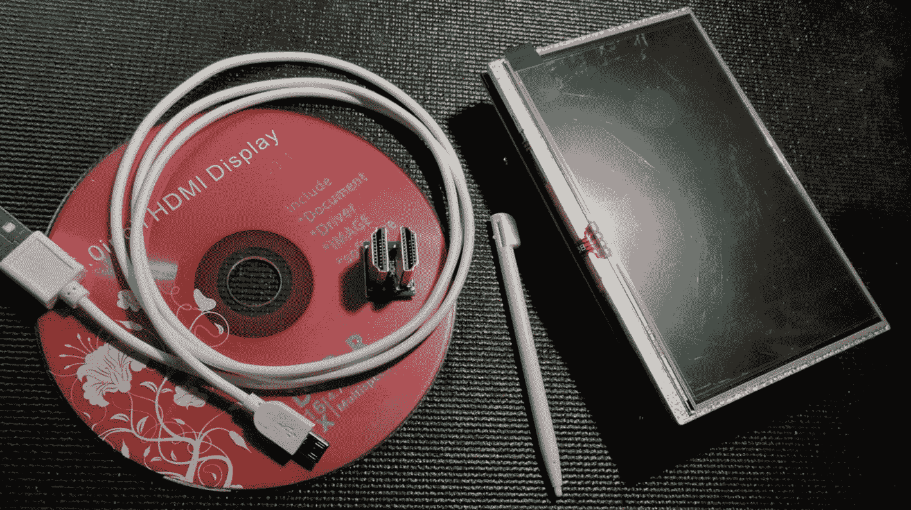
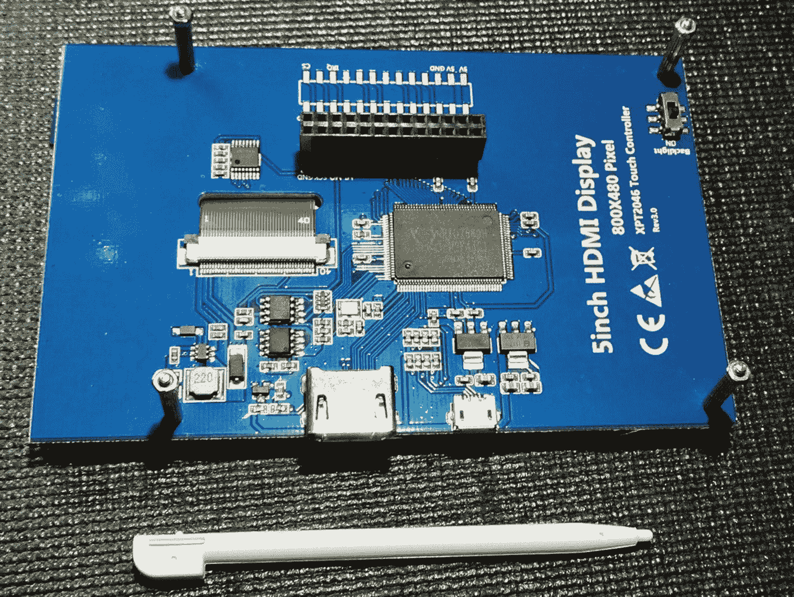

# 二十四、LCD HDMI 显示器

一些 Pi 项目最好使用简单的 LCD 显示器。相关的触摸控制将您从键盘和鼠标中解放出来。本章将研究一个 5 英寸 800x480 像素 LCD 触摸屏的例子，并描述如何设置它。

## 该显示单元

特色显示单元被宣传为“ [5 英寸 800 x 480 高清 TFT LCD 触摸屏，用于 Raspberry PI 2 型号 B / B+ / A+ / B](http://news.banggood.com/u/nrd.php?p=Gqc64cWqTV_3369270_2671705_-2_4&ems_l=2517675&l=7ffbesKKiiiW10~66aa3W2a_KRXu~27XUMMXjXQUMXtpyuXF%253FFXxopXFag27XE2d44~X%253FadXD0eb14ddkXBuXOXya34-XnXnXmXnXbXNMOPQPUW7f_-rgf_Y34e86~HQNCgf_Yeagd24H4_0dekeCgf_Y_438g_HE78bagf8~5ad_NTNNOVCgf_Y20_b086~H%252420_b086~Y20f46adk%2524Cgf_Y2a~f4~fHI8~~0Ce2Yed2H4_08-Y%2524283%2524Ce2Y47H%2524b4deYQNPNN%2524Ce2Y%252D%252D83H%2524%252D%252D83%2524Ce2Y-83H%25242-8~.83%2524Ce2Yg83H%2524ge4d83%2524&s=EQzrFuDwS7gLN_otezEejwLgfRo) ”，售价约为 42 美元。它具有一个 4 线电阻式 XPT2046 触摸控制器。图 [24-1](#Fig1) 展示了工具包中的内容。



图 24-1

5 英寸 HDMI 显示器套件，配有触控笔、DVD 和 LCD 单元(仍带有塑料外壳)。不含 USB 电源线。

LCD 的背面显示了一个 HDMI 连接器(图 [24-2](#Fig2) ，底部中间)、一个电源 USB 连接器(HDMI 连接器的右侧)、一个背光开关(右上)、一个 13x2 连接器(中上)和一个 LVDS 连接器(左下)。



图 24-2

拧入四个支架的 5 英寸 HDMI 显示器背面

如果您阅读了附带的 DVD 说明，您应该运行名为`LCD5-show`的脚本，但不要运行它——它与 Raspbian Linux 的当前版本不一致。事实上，该脚本在运行后可能会使您的 Pi 无法启动。本章将使用该脚本作为指南，并对其进行修改。

## 装置

首先要做的是从 DVD 上复制软件或者用 git 获取它。下面的`git`命令获取软件并将其放入~pi/LCD 目录:

```sh
$ git clone https://github.com/goodtft/LCD-show.git ./LCD
$ cd ./LCD

```

### 安装脚本

清单 [24-1](#PC2) 显示了提供的安装脚本，它将作为我们的指南，但不能直接使用。这可能会导致您的 Pi 无法启动。清单中带下划线的行突出了一些问题区域。让我们在接下来的几节中手动完成更正的步骤。

```sh
0001: #!/bin/bash
0002:  sudo rm -rf /etc/X11/xorg.conf.d/40-libinput.conf
0003:  sudo cp -rf ./boot/config-5.txt /boot/config.txt
0004: if [ -b /dev/mmcblk0p7 ]; then
0005: sudo cp ./usr/cmdline.txt-noobs /boot/cmdline.txt
0006: else
0007: sudo cp ./usr/cmdline.txt /boot/
0008: fi
0009: sudo cp ./usr/inittab /etc/
0010: sudo cp -rf ./usr/99-fbturbo.conf-HDMI /usr/share/X11/xorg.conf.d/99-fbturbo.conf
0011: sudo mkdir /etc/X11/xorg.conf.d
0012: sudo cp -rf ./usr/99-calibration.conf-5 /etc/X11/xorg.conf.d/99-calibration.conf
0013: nodeplatform=`uname -n`
0014: kernel=`uname -r`
0015: version=`uname -v`
0016: if test "$nodeplatform" = "raspberrypi";then
0017: echo "this is raspberrypi kernel"
0018: version=${version%% *}
0019: version=${version#*#}
0020: echo $version
0021: if test $version -lt 970;then
0022: echo "reboot"
0023: else
0024: echo "need to update touch configuration"
0025: if test $version -ge 1023;then
0026: echo "install xserver-xorg-input-evdev_2.10.5-1"
0027: sudo dpkg -i -B xserver-xorg-input-evdev_2.10.5-1_armhf.deb
0028: else
0029: echo "install xserver-xorg-input-evdev_1%3a2.10.3-1"
0030: sudo dpkg -i -B xserver-xorg-input-evdev_1%3a2.10.3-1_armhf.deb
0031: fi
0032: sudo cp -rf /usr/share/X11/xorg.conf.d/10-evdev.conf \
                  /usr/share/X11/xorg.conf.d/45-evdev.conf
0033: echo "reboot"
0034: fi
0035: else
0036: echo "this is not raspberrypi kernel, no need to update touch configure, reboot"
0037: fi
0038: sudo reboot

Listing 24-1Provided LCD5-show install script (do not run!)

```

### 支持

在对系统进行任何更改之前，请备份几个关键文件，以防以后需要恢复配置。将以下两个文件复制到您的主目录或您自己选择的位置:

```sh
# cp /boot/config.txt ~pi/config.txt.bak
# cp /boot/cmdline.txt ~pi/cmdline.txt.bak

```

要恢复您的原始配置，您只需要复制这些并重新启动。

### 文件 40-libinput.conf

清单 [24-1](#PC2) 第 2 行中的安装脚本试图删除一个不存在的文件(Raspbian Linux 没有提供`/etc/X11/xorg.conf.d`目录)。但是`/usr/share/X11/xord.conf.d/40-libinput.conf`里有一个文件。你可能会发现你可以把它留在那里，但我建议你重命名它，以避免任何可能的冲突。如果您选择将系统恢复到原始状态，您需要稍后撤销此操作。

要禁用它而不删除它，只需用一个不同的后缀重命名它(如`.was`)。

```sh
# mv /usr/share/X11/xorg.conf.d/40-libinput.conf \
     /usr/share/X11/xorg.conf.d/40-libinput.conf.was

```

如果您还没有进入 LCD 软件目录，现在是转到该目录的好时机:

```sh
# cd ~pi/LCD

```

### 编辑/引导/配置.txt

如果您运行清单 [24-1](#PC2) 中的安装脚本，第 3 行将会清除您之前对`/boot/config.txt`文件所做的任何更改。更糟糕的是，旧的安装文件可能不完全适用于当前版本的 Raspbian。您最好编辑文件，做出您实际需要的更改。

```sh
# nano /boot/config.txt

```

如果你认为你搞砸了，你可以通过复制备份文件来恢复，然后重新开始。

进行更改时，有时可以取消对某行的注释。在其他情况下，您需要添加行(最好在文件的末尾)。如果您有一个指令冲突，您可以在第一列中用一个散列字符(#)将其注释掉，并简单地在文件末尾添加您的更改。

进行以下更改:

```sh
dtparam=spi=on
max_usb_current=1
hdmi_force_hotplug=1
config_hdmi_boost=7
hdmi_group=2
hdmi_mode=1
hdmi_mode=87
hdmi_drive=1
hdmi_cvt 800 480 60 6 0 0 0
dtoverlay=ads7846,cs=1,penirq=25,penirq_pull=2,speed=50000,ke

```

保存您的更改。这一步替换了安装脚本的第 3 行。

### 编辑/boot/cmdline.txt

接下来执行的*非 noobs* 步骤是清单 [24-1](#PC2) 的第 7 行。像上一步一样，它用潜在的不兼容选项破坏文件(它可能影响到根设备的路径)。更好的方法是简单地编辑文件，进行必要的修改。在行尾添加以下文本，用空格分隔任何以前的文本(对于非 noob 和非 noob):

```sh
fbcon=map:10 fbcon=font:ProFont6x11

```

保存更改。

### 99-fbturbo.conf 文件

清单 [24-1](#PC2) 安装脚本的第 9 行不再适用。不管是好是坏，Raspbian Linux 和 Debian 一样使用`systemd`。不再有`/etc/inittab`文件，因此可以跳过这一步。

另一方面，第 10 行指示我们复制以下内容:

```sh
# cp -rf ./usr/99-fbturbo.conf-HDMI /usr/share/X11/xorg.conf.d/99-fbturbo.conf

```

### 文件 99-calibration.conf-5

脚本第 11 行不适用(不搜索目录`/etc/X11/xorg.conf.d`),应该跳过。

执行以下拷贝，注意第二个路径名中的更改(带下划线):

```sh
# cp -rf ./usr/99-calibration.conf-5 /usr/share/X11/xorg.conf.d/99-calibration.conf

```

脚本使用了目标目录`/etc/X11`，但在上面的命令中，正确的目录名是`/usr/share/X11`。

### 驱动程序安装

安装脚本尝试确定:

1.  这是一个树莓派(第 16-17 行)，以及

2.  Raspbian Linux 的版本(第 18–19 行)。

测试#1 依赖于您的 Pi 的主机名“raspberrypi”如果您已经定制了主机名并运行了那个脚本，它就会安装错误的驱动程序，认为它是*而不是*Pi。哎呀！

在脚本的第 21 行和第 25 行中，对 Raspbian Linux 版本进行了一些测试。这些是基于以下结果:

```sh
# uname -v
#1110 SMP Mon Apr 16 15:18:51 BST 2018

```

本例中的版本号是 1110。第 21 行表示如果您的 Raspbian 版本低于 970 ，则不需要安装驱动程序*。在这种情况下，是时候简单地重启了(改为执行关机和断电)。另一方面，Raspbian 的最新版本*版本 1023 或更高版本要求安装驱动程序。**

在您的`~pi/LCD`目录中，应该存在您想要安装的 debian 驱动程序包。要查看您正在安装的内容，请使用-c 查询软件包文件，文件名如下所示:

```sh
# dpkg -c xserver-xorg-input-evdev_2.10.5-1_armhf.deb
drwxr-xr-x root/root         0 2017-01-18 18:26 ./
drwxr-xr-x root/root         0 2017-01-18 18:26 ./usr/
drwxr-xr-x root/root         0 2017-01-18 18:26 ./usr/lib/
drwxr-xr-x root/root         0 2017-01-18 18:26 ./usr/lib/xorg/
drwxr-xr-x root/root         0 2017-01-18 18:26 ./usr/lib/xorg/modules/
drwxr-xr-x root/root         0 2017-01-18 18:26 ./usr/lib/xorg/modules/input/
-rw-r--r-- root/root     39292 2017-01-18 18:26 ./usr/lib/xorg/modules/input/evdev_drv.so
drwxr-xr-x root/root         0 2017-01-18 18:26 ./usr/share/
drwxr-xr-x root/root         0 2017-01-18 18:26 ./usr/share/X11/
drwxr-xr-x root/root         0 2017-01-18 18:26 ./usr/share/X11/xorg.conf.d/
-rw-r--r-- root/root      1099 2017-01-18 18:26 ./usr/share/X11/xorg.conf.d/10-evdev.conf
drwxr-xr-x root/root         0 2017-01-18 18:26 ./usr/share/bug/
drwxr-xr-x root/root         0 2017-01-18 18:26 ./usr/share/bug/xserver-xorg-input-evdev/
drwxr-xr-x root/root         0 2017-01-18 18:26 ./usr/share/doc/
drwxr-xr-x root/root         0 2017-01-18 18:26 ./usr/share/doc/xserver-xorg-input-evdev/
-rw-r--r-- root/root      6293 2017-01-18 18:26 ./usr/share/doc/\
                               xserver-xorg-input-evdev/changelog.Debian.gz
-rw-r--r-- root/root     83217 2017-01-18 07:15 ./usr/share/doc/\
                               xserver-xorg-input-evdev/changelog.gz
-rw-r--r-- root/root      4988 2017-01-18 18:26 ./usr/share/doc/\
                               xserver-xorg-input-evdev/copyright
drwxr-xr-x root/root         0 2017-01-18 18:26 ./usr/share/man/
drwxr-xr-x root/root         0 2017-01-18 18:26 ./usr/share/man/man4/
-rw-r--r-- root/root      4306 2017-01-18 18:26 ./usr/share/man/man4/evdev.4.gz
lrwxrwxrwx root/root         0 2017-01-18 18:26 ./usr/share/bug/xserver-xorg-\
                               input-evdev/script -> ../xserver-xorg-core/script

```

使用以下命令安装 debian 包:

```sh
# dpkg -i -B xserver-xorg-input-evdev_2.10.5-1_armhf.deb

```

安装完成后，从脚本的第 32 行执行最后一个复制命令:

```sh
# cp -rf /usr/share/X11/xorg.conf.d/10-evdev.conf /usr/share/X11/xorg.conf.d/45-evdev.conf

```

### 关机

现在是时候用关闭的 Pi *连接硬件了。执行系统关机:*

```sh
# sync
# /sbin/shutdown -h now

```

关机过程通常会为您执行`sync`命令，但我喜欢知道它已经完成的舒适感觉(它会刷新您未写入的磁盘缓存)。

## 插入电源

此时，软件和配置已经准备就绪。关闭电源，将 LCD 单元插入 Pi，13x2 连接器与 Pi 的 GPIO 条的一端连接，如图 [24-3](#Fig3) 所示。该图是从 GPIO 侧看的，没有完全就位，因此您可以看到正在插入的针脚。


图 24-3

5 英寸 LCD 13x2 连接器连接到 GPIO 条，位于 USB 连接器(Pi 3 B+)的另一端。连接器尚未完全就位。

这很容易出错，所以要反复检查。这里的一个错误可能会毁了你的一天。如果匹配正确，HDMI 连接器应该在相反的一侧排成一行，如图 [24-4](#Fig4) 所示。


图 24-4

使用随附的 HDMI 转 HDMI 侧适配器连接到 Pi 的 LCD

如果 HDMI 适配器似乎没有对齐，请重新检查 13x2 连接器是否正确插入 GPIO 条。

插入电源线后，打开设备电源。背光启动时，液晶屏应显示短暂的闪烁。如果您看不到任何活动，最好立即关闭电源并重新检查连接。

## 启动

Pi 启动后，观察桌面是否出现。一旦你的桌面出现并显示一个小的鼠标箭头，试着点击屏幕来移动箭头。如果触摸控制不起作用，请检查以下内容:

*   重新检查连接的配合情况。连接不良或连接错位都会影响触控。

*   再次检查`/boot/config.txt`和`/boot/cmdline.txt`文件。

*   检查用电情况(下一节)。

*   检查 LCD 面板的版本。较旧的设备对 penirq 使用 GPIO 22。这在下面带下划线的`/boot/config.txt`文件中指定:

    ```sh
    dtoverlay=ads7846,cs=1,penirq=25,penirq_pull=2,speed=50000,ke

    ```

## 电源

我拥有的这个单元在背光开启时消耗大约 242 毫安，关闭时消耗 168 毫安。确保您的 Pi 和 LCD 面板供应充足。Pi 3 B+建议使用 2.5 A 电源，但当 LCD 插入 USB 端口时，您可能会在高峰使用期间耗尽当前容量。

## 连接

表 [24-1](#Tab1) 中描述了 13x2 连接器上的连接。手动连接触摸控制时，注意不要混淆连接“MO”和“MI”从从机的角度来看，这些奇怪的连接分别表示 MISO (MO)和 MOSI (MI)。

表 24-1

13x2 LCD 连接器的连接

<colgroup><col class="tcol1 align-left"> <col class="tcol2 align-left"> <col class="tcol3 align-left"> <col class="tcol4 align-left"> <col class="tcol5 align-left"> <col class="tcol6 align-left"></colgroup> 
| 

描述

 | 

别针

 | 

#

 | 

#

 | 

别针

 | 

描述

 |
| --- | --- | --- | --- | --- | --- |
| 电源(+5V) | +5V | Two | one | +3.3V |   |
| 电源(+5V) | +5V | four | three |   |   |
| 地面 | 接地 | six | five |   |   |
| 网络计算机 |   | eight | seven |   |   |
| 网络计算机 |   | Ten | nine | 接地 | 地面 |
| 网络计算机 |   | Twelve | Eleven |   |   |
| 接地 | 接地 | Fourteen | Thirteen |   |   |
| 网络计算机 |   | Sixteen | Fifteen |   |   |
| 网络计算机 |   | Eighteen | Seventeen | +3.3V |   |
| 接地 | 接地 | Twenty | Nineteen | 大调音阶的第三音 | 工业博物馆 |
| 笔 IRQ | GPIO 25 | Twenty-two | Twenty-one | 军医 | 军事情报部门组织(Military Intelligence Service Organization) |
| 网络计算机 |   | Twenty-four | Twenty-three | 血清肌酸激酶 | 血清肌酸激酶 |
| 笔芯片选择 | GPIO-7 | Twenty-six | Twenty-five | 接地 | 地面 |

## 摘要

经常出现的一个问题是，当软件变得陈旧时，硬件会被定价出售。当操作系统更新而软件保持静态时，就会发生这种情况。如果你能像本章所做的那样，手动完成安装的细节，这会对你有利。

所展示的 LCD 屏幕让您对类似产品有所了解。需要注意的一点是，在购买之前，要确保您的 Linux 版本有任何必要的驱动程序支持。

触摸感应液晶显示屏为您的想象力开启了许多新的可能性。