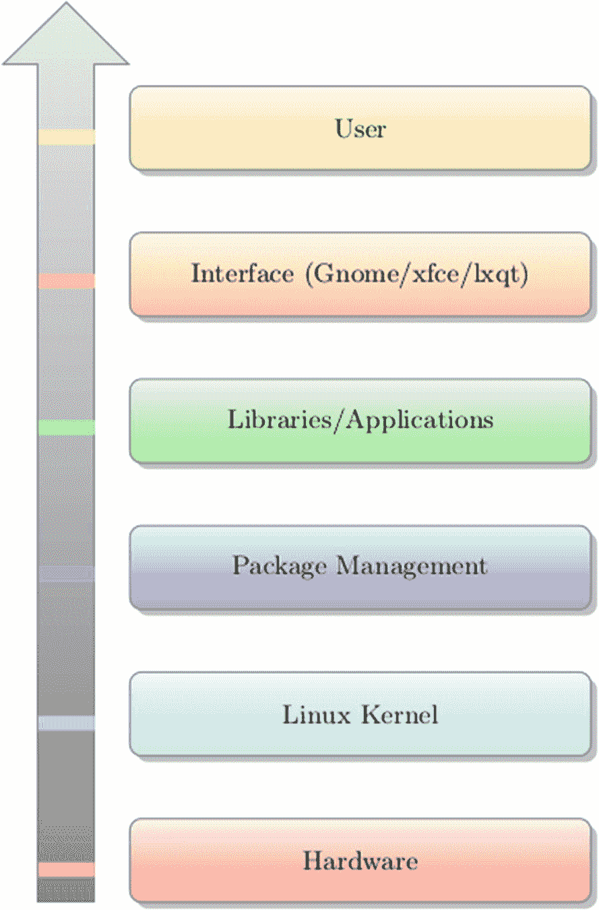
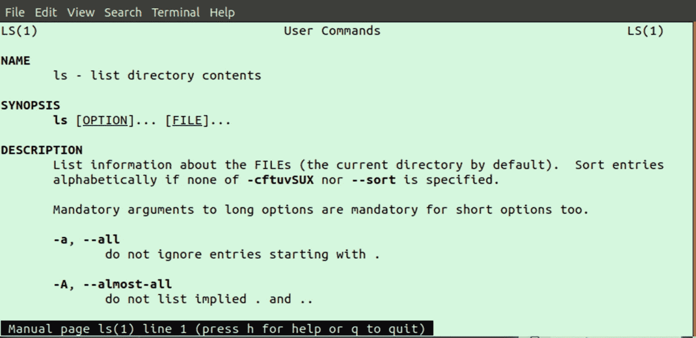
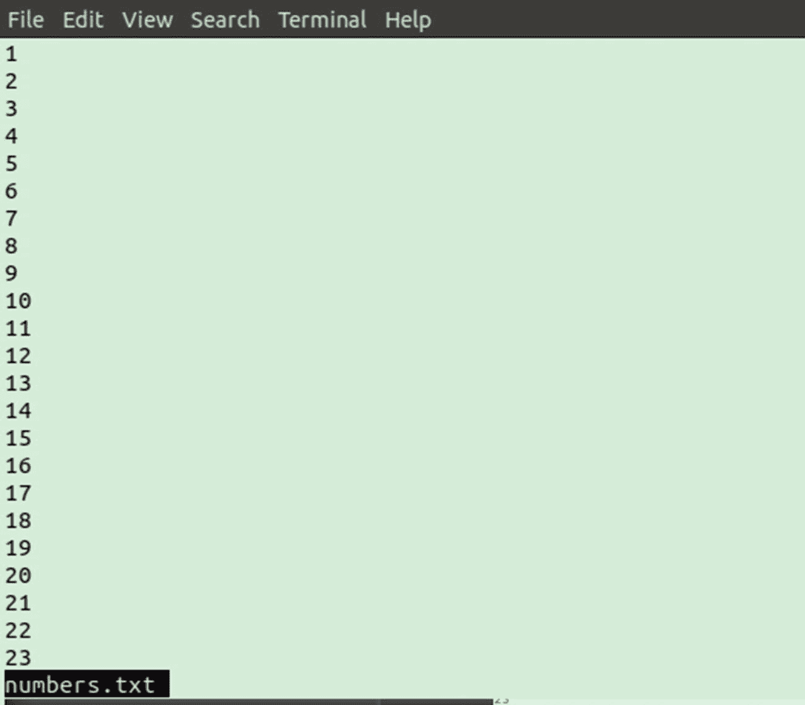
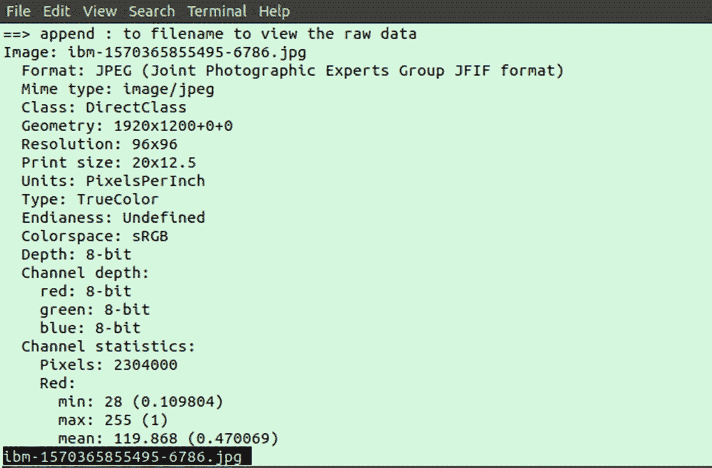
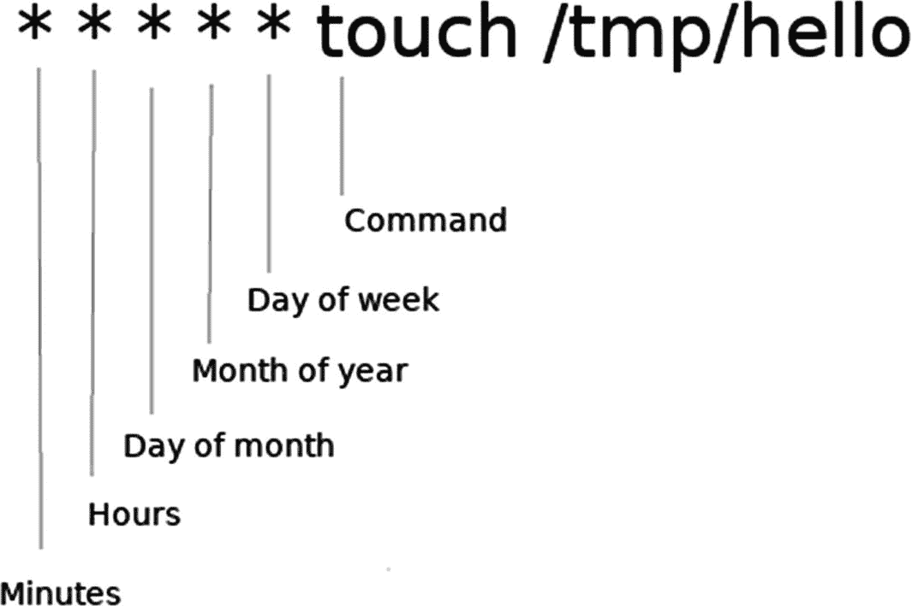

# 一、Linux 优先

今天成长起来的大多数人都是通过图形界面接触计算机的，无论是通过视频游戏控制台、笔记本电脑还是 iPad。因为大多数人与计算机的交互是通过某种图形界面来完成的。尽管图形界面很流行，但大多数严肃的编程和系统管理仍然是在命令行级别完成的。

图形越来越好。语音激活计算、可穿戴设备和物联网等创新正在引入更多与计算机交互的方式。桌面和移动设备上流行的操作系统的新版本在不断变化。然而，在从物联网到安卓的大多数新系统下，似乎都有一个命令行世界，它以稳定的状态存在，而构建在其上的一切都在变化。

Linux 操作系统和终端命令行作为输入方法的持久性证明了它的效率和有用性。虽然黑色背景上简单的绿色文本可能看起来过时了，但它实际上是通向神奇效率的大门。每个命令都像一个咒语。只需敲几下键盘，我们就可以完成使用鼠标和图形用户界面需要花费很长时间才能完成的任务和技巧。在某些情况下，我们甚至可以在命令行上做一些用 GUI 做不到的事情。

这本书是为那些想从命令行的角度探索 Linux 的人而写的——无论你是一个完全的新手，从零开始学习命令行，还是你已经熟悉了 Linux 机器，但想学习一些新的命令和实用程序，这些都会派上用场。

在这一章中，我们将看看什么是 Linux，回顾一些流行的发行版(*或发行版*)，并看看一些处理文件和目录的基本命令。

## 什么是 Linux

在本书中，我们将探讨不同的命令行应用程序、内置命令和技术。在我们开始之前，有必要先了解一下“什么是 Linux”一些技术定义将只包括 Linux 内核(*与计算机底层硬件一起工作的核心部分*)。

通常这样的定义将发行版定义为 GNU/Linux。GNU 是一个递归的首字母缩写词，代表“GNU 不是 Linux”它指的是所有(*或几个*)开源应用程序，这些应用程序普遍与 Linux 内核捆绑在一起。这些工具包括`bash`、`coreutils`、`grep`、`groff`、`grub`和`readline`，这里仅举几个例子。也就是说，并不是所有 Linux 内核附带的工具都是由 GNU 组织创建的。

在普通语言中，Linux 指的是围绕 Linux 内核构建的操作系统。这包括内核、预装的软件以及两者之间的一切。为了简单和与通用语言兼容，我们将 Linux 称为整个操作系统，而不仅仅是内核。

## Unix 与 Linux

Linux 实际上是被称为“类 Unix”操作系统的更大的操作系统组的一部分。这些操作系统的灵感都来自于 1970 年发布的最初的 Unix 操作系统。除了 Linux 之外，它还包括几个操作系统家族:

*   MacOS(自 2015 年起)

*   Android(构建在修改后的 Linux 内核上)

*   Linux 操作系统

*   操作系统

*   加州大学伯克利分校软件(Berkeley Software Distribution)

*   NetBSD

看到 MacOS 和 Android 等流行的操作系统列在这里，你可能会感到惊讶。最初的 Unix 操作系统的影响是深远的。最初的 Unix 操作系统有一些至今仍然存在的关键特性，包括

*   硬件和用户空间之间的内核

*   所有数据存储为文件

*   用户和权限系统

*   至今仍在使用的目录布局(因操作系统而异)

在图 [1-1](#Fig1) 中，显示了利用 PDP-11/20 ( *设备，在实验显示系统标签*的最右下方)的设置。这是 20 世纪 70 年代运行 Unix 的早期系统的一个例子。


图 1-1

PDP 11/35，PDP-11/20 的微程序后继者；设计团队由吉姆·奥洛夫林领导

基于 Unix 的标准的广泛采用产生了深远的影响。本书中涉及的许多核心命令和实用程序实际上可以在 Linux 之外的系统上运行。如果你在 Mac 甚至 Android 上打开一个终端会话，你会发现这里的许多命令都工作得很好。甚至 Windows 现在也包括一个可选的 Linux 子系统，以及它们自己的命令行系统上的各种别名，这些别名将 Linux 命令定向到它们的 Windows 等价物，例如'`ls`'，它是 Windows 上'`dir`'的别名。

## POSIX 标准

POSIX 代表便携式操作系统接口。它定义了脚本的标准语法和应该可用的实用程序列表。它用于保证类 Unix 系统之间的兼容性。如果一个程序或操作系统是 POSIX 兼容的，那么 bash 脚本可以在其上运行。

POSIX 还保证您可以访问一系列实用程序，其中包括`cat`、`awk`、`cut`、`grep`和`kill`，这里仅举几例。它还定义了指定实用程序的行为方式。以前，一些实用程序有相互竞争的实现，这给可移植性带来了问题。

## 选择发行版

大多数人在切换到 Linux 时面临的第一个重大决定是使用什么发行版*(通常称为 distro)* 。通常，人们最终会使用朋友或同事正在使用的产品，或者只是我们第一次听说的产品。有几十种流行的发行版，每一种都有它擅长的优点、缺点和特定的用例。

在这本书里，我将使用安装在 Ubuntu 和其他基于 Debian 的操作系统上的软件包管理器`apt-get`。也就是说，几乎所有这些都可以在任何 Linux 发行版上很好地工作；只需要找到您的发行版中有问题的包，并通过提供的包管理器安装它，手动安装它，甚至从源代码构建它。

对于许多流行的 Linux 发行版来说，这是有争议的。我个人选择使用 Ubuntu 主要归结于兼容性方面。Ubuntu 是桌面用户使用最广泛的 Linux 发行版。如果你在一家使用 Linux 的公司工作，你会发现使用那里使用的发行版很有用。尽管 bash 和 Linux 的其他方面具有可移植性，但发行版和 bug 之间还是存在差异，它们可能存在于一个发行版中，而不存在于另一个发行版中。因此，如果你在使用 Linux Mint，但其他人都在使用 Fedora，你可能会引入不必要的摩擦。

在我为 Linux 开发基于 GUI 的应用程序的经验中，我发现如果我在开发过程中使用一个不同于最终用户的发行版，通常会有视觉上的差异，这将极大地影响设计，或者在某些情况下只在一个发行版中出现错误。例如，最终用户系统和开发系统之间的系统字体系列或字体大小可能不同。尽管在大多数情况下，核心功能可以在大多数 Linux 系统上运行。Linux 发行版之间的高度可变性是许多游戏行业仍然没有提供对基于 Linux 的操作系统的完全支持的一个原因。

从一个流行的发行版开始的另一个好处是，当阅读在线教程和项目文档时，你经常会看到更流行的 Linux 发行版(如 Ubuntu)的说明，但对于不太流行的发行版却没有。此外，如果您确实有问题，并且您想提交一个 bug，该项目可能不会为较少使用的发行版提供支持。

也就是说，运行较少使用的发行版有很大的好处。作为一个年轻的业余爱好者，我发现运行像 Arch Linux 这样的最小发行版迫使我学习关于 Linux 发行版的组成部分以及如何使用命令行导航和修复我的系统的概念。通常，这种学习过程表现为实验、破坏系统、修复系统，在某些情况下，不得不重新安装所有东西并从头开始。

如果探索发行版和 Linux 的内部工作方式让你兴奋，我鼓励你去探索那些很少被使用并且可能更难安装的 Linux 发行版。Gentoo 甚至要求用户从代码中编译所有使用的程序。在像 Gentoo 或 Arch Linux 这样的发行版上启动和运行本身就是一项成就和一个学习过程。

除了便利性和学习过程的因素，考虑一个发行版优于另一个发行版的地方也很重要。例如，Arch Linux 对于为嵌入式或低端机器编译定制操作系统特别有用。Kali Linux 因其在渗透测试中的使用而臭名昭著。基于 Red Hat 的发行版通常用于企业服务器。如果您对渗透测试感兴趣，Kali 是显而易见的选择；如果你想成为一家企业公司的系统管理员，你可能想熟悉 Fedora。

### 开放源码软件的分支

在接下来的几节中，我们将看看一些更流行的 Linux 发行版。我包含了一个显示操作系统家族分支的树，让您了解不同流行操作系统之间的关系。请记住，父/子操作系统之间的关系可能会有很大不同(参见图 [1-2](#Fig2) )。


图 1-2

Linux 发行系列

### 一种自由操作系统

Debian 于 1993 年首次发布，是几个流行的 Linux 发行版的主干，包括 Ubuntu、Kali 和 Linux Mint。它以拥有非常好的打包系统`apt`而闻名，是 Advanced Package Tool 的简称。我们将在整本书中使用`apt`,它可以在后面列出的所有基于 Debian 的操作系统上使用，尽管通过管理器可用的包在不同的操作系统之间会有所不同。

要用`apt`安装软件包，只需运行下面的命令，用`<package>`替换您要安装的软件包:

```sh
sudo apt-get install <package>

```

Note

`sudo`在前面的命令中是一个关键字，允许非根用户对文件或系统方面进行可能影响其他用户的更改。使用`sudo`时，系统会提示您输入密码，然后才能以 root 用户身份执行命令。如果您运行一个命令并得到“权限被拒绝”的消息，您可以简单地在命令前面加上`sudo`，它应该会工作。也就是说，在使用`sudo`之前，请确保您理解相关命令，因为 root 权限允许您修改对操作系统运行至关重要的系统文件。

#### 人的本质

Ubuntu 是桌面上最流行的 Linux 发行版，尽管它通常也用于服务器。它建立在 Debian 的基础上，增加了对几个非自由软件二进制文件和编解码器的支持，改善了用户在线观看视频和玩游戏的体验。

它拥有 Debian 的许多优点，如强大的包管理器和稳定性，但也是为了提供良好的桌面体验。目前最新版本的 Ubuntu 使用的是 GNOME 界面(即操作系统的 GUI 桌面，位于底层软件之上)。

Ubuntu 有几个版本使用其他桌面用户界面，可能更适合低端硬件，比如使用`xfce`的 Xubuntu 和使用`lxqt`的 Lubuntu。这些发行版通常只是切换出了界面，而没有改变太多。如果你看一下图 [1-3](#Fig3) ，它显示了 Linux 操作系统的堆栈，Xubuntu/Lubuntu 之间的区别在很大程度上仅仅是切换出接口层，以及交换一些预装的应用程序。

一个比较是，像脸书这样的网络应用程序通常有不同的接口来访问相同的核心功能。当使用我的手机时，我可以通过他们的网站、他们的应用程序，甚至是一个名为脸书 Lite 的轻量级版本访问脸书。所有这些界面看起来不同，可能有增强或限制，但最终所有的功能(发布、查看、喜欢等。)访问相同的核心功能。



图 1-3

Linux 操作系统堆栈

#### 迦利

Kali 是一个基于 Debian 的发行版，主要关注攻击性安全工具。它包括几个用于数字取证、渗透测试和逆向工程的预装工具。它带有 600 多个预装工具，包括 Wireshark、Aircrack-ng 和 Burp Suite。这使得它对渗透测试器特别有用。也就是说，不建议日常使用。

同样值得注意的是，这些工具可以通过包管理器或者直接下载安装在其他系统上。对于包管理者来说，这个过程相当简单，但是当直接下载时，这个过程会因工具而异。例如，有些包可能是通过 Python 的包管理器 Pip 安装的，而其他包则需要您编译一个二进制文件或下载一个预编译的二进制文件，并将其放在系统可以找到可执行文件的文件夹中，例如/usr/bin。

使用 Kali 的另一个好处是，其他发行版上的软件包管理器上的工具版本可能是旧版本。由于这些包只是需要维护者打包、审查和更新的众多包中的一个，所以它们可能会落后，而在 Kali 上，与 Linux 安全相关的工具是焦点，因此需要付出更多的努力来保持它们的最新。

#### 铸造

Mint 是另一个基于 Ubuntu 的发行版，它已经变得相对流行。Linux Mint 是基于 Ubuntu 的，但是它有一个利用 Cinnamon 桌面环境的替代界面。它和 Ubuntu 有相同的库，所以本书中的任何`apt-get install`命令都应该提供和 Ubuntu 相同的结果。

#### 波波！波波

PopOS 是另一个基于 Ubuntu 的发行版，它获得了广泛的关注。它提供了一个替代 Ubuntu 的桌面体验，有相同的软件包，加上一些通过 PPAs(个人软件包档案)提供的额外的软件包。这些额外的软件包包括 Nvidia 图形驱动程序、Steam 和 Spotify 等其他流行程序。操作系统由 System76 维护，system 76 是一家总部位于科罗拉多州的计算机制造商，专注于生产高质量的硬件并重视开源软件。

### 一种男式软呢帽

Fedora 是由 Red Hat Linux 支持的社区驱动的操作系统。Fedora 是许多功能的试验场，这些功能最终被引入 RHEL (Red Hat Enterprise Linux)，这是 Red Hat 的主要产品。对于 Fedora、RHEL 和 CentOS，使用命令安装软件包

```sh
dnf install <package>

```

在某些情况下，如果你使用的是 Fedora/RHEL 系统，你可以简单地用`apt-get`替换`dnf`。在其他情况下，包的名称可能会稍有不同，或者它可能不作为包提供。

#### RHEL(红帽企业 Linux)

虽然 Ubuntu 可能是桌面上最流行的发行版，但 RHEL 可能是企业服务器上使用最多的。它既是开源的，也是付费的产品，包含企业级的支持。如果你打算在企业环境中做系统管理员，你很可能会和 RHEL 一起工作。

重点是安全性、稳定性和速度。由于这个原因，与 Ubuntu 或 Red Hat 支持的更开放的版本 Fedora 相比，可用的包可能更少。

#### CentOS

虽然 Fedora 是 RHEL 的一个更具实验性和开放性的免费版本，但 CentOS 本质上与 RHEL 是相同的操作系统，但完全免费。购买 RHEL 许可证时，会附带 CentOS 不包含的支持。CentOS 为学习 RHEL 提供了一个很好的操作系统，或者不需要外部支持就可以简单地使用它。

### 斯拉克语

Slackware 是一个 Linux 发行版，可以追溯到 1993 年。它有一小群忠实的粉丝，但已经超过 3 年没有发行了，而以前它每年至少发行一次。

#### OpenSUSE

OpenSUSE 最初源自 Slackware，但它已经长出了自己的一套腿，如今几乎没有什么联系。虽然 Slackware 一直缺乏更新，但 OpenSUSE 仍然非常活跃，并拥有与 RHEL 类似的大公司支持。

### 拱门

Arch Linux 是 Linux 的一个分支，它是高度可定制的，专注于滚动发布包管理器。滚动发布包管理器意味着所提供的包可能是最新的。与大多数操作系统不同，没有主要版本。这是通过去掉在其他发行版的主要版本发布之前审查和确认任何变更的包维护人员来实现的。滚动发布意味着有可能获得最新版本的应用程序，但不利的一面是，在审核方面投入的精力较少，这可能会导致稳定性和安全性问题。

使用`pacman`软件包管理器安装软件包:

```sh
sudo pacman -S <package>

```

Arch Linux 的另一个值得注意的方面是，默认情况下，它不附带运行桌面体验所需的软件。取而代之的是由用户来选择特定的程序，比如声音、窗口管理器和图形界面。

#### 曼哈罗

Manjaro 是 Arch Linux 的一个版本，它通过预配置的桌面体验解决了入门的困难。Ubuntu 有几种变体，比如 Xubuntu 和 Kubuntu。

### 巴布亚企鹅

Gentoo 是一个高度可定制的 Linux 版本，它允许定制到内核级别。Gentoo 不是下载预编译的应用程序，而是在本地计算机上编译源代码。当需要高度定制的体验时，它特别有用。

### 阿尔卑斯 Linux

Alpine Linux 是一个发行版，基本上没有人将其作为桌面或服务器的主要发行版，但它作为 Docker 容器的基础映像却非常受欢迎。如果您使用或修改 Docker 容器，您可能会遇到 Alpine Linux。它非常小，默认情况下几乎没有应用程序，尽管它有自己的包管理器`apk`。

如果您有一个应用程序或进程想要用 Docker 进行容器化，那么可以考虑 Alpine Linux。这里的许多程序和脚本都是兼容的，尽管如果使用任何程序，你必须先用`apk`安装它们。

## 常见命令

在接下来的小节中，我们将会看到一些常见的命令，其中大部分都是默认安装在大多数 Linux 系统上的。

## 使用 man 命令阅读手册

我将在本书中提到许多程序。对于其中的大部分，我最多只会谈到它们的 5–10%的使用情况。如果您想更深入地研究这些程序，学习几乎所有 Linux 操作系统上都有的`man`命令是很重要的。

`man`是手动的简称。它的使用方法是运行命令并传入另一个 Linux 命令行程序的名称。例如，如果我们想获得关于命令`ls`的更多信息，我们可以运行以下命令:

```sh
man ls

```

这将返回程序的描述以及如何使用它，如图 [1-4](#Fig4) 所示。



图 1-4

手册页的示例

我鼓励你在探索 Linux 操作系统时经常使用`man`,因为它通常可以节省你进行冗长的互联网搜索的时间。您可以使用箭头键和 page up 或 page down 按钮来浏览手册页。

如果您需要搜索手册页来查找某个特定的关键字，有一个内置的搜索功能。要进行搜索，请按`/`键，然后键入您的术语并按 enter 键。如果存在，您将被带到第一个事件。若要前往下一个事件，请轻按`n`；每次点击`n`都会将你带到下一个实例。如果你想返回一个实例，按下大写`N`，和`n`一样，每按一次都返回一个实例。

### 编号手册页

在某些情况下，一个程序可能有多个手册页。例如，用程序`stat`，我们可以运行

```sh
man 1 stat

```

或者我们可以跑

```sh
man 2 stat

```

这些命令将把我们带到涉及程序不同方面的不同手册页。参见表 [1-1](#Tab1) 了解不同页码的列表及其包含的信息。并非所有程序都包含每种类型的页面。例如，`printf`有一个包含 C 库函数信息的第 3 页，但没有第 2 页。

表 1-1

编号手册页中的信息描述

<colgroup><col class="tcol1 align-left"> <col class="tcol2 align-left"></colgroup> 
| 

页码

 | 

描述

 |
| --- | --- |
| one | 用户命令 |
| Two | 系统调用 |
| three | c 库函数 |
| four | 设备和特殊文件 |
| five | 文件格式和约定 |
| six | 比赛 |
| seven | 多方面的 |
| eight | 系统管理工具和守护程序 |

在大多数情况下，我们会从用户命令的角度对程序感兴趣，所以我们可以只运行`man`而不使用默认为 1 的编号或找到的编号最小的页面。

```sh
man man
man -s 6 --regex -k '.*'

```

如果您想在自己的系统上看到表 [1-1](#Tab1) 中显示的列表，您可以运行“`man man`”。你可能想知道他们真的是游戏专用的页码吗？答案是肯定的。至少从 20 世纪 80 年代的 Unix System V 开始，游戏部分就已经包含在内了。它很少被使用，但是如果你运行下面的命令，你会得到一个在你的系统上使用它的包的列表。你可能会发现一些有趣的复活节彩蛋程序，比如“T2”，这是一个安装在许多机器上的玩笑程序，声称可以读取用户的想法。

## 用于导航的有用命令

表 [1-2](#Tab2) 中列出了一些您想要熟悉的用于导航和创建新文件夹的命令。

表 1-2

用于导航和处理文件/目录的命令

<colgroup><col class="tcol1 align-left"> <col class="tcol2 align-left"></colgroup> 
| 

命令

 | 

描述

 |
| --- | --- |
| 限位开关（Limit Switch） | 列出目录内容 |
| 激光唱片 | 更改目录 |
| 显示当前工作目录 | 打印工作目录 |
| 创建目录 | 制作目录 |
| 是吗 | 删除目录(*仅在空的情况下有效* |

## 用 ls 和 cd 导航文件系统

大多数用户在进入文件系统时学习的第一个命令是`ls`，它是“列出目录内容”的缩写，还有`cd`，它是“更改目录”的缩写。

只知道这两个命令就可以导航文件系统——首先通过运行`ls`来查看当前目录中的文件和文件夹，然后使用带有其中一个文件夹名称的`cd`来导航。

使用`cd`时要记住一点。任何时候你都可以不带任何文件夹名运行`cd`返回到你的主目录。如果你用`cd`进入一个目录，并想返回到包含你所在的目录，你可以使用`..`，例如:

```sh
cd ..

```

或者，如果您想向上返回两个文件夹:

```sh
cd ../..

```

你可能想用`ls`做的一些常见的事情是列出文件和文件夹名称之外的其他细节；这可以通过`-l`标志来实现:

```sh
ls -l

```

如果您想按最后修改时间排序，您可以使用`-t`标志，它最好与`-l`结合使用:

```sh
ls -lt

```

如果您想反转结果，使最旧的文件在顶部，添加`-r`标志进行反转:

```sh
ls -ltr

```

您应该得到类似于图 [1-5](#Fig5) 所示的输出。


图 1-5

运行 ls -ltr 的结果，l 表示附加信息，t 表示按修改时间排序，r 表示以相反的顺序显示结果

## 不可见文件(点文件)

重要的是要知道，在 Linux 中以`.`开头的文件在使用`ls`或图形文件浏览器时通常不会出现。这些文件是用于配置的，为了方便起见被隐藏起来了。我们经常想要编辑或查看这些文件，所以了解`ls`的`-a`标志是很重要的。`-a`代表全部，将显示所有文件，包括隐藏的文件。

```sh
ls -a

```

## 用密码获取当前目录

有了所有这些导航，很容易忘记您在文件系统上的确切位置。如果发生这种情况，有一个简单的方法来确定你的确切位置。只需运行`pwd`即可返回您当前位置的完整路径。

```sh
pwd

```

## 制作目录

导航文件系统的一部分是创建新的目录来存放文件和子文件夹。使用`mkdir`命令相对容易，它接受文件夹名，并根据您的当前位置创建目录。例如，如果我们在主目录中运行以下命令:

```sh
mkdir music

```

我们将以一个名为“音乐”的文件夹结束。一次可以创建多少个是没有限制的。假设我们想要创建另外两个子文件夹，我们可以运行

```sh
mkdir music/rock music/classical

```

也可以使用完整路径而不是相对路径。例如，如果我在我的主目录中，我想在我的`/tmp`文件夹中创建一个新文件夹:

```sh
mkdir /tmp/test

```

这不是`mkdir`独有的；基本上所有可以使用相对路径的程序也允许你使用完整路径；它只要求路径以“/”开头。

## 递归创建目录

通常在创建一个文件夹时，你已经有了一个由多个目录组成的结构。例如，假设我们要创建一个名为 movies 的新文件夹，其中一个子文件夹是关于恐怖片的，另一个子文件夹是关于 2012 年的。如果我们逃跑

```sh
mkdir movies/horror/2012

```

我们将返回一个错误，说“没有这样的文件或目录”。标签提供了一种解决方法。`-p`代表创建父目录，意思是如果我们要创建的目录的父目录不存在，就会被创建。运行以下命令可以像预期的那样工作，给我们留下三个新文件夹:

```sh
mkdir -p movies/horror/2012

```

## 删除目录

创建目录后，您可能决定要删除它。一种方法是使用与`mkdir`类似的`rmdir`命令；只需将您想要删除的目录的名称传递给它:

```sh
rmdir music/classical

```

不幸的是，`rmdir`有一个主要的限制，它只能删除一个完全空的目录。试图在任何包含文件或子目录的目录上使用`rmdir`将返回“目录不为空”。因此，实际上许多人总是使用这个命令

```sh
rm -r music

```

该命令中的`-r`代表递归。这个命令很实用，因为不管目录是否包含任何内容，它都可以对文件和目录起作用。

## 使用文件

一旦你可以浏览目录，下一件你想做的事就是处理文件——创建、删除、复制文件，以及读取文件和比较它们的内容。

## 编辑文件

我们在上一节简单提到了`nano`；这是一个简单的文本编辑器，类似于大多数人熟悉的记事本。您只需通过将文件位置作为命令参数传递来打开文本文件:

```sh
nano /tmp/myFile.txt

```

文件将打开，如果不存在，将创建一个文件。您可以像在大多数文本编辑器上一样输入文本，按 backspace 删除文本，并使用箭头键导航。在屏幕的底部，显示了可以执行的操作列表，例如 ctrl+x 退出。

在后面的章节中，我们将会看到更强大的编辑器 Vim 和 Emacs，但是如果你发现它们很难，并且妨碍了你学习或者做你想做的事情，你总是可以求助于`nano`或者基于 GUI 的文本编辑器。

### 用于处理文件的命令

表 [1-3](#Tab3) 中列出了一些使用 Linux 的最有用和最基本的命令。这些命令在处理文件时非常方便。大多数是通过提供文件名作为参数来使用的。您可以在任何列出的命令上使用`man <command>`来获得额外的信息。我们将详细了解这些命令是如何工作的，其用法如下。

表 1-3

用于处理文件的命令

<colgroup><col class="tcol1 align-left"> <col class="tcol2 align-left"></colgroup> 
| 

命令

 | 

描述

 |
| --- | --- |
| 触控 | 创建文件或更新现有文件的时间戳 |
| 猫 | 输出文件的全部内容 |
| 头 | 从顶部开始返回文件的前 X 行 |
| 尾巴 | 从底部开始返回文件的前 X 行 |
| 丙酸纤维素 | 复制文件或目录 |
| 空间 | 删除文件或目录 |
| 平均变化 | 移动文件或文件夹 |
| 较少的 | 显示文件内容，同时允许轻松上下滚动 |
| 差速器 | 比较两个文件的差异 |
| 金属波纹管 | 逐字节检查两个文件是否相同 |
| 文件 | 获取有关文件类型的信息 |

### 使用触摸实用程序创建文件或更新时间戳

有时您希望创建一个空白文件，作为您计划以后编辑的占位符，或者可能作为一个指示器，例如，一个锁定文件。`touch`命令允许您快速创建一个或多个空白文件。只需运行命令并使用所需的文件名作为参数，例如:

```sh
touch notes.txt

```

或对于多个:

```sh
touch file1 file2 file3

```

touch 命令还可以用来更新文件的时间戳。运行脚本后，您可能希望用 touch 更新一个未使用的文件，以便您可以留下脚本完成时的一些痕迹。例如，您可能会更新日志文件的时间戳，尽管没有添加任何新的日志，因此其他人*(人* *或程序)*可以推断脚本运行并且没有生成日志。这与创建文件的方式完全相同，只不过不是提供要创建的文件的路径，而是提供现有文件的路径:

```sh
touch log.txt

```

在对现有文件执行`touch`之后，您可以在该文件的目录中使用`ls -l`来确认时间戳已经更新。需要注意的是`touch`永远不会修改现有文件的内容，所以不要担心用空白文件覆盖任何现有内容。

### 使用 Cat 获取文件内容

使用命令行时，`cat`是需要知道的最有用的命令之一。`cat`简单地获取一个文件的内容并将它们输出到命令行。这允许您或者直观地看到该文件的内容(*，而不需要打开和关闭程序*)，或者使用管道将该文件的内容作为其他程序的输入(*，这是 bash shell 的一个方面，我们将在本书的后面部分*中详细介绍)。

作为使用`cat`的一个例子，您可以运行以下命令，它将输出您系统上一个文件的内容:

```sh
cat /etc/passwd

```

这个文件列出了系统中的用户和一些相关信息，但是理解内容并不重要。这里重要的是，您可以使用`cat`获取系统上任何文件的内容，并将其显示为终端输出。

### 对头部或尾部不太满意

如果你理解了`cat`是做什么的，你就能很容易地理解`head`和`tail`命令。当您使用`cat`时，会返回一个文件的全部内容。对于大文件，这意味着你可以一次得到几页内容，并把你以前的所有工作和命令推到屏幕上。

如果你想得到一个文件的预览，但不想要整个文件，你可以使用`head`，它将返回一个文件的前 X 行。默认情况下，X 是 10，所以如果你运行

```sh
head /etc/passwd

```

你应该得到文件的前十行*(假设文件至少有十行)*。`tail`函数的工作方式与`head`完全相同，但它不是获取前 X 行，而是获取最后 X 行。因此，如果我们运行以下命令，我们将获得文件的最后十行:

```sh
tail /etc/passwd

```

如果您想要修改返回的行数，您可以使用-n 标志指定返回的行数，例如，如果我们想要前五行:

```sh
head -n 5 /etc/passwd

```

除了不要用大量文本填满屏幕之外，`head`和`tail`命令在编写脚本时也很有用，如果你确切知道某个文件中需要多少行的话。例如，您可能有一个脚本想要查看日志文件中的最后 20 行，以分析文本中的某些特定错误；在这种情况下，我们可以利用`tail -n 20 filename`将输出通过管道传输到您的解析脚本中(稍后*将详细介绍管道和脚本*)。

### 使用 cp 复制文件

如果你正在做系统管理或软件开发，很可能你会经常使用`cp`命令。这是一个非常简单但非常有用的命令，代表复制。使用该命令时，第一个参数是要复制的文件，第二个参数是要复制到的位置，例如，将`file1`复制到位置`file2`将使用:

```sh
cp file1 file2

```

运行前面的命令会产生一个名为`file2`的新文件，它包含与`file1`相同的内容。

除了复制文件，`cp`还可以用来复制整个文件夹。要对文件夹使用`cp`，您需要指定-r 标志，它代表递归(*类似于对文件夹使用 rm 命令*)。因此，复制文件夹与复制文件非常相似，例如:

```sh
cp -r folder1 folder2

```

### 使用 rm 删除文件

由于目录一节中`rmdir`的限制，我们已经使用了`rm`。请注意，`rm`命令主要用于删除文件，这样做时，不需要包含`-r`标志，例如:

```sh
rm file1

```

### 用 mv 移动文件

另一个非常流行的内置命令，`mv`允许您将文件或目录移动到一个新的位置。它的用法与`cp`非常相似，除了你最终只能得到一个文件，例如，如果我们使用

```sh
mv file1 file2

```

我们名为`file1`的文件现在将被命名为`file2`——类似于在 Mac 或 Windows 等图形桌面操作系统上移动文件。也像我们看到的许多其他命令一样，您可以对目录使用`mv`,但是使用`mv`不需要使用特殊的标志，您可以简单地使用

```sh
mv folder1 folder2

```

请注意，如果文件已经存在，`mv`将会在没有警告的情况下覆盖该文件。例如，如果我将文件 1 移动到文件 2，但文件 2 已经存在，我的原始文件 2 将永远丢失。如果你担心发生这种情况，有一个特殊的标志`-i`会在覆盖任何内容之前提示你。

### 用更少的资源交互式查看文件内容

我们提到了使用`cat`是如何变得令人头疼的，因为大文件输出最终会挤满您的 shell。我们提到了`head`和`tail`，它们允许你查看一小部分，但是在大多数情况下，我们希望选择查看整个文件，但是要慢慢滚动。这就是`less`的作用。

`less`不是输出文件的内容，而是打开一个独立于您终端的交互式浏览器，您可以在其中以自己的速度滚动浏览内容。与`cat`、`tail`和`head`一样，您只需将目标文件作为输入来运行命令:

```sh
less /etc/passwd

```

您将从文件的顶部开始，并能够使用箭头键和 page up/page down 按钮向下和向上滚动。这很像滚动手册页，你甚至可以访问相同的搜索方法 *(vim 风格搜索)*。也就是说，按下“/”，键入搜索词，然后按回车键。你将被带到这个术语的第一个实例，从那里你可以按`n`进入下一个实例，或者按`N`返回上一个实例(*这种搜索方法也在 Vim 中使用，Vim 是一个文本编辑器，我们将在本书的后面讨论*)。

Note

当你在 Linux 上探索不同的程序时，你可能会遇到`more`，并认为它与`less`相似，但又不同；毕竟命令`head`和`tail`就是这种情况。`more`实际上是`less`所基于的一个更老的程序。`more`功能较少，不可用，例如，可以向下滚动，但不能向上滚动。很可能你会在你的系统上找到`more`，但是我们建议在所有可能考虑`more`的情况下使用`less`。

### 比较文件

比较文件是一项你可能需要不时完成的任务，当然比`mv`或`cat`要少得多，但尽管如此，对于软件开发来说，它是与文件相关且有用的命令。有几个程序可以用来比较文件。

默认情况下，`cmp`和`comm`安装在大多数系统上。然而，在实践中，`diff`更容易使用，`colordiff`甚至更好*(与 diff 相同，但有颜色编码)*。出于实用目的，建议使用`diff`或`colordiff`。在后面的章节中，我们将会看到如何别名`diff`来使用`colordiff`。

为了演示比较文件，让我们转到`/tmp`目录并创建两个相同的文件。为此，请运行以下命令:

```sh
cd /tmp
cp /etc/passwd file1
cp file1 file2

```

接下来用`nano`或你喜欢的文本编辑器打开`file2`，改变一个字母；它可以是添加一个字母这样小的变化。进行更改后，保存并关闭文件。

### 与 Comm 命令比较

现在您有了两个几乎相同的文件，我们可以测试几个命令来比较差异。我们将尝试的第一个是`comm`，它可以通过传递两个文件名作为参数*(最好是用于演示目的的类似文件)*来运行:

```sh
comm file1 file2

```

这将返回文件的内容，这些内容相互重叠，具有三层深度。将用于文件中大部分行的最右侧深度是包含在两个文件中的行。然后，当您到达有差异的行时，您将有两个不同的缩进，一个用于仅`file1`行，另一个用于仅`file2`行。

它并不漂亮，但它完成了工作，可以在大多数系统上找到。尽管如前所述，我们建议安装 diff 或 colordiff。

### 请比较 Cmp 命令

虽然`comm`可以完全被`diff`代替，但命令`cmp`实际上略有不同。它不是比较文件的文本，而是逐字节比较文件。我们可以通过传递命令 2 文件名来测试程序:

```sh
cmp file1 file2

```

使用`cmp`,您将得到一行，它指定了文件之间第一个差异出现的行和字节。在您只想比较文件是否相同的脚本中，`cmp`可能是最快的选项，因为只要发现一个差异它就返回，而不是解析整个文件。

### 与 Diff 命令比较

`diff`命令类似于`comm`，但是可读性更强，并且有额外的特性和标志。默认情况下，大多数系统都不会安装它，所以您必须先安装它:

```sh
sudo apt-get install diff

```

安装了`diff`之后，我们就可以比较我们的文件了，这可以类似于`comm`和`cmp`来完成:

```sh
diff file1 file2

```

`diff`将只返回不同的行，而不是返回文件中的所有行。这意味着每一行都有两个不同的副本。第一个文件中的行将被加上一个`<`，第二个文件中的行将被加上一个`>`，允许您查看哪些行属于哪个文件。在这些行之前，您还会看到一个指示器，指示正在比较哪些行号。这使您能够发现不同之处，并在文本编辑器中快速找到它。

### ColorDiff 甚至比 Diff 更好

与`comm`相比，`diff`的主要优势是可用性，这是由于差异是如何显示的。如果你的终端支持彩色*(大多数桌面终端都支持)*，你可能要安装`colordiff`来代替。`colordiff`是`diff`的一个包装器，它通过对不同之处进行颜色编码来进一步增强体验，因此您可以快速看到哪些行属于哪些文件。像`diff`一样，需要安装:

```sh
sudo apt-get install diff

```

安装`colordiff`后，比较两个文件，观察输出的不同:

```sh
colordiff file1 file2

```

### 获取文件类型

如果您来自 Windows，您可能习惯于这样的概念，即文件的扩展名决定了文件的类型及其运行的程序。在 Linux 上，经常使用文件扩展名，但这只是为了方便读者。文件扩展名不是强制性的，在某些情况下不使用。

你可以找到一个有名字但没有扩展名的文本文件或程序。在这种情况下，您可能会发现`file`命令很有用。给定一个文件作为输入，它将返回关于文件类型的信息。例如，如果我们在上一节中创建的`file1`上运行 file 命令，将文件位置作为参数传递，如下所示:

```sh
file file1

```

您应该恢复“ASCII 文本”类型如果你的电脑上有一个图像文件，试着在上面运行`file`。除了像 JPG 这样的图像类型之外，您还将获得像照片尺寸这样的额外元数据。

## 命令信息，包括类型、类型、位置或位置

与使用`file`获取文件信息类似，我们可以使用`type`、`which`、`whereis`或`locate`获取命令信息。第一个命令`type`内置于 bash 本身，它搜索您的路径并在找到时获取关于该命令的信息，例如:

```sh
type ls

```

在我的系统上，它返回一个别名(*更多别名在后面的章节*)，如图 [1-6](#Fig6) 所示。


图 1-6

检查`ls`类型的输出

然后用`which`我们可以找到可执行文件的位置:

```sh
which ls

```

类似地，我们可以使用`whereis`并找到命令的可执行位置、源位置和手册页面文件。`whereis`命令应该返回多个文件位置，如图 [1-7](#Fig7) 所示。


图 1-7

使用`which`和`whereis`显示程序的位置

```sh
 whereis ls

```

在某些情况下，您可能不记得确切的命令，所以在使用`which`时它不会出现；在这种情况下，您也可以尝试`locate`，它将搜索文件系统的数据库索引:

```sh
locate samba

```

定位有两个问题；首先，它可以返回大量结果，找到系统上每个文件的完整路径的文本输入的每个匹配项。例如，给定一个用户名，`ubuntu`，`locate ubuntu`将返回主目录*(因为每个文件都包含文件路径中的用户名)*中的每个文件。第二个问题是支持`locate`的数据库(比用`find`手动搜索文件系统更快)每天只通过 cron 更新一次。如果您想手动更新它，您可以运行 sudo `updatedb` *(运行时间可能需要几秒到几分钟，取决于系统和文件系统的大小)*。

## 更多关于须藤的信息

通常情况下，当你登录到你的操作系统时，你会得到一个用户名，它拥有特定文件夹的权限。文件夹位置通常是

```sh
/home/<username>/

```

通常，每个用户都有一个专用的主目录，他们对该目录拥有完全的管理权限。有时您需要使用个人文件夹之外的文件和文件夹。如果您试图做一些需要超出您的用户帐户权限的事情，您会得到一条消息说“权限被拒绝”或“您是 root 吗？”。

在这种情况下，您必须重试该命令，首先附加`sudo`,指定您希望作为 root 用户运行该命令。例如，该命令

```sh
cat /etc/sudoers

```

反而变成了

```sh
sudo cat /etc/sudoers

```

使用`sudo`时，会提示您输入密码。当然,`sudo`的成功依赖于你的主用户账户能够使用`sudo`。在`/etc/sudoers`中定义了用户可以使用`sudo`的策略。例如，在我默认安装的 Ubuntu 中，有这样一行代码

```sh
%sudo ALL=(ALL:ALL) ALL

```

这指定了组`sudo`中的所有用户都可以使用`sudo`。要查看用户所在的组，您可以运行

```sh
groups <username>

```

用你账户的用户名替换`<username>`，你将得到你所在的群组列表。

如果您需要连续运行多个命令，这些命令都使用了`sudo`，那么您可能需要切换到 root。通过这样做，您可以在没有它的情况下运行通常需要`sudo`的命令。要切换到 root，请运行以下命令，并在出现提示时输入您的密码:

```sh
sudo -i

```

现在你可以自由地运行任何你想要的命令。要返回到您的普通用户，请按`ctrl+d`。

### 更少管道

当我们谈论文件类型检测时，值得一提的是 less pipe，它是许多系统上预装的命令`less`的文件类型预处理器。Less pipe 可让您在终端中查看通常无法在终端中访问的文件，例如 PDF 文件。

要查看是否安装了较少的管道，请运行以下命令:

```sh
echo $LESSOPEN

```

如果您得到一个后跟文件位置的管道，例如`|/usr/local/bin/lesspipe.sh %s`，那么它就安装在您的系统上。如果您发现运行该命令返回一个空字符串，那么您的系统没有`lesspipe`。如果是这种情况，不要担心，因为我们将在下一节介绍安装*(或更新)* less 管道。

#### 更新/安装更少的管道

Ubuntu 和其他操作系统将会安装一个足够好的版本`lesspipe`。因此，如果您不想更改默认值，请随意跳过这一部分。

为了充分利用这里列出的所有特性，您可能需要更新 lesspipe。在我的系统 Ubuntu 18.04 上，我发现`lesspipe`的版本有点过时，没有给我关于最新版本中可用的照片元数据的深入细节。旧版本也可能不支持下一节中列出的所有文件格式，尽管它应该适用于 PDF 等常见格式。

首先，需要安装`git`和`make`。Git 是一个用于编程的版本控制程序，make 用于编译源代码。在本书中，我们将使用`git`作为从 GitHub 下载公开可用代码的一种方式。您可以通过运行以下命令来安装它:

```sh
sudo apt-get install git

```

如上所述，我们还将使用`make`命令。`make`用于编译经常用 C 语言编写的程序(*虽然不限于任何语言*)。如果你下载了一个程序，它包含一个名为`Makefile`的文件，这是一个好迹象，表明这个程序可以用`make`编译。`make utility`通常与其他工具捆绑在一起，比如用于 C 和 C++的`gcc`编译器和公共库。要在 Ubuntu 上安装`make`,运行:

```sh
sudo apt-get install build-essential

```

安装了`git`和`make`，我们就可以开始更新`lesspipe`；这个过程从下载项目代码、移入文件夹、编译代码和测试设置开始:

```sh
git clone https://github.com/wofr06/lesspipe
cd lesspipe
make
make test

```

运行`make test`后，观察结果和任何缺失的程序。例如，在我的例子中，如图 [1-8](#Fig8) 所示，我得到了各种建议安装的程序。如果不安装上述程序，您可能无法打开相关的文件类型。您可以根据自己使用的文件类型来决定要安装哪些文件，不要安装哪些文件。


图 1-8

编译`lesspipe`后运行`make test`的输出

基于来自测试脚本的反馈，安装丢失的包 *(* *反馈* *来自测试* *s* *脚本* *可能因您的系统而异)*:

```sh
sudo apt-get install antiword unrtf rpm2cpio

```

如果你得到一个没有找到包的消息，你必须忽略它或者在你的操作系统包管理器上寻找正确的名字。比如我发现`sxw2txt`可以用名字`odt2txt`安装。

接下来，运行

```sh
sudo make install

```

这将取代你的旧版本`lesspipe`或安装它，如果你没有它。最后一步是打开您的`~/.bashrc`文件，并在底部添加以下几行:

```sh
LESSOPEN="|/usr/local/bin/lesspipe.sh %s"; export LESSOPEN

```

完成这些步骤后，您将充分利用 less pipe 来处理尽可能多的文件类型。

Note

`.bashrc`文件包含可以从命令行访问的帐户范围的配置和变量。例如，如果我们添加一行`export FAVORITE_COLOR="Blue"`，然后打开一个新的终端，我们就可以访问该变量。例如，运行`echo $FAVORITE_COLOR`会将“蓝色”打印到屏幕上。一些程序允许你基于这样的变量来改变设置，例如，一个基于 GUI 的程序可能会寻找$FAVORITE_COLOR 来设置布局的颜色。这个特殊的变量并不常用，但是它演示了如何以这种方式配置程序。我们将在后面的章节中更多地讨论`.bashrc`，以及如何使用它来改善您的命令行体验。

#### 定期使用较少

如前所述，`less`用于查看文件文本数据，允许您从顶部开始慢慢向下滚动。在打开其他文件类型之前，让我们回顾一下如何正常使用`less`。首先使用`seq`命令创建一个包含几行文本的长文件，这是序列的缩写。seq 命令将起始数字和结束数字作为参数，并返回它们之间的数字序列:

```sh
seq 1 999

```

这会输出 1 到 999 的数字(`seq` *对定制脚本或测试*很有用)。现在再次运行相同的命令，但是使用特殊的`>`字符将输出定向到一个文件，该字符用于将文本输出定向到一个文件:

```sh
seq 1 999 > /tmp/numbers.txt

```

Note

当创建测试文件时，我通常会将位置设为`/tmp`；这个文件夹有一个特殊的属性，当你重新启动计算机时，里面的所有内容都会被删除。如果你知道你以后会删除一个文件，比如我们的`numbers.txt`文件，你应该在`/tmp`文件夹中创建它。这样，如果你忘记删除垃圾文件，你就不必担心垃圾文件到处都是。只是注意不要把任何重要的东西留在你的/tmp 文件夹中。有时候，一个开始时被扔掉的脚本可以发展成您想要保存起来以备后用的东西。

现在我们已经为测试目的创建了文件，使用`less /tmp/numbers.txt`打开它。这将从顶部开始打开`less`文件，如图 [1-9](#Fig9) 所示。您可以使用箭头键或 page down 和 page up 按钮上下滚动。按下`q`退出。



图 1-9

在`less`中查看长文件

#### 用更少的管道打开 pdf

更少的管道也使得`less`能够打开和读取 PDF 文件。类似于图像，运行`less <filename.pdf>`，你将在你的终端中得到 PDF 的文本版本。

#### 用较少的管道打开压缩文件夹

当你安装了较少的管道时，压缩文件和文件夹可以用`less`打开。为了演示，创建一个包含一些文件的文件夹，并使用 tar *(一个压缩和解压缩文件的常用工具)*对它们进行压缩:

```sh
cd /tmp
mkdir folder
cd folder
touch file1 file2 file3
cd ..
tar -zcvf folder.tar.gz folder

```

运行这些命令后，您将有一个包含三个空文件的压缩文件夹。接下来我们试着用`less`打开它。你应该得到一个文件夹和文件的列表，包括每个文件的权限，如图 [1-10](#Fig10) 所示。


图 1-10

使用`less`打开压缩文件夹创建的输出

#### 使用较少管道的图像元数据

对于下一个例子，您需要下载一个图像或者在您的系统上找到一个现有的图像。导航到包含图像的文件夹，并使用`less`打开它；如果你已经安装了最新版本，当你打开一个更少的图片时，你会得到详细的元数据，如图 [1-11](#Fig11) 所示。



图 1-11

使用 lesspipe 以更少的时间查看图像数据

#### Lesspipe 的其他文件

有各种各样的文件可以用 lesspipe 打开和查看。我们不会对所有这些进行深入探讨，但这里有一些其他的，所以你知道什么是可能的:

*   各种压缩文件夹，包括 zip、g zip、7-zip 等等

*   Java JAR 文件

*   RAR 档案

*   RPM (Red Hat 软件包管理器文件)

*   Microsoft Word、PowerPoint 和 Excel

*   ePub 图书

*   超文本标记语言

*   便携文档格式

*   MP4

要获得完整和最新的列表，以及您可能需要为某个文件类型安装的任何其他配套程序，请查看位于 [`https://github.com/wofr06/lesspipe`](https://github.com/wofr06/lesspipe) 的官方存储库。

Note

这里列出的一些文件类型取决于您安装了一些附加软件包的系统。如果你发现一个你想读的包不工作，回头参考运行`make test`的安装步骤。如果你打开的文件类型经过测试，返回“忽略”并列出要安装的软件包，你需要安装上述程序。如果文件类型显示“不正常”或显示“正常”，但仍然不起作用，您需要访问前面列出的 GitHub 页面，并检查问题选项卡，查看其他有类似问题的人(*或打开您自己的问题，如果没有找到*)。

## 使用 Cron 作业调度进程

另一个需要了解的重要工具是 cron jobs。cron 作业是在特定时间或间隔运行的脚本或进程。这对于清理日志文件夹或在设定的时间间隔备份文件是很有用的(*我们将在第 6 章*中讨论)。

首先，运行带有`-e`标志的 crontab，它是“`edit`的缩写

```sh
crontab -e

```

第一次运行时，会要求您选择一个编辑器。如果你不习惯命令行编辑器*(我们将在后面的章节中讨论 Vim 和 Emacs)*，你应该选择`nano`，因为它最容易使用。如果您稍后决定要更改所使用的编辑器，您需要修改`~/.selected_editor`或删除它以恢复提示。

一旦`crontab -e`将你带到一个文件，转到最底部并创建如图 [1-12](#Fig12) 所示的示例作业。五个`*`符号中的每一个都可以用一个数字来代替，以表示它们应该何时运行。*符号表示通配符，意味着它匹配任何值。当所有 5 个值都是通配符时，意味着该命令将在每分钟、每小时、每天等等运行。图 [1-12](#Fig12) 所示的命令将每分钟使用 touch 创建或更新文件`/tmp/hello`的时间戳。



图 1-12

cron 作业的每个元素的标签

添加 cron 作业后，等待一两分钟，运行`ls /tmp`；您应该看到一个名为`hello`的新文件。在确认 cron 作业正常工作后，一定要删除该作业以保持系统干净。

表 [1-4](#Tab4) 包含使用各种列的 cron 计划示例，包括分钟、小时、工作日、日历日和月。

表 1-4

cron 中的时间间隔示例

<colgroup><col class="tcol1 align-left"> <col class="tcol2 align-left"></colgroup> 
| 

克朗时间

 | 

描述

 |
| --- | --- |
| * * * * * | 每一分钟 |
| 5 * * * * | 每小时的第五分钟 |
| */5 * * * * | 每 5 分钟一次 |
| 0 0 0 0 1 | 每周一午夜 |
| 0 2 1 1 * | 1 月 1 日，凌晨两点 |

## 摘要

在这一章中，我们学习了选择一个 Linux 发行版，使用 man 查找关于一个程序的信息，公共命令，创建脚本和文件权限。我们只是简单地触及了这些主题作为开始。随着我们的继续，我们将更深入地探讨列出的几个主题。