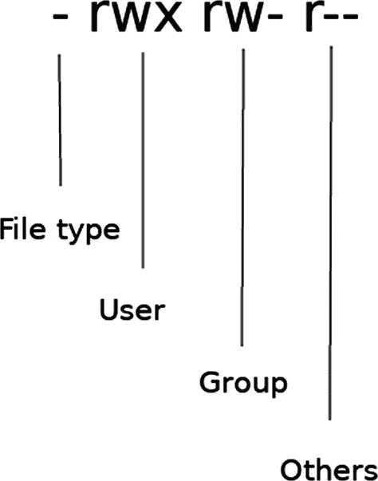
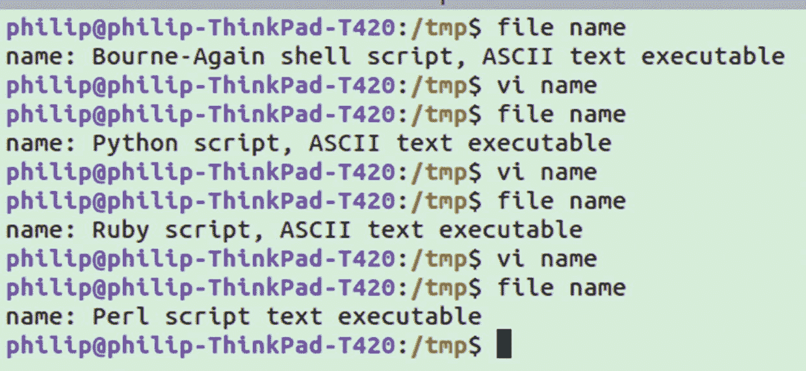
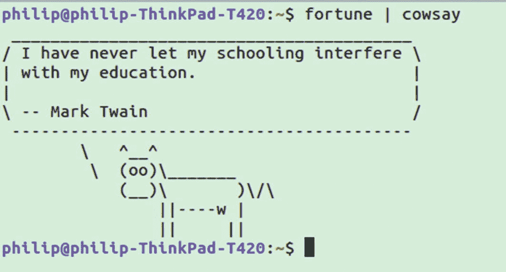
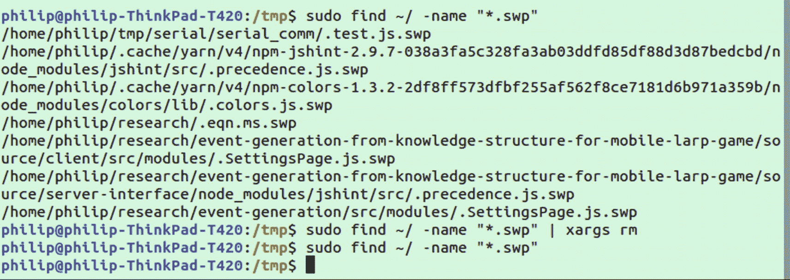

# 4.脚本和管道

## 创建脚本

一旦您熟悉了处理文件和使用各种命令，您很快就会发现您想要组合几个命令，有时会创建较长的序列，这可能会有些耗时。我们稍后会更详细地讨论，但现在最好知道这是可能的。创建一个命令列表来一个接一个地运行，就像写一个你需要购买的东西的购物清单一样简单(*一旦你知道了基本的步骤*)。

你只需使用任何编辑器打开一个文本文件(前面提到过 *nano，但是如果更简单的话，你甚至可以使用桌面文本编辑器*)。在文本文件的第一行，你写或粘贴一个特殊的行，称为“shebang ”,表示这个文件是一个脚本(更多细节在下一节*)。然后，您开始逐行列出要运行的命令。*

为经常运行的命令序列创建脚本会很方便。您可以将命令保存为文本文件，然后以单步方式运行该序列。从鸟瞰图创建脚本所需的步骤如下:

1.  创建包含命令的文本文件。

2.  使文件的第一行成为一个 shebang(稍后解释)。

3.  保存文件。

4.  使用权限使文件可执行(稍后解释)。

5.  运行命令`./myScript.sh`。

下面是一个名为`name.sh`的简单脚本的例子:

```sh
#!/usr/bin/env bash

echo First name: $1
echo Last name: $2

```

这个脚本有两个参数，一个用于名，一个用于姓。这些参数在代码中用`$1`和`$2`表示。它将通过运行以下命令来执行

```sh
./name.sh Philip Kirkbride

```

运行时将输出两行，第一行是“名字:Philip”，第二行是“姓氏:Kirkbride”。当然，除非您将输入换成您自己的名字，在这种情况下，这些名字将被换出。

在接下来的小节中，我们将更多地关注前面列表中的步骤 2 和 4，它们是实际运行脚本之前所需要的。

### 事情

shebang 指的是脚本中的第一行，当该行以`#!`开始时。这个词来自于音乐符号术语“升”和“T2”，有时被称为“砰”；将这两者结合起来就成了“sharp-bang”或简称 shebang。

shebang 用作文件的第一行时，指定将用于解释脚本的程序。与编写 Linux 脚本相关的最流行的方法是

```sh
#!/bin/bash

```

同样的事情可以用`/usr/bin/env`来表达，它通过使用在用户路径中找到的任何 bash 版本来增加可移植性。

```sh
#!/usr/bin/env bash

```

shebang 并不局限于 bash 脚本。在用其他脚本语言如`python`、`ruby`或`perl`编写脚本时，它也应该是第一行。

```sh
#!/usr/bin/env python

```

## 文件权限

如前所述，制作可执行脚本的第四步是更改文件的权限以允许执行。最简单快捷的方法就是跑步

```sh
chmod +x name.sh

```

这只是为当前用户添加了文件的执行权限。运行该命令后，您只需运行以下命令就可以使用它(假设您与该文件在同一个目录中):

```sh
./name.sh

```

理解 Linux 上权限的概念是值得的，因为它是操作系统的一个重要方面。每个文件都有三种不同类型的权限:

*   阅读

*   写

*   执行

这三种权限中的每一种都可以为三个组单独设置:

*   用户

*   组

*   其他人

使用`ls -l`时，可以看到左侧表示的每个文件的设置权限，如图 [4-1](#Fig1) 所示。


图 4-1

运行 ls -l 时第一列中显示的文件的权限

Note

这个十个字母序列中的第一个字母用于表示特殊的文件类型。可能的值是 D =目录，c =字符设备，s =符号链接，p =命名管道，s =套接字，b =块设备，D =门。我们不必处理这些特殊类型，但知道第一个字母是什么是值得的。

在表示特殊文件类型的第一个字母之后，还有九个字母。我们可以将这九个字母分成三组，如图 [4-2](#Fig2) 所示——第一组是文件所有者的文件权限，第二组是用户组的文件权限，第三组是所有其他用户的文件权限。



图 4-2

文件权限的组件

对于这三个部分，我们有三个不同的字母，如果存在，则表示组具有上述权限:

*   r =读取

*   w =写

*   x =执行

在给出的例子中，我们有一个文件，它的所有者拥有所有权限，用户组拥有读和写权限，而其他可以访问该文件的用户只有读权限。

权限数据也可以显示为一组三个数字符号，其中一个数字代表权限的组合。每种权限类型都有一个数值:

*   4 =读取

*   2 =写入

*   1 =执行

对于任何组，我们将权限相加，得到一个代表允许权限的数字。例如，读取和写入将为 6 (2 + 4)，写入和执行将为 3 (1 + 2)，无权限将为 0。

使用这种符号，我们将把`rxw rw- r--`表示为`764`。更改文件权限时，可以使用这两种表示法中的任何一种。例如，我们可以跑步

```sh
chmod 777 numbers.sh

```

这将所有权限授予所有用户。或者，如果我们想使用带字母的符号，我们可以运行下面的命令来取消所有组的执行权限(*注意*`-`*；如果要加的话，应该是* `+`):

```sh
chmod -x numbers.sh

```

如果我们希望对特定的列(用户、组或其他)使用数字表示法，我们可以首先指定组，例如，添加回执行权限，但仅限于所有者:

```sh
chmod u+x numbers.sh

```

## 文件类型

虽然我们已经使用文件类型`.sh`定义了我们的脚本，但这在 Linux 中实际上并不是必需的。我们可以很容易地将它命名为`name`而不是`name.sh`，它的工作方式也是一样的。

Note

一些团队更喜欢没有“`.sh`”扩展名的脚本，例如，Google Shell 风格指南实际上指定了不应该使用扩展名`.sh`。尽管如此，谷歌管理的几个公共存储库包含了包含`.sh`的 shell 脚本。这只是表明，即使在一个声明偏好的公司，你也不能确定脚本是否会包含`.sh`扩展。

检测文件类型的一个有用命令是`file`。为了进行试验，首先将文件名`name.sh`改为`name`。接下来运行以下命令:

```sh
file name

```

您应该得到一条消息，说明文件类型是 Bourne-Again shell 脚本。接下来，尝试打开文件，将 shebang 编辑成 python 的 shebang，如 she bang 部分所列。

```sh
#!/usr/bin/env python

```

保存后，再次尝试运行`file`。重复这个过程，尝试不同的 shebangs，包括 python、ruby 和 perl。您应该会得到类似于图 [4-3](#Fig3) 所示的结果。



图 4-3

通过编辑菜单更改文件类型的结果

## 管道

管道是基本语法最常见的特性之一。如果你对它们很熟悉，可以跳过这一部分。管道只是将一个命令的输出作为输入连接到另一个命令。我们将用一个有趣的例子来演示这个概念。

开始安装`fortune`和`cowsay`:

```sh
sudo apt-get install fortune-mod cowsay

```

Fortune 是一个完整的小命令行程序，其历史可以追溯到 20 世纪 90 年代早期的 Linux 版本 7。它只是生成一个随机的引用，例如，在我的电脑上运行该命令现在返回

> “你永远不知道你有多少朋友，直到你在海滩上租了一所房子。”
> 
> T3】

自己跑几次`fortune`试试吧。每次运行时，都会从一个长列表中随机输出一个报价。现在为了好玩，让我们将输出通过管道传输到`cowsay`:

```sh
fortune | cowsay

```

现在我们在图 [4-4](#Fig4) 所示的一小段文字艺术中找回一份随机的财富。



图 4-4

给考赛输送财富

由于产生的财富来自随机列表，您看到的应该与图 [4-4](#Fig4) 中的不同。这里发生的事情是，fortune 代码的输出被用作`cowsay`命令的输入。接收命令完全不知道生成所述文本的过程。

例如，我们可以用一个简单的`echo`替换我们的`fortune`命令:

```sh
echo hello world | cowsay

```

在这种情况下，如你所料，奶牛会说“你好，世界”。可以使用的管道数量没有限制。在将文本发送给 cow say 之前，我们可以在两个命令之间使用另一个管道来进一步处理我们的文本:

```sh
echo hello world | rev | cowsay

```

在这种情况下，我们的“hello world”文本在到达`cowsay`命令之前被反转为“dlrow olleh”。在下一节中，我们将更多地研究如何使用多个管道。

## 多管道

在本书中，除了简单地探索命令行程序之外，我们还将编写 bash 脚本。随着您开始编写更多的 bash 脚本，您会经常发现您需要使用 pipe，不是一次而是多次。

对于用管道将命令行程序串在一起的复杂脚本，您会发现您的脚本开始看起来有点乱。最有用的格式化技术之一是多行管道。这只是当你使用`\`将一系列管道分成多条线时。

如果您的命令管道可以很好地放在一行中，如下所示，您就不需要担心将它分散在多行中:

```sh
# All fits on one line
command1 | command2

```

但是，如果您在一个链中使用多个命令，并且它超出了一行或看起来难以阅读，请将它分散到多行，如下所示:

```sh
# Long commands
command1 \
  | command2 \
  | command3 \
  | command4 \

```

前面的例子来自 Google Shell Style Guide，这是一个很好的资源，提供了让 Shell 脚本更具可读性的技巧。一些指导原则与公司的内部偏好有关(例如，使用两个空格而不是制表符)，而其他提示通常适用于所有 shell 脚本。

一旦您对编写 shell 脚本变得更加熟悉，并且发现您经常这样做，那么您应该看看 Google Style 脚本风格指南。它将帮助您考虑使您的脚本对可能遇到您的脚本的其他开发人员或系统管理员更具可读性的因素。

[T2`https://google.github.io/styleguide/shell.xml`](https://google.github.io/styleguide/shell.xml)

## 用&&和||链接命令

在这一节中，我们将讨论 bash 中内置的一些可以派上用场的逻辑语法——具体来说，可以用作 AND 的`&&`和可以用作 OR 的`||`。

```sh
&& the operator for "and"
|| the operator for "or"

```

当您需要使用一个长时间运行的命令后跟另一个命令时，这非常有用。例如，假设你连接到一个互联网连接缓慢的物联网设备，你需要更新系统，一旦完成，安装一个新程序。你可以简单地跑

```sh
sudo apt-get update \
  && sudo apt-get install -y program-x

```

注意使用的`-y`标志；这告诉 apt-get 在被要求确认时回答 yes。

这在与`tmux`(一个用于在终端实例之间快速切换的程序，我们将在后面的章节中深入探讨)结合使用时非常有用。在之前的一份工作中，我经常发现自己在现场不得不 SSH 到五到十个不同的物联网设备。将多个命令串在一起，我可以给一个设备足够的工作，让它忙碌 15 分钟，然后立即切换到已经通过 SSH 连接到另一个设备的另一个 tmux 会话，并立即开始工作。

当您知道需要运行第二个命令时，or 运算符||同样有用，但只有在第一个命令失败的情况下。例如，假设我们的物联网设备有一个常见问题，如果一个命令失败，我们可能会用完磁盘空间；在上述情况下，我们希望删除所有日志:

```sh
sudo apt-get install -y program-x \
  || sudo rm -rf /var/log/*

```

### &和||的退出代码

应注意的是，是否触发`||`或`&&`取决于其之前命令的退出代码。仅仅输出标准误差是不够的。例如，让我们在`/tmp/err.sh`写一个如下的文件:

```sh
#!/usr/bin/env bash
>&2 echo Error

```

用`chmod +x /tmp/err.sh`使文件可执行，然后用如下的`||`语句运行命令:

```sh
/tmp/err.sh || echo error

```

注意，您得到了标准的错误文本，但是`echo error`命令从未运行过。这是因为我们的程序仍然返回一个退出代码 0。我们可以通过在脚本底部添加以下内容来查看退出代码:

```sh
echo $?

```

现在，当运行脚本时，您应该会看到一个额外的“0”输出。如果你想改变退出命令，你可以使用`exit`命令。在我们脚本的底部，添加

```sh
exit 1

```

现在，如果我们用我们的`||`语句再次运行脚本，我们将看到`echo error`命令触发。这里我们不局限于退出代码 1，数字 0-255 都是有效的退出代码。退出代码 0 表示执行成功，而代码 1–255 表示错误。其中一些退出代码通常用于特定的错误；其他的留给程序特定的错误。标准错误代码编号及其含义见表 [4-1](#Tab1) 。

表 4-1

退出代码的标准含义

<colgroup><col class="tcol1 align-left"> <col class="tcol2 align-left"></colgroup> 
| 

密码

 |   |
| --- | --- |
| Zero | 默认情况下，命令运行没有问题 |
| one | 所有非特定错误的总称 |
| One hundred and twenty-six | 调用的命令不可执行 |
| One hundred and twenty-seven | 找不到命令 |
| One hundred and twenty-eight | 退出的参数无效 |
| 128+n | 致命错误信号“n” |
| One hundred and thirty | 按 ctrl+c 结束脚本 |
| 255* | 退出状态超出范围 |

如您所见，即使有这些保留的误差范围，也有足够的空间让您定义自己的定制误差。如果您的脚本有多种可能失败的方式，并且您想要一种以编程方式检测这些特殊情况的方法，那么这将非常有用。

### 将&&与||一起使用

对于更复杂的用例，您还可以将操作符混合在一起。比方说，我们想使用`grep`检查一个字符串是否在文本文件中，然后将单词“true”或“false”传递给`cowsay`程序。在这种情况下，我们需要引入括号的用法:

```sh
( grep -q dog /tmp/test && echo true || echo false ) \
  | cowsay

```

类似于在 math 中使用括号，括号内的语句将被求值并通过管道传递给 cowsay，如图 [4-5](#Fig5) 所示。如果文件`/tmp/test`存在，并且包含单词 dog，我们应该看到如下内容:


图 4-5

根据一个条件说对或错

当然会返回 false，因为文件`/tmp/test`不存在。尝试创建包含“狗”的文本文件。您可以使用命令快速完成这项工作

```sh
echo dog > /tmp/test

```

一旦运行了这个命令，运行前一个命令应该会返回`true`。这里使用的`>`符号是一个重定向，我们将在下一节中更仔细地研究它。

## 重新寄送

正如我们在上一节中看到的，我们可以使用`>`字符将文本发送到一个文件中，而不是通过管道发送到另一个程序中。这可以通过任何程序的输出来完成。使用标准重定向时，您应该知道该文件中的任何现有内容都将被覆盖。运转

```sh
echo dog > /tmp/test
echo cat > /tmp/test

```

将导致`/tmp/test`只包含文本“cat”。如果您想在文件中添加文本而不是替换内容，您应该使用`>>`:

```sh
echo dog >> /tmp/test
echo cat >> /tmp/test

```

这将产生一个包含两行的文件，一行是“狗”，一行是“猫”。

默认情况下，重定向中的输出包含输出和任何错误。相反，我们可以通过添加

```sh
echo cat > /tmp/test 2> /tmp/error

```

但是，在前面的示例中，没有创建任何错误。要在单个命令中生成标准输出和标准错误，请在现有文件和不存在的文件上使用`ls`:

```sh
ls /tmp/test /tmp/nope777 > /tmp/test 2> /tmp/error

```

运行前面的命令后，您应该在`/tmp/test`文件和`/tmp/error`中都有内容。和普通的重定向一样，我们可以使用`>>`来追加而不是替换文本:

```sh
ls /tmp/test /tmp/nope777 >> /tmp/test 2>> /tmp/error

```

如果多次运行前面的命令，每次运行时，每个文件中都会有几行。

### 用三通立即重新定向和输送

将输出重定向到文件和管道都是强大的工具，但是如果您想同时做这两项工作呢？一个名为`tee`的流行实用程序就是为此而存在的。它复制输入并将其发送到文件和输出，如图 [4-6](#Fig6) 所示。


图 4-6

tee 命令的输出图

`tee`命令从标准输出中获取输出，将其保存到您选择的文件中，然后将该输出传递给它自己的标准输出。例如，假设我们有以下命令，使用重定向将输出“hello”写入一个名为`greeting`的文件:

```sh
echo hello > greeting

```

运行前面的命令，我们将在我们的`greeting`文件中以“hello”结束，但是在我们的标准输出中将看不到任何内容。为使用`tee`而修改的相同程序应该是

```sh
echo hello | tee greeting

```

对于`tee`，我们将在`greeting`文件中以“hello”结束，但是我们在标准输出中也会看到“hello”。如果您想让`tee`像`>>`一样追加到文件中，而不是像`>`那样替换文本，您可以使用`-a`标志。

另一个使用 tee 的例子，假设我们想将一个数学方程传递给数学实用程序`bc`进行处理。我们将把结果输出到一个名为`math`的文件中，但是我们也想显示得出结果的等式。我们可以使用下面的命令来利用`tee`:

```sh
echo "7 * 7" | tee math.txt | bc >> math.txt

```

这导致文件`math.txt`被写入两次。一次使用三通和输入，第二次通过'【T1]'。文件`math.txt`应该包含:

```sh
7 * 7
49

```

### xargs

虽然在多个文件上运行命令时通配符有利于文件扩展，但有时您可能希望在另一个命令的每一行输出上运行一个命令。为此我们可以用`xargs`来演示；我们将使用一个可以通过通配符轻松完成的命令:

```sh
ls | xargs cat

```

前面的命令与`cat *`的输出相同；它输出当前目录中每个文件的内容。区别在于如何做。我们没有扩展通配符并将每个文件传递到一个单独的`cat`命令中，而是从`ls`命令中取出每一行输出，并将其用作每一行单独的`cat`命令的输入。

使用`xargs`允许你做用通配符不可能做的事情。例如，假设我想删除某一类型的所有文件。我将使用的一个例子是`.swp`文件；这些是文本编辑器 Vim 的恢复文件。在我的例子中，它们不包含任何有用的数据，而是由于突然退出程序而留下的(例如，在没有关闭编辑器的情况下关闭终端窗口)。我可以通过运行以下命令在我的主目录上运行查找和删除

```sh
find ~/ -name "*.swp" | xargs rm

```

这将获取由`find`返回的每个结果，并对其运行`rm`。我在命令前后跑了`find`，演示所有的`.swp`文件都被删除了，如图 [4-7](#Fig7) 所示。



图 4-7

使用`find`搜索 swp 文件的结果

## Bash 中的条件表达式

当您开始通过命令行使用`&&`和`||`组合程序的几个组件时，您可能会发现编写专用脚本比从命令行手动输入一长串命令更容易。当您从命令行转向编写脚本时，使用一些更复杂的语法工具会更容易。

其中一个工具是 if 语句，它更像是一系列可能的测试，每个测试都有自己特定的选项。例如，如果我们想检查一个文件是否存在，我们可以使用`-e`选项。创建一个脚本并添加以下内容:

```sh
if [ -e /etc/passwd ]; then
  echo passwd exists
fi

```

当您运行脚本时，您应该得到输出“passwd exists”。尝试将`/etc/passwd`更改为不存在的文件。或者如果您想测试该文件是否不存在，您可以添加一个`!`,如下所示:

```sh
if [ ! -e /etc/passwd ]; then

```

与其他语言一样，我们可以在 if 语句中添加一个`else`:

```sh
if [ -e /etc/passwd ]; then
  echo passwd exists
else
  touch /etc/passwd
fi

```

前面的语法适用于几种不同的可能的测试，这些测试可以通过替换`-e`来运行。列表很长，可以通过运行`man bash`并向下滚动到条件表达式部分找到。表 [4-2](#Tab2) 中显示了一些更常用的标志。

表 4-2

条件表达式选项

<colgroup><col class="tcol1 align-left"> <col class="tcol2 align-left"></colgroup> 
| 

密码

 |   |
| --- | --- |
| -d | 如果存在并且是目录，则为 True |
| -f | 如果存在并且是常规文件，则为 True |
| -e | 如果存在，则为真 |
| 构成名词复数 | 如果文件存在并且大小大于 0，则为 True |
| ［加在以-u 结尾的法语词源的名词之后构成复数］ | 如果存在并且是可执行文件，则为 True |

### 是一个带有-d 的目录

`-d`标志可用于确认文件存在并且是一个目录。如果您想使用一个目录，但不确定它是否存在，或者如果它存在，它是一个目录而不是一个文件，这将非常有用。这里显示了一个使用`-d`的例子:

```sh
mkdir /tmp/test
if [ -d /tmp/test ]; then
  rmdir /tmp/test
fi

```

### 是一个带有-f 的普通文件

标志`-f`类似于`-d`，但是告诉我们一个文件是否是一个常规文件，而不是一个目录。同样，这可以在使用文件之前使用，以确保它存在并且是正确的类型。这里显示了一个`-e`的例子:

```sh
touch /tmp/test
if [ -f /tmp/test ]; then
  rm /tmp/test
fi

```

### 用-e 检查文件是否存在

`-e`是`-f`和`-d`的一种组合，因为它只测试文件是否存在，而不考虑文件的类型。这里显示了一个使用`-e`的例子:

```sh
touch /tmp/test
if [ -e /tmp/test ]; then
  rm -rf /tmp/test
fi

```

### 使用-s 检查是否存在以及大小是否大于 0

如果您正在处理一个文件的内容，您可能还想知道这个文件中是否有内容。在这种情况下，您可以使用`-s`，只有当文件存在并且大小大于 0 时，它才会返回 true。这里显示了一个使用`-s`的例子:

```sh
touch /tmp/test
if [ -s /tmp/test ]; then
  echo “doesn’t run”
fi
echo data > /tmp/test
if [ -s /tmp/test ]; then
  echo “does run”
fi

```

### 使用-x 检查是否存在以及是否是可执行文件

如果您对文件的使用实际上是将其作为程序执行，您可能希望在执行之前确认该文件是否存在。这就是`-x`派上用场的地方，它检查文件的文件权限以确认它是可执行的。尽管请记住，这只是检查文件权限以确认文件是可执行的，但它实际上并不检查文件是否包含脚本。在下面的例子中，我们的可执行文件实际上只是一个空白文件，然而在运行了`chmod +x /tmp/executable`之后，`-x`标志将它识别为可执行文件:

```sh
touch /tmp/executable
if [ -x /tmp/executable ]; then
  echo “doesn’t run”
fi
chmod +x /tmp/executable
if [ -x /tmp/executable ]; then
  echo “does run”
  bash /tmp/executable
fi

```

也可以使用类似的语法来比较字符串。用于比较字符串的标志列表如表 [4-3](#Tab3) 所示。

表 4-3

字符串比较条件

<colgroup><col class="tcol1 align-left"> <col class="tcol2 align-left"></colgroup> 
| 

密码

 |   |
| --- | --- |
| -z S1 | 如果 S1 是长度为 0 的字符串，则为 True |
| S1 北部 | 如果 S1 是长度大于 0 的字符串，则为 True |
| S1 == S2 | 如果 S1 和 S2 是同一字符串，则为 True |
| S1！= S2 | 如果 S1 和 S2 不是一个字符串，则为真 |
| S1 < S2 | 如果 S1 排在 S2 之前，则为真 |
| S1 > S2 | 如果 S2 排在 S1 之前，则为真 |

### 检查值是长度为 0 的字符串，带有-z

在编程或编写脚本时，一个未设置的或空的变量通常会带来麻烦。Bash 提供了一种使用`-z`标志检查变量是否为空的方法。这里显示了一个示例:

```sh
S1=""
if [ -z $S1 ]; then
  echo "is empty string"
  S1=”something”
else
  echo "not empty"
fi

```

### 检查值是带有-n 的非空字符串

如果不是检查空值，而是想检查值是否不为空，可以使用`-n`。它本质上与`-z`相反，对于任何非空字符串都将返回 true。下面是一个例子，其中我们只在变量`$S1`不为空时才使用它:

```sh
S1="something"
if [ -n $S1 ]; then
  echo $S1
else
  echo "variable is empty"
fi

```

### 检查字符串是否相等

像许多编程语言一样，bash 也提供了检查字符串是否相等的方法。这可以用双等号`==`来完成。一个简单的例子如下:

```sh
S1="something"
S2="something"
if [ $S1 == $S2 ]; then
  echo "same"
else
  echo "not the same"
fi

```

### 检查字符串是否不相等

正如您所料，我们可以通过使用`!=`以类似的方式测试字符串是否相等。下面是一个示例，它将返回文本“same”:

```sh
S1="something"
S2="something"
if [ $S1 != $S2 ]; then
  echo "not the same"
else
  echo "same"
fi

```

### 检查字符串排序顺序

在处理字符串时，我们也可以使用`>`和`<`符号进行比较。第一次看到这些，你可能会认为它们比较的是数值或者哪个字符串更长。实际上，字符串使用的大于号和小于号检查排序顺序。

默认情况下，这是按字母顺序。为了演示排序，我们可以运行以下命令；请随意用数字或符号替换字母:

```sh
letters='a y b v b c'
echo "$letters" | tr ' ' '\n' | sort | tr '\n' ' '

```

运行前面的命令应该会返回“a b b c v y”。您可以忽略`tr`命令，它只是将空格转换成换行符，并在排序后用空格替换换行符。您可以尝试使用前面的命令来了解事情是如何排序的。

该排序顺序用于`>`和`<`符号。在下面，我们有一个使用`<`的例子:

```sh
S1="a"
S2="b"
if [ $S1 < $S2 ]; then
  echo $S1 sorts before $S2
else
  echo $S2 sorts before $S1
fi

```

除了测试文件和字符串，还支持测试整数。表 [4-4](#Tab4) 概述了比较整数的几种方法。注意在表 [4-4](#Tab4) 中，N1 和 N2 是可以包含任何整数的变量。

表 4-4

算术运算符

<colgroup><col class="tcol1 align-left"> <col class="tcol2 align-left"></colgroup> 
| 

密码

 |   |
| --- | --- |
| N1-情商 N2 | 如果 N1 等于 N2，则为真 |
| n1-N2 | 如果 N1 不等于 N2，则为真 |
| N1-N2 中尉 | 如果 N1 小于 N2，则为真 |
| N1 勒 N2 | 如果 N1 小于或等于 N2，则为 True |
| N1 -gt N2 | 如果 N1 比 N2 更伟大 |
| N1-葛 N2 | 如果 N1 大于或等于 N2，则为真 |

### 检查数字是否相等

在比较数字时，有一套完全不同的标志可以使用。其中之一是`-eq`标志，它检查两个数字是否相等。`-eq`的使用示例如下:它应该返回“1 和 1 相等”:

```sh
N1=1
N2=1
if [ $S1 -eq $S2 ]; then
  echo $N1 and $N2 are equal
else
  echo $N1 and $N2 are not equal
fi

```

### 检查数字是否不相等

为了检查数字是否不相等，使用`-ne`标志。这和`-eq`本质上是一样的但是相反。使用`-ne`的例子如下:它应该返回“1 和 2 不相等”:

```sh
N1=1
N2=2
if [ $S1 -ne $S2 ]; then
  echo $N1 and $N2 are not equal
else
  echo $N1 and $N2 are equal
fi

```

### 检查数字是否小于

我们还可以使用一个标志来检查一个数字是否小于另一个数字。使用`-lt`的例子如下:它应该返回“1 小于 2”:

```sh
N1=1
N2=2
if [ $S1 -lt $S2 ]; then
  echo $N1 is less than $N2
else
  echo $N1 is not less than $N2
fi

```

### 检查数字是否小于或等于

标志`-le`与`-lt`几乎相同，唯一的例外是，如果数字彼此相等，它也返回 true。下面显示了一个例子，其中相等的数字触发 true，尽管如果`$N1`小于`$S2`，它也会触发 true。运行代码应返回“2 小于或等于 2”:

```sh
N1=2
N2=2
if [ $S1 -le $S2 ]; then
  echo $N1 is less than or equal to $N2
else
  echo $N1 is not less than or equal to $N2
fi

```

### 检查数字是否大于

每当您有能力检查一个数是否小于时，您很可能也有能力检查它是否大于。bash 就是这种情况，您可以使用`-gt`标志来检查一个数字是否大于。下面是一个使用`-gt`标志的例子。以下应返回“3 大于 2”:

```sh
N1=3
N2=2
if [ $S1 -gt $S2 ]; then
  echo $N1 is greater than $N2
else
  echo $N1 is not greater than $N2
fi

```

### 检查数字是否大于或等于

如果你想匹配大于或等于，你可以使用`-ge`。其用法示例如下。运行以下代码应返回“3 大于或等于 3”:

```sh
N1=3
N2=3
if [ $S1 -ge $S2 ]; then
  echo $N1 is greater than or equal to $N2
else
  echo $N1 is not greater than or equal to $N2
fi

```

虽然前面的代码很方便，但是还有一些使用双括号的算术表达式的语法，我们将在下一节中讨论。

## 带双括号的算术

虽然在 bash 中使用方括号括起来的测试比较整数是可能的，但是最好使用双括号，它允许使用任何使用另一种语言编程的人都熟悉的语法，例如:

```sh
if ((2 < 3)); then
  echo 3 is greater than 2
fi

```

在前面的代码中，恰好`((2 < 3))`的计算结果为 true。我们在这里使用硬数字，但在大多数情况下，你会比较变量，可以用在他们的地方。

```sh
((N1 < N2))

```

如果你想用数学来设置一个变量，你还需要使用双括号，前面加一个美元符号，例如:

```sh
N1=$((1+1))
if ((N1<3)); then
  echo 3 is greater than $N1
fi

```

无论您是否将结果设置为变量，无论何时您想要使用结果，都需要使用`$`,即使我们只是想要`echo`结果:

```sh
echo $((1+3))

```

请注意，如果您尝试使用不带双括号的算术，它会将数字附加为字符串，例如:

```sh
N1=2
N1+=1
echo $N1

```

前面的代码返回“21”，而

```sh
N1=2
((N1+=1))
echo $N1

```

将返回 3。

### 带括号的子外壳

我们已经看到了双括号的作用，但是单括号呢？当代码放在括号内时，它作为一个子 shell 运行。复制当前的 shell 运行时并创建一个新的。这样做的效果是，子外壳中发生的任何事情都不会影响外壳，例如:

```sh
S=Hi
(
  echo $S
  S=Hello
  echo $S
)
echo $S

```

在前面的脚本中，我们创建了一个变量`S`。然后我们打开一个 subshell 并`echo`这个值；注意，subshell 可以看到创建时就存在的`S`变量的值。然后我们在 subshell 中改变`S`的值。

在 subshell 的外面，我们再次`echo`这个值。该值仍然是“Hi”而不是“Hello ”,因为更改是在 subshell 内部进行的。

子 shell 本身又可以产生自己的子 shell，作为子进程。

### 用花括号展开

bash 内置的另一个符号是花括号`{}`。花括号可以用于列表的外壳扩展。例如

```sh
echo {1..100}

```

将扩展为 1 到 100 之间的所有数字。


图 4-8

使用扩展回显 1 到 100

我们还可以指定增量。例如，如果我们想每次增加 2，我们可以这样做

```sh
echo {1..100..2}

```

现在我们将只得到奇数( *1，3，5 等)。*)。同样的技术可以应用于字母和数字。

```sh
echo {a..z..2}

```

前面的代码将返回所有奇数字母( *a，c，e 等)。*)。

我们甚至可以把这两个结合起来，比如说我们想要每个字母的两个版本:

```sh
echo {a..c}{1..2}

```

这将返回一个包含( *a1 a2 b1 b2 c1 c2* )的小集合，尽管我们可以根据自己的喜好将它变得复杂和长。例如，假设我们想要打印总共五位数的二进制数的所有组合:

```sh
echo {0..1}{0..1}{0..1}{0..1}{0..1}

```

另一个用例，假设我们想在`/tmp`中创建一个文件列表:

```sh
touch /tmp/{file1,file2,file3}

```

或者更好:

```sh
touch /tmp/file{1..3}

```

这两个命令都将在`/tmp`目录中生成三个文件。

## Bash 中的循环

像其他语言一样，bash 也提供了一种对一组项目进行循环的方法。例如，给定一组姓名，我们可以为每个姓名打印“hello ”:

```sh
for name in jesse james jen
do
  echo "Hello $name"
done

```

这对于我们在上一节中看到的扩展非常有用，例如:

```sh
for i in {1..100}
do
  echo "Hello $i"
done

```

我们也可以用一个`i++`语句做一个传统风格的循环，你可能在其他语言中见过:

```sh
for ((i=1;i<=100;i++));
do
  echo "Hello $i"
done

```

也有可能形成无限循环:

```sh
for (( ; ; ))
do
  echo "Hello [CTRL+C to stop]"
done

```

在某些情况下，您可能希望尽早脱离循环。

```sh
for i in {1..100}
do
  if((i==10))
  then
    break
  fi
  echo "Hello $i"
done

```

在前面的例子中，第 1–9 次运行，但是在第 10 次运行之前，我们点击了`break`关键字来提前停止循环。或者，我们可以使用`continue`关键字来结束当前的迭代，而不退出循环。作为一个例子，我们将使`continue`在所有偶数上触发。*注意* `if` *行的空格，因为缺少空格会导致脚本无法正常运行。*

```sh
for i in {1..100}
do
  if [ $((i%2)) -eq 0 ];
  then
    continue
  fi
  echo "Hello $i"
done

```

前面的脚本将对数字 1 到 100 运行循环，但是任何被发现是偶数的数字将提前退出循环，为下一个数字让路。这是因为在`i`为偶数的迭代中，会读取`continue`关键字，导致迭代提前结束。

也可以使用数组作为循环的数据提供者。数组是使用 bash 定义的，如下所示:

```sh
array=( 1 39 47 )

```

然后，要使用该数组，需要使用花括号对其进行扩展:

```sh
for i in ${array[@]}
do
  echo "Hello $i"
done

```

虽然我们在这里使用了整数，但是您也可以在数组中使用字符串或其他数据类型。

### While 循环

在某些情况下，使用`while`循环可能比使用`for`循环更好。您可能希望根据与迭代次数无关的值来结束循环，而不是设定迭代次数。例如，假设我们想知道在 7 秒钟内我们可以循环多少次代码。

Note

对于下面的例子，您需要将代码放入一个脚本文件，并运行`chmod +x`来添加执行权限。这是因为我们使用了特殊变量`$SECONDS`。`$SECONDS`变量包含终端，或者在我们的例子中，脚本，已经运行的秒数。

```sh
#!/usr/bin/env bash

i=0
while [ $SECONDS -lt 7 ]; do
  i=$((i+1))
done

echo $i

```

执行该脚本将返回循环在 7 秒内能够运行的次数。你可能会惊讶于这个数字有多高。在我的例子中，循环运行了 927375 次。

while 循环允许我们像 for 循环一样，在没有特定数字的情况下限制代码段的运行。虽然我们使用了时间的例子，但是你也可以使用一些外部值。例如，如果一个网站关闭了，你可能需要每隔几分钟检查一次，直到它恢复。

```sh
working=false
while [ $working == false ]; do
  curl google.com && working=true
  echo $working
  sleep 60
done

```

前面的脚本可能只运行一次，因为我们正在检查 [`www.google.com`](http://www.google.com) 。如果你想知道当一个网站关闭时它是如何工作的，试着把这个网站切换到一个不存在的网站(因此总是会失败)。

while 循环也使得无限循环变得特别容易。要使一个循环永远运行，只需使检查值`true`如下所示。下面是一个脚本示例，它会每分钟说一次“hello ”,直到关闭:

```sh
while [ true ]; do
  echo "hello"
  sleep 60
done

```

### 直到循环

until 循环与 while 循环几乎相同，只是我们不是检查值是否为真，而是检查值是否为假。请注意，下面的脚本与我们的 while 循环几乎相同，但我们不是在 while false 时运行，而是一直运行到 true:

```sh
working=false
until [ $working == true ]; do
  curl google.com && working=true
  echo $working
  sleep 60
done

```

## Bash 中的引用

bash 中的引号可以用来防止特殊字符被解释，而是被解释为它们的文字值。例如，我们`echo`以下符号，如果没有引号，这些符号会导致错误:

```sh
echo '$ & * ; |.'

```

通过用引号将这些特殊字符括起来，我们使它们具有了字面意义。

双引号类似于单引号，但是仍然允许处理美元符号、反引号和反斜线。在下面的示例中，双引号中的变量将被扩展，而单引号中的变量不会被扩展:

```sh
greeting=hello

echo '$greeting world'
echo "$greeting world"

```

另一个例子是如何解释空格；考虑以下两个命令:

```sh
touch hello world
touch “hello world”

```

由于空格是 bash 中的默认分隔符，第一个命令会将输入作为两个独立的参数处理，而使用引号的命令会将输入视为一个文件名。

### 使用反斜杠的命令替换

反引号与单引号和双引号完全不同。反勾号不会阻止对特殊字符的解释，而是会导致在求值之前对包含的文本进行解释。

为了演示，我们将使用下面的命令，该命令将一个加法语句传送到`bc`中，以生成一个数字:

```sh
echo 5 + 5 | bc

```

前面的代码将输出数字 10。现在，假设我们想在一个更大的命令中使用这个命令。例如，我们将使用该命令的结果作为要创建的文件的名称。

```sh
touch /tmp/`echo 5 + 5 | bc`

```

在前面的示例中，反勾号中的命令将首先被解释。一旦反斜线被解释，该命令将作为

```sh
touch /tmp/10

```

当您有一个生成文件名或脚本其他方面的动态过程时，这可能会很有用。

## 定义函数

如果您正在编写一个脚本，您可能希望将一个代码块定义为一个可重用的函数。当您在整个脚本中的多个地方使用同一段代码时，这是非常有用的。通过将一些功能包装成一个命名函数，您可以避免重写相同的代码，如果您决定更改所使用的代码，也可以避免在多个位置进行更新。

在 bash 中创建函数相当容易。我们将创建一个非常简单的例子。首先，我们将创建一个名为`greet`的函数，它将一个名字作为输入，输出“hello”和这个名字。

```sh
greet() {
  echo hello $1
}

```

定义了前面的代码后，我们现在可以运行

```sh
greet David

```

这将把输入“David”传递给我们的`greet`函数中的`echo hello $1`。请注意，传递给函数的变量没有命名，而是按照它们的输入顺序指定的。如果我们想处理第二个参数，我们将把它添加为`$2`，第三个参数将是`$3`，以此类推。

缺少命名参数并不是 bash 中唯一缺少的特性。在编写函数时，有其他语言经验的人期望发现的另一件事是从函数返回值的能力。不幸的是，没有像您期望的那样可以在函数内部使用 return 关键字。作为一种解决方法，您可以在函数内部定义一个变量，并在函数外部使用它。为了演示这一点，我们将创建一个随机时间生成器，它可以用作测试脚本的一部分。

Note

我们将使用`shuf`命令来生成随机数。您不需要担心安装它，因为它是 GNU Coreutils，并且几乎存在于所有的 Linux 系统上。

```sh
random_time() {
  hour=$(shuf -i 0-12 -n 1)
  min=$(shuf -i 0-60 -n 1)

  hour=$(printf %02d $hour)
  min=$(printf %02d $min)
  r_time=$min:$hour
}

```

定义了我们的随机时间生成函数后，让我们运行它并`echo`结果。我们将这样做两次，以确保每次都获得不同的值。

```sh
random_time
echo $r_time

random_time
echo $r_time

```

## 来自文件的源代码

如果您来自另一种编程语言，您可能习惯于从外部文件导入源代码。导入相对简单。假设我们已经将上一节中的`random_time`函数保存为`random.sh`。首先从上一节中获取`random_time`函数，我们在这里定义并保存它为一个名为`random_time.sh`的脚本文件。确保在第一行包含一个 shebang(本节后面的例子作为参考)，保存后在上面运行`chmod +x`。

现在我们已经将`random_time`函数保存为`random_time.sh`，我们将在同一目录下的另一个文件中使用它。为此，创建一个名为`sourcing.sh`的新脚本文件；包括此处显示的代码:

```sh
#!/usr/bin/env bash

source random_time.sh
random_time
echo r_time

```

如果您不在与`random_time.sh`文件相同的目录中，请确保使用完整路径。文件导入后，您可以使用文件中定义的任何变量或函数。

## 摘要

在这一章中，我们从管道和重定向开始，它们可以用来将不同的 Unix 实用程序和命令粘合在一起，或者直接处理输出，或者保存到文件中。

然后我们看了 bash 脚本语法的各个方面，包括条件表达式、函数、引号和导入文件。