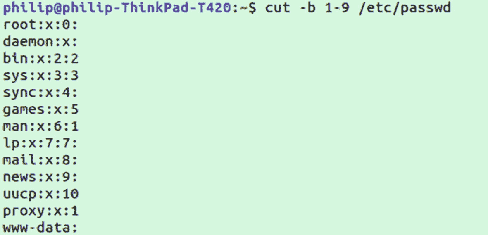
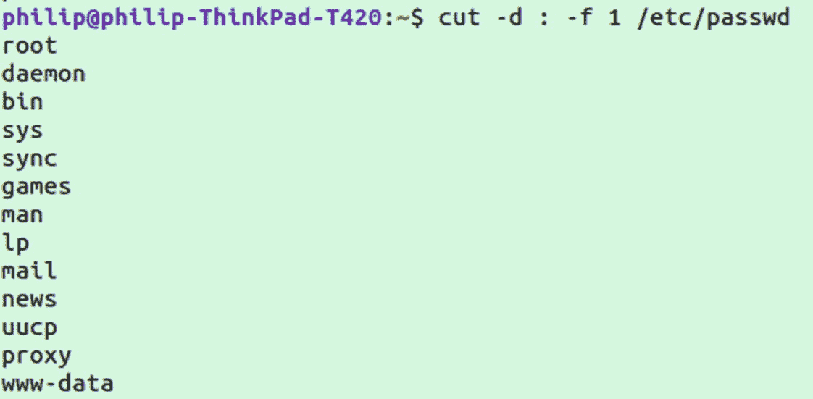
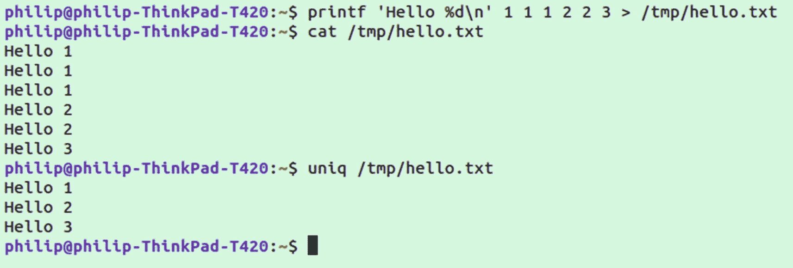

# 十、解析文本

无论您在 Linux 上做什么，您可能会发现自己在某个时候需要解析文本。由于 Linux 在很大程度上是基于文件的，因此非常需要能够解析大量文本以找到特定值、格式化并处理它的实用程序。

有几个实用程序可用于解析文本。在这一章中，我们将看看这些工具中的几个，以及如何用它们来解析文本。

## 可做文件内的字符串查找

`grep`是最常用的命令行工具之一。它允许您在一组文本中查找特定的字符串。例如，给定一个有几行的文件，我们可以找到包含我们要找的文本的那一行。例如，让我们在`/etc/passwd`文件中找到根用户。

```sh
cat /etc/passwd | grep root

```

您应该得到如图 10-1 所示的单个条目。


图 10-1

从/etc/passwd 中抓取根目录

或者更好的是，我们可以直接在文件本身上执行`grep`,而不需要管道:

```sh
grep root /etc/passwd

```

你也可以做相反的工作，在没有的情况下查找行，为此添加代表反匹配的`-v`标志:

```sh
cat /etc/passwd | grep -v root

```

这应该会为系统中的其他用户返回类似的条目。`-v`标志只是可以和`grep`一起使用的众多选项之一；详见表 10-1 。

表 10-1

grep 的选项

<colgroup><col class="tcol1 align-left"> <col class="tcol2 align-left"></colgroup> 
| 

旗

 | 

描述

 |
| --- | --- |
| -e | 正则表达式模式 |
| ［构成来自拉丁语、结尾为-us 的名词的复数］ | 忽略大写/小写 |
| -v | 反转匹配 |
| -c | 竞赛比赛 |
| 同-EN | 匹配前获取 X 行并显示行号(*需要数字输入*) |
| -h | 匹配行前不显示文件名(当抓取单个文件时默认为 |
| ［加在以-u 结尾的法语词源的名词之后构成复数］ | 精确线匹配 |
| -f | 从文件中加载正则表达式 |
| 表示“具有…性质的” | 仅输出一行中匹配的部分 |
| ［构成动植物的古名或拉丁化的现代名］ | 匹配后显示 N 行(*需要数字输入* |
| -乙 | 匹配前显示 N 行(*需要数字输入* |
| -丙 | 在匹配前后显示 N 行(*需要数字输入* |

## 切口

虽然`grep`可以解析文件以返回文件中的相关行，但有时需要解析行本身的文本。对于解析单行，`cut`工作得很好。`cut`可用于按字符、字节或自定义分隔符拆分一行的内容，例如，用 byte:

```sh
echo hello world | cut -b 1,2

```

前面的命令将返回“he ”,因为这是“hello world”的第一个和第二个字节的内容。也可以从字节 X 到行尾，例如:

```sh
echo hello world | cut -b 7-

```

这应该只返回“你好”。`cut`不需要从管道接收其输入；您也可以直接从文件中读取。当从文件中读取时，相同的转换将应用于每一行。例如，让我们从`/etc/passwd`文件中的每一行获取第 1 到第 9 个字节:

```sh
cut -b 1-9 /etc/passwd

```

您应该为每个用户返回一行，如图 10-2 所示。



图 10-2

从/etc/passwd 中抓取根目录

Note

对于普通的文本文件，`-b`和`-c`标志的作用是一样的，因为单个字符是一个字节长。

当然，在前面的例子中，结果不是特别有用；我们已经获得了几个用户名，但是由于不是所有用户的长度都一样，一些线路获得了额外的数据，而另一些线路被切断了。最常用的模式是`-d`作为分隔符。例如，让我们只获取用户名。我们提供了想要用作分隔符的字符，在我们的示例中，每个用户名前面都有一个“:”。然后，我们用`-f`标志指定要返回的剪切文本的部分:

```sh
cut -d : -f 1 /etc/passwd

```

这将返回所有用户的列表，如图 10-3 所示。



图 10-3

用 cut 获取每行的第一列

## 金圣柱

解析文本时另一个有用的命令是`uniq`，用于解析出重复的行。为了测试这个命令，让我们首先创建一个包含一些重复行的文件:

```sh
printf 'Hello %d\n' 1 1 1 2 2 3 > /tmp/hello.txt

```

文件`/tmp/hello.txt`现在应该包含六行，其中三行是唯一的。为了确认，首先`cat`文件的内容，然后做第二个`cat`传入`uniq`:

```sh
cat /tmp/hello.txt
uniq /tmp/hello.txt

```

您的内容应该类似于图 10-4 中所示的内容。



图 10-4

使用 uniq

值得注意的是，独特的功能只适用于彼此相邻的副本。例如，如果我们在文件的末尾添加另一个“Hello 1 ”,它仍然会被打印为唯一的一行。*确保使用* `>>` *而不是* `>` *作为一个单独的重定向符号将覆盖文件而不是添加文件*:

```sh
echo Hello 1 >> /tmp/hello.txt
uniq /tmp/hello.txt

```

注意第一行和最后一行是多么的相似，如图 10-5 所示。


图 10-5

当重复行不相邻时使用 uniq

如果我们只想打印完全唯一的行，我们必须首先用`sort`解析文件，我们将在下一节看到。

表 10-2 中显示了一些需要注意的可与`sort`一起使用的选项。

表 10-2

uniq 的选项

<colgroup><col class="tcol1 align-left"> <col class="tcol2 align-left"></colgroup> 
| 

旗

 | 

描述

 |
| --- | --- |
| -c | 统计每行的出现次数 |
| -d | 仅显示重复的行 |
| ［构成来自拉丁语、结尾为-us 的名词的复数］ | 不分大小写 |
| 构成名词复数 | 跳过每行的前 N 个字符(*需要数字输入* |
| -你 | 仅显示独特的线条 |
| -w | 仅比较前 N 行(*需要数字输入* |

## 分类

`sort`实用程序用于对文件中的行进行排序。为了进行演示，让我们创建一个编号为 1–5 的文件，后面再跟一遍相同的编号:

```sh
seq 1 5 > /tmp/numbers.txt && seq 1 5 >> /tmp/numbers.txt

```

接下来让我们查看输出，然后通过`sort`再次查看输出:

```sh
cat /tmp/numbers.txt
sort /tmp/numbers.txt

```

第一个命令的输出应该按照 1，2，3，4，5，1，2，3，4，5 的顺序，而第二个命令将数字排序为 1，1，2，2，…

这在与`uniq`结合使用时特别有用，因为您可以确保相似的行彼此相邻。假设您仍然有在`uniq`部分创建的`/tmp/hello.txt`文件，让我们对它进行排序，然后得到唯一的行:

```sh
sort /tmp/hello.txt | uniq

```

通过`sort`和`uniq`的组合，你将只能得到每行的一个实例，如图 10-6 所示。


图 10-6

使用 sort with uniq 只显示每行的一个实例

使用`-u`选项，单独使用`sort`可以达到同样的效果:

```sh
sort -u /tmp/hello.txt

```

正如我们已经讨论过的其他实用程序一样，`sort`有一些有用的选项，如表 10-3 所示。

表 10-3

排序选项

<colgroup><col class="tcol1 align-left"> <col class="tcol2 align-left"></colgroup> 
| 

旗

 | 

描述

 |
| --- | --- |
| -r | 反向排序(*可与其他选项*结合使用) |
| 同-EN | 数字排序 |
| -d | 字典排序，仅考虑空白和字母数字字符 |
| k | 按列排序(*需要数字输入* |
| -你 | 仅显示独特的线条 |
| -男 | 按月份排序(*在行*中采用月份名称) |
| -五 | 版本号排序 |

## 正则表达式

Regex 本身不是一个实用程序，而是文本解析的标准形式，被许多实用程序和编程语言使用。Regex 是正则表达式的缩写。正则表达式提供了再次测试字符串的模式。举个简单的例子，假设我们想匹配“Hello”或“Hi”。对此的常规表达应该是

```sh
(Hello|Hi)

```

对于扩展的正则表达式，`grep`有一个特殊的`-E`选项。所以我们可以用`grep`来表达。在此之前，让我们在上一节创建的`/tmp/hello.txt`文件中添加一行“Hi 1 ”:

```sh
echo "Hi 1" >> /tmp/hello.txt

```

完成后，运行以下命令:

```sh
grep -E '(Hello|Hi)' /tmp/hello.txt

```

你应该在每一行都得到一个匹配，匹配的部分高亮显示，如图 10-7 所示。


图 10-7

带有 grep 的正则表达式

相同的 regex 格式可以用于多种实用程序和编程语言:Perl、JavaScript、Python 和 Ruby 等等。例如，如果您安装了`perl`，您可以使用完全相同的正则表达式:

```sh
perl -pe '(Hello|Hi)' /tmp/hello.txt

```

除了一个或另一个单词，我们实际上可以使用通配符或特定的类来再次匹配。假设您正在编写验证产品序列号的软件，它们以“数字数字字母数字字母数字”的模式出现这种模式可以表示为

```sh
[0-9][0-9][0-9][a-zA-Z][a-zA-Z][0-9]

```

注意，对于字母，我们使用`[a-zA-Z]`；这表明我们接受大写和小写。如果我们只想要大写字母，我们可以做`[A-Z]`。

现在，假设我们想让我们的序列号更难猜测，所以我们希望第一个数字是 3、5 或 8。我们将使用第一个字符的`[358]`来更新表达式:

```sh
[358][0-9][0-9][a-zA-Z][a-zA-Z][0-9]

```

同样的模式也适用于字母和数字，例如，`[123ABC]`将匹配列出的任何字符。另一个常见的类似用法可能是电话号码:

```sh
[0-9]{3}[-][0-9]{3}[-][0-9]{4}

```

前面的例子引入了一个我们还没有使用过的新元素。不用定义数字中的每个字符，我们可以用简写形式`[0-9]{3}`，意思是三个`[0-9]`的实例。所以我们有一个三位数，后面跟着一个破折号，一个三位数后面跟着一个破折号，然后是一个四位数。

上述正则表达式的一个缺点是，它明确要求破折号。您可以在任何字符后加上`?`使其成为可选字符。因此，如果我们想使用相同的正则表达式，并使破折号可选，我们最终会得到

```sh
[0-9]{3}[-]?[0-9]{3}[-]?[0-9]{4}

```

注意添加了两个`?`。所以现在我们的正则表达式将匹配带或不带破折号的电话号码。如果您来自美国/加拿大以外的国家，您可能需要进一步调整 regex 以匹配您所在地区使用的模式。此外，这个正则表达式没有考虑在数字周围使用“()”的可能性。但是，使用这些简单的元素，您可以修改正则表达式来处理任何类型的电话号码格式。

为了测试电话号码示例，让我们打开在`sort`一节中创建的`numbers.txt`文件。然后添加一行包含“519-555-0100”格式的电话号码。完成后，运行以下命令:

```sh
grep -E '[0-9]{3}[-]?[0-9]{3}[-]?[0-9]{4}' /tmp/numbers.txt

```

这应该只返回添加了电话号码的换行符。

另一个常见的正则表达式用于查找电子邮件。这不是一个全面的例子，但它适用于大多数电话号码:

```sh
\S+@\S+\.\S+

```

在这个例子中，我们使用的是后面跟有`+`的任意非空格字符`\S`，这意味着前面的一个或多个字符。因此，合在一起`\S+`表示任意数量的非空格字符。然后我们有一个“@”符号，后面跟着另一个`\S+`；之后，我们有`\.`；通常`.`是一个通配符，但是有了反斜杠，它就有了“.”的字面意思。然后我们以另一个`\S+`结束。

就像电话号码一样，如果我们将电子邮件添加到我们创建的`/tmp/numbers.txt`文件中，我们可以将正则表达式作为命令的一部分进行测试:

```sh
grep -E '\S+@\S+\.\S+' /tmp/numbers.txt

```

表 10-4 包含了 regex 中常用符号的列表。

表 10-4

正则表达式符号

<colgroup><col class="tcol1 align-left"> <col class="tcol2 align-left"></colgroup> 
| 

特殊字符

 | 

描述

 |
| --- | --- |
| \s | 匹配任何空格或制表符 |
| \S | 匹配任何非空格字符 |
| \d | 匹配任何数字 |
| \D | 匹配任何非数字字符 |
| \w | 匹配任何单词字符 |
| \W | 匹配任何非单词字符 |
| 。 | 匹配任何字符 |
| ^ | 行首 |
| $ | 行结束 |
| * | 匹配前面的字符零任意次 |
| + | 匹配前面的字符一次或多次 |
| ？ | 零次或一次匹配前面的字符 |
| &#124; | 用于 Or 表达式的 or 符号 |

## 使用

`awk`是一种模式扫描和处理语言和命令行实用工具。它擅长处理格式化的文本数据。例如，使用以下文本创建文件`/tmp/users.txt`:

```sh
Jesse 4557389203 jesse@gmail.com xl 1991 1
Matt 8839293940 matt@hotmail.com s 1983 1
Jeff 8493739304 jeff@outlook.com l 1980 3
Sarah 4939304952 sarah@email.com m 1974 2

```

我们将使用这个文件作为样本数据进行处理。鉴于前面的数据，我们想看看所有的电子邮件。我们可以跑

```sh
awk '{ print $3 }' /tmp/users.txt

```

这将打印出`$3`指定的第三列的所有信息，如图 10-8 所示。


图 10-8

用 awk 打印文件中的第三列

我们可以混合和匹配这些值，并按照我们喜欢的方式设置它们的格式，例如，获取电子邮件和大小，并用空格将它们分开:

```sh
awk '{ print $3" "$4 }' /tmp/users.txt

```

或者说我们想使用每行数据的信息生成一个句子(图 10-9 中的输出示例):


图 10-9

在 awk 中使用列作为变量

```sh
awk '{ print "Hello "$1", thanks for buying a "$4" shirt" }'\
  /tmp/users.txt

```

我们还可以使用基本的搜索功能来查找特定的行，例如:

```sh
awk "/Jeff/" /tmp/users.txt

```

这将返回用户 Jeff 所在的行，如图 10-10 所示。


图 10-10

使用 awk 搜索字符串

我们之前看到的正则表达式也与`awk`兼容。比方说，我们希望获得所有大号为“l”的用户。我们将创建一些正则表达式来查找两边都有空格的“l”的情况:

```sh
awk "/\sl\s/" /tmp/users.txt

```

或者如果我们既想得到大的又想得到小的，我们可以使用(...|...)模式，就像我们对`(Hello|Hi)`做的那样。记住每个`\s`实际上是一个空格，并不是指字母本身。所以`\ss\s`实际上是“s”的意思:

```sh
awk "/(\sl\s|\ss\s)/" /tmp/users.txt

```

这将返回小和大的条目，如图 10-11 所示。


图 10-11

使用 awk 获得大小不同的用户

任何正则表达式都可以和`awk`一起使用；简单地把它放在我们已经看到的`/ /`之间。

这些是`awk`有用的几个例子。它并不全面，因为`awk`实际上是它自己的编程语言，并且已经有整本书都在讨论如何使用它。如果您感兴趣，其他功能包括

*   创建由`awk`直接调用的`.awk`文件

*   定义和使用变量的能力

*   支持在 awk 脚本中编写独立的函数

*   像随机数生成器这样的内置函数

*   支持 if、else 和循环

## 一项 Linux 指令

代表流编辑器，它将出现在大多数 Linux 安装中。`awk`和`sed`能做的事情有很大的重叠。它们都可以用来搜索匹配的文本或对数据执行操作。例如，如果我们想像在`awk`中一样在`/tmp/users.txt`中搜索该行，我们可以这样做

```sh
sed -n "/Jeff/p" /tmp/users.txt

```

`-n`标志禁止`sed`自动打印文件，取而代之的是，我们将只打印我们指定的行。然后我们比赛图案末端的`p`代表印刷。

总的来说，我推荐学习`awk`而不是`sed`,因为它使用起来更简单，而且对于更多的情况来说是一个更完整的工具。然而，`sed`有一些事情比`awk`简单。其中之一就是查找和替换文本。

让我们以示例数据为例，将“Jeff”替换为“Jeffery”:

```sh
sed -i 's/Jeff/Jeffery/g' /tmp/users.txt

```

这里的`-i`支持就地编辑，所以我们正在读取的文件被改变了。然后`s/`告诉`sed`使用替代命令。然后我们匹配`Jeff`，在`/`的另一边，我们指定替换。最后，末尾的`/g`指定这是一个全局更改，而不是简单地替换第一个匹配。

但是，前面的命令有一个小问题。如果运行第二次，它会尝试将“Jeff”替换为“Jeffery”与`awk`一样，我们可以指定空格与`\s`的匹配，然后在替换部分使用一个文字空格:

```sh
sed -i 's/Jeff\s/Jeffery /g' /tmp/users.txt

```

您可能从 regex 表中认出了`\s`。与`awk`一样，regex 语法与`sed`兼容。

## 使用 JQ 与 JSON 一起工作

Linux 上使用的许多老程序都是在 JSON 成为 web 应用间信息共享的标准之前编写的。虽然像`sed`和`grep`这样的程序在解析和文本操作方面很强大，但它们并不太适合处理 JSON。处理 JSON 最流行的命令行程序是 JQ，以至于它已经开始成为许多发行版的标准，比如 Ubuntu。

JQ 是一个用 c 语言编写的速度非常快的 JSON 处理器。我问作者 JQ 是否代表 JSON Query，他说这很有意义，但他不打算让它代表任何东西。尽管如此，您可以将其视为一种查询和使用 JSON 的方式。

Note

在本节中，我们将使用 Open Trivia DB 作为获取 JSON 的示例 API。请随意用它来替换任何其他 API。当然，您必须针对您正在处理的数据修改命令。一些有趣的不需要获取 API 键的 API 包括

*打开琐事 DB-*[`www.opentb.com`](http://www.opentb.com)

*TheSportsDB-*[`www.thesportsdb.com`](http://www.thesportsdb.com)

用`JQ`可以做的最简单的事情是将有效的 JSON 通过管道输入其中，并接收一个有色结果，例如，用 Open Trivia DB:

```sh
curl -s https://opentdb.com/api.php?amount=3 | jq

```

这将返回相同的 JSON，但颜色编码便于阅读，如图 10-12 所示。


图 10-12

正在用 JQ 解析 Curl 请求

你会发现使用`JQ`更加容易，特别是如果你请求的服务器最初以压缩格式提供 JSON。还要注意，对于`curl`,我们使用了`-s`标志；如果没有这个，你会看到一个小小的进度条，不必要的浪费空间。

当然这只是开始；JQ 不仅仅是一幅简单漂亮的版画。让我们用同样的数据做一点工作。比方说，我们只想显示查询中的第一个问题(*记住，每个请求的问题都是随机的*)。

```sh
curl -s https://opentdb.com/api.php?amount=3 \
  | jq '[ .results][0][0]'

```

我们简单地添加`[0]`来获得数组中的第一个元素，类似于您可能熟悉的类似 C 的语言，如 JavaScript。在这种情况下，我们实际想要的结果被包装在一个只包含我们的目标数组的外部数组中，所以它最终被命名为`[0][0]`。

如果您熟悉使用 JavaScript 或其他语言中的数组和对象，那么做更复杂的事情对您来说会非常容易。假设现在我们要回答第一个问题，并且只选择问题文本。

```sh
curl -s https://opentdb.com/api.php?amount=3 \
  | jq '[ .results][0][0]'.question

```

如果在您阅读本文时数据库格式保持不变，并且您已经正确地复制了命令，那么您应该会在屏幕上看到一个问题文本。让我们回想一下关于管道的部分，将结果发送到`cowsay`(默认情况下没有安装)只是为了好玩。

```sh
curl -s https://opentdb.com/api.php?amount=3 \
  | jq '[ .results][0][0]'.question \
  | cowsay

```

输出应该如图 10-13 所示。


图 10-13

利用 JQ 得到一个问题，然后把它传给考赛

我们可以扩展前面的示例，通过将 curl 请求的结果保存在脚本中并提取问题和答案以分别显示，来创建一个完整的基于命令行的问答游戏。有关命令行问答机器人的完整示例，该机器人打印潜在答案列表并检查用户是否给出了正确答案，请参见以下链接:

[`https://github.com/Apress/basic-linux-terminal-tips-and-tricks`](https://github.com/Apress/basic-linux-terminal-tips-and-tricks)

## 摘要

在本章中，我们看了从命令行和脚本解析文本的工具。对于纯文本文件或管道输入，这些包括`grep`、`cut`、`uniq`、`sort`、`awk`和`sed`。我们看到，正则表达式对于匹配文本模式非常有用，并且受到几个实用程序和大多数流行编程语言的支持。最后，我们看到了如何使用 JSON，JSON 通常是通过使用程序 JQ 从 web APIs 返回的。