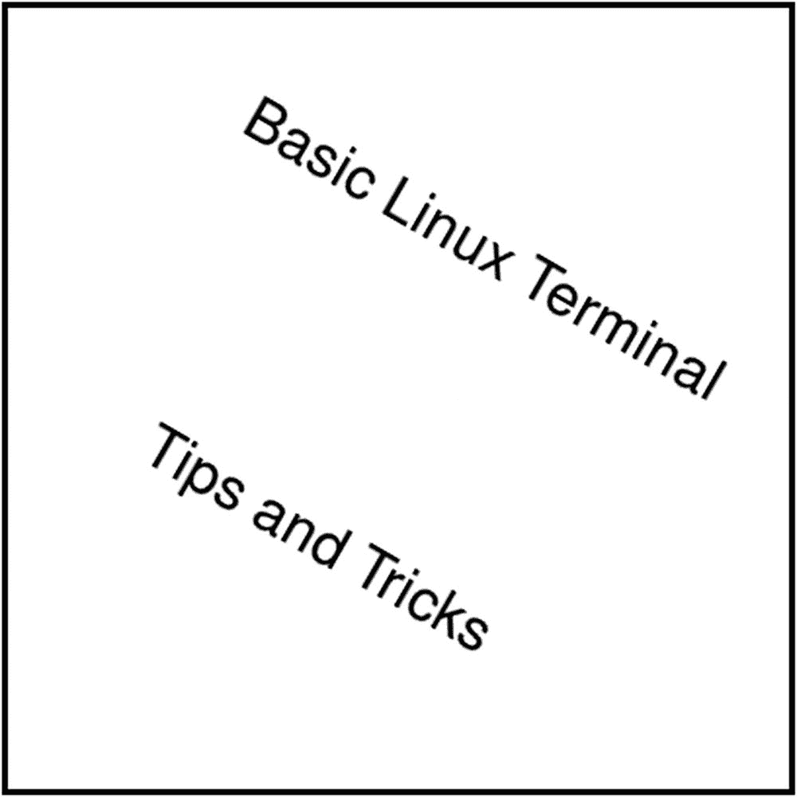
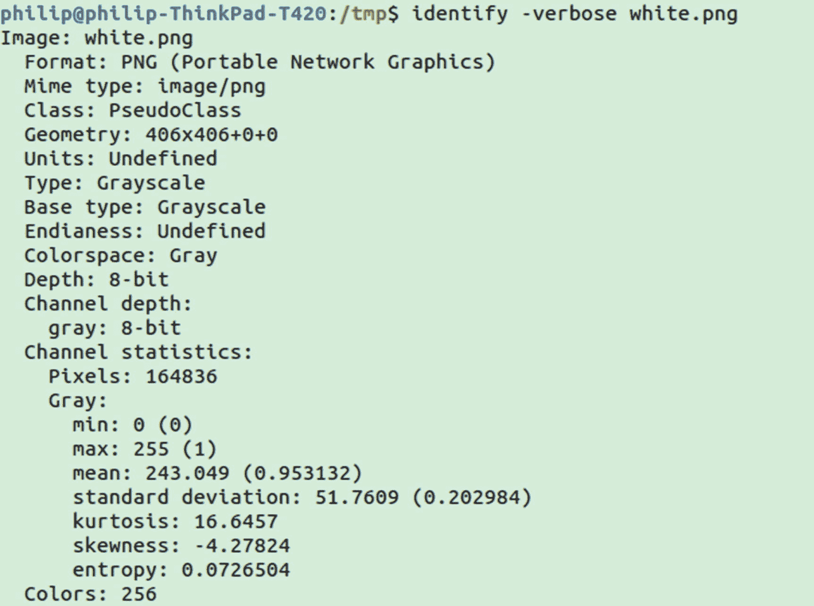
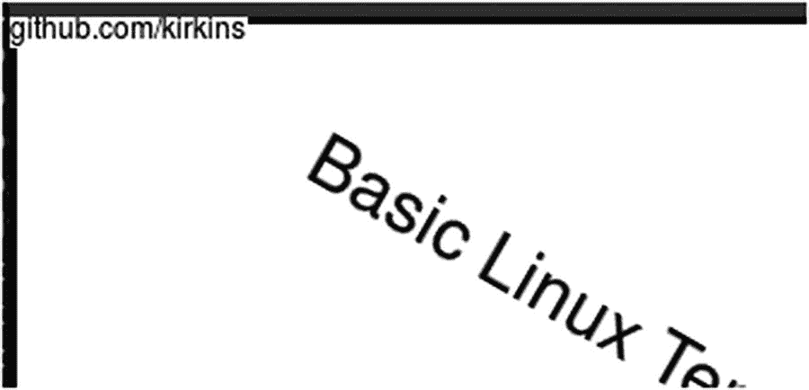
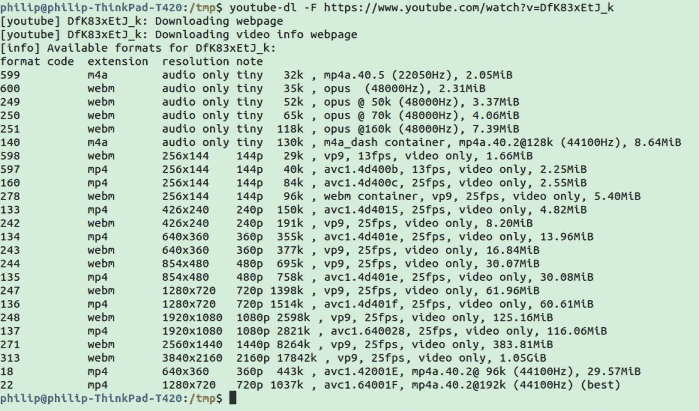
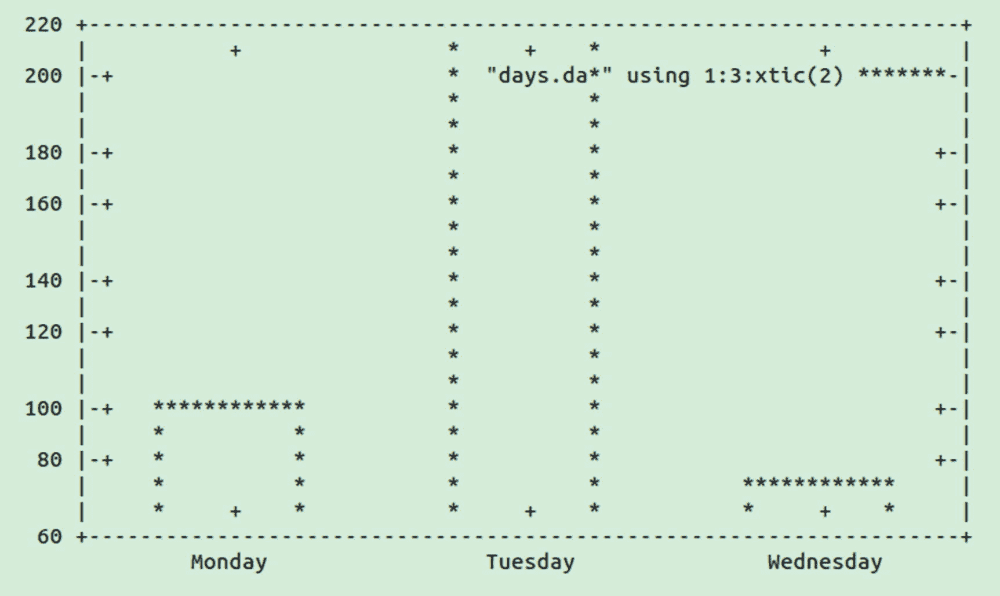
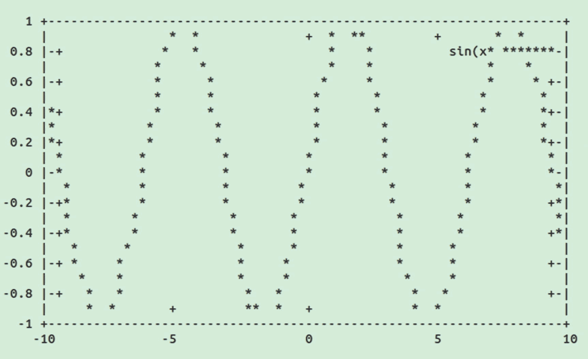
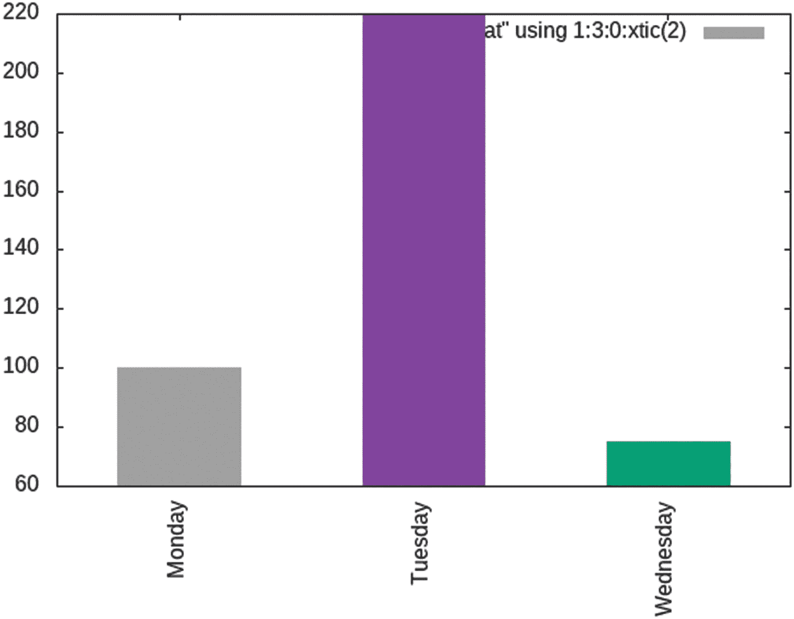
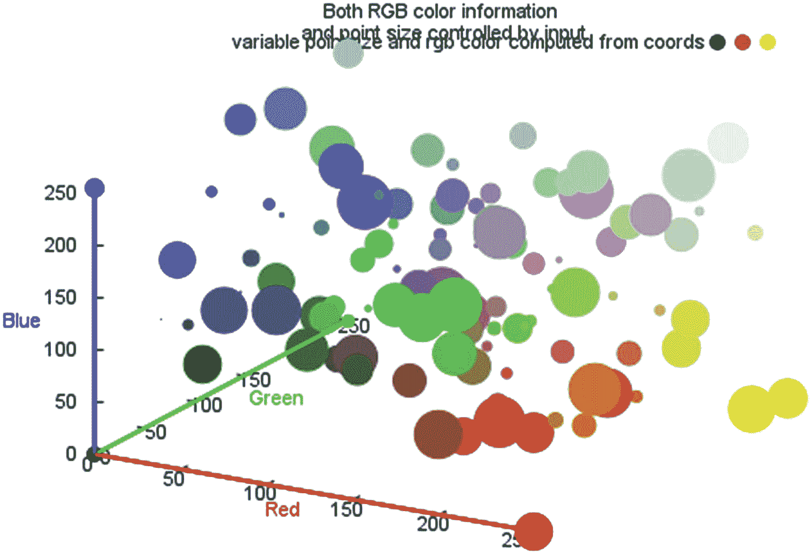

# 十六、用于处理图像和视频的终端工具

虽然命令行主要是基于文本的，但令人惊讶的是，有一些很棒的工具可以处理图像和视频，这些工具可以与它们的 GUI 对等物相媲美，或者在某些情况下是它们的基础。例如，如果您使用过任何类型的修改或生成图像的网站，它很可能在后端使用 ImageMagick。同样，如果你使用过任何基于 Linux 的视频编辑器，很有可能它是建立在`ffmpeg`之上的。

考虑到这些基于视觉的程序中有许多只是简单地调用命令行的等价物，您可以通过学习使用命令行版本来完成简单的任务，如修改图像或视频，从而节省一些时间。我们还将看看一些不常用的程序，如 gnuplot，以及如何修改启动时显示的动画。

## 简介

操纵图像的最强大的工具之一实际上是命令行固有的。ImageMagick 不仅广泛用于命令行，还用于使用 PHP、Python 和 Node.js 等语言的服务器端代码。这些语言本质上只是为功能丰富的命令行实用程序提供了一个包装器。

使用 ImageMagick 可以做的一些事情包括

*   转换图像

*   绘制形状

*   绘制文本并对其进行操作

*   描绘一幅图像

*   使图像变形

*   裁剪图像

*   图像过滤器

## 创建带文本的图像

若要开始，请确保安装了 ImageMagick。它可以在大多数包存储库中找到。与许多程序不同，它不是用安装时的名字来调用的。相反，ImageMagick 使其他命令如`convert`可用。首先，让我们创建一个大小为 400 x 400 像素的空白画布:

```sh
convert -size 400x400 xc:white white.png

```

你现在应该有一个 400 x 400 像素的空白白色图像。

接下来，让我们添加一些文本到我们的图像:

```sh
convert white.png -gravity North \
  -pointsize 30 -annotate +0+100 \
  'Basic Linux Terminal' white.png

```

这里使用的`-gravity North`选项告诉 ImageMagick 将文本放在图像的顶部；或者，我们可以用南、西或东。让我们使用`South`在图像底部创建另一段文本；这个上面写着“提示和技巧”:

```sh
convert white.png -gravity South \
  -pointsize 30 -annotate +0+100 \
  'Tips and Tricks' white.png

```

然后`pointsize`指定字体大小，接着`annotate`增加文本周围的空间，这样它就不会紧靠图像顶部。

检查文本是否按预期呈现后，尝试旋转文本:

```sh
convert white.png  -distort ScaleRotateTranslate 30 white.png

```

你现在应该有一个类似图 [16-1](#Fig1) 的结果。



图 16-1

ImageMagick 生成的图像

为了让前面的预览更容易看到，我实际上添加了一个 3 像素的黑色边框，这样更容易看到它的开始和结束。这可以通过命令来完成

```sh
convert -bordercolor Black -border 3x3 white.png white.png

```

## 获取图像信息

在本书的前面，我们看到我们可以使用`file`命令来获取文件类型的信息。然而，当谈到图像时，实际上有更多的元数据您可能想看。ImageMagick 提供了另一个名为`identify`的工具来检查图像细节。最简单的用法是用一个文件作为输入来运行它:

```sh
identify white.png

```

这将返回图像的基本信息，包括类型、尺寸、色谱和大小。您可以通过添加`-verbose`标志获得更详细的信息；参见图 [16-2](#Fig2) 获取`identify -verbose`命令的输出示例。



图 16-2

使用 ImageMagick `identify`命令的图像数据

您可能会发现`-verbose`标志实际上返回了太多的数据。如果您想要挑选要显示的特定属性，您可以直接指定它们，例如:

```sh
identify -format '%f - %m - %w \n' white.png

```

前面的示例指定文件名、文件类型和宽度，后跟一个换行符。您可以在 [`https://imagemagick.org/script/escape.php`](https://imagemagick.org/script/escape.php) 找到完整的字母列表及其代表的属性。

## 给图像加标签

您可能想要执行的另一个常见任务是给照片添加一个小标签；当你计划在网上展示图片，并希望人们知道你是图片的原始来源时，如果图片被保存并在其他地方展示，这将非常方便。

要做到这一点，我们可以简单地使用内置的`composite label`，它将在我们的照片的左上方添加一些文本，只需一步:

```sh
composite label:'github.com/kirkins' white.png labeled.png

```

结果将看起来像输入图像，在左上角添加了我们的小而持久的标签，如图 [16-3](#Fig3) 所示。



图 16-3

使用 ImageMagick 向图像添加标签

## ffmpeg

这类似于 ImageMagick，但用于视频而不是静态图像。`ffmpeg`可用于各种常见的视频编辑任务，在包括 Audacity 和 VLC media player 在内的许多流行的视频和音频编辑 GUI 软件套件的代码中实际使用了它。

您可以使用 ffmpeg 做的一些事情包括

*   转换视频文件类型

*   压缩视频

*   加快/减慢视频播放速度

*   修剪剪辑

*   提高/降低声音

## 转换文件类型

由`ffmpeg`提供的最简单和最常见的命令之一是文件类型的简单转换。在许多情况下，转换视频非常简单——只需使用`-i`标志进行输入，并通过使用输出所需的文件类型扩展名来指定输出类型。例如，如果我们想将 mp4 转换成 webm，只需运行以下命令:

```sh
ffmpeg -i video.mp4 video.webm

```

同样的技术也可以应用于音频文件，例如 mp3 到 ogg:

```sh
ffmpeg -i audio.mp3 audio.ogg

```

甚至可以拍摄视频并将其输出为 gif 格式，尽管您可能希望只转换短视频:

```sh
ffmpeg -i video.mp4 picture.gif

```

另一种稍微复杂一点的常见转换是从视频文件类型转换到纯音频文件类型。在这种情况下，您需要添加代表“视频编号”的`-vn`标志，例如:

```sh
ffmpeg -i video.mp4 -vn song.mp3

```

## 压缩视频

在本地录制视频并希望将其上传到网络后，您可能会发现视频文件太大，不适合实际使用。你可以用`ffmpeg`运行一行程序来压缩它，而不是加载一些笨重的视频编辑软件:

```sh
ffmpeg -i input.mp4 -b 1000000 output.mp4

```

在前面的例子中，我们获取了一个名为`input.mp4`的视频，并以 1，000，000 比特或每秒 1 兆比特的缩减比特率将其输出为`output.mp4`。客观地说，一张 DVD 通常是每秒 4-8 兆比特，而蓝光是 24-40 兆比特。大小取决于视频的尺寸和质量。

## 放慢视频播放速度

如果你曾经想看一些慢动作的东西，但不想做打开一个成熟的视频编辑器的艰苦工作，`ffmpeg`有一个解决方案给你。任何视频(或声音文件)都可以通过`ffmpeg`轻松加速或减速。这可以通过以下命令完成:

```sh
ffmpeg -i video.webm -filter:v "setpts=2.0*PTS" slow.webm

```

在前面的命令中，`2.0`意味着我们的视频扩展到两倍于原始长度。如果我们改为使用`setpts=0.5*PTS`，我们会有相反的效果，通过压缩到一半的长度来加速视频。

通过使用不同的滤波器，同样可以应用于诸如 mp3 之类的音频:

```sh
ffmpeg -i audio.mp3 -filter:a "atempo=2.0" slow.mp3

```

上述示例只会影响视频，但声音将以正常速度播放。如果你想改变这两个，你需要添加第二个过滤器。例如，要以与视频相同的速度减慢声音，请添加`-filter:a "atempo=0.5"`:

```sh
ffmpeg -i video.webm \
  -filter:v "setpts=2.0*PTS" \
  -filter:a "atempo=0.5" slow.webm

```

或者要将视频和声音的速度都提高两倍，请使用

```sh
ffmpeg -i video.webm \
  -filter:v "setpts=0.5*PTS" \
  -filter:a "atempo=2" slow.webm

```

## 剪辑视频

你可能想使用`ffmpeg`的另一个常见任务是修剪视频，这样你就可以从原始视频的某个部分创建一个新的视频。如果我们想将 3 秒钟开始的内容剪切到 8 秒钟的视频中，我们可以运行

```sh
ffmpeg -i vid.webm -ss 00:00:03 -t 00:00:08 -async 1 cut.webm

```

这将产生一个名为`cut.webm`的新视频文件，其长度为 8 秒，从 3 秒标记到 11 秒标记。同样的命令也可以应用于像 mp3 这样的音频文件。

## 提高视频的音量

如果你曾经遇到过即使在最大音量下也很难听到音频的视频，下面这个命令就是为你准备的。有了`ffmpeg`,我们实际上可以放大文件的音频，让它以更大的音量播放。

音量用“dB”来衡量，dB 代表分贝。如果我们想将视频中的音频提高 5 分贝，我们可以运行以下命令:

```sh
ffmpeg -i in.mp4 -vcodec copy -af "volume=5dB" out.mp4

```

同样，我们可以使用负值来降低音量，例如，`-5dB`将音量调低 5 分贝:

```sh
ffmpeg -i in.mp4 -vcodec copy -af "volume=-5dB" out.mp4

```

## 使用 youtube-dl 下载视频

现在，您对如何使用 ffmpeg 修改、修剪和处理视频已经有点熟悉了，您可能会发现自己想要处理来自网络上的视频，例如，从 YouTube 下载一首经常听的歌曲并将其转换为 mp3，或者从一个有趣的视频中剪切一个剪辑，将其转换为 gif 与朋友分享。

`youtube-dl`是一个非常活跃的命令行工具，用于下载 YouTube 视频和 1000 多个不同的网站，包括

*   维莫

*   声音云

*   脸谱网

*   推特

*   像福克斯和加拿大广播公司这样的新闻网站

这只是 1000 多个受支持网站中的一小部分。完整名单可在 [`https://github.com/ytdl-org/youtube-dl/blob/master/docs/supportedsites.md`](https://github.com/ytdl-org/youtube-dl/blob/master/docs/supportedsites.md) 找到。

安装`youtube-dl`最常见的方式是通过 Python 的包管理器`pip`:

```sh
sudo -H pip install --upgrade youtube-dl

```

然而，如果你不想使用`pip`，也可以用`curl`从官方网站下载一个可执行文件。要获得最新的安装选项，请在 [`https://github.com/ytdl-org/youtube-dl`](https://github.com/ytdl-org/youtube-dl) 查看 GitHub 上的项目。

最简单的命令，也可能是您最常用的命令，就是简单地使用实用程序，传入您想要下载的视频的 URL:

```sh
youtube-dl https://www.youtube.com/watch?v=DfK83xEtJ_k

```

请注意，默认情况下，将下载最高质量的视频，前一个视频超过 1GB。如果您想下载另一种格式，您可以使用`-F`标志查看视频的可用格式。返回的可用格式示例如图 [16-4](#Fig4) 所示。



图 16-4

使用 youtube-dl 查看可用格式

记下您想要的视频的第一列“格式代码”。格式代码可以用`-f`标志指定，允许你下载一个小得多的版本，从而加快下载速度并节省你的日期(*或仅当你想列出*时才下载音频)。根据前面的列表，如果我们想下载尽可能小的视频，我们可以选择格式代码 598，它几乎可以立即下载:

```sh
youtube-dl -f 598 https://www.youtube.com/watch?v=DfK83xEtJ_k

```

如前所述，`youtube-dl`是一个非常活跃的项目，有很多选项和特性。在 GitHub README 上查看一些额外的特性绝对是值得的，但是在大多数情况下，我们在这里看到的将会完成工作。

## 用 gnuplot 创建图表

另一个可以从命令行执行的基于视觉的任务是将数据可视化为图形——要么在终端上查看数据，要么将数据转换为图像文件以备后用。

一个使这变得容易的程序是`gnuplot`，它在包管理器中广泛可用。

为了演示如何绘制一个简单的条形图，让我们创建一个名为`days.dat`的数据文件，包含以下内容:

```sh
0 Monday 100
1 Tuesday 220
2 Wednesday 75

```

接下来打开`gnuplot`，只需输入命令，无需输入或选项。

在`gnuplot`打开的情况下，首先将模式切换到`dumb`，使生成的图表在终端显示为文字艺术。默认情况下，图表是在基于`qt`的 GUI 中生成的，该 GUI 在每个命令后弹出；尽管没有完全基于终端，但是`qt`版本的图表看起来更好。因此，如果您喜欢使用`qt`，只需跳过第一个命令:

```sh
set terminal dumb

```

接下来，我们将设置图表的框宽和填充样式:

```sh
set boxwidth 0.5
set style fill solid

```

最后，告诉`gnuplot`使用以下命令绘制`days.dat`文件

```sh
plot "days.dat" using 1:3:xtic(2) with boxes

```

这里的`1:3`指定我们使用数据的第 1 列作为 x 坐标，第 3 列作为 y 坐标。然后`xtic(2)`说我们应用第 2 列作为每个 x 值的标签。如果我们改为使用`xtic(1)`，我们的日期名称标签将被索引数字所取代。最后，`with boxes`简单地指定了图表类型。可视化输出的示例如图 [16-5](#Fig5) 所示。



图 16-5

gnuplot 在终端显示条形图

`gnuplot`也可以用来绘制数学方程，例如运行`plot sin(x)`生成如图 [16-6](#Fig6) 所示的图表。



图 16-6

gnuplot 在终端显示折线图

任何方程都可以这样绘制，例如，用`plot 5*x + 3`可以生成一个简单的方程，表示一条斜率为 5、y 轴截距为 3 的直线。

## gnuplot 到图像文件

能够在终端中显示图表是很好的，但在大多数情况下，您会希望将图表导出为图像，以便在报告或演示中传达信息。以同样的方式，我们设置`gnuplot`使用哑模式，我们可以设置它导出为一个图像文件。运行以下命令切换到 png 模式:

```sh
set terminal png

```

接下来，你必须告诉`gnuplot`你想在哪里输出图像文件；否则，您将在屏幕上看到未经处理的原始 png 数据，这一点用也没有。

```sh
set output "graph.png"

```

现在，如果我们按照与制作第一个条形图完全相同的步骤，我们将在工作目录中得到一个“graph.png”文件。每次将图形绘制到文件时，都需要使用前面的命令重新指定输出文件。

由于我们不再在终端工作，您可能会想要为您的图表添加一些颜色。为此，我们将修改原始的 plot 命令

```sh
plot "days.dat" using 1:3:0:xtic(2) with boxes lc var

```

我们在`1:3:0`中添加了一个新值，它使用索引创建了一个新变量；该变量随后与`lc var`一起使用，并针对每个条形递增。前面的命令应该会产生如图 [16-7](#Fig7) 所示的结果。



图 16-7

导出到图像文件的 gnuplot 条形图

内置多种配色方案，包括`podo`、`classic`、`default`。要更改方案，运行以下程序，用您想要的方案替换`podo`:

```sh
set colorsequence podo

```

## 高级示例/演示文件夹

我们已经看了一些用`gnuplot`绘制线条和条形图绘制数据的基本例子。然而，这只是`gnuplot`能力的一小部分。该程序可用于创建深入的信息图表。这超出了本书的范围，但是我们将从`gnuplot`官方演示文件夹中分享几个例子: [`https://github.com/gnuplot/gnuplot/tree/master/demo`](https://github.com/gnuplot/gnuplot/tree/master/demo) 。参见图 [16-8](#Fig8) 、 [16-9](#Fig9) 和 [16-10](#Fig10) 中包含的演示示例。这些演示的代码可以用作绘制您自己的数据的起点。


图 16-10

gnuplot 图表轮廓示例



图 16-9

gnuplot 示例图表 rgb_variable.5.gnu


图 16-8

gnuplot 图表直方图示例

## 启动动画

我们可以对操作系统进行的另一个有趣的修改是改变启动时的默认动画屏幕。在某些情况下，了解这一点实际上很有用，例如，如果您正在定制嵌入式设备上工作，或者甚至是一个游戏单元，并且希望有一个主题启动屏幕。

一个很好的例子是开源主题 PlymouthTheme-Cat ( [`https://github.com/krishnan793/PlymouthTheme-Cat`](https://github.com/krishnan793/PlymouthTheme-Cat) )，当安装并启用后，它会用一只动画猫取代你的默认启动屏幕，如图 [16-11](#Fig11) 所示。


图 16-11

自定义启动动画

使用这个主题需要你的操作系统使用 Plymouth。Plymouth 是一个提供无闪烁图形引导过程的包，默认安装在基于 Debian 和 Fedora 的发行版上。

首先在你的`/usr/share/plymouth/themes`里安装主题；这可以通过直接克隆到文件夹中来实现:

```sh
sudo git clone \ https://github.com/krishnan793/PlymouthTheme-Cat.git \ /usr/share/plymouth/themes/PlymouthTheme-Cat

```

主题成功下载到主题文件夹后，接下来您需要安装主题:

```sh
sudo update-alternatives --install \ /usr/share/plymouth/themes/default.plymouth default.plymouth \ /usr/share/plymouth/themes/PlymouthTheme-Cat/PlymouthTheme-Cat.plymouth 100

```

安装后，通过运行以下命令将其设置为默认值

```sh
sudo update-alternatives --config default.plymouth

```

这将弹出一个选择菜单；输入选项列表 PlymouthTheme-Cat 的编号，如图 [16-12](#Fig12) 所示。


图 16-12

选择要使用的普利茅斯主题

最后，您需要更新 initramfs 映像。这是启动时运行的映像，目的是挂载文件系统。

```sh
sudo update-initramfs -u

```

完成后，您现在可以重新启动计算机，并在启动过程中欣赏自定义的猫动画。

## 制作自定义启动动画

虽然猫的动画肯定做得很好，但你可能想制作自己的自定义动画。尝试自己制作的最简单的方法是查看普利茅斯猫的来源。注意，源文件包含 111 个连续的 PNG 文件，从`progress-0.png`开始，到`progress-111.png`结束。按顺序观看，这些图像创建动画。

如果您想创建自己的映像，最好的方法是用您自己的相同尺寸的 PNG 文件替换这些映像，然后重新运行用于安装 Plymouth Cat 的步骤。这将产生一个基于您提供的图像的动画。

一旦您对结果满意，您可以更新`PlymouthTheme-Cat.plymouth`中的值并重命名文件夹。

我们不会深入讨论如何生成图像文件的细节，但是 GIMP 和 Photoshop 等应用都支持将动画导出为多个 PNG 文件。

## 摘要

在这一章中，我们看了一些实用程序，它们使得在不打开庞大的编辑器的情况下处理图像和视频成为可能。这对于常见的快速任务非常有用，如转换文件类型、添加水印或修剪视频和音频内容。在某些情况下，就像 gnuplot 一样，我们使用数据创建新的图像，同样不需要打开图像编辑器。

最后，我们看到启动过程中显示的闪屏实际上是由一个名为 Plymouth 的程序控制的。我们下载了一个简单的动画，并将其设置为我们的启动动画。这是一个有趣的修改，在设置定制硬件时非常有用。例如，通过添加自定义动画，可以使自动启动视频游戏模拟器或连接到电视的多媒体盒的 Linux 系统看起来像一个独特的创作。