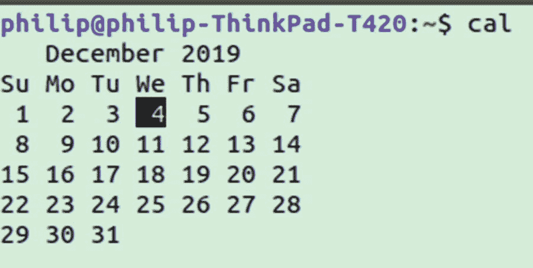
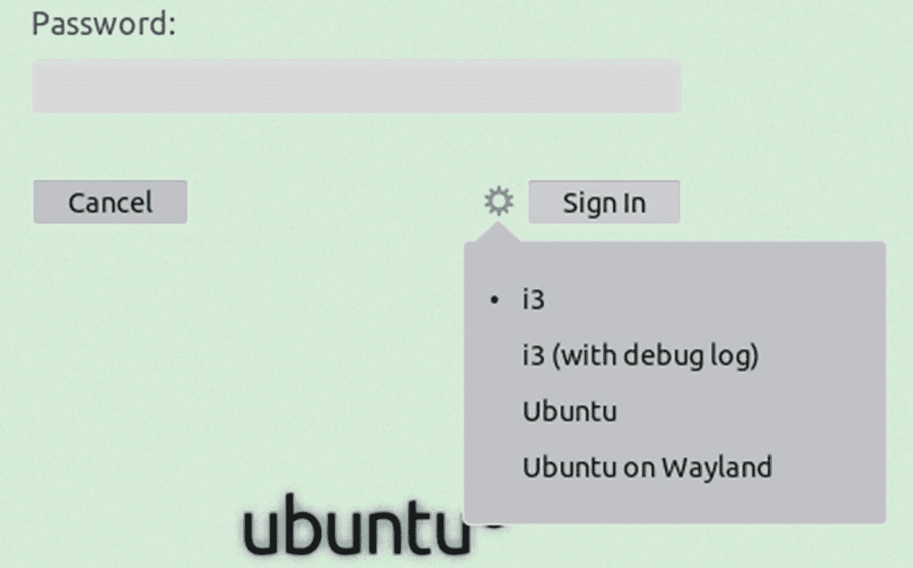
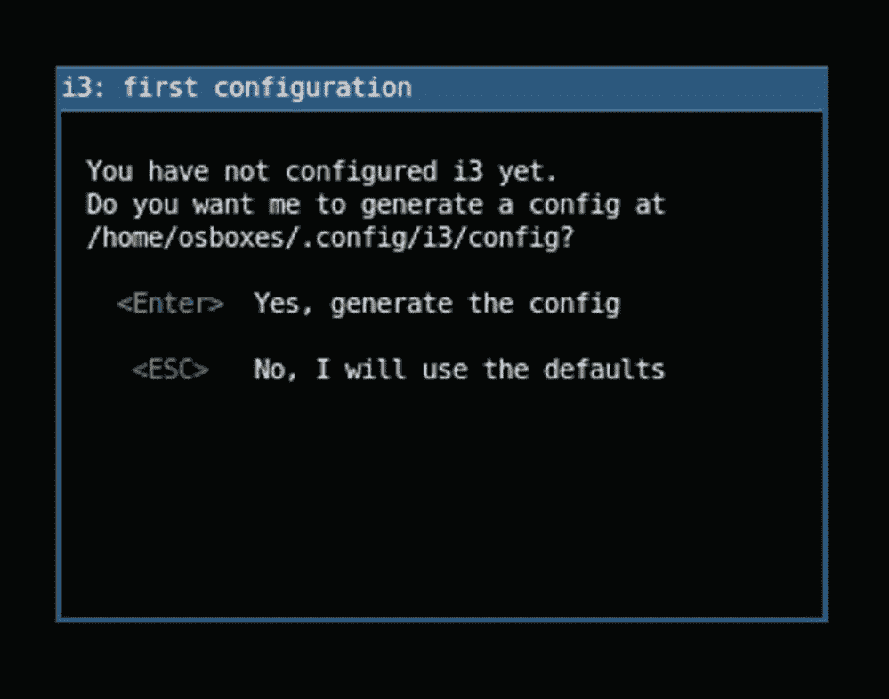
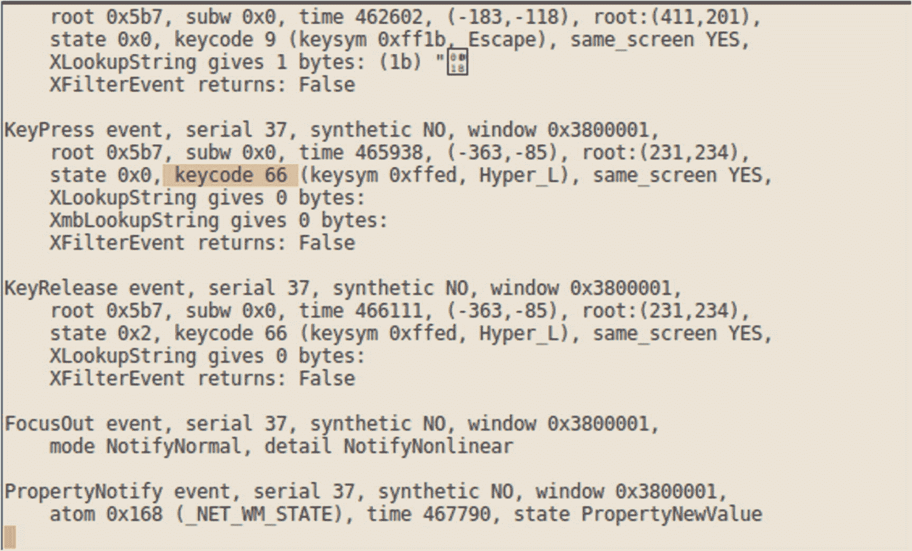

# 十七、额外服务

在本书中，我们已经研究了所有类型的命令和实用程序。然而，有几个方便的命令无视任何类别。在这最后一章，我们将看看有趣或有用的命令和工具，不一定适合一个类别。

## 大卡

另一个简单但有用的命令行程序是`cal`，它通过命令行提供了一个简单的日历。关于`cal`的一个很棒的事情是，它作为标准安装在几乎所有的 Linux 发行版上，因为它出现在第一版 Unix 中，并且是 POSIX 标准的一部分。`cal`最简单的用法是不带任何标志或参数运行它，它只产生一个当月的视觉效果，突出显示当天，如图 [17-1](#Fig1) 所示。



图 17-1

`cal`命令的输出

为了可视化一整年，您可以添加`-y`标志，这将产生一个类似的图形，但会以月份块的形式显示当前年份中的所有月份，如图所示。

在很大程度上，这就是我使用`cal`的程度，一个我经常使用的小程序。但是，它也提供查看特定年份或月份的能力，例如:

```sh
cal 2000      # display the year of 2000
cal june 2009 # display June of 2009

```

回头看看关于`.bashrc`的部分，你可能还会考虑添加一行简单的`cal`来显示一个日历，当你打开你的终端时，突出显示当天——尽管我个人不喜欢这增加的混乱。

## 电子语

如果你是一个喜欢听文本而不是阅读文本的人，你会非常想了解`espeak`。`espeak`获取文本输入，并将其作为音频读取或将该音频输出到音频文件。这个包可以在 Ubuntu 包管理器中找到。

```sh
sudo apt-get install espeak

```

安装后，你可以做的最简单的事情就是把一些文本输入到`espeak`中，然后直接在你的机器上听音频。

```sh
echo Hello World | espeak

```

如果不使用管道，而是希望提供一个包含文本的文件，可以使用如下所示的`-f`标志:

```sh
echo Hello World > text.txt
espeak -f text.txt

```

默认的声音有点单调，但这是我们在下一节要改进的地方。一些内置的标志包括改变速度之类的东西。速度由代表“每分钟字数”(*默认 175* )的`-s`标志和以毫秒为单位设置字数间隔的`-g`标志控制(*默认 10* )。下面是 100 wpm 慢速和 250 wpm 快速的例子:

```sh
echo hello world | espeak -s 100 -g 20 # slow
echo hello world | espeak -s 250 -g 5 # fast

```

## 改善说话声音

通过安装来自开源语音引擎 MBROLA 的语音，espeak 使用的语音可以得到大幅改善。不幸的是，MBROLA 的网站不再在线；然而，它仍然可以使用 Wayback 机器与语音文件一起访问。要查看非常过时的网站上的信息，请查看以下链接:

[T2`https://web.archive.org/web/20180625050250/http://www.tcts.fpms.ac.be/synthesis/mbrola/`](https://web.archive.org/web/20180625050250/http://www.tcts.fpms.ac.be/synthesis/mbrola/)

要下载并安装 MBROLA，请运行以下命令:

```sh
cd /tmp
wget \
https://web.archive.org/web/20180627172600/http://www.tcts.fpms.ac.be/synthesis/mbrola/bin/pclinux/mbr301h.zip
unzip mbr301h.zip
sudo cp mbrola-linux-i386 /usr/bin/mbrola

```

接下来我们将下载英语语音文件。如果你想要另一种语言，你必须使用存档的 MBROLA 网站找到合适的文件。要安装英语语音，请运行以下命令:

```sh
cd /tmp
wget \
https://web.archive.org/web/20160706052143/http://www.tcts.fpms.ac.be/synthesis/mbrola/dba/en1/en1-980910.zip
unzip en1-980910.zip
sudo cp en1/en1 /usr/share/mbrola/en1

```

安装了 MBROLA 和英语语音后，您现在可以使用如下所示的`-v`标志选择语音(建议*将速度减慢到每分钟 120 个单词*):

```sh
echo Hello World | espeak -v mb-en1 -s 120

```

## 将语音输出到音频文件

如果您最终使用 espeak 来转换大量文本，您可能希望将其输出为音频文件，而不是直接播放。这让您可以随意暂停、播放和倒带，更不用说将文件移动到其他设备或共享了。如何做到这一点的例子如下(*我们假设在同一个目录中有一个名为* `text.txt` *的文件中有文本；如果没有，从网页上复制一些文本并粘贴到文本文件中*):

```sh
espeak -f text.txt -w audio.wav

```

不幸的是，`espeak`只有输出为 wav 文件的选项，所以如果你想要 mp3 或其他类型，你需要运行一个额外的命令来使用`ffmpeg`进行转换。

```sh
ffmpeg -i audio.wav -vn -ar 44100 -ac 2 -b:a 192k audio.mp3

```

## 命令行上的数学

在过去的几章中，我们已经使用了`bc`,但是它值得一提，因为它经常被忽略。首字母代表基本计算器。它安装在大多数类 Unix 操作系统上，因为它是 POSIX 标准。它提供了在命令行上进行数学运算或编写特定于`bc`的脚本的能力。

在命令行中，`bc`由另一个命令的管道输出使用，例如:

```sh
echo 1 + 1 | bc

```

运行前面的脚本将返回输出 2。它支持你在任何计算器上期望的加、减、乘、除的基本运算。此外，您还有一些特殊的命令，例如，获取一个数的平方根:

```sh
echo "sqrt(169)" |  bc

```

注意，当使用任何带括号的`bc`符号时，我们需要用引号将它括起来；这是为了避免 bash 将其解释为 subshell。`bc`中另一个可用的特殊命令是 length，它返回一个数的位数:

```sh
echo "length(169)" |  bc

```

前面的脚本返回 3。类似地，有一个函数`scale`计算小数点右边的位数，例如，下面的函数返回 3:

```sh
echo "scale(169.777)" |  bc

```

除了使用管道，还可以在交互模式下启动`bc`。为此，使用`-l`标志运行它:

```sh
bc -l

```

除了作为一个命令行实用程序，`bc`实际上可以用作一个完整的脚本语言，它支持 C 语法进行数字操作和创建代码重用函数。

另一个命令`expr`也可以在许多系统中找到，它在没有管道的情况下计算数学语句。然而，不推荐使用`expr`，因为它已经过时了:

```sh
expr 1 + 1

```

同样，你还会在许多系统上发现`dc`，它也是一个先于 C 语言的反向波兰符号计算器。

## 平铺窗口管理器

超级用户应该关注的另一类应用是平铺窗口管理器。平铺窗口管理器取代了 Linux 操作系统的 GUI 界面。)并提供了一种将你的工作空间分割成小块的方法。

平铺窗口管理器被吹捧为帮助操作系统使用一个完全无鼠标的过程。当使用平铺窗口管理器时，任何可以用鼠标完成的事情都可以用键盘更好地完成。由于这个原因，平铺窗口管理器经常被作为提高命令行界面使用效率的一种方式。

就我个人而言，我发现平铺窗口管理器的有用性取决于手头的任务。如果我的工作流涉及到同时运行的十几个不同的终端会话，我几乎总是选择平铺窗口管理器。然而，如果我的工作流涉及 web 浏览器、word 编辑器和一些终端会话，我会选择普通的桌面体验，在`tmux`中使用终端会话。

在过去，有几个不同的竞争平铺窗口管理器，但目前`i3wm`似乎是最流行的。在寻找流行的替代品时，我发现`i3wm`是过去 12 个月中唯一一个稳定发布的 Linux 平铺窗口管理器。出于这个原因，我们将把重点放在`i3wm`作为最好的和最常见的平铺窗口管理器。如果您对研究其他窗口管理器感兴趣，一些备选方案包括“Awesome window manager”、xmonad、dwm 和 ratpoison。

i3wm 擅长能够在终端会话和终端会话组之间快速切换。例如，我可能有一个用各种工具监视系统的终端页面，创建一种仪表板。然后在另一个窗口中，我可能有一些到不同被测设备的 SSH 会话。

如果你不熟悉平铺窗口管理器，我建议你把它安装在传统桌面旁边，而不是作为你唯一安装的桌面界面。如果你忘记如何做某事，或者在 i3wm 中做某件事情有困难，这将使事情变得更容易。如果是这样的话，你可以随时切换回 Ubuntu 桌面(*或者你选择的界面*)，以后再回到 i3wm。

`i3wm`可以简单地安装在大多数 Linux 发行版上，只需在您的软件包管理器上运行以下等效程序:

```sh
sudo apt-get install i3

```

安装`i3wm`后，注销或重启电脑。如果你在 Ubuntu 或 Fedora 上，在登录界面上，你应该会看到一个设置图标，如图 [17-2](#Fig2) 所示。单击设置图标后，应该会出现一个可能的桌面界面列表。选择标有`i3`的那个。



图 17-2

在登录屏幕上选择 i3

第一次启用 i3wm 登录时，系统会询问您是否要创建配置文件，如图 [17-3](#Fig3) 所示。我们建议使用默认设置，将 Windows 键设置为用于键盘快捷键的 i3wm 修饰键。然而，在撰写本文时，我们发现在生成配置时按下`<enter>`然后选择默认选项比选择`<esc>`效果更好，而此时选择`<esc>`似乎会导致问题。



图 17-3

i3 第一个配置对话框

安装后，您可以在大多数平台上通过注销并在登录屏幕上从下拉列表中选择 i3wm 来切换到 i3wm。起初，像使用 Vim 一样使用`i3wm`可能会令人望而生畏。你遇到了一个空白的黑屏，没有明显的方法打开一个应用程序。像 Vim 一样，i3wm 是通过键盘快捷键和命令来导航和使用的。表 [17-1](#Tab1) 显示了`i3wm`的命令列表(*用“win”或 Windows 键替换 alt，如果你已经选择了它*)。

表 17-1

i3wm 键盘快捷键

<colgroup><col class="tcol1 align-left"> <col class="tcol2 align-left"></colgroup> 
| 

捷径

 | 

描述

 |
| --- | --- |
| win+enter | 打开新的终端互动程序 |
| win+d | 在屏幕顶部打开一个对话框，您可以在其中键入应用程序名称，然后按 enter 键打开它 |
| win+j | 将焦点向左移动一格 |
| win+k | 将焦点下移一格 |
| win+l | 将焦点上移一格 |
| win+； | 将焦点向右移动一格 |
| win+shift+j | 向左移动聚焦磁贴 |
| win+shift+k | 下移聚焦的磁贴 |
| win+shift+l | 向上移动聚焦的磁贴 |
| win+shift+； | 向右移动聚焦磁贴 |
| win+f | 在聚焦磁贴的全屏模式之间切换 |
| win+shift+q | 取消聚焦的磁贴 |
| win+ | 切换到一个工作空间，其中<number>是 0 到 9 之间的任意值。每个数字都是一个单独的工作空间</number> |
| winktv | 下一个图块将垂直分割空间 |
| win+h | 下一个图块将水平分割空间 |
| win+r | 进入平铺的调整大小模式。从此处，箭头键可用于水平或垂直扩展或压缩图块 |
| win+shift+空格 | 切换磁贴的浮动模式。浮动模式允许你拖动一个窗口而不用考虑网格 |
| win+ | 用鼠标拖动浮动模式图块 |

## 创建切片

您首先要学习的最基本的命令是创建新的平铺窗口，这等同于打开应用程序，因为所有的应用程序都包含在窗口管理器网格的平铺窗口中。如果您正在打开终端，您可以使用`win+enter`。对于所有其他应用，按`win+d`；这将在左上方打开一个小对话框，如图 [17-4](#Fig4) 所示。


图 17-4

i3 应用程序搜索

当您键入应用程序的名称时，对话框将显示自动完成的状态，如果在任何时候它显示您的目标程序，请按 open。这将打开你的应用程序作为一个瓷砖。图 [17-5](#Fig5) 显示了一个 Firefox 作为标签打开的例子，以及两个终端。


图 17-5

打开多个图块的 i3

打开其他应用程序将会在您的工作空间中自动创建其他图块，这些图块将分布在网格上。因此，当您添加额外的图块时，程序图块将会调整大小。如果你的屏幕开始变得拥挤，你需要更多的空间，你可以使用工作区，我们稍后会解释。或者，如果您有不再需要的图块，您可以聚焦它们并按下`win+shift+q`。

您的工作区将被编号并显示在屏幕底部的状态栏中。除了您的工作区，状态栏还显示有关时间、互联网连接和可用空间的基本信息。

默认情况下，当添加新标签时，您的磁贴将水平拆分当前聚焦的标签。要切换到垂直分割，请按`win+v`键，您的下一个创建的图块将垂直分割。要切换回水平分割，请按下`win+h`。尝试创建新的图块，在垂直和水平之间切换，并根据需要使用`win+shift+q`删除图块。

一旦你有一个工作空间，分割成多个单幅图块，你可能想要调整单幅图块的大小。如果您按下`win+r`，您将进入高亮显示区域的调整大小模式，您可以使用箭头键来扩展或缩小该区域。状态栏中还有一个指示器，它会告诉您调整大小模式何时激活。

## 更改焦点中的磁贴

现在你有多个程序在`i3wm`中作为图块运行，你可能想知道如何在图块之间切换。您当前在`i3wm`中使用的磁贴被称为焦点。如果你想在磁贴之间切换焦点，只需按住`win`键并使用箭头键来导航你的焦点。您应该会在当前聚焦的窗口周围看到一个细细的轮廓。或者，您可以使用字母——`j`、`k`、`l`和`;`——每个字母对应一个方向。这些键类似于 Vim 中的方向键，但又不完全相同。如果您想修改这些键，使它们与 Vim 相同，请参阅“修改 i3wm 配置文件”一节

## 移动瓷砖

除了改变您的焦点之外，您可能还想在创建额外的图块时重新排列窗口，或者调整这些图块的大小以创建您的完美设置。移动磁贴的快捷键与移动焦点的快捷键几乎相同，除了你需要同时按住`win`和`shift`键，而不仅仅是`win`。所以向右移动，你可以做`win+shift+right arrow`或者`win+shift+;`。如上所述，您还可以调整窗口的大小。要进入调整大小模式，请在聚焦于要调整大小的图块时按`win+r`。一旦进入调整大小模式，您可以使用箭头键来扩展或收缩单幅图块。

## i3wm 中的工作区

当你第一次打开`i3wm`时，你会在左下角看到一个写着“1”的小方块。这个数字代表您当前的工作空间。`i3wm`上有 10 个工作空间，编号为 1-9，0 为第十个。您可以通过按下`win+<number>`在工作区之间切换，其中`<number>`是 0 到 9 之间的任意数字。切换到新的工作区时，您的屏幕将显示为一个新的`i3wm`实例，没有打开的磁贴。

因此，如果您在工作区 1 中打开四个不同的图块，然后切换到工作区 2，您可以在新的布局上创建新的图块，并随时切换回工作区 1。无论工作区是否在焦点上，工作区内的程序都将继续运行。

## 浮动瓷砖

虽然图块网格系统本质上是`i3wm`的核心实用程序，但是可以创建存在于它之外的图块，并且浮动在其他所有东西之上。要在浮动模式中切换图块，将其置于焦点并按下`win+shift+space`。一旦图块处于浮动模式，您可以按住`win`并用鼠标拖动它。如果您想将方块返回网格，再次按下`win+shift+space`。

## 全屏模式

如果您使用的互动程序太小，您可以暂时将互动程序切换到全屏模式，完成后再切换回来。要切换到平铺的全屏模式，只需按下`win+f`。要切换回来，在全屏模式下按下`win+f`。

## 修改 i3wm 配置文件

通过修改`i3wm`的配置文件，可以设置多种设置和配置。配置文件的默认位置是`~/.config/i3/config`。

## 在 i3wm 配置中绑定键

在`i3wm`中你最想修改的是哪个键负责哪个功能。习惯于 Vim 键绑定的人喜欢做的一个常见改变是重新映射用于聚焦磁贴的键。这是通过在配置文件中使用`bindsym`关键字来完成的，如下例所示:

```sh
bindsym $mod+h focus left
bindsym $mod+j focus down
bindsym $mod+k focus up
bindsym $mod+l focus right

```

如果您决定这样做，您还需要重新映射默认使用的`$mod+h`，它用于水平分割窗口。至于使用什么键进行水平分割，这取决于您，但是在本例中，我们将使用"-"，如下所示:

```sh
bindsym $mod+minus split h

```

还可以使用相同的组合键在文件中搜索任何现有的绑定，例如“$ mod+k”；如果发现重复，您需要删除一个，因为每个组合键只能映射到一个功能。

对 i3 配置文件进行更改后，您需要重新加载它。要在不重新启动系统的情况下完成此操作，请运行以下命令:

```sh
i3-msg reload

```

在前面的例子中，我们映射了每个 Vim 移动键(*加上默认的修饰键“win”*)。您可能还想应用类似的更改来移动聚焦窗口，如下所示:

```sh
bindsym $mod+Shift+h move left
bindsym $mod+Shift+j move down
bindsym $mod+Shift+k move up
bindsym $mod+Shift+l move right

```

您还可以将自定义功能绑定到未使用的组合键。例如，假设我们想要一个特殊的组合键来打开一个新的 web 浏览器窗口。我们可以添加如下所示的行:

```sh
bindsym $mod+shift+z exec "firefox"

```

使用前面的模式，您可以将组合键映射到任何应用程序，甚至您自己的定制脚本。

## 在 i3wm 配置中更改颜色

正如我们在本书中看到的其他配置文件一样，`i3wm`配置文件允许修改界面的主题和颜色。我们不会查看每个可能的配置，但以下配置将帮助您入门；这是一个通过改变各种子元素的颜色来修改屏幕底部状态栏的例子(*确保替换配置文件中现有的* `bar` *实例，否则你将得到两个状态栏*)。

```sh
bar {
        colors {
        background #2f343f
        statusline #2f343f
        separator #4b5262
        focused_workspace       #2f343f #bf616a #d8dee8
        active_workspace        #2f343f #2f343f #d8dee8
        inactive_workspace      #2f343f #2f343f #d8dee8
        urgent_workspacei       #2f343f #ebcb8b #2f343f
    }
    status_command i3status
}

```

此外，我们可以改变客户端本身的颜色(*五色十六进制代码应该包含在一行中*)。

```sh
client.focused           #bf616a #2f343f #d8dee8 #bf616a #d8dee8
client.focused_inactive  #2f343f #2f343f #d8dee8 #2f343f #2f343f
client.unfocused         #2f343f #2f343f #d8dee8 #2f343f #2f343f
client.urgent            #2f343f #2f343f #d8dee8 #2f343f #2f343f
client.placeholder       #2f343f #2f343f #d8dee8 #2f343f #2f343f
client.background        #2f343f

```

## i3 状态配置文件

虽然大多数对`i3wm`的定制都是在`~/.config/i3/config`文件中进行的，但是还有第二个配置文件专门处理状态栏。状态栏特定的配置文件可以在`~/.config/i3status/config`找到。它不仅允许你改变状态栏的颜色和样式，还允许你改变显示的内容。*注意这个文件默认不存在。*有关状态栏的其他信息，您可以运行以下命令来查看特定于状态栏的手册页:

```sh
man i3status

```

在这个手册页中，您将找到一个示例配置文件，它可以被复制并用作自定义状态栏的基础。注意，状态栏的所有子组件首先被添加到名为`order`的变量中，该变量跟踪显示哪些子组件以及显示顺序。

```sh
order += "cpu_temperature 0"
order += "load"
order += "tztime local"
order += "tztime berlin"

```

再往下，每个子组件都用花括号描述。例如，“tztime berlin”组件除了显示系统的本地时间外，还显示柏林时间，如下所示:

```sh
tztime berlin {
        format = "%Y-%m-%d %H:%M:%S %Z"
        timezone = "Europe/Berlin"
}

```

为了拥有一个完整的工作配置文件，您还必须添加“tztime local”组件，该组件的定义如下:

```sh
tztime local {
        format = "%Y-%m-%d %H:%M:%S %Z"
}

```

为了使状态栏更改生效，您需要完全重启 i3，而不是简单地运行 reload 命令。您可以通过运行以下命令来重新启动 i3

```sh
i3-msg restart

```

您可以在手册页中找到几个组件来帮助您入门。如果你正在寻找定制`i3wm`和作为配置文件基础的额外资源，我推荐你搜索“i3wm config github”

## 替代外壳

在列出许多可用的替代 shellss 之前，我想说明一下为什么我不使用任何 shell。首先，我喜欢我默认的工作环境，以反映我可能在“野外”找到的环境也就是说，如果我 SSH 到一台机器或去一家公司并使用他们的服务器，假设他们使用的是标准的 bash，我会感觉很自在。如果我已经习惯了使用另一种 shell，我可能会发现自己在尝试使用默认情况下根本不存在的快捷方式和命令。

第二个主要原因是许多替代 shell 不兼容 POSIX，这意味着专门为这些 shell 之一编写的脚本不能与更广泛的社区共享。我更喜欢使用标准的 POSIX 兼容 bash，因为我知道几乎每个人都可以在自己的本地环境中使用我的计算机上编写的脚本。

也就是说，许多其他人确实更喜欢替代外壳，因为它们可能提供可用性或其他好处。如果您对探索替代外壳感兴趣，这里有一些值得一试的:

*   z 外壳

*   鱼

## z 外壳

最受欢迎的替代 shell 是 Z Shell 或“ZSH”Z Shell 是 bash 的扩展，专注于改善用户体验。Z Shell 的一些特性包括

*   更智能的自动完成。

*   Git 集成( *git 状态提示*)。

*   基于~/的智能 SSH 自动完成。ssh/config & ~/。ssh/已知主机。

*   打错字时的文件名修正。

*   各种各样的主题。

*   所有的`cd`用的其实都是`pushd`；因此你可以一直使用`popd`。

*   其他智能自动完成。

*   具有 POSIX 兼容模式(尽管默认情况下不兼容)。

这绝不是一个完整的功能列表。

## 哦，我的 ZSH

我们看了第 14 章中的“哦，我的狂欢”；“哦，我的 ZSH”本质上是同样的事情，但 Z 壳。它包含几个专门针对 Z Shell 的预制主题和配置文件。

更多信息请访问 [`https://github.com/ohmyzsh/ohmyzsh`](https://github.com/ohmyzsh/ohmyzsh) 。

## 鱼

第二种最受欢迎的替代贝壳是鱼。和 ZSH 一样，Fish 的重点是改善终端用户体验。一些功能包括

*   自动完成你的类型(*考虑你的命令历史*

*   改进的默认颜色主题

*   更具互动性的自动完成功能

*   基于 GUI 的配置菜单，可在 web 浏览器中访问

当比较 Fish 和 ZSH 时，一个突出的区别是，ZSH 需要配置来启用它的许多关键功能，而 Fish 是一个更开箱即用的体验。这种对“易用性”的关注也可以在基于 web 浏览器的配置菜单中看到，该菜单允许您交互式地更改颜色主题等内容。

## 重新映射键

随着您开始越来越多地定制您的 Linux 系统，您可能真的想要改变某些键的行为。例如，由于不经常使用，将 Caps Lock 的用法重新映射到其他用法是很常见的。

进行任何类型的重新映射的第一步都是获取有问题的按钮的键码。最好的方法是运行`xev`，这将启动一个交互模式，你按下一个按钮，作为回报，会收到一个键码；示例如图 [17-6](#Fig6) 所示。



图 17-6

使用`xev`查找键码

在这个例子中，我们将重新映射 Caps Lock 键( *keycode 66* )。要编辑映射，打开`~/.Xmodmap`。这个配置文件负责修改键盘绑定。添加以下代码行，将 Caps Lock 键映射到 hyperkey。

## 清除大写锁定

```sh
keycode 66 = Hyper_L

```

前面的配置删除了 Caps Lock 键的正常用法，使用其 keycode 将其设置为 hyperkey，并使 hyperkey 成为修饰按钮。

超级键是一个存在于被称为太空学员键盘的旧键盘上的键，如图 [17-7](#Fig7) 所示。space-cadet 键盘允许用户使用组合键，如“希腊”键，键入 8000 多个不同的字符。键盘对 Lisp 和 Emacs 的设计有很大的影响，尽管没有出现在大多数键盘上，但“超级键”仍然在今天的许多地方被引用。


图 17-7

历史悠久的太空学员键盘上的特殊按键。戴夫·费希尔，罗德岛逆向计算协会，维基共享，知识共享署名-共享 3.0 未经许可

在大多数系统上，修改`~/.Xmodmap`文件就足以将 Caps Lock 重新映射到 hyperkey。做出更改后，您需要重新启动系统或手动重新加载配置。要手动重新加载，请运行以下命令:

```sh
xmodmap ~/.Xmodmap

```

现在，如果您不带参数地独立运行`xmodmap`,您应该会得到关于系统上特殊键的信息。“lock”行的第二列中应该没有任何内容，对于标记为“mod4”的行，您应该在末尾看到一个包含“Hyper_L”的键列表。

这里的“mod”代表修饰键，这意味着它可以与其他键结合使用来创建输出，与“alt”和“ctrl”键非常相似。这对下一节很重要，因为它允许我们将 Caps Lock 和其他一些键与自定义命令或脚本相关联。

## 使用 Xbindkeys 自定义快捷键

既然您已经将 Caps Lock 映射到 hyperkey，您可能想知道您可以用它做什么。将 Caps Lock 换成 hyperkey 的主要用途是获得一个额外的修饰键，类似于 alt 或 ctrl。我们可以将组合键与程序、任务和脚本联系起来。

在 i3 一节中，我们创建了一个用`win+shift+z`打开 Firefox 的自定义命令。这基本上是相同的想法，除了我们使用大写字母，不需要使用 i3。

要制作键盘快捷键，我们首先需要安装`xbindkeys`:

```sh
sudo apt-get install xbindkeys

```

接下来，通过运行以下命令，基于默认值创建一个`xbindkeys`配置文件:

```sh
xbindkeys --defaults > ~/.xbindkeysrc

```

接下来打开`~/.xbindkeysrc`文件，并在文件末尾添加以下一行:

```sh
"firefox"
      Mod4 + f

```

这里的`Mod4`代表我们的超级键，因为我们在上一节中将超级键(通过大写字母)与 mod4 相关联。所以我们绑定`caps+f`来打开 Firefox 浏览器。在我们前进的道路上，我们可以用任何其他程序取代`firefox`。例如，尝试将以下代码添加到您的`~/.xbindkeysrc`；运行之后，检查你的`/tmp`文件夹，你应该会看到一个名为`hello`的文件。您可以用任何命令替换引号，并将其与下面您想要的任何键盘快捷键相关联:

```sh
"touch /tmp/hello"
      Mod4 + t

```

随着 Caps Lock 键被释放出来用于自定义快捷键，您可以使用几十种可能的组合键，这还没有利用 Caps Lock 键与 shift 或 alt 等其他修饰符的组合。

## 额外资源

我发现在探索 Linux 终端时有用的其他资源包括

*   [T2`http://unix.stackexchange.com/`](http://unix.stackexchange.com/)

*   [T2`https://askubuntu.com`](https://askubuntu.com/)

*   [T2`https://linuxjourney.com/`](https://linuxjourney.com/)

*   [T2`www.tldp.org/`](http://www.tldp.org/)

*   [T2`http://explainshell.com/`](http://explainshell.com/)

*   [T2`www.linuxquestions.org/`](https://www.linuxquestions.org/)

*   [T2`https://training.linuxfoundation.org/resources/`](https://training.linuxfoundation.org/resources/)

*   [T2`https://google.github.io/styleguide/shell.xml`](https://google.github.io/styleguide/shell.xml)

## 摘要

在这一章中，我们看了一些可以让你的终端使用更进一步的程序。我们查看了内置的`cal`命令，它几乎可以在任何 Linux 系统上找到，并允许您快速浏览来年。我们看到了如何使用`espeak`将文本转换成音频文件。

之后，我们看了平铺窗口管理器`i3wm`、可选的 shells，以及如何修改键盘输入来创建许多映射到程序或自定义脚本的自定义键盘快捷键。