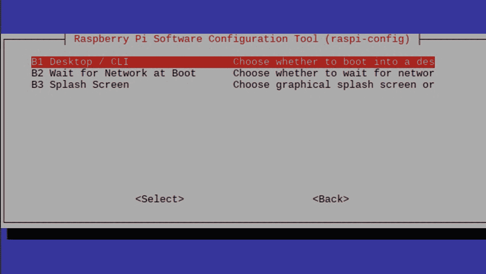
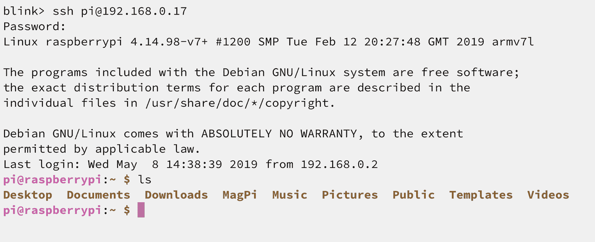
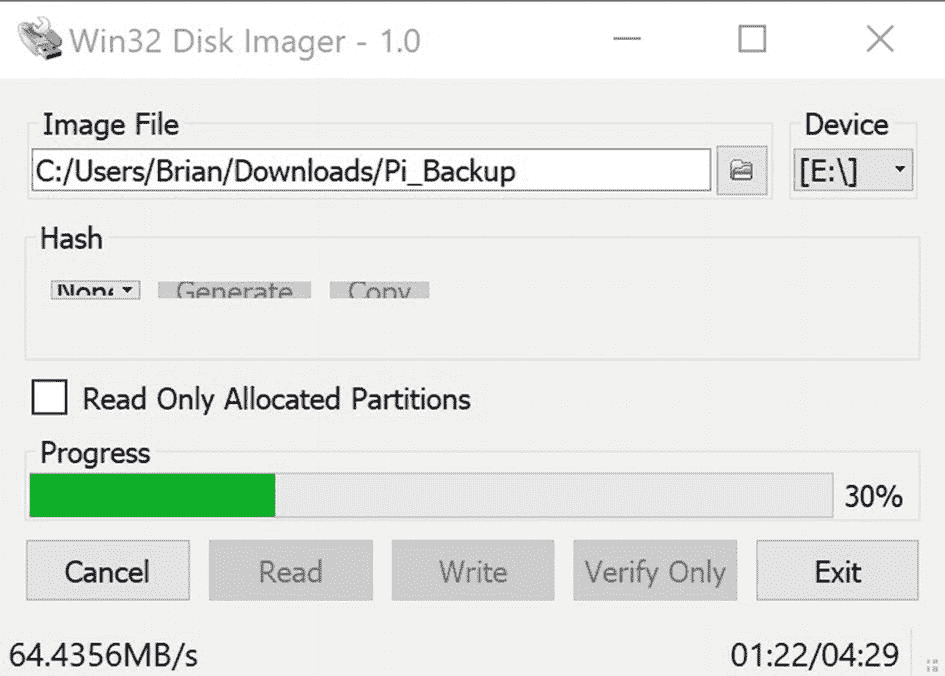

# 二、访问和配置 Pi

在这一章中，我们将会看到各种访问 Pi 计算机的方法，本地访问，通过终端远程访问，或者使用远程桌面访问。最后，我们将看看添加新的用户帐户和设置外部硬盘驱动器和存储设备。

## 在本地使用 GUI 桌面

如果你在默认安装后打开 Raspberry Pi，你会看到 Raspbian 桌面。它看起来有点像 MacOS 或者 Windows 桌面，所以你应该会觉得用起来有些直观。我们将在第三章详细讨论桌面的使用。

如果你要做的只是将 Pi 作为桌面计算机使用，这没问题，但是这本书的主要焦点之一是如何使用命令行来完成工作。在学习命令行之前，您必须能够实际使用一个命令行。有三种方法可以做到这一点，每种方法的复杂性和选择都在增加。

## 桌面上的命令行

您可以简单地从图形用户界面(GUI)桌面打开终端窗口。在屏幕顶部的菜单栏上，有一个灰色的终端图标。在终端的覆盆子➤配件菜单中也有一个快捷方式。点击其中任何一个，你会看到一个熟悉的黑色终端，里面有一些文本。这是快速和容易的，特别是如果你在桌面上做你的大部分工作。

## 直接引导至命令行

如果你不想使用桌面，并且你想从命令行*做所有*你的工作，*老派*，你可以设置 Raspbian 简单地引导到命令行，就像在 GUI 接管之前的旧时代一样。有两种方法可以做到这一点。

首先，在树莓➤偏好菜单下有一个“树莓 Pi 配置”选项这个对话框有很多有用的东西可以修改，但是我们现在感兴趣的是第三行，“Boot:”

您可以选择“引导至桌面”或“引导至 CLI”CLI 是 **c** 命令 **-l** ine **i** 接口。单击此选项，然后选择确定。下次重新启动时，您将在命令提示符下启动。

第二，也可能是更好的选择，是打开一个终端窗口并在其中键入`sudo raspi-config`。这是一个基于文本的配置工具，它有一些以前的工具没有的选项。如图 2-1 所示。当你有时间的时候，你可以在这个极其强大的配置工具中探索各种选项，但是现在，我们想选择行“3 引导选项”



图 2-1

Raspi-config 的引导选择

您将需要第一个选项，“选择是否引导至桌面。”

您将看到四个选项:

1.  文本控制台，要求用户登录

2.  文本控制台，作为“pi”用户自动登录

3.  要求用户登录的桌面 GUI

4.  桌面 GUI 自动登录一个“pi”用户

选择选项 1，然后选择“完成”它会问你是否想现在重启。选择“是”Pi 重新启动，您将不再看到桌面，只看到带有提示的黑色终端屏幕。在我的屏幕上，我只看到

```sh
Raspian GNU/Linux 9 raspberrypi tty1
Raspberrypi login:

```

使用用户名“pi”或您的常规用户名，如果您已经为它设置了一个帐户。然后使用适当的密码登录。您将看到最后一次登录的日期、一些通用的版权信息和命令提示符。

### 注意

最终，您可能想要重新打开桌面。如果是这样，再次运行`sudo raspi-config`并选择选项 3 将事情恢复原样。

## 远程终端访问

您也可以使用其他计算机或设备从网络上的其他地方访问 Raspberry Pi 上的 shell。要设置这个，像以前一样运行`sudo raspi-config`，这一次，选择“5 个接口选项”，然后选择该菜单下的第二个选项“SSH”这将启用(或禁用)使用 SSH ( **S** 安全 **Sh** ell)协议远程命令行访问您的 Pi。

完成后，退出 raspi-config 并在终端上键入`ifconfig`。您将看到类似于以下内容的内容:

```sh
eth0: flags=4099<UP,BROADCAST,MULTICAST> mtu 1500
ether b8:27:eb:d1:6a:11 txqueuelen 1000 (Ethernet)
RX packets 0 bytes 0 (0.0 B)
RX errors 0 dropped 0 overruns 0 frame 0
TX packets 0 bytes 0 (0.0 B)
TX errors 0 dropped 0 overruns 0 carrier 0 collisions 0

lo: flags=73<UP,LOOPBACK,RUNNING> mtu 65536
inet 127.0.0.1 netmask 255.0.0.0
inet6 ::1 prefixlen 128 scopeid 0x10<host>
loop txqueuelen 1000 (Local Loopback)
RX packets 8 bytes 480 (480.0 B)
RX errors 0 dropped 0 overruns 0 frame 0
TX packets 8 bytes 480 (480.0 B)
TX errors 0 dropped 0 overruns 0 carrier 0 collisions 0

wlan0: flags=4163<UP,BROADCAST,RUNNING,MULTICAST> mtu 1500
inet 192.168.0.12 netmask 255.255.255.0 broadcast 192.168.0.255
inet6 fe80::faf9:e687:a474:6485 prefixlen 64 scopeid 0x20<link>
ether b8:27:eb:84:3f:44 txqueuelen 1000 (Ethernet)
RX packets 176596 bytes 109274663 (104.2 MiB)
RX errors 0 dropped 3 overruns 0 frame 0
TX packets 136755 bytes 140698474 (134.1 MiB)
TX errors 0 dropped 0 overruns 0 carrier 0 collisions 0

```

这个命令可以告诉你很多关于你的网络接口的信息。你大概有三个: *eth0* (以太网) *lo* (本地) *wlan* (无线局域网)。每个正在使用的接口都会在该接口描述的第二行有一个 IP 号(就在“inet”之后)。比如“lo”的 IP 总是 127.0.0.1。如果您使用的是以太网或 Wi-Fi，那么其中一个或两个接口将会有一组类似的四个数字和句点。这是你的树莓派的 IP 地址；这是您在网络上找到合适设备的方式。

这是你所需要的。

转到其他装有终端应用的电脑或设备，然后键入

```sh
ssh pi@192.168.0.17

```

同时用你的 IP 号码代替我的。如果一切正常，它应该会询问您的密码。进入它，然后砰！您在 Pi 中的命令行上。如果这行得通，你可以选择让你的 Pi 开着，再也不用显示器了——你*可以*远程完成你所有的计算。图 2-2 是我的 iPad 使用 *Blink* 应用登录我的 Pi 的截图。



图 2-2

从另一台电脑访问 Raspberry Pi，在本例中是 iPad

是的，我正在用一台 1000 美元的 iPad Pro 访问一台 35 美元的电脑。疯狂？大概吧！

## 远程 GUI 访问

您可以像使用任何其他计算机一样使用 Raspberry Pi GUI 桌面环境；您坐在显示器前，使用鼠标和键盘与 Pi 交互。然而，设置 Pi 也很容易，这样您就可以远程访问 GUI。这意味着您可以从运行 Windows 或 Mac 的笔记本电脑，甚至从 iPad 或移动设备访问 Raspbian 桌面，而无需做大量工作。如前一节所述，通过文本模式 SSH 登录确实非常强大，但是有时您只需要图形用户界面。这比你想象的要容易。一旦您设置好了一切，您甚至可以断开您的显示器、鼠标和键盘，并以某种方式通过远程控制来“无头”使用 Pi。

从终端或命令行键入

```sh
sudo raspi-config

```

像以前一样，这一次，选择“5 接口选项”和菜单下的第三个选项，“VNC”这将启用(或禁用)通过 VNC(**V**I virtual**N**network**C**computer)协议对您的 Pi 进行远程桌面访问。如果您在上一节中没有打开 SSH，那么您现在也需要这样做。

在终端窗口或命令行中，键入以下命令:

```sh
sudo apt install tightvncserver
tightvncserver

```

这将安装 TightVNC 服务器应用，它在这个项目的 Pi 端为我们处理登录和其他所有事情。

Tightvncserver 将要求您为 VNC 创建一个密码。此密码仅用于 VNC 连接，它可以与您的常规密码相同或不同。这取决于你。然后，它会询问您是否要创建一个只读密码。你可以回答不，因为我们不需要那个。接下来，您准备启动 VNC 服务器:

```sh
vncserver :1 -geometry 1920x1080 -depth 24

```

刚开始，就用这一行，什么都不改。稍后，您可以选择修改该行以获得更多定制的结果。 *:1* 参数将其设置为 1 号屏幕。您可以设置多个屏幕并在它们之间切换，或者在客户端电脑上的单独窗口中运行它们。如果你不打算这样做，就把它留在 1。 *-geometry 1920x1080* 参数是我们“虚拟”桌面的屏幕分辨率，而 *-depth 24* 设置调色板，使其看起来不错。

同样，这些都可以被实验和修改而不会造成伤害，但是现在先从这些数字开始。

最后，从终端运行`ifconfig`来获取 Pi 的 IP 地址，就像我们在上一节中所做的那样。

现在该去你的*另一台*电脑了。调出网页浏览器，下载 RealVNC app(只是查看器 app；不需要服务器)从 [`www.realvnc.com/en/connect/download/viewer/`](http://www.realvnc.com/en/connect/download/viewer/) 。他们为 Windows、Mac、Linux、Android、iOS、Chromebooks 和一系列其他平台制作版本——只需选择适合您系统的版本。它是完全免费的，所以如果你进入了一个想让你买东西的页面，你就选错了。

下载并安装后，运行 RealVNC Viewer 并接受默认值。在顶部的栏中，输入 Pi 的 IP 号，后跟一个冒号，然后输入您想要连接到的屏幕的*号，例如，`192.168.0.12:1`连接到 IP 地址为 192.168.0.12 的计算机上的 1 号屏幕。*

将出现关于未加密连接的警告。只要您是在本地网络内连接，这是没问题的。如果您尝试通过互联网进行连接，您可能需要研究一种加密的连接方法。你会被要求输入密码，之后，你会看到你的 Raspberry Pi 桌面出现在你的屏幕上。按照 RealVNC Viewer 提供的任何屏幕教程进行操作——即使您使用的是非鼠标设备，如 iPad，也有右键单击、双击、滚动等方法。

访问 GUI 桌面的 VNC 和访问命令行的 SSH 是使用 Raspberry Pi 的强大工具。在这个阶段，如果您想要断开 Pi 的键盘、鼠标和监视器，您可以选择“无头”使用它。因为它以无线方式连接到您的网络，所以现在您唯一需要插入的电缆就是电源(如果您需要的话，还有以太网)。当然，这都是可选的。通过本地使用您的 Pi 而不是通过 VNC，您将获得更快的桌面性能，尽管 SSH 和命令行的速度差异可以忽略不计。

## 创建新的用户帐户

到目前为止，我们已经使用默认用户“pi”登录。对于那些将 Pi 作为电子项目的业余爱好者来说，这没什么问题，但是要将 Pi 作为一台计算机来使用，我们需要做更多的在线工作，因此需要更好的安全性。下面是如何用你喜欢的名字创建一个新用户，并且，可选地，给他们使用 *sudo* 来执行超级用户任务的能力。

像所有命令行工作一样，这可以在您的 Pi 前面的监视器上本地完成，或者在使用 SSH 或 VNC 远程登录时完成；Linux 不区分这两种用途。为此，您需要使用命令行。

使用 *adduser* 命令向您的系统添加新用户:

```sh
sudo adduser username

```

请确保将用户名替换为您想要创建的用户。

系统将提示您输入新用户的密码。强烈建议使用强密码！

```sh
Enter new UNIX password:
Retype new UNIX password:
passwd: password updated successfully

```

按照提示设置新用户的信息。如果您愿意，可以接受默认值，将所有这些信息留空:

```sh
Changing the user information

for username
Enter the new value, or press Enter for the default
    Full Name:
    Room Number:
    Work Phone:
    Home Phone:
    Other:
Is the information correct? Y/n

```

现在您有了一个标准的 Linux 用户帐户，有了自己的主目录，以及默认为 Linux 用户安装的所有东西。该用户不能安装或删除软件，也不能执行其他有安全限制的任务。这是出于安全和保障的原因；你不想能够意外删除重要的系统文件或应用。

为了允许这个用户做那些受限的事情，用户需要被添加到“sudo 组”

使用 *usermod* 命令将用户添加到 sudo 组:

```sh
sudo usermod -aG sudo username

```

默认情况下，sudo 组的成员拥有 sudo 权限。

使用 *su* 命令(切换用户)切换到新的用户帐号:

```sh
Su – username

```

作为新用户，通过尝试更新 Linux 存储库来验证您可以使用 sudo:

```sh
sudo apt update

```

如果有涉及“权限被拒绝”的消息，请返回并重试。如果没有消息，那么一切正常。

现在，任何时候您想要使用超级用户权限运行命令，只需在您想要运行的命令前面加上“sudo ”:

```sh
sudo command_to_run

```

例如，您可以列出/root 目录的内容，通常只有 root 用户可以访问该目录:

```sh
sudo ls -al /root

```

首次在会话中使用 *sudo* 时，系统会提示您输入用户帐户的密码。

## 设置外部存储器

到目前为止，我们已经从小小的 SD 卡启动并运行了我们的操作系统。SD 卡的问题是速度慢，而且不够可靠。我已经经历了几个简单地停止工作。另一方面，我知道有些人会相信它们，所以你的里程数可能会有所不同，但我更喜欢将重要数据存储在真正的硬盘上。一旦硬盘设置好了，如果我们愿意，我们甚至可以从它启动，把 SD 卡留在灰尘里！

在深入研究外部驱动器之前，有几件事情需要考虑。你可能会认为添加外置硬盘或固态硬盘会让一切运行得更快，但事实并非如此。Pi 的设计方式要求它首先在 SD 卡插槽上搜索操作系统，然后检测硬盘驱动器，如果没有 SD 卡，则从硬盘驱动器启动；所有这些寻找都需要时间。这意味着使用外部驱动器的启动时间会比使用 SD 卡的启动时间慢。

另一个考虑是 USB 控制器使用的接口与以太网控制器使用的接口是共享的。这意味着通过 USB 端口的大量 I/O 会降低网络访问速度，反之亦然。没有办法准确预测这会对速度产生多大影响，但是*是有*影响的。

也就是说，频繁访问磁盘的普通应用应该运行得更快。无论速度如何受到影响，旋转硬盘和固态硬盘都将是比容易损坏的 SD 卡更安全的*存储重要数据的地方。*

第一步是决定你是否希望能够从硬盘启动，或者你只是想把它作为一个数据驱动器。如果你想从硬盘启动，那么继续这里；如果没有，您可以跳到下一部分。

## 为启动设置硬盘驱动器

请注意，此过程需要在硬盘上全新安装您的 Raspberry Pi 操作系统。**硬盘上当前的内容将被删除**。

### 注意

在撰写本文时，Raspberry Pi model 4 已经推出了大约一个月。到目前为止，Pi model 4 *不能*从硬盘启动；他们必须从 SD 卡启动。这一限制预计将在未来的更新中很快得到纠正，但截至 2019 年秋季，这是一个有待解决的问题。

这个过程可以使用旧式旋转硬盘或 SSD 技术来完成，甚至 USB 闪存驱动器也是一个选项。小心使用通过 USB 供电的硬盘驱动器——Pi 是一种非常低功耗的设备，它可能无法像计算机一样处理对驱动器的供电。为了获得最佳效果，请使用外部供电的硬盘，即带有交流适配器或“壁式电源插座”的硬盘我还发现，这个过程在很大程度上取决于外部驱动器的设计——我已经尝试了几种根本不允许启动的驱动器，但它们对于数据存储来说都很好。

1.  回到您的常规计算机；从 Balena.io 下载并安装 Etcher，就像我们设置 SD 卡时一样。你可能已经读过了。

2.  将外置硬盘插入电脑。

3.  在左边的框中选择你的 Raspbian 映像(或者你正在使用的发行版)，在中间的框中选择新的硬盘，然后点击“Flash！”当你准备好开始的时候，就像以前一样。Etcher 可能会给你一个警告，告诉你这个驱动器是“一个非常大的尺寸”这只是指出我们不再使用预期的 SD 卡了。只要确保你在点击“刷新”之前格式化了正确的驱动器即可

4.  从本质上来说，这个过程与将操作系统复制到 SD 卡是完全一样的，只是现在我们是用计算机来完成这个过程。这是完全相同的过程。

5.  当刷新完成后，断开硬盘与计算机的连接，并将其插入 Pi。

如果你有一个树莓 Pi 模型 3B+，那么你可以删除 SD 卡，打开电源，和 Pi 应该启动了。你完蛋了！

如果你有一个树莓派 2 型或 3B(不是 3B+或 4)，那么你有一些额外的步骤:

1.  让你的旧 SD 卡暂时插着，因为我们还需要它最后一次启动。

2.  打开 Pi 的电源，让它启动。

3.  Get to a terminal and type

    ```sh
    sudo nano /boot/config.txt

    ```

    This will bring up the Nano editor, which we have not discussed yet, but is pretty straightforward to use. Move your cursor down to the bottom of this file and add the following:

    ```sh
    program_usb_boot_mode=1

    ```

    要用 Nano 保存文件，按`Ctrl-o`然后按`Ctrl-x`退出。

4.  重启 Pi，SD 卡仍然在里面。

5.  Type the following:

    ```sh
    vcgencmd otp_dump | grep 17:

    ```

    如果你看到值`17:3020000a,`，那么一切都好。

6.  关闭 Pi，取出 SD 卡，恢复电源，看看会发生什么:您的 Pi 应该从硬盘上启动。

请注意，这是树莓 Pi 的一个相对较新的功能，它*并不总是适用于每个外部驱动器*。如果你打算为你的 Pi 购买一个新的硬盘，做一点网上调查，看看具体的型号是否能正常工作。

## 为数据添加外部硬盘

令人惊讶的是，制作启动盘比空白驱动器更容易，因为 Etcher 为我们做了所有的工作。准备外部数据驱动器需要更多的工作。本节将以硬盘驱动器结尾，当您启动 Pi 时，它会自动挂载，并可用于您的数据文件和可选的/home 目录。如果您已经有一个 Linux 格式的(即 *ext4* )驱动器，并且上面已经有重要数据，您希望将它用作数据驱动器，您可以跳到步骤 15。如果您有一个空白的驱动器，或者想要重新分配一个已经有“垃圾”的驱动器，那么就从这里开始:

1.  将硬盘插入电源(如有必要)和 Raspberry Pi。像往常一样，给 Raspberry Pi 加电，从 SD 卡启动。

2.  Bring up a terminal window and type

    ```sh
    sudo fdisk /dev/sda

    ```

    Because you are using the *fdisk* command in superuser mode (sudo), it will ask for your password. After you enter the password, you should see

    ```sh
    Welcome to fdisk (util-linux 2.29.2)
    Changes will remain in memory only, until you decide to write them. Be careful before using the write command.

    Command (m for help):

    ```

    fdisk 是一个非常强大的工具，用于创建、删除、分区和改变硬盘属性。如果您对选项感到好奇，按`m`查看菜单选项。

3.  Press `p` to *print* the partition table. The numbers will probably be somewhat different, but should look something like this:

    ```sh
    Command (m for help): p
    Disk /dev/sda: 698.7 GiB, 750156374016 bytes, 1465149168 sectors
    Units: sectors of 1 * 512 = 512 bytes
    Sector size (logical/physical): 512 bytes / 512 bytes
    I/O size (minimum/optimal): 512 bytes / 512 bytes
    Disklabel type: dos
    Disk identifier: 0x43c1e3bb

    Device    Boot Start      End  Sectors  Size Id Type
    /dev/sda1       8192    96042    87851 42.9M  c W95 FAT32 (LBA)
    /dev/sda2      98304 10551295 10452992    5G 83 Linux

    Command (m for help):

    ```

    从这里，我可以看到我的驱动器是 698.7GB，目前设置了两个分区， */dev/sda1* 和 */dev/sda2* 。我们现在不需要担心其他大部分信息。我们的目标是删除这些旧分区，并创建一个大分区来替换它们。

4.  Press `d` for “delete partition”:

    ```sh
    Partition number (1,2, default 2):

    ```

    同样，您可能只有一个或两个以上的分区，或者根本没有分区。这里的目标是删除所有的分区。我将输入 2 来删除第二个分区；然后我再打`d`，输入 1 删除第一个分区。

    所有分区都消失后，使用`p`命令再次打印分区表。如果上一步工作正常，在“磁盘标识符”后面应该不会列出任何内容两个 */sda* 装置应该没了。同样，如果您有一个新的空白驱动器，您可能根本没有看到任何分区。

5.  使用 fdisk 中的`n`命令创建一个新分区。

6.  除非你知道有什么理由不这样做，否则选择`p`使新分区*成为主分区*。

7.  通过按 1 或按回车键将新分区设置为“Partition 1 ”,这是默认值。

8.  接受第一个和最后一个扇区的默认值。这将使新分区填满整个硬盘。

9.  It may take a few seconds, but you should soon see .

    ```sh
    Created a new partition 1 of type 'Linux' and of size 698.7 GiB

    ```

    .

    假设给定的大小接近你的硬盘大小，你做得很好。如果出于某种原因，您想要创建多个分区，您可以调整前面的几个步骤来满足您的需求。

10.  创建完分区后，使用 fdisk 中的`w`命令将更改写入磁盘。在你这样做之前，你迄今所做的一切都不是永久的。一旦你写了你的修改，所有的数据，分区，和所有其他的东西都将从磁盘上抹去；所以在你承诺之前，确保一切看起来都很好。

11.  Press `p` to once again print the list of partitions. It should now look somewhat like this:

    ```sh
    Command (m for help): p
    Disk /dev/sda: 698.7 GiB, 750156374016 bytes, 1465149168 sectors
    Units: sectors of 1 * 512 = 512 bytes
    Sector size (logical/physical): 512 bytes / 512 bytes
    I/O size (minimum/optimal): 512 bytes / 512 bytes
    Disklabel type: dos
    Disk identifier: 0x43c1e3bb

    Device   Boot Start        End    Sectors   Size Id Type
    /dev/sda1      2048 1465149167 1465147120 698.7G 83 Linux

    Command (m for help):

    ```

    正如您在底部看到的，有一个新设备， */dev/sda1，*使用整个硬盘驱动器。

12.  我们已经完成了 fdisk，所以使用`q`命令退出。

13.  您需要重新启动 Pi 以使更改生效。

14.  The new hard drive now has an empty, unformatted partition, but it’s not good for anything until we format it. Type

    ```sh
    sudo mkfs /dev/sda1

    ```

    这将使用 Linux 文件系统格式化驱动器。根据驱动器的大小和速度，这将需要一些时间，但您应该能够在屏幕上看到进度。

15.  Now that the hard drive is partitioned and formatted, you will need to create a *mount point* within your regular directory structure. You can put it wherever you want, but I generally just put it in the / (root) directory. Type

    ```sh
    sudo mkdir /mydrive

    ```

    This will create a new directory called “mydrive” in the / directory. Next, the physical hard drive needs to be “mounted” to that mount point. Assuming your hard drive was called *sda1* back in step 11, then you would type the following:

    ```sh
    sudo mount /dev/sda1 /mydisk

    ```

    当然，如果您的磁盘不是`/dev/sda1`，或者如果您使用的不是`/mydisk`，那么您应该在前面的命令中进行适当的替换。

16.  Depending on what you plan to do with the external drive, you may need to set ownership of the new drive to your user account (instead of root). For example, since I plan to do most things under the username “*brian*,” I will need to change ownership of the drive to that user:

    ```sh
    sudo chown brian:brian -R /mydisk

    ```

    现在用户 *brian* 可以保存和操作驱动器中的文件，而不需要一直使用 sudo。

17.  通过键入以下命令测试所有内容:

    ```sh
    cd /mydisk
    touch test.txt
    ls

    ```

*touch* 命令只是更改现有文件的文件日期，或者创建一个新的空白文件(如果它不存在的话)。 *ls* 命令用于“列表结构”，这是 Linux 显示目录中文件的方式。它应该列出

```sh
lost+found.  test.txt

```

*丢失+找到*是一直自动生成的东西，但是 *test.txt* 是你刚刚用 *touch* 命令创建的文件。如果您看到它，那么您应该能够在新驱动器中保存、复制、删除和操作文件。

## 将外部驱动器设置为自动装载

如果您计划只使用 Raspbian 桌面，那么这一部分是不必要的，因为桌面会自动安装任何插入的硬盘驱动器。另一方面，如果您计划直接引导到命令行，那么您将需要手动设置系统以自动安装外部驱动器。无论哪种方式，将驱动器设置为自动安装都没有坏处:

1.  Type

    ```sh
    sudo fdisk -l

    ```

    这将列出您可以使用的所有不同的分区和磁盘。通常，外部驱动器会在列表的底部。您需要记下“设备”名称，例如， **/dev/sda1** 或 **/dev/sda2** 或任何出现的名称，如果您连接了多个驱动器或分区的话。

2.  我们现在将修改一个主要的 Linux 配置文件，以便在启动时识别驱动器。我们将使用 Nano 编辑器编辑 */etc/fstab* 文件。输入

    ```sh
    sudo nano /etc/fstab

    ```

    你会看到类似下面的内容:

    ```sh
    proc                  /proc  proc  defaults          0  0
    PARTUUID=af2d9ccc-01  /boot  vfat  defaults          0  2
    PARTUUID=af2d9ccc-02  /      ext4  defaults,noatime  0  1
    # a swapfile is not a swap partition, no line here
    #   use  dphys-swapfile swap[on|off]  for that

    ```

PARTUUID 编号肯定会与这些不同，但是文件应该与这些非常相似。将光标移动到文件的末尾，并添加

```sh
/dev/sda1 /mydisk ext4 defaults,nofail 0 0

```

将 */dev/sda1* 和 */mydisk* 替换成你所使用的任何东西。使用`Ctrl-o`保存，然后使用`Ctrl-x`退出 Nano。重新启动后，无论是在命令行上还是在桌面上，每次启动 Pi 时，您都应该可以自动使用新的硬盘。

## 将您的主目录移动到外部驱动器

Linux 中的大多数操作都是对您自己的数据文件执行操作，这些文件几乎总是存储在磁盘上的 */home* 目录下。默认情况下，安装操作系统时会在 SD 卡上创建/home，创建用户时会在其下创建每个用户自己的主目录。这个系统的问题是，如果你是从 SD 卡启动，你可能不想把所有的数据文件保存在 SD 卡上。可能正好相反，因为这就是你安装外置硬盘的原因。幸运的是，有一个简单的程序可以让你将你的整个*/家*结构移动到一个外部驱动器上。

您需要拥有 root 权限才能完成所有这些操作。我们将使用 *sudo* 来赋予我们需要的特权。通过在命令前面添加 *sudo* ，我们以超级用户的身份运行该命令(sudo = "超级用户 DO __ ")。使用*数独*时，你需要格外小心，因为你可以删除任何东西，或者因为一个打字错误而导致无穷无尽的问题。

1.  首先确定您的外部驱动器已连接，然后打开一个终端。当你插入硬盘时，它很有可能会自动挂载，但是在这个过程中，你需要确保你的硬盘是**而不是**挂载的。要卸载它，请键入

    ```sh
    sudo umount /mydisk

    ```

2.  接下来，将您的新分区挂载到一个临时的位置:

    ```sh
    sudo mkdir /media/tmp
    sudo mount -t ext4 /media/tmp

    ```

3.  这将暂时在 */media/tmp* 安装外部硬盘。

4.  导航到您的根文件夹:

    ```sh
    cd /home

    ```

5.  递归复制所有数据，包括隐藏文件:

    ```sh
    sudo cp -rp ./ /media/tmp

    ```

6.  Once all the files are finished copying, you can move the home directory and mount the new one. Make sure no program is currently using the home directory, or you will get errors.

    ```sh
    sudo umount /media/tmp
    sudo rm -rf /media/tmp

    ```

    This gets rid of the tmp folder mount point, which is no longer necessary; it does *not* erase your data. All the data from your old /home directory is now safely on the hard drive.

    ```sh
    sudo mv /home /oldhome

    ```

    This moves the original /home folder that points to the SD card and makes room for a “new” /home folder.

    ```sh
    sudo mkdir /home

    ```

    这将创建一个名为/home 的新挂载点。

请注意，以下内容应全部作为一行输入。没有空间展示它的完整:

```sh
sudo echo "/dev/sda1 /home ext4 defaults,noatime,nodiratime 0 0" >> /etc/fstab

```

这改变了告诉操作系统如何处理硬盘驱动器的/etc/fstab 文件，以支持新的驱动器。

同样，您应该用您的驱动器和分区信息替换 */dev/sda1* 。

现在我们可以通过挂载/home 来测试它:

```sh
sudo mount /home

```

如果这不起作用，请返回并回顾您的步骤。

确认一切正常并已复制完毕，并且不再需要旧的主目录后，您可以将其从 SD 卡中删除:

```sh
sudo rm -fr /oldhome

```

仅此而已。这需要很多步骤，但现在你所有的工作都将永久安全地存储在你的硬盘上，而不是 SD 卡上。

## 备份和恢复您的 SD 卡

至此，您已经为安装好您的 Raspberry Pi 计算机做了大量工作。您已经输入了 Wi-Fi 密码，配置了一个外部驱动器，并且可能已经将您的个人目录移到了那个硬盘上。如果你能更进一步，让你的系统从硬盘启动，你的系统应该和其他电脑一样安全可靠。

不幸的是，对于许多人来说，从硬盘启动并不是一个选项——许多驱动器仍然不支持它。在这种情况下，您仍然需要继续从 SD 卡启动系统，但至少您可以将重要数据保存在外置硬盘上。这不是一个完美的解决方案，但非常可行。在这种情况下，弱点仍然是 SD 卡——它们往往会不时损坏。偶尔备份一下 SD 卡是个不错的主意，sd 卡中包含了你的操作系统以及所有的应用和配置数据。这样，如果有什么东西损坏了卡，你可以直接恢复你的配置设置和系统，因为你的个人数据将存储在硬盘上，不会丢失任何重要的东西。

为了备份 SD 卡，你将再次需要另一台计算机，以及你可能需要将 SD 卡插入其中的任何适配器。

使用以下命令关闭您的 Raspberry Pi:

```sh
sudo shutdown

```

当一切停止时，关掉电源。接下来，取出 SD 卡，并将其移动到您的计算机上进行后续步骤。

**从苹果电脑:**

1.  调出终端窗口，但不要插入 SD 卡。

2.  类型

    ```sh
    diskutil list

    ```

3.  插入 SD 卡。

4.  Now type that same command again

    ```sh
    diskutil list

    ```

    并记下出现的新驱动器名称。这是 SD 卡的名称/号码。

5.  在终端中，键入以下内容，将 *rdiskx* 中的 *x* 替换为您在第 6 步中找到的磁盘号:

    ```sh
    sudo dd if=/dev/rdiskx of=./backup_file.dmg

    ```

6.  这可能需要很长时间(我的卡花了将近一个小时)，而且程序没有任何反馈。耐心点！

**有一天，如果你需要恢复卡:**

1.  重复前面提到的步骤 1-4，计算出磁盘号。

2.  键入以下内容，将 rdiskx 替换为您的 SD 卡驱动器的名称:

    ```sh
    diskutil unmountDisk /dev/rdiskx
    sudo dd if=./backup_file.dmg of=/dev/rdiskx
    sudo diskutil eject /dev/rdiskx

    ```

**从窗口:**

1.  从 [`https://sourceforge.net/projects/win32diskimager/files/latest/download`](https://sourceforge.net/projects/win32diskimager/files/latest/download) 下载安装**win32 diski manager**app。

2.  插入 SD 卡。

3.  运行 Win32DiskImager，然后选择要创建备份文件的位置和 SD 卡的名称。同样，确保您正在写入正确的驱动器是很重要的；选择错误的驱动器可能是灾难性的，您可能会意外地覆盖您的窗口驱动器或重要数据，因此请仔细检查您是否正在写入您打算擦除的驱动器。

4.  点击“阅读”开始复制。

5.  This can take a very long time, but you can watch the progress bar as shown in Figure 2-3.

    

    图 2-3

    Win32DiskImager 读取 SD 卡

如果在某个时候您需要从备份中恢复 SD 卡，只需运行 Win32DiskImager，选择备份文件和 SD 卡驱动器号，并选择“写入”而不是前面步骤中的“读取”,以反向执行该过程。

## 结论

现在，您面前已经有了一台完全正常工作的计算机，它运行的是完整版本的 Raspbian Linux。你可以让它引导到桌面或命令行，如果你愿意，甚至可以把文件保存在外部驱动器上。

在下一章中，我们将看看 Raspbian GUI 桌面有什么特别之处，以及如何按照我们想要的方式定制和配置它。之后，我们将开始安装应用！