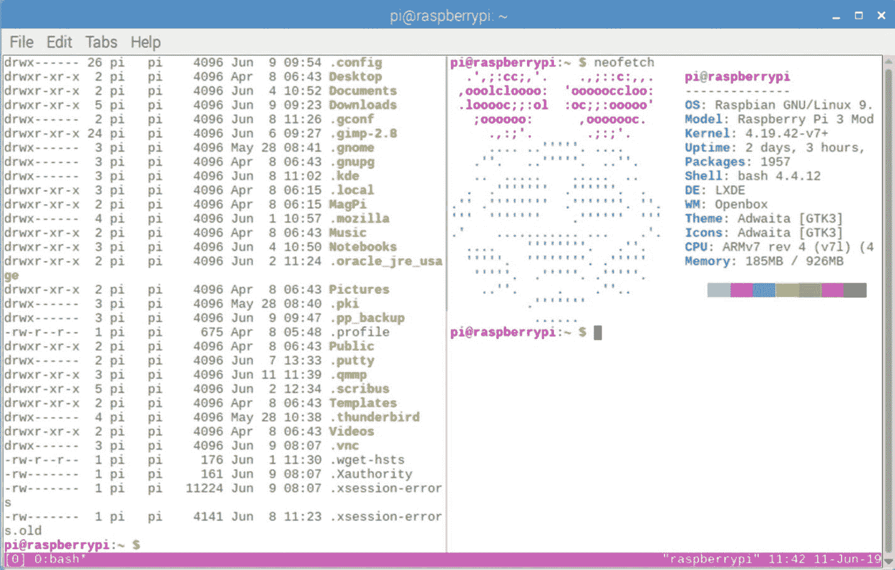
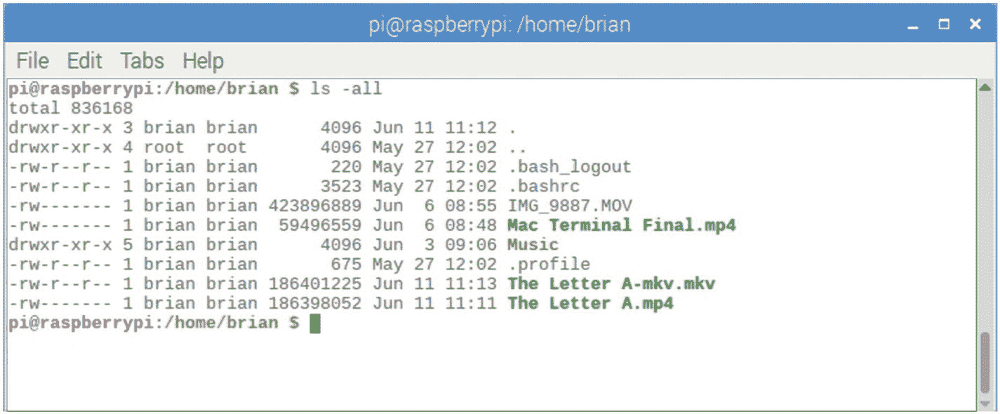
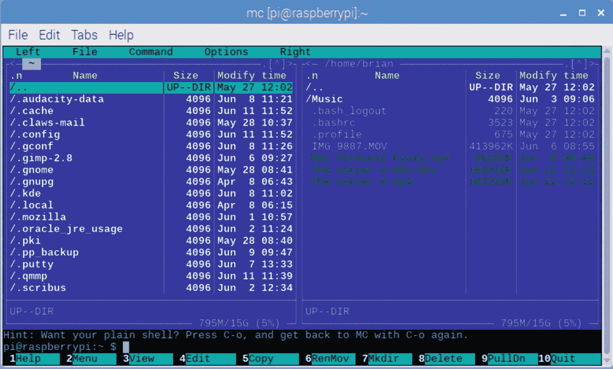
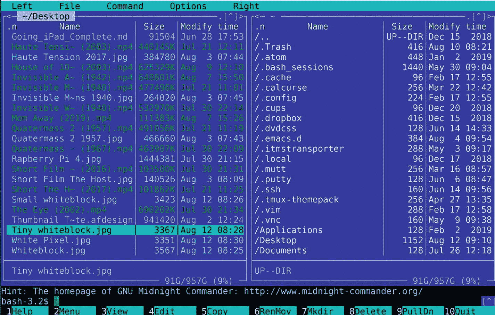
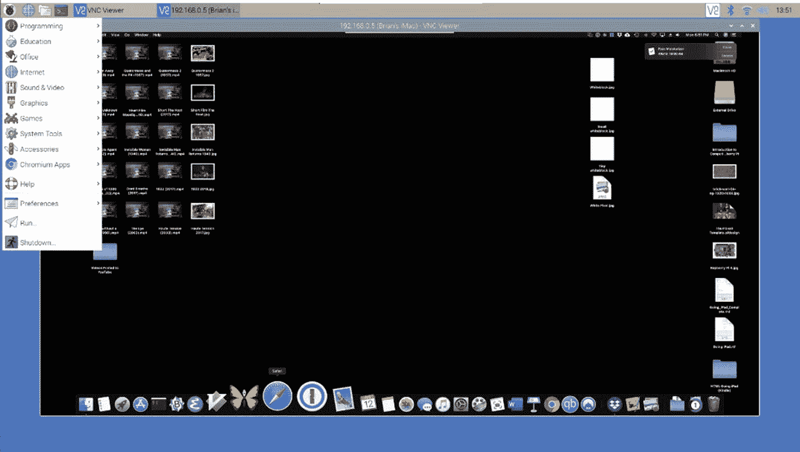

# 五、使用命令行工具

在过去的二十年里，我们都已经习惯了使用 GUI 应用和桌面，但在此之前，一切都是在终端屏幕上以文本模式完成的。如果你还记得 MS-DOS 或 UNIX 的时代，那么你就知道该怎么做。一直以来都是命令行。不管怎样，我们还是设法完成了工作。

简单的事实是，在许多方面，只使用命令行通常会更快更有效。例如，要在 GUI 中保存一个文件，你需要将手伸向鼠标，将鼠标移动到*文件*菜单，点击*保存*命令，然后将手移回键盘，继续打字。那是很多的感动和互动。或者你可以用键盘上的 Ctrl-S 来代替。这是一种权衡。使用键盘更快，但你必须花时间去学习。每天重复这种节省时间的方法数百次，可以为其他事情积累更多的时间。

许多基于文本的应用不依赖鼠标，甚至不支持鼠标。如今，键盘命令通常被认为是“高级用户技巧”，但是没有鼠标，它们就成了必需品。当你的双手可以一直放在键盘上时，你的工作效率会飞速提高。

当然，如果你对桌面出版或视频编辑感兴趣，那么你真的需要图形工具。有些东西只需要图形用户界面。另一方面，有许多任务仅仅使用键盘也可以完成，如果不是更有效的话。如果你认为用 Raspberry Pi 作为你唯一的电脑是一个有趣的挑战，试着在文本模式下完成它！

在这一章中，我们将会看到一些用来在文本模式下完成工作的基本工具。这不是一个关于 Linux 命令的全面教程，但是我们确实研究了一些命令，以及可以与这些命令一起使用或者有时代替这些命令的工具。我们先来看看 Tmux，一个可以让你一次控制多个文本“窗口”的应用；然后我们再来看一个比 Raspbian 收录的更好的终端 app 最后，我们将看看两个文件管理器，它们将使您移动、复制、备份和删除文件的体验更加容易。最后，我们将回顾一些基本的 Linux/Unix 文件命令，这些命令允许您手动复制、移动、删除文件，等等。

## 增加命令行的趣味性

您可能会把命令行想象成一个黑屏，上面有几行复杂而晦涩的绿色文本。如果这是您想要的，您当然可以这样做，但是有许多工具可以使停留在文本模式更像运行窗口 GUI。应用 Tmux 给你多个窗口。终结者给了你很好的配色方案，字体选择，并以不同的方式来分割你的屏幕。午夜指挥官和游侠使文件操作比试图记忆一堆命令更容易和更强大。我们将查看所有这些内容，并为枯燥的命令行增添趣味！

### Tmux 的

**Tmux 详细资料:**

安装:`sudo apt install tmux`

运行命令:`tmux`

点文件： `~/.tmux.conf`

帮助:`man tmux`

网址: [`https://github.com/tmux/tmux`](https://github.com/tmux/tmux)

有了像 Windows 或 MacOS，甚至 Raspbian 的桌面这样的 GUI，当你想一次运行多个应用时，你只需在自己的小窗口中运行每个应用。您可以将这些窗口彼此相邻放置，如果需要可以重叠它们，或者完全最小化它们。对于文本模式的终端应用，你只有一个屏幕，所以你需要把屏幕分成几个部分，在每个部分运行一个应用。实际上，您会得到相同的结果，但是需要提前多做一点计划。图 5-1 显示了使用一个名为 Tmux 的应用在一个窗口中运行的两个应用。



图 5-1

Tmux 正在使用

Tmux 是所谓的“终端多路复用器”这是一种奇特的说法，它把你的终端窗口分割成更小的窗格，每个窗格可以运行一个单独的程序。图 5-1 显示了一个运行两个应用的终端窗口:左边是 Vim，右边是目录列表。这都是通过 Tmux 完成的。

看起来不怎么样；您可能会注意到窗口底部有一个彩色条。这是典型的命令行应用；他们通常没有精美的菜单。

你可以通过按下 Tmux“command 键”来控制 Tmux，默认情况下是 ***Ctrl-B*** 。要让事情发生，你可以按 Ctrl-B 和其他键，这取决于你想做什么。例如，要垂直分割屏幕，如图 5-1 ，按 Ctrl-B，然后按%。请注意，要获得%，您还必须按住 Shift 键，因此实际上是 Ctrl-B，然后 Shift-5(在美国键盘上获得%)。

表 5-1 提供了最常用 Tmux 命令的快速列表。您可以将屏幕分割成多个 ***窗格*** ，和/或您可以拥有多个 ***窗口*** ，它们是整个屏幕。

表 5-1

各种 Tmux 命令

<colgroup><col class="tcol1 align-left"> <col class="tcol2 align-left"></colgroup> 
| 

行动

 | 

组合键

 |
| --- | --- |
| 垂直拆分窗口 | Ctrl-b % |
| 水平分割窗口 | Ctrl-b " |
| 新窗口 | Ctrl-b c |
| 关闭窗口 | Ctrl-d 或 Ctrl-b x |
| 终止窗口 | Ctrl-b & |
| 下一个窗口 | Ctrl-b n |
| 上一个窗口 | Ctrl-b p |
| 重命名窗口 | Ctrl-b ， |
| 列出所有窗口 | Ctrl-b 瓦 |
| 移动到窗口编号 | ctrl-b[数字] |
| 下一个面板 | Ctrl-b 或 |
| 前一窗格 | Ctrl-b ; |
| 显示窗格编号 | Ctrl-b q |
| 向左移动窗格 | Ctrl-b { |
| 向右移动窗格 | Ctrl-b } |
| 交换窗格位置 | Ctrl-b Ctrl-o |
| 向下调整窗格大小 | Ctrl-b Ctrl-j |
| 向上调整窗格大小 | Ctrl-b Ctrl-k |
| 向左调整窗格大小 | Ctrl-b Ctrl-h |
| 向右调整窗格大小 | Ctrl-b Ctrl-l |

那个*看起来*像是要记很多东西，但是通过使用你会很快掌握它们。开始时，你需要记住的是 Ctrl-B，然后是%或"来垂直或水平分割窗口；然后使用 Ctrl-B 和箭头键在窗格之间导航。

在第七章中，我将带你浏览我的 Tmux 的“dotfile”配置文件，向你展示一种简单的方法来改变这些键绑定或者改变 Tmux 的行为。

养成打开自己选择的终端 app，然后马上加载 Tmux，然后再加载其他任何东西的习惯是很好的。这样，如果你发现自己需要另一个应用，你可以打开另一个窗口，让它就在那里。当然，如果您愿意，您仍然可以打开两个、三个或十五个不同的终端窗口，但是同样，呆在 Tmux 中，您不会因为使用鼠标而放慢速度。

### 注意

如果你正在引导进入文本模式(完全没有 GUI)，那么 Tmux 是你可以同时运行多个应用的唯一方法。

### 终结者

**终结者详情:**

安装:`sudo apt install terminator`

运行命令:`tmux`

点文件： `~/.tmux.conf`

帮助:`man terminator`

网址: [`https://gnometerminator.blogspot.com/`](https://gnometerminator.blogspot.com/)

以前的应用 Tmux 在一个通用的终端窗口中运行，并以不同的方式分割您看到的内容，而 Terminator 是一个取代内置终端应用本身的应用，并在一个窗口中运行多个可调整大小的终端面板。

《终结者》并不完全是一款基于文本的应用；它是 Linux 终端的替代品。如果你喜欢 Raspbian 自带的常规终端应用，或者你更喜欢使用更常用的 Tmux 分屏方法，你可以跳过这一步。另一方面，我喜欢颜色和字体的定制，我认为它看起来更好，如图 5-2 所示。


图 5-2

三块终结者玻璃

### 游侠和午夜指挥官

**游侠详情:**

安装:`sudo apt install ranger`

运行命令:`ranger`

Dotfile:里面的各种文件`~/.config/ranger/`

帮助:`man ranger`

网址: [`https://github.com/ranger/rangera`](https://github.com/ranger/rangera)

**午夜指挥官详情:**

安装:`sudo apt install mc`

运行命令:`mc`

Dotfile:里面的各种文件`/etc/mc/`

帮助:`man mc`

网址: [`https://midnight-commander.org`](https://midnight-commander.org)

午夜指挥官和游侠都是档案管理员。它们允许您轻松浏览计算机的文件夹层次结构，复制、移动、重命名和删除文件，以及查看文件内容的预览。

完全可以忽略这两个，简单地用 Unix 命令复制文件，像 ***cp*** **，** ***mv*** **，** ***rm*** **，** ***ls*** 等等；有时候简单地输入命令会更快。不过，学习所有的 Unix 文件操作命令绝对是明智之举，这样你就可以快速地做事情。如果您喜欢纯粹使用命令行 shell，如图 5-3 所示，您随时都可以这样做。

另一方面，有时您想处理批量文件，或者更直观地浏览和导航您的文件。《午夜指挥官》和《游侠》都有各自的优点，但选择其中一个并学会真正精通它可能是最有效的方法。

Ranger 有一种更加“开放”的感觉，在最左边的两个窗格中有两级目录，在第三个窗格中有一个文件预览。移动速度很快，非常直观，但屏幕上没有任何控件或菜单——所有的*都是通过记忆的键盘命令完成的，这在开始时会让你变慢。如图 5-4 所示，它显示的非常干净和稀疏。*


图 5-4

Ranger 的文件列表



图 5-3

普通命令行上的文件列表

另一方面，午夜指挥官提供了一个永久的两列视图，如图 5-5 所示。这对于复制文件或比较文件夹来说很好，甚至还有一个内置的文件编辑系统。屏幕顶部还有菜单，可以通过键盘或(喘息！)鼠标。



图 5-5

午夜指挥官的文件列表

你用哪一个完全取决于你自己。它们都做完全相同的事情，但是它们的接口完全不同。我通常在命令行上执行大多数文件移动命令——请参阅下一节了解更多信息。如果我想快速移动到一首歌曲或加载一个文本文件，我会在 Ranger 中快速缩放到它。当我使用深度嵌套的路径时，或者在我不知道东西在哪里或者需要在一堆文件和目录中查找的时候，我会使用 Midnight Commander。

## 使用树莓派作为终端

到目前为止，在本书中，我们已经花了很多时间讨论命令行应用和工具，它们可以在 Pi 计算机的本地终端窗口中运行。我们甚至讨论过将您的 Pi 设置为在没有显示器或键盘的情况下“无头”运行。通过这样的无头设置，您可以使用 SSH 或 VNC 浏览器从其他计算机访问 Pi。

那些完全相同的工具也可以在大型远程计算机上工作，所以如果你遇到一些你的 RPi 真的不能处理的应用或进程，你可能想在别人的计算机上运行那个进程。举两个常见的例子，你可以从 Linode.com 和 DigitalOcean.com 这样的公司“租借”一台远程服务器。这些系统很便宜，每月大约 5 美元，并且可以无限扩展。

您可以坐在您的 Raspberry Pi、显示器和鼠标前，在您选择的终端应用中使用 SSH 和 VNC 浏览器在远程服务器上工作。在前面的章节中，我们看了内置的 Ubuntu 终端和 Terminator，但是这里有几十个其他的选项，你可以从桌面或者全屏命令行运行。你甚至可以通过这种方式访问 Mac 或 Windows 电脑，前提是你已经安装了正确的远程访问软件。如果你不能用 Pi 解决你的所有问题，也许你可以把它作为一个窗口，让一个更大的机器来做你需要的事情。

回到 20 世纪 70-80 年代，这种客户端-服务器配对非常普遍。人们将使用“哑”终端连接到“智能”计算机和大型机来完成工作。在个人电脑时代，这种思维方式消失了几十年。现在，在“一切都连接到互联网”的现代，在“云”中工作是很平常的事情

有了这种工作方式，你只需要一个好的终端程序就可以了，比如我们将在后面讨论的 Terminator，以及预装了 Raspbian 的 VNC 浏览器。你需要的所有计算能力都驻留在云中，你的 Pi 系统完全可以这样做任何事情。

### 嘘

**SSH 详情:**

安装:`sudo apt install ssh`

运行命令:`ssh <hostname>`

点文件： `~/.ssh/config and /etc/ssh/ssh_config`

帮助:`man ssh`

网址: [`www.openssh.com/`](http://www.openssh.com/)

SSH 应用允许您从终端屏幕登录(通过文本模式)到另一台计算机的纯文本终端。您可以在 Raspberry Pi 终端上做的任何事情，也可以在另一台电脑上远程完成。如果您需要的磁盘空间或互联网带宽超出了您在家可以管理的范围，那么您可以在服务器场“租用”计算机时间，并从您的 Pi“远程访问”。图 5-6 显示我的 Mac 在运行 Midnight Commander，但实际上我正坐在我的 Pi 前面，而我的 Mac 在楼上的一个房间里。



图 5-6

在树莓 Pi 上通过 SSH 访问我的 Mac

### VNC 观察报

**VNC 浏览器详情:**

安装:`(see web site)`

菜单位置:`Raspberry Menu``Internet`

帮助:`man vncviewer`

网址: [`www.realvnc.com/en/connect/download/viewer/raspberrypi/`](http://www.realvnc.com/en/connect/download/viewer/raspberrypi/)

我们在第三章中讨论过将 Raspberry Pi 设置为 VNC 服务器，这个应用做的正好相反；它是您用来登录运行 VNC 服务器的计算机的工具。这就像拥有一个完整的远程桌面:你可以坐在办公室里，你的显示器向你显示一台计算机的桌面，这台计算机可能在几千英里之外，你可以用键盘和鼠标来控制。

图 5-7 显示了从我的 Raspberry Pi 台式电脑访问我的 Mac 桌面。是的，我真的可以从我的 Pi 桌面上运行我的 Mac 应用；有些东西比它们本来的速度要慢一些，但是它们确实可以工作。VNC 软件在个人电脑和苹果电脑上都是免费的。这是一个超级强大的工具，不花一分钱。



图 5-7

通过 VNC 浏览器查看我的 Mac

## 基本 Linux 命令

在大多数情况下，你在命令行上输入的 90%都是应用的名称。我们将在下一章中讨论其中的许多问题。`Emacs`、`Calcurse`、`Vim`，甚至更多实用风格的 app 如`apt`、`shutdown`其实都只是自己的小程序。有时你需要操作一个文件或一个目录，这就是本节的目的。请注意，所有这些命令以及更多命令都可以通过 Midnight Commander 之类的界面来完成，所以即使是在命令行中，其中一些命令也是可选的。尽管如此，有时直接输入命令比使用菜单更快更方便。

### 清除屏幕

根据我的经验，最简单也是最常用的命令之一就是清理凌乱的屏幕。如果你想清除屏幕，只需输入

```sh
clear

```

在命令行中。你会看到一个刷新，整齐的终端屏幕。它做的不多，但是这些年来，我输入这个命令的次数可能比其他任何命令都多。

### 退出终端

如果你正在运行一个终端窗口，你可以简单地输入`exit`来结束你的会话并关闭窗口。如果你使用了选项来引导进入全屏模式，那么你不能只是退出终端；你需要使用`reboot`或`shutdown`命令来代替。

### 用 ls 列出文件

**ls** 是“列表”或“列表结构”的简称它只列出了当前目录中的所有文件。

```sh
ls gives the output

Desktop     Downloads   MagPi      Music      'Podsafe Music' Templates
Documents   Dropbox     Main.org   Pictures   Public           Videos

```

通过添加一些参数和选项，您可以做更多的事情:

*   `-l`以长格式显示列表，显示 Linux 文件类型、权限、硬链接数量、所有者、组、大小、最后修改日期和文件名。

*   列出给定目录中的所有文件，包括名称以“.”开头的文件(在 Unix 中是隐藏文件)。默认情况下，这些文件不包含在列表中。

*   递归列出子目录。例如，命令 ls -R /将列出系统上的所有文件。

*   `-d`显示关于符号链接或目录的信息，而不是关于链接的目标或列出目录的内容。

*   `-t`按修改时间对文件列表进行排序。

*   `-h`以人类可读的格式打印尺寸(例如 1K、234M、2G 等。).

例如，我们可以列出当前目录中的所有文件，包括隐藏的文件，按时间排序，通过输入

`ls -alt`向我们展示了

```sh
drwxr-xr-x  4 root root 4096 Jul 28 02:46  ..
drwx------  3 pi   pi   4096 Jul 10 06:10  .vnc
-rw-------  1 pi   pi    217 Jul 10 06:10  .Xauthority
drwx------ 24 pi   pi   4096 Jul 10 06:09  .config
drwxr-xr-x  2 pi   pi   4096 Jul 10 05:52  Documents
drwxr-xr-x 13 pi   pi   4096 Jul 10 05:46  .cache
drwx------  3 pi   pi   4096 Jul 10 05:07  .pp_backup
drwxr-xr-x  2 pi   pi   4096 Jul  9 08:10  .gstreamer-0.10
drwxr-xr-x  3 pi   pi   4096 Jul  9 08:04  .qmmp
drwxr-xr-x  4 pi   pi   4096 Jul  9 05:25  .audacity-data
drwxr-xr-x  3 pi   pi   4096 Jul  9 05:21  Dropbox
drwxr-xr-x  2 pi   pi   4096 Jul  9 05:16  Downloads
-rw-r--r--  1 pi   pi   2363 Jul  9 04:10  Main.org
drwx------  2 pi   pi   4096 Jul  6 11:41  .putty
drwxr-xr-x  2 pi   pi   4096 Jul  6 04:28 'Podsafe Music'
-rw-r--r--  1 pi   pi   3795 Jul  6 04:27  .vimrc
-rw-r--r--  1 pi   pi    185 Jul  6 04:27  .tmux.conf
-rw-r--r--  1 pi   pi   1282 Jul  6 04:27  .muttrc
-rw-r--r--  1 pi   pi   8331 Jul  6 04:27  .emacs
drwxr-xr-x  8 pi   pi   4096 Jul  6 04:27  .vim
drwxr-xr-x  4 pi   pi   4096 Jul  6 04:27  .tmux-themepack
drwxr-xr-x  5 pi   pi   4096 Jul  6 04:27  .mutt
drwx------  3 pi   pi   4096 Jul  6 03:54  .gnome
drwx------  3 pi   pi   4096 Jun 20 08:22  .pki
drwxr-xr-x  2 pi   pi   4096 Jun 20 08:20  Music
drwxr-xr-x  2 pi   pi   4096 Jun 20 08:20  Pictures
drwxr-xr-x  2 pi   pi   4096 Jun 20 08:20  Public
drwxr-xr-x  2 pi   pi   4096 Jun 20 08:20  Templates
drwxr-xr-x  2 pi   pi   4096 Jun 20 08:20  Videos
drwxr-xr-x  2 pi   pi   4096 Jun 20 08:20  Desktop
drwx------  3 pi   pi   4096 Jun 20 08:20  .gnupg
drwxr-xr-x  2 pi   pi   4096 Jun 20 07:55  MagPi
drwxr-xr-x  3 pi   pi   4096 Jun 20 07:55  .local
-rw-r--r--  1 pi   pi    220 Jun 20 07:47  .bash_logout
-rw-r--r--  1 pi   pi   3523 Jun 20 07:47  .bashrc
-rw-r--r--  1 pi   pi    807 Jun 20 07:47  .profile

```

您还可以包括目录或目录的完整路径:

```sh
ls -al ~
ls -al /home
ls -al /home/brian/Music/Instrumental

```

### 主目录:~

波浪号(~)是一个特殊字符，表示当前用户的“个人”文件夹。这样，不管你是谁，也不管你在系统中处于什么位置，你都可以一般性地引用“home”。

如果你确实想指定一个位置，你可以在选项后输入它，像这样:

```sh
ls -al /home/brian/Music

```

这将专门列出用户“brian”的音乐文件夹的内容

### 在文件系统中移动

使用`ls`命令，我们学会了查看不同目录中的内容。如果你想移动到一个目录，你使用`cd` ( *改变目录*)命令。

```sh
cd /home/brian

```

将当前目录更改为用户 brian 的主文件夹。另一种进入当前用户个人文件夹的方法是`cd ~.`即使你不知道当前用户的名字，这个方法也有效。

```sh
cd /

```

带您到文件系统的根，即文件系统“树”的“根”其他的都是从/分支的子目录。

```sh
cd ..

```

两个句点“`..`”表示位于当前目录正上方的目录。例如，如果你现在在/home/brian/Music，你想去/home/brian，你可以简单地输入`cd ..`，你将在结构中上移一层。或者，你也可以输入`cd /home/brian,`，但这两个句号的输入速度更快。

### 创建、删除和列出目录

有时，您需要创建一个目录/文件夹，为此，您可以使用`mkdir`命令。您可以通过键入以下命令在当前目录中创建一个目录

```sh
mkdir newname

```

或者，您可以在文件系统中的任何位置创建一个新目录，方法是在新目录名之前包含完整的路径名:

```sh
mkdir /home/pi/Downloads/newname

```

请注意，要在当前目录中创建一个新目录，您必须拥有访问权限。

类似地，要删除一个目录，可以使用`rmdir`命令:

```sh
rmdir /home/pi/Downloads/newname

```

移除/删除目录要求该目录为空。您需要首先删除所有文件或子目录。

要查看 Linux 文件系统的“图表”，您可以键入命令`tree`。它将显示您指定的路径下的所有子目录。例如，要查看下载目录中所有内容的结构，您只需输入

```sh
tree ~/Downloads

```

并获得以下内容:

```sh
/home/pi/Downloads
├── DOS Games Pack.zip
├── kali-linux-2019-2a-rpi3-nexmon-img-xz
│   ├── kali-linux-2019.2a-rpi3-nexmon.img.xz
│   └── kali-linux-2019.2a-rpi3-nexmon.img.xz.txt.sha256sum
└── kali-linux-2019.2a-rpi3-nexmon.img.xz.torrent

1 directory, 4 files

```

有时候，这对于查看东西藏在哪里或者是否有一个你已经忘记的目录非常有用。

除了`cd`命令，你也可以使用该命令

让系统告诉你你现在在哪里。Pwd 是**现在工作目录**的简称。

类似地，如果您需要查看当前的用户名，您可以问

系统会告诉你当前的用户名。如果你经常使用自己的用户名登录，并且额外使用超级用户“pi”帐户，这有时可以解决计算机认为你是谁的困惑。

### 移除(删除)文件

有时，您会想要删除文件。为此，您可以使用移除命令`rm`。你总是需要在`rm`后面加上一些文件名或目录名:

```sh
rm /home/brian/junkfile.txt

```

这将从我的主目录中删除文件 junkfile.txt。

```sh
rm /home/brian/download/*

```

这个命令使用一个“通配符”星号来表示“一切”这个命令将删除用户 brian 的下载目录中的所有文件。这只会删除文件，不会删除子目录。如果您想删除目录中的所有内容，包括其下的所有内容，您需要`-r`和`-f`选项:

`rm -rf /home/brian/download/*`

`-r`告诉`rm`递归地删除文件，或者换句话说，跟随任何子目录并杀死它们。`-f`选项删除确认消息。"您确定要删除它吗？"种消息将不再出现。

注意递归删除文件可能是危险的。命令`rm -rf *`将删除计算机上的所有东西——所有用户的每个系统文件、每个数据文件，假设你有权限访问这些文件；这是 Linux 依赖于许可系统的一个原因。这比让每个用户完全访问所有内容要安全得多。

### chown 的文件所有权

说到权限和访问，有时您可能想要更改文件的所有者。例如，假设您以用户“pi”的身份创建了一个文件`filename.txt`，并且您想以用户“brian”的身份编辑它您可以将文件加载到编辑器中，但是当您尝试保存更改时，会收到一条消息，指出您没有权限这样做。为什么呢？因为操作系统认为这不是你的文件。

```sh
sudo chown filename.txt brian

```

这将把文件的所有权更改为用户 brian。请注意，这需要“sudo”命令才能工作；这个要求是如此的不仅仅是任何人都可以改变文件的所有权；必须是对系统负责的人。请记住，Linux 是一个多用户操作系统，有多个用户可以登录到机器上，所有这些安全措施都是围绕这个概念设计的。

### 复制和移动文件

将文件从一个目录复制和移动到另一个目录也很常见。这里使用的两个命令是 cp 和 mv，分别用于复制和移动。cp 命令将一个文件从一个目录复制到另一个目录，当它完成时，在两个位置都会有该文件的副本。`mv`命令做同样的事情，但是它也删除了原始文件，有效地*移动*文件。

```sh
cp /home/brian/download/game.tar /home/brian

```

将在 brian 的主目录中创建 game.tar 的精确副本，而将原件留在下载目录中。

```sh
mv /home/brian/download/game.tar /home/brian

```

将在 brian 的主目录中创建 game.tar 的精确副本，然后删除下载目录中的原始副本。

您还可以使用通配符将文件夹中的所有文件移动到某个位置。

```sh
mv ~/download/* ~/backups

```

会将/home/username/download 目录中的所有文件移动到/home/username/backups 目录中。

### 手册页

如果有疑问，请阅读手册！说真的，Linux 擅长的事情之一是对命令行应用的全面文档化。如果有一个命令你真的不明白，你可以阅读完整的在线手册。假设 Neofetch 让你困惑；它到底是做什么的？目的是甚麽？

假设您已经安装了 Neofetch，输入

```sh
man neofetch

```

你会得到多个屏幕页面的文档，包括如何使用它的概要，解释应用用途的描述，所有可以使用的选项和参数，以及其他任何重要的内容。通常，有比你想知道的更多的信息。阅读手册页时，您可以使用箭头键上下移动，空格键前进到屏幕“页面”，键盘上的 Q 键退出并返回到提示:

```sh
NEOFETCH(1)                                   User Commands
NAME
     Neofetch - A fast, highly customizable system info script
SYNOPSIS
     neofetch func_name --option "value" --option "value"
DESCRIPTION
     Neofetch  is  a  CLI  system information tool written in BASH. Neofetch displays information about
     your system next to an image, your OS logo, or any ASCII file of your choice.
     NOTE: Every launch flag has a config option.

OPTIONS
   INFO:
       func_name
              Specify a function name (second part of info() from config) to quickly  display  only  that
              function's information.

              Example: neofetch uptime --uptime_shorthand tiny
              Example: neofetch uptime disk wm memory
              This can be used in bars and scripts like so:
              memory="$(neofetch memory)"; memory="${memory##*: }"
              For multiple outputs at once (each line of info in an array):
              IFS=$'\n' read -d "" -ra info < <(neofetch memory uptime wm)
              info=("${info[@]##*: }")
              --disable infoname
              Allows you to disable an info line from appearing in the output. 'infoname' is the function
              name from the 'print_info()' function inside the config file.  For example: 'info  "Memory"
              memory' would be '--disable memory'
              NOTE: You can supply multiple args. eg. 'neofetch --disable cpu gpu'

       --package_managers on/off

              Hide/Show Package Manager names . (tiny, on, off)

```

## 结论

要使用命令行，您需要一些 Unix/Linux 命令的基础知识。尽管如此，使用正确的工具，比如 Midnight Commander 或 Ranger，您可以最大限度地减少记忆和键入神秘命令的需要。该终端的另一个限制是一次只显示一个应用，这可以通过使用 Tmux 来克服，在 Tmux 中，你可以用十几个同时运行的应用来填充你的屏幕(并不是说获得太多应用是一个好主意，但你**可以**做到这一点)。最后，我们看了用于从命令行手动操作文件和目录的命令。

在下一章，我们将看几十个命令行程序，它们将解决你的许多工作需要。我们将看看电子邮件客户端、书写工具、电子表格和几个网络浏览器，它们都以文本模式 运行 ***。***