# 六、使用命令行应用

既然您可以使用命令行并在其中移动东西，那么是时候做一些真正的工作了。

在第四章，我向你展示了大多数任务的两到三个最好的应用。这些都是拥有数百万用户的知名应用，尽管其中一些已经存在了一段时间，但它们仍然在不断更新和维护。

在这一章中，我将向您展示一些执行大多数任务的最常见和最流行的命令，但是请记住，几十年来，人们一直在使用类似的工具来执行这些任务(Unix 出现于 20 世纪 70 年代，而 Linux 是这些工具的直接后代)；每个应用可能有几十种可用的解决方案，人们仍在想出新的方法来做同样的事情。所以，在你看过我的建议后，做一点网络调查，看看是否有更适合你工作流程的方法。

## 书写工具

可能大多数人的主要任务(除了浏览网页和电子邮件)是写作。无论是简单的笔记、电子邮件还是完整的书籍，都有一些很棒的纯文本工具来完成这项工作。

不像微软的 Word 或者苹果的 Pages，你不能在一个基于文本的终端窗口中仅仅高亮显示一个单词，并把它变成粗体或者斜体。你通常需要使用某种标记语言，比如 Markdown 或 LaTeX(见第七章)。像几乎所有涉及到切换到文本模式的事情一样，它在开始时更困难，但是一旦你知道它是如何工作的，它会更有效率和更快。

### NANOTECHNOLOGY 简称

**纳米详情:**

安装:`sudo apt install` `nano` `(default with Raspian)`

运行命令:`nano <filename>`

点文件： `~/.nanrc`

帮助:`man nano`

网址: [`www.nano-editor.org/`](http://www.nano-editor.org/)

Nano 通常预装在大多数 Linux 系统中。这是一个非常非常基本的文本编辑器。事实上，对于大多数有用的任务来说，它几乎太基础了——Nano 的定制选项非常有限。也就是说，几乎可以肯定它已经预装在你的系统中了，它很适合快速阅读或快速修改文件。在本书中，当我们需要编辑文本文件时，我的例子使用 Nano。它很简单，每个系统上都有，所以这是本书的“标准”文本编辑器。在过去的章节中，我们已经多次使用 Nano 向配置文件添加行。它不仅简单易学，而且所有功能都可以通过屏幕底部的两行菜单轻松找到。它不是“一生的编辑”，但可能是你需要的全部。在 Nano 的图 6-1 中可以看到这一章的降价版本。

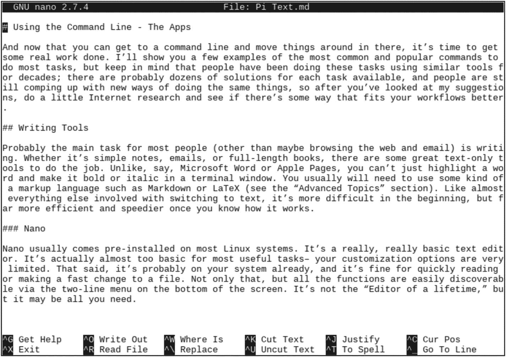

图 6-1

纳米文本编辑器

### 精力

**Vim 详细信息:**

安装:`sudo apt install` `vim`

运行命令:`vim <filename>`

点文件： `~/.vimrc`

帮助:`man vim`

网址: [`www.vim.org/`](http://www.vim.org/)

Vim 和 Emacs 是为程序员设计的文本编辑器，如果你是一名程序员，这两者中的任何一个都是你精通的绝佳选择。任何一个都可以适用于几乎任何东西，因为你可以想象的每一个功能都有无数的定制选项和插件。

至少在我看来，Vim 一开始有点难学，但是一旦你通过了学习曲线，它就非常值得。这是一个*模态*编辑器，意味着你可以在一种模式下移动和导航，在另一种模式下输入文本，在第三种模式下可视地选择内容。这是一种不同寻常的工作方式，来自于像微软 Word 这样的东西，但是一旦你了解了这个应用是如何工作的，就会有很大的力量。Vim 如图 6-2 所示。


图 6-2

我是文字编辑器

### 编辑器

**Emacs 详细资料:**

安装:`sudo apt install emacs25`

运行命令:`emacs <filename>`

点文件： `~/.emacs`

帮助:`man emacs`

网址: [`www.gnu.org/software/emacs/`](http://www.gnu.org/software/emacs/)

然后是 Emacs，如图 6-3 所示。有些人不用离开 Emacs 就可以打字、查看电子邮件、在日历上添加约会、更改待办事项、浏览网页。比 Vim 容易上手，但是用的越多，Emacs 的无底洞就越深。在 Emacs 的“专家级别”工作的人可能不用离开 Emacs 就能做我们在这本书里谈论的所有事情……*。*还有人开玩笑地称 Emacs 本身就是一个操作系统，但它的可扩展性太强了，几乎不是开玩笑。

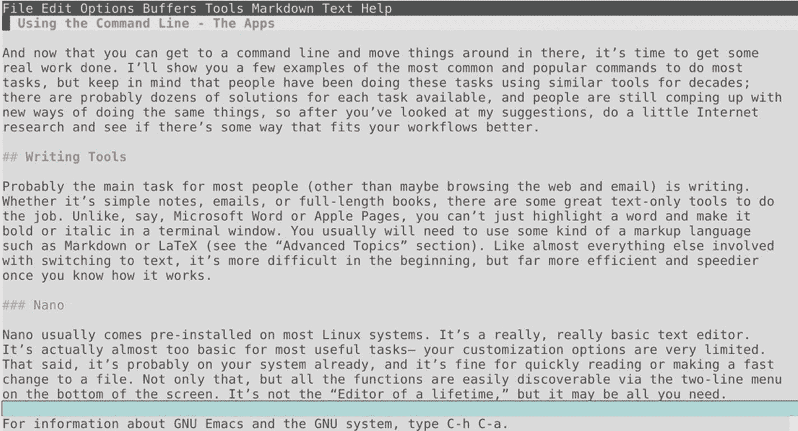

图 6-3

Emacs 文本编辑器

有了 Emacs 和 Vim，编辑器的几乎任何方面都可以定制，并以多种不同的方式工作。还有一些插件、主题和扩展，允许你做一些甚至是最初的开发者都无法想象人们可以在文本编辑器中做的事情。对我来说，在这两个主要的写作应用之间做决定一直是一个艰难的决定，我涉足了每一个，花了太多的时间来来回回。

注意前面的 *apt* 命令安装的是 *emacs25* ，而不是普通的 emacs。您可以选择安装默认的 Emacs，但是由于某种原因，Raspbian 安装程序将默认安装 Emacs 版本 24，这是一个更老、更受限制的版本。除非你知道你可能需要它的一些具体原因，否则不要使用它。

### 文字研磨机

**WordGrinder 详情:**

安装:`sudo apt install wordgrinder`

运行命令:`wordgrinder`

点文件： `~/.wordgrinder.lua`

帮助:`man wordgrinder`

网址: [`http://cowlark.com/wordgrinder/index.html`](http://cowlark.com/wordgrinder/index.html)

前面的三个编辑器最初都是考虑到编程/编码而设计的。WordGrinder 从一个不同的角度来写作。这是专门为作家设计的文字处理器。它有易于使用的菜单，箭头键像你期望的那样工作，这里很少有惊喜。您可以在文本中轻松地将单词加粗或斜体，并且您不需要学习 Markdown 或任何特殊的编码。

另一方面，与 Emacs 或 Vim 不同，它的可定制性不强；它来的时候就很管用。没有任何插件或花哨的主题。它很简单，但使用起来很可靠和简单，而且它很简单，如图 6-4 所示。

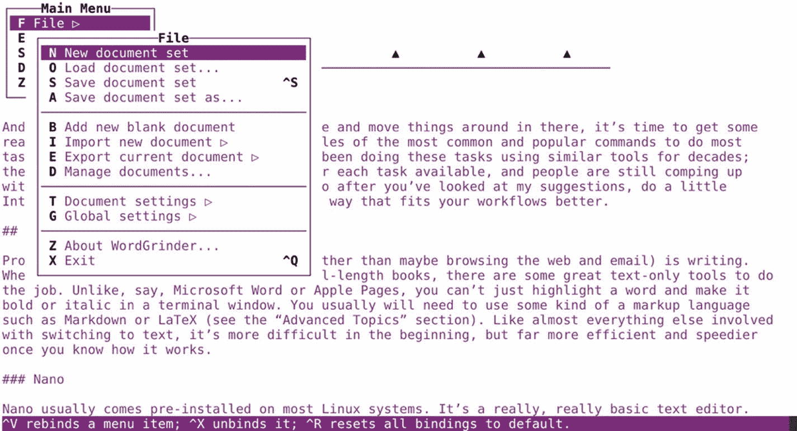

图 6-4

WordGrinder 文字处理器，带有易于查找的菜单

我的建议是先看看 Nano 和 WordGrinder。Nano 非常适合快速和肮脏的文本编辑，而 WordGrinder 可以处理大多数*真正的*写作任务。如果你决定真的想成为一名“文本大师”，那么升级到更强大和更灵活的 Vim 和/或 Emacs——它们提供更多，但也需要相当多的努力才能真正掌握。

## 电子邮件

电子邮件可能是当今大多数计算机的主要商业用途，是一个至关重要的工具。然而，由于黑客和垃圾邮件发送者的盛行，电子邮件的安全性是一个主要问题。这使得设置电子邮件客户端成为我们将要遇到的最具挑战性的任务之一。

### 发送邮件

**发送邮件详情:**

安装:`sudo apt install sendmail`

运行命令:`sendmail`

Dotfile:里面的各种文件`/etc/mail`

帮助:`man sendmail`

网址: [`https://sendmail.org/~ca/email/doc8.12/op.html`](https://sendmail.org/%257Eca/email/doc8.12/op.html)

这个应用通常有点不确定。众所周知，Sendmail 是一个很难安装的应用，由于存在被黑客攻击或滥用的可能性，最好还是交给专家来安装。Raspbian 的默认安装不包含 Sendmail，但是其他发行版*可能已经安装并配置了 Sendmail，所以值得一试。只需在文本文件中键入一条消息，保存它，然后键入类似如下的内容:*

```sh
sendmail user@example.com < message.txt

```

另一个选择是尝试

```sh
sendmail -t user@example.com

```

然后在下面输入你的信息。按 Ctrl-D 发送消息，或按 Ctrl-C 中止。这要么有效，要么无效，这取决于您运行的 Linux 发行版。我再次建议，如果这不是你开箱即用的“工作”,你可以选择其他选项，因为这是一个强大但配置起来非常复杂的应用。

### 笨蛋

**杂种狗详情:**

安装:`sudo apt install` `mutt`

运行命令:`mutt`

点文件： `~/.muttrc`

帮助:`man mutt`

网址: [`www.mutt.org/`](http://www.mutt.org/)

Mutt(以及下文中的 Alpine)是一个比 Sendmail 更完善的电子邮件客户端。你有一个完整的界面来搜索、分类、阅读和回复你的邮件；而且很容易处理多个文件夹和邮件附件。选择哪个取决于你需要什么，你觉得哪个更有吸引力，更有用。他们做的事情几乎一样。

我发现 Mutt 的一个主要缺点是它以纯文本的形式将密码存储在配置文件中。如果有人进入你的系统，他们可以很容易地看到你的电子邮件密码，给你带来一大堆麻烦。你*可以*使用 Mutt 并让它不存储密码，但这样你就需要在每次加载 Mutt 时重新输入你的电子邮件密码，这至少可以说是不方便的。

尽管如此，对于一个基于文本的应用来说，它还是很有吸引力的，包括一些屏幕菜单选项，并且设置起来也不太难。图 6-5 显示了一封来自我博客的邮件。

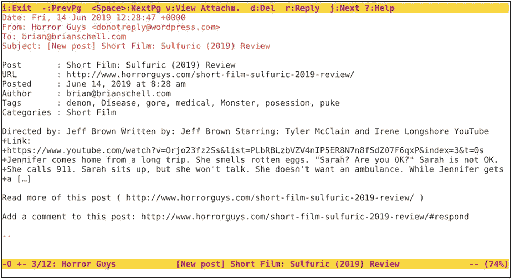

图 6-5

Mutt 电子邮件客户端

### 阿尔卑斯山的

**高山详情:**

安装:`sudo apt install` `alpine`

运行命令:`alpine`

点文件： `~/.pinerc`

帮助:`man alpine`

网址: [`http://alpine.x10host.com/alpine/`](http://alpine.x10host.com/alpine/)

Alpine 没有 Mutt 那么容易定制，但它能够在服务器上存储加密的密码。如果你有一个远程系统(也就是说，你用 SSH 连接到它)并且你不想每次都被输入你的电子邮件密码所困扰，这是一个更好的选择。它也可以通过菜单在应用中进行配置，而 Mutt 依赖于如何修改“点文件”，我们将在稍后讨论。图 6-6 会给你阿尔卑斯山菜单方面的提示。

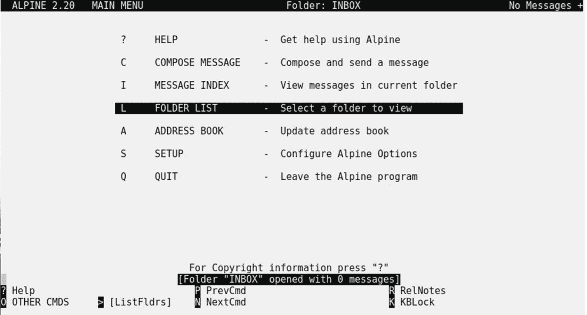

图 6-6

Alpine 电子邮件客户端

## 其他“办公”应用

写作和电子邮件对我们大多数人来说是件大事，但大量有用的工作也涉及数字和演示。在 GUI 世界里，有微软的 Excel 和 PowerPoint，甚至还有 LibreOffice。那些在命令行上不起作用，所以我们需要找到类似的东西。

### SC 和 SC-IM

**SC 详细信息:**

安装:`sudo apt install sc`

运行命令:`sc`

点文件： `~/.scrc`

帮助:`man sc`

网址: [`https://github.com/n-t-roff/sc`](https://github.com/n-t-roff/sc)

SC 是屏幕计算器的缩写，也称为文本模式的电子表格。它做所有像 Excel 这样的电子表格所做的基本工作，但都是通过键盘和文本屏幕来完成的。它希望以 CSV(逗号分隔值)格式保存所有文件，但可以读取 Excel 文件。它允许文本左右对齐、剪切和粘贴、各种十进制格式选项以及大量的计算和数学功能。它不像 GUI 电子表格那样漂亮，但是它的功能无处不在。如果你记得 VisiCalc 或 Lotus 1-2-3 的日子，这将带回美好的回忆或噩梦。

最初的 SC 程序创建于大约 13 年前；SC-IM fork 仍在开发和维护中，因此即使它看起来像是直接来自 80 年代，但它是安全的，维护得很好。图 6-7 显示了对一列数字进行求和平均的简单计算。

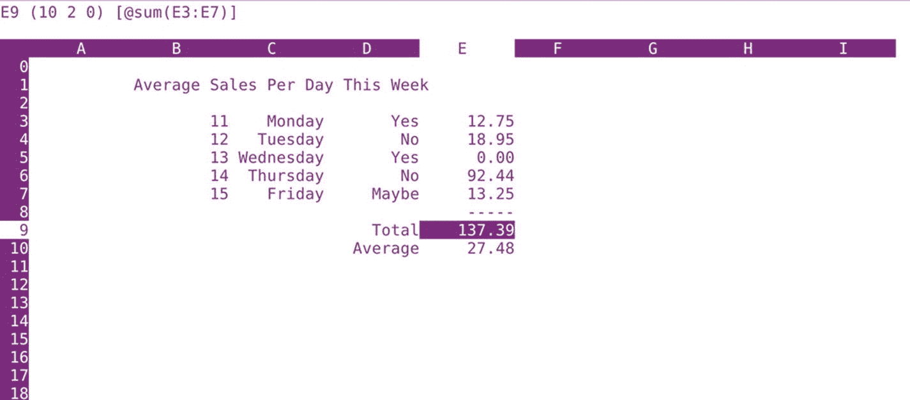

图 6-7

SC 电子表格计算器

```sh
sudo apt install sc

```

您可以通过以下链接了解更多信息:

*   SC 电子表格计算器文章: [`www.linuxjournal.com/article/10699`](http://www.linuxjournal.com/article/10699)

*   SC 迷你手册: [`www.adrianjwells.freeuk.com/minmansc.pdf`](http://www.adrianjwells.freeuk.com/minmansc.pdf)

### 报告

在 Windows 和 Mac 的世界里，PowerPoint、Keynote、Impress 甚至谷歌幻灯片都可以用来演示。幻灯片演示需要图形，所以基于文本的演示在大多数时候可能不是最好的方式。尽管如此，有时你想做一些事情只是为了显示你*能*做一件事，所以这里有你的展示选项:比默、维姆迪克和 MDP。

**Beamer** 本身并不是一个*app*；这是 LaTeX 的一个扩展(见第七章第)，允许你使用文本编辑器创建一个文件，然后输出为 PDF 格式，可以在投影仪上显示，打印出来，或通过电子邮件发送给收件人。它允许彩色文本、图形、图表以及 LaTeX 支持的基本上任何类型的媒体。它不做任何类型的动画，因为它以 PDF 格式输出，但任何静态图像都可以使用。

**投光器详情:**

安装:`sudo apt install latex-beamer`(注意:需要已经安装了 texlive-full 和 texmaker)

运行命令:`load the output into your PDF viewer`

点文件： `none`

求助: [`www.overleaf.com/learn/latex/Beamer_Presentations:_A_Tutorial_for_Beginners_(Part_1)%E2%80%94Getting_Started`](http://www.overleaf.com/learn/latex/Beamer_Presentations:_A_Tutorial_for_Beginners_%2528Part_1%2529%2525E2%252580%252594Getting_Started)

网址: [`https://github.com/josephwright/beamer`](https://github.com/josephwright/beamer)

Vimdeck 是一个工具，它允许你使用 Markdown 编写一个文件(参见第七章)并将其编译成一个可以使用 Vim 查看的演示文稿。您不必使用 Vim 来创建文件，但是最终的表示已经过优化，可以在 Vim 中使用。图 6-8 中的“幻灯片”实际上只是显示在 Vim 中的一个大文本文件中的一页。

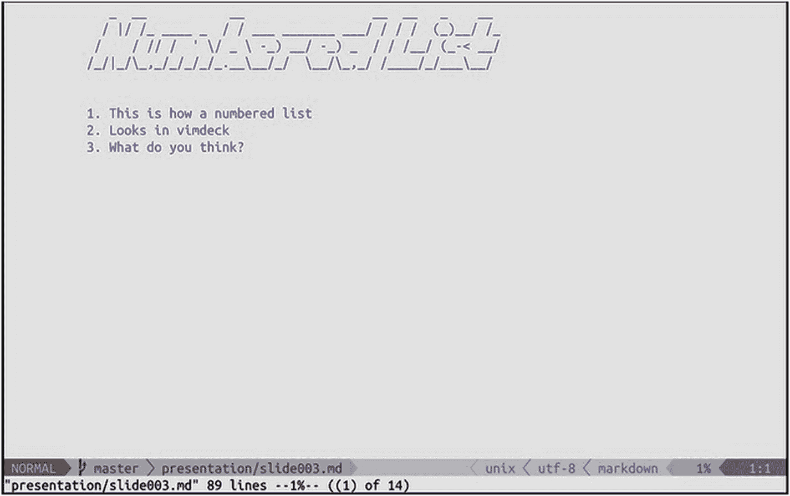

图 6-8

Vimdeck 演示

**videck 详细资料:**

安装:`sudo gem install vimdeck`

运行命令:`vimdeck`

点文件： `none`

帮助:`vimdeck`

网址: [`https://github.com/tybenz/vimdeck`](https://github.com/tybenz/vimdeck)

MDP 是一款以文本形式运行演示文稿的应用。Beamer 和 Vimdeck 是创建演示文件的工具，而 MDP 采用降价文本并进行实际的演示(见图 6-9 )，有许多漂亮的选项，包括颜色、引用、标题、嵌套列表和许多其他基于文本的(仍然没有图形)元素。

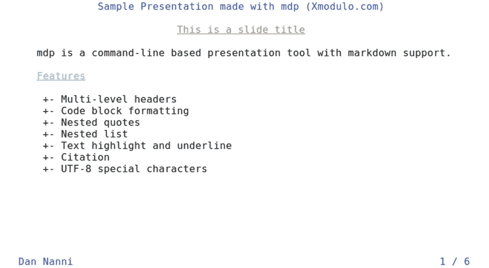

图 6-9

MDP 演示

**MDP 详情:**

安装:`sudo apt install mdp`

运行命令:`mdp`

点文件： `none`

帮助:`man mdp`

网址: [`https://github.com/visit1985/mdp`](https://github.com/visit1985/mdp)

## 笔记应用

快速记笔记是 GUI 操作系统擅长的事情之一，但是有时您需要复制一些文本以备后用，或者下次记详细的笔记，并且您不想离开命令行。我们将在这里看看两个主要的参与者:Terminal Velocity 是一个应用，它可以非常快速地记下和找到基于文本的笔记，而 Emacs Org-mode 是一个大纲视图、调度程序、待办事项管理器，以及内置于文字处理器 Emacs 中的完整组织系统。

### 终端速度

终端速度是一个相当新的应用，灵感来自于 Mac OSX 的应用 Notational Velocity。要创建新便笺，请键入便笺的标题，然后按 Enter 键。该注释将在您的文本编辑器中打开。当您键入标题时，笔记列表会过滤以显示与您键入的内容匹配的笔记，让您有机会打开相关笔记，而不是创建新笔记。这意味着您使用与搜索现有便笺相同的行来键入新便笺，这使得整个搜索和创建过程非常快。我把这个和 Dropbox 结合使用，在我所有的设备上保存我的笔记。

Terminal Velocity 的安装与我们看过的其他应用不同，因为它不在 Raspbian 的存储库中。我们将使用一个名为 *Pip* 的应用来安装它。

**终端速度详情** **:**

安装:`sudo pip install terminal-velocity`

运行命令:`terminal_velocity`

点文件： `~/.tvrc`

帮助:`see web site`

网址: [`https://vhp.github.io/terminal_velocity/`](https://vhp.github.io/terminal_velocity/)

### Emacs 组织模式

我们已经在“编写工具”一节中讨论了 Emacs，但是这里值得再提一下。“Org-mode”是 Emacs 提供的一种特殊模式，它允许您键入被视为某种大纲的文本。你用类似 Markdown 的格式写文件；但是您也可以使用 Tab 键快速折叠或展开大纲树，上下移动整个部分，并快速创建待办事项列表、大纲和各种笔记。如果您已经对 Emacs 有所了解，那么开始使用 Org-mode 是很容易的，但是您可以用它做的事情太多了，因此选项会变得很广泛。

图 6-10 显示了我 6 月 13 日的待办事项清单。即使不解释待办格式在 Org-mode 中是如何工作的，你也能准确地理解文件中发生了什么。

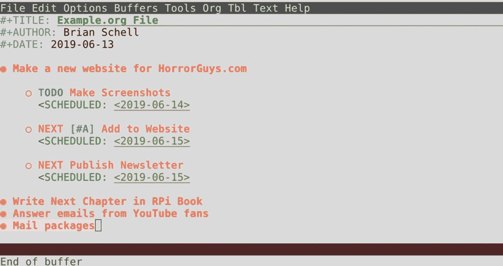

图 6-10

Emacs 组织模式文件

## 安全

在使用 Linux 时，有一件事你通常不必担心，那就是病毒。由于所有东西都被分割开来，并受到用户名和权限的限制，因此比在 Windows 机器上感染病毒要困难得多。但是，这并不意味着您不必担心安全性。值得关注的一个主要方面是密码安全性。

### 及格

Pass 是一个密码管理系统。它可以跟踪数千个网站和密码的数据库，在创建安全密码方面特别有用。您可以请求一个新的密码，指定符号的数量，它会完全随机地生成您需要的内容，并将其复制到剪贴板。

这种应用非常有用。我已经从弱密码，如

```sh
USER: brianschell
PASSWORD: PENCIL (or the cat's name or something)

```

到

```sh
USER: brianschell
PASSWORD: zagw@JPTfVquVkQjvAetx2ZiA

```

显然，像这样的密码很难记住，或者说很难输入；幸运的是，Pass 会为您将密码复制到剪贴板中。

**通行证详情:**

安装:`sudo apt install pass`

运行命令:`pass`

点文件： `none`

帮助:`man pass`

网址: [`www.passwordstore.org`](http://www.passwordstore.org)

还有一个*通行证*安装和教程可以在 [`www.2daygeek.com/pass-command-line-password-manager-linux/`](http://www.2daygeek.com/pass-command-line-password-manager-linux/) 找到。

### ktorrent

**r 当前详情** **:**

安装:`sudo apt install rtorrent`

运行命令:`rtorrent`

点文件： `~/.rtorrent.rc`

帮助:`man rtorrent`

网址: [`http://rakshasa.github.io/rtorrent/`](http://rakshasa.github.io/rtorrent/)

正如我在第 3 和 4 章中提到的，当我们谈到洪水应用时，BitTorrent 作为人们用来分享“盗版”文件的一种方法受到了很多负面报道，但它也有许多合法用途。通过 torrent 可以获得许多可选的 Linux 发行版，这实际上是传输大文件的一种非常有效的方式。

为了下载通过 torrent 分发的文件，你需要一个 torrent 客户端。对于 GUI 来说，有很多好的方法(我们已经讨论过洪水)，但是有时候从命令行来做也不错。我们将在这里看一个名为 rTorrent 的应用。

您还需要下载至少一个`.torrent`文件。找到合法种子的一个好地方是 [`www.offensive-security.com/kali-linux-arm-img/`](http://www.offensive-security.com/kali-linux-arm-img/) ，如果你去那里，你可以找到下载的东西，即使只是为了测试系统。我下载的文件是`kali-linux-2019.2a-rpi3-nexmon.img.xz.torrent,`,这是我以前从未尝试过的树莓 Pi 的 Linux 发行版。

通过在命令行键入`rtorrent`来启动 rTorrent 应用。然后以全屏模式运行，如图 6-11 所示。


图 6-11

r 当前以全屏模式运行

接下来，点击回车键，它会在屏幕下方给出提示`load.normal>`，如图 6-12 所示。

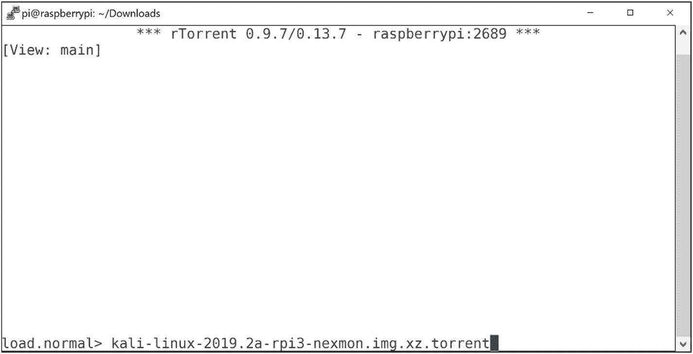

图 6-12

添加。种子文件

您需要确保准确无误地键入(或剪切和粘贴)整个文件名。点击 Enter，文件将出现在屏幕的主要部分，即活动种子列表中，如图 6-13 顶部所示。

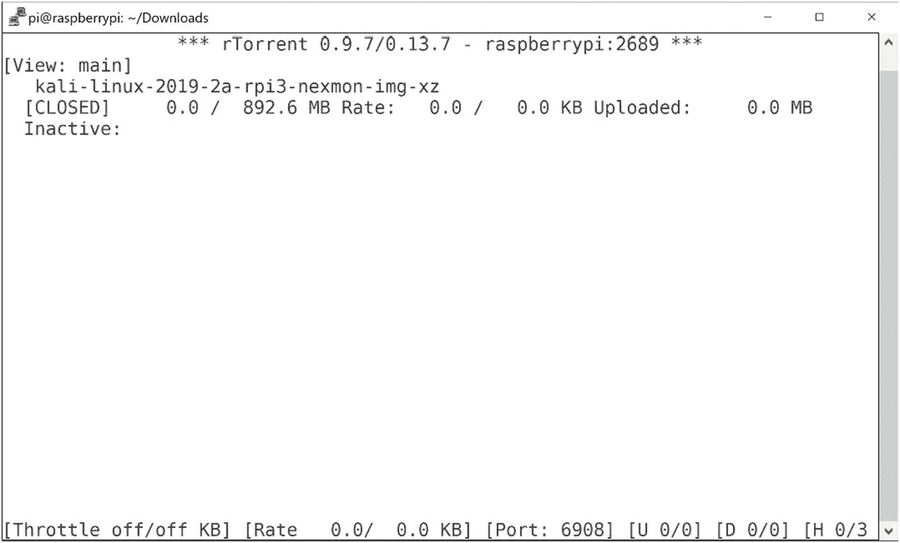

图 6-13

添加了一个种子的 rTorrent

您可以添加尽可能多的。种子文件，因为你希望这样做。如果你想处理的话，rTorrent 可以轻松支持数百个种子。你可以用上下箭头键在种子列表中移动来选择单个种子。

`Ctrl-O`改变目标目录。我更喜欢~/下载，但是你可以把你的文件放在你喜欢的任何地方。默认为用户的根目录。

`Ctrl-S`开始下载。你可以观察屏幕底部的数字和统计数据，了解事情的进展情况。

`Ctrl-D`暂停下载。如果您再次按 Ctrl-D，下载将被删除。

`The right arrow`允许您获取正在下载的文件的信息。

允许你关闭一个种子。

有关 rTorrent 所有特性的更多信息和文档，请访问他们的网站 [`https://rakshasa.github.io/rtorrent/`](https://rakshasa.github.io/rtorrent/) 。

## 网络浏览器

等等——在文本模式下浏览网页？是的，你可以！

以下三种浏览器已经存在了几十年，并且都有能力处理大部分是文本的网站。有些允许通过外部查看器查看图像，而有些允许使用插件在线查看图像。没有一个像现代的 GUI 浏览器一样健壮或漂亮，但是它们经常能完成任务。

使用文本模式浏览器有一些好处。首先，与图形浏览器相比，它们的速度非常快——它们不运行嵌入式 JavaScript 代码，也不下载所有这些图像(包括不可见的跟踪图像)。因为他们所做的只是下载文本，所以即使在一个缓慢的系统上，他们也很快。此外，因为它们是纯文本的，所以可以很容易地与文本到语音转换软件集成，并且非常适合视觉障碍者。

### 谷歌

**谷歌详情:**

安装:`sudo apt install googler`

运行命令:`googler <keywords>`

点文件： `(none)`

帮助:`man googler`

网址: [`https://github.com/jarun/googler`](https://github.com/jarun/googler)

有时你不想打开一个完整的网络浏览器在 Google 上查看一些东西，但是在 GUI 世界里，这是唯一的方法。命令行就不是这样了！小应用“谷歌人”会让你在命令行上输入你的搜索短语，它会向你显示多个搜索结果，并附有谷歌搜索结果的简短摘要。如果你看到你想要的东西，你可以选择在浏览器中加载它。

### 猞猁

**Lynx 详细信息:**

安装:`sudo apt install lynx`

运行命令:`lynx <URL>`

点文件： `~/.lynxrc`

帮助:`man lynx`

网址: [`https://lynx.browser.org/`](https://lynx.browser.org/)

这是最老的浏览器，因为它是 1992 年作为一个项目开始的。由于这种长寿，它相当稳定和安全。它不适用于需要 JavaScript 的网站，但可以处理带有 cookies 的网站。

如图 6-14 所示，它可以获取一个普通的网站，去掉图形元素，重新格式化所有内容，使其完全显示在基于文本的屏幕上。这与某些辅助技术允许盲人使用网络非常相似，因为生成的文本可以很容易地导入屏幕阅读器。

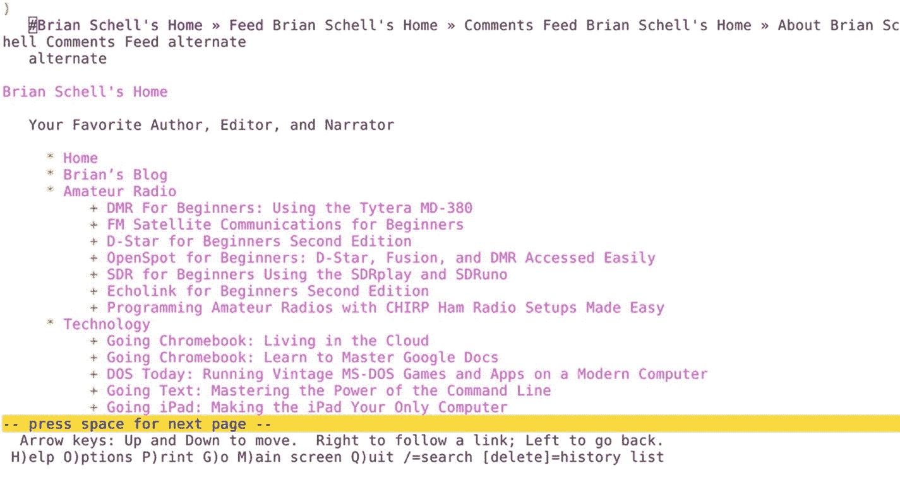

图 6-14

Lynx 浏览器

### W3M

**W3M 详情:**

安装:`sudo apt install` `w3m` `(Raspian preinstalled)`

运行命令:`w3m <URL>`

点文件： `~/.w3m/config`

帮助:`man w3m`

网址: [`http://w3m.sourceforge.net/`](http://w3m.sourceforge.net/)

W3M 也很老了，始于 1995 年。它在合适的终端上支持表格、框架、SSL 连接、颜色和内嵌图像。通常，它以尽可能真实的形式呈现页面的原始布局。W3M 是维护比较活跃的浏览器之一，有很多扩展和插件，所以如果你需要做很多基于文本的 web 使用，这可能是最好的选择。

图 6-15 显示了与图 6-14 的 Lynx 浏览器相同的网站的 W3M 渲染。比较不同之处。

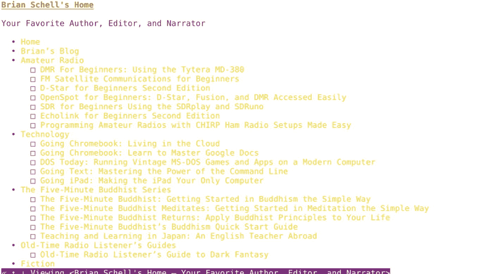

图 6-15

W3M 浏览器

### 我的手

**电子链接详情:**

安装:`sudo apt install` `elinks`

运行命令:`elinks <URL>`

点文件： `~/.elinks`

帮助:`man elinks`

网址: [`http://elinks.or.cz/`](http://elinks.or.cz/)

这是三款浏览器中最“现代”的一款，如图 6-16 所示。它有一个彩色显示屏，当你按下 Esc 键时，会出现导航菜单，使整个事情更容易理解。它支持鼠标、标签、cookies 等等。

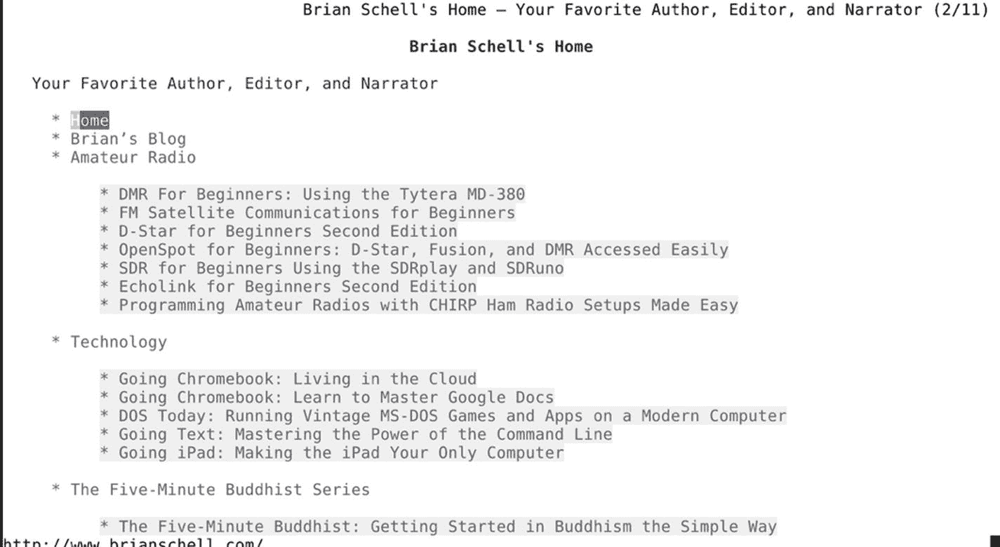

图 6-16

伊琳的浏览器

## 通信

当互联网开始对每个人开放时，最流行的事情之一就是去 IRC 聊天室。在脸书之前，在 Twitter 之前，甚至早在 MySpace 之前，就有了 IRC(互联网中继聊天)。

### IRC: WeeChat 和 IRSSI

**WeeChat 详情:**

安装:`sudo apt install weechat`

运行命令:`weechat`

点文件： `~/.weechat`

帮助:`man weechat`

网址: [`https://weechat.org/`](https://weechat.org/)

**详细信息:??**

安装:`sudo apt install irssi`

运行命令:`irssi`

点文件： `~/.irssi/config`

帮助:`man irssi`

网址: [`https://irssi.org/`](https://irssi.org/)

信不信由你，IRC 仍然非常受欢迎，而且仍然很强大，尤其是在技术社区中。有很多方法可以进入 IRC，甚至是通过命令行。这里介绍的两个应用 WeeChat 和 IRSSI 都在积极开发中，并且发展势头良好。图 6-17 显示的是 WeeChat，但是两个 app 都和图片差不多。

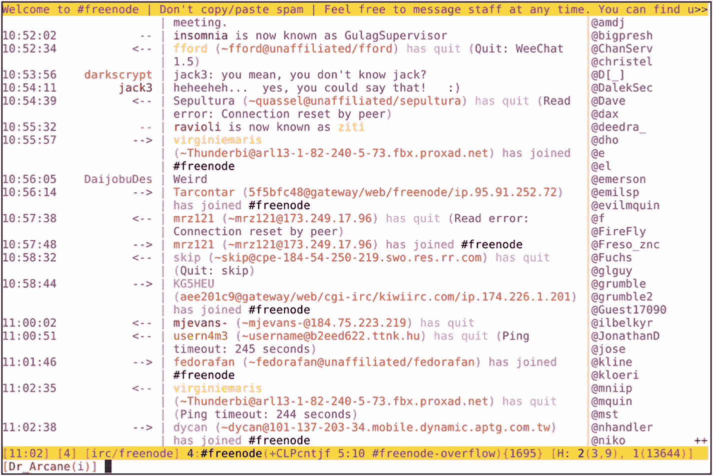

图 6-17

IRC 客户端 WeeChat

两者都提供了脚本、插件、主题、过滤器、帮助屏幕，以及你需要开始的一切。

## （同 VoiceoverInternetProtocol）网络电话

据我所知，Skype、FaceTime 或其他网络电话软件没有命令行的替代品。有一个名为 Twinkle 的“实验性”项目已经存在，但据报道该项目容易崩溃且不可靠。

如果这是你急需的东西，你可能想看看。app 来自 [`https://github.com/LubosD/twinkle`](https://github.com/LubosD/twinkle) 。

## 社会化媒体

大多数命令行应用都是几十年前创建的应用的积极开发版本。社交媒体是一个相对较新的计算领域，命令行在这方面还有很长的路要走。此外，大多数社交媒体网站严重依赖图形，显然，这不是文本模式的最佳匹配。尽管如此，还是有一些不错的应用，记住，如果有必要，你可以通过基于文本的网络浏览器轻松访问大多数社交媒体网站。

### 推特

**彩虹流详情:**

安装:`sudo pip install rainbowstream`

运行命令:`rainbowstream`

点文件： `~/.rainbow_config.json`

帮助:`Hit "h" in the app`

网址: [`https://github.com/orakaro/rainbowstream`](https://github.com/orakaro/rainbowstream)

你不会认为 Twitter 客户会很难获得，但只有一个我可以真正推荐:**彩虹流**。它很容易安装和配置，它允许你发布和缩小到列表视图流，并做几乎任何你想用 Twitter 做的事情。

当然，你可以通过任何基于文本的网络浏览器使用 Twitter，只需进入 [`http://twitter.com`](http://twitter.com) ，而不是使用专门的客户端应用。

### 脸谱网

没有一个“常规的”脸书命令行客户端，但是你可以通过任何基于文本的网络浏览器使用他们的网站。然而，脸书信使有一个命令行客户端。

```sh
sudo apt install npm
sudo npm install -g fb-messenger-cli

```

## 图形、艺术和照片

你不会想到图形和艺术甚至会是文本世界中的一个类别，但是有一些优秀的工具可以处理图像，甚至是在文本模式下。Asciiview 只是一个有趣的应用，只使用文本字符创建“图片”。FIGlet 是一个有趣的小东西，可以让你创建文本横幅，而 ImageMagick 是一个巨大的工具，几乎可以做任何事情，包括改变图形格式和编辑图片——甚至不用看它们。

### Asciiview

**查看详情:**

安装:`sudo apt install aview`

运行命令:`aview <filename.bpm>`

点文件： `none`

帮助:`man aview`

网址: [`http://aa-project.sourceforge.net/tune/`](http://aa-project.sourceforge.net/tune/)

多年来，我们的相机一直在宣传越来越多的百万像素。有时候，偶尔反过来寻找可能的最低分辨率会更有趣。其中一种情况是当您需要在纯文本终端上显示照片或图形图像时。

完成这项工作的一种方法是使用 Asciiview。图 6-18 是我通过 Asciiview 运行的照片，然后转换成文字符号。如果你仔细看，你会发现根本没有图形字符；只是字母、数字和符号。


图 6-18

作者在 Asciiview 中的照片

要转换图像，请键入

```sh
aview myphoto.bpm

```

### 菲戈莱特

**小图详情** **:**

安装:`sudo apt install figlet`

运行命令:`figlet <text string>`

点文件： `none`

帮助:`man figlet`

网址: [`www.figlet.org/`](http://www.figlet.org/)

FIGlet 只是一个小的命令行工具，用于获取一行文本并从中制作一种文本“横幅”。您可以根据需要输入单个单词或整个句子。例如，

```sh
figlet Brian

```

将会回来

```sh
____       _
| __ ) _ __(_) __ _ _ __
|  _ \| '__| |/ _' | '_ \
| |_) | |  | | (_| | | | |
|____/|_|  |_|\__,_|_| |_|

```

### 简介

**ImageMagick 详情** **:**

安装:`sudo apt install imagemagick`

运行命令:`convert, identify, mogrify, compare, montage, composite, display, and so on.` **这是一套命令。**

点文件： `none`

帮助:`man imagemagick`

网址: [`www.imagemagick.org/`](http://www.imagemagick.org/)

前面两个 Ascii 应用都只不过是玩具。有时你需要实际做一些图形工作，为此，有 ImageMagick。

ImageMagick 的完整文档位于 [`www.imagemagick.org/script/command-line-processing.php`](http://www.imagemagick.org/) 。

它包括创建、编辑、合成或转换位图图像的工具。它可以读写 200 多种格式的图像，包括 PNG、JPEG、GIF、HEIC、TIFF、DPX、EXR、WebP、Postscript、PDF 和 SVG。

您可以使用 ImageMagick 来调整图像大小、翻转、镜像、旋转、扭曲、剪切和变换图像、调整图像颜色、应用各种特殊效果或绘制文本、线条、多边形、椭圆和贝塞尔曲线。

ImageMagick 命令行工具非常简单，它将 jpg 格式的图像转换为 png 格式的图像:

```sh
convert image.jpg image.png

```

或者它可能非常复杂，有过多的选项，如下所示:

```sh
convert -delay 100 -size 100x100 xc:SkyBlue -page +5+10  balloon.gif -page +35+30 medical.gif -page +62+50 present.gif -page +10+55 shading.gif -loop 0  animation.gif

```

## 音频和视频

屏幕上只有文字，电脑有时会变得很无聊。幸运的是，你不必坐在那里默默工作。早在 GUI 界面出现之前，计算机就已经在播放音乐了，你可以用命令行工具来播放你所有的音乐。使用这些工具，创建播放列表和自动播放音乐实际上更加容易。如果你想一边工作一边看电影，那也是完全可能的。

### 音乐播放器

Raspberry Pi 拥有优秀的音乐播放硬件，无论是通过音频插孔还是通过 HDMI。命令行有许多优秀的(和非常可定制的)音乐播放器。我最喜欢的两部电影是 MOC 和 CMUS。

如果你把你的音乐库组织在单独的艺术家目录中，这两种方式都会更好。有一段时间，我把我所有的音乐都放在苹果 iTunes 里；所以我只是从那里下载了所有的歌曲，将巨大的“音乐”文件夹复制到它自己的目录中，并将音乐播放器指向它们 iTunes works 的默认组织残余，没有任何修改。我不是说你 ***需要*** iTunes 来组织你的音乐，但是很多人已经在某个地方有了，如果你有，这是一个简单的方法。

### 控制台上的音乐

**MOC 细节** **:**

安装:`sudo apt install moc`

运行命令:`mocp`

点文件： `~/.moc/config`

帮助:`man moc`

网址: [`http://moc.daper.net/`](http://moc.daper.net/)

我喜欢这个，尤其是当我处理播放列表的时候。它有两列，默认布局看起来很像午夜指挥官应用。如图 6-19 所示，您可以在左侧窗格看到您的音乐文件，而您正在处理的播放列表位于右侧窗格。选择一个文件并“添加”到列表中，你可以直观地看到你在做什么。它是主题化的，内置了均衡器，按键可以根据你的喜好重新映射，甚至支持互联网流。它有一个方便的帮助屏幕；只需点击“H”，所有的命令都会自动弹出。

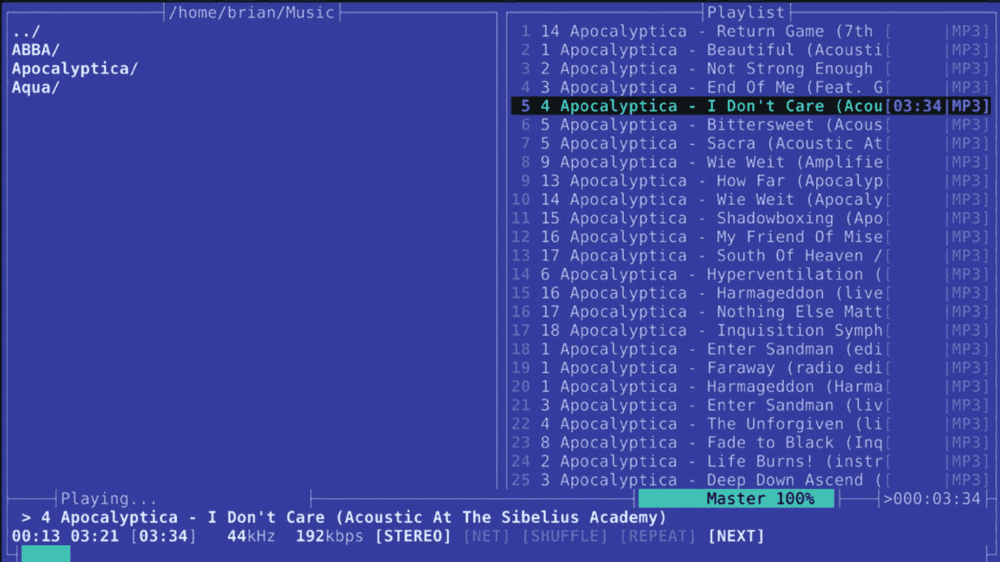

图 6-19

控制台上的音乐

用`mocp`运行 MOC 播放器(注意末尾的 p)。

### CMUS (C 音乐播放器)

**CMUS 详细资料:**

安装:`sudo apt install cmus`

运行命令:`cmus`

点文件： `/usr/share/cmus/rc`

帮助:`man cmus`

网址: [`https://cmus.github.io/`](https://cmus.github.io/)

虽然 MOC 很适合处理播放列表，但我更喜欢 CMUS，因为它只是一时兴起浏览和播放歌曲(见图 6-20)；导航对我来说感觉更好。虽然 MOC 的导航系统让人想起了**的午夜指挥官**，但 CMUS 的外观和感觉更像**的游侠**。您选择的音乐播放器可能与您喜欢的文件浏览系统密切相关。

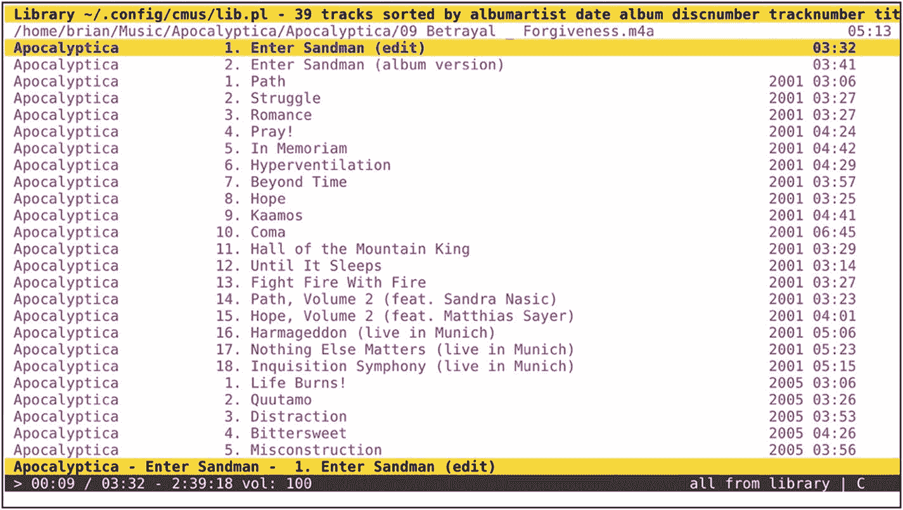

图 6-20

CMUS (C 音乐播放器)

CMUS 从默认安装就支持大部分音乐格式:Ogg Vorbis、MP3、FLAC、Opus、Musepack、WavPack、WAV、AAC、MP4、音频 CD，以及 ffmpeg 支持的一切(WMA、APE、MKA、TTA、SHN 等。)和 libmodplug。如果你从各种渠道获得音乐，那么能够不担心你的格式被理解是一个很好的加分。

像 MOC 一样，CMUS 有可重映射的按键、主题和颜色定制。不过，如果你能找到音乐流的 url，也就是 [`http://beirutnights.com/live.m3u`](http://beirutnights.com/live.m3u) ，这款手机也允许在线电台播放音乐流。

用`sudo apt install cmus`安装。

### 音乐播放器守护程序/控制器

**MPD 详情:**

安装:`sudo apt install mpd`

运行命令:`mpd`

点文件： `/etc/mpd.conf`

帮助:`man mpd`

网址: [`www.musicpd.org`](http://www.musicpd.org)

之前的两个项目，MOC 和 CMUS，都是全屏应用，严重依赖于视觉导航文件和目录。这两个界面都受到了文件管理系统的启发，并且都至少在某种程度上与它们的控件进行了交互。

另一种选择是音乐播放器守护进程，或 MPD。这是一个灵活、强大的服务器端音乐播放应用。通过插件和库，它可以在受其网络协议控制的同时播放各种声音文件。因为它是一个*守护进程*，它只是在后台安静地运行**并等待来自外部客户端程序的命令。**

 **MPC 是并行客户端应用。它连接到 MPD，并根据传递给它的命令和参数来控制它。如果没有传递参数，则给出当前状态。它完全是一个命令行工具，没有任何视觉效果。

然而，有许多其他的客户端与 MPD 服务器一起工作。有些是图形化的，有些是用于 Web 的，而有些是用于控制台的。设置起来有点困难，但是它*非常*灵活和强大。

**MPD 守护程序主页:** [`www.musicpd.org/`](http://www.musicpd.org/)

**MPD 客户端:** [`www.musicpd.org/clients/`](http://www.musicpd.org/clients/)

实际上，MPD 的要点是，通过客户机/服务器架构，您可以在家中安装一台存储了所有音乐文件的机器，然后从网络上的其他计算机访问和播放这些音乐，而无需将音乐文件存储在多个地方。

## 电影观众

电影明显是视觉化的。Unix 早期的老式终端和计算机无法播放视频文件，因为显示器无法处理。而你的树莓派，可以轻松播放电影。型号 4 Pi 甚至可以处理*双* 4K 输出。这些系统可以播放视频，你没有理由不能从命令行播放你的电影。

### MPlayer

**MPlayer 详细资料:**

安装:`sudo apt install mplayer`

运行命令:`mplayer <filename>`

Dotfile:里面的各种文件`/etc/mplayer/`

帮助:`man mplayer`

网址: [`www.mplayerhq.hu/`](http://www.mplayerhq.hu/)

MPlayer 是一个可以在许多系统上运行的电影播放器。它播放大多数 MPEG/VOB、AVI、Ogg/OGM、VIVO、ASF、WMA、WMV、QT、MOV、MP4、RealMedia、Matroska、NUT、NuppelVideo、FLI、YUV4MPEG、FILM、RoQ 和 PVA 文件，受许多本机、XAnim 和 Win32 DLL 编解码器支持。你可以观看视频光盘，SVCD，DVD，3ivx，DivX 3/4/5，WMV，甚至 H.264 电影。

在大多数情况下，您可以在全屏模式或窗口中欣赏电影。图 6-21 中有一个电影片头的截图。

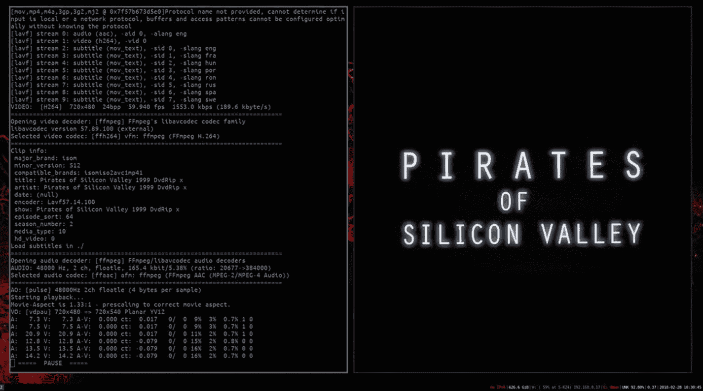

图 6-21

左边是多玩家状态，右边是多玩家影片

尽管如此，你可能还是更喜欢用 VLC 这样的应用在 GUI 中观看你的视频(在别处讨论过)，但是如果你需要的话，知道你有能力在命令行上观看还是很好的。

## 新闻和天气

新闻大部分是文本，所以认为有很多方法可以在命令行上获取新闻并不是一个巨大的飞跃。这里有两个很好的开始方式:

### 即时新闻

**即时新闻详情:**

安装:`sudo pip install instantnews`

运行命令:`instantnews`

点文件： `None`

帮助:`man instantnews`

网址: [`https://github.com/shivam043/instantnews`](https://github.com/shivam043/instantnews)

**即时新闻**从新闻 API 中检索所有新闻标题，然后以文本形式显示你想看的内容。有几十种专业新闻来源，你可以从中选择一种或任意组合显示在你的屏幕上。它需要你注册一个免费的 API 密匙。

### 哈克索新闻

**Haxor-新闻详情:**

安装:`sudo pip install haxor-news`

运行命令:`hn <command>`

Dotfile:里面的各种文件`~/.haxornewsconfig`

帮助:`hn --help`

网址: [`https://github.com/donnemartin/haxor-news`](https://github.com/donnemartin/haxor-news)

一个稍微更“有趣”的类似新闻节目是 **Haxor-News** 。Haxor-News 将黑客和书呆子新闻带到终端，允许您在不离开命令行的情况下查看和过滤以下内容:

*   邮件

*   发表评论

*   帖子链接的 web 内容

*   每月招聘和自由职业者职位

*   用户信息

*   洋葱邮报

一旦你进入，你可以输入各种以“hn”开头的命令，比如`hn top`来显示当前的头条新闻。图 6-22 显示了输出的示例。

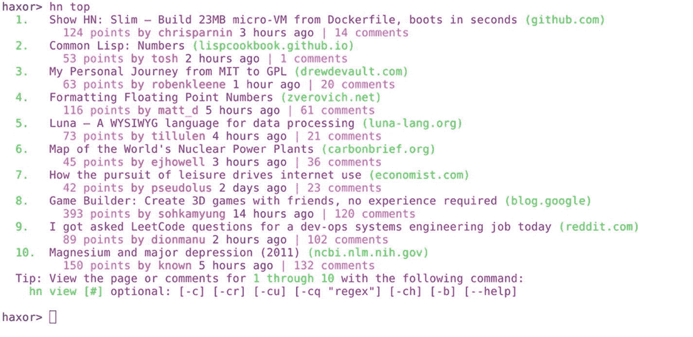

图 6-22

haxor-新闻头条

一旦你找到一个你想读的故事，输入`hn view #`来查看这个特定的故事。图 6-23 显示了我进入“hn view 10”后得到的结果

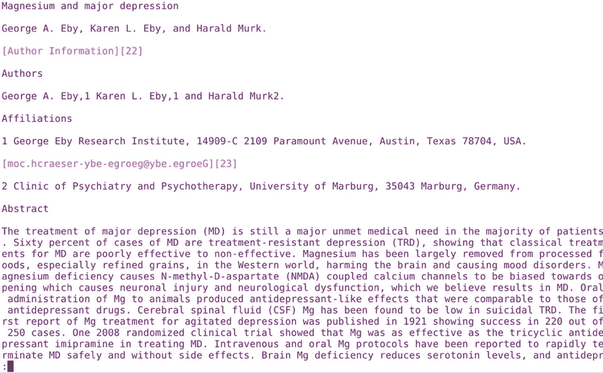

图 6-23

新闻文章“镁和抑郁症”

然后点击“q”返回文章列表并选择更多。

### 新闻机器人

**新闻船详情:**

安装:`sudo apt install newsboat`

运行命令:`newsboat`

点文件： `~/.config/newsboat/config`

帮助:`man newsboat`

网址: [`https://newsboat.org/`](https://newsboat.org/)

新闻船是一个 RSS 阅读器。许多网站，包括大多数主要的新闻来源，都提供包含他们的故事的 RSS 提要，所以有大量的各种可能的新闻来源可供你利用。将显示各种命令，说明如何设置它。一旦你在其中安装了一组 RSS 提要，你会看到类似图 6-24 的东西。


图 6-24

Newsbeuter/Newsboat 源列表

## 天气

有很多实用程序可以从命令行获取天气信息，所以这里有一些有趣的应用:

### 手指

对于生活在支持城市的幸运的人，你可以简单地输入

```sh
sudo apt install finger
finger city@graph.no

```

在命令行中，将您的城市名称替换为命令中的“city”，结果类似于图 6-25 。


图 6-25

获取纽约市的天气信息

```sh
finger newyork@graph.no

```

或者，您可以简单地键入

```sh
curl wttr.in/your_location

```

在命令行中，用您的城市名称替换命令中的“your_location”。

例如，如果我输入

```sh
curl wttr.in/flint

```

输出将产生类似图 6-26 的结果。


图 6-26

获取密歇根州弗林特的天气信息

### 安西韦瑟

**Ansiweather 详细信息:**

安装:`sudo apt install ansiweather`

运行命令示例:`ansiweather -l Flint -u imperial -f 3 -s true`

点文件： `~/.ansiweatherrc`

帮助:`man ansiweather`

网址: [`https://github.com/fcambus/ansiweather`](https://github.com/fcambus/ansiweather)

前面的示例 run 命令查找 Flint 的天气，并以英制单位(即非公制单位)连同天气符号一起报告 3 天的天气。如图 6-27 所示，前面的 Ansiweather 命令输出一行所有信息。


图 6-27

密歇根州弗林特市的安西韦特

## 书籍、漫画和阅读

这是我们正在处理的文本模式，所以显然你可以在上面阅读文本。我们已经在前面的章节中讨论了文本编辑器，它们对于简单地阅读文本来说都是很棒的。但是，有时您需要读取非文本格式的文件。诸如 EPUB、MOBI、中国等电子书格式都需要专门的阅读器；我们现在来看看如何访问这些。

### EPUB 文档

**普鲁伯详细资料:**

安装(作为一行键入):

`sudo pip3 install git+`[`https://github.com/wustho/epr.git`](https://github.com/wustho/epr.git)

运行命令:`epr <filename.epub>`

点文件：无

帮助:`epr --help`

网址: [`https://github.com/wustho/epr/`](https://github.com/wustho/epr/)

通常，从命令行读取是通过文本编辑器完成的，比如 Vim、Emacs 甚至 Nano。尽管如此，越来越多的书籍以电子书的形式出现。安装完成后，只需输入

```sh
epub FILENAME.epub

```

电子书(EPUB 格式)将显示在屏幕上。这些说明很容易理解。

### 非 EPUB 格式

**机芯详情:**

安装:`sudo apt install calibre`

运行命令:`calibre (or command in the following)`

点文件:通过菜单在应用中设置

帮助:`man calibre`

网址: [`https://calibre-ebook.com/`](https://calibre-ebook.com/)

其他电子书格式，如。mobi，。哎呀，还有。prc，需要转换为。epub 或文本格式。在图形用户界面中，最常见的方法是使用应用 **Calibre** 。既然我们在这里讨论命令行工具，那么 Calibre 的大部分特性都不可用，但是 Calibre *确实有几个强大的命令行工具。*

一旦你安装了 Calibre，如果你愿意，你可以使用它的图形界面(如图 6-28 )，但是如果你想从命令行完成所有的工作，可以看看 Calibre 旁边安装的命令行工具。

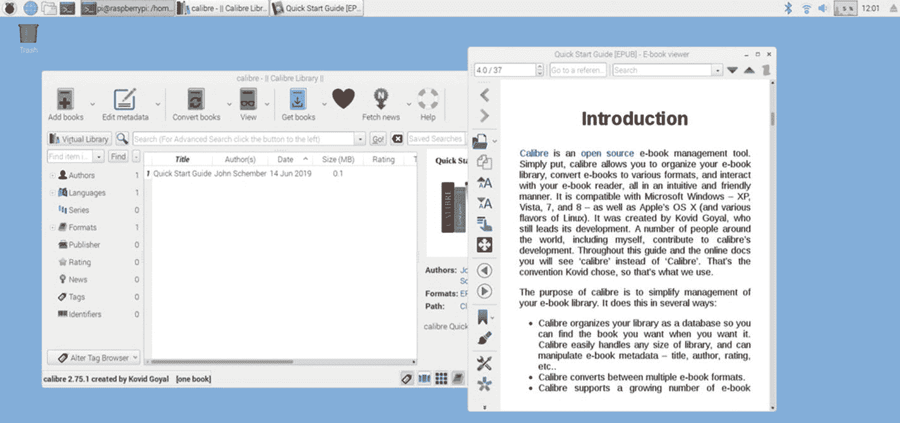

图 6-28

桌面上的 Calibre

记录的命令:

*   口径

*   口径-定制

*   口径调试

*   calibre-服务器

*   calibre-smtp

*   calibredb

*   电子书-转换

*   电子书-编辑

*   电子书元

*   电子书-波兰语

*   电子书浏览器

*   获取电子书元数据

*   lrf2lrs

*   LRF 查看器

*   Lrs2lrf

*   web2disk

该列表和相关说明可在以下位置找到

[`https://manual.calibre-ebook.com/generated/en/cli-index.html`](https://manual.calibre-ebook.com/generated/en/cli-index.html) 。

可能最有用的是电子书转换。例如，如果您在中有一个电子书文件。mobi 格式，你想把它改成。epub 格式，只需输入

```sh
ebook-convert myfile.mobi myfile.epub -h

```

真的很快，输出看起来很完美。然后你可以使用 EPUB 阅读器来读取文件。

## 任务管理

有许多用于日历、日程安排和任务管理的命令行工具。以下是我的最爱:

### 大卡

追溯到最初的 Unix 系统的早期，有一个古老的`cal`命令。它显示一个月历，突出显示今天的日期。我不知道这些年来我用了多少次。除了显示月份，它并没有为做任何特别的事情，但是它仍然非常方便。

它是操作系统的一部分，所以你不需要安装任何东西。只是打字

```sh
cal

```

### 计算器

**计算详情:**

安装:`sudo apt install calcurse`

运行命令:`calcurse`

点文件:`~/.calcurse/`中的各种文件

帮助:`man calcurse`

网址: [`https://calcurse.org/`](https://calcurse.org/)

Calcurse 是一个可视化的、基于文本的日历、计划程序和命令行的待办事项管理器。它在底部两行列出了命令，很像 Nano 编辑器，通过按“o”键可以获得附加命令。它允许自定义颜色、三个主要窗口窗格的布局，以及其他一些您可以选择的内容。如果你不担心你的电脑和其他设备之间的同步，这可能是最好的方法。图 6-29 有一个很好看的截图。


图 6-29

计算器

### 全部. txt

如果你担心在设备之间同步你的约会和任务，这个过程比 Calcurse 更复杂，但是允许在任何设备上使用。这个概念很简单:一群用户聚在一起，创建了一个标准化的文本文件格式，可以包含所有的待办事项和约会。然后，你使用 Dropbox 等文件同步系统，让你的电脑、手机、平板电脑和其他任何你使用的设备都可以使用该文件。这个系统设置起来很容易，很可靠，而且非常灵活。

如果我刚才描述的东西对你有吸引力，那么现在就想尽一切办法去做，设计你自己的方法和系统。在手机的 Dropbox 中放一个 todo.txt 文件，并设置电脑访问该文件。你们都准备好了！

或者你可以使用一个已经存在的系统来完成所有这些工作。有一个完整的在线社区围绕这个概念建立起来，他们提出了他们认为是 todo.txt 文件的“标准”。这些组织的主页位于

[`http://todotxt.org`](http://todotxt.org)

他们制定的具体“规则”载于

[`https://github.com/todotxt/todo.txt`](https://github.com/todotxt/todo.txt) 。

您可能会问，“为什么要使用如此复杂的规则来简单地管理文本文件中的待办事项列表？”答案是，如果你使用他们的标准化格式，那么你就可以利用各种支持这种格式的应用。如果你不关心这些应用，那么你可以用文本编辑器管理你的文件。

todo.txt-cli 位于

[`https://github.com/todotxt/todo.txt-cli/releases`](https://github.com/todotxt/todo.txt-cli/releases)

以及其他做同样事情的应用。当你意识到有手机应用可以处理这些文件时，这个想法特别有吸引力。我最喜欢的 iPhone 是 SwiftoDo，位于 [`http://swiftodoapp.com/`](http://swiftodoapp.com/) 。图 6-30 显示了该应用。文本文件和命令行在全尺寸电脑上很棒，但在小型手机上，专门的应用确实比试图用一般的写作应用编辑文本文件更容易处理。

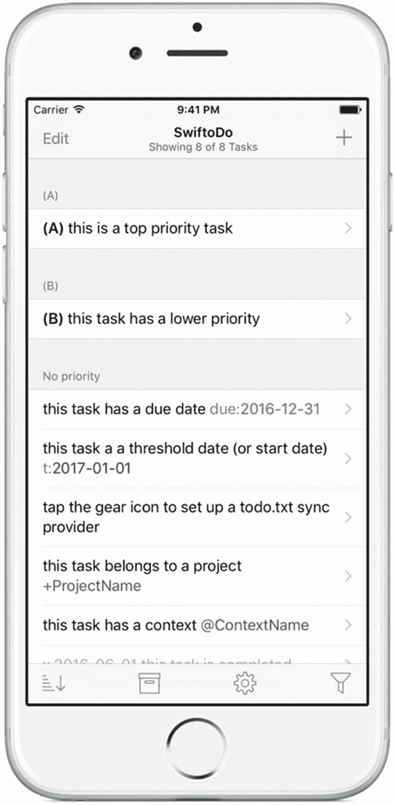

图 6-30

SwiftoDo for iPhone

### 编码/编程/网页设计

基于 Linux 的编程和编码工具的选项和可用性几乎是无限的。几乎每种计算机语言编译器都可以作为命令行工具使用，而且，在表面之下，甚至大多数 GUI 编程工具只是在后台运行命令行工具。进入编码领域的最佳方式是选择一个文本编辑器程序，比如 Vim、Emacs 或类似的程序，然后开始研究各种语法工具和特定于编程的插件。

所有主要的文本编辑器都被开发人员大量使用，主要是因为它们的可定制性、插件功能和速度。你选择哪个编辑器很大程度上取决于你的品味和你想花多少精力去学习它；完全有可能只使用 Nano 来输入代码，然后在命令行上使用您选择的语言来编译它，但是大多数编码人员会想要更多的东西，并且会很快进入 Emacs 或 Vim(尽管也有其他优秀的选择)。我甚至无法开始了解如何在开发世界中使用这些高级编辑器，所以我不会。请记住，在文本模式下编码和在 GUI 环境下工作一样有效，如果不是更多的话。

在过去的几年中，一个爆炸式发展的编码工具是 *Git* 。Git 是一个免费的开源分布式*版本控制系统*，旨在快速高效地处理从小到大的项目。Git 易于学习，占用空间小，性能快如闪电。它与 [`Github.com`](http://github.com) 联系在一起，后者是当今大多数开源项目的在线资源库和主页。Git 的命令行版本可从 [`https://git-scm.com`](https://git-scm.com) 获得，可以作为命令行版本或 GUI 工具安装。一旦您对源文件进行了一些更改(无论是什么类型的，从 C++到 HTML 到散文文本)，您就将更改提交到一个存储库，然后如果您决定以后从以前的版本中分支或恢复，您可以这样做。它对于保存文件的多个版本、协作，当然还有错误修复非常有用。

### 网络应用和服务

安装命令行软件不再是完成工作的唯一选择。互联网上还有无数免费或付费的网络应用。有些人只使用 Chromebook 作为他们的主要计算机就可以很好地生存，直到最近，这些机器只使用网络应用，我们在本书中看到他们几乎是事后想起的。许多高级网站严重依赖于 JavaScript 和其他脚本语言，这些语言在基于文本的浏览器中不能很好地工作(或者根本不能工作)，但是有些在文本模式中工作得很好。

有一些命令行工具可以访问许多基于 web 的服务。Todoist 是一个非常受欢迎的待办事项列表管理器，在大多数移动设备上都非常好用，至少有一个好的命令行界面。 **todo.txt** 系统是另一个在手机/GUI 和文本之间实现同步的系统。

这本书不会过多地关注网络应用，因为我在我的另一本书《走向 Chromebook:云中生活》中广泛地涉及了这些应用，在这里我只打算介绍文本模式的特定工具。请记住，如果您找不到您需要的工具，网络上可能有您需要的工具。

## 在 GUI 中使用命令行工具

有时候工作的最佳工具并不是你想让 ?? 使用的工具。有时候，GUI 确实是更有效的做事方式。绘图和视频工作是两个很好的例子，图像密集型的 web 开发也是如此。大多数视觉游戏编程都需要 GUI。另外，一些现代工具*只能在窗口系统下工作，甚至不能从命令行使用它们的功能。有时候你*需要*一个 GUI 来完成事情。*

哑终端和基于文本的电传打字机的时代早已成为过去。怀旧和极简主义是令人愉快的，但电脑已经超越了这些东西是有原因的。如果您使用 SSH 在服务器上运行命令行工具，那么您可以通过这种方式完成许多功能强大的事情，但是如果您将这种功能与 GUI 系统所能提供的最好工具结合起来，那不是更好吗？有时候，你可能会发现自己在遵循一个十步过程来完成一些你可以用不同的工具在一个步骤中完成的事情。

我的观点是，既然你已经学会了如何在文本模式下做几乎所有的事情，是时候选择最适合你的方式，将这些工具与你的桌面软件一起使用了。如果您一直在 Raspbian 机器的终端窗口中运行命令行，或者从 Mac 通过 SSH-ing 进入您的 Pi，那么您已经在这样做了。Linux 上的 Terminator 或者 Terminal 是一回事；您正在 GUI 中运行终端屏幕。那不是“出轨”；那是做这件事的聪明方法。

例如，写一本书是一项需要两种工作方式来完成的任务。继续用 LaTeX 或 Markdown 用 Vim 写这本书。使用 Git 的命令行版本来管理您的版本。用 Pandoc 编译成 PDF。但随后使用一些图形应用(如 Okular)来查看生成的 PDF。这被称为“为正确的工作使用正确的工具”,是完成项目最有效的方法。如果你找不到你喜欢使用的命令行 PDF 查看器，那就不要这样做。一切都是为了以最高效、最愉快的方式完成工作。工作中挂念是可以的；只是不要被工具所束缚。

了解如何从终端窗口剪切并粘贴到图形窗口中。了解如何将文件从您的主目录复制到图形桌面的桌面上。有时使用 Ranger 浏览文件系统比使用文件管理器更容易，有时则相反。

我已经提供了两个任务列表，我认为这两个列表更适合其中一个方法(表 6-1 )。你可以从一边或另一边做所有这些事情；这些正是我觉得更好的。你的观点可以自由改变。

表 6-1

命令行与 GUI

<colgroup><col class="tcol1 align-left"> <col class="tcol2 align-left"></colgroup> 
| 

最好从命令行开始

 | 

在图形环境中更好

 |
| --- | --- |
| Mutt 代表电子邮件 | PDF 和漫画阅读 |
| 使用 Vim 或 Emacs 进行文本编辑 | 复杂的桌面出版布局 |
| Ranger/MC 用于文件操作 | 绘画和图形创作 |
| 音乐和播放列表创建 | 大多数游戏 |
| 文件备份、大规模文件传输和大型下载 | 网页浏览 |

我在这里的观点是命令行不一定是一种“生活方式”这是你计算机能力宝库中的又一个工具。通过学习命令行和一些更有用的工具，您可以在一个更加可定制的环境中获得更快、更强大的方法，通常使用功能不太强大的设备。这整个概念是为了好玩，而不是坐牢。

## 结论

有些任务，如视频和音频编辑，确实需要使用图形模式和鼠标。也就是说，大多数任务从命令行运行都很好。它们可能不具备大多数桌面应用所具备的所有漂亮的功能，但它们通常更具可配置性，更易于访问，并且具有极其先进的自动化可能性。没有 GUI 提供的所有简单菜单，只需要弄清楚它们是如何工作的。

在下一章，我们将会看到一些高级的主题和不适合其他地方的东西。我们已经讨论了 Markdown 和 LaTeX，我们将快速介绍这些工具，然后看看如何使用点文件和配置文件定制您的命令行应用。我们将看看您可以在网上找到的一些其他资源。

最后，我们来看一些项目，你可以使用一个备用的树莓 Pi 来处理那些需要专用机器的项目。我发现 RPi 非常便宜，每次他们有重大升级时，你都会买一个新的。我最近看了看，我有五个孩子躺在那里！**