6# 十、救援模式和实时图像

在这最后一章，我们将涵盖救援模式和现场图像。在我们的救援模式讨论中，我们将涵盖救援 initramfs，以及一些“无法启动”的问题。实时映像讨论包括 Squashfs、`rootfs.img`和实时映像的引导顺序。

## 救援模式

在救援模式下有两种启动方式。

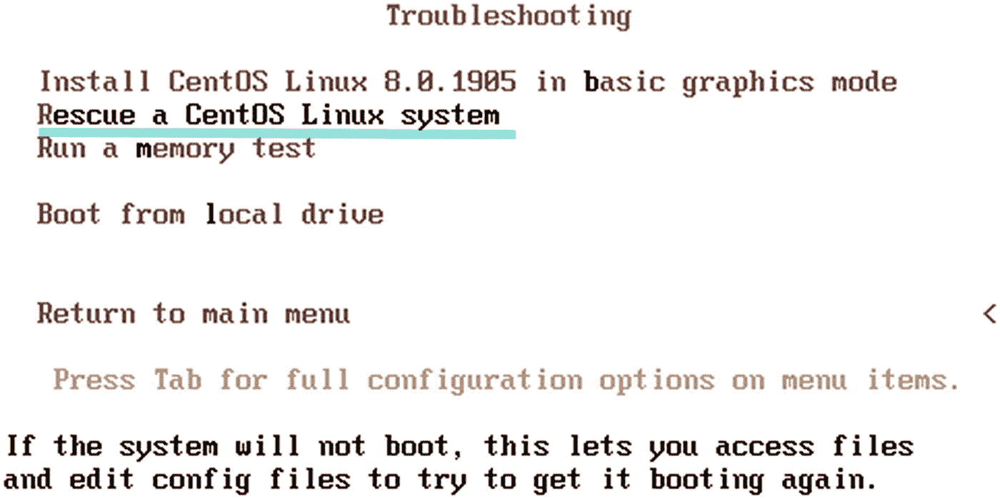

图 10-2

来自实时图像的救援模式条目

*   Through the built-in GRUB menuentry. Refer to Figure [10-1](#Fig1).

    

    图 10-1

    GRUB 中的救援模式条目

*   通过实时 ISO 图像。参见图 [10-2](#Fig2) 。

顾名思义，这种模式旨在拯救陷入“无法启动”问题的系统。想象一下这样一种情况，系统无法挂载根文件系统，您会收到这样一条永无止境的通用消息:

`dracut-initqueue: warning dracut-initqueue timeout - starting timeout scripts`’。

假设您只安装了一个内核，如下所示:

```sh
<snip>
.
.
[  OK  ] Started Show Plymouth Boot Screen.
[  OK  ] Started Forward Password R...s to Plymouth Directory Watch.
[  OK  ] Reached target Paths.
[  OK  ] Reached target Basic System.
[  145.832487] dracut-initqueue[437]: Warning: dracut-initqueue timeout - starting timeout scripts
[  146.541525] dracut-initqueue[437]: Warning: dracut-initqueue timeout - starting timeout scripts
[  147.130873] dracut-initqueue[437]: Warning: dracut-initqueue timeout - starting timeout scripts
[  147.703069] dracut-initqueue[437]: Warning: dracut-initqueue timeout - starting timeout scripts
[  148.267123] dracut-initqueue[437]: Warning: dracut-initqueue timeout - starting timeout scripts
[  148.852865] dracut-initqueue[437]: Warning: dracut-initqueue timeout - starting timeout scripts
[  149.430171] dracut-initqueue[437]: Warning: dracut-initqueue timeout - starting timeout scripts
.
.
</snip>

```

由于这个系统只有一个内核(不能启动)，如果没有环境，你将如何解决“不能启动”的问题？救援模式就是为了这个唯一的目的而创建的。让我们首先选择默认的救援模式，它预装在 Linux 中，可以从 GRUB 菜单中选择。请参见图 [10-3](#Fig3) 。

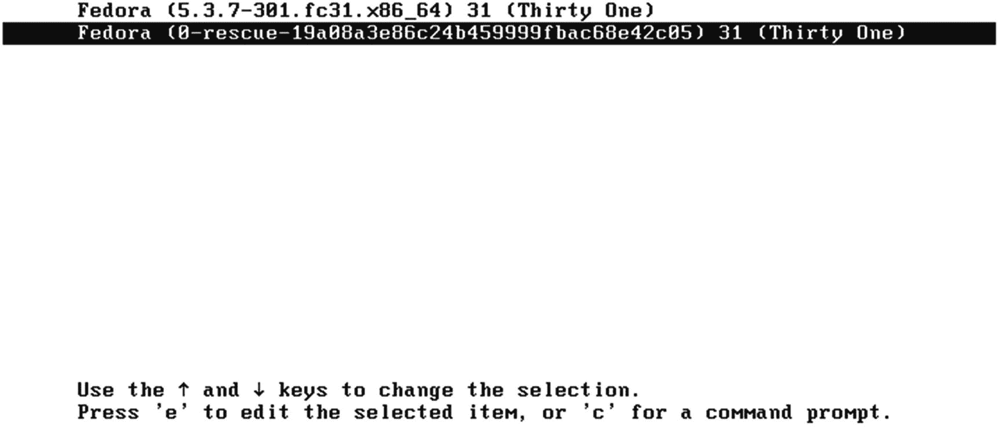

图 10-3

GRUB 屏幕

救援模式将正常启动，如图 [10-4](#Fig4) 所示，如果一切正常，它将向用户显示其根文件系统。

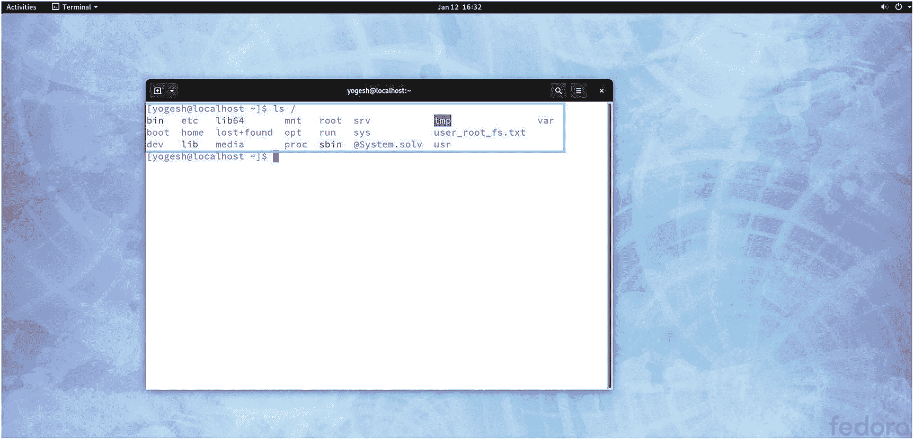

图 10-4

在救援模式下挂载的根文件系统

但是我想到了一个问题:当正常的内核无法启动时，为什么同一个系统能够在救援模式下启动呢？

这是因为当您安装 Fedora 或任何 Linux 发行版时，Linux 的安装程序 Anaconda 会在`/boot`中安装两个内核。

```sh
# ls -lh /boot/
total 164M
-rw-r--r--. 1 root root 209K Oct 22 01:03 config-5.3.7-301.fc31.x86_64
drwx------. 4 root root 4.0K Oct 24 04:44 efi
-rw-r--r--. 1 root root 181K Aug  2  2019 elf-memtest86+-5.01
drwxr-xr-x. 2 root root 4.0K Oct 24 04:42 extlinux
drwx------. 5 root root 4.0K Mar 28 13:37 grub2
-rw-------. 1 root root  80M Dec  9 10:18 initramfs-0-rescue-2058a9f13f9e489dba29c477a8ae2493.img
-rw-------. 1 root root  32M Dec  9 10:19 initramfs-5.3.7-301.fc31.x86_64.img
drwxr-xr-x. 3 root root 4.0K Dec  9 10:18 loader
drwx------. 2 root root  16K Dec  9 10:12 lost+found
-rw-r--r--. 1 root root 179K Aug  2  2019 memtest86+-5.01
-rw-------. 1 root root  30M Jan  6 09:37 new.img
-rw-------. 1 root root 4.3M Oct 22 01:03 System.map-5.3.7-301.fc31.x86_64
-rwxr-xr-x. 1 root root 8.9M Dec  9 10:18 vmlinuz-0-rescue-2058a9f13f9e489dba29c477a8ae2493
-rwxr-xr-x. 1 root root 8.9M Oct 22 01:04 vmlinuz-5.3.7-301.fc31.x86_64

```

如您所见，`vmlinuz-5.3.7-301.fc31.x86_64`是一个普通内核，而`vmlinuz-0-rescue-19a08a3e86c24b459999fbac68e42c05`是一个救援内核，它是一个独立的内核，有自己的 initramfs 文件，名为`initramfs-0-rescue-19a08a3e86c24b459999fbac68e42c05.img`。

假设你安装了一个由`nvidia`提供的新软件包(`.rpm`或`.deb`)，里面有新的图形驱动程序。由于图形驱动程序必须添加到 initramfs 中，`nvidia`包重新构建了原来的内核 initramfs ( `initramfs-5.3.7-301.fc31.x86_64.img`)。因此，原来的内核有新添加的图形驱动程序，但是 rescue initramfs 没有添加该驱动程序。当用户尝试引导时，由于安装的图形驱动程序与连接的图形卡不兼容，系统无法使用原始内核(`vmlinuz-5.3.7-301.fc31.x86_64`)进行引导，但同时，由于不兼容的驱动程序不在 rescue initramfs 中，系统将使用 rescue 模式成功引导。救援模式内核将具有与普通内核相同的命令行参数，因此安装的救援内核知道用户根文件系统的名称。

图 [10-5](#Fig5) 显示了普通内核的命令行参数。


图 10-5

普通内核的命令行参数

图 [10-6](#Fig6) 显示了救援内核的命令行参数。


图 10-6

救援内核的命令行参数

### 救援模式初始化

救援模式 initramfs ( `initramfs-0-rescue-2058a9f13f9e489dba29c477a8ae2493.img`)的大小比原始内核的 initramfs ( `initramfs-5.3.7-301.fc31.x86_64.img`)大得多。

```sh
# ls -lh /boot/
total 164M
-rw-r--r--. 1 root root 209K Oct 22 01:03 config-5.3.7-301.fc31.x86_64
drwx------. 4 root root 4.0K Oct 24 04:44 efi
-rw-r--r--. 1 root root 181K Aug  2  2019 elf-memtest86+-5.01
drwxr-xr-x. 2 root root 4.0K Oct 24 04:42 extlinux
drwx------. 5 root root 4.0K Mar 28 13:37 grub2
-rw-------. 1 root root  80M Dec  9 10:18 initramfs-0-rescue-2058a9f13f9e489dba29c477a8ae2493.img
-rw-------. 1 root root  32M Dec  9 10:19 initramfs-5.3.7-301.fc31.x86_64.img
drwxr-xr-x. 3 root root 4.0K Dec  9 10:18 loader
drwx------. 2 root root  16K Dec  9 10:12 lost+found
-rw-r--r--. 1 root root 179K Aug  2  2019 memtest86+-5.01
-rw-------. 1 root root  30M Jan  6 09:37 new.img
-rw-------. 1 root root 4.3M Oct 22 01:03 System.map-5.3.7-301.fc31.x86_64
-rwxr-xr-x. 1 root root 8.9M Dec  9 10:18 vmlinuz-0-rescue-2058a9f13f9e489dba29c477a8ae2493
-rwxr-xr-x. 1 root root 8.9M Oct 22 01:04 vmlinuz-5.3.7-301.fc31.x86_64

```

这是为什么？这是因为救援 initramfs 不像普通内核的 initramfs 那样是特定于主机的。rescue initramfs 是一个通用的 initramfs，它是通过考虑用户可以在其上创建根文件系统的所有可能的设备而准备的。让我们比较一下这两个 initramfs 系统。

```sh
# tree
.
├── normal_kernel
│   └── initramfs-5.3.7-301.fc31.x86_64.img
└── rescue_kernel
    └── initramfs-0-rescue-2058a9f13f9e489dba29c477a8ae2493.img

2 directories, 2 files

```

我们将把它们提取到各自的目录中。

```sh
#/usr/lib/dracut/skipcpio
     initramfs-5.3.7-301.fc31.x86_64.img | gunzip -c | cpio -idv

#/usr/lib/dracut/skipcpio
     initramfs-0-rescue-2058a9f13f9e489dba29c477a8ae2493.img | gunzip -c | cpio -idv

```

我们将从提取的 initramfs 中创建文件列表。

```sh
# tree normal_kernel/ > normal.txt
# tree rescue_kernel/ > rescue.txt

```

以下是两个 initramfs 系统之间的差异。与正常的 initramfs 相比，rescue initramfs 系统几乎多了 2，189 个文件。此外，几乎 719 额外的模块已被添加到救援 initramfs。

```sh
# diff -yt rescue.txt normal.txt  | grep '<' | wc -l
     2186
# diff -yt rescue.txt normal.txt  | grep '<' | grep -i '.ko'  | wc -l
     719

<skip>
.
.
│   │   ├── lspci                                               <
│   │   ├── mdadm                                               <
│   │   ├── mdmon                                               <
│   │   ├── mdraid-cleanup                                      <
│   │   ├── mdraid_start                                        <
│   │   ├── mount.cifs                                          <
│   │   ├── mount.nfs                                           <
│   │   ├── mount.nfs4 -> mount.nfs                             <
│   │   ├── mpathpersist                                        <
│   │   ├── multipath                                           <
│   │   ├── multipathd                                          <
│   │   ├── nfsroot                                             <
│   │   ├── partx                                               <
│   │   ├── pdata_tools                                         <
│   │   ├── ping -> ../bin/ping                                 <
│   │   ├── ping6 -> ../bin/ping                                <
│   │   ├── rpcbind -> ../bin/rpcbind                           <
│   │   ├── rpc.idmapd                                          <
│   │   ├── rpcinfo -> ../bin/rpcinfo                           <
│   │   ├── rpc.statd                                           <
│   │   ├── setpci                                              <
│   │   ├── showmount                                           <
│   │   ├── thin_check -> pdata_tools                           <
│   │   ├── thin_dump -> pdata_tools                            <
│   │   ├── thin_repair -> pdata_tools                          <
│   │   ├── thin_restore -> pdata_tools                         <
│   │   ├── xfs_db                                              <
│   │   ├── xfs_metadump                                        <
│   │   └── xfs_repair                                          <
    ├── lib                                                     <
    │   ├── iscsi                                               <
    │   ├── lldpad                                              <
    │   ├── nfs                                                 <
    │   │   ├── rpc_pipefs                                      <
    │   │   └── statd                                           <
    │   │       └── sm                                          <
</skip>

```

rescue initramfs 将拥有用户可以在其上创建根文件系统的设备的几乎所有模块和支持的文件，而普通 initramfs 将是特定于主机的。它将只包含用户在其上创建了根文件系统的设备的那些模块和支持的文件。如果您想自己创建一个 rescue initramfs，那么您可以在基于 Fedora 的系统上安装一个`dracut-config-generic`包。这个包只提供了一个文件，并且它具有关闭特定于主机的 initramfs 生成的配置。

```sh
# rpm -ql dracut-config-generic
     /usr/lib/dracut/dracut.conf.d/02-generic-image.conf

# cat /usr/lib/dracut/dracut.conf.d/02-generic-image.conf
     hostonly="no"

```

如您所见，该文件将限制 dracut 创建特定于主机的 initramfs。

### “无法启动”问题 9 (chroot)

**问题:**普通内核和救援内核都无法启动。图 [10-7](#Fig7) 显示了正常的内核紧急信息。

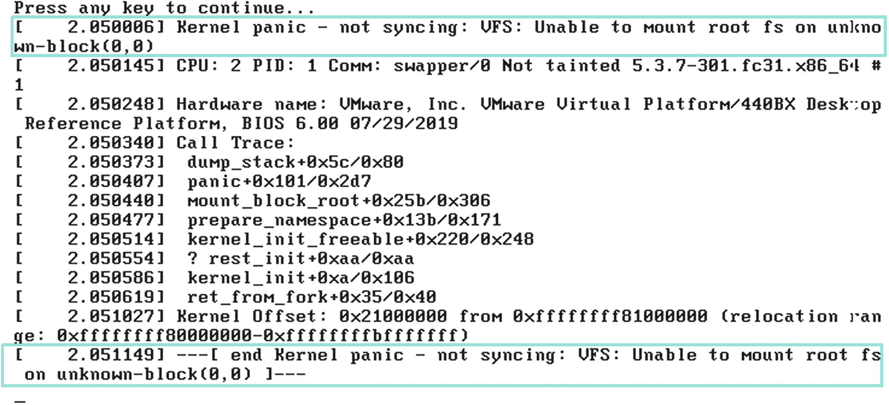

图 10-7

内核紧急消息

抛出的内核紧急消息抱怨内核无法挂载根文件系统。我们前面看到，每当内核无法挂载用户的根文件系统时，它就会抛出`dracut-initqueue`超时消息。

```sh
'dracut-initqueue: warning dracut-initqueue timeout - starting timeout scripts'

```

然而，这一次，恐慌信息是不同的。因此，看起来这个问题与用户的根文件系统无关。另一个线索是它提到了 VFS 文件系统；VFS 代表“虚拟文件系统”，因此这表示紧急消息无法从 initramfs 挂载根文件系统。基于这些线索，我想我们已经隔离了这个问题，我们应该把注意力集中在两个内核的 initramfs 上。

如图 [10-8](#Fig8) 所示，救援模式内核紧急信息也是类似的。

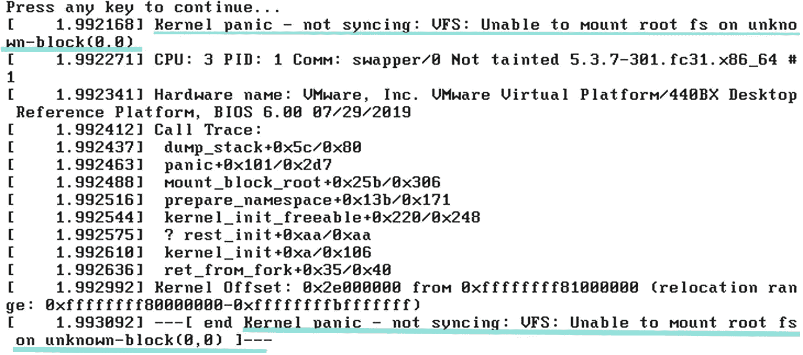

图 10-8

救援模式内核紧急消息

**解决方法:**以下是解决问题的步骤:

1.  Since the installed rescue kernel is also panicking, we need to use the live image of Fedora or of any Linux distribution to boot. As shown in Figure [10-9](#Fig9) and Figure [10-10](#Fig10), we are using a live image of Fedora.

    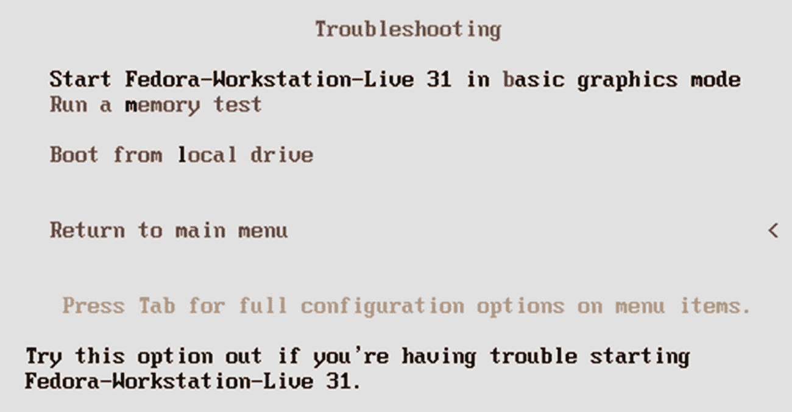

    图 10-10

    使用实时映像启动

    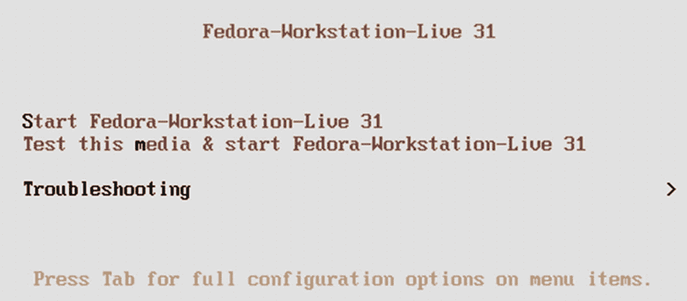

    图 10-9

    实时图像欢迎屏幕

2.  系统已在救援模式下启动。实时映像引导序列将在本章的“实时映像”一节中讨论。先成为`sudo`用户吧。

```sh
$ sudo su
We trust you have received the usual lecture from your local system administrator. It usually boils down to these three things:
#1) Respect the privacy of others.
#2) Think before you type.
#3) With great power comes great responsibility.
[root@localhost-live liveuser] #

```

1.  我们在这里看到的根目录来自一个实时图像。因为实时映像内核不知道用户根文件系统的名称，所以它不能像救援内核一样挂载它。

    ```sh
    [root@localhost-live liveuser]# ls /
         bin boot dev etc home lib lib64 lost+found media mnt
         opt proc root run sbin srv sys tmp usr var

    ```

2.  让我们来看看正常内核和救援内核的 initramfs 有什么问题。为此，我们需要首先挂载用户的根文件系统。

    ```sh
    # vgscan -v
      Found volume group "fedora_localhost-live" using metadata type lvm2

    # lvscan -v
      ACTIVE      '/dev/fedora_localhost-live/swap' [2.20 GiB] inherit
      ACTIVE      '/dev/fedora_localhost-live/root' [18.79 GiB] inherit

    # pvscan -v
      PV /dev/sda2  VG fedora_localhost-live  lvm2 [<21.00 GiB / 0  free]
      Total: 1 [<21.00 GiB] / in use: 1 [<21.00 GiB] / in no VG: 0 [0 ]

    ```

如您所见，该系统有一个基于 LVM 的用户根文件系统。物理卷在 sda 设备上。接下来，我们将在一个临时目录中挂载用户的根文件系统。

1.  让我们检查 initramfs 文件的状态。

    ```sh
    # ls temp_root/boot/ -l
         total 0

    ```

```sh
# mkdir temp_root
# mount /dev/fedora_localhost-live/root temp_root/
# ls temp_root/
     bin   dev  home  lib64  media  opt   root  sbin  sys
     tmp usr boot  etc  lib   lost+found  mnt    proc  run
     srv   @System.solv user_root_fs.txt  var

```

用户根文件系统的引导目录为空。这是因为在这个系统上，引导是一个单独的分区。

```sh
# mount /dev/sda1 temp_root/boot/
#ls temp_root/boot/
Config-5.3.7-301.fc31.x86_64  efi elf-memtest86+-5.01
extlinux grub2 loader lost+found
Memtest86+-5.01 System.map-5.3.7-301.fc31.x86_64
vmlinuz-0-rescue-19a08a3e86c24b459999fbac68e42c05
vmlinuz-5.3.7-301.fc31.x86_64

```

令人惊讶的是，正如您所看到的，在用户的根文件系统上没有可用的 initramfs 文件，这就是两个内核都死机的原因。

因此，问题已经确定，我们需要重新生成 initramfs。要制作新的 initramfs，我们需要使用`dracut`命令，但是有一些问题。

*   无论我们执行哪个二进制文件或命令，该二进制文件都将来自实时映像根文件系统。例如，`dracut`命令将从`/usr/bin/dracut`运行，而用户根文件系统的二进制文件在`temp_root/usr/bin/dracut`中。

*   要运行任何二进制文件，它需要像`libc.so`这样的支持库，这些库将再次从一个活动映像的根文件系统中使用。这意味着我们现在使用的整个环境来自实时图像，这可能会产生严重的问题。例如，我们可以安装任何包，它将被安装在实时映像的根文件系统中，而不是用户的根文件系统中。

简而言之，我们需要将当前的根文件系统(`/`)从动态映像根文件系统更改为用户的根文件系统(`temp_root`)。`chroot`是我们为此需要使用的命令。

1.  顾名思义，它会将 bash 的根从当前根更改为新根。只有当虚拟文件系统已经装载在新的根上时,`chroot`才会成功。

    ```sh
    root@localhost-live liveuser]# ls /
         bin  boot  dev  etc  home  lib  lib64  lost+found  media  mnt
         opt  proc  root  run  sbin  srv  sys  tmp  usr  var

    ```

我们当前的根是实时镜像根文件系统。在`chroot`之前，我们将挂载`proc`、`dev`、`devpts`、`sys`和`run`虚拟文件系统。

1.  我们都被设置为进入用户的根文件系统。

```sh
# mount -v --bind /dev/ temp_root/dev
mount: /dev bound on /home/liveuser/temp_root/dev.

# mount -vt devpts devpts temp_root/dev/pts -o gid=5,mode=620
mount: devpts mounted on /home/liveuser/temp_root/dev/pts.

# mount -vt proc proc temp_root/proc
mount: proc mounted on /home/liveuser/temp_root/proc.

# mount -vt sysfs sysfs temp_root/sys
mount: sysfs mounted on /home/liveuser/temp_root/sys.

# mount -vt tmpfs tmpfs temp_root/run
mount: tmpfs mounted on /home/liveuser/temp_root/run.

```

```sh
# chroot temp_root/# ls
     bin   dev  home  lib64       media  opt   root  sbin  sys   tmp
     usr boot  etc  lib   lost+found  mnt    proc  run   srv
     @System.solv  user_root_fs.txt  var

```

所以，`temp_root`现在成了 bash 的根文件系统。如果退出这个 shell，bash 会将其根目录从用户的根文件系统更改为动态镜像根文件系统。所以，只要我们在同一个 shell 实例中，我们的根目录就是`temp_root`。现在，无论我们执行什么命令或二进制文件，它都将在用户的根文件系统环境中运行。因此，现在在这个环境中执行进程是完全安全的。

1.  要解决这个“无法启动”的问题，我们需要重新生成 initramfs。

    ```sh
    root@localhost-live /]# ls /lib/modules
    5.3.7-301.fc31.x86_64

    [root@localhost-live /]# cd /boot/

    [root@localhost-live boot]# rpm -qa | grep -i 'kernel-5' kernel-5.3.7-301.fc31.x86_64

    [root@localhost-live boot]# dracut initramfs-5.3.7-301.fc31.x86_64.img 5.3.7-301.fc31.x86_64

    ```

2.  如果你想重新生成救援内核 initramfs，那么你需要安装一个`dracut-config-generic`包。

3.  重新启动后，系统能够启动，并且“无法启动”问题已得到修复。

### 企业 Linux 发行版的拯救模式

在一些 Linux 发行版(如 CentOS)中，rescue image 方法有点不同。Linux 的企业版将试图自己找到用户的根文件系统。让我们来看看实际情况。图 [10-11](#Fig11) 和图 [10-12](#Fig12) 显示了 CentOS 的救援模式选择程序。

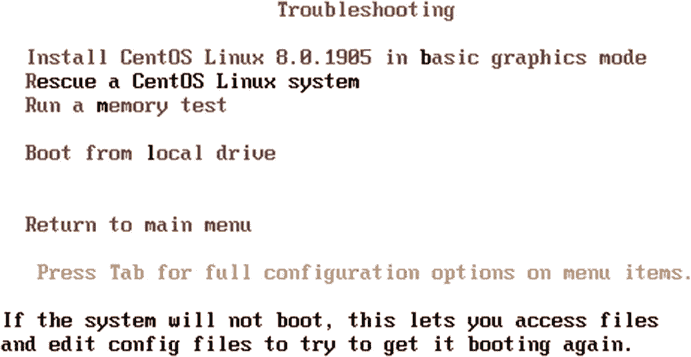

图 10-12

救援模式选择

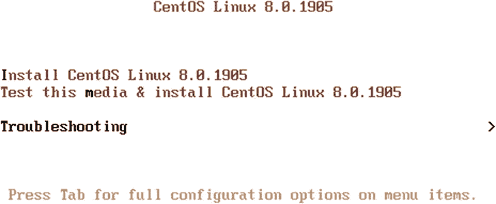

图 10-11

CentOS 欢迎屏幕

它将启动，如图 [10-13](#Fig13) 所示，它将在屏幕上显示一些消息。

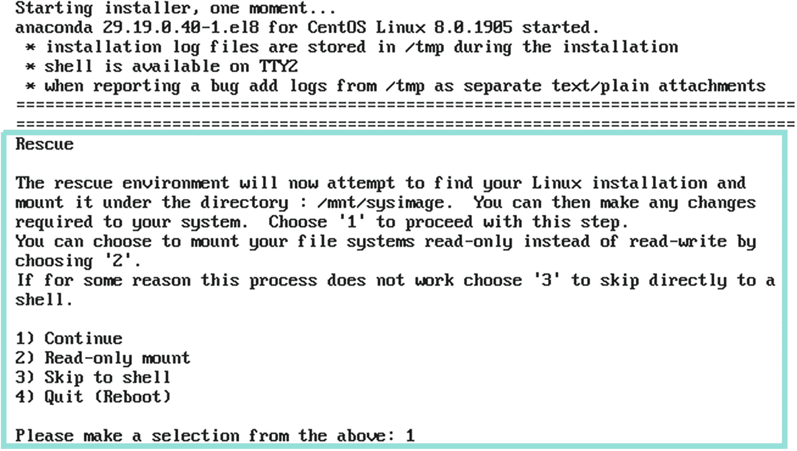

图 10-13

信息丰富的消息

如果我们选择选项 1，`continue`，那么救援模式将搜索磁盘，并将自己找到根文件系统。一旦用户的根文件系统被识别，它将把它挂载到`/mnt/sysimage`目录下。请参见图 [10-14](#Fig14) 。

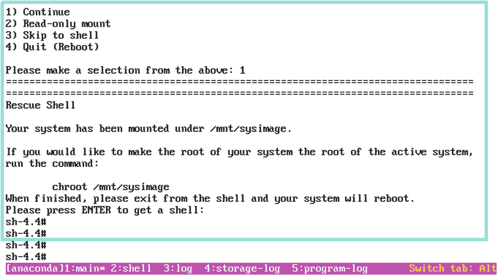

图 10-14

根文件系统安装在/mnt/sysimage 下

如您所见，它已经在`/mnt/sysimage`中挂载了用户的根文件系统；我们只需要`chroot`进入其中。但是美妙之处在于我们不需要预先挂载虚拟文件系统。这是因为，正如你在图 [10-15](#Fig15) 中看到的，CentOS 中使用的`chroot`二进制文件已经被定制，它将自己挂载虚拟文件系统。


图 10-15

根目录

如果我们选择了选项 2，`Read-Only Mount`，那么救援脚本会以只读模式挂载用户的根文件系统，而不是在`/mnt/sysimage`中。如果我们选择了第三个选项`Skip`，救援系统就不会试图自己找到并安装用户的根文件系统；它只会给我们提供一个 Shell。

但是，当 CentOS ISO 的 rescue 内核没有用户的根文件系统名称时，它是如何找到根文件系统的呢？

在这里，Anaconda 没有办法找出用户的根文件系统名。Anaconda 将挂载连接到系统的每一个磁盘，并检查`/etc/fstab`是否存在。如果找到了`/etc/fstab`，那么它将从中获取用户的根文件系统名。如果您的系统连接了大量磁盘，那么 Anaconda 很可能需要很长时间来挂载用户的根文件系统。在这种情况下，最好手动挂载用户的根文件系统。查找用户根文件系统的源代码存在于 Anaconda 的源 tarball 中，如下所示:

```sh
#vim pyanaconda/storage/root.py

 91 def _find_existing_installations(devicetree):
 92     """Find existing GNU/Linux installations on devices from the device tree.
 93
 94     :param devicetree: a device tree to find existing installations in
 95     :return: roots of all found installations
 96     """
 97     if not os.path.exists(conf.target.physical_root):
 98         blivet_util.makedirs(conf.target.physical_root)
 99
100     sysroot = conf.target.physical_root
101     roots = []
102     direct_devices = (dev for dev in devicetree.devices if dev.direct)
103     for device in direct_devices:
104         if not device.format.linux_native or not device.format.mountable or \
105            not device.controllable or not device.format.exists:
106             continue
107
108         try:
109             device.setup()
110         except Exception:  # pylint: disable=broad-except
111             log_exception_info(log.warning, "setup of %s failed", [device.name])
112             continue
113
114         options = device.format.options + ",ro"
115         try:
116             device.format.mount(options=options, mountpoint=sysroot)
117         except Exception:  # pylint: disable=broad-except
118             log_exception_info(log.warning, "mount of %s as %s failed", [device.name, device.format.type])
119             blivet_util.umount(mountpoint=sysroot)
120             continue
121
122         if not os.access(sysroot + "/etc/fstab", os.R_OK):
123             blivet_util.umount(mountpoint=sysroot)
124             device.teardown()
125             continue
126
127         try:
128             (architecture, product, version) = get_release_string(chroot=sysroot)
129         except ValueError:
130             name = _("Linux on %s") % device.name
131         else:
132             # I'd like to make this finer grained, but it'd be very difficult
133             # to translate.
134             if not product or not version or not architecture:
135                 name = _("Unknown Linux")
136             elif "linux" in product.lower():
137                 name = _("%(product)s %(version)s for %(arch)s") % \
138                     {"product": product, "version": version, "arch": architecture}
139             else:
140                 name = _("%(product)s Linux %(version)s for %(arch)s") % \
141                     {"product": product, "version": version, "arch": architecture}
142
143         (mounts, swaps) = _parse_fstab(devicetree, chroot=sysroot)
144         blivet_util.umount(mountpoint=sysroot)
145         if not mounts and not swaps:
146             # empty /etc/fstab. weird, but I've seen it happen.
147             continue
148         roots.append(Root(mounts=mounts, swaps=swaps, name=name))
149

```

## 实时图像

实时图像是 Linux 系统最好的特性之一。如果我们只是坚持正常的硬盘引导部分，这本书就不会完整。让我们来看看一个 Linux 的现场图像是如何启动的。首先让我们挂载 ISO 映像，看看它包含了什么。

```sh
# mkdir live_image
# mount /dev/cdrom live_image/
mount: /home/yogesh/live_image: WARNING: device write-protected, mounted read-only.

# tree live_image/
live_image/
├── EFI
│   └── BOOT
│       ├── BOOT.conf
│       ├── BOOTIA32.EFI
│       ├── BOOTX64.EFI
│       ├── fonts
│       │   └── unicode.pf2
│       ├── grub.cfg
│       ├── grubia32.efi
│       ├── grubx64.efi
│       ├── mmia32.efi
│       └── mmx64.efi
├── images
│   ├── efiboot.img
│   ├── macboot.img
│   └── pxeboot
│       ├── initrd.img
│       └── vmlinuz
├── isolinux
│   ├── boot.cat
│   ├── boot.msg
│   ├── grub.conf
│   ├── initrd.img
│   ├── isolinux.bin
│   ├── isolinux.cfg
│   ├── ldlinux.c32
│   ├── libcom32.c32
│   ├── libutil.c32
│   ├── memtest
│   ├── splash.png
│   ├── vesamenu.c32
│   └── vmlinuz
└── LiveOS
    └── squashfs.img

```

实时图像分为四个目录:`EFI`、`images`、`isolinux`和`LiveOS`。

*   EFI:

    我们在讨论 bootloader 的时候已经讨论过这个目录。UEFI 固件将跳转到该目录并运行`grubx64.efi`文件。`grubx64.efi`文件将读取`grub.cfg`文件，并将从`isolinux`目录中提取`initrd.img`和`vmlinuz`文件。

*   **图像:**

    这将主要在我们通过 PXE 引导时使用。网络引导超出了本书的范围。

*   **等 linux:**

    如果 UEFI 以 BIOS 方式启动，那么它将从这里读取`grub.conf`文件。该目录主要用于存储`initrd`和`vmlinuz`文件。换句话说，这个目录是普通根文件系统的`/boot`。

*   层:

    这就是奇迹发生的地方。这个目录有一个名为`squashfs.img`的文件。一旦你安装了它，你会在里面找到`rootfs.img`。

```sh
# mkdir live_image_extract_1
# mount live_image/LiveOS/squashfs.img  live_image_extract_1/

# ls live_image_extract_1/
     LiveOS
# ls live_image_extract_1/LiveOS/
     rootfs.img

# mkdir live_image_extract_2
# mount live_image_extract_1/LiveOS/rootfs.img live_image_extract_2/

# ls live_image_extract_2/
     bin  boot  dev  etc  home  lib  lib64  lost+found  media  mnt  opt  proc  root  run  sbin  srv  sys  tmp  usr  var

```

### 壁球比赛

Squashfs 是一个小型的压缩只读文件系统。这个文件系统通常用于嵌入式系统，其中存储的每个字节都很宝贵。Squashfs 为我们提供了比 tarball 归档更多的灵活性和性能。Squashfs 在其中存储了一个动态 Fedora 的根文件系统(`rootfs.img`),它将以只读方式挂载。

```sh
# mount | grep -i rootfs
/home/yogesh/live_image_extract_1/LiveOS/rootfs.img on /home/yogesh/live_image_extract_2 type ext4 (ro,relatime,seclabel)

```

您可以使用`squashfs-tool`提供的`mksquashfs`命令来制作 Squashfs 图像/档案。

### rootfs.img

`rootfs.img`是一个 ext4 文件系统，其中有一个典型的根文件系统。有些发行版为实时图像创建一个访客用户或一个名为`live`的用户，但是在 Fedora 中是根用户做所有的事情。

```sh
# file live_image_extract_1/LiveOS/rootfs.img
live_image_extract_1/LiveOS/rootfs.img: Linux rev 1.0 ext4 filesystem data, UUID=849bdfdc-c8a9-4fed-a727-de52e24d981f, volume name "Anaconda" (extents) (64bit) (large files) (huge files)

```

### 实时映像的引导序列

顺序如下:

1.  固件会调用引导程序(`grubx64.efi`)。它将读取`grub.cfg`文件，并从`isolinux`目录中复制`vmlinuz`和`initrd`文件。

2.  内核将在特定的位置提取自身，并将在任何可用的位置提取 initramfs。

3.  从 initramfs 启动的 systemd 会在`/dev/mapper/live-rw`将`rootfs.img`文件提取到设备映射器目标设备，将它挂载到根(`/`)文件系统，并将`switch_root`文件放入其中。

4.  一旦根文件系统可用，您可以将它视为安装在 CD、DVD 或`.iso`文件中的正常操作。

此外，很明显，与特定于主机的 initramfs 相比，实时映像 initramfs 的大小要大得多。