# 四、Ubuntu

Ubuntu 是最著名的 Linux 发行版之一(也是使用最多的)，所以它可能是非高级 Linux 用户第一个想到的。其实很多人觉得 Linux 和 Ubuntu 是一回事。这一点尤其引人注目，因为 Ubuntu 是一个相对较新的发行版(与其“母”发行版 Debian 相比只有 11 年的历史，Debian 已经有 22 年的历史了)。显然，Ubuntu 为了获得这样的认可，做了一些非常出色的事情。我可以有把握地说，说到 Linux 的历史，你可以把它分为 Ubuntu 之前的时代和之后的时代。我认为这是我开始 Ubuntu 发行版分析的足够理由。

## 历史

在 20 世纪 90 年代中期，一位名叫马克·舒托沃尔斯的南非企业家(见图 4-1 )创立了一家名为 Thawte 的数字认证机构和互联网安全公司，该公司后来成为互联网上的第二大公司(直到其主要竞争对手 VeriSign 在 1999 年以数亿美元收购了它)。突然变得富有，舒特尔沃斯决定用这笔钱来实现他的一些梦想。在建立了一个非盈利组织(沙特尔沃思基金会，或 TSF)，一家风险投资公司(HBD 的“龙在这里”)，并成为第一批太空游客之一(都是在出售后的前三年)，他在 2004 年迈出了一步，这将使他成为 Linux 世界最知名的人物之一，一些行动的催化剂将决定 Linux 在未来如何被世界其他人所看待。


图 4-1。

Mark Shuttleworth at Linuxtag 2006 at Wiesbaden, Germany

作为 Debian 的长期用户、维护者和开发者(以及一般的开源倡导者)，舒特尔沃斯坚信 Linux(作为发行版)可以成为主流，从而与当时的主要操作系统，即 Windows 和 Mac OS 竞争。他对开源和软件自由有着坚定的承诺，并希望回报社区，因为这是他以前的公司及其成功的基础。然而，他认为，鉴于 Debian 的社区管理性质，给它带来巨大而彻底的改变将是一项巨大的事业。因此，最简单也是最好的解决方案是使用 Debian 作为新发行版的基础。

2004 年 4 月，他会见了十几个来自 Debian、GNU Arch 和 GNOME 项目的开发人员，以勾勒出一个更好的 Linux 发行版。他们称自己为“疣猪”，并在六个月内完成了 Ubuntu 的第一个版本“疣猪”。

舒特尔沃斯还创立并资助了 Canonical Ltd .，一家总部位于英国的公司，为 Ubuntu 提供商业支持和服务。这家公司的名字传达了一个明确的信息:他们想成为所有其他公司的典范。为发行版选择的名字 Ubuntu 也是一个声明。Ubuntu 一词源于祖鲁族(南非的一个部落)，意思是“对他人的仁慈”它也意味着“我之所以是我，是因为我们都是谁。”这就是 Ubuntu 背后的精神。

Ubuntu 很快赢得了几个奖项和专业媒体的认可，然后它迅速成为最著名的发行版。我个人在 2005 年到 2012 年把发行版作为我的主要操作系统，我记得它已经在几乎每个高级 Linux 用户的舌尖上。今天，Canonical 估计有 4000 万 Ubuntu 桌面用户，并且还在增加。Ubuntu 在服务器市场也非常突出，尤其是在云中，它是安装最多的发行版之一。此外，来自 Canonical 的 Dustin Kirkland 最近声称，有超过 10 亿人通过服务器、云实例、虚拟映像、手机等直接或间接使用 Ubuntu。

## 批评和争议

Ubuntu 不得不面对许多批评和争议。舒特尔沃斯和 Canonical 对 Ubuntu 成为桌面市场和其他领域的竞争对手所必须走的道路有着独特的愿景，他们毫不犹豫地做出创新和改变，摆脱 Linux 和其他发行版的自由软件传统。一些用户非常保守，他们不喜欢突然的改变，尤其是如果他们喜欢 Ubuntu 的话。

结果，Ubuntu 从最受欢迎的 Linux 发行版之一变成了最受批评的发行版之一，并且失去了许多用户。我想这是当你成为桌面 Linux 发行版之王时所付出的代价。我感觉在过去的几年里，自从决定让 Ubuntu 成为一个无处不在的寻求融合的发行版后，它似乎有点迷失了方向。我希望在未来，Ubuntu 能够重新成为永远改变了 Linux 世界的令人惊叹的革命性发行版。

## 哲学

Ubuntu 最初的理念是创建最好的 Linux 发行版，并与操作系统领域的其他主要参与者竞争:Windows 和 OS X。今天，理念没有太大变化，但最近 Canonical 希望征服桌面和服务器市场以及移动设备、云和物联网。Ubuntu 希望无处不在，成为最好的。

最初 Canonical 希望提供一个易于使用、可访问、本地化并由社区驱动的发行版。它还希望是可预测的，所以频繁的发布是一个关键点。这在今天仍然是正确的，这个目标已经扩展到提供一个无处不在的体验，你可以在几乎每一个设备上拥有相同的分布。

## 发行版选择标准

现在你知道了它的起源，让我们来看看 Ubuntu 是如何与第二章中讨论的发行版选择标准相比较的。

### 目的和环境

Ubuntu 主要是一个通用发行版，但最近 Canonical 正在寻求成为一个可以安装在传统笔记本电脑/台式机领域以外的所有类型硬件上的发行版，如移动设备(智能手机和平板电脑)、云、服务器和物联网(物联网，即连接到互联网的电子设备)。为了实现这一目标，它创建了同一发行版的不同版本，以适应特定的任务。因此，我们可以说 Ubuntu 是一个通用的发行版，也是一个面向任务的发行版，这取决于你使用哪种风格。

目前，Ubuntu 已经有了针对不同环境的“版本”,但并不是所有版本都可以下载。

*   桌面:这是发行版的传统版本，它是通用的，面向工作站、台式机和笔记本电脑。
*   服务器:这个版本安装在服务器上，所以它是面向任务的。
*   云:可以作为最常见的公共云(如 Amazon AWS、Google Cloud 或 MS Azure)的图像，该版本也有完整的 OpenStack 产品。作为其面向物联网的一部分，还有 Ubuntu Core，可以在云环境中使用。
*   麒麟:这是为中国市场改编的桌面版本，它符合中国政府的采购条例。
*   手机(移动):这个版本不能从网站上下载，但它作为 OEM 操作系统与一些智能手机和平板电脑一起提供。这是 Canonical 最近的一次尝试，目前仍处于第一阶段，因此可用的设备有限。

### 支持

Ubuntu 是一个得到很好支持的发行版，同时提供商业和社区支持(即使它们有相同的发行版)。对于企业，有 Ubuntu Advantage service，它包括用于管理、自动化、部署和协助的工具，如 Landscape(一个独家技术库)、24/7 电话支持，以及可选的现场专用规范支持工程师。为此，您必须根据您的安装规模每年支付定额。你可以在 [`www.ubuntu.com/management/ubuntu-advantage`](http://www.ubuntu.com/management/ubuntu-advantage) 了解更多关于 Ubuntu 优势的信息。

至于 Canonical 的免费支持，您可以使用两种资源:

*   文档: [`https://help.ubuntu.com/`](https://help.ubuntu.com/)
*   技术回答系统: [`https://answers.launchpad.net/ubuntu`](https://answers.launchpad.net/ubuntu)

此外，您还可以从各种渠道获得免费的社区支持:

*   Wiki: [`https://wiki.ubuntu.com`](https://wiki.ubuntu.com/)
*   论坛: [`http://ubuntuforums.org/`](http://ubuntuforums.org/) 或 [`http://discourse.ubuntu.com`](http://discourse.ubuntu.com/)
*   求 Ubuntu: [`https://askubuntu.com`](https://askubuntu.com/)
*   IRC:[`https://wiki.ubuntu.com/IRC/ChannelList`](https://wiki.ubuntu.com/IRC/ChannelList)
*   邮件列表: [`http://community.ubuntu.com/contribute/support/mailinglists`](http://community.ubuntu.com/contribute/support/mailinglists)

当然，你可以为社区做贡献，并尽可能多地回馈社会，以帮助社区在 [`http://community.ubuntu.com`](http://community.ubuntu.com/) 维持下去。Ubuntu 的应用如此广泛，以至于你还可以联系和参与世界各地的当地社区(LoCo );转到 [`http://community.ubuntu.com/help-information/meeting-other-ubuntu-users/local-communities`](http://community.ubuntu.com/help-information/meeting-other-ubuntu-users/local-communities) 。

这种级别的支持，不仅在规模和质量上都是巨大的，是你在其他发行版中找不到的。这是 Ubuntu 最强的一点。

### 用户友好性

用户友好性一直是发行版的核心目标。Ubuntu 是一个非常好用的 Linux 发行版；特别推荐给 Linux 世界的新手。它有自己的做事方式，并不是所有人都喜欢 Unity 桌面环境，但一旦你习惯了，它就非常容易使用和直观。此外，从硬件检测到维护更新，它尽可能做到透明和自动化。这一点加上强大的支持使它成为我推荐给初学 Linux 用户的发行版之一。

### 稳定性

开箱即用，Ubuntu 是一个非常非常稳定的 Linux 发行版。您可以安装一个普通版本(不是 LTS 版本)，在几年内毫无问题地使用、维护和升级它，而无需进行全新安装。还可以选择使用 LTS 版本来获得额外的稳定性和安全性保证。LTS(长期支持)版本面向那些需要为他们的系统轻松安装操作系统的人，因为他们的工作依赖于它，或者只是因为他们不喜欢花太多时间来维护他们的操作系统。

Canonical 在他们的发行版中使用了标准发布方案的变体。有周期为六个月的普通版本，也有周期更长的 LTS 版本(大约两年四个标准版本)。标准版本有九个月的维护期，之后将不再得到官方支持。LTS 版本支持五年，并且通常更稳定，因为它们缺乏实验性或部分完成的功能。你可以在 [`https://wiki.ubuntu.com/Releases`](https://wiki.ubuntu.com/Releases) 看到日历和发布列表。

Ubuntu 版本有一个数字方案和一个代号的双重命名。数字方案采用 YY 格式。MM，对应发布的年份和月份。通常释放发生在 04 和 10 月(4 月和 10 月)。代号总是由一个形容词和一种动物组成，通常很有趣，就像当前的 16.04 或“Xenial Xerus”版本。

### 硬件支持

Ubuntu 的硬件支持大概是最好的之一。自动检测最常见的硬件；即使它是显卡，你通常也可以选择安装一个开源或者一个私有的驱动程序。当硬件未知时，通常很容易从硬件公司或社区找到驱动程序的替代来源，因为 Ubuntu 是如此受欢迎的发行版；较小的发行版通常不会有专门的驱动程序。在最坏的情况下，你可以经常使用 Debian 驱动程序。

当一家计算机公司决定销售其机器时，默认(或可选)使用 Linux 发行版作为其操作系统，通常 Ubuntu 是被选中的。从戴尔、惠普、华硕和联想这样的大公司到 System76 这样的专业公司都是如此。

作为一个整体系统，笔记本电脑是最有问题的硬件，但也有一些公司生产的笔记本电脑与 Linux 配合得特别好，如联想、惠普和戴尔。Canonical 有一个网站和一个程序来认证运行 Ubuntu 没有问题的硬件；它叫 Ubuntu 认证硬件，台式机的站点是 [`http://www.ubuntu.com/certification/desktop`](http://www.ubuntu.com/certification/desktop) 。

### 美学

从第一个版本开始，舒特尔沃斯就试图创建一个好看的发行版，Canonical 继续这一努力。logo 在 Linux 世界里，甚至在它之外，都是一个非常容易识别的图标，也是它的原则的明确象征。很容易看出 Canonical 在发行版的每一个方面都考虑到了美学，从网站到发行版本身。以前公司免费送光盘到你家的时候，光盘封套总是设计的非常好。随着时间的推移，设计发生了变化，很明显它还在继续发展。但这是一个非常主观的话题，许多人不喜欢调色板，即橙色和茄子的几个色调。这个调色板是公司形象的一部分，它与 Ubuntu 紧密相连，所以它可能永远不会改变，但它有不止一两个批评者。

### 桌面环境

从一开始，Ubuntu 就使用 Gnome 桌面环境。第一个衍生品 Kubuntu 和 Xubuntu 默认使用 KDE 和 Xfce 作为桌面的主要区别。但是从 11.04 版本开始，Ubuntu 使用了自己的 Unity 桌面界面。它最初的构想是为了拥有一个独特的界面，可以在所有可用的设备上使用(最初是笔记本电脑，但现在是笔记本电脑、平板电脑和智能手机)。

Unity 的推出在 Ubuntu 社区引起了巨大的争议。许多用户迁移到其他发行版(如 Mint ),因为他们不喜欢新的界面。这在今天仍然是一个问题。两个新的官方口味，Ubuntu Gnome 和 Ubuntu MATE，只存在于热爱 Ubuntu 但讨厌 Unity 的人。

如果你想看到所有不同的官方版本，请进入 [`https://wiki.ubuntu.com/UbuntuFlavors`](https://wiki.ubuntu.com/UbuntuFlavors) (并非所有版本都基于不同的桌面环境)。

### 初始化系统

直到最近，实际上直到 15.04 版本，Ubuntu 一直使用自己的 init 系统 Upstart，它也被 Fedora 等其他发行版采用。(其实最初几年，它用的是经典的 sysv init，System V)。

但是在最近的版本中，Ubuntu 决定加入大多数发行版并采用新版本 systemd。你可以在倒数第二个 LTS 版本(14.04)中找到 Upstart，但是在当前的 LTS 版本(16.04)中它已经被否决了。

在最后一个版本中，您仍然可以通过安装 Upstart 并切换到永久使用它来使用它，但是我不建议任何非高级用户使用它。最后，未来似乎是 systemd，几乎存在于所有的 Linux 发行版中(当然也有例外)。

### 包装管理系统

因为它最初是 Debian 的衍生物(它仍然很大程度上依赖于这个发行版)，所以包管理系统与那里使用的 dpkg 是一样的。当然，Ubuntu 有自己的软件包库和图形工具，但它使用的是 Debian、apt-get 和 aptitude 的经典 shell 工具。典型的用户会使用图形工具来完成这项工作，软件(实际上是 gnome-software)，但是当你必须安装一个非常罕见的包或者当你想使用 PPA 时，使用 shell 工具是很常见的(你也可以用图形来完成这项工作)。

PPAs(个人包存档)是 Ubuntu 的一个独特特征(在一些发行版中有类似的东西，但不完全是这样的)。它们是一种将您自己维护的包保存在个人存储库中的方法。这经常被用来添加官方软件库中没有的软件，但是这也是升级时令人头痛和出现问题的一个主要原因，并且它可能会导致很大的安全风险。如果那辆 PPA 不是你的，你必须信任它的主人，反之亦然。通常人们使用 PPAs 来运行软件库中还没有的最新版本；这是一种以某种方式模仿滚动发布的方式，但这是错误的。

Canonical 最近推出的另一项包管理创新是 Snappy 它以前只在 Ubuntu Core 和 Phone 中受支持，但现在是桌面版本的一部分，从 16.04 版本开始。Snappy 是 Nix(和 Guix)包管理器以及苹果操作系统和安卓包管理器的混合体。基本上 Snappy 使用事务性更新(可以回滚)和原子包，减少了复杂性和包之间的冲突。

### 体系结构

桌面版 Ubuntu Linux 官方仅支持 32 位和 64 位 Intel/AMD 架构。服务器版本提供了针对 ARM 和 IBM Power8 平台的版本。这涵盖了普通用户的大多数用例，但是如果你需要在其他平台上使用 Ubuntu，你必须依赖旧的或者非官方的版本。显然，使用手机版本的平板电脑/智能手机是受支持的，但它是作为捆绑产品出现的(Ubuntu 作为 OEM)。

### 安全性/匿名性

Ubuntu 是一个相当安全的开箱即用的 Linux 发行版。它不是一个偏执狂级别的安全发行版，但是它使用了 AppArmor 安全模块，并且它的默认值对于大多数用户来说已经足够了。当然，你总是可以让它更安全；您可以安装和配置这些工具，但是您需要知道您在做什么，因为您很容易使它变得更糟。您可以在安装过程中采取一些额外的措施，比如加密您的主目录或整个磁盘，并始终使用一个密码(而且是一个强密码)。官方文档提供了很好的建议；前往 [`https://help.ubuntu.com/lts/serverguide/security.html`](https://help.ubuntu.com/lts/serverguide/security.html) 。

事实上，Ubuntu 用户在安全方面面临的主要风险来自于用户行为。像不使用密码登录、使用弱密码、使用非官方存储库或 PPAs 是最常见的威胁。

至于匿名部分，Ubuntu 在这个问题上通常是尊重的，让用户自己决定是否把他们的信息发给公司来帮助改进发行版。然而，在过去的几年里，由于 Ubuntu 搜索与亚马逊的整合以及包含了一个直接链接到商店的功能，这引起了巨大的争议。后来有一个关闭亚马逊搜索的选项；最后，在当前的 16.04 版本中，默认情况下在线搜索是禁用的。从财务角度来看，我认为亚马逊对这一功能的财务支持帮助 Canonical 平衡了账目。

### 原则和道德

从一开始，舒特尔沃斯和 Canonical 就对自由软件和开源软件有着强烈的道德和原则意识。这个名字和标志是他们原则的有力宣言。但随着时间的推移，Canonical 和舒特尔沃斯在这些问题上采取了更加灵活和务实的方法，以实现其主要目标，成为桌面市场的替代者，并获得更大的用户份额。这种灵活性意味着发行版可以为显卡和网卡等提供二进制和专有驱动程序。此外，用户可以选择从安装(如 mp3 支持)或从软件中心安装专有或甚至商业软件。

去年，有人批评 Canonical 偏离了它的核心社区。这是有一定道理的，因为当 canonical 转向为所有类型的设备制造一个无处不在的操作系统时，它确实失去了一点焦点。但 Canonical 是一家公司，它必须赚钱。

### 现场 CD

桌面版的 Ubuntu 也是一个实况 DVD，你可以用它来测试 Ubuntu，而不需要安装它。出于安全原因，您也可以使用它，例如在不在系统中留下任何痕迹的情况下访问互联网，或者如果您当前的操作系统(例如，Windows)被感染或不安全，也可以使用它。高级用户也可以使用它来修复当前 Ubuntu 安装的问题。旧版本通常可以放在 CD 上，但是现在的版本需要 DVD。

### 专业认证

过去，Canonical 为他们的系统提供专业认证，但现在已经停止了。该认证相当于当前 Linux 专业研究所的 LPIC-1，是一个非常基础的认证。由于 Ubuntu 是基于 Debian 的，所以有一些认证对这个发行版是通用和有效的，比如前面提到的 LPIC 系列或者 Linux 基金会提供的产品。

## 装置

安装这个发行版或任何其他发行版从来都不是一条直路。有多个选项允许您根据自己的需要或偏好个性化您的安装。我将介绍这个发行版最常见的安装方式，但是我将在本书中向您展示其他发行版中的其他方式，目的是让您更广泛地了解 Linux(作为一个发行版)是什么；我不会仅仅坚持几乎是自动的“下一步”。

你要做的第一件事是从 [`www.ubuntu.com/download/desktop`](http://www.ubuntu.com/download/desktop) 下载桌面版本的可安装 ISO 镜像。你也可以在 [`http://shop.canonical.com`](http://shop.canonical.com/) 的商店购买一个 u 盘，但是那里唯一的选择是获得 64 位英特尔/AMD 架构的最新 LTS 发行版，如图 4-2 所示。

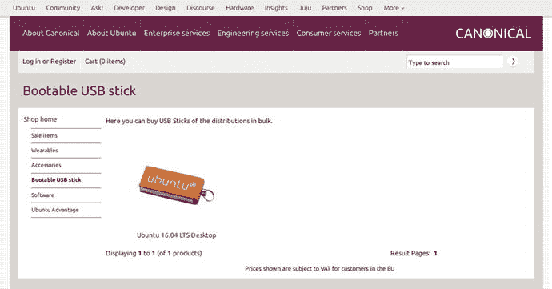

图 4-2。

The Canonical shop, where you can purchase a Ubuntu LTS release on an USB stick

图 4-3 显示下载页面。通常有两个主要选项可供选择:最新的 LTS 版本和最新的普通版本(它们被称为“版本”而不是“版本”，但为了保持一致，我将坚持使用“版本”这个术语)。如果你用你的电脑工作或者你不需要最新版本的软件，我强烈建议你安装 LTS 版本；在其他情况下，选择最新的正常版本，你就可以开始了。在写这本书的时候，相应的版本是 16.04 LTS。


图 4-3。

The Ubuntu desktop download page

我选择了最新的 LTS 版本，64 位的 16.04 来展示 Ubuntu 的安装过程，因为这是大多数人会选择的版本。在你按下按钮下载发行版后，Canonical 会向你显示一个中间页面来维护发行版(见图 4-4 )。你可以捐款(你可以出于同样的目的从他们的商店购买商品)或者你可以跳过它继续下载。

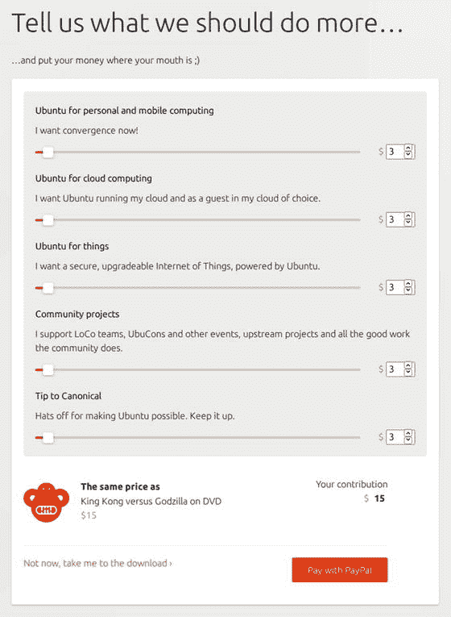

图 4-4。

The intermediate page where you can donate to the project

如果你需要一个更老的版本，你也可以选择一个替代的下载(下载页面上有一个链接)，一个网络安装程序(在安装时从互联网上下载你需要的所有东西；这仅推荐用于快速在线连接)，或者您想要使用 BitTorrent 协议来下载 ISO 映像(参见图 4-5 )。

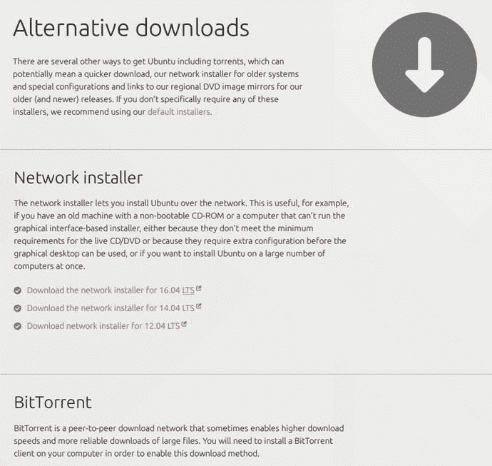

图 4-5。

The Ubuntu alternative downloads page for the desktop version

下载 ISO 映像(16.04 版本大小约为 1.4GB)后，您可以将其刻录到 DVD 或 USB 驱动器上。从那个 Ubuntu 镜像启动后，你会看到第一个屏幕，这是一个黑屏，底部有一个图片，如图 4-6 所示。这个画面只持续几秒钟。


图 4-6。

The first screen that appears in the boot process

如果您在该屏幕消失前按下任何键，您将跳转到如图 4-7 所示的屏幕。

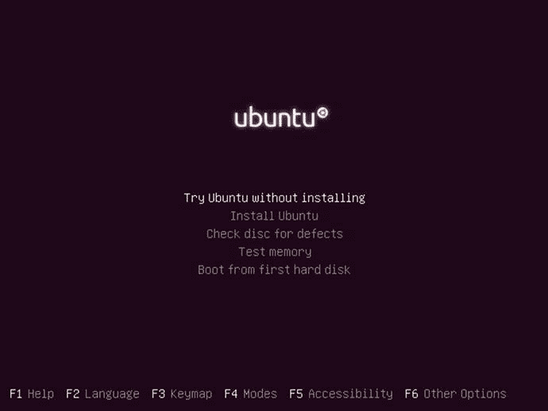

图 4-7。

The text installation menu of Ubuntu

该屏幕是一个文本菜单，允许您使用常规图形安装过程中不可用的几个选项。它允许您测试您的 DVD 光盘或您的内存，通常是为了诊断一些问题发生在以前的安装尝试。但您也可以使用功能键设置其他高级选项，如底部菜单所示，如进行 OEM 或专家安装，或避免某些硬件检测问题，或更改安装的默认语言。这些选项是为中级/高级用户设计的，我不建议尝试任何一个，所以不要在前面的屏幕中按任何键，让我们继续启动过程。

出现的下一个屏幕是另一个黑屏，中间有一个图像，有一个动画图形向您显示启动时的活动(参见图 4-8 )。


图 4-8。

Image shown on the boot progress screen

在引导过程结束时，您会在图形环境中看到第一个屏幕，如图 4-9 所示。

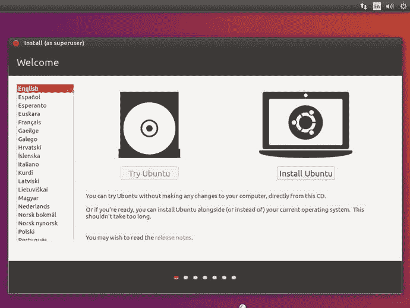

图 4-9。

The Welcome screen after booting the Ubuntu ISO image

这个屏幕提供了两个主要选项:“试用 Ubuntu”和“安装 Ubuntu”您还可以设置安装过程中使用的语言。在顶部的菜单栏中，您还可以设置其他选项(其中一些等同于我之前向您展示的文本菜单)，如网络或辅助功能选项。如果你选择“试用 Ubuntu ”,你将启动一个 Ubuntu 的实时会话，在这个会话中，你可以测试很多东西，而不需要在你的硬盘上写任何东西，并且你总是可以从那里继续安装过程。跳过这个过程。相反，按下“安装 Ubuntu”按钮。

下一个屏幕(图 4-10 )会检查您的计算机是否有足够的磁盘空间和互联网连接。安装发行版不需要互联网连接，但是如果你有一个可用的互联网连接，并且你选择了“安装时下载更新”，发行版将会安装可用的更新包，而不是 ISO 镜像中的旧包。我建议检查这个选项，原因有两个:

*   如果你想让你的 Linux 保持最新(我强烈建议你这样做)，你必须在安装后的第一次更新时花额外的时间下载软件包。所以，如果你不着急，而且你有一个良好的互联网连接，现在就做吧。
*   如果任何更新都是安全更新，那么当你第一次启动新的 Linux 并使用互联网时，你将避免任何可能影响你的系统/数据的安全漏洞，因为你还没有更新系统。

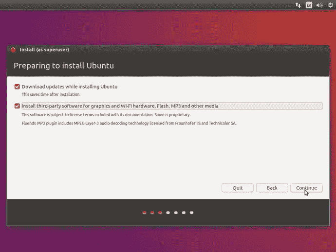

图 4-10。

The first step in the Ubuntu installation process

在发行新版本后，甚至第二天，经常会有新的包更新。在 Linux 和一般的开源软件中，定期更新是非常正常的，甚至是每天更新。如果你使用像 Ubuntu 这样的发行版，也许你不会每天都有更新，但是如果你使用滚动发行版，你一方面可以指望没有任何更新的日子(当然这取决于你系统中安装的软件包的数量和种类)。

该屏幕上的最后一个选项是安装专有软件，如显卡和无线驱动程序、Adobe Flash 或 mp3 Fluendo 插件(允许多个应用程序再现. mp3 文件)。之所以这是可选的，是因为这个软件不是自由许可的，有些人不同意这一点。装不装由你决定；然而，例如，由于音频文件中 mp3 格式的流行，我选择安装插件，这样我就可以播放这些文件。

按下继续按钮。出现的下一个屏幕如图 4-11 所示。这是安装中最复杂的部分，因为您必须做出一些关键的决定。基本上这部分是决定你如何管理你的硬盘来安装 Ubuntu。这里有两个主要选项:自动选项和手动选项。

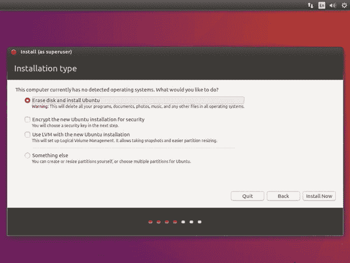

图 4-11。

The installation type screen where you choose how to manage your disk

*   擦除磁盘，安装 Ubuntu。这是自动过程。Ubuntu 将擦除你的整个硬盘(和所有的数据),并用自动计算的大小创建新的分区。只有在新机器上安装时，才建议这样做。在此选项中，您有两个其他选择:
    *   加密磁盘。这将加密您的整个硬盘，只有您可以使用密码访问其内容。注意！这样，如果你忘记了密码，你就会丢失所有的数据。我只向有 Linux 经验的中级/高级用户推荐这个。此外，请务必备份您的数据！另一件要注意的事情是，这个选项影响你的硬盘性能，因为你的 CPU 必须连续加密/解密你的数据。如果你没有一台现代化的机器、足够的内存和高速磁盘(最好是固态硬盘)，我不建议激活这个选项。
    *   用 LVM。这是一种管理磁盘卷的现代方法，比传统的分区方案更加灵活和强大。我只建议中级/高级用户这样做，因为如果您不打算更改磁盘卷，就没有必要这样做。如果您计划将来这样做，请现在激活它。
*   别的东西。这是完整的手动程序。您必须选择分区(数量、大小、类型、挂载点)以及是否加密它们。此选项不允许您选择 LVM；您必须使用 shell 和一系列命令来完成这项工作。只推荐给那些知道自己在做什么的人。

在对发行版的第一次回顾中，我的目的是向您展示在一个全新的系统中安装一个新的 Linux 发行版是多么容易。稍后，在不同的发行版中，我将向您介绍安装发行版的其他方法，以避免枯燥和重复，并向您展示如何在 Linux 中做某些事情。因此，我将在这里跳过任何高级选项。

如果您按下 Install Now(立即安装)按钮，将会显示一份对硬盘所做更改的摘要(图 4-12 )。这个操作是不可逆的，这是向你展示信息的充分理由。通常它会创建两个分区:一个 ext4 格式的根分区和一个交换分区。因为我正在一个全新的系统中安装 Ubuntu，所以我可以放心地按下继续按钮。


图 4-12。

The confirmation step before making changes to the hard disk

图 4-13 显示了用于选择时区以正确调整日期和时间的交互式地图。通常 Ubuntu 会自动检测你的当前时区，但是你也可以通过导航到地图上合适的区域来手动选择。

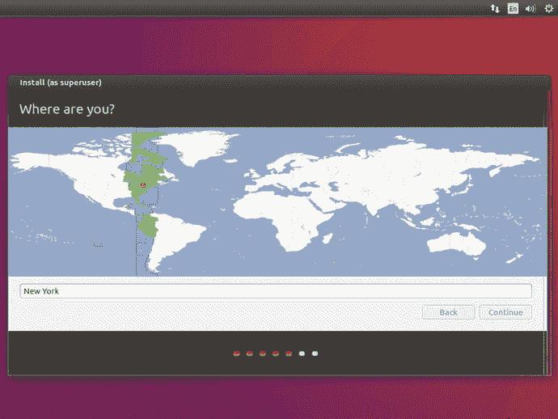

图 4-13。

Interactive time zone selection

选择您的时区并按下继续按钮后，您必须选择您的键盘布局和语言(图 4-14 )。通常这也会被自动检测到。否则，您可以按下按钮，尝试再次以交互方式检测它(它会要求您按下一些键，可能会问一些问题)，然后在交互式文本字段中测试结果。完成后，您可以按继续按钮。


图 4-14。

Keyboard layout and language selection screen

图 4-15 显示了您必须做出任何决定的最后一个屏幕。你基本上要决定你的名字和密码。实际上，我建议在开始安装之前决定这些事情。我建议你选择一个易于在任何键盘上输入的用户名(如果你愿意，在第一个文本字段中输入你的真实姓名)，因此避免任何非英语字母数字字符。如果你的键盘坏了，或者你的安装失败了，没有检测到你的键盘布局，你会为此感谢我的，相信我。

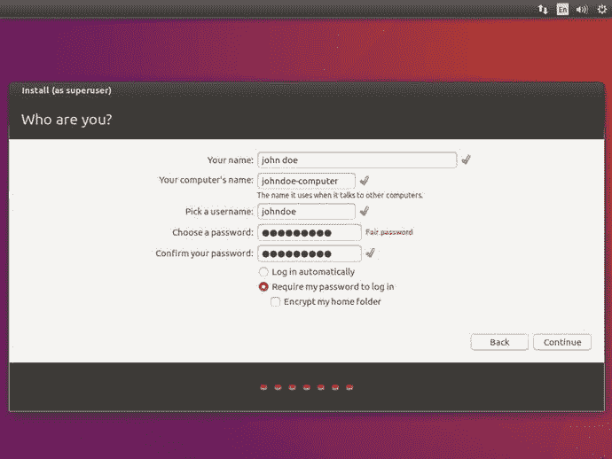

图 4-15。

Identity screen where you enter your user name and password

接下来，您必须选择一个密码。最好选择一个强有力的，这意味着使用小写和大写字母，数字和符号。但是有一个简单的方法。我建议如下:从一首诗，一首歌，或者一本书里挑一句你喜欢的，你容易记住的。然后挑出每个单词的第一个字母，加上一对数字和符号，你就有了一个非常强的容易记住的密码。比如考虑一下这句名言:

> Ah, captain! My captain! Our terrible trip is over. —— walt whitman, Leaves of Grass, 1891

您可以很容易地编写一个非常强的密码，方法是取每个单词的第一个字母，添加两个不同的符号来分隔不同的部分(使它们在任何键盘上都容易找到)，添加作者姓氏的第一个字母和这首诗首次发表的年份的两个数字。

```sh
Ocmcoftid.W-91

```

现在你必须决定当你打开你的电脑或者使用你的密码时你是否想要自动登录。如果您正在只有您现在或将来可以访问的台式电脑上安装 Ubuntu，您可以自动登录。同样，如果这台计算机是为可能记不住密码的老年人或对公众开放的，您可以选择此选项。否则，我强烈建议反对这个选项。

至于加密主文件夹，我给你的建议和加密硬盘一样。同样，请记住，您必须定期进行备份。(经验告诉我，这个你怎么推荐都不为过。)

按下继续按钮开始真正的安装过程。屏幕现在是一个旋转木马，在安装过程的同时向您介绍新操作系统的可能性(参见图 4-16 )。底部是一个进度条和你现在所处的步骤(文本)。这个过程需要的时间取决于你的电脑和你的互联网连接速度，因为它要从互联网上下载几个软件包。


图 4-16。

Copying the files to the hard disk and finishing the setup

在硬盘上安装 Ubuntu 的最后，您会看到一个对话框，通知您安装已完成，您需要重新启动计算机才能享受新的 Ubuntu Linux 操作系统(参见图 4-17 )。


图 4-17。

The installation is complete . Restart your computer

所以重启你的电脑。启动后，出现的第一个屏幕是启动新会话的登录屏幕(见图 4-18 )。在这里你需要介绍你的密码(我希望你没有忘记它。每次管理过程都需要这个密码)。如果您想在系统中做一些事情(如浏览互联网或使用任何已安装的应用程序)，您可以作为访客登录，但此会话中的所有数据都是临时的，您将无法访问硬盘上的数据。然而，对于系统的任何访问者来说，这是一个理想的选择。


图 4-18。

The login screen to Ubuntu 16.04 LTS

所以输入你的密码。现在你可以享受 Ubuntu 了。您将看到的第一个屏幕是键盘快捷键列表(参见图 4-19 )。按住“Super”键(通常是带有 Windows 符号的那一个)可以一直显示该屏幕。一旦你学会了，这些快捷方式是非常有用的。它们会帮助你提高生产力，所以不要忽视它们。


图 4-19。

First screen after you successfully install Ubuntu

如您所见，安装过程非常简单。不要被那些说 Linux 很难安装和使用的谣言所左右。如今，这不是真的；你可以很容易地安装和使用 Linux，Ubuntu 就是一个很好的例子。当然，你可以选择一个更复杂或更精密的，你可以从文本菜单和专家模式下安装相同的 Ubuntu，但这取决于你和你的知识和经验。

## 保持

维护你的 Linux 操作系统有三个基本任务，Ubuntu 让它们变得非常容易。与安装过程一样，我将向您展示完成这些事情的简单方法；我将在其他章节中介绍高级选项。这三个基本任务是更新、安装/删除应用程序和升级。

### 更新

通常 Ubuntu 会在有新的更新时通知你(见图 4-20 )，你只需要按照步骤操作。但如果你想手动检查是否有新的更新，然后安装它们，这是非常容易的；你只需要执行软件更新程序(见图 4-21 )。


图 4-21。

The Software Updater application checking for updates

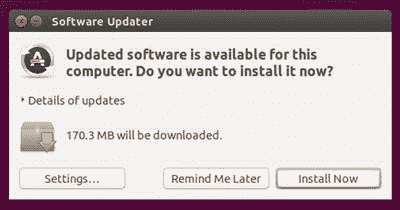

图 4-20。

Ubuntu updates notification dialog

通常这个过程不会给你带来任何问题，但有时也会发生不好的事情。如果你经常调整你的操作系统(通过互联网上的教程)或者使用 PPAs 安装程序，你迟早会遇到这个问题。如果你只使用 Ubuntu 的图形应用程序并遵循既定的做事方式，很少会出现任何问题。当你玩火时，坏事就会发生。如果你被烧伤了，用可用的方法寻求帮助；这通常足以解决任何问题。有时，一些硬件驱动程序的更新，比如显卡，会让你头疼，但这种情况很少见，通常你可以重新安装以前的版本。

一些 LTS 版本有一个。x 后缀，其中 x 是一个数字，例如在 14.04.3 LTS 版本中。这个后缀指的是目前可用的 LTS 支持堆栈。这些支持栈是 Ubuntu 选择在 LTS 版本中为内核和 X windows 系统带来更新的方式。默认情况下，这包含在 LTS 版本的最新 ISO 映像中，但是如果您已经安装了一个，并且想要更新到那个位置，您必须通过 shell 中的命令手动完成。你可以在 [`https://wiki.ubuntu.com/Kernel/LTSEnablementStack`](https://wiki.ubuntu.com/Kernel/LTSEnablementStack) 获得更多关于这个话题的信息。

### 管理应用程序

迟早你会想要安装新的软件或删除你不使用或不喜欢的软件包。为此，Ubuntu 给了你一个非常简单完整的 app，名为 Software，是 Gnome 的官方应用管理工具(图 4-22 )。你可以从中删除或添加任何官方存储库中可用的应用程序，这里有很多。您还可以检查软件包更新，并从那里执行它们。

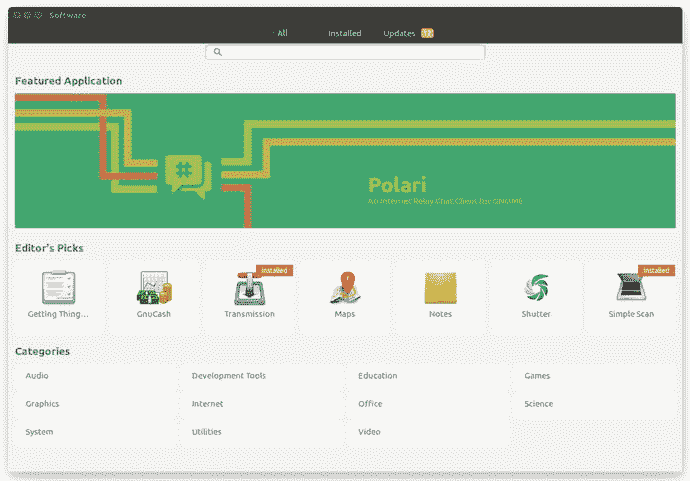

图 4-22。

The Software tool

应用程序按类别(和子类别)组织。如果你点击其中一个，你会看到该应用程序的详细简历，有时甚至会看到截图(见图 4-23 )。安装/拆卸过程非常简单直观。

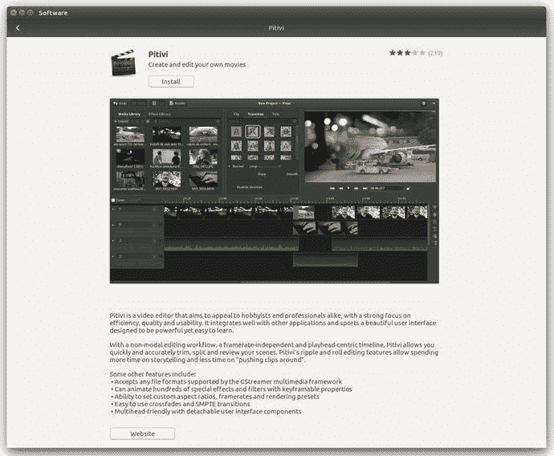

图 4-23。

The Software tool showing information about an application

### 升级

在更新的情况下，当有新版本时，您通常会得到通知。但是，如果你想在有新的 LTS 版本(默认)或者普通版本可用时得到通知，你可以选择系统设置工具的“软件&更新`➤`更新`➤`通知我有新的 Ubuntu 版本”选项。使用的应用程序与更新情况下的相同；您也可以手动调用它。这里的区别在于任务的持续时间，这一点更为关键；如果在此过程中出现问题，您可能很容易导致系统无法使用。如果你对你的系统做了很多调整，并且使用了外部 PPAs，那么升级过程经常会在某个时候失败，你最终会得到一个升级了一半并且通常不可引导的操作系统。喜欢用他们的 Linux 系统做这些事情的爱好者通常会通过只保留他们的数据(或者从备份中恢复)来全新安装新版本。我建议您在将发行版升级到新版本之前备份所有数据。

## 利弊

我将列出一些我个人认为 Ubuntu 发行版的利与弊。当然在这件事上总有讨论的余地，但我会尽我所能做到尽可能客观。

### 赞成的意见

*   Ubuntu 是最容易使用的一个。
*   毫无疑问，它是所有 Linux 发行版中使用和安装最多的。
*   它得到了发行版(和其他发行版)的官方支持，并且有一个非常大的社区愿意帮助你。
*   它有强大的硬件支持。如果一个公司只支持几个发行版，Ubuntu 或 Debian 可能会在其中。
*   至于应用程序，如果它们只支持几个包管理器，很可能 dpkg 将被包括在内。
*   它提供了一个定期发布计划。您总是知道下一个版本什么时候发布，这在安排维护时是一个优势。LTS 版本提供额外的质量和稳定性。
*   你可以在智能手机或平板电脑上使用 Ubuntu，体验几乎和在笔记本电脑或台式机上一样。

### 骗局

*   不是每个人都喜欢团结。但是你可以选择另一种版本的 Ubuntu。
*   Canonical 对 Linux 有着独特的看法。公司已经按自己的方式行事，某些人不喜欢这样。
*   有时，Canonical 会在正常版本中引入一些不成熟或考虑不周的变更。为了避免这种情况，你可以使用 LTS 版本，但是你失去了新的创新。
*   如果你喜欢一个只有自由软件的完全免费的 Linux 发行版，Ubuntu 不是你的发行版(但是在文本菜单中有一个选项可以只安装自由软件)。
*   有时发行的商业方面压倒了社区方面，比如与亚马逊的整合。
*   创建一个可以在所有类型的设备上使用的 Linux 发行版的大目标意味着对桌面和其他领域的关注的减少。他们没有为桌面提供最好的发行版，而是在所有场景下都提供一个普通的发行版。
*   Ubuntu 充分利用了 Debian 发行版的工作，但是它并没有回馈太多；Linux 内核也是如此。

## 摘要

我在这里详细分析了最著名的 Linux 发行版 all，Ubuntu，从它的起源和哲学到安装和维护。关于利与弊和决策标准的部分给了你一系列的论据，以一种更客观的方式将这个发行版与其他发行版进行比较。

在下一章，我用 Fedora 做同样的事情。

Footnotes 1

[`http://insights.ubuntu.com/2015/12/22/more-people-use-ubuntu-than-anyone-actually-knows/`](http://insights.ubuntu.com/2015/12/22/more-people-use-ubuntu-than-anyone-actually-knows/)