# 六、Debian

Debian 不仅是最著名、最有魅力、最古老的 Linux 发行版之一，它也是独立的、社区驱动的发行版的完美范例。Linux 用户中有一种说法，“如果所有其他发行版都消失了，我们将永远拥有 Debian。”它是许多系统管理员、开发人员和用户最喜欢的发行版，这不仅仅是因为它的生命周期长；这也是因为 Debian 的社区、理念和管理使它成为一个独特的发行版。它的“系谱树”是所有发行版中最大的一个。Debian 是许多发行版的母体。事实上，目前活跃的、维护的发行版中，几乎有一半是基于 Debian 的，要么是直接的，比如 Ubuntu 或 Knoppix，要么是经过两三代的，比如 elementary OS 或 Mint。

## 历史

因为 Debian 是两个最古老的 Linux 发行版之一，我们可以说 Debian 的历史是 Linux 本身历史的基本部分。让我们把重点放在开头。正如我在第 3 章中所说的，Debian 是作为 SLS 的替代品而诞生的，SLS 是激励伊恩·默多克(当时是普渡大学的一名本科生)做得更好的发行版。他在 1993 年 8 月发布了 Debian 的第一版。他把他当时的女友(后来的妻子，现在的前妻)和他自己的名字组合在一起，创造了这个名字:Deborah + Ian = Debian。

随着 Debian 的诞生，也出现了 Debian 宣言 [<sup>1</sup>](#Fn1) (后来在 1994 年修订)，这是 Debian 应该和想要成为什么样的宣言。尽管它将自由软件命名为一个基本支柱(事实上，Debian 第一年是由 GNU 项目赞助的)和社区的重要性，这些指导方针主要集中在发行版的开发和维护上。

> Debian's design process is open to ensure that the system has the highest quality and reflects the needs of user groups. Debian can develop in a modular way by involving others with extensive abilities and backgrounds. Its components are of high quality, because those who have expertise in a certain field have the opportunity to build or maintain various components in Debian related to this field. Involving others can also ensure that valuable improvement suggestions can be incorporated into the distribution during the development process; Therefore, the distribution is created based on the needs and desires of users rather than those of constructors. Without the direct participation of others, it is difficult for individuals or small groups to predict these needs in advance. Debian Declaration, ian murdock, 1993-1994.

1997 年 6 月，两名 Debian 开发者，Ean Schuessler(最初的想法)和 Bruce Perens(协调其创建)，创建了 Debian Social Contract[<sup>2</sup>](#Fn2)来补充最初的宣言。这份合同提出了 Debian 项目的道德议程，以保持该项目的独立性、自由性、由社区驱动，并处于自由软件的保护伞之下。这些书面保证将塑造发行版的未来，但同时将保留其独特的身份。该合同还包含了 Debian 自由软件指南，它将作为开源定义 [<sup>3</sup>](#Fn3) 的基础。

同样在 1997 年，Bruce Perens 创建了公益软件，作为一个非盈利组织，允许 Debian 项目接受捐赠并支持它。多年以后，它会成为其他自由软件项目的支持者。

## 哲学

没有其他发行版像 Debian(嗯，也许是 Fedora)一样有如此清晰明确的宗旨和理念。最初的 Debian 宣言，Debian 社会契约，Debian 自由软件指导方针，连同 Debian 章程 [<sup>4</sup>](#Fn4) 和 Debian 行为准则 [<sup>5</sup>](#Fn5) ，明确定义了发行版的指导方针。这种对自由软件的道德和伦理的坚定承诺是对其哲学的最好定义，但让我们看看 Debian 社会契约的要点来更好地理解这一点:

> "Social Contract" and Free Software Community 1\. Debian will keep it 100% free. 2\. We will give back to the free software community. We won't hide the problem. We give priority to our users and free software. 5\. Works that do not meet our free software standards [supported; See contract]. Debian social contract, version 1.1, April 2004.

## 发行版选择标准

现在你已经了解了 Debian 的一点历史，让我们看看这个特别的发行版在第 2 章的选择标准上表现如何。

### 目的和环境

Debian 本质上是一个通用的发行版，有一个唯一的版本用于所有目的，因此相同的镜像既可以用于桌面环境，也可以用于服务器环境(等等)。用户负责以这样或那样的方式使用它，并且几乎没有图形化和简单的帮助来做到这一点。然而，有几种方法可以安装它，从 Live CDs 或 DVD 到 netinstall ISOs。此外，您可以选择不同的内核:标准的和官方的 Linux 内核，FreeBSD 内核，以及实验性的和非官方的微内核，来自 GNU 项目的“Hurd”。

### 支持

显然，所有的支持都来自 Debian 社区，像 Fedora 或 Ubuntu 一样，它有多个渠道:

*   Debian 文档: [`www.debian.org/doc/index.en.html`](http://www.debian.org/doc/index.en.html)
    *   Debian 管理员手册: [`www.debian.org/doc/manuals/debian-handbook/`](http://www.debian.org/doc/manuals/debian-handbook/)
    *   Debian 参考: [`www.debian.org/doc/manuals/debian-reference/`](http://www.debian.org/doc/manuals/debian-reference/)
*   Wiki: [`https://wiki.debian.org/FrontPage`](https://wiki.debian.org/FrontPage)
*   邮件列表: [`www.debian.org/MailingLists/index.en.html`](http://www.debian.org/MailingLists/index.en.html)
*   论坛: [`http://forums.debian.net/`](http://forums.debian.net/) 和 [`www.debianhelp.org/`](http://www.debianhelp.org/)
*   问答地点: [`http://ask.debian.net/`](http://ask.debian.net/)
*   IRC: `#debian`在`irc.debian.org`

虽然 Debian 的支持来自社区，但是网站提供了可以提供非官方商业支持的第三方顾问(个人/公司)的链接(见 [`www.debian.org/consultants/index.en.html`](http://www.debian.org/consultants/index.en.html) )。

### 用户友好性

Debian 不是一个特别友好的发行版。您必须了解什么是 Linux 以及如何管理日常管理任务的基础知识。它比 Fedora 或 Ubuntu 更难使用，但没有 Arch 或 Gentoo 那么难。尽管如此，在 Ubuntu 到来之前的很长一段时间里，它一直是许多人的首发发行版，现在仍然是，因为它仍然是最值得推荐的发行版之一。您将在安装过程中看到，尽管安装并不困难，但它为用户提供了更多空间。安装程序没有 Fedora 和 Ubuntu 友好。显然，如果你在所有的桌面系统中使用相同的桌面环境，它会平衡一些东西，但是最终，对事物如何工作的理解是最基本的。你可以在 Android 智能手机上看到同样的现象:有这么多不同的手机，它们之间的差异很小，但人们仍然对一个而不是另一个有强烈的感觉和偏好。

### 稳定性

Debian 对稳定性有一套非常特别的方法。它可以是一个非常稳定的发行版，也可以是一个非常不稳定的最新发行版。为此，它有三个主要分支:稳定、测试和不稳定。

*   稳定:主版本和当前版本。它是最稳定的，只有经过良好测试的软件，而且非常保守(按照常规发行版的标准，软件包可能非常旧，除了 Red Hat/CentOS)。它只接受安全和重大修复。它遵循一个标准的发布模型，周期大约为两年，但这并不是一成不变的；新的主要版本只有在完成后才会发布。稳定版本是通常在服务器和工作站中使用的版本。
    *   OldStable:是以前的稳定版。它被支持到一个新的稳定发布一年后，然后它被存档。
*   测试:它是未来新的稳定版本，在决定需要新版本之前，所有的包、变化和创新都要经过测试。它接收持续的更新，当准备新版本时，它“冻结”，然后只进行错误修复和改进，直到它准备好成为新的稳定版本。
*   不稳定:这里是 Debian 发展的地方；软件包几乎是最新的，它可能非常不稳定。它是为 Debian 开发者和喜欢总是拥有最新技术的人设计的，但是这是有代价的:系统崩溃。您找不到此分支的任何 ISO 映像(与其他分支相反)；您必须将存储库更改为测试安装，然后升级发行版。它是一种滚动发行版，但从技术上讲，它是发行版的开发分支，不像真正的滚动发行版，如 Arch 或 Gentoo，它是主分支。
    *   实验性的:这是一种用于实验性的并且很有可能破坏系统的软件包的暂存区。它是唯一面向不稳定分支的存储库。

自 2014 年以来，Debian 还采用了 Ubuntu LTS 发布系统的衍生版本，用于发行版的稳定版本，其中 LTS 存储库主要用于安全更新。这样，每个稳定版本支持五年。(常规支持只有三年。)

Debian it 的一个奇怪之处在于它使用了基于《玩具总动员》电影中角色的代号。当前的稳定版本被称为 Jessie，测试和未来的稳定版本被称为 Stretch，不稳定版本被称为 Sid(显然这永远不会改变)。你可以在 [`www.debian.org/releases/`](http://www.debian.org/releases/) 了解更多关于 Debian 版本的信息。

### 硬件支持

Debian 在硬件支持方面处于 Fedora 和 Ubuntu 之间，因为虽然 Debian 只支持自由软件，但非自由软件也可以在他们的库中找到，比如网卡和显卡的二进制驱动程序。您还可以在内核中找到私有 blobs。因此，Debian 有相当好的硬件支持。

### 美学

Debian 的美学是你选择的桌面环境的默认；唯一需要注意的是徽标和桌面背景。尽管如此和安装程序，你可能必须定制 DE，以便有一些你喜欢的东西，如果这不是默认的审美。

### 桌面环境

Debian 事实上的标准桌面环境一直是 Gnome，但是其他的可以在 DVD ISO 镜像或者每个 de 替代品的专用 CD 镜像中获得(但不是全部)。目前，这些 DEs 可以直接从 DVD 映像安装(您可以从存储库中选择另一个):

*   gnome 3 版
*   XFCE 你好
*   K 桌面环境
*   肉桂色
*   交配
*   lxd 先生

### 初始化系统

直到 2015 年，init 系统还是传统的 SysV，但是现在它和几乎所有其他发行版一样:systemd。这个决定引起了巨大的争议，它甚至导致了一个新分支的创建，唯一的目的是继续使用旧 SysV init 系统的 Debian 发行版:Devuan [<sup>6</sup>](#Fn6) 。Debian 仍然在他们的存储库中提供 SysV 作为替代，但是安装它并使它工作并不是一件容易或愉快的任务。这需要相当大的努力，尤其是一些设计。

### 包装管理系统

Debian 的包管理系统和 Ubuntu 是一样的，因为 Debian 是它的原创者:dpkg(作为`apt`的基础)。它的存储库拥有任何发行版中最多的包，目前大约有 50，000 个包。

### 体系结构

Debian 是支持大多数硬件架构的发行版，但是有些东西(比如对安全升级的 LTS 支持)只适用于 amd64 和 i386 架构。目前官方支持的架构有 amd64、i386、ARM、i64(英特尔安腾)、MIPS、PowerPC、SPARC、S390 以及这些架构的一些变体。Debian 也非正式地支持其他架构；他们中的一些不是积极开发的，但是你能为那些机器找到图像。因为 Debian 有一个很大的社区，并且专注于自由，所以它有能力维护一些对其他项目来说“不赚钱”的架构。

### 安全性/匿名性

Debian 提供开箱即用的常规安全级别。有一个特殊的安全团队负责寻找和修复其包中的安全漏洞，但发行版本身并没有默认启用任何额外的安全功能。当然，你可以拥有一个非常安全的 Debian 发行版，但是你必须自己加强它。有这样做的指南，但你应该知道你在做什么。在这件事上，Fedora 和 Ubuntu 默认更安全(按此顺序)。你可以在 [`www.debian.org/security/`](http://www.debian.org/security/) 了解更多关于 Debian 安全的知识。

### 原则和道德

尽管 Debian 对软件 Libre 有明确的关注和承诺，但它对非自由软件也有一个务实的看法。正如 Debian Social Contract 中所述，Debian 可用的所有非自由软件都应该在发行版中运行，并且它鼓励这样做。这背后的意图是让那些不认同自由的用户仍然使用 Debian 作为他们的发行版。在这一点上，它的立场比 Fedora 更宽松。尽管非自由软件没有得到官方支持，但它可以从它们的存储库中安装；在 Fedora 中，您必须使用第三方存储库来实现这一点。

Debian 项目及其社区的道德和伦理可以通过“哲学”部分提供的链接进一步研究。

### 现场 CD

i386 和 amd64 架构有专用的实时 ISO 映像。这些仅适用于稳定分支。

### 专业认证

Debian 不提供任何专业认证，但它是 Linux 专业协会在其认证中认可的发行版之一，即众所周知的 LPIC。

## 装置

安装 Debian 并不像人们说的那么难(有个笑话说 Ubuntu 的意思是“我不知道如何安装 Debian”)，但是，正如您将要看到的，这显然比我之前向您展示的安装要困难得多。不要让这吓倒你。任何人都完全可以做到；在过去，几乎每个 Linux 都是以这种方式安装的。

像往常一样，让我们从获取 ISO 映像来进行安装开始。你必须在 [`www.debian.org/distrib/`](http://www.debian.org/distrib/) 进入 Debian 下载页面。你会看到类似图 [6-1](#Fig1) 的东西。


图 6-1。

The downloads page from the Debian project

您可以从几个选项中选择:netinstall 映像(如果您有良好的互联网连接，可以从互联网安装几乎所有的软件包)、实时映像或完整映像。有了完整的映像，您可以下载所有的映像(有一个它们的集合)以便能够离线安装任何包，或者您可以只下载第一个映像来进行基本安装(您可以在以后从存储库中安装任何东西)。如果您想为那些没有互联网连接的地方安装并拥有一个“硬”脱机 CD/DVD 存储库，这是一个有趣的选择。在同一页的下面，Debian 还提供了从第三方购买 DVD/CD 或 Debian 预装电脑的选项。

让我们选择最常见的选项，完整的安装映像，因此单击链接并转到一个新的网页，如图 [6-2](#Fig2) 所示。


图 6-2。

The Debian options to download a complete ISO Image

更多选项可供选择！基本上你可以使用传统的 HTTP/FTP 方式下载图片，使用 Bit Torrent 或 jidgo。不使 Debian 服务器饱和的最佳选择是 Bit Torrent one(特别是当新版本发布时)或 jidgo(一种从几个同步位置/文件下载文件的工具，一种基于客户机/服务器模型的 Bit Torrent)。让我们选择传统的方式。点击“使用 HTTP 或 FTP 下载 CD/DVD 图像”选项，您将被转到如图 [6-3](#Fig3) 所示的页面。

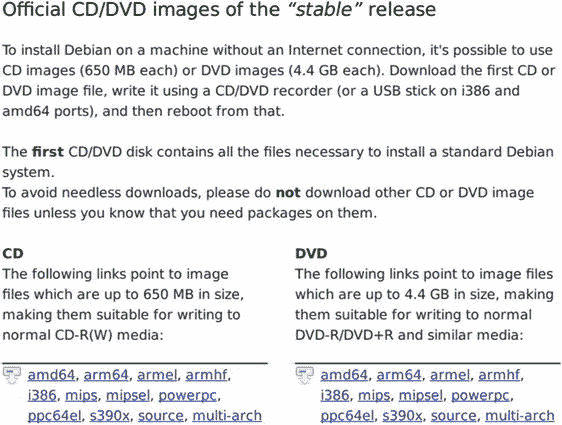

图 6-3。

Debian Stable ISO images

现在您可以选择稳定版本或测试版本。选择稳定的；它有两种格式:CD 和 DVD。这张 CD 目前有八张；DVD 格式的只有三张。获取与您的计算机架构相对应的映像；在我的情况下，我得到了 amd64 版本。点击它，你会进入如图 [6-4](#Fig4) 所示的页面，在这里你可以下载你需要的图片。

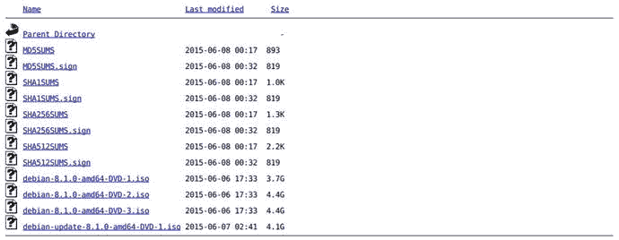

图 6-4。

The Debian DVD images currently available for amd64

选择第一张 DVD(您只需要第一张)后，它会开始下载。完成后，您可以使用该映像首次启动您的计算机(图 [6-5](#Fig5) )。

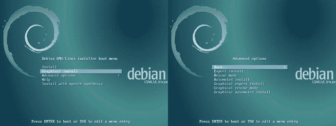

图 6-5。

The first screen of the Debian installation

当你的电脑完全启动后，第一个屏幕你会非常熟悉，因为它和你在 Ubuntu/Fedora 安装中看到的一样。然而，它提供了一些不寻常的选项。有三种安装选项(安装、图形安装和语音合成安装)。此外，高级选项包括专家安装、救援模式、自动安装及其图形版本。在图 [6-5](#Fig5) 中可以看到这两个菜单。开头没有“图形”这个词的选项是文本界面，这对于图形卡的自动检测不能很好工作的系统非常有用，或者对于那些习惯它的人来说是一个更快的选项(这是我更喜欢的一个)。图形化的是最友好的，可以用鼠标。你可以在图 [6-6](#Fig6) 中看到它们之间的区别。因此，选择图形安装选项并开始安装过程。


图 6-6。

Both versions of the installation process: text-based and graphical

第一个屏幕(图 [6-6](#Fig6) )询问您在剩余的过程中想要使用的语言，然后是您的位置和键盘模板，如图 [6-7](#Fig7) 所示。

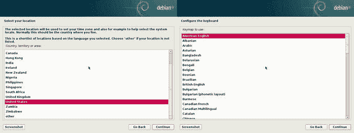

图 6-7。

Location and keyboard selection

接下来，安装程序将向您显示进度条，第一个是检测并安装您的 CD-ROM(或 USB 驱动器上的 ISO 映像)，第二个是从映像加载安装程序的其余组件。第三个将出现以检测和自动配置网络；如果没有，它会提示您输入网络值。

下一个屏幕(图 [6-8](#Fig8) )是关于您的系统的主机名；默认情况下，它建议使用“debian ”(我把它留下了),但是你可以选择任何你想要的。接下来，它会询问一个域名，但是你可以把它留为空白，就像我在图 [6-9](#Fig9) 中所做的那样。


图 6-9。

The domain value


图 6-8。

The hostname value

现在你要为 root 用户设置密码(图 [6-10](#Fig10) )。记住我在前一章给你的建议，在这里选择一个强的，或者留空来禁用这个用户，像在 Ubuntu 中一样使用你的普通用户和命令“sudo ”;这取决于你。我在这里设置了一个，因为旧习惯很难改变，但后一个选项完全没问题(有些人更喜欢它，因为坏人必须猜测两件事，用户名和密码，以远程攻击系统)。


图 6-10。

The root password

在接下来的三个屏幕中(图 [6-11](#Fig11) 到 [6-13](#Fig13) ，您将填写您的全名、用户名和密码。选择一个好的、强的密码，特别是如果您将根密码留空并且您将使用`sudo`。


图 6-13。

The user password


图 6-12。

The user name for the account


图 6-11。

The full name of the user

下面的步骤是配置时区(图[6-14](#Fig14))；如果您的国家只有一个区域，将跳过这一步。

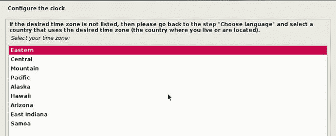

图 6-14。

Configuration of the time zone

现在您开始安装的困难部分:使用分区管理器。在它检测到你的磁盘后，你会看到一个类似图 [6-15](#Fig15) 的屏幕。


图 6-15。

Selecting the partition method

我将展示一个与之前不同的场景。让我们想象一个非常常见的情况:一个台式机系统有两个硬盘，一个 SDD (250GB)和一个硬盘(2TB)。为了充分利用这两种驱动器，您可能希望将系统和配置文件放在 SSD 上以获得良好的总体性能，将个人文件和数据放在 HDD 上以获得良好的存储容量。为此，您必须选择菜单上的手动选项。

图 [6-16](#Fig16) 中的屏幕是你应该在我提出的场景中找到的。你可以看到两个圆盘。您可以通过容量和两者都没有任何分区来区分它们。好好看看他们。事实上，我建议你把这些信息写在纸上，因为你以后会用到。现在你必须做隔板。我会告诉你如何制作其中一个，你可以想出如何制作其余的。

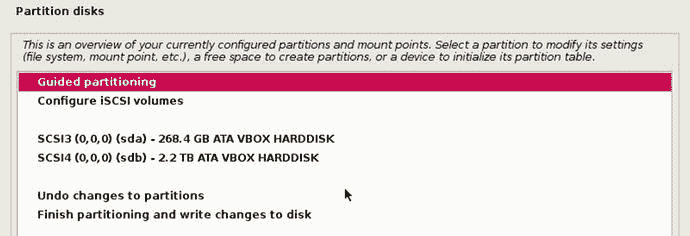

图 6-16。

The initial partition screen

在我看来，这是安装程序中最薄弱的部分，因为它没有那么直观，新手很难理解这部分的界面是如何工作的。我会告诉你最简单的方法。

让我们从 SDD 的第一部分开始。为此，请单击磁盘的描述。您将看到一个类似于图 [6-17](#Fig17) 的屏幕。它要求确认在磁盘上创建一个新的空分区表。在这种情况下，我们假设两个磁盘都是新的，所以说是。


图 6-17。

New empty partition confirmation

在图 [6-18](#Fig18) 中，你可以看到 SSD 磁盘是如何拥有一个新的空分区表的。您还可以看到，您在上级菜单中有新的选项。为了简化，我将避免任何 LVM、RAID 或加密设置。因此，要创建您的第一个新分区，请单击分区表。

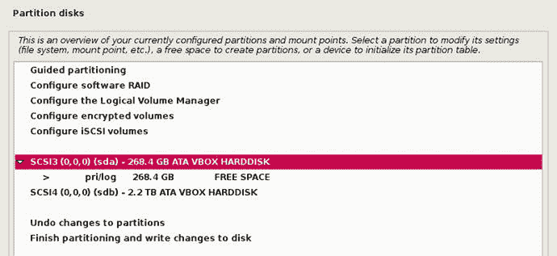

图 6-18。

A new partition table is created

出现另一个屏幕(图 [6-19](#Fig19) )。选择“创建新分区”菜单项。


图 6-19。

Choosing the action on the free disk space

您将要创建的第一个分区是大小为 500MB 的引导分区(图 [6-20](#Fig20) )。


图 6-20。

Size of the partition

接下来，你必须设置分区的类型(图 [6-21](#Fig21) )，在这种情况下是主分区，然后你必须说出你想要分配分区的位置，在空闲可用空间的开始或结束(图 [6-22](#Fig22) )。显然你想在一开始就分配这个分区(实际上，作为一个 SSD，这并不像硬盘那样重要，但这是常态)。


图 6-22。

Where the partition is allocated


图 6-21。

Selecting the partition type

出现的屏幕将显示该分区的默认设置(图 [6-23](#Fig23) )。每一个都可以定制；在这种情况下，让我们保留默认设置，除了您设置为`/boot`的挂载点和您需要激活的可引导标志。在其余的分区中，您只需要为交换分区设置挂载点和文件系统(作为“swap”而不是“Ext4”)。在大多数情况下，您可以安全地忽略其余的参数。您可能希望更改文件系统和典型用途，例如存储大文件(如视频)，或者更改装载选项以建立磁盘配额。

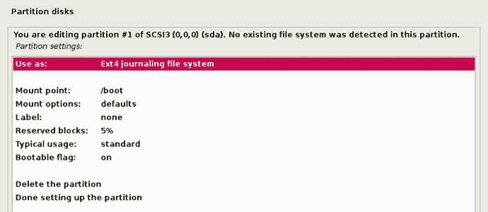

图 6-23。

Partition settings

如你所见，这种方法比 Fedora 和 Ubuntu 的图形安装程序稍微不太友好，但也没有传言中说的那么难。实际上，与之前的两个发行版相比，安装它并不困难。维护是与 Fedora 相比有些变化的地方，而与 Ubuntu 相比变化很大。

一旦您设置了分区设置，您就可以看到分区表是如何变化的(图 [6-24](#Fig24) )。这里显示了所有重要的参数:数量、类型、大小、引导标志、格式标志、文件系统和挂载点。您可以看到创建新分区后剩余的可用空间量。


图 6-24。

A new partition is created

您可以用同样的方式创建剩余的分区，以实现图 [6-25](#Fig25) 所示的目标。最后，您应该有以下分区/挂载点:

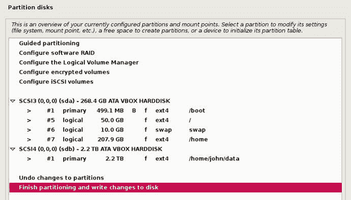

图 6-25。

The final partition settings for both disks

*   `/boot`:存储引导系统所需文件的分区。它是唯一一个启动标志“B”被激活的。
*   `/`:根分区，存储系统文件。它位于 SSD 中，以提高读/写操作的性能。
*   这个分区的大小取决于你的内存大小；现在，一个好的选择是让它几乎和你的 RAM 内存一样大(允许系统暂停到磁盘或休眠)。有人认为把这个分区放在 SSD 硬盘上是个馊主意；好了，它们容易磨损的日子已经过去了，当你有足够的内存时，这个分区通常只用来存放你休眠时 RAM 的内容。所以把这个分区定位在这里不成问题。
*   `/home`:你的配置文件将被存储在哪里。默认情况下，这个分区也应该用来存储您的数据文件，那么为什么不在 HHD 中创建这个分区呢？出于同样的原因，您在硬盘中创建了数据分区，以实现速度和大存储容量之间的平衡。您希望有一个大空间来存储您的文件(尤其是多媒体文件，如您的图片或视频)，但同时您希望您的程序能够快速启动并具有良好的性能。你的程序的二进制文件将在`/`分区中，但是这些程序的配置文件默认存储在`/home`分区的根文件夹中。所以，不管你的程序启动得多快，如果它必须等待读取硬盘中的配置文件，那就有问题了。您应该只存储这些文件和您希望加速的文件，因为您经常使用它们，例如工作文件，如电子表格等。
*   这是你应该存放所有大文件以及不经常使用的文件的地方。它的缺点是性能较差，但容量很大。注意，我对挂载点使用了下面的方案，`/home/youruser/data`，其中 john 是我之前创建的用户。通常这将被挂载为类似于`/media/data`或`/run/media/youruser/data`的东西，但是我使用这个小技巧来避免稍后使用进入`/home`目录的符号链接，并使它对不习惯使用挂载/可移动设备的用户来说显得更自然，所以它将像另一个附加文件夹一样出现在你的`home`目录中。所有这些方法都有一些不便/烦恼，我稍后会向您展示；我还将向您展示如何轻松地修复它们。

最后，在您创建了所有这些分区之后，安装程序将通过向您显示它们的摘要来要求您确认将这些更改写入您的磁盘(图 [6-26](#Fig26) )。如果一切正常，您可以继续安装。

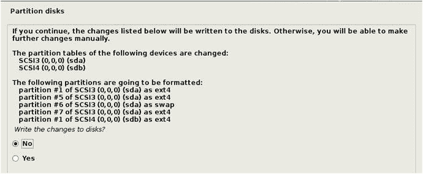

图 6-26。

Disk changes confirmation screen

安装程序将创建分区，格式化它们，然后开始安装基本系统。这需要一些时间(图 [6-27](#Fig27) )。


图 6-27。

Installing the base system

过一会儿，你可以选择扫描更多的 CD/DVD(图片),如果你已经下载了的话。当没有可用的互联网连接时，这非常有用。在这种情况下，选择否选项并继续(图 [6-28](#Fig28) )。


图 6-28。

Optional scanning of another CD/DVD

您下载的映像包含安装整个系统所需的所有软件包，但是如果您想要使用网络镜像(图 [6-29](#Fig29) )，您可以从可用的最新版本中获益，并在下次更新时节省时间(此外，从您第一次启动新操作系统的那一刻起，您将拥有最新的安全更新)。选择是选项。然后，您必须配置一些设置来允许此功能。


图 6-29。

Deciding to use a network mirror

你需要选择镜像服务器所在的国家(图 [6-30](#Fig30) )，实际镜像服务器(图 [6-31](#Fig31) )，以及你是否要使用网络代理(图 [6-32](#Fig32) )。


图 6-32。

Configuring an HTTP Proxy


图 6-31。

Choosing an archive mirror


图 6-30。

Choosing a mirror country

下一步(图 [6-33](#Fig33) )询问您是否想要从将要安装在您系统上的软件包中发送信息(匿名)。这由您决定，但是能够收集数据来进行使用统计对 Debian 非常有帮助。


图 6-33。

Participating in the package usage survey

现在，您必须选择想要安装的预定义软件集合(图 [6-34](#Fig34) )。这里你主要看到 Debian 支持的桌面环境和其他一些东西，但是如果你扫描了另一张 CD/DVD，你会看到更多的收藏。尽管 Debian 的实际版本是 Gnome，但我想选择一个你在其他发行版中不会看到的版本:LXDE。所以选择它，并让其他选项默认选中。如果您选择 SSH 服务器，您最好知道如何保护它，因为它是 Linux 系统中最常见的攻击媒介之一。

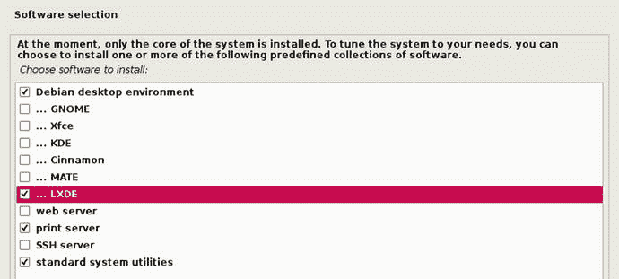

图 6-34。

Selecting the software to install

一旦您选择了软件，安装过程中最长的步骤(图 [6-35](#Fig35) )就开始了，即将软件包安装(和下载)到您的 SSD 驱动器。


图 6-35。

Installing the software

最后，您必须决定(图 [6-36](#Fig36) )是否在您的硬盘上安装引导加载程序(这里是 Grub)来管理系统的引导。在这种情况下，选择是并继续。


图 6-36。

Deciding to install Grub

最后要做的决定是你想在哪个磁盘上安装 Grub(图 [6-37](#Fig37) )。您必须将它安装在具有可引导分区的驱动器上(在本例中为(/ `boot`)，这就是 SSD。我之前告诉过你要记下磁盘的引用(sda 和 sdb ),因为这对以后会有帮助；嗯，那是现在。您可以看到，标识两个驱动器的唯一参考是 UUID(通用唯一标识符)和设备路径(例如`/dev/sda`)。你可以根据订单来判断，但是确定一下总是更好，不是吗？嗯，你的固态硬盘是`/dev/sda`设备，所以选择它并继续。


图 6-37。

Choosing the disk upon which to install Grub

就这样！你的 Debian OS 已经安装好了(图 [6-38](#Fig38) )。没那么难，对吧？您现在必须重新启动系统。


图 6-38。

The installation is finished .

当你第一次启动你的系统时，你看到的第一个屏幕是你已经熟悉的 Grub 屏幕，你在 Fedora 安装中看到的(图 [6-39](#Fig39) )。按回车键或等待启动你的新 Debian 操作系统。

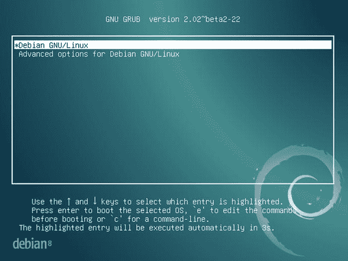

图 6-39。

First boot screen

图 [6-40](#Fig40) 显示了登录到您的会话的登录管理器。介绍您的用户名和密码，然后按登录按钮。

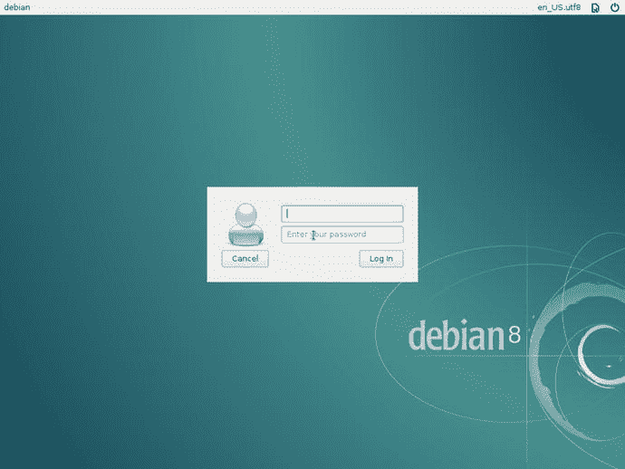

图 6-40。

First login in Debian

您现在已经登录到 LXDE 桌面环境。你在屏幕中间首先看到的是一个弹出对话框(图 [6-41](#Fig41) ),它给出了关于 ClipIt 和以纯文本格式保存信息的安全风险的建议。这取决于你；我都不用 ClipIt，所以不建议激活。(我用的是没有历史的剪贴板，里面只有当前的数据。)

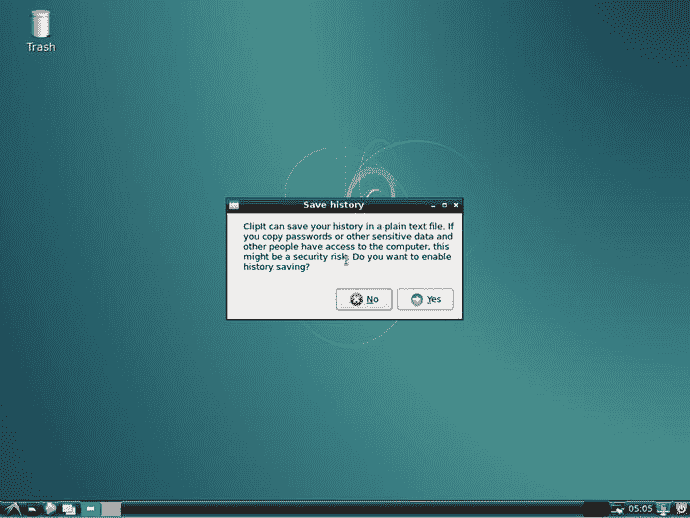

图 6-41。

First screen of LXDE

我之前告诉过你挂载数据分区会有一点不便/烦恼，就是这样。该分区是使用 root 用户权限创建的，不允许在其中写入任何内容(因此您必须创建一个新文件，如图 [6-42](#Fig42) 所示)。但是这很容易解决。

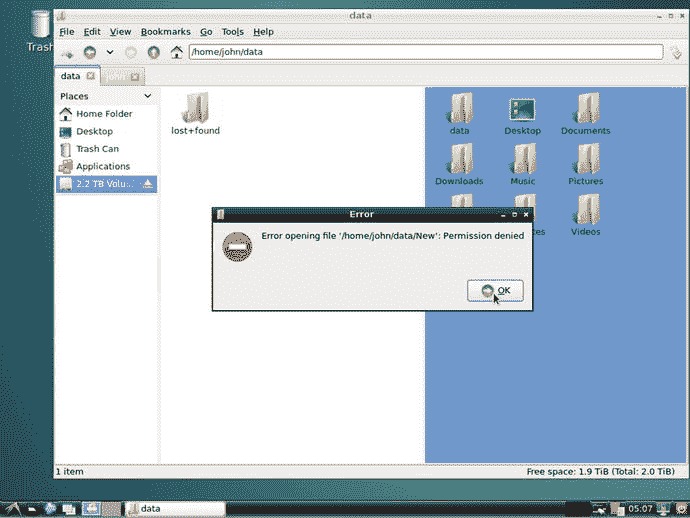

图 6-42。

Wrong permissions in data partition

您必须将挂载分区的权限更改为您创建的用户。你可以在图 [6-43](#Fig43) 中看到如何做到这一点，但我在这里更容易阅读的地方重复一遍。


图 6-43。

Permissions in data partition fixed

如果您为 root 用户提供了密码，您必须这样做:

```sh
$ su root
Password:                      # enter the root password
# chown john /home/john/data/  # user your username instead of john
# rm lost+found/ -r            # delete the lost+found folder
# exit                         # never let the root user log in
$

```

如果您将 root 密码留空，您必须使用`sudo`命令:

```sh
$ sudo chown john /home/john/data/  # user your username instead of john
Password:                           # enter your user password
$ sudo rm lost+found/ -r            # delete the lost+found folder
$

```

就这样！你的新 Linux Debian 操作系统已经可以使用了！好好享受吧！

您可以在 [`www.debian.org/releases/stable/amd64/index.html.en.`](http://www.debian.org/releases/stable/amd64/index.html.en) 阅读安装指南

## 保持

同样，三个基本任务是更新、安装/删除应用程序和升级。像 Fedora 一样，无论你喜欢与否，你都必须与命令行打交道，并且熟悉完成这项工作的基本应用程序。

### 管理应用程序

要安装/删除应用程序，你可以使用一个图形应用程序，就像 Ubuntu/Fedora 一样，比如 Synaptic。但是几乎每个 Debian 用户都使用命令行来做这件事。你可以使用典型的`apt`工具，也可以使用更友好的`aptitude`。例如，如果你想安装一个应用程序(比如 gnome-chess)，你应该使用这个命令:

```sh
# aptitude install gnome-chess

```

要删除它:

```sh
# aptitude remove gnome-chess

```

就这么简单，你对自己所做的事情有一个比图形应用程序更好的控制水平(从这样一个简单的例子中很难看出，但这是事实)。

### 更新

包更新过程也是如此:没有简单的方法。你可以使用 Synaptic，但是最好的方法是使用`aptitude`。为此，您只需键入以下内容:

```sh
# aptitude update

```

就这样！

Note

请注意，您用来安装发行版的 DVD 仍然被认为是软件包的来源，所以无论何时您使用任何 package 命令，Debian 都会首先在 DVD 中搜索软件包。如果你有网络连接，你不希望这种情况发生。您总是想要最新的软件包，因此您必须修复这种行为。同样，Debian 并没有提供一个简单的方法来做到这一点(嗯，这并不完全正确；您可以用 Synaptic 应用程序以图形化的方式做到这一点)，因此您必须编辑一个纯文本配置文件。这里我使用 LXDE 附带的图形文本编辑器(我会使用 Vi(m)或 Emacs，但那是另一回事)来编辑文件:

```sh
# leafpad /etc/apt/sources.list   # open the file with Leafpad

```

现在，您必须在文件的开头找到类似以下内容的两行:

```sh
# deb cd rom:
deb cd rom:

```

您唯一需要做的就是像第一行一样，在第二行前面加上“#”字符进行注释。保存文件，关闭 Leafpad，就这样。

### 升级

要升级发行版，您必须更新当前安装的软件包。你也应该首先备份你的数据，因为这是一个关键的过程。让我们看看它是如何做到的:

```sh
# apt-get update         # update the current packates using apt tools
# apt-get upgrade        # a first minimal upgrade to avoid conflicts later
# apt-get dist-upgrade   # the full upgrade of the distribution

```

这在桌面安装和大多数情况下已经足够了。如果这是一台服务器或另一台关键的机器，你应该采取额外的步骤，但那是另一本书的故事。

## 利弊

以下是我个人认为 Debian 发行版的一些优点和缺点。当然，在这件事上总有讨论的余地，但我已经尽了最大努力做到尽可能客观。

### 赞成的意见

*   《Debian 宣言》、《Debian 社会契约》、《Debian 章程》,加上它的长寿和庞大的社区，保证了 Debian 将在我们中间存在很长很长一段时间。
*   稳定分支的稳定性是所有 Linux 发行版中最好的之一；总是有点过时但是稳如磐石。
*   虽然 Debian 背后没有公司，但它的社区是最友好的，最愿意帮助用户的，所以你会得到很好的支持。
*   其社区的规模。
*   大量可用的软件包。
*   它使用了一个扩展最多、最好的包管理器:dpkg。
*   这是一个原始发行版，而不是一个衍生物。
*   它被许多专业人士和组织广泛采用。
*   它支持许多架构，甚至各种内核。

### 骗局

*   稳定分支没有固定的发布周期，所以下一次发布可能要等很长时间。
*   美学和设计在这个发行版中被大大忽略了。
*   它没有官方的商业支持。
*   您必须知道如何使用终端来执行管理任务。
*   安装程序是不友好和过时的。
*   它不是最容易管理和配置的发行版。你必须过多地使用终端。它是为高级用户或愿意学习的人准备的。
*   稳定分支即使发布了也有过时的包。

## 摘要

通过对 Debian 的分析，你有了 Linux 发行版的第三个例子。正如你所看到的，Debian 与 Fedora 和 Ubuntu 有许多共同点，但也有明显的差异，使 Debian 与众不同。

关于 openSUSE 的下一章将向您介绍在 Linux 中做事情的另一种方式。

Footnotes [1](#Fn1_source)

[T2`www.debian.org/doc/manuals/project-history/ap-manifesto.en.html`](http://www.debian.org/doc/manuals/project-history/ap-manifesto.en.html)

  [2](#Fn2_source)

[T2`www.debian.org/social_contract.en.html`](http://www.debian.org/social_contract.en.html)

  [3](#Fn3_source)

[T2`http://opensource.org/docs/osd`](http://opensource.org/docs/osd)

  [4](#Fn4_source)

[T2`www.debian.org/devel/constitution.en.html`](http://www.debian.org/devel/constitution.en.html)

  [5](#Fn5_source)

[T2`www.debian.org/code_of_conduct.en.html`](http://www.debian.org/code_of_conduct.en.html)

  [6](#Fn6_source)

[T2`https://devuan.org/`](https://devuan.org/)