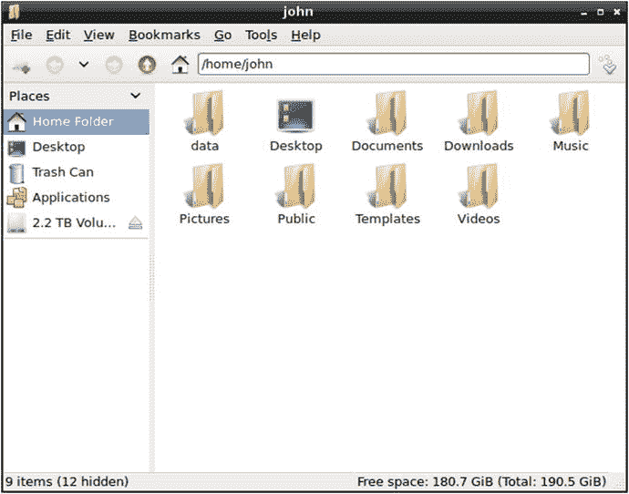
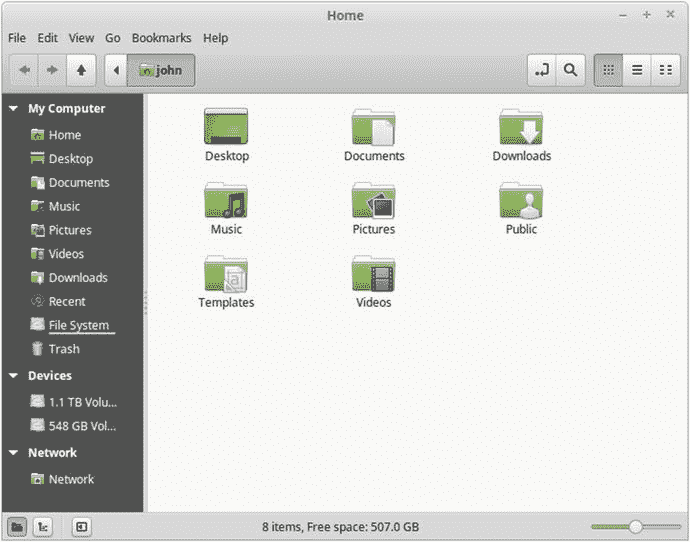
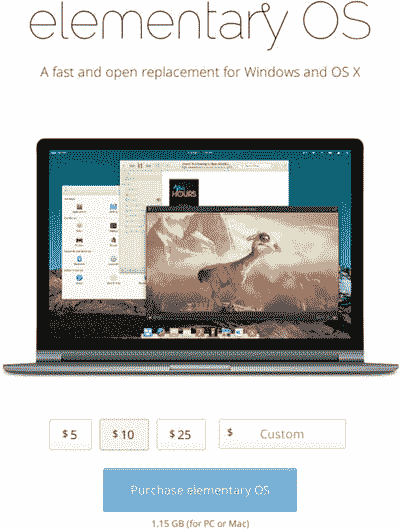
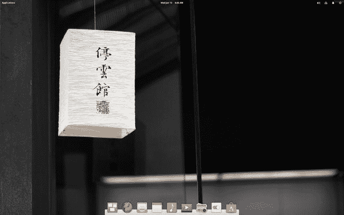

# 十、ElementaryOS

elementary OS 是我在本书中分析的最新发行版。它只有五年的历史，至今只发布了三个主要版本。它也有一个不寻常的起源，背后是一个非常小的社区，它是 Ubuntu 的衍生品。尽管有这些不利因素，elementary OS 已经成为一个非常受欢迎的发行版，也是新一代 Linux 发行版(以及 Solus、Cub、deepin 和其他发行版)的最知名代表，这些发行版希望在 Linux 中建立一个新的友好和设计水平，就像 Ubuntu 多年前所做的那样。

这些发行版并不假装是万能的发行版。相反，elementary OS 和其他操作系统侧重于具有简单需求的用户，如浏览网络和管理一些文档、视频和照片。极简主义、伟大的设计和易用性是新一代 Linux 发行版的支柱。(是的，如果你想知道，“初级”总是以小写字母“e”开头，即使是在句子的开头。)

## 历史

一开始，elementary OS 不是 Linux 发行版。事实上，它甚至不是一个软件项目，而是一个设计项目。elementary OS 最初是一个 Gnome 2 图标集，然后是一个 Gnome 主题，旨在与 Ubuntu 一起使用。丹尼尔·佛雷在 2009 年创作了它，这个主题很快变得非常流行。由于这个恶名，Foré甚至以设计师的身份在 Canonical(Ubuntu 背后的公司)工作了将近两年。在离开 Ubuntu 之前，他开始了一个新项目，这个项目可以实现他对 Linux 发行版(实际上是一个操作系统)应该是什么样的愿景:初级项目。

这个基础项目最初是作为一个理想桌面环境的模型/概念开始的。然后一些开发人员开发了一些东西，像修改过的 Nautilus(Gnome 2 文件管理器)，以及 Dexter 和 Postler(分别是联系人管理器和电子邮件客户端)。然后他们构建了自己的桌面环境 Pantheon，最后是自己的发行版 elementary OS。

基于 Ubuntu 10.10 的 elementary OS 的第一个版本是 2011 年 3 月的 Jupiter。露娜于 2013 年 8 月上映，芙蕾雅于 2015 年 4 月上映。木星发布了定制的 Gnome 桌面；Luna 是第一个以 Pantheon 为桌面环境的版本。

## 哲学

基本的操作系统理念包含在它自己的名字中。简单、容易、极简、美丽、基本和不复杂是定义这个项目的目标和愿景的词语。开发人员表示，他们希望成为 MS Windows 和 OS X 的美丽而直观的替代品。更现实的描述是，他们是 Chrome OS 或其他将 Android 引入 PC 的项目(如 Remix OS)的替代品。简而言之，如果你曾经认为平板电脑可以满足你的所有需求，并且你想放弃笔记本电脑/台式机而选择平板电脑，这是一个很好的线索，告诉你可以从初级操作系统中得到什么(我不是说初级操作系统可以在平板电脑上工作，因为它不能；我说的是你希望在平板电脑上执行的任务)。当然，作为一个 Linux 发行版，你可以超越基本的功能，但代价是打破所有应用程序的简单性/设计一致性。

为了保持设计的一致性，开发者使用 Ubuntu 作为基础，然后添加他们自己的桌面环境和一些简约的应用程序来满足一大群用户的简单需求。开箱即用的应用程序包括邮件客户端、日历、多媒体管理(照片、音乐和视频)、文本编辑器、浏览互联网的方式和一些系统管理应用程序(文件、终端和设置)。基本上，他们用一个非常简单友好的替代品取代了通常的 DE 和 apps。同样，类似的选择是 Chrome OS，它使用云和更简单的 Google apps 来完成任务；然而，初级操作系统使用传统的本地存储和本地应用程序方法。

我认为初级操作系统在未来可能会提供非常有趣的东西，即使它只是作为其他项目的灵感。但是，与此同时，它也有一些障碍需要克服。在我看来，它只能向一个方向发展，即增加更多内置应用，因为根据它自己的定义，如果它在现有的基础上增加更多功能，它将打破自己的原则。

## 发行版选择标准

让我们看看这个特别的发行版在第二章的决策点上表现如何。

### 目的和环境

初级操作系统只专注于桌面；它只有桌面版。

### 支持

初级操作系统背后的社区非常小。目前约有 30 名正规开发者。所以你不能期望得到和大公司或社区发行版一样的支持。然而，初级操作系统从各种来源获得了相当好的支持:

*   文档: [`https://elementary.io/docs/`](https://elementary.io/docs/)
*   问答: [`https://elementaryos.stackexchange.com/`](https://elementaryos.stackexchange.com/)
*   论坛:[`https://elementaryforums.com/index.php`](https://elementaryforums.com/index.php)
*   IRC: `#elementary`上 [`irc.freenode.net`下](https://irc.freenode.net)

### 用户友好性

在这个主题上，初级操作系统项目的意图是非常清楚的。我们开发初级操作系统的主要动机一直是尽可能打造绝对最佳的计算体验。—丹尼尔·福尔，2014 年 1 月接受 LME Linux 采访

他们成功了吗？嗯，很多人觉得 elementary OS 是最好的 Linux 发行版；其他人认为它正在走向伟大；还有一些人认为这仅仅是 OS X 的拙劣翻版；还有一些人认为有比设计和简单更重要的东西。我将计算机用户分为两大类:内容创造者和内容消费者。对于第一组人来说，显然初级操作系统没什么可提供的，即使他们中的一些人非常喜欢它的设计和视觉。大多数初级操作系统爱好者属于第二类，他们中的许多人只需要内置的应用程序就可以满足他们的所有需求，而其他人只需要再安装几个。

正是在这最后一点上，初级操作系统的主要弱点出现了。如果您只需要使用内置的应用程序，那么您就有了一个易于安装的操作系统，它可以满足您的需要。这是非常基本和友好的。但一旦你安装了更多的应用，你可能会保持万神殿的主题，但除此之外，一致性就没有了。由于与桌面环境的不良集成，您甚至可能会遇到一些基本问题。事实上，我在 Blender 这样的应用程序和另一个 KDE 应用程序中看到了这一点。

但是 elementary OS 是一个非常友好的 Linux 发行版吗？当然，如果你按计划使用它，并且你不需要更多的东西。现实情况是，在这样一个小项目中很难获得一致性，因为开放和自由软件的本质以及缺乏设计、GUI 开发和用户体验的通用指南。即使对于大型的 Linux 发行版来说也很困难。事实上，即使是封闭生态系统的苹果公司，也存在第三方应用程序不遵守他们的指导方针的问题。同样，Android 在应用程序设计者少量采用材料设计方面也存在同样的问题。

话虽如此，一小群人如何在如此少的资源下实现如此高水平的易用性和卓越性是非常了不起的。想象一下他们可以用像 Canonical 这样的公司的资源做什么。

### 稳定性

在第二个版本 Luna 之后，elementary OS 转而基于 Ubuntu 的 LTS 版本。因此，它遵循一个常规的发布方案，但不是一个严格的时间表；新版本在准备好的时候就会出现。版本号方案以 0.1 开始，每个主要版本将在该数字上再加 0.1，如下所示:

*   0.1 Jupiter，基于 Ubuntu 10.10
*   0.2 Luna，基于 LTS Ubuntu 12.04
*   0.3 芙蕾雅，基于 LTS 的 Ubuntu 14.04

0.4 Loki(基于 Ubuntu 16.04 LTS)有望成为下一个基础 OS 版本。芙蕾雅的两个次要版本 3.1 和 3.2 修复了一些错误，并引入了新功能和更新。

所以，因为它是基于 LTS 版本的 Ubuntu，elementary OS 应该有点过时，但却坚如磐石，对吗？实际上，由于 elementary OS 背后的小团队，总会有一些小错误和小故障，这使得发行版有时有点不稳定，有时甚至有点烦人。

### 硬件支持

硬件支持本质上和它现在使用的 Ubuntu 版本是一样的，所以这是很好的支持。

### 美学

由于这个项目的目标是极简和美丽的设计，每一个小东西的审美都得到了很好的打磨。使用他们自己的内置应用程序有助于确保整个环境的设计一致性(但如果您安装了第三方应用程序，则不会如此)。当你启动发行版时，你会注意到简洁的设计。

一些批评者说，elementary OS 仅仅是 OS X 设计的翻版，其灵感是不可否认的。调色板、图标外观和 dock 都参考了 OS X(图 [10-1](#Fig1) )。但这并不是什么新鲜事；有很多主题、图标和发行版想要复制其他操作系统的外观和感觉，比如 OS X 和 Windows。事实上，你可以调整几乎任何发行版的桌面环境，直到你看起来像那些操作系统中的一个。无论如何，你都不能否认为了获得专业级的设计而在发行版中付出的努力，以及为了获得有凝聚力的设计而开发新应用的进一步步骤。

图 10-1。

The elementary OS dock (Plank)

初级的 OS 设计是不是最好的，最美的？好吧，我不想在这里介绍一个观点。我想向您展示一个基本工具——文件管理器——的设计在不同发行版之间是如何变化的。你可以自己判断设计对你有多重要，哪些发行版最吸引眼球。要做到这一点，看看三个处理美学的发行版(图 [10-2](#Fig2) 、 [10-3](#Fig3) 和 [10-4](#Fig4) )和另一个不处理美学的发行版(图 [10-5](#Fig5) )。你可以看到他们中的一些人如何投射阴影，而另一些人却没有；这是一个桌面环境特性，但也是一个设计决策。很明显，除了味道之外，前三个比最后一个设计得更好。但是前三者之间，哪一个最好呢？挺主观的。

图 10-5。

The Debian file manager on a LXDE DE

图 10-4。

The Linux Mint file manager on a Cinnamon DE

图 10-3。

The Ubuntu file manager on a Unity DE

图 10-2。

The elementary OS file manager on a Pantheon DE

### 桌面环境

初级操作系统使用自己的桌面环境 Pantheon。它使用 GTK 3 工具包(最初来自 Gnome ),用 Vala 和 c 编程。虽然这个 DE 是由初级操作系统团队开发的，但你可以在其他发行版上非正式地安装它，如 Arch Linux 或 Ubuntu。

### 初始化系统

因为 elementary OS 基于 Ubuntu，所以它使用相同的 init 系统，但是因为当前的芙蕾雅版本基于旧的 Ubuntu 版本 14.04，所以它仍然使用 sysv init 系统。这将在下一个版本 Loki 后改变，该版本将基于 Ubuntu 16.04 LTS，因此将使用 systemd。

### 包装管理系统

因为它是基于 Ubuntu 的，elementary OS 不仅使用相同的包管理系统，还使用 Ubuntu 库和软件管理应用程序。事实上，elementary OS 的软件是通过托管在 Launchpad(来自 Canonical)的 PPAs(个人包存档)获得和更新的。

### 体系结构

基本操作系统仅支持英特尔和 AMD 32/64 位架构。

### 安全性/匿名性

安全性方面，elementary OS 基于 Ubuntu，应该和 Ubuntu 持平。至于匿名，elementary OS 项目声称，它不做广告交易，也不收集任何敏感的个人数据。

### 原则和道德

此外，原则和伦理与 Ubuntu 相似，因为 elementary OS 使用 Ubuntu 的存储库。

### 现场 CD

初级操作系统的 ISO 映像也可以作为实况 DVD。

### 专业认证

很明显，像这样非常小的项目，是没有专业认证可用的。

## 装置

安装 elementary OS 非常容易，因为它是基于 Ubuntu 的，所以像 Mint 一样，它使用相同的安装程序。因为我已经详细介绍了 Ubuntu 和 Mint 的安装，请参考那些章节。在这里，我将只提及您将遇到的主要差异。

和往常一样，你应该去初级操作系统网站 [`https://elementary.io`](https://elementary.io/) 下载 ISO 镜像。在图 [10-6](#Fig6) 中，可以看到好像要付费才能下载；事实上，按钮上写着“购买初级操作系统”这仅仅是建议你捐款来支持这个项目的一种方式，但是你可以输入 0 美元来下载它。这在当时是一个有争议的步骤，但现实是 Ubuntu 在没有太多噪音的情况下做了类似的事情。因此，选择一个预定义的数量或引入一个自定义数量，然后单击“购买初级操作系统”按钮。下一个窗口要求您选择想要下载的版本，32 位或 64 位(图 [10-7](#Fig7) )。我推荐选择 64 位版本。

图 10-7。

Choosing the elementary OS version to download

图 10-6。

The elementary OS site where you can download the OS

然后你必须安装发行版，它和 Ubuntu 一模一样，但是是灰色的。当你第一次启动系统，并登录后，你会看到如图 [10-8](#Fig8) 所示的桌面。这些是您在安装初级操作系统时会遇到的唯一不同之处。

图 10-8。

The elementary OS desktop

您可以在 [`https://elementary.io/docs/installation`](https://elementary.io/docs/installation) 了解更多关于基础操作系统安装的信息。

## 保持

出于显而易见的原因，维护初级操作系统类似于维护 Ubuntu。

### 更新和管理应用程序

目前，初级操作系统使用与软件中心 Ubuntu 相同的应用程序来执行更新任务。一个用于相同目的的新应用程序 AppCenter 正在开发中，它可能会成为下一个版本 0.4 Loki 的默认应用程序。

### 升级

没有预定义或简单的方法来升级基本操作系统。甚至开发者也建议你进行全新安装。

## 利弊

以下是我个人认为基本操作系统发行版的一些优点和缺点。这件事总有讨论的余地，但我会尽最大努力做到尽可能客观。

### 赞成的意见

*   这是最容易使用的方法之一。
*   它有一个精致，现代，一致的设计。
*   因为 Ubuntu 是它的基础系统，所以你可以从它的优势中获益。
*   内置的应用程序简单、直观、轻便、快速。
*   适合要求不高或者有计算机经验的用户。
*   对于来自其他操作系统的用户来说，这是一个良好的开端。

### 骗局

*   从技术上来说，它是一个不同的桌面环境和其他默认应用程序的 Ubuntu。
*   由于背后的小团队，每次新版本发布时发现几个错误并不罕见，这些错误通常通过小更新解决。
*   内置的应用程序过于简单，无法执行任何半专业的任务。
*   你不能指望第三方应用程序有同样的纯粹设计和简单性。

## 摘要

在这一章中，你看到了 Linux 发行版中的一个新范例，这个发行版可能对那些用眼睛选择的人和那些想要简单东西的人有吸引力。初级操作系统基本上都是关于设计和简单性。你不会因为技术实力而选择这个发行版。它涵盖了一个利基市场，基于它的受欢迎程度，它似乎做得相当好。

在下一章，我将讨论另一个发行版，它涵盖了另一个领域，高级用户和想要一个非常可定制的系统的用户:Arch Linux。