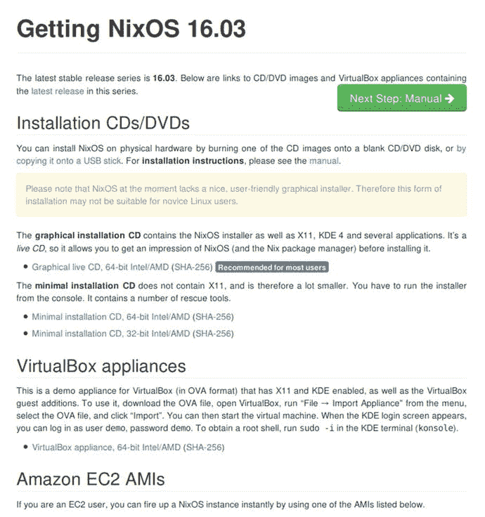
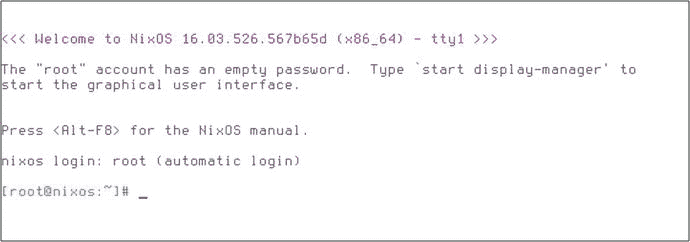
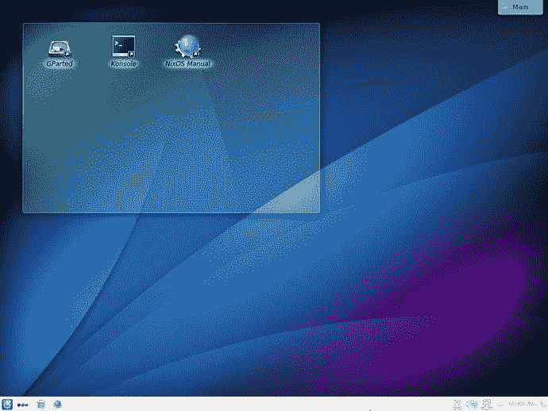
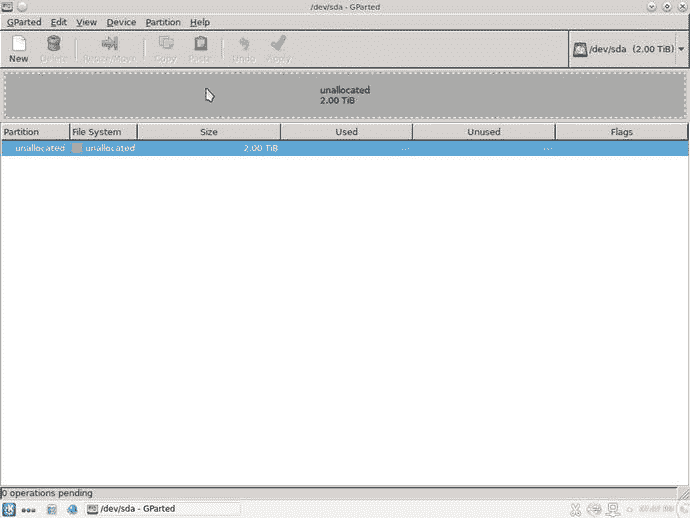
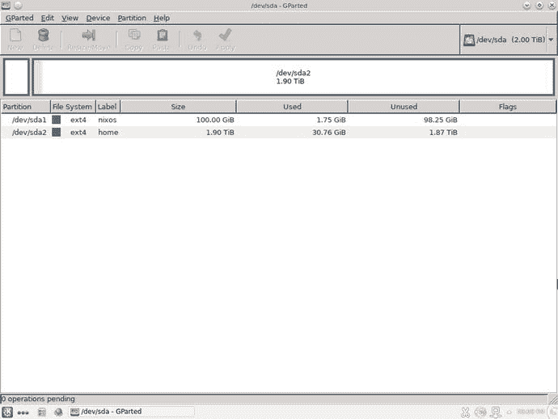
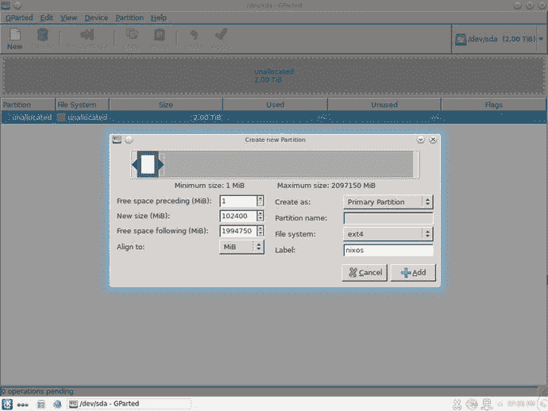
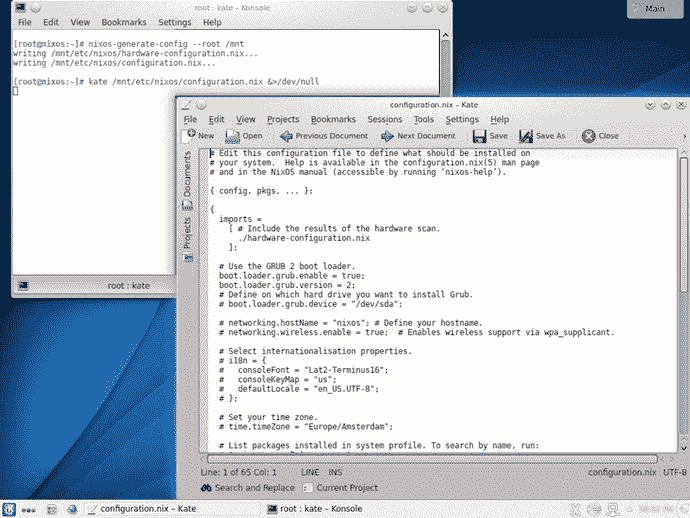
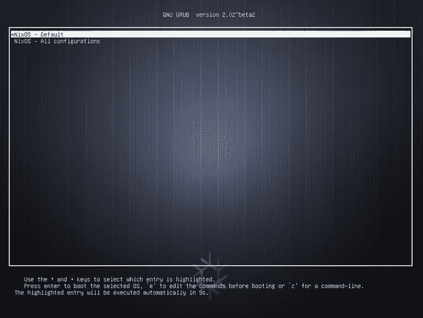
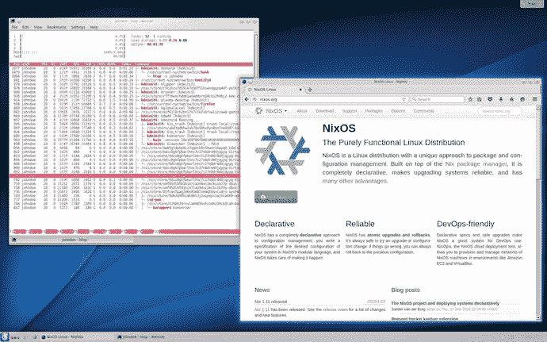
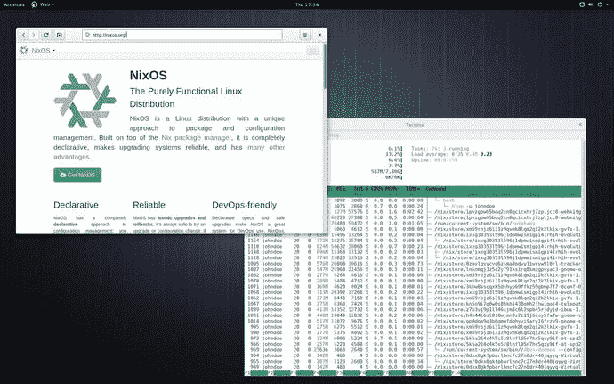

# 十四、NixOS 操作系统

NixOS 是一个非常不同的 Linux 发行版，与你现在所看到的不同。事实上，这是最先进的发行方式，领先于一切。它仍然不成熟，它还在继续发展，它仍然有它的怪癖，没有人能说它最前沿的技术是否会被采用作为 Linux 的未来。还有一些其他的提议(如 GuixSD、GoboLinux 和 Qubes)也试图有所作为，探索新的领域。我包括 NixOS，因为它有非常有趣的概念。它已经被大约 5000 名专业人员采用，作为他们的日常工作发行版；但是，在和别人比较的时候，给它一个宽。

## 历史

2003 年，Eelco Dolstra 是乌得勒支大学的一名荷兰学生，他在 TraCE(透明配置环境)项目上进行合作，这是他博士研究的一部分。他开始开发 Nix 包管理器，这后来成为他博士论文 [<sup>1</sup>](#Fn1) 的核心，也是 NixOS 发行版本身的核心。在同一个 TraCE 项目下，另一个合作者和学生 Armijn Hemel 后来开发了 NixOS 的第一个原型，基于 Nix 包管理器的 Linux 发行版，作为他硕士论文[T5 2T7】的一部分。](#Fn2)

因此，Nix 是作为学术研究的一部分而创建的，而 NixOS 是作为 Nix 可以用来管理整个 Linux 发行版的概念证明而创建的。Dolstra 还将开发其他工具，如 Hydra，这是一个基于 Nix 的持续集成工具，以及 NixOps，这是一个用于供应和部署 NixOS 机器的工具。

2015 年，作为支持 NixOS 发展的战略，基础设施的成本(Hydra 硬件，AWS 成本)和另一个相关项目，创建了 NixOS 基金会。这个基金会主要由个人捐款支持。

今天，一些开发人员、研究人员、用户和专业人员是 NixOS 发行版的一部分，但它正在稳步增长。也许最容易接受的用户是 Haskell(一种纯函数式编程语言)开发人员；他们也喜欢功能驱动的 Linux 发行版的想法。

## 哲学

NixOS 是围绕其包管理器 Nix 构建的发行版，它是如何实现纯功能软件部署模型的概念证明。这是什么意思？解释它的最好方式是使用作者自己的话:

> Existing packages and system configuration management tools are influenced by imperative model, in which system management actions such as package upgrade or changes to system configuration files are stateful: they destructively update the state of the system. This will lead to many problems, such as the inability to roll back changes easily, the inability to deploy multiple versions of packages in parallel, the inability to replicate the configuration definitively on another machine, or the inability to upgrade the system reliably. In this paper, we show that we can overcome these problems by moving to a purely functional system configuration model. This means that all static parts of the system (such as software packages, configuration files and system startup scripts) are built by pure functions and immutable, and are stored in a way similar to the heap in pure function language. We have implemented this model in NixOS, an important Linux distribution, which uses Nix package manager to build the whole system configuration from a modular and purely functional specification. —Eelco Dolstra, Andres Loh and Nicolas Pierron, "NixOS: A Linux distribution with pure functions", Cambridge University Press, 2010.

因此，NixOS 的理念是证明这个目标是可以实现的，成为 Nix 开发和概念的活实验室。Nix 带来的一系列优势也定义了这种分布，并使其独一无二；这将在“包管理系统”一节中进一步解释。

## 发行版选择标准

现在你已经了解了一些历史，让我们看看 NixOS 在第 [2](02.html) 章列出的选择标准上表现如何。

### 目的和环境

NixOS 是一个通用版本，适用于所有环境。这个版本有两个分支，“稳定”和“不稳定”，后者用于开发。还有针对虚拟化/云环境的 ISO 映像，特别是针对 VirtualBox 和 Amazon EC2。

### 支持

尽管 NixOS 的社区非常小，但您可以通过多种渠道获得支持:

*   NixOS 文件: [`http://nixos.org/nixos/manual`](http://nixos.org/nixos/manual)
*   Nix 文档: [`http://nixos.org/nix/manual`](http://nixos.org/nix/manual)
*   Wiki: [`https://nixos.org/wiki`](https://nixos.org/wiki)
*   邮件列表: [`http://lists.science.uu.nl/mailman/listinfo/nix-dev`](http://lists.science.uu.nl/mailman/listinfo/nix-dev)
*   IRC: `#nixos` at [`irc.freenode.net`](https://irc.freenode.net)

关于 NixOS 发行版的一点是高级 Linux 用户和专业开发人员的比例比其他发行版社区高得多，主要是因为这些人通常是新技术的早期采用者，就像这个发行版中提供的一样。由于发行版的不成熟，最好的帮助应该来自邮件列表和 IRC 文档和 wiki 中并没有涵盖所有内容，也没有更新所有内容。

### 用户友好性

NixOS 不是一个用户友好的发行版；您必须知道如何处理命令行及其软件包管理器的特性，并且您必须学习如何编写声明性配置文件来安装它。事实上，许多新用户通过复制和修改另一个用户的另一个配置文件开始使用这个发行版。我将更进一步:我认为它甚至不是一个对高级 Linux 用户友好的发行版，因为他们必须改变他们对 Linux 的看法，并学习如何遵循 NixOS 指南。

### 稳定性

NixOS 到底稳定不稳定？这个问题很难回答。一方面，它是一个不成熟的、仍在发展的发行版，有一些缺陷，一个小社区远远没有达到必要的临界质量，这意味着主要开发人员承担了太多的工作。另一方面，它是一个允许多种配置、多种包版本和回滚能力的发行版，所以如果更新或设置出现问题，您总是可以回到更安全和稳定的先前配置。此外，您只能在您的用户环境中更新或安装软件包，而不会影响全局环境(由 root 管理)。因此，除了不可避免的错误和一些不便之处，您有很大的灵活性来实现一个非常稳定的系统。最后，你甚至可以在稳定分支和不稳定分支之间选择。

NixOS 遵循一个标准的发布模型，新版本通常在经过测试并且足够稳定时出现，没有固定的时间表。然而，现在的目标是遵循一个更类似于 Ubuntu 的发布模式:每六个月发布一个新版本。目前，NixOS 已经发布了五个稳定的版本，它们遵循类似于 Ubuntu 的编号方案:year.month codename。上一次发布是 16.03 动车组。

### 硬件支持

NixOS 提供硬件检测。它支持内核支持的硬件，它支持一些无线网卡，你可以用 CUPS 做打印机，但是其他的东西可能不支持。NixOS 相对较新，还在开发中，而且它的社区很小(安装基数也很小)，所以当涉及到某些硬件支持时，用户需要自己保护自己。

### 美学

考虑到围绕这个发行版的社区的规模及其空白的本质，除了 Grub、桌面管理器和桌面环境中常见的徽标和背景之外，没有努力关注发行版的美学是可以理解的。

### 桌面环境

像 Arch 或 Gentoo 一样，当涉及到桌面环境时，您有很多选择。你可以选择传统的桌面环境，如 KDE、Gnome 或 Xfce，或者窗口管理器，如 Awesome、Xmonad、i3、IceWM 等。默认的“官方”版本是 KDE，因为和 Nix 一样，它是跨平台的。

### 初始化系统

NixOS 从 2014 年 12 月开始使用 systemd 作为它的 init 系统。此前，它使用的是 System V。

### 包装管理系统

在像这样的发行版中，它只是作为包管理器的试验场而构建的，一切都以 Nix 开始和结束。而 Nix 是一个非常特殊的包管理器，是一个非常独特的概念。外面没有类似的东西(最接近的一个，GNU Guix，其实是基于 Nix 的)。Nix 引入的新范式有许多优点，但也有一些缺点，所以你必须改变对一些事情的思考方式，否则你会多次碰壁，最终会感到沮丧。

首先，在 NixOS 中，一切都由 Nix 管理:内核、系统包、用户包、系统范围的配置文件等等。Nix 使用一种专为它设计的懒惰的纯函数式语言，这种语言基于定义系统构建方式的配置文件以声明方式使用。无论您使用相同的配置构建系统多少次，您总是获得相同的系统状态。

NixOS 在 Nix 存储(`/nix/store/`)中使用一个加密散列(从用于构建它的输入中获得)作为存储路径和内部引用中使用的唯一标识符来存储每个与其他包隔离的包。用于构建包的 Nix 表达式中的每次变化都会生成另一个散列，因此存储在另一个不同的路径中；这允许同一个包的不同发布和定制版本共存。包/服务的配置文件也是如此，因此您可以在同一台机器上同时保存几个系统配置或状态。

Nix 存储库称为通道，它们包含构建包的方法，称为 nix 表达式(通常是一个. nix 文件、一些脚本和一些辅助文件)和二进制文件(然而，一些包是从源代码构建的)。Nixpkgs 本质上是一个 git 存储库，包含了构建所有官方包的所有 nix 表达式。通道中的预构建包是由 Hydra 生成的，Hydra 是一个基于 Nix 的连续构建系统，当一个包的新版本可用时，它会构建、测试它，如果通过，就发布它。(实际上，并不完全是这样，因为所有的新软件包都必须通过测试才能发布新的渠道版本)。有一个机器场来托管这项服务。官方渠道通常是 Nixpkgs git 存储库的一个标签或分支。稳定通道称为 Nixpkgs 头后几周)，不稳定通道称为 nixos-不稳定(延迟几天)。您可以订阅想要使用的频道。

由于这种包/系统管理模型，Nix 为 NixOS 提供了一系列优于普通 Linux 发行版的优势:

*   可靠的升级:虽然配置保持不变，但您可以安全地升级您的系统，以始终获得相同的结果，就像是全新安装一样。
*   原子升级:配置中的更改是以事务的方式进行的，因此它们是原子的，并且只有当事务完成时，更改才会被应用。例如，如果升级中断或失败，以前的状态将继续工作。如果您在系统上保留一个有效的配置(比如初始配置)，您的系统将总是能够启动。
*   回滚:您可以随时返回(回滚)到以前的状态，进行全局配置更改或本地用户更改，安装/删除软件包，等等。这是可能的，因为新的配置不会覆盖以前的配置。事实上，您可以在引导系统时从 Grub 菜单中选择想要使用的配置(当然，您也可以在不引导的情况下这样做)。因为配置同时保存在磁盘上，所以这几乎是瞬间完成的，不需要从磁盘上恢复任何东西或者覆盖任何东西。粗略的比较是，它们作为快照而不是备份工作(实际上，它们使用符号链接)。
*   安全地测试更改:由于回滚功能和同步配置，NixOS 允许您测试(作为一个选项)一个配置，如果不起作用，它不会使它成为默认配置。更好的是，NixOS 有一个选项，允许您在一个虚拟机上测试这个配置，该虚拟机作为一个沙箱工作，包含您以前的系统状态和您想要测试的新更改。这个过程非常高效(它使用 QEMU，但是不在磁盘映像中克隆您当前的系统)。唯一的缺点是，您的数据(您的主分区)不在这个 VM 中。这也有助于您避免在 Grub 条目中进行大量微小的修改。
*   可复制的系统配置:您可以从一台类似的机器上复制一个配置，并获得相同的系统(显然，除了用户数据和类似`/var`内容的“可变状态”)。这对于在生产机器上应用更改之前在测试机器上进行更改或者对于部署来说是非常理想的(事实上，有一个专用工具 NixOps 可以用 NixOS 来做这件事)。
*   具有源代码和二进制文件的混合模型:默认情况下，Nix 从源代码构建包，但是由于编译是一个缓慢的过程，所以当预构建的二进制文件可用时，可以从缓存服务器(其 URL 包含在通道中)下载它们。在稳定分支中，这让您只构建几个包，因此升级或安装系统已经足够快了。但是在当前的分支中，包是最近的包，经常你必须构建太多的包。
*   一致性:当一个包或配置发生变化时，所有必需的包或依赖项也会被重新构建。内核和模块也是如此(这不是什么新鲜事；你可以在 DKMS 的其他发行版中使用它)。此外，当一个库被更新时，所有使用它的包都被链接到新版本。
*   多用户包管理:在 NixOS 中，所有用户都可以使用 root 用户安装的包，但是每个用户也可以在自己的配置文件中安装自己的包。这些包仍然在 Nix store 中存储和管理，不同的用户可以拥有同一个包的不同版本。尽管如此，如果两个用户安装了同一个软件包的同一个版本，只有一个副本被存储并在他们之间共享。此外，还有一些安全措施来避免潜在的漏洞，比如不允许使用`setuid`二进制文件。

但是 Nix 模型也带来了一些缺点和不足。其中一些与用户适应 NixOS 的意愿有关，这是一个重要的问题。

*   Unix FHS(文件系统层次标准)被破坏。像`/bin`、`/sbin`、`/lib`、`/usr,`或`/opt`这样的目录要么不存在，要么只包含到`/nix/store`目录的某个点的链接(只读的)。这使得一些管理任务和问题解决变得更加复杂；你必须依赖 Nix。此外，因为它破坏了与标准 FHS 的兼容性，所以不可能安装任何直接从源代码编译的包(例如用`$ make install`)；你必须先“消除”它。平时也没那么难，就是有点不方便。
*   破碎的 FHS 有恼人的副作用。应用程序希望在通常的地方找到它们的依赖关系。那些依赖于定义环境的路径变量或者有自己的包管理器的，比如 Python、Ruby 等编程语言。对此有问题。wiki 上有很多由包维护者创造的技巧和变通方法，但是增加了出错的空间。还可以使用 nix-shell，这是一个用于构建沙盒环境的工具。随着发行版基数的增长，这种情况会更频繁地发生，为了让这个发行版被更多的人采用，这是一个需要解决的关键挑战。您可以通过每个项目隔离虚拟机或容器，或者处理不同的 NixOS 配置来避免这些问题，但最终您还必须在其他情况下解决这些问题。例如，我尝试使用我的 Emacs 配置。大部分都能工作，但是需要编译一些扩展才能工作，这不是一个有趣的经历。
*   散列使得可读性变得困难。在`/nix`目录层次结构中的每个包/文件名的开头使用散列使得查找/排序您的搜索更加困难。例如，您可以在 nix store 中的`/nix/store/5rnfzla9kcx4mj5zdc7nlnv8na1navg-firefox-3.5.4`存放一个 Firefox 包。幸运的是，您仍然可以使用`whereis, which`和`locate`命令找到许多东西。但是你只需要运行一个`printenv`命令来查看环境变量就又开始头疼了。
*   潜在的大量磁盘使用。拥有许多不同版本的软件包和许多不同的配置的缺点是所使用的磁盘空间的成本，这可能是相当大的，特别是如果系统上有多个用户具有非常不同的配置文件。由于回滚功能，删除或废弃的软件包不会从磁盘上物理删除。您仍然可以手动执行 Nix 的垃圾收集器，或者通过 systemd 服务定期删除旧的、未被引用的包。你也可以选择使用 Nix 优化，对相同的文件使用硬链接；这样节省了很多空间。
*   更改后的包在可用之前可能会有很长的延迟。构建包的 Hydra farm 只在重建完全完成时更新一个通道(所有需要重建的包)。当一个变更影响到许多包时(比如一个安全包或者一个重要的库，比如 gcc ),这个重建可能需要几天时间。随着时间的推移，这个问题会变得越来越严重。当然，如果您有资源，没有什么可以阻止您创建自己的 Hydra 设置来为您构建软件包。
*   软件包基础仍然落后于另一个发行版。Nixpkgs 目前有大约 30，000 个可用的包，而其他发行版的库中有大约 50，000 个包。这意味着如果你想使用其中的一些包，你必须为它们制作一个 Nix 配方。好消息是，您可以将该方法提交到 Nixpkgs GitHub 库，并很容易地提供给社区的其他人，从而帮助维护发行版。

总之，如果你能够对所有事情都采用 Nix 的做事方式，你就可以避免前面提到的许多问题，并且可以安全地使用它来完成一些任务。我仍然对 NixOS 作为多用途桌面甚至服务器发行版抱有严重的怀疑。这可能是构建一个具有可靠配置的最小服务器的好方法，但是一旦出现问题，调试这台机器将会很不愉快。不管怎样，我不得不说，我希望看到这个发行版成熟，以便看到它将实现什么。最终，我希望看到所有的包都适应 NixOS 的工作方式，为此，管理一台机器就像编程它的状态一样。在理想情况下，NixOS 范式(或类似的具有相同优势的东西)将是当前许多问题的完美解决方案，这些问题通常用许多变通方法都无法很好地解决。

### 体系结构

目前，NixOS 仅支持英特尔/AMD 32/64 位架构。也有非官方的港口武装。

### 安全性/匿名性

由于这个发行版的特殊性质，和 Arch 或 Gentoo 一样，安全性和匿名性在很大程度上依赖于用户。有一些选项可以帮助强化 NixOS，比如使用 grsecurity 内核或 AppArmor，但它们目前非常不稳定，或者太依赖于用户如何配置它们。例如，我在我的 Arch 安装中默认使用 grsecurity 内核，你可以毫无困难地用 Gentoo 做同样的事情，但是如果你现在用 NixOS 尝试，许多包将不能工作，例如一些浏览器。

### 原则和道德

关于原则和道德，没有什么明确的说法。发行版包含了一些专有软件，比如二进制 blobs 和驱动程序，没有什么可以阻止你从一个专有软件创建(“nixifying”)你自己的二进制包。否则，您必须在配置中明确设置要使用“非自由”软件包，以便能够使用可用的软件包(例如 Nvidia 驱动程序、Adobe Flash)。

### 现场 CD

NixOS 有一张 KDE 的 Live CD，让你对 NixOS 有一个大概的了解。您也可以使用它来安装发行版。

### 专业认证

显然，没有专业认证涵盖这种分布。

## 装置

安装这个发行版是一种独特的体验，维护它也是如此。对于那些刚接触 DevOps 工具的人来说，使用 Ansible、Puppet、Salt 或 vagger 这样的工具来定义没有映像的最终状态，而不是从以前的 VM/Docker Linux 映像中定义最终状态，就像是在没有映像的情况下定义最终状态。因此，你不再需要依赖先前的图像来创造你想要的东西；您从一开始就直接创建了您想要的系统，即使在升级后也是如此。这种操作更加自然，因为您不必依赖不可变的映像(在 DevOps 中，如果您更改您的基本映像，您通常必须更改操作)，因为您是在理想的最终状态下创建映像本身。现在想象一下这与像 NixOS 这样的 DevOps 工具相结合的可能性。对此半信半疑；这是一种过于简化和粗略的近似。

第一步是访问 NixOS 网站，在 [`http://nixos.org/nixos/download.html`](http://nixos.org/nixos/download.html) 获取 ISO 映像。你可以在图 [14-1](#Fig1) 中看到这个网页。要下载的 ISO 映像有两种格式:最小化和图形化。你也有 VirtualBox 和 Amazon EC2 的图片。对于大多数用户来说，显而易见的选择是图形化的 Live CD(请注意，它仅适用于 64 位架构)。两者之间的主要区别在于，在图形映像中，您可以使用图形工具来完成安装，如分区工具或文本编辑器，而在最小的映像中，您必须使用命令行工具。但是我认为考虑到这个发行版的性质和要执行的操作，无论如何你都需要使用终端；如果您对此感到满意，您应该更喜欢最小安装光盘(您仍然可以选择图形光盘，只需不启动 windows 会话)。因此，请单击图形 live CD 选项下载它。



图 14-1。

The downloads section of the NixOS web site

请注意，我使用的是传统的带有 2TB 硬盘的 BIOS 系统。我使用 ISO 镜像来引导系统，所以第一个屏幕是典型的如图 [14-2](#Fig2) 所示。通常第一种选择应该在大多数系统中起作用；如果您的显卡有问题，请选择第二个。完成引导后，你在终端根提示符下结束，如图 [14-3](#Fig3) 所示。



图 14-3。

The NixOS root console that you get at the end of the boot up


图 14-2。

The first screen after booting up from the NixOS ISO image

为了启动图形化会话，您必须输入一个命令，但是正如我前面说过的，如果您对使用命令行没问题，您可以从这里继续安装并使用终端工具。第八个控制台总是提供帮助，如图 [14-4](#Fig4) 所示，它通过`w3m`文本浏览器在网络上使用相同的 HTML 手册。我通常以这种方式安装它，但是让我们试试另一种方式:通过键入`# start display-manager`命令启动图形会话。


图 14-4。

The NixOS manual on the terminal

KDE 会议开始；在桌面上的一个文件夹中有三个安装发行版所需的必备工具:一个分区工具(GParted)，一个终端(Konsole)和 NixOS 手册(见图 [14-5](#Fig5) )。



图 14-5。

The default KDE session of the NixOS Live CD

让我们假设网络被很好地检测到并且运行良好。你需要做的第一件事是对磁盘进行分区，为此，使用 GParted 工具(如图 [14-6](#Fig6) 所示)和一个非常简单的分区方案，只有`/`和`/home`分区。您可以通过选择设备➤创建分区表菜单项来开始创建分区表。默认情况下应选择一个`msdos`类型，否则，如图 [14-7](#Fig7) 所示选择并点击应用(忽略警告；在我的情况下，磁盘是空的)。


图 14-7。

Creating the partition table on the disk



图 14-6。

The GParted tool to partition the disk

通过单击新建图标创建您的第一个分区。创建一个 ext4 100GiB 分区，标签为 nixos(如图 [14-8](#Fig8) )。对于系统文件来说，这似乎是一个非常大的分区，但是在 NixOS 中，您可以存储相同包的几个配置和几个版本，根据包的不同，这可能会占用大量的磁盘空间。在这样的发行版中，在分区上贴标签的想法非常有用，如果设备改变了，可以通过标签重新应用配置。您也可以使用 UUID，但这种方式更容易(在硬件配置文件中，UUID 是在首次自动生成配置文件时通过名称添加到分区中的)。接下来，用磁盘的其余部分以同样的方式创建另一个 ext4 分区，但是使用 home 作为标签。最后，单击应用。你应该有类似于图 [14-9](#Fig9) 所示的分区方案。



图 14-9。

The final partition scheme



图 14-8。

Creation of the first partition

下一步是安装分区。为此，请打开 Konsole 终端并输入以下命令。在图 [14-10](#Fig10) 中，注意分区标签和 UUIDs。


图 14-10。

Mounting the partitions

```sh
# lsblk -pf
# mount /dev/disk/by-label/nixos /mnt
# mkdir /mnt/home
# mount /dev/disk/by-label/home /mnt/home

```

现在您必须生成 NixOS 的初始配置文件，然后编辑它以满足您的需要。配置文件将在路径`/mnt/etc/nixos/configurations.nix`中生成，您将使用图形编辑器 Kate 对其进行编辑。如图 [14-11](#Fig11) 所示。



图 14-11。

Generating the configuration and opening it in Kate

```sh
# nixos-generate-config --root /mnt
# kate /mnt/etc/nixos/configuration.nix &>/dev/null

```

让我们花点时间补充一下。我将告诉您安装 NixOS 并让一个非常简单的系统运行的最简单的方法，例如，非常类似于您在安装 Arch、Gentoo 或 Slackware 时得到的方法。您唯一需要做的事情非常简单:首先，编辑配置文件，取消包含选项`boot.loader.grub.device`的行的注释，并执行命令# `nixos-install`。系统将自动安装。最后，它会要求你输入根用户的密码，你只需要重启系统就可以得到一个最低功能的 NixOS 系统。这个过程需要一段时间，因为必须下载和编译某些包(如果你选择不稳定版本，那么很多包将从源代码编译)。然而，这样做意味着您需要创建一个用户，并配置时区、网络设置等。安装完成后。更糟糕的是，之后你必须安装你想要的软件包，就像其他发行版一样。这是对这种分布优势的浪费。例如，请记住，您可以以全局方式安装软件包，以便所有用户都可以使用它们，和/或为每个用户单独安装软件包。一些软件包，如桌面环境或窗口管理器，如果你直接从配置中自动安装它们，应该很容易。

我强烈建议您阅读该手册(通过桌面图标访问，该图标指向位于 [`http://nixos.org/nixos/manual/index.html`](http://nixos.org/nixos/manual/index.html) `)`的 web 手册的本地版本)，以便对您能做什么和如何做有一个更全面的印象。另外，我强烈建议您在 [`http://nixos.org/nixos/options.html`](http://nixos.org/nixos/options.html) 查看不同的配置选项。

让我们开始编辑初始文件，以获得最小配置:

```sh
# kate /mnt/etc/nixos/configuration.nix &> /dev/null

```

编辑后的文件内容应该如下所示:

```sh
# Edit this configuration file to define what should be installed on
# your system. Help is available in the configuration.nix(5) man page
# and in the NixOS manual (accessible by running 'nixos-help').

{ config, pkgs, ... }:

{
  imports =
    [ # Include the results of the hardware scan.
      ./hardware-configuration.nix
    ];

  # Use the GRUB 2 boot loader.
  boot.loader.grub.enable = true;
  boot.loader.grub.version = 2;
  # Define on which hard drive you want to install Grub.
  boot.loader.grub.device = "/dev/sda";

  networking.hostName = "nixos"; # Define your hostname.
  # networking.wireless.enable = true;  # Enables wireless support via wpa_supplicant.

  # Select internationalisation properties.
  i18n = {
     consoleFont = "Lat2-Terminus16";
     consoleKeyMap = "us";
     defaultLocale = "en_US.UTF-8";
  };

  # Set your time zone.
  time.timeZone = "America/New_York";

  # List packages installed in system profile. To search by name, run:
  # $ nix-env -qaP | grep wget
  environment.systemPackages = with pkgs; [
     wget
     firefox
     htop
  ];

  # List services that you want to enable:

  # Enable the OpenSSH daemon.
  # services.openssh.enable = true;

  # Enable CUPS to print documents.
  services.printing.enable = true;

  # Enable the X11 windowing system.
  services.xserver.enable = true;
  services.xserver.layout = "us";
  # services.xserver.xkbOptions = "eurosign:e";

  # Enable the KDE Desktop Environment.
  #services.xserver.displayManager.kdm.enable = true;
  services.xserver.desktopManager.kde4.enable = true;

  # Define a user account. Don't forget to set a password with 'passwd'.
  users.extraUsers.johndoe = {
    isNormalUser = true;
    uid = 1000;
    description = "John Doe";
    extraGroups = ["wheel" "audio"];
  };

  # The NixOS release to be compatible with for stateful data such as databases.
  system.stateVersion = "16.03";

}

```

当您准备好配置后，在控制台中引入以下命令来自动安装系统:

```sh
# nixos-install

```

安装完所有软件包后，安装程序会要求您输入根密码，所以请输入一个强密码。程序退出，安装完成。重新引导系统，并为您在配置中指定的用户设置密码，在本例中为 johndoe。为此，nixos-install 程序允许您在新安装的环境中监禁 root 用户(因为显然新用户不存在于 Live CD 环境中)。现在你可以重新启动系统了。

```sh
# nixos-install --chroot
# passwd johndoe
# exit
# reboot

```

当机器重新启动时，您将看到的第一个屏幕是 Grub 菜单(图 [14-12](#Fig12) )。请注意，第二个条目是“NixOS -所有配置”在这里，您应该会看到自动存储的配置(那些您没有手动添加到引导菜单中的配置)。



图 14-12。

The Grub menu of a fresh installation of NixOS

选择第一个条目来首次引导 NixOS。几秒钟后，你会看到 Slim 桌面管理器，这是 NixOS 中默认使用的(见图 [14-13](#Fig13) )。输入您的用户和密码。


图 14-13。

The desktop manager , Slim, is the default one for the NixOS

你又一次进入了 KDE 的环境，就像我在这里展示给你的 Live CD，里面有我告诉你专门安装的应用程序(图 [14-14](#Fig14) )。我担心捕获太小而看不清楚，但是如果可以的话，您会看到`htop`工具中的二进制路径很笨拙，因为它们都在`/nix/store directory`中。无论如何，你可以看到 KDE 桌面管理器和 htop 以及 Firefox 软件包是如何按照配置文件中的设置安装的。一旦你知道如何去做，这是一个强大的配置和安装系统的方法，但是第一次有点尴尬。如果你想做得更详细，你将不得不浏览 nix 手册，甚至邮件列表和 IRC。这在其他高级发行版中并不少见，但是即使是高级用户，如果想继续使用 NixOS，也必须学习很多东西。就这样！您的系统中安装了 NixOS。



图 14-14。

The NixOS KDE with Firefox and htop (inside Konsole) running in the desktop

现在我将向您展示更改您的配置和默认桌面管理器是多么容易。您必须再次编辑现在位于`/etc/nixos/configuration.nix`的配置文件，取消注释该行(删除前面的#) `#services.xserver.displayManager.kdm.enable = true;`，然后在 Konsole 终端中执行以下命令:

```sh
$ sudo nixos-rebuild test

```

如果一切顺利，你可以从 KDE 注销，现在 KDM 将成为你的新桌面管理员，如图 [14-15](#Fig15) 所示。登录。您可以通过运行以下命令将此配置设为默认配置:


图 14-15。

You succesfully changed Slim for KDM by changing a line in the configuration

```sh
$ sudo nixos-rebuild switch

```

但是你做了更大的改动，比如用 GDM 和 Gnome 3 代替 KDM 和 KDE，只对文件做了一些改动；对于其他发行版，这可能是一个大问题。您只需更改配置文件的以下部分:

```sh
# Enable the KDE Desktop Environment.
# services.xserver.displayManager.kdm.enable = true;
services.xserver.displayManager.gdm.enable = true;
# services.xserver.desktopManager.kde4.enable = true;
services.xserver.desktopManager.gnome3.enable = true;

```

执行与之前相同的操作。如果你重启系统，你会看到 GDM 作为你的登录管理器，一个功能齐全的 Gnome 3 作为你的桌面管理器(见图 [14-16](#Fig16) )。



图 14-16。

A Gnome Shell session from changing two lines

我想你可以看到这个发行版有多棒。当然，所有的“可变状态”都是在变化之间保持的；您可以看到您已经在终端中执行的所有操作都出现在历史记录中。

最后，当您重启系统时，如果您选择第二个菜单选项，您将看到类似于图 [14-17](#Fig17) 的内容，其中显示了您所做的所有配置。没有什么可以阻止你在以前的配置中引导，返回到 KDE，并使用`$ sudo nixos-rebuild switch`，使它再次成为你的默认配置。如果您想在配置之间频繁切换，您甚至可以给它们一个名称，并将它们作为新的菜单项添加到主 Grub 菜单中。


图 14-17。

In the Grub menu, you can choose between all of your previous configurations

许多 Linux 用户真的希望在他们当前的发行版中有这样的东西，包括我自己。我期待看到 NixOS 如何发展。

## 保持

这个发行版中的所有维护都与 Nix 相关，你应该使用 Nix 工具来执行任务，以确保它们尽可能顺利地进行。

### 管理应用程序

在 NixOS 中有两种不同的安装/删除应用程序的方式，要么通过配置文件以声明的方式，要么以命令的方式，就像传统的包管理器一样。如果我在管理一个多用户系统，我会使用声明的方式来安装所有用户可用的所有全局包，并且我会让用户以强制的方式安装他们自己的包。在一台单人机器的情况下，我将从配置中安装所有的基础包，并且我将只使用命令行来安装一些包，比如那些我只是暂时需要的包。

在 NixOS 中安装包非常容易。使用这个简单的命令:

```sh
$ nix-env -i firefox

```

要删除它，有两个选项:进行回滚(只有在以后没有其他操作会改变状态时，我才会使用此选项，如修改配置或安装/删除/更新软件包)或删除它。使用此代码:

```sh
# This would remove the package (remember, not phisically from disk)
$ nix-env -e firefox

# This would perform a rollback
$ nix-env rollback

```

### 更新

同样，在 NixOS 中有两种更新包的方法。您可以使用 Nix 的命令式方法更新它们，或者通过重新构建整个系统来使用声明式方法更新它们。使用第一种方法，您甚至可以单独升级软件包。

要以命令的方式更新某些内容，首先您必须更新通道信息(使用`nixos`通道):

```sh
$ nix-channel --update nixos

```

现在是时候更新一个包或者所有可用的更新了。首先，下面是如何更新单个软件包:

```sh
$ nix-env -u firefox

```

要更新有新版本可用的所有软件包，请使用以下代码:

```sh
$ nix-env -u '*'

```

为了以声明的方式更新所有的包，您只需重新构建您的配置，它将执行所有需要的更新:

```sh
$ nixos-rebuild switch

```

### 升级

NixOS 的优势之一恰恰在于此，做可靠的发行版升级。这些升级是通过 NixOS 官方渠道(一种存储库)完成的。当您从当前版本(本例中是 16.03)安装 NixOS 时，您通常订阅了这个频道，并且系统更新是通过这个频道进行的。当一个新版本出现时，你只需要订阅那个发布频道，通过`nixos-rebuild`进行升级，就可以升级你的整个系统。如果您从不稳定的分支进行安装，或者您将您的系统订阅到不稳定的渠道，那么发行版将遵循滚动发布模型，并且将总是被更新。

让我们看看如何做到这一点。首先，你要知道官方渠道是有的:

```sh
$ nix-channel --list | grep nixos

```

当新版本出现时，您可以切换到新的渠道版本。假设一个新版本在今年九月发布(按计划):

```sh
$ nix-channel --list | grep nixos
nixos https://nixos.org/channels/nixos-16.09
$ nix-channel --add https://nixos.org/channels/nixos-16.09 nixos

```

最后，升级整个系统:

```sh
$ nixos-rebuild switch --upgrade

```

一旦这个过程完成，您将获得一个最终状态，就好像您使用当前配置进行了全新安装一样。

## 利弊

以下是我个人认为的 NixOS 发行版的利与弊。这件事总有商量的余地，但我尽量做到客观。

### 赞成的意见

*   您可以从配置文件自动构建系统，这些配置文件可以用可靠的最终状态进行版本控制。
*   NixOS 提供的尖端技术有很多优点:可靠性、一致性、回滚、原子性、可再现性等。
*   NixOS 提供了一个最先进的包管理器，可以在这个发行版之外使用；它也是多平台的。
*   与 NixOps 和 Disnix 一起，它为 DevOps 提供了一个非常有前途的工具。
*   它是一个原始的发行版和软件包管理器，而不是一个分支。

### 骗局

*   这不是一个用户友好的发行版。即使是高级 Linux 用户也必须学习 NixOS 的做事方式。
*   文档是不完整的，有时是过时的，当您试图做一些重要的事情时，您必须依赖其他支持渠道。
*   它仍在开发中，要成为真正的替代品还需要解决一些挑战。
*   对于非琐碎的事情，比如构建自己的包，您必须学习 Nix 函数式语言。
*   如果你试图用 Nix 之外的方式做一些事情，会有严重的缺点和错误。你必须遵循 Nix 的方式做每一件事，即使是你的网络文件，如果你想要一个好的体验。
*   它的社区很小，要达到成为一个真正的替代品和更快发展所必需的临界质量还有很长的路要走。
*   它的安装基数很小。
*   Nix 界面可以改进(比如搜索包)。

## 摘要

在这一章中，您看到了一个可能的、有前途的未来 Linux 场景。虽然它还有很长的路要走，但在目前所有现有的实验性 Linux 发行版中，NixOS 是最先进的，并且有更好的理论基础。已经有相当多的人(大约 5000 人)在使用这个发行版作为他们日常的 Linux OS。和 systemd 一起，这个发行版可以追踪未来的发展方向。

在接下来的章节中，我将介绍更多可选的发行版(比如 Qubes)。不幸的是，我只能给你一个简短的总结，但是我希望它能帮助你对 Linux 发行版全景有一个更广阔的视野。

Footnotes [1](#Fn1_source)

[T2`https://nixos.org/∼eelco/pubs/phd-thesis.pdf`](https://nixos.org/%7Eeelco/pubs/phd-thesis.pdf)

  [2](#Fn2_source)

[T2`https://nixos.org/docs/SCR-2005-091.pdf`](https://nixos.org/docs/SCR-2005-091.pdf)