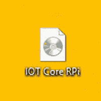
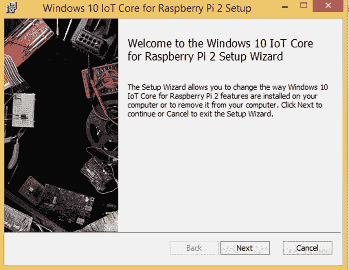
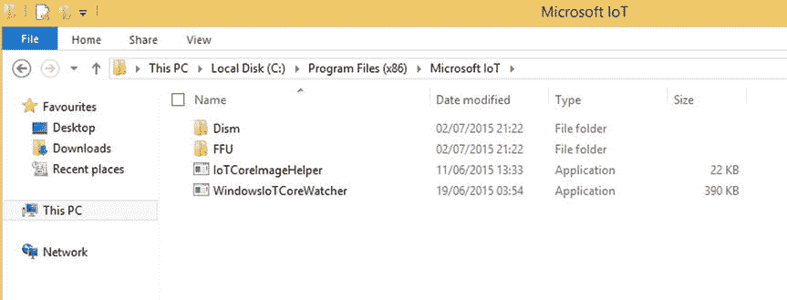
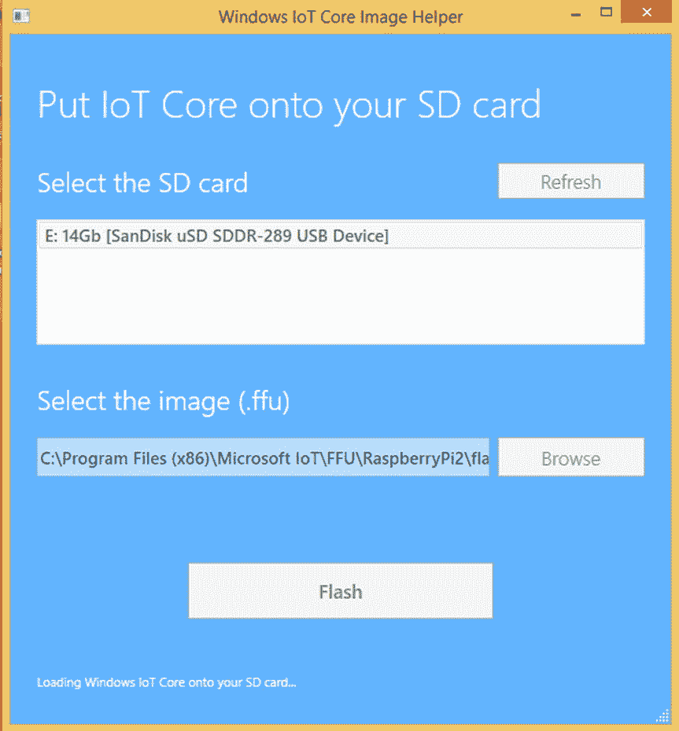
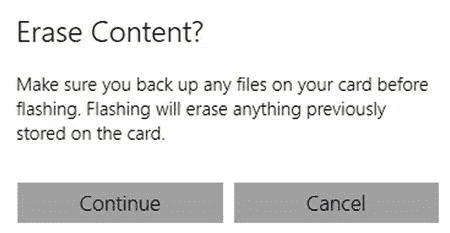
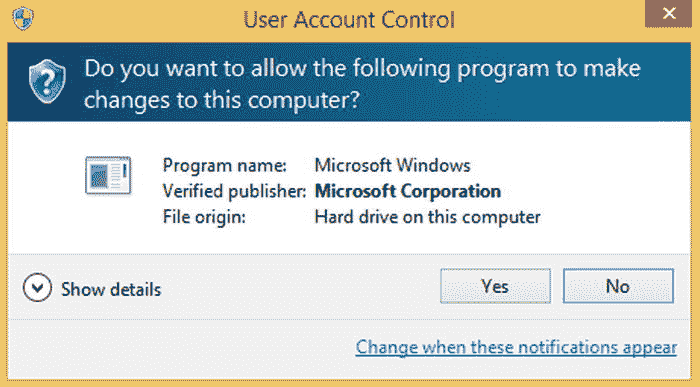
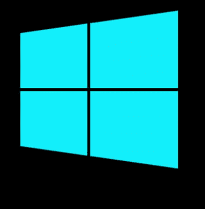
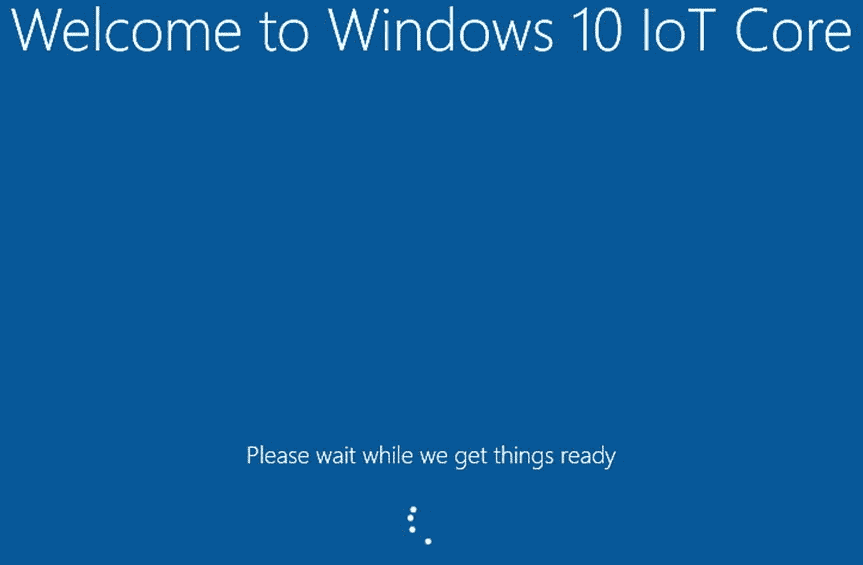
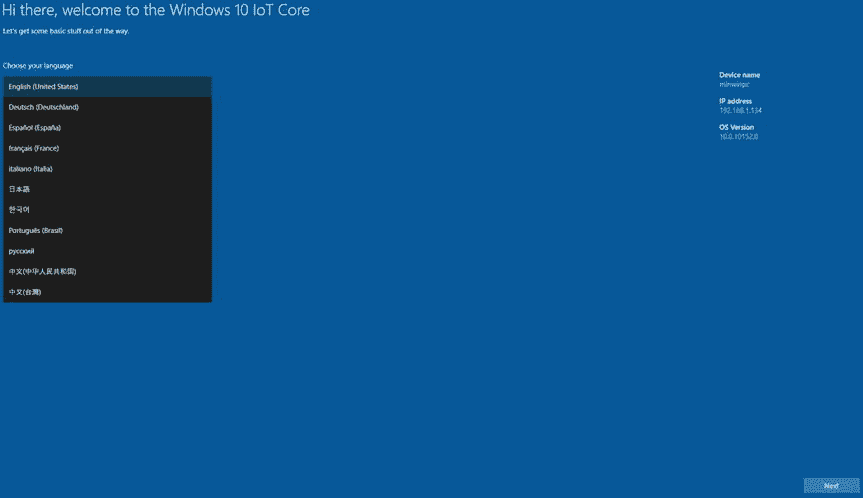
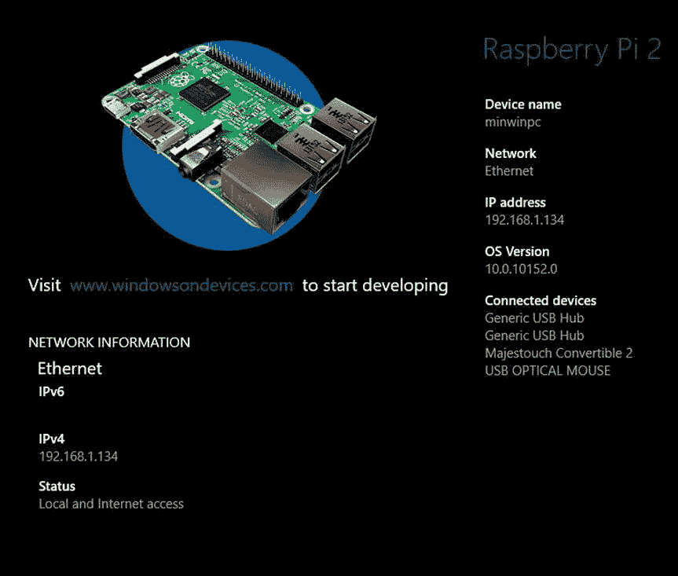

# 十二、安装 Windows 10！

等等什么？Windows 10？这不是 Linux 的书吗？嗯，是的，这本书的重点是坚定地学习使用 Raspberry Pi 的 Linux，但让许多人兴奋的一个整洁的功能是它新发现的运行 Windows 10 的能力。现在，如果你开始认为我们只是有点异端，那么不要担心，我们在这本书里只是触及了表面。事实上，我们将向您展示如何安装、启动并运行它，这就是基本内容。

那么，为什么我们要用这个来占用宝贵的空间呢？嗯，我们希望你了解树莓 Pi 的所有功能，即使你现在可能不想使用 Windows 10，谁知道微软将来会推出什么呢？简而言之，尽管我们热爱 Linux 和开源，但我们也很务实，这意味着使用我们所能使用的最好的工具。在这一章中，我们只是为你的工具箱提供了一个新的工具。

## 我以为 Windows 不能在 Pi 上运行？

对于那些读过第一版的人来说(顺便谢谢你！)，你可能记得我们在介绍中花了相当多的时间解释，虽然 Raspberry Pi 是基于 ARM 的设备，但它实际上不能运行 Windows RT(微软基于 ARM 的 Windows 版本，常见于平板电脑等设备上)。不用说，如果你检查这个版本中的介绍，特定的方框已被取代！

现在，在您对在 Pi 上运行 Windows 感到兴奋之前，您需要知道的第一件事是，支持 Pi 的 Windows 版本不是您可能希望在 PC 上运行的版本(特别是如果您之前已经“升级”到 Windows 8)。相反，它是一个高度精简的 Windows 版本，只让你可以使用基本功能。你得到了一个强大的 API 来编写软件，但它实际上是为数据收集设备或远程传感器提供动力，而不是台式机。

好吧，所以缺乏一个完整的桌面环境有点令人失望。我不是一个 Windows 的大用户，甚至我也很失望我不能把我的 Pi 变成一个方便的远程桌面机器。然而，也有一些好消息 Windows 10 的物联网版本将完全免费下载并在 Pi 上使用！

Note

本章涵盖的所有这些东西都取自互联网，并且是基于被认为是当前最好的资源。很有可能，当你读到这些的时候，这个平台已经转移了，而这也不再那么相关了。

为什么包括它？嗯，这一转变(Pi 上的 Windows)值得一提，据我所知，微软自己的页面上列出的一些说明和要求实际上是不正确的。所以以此为指导，但是当你读到这里的时候，你可能会发现更新更准确的东西。

查看他们的主要网站，了解最新和最棒的:

[`https://dev.windows.com/en-us/iot`](https://dev.windows.com/en-us/iot)

## 什么样的互联网？

物联网(简称 IoT)正在席卷全球，尤其是在最近一年左右。以前互联网上充满了数据。你可以毫无困难地搜索餐馆、收发信息、进行网上银行业务，但最终你只是在移动数据。肯定有用，但不是特别令人兴奋。

走进物联网。通过这种方式来看待互联网，它不再是简单的共享数据的机器，而是可以通过网络与控制器通信的传感器或设备等事物的集合。

例如，你可以给你的树莓派增加一个温度传感器，把它放在某个橱柜里，它会很高兴地坐在那里报告当前的温度。如果你想跟踪和控制温度，比如自己酿造啤酒，这可能会很有用。事实上，我实际上使用我为这本书的第一版买的 Pi 来控制使用固态继电器的建筑中的锅炉。

因此，当我们谈论物联网时，我们真正谈论的是让计算机与周围的世界互动。从感知(如温度、光线甚至辐射)到行动(开关锅炉或打开或关闭大门)，这开启了一种全新的互联网使用方式。

物联网面临的一个挑战是，你需要一些东西来实际感知或做一些事情。你可以用一台大盒子的个人电脑，但那并不理想。它们消耗大量电力(尤其是如果你只是想读取温度传感器)，需要冷却，通常有噪音，占用大量空间，并且在现代家庭中有些难看。此外，它们很重，真的不是那种你想放在树上或车库顶层的东西。

你需要的是小巧、便携、可靠的东西。理想情况下，你不希望有移动部件(所以没有风扇会在半夜死在你的身上，离你住的地方 50 英里)，低功耗要求，并考虑到它可能在恶劣的环境中，你真的不想为它付出太多。如果这听起来像树莓 Pi，那么你不是唯一这样想的人——事实上，Pi 与如此广泛的传感器和设备接口的能力使其成为物联网开发的一个非常受欢迎的系统。你不仅可以访问所有这些设备，还可以使用完整的操作系统，这是像 Arduino 这样的东西无法提供给你的。

## 但是为什么是 Windows 呢？

就我个人而言，我不太可能使用 Windows，但那是因为我已经使用 Linux 将近 20 年了。我对 Linux 很满意，我喜欢它的工作方式。然而，我最好的朋友之一没有跟随我的领导，留在了 Windows。现在他是一个 Windows 专家，他不太可能想要使用 Linux，尤其是当开始使用一些新的东西时，人们热衷于使用他们熟悉的东西。

如果你不认为这是一个足够好的理由，也许是 Windows 的物联网版本提供了一个完整而全面的 API(。有人能接触到硬件吗？)并与微软的 Azure 云平台很好地集成在一起。这个平台的一个主要好处是一切都是现成的(或者至少在完整版本发布时是这样)。对于 Linux，你需要自己把这些碎片拼凑起来。现在这对你来说可能不是问题，但是让别人替你处理这些事情还是有好处的。

微软也在花大力气围绕物联网建立一个社区。尽管它仍处于技术预览阶段，但你已经可以在网上尝试一些项目了。我们不打算在这里讨论这些，但是如果仅仅是为了了解你的敌人(或者了解其他人是如何解决问题的)，这是值得一试的。

## 入门指南

就像使用 Pi 本身一样，如果我们想让您的 Pi 在 Windows 中启动，我们需要做一些事情。下面是您将需要的东西的快速列表(改编自开发者网站):

*   运行 Windows 8 的机器
*   你的圆周率 2
*   8GB 微型 SD 卡(至少 8GB)–10 级
*   HDMI 电缆
*   以太网电缆

### Windows 8

现在，如果你看看开发者的网站，它声称你需要在你的电脑上安装 Windows 10 才能使用这些工具。它还声称，你必须直接在硬件上运行，而不是在虚拟机上运行(即，你需要 Windows 作为你的主要操作系统——你不能使用 Virtualbox 或 VMWare)。

从我的测试来看，这似乎不是真的。事实上，这些工具在 VMWare 上的 Windows 8.1 下运行得很好，我在将闪存映像写入 SD 卡时没有遇到任何问题。因此，如果你也这样做，你可能会没事。微软可能会在未来做出一些需要 Windows 10 的改变，但 VMWare 至少在处理 SD 读卡器方面没有问题。

### 你的圆周率 2

好吧，这很重要。Windows 10 需要最新最大的 Pi。最初的 Pi(所有版本)simple 无法胜任这项任务，Windows 也无法运行。您至少需要 Pi 2，尽管可能会继续支持 Pi 的更高版本。微软似乎非常热衷于物联网，我预计他们将在未来很长一段时间内支持 Pi。

### 8GB SD 卡

你应该已经有了这个。当然，你可能对事物的设置方式很满意，并不热衷于仅仅为了给 Windows 一个旋转而破坏它。在那种情况下，你需要第二张卡。

微软的最低要求是需要 8GB，并且至少应该是 10 级。等级指的是卡的速度，但是现在等级 10 的卡更常见而不是例外。大多数相机需要高速卡，这样它们就可以快速安全地存储大图像，否则会让相机感觉很慢。因此，在你最喜欢的当地商店里找到一张 10 级卡片应该不会有任何困难。

Caution

当我第一次尝试测试时，我使用了一个显然不是 class 10 的 SD 卡。它能够写入图像，尽管它会引导 Pi，但它会以黑屏结束，并且永远不会继续。后来在网上搜索了一下，我发现这是 SD 卡速度慢的一个已知问题，这就是为什么需要 10 级的原因。所以，在你花几个小时试着调试它之前，不要让自己太沮丧，确保你的卡是 10 级的。

### HDMI 电缆

关于这个没什么好说的。如果你已经阅读了这本书，那么你已经有了它，如果没有，那么你只需要用它来“看到”Windows 已经在 Pi 上启动了。Windows IoT 下载中包含一个工具，可以让您检测本地网络上的 Pi，因此如果您的电缆在其他地方很忙，您可以只使用以太网。

### 以太网电缆

类似于 HDMI 电缆，如果你真的不在乎看到网络上的 Pi，并且你真的只是好奇看看 Pi 是否真的可以启动 Windows，那么你可以使用这种电缆。如果你没有 HDMI 电缆，检测网络上的 Pi 将是确定它是否工作的唯一方法。

## 下载工具

出于他们自己最清楚的原因，微软已经将物联网下载作为 ISO 映像提供。这意味着它看起来和感觉上都像 CD 或 DVD，事实上，如果你愿意，你可以把它刻录成 DVD。然而，它只包含一个可执行文件，所以我不明白他们为什么要这么麻烦。在任何情况下，您都需要 ISO 映像和工具来访问它。在 Windows 8.1 上，(它在 Windows 7 和更低版本上不工作)Windows 将为您处理此事，并将 ISO 映像作为虚拟 DVD 打开-您不需要将其实际刻录到光盘上。

在撰写本文时，您可以从物联网开发中心下载图片，网址是:

[`http://go.microsoft.com/fwlink/?LinkId=616847`](http://go.microsoft.com/fwlink/?LinkId=616847)

如果那个链接对你不起作用，在谷歌搜索“Windows 10 Raspberry Pi 2 下载”会为你找到链接。

安装物联网工具

一旦你下载了图像，你应该得到一个类似图 12-1 的文件。

图 12-1。

Windows can see it’s an ISO image

如果您看到这个图标，那么您知道 Windows 能够打开它。不过，你至少需要 Windows 8.1 才能让它工作。

当你双击这个图标时，Windows 会把这个映像作为一个虚拟设备挂载，并假装它是一个真正的 DVD。图像上只有一个文件，这是我们需要运行的文件。您应该会看到类似图 12-2 的内容:

图 12-2。

Opening the ISO image

实际上，我没有将 DVD 驱动器连接到这台机器上(无论如何，它都是一台虚拟机)，所以您可以看到 Windows 正在幕后处理这个问题。让我们通过双击安装程序来安装工具。你应该得到如图 12-3 所示的安装程序:

图 12-3。

Installing the IoT tool set

和大多数 Windows 安装程序一样(尽管你是否应该这么做还有待商榷)，你可以简单地通过点击下一步并同意一切来完成。转了一会儿之后，安装程序应该会告诉你所有的东西都已经安装好了，你可以退出了。现在一切都可以使用了。

### 盒子里有什么？

据我所知，你有三件感兴趣的事。首先是一个方便的工具写出固件图像到你的 SD 卡。第二个是你要实际编写的固件镜像，包含 Windows 10 的物联网版本。最后是一个非常小的工具，它可以检测网络上的物联网 Pi 并告诉您它的状态。

让我们带他们去兜一圈…

## 将固件写入 SD 卡

当您最初在 Pi 上安装 NOOBS 或 Raspbian 时，您已经在 Linux 下完成了这项工作。尽管那时你使用的是一套不同的(经过测试的)工具，并且可能是在 Linux 或 Mac 下完成的。固件映像似乎就是这样，一个我们写入 SD 卡的简单映像，但为了以防微软做一些特殊的事情，我们将使用他们的工具。

首先我们需要找到它。在我的机器上，它安装在以下位置:

c:\ Program Files(x86)\ Microsoft IoT

如果浏览到该目录，您应该会看到类似图 12-4 的内容。

图 12-4。

Finding the IoT tools

我们感兴趣的应用程序是“IoTCoreImageHelper ”,它实际上只是“Image Writer”的一个好听的名字。双击这个应用程序来启动它，你会得到一个界面简单干净的漂亮的小应用程序(图 12-5 ):

图 12-5。

Burning the image onto your SD card

正如你所看到的，我已经填写了基本信息，然后截图了。值得注意的是，最初，SD 卡没有出现，我开始怀疑微软网站是否真的需要一个真正的物理机器来写入 sd 卡。然而，事实证明，我只是忘记了插入 SD 读卡器(哎呀), VMWare 一检测到它，我就可以按下刷新按钮并立即看到卡。因此，一定要确保 Windows 可以看到该设备，并且它显示在“这台电脑”下(尽管对我来说，它将始终显示在“我的电脑”旁边)。我还必须重新插入 SD 卡，以便 Windows 能够看到它，尽管它已经正确地检测到了读卡器。为什么呢？谁知道呢，但有时候扭动电线确实能解决问题。

您需要做的最后一件事是选择您想要写入卡的闪存映像文件。这与 FFU 下的工具位于同一个文件夹中(图 12-6 ):

图 12-6。

The rather originally named flash file

c:\ Program Files(x86)\ Microsoft IoT \ FFU \ raspberrypi 2

一旦你选择了路径，你所要做的就是按下“闪光”按钮，它就会写到你的卡上。您将得到最后一个提示，提示您即将粉碎您的 SD 卡(见图 12-7 ):

图 12-7。

Are you sure you want to erase the card?

现在，根据您使用的 Windows 版本，您将收到一个警告，询问您是否可以“对这台计算机进行更改”。实际上，它不会改变机器，但是它需要提升权限才能直接写入设备(如果您想直接使用设备，Linux 也需要提升权限)。因此，如果您收到以下警告，只需说“是”并继续(图 12-8 ):

图 12-8。

You need to give the program a higher level of access so it can write directly to the SD Card

看起来这个闪亮的新工具实际上是一个旧的控制台(基于文本)应用程序的前端，因为当它编写时，你会在控制台屏幕上看到更新。虽然您可以自己手动运行这个命令，避免使用图形界面，但是您需要自己设计标志和选项。无论如何，当您看到弹出以下窗口时，不要感到惊讶或担心(图 12-9 ):

图 12-9。

Writing the image to the SD card

这可能需要相当长的时间来写入图像文件，尤其是如果你使用 USB 2。即使在使用 USB 3 时，仍然花了足足十分钟才成功写入此图像。如果它看起来很慢，不要担心，它最终会到达那里。

一旦完成，您现在就可以启动您的 Pi 了。

## 点燃码头

现在你已经在 SD 卡上安装了 Windows，是时候让它实际工作了。像 NOOBS 或拉斯边一样，这一点真的很简单——你所要做的就是插入 SD 卡并给 Pi 加电。这就是事情的全部。

打开电源后，您应该会看到一个黑屏，中间有以下标志，一切正常，一个小小的“请稍候”标志会出现在它的正下方(图 12-10 ):

图 12-10。

Windows boot logo

旋转一会儿后，屏幕会变黑一会儿。这是完全正常的，会持续几分钟。一旦它完成了它需要做的事情(像 Raspbian 一样，在第一次引导时会做一些初始设置，比如扩展分区大小)，它将重新引导并启动默认的测试应用程序。

不过，在我们开始之前，您可能会遇到其他情况。当屏幕变黑时，它不是在几分钟后重启，而是保持黑色。现在还不清楚你要等多久，但我设法看完了整集《流言终结者》,私家侦探一声不吭。我决定我应该重启它，再试一次。这一次，它在一分钟左右后重新启动，但它没有加载默认应用程序，而是回到了相同的标志，在变黑和重新启动之前做了一点旋转。冲洗并重复。

正如我之前简单提到的，如果你不使用高速(特别是至少 10 级)SD 卡，这是一个已知的问题。我没有注意到我用的卡实际上不是 10 级的，因为我总是买 10 级的，所以我没有想到要检查一下。

所以，如果你的 Pi 陷入了重启的时间循环，或者它一直呆在黑暗中，那很可能是你的 SD 卡。当我把我的换成真正的 10 级时，第一次就成功了。套用流言终结者的话，我犯这些错误是为了让你们不用犯。

## 配置时间

现在假设你没有得到死亡的黑屏，你应该得到一个类似这样的屏幕(图 12-11 ):

图 12-11。

Windows getting things ready

考虑到在另一个 SD 卡上浪费的时间，你可以想象我看到这个屏幕有多开心。如果您也看到这种情况，那么您的 Pi 只需要几分钟就可以进行配置了。这是紧接着这个屏幕的屏幕(图 12-12 ):

图 12-12。

Welcome to Windows on Pi

这张截屏看起来有点难，但它主要是向您展示我浏览过的屏幕。在左边我们有一个语言列表，在右下角有一个“下一步”按钮。对我来说幸运的是，英语是我想要的，所以我所要做的就是点击下一个按钮。当然，如果你喜欢另一种语言，你可以在这里设置。

右上角是关于 Pi 的一些基本信息，比如它的名称、IP 地址和它运行的操作系统版本。一旦您按下“下一步”，您将进入显示您的 Pi 完全运行的最终屏幕(图 12-13 ):

图 12-13。

Fully booted Pi

为了节省空间，我从页面中间截取了一个片段。顶部的选项相当简单明了，所以我将把它们留给你去探索。这个页面提供的信息比配置页面多一点，但是我们在这个阶段并不感兴趣。事实上，唯一真正的区别是 Pi 的漂亮图片和连接设备的列表。

关于这个页面的一个有用的特性是，它为你提供了一个到微软“设备上的窗口”页面的链接，这将帮助你开始为你的 Pi 开发软件。在浏览的时候，我甚至看到了编写你自己的设备驱动的教程，所以每个人都可以在上面找到一些东西。无论如何，恭喜你——你是第一个在树莓派上运行 Windows 的人！我不得不承认第一次看到这个启动的时候非常酷，甚至我也很想看看微软会把这个平台带到哪里去！

检测网络上的 Pi。

在我们结束之前，让我们回到工具箱中的另一个工具“WindowsIoTCoreWatcher”。它实际上是一种通过网络检测圆周率的方法。如果你回到这个文件夹(查看本章的第一部分来提醒你它在哪里)，你可以双击它的图标来启动它。

如果您的 Pi 运行良好，您应该会看到类似这样的内容(图 12-14 ):

图 12-14。

IoT Core Watcher lets you spy on your Pi

这就是我如何能够在所有黑屏和重启问题之后确定我的 Pi 是半存活的——它显示在这个列表中。当然，它不能告诉您太多，但至少让您知道 Pi 已经启动并运行，最重要的是它的 IP 地址是什么。一旦你开发了自己的应用程序并开始部署系统，能够快速找到你的 Pi(特别是找到合适的 Pi，因为你可能有很多 Pi)这个应用程序会变得非常方便。

接下来呢？

现在你已经安装了 Windows，你能用它做什么呢？好了，基本设置，老实说不是很多。然而，在主应用程序屏幕的左上角有一个“教程”标签。如果你点击它，你将能够找到一些你可以尝试开始的项目。这些是基于硬件的项目，如“Blinky”，涉及打开和关闭 LED。当然，还有更复杂的项目。

如前所述，您可以访问一个开发人员网站:

[`https://dev.windows.com/en-us/iot`](https://dev.windows.com/en-us/iot)

这个网站包含了大量关于在 Windows 上构建设备的信息、教程和建议。由于这主要是一本关于 Linux 的书，所以我们不会在这方面做更多的详细说明，但是希望这能激起你对物联网的兴趣，也许只是为你的弓增加一根额外的弦。

## 摘要

这一章是在 Raspberry Pi 上为物联网设置 Windows 10 的快速演练。这个东西仍在预览中，所以事情可能会有变化，但基本内容可能会非常相似。

我们下载了包含工具集和固件的 ISO 映像，提取并安装该工具集，然后使用提供的工具将映像写入您的 SD 卡。

然后，我们启动 Pi，进行一些基本配置，并使用工具集中的 IoT watcher 应用程序来验证 Pi 已经启动并正在运行。我们通过在 Pi 上突出显示 Windows 的最佳访问网站来结束这一部分。

Pi 上的 Windows 仍然有点争议，但我认为它是将 Raspberry Pi 作为计算平台的一大进步。当然，它最初只是为了学习计算机如何工作，但它已经远远超出了这些最初的目标。它有强大的 Linux 支持，现在微软也加入了他们自己对该平台的支持。这对 Raspberry Pi、我们、用户和开发者来说都不会是坏事。