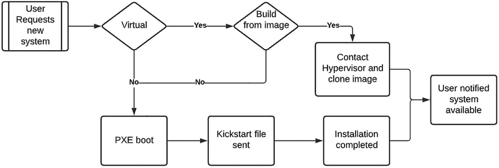
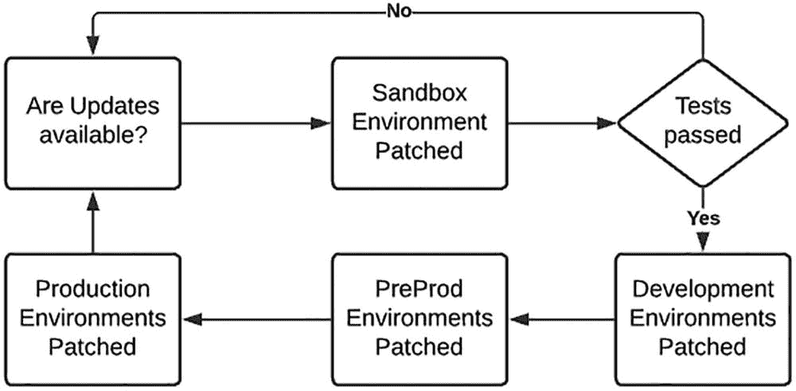

# 三、财产管理

上一章讨论了新的工具或工作方式，这一章也将继续讨论。然而，它将着眼于你的财产的更大图景:你应该做什么，你应该避免什么。

在这一章中，我们不仅会看到过去人们是如何管理 Linux 财产 的，以及如何对其进行改进，我们还会深入研究系统构建、系统补丁以及您应该使用或应该考虑使用的工具。说到这里，我们将简单讨论一下现在可以使用的管理软件。这一章的主要思想是向你介绍如何改变你的工作方式，使你在管理这些大型财产时生活更轻松。

我们不仅将讨论 Linux 资产管理的技术方面，还将研究如何进行适当的规划，以及如何避免那些需要工程师加班加点的可怕的午夜修补周期。本章将探讨简化传统 Linux 系统管理所需的大量手工工作的想法。我们将讨论如何在您的组织内开始文化变革，以及如何开始推动对话以促进创新并减少救火时间。

在本章的末尾，我们将讨论 Linux 系统管理员有时会做的一些常见的坏习惯。然后，我们将以一些推荐的好的实践来结束这一章，Linux 系统管理员应该开始这样做，如果还没有这样做的话。

## 过时的工作方式

在我过去十年作为 Linux 顾问的经历中，我遇到了许多了不起的人。有些教会我新的有趣的东西，有些教会我新的做事方法。在天平的另一端，我遇到过一些人，他们因缺乏进步或前瞻性思维而令我沮丧。这并不是说他们没有任何好处；事实上，大多数人都是非常聪明的人，他们只是被困在他们工作的组织没有给他们提供成长、学习或尝试新事物的机会的情况下。我的挫折感不仅仅止于个人，还延伸到违规的组织。由于没有促进增长和新的创新工作方式，与我一起工作的 Linux 系统管理员变得停滞不前和厌倦，经常以他们离开组织而告终。

因此，考虑到这一点，这里有几个例子来说明我所说的“过时的工作方式”是什么意思

### 过时的技能

我经常遇到不经常更新技能的 Linux 系统管理员。有些人只能怪自己，有些人不幸得不到他们工作的组织的支持。这方面的例子包括不熟悉他们管理的产品的新版本中的新变化和已知问题，这通常是由于缺乏培训。其他的例子包括没有跟上市场的变化和用于平台管理的新趋势。其他问题包括组织不希望 Linux 系统管理员在其环境中引入新技术。这通常意味着 Linux 系统管理员需要在家庭实验室或沙盒环境中进行实验，有些人可能无法进入这些环境。不管出于什么原因，Linux 系统管理员的技能变得过时了，让他们在拒绝支持他们的组织中束手无策。

### 保守秘密

这是最坏的最坏的。我遇到过一些人，他们在工作中与别人保持一定距离。其意图似乎是不要向任何人展示他们在做什么，这样他们就可以多一点时间保住他们的工作。这些人倾向于不愿意让任何人与他们合作任何项目，并且倾向于过度工程化他们所做的一切。在当今的工作环境中，我不建议这样做。分享的越多，学到的越多；通常，关于过时技能的前一点和这一点是密切相关的。如果你为此感到内疚，我的建议是开始尽可能多地学习新兴技术，并开始与他人合作。这不仅会改善你正在做的事情，还会为你开辟新的道路，甚至有可能去一个不同的组织，有可能获得更高的薪水。

### 过度工程化

这让我想到了我认为我们都曾犯过的错误:让一个简单的需求变得过于复杂。如果我每次看到简单任务中完全过度设计的东西都能得到一分钱，我会成为一个富人。后退一步，问问你自己，我真的需要把所有这些复杂性加入到这个剧本或者这个作品中吗？如果答案是否定的，那么削减多余的，保持任务简单。如果你过去有过工程过度的罪恶感，就用“KISS”这个缩写。“保持简单愚蠢。”

### Shell 脚本

我们都编写过 shell 脚本，是的，有时候这是不可避免的，对于这种情况，你只能苦笑着忍受。然而，如果可能的话，尝试使用更新的自动化工具来管理您的系统或执行您想要做的任务。还可以利用管理软件来管理系统，而无需使用 shell 脚本。改变您的方法，使用 shell 脚本的替代方案，将开始您从一个中心位置向更大的资产管理的转变。更不用说，对旧的 shell 脚本进行更少的维护。

组织的新成员也不需要麻烦你去理解你的脚本是做什么的；你可以直接让他们阅读你正在使用的管理工具的官方文档。

如今，除了快速包装器脚本或快速脚本来测试某些东西之外，编写 shell 脚本的理由越来越少。脚本不应该用于任何永久的东西，更不应该用于生产中的任何东西。

### 雪花

落到地球上的每一片雪花都是独一无二的；至少这是我被告知和读到的。这有时就是 Linux 资产如何发展的。Linux 系统管理员构建了这样的系统，其中每个系统都变成了自己独特的雪花。资产中的每个 Linux 系统都因其独特的配置而变得如此不同，更不用说过于复杂，以至于组织中没有人知道该系统做什么或如何重建它。这些系统比什么都让我害怕。当需要重建平台时，他们需要花费大量精力来确定需要什么，如果需要将平台故障转移到灾难恢复站点，他们就会成为负担。

Tip

改善遗产管理和减少救火的第一步是尽可能多地清除雪花。

### 重新发明轮子

最后，编写一个脚本或一个软件来做一些已经存在于操作系统中的事情是一种不可原谅的行为。除非有非常好的理由，否则应该避免这样做。即使在编写 Ansible 时，也要注意是否有不存在的东西。它可以节省时间和公司的资金。就是不做。

## 构建流程

Linux 构建过程通常是您在构建或管理中型到大型资产时需要考虑或花费相当多时间去做的事情。对于家庭爱好者或个人用户来说，你不会太在意这个过程，而倾向于手工构建你的系统。在较大的财产中，出于不同的原因被要求建立十个或一百个系统是很常见的。随着行业的发展，手动构建这些系统不再是一个好的选择。

构建不可替代的系统的时代已经过去了。系统现在被视为更像云实例。如果它坏了，丢弃它并重新部署。这个过程是有意义的，因为它节省时间和精力。没有必要尝试当场解决问题，甚至当场解决根本原因。只需删除系统并重新部署。大多数系统将日志发送到外部，因此故障排除和根本原因分析可以在生产启动并运行后继续进行。

20 年前，这种思维方式会让你看起来很有趣，如果管理层听说了，会让你被扫地出门。幸运的是，时代变了，今天这种思维方式受到鼓励。

要了解如何改进，我们需要了解我们做错了什么。为此，让我们讨论部署 Linux 系统的不同方法，什么使它们值得做，以及什么使它们成为应该避免的事情。

### 手动安装方法

要讨论的第一种方法是传统的手工部署。这对于你想测试或玩的奇怪的随机系统来说可能是好的，但是如果你有一百个系统要构建，这绝对不是你想做的事情。如果你花一周的时间去做一些本应该在 20-30 分钟内完成的事情，你肯定不会得到雇主的青睐。

有了所有可以构建系统的方法，包括可以用来构建系统的许多不同的工具或管理系统，手工构建系统不应该是其中之一。然而，在我们学习应该避免什么的时候，让我们从头开始，很好地理解这个手动过程应该如何完成，并查看已经用于安装 Linux 的手动构建方法。在本章的后面，我们将讨论如何简化这些过程。

#### 启动媒体安装

最简单的方法是使用引导介质进行部署。这可能是 DVD 或 USB 设备。系统通常从您的安装介质启动，一旦您的系统引导到您的 Linux 安装程序，您通常会运行手动步骤。可以选择默认值作为最简单的选项，但是如果您正在构建除测试系统之外的任何东西，则不推荐使用默认值。像磁盘分区和包安装这样重要的事情可以为任何重要的系统定制。如果您正在构建一个将被用作模板的系统，那么在这个安装过程中应该非常小心。您真的不希望模板配置不正确，尤其是如果它将在以后用于部署整个资产。

#### 网络安装

通过 NFS 服务器启动网络是手动部署 Linux 系统的另一种方法。这仍然需要引导介质，您需要将安装重定向到网络位置。这种安装方法要求运行 NFS 系统，并导出安装介质以供使用。您仍然需要手动运行安装，并且如果您正在构建一个生产系统，您仍然需要确保您不只是选择缺省值。如果你有一个 kickstart 文件，这可以简化，但需要进一步了解 kickstart 文件是如何编写的。幸运的是，我们生活在一个信息可以在互联网上自由获取的世界。有许多 kickstart 文件的例子和许多论坛问题和答案来帮助您开始。

#### 模板

尽管有一些方法可以对物理机器进行成像，但你不会经常这么做。然而，虚拟机是另一回事。当您作为 Linux 系统管理员阅读本文时，我假设您已经理解了从模板创建虚拟机的过程，并且很可能在过去做过一些克隆。如果没有，这个过程非常简单。Linux 系统通常是在虚拟化平台上手动创建和安装的。完成构建和配置后，虚拟机将被转换为虚拟机映像或设备，具体取决于您使用的虚拟化平台。该图像可以被锁定或转换成模板，以避免不必要的编辑或配置漂移。通过该模板，可以创建安装了操作系统的新虚拟机，并为定制做好准备。

#### 虚拟机映像

如果您不想构建自己的 Linux 映像，另一种方法是从您选择用于您的企业 Linux 资产的供应商那里下载一个映像。像 Red Hat 这样的公司已经为他们发布的每个版本的操作系统提供了预构建的映像供下载。这些图像可以导入并转换成模板；从那里，你能够建立系统。整个过程可以自动化，以进一步简化流程。

Tip

使用网络安装是开始自动化部署的好方法。如果您仍然手动部署，这肯定会改进您的构建过程。Foreman 是一个社区产品，所以如果你不能使用 Red Hat Satellite 或 SUSE Manager，它绝对是一个值得考虑的选项。

### 自动化 Linux 安装

既然已经介绍了手动安装，我们需要开始讨论如何简化这个过程。构建新系统时，减少浪费时间的第一步是尽可能自动化。这应该包括尽可能多的自动化，以使您的系统“生产”就绪。有两种方法可以使用。

#### 方法 1:网络安装

自动化 Linux 构建的第一种方法是使用网络安装选项。为此，需要准备一些东西。

##### PXE 服务器

对于从网络构建的 Linux 系统，您需要一个监听构建请求的系统。这就是所谓的 PXE 启动服务器。该系统有效地允许“全新”系统从其网络适配器启动，并提示用户选择他们希望部署的内容，也就是说，如果您使用多个构建。还可以为系统配置默认选项，以便在没有用户干预的情况下自动构建。

通常，网络引导服务器类似于 Red Hat 卫星服务器或 Foreman 服务器。如果您选择使用自己的 DHCP 服务器，一旦分配了网络地址，这些系统就需要 DHCP 系统将“下一个服务器”选项重定向到这些系统。个人建议使用 Satellite 或 Foreman 自带的 DHCP 服务器。这使得管理工作变得更加容易，并且避免了必须配置中央 DHCP 系统。如果流量需要跨越防火墙，它还可以降低防火墙配置的复杂性。Satellite 和 Foreman 也可以配置为侦听不同的网络接口，如果您担心 DHCP 或 DNS 对您的网络造成不必要的影响，则允许 DHCP 和 DNS 隔离。

Tip

红帽卫星和福尔曼将在下一章更深入地讨论。

##### 安装

一旦系统启动到网络安装，就需要配置 PXE 服务器来传送安装指令。这就是所谓的 kickstart 文件。Kickstart 文件基本上是 Linux 安装程序的应答文件。这些文件可用于网络安装和 ISO 或 USB 设备安装。

应该配置一个好的 kickstart 文件来部署您正在使用的 Linux 发行版的基本安装。由于主要关注的是磁盘布局和基本软件包安装，保持 kickstart 文件的简单性将允许您对各种不同的系统类型使用相同的 kickstart 文件。

#### 方法 2:虚拟机模板

这种方法主要用于构建虚拟机。然而，使用类似于 PlateSpin 的技术从映像构建物理机器是可能的。为此，在继续本文之前，您需要弄清楚这个过程。

出于本节的目的，我们将仅提及虚拟机构建。

##### 虚拟机管理程序 API

使用先前安装方法中的网络安装选项，您需要使用 PXE 引导系统。然而，从模板部署 Linux 系统不需要安装 Linux 操作系统，因为模板中已经安装了 Linux 操作系统。您需要的是一种与当前托管您的部署模板的虚拟机管理程序对话的方法。

要与虚拟机管理程序进行系统配置，有几个选项可供选择:

*   可变模块

*   木偶或类似的

*   自定义 Shell 脚本

*   管理系统，如卫星，领班，或 SUSE 经理

使用上述方法之一，您可以自动执行虚拟机管理程序的配置过程，以便从模板创建虚拟机。如果您想进一步简化，还可以自动创建模板，从互联网上下载图片。

#### 可行的例子

对于前面的过程，我个人推荐使用 Ansible。Ansible 提供了一个更容易的学习曲线，是当前自动化的市场趋势。Ansible 已经提供了 Ansible 模块，可以通过安装所需的 Ansible 集合来添加其他模块。除了这些模块，网上还有足够多的例子向你展示如何自动化你能想到的任何东西。事实上，如果这是你想做的事情，可以看看我的 GitHub 仓库中关于 Ansible 的一些基本例子。在过去的几年里，我参与开发的一个特殊的可负责角色叫做“可负责角色基石”这个角色可以帮助用户在 VMware 和 Libvirt 中构建虚拟机，还允许用户在 AWS 和 Azure 中提供云实例。

[`https://github.com/kenhitchcock`](https://github.com/kenhitchcock)

### 使用图像

如果您希望采用模板部署模型，那么有必要了解哪种方法是最好的:使用黄金映像还是使用映像目录。

#### 黄金图像

“黄金映像”模型包含一个映像或模板，作为所有系统的基础起点。这个图像将是真理的中心来源，一切都可以用它来建造。让我们来看看使用这种方法和不使用这种方法的一些理由。

#### 使用它

*   管理和维护一个映像。

*   没有图像蔓延造成混乱的机会。

*   真相的一个来源。你知道里面有什么。

#### 不要用它

*   如果您的映像不是 100%正确的，那么您可能最终会得到一批需要重建的 Linux 系统。

*   不能用于快速启动开箱即用的系统。仍然需要配置。

*   使用基本图像节省的时间最少。

Note

我不再推荐这种方法，主要是因为现在有更好的自动化系统构建的方法。这种方法多用于 Linux estate 构建的早期。

#### 图像目录

该目录可以是虚拟机模板、映像或 kickstart 文件。都有相似的优点和缺点。

如果您决定使用图像目录或 kickstart 文件，建议您跟踪图像的用途以及如何将它们用于变体。下面是一个基本的例子:

*   linux 操作系统映像基础]
    *   [Web 服务器图像]
        *   [负载平衡器图像]

        *   [反向代理图像]

    *   [数据库服务器映像]
        *   [Mysql 图像]

        *   [Postgresql 图像]

这种管理构建过程的方法表面上看起来确实是个好主意，但是理解它可能带来的额外工作是很重要的。我们把这个分解成一些优缺点来比较一下。

##### 优势

*   可用于快速构建系统的预构建映像或 kickstart 文件的目录。允许每次重复构建。

*   部署后，系统几乎可以 100%配置使用。

*   可以密封模板，以确保不会发生配置漂移。

##### 不足之处

*   如果您使用模板进行虚拟机克隆，模板将需要修补，并且可能会被遗忘。

*   图像蔓延可能会发生，你可能会得到一大堆没人知道它们是干什么用的模板。

*   多个映像需要有人进行修补和维护。

### 构建流程流

为了改进任何组织中的构建过程，我们需要理解流程。一旦我们对流程进行了很好的细分，我们就可以看到哪些地方可以自动化，哪些地方可以改进。

#### 基本构建过程

Linux 系统构建的基本流程通常如图 [3-1](#Fig1) 所示。在请求完成之前添加批准过程，并考虑对可用资源的检查，这样就有了构建新 Linux 系统的基本流程。



图 3-1

Linux 系统构建

这种解决方案至今仍被许多组织使用，在过去的十年中，除了所安装的操作系统版本之外，并没有太大的变化。

#### 有哪些可以改进的地方

有了这个基本构建过程的例子，我们有很多改进和自动化的空间。让我们了解一下可以做些什么来改进这个过程。

##### 自动，自动，自动

不言而喻，在构建过程中自动化你所做的每一件可能的手工操作。这包括安装或部署之外的任务。当尝试自动化完整的端到端系统时，网络寻址的分配和 dns 配置至关重要。你通常手动做的所有事情都必须自动化。

##### 引入用户请求门户

通过使用某种类型的用户请求门户，您不再需要为您的工程师分配基本的构建工作。正如前面提到的，不仅系统构建应该是自动化的，请求系统的过程也应该是流线型的。

###### 与其他平台的集成

用户门户应该能够与诸如变更管理平台之类的系统集成，在这些系统中，构建请求可以被自动发送以供批准。一旦一个任务被批准，门户应该能够与自动化平台对话以启动构建任务。一旦作业完成，应该通知用户。

###### 简化资源需求

在用户门户中使用“t 恤尺寸”进行系统构建将降低最终用户的复杂性。仍然需要确定用户构建所需的资源需求，但这可以在用户请求过程中通过文档或注释来完成。

##### 使用自动化平台

当尝试自动化完整的资产构建时，强烈推荐使用自动化平台。所提供的特性通常有助于简化这一过程，并在过程中提供指导和提示。

像 Red Hat Automation Platform 这样的一些自动化平台也可以被用户用作请求门户来启动批准的构建。将需要一些定制和用户访问控制，但在一定程度上是可能的。可以使用红帽自动化平台的社区版本，但是记住会有区别。缺乏目录服务集成就是一个例子。

替代的想法和系统可以包括从 Jenkins 管道到客户脚本或应用程序的任何东西。也有更高端的付费产品可以使用，但这将取决于您对企业产品的偏好。

##### 引入截止日期

对于仅用于小型工作或测试的非生产或开发平台，引入自动淘汰它们的方法。如果需要，为用户提供一个扩展选项，但要确保未使用的系统过期并被删除。这并不总是可能的，但是当您允许用户请求新系统时，应该考虑这一点。如果没有这样的东西，你很快就会达到硬件的极限，或者更糟糕的是，如果你使用云平台，你可能会产生巨大的成本。

#### 自动化构建流程流

如果所有的建议和更多的建议都被采纳，那么您的新构建流程不仅会减少日常的构建工作。它还将允许完整的财产重建和改善灾后恢复。由于可以在几分钟或一小时内重新配置和使用失效的系统，因此减少了对失效系统进行灭火的需求。通过适当的灾难恢复和故障转移，应该很少甚至没有停机时间。图 [3-2](#Fig2) 考虑了一些场景，但应该包括更多关于测试和系统定制的内容。


图 3-2

可以改进标准构建过程，以消除手动配置

通过改进您的构建过程，更多的时间可以花在更令人兴奋的工作上，并且它可以促进创新。

## 系统修补

系统补丁是系统管理员应该做的最重要的工作之一。如果系统没有定期修补，大多数需要认证的公司或组织可能会被罚款甚至更糟。因此，大多数组织都会定期计划和执行补丁程序。这通常意味着修补或更新需要在工作时间之外和特定的维护窗口内完成，对于分配了这项工作的可怜的系统管理员来说，这是一项痛苦的任务，尤其是当工作在凌晨 1 点结束时。

让我们首先了解不同的更新类型，然后了解如何以简化的方式管理修补和更新，以潜在地减少非工作时间的工作。

### 更新类型

企业发行版的 Linux 更新可供付费订阅的客户使用。之前，我们已经讨论过了，但要重申的是，这些订阅是企业与社区的区别。Red Hat 和 SUSE 等企业级 Linux 公司将不断发布更新。这些更新有两种形式:包更新和勘误表。

#### 包更新

软件包更新占据了大多数系统修补周期的大部分。更新往往是已安装软件包的新功能或新版本。通常，在更新周期中，软件包管理器或软件包安装文件会备份任何可能受影响的配置文件。但是，千万不要想当然地认为这件事一定会做成。我曾经遇到过一个问题，一个产品被更新，覆盖了配置文件中的定制。我的建议是，在运行任何更新周期之前，一定要确保有备份。

#### 正误表

Linux 更新中常见的另一种更新类型是勘误表更新。勘误表是错误修复和安全更新。这些可能是你需要安装的最重要的更新类型。正是在这些勘误表中，当在包或文件中发现漏洞时，您将收到重要的安全修复。这些勘误表必须尽快应用于任何生产环境。

Note

作为您的 Linux 资产的系统管理员，确保您收到所有带有勘误表版本的警告电子邮件。当新的勘误表发布时被告知将有助于您计划修补周期，尤其是当勘误表包含安全修复时。

### 脚手架

在对您组织的系统应用补丁程序和勘误表时，了解新的更新不会对任何正在运行的系统造成任何负面影响是至关重要的。为了降低这种风险，分阶段更新是有意义的。我的意思是，您的修补应该从优先级最低的系统流向优先级最高的系统。您可以从修补优先级最低的系统开始，比如沙盒环境。运行自动化测试，或者让测试团队签署平台，以确认在最近的补丁周期中没有发生任何问题。一旦您确信没有任何东西受到新补丁版本的影响，您就可以继续您的下一个环境(图 [3-3](#Fig3) )。



图 3-3

典型修补流程

示例流程图仅考虑沙箱环境之后的测试，而不考虑不同平台中不同的包。对于这种设置，在生产前的环境中一直进行自动化测试是非常有益的。由于生产前应该是生产的一面镜子，所以您最好在生产前打好补丁后，了解打好补丁后生产中是否会出现任何问题。

### 补丁管理系统

使用像 Spacewalk 或 Red Hat Satellite 这样的补丁管理平台将有助于管理补丁管理周期。这些系统的构建功能允许系统管理员隔离补丁或勘误表，使其永远无法进入环境。

例如，Satellite 6 能够对下载的软件包和勘误表进行分组。然后，这些软件包和勘误表组会受到版本控制，并被推送到特定的环境中。然后，这些更新组可以在各种环境之间迁移，这就允许您(系统管理员)决定什么环境获取什么更新。如果你有“触发快乐”的用户不断尝试在他们使用的系统上运行“yum update ”,这是非常有用的。希望永远不会出现这种情况，但有时可能会发生错误，通过一开始就没有更新来避免不必要的停机是很有用的。

表 [3-1](#Tab1) 列出了一些目前常用的补丁管理系统。

表 3-1

补丁管理系统

<colgroup><col class="tcol1 align-left"> <col class="tcol2 align-left"></colgroup> 
| 

系统名称

 | 

它是用来做什么的？

 |
| --- | --- |
| `Red Hat Satellite` | 用于 RHEL 6 及更高版本的系统。可用于修补和系统配置等。 |
| `SUSE Manager` | 用于 SUSE 系统，可用于修补和系统配置。 |

Note

在下一章，我将更详细地讨论卫星服务器。如果你想知道更多，我推荐你阅读一些官方文档来获得更多信息。

### 规划

补丁计划听起来像是你在睡觉时做的事情，而且由于大多数组织在工作时间之外做补丁，这可能是系统更新时发生的事情。

拥有一个系统修补的可靠计划几乎和修补本身一样重要。这一计划将允许所有系统及时得到修补，并避免系统不能及时获得更新和暴露于它们本应避免的漏洞的风险。

一个好的修补计划应该包括如何应用修补程序、修补程序来自哪里(修补程序管理系统)、如何检查修补程序是否已安装，以及最重要的是，如何在出现系统问题时取消修补程序。如果计划是万无一失的，那么实现可以由经验较少的系统管理员来完成，这样可以分散工作量。

### 反转

当一个系统补丁造成的损害超过它所修复的损害时(这种情况很少见)，您需要知道如何将系统回滚到工作状态。这可以通过几种方式来实现。

#### 从备份恢复系统

在对系统进行任何更改之前，最好备份系统。这将包括备份对您的系统最重要的文件系统文件和目录。从这些备份中恢复将使您恢复到更新前的状态，但必须理解，此过程可能非常耗时，如果在工作时间之外打补丁，您可能没有时间。

#### 恢复快照

虚拟机可以拍摄快照，通常这是一个快速的过程。如果快照已运行了较长时间，从快照恢复有时会花费较长时间，但此过程通常需要几秒钟。

#### 程序包管理回滚

另一种相对快速的回滚方法是使用包管理系统进行回滚。对于 Red Hat Enterprise Linux 或任何使用 yum 的发行版，您可以使用“`yum history undo <id>`”命令回滚。其他发行版如 Ubuntu 和 SUSE 稍微复杂一些。

#### 软件包的重新安装

更令人恼火的方法是移除并重新安装有缺陷的软件包。这种方法的问题是，如果您要修补大量的软件包和系统，那么查找有问题的软件包的发现过程将花费您大部分的时间。虽然这可以解决问题，但您将花费在修补窗口中可能没有的时间。

#### 系统的重新部署

大锤方法将是摧毁系统并重新部署。这可以在 sandpit 等优先级较低的系统中完成，但肯定不是大多数组织在生产中会做的事情。

## 备份和恢复

如果您构建的系统不容易重新部署，备份您的 Linux 系统是您通常会做的事情。如今，从代码中重新部署系统的想法比从备份中恢复更吸引组织。但是，在发生灾难时，有些系统可能无法轻松重新部署。对于这些系统，您需要知道哪些目录和文件需要备份。您需要了解如何从这些备份中恢复，以及更快恢复的最佳选择是什么。

### 重要的目录和文件

如果您需要在文件系统级别进行备份，有一些标准目录非常重要。这些目录应包括但不限于以下内容:

```sh
/etc
/home
/root
/usr
/opt
/svr
/var (be sure to exclude logs or anything large not required)

```

应该使用您选择的工具压缩上述目录。然后，可以将该归档推到备份位置。这可以是您希望的任何存储类型；请记住，网络上的一些备份位置可能比其他位置需要更长时间。如果您需要在特定窗口内完成备份，请明智地选择。

### 虚拟机备份

大多数虚拟机提供商都有能力拍摄虚拟机快照。然而，快照不是备份。当您在系统上工作时，快照可用于快速恢复。快照可能会变得非常大，因为它们跟踪系统更改的所有内容；如果这些更改没有得到控制，当您以后需要重新合并这些更改时，它们会给您带来一些问题。

备份虚拟机的方法有几种，但大多数基本上都是复制虚拟机的磁盘映像。一些第三方软件可以为您管理这一点，因此您可以备份实时虚拟机，但它们价格昂贵。标准虚拟机备份要求首先关闭虚拟机，但这并不总是可能的。

虚拟化平台经理应该准备好解决方案，但是如果没有备份，请确保在执行潜在的破坏性工作时至少拍摄快照。

### 灾难恢复

作为一个组织，生产平台尽可能保持运行至关重要。这可能涉及许多不同的解决方案，并且应该涉及所有级别的冗余。当这些计划在完全没有准备的情况下失败时，需要一个从灾难中恢复的计划。灾难恢复的目标不是确保覆盖所有单点故障，而是如何恢复生产。

#### 基于恢复时间的最佳策略

让我们探索几个灾难恢复选项，并讨论哪些选项适合您的组织。

##### 复制数据中心

尽管运行多个数据中心是个好主意，但有时也不足以避免灾难。如果两个数据中心互为镜像，则多个数据中心可以工作并实现真正的灾难恢复。数据需要不断复制，系统需要在两端完全相同，或者至少尽可能接近。这种解决方案实际上意味着所有成本加倍，并且需要两个数据中心之间的高质量连接。

##### 伸展集群

从技术上讲，这不是一个灾难恢复解决方案，但确实允许数据中心之间的故障转移，从而减少停机时间，并在需要维护时切换数据中心。

然而，这种解决方案确实需要可以是集群的基础设施。从存储到网络设备的一切都需要以一种能够进行故障转移的方式进行配置。

##### 基础设施作为代码

由于大多数组织已经开始拥抱自动化的世界，这种灾难恢复方法应该不会显得完全陌生。

如果在您的资产中部署和配置的所有东西都是自动化的，那么需要恢复以继续运行的所有东西就是执行自动化的代码。如果跨数据中心或云平台进行备份和恢复，则可以运行自动化来重建您的组织所需的所有系统。这种方法需要高度的组织，并且涉及严格的构建过程，该过程只允许从代码构建系统。

在发生灾难时，需要恢复实际数据，这本身就需要一本关于该主题的完整书籍，以解决创建完美解决方案所涉及的所有复杂问题。

##### 云

就像拥有另一个数据中心一样，使用像 AWS 或 Azure 这样的云平台可以为灾难恢复提供一个优秀的平台。让整个云平台自动构建我们内部系统的副本可以提供理想的快速故障转移。理想情况下，该平台如果不用于生产，可以关闭以节省成本。然后，在发生灾难时，云环境可以启动并重定向流量，同时解决内部问题。这种解决方案需要您进行大量投资，以确保从本地系统复制配置，并且您还需要研究如何复制数据，以确保没有数据丢失。在所有灾难恢复选项中，这可能是最便宜的选项之一，因为一旦平台构建完成，它就可以关闭。仅考虑数据成本和保留 IP 地址的成本，云平台可能会一直处于休眠状态，直到需要时才会出现。

## 常见的不良做法

在看一些财产管理的良好做法之前，让我们看一些不太好的做法的例子。

### 虚拟机模板

之前，我们谈到了使用虚拟机模板来构建 Linux 系统。这本身并不是一个坏的实践，但是忽略了对模板的维护可能是个坏的实践。使用单个模板而不修补它或解决漏洞，可能会使您的资产面临部署无法通过合规性扫描的系统的风险。

如果您使用虚拟机模板作为您的 Linux 构建过程，请确保您保持模板有序。在您的工作计划中建立一个定期计划作业，该作业不能被某人跳过以检查模板的状态并确保它们保持最新。

### 修补或缺少修补

有时，系统修补会滞后，在极少数情况下会被遗忘。如果可以从外部访问系统，让系统保持最新是非常重要的。不言而喻，如果您的系统上没有已知漏洞的补丁，您就有可能让自己和您的组织面临灾难。即使是无法从外界访问的平台也应该定期打补丁和更新。这些系统看起来很安全，但是如果入侵者甚至能够访问您的网络，让您的所有系统尽可能安全至少会使任何进一步的破坏变得更加困难。

### 防火墙已禁用

当运行数千个系统时，维护和配置本地 Linux 防火墙可能是一件痛苦的事情，但是它们的重要性怎么强调都不为过。就像在安全网络中修补系统会降低入侵者设法破坏您的网络时造成进一步损害的风险一样，本地 Linux 防火墙可能会给潜在的入侵者带来另一个不便。

在构建和使用配置管理平台时自动化防火墙配置，以减轻管理这些防火墙的痛苦。总有一天他们会有所作为。

### SELinux 已禁用或许可

通常，当我拜访新客户时，我发现他们禁用了 SELinux 或者没有在他们的系统上将 SELinux 设置为强制模式，有时是因为他们不知道如何配置 SELinux 或者不了解其好处。

拥有尽可能多的选项来确保系统保持安全对任何组织来说都是一种优势。将 SELinux 设置为强制模式通常是合规性扫描的一项要求。现在习惯于使用 SELinux 将会使以后被迫启用它时的生活变得更好。

### 使用社区存储库

使用像 Red Hat Enterprise Linux 这样的企业 Linux 发行版并不仅限于使用 Red Hat 存储库。如果你愿意，可以启用和使用像 EPEL 这样的社区知识库。有时，这是出于一个很好的理由，例如需要一个在 Red Hat 存储库中不可用的包，有时它可以被启用，因为一个组织希望使用先进的包，当你和你的组织完全支持时，这是很好的。但是，如果您依赖企业支持，这是不行的。这个问题可能会污染系统，直到它变得不受支持，直到您删除非分段的软件包和更新。当您在生产中遇到问题时，这可能会在提出支持案例时带来很大的麻烦。

### 脚本、脚本和更多脚本

使用 bash 或 shell 脚本来管理您的平台似乎是一个好主意，但是很容易失控。新的开始者和离开者都创建他们自己的脚本，很快在你知道之前，没有人知道什么是用来做什么的。更糟糕的是，这些脚本中的一些不尽如人意，在某些情况下甚至非常危险。

应该尽可能多地使用管理平台，并且所有脚本都应该是从自动化平台执行的自动化形式。

### 以 Root 用户身份运行

在生产环境中，任何人都不应该以 root 用户身份登录系统。生产也不总是意味着面向客户的系统。开发人员积极工作的开发环境也可以被视为生产环境。以 root 用户身份直接登录会删除任何审计线索，并为意外导致问题的人提供完全权限。始终使用您自己的凭据登录，并在需要时使用 su 登录到 root。这种做法需要每个人都遵守，而不仅仅是标准用户。

## 良好做法

以下是我个人对良好屋管理的一些看法。

### 构建一次性系统

您构建的任何系统都应该能够删除和重新部署。是的，一些系统需要时间来重新部署，但是如果是以标准的可重复的方式从一个可信的来源构建的，您应该有信心扔掉任何系统并重新部署。将你个人和组织的文化转变为面向云的工作模式将有助于推动创新。消防和故障排除应该减少，让你腾出更多时间做你更感兴趣的事情。

### 尽可能自动化

这一条是不言自明的，但是只要有可能，就尝试自动化您所做的事情。今天手动做任何事情的想法看起来很奇怪，因为你可能需要在某个地方重复这项工作。自动化的实现简化了一切，也为任何新手提供了一个很好的文档来源。此外，编写自动化代码远比点击下一步更令人兴奋和有趣。

### 创建前搜索

在开始写一个新的可承担的角色或任何类型的剧本之前，一定要做好你的尽职调查，看看是否有人已经为你做过了。很有可能你会找到你正在寻找的东西，节省你的时间和精力。重新发明轮子只是浪费时间，而且在大多数情况下，你找到的内容已经花了相当多的努力和思考。

### 分享知识和协作

与你的同事分享你所学到的东西，并尝试让尽可能多的人参与工作项目。举办研讨会，培养对自己工作的兴趣。这将为你的经理打开大门，让你有更多的时间去创新，向你的组织展示你的价值。请不要觉得你所学的应该只留给你自己；你永远不知道是否有人能提供一个有趣的观点来让事情变得更好。记住，开源不仅仅是可用的代码。这是合作和开放。

### 源代码管理

您开发的任何管理资产的东西都应该存储在一个像 Git 这样的源代码控制平台中。代码应该进行代码审查，在严格的测试完成之前，绝对不应该在产品中执行。当我们写代码时，我们都有最好的意图，但经常会被我们犯的错误所蒙蔽。第二双眼睛有时会有很大的不同。

### 重新评估系统要求

运行大型虚拟机资产时，所需的资源可能并不总是反映原始构建所需的资源。使用资产监控工具将有助于您控制那些实际上并不需要分配给它们的资源的系统。这可以让您为其他系统释放未使用的资源。如果您的虚拟化平台被配置为自动回收未使用的资源，这当然不会有太大影响。

## 摘要

本章向您介绍了以下主题和讨论要点:

*   多年来采用的一些过时的工作方式。要避免的事情

*   Linux 构建过程以及如何改进它。可能会遇到哪些问题，可以做些什么来改进流程

*   Linux 系统补丁所涉及的过程以及保持更新的重要性

*   备份和恢复选项，包括关于灾难恢复的想法

*   管理 Linux 资产时，常见的不良实践和不应该做的事情

*   好的实践和开始做事情的建议