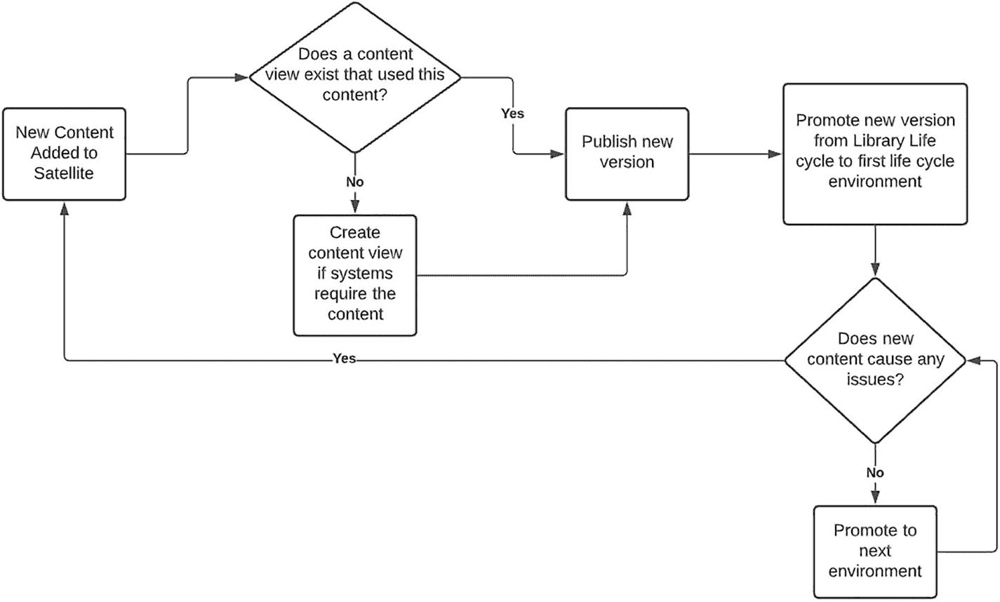

# 四、财产管理工具

如果处理不当，管理较大的 Linux 资产可能会很有挑战性。试图按照 20 年前的技术和工具来管理数千个 Linux 系统会给你带来一大堆麻烦，尤其是当合规性扫描显示你的环境中存在漏洞时。您不仅会发现大量可能让任何安全人员心悸的安全漏洞，还会留给您大量令人沮丧的补救工作。

为了避免这些问题，强烈建议使用管理软件。即使只需要管理少量的 Linux 系统，管理平台也只会让生活变得更加轻松。日常任务可以自动化，构建流程可以简化，可怕的安全补救措施可以卸载到管理平台上为您处理。

有些工具是有成本的，因此，了解有哪些社区选项是很重要的。与我们在前面章节中讨论的非常相似，我们将做一个类似的比较。本章的目的是让您熟悉管理平台，它们的用途，以及它们如何让您的 Linux 系统管理员生活变得更轻松。

## 管理系统

在这一章中，我们将讨论两种管理系统:Linux 平台管理系统和自动化平台。对于每种类型的管理系统，我将解释系统做什么和工具的基本概念。首先要明确的是，这本书并不是关于如何使用这些平台的官方指南。我所要做的就是让你熟悉这些工具的作用，以及它们如何让你受益。

## Linux 平台工具

如果您还没有使用管理工具，那么您应该使用的第一个也是最重要的管理工具是 Linux 平台管理工具。这个工具是您资产的中心，控制着 Linux 系统管理员应该做的大部分事情。该工具应具有以下部分(如果不是全部)功能:

*   从外部存储库同步包

*   能够按环境隔离包

*   Linux 构建和 kickstart 功能

*   合规性扫描和报告

*   配置漂移控制

*   平台监控和日志记录

*   集成到虚拟化或云平台中

*   在离线环境中工作的能力

*   必须可扩展且可靠

显然，您并不总是需要所有前述的功能，但是如果您开始改进您的工作方式，拥有这些功能确实会有所帮助。例如，您的组织决定开始使用更多的云设施。拥有一个具有云供应能力的工具将使您不必使用另一个平台或编写自己的平台。

## 可用的 Linux 平台工具

表 4-1 提供了一些更常用的 Linux 平台工具的列表，您可以使用这些工具来管理从小型到大型的 Linux 资产。

表 4-1

Linux 平台管理选项

<colgroup><col class="tcol1 align-left"> <col class="tcol2 align-left"></colgroup> 
| 

产品

 | 

描述

 |
| --- | --- |
| `Red Hat Satellite` | Red Hat 的首要企业 Linux 资产管理工具。用于管理 RHEL 6 及以上的地产。在撰写本文时，该产品已经问世近 20 年了 |
| `Foreman` | 用于管理 Linux 系统构建过程的社区产品。福尔曼是红帽卫星 6 号的上游 |
| `Katello` | 为 Foreman 提供内容管理的社区产品。卡特罗是红帽卫星 6 号使用的另一种产品，作为其上游对等产品 |
| `Pulp` | 一个管理 Linux 系统软件包仓库的社区产品。像 Foreman 和 Katello 这样的纸浆是 Red Hat Satellite 6 的另一个上游产品 |
| `SUSE Manager` | 管理 SUSE 平台的 SUSE 企业产品。SUSE Manager 基于社区产品 Uyuni，它本身是太空行走项目的一个分支 |
| `Spacewalk` | 太空行走在过去被用作红帽卫星 5 号的上游。今天，它仍然是一个社区 Linux 平台管理工具，已经被它的开发者抛弃了 |
| `Uyuni` | 一个社区平台管理系统，提供系统配置和补丁管理功能。配置管理由 SaltStack 管理，具有运行合规性扫描的功能。Uyuni 是集成了 SaltStack 的太空行走产品的一个分支。乌尤尼也是苏塞的上游经理 |
| `EuroLinux` | 另一个社区 Linux 资产管理工具，似乎也是从 Spacewalk 与 SaltStack 集成而来 |

Note

太空行走分叉平台除了包含盐堆之外，大部分都是一样的。如果您决定使用其中一个，则需要根据产品修复频率做出决定，以确保您有可用的错误修复和漏洞修补程序。

### 选择您的 Linux 平台工具

开源世界中的大多数东西都有企业产品和社区产品。根据组织的要求和预算限制，您的选择可能会受到限制。为了了解如何正确决定应该使用哪种工具，让我们看看您需要问自己的问题:

*   支持:如果我遇到问题，我是否需要企业供应商的支持，或者我是否乐意与社区和他们的论坛合作来获得我的答案？

*   Linux 发行版:我在管理哪些 Linux 发行版？他们是否有需要管理的企业订阅？

*   特色:有哪些特色是我离不开的？我是否乐于使用多个平台来提供我想要的所有特性，或者我是否需要一个在一个地方拥有一切的工具？

### 决定

您使用的产品将根据您组织的需求而定。通常，法规遵从性将决定您是使用企业产品还是社区产品。产品应该具有的特性，往往是由您上面的决策者决定的，他们不了解作为 Linux 系统管理员的您是做什么的，或者产品是做什么的，这可能会使您的产品成为障碍而不是帮助。

我以上的建议是为你认为不仅对你而且对你的组织都是正确的产品建立一个案例。为此，你需要果断地做出决定，并给出一个或多个明确的理由，说明为什么你更喜欢使用的产品最适合这项工作。如果产品是企业产品，你还需要证明成本，并证明它比竞争对手更好。根据你公司的工作方式，介绍优缺点应该是一个有用的练习，可以比较不同产品的特点。

为了支持您的决策和建立您的案例，您必须确信该产品是适合您的产品。要做到这一点，你必须熟悉它，了解它的局限性。这可以通过执行以下操作来实现:

*   让供应商演示产品:如果产品是付费产品，请供应商来拜访您。要求向您和您公司的决策者展示产品演示。这将增加你得到你想要的产品的机会，如果它在你的组织中有更多的可见度。决策者将掌握所有信息，以便做出明智的决策。

*   概念验证:理解平台工具如何工作的另一个有用的方法是构建一个概念验证系统来测试。如果您想要测试企业产品，请与供应商联系并申请演示订阅或许可证。社区产品通常不需要订阅，但有些可能需要或请求捐赠。

Tip

建议您测试一个稍旧版本的社区产品来进行 PoC 测试。这应该会减少一些尖端技术带来的痛苦。当你还在学习的时候，坚持稳定的分支。

### 卫星服务器

第一个也可能是大多数人都知道的是红帽旗舰管理系统:红帽卫星服务器。Satellite 最初发布于 2002 年，基于上游太空行走社区项目，直到 2014 年发布 Satellite 6.x。从那时起，Satellite 6 就已经基于一些上游产品全部组合在一起，提供最新的红帽平台管理系统。

#### 卫星 5 号

Red Hat Satellite 5.x 作为一个完整的 Linux 资产管理系统工作得非常好。Satellite 提供补丁管理、系统部署、合规性扫描、配置管理和一般资产管理功能。

一些有趣的点，我总是花更多的时间在系统部署和配置管理上。两者在使用上都存在这样或那样的问题。

#### 结构管理

在其生命周期中，Satellite 5.x 版本不断改进，但有一个主要问题:其配置管理系统。这种配置管理的尝试太糟糕了。配置管理使用存储配置文件的概念，这些文件将被推送到客户端系统。不幸的是，随着越来越多的配置文件被存储，这种情况已经变得混乱不堪。配置可以被版本化，但是管理起来非常痛苦，并且经常以一团糟告终。

#### 系统部署

早期卫星使用的系统部署使用了 Cobbler 和 PXE 引导机制。让部署系统工作有时被证明是相当具有挑战性的。我花了很多时间调整配置来部署系统，但后来发现我没有设置正确的权限或者我丢失了一个包。后来的版本进行了改进，变得更容易安装。可能是我获得经验和文档改进的结合。

### 卫星 6 号

卫星服务器的当前主要版本是版本 6.x。卫星 6.x 基于以下产品组合:

*   男工头

*   卡特洛

*   纸浆

*   锤子

*   烛光晚餐

#### 内容管理

对我来说，Satellite 6 引入的最好的功能是对内容管理系统的全面检查。以前在卫星 5 号和太空行走系统中，内容被分成“频道”这些“通道”需要从一个克隆到另一个，以便为您创建一个将内容从开发、测试应用到生产的阶段流。如果这没有意义，不要担心；过去我试图展示给他们看的时候，它已经让足够多的人感到困惑。稍后，我将在“太空行走”部分对其进行更详细的分析，并进行更多的解释。

#### 内容视图

幸运的是，Satellite 6.x 在 Katello 的帮助下提供了更好的解决方案。新系统不再使用“频道”，而是使用一个叫做“内容视图”的新概念“内容视图”是卫星可以提供给系统内容的集合。该内容可以包含 puppet 模块、Ansible 角色或标准 yum 存储库。“内容视图”真正的亮点在于它的版本控制能力。这意味着，当新的包被下载到卫星上或者新的 puppet 模块被添加时，先前版本化的“内容视图”不受影响。这意味着分配给这些“内容视图”的任何系统将看不到新内容。完美，如果你想通过你的生命周期阶段的内容。

Tip

随着内容视图的增长，发布它们可能需要更长的时间。保持内容视图较小有助于解决这个问题，或者您可以启用按需下载。

#### 生命周期

内容视图对内容分组很有用，但是它们确实需要被系统使用。为此，已注册的系统被添加到不同的生命周期中。这些生命周期可以随便你怎么称呼，但一般来说，它们都被赋予了如下乏味的名称:

库(默认)➤开发➤测试 UAT ➤生产前➤生产

内容视图与生命周期相关联，而生命周期又与系统相关联。

#### 内容管理流程

图 4-1 显示了更新内容并应用于生命周期环境的基本示例。

图 4-1

典型的生命周期环境

图 4-1 中的基本流程显示了如何更新、发布内容视图并将其推入不同的生命周期环境，从而允许将包更新或勘误表等内容从测试环境迁移到生产环境。

Tip

内容视图可以嵌套。它们被称为复合内容视图。

#### 系统供应

随着使用 Foreman 代替 Cobbler 的引入，Linux 部署过程在某种程度上得到了简化，但在另一方面却变得复杂了。复杂性主要是围绕确保组织和位置已针对供应过程的所有组件进行了配置而引入的。像“操作系统”和“网络子网”都需要添加到正确的“组织”和“位置”中一旦您理解了分组问题，剩下的配置就变得比之前的补鞋匠配置简单多了。

关于系统供应过程需要注意的一个主要问题是，当您部署卫星时，您需要确保添加系统部署的功能。官方的 Red Hat 文档非常清楚地解释了这个过程，并提供了您需要的所有参数。如果您不想使用文档，您也可以查看“`satellite-installer --help`”命令以获得更多参数。它们是不言自明的，当你看到它们时应该是有意义的。我的建议是，当你第一次安装卫星时，坚持使用官方文档。一旦你做了一个，帮助命令是有用的，提醒你需要什么。

#### 系统修补

注册到卫星的修补系统与以前的卫星版本没有什么不同。系统仍然需要运行“yum update”来获得最新的内容。远程执行也可以像过去在 Satellite 5.x 中那样用于整个地产的大规模执行。就我个人而言，我建议使用你的自动化平台来做这件事，但这取决于你希望如何管理你的遗产。

与以前的卫星版本相比，最大的变化仍然是“内容视图”版本。当新内容可用，并且您希望在您的资产中部署时，请记住遵循本章中的内容管理流程图。一旦您的“内容视图”被提升到系统的生命周期环境中，您将能够执行系统更新。

#### 结构管理

从卫星 5 到卫星 6，配置管理得到了极大的改进。Satellite 6.x 的早期版本只使用“Puppet”进行配置管理和 SOE(标准操作环境)。puppet 的一个缺点是 Puppet 需要在客户机系统上运行 Puppet 代理。这些代理通常需要被配置为登记到卫星傀儡主服务器，以确保它们与预期的配置保持一致。

木偶内容将被存储在与注册到卫星服务器的客户机系统相关联的“内容视图”中。然后，傀儡客户机将向卫星傀儡主人登记，然后运行可用的内容，检查是否有任何新的内容需要应用或纠正。如果在客户机系统上停止了傀儡代理，则不会应用配置。

Satellite 6 的后续版本引入了 Ansible 作为配置管理的另一个选项，这与 Puppet 配置非常相似，需要一个“内容视图”来包含您希望系统配置的所有 Ansible 角色和配置。

Puppet 或 Ansible 配置也将通过“内容视图”进行版本控制，并且还需要发布和宣传更新的内容，以供注册到卫星的系统使用。

#### 使用卫星的理由

*   能够使用更易于使用的资源调配平台调配 RHEL 系统

*   能够跨环境进行修补和更新

*   具有持续支持和功能增强的企业产品

*   集成的合规性扫描和补救

*   使用 Puppet 或 Ansible 进行配置管理

#### 不使用卫星的理由

*   所涉及的成本可能超出小型组织的承受范围。

*   不推荐用于少于 30 个系统左右的小型庄园。

*   不适合非红帽系统。

### SUSE 经理

SUSE Manager 4.x 是最新的 SUSE Linux 平台管理工具。SUSE Manager 4.x 基于社区产品 Uyuni (ya - uni)。

#### 哇哦

乌尤尼最初是从太空行走项目中分出来的，但开始从最初的太空行走项目中分走了这么多，以至于它开始成为自己的工具，这令人耳目一新，因为太空行走已经存在了很长时间，并有其公平的问题。

在 Spacewalk 因其糟糕的配置管理而失败的地方，Uyuni 通过废弃旧的配置管理工具并用 SaltStack 取代它而表现出色。这个决定是天才之举，也可能是乌尤尼成为 SUSE 上游项目经理的一个好决定。

#### 支持

我敢肯定，Uyuni 和 SUSE Manager 有他们自己的挑战，那些对这个工具有更多经验的人可能对它们了如指掌。SUSE 管理器的配置与 Red Hat Satellite 没有太大的不同，并且是不言自明的。这两种产品都有优秀的文档，并提供企业支持。

#### SUSE 管理器配置

使用 SUSE Manager 首先要做的事情之一是注册您的帐户，这样就可以为您的 SUSE 环境同步软件包，非常像 Red Hat Satellite。下载的内容然后被分类到“频道”中，这与太空行走中使用的概念相同。引入了生命周期的新概念，它改进了如何管理添加的内容，以提供跨环境的更新。这种新方法简化了这一过程，而不是像太空行走那样必须进行“频道”同步。

如果您是一个 SUSE 组织，SUSE Manager 4 是您应该考虑在您的环境中使用的工具。阅读官方文档，构建一个概念验证系统，并将其功能与其他可用的功能进行比较。

#### 使用 SUSE 管理器的原因

*   您可以使用中央预配平台预配 SUSE 系统。

*   能够跨环境进行修补和更新。

*   具有持续支持和功能增强的企业产品。

*   使用 SaltStack 进行配置管理。

#### 不使用 SUSE 管理器的原因

*   当成本超过效用时

*   使用需要管理的非 SUSE 发行版

*   管理不到 30 个系统的小型企业

### 男工头

Foreman 是 Red Hat Satellite 6.x 的主要上游项目之一，Foreman 的主要功能是协助提供 Linux 系统；然而，Foreman 确实有能力通过添加插件来扩展其功能。

#### 调配虚拟机管理程序

Foreman 的一个很好的特性是，它不仅能够供应 Linux 平台，还能够供应虚拟化管理程序。如果你想将你的财产自动化到“第 n”级，这是一个非常方便的能力。

#### 插件

然而，Foreman 本身并不像 Satellite 6.x 那样有助于内容管理或配置管理。为此，您需要将 Foreman 与额外的插件结合起来。插件范围从 Katello 的内容管理一直到 Chef 的配置管理和自动化。由于 Foreman 是一个社区项目，新的插件一直都在推出，功能也在不断增加。

#### 开源也需要钱

Foreman 是一个不需要订阅或许可的社区产品。如果你喜欢他们正在做的事情，这个项目接受捐赠。如果你准备好了，你可以为这个项目做贡献，尽你所能提供一些有价值的资源。

### 太空行走

作为启动 Linux 平台管理的管理工具，Spacewalk 值得一提，尽管只是简单地提一下。

#### 被抛弃的

不幸的是，Spacewalk 已经被它的开发者放弃了，并被留给其他人来分叉和发展这个项目。Uyuni 就是这样一个项目，它继承了太空行走的成果，目前正在开发一个非常漂亮的工具。Ubuntu 发行版公司 Canonical 是另一个使用太空行走变体进行平台管理的公司。

#### 为什么它很好

使 Spacewalk 在当时成为如此伟大的产品的是它管理 Linux 系统的能力。系统可以分组，远程执行可以一次发送到所有系统，当您有数百个系统需要修补或安装包时，这是一个非常有用的功能。这是在 Ansible 甚至傀儡时代之前。正如几次提到的，太空行走配置管理使用起来很糟糕，但是如果你不运行傀儡环境，它确实提供了保持配置一致的功能。由于 Puppet 稍微难以掌握和理解，所以 Spacewalk 中的配置管理是一个不错的工具，即使它不是最好的。

#### 网络供应

Spacewalk 还向更多人介绍了 Cobbler 和 kickstart 部署，将 Linux 系统构建带入了一个新的部署时代。能够从网络启动系统并选择使用 kickstart 文件确实减轻了使用物理介质的痛苦。kickstart 文件将自动安装的事实使生活变得更加容易，那些准备迎接挑战的人可以创建自己的代码片段来配置新构建的系统。

#### 环境暂存

带通道的环境管理意味着包克隆可以确保环境不会得到更新，除非 Linux 系统管理员认为是这样。勘误表和错误修复也是如此。

#### 谢谢你的服务

太空行走在很长一段时间内都很好地服务于它的目的，但随着 Foreman 和其他类似产品的引入，太空行走已经到了退休的时候了。像乌尤尼这样的新版本已经把太空行走变成了新的令人兴奋的东西。

### 供应工具

另一种类型的管理系统，可以用来管理您的财产是一个专门的供应工具。从技术上来说，Foreman 和 Satellite 都是供应工具，但专用的供应工具将充当您投资组合各个方面的单一界面。如果您在云中进行内部部署，拥有一个配置工具意味着所有操作都可以从一个位置执行。

### 云形式

Red Hat Cloudforms 是基于 ManageIQ 上游项目的企业供应工具。Red Hat 在 2012 年 12 月收购了 ManageIQ，并在接下来的十年里继续推动 Cloudforms 的采用。

#### 单层玻璃

Cloudforms 一直被描述为您的资产的单一窗口。Cloudforms 能够集成到 VMware、RHV 和各种云提供商(如 AWS 和 Azure)中进行资源调配，还可以集成到 Red Hat Satellite 和 Ansible Tower 中，让您能够更好地控制自己的资产。

#### 状态机

有了可用的集成选项，就可以用所谓的“状态机”创建虚拟机和云实例。“状态机”是用 Ruby on rails 代码编写的，提供构建和配置虚拟机或云实例所需的自动化步骤。在 Cloudforms 的新版本中，可以使用 Ansible 代替 Ruby on rails。

状态机开发的一个相当大的缺点是需要复杂的设置来让它工作。这不是开箱即用的东西，通常需要有经验的人来帮助它工作。即使在那时，这个过程仍然很复杂。

#### 用户请求门户

Cloudforms 或 ManageIQ 能够用作供应请求门户，如果进行配置，可以限制非技术用户使用和请求平台，而无需了解所需的底层配置。可以配置自定义表单和屏幕，以允许非技术用户填写和请求系统。在这些简单的屏幕后面是被配置来执行任务的状态机和自动化。

#### 赔偿要求

另一个非常好的功能是能够控制在财产中构建的任何系统的计费。可以配置成本中心或类似机构来管理资产成本，并可以向不同的团队或部门收费。

#### 请求批准

当用户请求新的系统或平台时，可以配置需要在执行任何自动化之前通过的批准。还可以配置多层批准，允许变更控制团队批准构建。如果你想控制构建的东西，这是非常有用的。

#### 优势

*   安装非常简单，因为 Cloudforms 是从模板设备部署的。

*   Cloudforms 是一个功能丰富的工具，有许多可能性。

*   能够与许多系统交互，并提供单一管理工具来管理所有系统。

*   一旦部署了设备，就可以配置完整的数据中心。

*   自定义用户门户可用于用户请求系统。

*   与 ServiceNow 等平台的集成。

#### 不足之处

*   Cloudforms 有一个陡峭的技术学习曲线。

*   配置不是最容易理解的，需要时间去习惯，但是一旦用户熟悉了，可能性是无穷的。

*   近年来，功能开发也一直在放缓，这可能表明该产品的末日即将到来。

### 仿地成形

如果您希望为不同的平台提供服务，Terraform 是另一个有趣的产品。Terraform 由 HashiCorp 提供，是一个开源的基础设施代码解决方案，能够跨多个环境(如 AWS 或 Azure)进行配置。

#### 可用产品

HashiCorp 提供了一些在企业支持之外使用 Terraform 的选项。

#### 社区 CLI

有一个标准的社区 CLI 选项，可供任何希望学习和使用它的人使用。从第一天开始，您就可以使用大多数(如果不是全部)Terraform 功能。

#### Terraform 云平台

免费使用 Terraform 的另一种方式是通过 Terraform 云解决方案的“免费”层。这是一个 HashiCorp 托管服务，它在免费层提供一些基本功能，但也为一些付费服务提供扩展功能。

## API 和提取有用的信息

如今有了这么多可用的管理工具，对不同的工作使用不同的工具会变得相当麻烦。为了解决这个问题，我看到一些组织构建了他们自己的“抽象”层。这一层通常是使用 Python 或类似的开发语言编写的自定义应用程序，它通过 API 与其他管理平台进行通信。

### 不要多此一举

已经有一些工具可以通过它们的 API 连接到其他系统。Cloudforms 和 ManageIQ 是现成的工具，可以用来将大量 API 集成到其他平台。这些工具唯一的缺点是它们更多的是围绕系统的部署来构建的。自动化和修补类型的任务可能需要一点调整才能开始。

### 为什么不编写自己的工具

编写您自己的定制工具，通过它们的 API 利用不同的工具，确实有一些主要的优势，但是它伴随着内部开发的沉重代价。这种耗费时间和精力的行为通常会断送任何潜在的创造机会。即使一个组织确实授权了时间和精力，另一个主要障碍可能是内部缺乏开发该产品的技能。这意味着需要进一步的培训或时间来提高技能。

## 最好使用的工具

用于 API 访问的最佳工具应该是能够连接到平台并以开箱即用的方式显示功能的工具。这个工具存在吗？不幸的是没有。这就是为什么人们传统上编写自己的 API 调用工具，并将 API 请求映射到应用程序功能。如果您正在寻找一个工具来减少您的开发工作，您可以使用下面的一些。

### 管道工具

Jenkins 或 Tekton 可能是连接到管理系统 API 以自动化部署或系统修补的有用方式。API 调用可以被触发，事件可以被捕获；由此，可以使用不同的逻辑来确定接下来的动作。这可能是在您的房产中引入自我修复功能的一种有趣方式。

### 自动化平台

使用 Ansible 或类似的方法联系管理系统 API 是一种更干净、更好的方法。例如，Ansible 有大量的模块已经可以通过它们的 API 与不同的管理工具对话。这方面的一个例子是新的卫星模块，现在可供用户自动配置卫星。当您可以自动升级和发布内容视图时，这对于管理您的修补周期非常有用。

### Shell 脚本

这不是最好的解决方案，但如果你只想自动化一些基本任务，这是你可以使用的。就我个人而言，我不会采取这种方法；我宁愿写一些答案来替我做这项工作。

## 摘要

在本章中，向您介绍了以下内容:

*   Linux 资产管理平台简化了 Linux 构建流程、补丁安装和配置管理

*   目前可用的不同财产管理工具，以及为什么使用或不使用它们

*   云配置工具，如 Cloudforms、ManageIQ 和 Terraform

*   使用管理工具 API 来简化它们的使用，并将它们的功能构建到您的日常自动化中