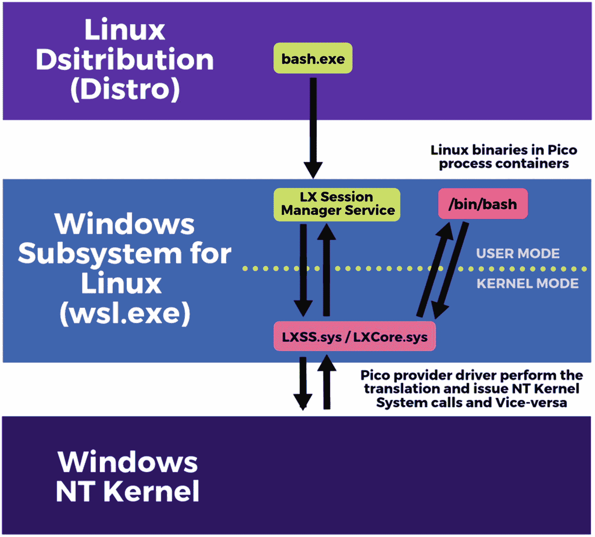
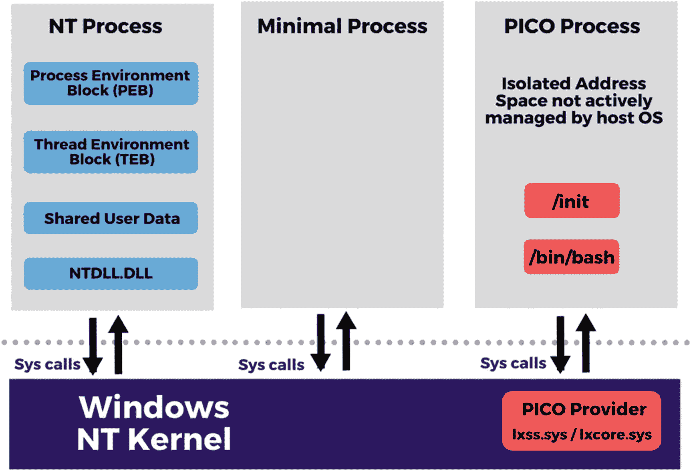
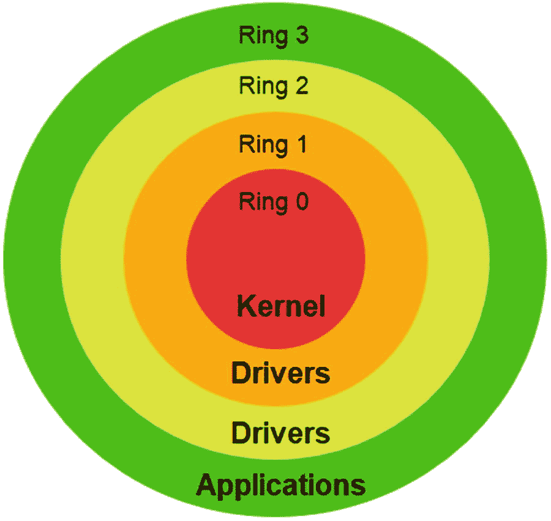
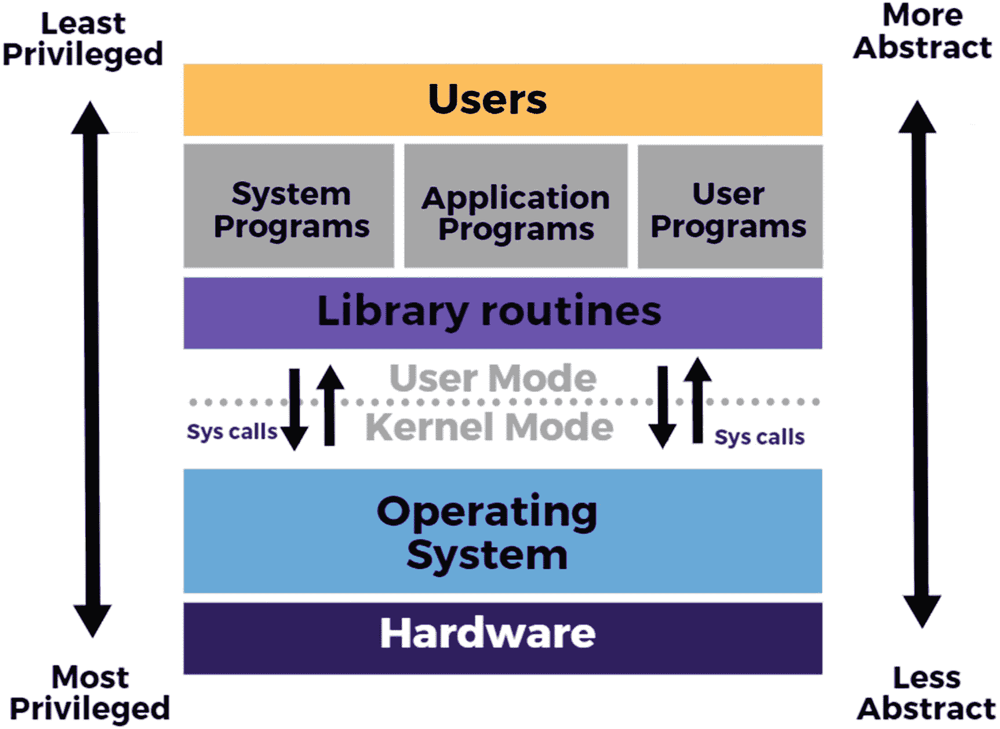

# 一、WSL 入门

Windows Subsystem for Linux (WSL)不是 Windows 操作系统中存在的第一个子系统；相反，它是多年来开发与主机操作系统分离的应用沙箱隔离子系统的研究的更完善的产品。

在我们深入探讨 Linux 的 Windows 子系统的设置、配置和工作方式之前，让我们先看看它是如何开始的，然后快速浏览一些关键词和定义，这将使我们进入同一页面，并帮助我们阅读本书的各个章节。

本章的 WSL 初级读本肯定会有所帮助，但是如果你想直接进入设置和实际操作，现在可以跳过它。

## Windows 子系统的历史

自 Microsoft Windows NT 的初始版本以来，操作系统被设计为允许一个或多个子系统在操作系统中共存，这些子系统独立于内核中的实现。这允许我们在 Win32 子系统中的 Windows 64 位操作系统上运行 Windows 32 位应用，并支持其他子系统，如 POSIX 和 OS/2。

这些子系统可以通过它们提供给在其上运行的应用的 API 来访问，当应用调用 API 时，它会被转换成适当的 Windows NT 系统调用，以便于执行所请求的操作。但是，随着时间的推移，这些最初的子系统被淘汰了，于是研究人员开始开发和扩展用于 Linux 的 Windows 子系统的功能。

导致 Linux 的 Windows 子系统的最初概念源于一个名为“Project Astoria”的项目，这是一个通用的 Windows 平台桥工具包，允许开发人员通过重用他们的 Android 代码或在 Windows 上运行原生 Android 应用来为手机构建 Windows 应用。这是通过允许 Android 应用在模拟环境中运行，只需进行最小的更改并访问微软平台 API 而实现的。但是，在 2016 年 2 月 25 日，微软正式宣布将停止“Astoria 项目”,并提出了这样一个论点，即这样一个仿真器对于原生的 Objective-C 工具链来说是多余的。后来，来自“Astoria 项目”和另一个名为“Project Drawbridge”的研究项目(这两个项目将在本章后面介绍)的见解和研究被开发成一个兼容性服务，称为 Linux 版本 1 的 Windows 子系统。微软在 2016 年发布了 Linux 的 Windows 子系统的初始版本，也称为 WSL1。

## WSL 一览

用于 Linux 的 Windows 子系统是一种新的 Windows 操作系统兼容层功能，允许用户在 Windows 中本机运行 Linux 命令行工具、实用程序和未修改的 ELF64 二进制文件，而无需实际运行完整的 Linux 虚拟机。Linux 的 Windows 子系统是作为开发人员的工具开发的，但它在系统管理员和网络安全领域也有很高的采用率。

WSL 不仅仅是 Windows 上的一个 Linux“bash”shell；事实上，它是一个完整的兼容层，用于运行一个外观和行为都像 Linux 操作系统的环境。它使 Windows 用户能够运行常见的免费命令行软件，如“grep”、“sed”和“awk”或 Linux 发行版中的任何其他 ELF64 二进制文件，这些文件通常可以从微软商店免费下载。这意味着现在我们可以在 Windows 操作系统上使用具有类似 Linux 的用户体验的 Linux 工具，如 bash、vim 和 Emacs，而无需使用任何第三方 POSIX 兼容环境，如 Cygwin。

微软通过 WSL 的初始版本，也就是版本 1 或 wsl.exe，无疑已经拓展了操作系统研究的范围。现在，它不再是关于操作系统或站在 Windows 或 Linux 用户一边，而是基本上深入到为最终用户提供市场上最好的工具来解决他们的问题并构建应用，而不管底层平台如何。

## WSL1 的优势

让我们假设您是 Windows 系统管理员或 Windows 开发人员，您正在浏览互联网上的一些如何设置 web 服务器之类的文章，突然，您在指令中看到一个美元符号($)提示 bash shell。这种内心独白马上就会开始:

*   哦，不！我不习惯这样；我的系统里没有这个。我可能必须启动一个虚拟机并在其上运行 Linux，然后才能按照 how-to 文章中的说明进行操作。但是那是很大的工作量！我不会这么做的。

这是成为 Linux 的 Windows 子系统起源的问题之一。更简单地说，有必要拥有一个子系统，它可以为开发人员和系统管理员提供无缝的能力，使他们能够立即在 Windows 上运行 bash 这样的 Linux 二进制文件。这可以消除在启动虚拟机和安装 Linux 操作系统以执行一些基本任务时所花费的担心、麻烦和时间。

以下要点进一步强调了 Windows Linux 子系统填补的空白和领域:

*   **资源消耗**–虚拟机为我们提供了很好的服务，并且不会有任何变化，但在内存、CPU 和存储方面肯定会有一些资源开销，而对于 Linux 的 Windows 子系统，底层主机操作系统上的资源消耗是最小的。老实说，如果我们有一个 bash shell 在 Linux 的 Windows 子系统中运行，那么仅仅为了检查几个 Linux 命令而启动一个虚拟机是没有任何意义的。

*   **访问 Linux 工具**–在 Windows 操作系统上运行 Linux 二进制文件，通过向 Windows 用户提供大多数强大的 Linux 应用和工具，为他们打开了一个全新的机会之窗。

*   **跨平台开发**–开发人员和系统管理员都可以利用 Linux 的 Windows 子系统来开发跨平台产品和工具，如。网芯。也就是说，我可以很容易地在 Windows 上测试一个项目，然后在 Linux 的 Windows 子系统中测试，甚至不需要启动 Linux 虚拟机。

*   **为正确的工作提供正确的工具**–我们的想法是使用最好的工具，而不考虑底层平台。这意味着，如果我愿意在 Linux 上部署 nginx web 服务器，那么我可以在 Windows 操作系统的一个子系统中这样做，这个子系统允许您像在 Linux 机器上运行一样运行 nginx。

*   **相同的用户体验**–WSL 提供的不仅仅是集成；它为 Linux 开发人员提供了无缝体验。大多数时候，开发人员甚至不会意识到他们不是在 Linux 操作系统上工作，而是在 Windows 操作系统之上运行原生 Linux 二进制文件的翻译层。

*   **安全隔离**–由于 WSL 是一个子系统，在其上运行的应用实际上是在一个安全、隔离的容器中运行，不会危及主机操作系统上的其他应用。

现在让我们来看看 WSL 的架构和一些内部组件，这些组件使它能够如此无缝地工作。

## WSL1 的架构和组件

WSL 是由 Microsoft 实现的软件组件和驱动程序的集合，充当 Linux 用户空间和底层 Windows NT 内核之间的转换层，以转换系统调用、虚拟文件和文件系统。WSL 由用户模式和内核模式组件组成，这种从 Linux 用户空间到 Windows NT 内核的转换服务模拟了 Linux 内核，因此 Linux 应用甚至没有意识到它们不是在与 Linux 内核交互，而是在与 Windows NT 内核交互。让我们试着从图 [1-1](#Fig1) 来理解这一点。

图 1-1

WSL1 的架构

当“bash.exe”从主机 Windows 操作系统启动时，它会在一个 Linux 实例中启动一个 Linux 进程:/bin/bash，该进程保存一个数据结构来跟踪所有进程、线程和运行时状态。“LX 会话管理器服务”处理这种 Linux 实例的生命周期。该服务的作用是充当 Linux 子系统驱动程序的代理，并且该服务在安装和卸载的情况下也有帮助，以便同步操作，从而一次只允许一个进程执行这些操作。

2011 年，微软的一个研究团队启动了一个名为“ [`Drawbridge`](https://www.microsoft.com/en-us/research/project/drawbridge) ”的项目，该项目后来引入了一个在 Windows 中实现的概念，即 PICO process。PICO 进程是一个基于进程的隔离容器，具有一个小的内核 API 表面，允许子系统在其中保存 Linux 二进制文件。当您在这些 Linux 二进制文件上执行任何操作时，容器或 PICO 进程结合 *lxss.sys* 和 *lxcore.sys* ，也称为 PICO provider 驱动程序，执行 Linux 系统调用到 NT APIs 的转换，以模拟 Linux 内核。简单地说，PICO 提供者向 Windows NT 内核发出等同于 Linux 系统调用的系统调用，反之亦然。

如图 [1-2](#Fig2) 所示，这些微微进程是普通主机进程的精简版本，具有隔离的地址空间，其中用户模式二进制【ntdll.dll】和没有映射，并且没有创建进程环境块(PEB)作为区分器，以便主机了解这些进程不是由主机主动管理的。主机仍然为这些进程提供底层操作系统支持，如线程调度、内存管理等。

图 1-2

NT 进程、最小进程和微微进程

内核模式驱动程序不包含任何来自 Linux 内核的代码，因此当从可执行文件发出 Linux 系统调用时，Windows NT 内核会将请求转发给 *lxcore.sys* ，后者会负责将 Linux 系统调用转换为等效的 Windows NT 调用。但是有一些 Linux 系统调用，比如 *fork()* ，在 Windows NT 中没有对应的调用。因此 *lxcore.sys* 必须使用内部 Windows NT 内核 API 复制并创建一个包含正确数据的新进程，以方便来自 Linux 的 Windows 子系统的任何此类请求。

## WSL1 的缺点

就像任何软件或工具一样，Windows Subsystem for Linux version 1 也有局限性和缺点，我们将在下面的指针中讨论其中的一些。公平地说，WSL 是一个不断发展的产品，随着产品的不断发展，其中一些限制将会减轻:

*   Linux 是一个快速发展的开源操作系统，不时会有新的版本发布，但 WSL 中实现的翻译服务完全由微软管理，只要有新版本发布，他们就必须更新它。这在当前 Linux 版本的新特性中引入了延迟，直到微软继续前进并实现它们。

*   Windows NT 和 Linux 内核具有非常不同的文件系统、权限模型和内存管理，即使在 Windows 子系统中的最佳情况下，WSL 也不能将一些内容转换到 Windows NT 内核，因为在最坏的情况下，Windows 内核不支持这些内容。

*   WSL v1 不能运行所有的 Linux 软件，比如 32 位二进制文件，而且您可能会遇到不能在 WSL 上运行的软件，因为这些软件需要特定的 Linux 内核服务，而 Microsoft 尚未实现这些服务。以下是在 WSL 上运行和不运行的社区支持程序列表的链接: [`https://github.com/ethanhs/WSL-Programs`](https://github.com/ethanhs/WSL-Programs) 。WSL2 通过在使用 Hyper-V 的轻量级实用虚拟机上运行 Linux 内核，解决了很多这样的问题。

Note

上述受支持和不受支持软件的列表由 Windows Subsystem for Linux 用户社区和独立贡献者维护，而不是由 Microsoft 维护。

*   用于 Linux 的 Windows 子系统通过使用 Xfce 和 xRDP 安装 Linux 桌面环境来支持图形用户界面(GUI)应用和完整的桌面体验，但是它仍然缺乏音频支持，并且提供较差的图形性能。如果在 WSL1 上继续进行任何积极的开发，这些问题可能会在 WSL1 的未来版本中得到解决。不仅如此，微软现在已经把所有的木头放在 WSL2 后面的一个箭头中，wsl 2 使用不同的方法针对相同的问题，并且许多这些问题将被自动修复。

Note

WSL2 仅在 Windows 10 版本 2004 (build 19041)上受支持，您必须加入“Windows Insider 计划”并选择“发布预览”环。这可能会在 5 月底或这本书发行的时候上市。

*   微软提出，Linux 的 Windows 子系统是为开发应用和增强开发人员的用户体验而设计的，而不是为桌面计算机和生产服务器而设计的，这排除了大量的用例和应用。

*   在 Microsoft Windows 中引入新的可执行文件格式，以及大量新的 Linux 应用，为终端软件安全供应商带来了巨大的挑战。2017 年，端点安全公司 Check Point 发表了一项研究，他们创造了 bashware (bash + malware)这个术语，它利用并利用 WSL 的底层机制在 Windows 上运行 ELF64 二进制文件。

这是之前引用的研究:

[`https://research.checkpoint.com/2017/beware-bashware-new-method-malware-bypass-security-solutions/`](https://research.checkpoint.com/2017/beware-bashware-new-method-malware-bypass-security-solutions/)

在这项研究中，研究人员试图证明他们可以使用 WSL 作为工具，从 Linux 子系统运行攻击 Windows 的恶意软件，但公平地说，微软已经在努力提供 WSL 上的防火墙和[防病毒兼容性](https://research.checkpoint.com/2017/beware-bashware-new-method-malware-bypass-security-solutions/)。

## 关键词和概念

在这一节中，我们将回顾组成 WSL 的一些关键术语和重要概念。表 [1-1](#Tab1) 提供了一些我们将在本书接下来的章节中使用的缩写。

表 1-1

重要缩写

<colgroup><col class="tcol1 align-left"> <col class="tcol2 align-left"></colgroup> 
| 

缩写

 | 

膨胀

 |
| --- | --- |
| 西北地区(Northwest Territories) | 新技术 |
| 发行版本 | 分发包 |
| 旧历法 | 操作系统 |
| 伏特计 | 虚拟计算机 |
| WSL | 面向 Linux 的视窗子系统 |
| 极低频 | 可执行文件和链接格式 |
| 体育课 | 可移植可执行文件 |
| 应用接口 | 应用界面 |
| 戊巴比妥 | 过程环境块 |

现在，我们将快速浏览一些基本的关键字、概念和定义，以帮助您理解 Linux 的 Windows 子系统，并在开始学习之前为您打下一些基础。如果你不是一个 Linux 用户，你可能不熟悉其中的一些概念，并且来自 Windows 端，这些将加速你的学习。

### 发行版本

Distro 是 Linux 发行版的缩写，它只是一个由开源软件包、工具和库组成的操作系统。Linux 用户基本上可以从网上各种各样的发行版中下载并安装他们选择的 Linux 发行版，这就是他们获得操作系统的方式。WSL 的 Linux 发行版既可以从微软商店下载，也可以手动下载，这一点我们将在本书后面介绍。这些发行版由合作伙伴提供，而不是由微软提供。虽然现在有超过 500 个 Linux 发行版可用，其中大多数也在积极开发中，但也有一些商业发行版，如 Fedora、openSUSE 和 Ubuntu。Ubuntu 实际上是最流行的桌面 Linux 发行版之一。此外，一些 Linux 发行版完全是社区驱动的，比如 Debian、Slackware、Gentoo 和 Arch Linux。

### 子系统

从一开始，Windows NT 就允许子系统(如 Win32 子系统)与 NT 内核共存。在操作系统的上下文中，子系统是大型软件中的自包含系统，就像操作系统一样。

在 Windows NT 中，这些子系统充当用户模式应用和操作系统内核功能之间的接口，并且存在多个子系统，实现完全不同的 API 集来支持为许多不同类型的操作系统编写的应用。在 Windows 10 操作系统上，只有可以运行 32 位 Windows 应用的 Win32 子系统存在，而 OS/2 子系统和 POSIX 子系统不再存在，并且已经停止使用。

### 核心

现代操作系统构建成多层，内核是操作系统的核心组件，如图 [1-3](#Fig3) 所示。内核之所以如此命名，是因为就像硬壳中的种子一样，Linux 内核作为核心组件存在于 Linux 操作系统中。内核主要充当用户应用和硬件之间的接口。

图 1-3

内核是操作系统最里面的层/环

在图 [1-3](#Fig3) 中，最外面的“绿色”环代表最低特权；这意味着环 3 中的应用最不可信，需要更高的特权来执行关键操作，而内核是最里面的环，用“红色”表示特权最高或最可信，即环 0。

这样做的主要目的是促进硬件-软件通信，并执行其他低级操作，如

*   进程管理

*   中断处理

*   内存管理

*   设备管理

*   输入输出通信

*   文件系统

当计算机系统启动时，引导程序首先将内核加载到主内存中。拥有一个小的内核是很重要的，因为它驻留在内存中执行前面提到的基本服务，并且它应该在内存中以保护模式运行，这样它就不会被其他正在运行的程序覆盖，这可能是灾难性的。

### 核心态

简而言之，在内核模式下运行的程序或指令可以完全且不受限制地访问底层硬件。一般来说，内核模式是为操作系统的低级、最关键的功能保留的，在这种情况下，任何崩溃都可能是灾难性的，并且可能会破坏整个系统。所有用户进程都将在用户模式下执行，直到它们得到一个系统调用。任何系统调用都在内核模式下执行，内核模式下会生成一个系统陷阱，并且模式位被设置为零(0)。一旦执行完成，就会生成另一个系统陷阱，将模式位设置为一(1)。图 [1-4](#Fig4) 显示了内核态和用户态的关系。

图 1-4

用户模式和内核模式

### 用户状态

计算机系统上运行的大多数程序和代码都以用户模式执行，用户模式不能直接访问系统硬件，只能通过系统 API 访问资源。这种隔离是通过设计并使用保护环来保护的，保护环是计算机系统架构中两个或多个分级权限级别之一。这样，由于权限级别的限制，用户模式(通常是最外面的保护环)中的任何崩溃都不会影响系统上的任何其他东西，并且这种崩溃总是可恢复的。整个目的是防止用户程序意外地用用户数据覆盖关键的操作系统文件，或者防止不止一个进程试图写或操作相同的文件而以灾难性的失败告终。

### 系统调用

简单来说，系统调用或 syscall 是内核提供的服务，可以从用户模式程序中调用，以与底层操作系统进行交互。就计算而言，系统调用是计算机程序通过 API(应用接口)以编程方式从运行它的操作系统内核请求服务的一种方式。系统调用是内核系统访问系统资源的入口点，比如内存、进程、文件访问等等。

表 [1-2](#Tab2) 提供了一些 Windows 和 Unix 系统调用，只是为了让您了解系统调用提供的服务种类以及可用的类型。

表 1-2

用于翻译的 Windows 和 Unix 系统调用映射

<colgroup><col class="tcol1 align-left"> <col class="tcol2 align-left"> <col class="tcol3 align-left"></colgroup> 
| 

种类

 | 

Windows 系统调用

 | 

Unix 系统调用

 |
| --- | --- | --- |
| 进程管理 | CreateProcess() | 叉子( ) |
|   | ExitProcess() | 退出( ) |
|   | WaitForSingleObject() | 等待( ) |
| 文件处理 | CreateFile() | 打开( ) |
|   | 读取文件（） | 阅读( ) |
|   | WriteFile() | 写( ) |
|   | CloseHandle() | 关闭( ) |
| 设备操纵 | SetConsoleMode() | ioctl() |
|   | ReadConsole() | 阅读( ) |
|   | WriteConsole() | 写( ) |
| 沟通 | CreatePipe() | 管道( ) |
|   | CreateFileMapping() | shmget() |
|   | MapViewOfFile() | mmap() |
| 进入和保护 | SetFileSecurity() | chmod() |
|   | InitlializeSecurityDescriptor() | umask() |
|   | SetSecurityDescriptorGroup() | 乔恩（） |
| 多方面的 | GetCurrentProcessID() | getpid() |
|   | 设置计时器（ ） | 警报( ) |
|   | 睡眠( ) | 睡眠( ) |

### Windows NT 内核

装有微软视窗操作系统的计算机系统由视窗内核组成，也称为视窗 NT 内核。Windows NT 的早期版本被开发成两种变体，第一种用于工作站，第二种用于服务器计算机。它是基于 MS-DOS 的继任者，后来发展成为我们今天使用的 Windows 10 操作系统。

Windows 操作系统架构由组件组成，大致分为用户模式和内核模式:

*   硬件抽象层(HAL ),它是一个软件层，充当底层硬件和操作系统高层之间的接口

*   Windows 内核

*   内核模式驱动程序

*   用于以下目的的内核模式执行服务:
    *   对象管理

    *   内存管理

    *   进程和线程管理

    *   输入/输出管理

    *   在内核模式下运行的配置管理驱动程序和其他支持服务

*   用户模式驱动程序

*   用户模式环境子系统

Note

大多数驱动程序在用户模式下运行以获得稳定性，但仍有一些例外，如视频驱动程序在用户和内核模式下都被分段以提高性能，这在 Windows Vista 性能问题引起强烈抗议后再次改变。在哪里保存这些驱动程序仍然没有明确的界限，这是一个讨论和实验的问题。

### Linux 内核

Linux 内核是 Linux 操作系统的核心组件，充当系统硬件及其进程之间的接口。它受欢迎的主要原因之一是它是免费和开放源码的，这吸引了来自世界各地的贡献者。Windows NT 内核和 Linux 内核的主要区别在于，Windows 内核附带了一个商业软件(操作系统)，而 Linux 内核是开源的，可以免费下载。

一旦 Linux 版本 2 的 Windows 子系统(WSL2)正式推出，微软将开始提供一个完整的 Linux 内核和 Windows 操作系统，该操作系统将完全由微软管理，并通过 Windows updates 进行更新。

### 极低频

ELF 代表可执行和链接格式，它是可执行文件、目标代码、共享库和核心转储的通用标准文件格式。ELF 被设计成灵活、可扩展和跨平台的，这意味着它不局限于特定的处理器、指令集或硬件架构。这使得 ELF 格式被许多不同硬件平台上的不同操作系统所采用。

使用 ELF 文件格式的可执行文件由 ELF 文件头和文件数据组成，文件数据包括

*   **程序头表**–列出 0 个或多个内存段；这些内存段包含文件运行时执行所需的信息。

*   **章节标题表**–列出 0 个或多个章节；其中包含用于链接和重定位的重要数据。

*   **文件数据**–程序头或段头表中引用的数据。

### 微微过程

在隔离环境中运行应用的传统使用案例中，我们使用安装了特定操作系统的虚拟机来将应用与任何底层主机操作系统的依赖性分离。这种方法对我们很有效，并且已经达到了目的，它为独立于底层操作系统的应用提供了安全隔离，同时允许兼容性和执行连续性，这使我们甚至能够将应用迁移到其他操作系统或计算机上。

尽管有这些优势，虚拟机在磁盘、内存、CPU 等方面有很大的资源开销。因此，微软开始研究一个名为 [`Drawbridge`](https://www.microsoft.com/en-us/research/project/drawbridge) 的项目，目的是开发一种新的计算方式，目标是实现一种轻量级方法来在隔离环境中运行应用，使应用的操作系统依赖性与底层主机操作系统分离。Project Drawbridge 结合了两项核心技术:

1.  **微微工艺**–**P**基于工艺的**I**solation**CO**ntainer

2.  **库操作系统**–应用工作负载的目标操作系统，独立于底层操作系统运行。这就是 WSL 分发包发挥作用的地方，它使 Linux 的 Windows 子系统能够工作。

PICO 进程旨在限制底层操作系统管理该进程内的用户模式地址空间，它只是普通主机进程的较小版本，与内核模式驱动程序一起工作，充当主机操作系统内核和用户模式库操作系统之间的代理。

为了阻止底层操作系统管理这些微微进程，这些进程被标记为一个最小进程，它告诉主机的其余部分不要管理这些进程。与传统的 NT 进程不同，当生成一个最小化的进程时，不会创建线程在该进程中运行，用户模式的地址空间也不会改变。更简单地说，PICO 进程是与内核模式驱动程序相关联的最小进程。

## 摘要

在前面的小节中，我们学习了 Linux 的 Windows 子系统的架构概述和组件，以及它的优缺点。我们还研究了一些与 Windows 和 Linux 操作系统相关的重要关键词和概念，以及一些核心思想和概念，如 PICO process，这将有助于您理解 WSL 的内部工作方式。

在下一章，我们将学习在 Windows 10 操作系统上安装和设置 WSL。