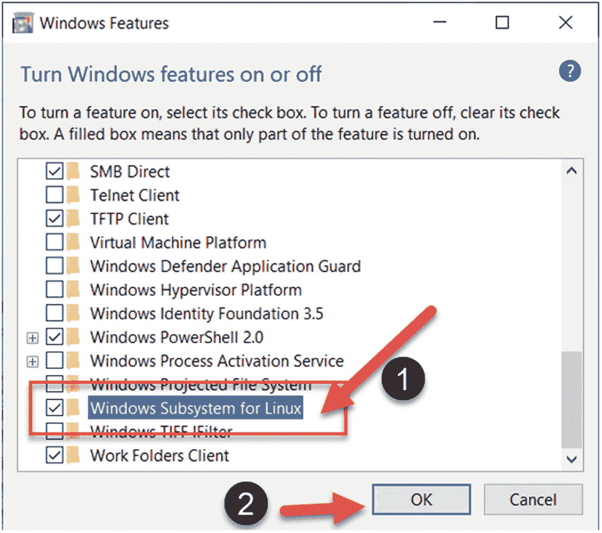
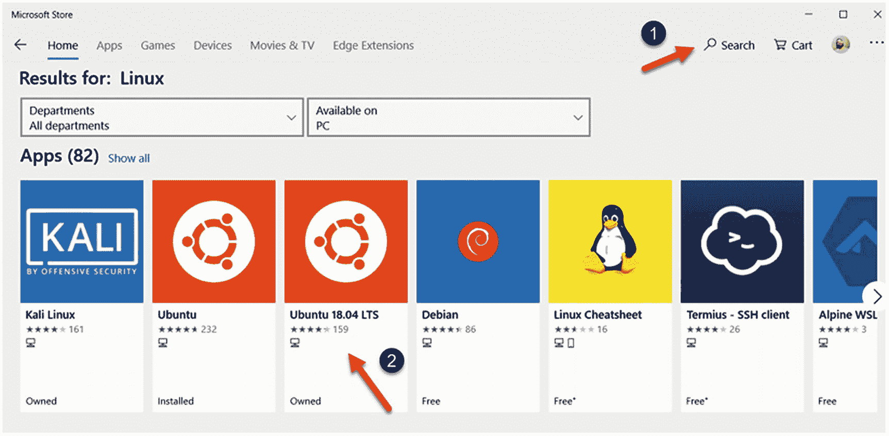
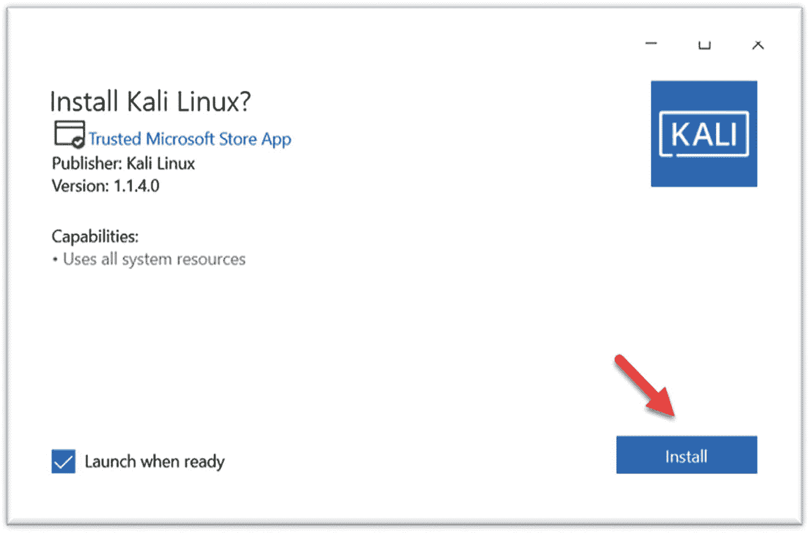
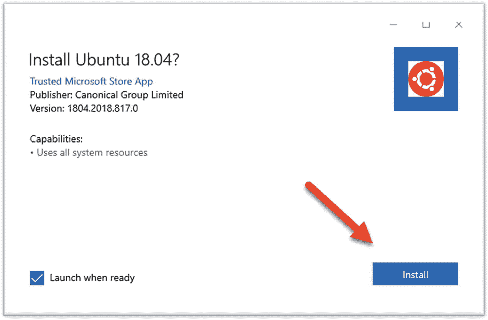
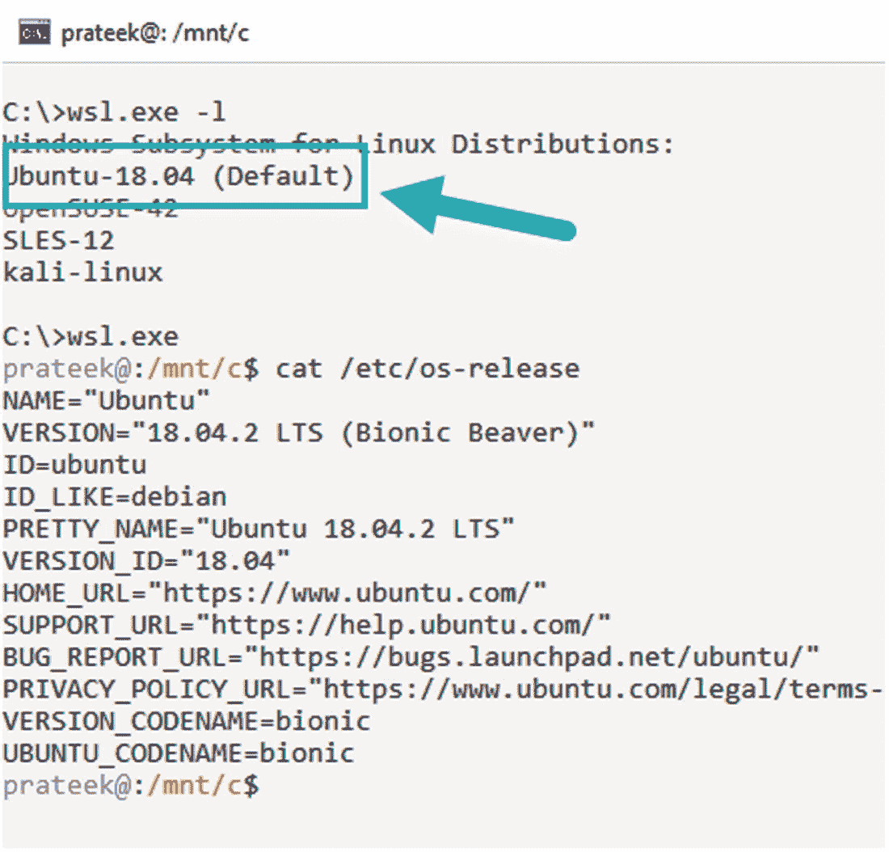
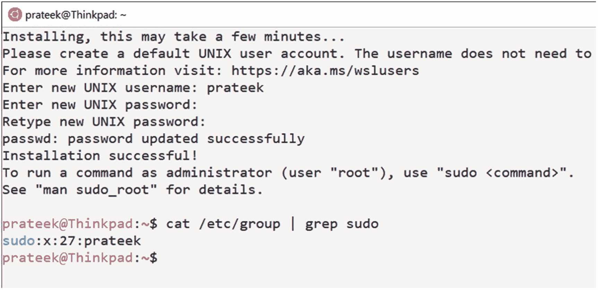
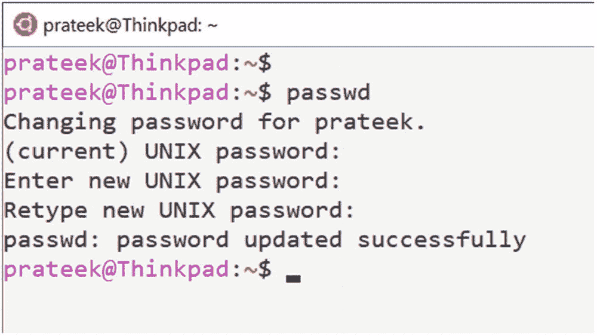
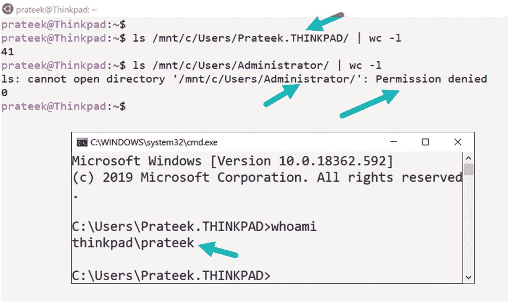
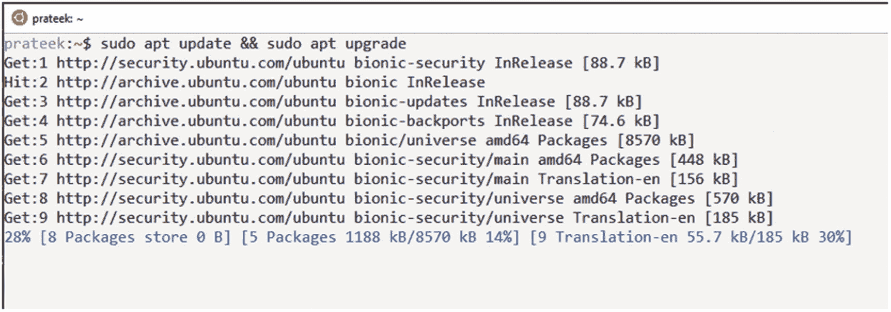
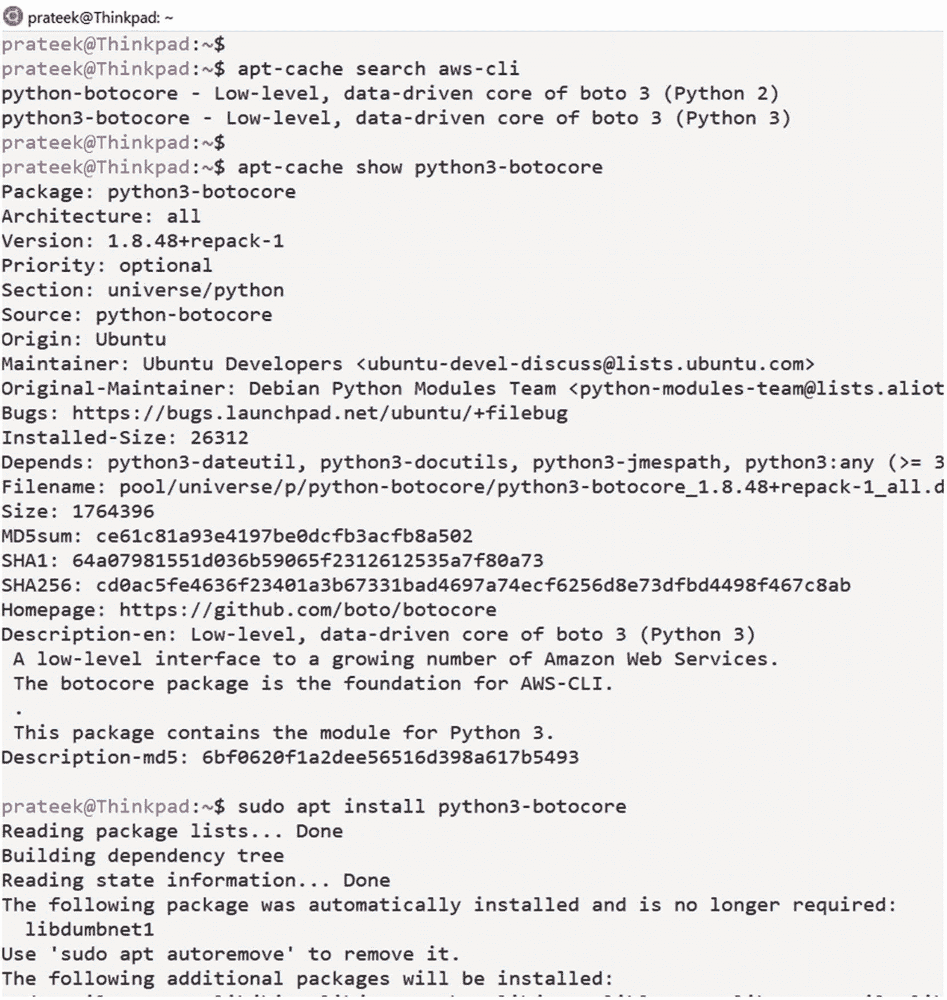

# 二、下载、安装和设置

适用于 Linux 的 Windows 子系统是一项兼容性功能，它充当转换层，但在使用之前必须启用。然后我们需要从微软商店安装一个 Linux 发行版，最后在第一次使用之前进行设置。让我们一个接一个地开始这些步骤。

## 启用 WSL 功能

Linux 的 Windows 子系统需要在主机操作系统级别启用，有两种方法可以实现这一点:第一种是使用图形用户界面(GUI ),第二种是使用 PowerShell。除非您启用 Windows Subsystem for Linux 特性，否则您无法在您的系统上运行 WSL，并且您将收到如图 [2-1](#Fig1) 所示的以下错误。这个图像是在我的系统上安装 Linux 发行版时捕获的，没有启用 WSL 特性，因此出现了错误。

表 2-1

Linux 发行版和直接下载 URL

<colgroup><col class="tcol1 align-left"> <col class="tcol2 align-left"></colgroup> 
| 

分发名称

 | 

下载 URL

 |
| --- | --- |
| Ubuntu 18.04 | [`https://aka.ms/wsl-ubuntu-1804`](https://aka.ms/wsl-ubuntu-1804%250d) |
| Ubuntu 18.04 ARM | [`https://aka.ms/wsl-ubuntu-1804-arm`](https://aka.ms/wsl-ubuntu-1804-arm%250d) |
| Ubuntu 16.04 | [`https://aka.ms/wsl-ubuntu-1604`](https://aka.ms/wsl-ubuntu-1604) |
| Debian GNU/Linux | [`https://aka.ms/wsl-debian-gnulinux`](https://aka.ms/wsl-debian-gnulinux) |
| Kali Linux | [`https://aka.ms/wsl-kali-linux`](https://aka.ms/wsl-kali-linux) |
| OpenSUSE Leap 42 | [`https://aka.ms/wsl-opensuse-42`](https://aka.ms/wsl-opensuse-42) |
| SUSE Linux 企业版 12 | [`https://aka.ms/wsl-sles-12`](https://aka.ms/wsl-sles-12) |
| WSL 的 Fedora 混音 | [`https://github.com/WhitewaterFoundry/WSLFedoraRemix/releases/`](https://github.com/WhitewaterFoundry/WSLFedoraRemix/releases/) |


图 2-1

WSL 功能未启用

让我们从第一种方法开始。

### GUI 方法

要从 GUI 启用 WSL，请按照下列步骤操作:


图 2-2

启动“程序和功能”

1.  按 Windows + R 键启动运行对话框。

2.  现在键入 *appwiz.cpl* 并点击 Enter 按钮或点击 OK，如图 [2-2](#Fig2) 所示。


图 2-3

选择“打开或关闭 Windows 功能”

1.  这将弹出“程序和功能”窗口，您必须从左上角选择“打开或关闭 Windows 功能”，如图 [2-3](#Fig3) 所示。



图 2-4

单击“用于 Linux 的 Windows 子系统”功能复选框

1.  一个新的“Windows 功能”窗口将在您的屏幕上弹出。请向下滚动并左键选中“Windows Subsystem for Linux”旁边的复选框(图 [2-4](#Fig4) )。

1.  这将启用 Windows 功能，但仍需要重新启动系统才能看到配置和更改生效。一旦系统重新启动，您现在可以运行 WSL，而不会看到任何错误，如图 [2-1](#Fig1) 所示。

现在让我们看看使用 PowerShell 的第二种方法。

### PowerShell 方法

使用 PowerShell 为 Linux 启用 Windows 子系统是一个简单的过程:

1.  运行以下 cmdlet 可能是最简单的方法:


图 2-5

按“Y”确认启用该功能

1.  一旦你运行它，它会提示重启你的系统，如图 [2-5](#Fig5) 所示。按“Y”并按回车键启用 Windows 功能。

```sh
Enable-WindowsOptionalFeature -Online -FeatureName
      Microsoft-Windows-Subsystem-Linux

```

## 下载并安装 Linux 发行版

在启用 Windows 特性来支持 Linux 的 Windows 子系统之后，您必须安装一个来自微软合作伙伴的 Linux 发行包，比如 Ubuntu、Debian、Kali Linux 等等，以运行 WSL 的一个实例。有多种方法可以下载分发包(distros)，下面列出了一些方法以及您需要执行的具体步骤。

### 从 Microsoft 商店下载

Linux 发行版可以在以下说明的帮助下直接从微软商店下载:



图 2-6

搜索发行版并单击它

1.  点击开始菜单，搜索“微软商店”。然后点击它启动微软商店。

2.  在右上角，有一个搜索框(步骤 1)；键入“Linux”并按回车键。您将在搜索结果中看到一些 Linux 发行包。

3.  仅仅为了举例，我们将从微软商店下载 Ubuntu 18.04 LTS(发行版)，点击它(步骤 2)，如图 [2-6](#Fig6) 所示。


图 2-7

点击“安装”按钮

1.  这将打开发行版页面，您会发现右上角有一个“安装”按钮，如图 [2-7](#Fig7) 所示，一旦您单击此按钮，它将开始在您的系统上安装发行版，它将作为 Windows 上的一个应用提供。

### 手动下载发行版

微软已经创建了直接链接，通过 [`https://aka.ms/`](https://aka.ms/) 风格的短 URL 下载大量流行的 Linux 发行版，如表 [2-1](#Tab1) 所列。这意味着您可以访问其中一个 URL 并下载 Linux 发行版，如果您的系统通过组策略禁用/阻止了 Microsoft Store，这种方法会非常有用。

下载完成后，请双击应用包(*。appx)文件来安装 Linux 发行版，如图 [2-8](#Fig8) 所示。



图 2-8

安装发行版应用包(*。appx)下载后

### 使用 PowerShell 下载

使用 PowerShell，使用`Invoke-WebRequest` cmdlet 并将直接下载 URL 作为参数传递给“-URI”参数，可以很容易地下载 WSL 分发包。清单 [2-1](#PC2) 中的 PowerShell 代码演示了如何下载 Ubuntu 18.04 应用包。类似地，前面提到的其他 URL 也可以用来下载 WSL 的各种发行版。可以通过更改进度偏好变量`$ProgressPreference = 'SilentlyContinue'`来静音进度条；这将更快地下载软件包，而不会在您的控制台上弹出任何进度条，在 PowerShell v5.1 和更低版本中，这可以提高下载速度。

使用管理权限启动 PowerShell 控制台，复制粘贴以下代码片段，然后按 Enter 键执行它。

```sh
$URL = 'https://aka.ms/wsl-ubuntu-1804'
$Filename = "$(Split-Path $URL -Leaf).appx"
$ProgressPreference = 'SilentlyContinue'

# starts download from the URL
$Params = @{
    URI = $URL
    OutFile = $Filename
    UseBasicParsing = $true
}
Invoke-WebRequest @Params

# invoking the application package
# to start the installation
Invoke-Item $FileName

Listing 2-1Downloading Linux (Ubuntu 18.04) distribution using PowerShell

```

运行这段代码将下载 Ubuntu 18.04 LTS 应用作为一个文件:`wsl-ubuntu-1804.appx`。下载完成后，您可以在。appx 文件在当前工作目录下运行应用安装 GUI，然后点击下一步安装如图 [2-9](#Fig9) 所示。



图 2-9

单击“下一步”开始安装发行版

或者，可以使用 PowerShell cmdlet `Add-AppxPackage`添加每个应用包(* .appx)到用户帐户(列表 [2-2](#PC3) )。

```sh
$URLs = @(
    "https://aka.ms/wsl-ubuntu-1804",
    "https://aka.ms/wsl-ubuntu-1804-arm",
    "https://aka.ms/wsl-ubuntu-1604",
    "https://aka.ms/wsl-debian-gnulinux",
    "https://aka.ms/wsl-kali-linux",
    "https://aka.ms/wsl-opensuse-42",
    "https://aka.ms/wsl-sles-12"
)

$ProgressPreference = 'SilentlyContinue'
$ErrorActionPreference = 'Stop'

Foreach($URL in $URLs){
    $Filename = "$(Split-Path $URL -Leaf).appx"
    Write-Host "Downloading: $Filename" -Foreground Yellow -NoNewline
    try{
        $params = @{
            Uri = $URL
            Outfile = $Filename
            UseBasicParsing = $true
        }
        Invoke-WebRequest @params
        Add-AppxPackage -Path $Filename

        if($?){
            Write-Host " Done" -Foreground Green
        }
    }
    catch{
        Write-Host " Failed" -Foreground Red
    }
}

Listing 2-2Adding all Linux distribution packages to user account

```

如果执行 PowerShell 代码，它将一个接一个地安装所有的 Linux 发行版，如图 [2-10](#Fig10) 所示，您也可以通过进入开始菜单并检查最近添加的应用来验证这一点。


图 2-10

Linux 发行版将出现在开始菜单中

### 使用 curl.exe 下载

发音为“curl”是一个非常流行的开源命令行工具，用于执行 web 请求和从命令行传输数据。`curl.exe`可以与 URL 一起使用，将 WSL 分发包下载到本地机器:

```sh
curl.exe -L -o wsl-kali-linux.appx https://aka.ms/wsl-kali-linux

```

图 [2-11](#Fig11) 展示了一旦我们用一个指向 Linux 发行包的直接 URL 运行*curl.exe*，它将下载这个包并保存在本地路径上，这个路径被传递了一个参数给“-o”参数，就像我们例子中的`wsl-kali-linux.appx`；如果需要，可以定制这个输出文件名，输出将被写入一个新文件。当您在 bash 脚本中使用 WSL 的下载和设置时，使用`curl.exe`是有益的，在这种情况下，我们在前面小节中使用的 PowerShell cmdlets 将不起作用。


图 2-11

使用 curl 下载 Linux 发行包

Note

我们运行的是 curl.exe，而不是 curl，因为在 PowerShell 中，curl 也是 Invoke-WebRequest cmdlet 的别名，这完全是两码事。

## 设置和配置 WSL

在上一节中，我们学习了在我们的系统上下载和安装 Linux 的 Windows 子系统的各种方法。下一件事是学习如何为第一次使用准备和配置 WSL，但是在此之前，让我们研究一下在 Linux 的 Windows 子系统中运行 Linux 发行版的各种方法。

### 启动发行版

Linux 发行版可以作为已安装的应用启动，或者通过运行特定于 Linux 发行版的可执行文件，甚至使用*wsl.exe*来启动。让我们一次研究一种方法。

#### 使用应用

因此，首先，进入开始菜单，键入发行版的名称，如“Ubuntu”，如图 [2-12](#Fig12) 所示。


图 2-12

转到开始菜单，搜索 Linux 发行版的名称

现在，双击 Ubuntu 应用，如图 [2-12](#Fig12) 中突出显示的应用，首次启动 Linux 的 Windows 子系统。它会提示您等待几分钟，准备并初始化第一次使用的发行版。

#### 使用 wsl.exe

WSL 发行版也可以通过`wsl.exe`启动；如果您不带任何参数运行这个可执行文件，那么它将启动默认的分发包，如图 [2-13](#Fig13) 所示。


图 2-14

使用 wsl.exe 启动特定的 Linux 发行版



图 2-13

使用 wsl.exe 启动默认的 Linux 发行版

要列出安装在您系统上的所有分发包并确定默认的分发包，请运行带有`--list`或`–l`的`wsl`可执行文件:

```sh
wsl.exe –list
wsl.exe –l

```

通常需要运行一个特定的分发包；在这样的场景中，我们可以利用图 [2-14](#Fig14) 中所示的`--distribution`或`-d`参数和 wsl.exe，并将发行版的名称作为参数传递，如清单 [2-3](#PC6) 所示。

```sh
C:\>wsl.exe –l
Windows Subsystem for Linux Distributions:
Ubuntu-18.04 (Default)
openSUSE-42
SLES-12
kali-linux

C:\>wsl.exe --distribution kali-linux
C:\>wsl.exe -d sles-12

Listing 2-3Running a specific Linux distribution

```

我们将在本书后面详细研究`wsl.exe`接受的其他功能和命令行参数；现在，让我们来理解一些关于像这样使用`wsl.exe`调用 Linux 发行版的要点:

1.  WSL 在 CMD 或 PowerShell 提示符下的当前工作目录中启动发行版。

2.  通过*wsl.exe*调用的 Linux 发行版将作为该发行版的默认用户运行，但是您可以使用*–用户*或 *-u* 参数通过传递特定用户的名称作为参数来改变该行为:

1.  通过*wsl.exe*调用的 Linux 发行版将拥有与调用进程和终端相同的 Windows 管理权限。

```sh
wsl.exe --distribution Ubuntu-18.04 --user prateek

```

#### 使用可执行文件

如图 [2-15](#Fig15) 所示，所有的 Linux 发行版都可以使用它们各自的可执行文件轻松地直接启动，这些文件都放在文件夹“*C:\ Users \****{用户名}****\ AppData \ Local \ Microsoft \ windows apps \*”中，下面是清单 [2-4](#PC8) 中的几个例子，您可以自己尝试一下。


图 2-15

使用可执行文件启动发行版

```sh
# launching ubuntu 18.04
ubuntu1804.exe

# launching kali linux
kali.exe

# launching openSUSE 42
openSUSE-42.exe

Listing 2-4Running a Linux distribution through its executable

```

在这一小节中，我们学习了在 WSL 中运行 Linux 发行版的各种方法，但是当第一次调用 Linux 发行版时，第一个设置会提示用户创建一个用户帐户；让我们深入了解一下，并学习如何在 WSL 中管理用户帐户。

## 设置和管理用户帐户

创建用户是在 WSL 上设置新的 Linux 发行版的第一步，所以一旦初始化完成，如图 [2-16](#Fig16) 所示，它将提示您创建一个带有密码的新用户帐户。该用户帐户被自动配置为发行版的默认用户，并作为 Linux 管理员添加到“ *sudo* ”组中。每次安装、重新安装或重置发行版时，都需要用户配置。



图 2-16

发行版初始化期间的用户帐户设置

Note

当输入密码时，出于安全原因，它不会回显到控制台，这并不意味着系统没有接收到击键。

默认情况下，启动发行版时不需要密码，但是当您使用“ [*sudo*](https://www.linux.com/blog/how-use-sudo-and-su-commands-linux-introduction) ”命令提升任何进程的权限时，将需要密码。

要在 Linux 中更改您当前的用户密码，请打开您的 Linux 发行版(如 Ubuntu)并输入命令`passwd`，如图 [2-17](#Fig17) 所示，系统会提示您输入您当前的密码，一旦您提供了密码，它会再次要求确认。



图 2-17

重置密码

如果您忘记了任何特定 Linux 发行版的密码，请从“开始”菜单打开 PowerShell 或“命令提示符”,并使用以下命令在目标 WSL 发行版上以 root 用户身份运行它:

```sh
wsl -u root -d <name of distribution>

```

一旦您的 WSL 发行版以 root 用户身份运行，继续使用`passwd`命令和您想要重置密码的用户名，如下例所示:

```sh
passwd prateek

```

如果您不使用 root 用户，您将没有足够的权限为任何其他用户重置密码，而不输入他们的当前密码，这是我们首先忘记的。

### 权限模型

Linux 的 Windows 子系统中的 Unix 用户是独立于 Windows 权限模型的非 Windows 用户帐户，在您的 Linux 发行版中提升权限将需要该权限模型。在 Linux 和 Windows 的 WSL 中有两个独立的权限模型，它们是相互独立的。这意味着 Linux 管理员用户在 Linux 环境中只有提升的特权，而 Linux 中的权限在 Windows 中不起作用。

问题是，由于 WSL 是由 Windows 用户帐户启动和初始化的，因此该 Windows 用户帐户可以访问的任何 Windows 资源也可以从 Linux 的 Windows 子系统内部访问。

如图 [2-18](#Fig18) 所示，我们可以很容易地访问 Linux 环境中的挂载点，这些挂载点只不过是安装在 Linux 的 Windows 子系统上的 Windows 驱动器。当当前 Windows 用户在他们可以访问的目录上运行“ls”命令，然后通过管道将结果传递给“wc -l”命令以获取返回的行数时，我们观察到计数大于零，但是如果当前用户试图访问他们没有适当权限的任何其他目录，则不会返回任何结果。这证明了前面的观点，即使您在 Linux 子系统中工作，Windows 权限也应用于您正在访问的 Windows 资源。



图 2-18

权限模型限制

但是当我试图访问一个我没有权限访问的 Windows 目录时，它失败了，并显示“权限被拒绝”错误。这是因为启动 WSL 的 Windows 用户" *Prateek* "可以访问它的用户配置文件文件夹 *C:\Users\Prateek。THINKPAD* ，但是对*“管理员*”*的用户配置文件文件夹没有权限。*

## 更新和升级发行版

现在我们知道了如何安装 WSL 并为第一次使用而初始化它，但是即使您进行了全新的安装，很有可能您的 Linux 发行版附带的一些默认包和工具已经有点过时了，并且存在新的版本。因此，我们需要一种机制来将它们更新到最新版本，因为这些版本是最稳定的，并且会有错误修复和安全改进。

Note

为了简化读者，我们假设您使用的是 Ubuntu 或 Debian Linux 发行版，这是两个最流行的发行版。如果您正在使用任何其他 Linux 发行版，那么以下更新/升级命令可能不适用于您。

首先，在进入如何做之前，让我们先了解更新和升级之间的一般区别。升级是用更新更好的产品版本替换当前产品的行为，而更新则是修改您当前的产品。在 Linux 术语中，更具体地说是对 Ubuntu 和 Debian 而言，“更新”意味着刷新已安装软件包的列表，比如增加版本等等，而不修改任何其他内容，“升级”意味着安装已安装软件包列表的任何更新。

几乎所有的发行版都是轻量级的最小软件包，可以快速下载和初始化；他们只有附带的必要工具和库。使用清单 [2-5](#PC11) 中的命令更新和升级您的发行版是一个好主意；请注意，这一步可能需要一段时间才能完成，你会看到如图 [2-19](#Fig19) 所示的包正在被下载。



图 2-19

更新/升级 WSL 发行版

```sh
sudo apt update && sudo apt upgrade

Listing 2-5Updating and upgrading the Windows Subsystem for Linux

```

在图 [2-19](#Fig19) 中，`apt`代表“高级包工具”，而`apt`是一个命令行工具，帮助处理 Ubuntu、Debian 和相关 Linux 发行版上的包。`apt`与 Ubuntu 和 Debian 打包系统交互，寻找和安装新的软件包，升级或删除软件包。但是有一个普遍的误解，认为`apt` update 是在 Linux 上安装软件包的新版本更新，事实并非如此。相反，它会更新名为 apt 包索引的数据库，该数据库在' */etc/apt/sources.list* '文件中保存了发行版软件库中可用包的列表。

例如，如果你安装了 Python v3.5 版，那么在 *apt 更新*之后，前面提到的数据库将会知道 Python 的一个更新版本，3.6 版，并且是可用的。现在当你运行`apt upgrade`时，它会将 Python v3.5 升级到更新的版本。

但是故事并没有到此结束，作为一名开发人员，出于各种原因，您仍然需要在您的 Linux 发行版中使用其他工具和包；因此，在下一小节中，我们将研究在 Linux 的 Windows 子系统上安装额外的软件。

## 安装附加工具和软件包

为 Linux 提供 Windows 子系统的真正目的是让开发人员能够在 Windows 中使用他们喜欢的 Linux 工具，以增强他们的整体开发体验。就像任何风格的 Linux 操作系统一样，在 Linux 的 Windows 子系统上，这些 Linux 实用程序、工具和包中的大部分都可以使用像`apt`这样的包管理器轻松安装，它是管理包的工具的集合。在下面的例子中，我们使用`apt install`命令在我们的 Linux 发行版上安装`nodejs`、`git`和`nmap`:

```sh
sudo apt install nodejs git nmap

```

APT 是像`apt`、`apt-get`和`apt-cache`这样的工具的集合，它带来了更多的功能，例如通过指定搜索关键字使用 *apt-cache search* 搜索包的能力，它甚至可以使用 *apt-cache show* 命令检查包的详细信息，如架构、大小、MD5 校验和等，如图 [2-20](#Fig20) 所示:



图 2-20

使用 apt 搜索和安装软件包

```sh
apt-cache search aws-cli

apt-cache show python3-botocore

```

## 摘要

在本章中，我们学习了如何在 Windows 10 系统上为 Linux 启用 Windows 子系统，以及下载和安装 Linux 发行版的各种方法。完成之后，我们首次推出了 Linux 的 Windows 子系统，接下来是设置、配置和用户管理。在下一章中，我们将学习在 Windows 和 Linux 环境之间构建混合体验，弥合两个操作系统之间的差距，并为开发人员和系统管理员提供两个世界的精华。