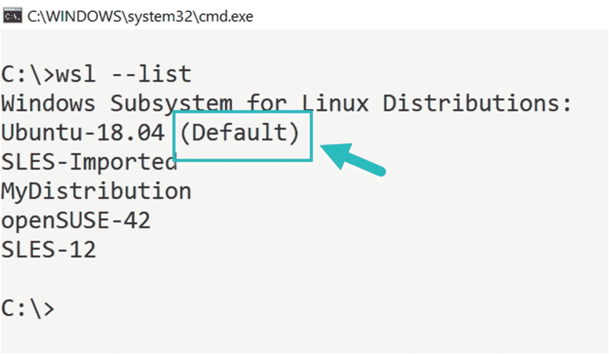
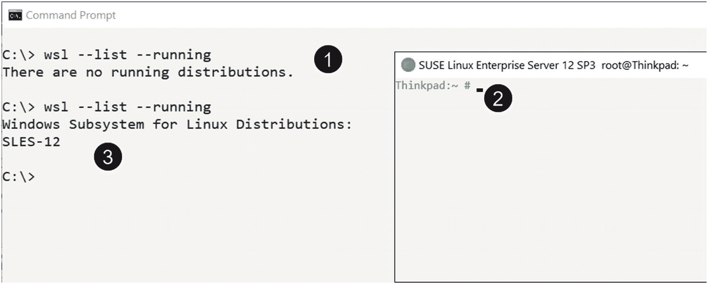
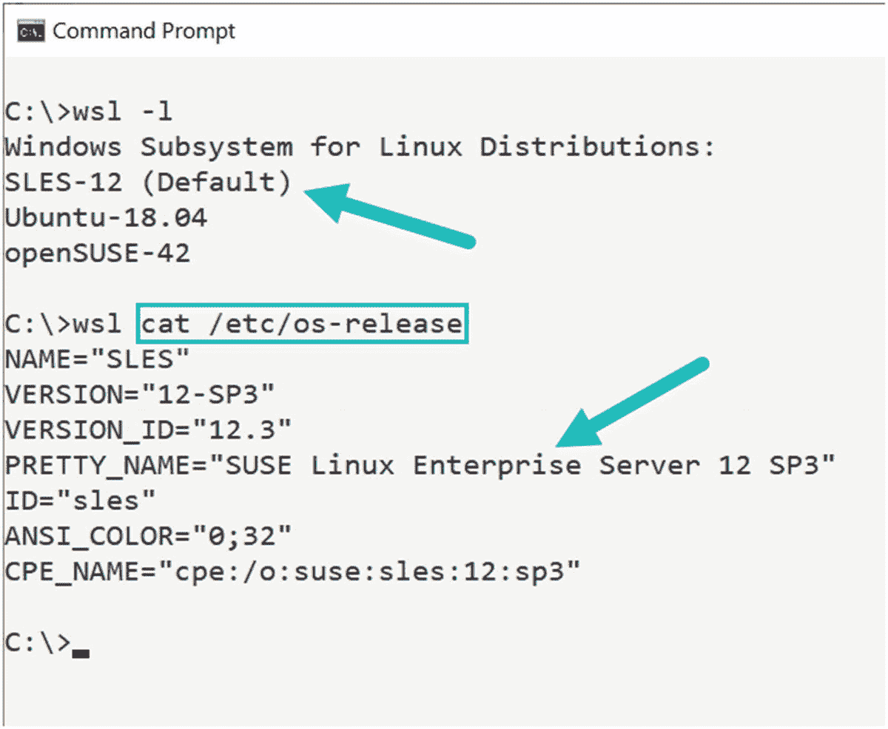
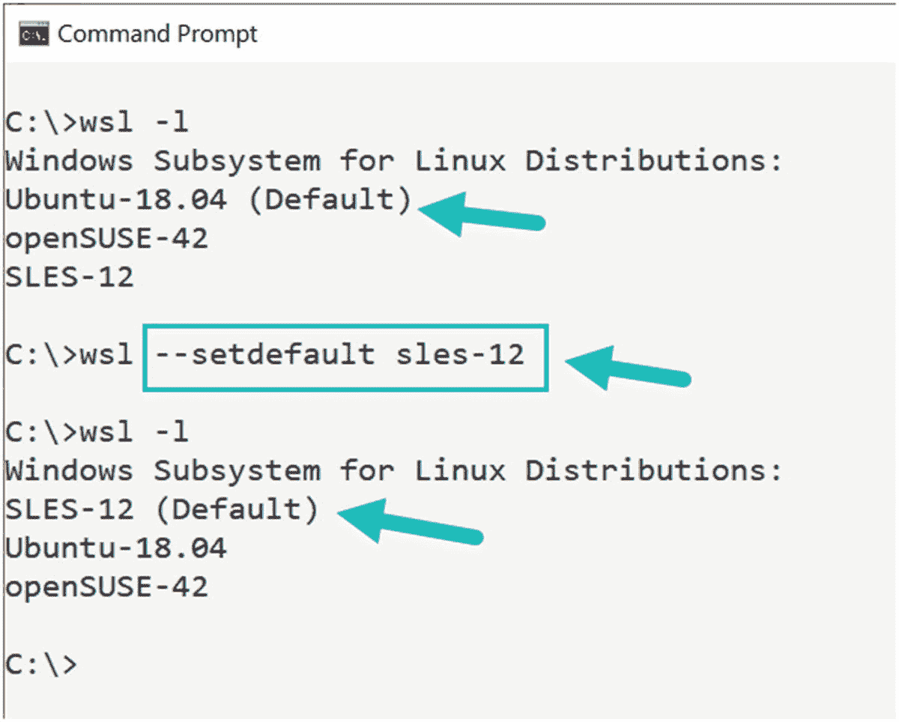
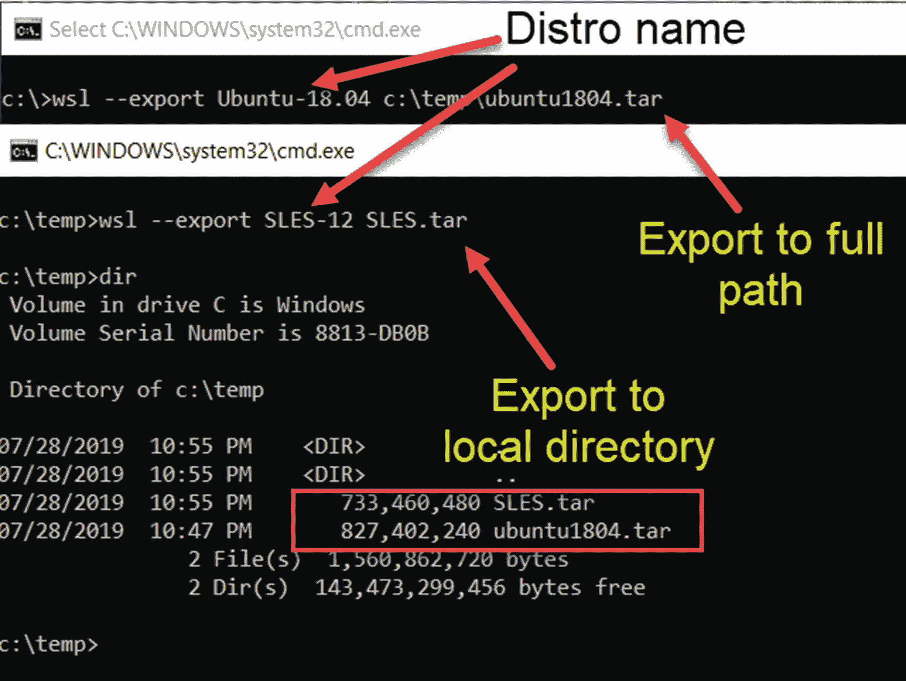
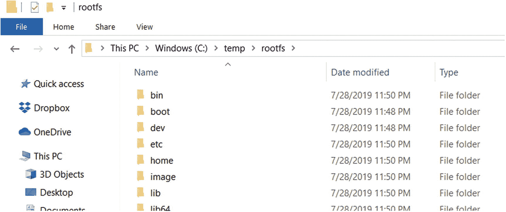
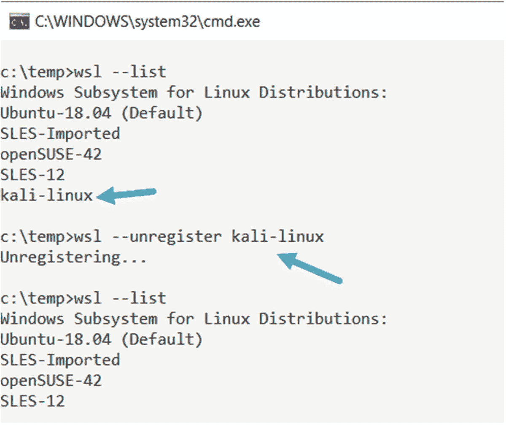
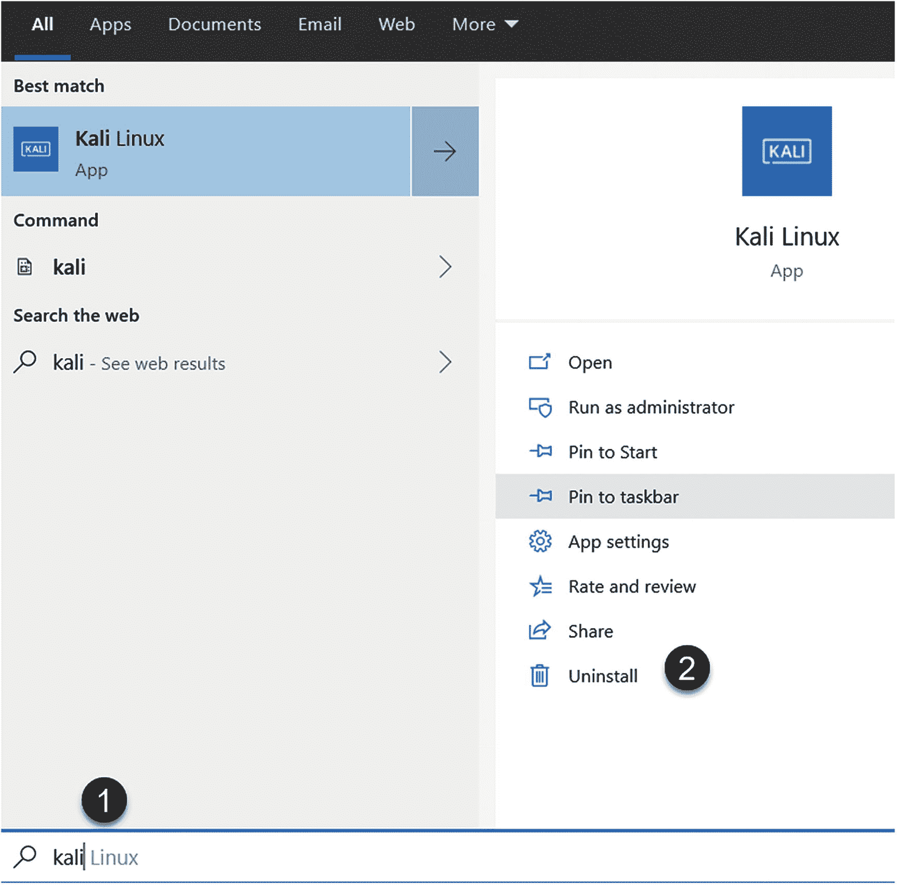
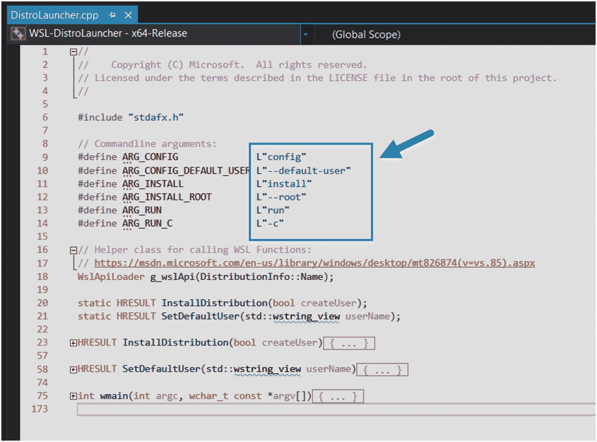

# 四、管理 WSL 发行版

在这一章中，我们将学习在 WSL 上管理我们的 Linux 发行版，这可以是从设置默认发行版，使用导出特性备份配置和设置，或者使用导入特性恢复发行版。除此之外，我们还将研究注销、卸载和重新安装 Linux 发行版的方法，并在本章末尾为 WSL 创建一个定制的 Linux 发行版。

让我们从获得您系统上的 Linux 发行版列表开始。

## 列表分布

首先，在我们能够管理我们的 WSL 发行版之前，我们必须确定安装在我们机器上的 Linux 发行版。为了在 Windows 10 版本 1903 或更高版本上实现这一点，我们可以将 wsl.exe 与“-l”或“- list”一起使用；这将列出所有可用的 Linux 发行版。请注意，在图 [4-1](#Fig1) 中，其中一个分布被突出显示为“默认”分布。这意味着这将在我们运行 wsl.exe 时启动，并且任何命令行参数都将传递给这个发行版:



图 4-1

已安装的 Linux 发行版列表

```sh
wsl -l
wsl --list

```

还有另一个参数`--running`将只列出当前正在运行的 Linux 发行版，但是您只能将它与`--list`参数开关一起使用:

```sh
wsl –list --running

```

正如您在图 [4-2](#Fig2) 中所看到的，一旦我们在步骤 2 中启动了一个 Linux 发行版，它就会出现在正在运行的发行版列表中。



图 4-2

列出所有正在运行的 Linux 发行版

现在我们知道了如何列出我们的 Linux 发行版，让我们弄清楚如何将这些 Linux 发行版中的一个设置为 WSL 的默认发行版。

## 设置默认发行版

为了设置默认分布，我们使用`wsl.exe`的`--setdefault`或`-s`命令行参数，后面跟着目标分布名称作为参数，如图 [4-3](#Fig3) 所示。



图 4-4

在默认的 Linux 发行版中运行命令



图 4-3

在 WSL 中设置默认的 Linux 发行版

这也意味着你传递给`wsl.exe`的任何命令将默认在你的默认 Linux 发行版中执行，如图 [4-4](#Fig4) 所示，简单地运行 wsl.exe 将启动一个默认 Linux 发行版的会话。

现在让我们来看看如何导出您的 Linux 发行包。备份的全部目的是将设置和配置保存在一个可分发的文件中，以便与任何人共享。

## 备份或导出 WSL 发行版

在 Linux 的 Windows 子系统上运行的分发包可以通过简单地将它导出为一个`tar`文件来进行备份，这是“磁带归档”的缩写这些文件有”。tar”文件扩展名作为多个文件的集合，采用统一的 Unix 归档格式。这是存档和通过互联网发送多个文件的常用方法。

要导出您的 Linux 发行版，首先使用管理权限启动命令提示符。然后列出您使用“wsl.exe”安装的所有现有分发环境:

```sh
wsl --list –all

```

现在您已经知道了系统上 Linux 发行环境的名称，您可以再次使用`wsl.exe`来定位并导出其中的一个，如图 [4-5](#Fig5) 所示，通过传递发行版名称和路径来导出这个文件:



图 4-5

导出 Linux 发行版

```sh
wsl --export Ubuntu-18.04 c:\temp\ubuntu1804.tar
wsl --export SLES-12 SLES.tar

```

这可能需要几分钟才能完成，这取决于您的 Linux 发行版的大小以及安装在其上的软件或软件包。一旦完成，你会发现你的发行版的根文件系统被备份为一个。tar”文件保存在导出时指定的位置。

## 恢复或导入 WSL 发行版

在前面的小节中，我们将我们的分发包导出到一个归档文件中。tar”文件。现在，可以在安装了 Linux 的 Windows 子系统的计算机上移动、共享和恢复这个归档文件。你所要做的就是用管理权限启动一个 Windows 命令提示符，并在`wsl.exe`中使用`--import`参数。将分发的名称作为参数传递，以便将根文件系统从。tar”文件指定:

```sh
wsl --import SLES-Imported c:\temp\ c:\temp\SLES.tar

```

在图 [4-6](#Fig6) 中，我们将“SUSE Linux Enterprise Server (SLES)”的备份副本导入到目录位置“c:\temp”中，自定义名称为“SLES 导入”。


图 4-6

导入 Linux 发行版

现在，您可以在列表中看到导入的 Linux 发行版，以及一个根文件系统的`rootfs`文件夹，其中包含导入的发行版的所有文件、文件夹和包(图 [4-7](#Fig7) )。这位于它被导入的目录中。



图 4-7

导入的 Linux 发行版的根文件系统

## 注销并卸载 WSL 发行版

取消发行版的注册意味着将发行版中的任何数据、设置和安装的软件与 Linux 的 Windows 子系统解除关联。一旦启动，它将永久销毁所有数据。但这也允许从 Microsoft Store 重新安装发行版的干净副本:

```sh
wsl --unregister kali-linux

```

正如你在图 [4-8](#Fig8) 中看到的，在取消注册“kali-linux”发行版后，它没有出现在我的 WSL 列表中。



图 4-8

注销 Linux 发行版

现在，如果你进入 Kali Linux 的微软商店页面并点击“Install ”,它将再次开始安装发行版。这意味着当你下次[运行](https://www.tenforums.com/tutorials/127608-run-windows-subsystem-linux-wsl-distro-windows-10-a.html)WSL 发行版时，将会安装一个新的发行版副本(图 [4-9](#Fig9) ，允许你再次用新的 Unix 用户名和密码安装发行版。


图 4-9

注销 Linux 发行版后全新安装

另一种在 Windows 10 上卸载发行版的方法是点击开始菜单，搜索发行版的名称，然后点击卸载选项，如图 [4-10](#Fig10) 所示。



图 4-10

从开始菜单卸载 Linux 发行版

或者，如图 [4-11](#Fig11) 所示，你也可以进入开始菜单，运行设置，点击应用，搜索你的 Linux 发行版，然后点击卸载按钮。在“高级选项”部分有一个设置，比如“修复”你的 Linux 发行版，如果你的发行版出了问题并且你想修复它。


图 4-11

从“应用和功能”中卸载 Linux 发行版

## 创建自定义 WSL 发行版

最近，微软开源了工具和一个示例 Linux 发行版，目的是使开发人员和 Linux 发行版维护人员能够为 Linux 的 Windows 子系统创建定制的发行版包。这进一步增强了发行版维护者通过微软商店将 Linux 发行版发布给更多受众的能力，这些发行版可以在微软商店发布供下载。

这个项目名为 WSL-DistroLauncher，已经在 GitHub 上开源: [`https://github.com/Microsoft/WSL-DistroLauncher`](https://github.com/Microsoft/WSL-DistroLauncher) 。它是用于 Linux 的 Windows 子系统的 Linux 发行版 installer/launcher.exe 的 C++实现参考。这些发行包包括启动器应用，它负责在 WSL 中注册和安装发行版。在幕后，要为 Linux 发行版开发一个定制的 Windows 子系统，您需要一个头文件 wslapi.h，它提供了一组枚举和函数来配置、注册和启动定制发行版。

表 [4-1](#Tab1) 列出了前面提到的头文件提供的一些函数，你可以在这里了解更多的函数: [`https://docs.microsoft.com/en-us/windows/win32/api/wslapi/`](https://docs.microsoft.com/en-us/windows/win32/api/wslapi/) 。

表 4-1

WSL API(WSL API . h)头文件中的函数

<colgroup><col class="tcol1 align-left"> <col class="tcol2 align-left"></colgroup> 
| 

功能

 | 

描述

 |
| --- | --- |
| WslConfigureDistribution() | 修改向 WSL 注册的分发的行为 |
| [wslgettdetastributi oncconfiguration](https://docs.microsoft.com/en-us/windows/win32/api/wslapi/nf-wslapi-wslgetdistributionconfiguration)()的缩写 | 检索向 WSL 注册的分发的当前配置 |
| wslisdistributionn registered() | 已确定分发是否已注册到 wsl |
| [WslLaunch](https://docs.microsoft.com/en-us/windows/win32/api/wslapi/nf-wslapi-wsllaunch) () | 在特定分发的上下文中启动 WSL 进程 |
| [wsllauncheck 我有](https://docs.microsoft.com/en-us/windows/win32/api/wslapi/nf-wslapi-wsllaunchinteractive)() | 在特定分发的上下文中启动交互式 WSL 进程 |
| [wslregistracrdistr 贡献](https://docs.microsoft.com/en-us/windows/win32/api/wslapi/nf-wslapi-wslregisterdistribution)() | 向 WSL 注册新的发行版 |
| [WslUnregisterDis 依赖](https://docs.microsoft.com/en-us/windows/win32/api/wslapi/nf-wslapi-wslunregisterdistribution)()) | 从 WSL 中注销分发 |

一旦发行版启动程序被构建并打包了所需的资产，比如图标文件、清单、证书等等，那么它就可以作为一个定制的 Linux 发行版加载到 Linux 的 Windows 子系统之上。构建的输出将把“launcher.exe”替换为一个定制的特定于发行版的名称，如 MyCustomDistro.exe，它将启动你的定制发行版，就像 Ubuntu1804.exe 或任何其他发行版启动器一样。使用这个项目，你还可以控制这个发行版启动器可以接受的命令行参数，甚至可以编写你自己的帮助文档，如图 4-12 所示。



图 4-12

发行版启动器命令行选项

## 摘要

在本章中，我们学习了如何管理 Linux 的 Windows 子系统的 Linux 发行版，我们首先列出了所有的 Linux 发行版，并根据它们的运行状态对它们进行了过滤，然后研究了如何为 WSL 设置默认发行版。后来，我们学习了如何备份 Linux 发行版，方法是将其导出为文件备份，然后导入到另一台计算机上，以在 WSL 中恢复 Linux 发行版。最后，我们介绍了一些在不需要的时候注销和卸载 Linux 发行版的方法，并以一个帮助为 WSL 创建定制 Linux 发行版的工具结束了本章。

在下一章中，我们将学习 Linux 版本 2 的 Windows 子系统(WSL2 ),并介绍两个版本之间的架构变化和功能差异。