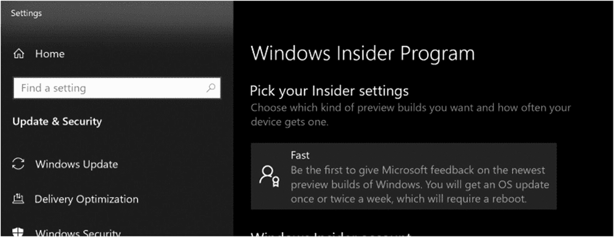
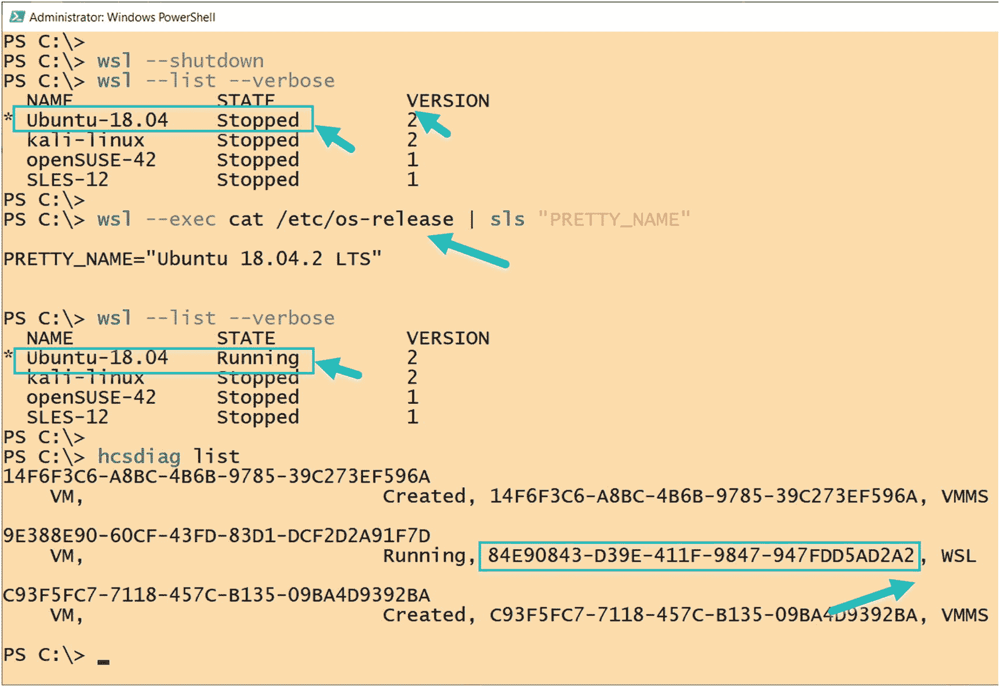
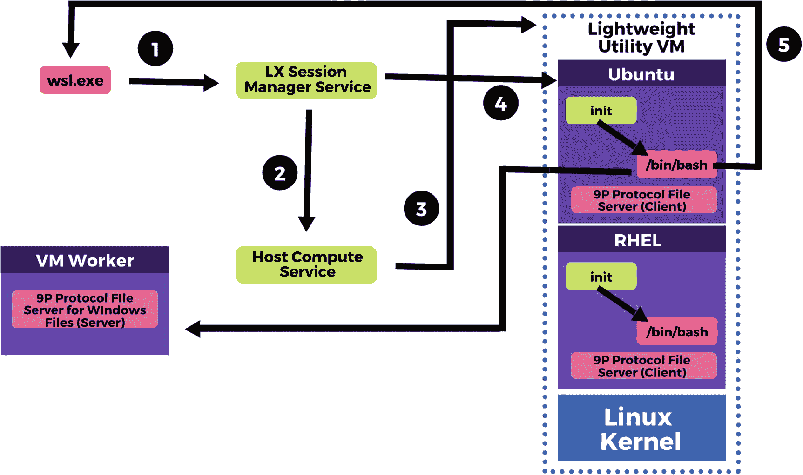
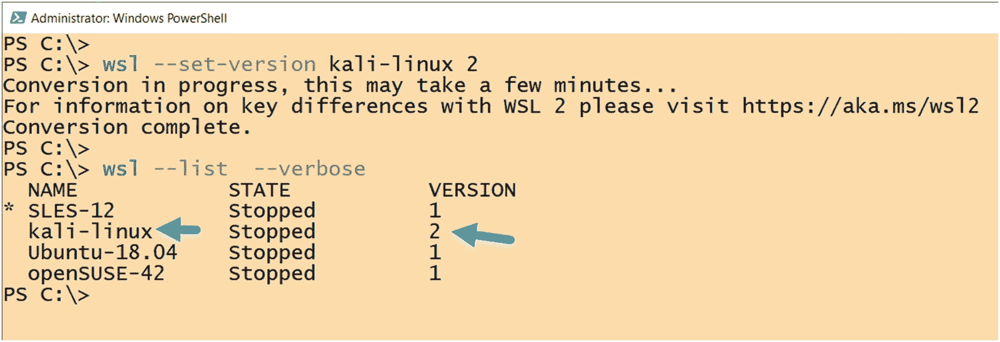
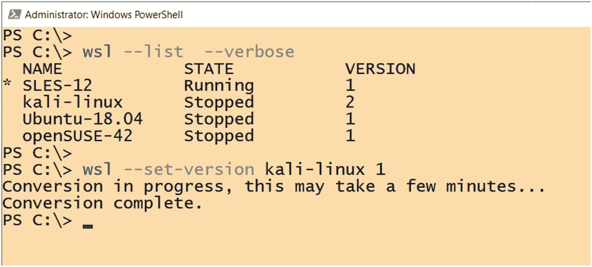
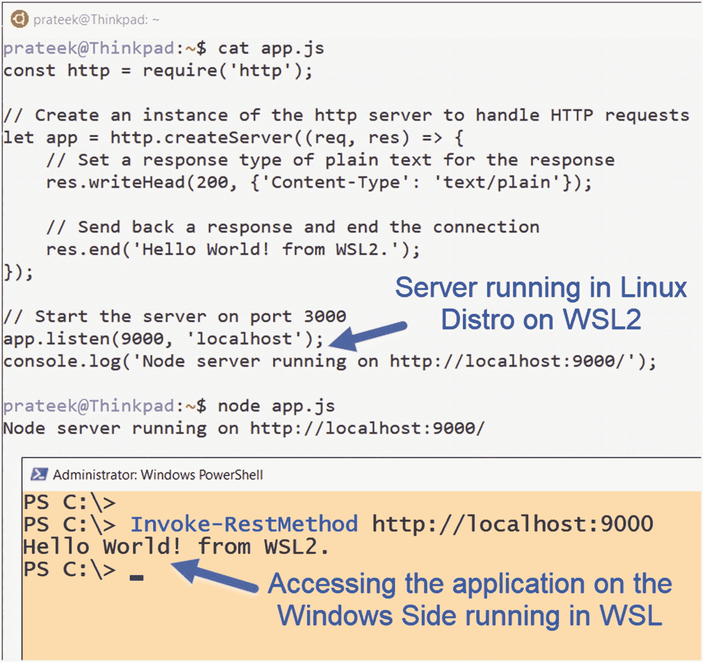
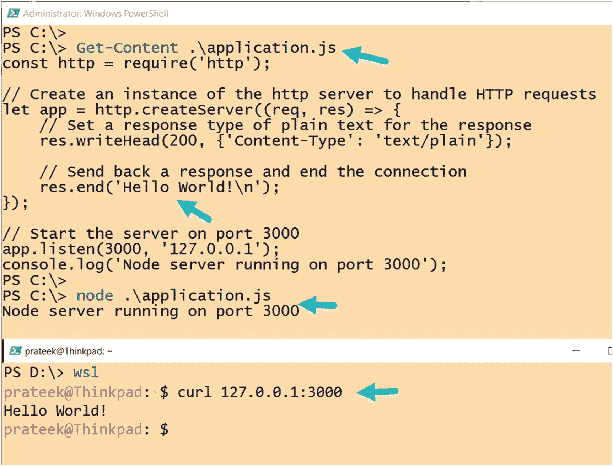
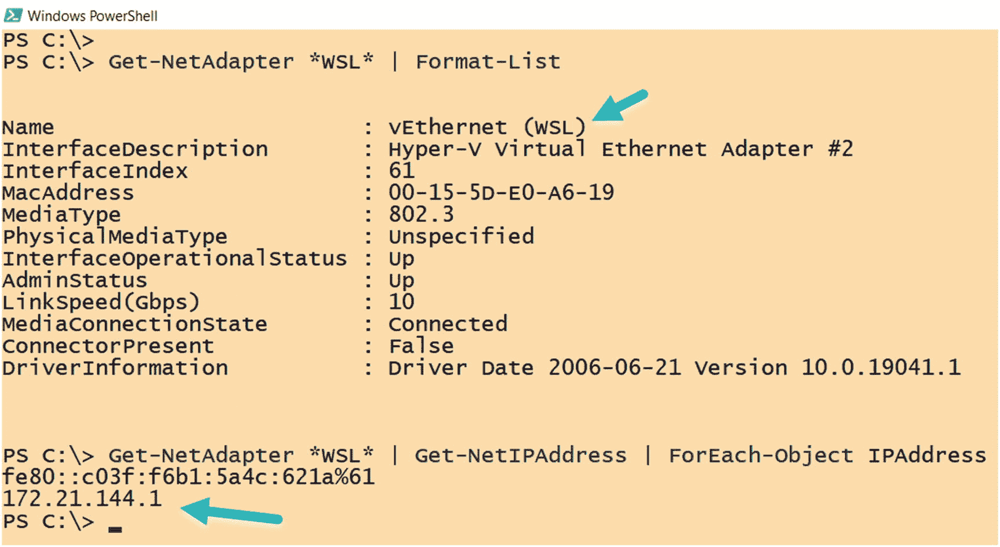
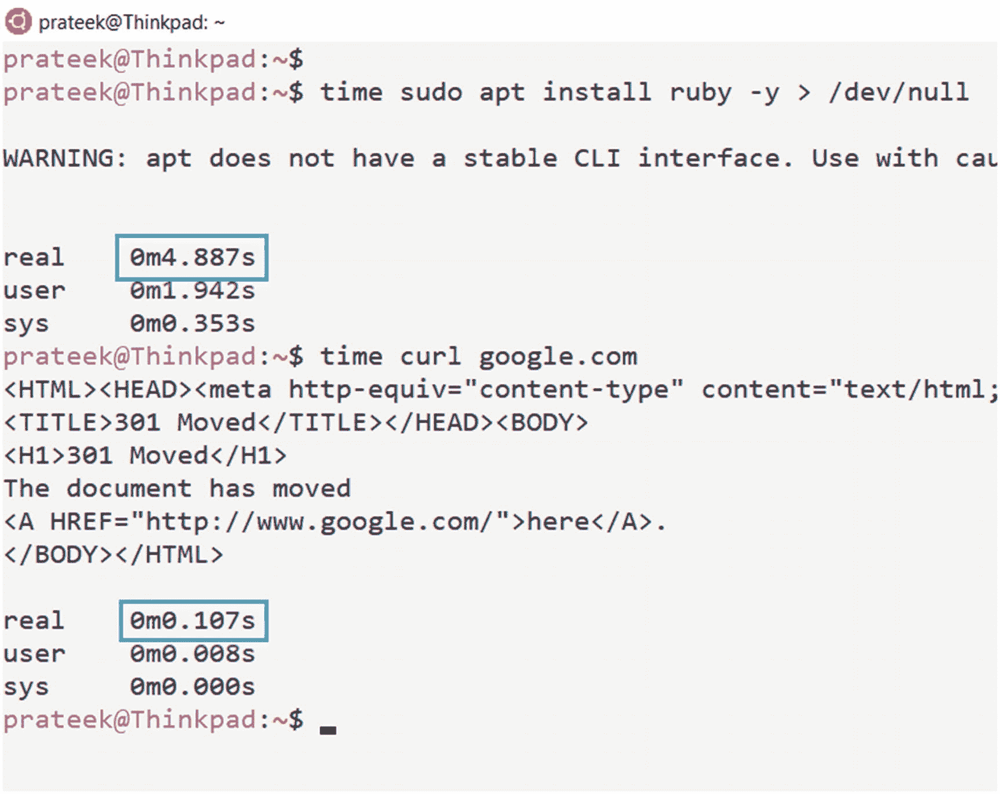
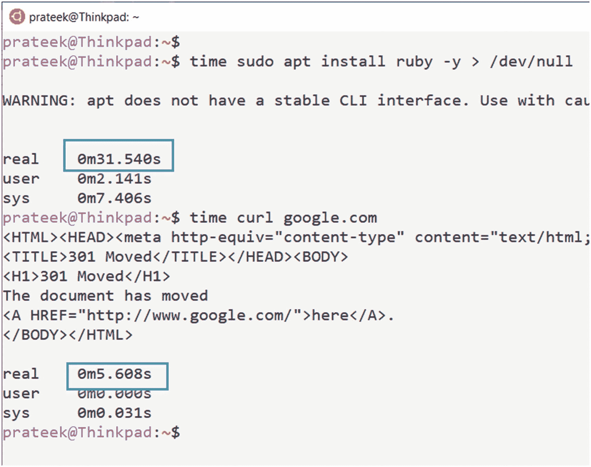

# 5.探索 WSL2

在本章中，我们将了解 Linux 版本 2 的 Windows 子系统、它带来的新特性以及版本 1 和版本 2 之间的区别。我们还将学习如何在我们的机器上安装 WSL2，并使 Linux 发行版能够使用 WSL2。最后，我们将了解它的架构和功能。这一章背后的整个思想是向读者简要介绍 WSL2 中的体系结构变化，然后在此基础上构建剩余的章节，这将使读者更容易理解这个新版本的 WSL 背后的目的。我们开始吧。

## WSL2 中的新特性

WSL2 是用于 Linux 的 Windows 子系统的最新和最好的版本。这个新版本是在牢记两个主要目标和最常见的社区请求的情况下构建的:

1.  **更好的文件 IO 性能**–IO 性能的提高意味着更快的文件读写速度，而速度完全取决于文件访问操作的密集程度。诸如“git clone”、“npm install”、“apt update”或“apt upgrade”等任务的运行速度可能会快 2-3 倍，而在 WSL2 上解压缩压缩的 tarball 文件等任务的性能可能会比 WSL1 快 20 倍。

2.  **全面的系统调用支持**–从运行在 Linux 版本 1 的 Windows 子系统上的 Linux 二进制文件生成的任何系统调用，用于执行诸如访问文件、请求内存、生成进程等功能，并被转换为底层操作系统的相应 Windows 系统调用。这是通过 WSL 团队开发的翻译层实现的，但是它有自己的挑战，并且不可能将每个 Linux 系统调用翻译成 Windows。不仅如此，微软的 WSL 团队还必须实现并调整这个翻译层，以适应 Linux 内核的任何变化。

    因此，微软决定 WSL2 将包含自己的 Linux 内核，以完全支持系统调用兼容性，并使其易于提供内核更新。这为 Docker 和其他系统等更多应用程序在 WSL2 中无缝运行打开了窗口。另外，微软维护着 Linux 内核的一个分支；这意味着对 Linux 内核的任何更新都不必等待更长时间才能到达 Windows，并且可以更快地快速更新、发布和分发给最终用户。所有内核改进和安全修复都可以通过 Windows updates 获得。

在牢记这些目标的同时，保持相同的用户体验而不改变 WSL1 用户已经习惯的许多东西也很重要。

WSL1 使用户能够在 Windows 子系统上运行 ELF64 Linux 二进制文件，但在版本 2 中，在 Linux 二进制文件如何与 Windows 操作系统和系统硬件交互方面有所变化，这主要是因为现在微软通过 WSL2 向 Windows 提供了一个具有更高级虚拟化技术的 Linux 内核。由于现在有了完整的内核，WSL2 还添加了 ELF32 二进制支持或 Linux 内核支持的任何其他特性。

在开始使用 WSL2 之前，有两个主要的先决条件需要满足；首先，WSL2 仅在 Windows 10 build 18917 或更高版本中可用。其次，请加入如图 [5-1](#Fig1) 所示的“Windows Insider Program”，选择快环或慢环(提供更稳定的更新)以获得 WSL2 附带的 Windows build 的预览版。如果您已经在运行 Windows 10 version 2004，请忽略第二个设置。



图 5-1

选择 Windows Insider 计划

一旦全面上市，WSL2 将很快(或者当你阅读本文时已经)成为 Windows 10 version 2004 的一部分。这是微软通过 Windows Update 简化安装体验，而不是将其与操作系统映像一起发布，从而改进 Linux 内核服务模型的一步。这意味着您的所有 Linux 内核更新将通过 Windows Update 无缝地传递到您的系统，就像任何软件、补丁和驱动程序一样。你所要做的就是点击 Windows updates 设置中的“检查更新”按钮，然后安装这个更新，如图 [5-2](#Fig2) 所示。


图 5-2

更新到 Windows 10 版

在本章的这一点上，你一定在想:WSL1 和我在其上配置的 Linux 发行版会发生什么？微软会停止或弃用 WSL1 吗？要回答这个问题，没有什么可担心的，因为微软既没有任何意图也没有计划弃用 WSL1，而且这两个版本是并行运行的。这意味着 WSL1 和 WSL2 Linux 环境可以并行运行，并且您可以在任何需要的时候升级和降级任何发行版。在本章的后面，我们将研究这是如何做到的。

## WSL2 体系结构

Windows Subsystem for Linux 2 附带的 Linux 内核运行在一个轻量级实用虚拟机上，该虚拟机最初是为服务器场景开发的，用于在一台主机上运行大量基于 Hyper-V 的隔离容器，并支持更快的引导时间。

这不是传统的虚拟机体验，而是最新、最棒的虚拟化(基于 Hyper-V)技术，旨在减少资源占用、启动时间以及创建、配置和管理传统虚拟机所花费的时间。表 [5-1](#Tab1) 提供了一些差异，以进一步明确这种区别。

表 5-1

WSL 使用的传统虚拟机和轻量级实用虚拟机的比较

<colgroup><col class="tcol1 align-left"> <col class="tcol2 align-left"></colgroup> 
| 

传统虚拟机

 | 

WSL2 轻量级实用程序虚拟机

 |
| --- | --- |
| 客户操作系统与主机操作系统相隔离。 | 客户操作系统与主机操作系统紧密集成。 |
| 较慢的启动时间 | 更快的启动时间，即不到 1 秒 |
| 更大的内存消耗 | 更低的内存消耗 |
| 创建和管理这些虚拟机。 | 自动设置，仅在需要时运行 |

让我们更深入地挖掘一下，理解当一个 WSL2 Linux 发行版发布时，在幕后发生了什么。首先，确保所有 WSL 实例都已终止:

```sh
wsl --shutdown

```

然后，我们尝试在默认的 WSL2 发行版上执行一个命令，一旦命令执行，它将变为“Running”状态。现在，要验证这一点，请使用管理权限启动 PowerShell 控制台，并使用`hcsdiag.exe list`命令列出所有正在运行的 Hyper-V 容器，这是一个诊断工具，用于检查由主机计算服务管理的 Windows 容器，然后这将演示在不到一秒钟的时间内即时创建的轻量级 VM 容器，如图 [5-3](#Fig3) 所示。



图 5-3

主机计算服务创建一个轻量级虚拟机

另外两个容器只是已经在我的主机上创建的 Hyper-V 虚拟机，并且处于运行状态。如图 [5-4](#Fig4) 所示，您可以观察到来自`hcsdag.exe list`的 GUID 和来自`Get-VM`cmdlet 的结果相匹配。


图 5-4

其他 Hyper-V 虚拟机

但是，如果我们再次关闭所有的 WSL2 实例，并在我的 WSL2 Linux 发行版上重新运行一个命令，那么它将在一个新的容器中为轻量级实用 VM 启动，并带有一个新的 GUID，如图 [5-5](#Fig5) 所示。


图 5-5

每次运行命令时，都会启动一个新的轻量级虚拟机

现在我们已经了解了 Linux 内核在这个轻量级虚拟机中运行，让我们进一步了解图 [5-6](#Fig6) 所示的 WSL2 的实际架构，以及从 Windows 操作系统启动 Linux 应用程序时所涉及的步骤，以及它如何与 Linux 虚拟机集成，从而为我们提供无缝的、两全其美的体验。



图 5-6

WSL2 架构图和工作流

以下是演示此工作流的组件，您可以跟随前面的图像进行操作:

1.  “wsl.exe”用于列出发行版，启动并与通过`LxssManager`服务启用的子系统交互。

2.  保存已安装和正在运行的发行版列表，然后调用主机计算服务。

3.  主机计算服务是使 WSL2 成为可能的 Hyper-V 虚拟化技术的一部分；这将启动一个使用 Linux 内核的轻量级实用 VM。

4.  然后，VM 被映射到您的 Linux 发行版的文件系统，并调用一个`init`进程来初始化和运行您的应用程序。

5.  在这之后，从 Windows 端到您的应用程序的标准输入建立了一个中继，在我们的例子中是`bash`,这样就在 Linux 和 Windows 端之间建立了通信，这样当一个命令从 Windows 端运行时，我们就可以看到我们的 Linux 应用程序内部发生了什么。

    基本上，Windows 标准输入向套接字发送命令，然后在轻量级客户操作系统中从套接字读取这些命令，最后这个套接字是 Linux 应用程序(如“bash”)的标准输入。

这个虚拟机只在您运行您的 Linux 应用程序时运行，如果您终止您的 Linux 应用程序或终止`wsl.exe` `,`，这个轻量级虚拟机就会消失。如果您重新启动一个 Linux 应用程序，这个虚拟机将会重新启动并再次启动。

请注意，无论您的机器上运行多少个 WSL2 Linux 发行版，它们都将在一个轻量级的实用 VM 中启动。这意味着每个用户只创建一个 Linux utility VM，以便于使用 WSL2 运行多个发行版。每个发行版都在一个独立的容器中运行，所以这应该不成问题。这是通过使用 Linux 名称空间 API [`http://man7.org/linux/man-pages/man7/namespaces.7.html`](http://man7.org/linux/man-pages/man7/namespaces.7.html) 来实现的，目的是通过让所有发行版都运行在单个虚拟机上来减少内存和资源占用。

另一方面，为了访问 WSL2 中的文件，像`/mnt/c`这样的挂载点使用 9P 协议文件服务器来处理这样的请求。Linux 内核充当运行在轻量级虚拟机上的 9P 协议客户端，即运行在客户操作系统上，然后客户操作系统向运行在主机操作系统(Windows 10)上的 9P 服务器发出请求，以从 Windows 访问 Linux 文件。

## 安装和设置

Linux 的 Windows 子系统是 Windows 10 中的一个特性，但是要为 WSL1 启用这个特性还需要一些步骤，我们在前面的章节中已经讨论过了；除此之外，还讨论了启用“虚拟机平台”功能的要求。一旦满足了这两个先决条件，我们就可以继续将我们的 WSL1 Linux 发行版转换成 WSL2，或者选择 WSL2 作为所有未来安装的 Linux 发行版的默认版本。

让我们一步一步来。

### 为 Linux 1 启用 Windows 子系统

如果你还没有在 Windows 10 上使用 Linux，现在正是时候。您可以首先从 Windows 特性中启用 Linux 的 Windows 子系统，如以下步骤所述:


图 5-7

搜索“Windows 功能”

1.  在 Windows 任务栏上，在屏幕的左下角，单击“开始”按钮。

2.  现在在搜索框中搜索“打开 Windows 功能”，然后点击顶部的结果，如图 [5-7](#Fig7) 所示。

3.  这将打开一个“Windows 功能”对话框。滚动到底部，确保选中“Windows Subsystem for Linux”功能框。单击确定并退出此对话框。

4.  保存所有打开的工作，因为系统可能会提示您重新启动系统。按照任何必要的提示关闭正在运行的应用程序。

一旦启用了 WSL1 并且您的系统已经重启，我们现在需要启用“虚拟机平台”为此，请执行以下步骤。请注意，只有当您的计算机支持硬件虚拟化并且在 BIOS 或 UEFI 中启用了该功能时，才能执行这些步骤。

### 启用“虚拟机平台”


图 5-9

将 WSL2 设置为新 Linux 发行版的默认架构


图 5-8

启用虚拟机平台

1.  使用管理权限启动 PowerShell 会话。

2.  在 PowerShell 中运行以下命令，如果您看到如图 [5-8](#Fig8) 所示的结果，那么该特性已经成功启用。

    ```sh
    Enable-WindowsOptionalFeature -Online -FeatureName VirtualMachinePlatform

    ```

3.  如果出现提示，请重新启动系统。

完成这些步骤后，我们现在可以将我们的 Linux 发行版转换为 Linux 2 的 Windows 子系统，或者选择 WSL2 作为运行这些发行版的默认架构。

### 为 Linux 2 启用 Windows 子系统

在启用 WSL2 之前，我们需要遵循一些临时步骤，其中我们需要手动安装一个 Linux 内核更新。在不久的将来，当 WSL 更新开始通过 Windows Update 交付时，将不再需要这些手动步骤:

1.  从以下网址下载 WSL2 Linux 内核更新: [`https://wslstorestorage.blob.core.windows.net/wslblob/wsl_update_x64.msi`](https://wslstorestorage.blob.core.windows.net/wslblob/wsl_update_x64.msi)

2.  下载完成后，双击下载位置的“wsl_update_x64.msi”文件运行并应用此更新。

3.  一旦应用了更新，转到开始菜单，用管理权限启动 PowerShell.exe。

4.  现在运行下面的命令，如图 [5-9](#Fig9) 所示，让 WSL2 成为以后您将在系统上安装的所有新 Linux 发行版的默认架构。这不会改变任何运行在 WSL1 上的现有 Linux 发行版，两者可以共存。

```sh
wsl --set-default-version 2

```

1.  要配置任何现有的 Linux 发行版来使用 WSL2 架构，您可以通过运行`wsl --set-version`和 Linux 发行版名称，后跟“2”来实现，如图 [5-10](#Fig10) 所示:

```sh
wsl --set-version kali-linux 2

```

### 验证 Linux 分发子系统平台并回滚到 WSL1

使用以下命令可以很容易地验证您的 Linux 发行版所使用的架构:

```sh
wsl --list --verbose

```

这将列出所有的 Linux 发行版及其版本信息，正如我们在图 [5-11](#Fig11) 中看到的，我们从上一步对`kali-linux`发行版的转换在这里得到了反映。


图 5-10

将 WSL1 Linux 发行版转换为 WSL2

如果我们想使用旧的 WSL1 架构，我们可以很容易地将我们的发行版转换成使用 WSL1，如图 [5-12](#Fig12) 和下面的例子所示:

```sh
wsl --set-version kali-linux 1

```

如果您觉得 WSL2 仍然是实验性的软件，您可能不想在您的主要计算机系统上运行它，而是在一个虚拟机上评估这个软件。但是在您可以在虚拟机上使用 WSL 之前，您可能需要了解一些事情和一些必需的配置。

## 在虚拟机中运行 WSL2

您也可以在基于 Hyper-V 的虚拟机上运行 Windows 子系统 for Linux。您所要做的就是确保虚拟机上启用了嵌套虚拟化，如图 [5-13](#Fig13) 所示。

我们可以使用 PowerShell 来启用该设置。为此，请使用管理权限从 PowerShell 控制台运行以下命令。只需确保提供目标虚拟机的名称。只有当机器处于停止状态时，才能应用此设置，因为在机器运行时，您不能更改处理器配置。

```sh
Get-VM 'Name' | Set-VMProcessor -ExposeVirtualizationExtensions $true

```

当 Hyper-V 在您的系统上使用时，一些主要的第三方虚拟化应用程序无法工作。这意味着您可能无法同时运行 WSL 和 VMware 和 VirtualBox。但是，这些主要的虚拟化技术提供商最近发布了支持 WSL2 和 Hyper-V 的软件版本。以下是其发布页面的链接，供您参考:

*   [T2`www.virtualbox.org/wiki/Changelog-6.0`](http://www.virtualbox.org/wiki/Changelog-6.0)

*   [T2`https://blogs.vmware.com/workstation/2020/01/vmware-workstation-tech-preview-20h1.html`](https://blogs.vmware.com/workstation/2020/01/vmware-workstation-tech-preview-20h1.html)

## 从 WSL1 到 WSL2 改变了什么用户体验？

微软已经尽最大努力保持两种架构的用户体验一致，但尽管如此，当从 WSL1 切换到 WSL2 时，WSL2 用户将观察到整体用户体验的三大变化。

### 更快的文件性能

体验更快的文件性能，但为了实现这一点，建议将您的所有文件保留在 Linux 发行版的根文件系统下，因为现在我们在 Linux 2 的 Windows 子系统上有一个完整的 Linux 内核，可以轻松处理这些文件密集型操作，与 WSL1 相比，它的速度快了几倍。

为了测试性能，我们将使用包管理器测试软件安装，并在 WSL1 和 WSL2 上使用 curl 请求测试 web 套接字:

```sh
time sudo apt install ruby –y
time curl google.com

```

图 [5-14](#Fig14) 演示了在 WSL1 上安装“ruby”大约需要 30 秒，而对 google.com 的 web 请求在 5 秒内返回结果。现在让我们在 WSL2 上尝试相同的测试，但是请确保您在相同的 Linux 发行版上运行这个测试。这个测试是在 Ubuntu 18.04 LTS Linux 发行版上进行的，所以我必须将 WSL 架构版本从 WSL1 更改为 WSL2，并从发行版中删除已安装的“ruby”软件来执行一个新的测试。



图 5-11

验证 Linux 发行版 WSL 版本

我们在 WSL2 上的测试表明，安装在不到 5 秒的时间内完成(比 WSL1 快 6 倍)，web 请求用了 1/10 秒(比 WSL2 快 50 倍)来完成请求并获得结果，如图 [5-15](#Fig15) 中突出显示的。与 Windows Subsystem for Linux 版本 1 架构相比，这是一个显著的性能提升。

## WSL2 现在使用虚拟硬件磁盘(VHD)

因为 WSL2 运行在一个轻量级的实用虚拟机上，就像任何其他虚拟机一样，它将所有的 Linux 文件存储在一个使用 ext4 文件系统的虚拟硬件磁盘(VHD)中。VHD 的最大大小最初设置为 256GB，根据您的使用情况，此 VHD 会自动增长和收缩以满足您的存储需求，直到达到此最大限制。一旦达到限制，您开始得到“磁盘空间不足”的错误。为了修复这些错误，您必须通过执行以下步骤来扩展 VHD 大小:

1.  使用以下命令终止所有正在运行的 WSL 实例:



图 5-12

将 Linux 分发平台回滚到 WSL1

1.  Use PowerShell to find your Linux distribution’s installation package name `PackageFamilyName` and the full path to its ext4.vhdx file:

    ```sh
    $pkgFamilyName = (Get-AppxPackage -Name "*ubuntu*").PackageFamilyName
    $Path = "$env:LOCALAPPDATA\Packages\$pkgFamilyName\LocalState\*.vhdx"
    $vhd = Get-ChildItem $Path

    ```

    最后，我们使用 Hyper-V 模块中的`Resize-VHD` cmdlet 将这个虚拟硬件磁盘扩展到我们想要的大小，如图 [5-16](#Fig16) 所示:

```sh
wsl --shutdown

```

```sh
Resize-VHD -Path $VHD.FullName -SizeBytes <size>

```

1.  一旦调整完成并且没有出现任何错误，就像前面的图片一样，然后重新启动您的 WSL2 Linux 发行版。

2.  现在，我们必须从 WSL 内部扩展文件系统的大小，并让它知道我们在上一步中执行的更改。为此，我们必须在您的 WSL 发行版中运行以下命令，以确保文件系统已挂载:

```sh
sudo mount -t devtmpfs none /dev

```

完成后，我们必须通过使用以下命令过滤掉类型为`ext4`的文件系统来找到正在使用的根文件系统，这将突出显示我们想要作为目标的挂载点，如图 [5-17](#Fig17) 所示:



图 5-20

从 Windows 访问 WSL2 上的 Node.js 服务器



图 5-19

从 WSL2 访问 Windows 上的 Node.js 服务器



图 5-18

WSL2 有专用的虚拟以太网适配器


图 5-17

在 WSL2 中扩展 VHD


图 5-16

调整 WSL2 虚拟硬件磁盘的大小



图 5-15

WSL2 上的文件和 web 套接字性能



图 5-14

WSL1 上的文件和 web 套接字性能


图 5-13

在 Hyper-V 虚拟机上启用 WSL

1.  请从以下示例中复制此项的名称，如/dev/sdb，并运行以下命令:

```sh
mount | grep ext4

```

```sh
sudo resize2fs /dev/sd**

```

确保将前面命令中的星号(*)替换为命令中的正确字符，如果运行成功且没有错误，则 VHD 扩展完成。如果 Linux 发行版上没有安装`resize2fs`，可能需要安装它。

### 网络变化和注意事项

当使用 WSL1 Linux 发行版时，所有的 Linux 调用都被转换成 Windows 系统调用，如果您的系统使用局域网，那么任何运行在 WSL 上的应用程序也将直接使用局域网。但是这种行为在 WSL2 中发生了变化，因为 WSL2 运行在一个轻量级的实用虚拟机上，并且有一个虚拟化的以太网适配器，该适配器分配有自己的 IP 地址，如图 [5-18](#Fig18) 所示。

除此之外，由于 WSL2 仍然是一个新产品，还在开发中，您会发现在 WSL2 的早期版本中，您必须使用您的主机的 IP 地址从 Linux 访问 Windows 操作系统，但是在以后的版本中，这种体验会更加顺畅。

#### 从 Linux 访问 Windows 应用程序

例如，我的计算机运行的是 Windows 10 version 2004(OS build 19041.172)，我有一个简单的 Node.js 服务器运行在 Windows 10 端，我可以通过一个简单的“curl”命令从 WSL2 内部使用环回地址轻松访问服务器，如图 [5-19](#Fig19) 所示。

#### 从 Windows 访问 Linux 应用程序

就像我们在前面的例子中从 Linux 访问一个 Windows 应用程序一样，我们也可以从 Windows 10 端的`http://localhost`访问一个 Linux 应用程序，一个运行在 WSL Linux 发行版中的 Node.js 服务器。图 [5-20](#Fig20) 演示了一个 PowerShell `Invoke-WebRequest`命令来访问运行在 WSL 上的端点。

## 摘要

在这一章中，我们学习了 WSL2 中的新特性和改进，以及将完整的 Linux 内核移植到 Windows 10 以支持新版本的 Windows Linux 子系统的目的。我们启用并执行了 WSL2 的安装，并学会了并行运行 WSL1 和 WSL2 子系统平台。后来，我们还研究了将 WSL1 Linux 发行版转换为 WSL2 兼容发行版，然后对 WSL2 中的文件系统和网络性能改进进行了基准测试。在本章快结束时，我们在 WSL2 虚拟硬盘上执行了 resize 操作，并以 WSL2 中的网络变化结束了本章。在下一章中，我们将学习 Linux 文件系统的 Windows 子系统，它的体系结构，以及 WSL 文件系统如何实现 Linux 和 Windows 之间的互操作性。