# 六、文件系统

在本章中，我们将了解文件系统如何无缝地工作，就像您在 Linux 操作系统中处理 Linux 文件一样，此外，它还使开发人员和高级用户能够使用完整的 Windows 和 Linux 互操作性来提高他们的工作效率。从一开始，Windows 子系统 for Linux 的目的之一就是将两个世界的优点结合在一起，而不是像传统虚拟机那样将 Windows 和 Linux 操作系统相互隔离，在传统虚拟机中，您只能使用网络共享和其他一些解决方案来访问主机和客户机操作系统之间的文件。相反，我们的目标是以这样一种方式集成它们，即 WSL 可以直接访问 Windows 文件，而 Windows 可以访问运行在 WSL 上的 Linux 发行版中的文件。

在我们深入研究文件系统之前，让我们先了解一些使 Linux 文件系统的 Windows 子系统工作的基本组件。

## 文件系统组件

为了支持在 Windows 上运行的 Linux 文件系统，Linux 的 Windows 子系统必须将在 Linux 文件系统上执行的所有用户操作转换为 NT 内核操作。此外，用户应该能够从运行在 WSL 之上的 Linux 发行版中访问 Windows 文件。

### 虚拟文件系统

为了实现这一点，WSL 在 lxcore.sys 中内置了一个 VFS 组件，该组件模拟 Linux 操作系统的虚拟文件系统(VFS)。VFS 在 Linux 操作系统中的作用是提供一个抽象层来管理 Linux 上任何时候挂载的所有文件系统。这种抽象简化了常见的操作(如 open、read、chmod、stat)和实现，而不考虑可以共存的底层文件系统。其中一些文件系统如下:

*   狼

*   drvfs

*   文件系统

*   普罗普斯

*   sysfs

让我们分别研究一下这些问题。

### 狼

这是 WSL 上的主要文件系统，用于存储所有 Linux 系统文件和您的主目录，其功能几乎与 Linux 虚拟文件系统(VFS)相同。从技术上讲，所有文件都在 Windows 上，WSL 通过模拟内部 Linux 文件系统的 Linux 行为来提供对这些文件的完全访问，例如添加到每个 Linux 发行版中的以下目录:

*   /

*   /root

*   /home

但是这个文件系统的目的不是互操作性，而是为用户提供他们熟悉的 Linux 体验，比如/home 或/root 目录。也就是说，如果从 Windows 端添加一个新文件，它不具有 volfs 理解的正确的扩展属性，它们会被简单地忽略，并且这样的文件对于 Linux 的 Windows 子系统中的 Linux 发行版变得不可用。

让我们举一个从 Windows 到这个文件系统的文件创建的例子来更好地理解它。在第一种方法中，我们尝试在我的 Windows 10 机器上的%LocalAppData%\文件夹中的/home/prateek 目录下创建一个文件，我的 Ubuntu 18.04 Linux 发行版的所有包文件都放在这个文件夹中。

请注意，第一种方法并不是向 WSL 上的 Linux 发行版添加文件的推荐方法，它可能会导致文件损坏和差异。建议不要从 Windows 端接触该文件夹:

```sh
$rootFS = "Packages\<package name>\LocalState\rootfs\home\<username>"
$param1 = @{
             ItemType = 'File'
             Path = "$env:LOCALAPPDATA\$rootFS\file1.txt"
}
New-Item @param1 -Verbose

```

当我们从 Windows 端的 PowerShell 控制台运行上述命令时，我们看到已经从 PowerShell 控制台创建了 file1.txt 文件。可以从%LocalAppData%文件夹中验证这一点。但是如果你仔细观察图 [6-1](#Fig1) ，在 WSL 上运行的 Ubuntu 发行版中缺少 file1.txt。

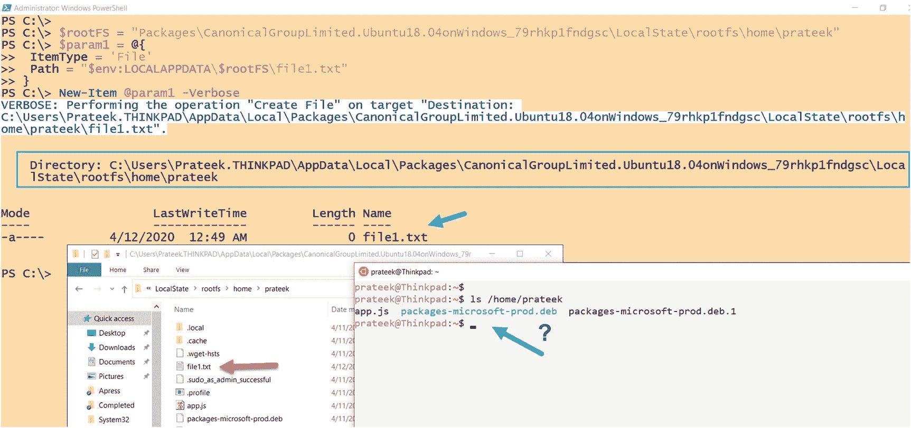

图 6-1

不建议从%LocalAppData%文件夹访问 Linux 文件

另一方面，当我们使用第二种方法创建名为“file2.txt”的文件时，这是通过 UNC 路径\\wsl$\进行的，如图 [6-2](#Fig2) 所示，使用下面的代码示例，这不仅创建了该文件，而且该文件现在也可以在 Linux 的 Windows 子系统中使用，这与第一种方法不同。再次强调，第二种方法是从 Windows 创建 WSL 文件的推荐方法，从位于%LocalAppData%文件夹中的 Linux 包创建或编辑文件不是最佳做法:


图 6-2

使用\\wsl$\访问 Linux 文件，推荐的方法

```sh
$param2 = @{
             ItemType = 'File'
             Path = \\wsl$\Ubuntu-18.04\home\prateek\file2.txt
}
New-Item @param2 -Verbose

```

使用 UNC 路径\\WSL$\ <package>\创建文件是可行的，因为 Linux 的 Windows 子系统使用这种方法在创建的文件上添加了一些扩展属性，图 [6-3](#Fig3) 演示了这个扩展属性(EA)被添加到“file2.txt”上，但在通过“fsutil.exe”检查时，在“file1.txt”中却丢失了。</package>

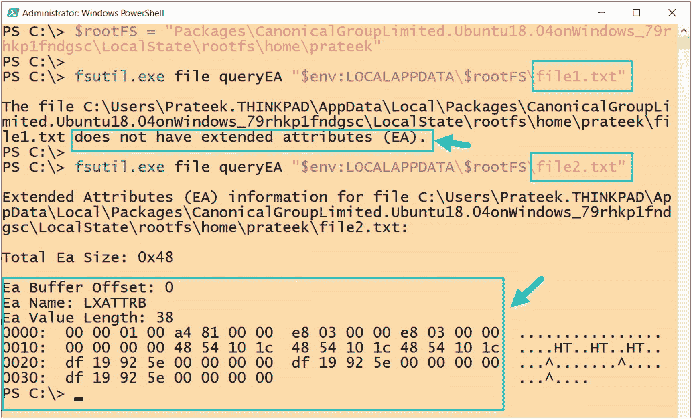

图 6-3

添加到 NTFS 文件中的扩展属性出现在 WSL

### drvfs

该文件系统自动安装在 Linux 发行版上，以提供与 Windows 的互操作性，因此可以从 Linux 的 Windows 子系统访问安装在 NT 文件系统上的驱动器，如图 [6-4](#Fig4) 所示。drvfs 目前只支持新技术文件系统(NTFS)和微软最新的文件系统，弹性文件系统(ReFS)。Linux 的 Windows 子系统会自动将固定驱动器挂载到/mnt 文件夹下


图 6-4

Windows NTFS 驱动器作为 drvfs 文件系统安装在 WSL 上

*   /分钟/c

*   /mnt/d

当我们在 drvfs 窗口中打开文件时，文件权限通过访问控制列表(ACL)适用，这意味着即使您在 WSL 环境中使用`sudo`作为 root 权限，也不意味着您可以访问通过 drvfs 映射的每个 NTFS 文件夹下的文件。例如，如果您尝试访问/mnt/c/Windows，仅有 sudo 权限是不够的，您可能必须使用提升的权限启动 WSL 实例。

### 文件系统

tmpfs 中的所有内容都是临时的，因为不会在您的永久存储(如硬盘)上创建任何文件。相反，所有文件都保存在易失性存储器中，如虚拟内存。这意味着如果您卸载一个 tmpfs，那么其中存储的所有内容都将丢失。

tmpfs 使用内存(RAM)和基于磁盘的交换空间的组合来创建文件系统，由于它使用 RAM，因此与写入磁盘相比，读取和写入数据非常快。如图 [6-5](#Fig5) 所示，`/dev`和`/run`等文件系统挂载了多个目录。


图 6-5

tmpfs 是一个临时文件系统

### procfs，sysfs

procfs 和 sysfs 是特殊的文件系统，它们表示系统信息，如 CPU、进程、驱动程序、设备和配置，这些信息大多是在读取时动态生成的。在后台，WSL 从 Windows NT 内核查询这些信息，而不与 NTFS 进行任何交互。

procfs 是较早的实现，其中大多数与系统相关的信息可以在目录`/proc`中找到，如图 [6-6](#Fig6) 和下面的例子所示，我们可以使用


图 6-6

通过/proc 文件系统访问系统信息

```sh
cat /proc/uptime
and verify the Linux kernel version:
cat /proc/version

```

从 Linux 内核版本 2.6 开始，实现了一个名为 sysfs 的新文件系统，它以一种更加结构化和易于搜索的方式来表示`/sys`处的信息。`/sys`可用于获取电源设置或以太网端口的物理地址等信息，如图 [6-7](#Fig7) 所示。

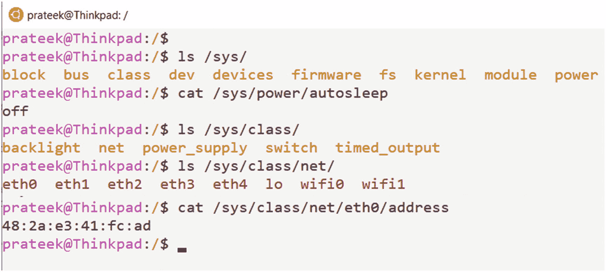

图 6-7

通过/sys 文件系统访问系统信息

### 多个 UNC 提供程序(MUP)

多 UNC 提供程序(MUP)是 mup.sys 二进制文件的内核模式组件部分，负责将任何基于 UNC 的远程文件系统访问重定向到可以满足此类文件系统请求的网络重定向程序(UNC 提供程序)。

基本上，MUP 确定哪个提供程序可以在基于名称的操作中处理 UNC 路径，这也称为“前缀解析”如图 [6-8](#Fig8) 所示，向这些网络提供商查询前缀解析的顺序基于以下注册表条目的逗号分隔值:


图 6-8

UNC 路径前缀解析的网络提供商列表

```sh
$path = 'HKLM:\SYSTEM\CurrentControlSet\Control\NetworkProvider\Order\'
(Get-ItemProperty $path).ProviderOrder -split ','

```

当 WSL 实例启动时，会启动一个 init 进程，该进程在 WSL 上设置一个 9P 服务器和一个用于通信的 Unix 套接字，然后使用 LXSS 管理器服务注册 WSL 包名，并将一个指向 9P 文件服务器的 Unix 套接字注册到 MUP 使用的 9P 重定向器。

因此，当来自 Windows 的用户试图访问 wsl 文件系统的\\wsl$\ <packagename>UNC 路径时，MUP 会进行前缀解析，并最终使用 P9NP (Plan 9 网络提供商)连接到运行在 WSL 上的 9P 文件服务器，以实现两个系统之间的文件操作和互操作性。</packagename>

### 9P(九号计划协议)

9P(或 Plan 9 文件系统协议)是一种网络协议，用于建立一个 9 文件服务器(在 WSL 上)和一个客户机(在 Windows 上),以桥接 Windows 和 Linux 文件系统，并提供无缝的互操作性。使用此协议而不使用 SMB 协议有多种原因，SMB 协议在 Windows 操作系统上已经非常流行。一些原因如下:

*   默认情况下，SMB 可能没有安装在您的系统上。

*   它可能已经过配置，运行多个 SMB 实例并覆盖配置并不明智。

*   如果一个 Linux 发行版没有 Samba，微软就不能发货，因为它是 GNU GPL 许可的，不能和 Windows 10 操作系统一起发货。

*   与更简单和直接的 9P 相比，SMB 在 Linux 的 Windows 子系统下实现起来很复杂和困难。

## WSL 文件系统架构

在我们了解 WSL 的文件系统架构以及如何从 Windows 访问文件到 Linux 以及从 Linux 访问文件之前，让我们首先了解设置工作流，这是通过以下步骤实现文件系统之间的互操作性的要求，这些步骤在图 [6-9](#Fig9) 中用浅蓝色编号的标签突出显示:


图 6-9

WSL1 文件系统架构

1.  启动 WSL.exe 实例时，它会与 LXSS 管理器服务进行交互。

2.  `LXSS.sys`然后与 Linux 的 Windows 子系统通信，以运行`init`进程。

3.  这个`init`进程还负责初始化子系统，并在 WSL 中建立一个 Plan 9 协议文件服务器。

4.  然后，该服务器将与 LXSS 管理器服务协作，为文件系统通信建立一个 Unix 套接字。

5.  一旦完成，Linux 发行版的名称和 Unix 套接字就被注册到 9P 重定向器，以使它知道任何解析到 UNC 路径\\wsl$\ <packagename>的请求应该连接到哪里。</packagename>

一旦初始设置完成，就需要执行以下步骤，以便从 Windows 到运行在 WSL 上的 Linux 操作系统访问文件:

1.  像 CMD.exe 或 PowerShell.exe 这样的 Windows 进程试图使用 UNC 路径\\wsl$\ <packagename>访问 WSL 上的 Linux 文件。</packagename>

2.  此请求被传输到 MUP(多 UNC 提供程序),它尝试解析此路径并连接到适当的远程文件系统。

3.  MUP 通过查找已经为此类请求注册的网络提供商或重定向器来实现这一点。

4.  因为在前面的小节中，已经为 WSL 在 9P 重定向器上注册了一个 Unix 套接字来处理这样的请求，所以这个套接字将被 MUP 用来创建一个到 WSL 上的 Linux 文件系统的 9P 文件服务器连接。

5.  现在，这个 9P 服务器可以与 lxcore.sys 进行通信，以便于使用虚拟文件系统(VFS)从 Windows 进行任何文件系统访问或操作，并模拟 Windows 系统调用到 Linux 系统调用。

Note

WSL1 和 WSL2 的文件系统架构有一个主要区别，即在 WSL1 上，所有文件都使用 NTFS 存储在 Windows 驱动器上，而在 WSL2 上，Linux 文件使用 ext4 文件系统存储在虚拟硬件磁盘(VHD)上。

### Windows-Linux 区分大小写

使用`CreateFile` API 创建文件时，Windows 应用能够传递一个标志 FILE_FLAG_POSIX_SEMANTICS，该标志表示文件路径已启用区分大小写。你可以在这里阅读更多关于这个 API 和标志: [`https://docs.microsoft.com/en-us/windows/win32/api/fileapi/nf-fileapi-createfilea`](https://docs.microsoft.com/en-us/windows/win32/api/fileapi/nf-fileapi-createfilea) 。自 Windows XP 以来，Windows 操作系统就具有这种功能，但默认情况下，它会被全局注册表覆盖。

为了支持在 WSL 上运行的 Linux 应用所使用的区分大小写的文件，Linux 的 Windows 子系统具有其他机制来绕过全局注册表设置，以设置 FILE_FLAG_POSIX_SEMANTICS 标志，从而像 Linux 一样为用户提供区分大小写的体验，而且还使 Windows 应用可以访问这些文件。

Linux 的 Windows 子系统使用另一种机制，它本身绕过那个注册表项，允许我们执行区分大小写的文件系统操作。这就是为什么在 WSL 中运行的 Linux 应用可以使用仅大小写不同的文件名，就像它们在真正的 Linux 上一样，即使使用了全局注册表项集。总是有改变注册表设置的选项，但我们不要忘记这是一个全局设置，改变它将改变所有驱动器的大小写敏感性，这可能不是我们想要的，并可能导致跨应用的意外行为，甚至破坏其他一些应用。

为了克服这一缺点，实现了一个新的区分大小写标志，以在目录级别而不是全局设置上启用或禁用区分大小写，并且不考虑该目录中文件的 FILE_FLAG_POSIX_SEMANTICS 标志。这个新标志允许一个目录中存在两个同名但大小写不同的文件，并且 Windows 应用可以访问这两个文件。

由于 Windows 10 内部版本为 17107，我们可以使用 fsutil.exe 通过以下命令语法查看或修改此标志:

```sh
fsutil.exe file queryCaseSensitiveInfo <directory path>
fsutil.exe file setCaseSensitiveInfo <directory path> <enable\disable>

```

按照下列步骤使用 fsutil.exe 启用区分大小写的文件:

1.  首先，使用管理权限启动 PowerShell 控制台并创建一个新目录，因为此标志只能应用于目录级别:

1.  让我们测试在上一步中刚刚创建的目录上的标志。默认情况下，区分大小写是“禁用的”:

```sh
mkdir testdir | Out-Null

```

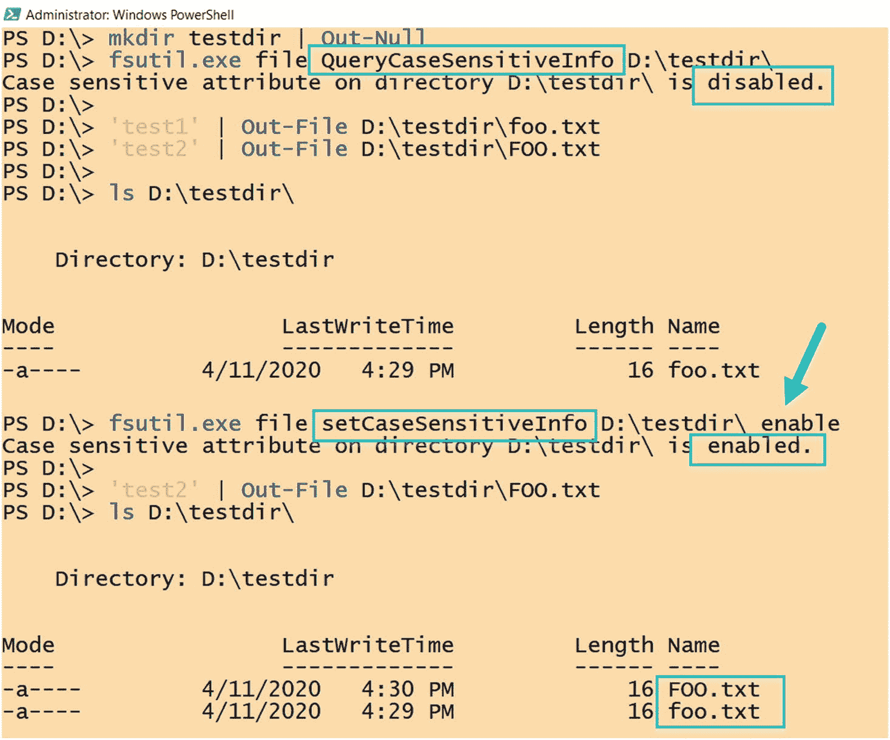

图 6-10

查询和修改 NTFS 上区分大小写属性

1.  现在，如果我们试图创建两个名称相同但大小写不同的文件，那么第二个命令会覆盖第一个文件，并且不会创建第二个文件，因为仍然不支持区分大小写:

    ```sh
    'test1' | Out-File D:\testdir\foo.txt
    'test2' | Out-File D:\testdir\FOO.txt
    ls D:\testdir\

    ```

2.  现在，让我们使用 fsutil.exe 设置标志，并重新尝试创建一个同名但大小写不同的文件:

    ```sh
    fsutil.exe file setCaseSensitiveInfo D:\testdir\ enable
    'test2' | Out-File D:\testdir\FOO.txt

    ```

3.  这次将创建一个新文件，如图 [6-10](#Fig10) 所示，无论大小写，您都可以在目录中看到“foo.txt”和“FOO.txt”文件:

```sh
fsutil.exe file QueryCaseSensitiveInfo D:\testdir\

```

```sh
ls D:\testdir\

```

在 Windows 10 build 17692 中，通过基于每个目录的扩展属性`system.wsl_case_sensitive`,可以在 Linux 的 Windows 子系统中方便地调整区分大小写。要查看或修改这个扩展属性，我们可以使用 Ubuntu 上的`getfattr`和`setfattr`命令，您可能需要使用

```sh
sudo apt install attr

```

要启用该属性，请将其设置为“1”，而“0”则禁用该属性。

Linux 的 Windows 子系统允许我们使用`/etc/wsl.conf`文件的[automount]部分来控制 drvfs 挂载选项的大小写敏感性，默认情况下，WSL 上挂载的这些 Windows 驱动器是不区分大小写的。这意味着当 case=off 被设置时，在“drvfs”挂载上创建的任何新目录将是不区分大小写的。

让我们试试这个:当我检查我安装的驱动器时，我看到默认情况下`drvfs`被设置为 case=off:

```sh
mount | grep case

```

如图 [6-11](#Fig11) 所示，当我们创建一个新目录并使用`getdattr`检查`system.wsl_case_sensitive`扩展属性时，我们观察到它被设置为“0 ”,这意味着该目录不区分大小写:

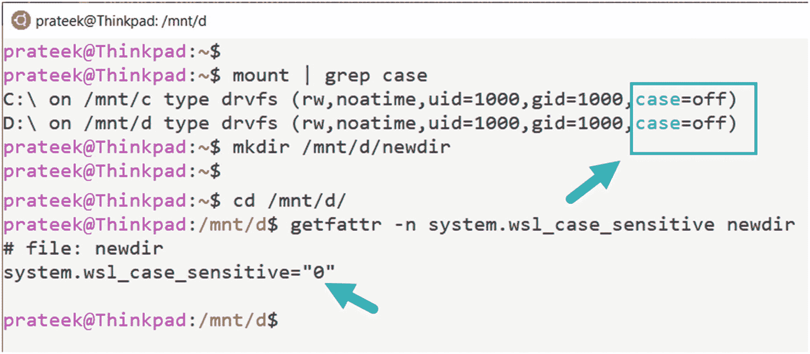

图 6-11

使用“getfattr”在 WSL 中查询区分大小写

```sh
mkdir /mnt/d/newdir

cd /mnt/d/
getfattr -n system.wsl_case_sensitive newdir

```

因此，如果我们试图创建两个具有相同名称和不同大小写的文件，那么第一个文件将被第二个命令覆盖，并且只存在一个文件:

```sh
touch newdir/file.txt
touch newdir/FILE.txt
ls newdir/

```

为了从 WSL 内部启用区分大小写，我们在目录上启用了扩展属性，如下例所示:

```sh
setfattr --name system.wsl_case_sensitive --value 1 newdir
getfattr -n system.wsl_case_sensitive newdir

```

现在，如果我们创建一个大小写不同的文件，那么这两个文件将以相同的名称和不同的大小写“file.txt”和“FILE.txt”创建，如图 [6-12](#Fig12) 所示:

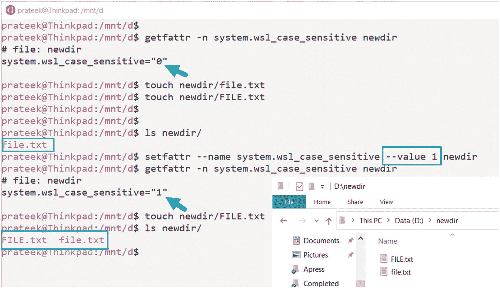

图 6-12

使用“setfattr”修改 WSL 中每个目录的区分大小写

```sh
touch newdir/FILE.txt
ls newdir/

```

Linux 的 Windows 子系统还允许将`/etc/wsl.conf`文件中的挂载选项设置为`case=dir`，这意味着所有创建的新目录都将默认启用区分大小写。如图 [6-13](#Fig13) 所示。

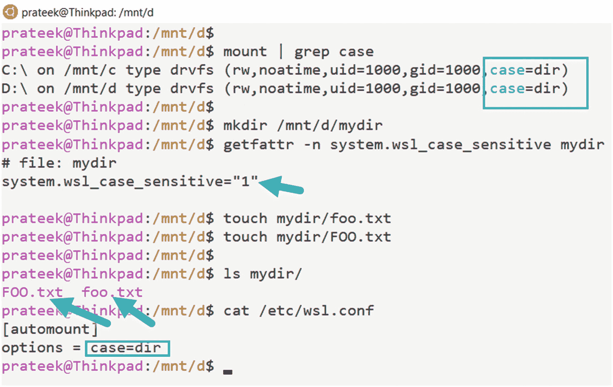

图 6-13

使用/etc/wsl.conf [automount]部分来控制区分大小写

## Windows 和 Linux 的互操作性

随着时间的推移，微软已经使 Linux 和 Windows 之间的文件系统互操作性越来越平滑，有时很难意识到这两个不同的操作系统是高度集成的，而不是孤立的，这弥合了它们之间的差距，使用户能够选择两个世界的最佳之处，并使用他们喜欢的东西，他们喜欢的地方，以及他们喜欢的方式。

### 从 Linux 访问 Windows 文件

安装在 Linux 的 Windows 子系统上的 drvfs 文件系统的主要作用是提供对 Windows 10 上的文件的访问，因此任何安装在 NT 文件系统上的固定驱动器都安装在 WSL 上。例如，NTFS 中的 C:\驱动器将在 WSL 中作为/mnt/c/提供，类似地，D:\作为/mnt/d/提供。

例如，如图 [6-14](#Fig14) 所示，我们可以使用`ls`命令和路径/mnt/d/ <path to="" directory="">列出目录的内容，它将列出 Linux 的 Windows 子系统中的所有 Windows 文件。</path>

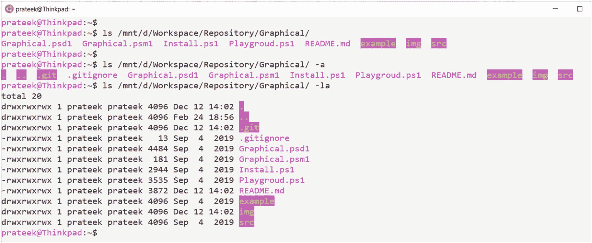

图 6-14

使用 drvfs 文件系统从 WSL 访问 Windows 文件

此外，我们还可以读取这些 Windows 文件的内容，甚至使用我们最喜欢的 Linux 编辑器，如 nano，来编辑驻留在 Windows 10 上的 NT 文件系统中的文件，如图 [6-15](#Fig15) 所示。

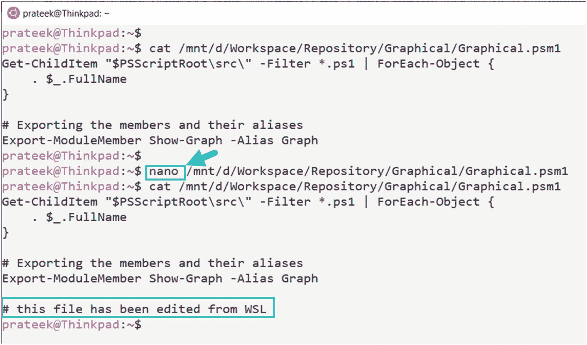

图 6-15

使用 Linux 编辑器从 WSL 编辑 Windows NTFS 文件

WSL 还支持使用 Windows 应用访问 Linux 发行版中的文件。例如，我们可以使用 Windows 文件资源管理器(explorer.exe)从 WSL 控制台打开当前的工作目录。

正如您在下面的示例中看到的，我们能够在 explorer 中启动我们当前的工作目录，即/home/prateek/，作为基于 UNC 的共享路径\ \ wsl $ \ Ubuntu-18.04 \ home \ prateek \在图 [6-16](#Fig16) 中突出显示。在这里，我可以移动、编辑和执行各种文件操作，这些变化将反映到我们运行在 WSL 上的 Linux 发行版中。


图 6-17

使用 drvfs 文件系统将 Windows 文件复制到 WSL

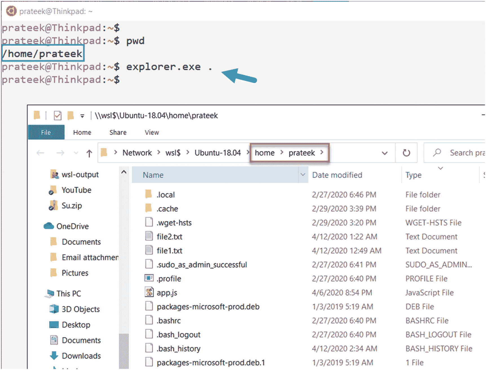

图 6-16

从 WSL 为 Linux 文件使用 Windows Explorer.exe

像`cp`这样用于复制文件的 Linux 命令可以与 drvfs 挂载一起使用，以访问 Windows NTFS 驱动器并将文件复制到 Linux 中，如图 [6-17](#Fig17) 所示。

或者如图 [6-18](#Fig18) 所示，使用`mv`命令将文件或文件夹从 Windows 移动到 Linux 的 Windows 子系统。

最好的部分是 WSL 给了我们跨操作系统混合和匹配命令的能力，进一步缩小了 Linux 和 Windows 之间的差距。在图 [6-19](#Fig19) 所示的示例中，我使用了`ipconfig.exe`(一个 Windows 可执行文件)从 WSL 中的 Windows 获取 IP 配置，然后使用`grep`命令(一个 Linux 命令)过滤输出，然后再次使用 Linux 的 Windows 子系统上的 drvfs 挂载选项`/mnt/`将带有所选结果的文件保存到 Windows NT 文件系统。我的意思是，这有多酷，而且很难找到这样一种融合两个世界优点的灵活性:

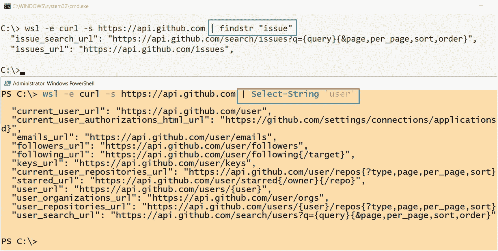

图 6-23

同时运行 WSL 和 Windows 命令


图 6-22

使用 Windows 中的\\wsl$\在 WSL 上创建文件


图 6-21

使用\\wsl$\访问特定的 Linux 发行版文件


图 6-20

访问 UNC 路径上的 Linux 分发文件系统:\\wsl$\


图 6-19

在 Linux 命令中使用 Windows 可执行文件


图 6-18

使用 drvfs 文件系统将 Windows 文件移动到 WSL

```sh
ipconfig.exe | grep IPv4 > /mnt/d/ipaddress.txt
cat  /mnt/d/ipaddress.txt

```

### 从 Windows 访问 Linux 文件

由于 Linux 文件系统的 Windows 子系统现在与 Windows 文件资源管理器(explorer.exe)高度集成，所有的 Linux 发行版都可以在一个特殊的 UNC 路径\\wsl$\下获得，如图 [6-20](#Fig20) 所示。我可以在 Windows 文件资源管理器中看到所有的 Linux 发行版以及它们包含的文件和文件夹。

请注意，只有当 Linux 发行版启动并运行时，这些单独的 Linux 发行版包的路径才会出现。如果 Linux 发行版没有在 WSL 上运行，它就不会出现在\\wsl$\ UNC 路径中。

因此，如果你想从 Windows 导航到 Ubuntu 文件系统，只需在文件资源管理器的地址栏中键入\\wsl$\Ubuntu018.04\如图 [6-21](#Fig21) 所示，然后按回车键，它将带你到 Linux 文件系统的根目录。

可以访问这个\\wsl$\ <disto-name>\ UNC 路径来修改驻留在您的 CMD.exe 或 PowerShell.exe 发行版中的 Linux 文件，这些更改将反映在您的 Linux 发行版中。如图 [6-22](#Fig22) 所示，如果我们从 Windows 命令提示符创建一个文件，从 Windows PowerShell 创建一个文件，并使用\\wsl$\ UNC 路径将它们放在我的 Linux 发行版的主目录中，然后如果我们列出该文件夹中的项目，我们可以从 wsl 端看到两个文件的正确内容。</disto-name>

除此之外，您还可以使用 Linux 的 Windows 子系统来运行使用 wsl.exe 的命令，并将结果与像`findstr`这样的 cmdlets 命令和像`Select-String`这样的 PowerShell cmdlets 结合使用，以将两个世界混合在一起，如图 [6-23](#Fig23) 所示，从而提高用户效率并在一个地方获得两个世界的最佳效果。

## 摘要

在本章中，我们学习了文件系统组件，如 VFS、volfs、drvfs、tmpfs、procfs 和 sysfs，它们与 9P server 和多个 UNC 提供程序一起使 WSL1 文件系统成为可能；后来，我们研究了 WSL1 的文件系统架构，以及它与 WSL2 文件系统架构的不同之处，因为 WSL2 现在运行在一个轻量级实用虚拟机上，支持 Windows 10 附带的 Linux 内核。我们还看了几个例子，以了解在扩展属性的帮助下，区分大小写在 WSL 上是如何工作的，并且可以在目录或 drvfs 挂载级别上进行调整和控制。最后，我们以 WSL 提供的 Windows 和 Linux 互操作性结束了这一章，WSL 使用户能够从 Linux 运行 Windows 可执行程序，从 Windows 运行 Linux 应用，并允许高级用户轻松地混合和匹配这两个领域的最佳功能。在下一章中，我们将学习 WSl 网络，DNS 和网络接口是如何在 WSL 端组装的，以及 WSL1 和 WSL2 网络的区别。