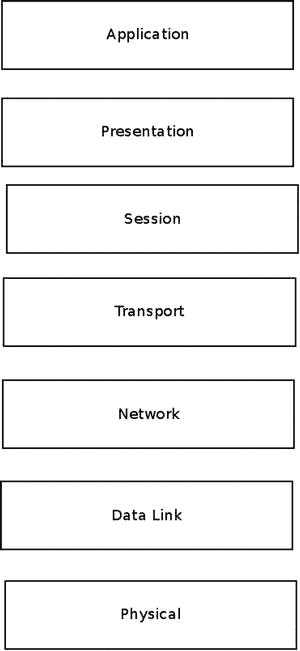
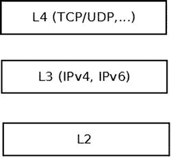

第一章


介绍

这本书讨论了 Linux 内核网络栈的实现及其背后的理论。在接下来的几页中，您将看到对网络子系统及其架构的深入而详细的分析。我不会用与网络不直接相关的主题来增加您的负担，您可能会在阅读内核网络代码时遇到这些主题(例如，锁定和同步、SMP、原子操作等等)。关于这些主题有很多资源。另一方面，专注于内核网络本身的最新资源非常少。我的意思是主要描述包在 Linux 内核网络栈中的遍历及其与各种网络层和子系统的交互——以及各种网络协议是如何实现的。

这本书也不是一个繁琐的，逐行代码演练。我重点关注每个网络层实现的本质，以及导致这种实现的理论指导方针和原则。近年来，Linux 操作系统已经证明了自己是一个成功、可靠、稳定和受欢迎的操作系统。它的受欢迎程度似乎在稳步增长，种类繁多，从大型机、数据中心、核心路由器和 web 服务器到嵌入式设备，如无线路由器、机顶盒、医疗仪器、导航设备(如 GPS 设备)和消费电子设备。许多半导体供应商使用 Linux 作为他们的板支持包(bsp)的基础。Linux 操作系统始于 1991 年一个名叫 Linus Torvalds 的芬兰学生的项目，基于 UNIX 操作系统，被证明是一个严肃可靠的操作系统，是老牌专有操作系统的竞争对手。

Linux 最初是基于 Intel x86 的操作系统，但是已经移植到非常广泛的处理器上，包括 ARM、PowerPC、MIPS、SPARC 等等。基于 Linux 内核的 Android 操作系统在今天的平板电脑和智能手机中很常见，并且似乎有可能在未来的智能电视中获得普及。除了 Android 之外，Google 还贡献了一些合并到主线内核中的内核网络特性。

Linux 是一个开源项目，因此它比其他专有操作系统更有优势:它的源代码可以在通用公共许可证(GPL)下免费获得。其他开源操作系统，如不同类型的 BSD，就没那么受欢迎了。在这种情况下，我还应该提到 OpenSolaris 项目，该项目基于通用开发和分发许可证(CDDL)。这个由 Sun 微系统公司发起的项目并没有像 Linux 那样流行。在活跃的 Linux 开发人员的大型社区中，有些人代表他们工作的公司贡献代码，有些人自愿贡献代码。所有的内核开发过程都可以通过内核邮件列表访问。有一个中央邮件列表，Linux 内核邮件列表(LKML)，，许多子系统都有自己的邮件列表。贡献代码是通过向适当的内核邮件列表和维护者发送补丁来完成的，这些补丁在邮件列表中讨论。

Linux 内核网络栈是 Linux 内核的一个非常重要的子系统。很难找到一个基于 Linux 的系统，无论是台式机、服务器、移动设备还是任何其他嵌入式设备，不使用任何类型的网络。即使在机器没有任何硬件网络设备的罕见情况下，当您使用 X-Windows 时，您仍然会使用网络(可能是无意识的)，因为 X-Windows 本身是基于客户机-服务器网络的。从核心路由器到小型嵌入式设备，许多项目都与 Linux 网络堆栈有关。其中一些项目处理添加特定于供应商的特性。例如，一些硬件供应商在一些网络设备中实现通用分段卸载(GSO)。GSO 是内核网络堆栈的一项网络功能，它将 Tx 路径中的一个大数据包分成较小的数据包。许多硬件供应商在其网络设备的硬件中实现校验和。*校验和*是一种验证数据包在传输过程中未被损坏的机制，通过计算数据包中的一些哈希并将其附加到数据包中。许多项目为 Linux 提供了一些安全性增强。有时候，这些增强需要在网络子系统中做一些改变，例如，你会在第三章中看到，当讨论 Openwall GNU/*/Linux 项目时。例如，在嵌入式设备领域，有许多基于 Linux 的无线路由器；运行 Linux 的 WRT54GL Linksys 路由器就是一个例子。还有一个开源的、基于 Linux 的操作系统，可以在这个设备(以及其他一些设备)上运行，名为 OpenWrt，拥有一个庞大而活跃的开发者社区(见`https://openwrt.org/`)。了解 Linux 内核网络栈是如何实现各种协议的，并熟悉其中的主要数据结构和包的主要路径，对于更好地理解它是必不可少的。

Linux 网络堆栈

根据开放系统互连(OSI)模型，有七个逻辑网络层。最低层是物理层，即硬件，最高层是应用层，用户空间软件进程在此运行。让我们来描述这七层:

1.  *物理层:* 处理电信号和底层细节。
2.  *数据链路层:* 处理端点之间的数据传输。最常见的数据链路层是以太网。Linux 以太网设备驱动程序位于这一层。
3.  *网络层:* 处理包转发和主机寻址。在本书中，我讨论了 Linux 内核网络子系统最常见的网络层:IPv4 或 IPv6。Linux 还实现了其他一些不太常见的网络层，比如 DECnet，但我们不会讨论它们。
4.  *协议层/传输层:* 处理节点间的数据发送。TCP 和 UDP 协议是最著名的协议。
5.  *会话层:* 处理端点之间的会话。
6.  *表示层:* 处理交付和格式化。
7.  *应用层:* 为最终用户应用提供网络服务。

[图 1-1](#Fig1) 显示了 OSI 模型的七层。



[图 1-1](#_Fig1) 。OSI 七层模型

[图 1-2](#Fig2) 显示了 Linux 内核网络栈处理的三层。此图中的 L2、L3 和 L4 层分别对应于七层模型中的数据链路层、网络层和传输层。Linux 内核栈的本质是将传入的数据包从 L2(网络设备驱动程序)传递到 L3(网络层，通常是 IPv4 或 IPv6) ，然后传递到 L4(传输层，在那里你有，例如，TCP 或 UDP 监听套接字)，如果它们是用于本地传递，或者当数据包应该被转发时返回到 L2 进行传输。本地生成的传出数据包从 L4 传递到 L3，然后通过网络设备驱动程序传递到 L2 进行实际传输。沿着这条路有许多阶段，许多事情会发生。例如:

*   由于协议规则(例如，由于 IPsec 规则或 NAT 规则)，数据包可以被改变。
*   该分组可以被丢弃。
*   该数据包会导致发送错误消息。
*   该分组可以被分段。
*   可以对数据包进行碎片整理。
*   应该为数据包计算校验和。



[图 1-2](#_Fig2) 。Linux 内核网络层

内核不处理 L4 以上的任何层；这些层(会话层、表示层和应用层)由用户空间应用单独处理。物理层(L1)也不由 Linux 内核处理。

如果你感到不知所措，不要担心。在接下来的章节中，你将会更深入地了解这里所描述的一切。

网络设备

如图 1-2 中的[所示，下层，第二层(L2)是链路层。网络设备驱动程序位于这一层。这本书不是关于网络设备驱动程序开发的，因为它关注的是 Linux 内核网络栈。我将在这里简单描述一下代表网络设备的`net_device`结构，以及与之相关的一些概念。为了更好地理解网络堆栈，您应该对网络设备结构有一个基本的了解。设备的参数(如 MTU 的大小，以太网设备通常为 1，500 字节)决定了数据包是否应该被分段。`net_device`是一个非常大的结构，由如下设备参数组成:](#Fig2)

*   设备的 IRQ 号。
*   设备的 MTU。
*   设备的 MAC 地址。
*   设备的名称(如`eth0`或`eth1`)。
*   设备的标志(例如，是打开还是关闭)。
*   与设备相关的多播地址列表。
*   `promiscuity`计数器(将在本节稍后讨论)。
*   设备支持的功能(如 GSO 或 GRO 卸载)。
*   网络设备回调的一个对象(`net_device_ops` object)，由函数指针组成，比如打开和停止一个设备，开始传输，改变网络设备的 MTU 等等。
*   一个`ethtool`回调的对象，它支持通过运行命令行`ethtool`实用程序来获取关于设备的信息。
*   当设备支持多队列时，发送和接收队列的数量。
*   此设备上最后一次传输数据包的时间戳。
*   此设备上最后一次接收数据包的时间戳。

下面是一些`net_device`结构成员的定义，给你一个初步印象:

```sh
struct net_device {
    unsigned int            irq;            /* device IRQ number    */
    . . .
    const struct net_device_ops *netdev_ops;
    . . .
    unsigned int            mtu;
    . . .
    unsigned int            promiscuity;
    . . .
    unsigned char           *dev_addr;
    . . .
};
(include/linux/netdevice.h)
```

本书的附录 A 包含了对`net_device`结构及其大部分成员的详细描述。在那个附录中你可以看到`irq`、`mtu`以及本章前面提到的其他成员。

当`promiscuity`计数器大于 0 时，网络堆栈不会丢弃目的地不是本地主机的数据包。例如，像`tcpdump`和`wireshark`这样的数据包分析器(“嗅探器”)就使用这种方法，它们在用户空间中打开原始套接字，并希望接收这种类型的流量。它是一个计数器，而不是一个布尔值，以便能够同时打开几个嗅探器:打开每一个这样的嗅探器都会使计数器加 1。当嗅探器关闭时，`promiscuity`计数器减 1；如果达到 0，则不再有嗅探器运行，设备退出混杂模式。

在浏览内核联网核心源代码时，在各个地方你很可能会遇到 NAPI (New API)这个术语，这是现在大多数网络设备驱动都实现的一个特性。你应该知道它是什么，为什么网络设备驱动程序使用它。

网络设备中的新 API (NAPI)

旧的网络设备驱动程序工作在中断驱动模式下，这意味着对于每个收到的数据包，都有一个中断。事实证明，这在高负载流量下的性能方面是低效的。一种新的软件技术被开发出来，称为新 API (NAPI)，现在几乎所有的 Linux 网络设备驱动程序都支持它。NAPI 最初是在 2.5/2.6 内核中引入的，后来被移植到 2.4.20 内核中。对于 NAPI，在高负载下，网络设备驱动程序工作在轮询模式，而不是中断驱动模式。这意味着每个收到的包不会触发中断。相反，数据包被缓存在驱动程序中，内核不时地轮询驱动程序以获取数据包。使用 NAPI 可以提高高负载下的性能。对于需要尽可能低的延迟并愿意为更高的 CPU 利用率付出代价的套接字应用，Linux 从内核 3.11 和更高版本添加了对套接字进行繁忙轮询的功能。这项技术将在第 14 章的“忙轮询套接字”一节中讨论。

有了关于网络设备的新知识，现在是时候了解包在 Linux 内核网络栈中的遍历了。

接收和发送数据包

网络设备驱动程序的主要任务如下:

*   接收目的地为本地主机的数据包，并将它们传递到网络层(L3)，然后从那里传递到传输层(L4)
*   传输本地主机生成并发送到外部的传出数据包，或者转发本地主机收到的数据包

对于每个数据包，无论是传入的还是传出的，都会在路由子系统中进行查找。基于路由子系统中的查找结果来决定是否应该转发数据包以及应该在哪个接口上发送数据包，我将在第 5 章和第 6 章[中对此进行详细描述。路由子系统中的查找并不是决定数据包在网络堆栈中遍历的唯一因素。例如，网络堆栈中有五个点可以注册 netfilter 子系统](06.html)(通常称为 netfilter 钩子)的回调。在执行路由查找之前，接收到的数据包的第一个 netfilter 挂钩点是 NF_INET_PRE_ROUTING。当一个包被这样一个回调处理时，这个回调由一个名为 NF_HOOK()的宏调用，它将根据这个回调的结果继续在网络堆栈中遍历(也称为`verdict`)。例如，如果`verdict`是 NF_DROP，数据包将被丢弃，如果`verdict`是 NF_ACCEPT，数据包将照常继续遍历。Netfilter 钩子回调由`nf_register_hook()`方法或`nf_register_hooks()`方法注册，例如，在各种 netfilter 内核模块中，你会遇到这些调用。内核 netfilter 子系统是众所周知的`iptables`用户空间包的基础设施。[第 9 章](09.html)描述了 netfilter 子系统和 netfilter 挂钩，以及 netfilter 的连接跟踪层。

除了 netfilter 挂钩之外，数据包遍历还会受到 IPsec 子系统的影响，例如，当它与配置的 IPsec 策略匹配时。IPsec 提供了一个网络层安全解决方案，它使用 ESP 和 AH 协议。根据 IPv6 规范，IPsec 是强制性的，而在 IPv4 中是可选的，尽管包括 Linux 在内的大多数操作系统也在 IPv4 中实现了 IPsec。IPsec 有两种操作模式:传输模式和隧道模式。它被用作许多虚拟专用网络(VPN) 解决方案、的基础，尽管也有非 IPsec VPN 解决方案。您将在[第 10 章](10.html)中了解 IPsec 子系统和 IPsec 策略，该章还讨论了通过 NAT 使用 IPsec 时出现的问题，以及 IPsec NAT 穿越解决方案。

还有其他因素会影响数据包的遍历，例如，正在转发的数据包的 IPv4 报头中的`ttl`字段的值。此`ttl`在每个转发设备中递减 1。当它达到 0 时，数据包被丢弃，并且发送回一个带有“超过 TTL 计数”代码的“超时”ICMPv4 消息。这样做是为了避免由于某些错误而导致转发数据包的无休止的旅程。此外，每次成功转发数据包并且`ttl`减 1 时，都应该重新计算 IPv4 报头的校验和，因为其值取决于 IPv4 报头，并且`ttl`是 IPv4 报头成员之一。第 4 章，处理 IPv4 子系统，更多的谈论这个。在 IPv6 中有一些类似的东西，但是 IPv6 报头中的跳计数器被命名为`hop_limit`而不是`ttl`。您将在第 8 章中了解到这一点，该章涉及 IPv6 子系统。您还将在第 3 章的[中了解 IPv4 和 IPv6 中的 ICMP。](03.html)

该书的很大一部分讨论了数据包在网络堆栈中的遍历，无论是在接收路径(Rx 路径，也称为*入口*流量)还是传输路径(Tx 路径，也称为*出口*流量)。这种遍历是复杂的，并且有许多变化:大的包在发送之前可能被分段；另一方面，应该将碎片化的数据包组装起来(在第 4 章的[中讨论)。不同类型的数据包被不同地处理。例如，多播数据包是可以由一组主机处理的数据包(与单播数据包相反，单播数据包的目的地是指定的主机)。例如，多播可以用于流媒体应用中，以便消耗更少的网络资源。处理 IPv4 多播流量在第 4 章](04.html)的[中讨论。您还将了解主机如何加入和离开多播组；在 IPv4 中，互联网组管理协议(IGMP)协议处理多播成员资格。然而，也有主机被配置为组播路由器的情况，组播流量应该被转发而不是传送到本地主机。这些情况更加复杂，因为它们应该与用户空间多播路由守护进程一起处理，如`pimd`守护进程或`mrouted`守护进程。这些情况称为多播路由，在第 6 章](04.html)中讨论。

为了更好地理解包遍历，您必须了解包在 Linux 内核中是如何表示的。`sk_buff`结构表示一个输入或输出的数据包，包括其报头(`include/linux/skbuff.h`)。在本书的许多地方，我将一个`sk_buff`对象称为 SKB，因为这是表示`sk_buff`对象的通用方式(SKB 代表*套接字缓冲区*)。套接字缓冲区(`sk_buff)`结构是一个很大的结构——在本章中我将只讨论这个结构的几个成员。

套接字缓冲区

`sk_buff`结构在[附录 A](16.html) 中有详细描述。当你需要了解更多关于 SKB 成员或者如何使用 SKB API 时，我推荐你参考这个附录。请注意，在使用 SKBs 时，您必须遵守 SKB API。因此，举例来说，当你想要推进`skb->data`指针时，你不直接这样做，而是用`skb_pull_inline()`方法或`skb_pull()`方法(你将在本节后面看到一个这样的例子)。如果您想从 SKB 获取 L4 报头(传输报头),您可以通过调用`skb_transport_header()`方法来完成。同样，如果您想获取 L3 报头(网络报头)，您可以通过调用`skb_network_header()`方法来完成，如果您想获取 L2 报头(MAC 报头)，您可以通过调用`skb_mac_header()`方法来完成。这三种方法将 SKB 作为单个参数。

下面是`sk_buff`结构的(部分)定义:

```sh
struct sk_buff {
    . . .
    struct sock             *sk;
    struct net_device       *dev;
    . . .
    __u8                    pkt_type:3,
    . . .
    __be16                  protocol;
    . . .
    sk_buff_data_t          tail;
    sk_buff_data_t          end;
    unsigned char           *head,
                            *data;

    sk_buff_data_t          transport_header;
    sk_buff_data_t          network_header;
    sk_buff_data_t          mac_header;
    . . .

};
(include/linux/skbuff.h)
```

当网络上接收到一个数据包时，网络设备驱动程序会分配一个 SKB，通常是通过调用`netdev_alloc_skb()`方法(或`dev_alloc_skb()`方法，这是一个调用第一个参数为空的`netdev_alloc_skb()`方法的遗留方法)。在包遍历的过程中，有时会丢弃一个包，这是通过调用`kfree_skb()`或`dev_kfree_skb()`来实现的，这两个函数都以单个参数的形式获得一个指向 SKB 的指针。SKB 的一些成员是在链路层(L2)确定的。例如，`pkt_type`由`eth_type_trans()`方法根据目的以太网地址确定。如果这个地址是组播地址，`pkt_type`将被设置为 PACKET _ MULTICAST 如果该地址是广播地址，则`pkt_type`将被设置为 PACKET _ BROADCAST 如果这个地址是本地主机的地址，那么`pkt_type`将被设置为 PACKET_HOST。大多数以太网网络驱动程序在它们的 Rx 路径中调用`eth_type_trans()`方法。`eth_type_trans()`方法还根据以太网报头的`ethertype`设置 SKB 的`protocol`字段。`eth_type_trans()`方法还通过调用`skb_pull_inline()`方法将 SKB 的`data`指针提前 14 (ETH_HLEN)，这是以太网报头的大小。这样做的原因是`skb->data`应该指向它当前所在的层的头。当数据包在 L2 时，在网络设备驱动程序的 Rx 路径中，`skb->data`指向了 L2(以太网)报头；既然数据包将被移动到第 3 层，在调用`eth_type_trans()`方法后，`skb->data`将立即指向网络(L3)报头，这在以太网报头后立即开始(见[图 1-3](#Fig3) )。


[图 1-3](#_Fig3) 。一个 IPv4 数据包

SKB 包括数据包报头(L2、L3 和 L4 报头)和数据包有效载荷。在网络堆栈中的数据包遍历中，可以添加或删除报头。例如，对于由套接字在本地生成并传输到外部的 IPv4 数据包，网络层(IPv4)会在 SKB 中添加 IPv4 报头。IPv4 报头大小最小为 20 字节。添加 IP 选项时，IPv4 报头最大可达 60 字节。IP 选项在[第 4 章](04.html)中描述，该章讨论了 IPv4 协议的实现。[图 1-3](#Fig3) 显示了一个带有 L2、L3 和 L4 报头的 IPv4 数据包的例子。[图 1-3](#Fig3) 中的例子是一个 UDPv4 包。首先是 14 字节的以太网报头(L2)。然后是最小大小为 20 字节到 60 字节的 IPv4 报头(L3 ),之后是 8 字节的 UDPv4 报头(L4)。然后是数据包的有效载荷。

每个 SKB 都有一个`dev`成员，它是`net_device`结构的一个实例。对于传入数据包，它是传入网络设备，对于传出数据包，它是传出网络设备。有时需要连接到 SKB 的网络设备来获取信息，这些信息可能会影响 SKB 在 Linux 内核网络堆栈中的遍历。例如，如前所述，网络设备的 MTU 可能需要分段。每个传输的 SKB 都有一个与之关联的`sock`对象(`sk`)。如果数据包是转发的数据包，那么`sk`为空，因为它不是在本地主机上生成的。

每个收到的数据包都应该由匹配的网络层协议处理程序来处理。例如，IPv4 数据包应该由`ip_rcv()`方法处理，IPv6 数据包应该由`ipv6_rcv()`方法处理。您将在第 4 章的[中学习使用`dev_add_pack()`方法注册 IPv4 协议处理程序，并在第 8 章](04.html)的[中学习使用`dev_add_pack()`方法注册 IPv6 协议处理程序。此外，我将跟踪 IPv4 和 IPv6 中传入和传出数据包的遍历。例如，在`ip_rcv()`方法中，大多数情况下会执行健全性检查，如果一切正常，数据包会进入 NF_INET_PRE_ROUTING 钩子回调(如果此回调已注册),如果此钩子没有丢弃数据包，则下一步是`ip_rcv_finish()`方法，](08.html)在路由子系统中执行查找。路由子系统中的查找建立了目的缓存条目(`dst_entry`对象)。在描述 IPv4 路由子系统的第 5 章和第 6 章中，您将了解到`dst_entry`以及与之相关的`input`和`output`回调方法。

在 IPv4 中，存在地址空间有限的问题，因为 IPv4 地址只有 32 位。组织使用 NAT(在[第 9 章](09.html)中讨论)向其主机提供本地地址，但 IPv4 地址空间仍在逐年减少。开发 IPv6 协议的主要原因之一是，与 IPv4 地址空间相比，它的地址空间非常大，因为 IPv6 地址长度为 128 位。但是 IPv6 协议不仅仅是关于更大的地址空间。IPv6 协议包含了许多变化和补充，这是多年来使用 IPv4 协议所获得的经验的结果。例如，与 IPv4 报头相比，IPv6 报头具有 40 字节的固定长度，而 IP v4 报头的长度是可变的(从最小 20 字节到 60 字节),这是由于 IP 选项可以扩展它。在 IPv4 中处理 IP 选项是复杂的，并且在性能方面相当繁重。另一方面，在 IPv6 中，您根本无法扩展 IPv6 报头(如上所述，它的长度是固定的)。取而代之的是一种扩展报头机制，它在性能方面比 IPv4 中的 IP 选项更有效。另一个显著的变化是 ICMP 协议；在 IPv4 中，它仅用于错误报告和信息性消息。在 IPv6 中，ICMP 协议用于许多其他目的:邻居发现(ND)、多播侦听发现(MLD)等等。[第 3 章](03.html)专门针对 ICMP(IP v4 和 IPv6)。IPv6 邻居发现协议在第 7 章的[中描述，MLD 协议在第 8 章](07.html)的[中讨论，它涉及 IPv6 子系统。](08.html)

如前所述，收到的数据包由网络设备驱动程序传递到网络层，即 IPv4 或 IPv6。如果数据包用于本地传送，它们将被传送到传输层(L4)以供监听套接字处理。最常见的传输协议是 UDP 和 TCP，在[第 11 章](11.html)中讨论，其中讨论了第 4 层，即传输层。本章还介绍了两种较新的传输协议，即流控制传输协议(SCTP)和数据报拥塞控制协议(DCCP)。你会发现，SCTP 和 DCCP 都采用了一些 TCP 特性和 UDP 特性。已知 SCTP 协议与长期演进(LTE)协议结合使用；到目前为止，DCCP 还没有在更大规模的互联网环境中测试过。

本地主机生成的数据包由第 4 层套接字创建，例如 TCP 套接字或 UDP 套接字。它们是由用户空间应用用套接字 API 创建的。套接字主要有两种:**数据报**套接字和**流**套接字。这两种类型的套接字和基于 POSIX 的套接字 API 也将在[第 11 章](11.html)中讨论，在那里您还将了解套接字的内核实现(`struct socket`，它提供了到用户空间的接口，`struct sock`，它提供了到第 3 层的接口)。本地生成的数据包被传递到网络层 L3(在第 4 章的【发送 IPv4 数据包】一节中描述)，然后被传递到网络设备驱动程序(L2)进行传输。在有些情况下，碎片发生在第 3 层，即网络层，这也在第 4 章的[中讨论。](04.html)

每个第 2 层网络接口都有一个 L2 地址来标识它。在以太网的情况下，这是一个 48 位地址，由制造商为每个以太网网络接口分配的 MAC 地址，据说是唯一的(尽管您应该考虑到大多数网络接口的 MAC 地址可以通过用户空间命令如`ifconfig`或`ip`来更改)。每个以太网数据包都以一个 14 字节长的以太网报头开始。它由以太网类型(2 字节)、源 MAC 地址(6 字节)和目的 MAC 地址(6 字节)组成。例如，IPv4 的以太网类型值为 0x0800，IPv6 的以太网类型值为 0x86DD。对于每个传出的数据包，应该构建一个以太网报头。当用户空间套接字发送一个包时，它指定其目的地址(可以是 IPv4 或 IPv6 地址)。这不足以构建数据包，因为目的 MAC 地址应该是已知的。根据 IP 地址找到主机的 MAC 地址是相邻子系统的任务，在第 7 章的[中讨论。邻居发现由 IPv4 中的 ARP 协议和 IPv6 中的 NDISC 协议处理。这些协议是不同的:ARP 协议依赖于发送广播请求，而 NDISC 协议依赖于发送 ICMPv6 请求，这些请求实际上是多播数据包。ARP 协议和 NDSIC 协议也在第 7 章](07.html)中讨论。

网络堆栈应该与用户空间进行通信，以执行诸如添加或删除路由、配置邻居表、设置 IPsec 策略和状态等任务。用户空间和内核之间的通信是通过 netlink 套接字完成的，在第 2 章中有所描述。基于 netlink 套接字的用户空间包也在第 2 章的[中讨论，以及通用 netlink 套接字及其优点。](02.html)

无线子系统将在第 12 章中讨论。如前所述，这个子系统是单独维护的；它有自己的树和自己的邮件列表。无线堆栈中有一些普通网络堆栈中不存在的独特功能，例如省电模式(当工作站或接入点进入睡眠状态时)。Linux 无线子系统还支持特殊的拓扑，，比如网状网络、自组织网络等等。这些拓扑有时需要使用特殊功能。例如，网状网络使用一种叫做混合无线网状协议(HWMP)的路由协议，在第 12 章中讨论。该协议工作在第 2 层，处理 MAC 地址，与 IPV4 路由协议相反。[第 12 章](12.html)还讨论了 mac80211 框架，无线设备驱动程序使用它。无线子系统的另一个非常有趣的特性是 IEEE 802.11n 中的块确认机制，也在第 12 章中讨论过。

近年来，InfiniBand 技术在企业数据中心越来越受欢迎。InfiniBand 基于一种称为远程直接内存访问(RDMA)的技术。在版本 2.6.11 中，RDMA API 被引入到 Linux 内核中。在第 13 章中，你会找到关于 Linux Infiniband 实现、RDMA API 及其基本数据结构的很好的解释。

虚拟化解决方案也变得越来越受欢迎，尤其是由于 Xen 或 KVM 等项目。此外，硬件的改进，如用于英特尔处理器的 VT-x 或用于 AMD 处理器的 AMD-V，使虚拟化更加高效。还有另一种形式的虚拟化，可能不太为人所知，但有自己的优势。这种虚拟化基于一种不同的方法:流程虚拟化。它在 Linux 中是通过名称空间实现的。Linux 目前支持六种名称空间，将来可能会有更多。名称空间特性已经被 Linux Containers ( `http://lxc.sourceforge.net/`)和 Userspace 中的 check point/Restore(CRIU)等项目所使用。为了支持名称空间，内核中增加了两个系统调用:`unshare()`和`setns()`；六个新标志被添加到 CLONE_*标志中，每个标志对应一种名称空间类型。我在[第 14 章](14.html)中特别讨论了名称空间和网络名称空间。第 14 章也讨论了蓝牙子系统，并简要介绍了 PCI 子系统，因为许多网络设备驱动程序都是 PCI 设备。我不深入研究 PCI 子系统内部，因为那超出了本书的范围。第 14 章中讨论的另一个有趣的子系统是 IEEE 8012.15.4，它适用于低功耗和低成本设备。这些设备有时会与*物联网* (IoT) 概念一起提及，后者涉及将支持 IP 的嵌入式设备连接到 IP 网络。事实证明，在这些设备上使用 IPv6 可能是个好主意。该解决方案被称为低功率无线个人区域网上的 IPv6(6 lowpan)。它有自己的挑战，例如扩展 IPv6 邻居发现协议以适合这种偶尔进入睡眠模式的设备(与普通 IPv6 网络相反)。IPv6 邻居发现协议的这些变化还没有实现，但是考虑这些变化背后的理论是很有趣的。除此之外，在第 14 章中还有关于其他高级主题的章节，如 NFC、cgroups、Android 等等。

为了更好地理解 Linux 内核网络栈或参与其开发，您必须熟悉其开发是如何处理的。

Linux 内核网络开发模型

内核网络子系统非常复杂，它的开发相当动态。像任何 Linux 内核子系统一样，开发是由通过邮件列表(有时不止一个邮件列表)发送的`git`补丁完成的，这些补丁最终被该子系统的维护者接受或拒绝。出于许多原因，了解内核网络开发模型是很重要的。为了更好地理解代码，为了调试和解决基于 Linux 内核网络的项目中的问题，为了实现性能改进和优化补丁，或者为了实现新的特性，在许多情况下，您需要学习很多东西，例如:

*   如何应用补丁
*   如何阅读和解释补丁
*   如何找到可能导致给定问题的修补程序
*   如何恢复修补程序
*   如何找到与某些功能相关的补丁
*   如何将项目调整到旧的内核版本(反向移植)
*   如何将项目调整到较新的内核版本(升级)
*   如何克隆一棵树
*   如何重置一棵`git`树
*   如何找出在哪个内核版本中应用了指定的`git`补丁

有些情况下，您需要使用刚刚添加的新功能，为此，您需要知道如何使用最新的、前沿的树。有些情况下，当您遇到一些 bug，或者您想要向网络堆栈添加一些新功能时，您需要准备一个补丁并提交它。与内核的其他部分一样，Linux 内核网络子系统由 Linus Torvalds 开发的源代码管理(SCM)系统`git`管理。如果你打算为主线内核发送补丁，或者如果你的项目由`git`管理，你必须学会使用`git`工具。

有时你甚至需要安装一个`git`服务器来开发本地项目。即使您不打算发送任何补丁，您也可以使用`git`工具来检索大量关于代码和代码开发历史的信息。网上有很多关于`git`的资源；我推荐斯科特·沙孔的免费在线书籍 *Pro Git* ，在`http://git-scm.com/book`可以买到。如果您打算将您的补丁提交到主线，您必须遵守一些关于编写、检查和提交补丁的严格规则，这样您的补丁才会被应用。您的补丁应该符合内核编码风格，并且应该经过测试。你还需要有耐心，因为有时即使是微不足道的补丁也要过几天才能贴上。我建议学习配置一台主机，使用`git send-email`命令提交补丁(尽管提交补丁可以用其他邮件客户端完成，甚至是流行的 Gmail 网络邮件客户端)。网上有很多关于如何使用`git`准备和发送内核补丁的指南。我还建议在提交你的第一个补丁之前阅读内核树中的`Documentation/SubmittingPatches`和`Documentation/CodingStyle`。

我推荐使用以下 PERL 脚本:

*   `scripts/checkpatch.pl`检查补丁的正确性
*   要找出补丁应该发给哪个维护者

最重要的信息资源之一是内核网络开发邮件列表，`netdev` : `netdev@vger.kernel.org`，存档在`www.spinics.net/lists/netdev`。这是一个高容量列表。大多数帖子是新代码的补丁和征求意见稿(RFC ),以及关于补丁的评论和讨论。这个邮件列表处理 Linux 内核网络堆栈和网络设备驱动程序，除了处理具有特定邮件列表和特定`git`存储库的子系统的情况(例如无线子系统，在[第 12 章](12.html)中讨论)。`iproute2`和`ethtool`用户空间包的开发也在`netdev`邮件列表中处理。这里应该提到的是，并不是每个网络子系统都有自己的邮件列表；例如，IPsec 子系统(在第 10 章中讨论)没有邮件列表，IEEE 802.15.4 子系统也没有邮件列表。一些网络子系统有自己特定的`git`树、维护者和邮件列表，比如无线邮件列表和蓝牙邮件列表。这些子系统的维护者不时通过`netdev`邮件列表发送对他们的`git`树的请求。另一个信息来源是内核树中的`Documentation/networking`。它在许多文件中包含了关于各种网络主题的大量信息，但是请记住，您在那里找到的文件并不总是最新的。

Linux 内核网络子系统在两个`git`存储库中维护。补丁和 RFC 被发送到两个存储库的`netdev`邮件列表。这是两株`git`树:

*   *net:* `http://git.kernel.org/?p=linux/kernel/git/davem/net.git`:针对主线树中已经存在的代码进行修复
*   *net-next:* `http://git.kernel.org/?p=linux/kernel/git/davem/net-next.git`:未来内核发布的新代码

网络子系统的维护者 David Miller 不时通过 LKML 向 Linus 发送对这些`git`树的主线的拉请求。你应该知道，在与主线合并的过程中，有一段时间 net-next `git`树是关闭的，不应该发送补丁。通过`netdev`邮件列表发送一个通知，告知这段时间何时开始，另一个通知何时结束。

 **注**本书基于内核 3.9。所有代码片段都来自这个版本，除非另有明确说明。内核树可以从`www.kernel.org`作为一个`tar`文件获得。或者，您可以下载一个带有`git` `clone`的内核`git`树(例如，使用前面提到的`git net`树或`git net-next`树的 URL，或者其他`git`内核库)。互联网上有很多关于如何配置、构建和引导 Linux 内核的指南。也可以在`http://lxr.free-electrons.com/`在线浏览各种内核版本。这个网站让你了解每个方法和每个变量被引用的地方；此外，您可以通过点击鼠标轻松导航到 Linux 内核的以前版本。如果您正在使用您自己版本的 Linux 内核树，其中一些更改是在本地进行的，您可以在本地 Linux 机器上本地安装和配置 Linux 交叉引用服务器(LXR)。参见`http://lxr.sourceforge.net/en/index.shtml`。

摘要

本章是对 Linux 内核网络子系统的简短介绍。我描述了使用 Linux(一个流行的开源项目)和内核网络开发模型的好处。我还描述了网络设备结构(`net_device`)和套接字缓冲区结构(`sk_buff`)，这是网络子系统的两个最基本的结构。你应该参考[附录 A](16.html) 中关于这些结构的几乎所有成员及其用途的详细描述。本章涵盖了与数据包在内核网络堆栈中的遍历相关的其他重要主题，例如路由子系统中的查找、碎片和碎片整理、协议处理程序注册等。其中一些协议将在后面的章节中讨论，包括 IPv4、IPv6、ICMP4 和 ICMP6、ARP 和邻居发现。几个重要的子系统，包括无线子系统、蓝牙子系统和 IEEE 812.5.4 子系统，也将在后面的章节中介绍。[第 2 章](02.html)从 netlink sockets 开始内核网络堆栈之旅，它提供了一种用户空间和内核之间的双向通信方式，这将在其他几章中讨论。