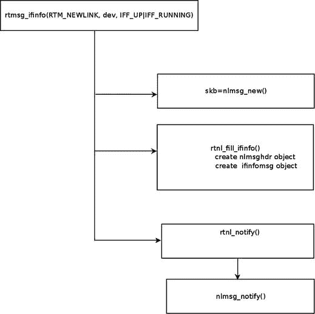
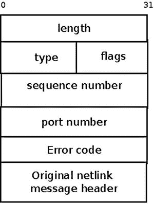
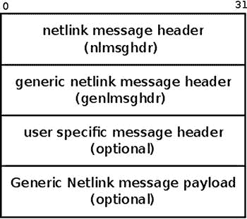

# 二、网络链接套接字

第 1 章讨论了 Linux 内核网络子系统的角色及其运行的三个层次。netlink socket 接口最早出现在 2.2 Linux 内核中，名为 AF_NETLINK socket。它是作为用户空间进程和内核之间笨拙的 IOCTL 通信方法的一种更灵活的替代方法而创建的。IOCTL 处理程序不能从内核向用户空间发送异步消息，而 netlink 套接字可以。为了使用 IOCTL，还有另一层复杂性:您需要定义 IOCTL 编号。netlink 的操作模型非常简单:您使用 socket API 在用户空间中打开并注册一个 netlink socket，这个 netlink socket 处理与内核 netlink socket 的双向通信，通常发送消息来配置各种系统设置，并从内核获得响应。

本章描述了 netlink 协议的实现和 API，并讨论了它的优点和缺点。我还谈到了新的通用 netlink 协议，讨论了它的实现及其优点，并给出了一些使用`libnl`库的示例。最后，我讨论了套接字监控接口。

Netlink 系列

netlink 协议是基于套接字的进程间通信(IPC)机制，基于 RFC 3549，“Linux Netlink 作为 IP 服务协议”它在用户空间和内核之间或者内核本身的某些部分之间提供了一个双向通信通道。Netlink 是标准套接字实现的扩展。netlink 协议实现主要位于`net/netlink`下，在这里您可以找到以下四个文件:

*   `af_netlink.c`
*   `af_netlink.h`
*   `genetlink.c`
*   `diag.c`

除了它们之外，还有一些头文件。其实最常用的是`af_netlink`模块；它提供了 netlink 内核套接字 API，而`genetlink`模块提供了一个新的通用 netlink API，使用它可以更容易地创建 netlink 消息。`diag`监控接口模块(`diag.c`)提供一个 API 来转储和获取关于 netlink 套接字的信息。我将在本章后面的“套接字监控接口”一节中讨论`diag`模块

我应该在这里提到，理论上 netlink 套接字可以用于两个或更多用户空间进程之间的通信(包括发送多播消息)，尽管这通常不被使用，也不是 netlink 套接字的最初目标。UNIX 域套接字为 IPC 提供了一个 API，它们广泛用于两个用户空间进程之间的通信。

与用户空间和内核之间的其他通信方式相比，Netlink 有一些优势。例如，当使用 netlink 套接字时，不需要轮询。一个用户空间应用打开一个 socket 然后调用`recvmsg()`，如果内核没有发送消息就进入阻塞状态；例如，参见`iproute2`包的`rtnl_listen()`方法(`lib/libnetlink.c`)。另一个优点是内核可以发起向用户空间发送异步消息，而不需要用户空间触发任何动作(例如，通过调用某个 IOCTL 或者通过写入某个`sysfs`条目)。另一个优点是 netlink 套接字支持多播传输。

您可以使用`socket()`系统调用从用户空间创建 netlink 套接字。netlink 套接字可以是 SOCK_RAW 套接字或 SOCK_DGRAM 套接字。

Netlink 套接字可以在内核或用户空间中创建；内核 netlink 套接字由`netlink_kernel_create()`方法创建；和用户空间 netlink 套接字由`socket()`系统调用创建。从用户空间或内核创建 netlink 套接字会创建一个`netlink_sock`对象。当从用户空间创建套接字时，它由`netlink_create()`方法处理。在内核中创建套接字时，由`__netlink_kernel_create()`处理；此方法设置 NETLINK_KERNEL_SOCKET 标志。最终，两个方法都调用`__netlink_create()`以公共方式分配一个套接字(通过调用`sk_alloc()`方法)并初始化它。[图 2-1](#Fig1) 显示了如何在内核和用户空间中创建 netlink 套接字。


[图 2-1](#_Fig1) 。在内核和用户空间中创建 netlink 套接字

您可以从用户空间创建一个 netlink 套接字，方法与普通 BSD 风格的套接字非常相似，例如:`socket(AF_NETLINK, SOCK_RAW, NETLINK_ROUTE)`。然后你应该创建一个`sockaddr_nl`对象(netlink 套接字地址结构的实例)，初始化它，并使用标准的 BSD 套接字 API(比如`bind()`、`sendmsg()`、`recvmsg()`等等)。`sockaddr_nl`结构表示用户空间或内核中的 netlink 套接字地址。

Netlink 套接字库为 netlink 套接字提供了一个方便的 API。我将在下一节讨论它们。

Netlink 套接字库

我推荐您使用`libnl` API 来开发用户空间应用，它通过 netlink 套接字发送或接收数据。`libnl`包是为基于 netlink 协议的 Linux 内核接口提供 API 的库集合。如前所述，`iproute2`包使用了`libnl`库。除了核心库(`libnl`)，它还支持通用的 netlink 家族(`libnl-genl`)、routing 家族(`libnl-route`)和 netfilter 家族(`libnl-nf`)。这个包主要是由托马斯·格拉夫开发的。这里我还应该提到一个叫做`libmnl`的库，它是一个面向 netlink 开发者的极简用户空间库。`libmnl`库主要由 Pablo Neira Ayuso 编写，Jozsef Kadlecsik 和 Jan Engelhardt 也有贡献。(`http://netfilter.org/projects/libmnl/`)。

sockaddr_nl 结构

我们来看一下`sockaddr_nl`结构，它代表一个 netlink 套接字地址:

```sh
struct sockaddr_nl {
    __kernel_sa_family_t    nl_family;    /* AF_NETLINK                */
    unsigned short          nl_pad;       /* zero                      */
    __u32                   nl_pid;       /* port ID                   */
    __u32                   nl_groups;    /* multicast groups mask     */
};
```

(`include/uapi/linux/netlink.h`)

*   `nl_family`:应该一直是 AF_NETLINK。
*   `nl_pad`:应始终为 0。
*   `nl_pid`:netlink 套接字的单播地址。对于内核 netlink sockets ，应该是 0。用户空间应用有时会将`nl_pid`设置为它们的进程 id ( `pid`)。在用户空间应用中，当您将`nl_pid`显式设置为 0，或者根本不设置它，然后调用`bind()`时，内核方法`netlink_autobind()`会为`nl_pid`赋值。它尝试分配当前线程的进程 id。如果你在用户空间中创建两个套接字，那么你要负责它们的`nl_pid`是唯一的，以防你不调用 bind。Netlink 套接字不仅用于网络；其他子系统，如 SELinux、audit、uevent 等，使用 netlink 套接字。rtnelink 套接字是专门用于网络的 netlink 套接字；它们用于路由消息、相邻消息、链路消息和更多网络子系统消息。
*   `nl_groups`:组播组(或组播组掩码)。

下一节将讨论`iproute2`和旧的`net-tools`包。`iproute2`包基于 netlink 套接字，在本章后面的“在路由表中添加和删除路由条目”一节中，您将在`iproute2`中看到一个使用 netlink 套接字的示例。我提到`net-tools`包，它比较老，将来可能会被弃用，以强调作为`iproute2`的替代，它的功率和能力都比较低。

用于控制 TCP/IP 网络的用户空间包

有两个用户空间包用于控制 TCP/IP 网络和处理网络设备:`net-tools`和`iproute2`。`iproute2`包包括如下命令:

*   `ip`:用于管理网络表和网络接口
*   `tc`:用于交通管制管理
*   `ss`:转储套接字统计
*   `lnstat`:转储 linux 网络统计
*   `bridge`:用于管理网桥地址和设备

`iproute2`包主要基于从用户空间向内核发送请求，并通过 netlink 套接字获得回复。在`iproute2`中使用 IOCTLs 也有一些例外。例如，`ip tuntap`命令使用 IOCTLs 来添加/删除一个 TUN/TAP 设备。如果您查看 TUN/TAP 软件驱动程序代码，您会发现它定义了一些 IOCTL 处理程序，但是它不使用 rtnetlink 套接字。`net-tools`包基于 IOCTLs，包括如下已知命令:

*   `ifconifg`
*   `arp`
*   `route`
*   `netstat`
*   `hostname`
*   `rarp`

`iproute2`包的一些高级功能在`net-tools`包中不可用。

下一节讨论内核 netlink 套接字——通过交换不同类型的 netlink 消息来处理用户空间和内核之间的通信的核心引擎。了解内核 netlink 套接字对于理解 netlink 层提供给用户空间的接口至关重要。

内核网络链接套接字

您可以在内核网络堆栈中创建几个 netlink 套接字。每个内核套接字处理不同类型的消息:例如，应该处理 netlink_ROUTE 消息的 NETLINK 套接字在`rtnetlink_net_init()` : 中创建

```sh
static int __net_init rtnetlink_net_init(struct net *net) {
    ...
    struct netlink_kernel_cfg cfg = {
        .groups    = RTNLGRP_MAX,
        .input        = rtnetlink_rcv,
        .cb_mutex    = &rtnl_mutex,
        .flags        = NL_CFG_F_NONROOT_RECV,
    };

    sk = netlink_kernel_create(net, NETLINK_ROUTE, &cfg);
    ...
}
```

注意，rtnetlink 套接字知道网络名称空间；网络名称空间对象(`struct net`)包含一个名为`rtnl` ( `rtnetlink`套接字)的成员。在`rtnetlink_net_init()`方法中，通过调用`netlink_kernel_create()`创建 rtnetlink 套接字后，将其赋给相应网络名称空间对象的`rtnl`指针。

让我们看看`netlink_kernel_create()`原型:

```sh
struct sock *netlink_kernel_create(struct net *net, int unit, struct netlink_kernel_cfg *cfg)

```

*   第一个参数(`net`)是网络名称空间。
*   第二个参数是 netlink 协议(例如，rtnetlink 消息的 NETLINK_ROUTE，IPsec 的 NETLINK_XFRM 或审计子系统的 NETLINK_AUDIT)。有 20 多种 netlink 协议，但它们的数量被限制为 32 (MAX_LINKS)。这是创建通用 netlink 协议的原因之一，你将在本章后面看到。netlink 协议的完整列表在`include/uapi/linux/netlink.h`中。
*   第三个参数是对`netlink_kernel_cfg`的引用，它由创建 netlink 套接字的可选参数组成:

    ```sh
    struct netlink_kernel_cfg {
        unsigned int    groups;
        unsigned int    flags;
        void        (*input)(struct sk_buff *skb);
        struct mutex    *cb_mutex;
        void        (*bind)(int group);
    };
    (include/uapi/linux/netlink.h)
    ```

`groups`成员用于指定多播组(或多播组的掩码)。可以通过设置`sockaddr_nl`对象的`nl_groups`来加入一个组播组(也可以通过`libnl`的`nl_join_groups()`方法来完成)。然而，这样你只能加入 32 个小组。从内核版本 2.6.14 开始，可以使用 NETLINK _ ADD _ MEMBERSHIP/NETLINK _ DROP _ MEMBERSHIP 套接字选项分别加入/离开一个多播组。使用套接字选项，您可以加入更多的组。`libnl`的`nl_socket_add_memberships()/nl_socket_drop_membership()`方法使用这个套接字选项。

`flags`成员可以是 NL_CFG_F_NONROOT_RECV 或 NL_CFG_F_NONROOT_SEND。

设置 CFG_F_NONROOT_RECV 时，非超级用户可以绑定到多播组；在`netlink_bind()`中有如下代码:

```sh
static int netlink_bind(struct socket *sock, struct sockaddr *addr,
                         int addr_len)
 {
  ...
  if (nladdr->nl_groups) {
         if (!netlink_capable(sock, NL_CFG_F_NONROOT_RECV))
                         return -EPERM;
    }
```

对于非超级用户，如果没有设置 NL_CFG_F_NONROOT_RECV，那么当绑定到一个多播组时,`netlink_capable()`方法将返回 0，并且您将得到–EPRM 错误。

当 NL_CFG_F_NONROOT_SEND 标志被设置时，允许非超级用户发送多播。

`input`成员用于回调；当`netlink_kernel_cfg`中的`input`成员为空时，内核套接字将无法从用户空间接收数据(尽管从内核向用户空间发送数据是可能的)。对于 rtnetlink 内核套接字，`rtnetlink_rcv()`方法被声明为`input`回调；因此，从用户空间通过 rtnelink 套接字发送的数据将由`rtnetlink_rcv()`回调处理。

对于`uevent`内核事件，你只需要将数据从内核发送到用户空间；因此，在`lib/kobject_uevent.c`中，你有一个 netlink 套接字的例子，其中`input`回调是未定义的:

```sh
static int uevent_net_init(struct net *net)
{
    struct uevent_sock *ue_sk;
    struct netlink_kernel_cfg cfg = {
        .groups    = 1,
        .flags    = NL_CFG_F_NONROOT_RECV,
    };

    ...
    ue_sk->sk = netlink_kernel_create(net, NETLINK_KOBJECT_UEVENT, &cfg);
    ...
}
(lib/kobject_uevent.c)
```

`netlink_kernel_cfg`对象中的互斥(`cb_mutex`)是可选的；当没有定义互斥体时，使用默认的`cb_def_mutex`(互斥体结构的一个实例；参见`net/netlink/af_netlink.c`。事实上，大多数 netlink 内核套接字是在没有在`netlink_kernel_cfg`对象中定义互斥体的情况下创建的。比如前面提到的 uevent 内核 NETLINK socket(NETLINK _ ko object _ UEVENT)。此外，审计内核 netlink 套接字(NETLINK_AUDIT)和其他 NETLINK 套接字不定义互斥体。rtnetlink 套接字是一个例外，它使用`rtnl_mutex`。下一节讨论的通用 netlink 套接字也定义了自己的互斥锁:`genl_mutex`。

`netlink_kernel_create()`方法通过调用`netlink_insert()`方法在名为`nl_table`的表中创建一个条目。对`nl_table`的访问受名为`nl_table_lock`的读写锁保护；通过`netlink_lookup()`方法在该表中进行查找，指定协议和端口 id。指定消息类型的回调注册由`rtnl_register()`完成；在网络内核代码中有几个地方可以注册这样的回调。例如，在`rtnetlink_init()`中，你为一些消息注册回调，比如 RTM_NEWLINK(创建一个新链接)、RTM_DELLINK(删除一个链接)、RTM_GETROUTE(转储路由表)等等。在`net/core/neighbour.c`中，为 RTM_NEWNEIGH 消息(创建一个新邻居)、RTM_DELNEIGH(删除一个邻居)、RTM_GETNEIGHTBL 消息(转储邻居表)等等注册回调。我在第 5 章和第 7 章中深入讨论了这些行动。您还可以在 FIB 代码(`ip_fib_init()`)、多播代码(`ip_mr_init()`)、IPv6 代码和其他地方注册对其他类型消息的回调。

使用 netlink 内核套接字的第一步是注册它。我们来看看`rtnl_register()`方法原型:

```sh
extern void rtnl_register(int protocol, int msgtype,
                  rtnl_doit_func,
                  rtnl_dumpit_func,
                  rtnl_calcit_func);
```

第一个参数是`protocol`族(当你不针对某个特定协议时，是 PF _ UNSPEC)；您将在`include/linux/socket.h`中找到所有协议族的列表。

第二个参数是 netlink 消息类型，比如 RTM_NEWLINK 或 RTM_NEWNEIGH。这些是 rtnelink 协议添加的专用 netlink 消息类型。消息类型的完整列表在`include/uapi/linux/rtnetlink.h`中。

最后三个参数是回调:`doit`、`dumpit`和`calcit`。回调是您想要执行的处理消息的动作，并且您通常只指定一个回调。

`doit`回调用于添加/删除/修改等动作；`dumpit`回调用于检索信息，`calcit`回调用于计算缓冲区大小。rtnetlink 模块有一个名为`rtnl_msg_handlers`的表。该表按协议编号进行索引。表中的每个条目本身就是一个表，按消息类型进行索引。表中的每个元素都是`rtnl_link`的一个实例，它是一个由这三个回调的指针组成的结构。用`rtnl_register()`注册回调时，将指定的回调添加到该表中。

注册回调是这样做的，比如:`rtnl_register(PF_UNSPEC, RTM_NEWLINK, rtnl_newlink, NULL, NULL) in net/core/rtnetlink.c`。这将在相应的`rtnl_msg_handlers`条目中添加`rtnl_newlink`作为 RTM_NEWLINK 消息的`doit`回调。

rtnelink 消息的发送通过`rtmsg_ifinfo()`完成。例如，在`dev_open()`中你创建了一个新链接，所以你调用了:`rtmsg_ifinfo()`方法中的`rtmsg_ifinfo(RTM_NEWLINK, dev, IFF_UP|IFF_RUNNING);`，首先调用了`nlmsg_new()`方法来分配一个大小合适的`sk_buff`。然后创建两个对象:netlink 消息头(`nlmsghdr`)和一个`ifinfomsg`对象，它位于 netlink 消息头之后。这两个对象由`rtnl_fill_ifinfo()`方法初始化。然后调用`rtnl_notify()`发送数据包；发送数据包实际上是通过通用网络链接方法`nlmsg_notify()`(在`net/netlink/af_netlink.c`中)完成的。[图 2-2](#Fig2) 显示了使用`rtmsg_ifinfo()`方法发送 rtnelink 消息的各个阶段。



[图 2-2](#_Fig2) 。使用 rtmsg_ifinfo()方法发送 rtnelink 消息

下一节是关于 netlink 消息，它在用户空间和内核之间交换。netlink 消息总是以 netlink 消息头开始，因此学习 netlink 消息的第一步是研究 netlink 消息头格式。

Netlink 消息头

网络链接消息应该遵循 RFC 3549“作为 IP 服务协议的 Linux 网络链接”第 2.2 节“消息格式”中规定的特定格式 netlink 消息以固定大小的 netlink 报头开始，其后是有效载荷。本节描述 netlink 消息头的 Linux 实现。

netlink 报文头由`include/uapi/linux/netlink.h` : 中的`struct nlmsghdr`定义

```sh
struct nlmsghdr
{
  __u32 nlmsg_len;
  __u16 nlmsg_type;
  __u16 nlmsg_flags;
  __u32 nlmsg_seq;
  __u32 nlmsg_pid;
};
(include/uapi/linux/netlink.h)
```

每个 netlink 数据包都以 netlink 消息头开始，用`struct nlmsghdr`表示。`nlmsghdr`的长度为 16 字节。它包含五个字段:

*   `nlmsg_len`是包括标题在内的消息长度。
*   `nlmsg_type`是报文类型；有四种基本的 netlink 报文头类型:

*   NLMSG_NOOP:没有操作，消息必须被丢弃。
*   NLMSG_ERROR:出现错误。
*   NLMSG_DONE:多部分消息被终止。
*   NLMSG_OVERRUN: Overrun notification: error, data was lost.

    (`include/uapi/linux/netlink.h`)

    但是，系列可以添加他们自己的 netlink 消息头类型。例如，rtnetlink 协议族增加了 RTM_NEWLINK、RTM_DELLINK、RTM_NEWROUTE 等消息头类型(见`include/uapi/linux/rtnetlink.h`)。有关 rtnelink 系列添加的 netlink 消息头类型的完整列表，以及对每种类型的详细解释，请参见:`man 7 rtnetlink`。注意，小于 NLMSG_MIN_TYPE (0x10)的消息类型值是为控制消息保留的，不能使用。

*   `nlmsg_flags`字段可以如下:

*   NLM 请求:当它是一个请求消息时。
*   NLM_F_MULTI:当它是一个多部分的消息时。多部分消息用于表转储。通常消息的大小被限制为一个页面(PAGE_SIZE)。所以大消息被分成小消息，每个小消息(除了最后一个)都设置了 NLM_F_MULTI 标志。最后一条消息设置了 NLMSG_DONE 标志。
*   NLM_F_ACK:当你希望消息的接收者用 ACK 回复时。Netlink ACK 消息通过`netlink_ack()`方法(`net/netlink/af_netlink.c`)发送。
*   NLM _ F _ 转储:检索关于表/条目的信息。
*   NLM 根:指定树根。
*   NLM_F_MATCH:返回所有匹配条目。
*   NLM_F_ATOMIC: This flag is deprecated.

    以下标志是创建条目的修饰符:

*   NLM_F_REPLACE:覆盖现有条目。
*   NLM_F_EXCL:不要触摸入口，如果它存在。
*   NLM_F_CREATE:创建条目，如果它不存在。
*   NLM _ F _ 附加:将条目添加到列表末尾。
*   NLM_F_ECHO: Echo this request.

    我已经展示了最常用的旗帜。完整列表见`include/uapi/linux/netlink.h`。

*   `nlmsg_seq`是序列号(用于消息序列)。与某些第 4 层传输协议不同，序列号没有严格的强制要求。
*   `nlmsg_pid` is the sending port id. When a message is sent from the kernel, the `nlmsg_pid` is 0\. When a message is sent from userspace, the `nlmsg_pid` can be set to be the process id of that userspace application which sent the message.

    [图 2-3](#Fig3) 显示了 netlink 消息头。

    

    [图 2-3](#_Fig3) 。nlmsg 标题

    报头之后是有效载荷。netlink 消息的有效载荷由一组属性组成，这些属性以类型-长度-值(TLV)格式表示。对于 TLV，类型和长度的大小是固定的(通常为 1-4 字节)，而值字段的大小是可变的。TLV 表示也用于网络代码的其他地方，例如 IPv6(参见 RFC 2460)。TLV 提供了灵活性，使得将来的扩展更容易实现。属性可以嵌套，这使得复杂的属性树结构成为可能。

    每个 netlink 属性头由`struct nlattr`定义:

    ```sh
    struct nlattr {
       __u16   nla_len;
       __u16   nla_type;
    };
    (include/uapi/linux/netlink.h)

    ```

*   `nla_len`:属性的大小，以字节为单位。
*   `nla_type`:属性类型。例如，`nla_type`的值可以是 NLA_U32(用于 32 位无符号整数)、NLA _ 字符串(用于可变长度字符串)、NLA _ 嵌套(用于嵌套属性)、NLA_UNSPEC(用于任意类型和长度)等等。您可以在`include/net/netlink.h`中找到可用类型的列表。

每个 netlink 属性必须用一个 4 字节的边界(`NLA_ALIGNTO`)对齐。

每个家族可以定义一个属性验证策略，该策略表示关于接收到的属性的期望。这个验证策略由`nla_policy`对象表示。事实上，`nla_policy struct`和`struct nlattr` : 的内容完全一样

```sh
 struct nla_policy {
   u16  type;
   u16  len;
};
(include/uapi/linux/netlink.h)
```

属性验证策略是一组`nla_policy`对象；这个数组由属性号索引。对于每个属性(固定长度属性除外)，如果`nla_policy`对象中的`len`的值为 0，则不应该执行任何验证。如果属性是字符串类型之一(比如`NLA_STRING`)，那么`len`应该是字符串的最大长度，没有终止的空字节。如果属性类型是 NLA _ 未用或未知，`len`应该设置为属性有效载荷的精确长度。如果属性类型是 NLA _ 标志，则不使用`len`。(原因是属性的存在本身就隐含了一个值`true`，属性的不存在隐含了一个值`false`)。

在内核中接收通用 netlink 消息由`genl_rcv_msg()`处理。如果是转储请求(当设置了`NLM_F_DUMP`标志时)，您可以通过调用`netlink_dump_start()`方法来转储该表。如果不是转储请求，就用`nlmsg_parse()`方法解析有效负载。`nlmsg_parse()`方法通过调用`validate_nla()` ( `lib/nlattr.c`)来执行属性验证。如果有类型超过 maxtype 的属性，为了向后兼容，它们将被忽略。在验证失败的情况下，您不能继续执行`genl_rcv_msg()`中的下一步(运行`doit()`回调)，并且`genl_rcv_msg()`返回一个错误代码。

下一节描述 NETLINK_ROUTE 消息，这是网络子系统中最常用的消息。

NETLINK_ROUTE 消息

rtnetlink (netlink_ROUTE)消息不限于网络路由子系统:还有相邻子系统消息、接口设置消息、防火墙消息、NETLINK 队列消息、策略路由消息和许多其他类型的 rtnetlink 消息，您将在后面的章节中看到。

NETLINK_ROUTE 消息可以分为几类:

*   链接(网络接口)
*   ADDR(网络地址)
*   路由(路由消息)
*   邻居(相邻子系统消息)
*   规则(策略路由规则)
*   排队规则
*   流量类别
*   动作(数据包动作 API，见`net/sched/act_api.c`)
*   邻表
*   地址标签

每个系列都有三种类型的消息:用于创建、删除和检索信息。因此，对于路由消息，有用于创建路由的 RTM_NEWROUTE 消息类型、用于删除路由的 RTM_DELROUTE 消息类型和用于检索路由的 RTM_GETROUTE 消息类型。对于链接消息，除了用于创建、删除和信息检索的三种方法之外，还有用于修改链接的附加消息:RTM_SETLINK。

有些情况下会出现错误，您会发送一条错误消息作为回复。netlink 错误信息由`nlmsgerr struct`表示:

```sh
struct nlmsgerr {
    int        error;
    struct nlmsghdr msg;
};
(include/uapi/linux/netlink.h)
```

事实上，正如你在[图 2-4](#Fig4) 中看到的，netlink 错误信息是由 netlink 信息头和错误代码组成的。当错误代码不为 0 时，导致错误的原始请求的 netlink 消息头被附加在错误代码字段之后。



[图 2-4](#_Fig4) 。Netlink 错误消息

如果您发送了一个错误构造的消息(例如，`nlmsg_type`无效)，那么会发回一个 netlink 错误消息，并且根据发生的错误设置错误代码。例如，当`nlmsg_type`无效时(负值，或高于允许的最大值)，错误代码被设置为–EOPNOTSUPP。参见`net/core/rtnetlink.c`中的`rtnetlink_rcv_msg()`方法。在错误消息中，序列号被设置为导致错误的请求的序列号。

发送方可以请求获得 netlink 消息的 ACK。这是通过将 netlink 报文头类型(`nlmsg_type`)设置为 NLM_F_ACK 来实现的。当内核发送 ACK 时，它使用错误消息(该消息的 netlink 消息头类型设置为 NLMSG_ERROR ),错误代码为 0。在这种情况下，请求的原始 netlink 标头不会附加到错误消息中。具体实现参见`net/netlink/af_netlink.c`中的`netlink_ack()`方法实现。

了解了 NETLINK_ROUTE 消息后，您就可以查看使用 NETLINK_ROUTE 消息在路由表中添加和删除路由条目的示例了。

在路由表中添加和删除路由条目

在幕后，让我们看看当添加和删除路由条目时，在 netlink 协议的上下文中内核发生了什么。例如，您可以通过运行以下命令向路由表添加路由条目:

```sh
ip route add 192.168.2.11 via 192.168.2.20
```

该命令通过 rtnetlink 套接字从用户空间(RTM_NEWROUTE)发送 netlink 消息，用于添加路由条目。该消息由 rtnetlink 内核套接字接收，并由`rtnetlink_rcv()`方法处理。最终，通过调用`net/ipv4/fib_frontend.c`中的`inet_rtm_newroute()`来添加路由条目。随后，用`fib_table_insert()`方法完成到转发信息库(FIB)的插入，该转发信息库是路由数据库；然而，插入路由表并不是`fib_table_insert()`的唯一任务。您应该通知所有注册了 RTM_NEWROUTE 消息的侦听器。怎么做？当插入一个新的路由条目时，用 RTM_NEWROUTE 调用`rtmsg_fib()`方法。`rtmsg_fib()`方法构建一个 netlink 消息，并通过调用`rtnl_notify()` 发送它，以通知注册到 RTNLGRP_IPV4_ROUTE 组的所有侦听器。这些 RTNLGRP_IPV4_ROUTE 监听器既可以在内核中注册，也可以在用户空间中注册(就像在`iproute2`中一样，或者在一些用户空间路由守护进程中，比如`xorp`)。您将很快看到`iproute2`的用户空间守护进程如何订阅各种 rtnelink 多播组。

当删除一个路由条目时，会发生类似的事情。您可以通过运行以下命令提前删除路由条目:

```sh
ip route del 192.168.2.11
```

该命令通过 rtnetlink 套接字从用户空间(RTM_DELROUTE)发送 netlink 消息，用于删除路由条目。该消息再次由 rtnetlink 内核套接字接收，并由`rtnetlink_rcv()`回调处理。最终，通过调用`net/ipv4/fib_frontend.c`中的`inet_rtm_delroute()`回调来删除路由条目。随后，用调用`rtmsg_fib()`的`fib_table_delete()`从 FIB 中删除，这次是用 RTM_DELROUTE 消息。

您可以使用如下的`iproute2 ip`命令监控网络事件:

```sh
ip monitor route
```

例如，如果你打开一个终端并在那里运行`ip monitor route`，然后打开另一个终端并运行`ip route add 192.168.1.10 via 192.168.2.200`，在第一个终端上你会看到这一行:`192.168.1.10 via 192.168.2.200 dev em1`。当您在第二个终端上运行`ip route del 192.168.1.10`时，在第一个终端上将出现以下文本:`Deleted 192.168.1.10 via 192.168.2.200 dev em1`。

运行`ip monitor route`运行一个守护进程，它打开一个 netlink 套接字并订阅 RTNLGRP_IPV4_ROUTE 多播组。现在，添加/删除一个路由，如本例中所做的，将导致这样的结果:用`rtnl_notify()`发送的消息将被守护进程接收并显示在终端上。

您可以通过这种方式订阅其他多播组。例如，要订阅 RTNLGRP_LINK 多播组，运行`ip monitor link`。这个守护进程从内核接收 netlink 消息——例如，在添加/删除链接时。因此，如果您打开一个终端并运行`ip monitor link`，然后打开另一个终端并通过第一个终端上的`vconfig add eth1 200,`添加一个 VLAN 接口，您会看到这样的行:

```sh
4: eth1.200@eth1: <BROADCAST,MULTICAST> mtu 1500 qdisc noop state DOWN
    link/ether 00:e0:4c:53:44:58 brd ff:ff:ff:ff:ff:ff
```

如果您通过`brctl addbr mybr`在第二个终端上添加一个桥，在第一个终端上您会看到这样的行:

```sh
5: mybr: <BROADCAST,MULTICAST> mtu 1500 qdisc noop state DOWN
    link/ether a2:7c:be:62:b5:b6 brd ff:ff:ff:ff:ff:ff
```

您已经看到了什么是 netlink 消息以及如何创建和处理它。您已经看到了如何处理 netlink 套接字。接下来，您将了解为什么创建通用 netlink 家族(在内核 2.6.15 中引入),以及它在 Linux 中的实现。

通用网络链接协议

netlink 协议的缺点之一是协议族的数量被限制为 32 (MAX_LINKS)。这是创建通用 netlink 系列的主要原因之一——为添加更多系列提供支持。它充当 netlink 多路复用器，与单个 netlink 系列(`NETLINK_GENERIC`)一起工作。通用 netlink 协议基于 netlink 协议并使用其 API。

要添加 netlink 协议族，您应该在`include/linux/netlink.h`中添加一个协议族定义。但是有了通用的 netlink 协议，就不需要这样了。通用 netlink 协议也可用于联网以外的其他子系统，因为它提供了一个通用的通信信道。例如，它也被 acpi 子系统(参见`drivers/acpi/event.c`中`acpi_event_genl_family`的定义)、任务统计代码(参见`kernel/taskstats.c`)、热事件代码等等使用。

通用的 netlink 内核套接字是通过如下的`netlink_kernel_create()`方法创建的:

```sh
static int __net_init genl_pernet_init(struct net *net) {
    ..
           struct netlink_kernel_cfg cfg = {
                 .input          = genl_rcv,
                 .cb_mutex       = &genl_mutex,
                 .flags          = NL_CFG_F_NONROOT_RECV,
         };
         net->genl_sock = netlink_kernel_create(net, NETLINK_GENERIC, &cfg);
 ...
 }
(net/netlink/genetlink.c)
```

注意，像前面描述的 netlink 套接字一样，通用 netlink 套接字也知道网络名称空间；网络名称空间对象(`struct net`)包含一个名为`genl_sock`(通用 netlink 套接字)的成员。如您所见，网络名称空间`genl_sock`指针在`genl_pernet_init()`方法中被赋值。

`genl_rcv()`方法被定义为`genl_sock`对象的`input`回调，该对象由`genl_pernet_init()`方法创建。因此，通过通用 netlink 套接字从用户空间发送的数据在内核中由`genl_rcv()`回调处理。

您可以使用`socket()`系统调用创建一个通用的 netlink 用户空间套接字，尽管使用`libnl-genl` API 会更好(在本节稍后讨论)。

创建通用 netlink 内核套接字后，立即注册控制器系列(`genl_ctrl`):

```sh
static struct genl_family genl_ctrl = {
         .id = GENL_ID_CTRL,
         .name = "nlctrl",
         .version = 0x2,
         .maxattr = CTRL_ATTR_MAX,
         .netnsok = true,
};

static int __net_init genl_pernet_init(struct net *net) {
...
err = genl_register_family_with_ops(&genl_ctrl, &genl_ctrl_ops, 1)
...
```

`genl_ctrl`有一个固定的`id`0x 10(`GENL_ID_CTRL`)；事实上，它是用固定 id 初始化的`genl_family`的唯一实例；所有其他实例都用`GENL_ID_GENERATE`作为 id 进行初始化，随后用一个动态赋值替换。

通过定义一个`genl_multicast_group`对象并调用`genl_register_mc_group()`，支持在通用 netlink 套接字中注册多播组；例如，在近场通信(NFC)子系统、T3 中，您有以下:

```sh
static struct genl_multicast_group nfc_genl_event_mcgrp = {
         .name = NFC_GENL_MCAST_EVENT_NAME,
 };

int __init nfc_genl_init(void)
{
...
 rc = genl_register_mc_group(&nfc_genl_family, &nfc_genl_event_mcgrp);
...
}
(net/nfc/netlink.c)
```

多播组的名称应该是唯一的，因为它是查找的主键。

在组播组中，`id`也是在注册组播组时通过调用`genl_register_mc_group()`中的`find_first_zero_bit()`方法动态生成的。只有一个多播组`notify_grp`，它有一个固定的 ID GENL _ ID _ CTRL。

要在内核中使用通用 netlink 套接字，您应该执行以下操作:

*   创建一个`genl_family`对象，并通过调用`genl_register_family()`注册它。
*   创建一个`genl_ops`对象，并通过调用`genl_register_ops()`注册它。

或者，您可以调用`genl_register_family_with_ops()`并向其传递一个`genl_family`对象、`genl_ops`数组及其大小。该方法将首先调用`genl_register_family()`，然后如果成功，将为指定数组`genl_ops`的每个`genl_ops`元素调用`genl_register_ops()`。

`genl_register_family()`和`genl_register_ops()`以及`genl_family`和`genl_ops`在`include/net/genetlink.h`中定义。

无线子系统使用通用 netlink 套接字:

```sh
int nl80211_init(void)
{
    int err;

    err = genl_register_family_with_ops(&nl80211_fam,
        nl80211_ops, ARRAY_SIZE(nl80211_ops));
...
}
(net/wireless/nl80211.c)
```

通用 netlink 协议由一些用户空间包使用，例如`hostapd`包和`iw`包。`hostapd`包 ( `http://hostap.epitest.fi`)为无线接入点和认证服务器提供了一个用户空间守护进程。`iw`包用于操作无线设备及其配置(见`http://wireless.kernel.org/en/users/Documentation/iw`)。

`iw`包基于`nl80211`和`libnl`库。第 12 章更详细地讨论了`nl80211`。旧的用户空间无线包叫做`wireless-tools` ，是基于发送 IOCTLs 的。

以下是`nl80211`中`genl_family`和`genl_ops`的定义:

```sh
static struct genl_family nl80211_fam = {
    .id        = GENL_ID_GENERATE, /* don't bother with a hardcoded ID */
    .name      = "nl80211",    /* have users key off the name instead */
    .hdrsize   = 0,        /* no private header */
    .version   = 1,        /* no particular meaning now */
    .maxattr   = NL80211_ATTR_MAX,
    .netnsok   = true,
    .pre_doit  = nl80211_pre_doit,
    .post_doit = nl80211_post_doit,
};

```

*   `name`:必须是唯一的名称。
*   `id` : `id`在这种情况下是 GENL_ID_GENERATE，实际上是 0。GENL_ID_GENERATE 告诉通用 netlink 控制器，当您向`genl_register_family()`注册系列时，为通道分配一个唯一的通道号。`genl_register_family()`分配一个 id，范围为 16 (GENL_MIN_ID，即 0x10)到 1023 (GENL_MAX_ID)。
*   `hdrsize`:私有头的大小。
*   `maxattr`:  NL80211_ATTR_MAX, which is the maximum number of attributes supported.

    `nl80211_policy`验证策略数组有 nl 80211 _ ATTR _ 最大元素(每个属性在数组中都有一个条目):

*   `netnsok` : `true`，表示家族可以处理网络命名空间。
*   `pre_doit`:在`doit()`回调之前调用的钩子。
*   `post_doit`: A hook that can, for example, undo locking or any required private tasks after the `doit()` callback.

    您可以使用`genl_ops`结构添加一个或多个命令。让我们看看`genl_ops struct` 的定义，然后看看它在`nl80211`中的用法:

    ```sh
    struct genl_ops {
       u8                      cmd;
       u8                      internal_flags;
       unsigned int            flags;
       const struct nla_policy *policy;
       int                    (*doit)(struct sk_buff *skb,
                                      struct genl_info *info);
       int                    (*dumpit)(struct sk_buff *skb,
                                        struct netlink_callback *cb);
       int                    (*done)(struct netlink_callback *cb);
       struct list_head        ops_list;
    };

    ```

*   `cmd`:命令标识符(`genl_ops struct`定义了一个单独的命令及其`doit` / `dumpit`处理程序)。
*   `internal_flags` : 家族定义使用的私有旗帜。比如在`nl80211`中，有很多定义内部标志的操作(比如 NL80211_FLAG_NEED_NETDEV_UP，NL80211_FLAG_NEED_RTNL 等等)。`nl80211 pre_doit()`和`post_doit()`回调根据这些标志执行动作。参见`net/wireless/nl80211`。
*   `flags` : 操作标志。值可以是以下值:

*   GENL_ADMIN_PERM:设置了这个标志，就意味着操作需要 CAP_NET_ADMIN 权限；参见`net/netlink/genetlink.c`中的`genl_rcv_msg()`方法。
*   GENL_CMD_CAP_DO:如果`genl_ops struct`实现了`doit()`回调，则设置该标志。
*   GENL_CMD_CAP_DUMP:如果`genl_ops struct`实现了`dumpit()`回调，则设置该标志。
*   GENL_CMD_CAP_HASPOL:如果`genl_ops struct`定义了属性验证策略(`nla_policy`数组)，则设置该标志。

*   `policy` : 属性验证策略将在本节稍后描述有效负载时讨论。
*   `doit`:标准命令回调。
*   `dumpit`:回拨转储。
*   `done`:转储完成回调。
*   `ops_list`:操作列表。

    ```sh
    static struct genl_ops nl80211_ops[] = {
        {

        ...
          {
            .cmd = NL80211_CMD_GET_SCAN,
            .policy = nl80211_policy,
            .dumpit = nl80211_dump_scan,
          },
        ...
    }
    ```

注意，必须为`genl_ops`(在本例中为`nl80211_ops`)的每个元素指定一个`doit`或`dumpit`回调，否则函数将因-EINVAL 而失败。

`genl_ops`中的这个条目添加了`nl80211_dump_scan()`回调作为 NL80211_CMD_GET_SCAN 命令的处理程序。`nl80211_policy`是一个由`nla_policy`对象组成的数组，定义了属性的预期数据类型及其长度。

当从用户空间运行扫描命令时，例如通过`iw dev wlan0 scan`，您从用户空间通过通用 netlink 套接字发送一条通用 netlink 消息，其命令为 NL80211_CMD_GET_SCAN。在更新的`libnl`版本中，消息通过`nl_send_auto_complete()`方法或`nl_send_auto()`发送。`nl_send_auto()`填充netlink 报文头中缺失的比特和片断。如果不需要任何自动消息完成功能，可以直接使用`nl_send()`。

消息由`nl80211_dump_scan()`方法处理，它是这个命令(`net/wireless/nl80211.c`)的`dumpit`回调。`nl80211_ops`对象中有 50 多个条目用于处理命令，包括 NL80211_CMD_GET_INTERFACE、NL80211_CMD_SET_INTERFACE、NL80211_CMD_START_AP 等等。

为了向内核发送命令，用户空间应用应该知道系列 id。系列名称在用户空间中是已知的，但是系列 id 在用户空间中是未知的，因为它只在内核运行时确定。为了获得家族 id，用户空间应用应该向内核发送一个通用的 netlink CTRL_CMD_GETFAMILY 请求。这个请求由`ctrl_getfamily()`方法处理。它返回家族 id 和其他信息，比如家族支持的操作。然后，用户空间可以向内核发送命令，指定它在回复中获得的家族 id。我将在下一节详细讨论这一点。

创建和发送通用网络链接消息

通用 netlink 消息以 netlink 报头开始，接着是通用 netlink 消息报头，然后是可选的用户特定报头。只有在所有这些之后，你才能找到可选的有效载荷，正如你在[图 2-5](#Fig5) 中看到的。



[图 2-5](#_Fig5) 。通用网络链接消息。

这是通用 netlink 消息头:

```sh
struct genlmsghdr {
   __u8    cmd;
   __u8    version;
  __u16    reserved;
};
(include/uapi/linux/genetlink.h)

```

*   `cmd`是通用的 netlink 消息类型；您注册的每个通用族都添加了自己的命令。比如上面提到的`nl80211_fam`家族，它添加的命令(比如 NL80211_CMD_GET_INTERFACE)就是用`nl80211_commands enum`来表示的。有 60 多个命令(见`include/linux/nl80211.h`)。
*   `version`可用于版本支持。用`nl80211`就是 1，没有特别的意义。版本成员允许在不破坏向后兼容性的情况下更改消息的格式。
*   `reserved`是为了将来使用。

通过以下方法为通用 netlink 消息分配缓冲区:

```sh
sk_buff *genlmsg_new(size_t payload, gfp_t flags)
```

这实际上是对`nlmsg_new()`的包装。

在用`genlmsg_new()`分配了一个缓冲区之后，调用`genlmsg_put()`来创建通用 netlink 头，它是`genlmsghdr`的一个实例。您用`genlmsg_unicast()`发送一个单播通用 netlink 消息，它实际上是对`nlmsg_unicast()`的包装。您可以用两种方式发送多播通用网络链接消息:

*   `genlmsg_multicast()`:该方法将消息发送到默认的网络名称空间`net_init`。
*   `genlmsg_multicast_allns()`:该方法将消息发送到所有网络名称空间。

(本节提到的所有方法的原型都在`include/net/genetlink.h`中。)

您可以从用户空间创建一个通用的 netlink 套接字，如下所示:`socket(AF_NETLINK, SOCK_RAW, NETLINK_GENERIC)`；这个调用在内核中由`netlink_create()`方法处理，就像普通的、非通用的 netlink 套接字一样，正如您在上一节中看到的。你可以使用 socket API 来执行进一步的调用，比如`bind()`和`sendmsg()`或者`recvmsg()`；然而，建议使用`libnl`库。

`libnl-genl`提供通用 netlink API，用于管理控制器、系列和命令注册。使用`libnl-genl`，可以调用`genl_connect()` 来创建本地套接字文件描述符，并将套接字绑定到 NETLINK_GENERIC netlink 协议。

让我们简单地看一下，当使用`libnl`库和`libnl-genl`库通过通用 netlink 套接字向内核发送命令时，在一个简短的典型用户空间-内核会话中会发生什么。

`iw`包使用了`libnl-genl`库。当您运行类似`iw dev wlan0 list`的命令时，会出现以下序列(省略不重要的细节):

```sh
state->nl_sock = nl_socket_alloc()
```

分配一个套接字(注意这里使用的是`libnl`核心 API，而不是通用的 netlink 家族(`libnl-genl`)。

```sh
genl_connect(state->nl_sock)
```

用 NETLINK_GENERIC 调用`socket()`并在这个套接字上调用`bind()`；`genl_connect()`是`libnl-genl`库的一个方法。

```sh
genl_ctrl_resolve(state->nl_sock, "nl80211");
```

此方法将通用 netlink 系列名称(`"nl80211"`)解析为相应的数字系列标识符。用户空间应用必须将它的后续消息发送到内核，指定这个 id。

`genl_ctrl_resolve()`方法调用`genl_ctrl_probe_by_name()`，它实际上用 CTRL_CMD_GETFAMILY 命令向内核发送一个通用的 netlink 消息。

在内核中，通用 netlink 控制器(`"nlctrl"`)通过`ctrl_getfamily()`方法处理 CTRL_CMD_GETFAMILY 命令，并将系列 id 返回给用户空间。这个 id 是在创建套接字时生成的。

 **注意**通过运行`genl ctrl list`可以使用`genl`(属于`iproute2`)的用户空间工具获得所有注册的通用 netlink 家族的各种参数(如生成 id、头大小、最大属性等)。

现在，您已经准备好学习套接字监视接口了，它可以让您获得关于套接字的信息。socket monitoring 接口用于像`ss`这样的用户空间工具，它显示各种套接字类型的套接字信息和统计数据，以及其他项目，您将在下一节中看到。

套接字监控接口

netlink 套接字提供了一个基于 netlink 的子系统，可以用来获取关于套接字的信息。这个特性被添加到内核中，以支持 Linux 在用户空间(CRIU)中的检查点/恢复功能。为了支持这个功能，需要关于套接字的附加数据。例如，`/procfs`并没有说明哪些是 UNIX 域套接字(AF_UNIX)的对等体，这些信息是检查点/恢复支持所需要的。这些额外的数据不是通过`/proc`导出的，对`procfs`条目进行修改并不总是可取的，因为这可能会破坏用户空间应用。`sock_diag` netlink 套接字提供了一个 API 来访问这些附加数据。这个 API 在 CRIU 项目和`ss` util 中都有使用。没有`sock_diag`，在*检查点*一个进程(将一个进程的状态保存到文件系统)之后，您不能重建它的 UNIX 域套接字，因为您不知道对等体是谁。

为了支持`ss`工具使用的监控接口，创建了一个基于 netlink 的内核套接字(NETLINK_SOCK_DIAG)。`ss`工具是`iproute2`包的一部分，它使您能够以类似于`netstat`的方式获得套接字统计数据。它可以显示比其他工具更多的 TCP 和状态信息。

您为`sock_diag`创建一个 netlink 内核套接字，如下所示:

```sh
static int __net_init diag_net_init(struct net *net)
{
    struct netlink_kernel_cfg cfg = {
        .input    = sock_diag_rcv,
    };

    net->diag_nlsk = netlink_kernel_create(net, NETLINK_SOCK_DIAG, &cfg);
    return net->diag_nlsk == NULL ? -ENOMEM : 0;
}
(net/core/sock_diag.c)
```

`sock_diag`模块有一个名为`sock_diag_handlers`的`sock_diag_handler` 对象表。该表由协议号索引(协议号列表见`include/linux/socket.h`)。

`sock_diag_handler struct`很简单:

```sh
struct sock_diag_handler {
__u8 family;
int (*dump)(struct sk_buff *skb, struct nlmsghdr *nlh);
};
(net/core/sock_diag.c)
```

每个想要向该表添加套接字监控接口条目的协议首先定义一个处理程序，然后调用`sock_diag_register()`、来指定其处理程序。例如，对于 UNIX 套接字，在`net/unix/diag.c`中有以下内容:

第一步是定义处理程序:

```sh
static const struct sock_diag_handler unix_diag_handler = {
    .family = AF_UNIX,
    .dump = unix_diag_handler_dump,
};
```

第二步是处理程序的注册:

```sh
static int __init unix_diag_init(void)
{
    return sock_diag_register(&unix_diag_handler);
}
```

现在，`with ss –x`或`ss --unix`，您可以转储由 UNIX `diag`模块收集的统计数据。以非常相似的方式，还有用于其他协议的`diag`模块，例如 UDP ( `net/ipv4/udp_diag.c`)、TCP ( `net/ipv4/tcp_diag.c`)、DCCP ( `/net/dccp/diag.c`)和 AF_PACKET ( `net/packet/diag.c`)。

netlink 套接字本身也有一个`diag`模块。`/proc/net/netlink`条目提供了关于 netlink 套接字(`netlink_sock`对象)的信息，如`portid`、`groups`、套接字的 inode 号等等。如果你想知道细节，转储`/proc/net/netlink`由`net/netlink/af_netlink.c`中的`netlink_seq_show()`处理。有一些`netlink_sock`字段`/proc/net/netlink`没有提供——例如`dst_group`或`dst_portid`或 32 以上的组。为此，增加了 netlink 套接字监控接口(`net/netlink/diag.c`)。您应该能够使用`iproute2`的`ss`工具读取 netlink 套接字信息。netlink `diag`代码也可以构建为内核模块。

摘要

本章介绍了 netlink 套接字，它为用户空间和内核之间的双向通信提供了一种机制，并被网络子系统广泛使用。您已经看到了一些使用 netlink 套接字的例子。我还讨论了 netlink 消息，它们是如何创建和处理的。本章涉及的另一个重要主题是通用 netlink 套接字，包括它们的优点和用法。下一章将介绍 ICMP 协议，包括它在 IPv4 和 IPv6 中的使用和实现。

快速参考

我用 netlink 和通用 netlink 子系统的重要方法的简短列表来结束这一章。本章提到了其中一些:

int netlink _ rcv _ skb(struct sk _ buf * skb，int(* CB)(struct sk _ buf *，
struct nlmsgid *)

此方法处理接收 netlink 消息。它是从 netlink 家族的输入回调中调用的(例如，在 rtnetlink 家族的`rtnetlink_rcv()`方法中，或者在`sock_diag`家族的`sock_diag_rcv()`方法中)。该方法执行健全性检查，比如确保 netlink 消息头的长度不超过允许的最大长度(NLMSG_HDRLEN)。在消息是控制消息的情况下，它还避免调用指定的回调。如果 ACK 标志(NLM_F_ACK)被置位，它通过调用`netlink_ack()`方法发送一个错误消息。

struct sk _ buff * netlink _ alloc _ skb(struct sock * SSK，无符号 int size，
u32 dst_portid，gfp_t gfp_mask)

这个方法分配一个指定大小和`gfp_mask`的 size 其他参数(`ssk`、`dst_portid`)在使用内存映射 netlink IO (NETLINK_MMAP)时使用。该功能不在本章讨论，位于此:`net/netlink/af_netlink.c`。

结构 netlink_sock *nlk_sk(结构 sock *sk)

这个方法返回`netlink_sock`对象，它有一个`sk`作为成员，位于这里:`net/netlink/af_netlink.h`。

struct sock * net link _ kernel _ create(struct net * net，int unit，struct netlink_kernel_cfg *cfg)

这个方法创建一个内核 netlink 套接字。

struct nlmsg HDR * nlmsg _ HDR(const struct sk _ buf * skb)

该方法返回由`skb->data`指向的 netlink 消息头。

struct nlmsghdr * _ _ nlmsg _ put(struct sk _ buff * skb，u32 portid，
u32 seq，int type，int len，int flags)

该方法根据指定的参数建立一个 netlink 报文头，放在`skb`中，位于此:`include/linux/netlink.h`。

struct sk_buff *nlmsg_new(size_t 有效载荷，gfp_t 标志)

该方法通过调用`alloc_skb()`分配一个具有指定消息有效负载的新 netlink 消息。如果指定的有效载荷为 0，则用`NLMSG_HDRLEN`调用`alloc_skb()`(在与 NLMSG_ALIGN 宏对齐后)。

int nlmsg_msg_size(int 有效载荷)

此方法返回 netlink 消息的长度(消息头长度和有效负载)，不包括填充。

见 rtnl_register(int protocol，int msgtype，rtnl _ doit _ func 必须，rtnl_dumpit_func dumpit，
rtnl_calcit_func calcit)

此方法用三个指定的回调注册指定的 rtnetlink 消息类型。

static int rtnetlink _ rcv _ msg(struct sk _ buf * skb，struct nlmsghdr *nlh)

此方法处理 rtnetlink 消息。

静态 int rtnl_fill_ifinfo(结构 sk_buff *skb，结构 net_device *dev，
int 类型，u32 pid，u32 seq，u32 change，
无符号 int 标志，u32 ext_filter_mask)

这个方法创建了两个对象:一个 netlink 消息头(`nlmsghdr`)和一个`ifinfomsg`对象，位于 netlink 消息头之后。

void rtnl _ notify(struct sk _ buff * skb，struct net *net，u32 pid，u32 group，
struct nlmsghdr *nlh，gfp_t 标志)

此方法发送 rtnetlink 消息。

int gen l _ register _ MC _ group(struct gen l _ family * family，
struct gen l _ multicast _ group * grp)

该方法注册指定的多播组，通知用户空间，并在成功时返回 0 或负错误代码。指定的多播组必须有一个名称。除了具有固定 id 0x 10(GENL _ ID _ CTRL)的`notify_grp`之外，所有多播组的`find_first_zero_bit()`方法在该方法中动态生成多播组 ID。

void genl_unregister_mc_group(结构 genl_family *family，
结构 genl_multicast_group *grp)

这个方法注销指定的多播组，并通知用户空间。该组中的所有当前侦听器都会被删除。在取消注册家族之前，没有必要取消注册所有多播组—取消注册家族会导致所有分配的多播组自动取消注册。

int gen l _ register _ ops(struct gen l _ family * family，struct genl_ops *ops)

此方法注册指定的操作，并将它们分配给指定的系列。必须指定`doit()`或`dumpit()`回调，否则操作将因-EINVAL 而失败。每个命令标识符只能注册一个操作结构。如果成功，它将返回 0 或负的错误代码。

int genl _ unregister _ ops(struct genl _ family * family，struct genl_ops *ops)

此方法注销指定的操作，并从指定的系列中取消对它们的分配。该操作会一直阻止，直到当前消息处理完成，并且直到取消注册过程完成后才会再次开始。在取消注册该系列之前，不必取消注册所有操作—取消注册该系列会导致所有分配的操作自动取消注册。如果成功，它将返回 0 或负的错误代码。

int gen l _ register _ family(struct gen l _ family * family)

此方法首先验证指定的族，然后注册它。只有一个家族可以用相同的姓氏或标识符注册。家族 id 可以等于 GENL_ID_GENERATE，导致自动生成和分配唯一的 ID。

int gen l _ register _ family _ with _ ops(struct gen l _ family * family，
struct genl_ops *ops，size_t n_ops)

此方法注册指定的系列和操作。只有一个家族可以用相同的姓氏或标识符注册。家族 id 可以等于 GENL_ID_GENERATE，导致自动生成和分配唯一的 ID。必须为每个注册的操作指定一个`doit`或`dumpit`回调，否则函数将失败。每个命令标识符只能注册一个操作结构。这相当于对表中的每个操作条目先调用`genl_register_family()`，然后调用`genl_register_ops()`，注意在错误路径上取消注册家族。如果成功，该方法返回 0 或负的错误代码。

int gen l _ unregister _ family(struct gen l _ family * family)

此方法注销指定的系列，并在成功时返回 0 或负错误代码。

void * genlmsg _ put(struct sk _ buff * skb，u32 portid，u32 seq，
struct genl_family *family，int flags，u8 cmd)

此方法将通用 netlink 标头添加到 netlink 消息中。

int genl _ register _ family(struct genl _ family * family)
int genl _ unregister _ family(struct genl _ family * family)

此方法注册/注销通用 netlink 系列。

int genl _ register _ ops(struct genl _ family * family，struct genl_ops *ops)
int genl _ unregister _ ops(struct genl _ family * family，struct genl _ ops * ops)

此方法注册/注销通用 netlink 操作。

见 genl_lock(见)
见 genl_unlock(见)

该方法锁定/解锁通用网络链接互斥锁(`genl_mutex`)。例如在`net/l2tp/l2tp_netlink.c`中使用。