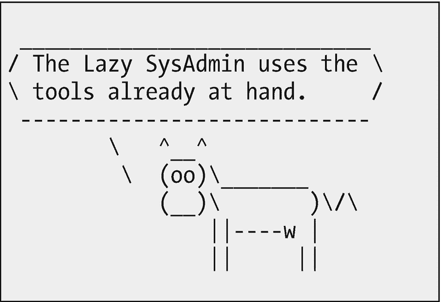
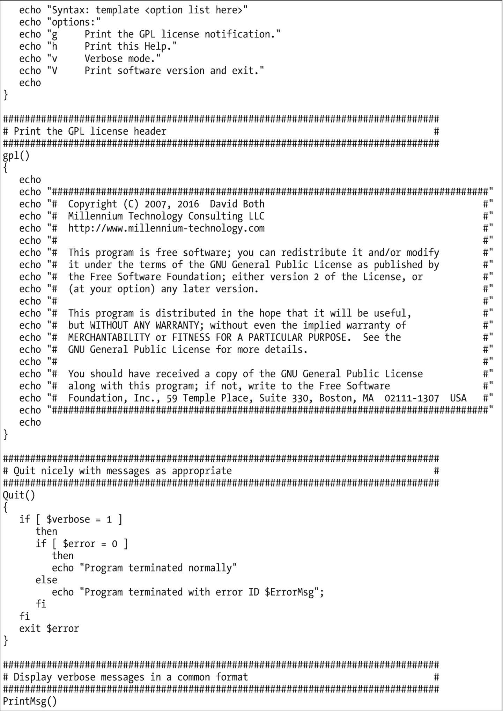

# 10.总是使用外壳脚本

当编写程序来自动化——嗯，一切——时，总是使用 shell 脚本。因为 shell 脚本是以 ASCII 文本格式存储的，所以人们可以像计算机一样轻松地查看和修改它们。您可以检查一个 shell 程序，看看它到底做了什么，以及在语法或逻辑上是否有任何明显的错误。这是一个强有力的例子，说明开放意味着什么。

我知道一些开发人员倾向于认为 shell 脚本不是真正的编程。shell 脚本和编写它们的人的边缘化似乎是基于这样一种想法，即唯一真正的编程语言是必须从源代码编译来产生可执行代码的语言。凭经验我可以告诉你，这绝对不是真的。

我用过很多语言，包括 BASIC、C、C++、Pascal、Perl、Tcl/Expect、REXX 以及它的一些变种包括 Object REXX，很多 shell 语言包括 Korn 和 Bash，甚至一些汇编语言。每一种计算机语言都有一个目的——让人类告诉计算机做什么。当你写一个程序时，不管你选择哪种语言，你都是在给计算机指令以特定的顺序执行特定的任务。

## 定义

shell 脚本或程序是至少包含一个 shell 命令的可执行文件。它们通常有不止一个命令，有些 shell 脚本有数千行代码。综合起来看，这些命令是执行预期任务并获得特定结果所必需的。

虽然包含一行 shell 命令的可执行文件可以在当前的 shell 中运行，但是最好添加一行“shebang ”,用于定义程序运行的 shell。让我们两方面都试试。

### 实验 10-1

这个实验应该以学生用户的身份进行。我们在您的主目录中创建一个最小的脚本，使它可执行，并运行它。

首先用 vim 在您的主目录中打开一个新文件。

```sh
[student@testvm1 ~]$ vim test1

```

在文件的开头添加一行并保存文件。不要退出 vim，因为我们将对 test1 脚本进行更多的修改。

```sh
echo "Hello world!"

```

在另一个终端会话中，列出一长串新程序。

```sh
[student@testvm1 ~]$ ls -l test1
-rw-rw-r-- 1 student student 20 Dec 31 15:27 test1

```

文件权限显示它不可执行。使其对用户和组可执行，并再次列出。

```sh
[student@testvm1 ~]$ chmod ug+x test1
[student@testvm1 ~]$ ls -l test1
-rwxrwxr-- 1 student student 20 Dec 31 15:38 test1

```

现在让我们运行程序。我们使用。/放在文件名前面，以指定程序文件位于当前目录中。主目录不是路径的一部分，所以我们必须指定可执行文件的路径。

```sh
[student@testvm1 ~]$ ./test1
Hello world!

```

现在让我们在 echo 命令之前添加 shebang 行。这规定了无论我们在哪个 shell 下运行，程序都将在 bash shell 下运行。

现在我们的程序分成两行，看起来像这样。

```sh
#!/bin/bash
echo "Hello world!"

```

再次运行该程序。结果应该不会改变。从 vim 退出。

对于这样一个简单的 shell 脚本，我们是否添加 shebang 行并不重要。我用这个脚本试验的所有 shells 都产生了相同的结果。但是有一些内置的 shell 命令可能在其他 shell 中不存在，或者一些命令可能以不同的方式实现，不同的结果可能会影响程序运行时的结果。

无论如何，包含 shebang 行始终是一个好的做法。

## SysAdmin 上下文

上下文很重要，这个原则“总是使用 shell 脚本”应该在我们作为系统管理员的工作上下文中考虑。

系统管理员的工作与开发人员和测试人员的工作有很大的不同。除了解决硬件和软件问题之外，我们还负责管理我们负责的系统的日常运行。我们监控这些系统的潜在问题，并尽一切努力在这些问题影响到我们的用户之前阻止它们。我们安装更新，并对操作系统进行完整版本升级。我们解决由用户引起的问题。系统管理员开发代码来做所有这些事情，甚至更多；然后我们测试代码；然后我们在生产环境中支持这些代码。

我们中的许多人还管理和维护我们的系统所连接的网络。在其他情况下，我们会告诉网络人员问题出在哪里以及如何解决，因为我们首先发现并诊断出问题。

我们系统管理员比开发运维这个术语存在的时间要长得多。事实上，SysAdmin 工作更像是 dev-test-ops-net，而不仅仅是 devops。我们的知识和日常任务清单涵盖了所有这些专业领域。

在这种情况下，创建 shell 脚本的需求是复杂的、相互关联的，而且很多时候是矛盾的。让我们看看系统管理员在编写 shell 脚本时必须考虑的一些典型因素。

### 要求

这种冗余意味着创建 shell 脚本的一个要求是从请求脚本的最终用户那里获得一组需求。即使我们碰巧既是开发人员又是用户，我们也应该在开始编写代码之前坐下来创建一组需求。

即使是一个简短的两三个项目目标的列表也足以作为一组需求。我将接受的最低限度是输入数据的描述和样本；所需的任何公式、逻辑或其他处理；以及所需输出或功能结果的描述。当然，越多越好，但有了这些东西作为起点，我就可以开始工作了。

随着项目的继续，需求自然会变得更加明确。最初没有考虑到的事情就会出现。假设会被改变。

### 发展速度

程序通常必须快速编写，以满足环境或 PHB 强加的时间限制。我们编写的大多数脚本都是为了解决问题，清理问题的后果，或者交付一个在编译好的程序被编写和测试之前就必须运行的程序。

快速编写程序需要 shell 编程，因为它允许快速响应客户的需求，无论客户是我们自己还是其他人。如果代码中存在逻辑问题或 bug，它们几乎可以立即得到纠正和重新测试。如果最初的需求集有缺陷或不完整，shell 脚本可以很快修改以满足新的需求。因此，总的来说，我们可以说，系统管理员工作中对开发速度的需求压倒了对使程序尽可能快地运行或尽可能少地使用系统资源(如 ram)的需求。

让我们看看图 [10-1](#Fig1) 中的 BASH 命令行程序。它旨在列出当前登录到系统的每个用户 ID。我们以前看过这个程序，但是让我们从不同的角度来看它。


图 10-1

重新访问我们的 CLI 程序以列出登录用户

因为用户可能会多次登录，所以这个一行程序只显示每个 ID 一次，并用逗号分隔 ID。用 C 语言对此进行编程需要大量的专用代码。表 [10-1](#Tab1) 显示了上述 BASH 程序中使用的每个 CLI 命令的代码行数。几年前我发现这些数字时，它们是准确的。如果自那以后它们发生了变化，也不会有太大影响。

表 10-1

CLI 的强大功能来自这些单独的程序

<colgroup><col class="tcol1 align-left"> <col class="tcol2 align-left"></colgroup> 
| 

命令

 | 

源代码行

 |
| --- | --- |
| 回声 | One hundred and seventy-seven |
| 谁 | Seven hundred and fifty-five |
| 使用 | Three thousand four hundred and twelve |
| 分类 | Two thousand six hundred and fourteen |
| 金圣柱 | Three hundred and two |
| 一项 Linux 指令 | Two thousand and ninety-three |
| 总数 | Nine thousand three hundred and fifty-three |

您可以看到上面的 BASH 脚本使用的程序总共包含 9000 多行 C 代码。所有这些程序包含的功能远远超过我们在脚本中实际使用的功能。然而我们把这些已经写好的程序结合起来，使用我们需要的部分。

编写和测试生成的 BASH 脚本所需的时间比编译后的程序做同样的事情要少得多。

### 性能速度

就执行速度而言，脚本性能现在远不如过去重要。今天的 CPU 速度非常快，大多数计算机都有多个处理器。我自己的大多数电脑都有 4 个超线程内核，运行频率为 3GHz 或更高。我的主工作站有一个英特尔酷睿 i9 处理器，有 16 个内核和 32 个 CPU。我倾向于在从事各种项目时同时打开大量的虚拟机，包括为这本书所做的研究。



一般来说，唯一要问的问题是工作是否能及时完成。如果是的话，那就不用担心。如果没有，那么用编译语言编写和测试相同程序所需的时间很可能会更晚。编译后的程序运行时节省的时间少于使用 shell 程序开发时节省的时间。请记住，我们正在考虑系统管理员的工作环境。

考虑图 [10-1](#Fig1) 中的示例程序和表 [10-1](#Tab1) 中的 C 代码量。事实是，我们的示例 CLI 程序仍在使用大量已经编写并经过广泛测试的 C 代码。作为懒惰的系统管理员，我们已经有大量的 C 代码以 Linux 核心实用程序和其他命令行实用程序的形式存在。我们应该总是使用已经存在的东西。

这并不意味着在极少数情况下可能不需要进行一些性能调优。我发现有必要提高 shell 脚本的性能。我发现的问题通常更多的是关于处理大量数据，而不是程序的功能逻辑。

而且下周硬件会更快。

### 变量

几乎所有的事情都使用变量而不是硬编码的值。即使您认为某个值只需要使用一次，比如目录名或文件名，也要创建一个变量，并在应该放置硬编码名称的地方使用该变量。

很多时候，我在脚本中的更多地方需要一个特定的值，所以如果它作为变量被访问，我已经做好了准备。输入变量名比输入完整的目录名花费的时间要少，尤其是当它很长的时候。如果值发生变化，更改脚本也更容易。在一个位置固定变量值比在几个位置替换它要容易得多。

我总是在脚本中有一个单独的位置来设置变量的初始值。将初始变量设置放在同一个地方有助于容易找到它们。

### 测试

一旦最基本的代码结构完成，在开发过程中的所有阶段，当代码完成时，以及当已经进行了任何需要的更改时，就可以完成外壳脚本的交互式测试。

测试计划应该从需求陈述中创建。测试计划将列出需要测试的需求，例如，“对于输入 X，输出应该是 Y，”以及“对于错误的输入，应该显示错误消息 X。”

有了测试计划，我就可以在每个新特性被添加到程序中时对其进行测试。它有助于确保测试在程序开发过程中始终如一。

在第 [11](11.html) “尽早测试，经常测试”一章中，我们将详细探讨测试，但是现在，测试的重要性不能低估。测试必须从一开始就进行。

### 开放和开源

就其本质而言，shell 脚本是开放的，因为我们可以阅读它们。它们以 ASCII 文本格式编写，从不被编译或更改为二进制或其他人类不可读的格式。例如，bash shell 读取 shell 程序的内容，并动态地解释它们。它们作为 ASCII 文本文件的存在也意味着 shell 脚本可以很容易地修改并立即运行，而不必等待重新编译。

这种对代码的开放访问也意味着我们可以探索 shell 脚本来帮助理解它们的功能逻辑。这在编写我们自己的脚本时很有用，因为我们可以轻松地将这些现有代码包含在我们自己的脚本中，而不是编写我们自己的代码来执行相同的任务。

当然，这种代码共享依赖于原始代码的开源许可。我总是在代码本身中包含一个明确的许可声明，在这个声明下我共享我写的代码，通常是 GPL V2。很多时候，我甚至可以在程序中选择显示 GPL 许可声明。

对我来说，让我写的所有代码都开源并获得适当的许可是另一个基本要求。

## 作为原型的 Shell 脚本

我看过许多关于 Unix 哲学的文章和书籍，其中讨论了将 shell 脚本作为大型复杂程序原型的工具。我认为这对应用开发人员而不是系统管理员来说可能有一些价值。这种方法可以允许快速原型和早期测试，以确保程序正是客户想要的。

作为一名系统管理员，我发现 shell 脚本对于原型和完整的程序都是完美的。我的意思是，为什么要花额外的时间把已经运行良好的东西翻译成另一种语言呢？嘿——我们在努力偷懒呢！

## 过程

我们都有自己的流程——工作方式，使我们能够以自己的方式完成项目。我们都不一样，我们的过程也不一样。有时我们有不止一个过程，这取决于我们的起点。我想向你描述几种对我有效的方法。

### 暂且应急的

我的大多数编程项目都是从快速而肮脏的命令行程序开始的，我用它们来执行特定的任务。图 [9-2](09.html#Fig2) 中的 doUpdates 程序就是一个很好的例子。毕竟，安装更新是一个简单的`yum`或`dnf`命令，对吗？没有那么多。

在很长一段时间里，我会登录每台主机，运行`dnf -y update`命令，然后如果内核已经更新，就手动重启。当我预先确定内核正在更新时，下一步就发生了。我使用了复合命令`dnf -y update &&` `reboot`，如果更新成功，它会重启计算机。但是我仍然在命令行上输入命令。

随着家庭网络中计算机数量的增加，我意识到我也在更新 man 数据库；做出决定；如果有内核更新，更新 GRUB 配置文件并运行 reboot 命令。此时，我编写了一个简单的脚本来执行这些任务。

但是那个剧本需要一些自己的决定和我的指导。我不想让脚本每次运行时都随意重启主机。所以我添加了一个选项，只有在内核或 glibc 更新时才重启。嗯，这需要我添加`case`命令来解释选项。我还添加了一个包含程序当前版本的变量和一个显示版本的选项。稍后，我添加了一个“verbose”选项，这样如果程序遇到问题，我可以获得更多的调试信息。

随着选项的增加，我需要一个帮助工具，所以我添加了它。然后我添加了一个选项来显示 GPL 语句。

很多工作已经完成了，因为我已经在我的其他程序和我用于新程序的模板中包含了这些特性。从模板中复制我需要的那些特性，粘贴到 doUpdates 程序中，并修改它们以满足这个特定程序的需要，这是一件很简单的事情。

许多大型程序都是从那些日常的小命令行程序发展而来，并成为我们日常工作生活中不可或缺的一部分。有时这个过程并不明显，直到你意识到你手上有一个完整的工作脚本。

### 规划和远见

有些系统管理员写的程序其实是提前计划好的。我再一次从一组需求开始，虽然我试图花更多的时间来制定它们，而不是快速和肮脏的程序。

为了开始编码，我复制了一份脚本模板，并适当地命名它。该模板包含所有的标准程序和基本结构，我需要开始任何项目。该模板包括一个框架帮助工具，一个用适当的返回代码(RC)结束程序的过程，以及一个允许使用选项的`case`语句。

所以我用这个模板做的第一件事就是编写帮助工具。然后，我测试这是否有效，看起来是否如我所愿。首先对帮助工具进行编码也是文档化过程的开始。它帮助我定义脚本的功能以及一些特性。

在这一点上，我想添加定义特定功能的注释，并在脚本中创建执行序列。如果我需要编写一个新的过程，我会为该过程创建一个小框架，并在其中添加包含其功能的简短描述的注释。通过首先添加这些注释，我已经将我之前创建的需求集嵌入到了代码的结构中。这使得跟踪变得容易，并确保我已经将所有这些需求转化为代码。

然后，我开始向注释的每个部分添加代码。然后，我测试每个新的部分，以确保它满足注释中陈述的需求。

然后我再加一点，测试一下。再加一点然后测试。每次测试，我都会测试所有东西，甚至是我之前测试过的特性和代码段，因为新代码也会破坏现有代码。我遵循这个过程，直到 shell 脚本完成。

#### 模板

我已经提到了很多次，我有一个模板，从我喜欢创建我的程序。让我们看看这个模板，并对它进行实验。您可以在 [`https://github.com/Apress/linux-philo-sysadmins/tree/master/Ch10`](https://github.com/Apress/linux-philo-sysadmins/tree/master/Ch10) 下载 script.template.sh 模板文件。

##### 代码

既然你已经下载了模板，让我们来看看图 [10-2](#Fig2) ，我将指出它的一些关键特征。然后我们会做一个实验，看看效果如何。注意图 [10-2](#Fig2) 中的字体大小有所减小，以减少换行次数，提高可读性。

当然，所有的脚本都应该以 shebang 开头，这个也不例外。然后我添加了几段注释。

第一个注释部分是程序名称和描述以及更改历史。这是我在 IBM 工作时学到的一种格式，它提供了一种记录程序的长期开发和应用于它的任何修复的方法。这是记录你的程序的一个重要的开始。

第二个注释部分是版权和许可声明。我使用 GPL2，这似乎是根据 GPL2 许可的程序的标准声明。如果您选择使用不同的开源许可，这没问题，但是我建议您在代码中添加类似这样的明确声明，以消除任何可能的许可混淆。我最近读了一篇有趣的文章，“源代码就是许可证， <sup>[1](#Fn1)</sup> ”这有助于解释这背后的推理。

过程部分在这两个注释部分之后开始。这是 Bash 中过程所需的位置。它们必须出现在程序体之前。作为我自己记录一切的需要的一部分，我在每个过程之前放置一个注释，其中包含对它打算做什么的简短描述。我还在过程中加入了注释，以提供进一步的阐述。您可以在这里添加自己的程序。

我不会剖析每个过程的功能。在注释和你阅读代码的能力之间，它们应该是可以理解的。不过，在图 [10-2](#Fig2) 的最后，我会讨论这个模板的一些其他方面。

T3】

图 10-2

我将 script.template.sh 模板文件用作新程序的起点

程序的主要部分在程序部分结束后开始。我通常以设置程序中使用的所有变量的初始值开始这一部分。这确保了我使用的所有变量都被设置为某个默认的初始值。它还提供了程序中使用的所有变量的列表。

接下来，我检查 root 是否正在运行这个程序，如果没有，显示一条消息并退出。如果你的程序可以被非根用户运行，你可以删除这个部分。

然后我有`getops`和`case`语句来检查命令行以确定是否输入了任何选项。对于每个选项，case 语句设置指定的变量或调用像`Help()`和`Quit()`这样的过程。如果输入了一个无效的选项，最后一个 case 节设置一个变量来表明这一点，下一段代码抛出一个错误消息并退出。

最后，程序的主体是你的大部分代码将要去的地方。这个程序是可执行的，因为它没有错误。但是因为没有功能代码，你所能做的就是显示帮助和 GPL 许可声明，并生成一个使用无效选项的错误。除非你给程序添加一些功能代码，否则它什么也不会做。

让我们通过实验 10-2 来探索这个模板代码。

### 实验 10-2

以学生用户的身份执行此实验。如果您尚未这样做，请将文件 script.template.sh 从 [`https://github.com/Apress/linux-philo-sysadmins/tree/master/Ch10`](https://github.com/Apress/linux-philo-sysadmins/tree/master/Ch10) 下载到学生用户的主目录中。将用户和组的权限设置为可执行，并将所有权设置为 student.student。

在作为用户学生的终端会话中，确保 PWD 是您的主目录。在继续下一步之前，创建一个名为 test1.sh 的模板工作副本。

```sh
[student@testvm1 ~]$ cp script.template.sh test1.sh

```

显示帮助信息。

```sh
[student@testvm1 ~]$ cd
[student@testvm1 ~]$ ./test1.sh -h

You must be root user to run this program

```

这段代码告诉您，您必须是 root 用户。您可以通过使用您最喜欢的编辑器注释掉这些代码行来绕过它。这部分代码现在看起来像这样。请务必保存您所做的更改。

```sh
#---------------------------------------------------------------------------
# Check for root. Delete if necessary.

# if [ `id -u` != 0 ]
# then
#    echo ""
#    echo "You must be root user to run this program"
#    echo ""
#    Quit 1
# fi

```

现在使用-h 选项再次运行脚本来查看帮助。

```sh
[student@testvm1 ~]$ ./test1.sh -h
Add description of the script functions here.

Syntax: template <option list here>
options:
g     Print the GPL license notification.
h     Print this Help.
v     Verbose mode.
V     Print software version and exit.

```

好像剧本名字不太对。编辑 test1.sh 脚本，将第一个注释部分顶部和帮助过程中的名称更改为脚本的新名称。在我们处理帮助过程时，添加选项列表。帮助中的“语法”行应该如下所示。

```sh
echo "Syntax: test1.sh  -ghvV"

```

保存更改，并使用-h 选项再次运行脚本。

```sh
[student@testvm1 ~]$ ./test1.sh -h
Add description of the script functions here.

Syntax: test1.sh  -ghvV
options:
g     Print the GPL license notification.
h     Print this Help.
v     Verbose mode.
V     Print software version and exit.

```

让我们看看当你给程序一个它不识别的选项时会发生什么。

```sh
[student@testvm1 ~]$ ./test1.sh -a

ERROR: Invalid option
Add description of the script functions here.

Syntax: test1.sh  -ghvV
options:
g     Print the GPL license notification.
h     Print this Help.
v     Verbose mode.
V     Print software version and exit.

Program terminated with error ID 10T

```

这很好——它显示帮助，并以一条错误消息终止。大多数人不会理解错误消息 ID 的幽默之处——我不会把它留在任何生产脚本中。

因此，让我们至少让我们的小测试脚本执行一些有用的工作。在大量注释之后添加以下行，指示代码主体的开始，但在 Quit 函数调用之前。

```sh
free

```

是的——就这些，只是自由命令。应该是这样的。

```sh
#############################################################################
#############################################################################
#############################################################################
#############################################################################
# The main body of your program goes here.
#############################################################################
#############################################################################
#############################################################################
#############################################################################

free

Quit

#############################################################################
# End of program
#############################################################################

```

保存脚本，不带任何选项再次运行。

```sh
[student@testvm1 ~]$ ./test1.sh
            total      used      free    shared  buff/cache   available
Mem:      4046060    248256   3384972       988    412832   3566296
Swap:       4182012           0     4182012
[student@testvm1 ~]$

```

现在，您已经从一个相当简单的模板中创建了一个工作脚本。您已经执行了一些简单的测试来验证该脚本是否按预期执行。

我喜欢的一个选项是“测试”模式，在这种模式下，程序运行并描述它将做什么，或者将一些调试数据打印到 STDOUT，以便我可以直观地看到它是如何工作的。让我们将该选项添加到模板中。

`getopts`语句(get options)允许我们指定 bash 脚本的选项输入。然后，我们使用`case`语句对所有选项进行排序，设置值，执行小任务，或者调用更长的过程。`while`语句一直循环，直到所有选项都被处理完，除非其中一个选项选择了一条以某种方式退出循环的路径。

### 实验 10-3

首先，让我们添加一个新变量，Test，并设置初始值为 0(零)。在模板的变量初始化部分添加以下代码行。

```sh
Test=0

```

现在让我们将新的选项字符(t)添加到`getopts`语句中。

```sh
while getopts ":gchrtvV" option; do

```

现在我们给`case`语句添加一个新的节。完成的选项处理代码如下所示。

```sh
while getopts ":gchrtvV" option; do
   case $option in
      g) # display GPL
         gpl
         Quit;;
      t) # Set test mode
         test=1;;
      v) # Set verbose mode
         verbose=1;;
      V) # Set verbose mode
         echo "Version = $version"
         Quit;;
      h) # display Help
         Help
         Quit;;
     \?) # incorrect option
         badoption=1;;
   esac
done

```

根据您在`case`语句节中编写代码的方式，它们出现的顺序会影响结果。

我们还没有完成。您应该在 Help()过程中添加一行。将下面一行添加到帮助过程中。任何对你有意义的地方都可以，但我喜欢按字母顺序排列选项。

```sh
echo "t     Set test mode. The program runs but does not perform any actions."

```

您还应该在更改历史中添加一行。

```sh
# 01/30/2018  David Both    Add an option for setting test mode.           #

```

现在我们需要测试。首先让我们确保我们没有破坏任何东西，然后我们可以通过绕过我们的`free`语句向“test”添加代码。我在这里只展示了几种可能的测试模式，但是您应该测试每一种可能的选项和选项组合，以确保没有任何问题。

```sh
[root@david development]# ./script.template.sh
              total        used        free      shared  buff/cache   available
Mem:      65626576    8896704    48397920      159924     8331952    55963460
Swap:      15626236           0    15626236
[root@david development]# ./script.template.sh -x
ERROR: Invalid option
Add description of the script functions here.

Syntax: template <option list here>
options:
g     Print the GPL license notification.
h     Print this Help.
t     Set test mode. The program runs but does not perform any actions.
v     Verbose mode.
V     Print software version and exit.

Program terminated with error ID 10T
[root@david development]# ./script.template.sh -t
            total       used       free     shared  buff/cache   available
Mem:      65626576     8895716    48399104    159924   8331756    55964424
Swap:      15626236           0    15626236
[root@david development]# ./script.template.sh -h
Add description of the script functions here.

Syntax: template <option list here>
options:
g     Print the GPL license notification.
h     Print this Help.
t     Set test mode. The program runs but does not perform any actions.
v     Verbose mode.
V     Print software version and exit.

```

现在让我们添加一些代码，如果我们设置了测试模式，这些代码会阻止 free 语句的执行。

```sh
# Execute the code only if this is not test mode
if [ $test ]
then
   Msg="Test mode. No action taken."
   PrintMsg
else
   free
fi

```

我们还测试了一些。

```sh
[root@david development]# ./script.template.sh -t
[root@david development]# ./script.template.sh
           total       used       free     shared  buff/cache  available
Mem:    65626576    8904512   48395196     159924    8326868   55955156
Swap:   15626236          0   15626236
[root@david development]#

```

我在这里只展示了几个结果，但是你可以看到有一个问题。你能看出这是什么吗？当我们处于测试模式时，消息不打印。你能看出为什么吗？如果您查看 PrintMsg()过程，您会看到只有在设置了 verbose 模式的情况下才会打印该消息。

有很多方法可以解决这个问题。一个是从 PrintMsg()过程中删除详细要求。另一种是在 if 语句的测试路径中设置 verbose 模式。您可以在-t case 节中设置详细模式。另一种选择是在运行程序时使用-v 选项。后面的结果看起来是这样的。

```sh
[root@david development]# ./script.template.sh -tv
########## Test mode. No action taken. ##########
Program terminated normally

```

在测试模式下，您会选择哪个选项来显示测试消息？我倾向于在 case 节中设置详细模式，如下所示。

```sh
      t) # Set test mode
         verbose=1
         test=1;;

```

继续进行您选择的任何更改，以确保显示测试模式消息，然后进行广泛的测试，直到您知道一切都正常工作。

请记住，这是一个模板，是具有特定和有用目的的脚本的起点。不必要的代码，比如我们在实验 10-3 中添加的位，可以安全地忽略或删除。

我们将使用这个脚本模板作为第 [11](11.html) 章“尽早测试，经常测试”中更有用的脚本的基础

您可以随意使用这个模板，并根据自己的需求进行修改。因为该模板在 GPL2 下是开源的，所以可以共享和修改它。如果你愿意的话，我想让你用它。请记住，懒惰的管理员总是使用免费可用的代码，以避免重复编写已经完成您需要的代码。希望你觉得有用。

## 最后的想法

编译程序是必要的，并且满足了一个非常重要的需求。但是对于系统管理员来说，总有更好的方法。我们应该总是使用 shell 脚本来满足我们工作的自动化需求。

外壳脚本已打开；他们的内容和目的是可知的。它们可以很容易地修改，以满足不同的要求。就我个人而言，我没有发现任何我在担任 SysAdmin 角色时需要做的事情是不能用 shell 脚本来完成的。

在极少数情况下，您会发现 shell 脚本做不到的事情，不要用编译语言编写整个程序。尽可能多写 shell 脚本。然后，如果——且仅当——无法通过使用一个 shell 命令或管道中的一系列 shell 命令来完成剩下的那一点点工作，那么就编写一个小程序来做好一件事——这一点点在其他任何地方都找不到。

<aside class="FootnoteSection" epub:type="footnotes">Footnotes [1](#Fn1_source)

斯科特·K·彼得森，《源代码就是许可证》，Opensource.com， [`https://opensource.com/article/17/12/source-code-license`](https://opensource.com/article/17/12/source-code-license)

 </aside>