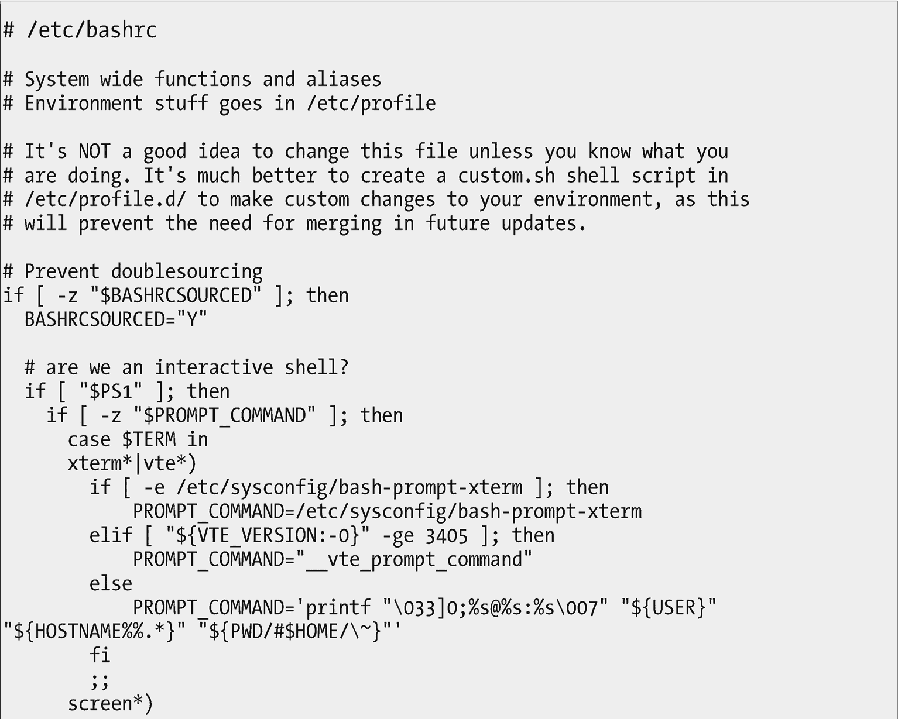
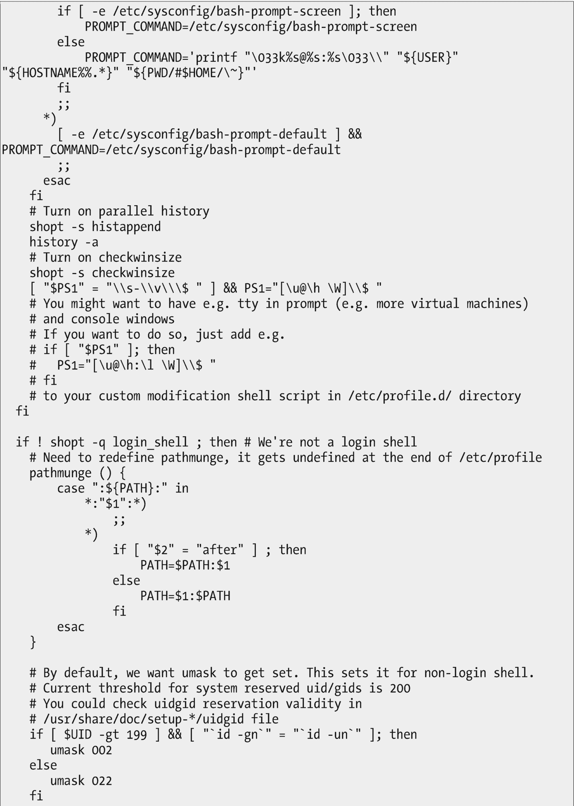
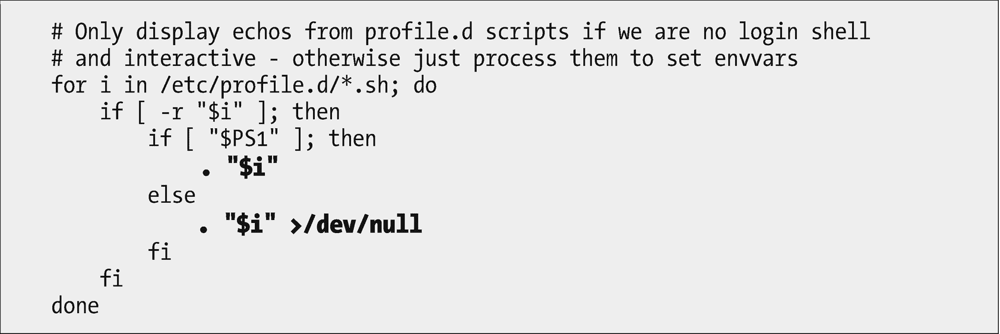

# 十三、以开放格式存储数据

我们使用计算机的原因是为了处理数据。它过去被称为“数据处理”是有原因的，这是一个准确的描述。尽管数据可能以视频和音频流、网络和无线流、文字处理数据、电子表格、图像等形式存在，但我们仍在处理数据。这仍然只是数据。

我们使用 Linux 中的工具来处理和操作文本数据流。这些数据通常需要存储，当需要存储数据时，以开放的文件格式存储总比以封闭的文件格式存储好。

尽管许多用户应用以 ASCII 格式存储数据，包括简单的平面 ASCII 和 XML，但本章是关于与 Linux 直接相关的配置数据和脚本。本章中我们要考虑的文件是关于系统配置的。

## 封闭是无法穿透的

早在 Windows 3.1 引入注册表 <sup>1</sup> 之前，大多数实用程序和应用都将其配置数据存储在注册表中。ini 文件。这些。ini 文件存储为 ASCII 文本，易于访问、阅读，甚至修改。只需要一个简单的文本编辑器就可以对这些进行修改。ini 配置文件。

注册表通过将配置数据存储在一个单一的、庞大的、难以理解的二进制数据文件中改变了这一切。虽然个别程序可以将配置数据存储在。ini 文件，注册表被吹捧为一种集中控制程序配置的方式，据说它的二进制格式比 ASCII 文本文件解析起来更快。

作为系统管理员，我们需要使用许多不同类型的数据。二进制格式本质上是晦涩难懂的，需要特殊的工具和知识来操作。有很多工具可以提供注册表查看和编辑功能。这些工具从所谓的免费软件到昂贵的商业程序都有。为了管理计算机，必须使用本身是封闭的特殊工具，这是向不可穿透性的进一步迈进。

所有这些问题的一部分是，这些工具的作者需要了解正在查看或编辑的注册表项的内容。没有来自专有软件供应商的内部知识，这些工具也是无用的。专有软件以二进制和专有格式存储配置数据的一个原因是为了对用户隐藏信息。

这一切都源于这些厂商所坚持的封闭和专有哲学。表面上看，这是为了保护用户不做“蠢事”，但这也是掩盖信息的好方法。

我试图在/etc 中找到一个二进制格式的 Linux 系统配置文件，但是没有找到。该目录中的数百个配置文件没有一个是二进制格式的。这确实是一件好事，但它让我没有一个二进制配置文件的示例，我可以用它来向您展示它是什么样子的。

二进制格式的一个问题是，没有理由创建我们在 Linux 中拥有的许多强大的工具。可以从二进制格式文件中生成的数据流没有一个可以用于 grep、awk、sed、cat、vim、emacs 等工具，或者我们在管理我们负责的系统时每天理所当然使用的数百种其他基于文本的工具。

## 开放是可知的

“开放源代码”是指代码，并使任何想要查看或修改它的人都可以使用源代码。“开放数据 <sup>2</sup> ”讲的是数据本身的开放性。

术语“开放数据”不仅仅意味着可以访问数据本身，还意味着数据可以被查看、以某种方式使用以及与他人共享。实现这些目标的确切方式可能取决于某种归属和开放许可。与开放源码软件一样，这种许可旨在确保数据的持续开放可用性，而不是以任何方式对其进行限制。

开放数据是可知的。这意味着对它的访问是不受限制的。真正开放的数据可以自由阅读和理解，无需进一步解释或解密。在系统管理员的世界里，开放意味着我们用来配置、监控和管理我们的 Linux 主机的数据很容易被找到、读取和修改。它以易于访问的格式存储，如 ASCII 文本。当一个系统是开放的时，数据和软件都可以通过开放工具来管理——处理 ASCII 文本的工具。

## 平面 ASCII 文本

平面文本文件是开放和可知的。程序和系统管理员都很容易阅读它们，所以很容易看出什么时候工作，什么时候不工作。大多数 Linux 配置文件都是简单的平面 ASCII 文本文件，这使得它们易于使用我们已经掌握的简单 Linux 文本操作工具进行查看和修改。

所以我们可以使用`cat`和`less`来查看 Linux 配置文件，使用`grep`来提取和查看包含指定字符串的行。我们可以使用 vi、vim、emacs 或任何其他文本编辑器来修改 ASCII 文本格式的配置文件。

在我的一项工作中——我们使用 Perl CGI 脚本来管理电子邮件系统——我们使用纯文本文件来存储我们所有的数据。这些数据包括部门信息，例如谁被授权访问该部门的数据。它还包含每个部门的电子邮件用户的 ID 和登录信息。

我们编写了一些 Perl 程序来管理对这些数据的访问，这既适用于作为总体电子邮件系统管理员的我们，也适用于部门管理员。数据仍然是平面的 ASCII 文本文件，因此我们可以使用基本的 Linux 命令行工具来访问和修改数据，尤其是在对文件进行大规模更改时。同时，我们还能够使用基于 web 的 Perl CGI 脚本来处理个人和部门记录。

我们确实考虑过使用 MySQL 进行记录管理，但我们认为 ACII 文件更容易访问。我们的一个系统管理员在大约一周的时间里编写了一系列 Perl 脚本，允许我们在 Perl 脚本中使用类似 SQL 的函数调用，因此我们拥有了两个世界的优点。

### 系统配置文件

大多数系统范围的配置文件位于/etc 目录及其子目录中。/etc 中的文件提供了许多系统服务和服务器的配置数据，例如电子邮件(SMTP、POP、IMAP)、web (HTTP)、时间(NTP 或 chrony)、SSH、网络适配器和路由、GRUB 引导加载程序、显示屏和打印机配置等等。

您还可以找到提供影响所有用户的系统级配置的配置文件，例如/etc/bashrc。/etc/bashrc 文件在所有用户打开 bash shell 时为他们提供初始设置和配置。图 13-1 显示了我的 Fedora VM 上/etc/bashrc 文件的内容。



图 13-1

/etc/bashrc 文件为所有打开的 bash shell 会话提供配置

放松——我们不会检查图 13-1 中/etc/bashrc 文件的每一行。但是，在这个文件中我们应该注意一些事情。

首先，看看所有的评论。这个文件是供用户阅读的。我们系统管理员毕竟是高级用户。我喜欢基于 Red Hat 的发行版的一点是大多数配置文件和脚本都有很好的注释。

这个脚本的功能之一是设置 shell 命令提示符。该脚本确定 shell 是标准 xterm 还是 vte 终端会话，或者它是否在屏幕会话中。它根据不同的条件设置不同的提示字符串。它还使用诸如/etc/sys config/bash-prompt-xterm 之类的外部文件，这些文件将提示符配置包含在一个文件和位置中，很容易由系统管理员进行管理。

靠近文件顶部是一系列注释，简要描述了脚本的功能，并告诫不要更改这个特定的文件。注释也告诉你你自己的修改应该去哪里。我们将进一步研究这个问题。

注意缩进是如何使这个脚本片段的结构比所有东西都挤在左边更容易阅读。

我们经过的时候你看到了吗？这个配置文件是一个可执行程序。这是一个 bash 脚本，它包含的程序逻辑可以根据外部条件决定采用哪条执行路径。这个脚本本身并不完整；它实际上是一个片段，可以在必要时来源-导入-到其他脚本中。

Sourcing 是一种 bash shell 方法，用于将其他 bash 脚本或片段的内容包含到脚本中。这允许多个脚本使用所获取的片段内容。你可以把它想象成编译程序使用的函数库。源文件被加载到调用脚本中的源命令位置。然后立即执行。

可以使用 source 命令来完成源操作。句号(。)是源命令的别名。这如图 13-2 所示，是图 13-1 中的一段代码。



图 13-2

这段代码片段提供了*。sh 文件位于/etc/profile.d。该目录中的其他文件将被忽略

图 13-2 中突出显示的代码来自所有的*。将/etc/profile.d 中的 sh 文件复制到这个代码片段中。

那么图 13-1 中的程序片段是如何执行的呢？哪里是代码或触发器导入-源-这个代码到它，所以它可以被执行。好问题。图 13-3 中的/etc/profile 脚本来源于/etc/bashrc 文件。


图 13-3

/etc/profile 脚本在启动时为系统上的所有 shells 设置全局环境。它还在/etc/profile.d 和/etc/bashrc 中提供 bash 脚本片段。

/etc/profile 文件也是一个脚本片段。我们可以在这里花一些时间来定位/etc/profile 启动的方式，但是这将把我们引向错误的方向。可以说，当从 bash 本身调用时，它是作为登录 shell 被调用的，它首先读取/etc/profile(如果存在),然后读取~/。bash_profile，~/。bash_login 和~/。概要文件，按此顺序排列(如果存在的话 <sup>3</sup> )。

### 全局 Bash 配置

现在，让我们对 bash 进行一些全局配置更改。

/etc/bashrc 文件提到了/etc/profile.d 目录。让我们看看实验 13-1 中的目录及其文件。同时，我们将添加一些我们自己的全局 bash 配置。

### 实验 13-1

这个实验应该以 root 用户身份进行。我们的目标是对 bash shell 的全局配置进行一些补充。

制作/etc/profile . d PWD 并列出内容。

```sh
[root@testvm1 ~]# cd /etc/profile.d/ ; ls -l
total 100
-rw-r--r--. 1 root root  664 Jul 25  2017 bash_completion.sh
-rw-r--r--. 1 root root  196 Aug  3 04:18 colorgrep.csh
-rw-r--r--. 1 root root  201 Aug  3 04:18 colorgrep.sh
-rw-r--r--. 1 root root 1741 Nov 10 12:53 colorls.csh
-rw-r--r--. 1 root root 1606 Nov 10 12:53 colorls.sh
-rw-r--r--. 1 root root   69 Aug  4 19:53 colorsysstat.csh
-rw-r--r--. 1 root root   56 Aug  4 19:53 colorsysstat.sh
-rw-r--r--. 1 root root  162 Aug  5 02:00 colorxzgrep.csh
-rw-r--r--. 1 root root  183 Aug  5 02:00 colorxzgrep.sh
-rw-r--r--. 1 root root  216 Aug  3 04:57 colorzgrep.csh
-rw-r--r--. 1 root root  220 Aug  3 04:57 colorzgrep.sh
-rwxr-xr-x. 1 root root  249 Sep 21 03:40 kde.csh
-rwxr-xr-x. 1 root root  288 Sep 21 03:40 kde.sh
-rw-r--r--. 1 root root 1706 Jan  2 10:36 lang.csh
-rw-r--r--. 1 root root 2703 Jan  2 10:36 lang.sh
-rw-r--r--. 1 root root  500 Aug  3 11:02 less.csh
-rw-r--r--. 1 root root  253 Aug  3 11:02 less.sh
-rwxr-xr-x. 1 root root   49 Aug  3 21:06 mc.csh
-rwxr-xr-x. 1 root root  153 Aug  3 21:06 mc.sh
-rw-r--r--. 1 root root  106 Jan  2 07:21 vim.csh
-rw-r--r--. 1 root root  248 Jan  2 07:21 vim.sh
-rw-r--r--. 1 root root 2092 Nov  2 10:21 vte.sh
-rw-r--r--. 1 root root  120 Aug  4 23:29 which2.csh
-rw-r--r--. 1 root root  157 Aug  4 23:29 which2.sh

```

所有带*的文件。sh 扩展由/etc/bashrc 或。etc/个人资料。不执行带有其他扩展名的文件。我们将通过在这个目录中创建一个新文件来添加 bash 配置。

使用您喜欢的编辑器在这个目录中创建一个名为“mybash.sh”的新文件。将以下内容添加到文件中。

```sh
################################################################
# The following are global changes to BASH configuration       #
################################################################
alias lsn='ls --color=no'
alias vim='vim -c "colorscheme desert" '
TestVariable="Hello World"
set -o vi

```

在测试之前，让我们确保别名还没有出现，并且 TestVariable 为 null。

```sh
[root@testvm1 profile.d]# alias
alias cp='cp -i'
alias egrep='egrep --color=auto'
alias fgrep='fgrep --color=auto'
alias grep='grep --color=auto'
alias l.='ls -d .* --color=auto'
alias ll='ls -l --color=auto'
alias ls='ls --color=auto'
alias mc='. /usr/libexec/mc/mc-wrapper.sh'
alias mv='mv -i'
alias rm='rm -i'
alias which='(alias; declare -f) | /usr/bin/which --tty-only --read-alias --read-functions --show-tilde --show-dot'
alias xzegrep='xzegrep --color=auto'
alias xzfgrep='xzfgrep --color=auto'
alias xzgrep='xzgrep --color=auto'
alias zegrep='zegrep --color=auto'
alias zfgrep='zfgrep --color=auto'
alias zgrep='zgrep --color=auto'
[root@testvm1 profile.d]# echo $TestVariable

[root@testvm1 profile.d]#

```

现在测试结果。这一更改不会影响已经打开的 bash 会话。新的会话将反映这些更改。所以打开一个新的终端会话。作为学生用户，运行以下命令来验证结果。

```sh
[root@testvm1 profile.d]# echo $TestVariable
Hello World
[root@testvm1 profile.d]# alias
alias cp='cp -i'
alias egrep='egrep --color=auto'
alias fgrep='fgrep --color=auto'
alias grep='grep --color=auto'
alias l.='ls -d .* --color=auto'
alias ll='ls -l --color=auto'
alias ls='ls --color=auto'
alias lsn='ls --color=no'
alias mc='. /usr/libexec/mc/mc-wrapper.sh'
alias mv='mv -i'
alias rm='rm -i'
alias vim='vim -c "colorscheme desert" '
alias which='(alias; declare -f) | /usr/bin/which --tty-only --read-alias --read-functions --show-tilde --show-dot'
alias xzegrep='xzegrep --color=auto'
alias xzfgrep='xzfgrep --color=auto'
alias xzgrep='xzgrep --color=auto'
alias zegrep='zegrep --color=auto'
alias zfgrep='zfgrep --color=auto'
alias zgrep='zgrep --color=auto

```

正如这个实验所示，对 ASCII 文件进行修改是很容易的。请注意，不需要重启就可以使这些更改生效——它们会立即对新的 bash 终端会话生效。

### 用户配置文件

让我们看看您自己的主目录中所谓的隐藏文件——那些名称以句点(.).这些是用户特定的配置文件，您可以根据自己的需要和偏好进行更改。让我们看看。bashrc 文件，这是一个配置文件，单个用户可以在其中设置他们自己的 bash 配置，比如别名、函数和他们独有的环境变量。

### 实验 13-2

以学生用户的身份执行此实验。

那个。bashrc 文件很短，所以我们可以用`cat`查看它。让我们确保我们位于学生用户的主目录中，然后显示该文件。

```sh
[student@testvm1 ~]$ cd ; cat .bashrc
# .bashrc

# Source global definitions
if [ -f /etc/bashrc ]; then
        . /etc/bashrc
fi

# Uncomment the following line if you don't like systemctl's auto-paging feature:
# export SYSTEMD_PAGER=

# User specific aliases and functions

```

这个文件也有很好的注释，甚至告诉我们在哪里添加我们自己的配置。因此，让我们添加一些无关紧要的东西来测试这个本地配置。使用您最喜欢的编辑器将下面一行添加到文件的末尾。

```sh
StudentVariable="This is a local variable."

```

查看变量。

```sh
[student@testvm1 ~]$ echo $StudentVariable

[student@testvm1 ~]$

```

变量尚未添加到环境中。从现在开始，它将成为 bash 终端会话环境的一部分。可以将它添加到现有的 bash 终端会话中。bashrc 文件是这样的。

```sh
[student@testvm1 ~]$ . .bashrc
[student@testvm1 ~]$ echo $StudentVariable
This is a local variable.

```

这些都是微不足道的例子，但是它们应该让您对开放格式配置文件的灵活性有所了解。遵循文件的逻辑很容易，并且在需要时修改它们也很容易。尽管每个发行版在如何向这些文件添加注释方面有所不同，但我使用的所有发行版都在注释中包含了足够的信息，使我能够找出适当的位置来修改配置。它们还包含了足够的信息，让我能够理解其中的逻辑。这并不意味着我不需要努力去理解它，但是如果我需要或者只是好奇的话，我可以做到。

请注意，本地用户 bash 配置会覆盖全局配置。因此，如果用户了解全局配置参数，并想为自己修改它，他们可以通过在~/中设置它来实现。bashrc 文件。

### ASCII 岩石

现在我们可以看到，通过使用 ASCII 文本文件进行配置所创建的开放性是如何允许我们探索和理解我们的 Linux 操作系统的许多进程的。ASCII 是配置文件和 shell 脚本的首选格式。

许多系统级可执行文件也是设置配置和启动二进制文件的 bash 脚本。让我们检查一下/bin 目录来验证这一点。

### 实验十三-三

以 root 用户身份执行此实验。

制作/bin PWD 并计算文件的数量，看看总共有多少个可执行文件。

```sh
[root@testvm1 ~]# cd /bin/ ; ls | wc -l
2605

```

我们来算算有多少是 ASCII 文本文件。

```sh
[root@testvm1 bin]# for I in `ls`;do file $I;done | grep ASCII | wc -l
355

```

/bin 中超过 13%的可执行文件是 ASCII shell 脚本。现在查看 ASCII 脚本文件列表。你的主人给出的具体结果几乎肯定会和我的不同。

```sh
[root@testvm1 bin]# for I in `ls`;do file $I;done | grep ASCII | less

```

我不会在这里列出这些文件，但是您应该浏览一下，看看有什么。

现在让我们来看看其中的一个脚本。我选择了 ps2ascii 脚本，它被用作 ghostscript 程序的包装器。

**注意**如果您使用的主机没有安装 ps2ascii 程序，您可以安装它或者选择一个不同的 ascii 文件来完成本实验的其余部分。

```sh
[root@testvm1 bin]# cat ps2ascii
#!/bin/sh
# Extract ASCII text from a PostScript file.  Usage:
#       ps2ascii [infile.ps [outfile.txt]]
# If outfile is omitted, output goes to stdout.
# If both infile and outfile are omitted, ps2ascii acts as a filter,
# reading from stdin and writing on stdout.

# This definition is changed on install to match the
# executable name set in the makefile
GS_EXECUTABLE=gs

trap "rm -f _temp_.err _temp_.out" 0 1 2 15

OPTIONS="-q -dSAFER -sDEVICE=txtwrite"
if ( test $# -eq 0 ) then
    $GS_EXECUTABLE $OPTIONS -o - -
elif ( test $# -eq 1 ) then
    $GS_EXECUTABLE $OPTIONS -o - "$1"
else
    $GS_EXECUTABLE $OPTIONS -o "$2" "$1"
fi

```

ghostscript 程序通过从原件中提取文本，将 Postscript 和 PDF 文件转换为 ASCII 文本文件。这个包装器有注释告诉我们程序做什么。它设置一些变量，然后用不同条件的选项运行程序。

像 ps2ascii 这样的脚本在启动程序时允许很大的灵活性。它们使用户的生活变得更容易，因为脚本可以管理设置传递给主程序的选项和参数的任务。

## 最后的想法

Linux 中的开放数据使我们作为系统管理员能够探索一切，以满足我们对 Linux 如何工作的好奇心。使用 ASCII 文本文件作为脚本和配置文件允许我们访问我们每天工作的环境的内部工作方式。

我们能够利用这种开放性来跟踪一些相关的 bash 配置程序和文件。我们发现了如何做出全球性和地方性的改变。我们添加了一些我们自己的配置，所以 bash 现在的配置更符合我们的喜好。

而且，如果我们想要或者需要，我们可以下载用于编译内核可执行代码的源代码，以及我们的 Linux 发行版中提供的所有开源程序和实用程序。我已经这样做了几次，因为我想知道更多。如果你的好奇心带你去那里，你也可以。

所有这一切只有在开放的操作系统中才有可能。

<aside class="FootnoteSection" epub:type="footnotes">Footnotes 1

维基百科，Windows 注册表， [`https://en.wikipedia.org/wiki/Windows_Registry`](https://en.wikipedia.org/wiki/Windows_Registry)

  2

维基百科，打开数据， [`https://en.wikipedia.org/wiki/Open_data`](https://en.wikipedia.org/wiki/Open_data)

  3

请参见 bash 手册页了解这一点以及更多详细信息。

 </aside>