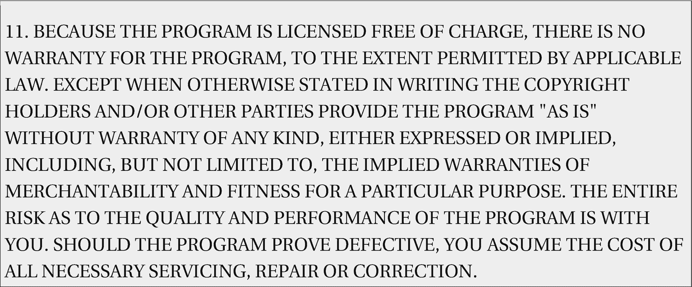

# 十六、使用开源软件

这个原则可能并不完全是你所想的那样。大多数时候，我们认为开源软件就像 Linux 内核、LibreOffice 或成千上万个开源软件包中的任何一个，它们构成了我们最喜欢的发行版。在系统管理的上下文中，开源意味着我们编写的自动化工作的脚本。

> 开源软件是任何人都可以检查、修改和增强源代码的软件。 1
> 
> — Opensource.com

引用上述内容的网页包含了对开源软件的精彩讨论，包括开源的一些优势。我建议你阅读那篇文章，并考虑它如何应用于我们编写的代码——我们的脚本。如果我们去寻找，其中的含义就在那里。这一章希望能帮助你获得一些洞察力，就像写它启发了我一样。

## 开源的定义

开源的官方定义非常简洁。opensource.org 的开源定义 2 的注释版本包含十个部分，明确简洁地定义了软件被认为是真正开源所必须满足的条件。

这个定义对于 SysAdmins 的 *Linux 哲学非常重要，所以我在这里包含了注释定义的文本。您不必阅读这个定义，但是我建议您这样做，以便更完整地理解术语“开源”的真正含义。*

### 注意

开源定义不是一个许可。它描述了任何许可证要被认为是开源许可证所必须满足的条件。

## 开源定义(带注释)

版本 1.9

下面缩进的斜体部分显示为开源定义(OSD)的注释，并不是 OSD 的一部分。没有注释的普通版本的 OSD 可以在[这里](http://www.opensource.org/docs/osd)找到。

### 介绍

开源不仅仅意味着获得源代码。开源软件的发布条款必须符合以下标准:

#### 1.自由再分配

许可证不应限制任何一方将软件作为包含多个不同来源的程序的聚合软件分发的一个组件进行销售或赠送。此类销售不需要版税或其他费用。

***基本原理:*** *通过约束许可要求免费再分发，我们消除了许可方为了获得短期收益而放弃许多长期收益的诱惑。如果我们不这样做，合作者将面临巨大的背叛压力。*

#### 2.源代码

程序必须包含源代码，并且必须允许以源代码和编译形式发布。当某种形式的产品不与源代码一起发布时，必须有一种广为人知的方法以不超过合理的复制成本获得源代码，最好是通过互联网免费下载。源代码必须是程序员修改程序的首选形式。不允许故意混淆源代码。不允许使用中间形式，如预处理程序或翻译程序的输出。

***基本原理:*** *我们需要访问未混淆的源代码，因为你不能在不修改它们的情况下进化程序。因为我们的目的是使进化变得容易，所以我们要求修改变得容易。*

#### 3.衍生作品

许可证必须允许修改和衍生作品，并且必须允许它们在与原始软件许可证相同的条款下分发。

***基本原理:*** *仅仅阅读源代码的能力不足以支持独立的同行评审和快速进化选择。为了实现快速进化，人们需要能够试验和重新发布修改。*

#### 4.作者源代码的完整性

如果许可证允许出于在构建时修改程序的目的分发带有源代码的“补丁文件”,则许可证可以限制源代码以修改后的形式分发*。许可证必须明确允许分发由修改后的源代码构建的软件。许可证可能要求衍生作品带有与原始软件不同的名称或版本号。*

***理由:*** *鼓励大量改进是好事，但用户有权知道谁对他们使用的软件负责。作者和维护者有相互的权利知道他们被要求支持和保护他们的名誉。*

*因此，一个开源* *许可* *必须保证源代码随时可用，但可能要求它作为原始基础源代码和补丁来分发。通过这种方式，可以得到“非官方的”改变，但是容易与基本源区分开来。*

#### 5.不歧视个人或群体

许可证不得歧视任何个人或群体。

***基本原理:*** *为了从过程中获得最大的利益，最大的* *多样性* *的个人和团体应该同样有资格为开源做出贡献。因此，我们禁止任何开源* *许可* *将任何人锁在进程之外。*

包括美国在内的一些国家对某些类型的软件有出口限制。符合 OSD 的许可证可以警告被许可人适用的限制，并提醒他们必须遵守法律；但是，它本身可能不包含此类限制。

#### 6.没有对努力领域的歧视

许可证不得限制任何人在特定领域使用程序。例如，它可能不限制程序用于商业，或用于基因研究。

***理由:*** *该条款的主要意图是禁止那些阻止开源被商业使用的许可陷阱。我们希望商业用户加入我们的社区，而不是感觉被排除在外。*

#### 7.许可证的分发

程序附带的权利必须适用于程序被重新分发到的所有人，而不需要这些人执行额外的许可。

***理由:*** *该条款旨在禁止通过要求签署保密协议等间接方式关闭软件。*

#### 8.许可证不能特定于某个产品

附加在程序上的权利不得依赖于程序是某一特定软件分发的一部分。如果程序是从该分发中提取出来的，并在程序许可证的条款范围内使用或分发，那么程序被再分发到的所有各方都应该拥有与最初的软件分发所授予的权利相同的权利。

***基本原理:*** *该条款排除了另一类许可证陷阱。*

#### 9.许可证不得限制其他软件

许可证不得对与许可软件一起分发的其他软件施加限制。例如，许可证不得坚持在同一媒体上发布的所有其他程序必须是开源软件。

***理由:*** *开源软件的经销商有权对自己的软件做出自己的选择。*

*是的，GPL v2 和 v3 符合这个* *要求* *。与 GPLed 库链接的软件只继承 GPL，如果它形成一个单一的作品，而不是任何软件，它们只是被分发。*

#### 10.许可证必须是技术中立的

许可证的任何条款均不得基于任何单独的技术或界面风格。

***理由:*** *该条款专门针对需要明确表示同意才能在许可人和被许可人之间建立合同的许可。要求所谓“点击包装”的规定可能与 FTP 下载、CD-ROM 选集和网络镜像等重要的软件分发方法相冲突；这样的规定也可能阻碍代码的重用。一致性许可必须考虑到以下可能性:软件的* ***(a)*** *再分发将通过不支持下载的点击包装的非网络渠道进行，并且****【b】****涵盖代码(或重复使用的部分涵盖代码)可能会在不支持弹出对话框的非 GUI 环境中运行。*

开源的定义最初来自于 [Debian 自由软件指南](https://www.debian.org/social_contract#guidelines) (DFSG)。

Opensource.org 网站内容以[知识共享署名 4 获得许可。0 国际许可证](http://creativecommons.org/licenses/by/4.0/)

## 为什么这很重要

开源的定义对我们这些系统管理员来说很重要，原因有几个。首先，这个定义为我们提供了一个评估现有的许多许可证的框架。其中一些是真正的开源许可证，而另一些只是假装开源。

真正的开源许可让我们可以轻松合法地找到、下载和使用开源代码。如果不能保证我们使用的代码是开源的，我们将无法使用大量已经满足我们许多需求的现有代码。在任何被认为是开放源代码的许可下发布的代码没有任何产权负担。理解真正的开源许可的要求可以让我们确保我们使用的代码得到适当的许可。经过适当授权的开源代码是免费提供的，我们可以在任意多的计算机上使用它，并复制给其他人。对我们如何使用或分享它没有任何限制。有许多好的但不同的开源许可证。

开放源码倡议是公认的批准开放源码许可的权威。他们的网站上有一个最新的被批准的开源许可列表。当我们将代码开源时，我们应该应用这些许可中的一个。我们还应确保我们从他人处获得的供自己使用的软件是在这些经批准的许可证之一下分发的。

## 创造了这个术语

我喜欢了解 Unix、Linux 和开源的历史，所以我认为承认克里斯汀·皮特森 4 创造了“开源”这个术语是很重要的 1998 年 2 月，Peterson 与 Eric S. Raymond、Jon "maddog" Hall 和许多其他领导人举行了一系列会议，讨论 Netscape 作为自由软件的许可问题。许多人，尤其是 Peterson，不认为“自由软件”恰当地定义了他们想要完成的目标。

她提出了“开源”这个术语，并向其他一些与会者提出了这个想法。在 2 月 5 日的一次会议上，一些与会者开始使用“开放源代码”来描述不受限制且源代码容易获得的软件。这个故事确实是她的，所以请阅读她在 Opensource.com 的文章 5 。在关于 Opensource.com 的文章结尾的评论中，Eric Raymond 证实并支持 Peterson 对这个现在无处不在的术语的诞生的解释。

## 许可我们自己的代码

我所知道的回报开源社区的最好方法之一就是通过适当的许可开源我们自己的程序和脚本，开源社区为我们提供了所有这些不可思议的程序，比如 GNU 实用程序、Linux 内核、LibreOffice、WordPress 等等。

仅仅因为我们写了一个程序，我们相信开源并同意我们的程序应该是开源代码，并不意味着它是开源的。作为系统管理员，我们确实写了很多代码，但是我们中有多少人考虑过授权我们自己的代码的问题呢？我们必须做出选择，并明确声明代码是开源的，以及在何种许可下发布。如果没有这一关键步骤，我们创建的代码就会受到专有许可证的束缚，这样社区就不能利用我们的成果。

还记得我们在第十章创建的 bash shell 模板吗？我们在代码中包含了 GPL V2 许可证头声明作为注释，我们甚至提供了一个命令行选项，可以在终端上打印许可证头。在分发代码时，我还建议我们在代码中包含整个许可证的文本副本。

我发现非常有趣的是，在我读过的所有书籍和参加过的所有课程中，没有一次有人告诉我，作为一名系统管理员，一定要对我在任务中编写的任何代码进行许可。所有这些资料都完全忽略了系统管理员也编写代码的事实。即使在我参加的关于许可的会议中，焦点也是在应用代码、内核代码，甚至是 GNU 类型的实用程序上。没有一个演示甚至暗示了这样一个事实，即我们系统管理员编写了大量的代码来自动化我们的工作，或者我们甚至应该考虑以任何方式许可它。也许你有过不同的经历，但这是我的经历。至少，这让我很沮丧；它至多激怒我。

当我们忽视许可时，我们就贬低了代码的价值。我们大多数系统管理员甚至不考虑许可，但是如果我们希望我们的代码对整个社区可用，这是很重要的。这既不是信用的问题，也不是钱的问题。这是为了确保我们的代码现在和将来都可以以最好的自由和开源的方式提供给其他人。

Eric Raymond 写道，在计算机编程的早期，尤其是在 Unix 的早期，共享代码是一种生活方式。起初，这只是简单地重用现有的代码。随着 Linux 和开源许可的出现，这变得容易多了。它满足了系统管理员合法共享和重用开源代码的需求。

Raymond 说，“软件开发人员希望他们的代码是透明的，此外，当他们换工作时，他们不想失去他们的工具包和专业知识。他们厌倦了成为受害者，受够了被生硬的工具和知识产权壁垒挫败，以及不得不重复发明轮子。” 7 这句话同样适用于系统管理员。

这让我们想到了与组织代码共享和开源相关的问题。

## 组织代码共享

作为系统管理员，我们自然倾向于共享代码。我们喜欢帮助人们，这也是我们成为系统管理员的首要原因。是的，我们中的一些人更喜欢计算机而不是人，但是我们都喜欢分享我们的代码。

许多组织不知道如何共享代码，也不知道这样做的好处。其他人已经发现了这一点，有些人甚至付钱给员工来编写开源代码。

### 筒仓很烂

作为一名系统管理员，我在许多不同的组织中工作过，我发现许多人不擅长在内部和外部共享代码。我工作过的大多数地方甚至从未想过内部共享代码，更不用说外部了。每个开发项目都是相互独立的。部门就像筒仓，又高又窄，里面有很多青贮饲料，自我封闭的领地避免与外界接触。在许多方面，他们表现得像竞争对手，而不是为同一组织工作的团队。

我总是发现很难从这些组织的其他部门获得代码。其他内部组织的 PHB 似乎总是认为我们在与他们进行某种竞争，共享代码是一场零和游戏，共享代码的人是输家。至少，这需要数周的讨论，有时还需要某种包括保密协议在内的书面法律形式。我不是说两个部门编写的商业代码可能会在外部市场中以某种方式重叠或竞争；例如，我说的是两个内部实验室组织，它们每天执行基本相同的任务。共享代码会有很大的意义，节省很多工作，而且很容易做到。

在某些情况下，编写我们自己的代码比通过官僚主义的废话获取我们已经知道可以解决问题的代码更容易。真是浪费时间！

### 开放组织和代码共享

那种导致沟通不畅的小仓库的内部组织需要被一种开放的组织所取代，这种开放的组织将至少在内部鼓励代码共享。红帽公司的首席执行官吉姆·怀特赫斯特写了一本书，书名为*《开放式组织*， 9 ，书中讨论了开放式组织的优势和品质以及如何进行转变。对于 Opensource.com，怀特赫斯特也写了一篇非常有趣的文章“欣赏开放的全部力量”，他在文章中讨论了共享的概念，“共享往往会增加它的价值，因为共享让越来越多聪明、有创造力的人得到它。如果你能和尽可能多的人分享尽可能多的东西，那么当你消除分享的限制时，这个价值实际上会增加。正如开源倡议组织所说，这意味着分享你的指令、配方、源代码，并向所有人开放，而不是限制某些人、团体或“努力的领域”

2005 年，Karl Fogel 写了一本有趣的书，《生产开源软件*——如何运行一个成功的自由软件* *项目*， 12 ，并在 2017 年推出了第二版。Fogel 详细介绍了创建开源软件的技巧、技术、法律问题以及社会和政治基础设施。这是一本有趣的书，详细介绍了创建真正开源软件的许多实际方面。它讨论了使用开源许可在内部和外部共享代码的优点。

一些组织付钱给他们的员工来写开源代码。例如，许多公司雇佣一些员工为内核编写代码，如果得到 Linus Torvalds 的批准，这些代码最终将与全世界的程序员共享。这并不总是纯粹的利他主义，因为许多这样做的公司希望让内核更好地为他们自己的软件工作。在许多情况下，这种新的或修改过的代码将使 Linux 更好地为每个人工作，Torvalds 可能会接受它进入内核源代码树。

除了内核之外，许多开源项目都得到组织的支持，这些组织理解在金钱和代码上支持开源软件的价值主张。

### 要避免的事情

这一章是关于使用开源软件的，但这意味着我们也需要区分真正的开源软件和那些有隐藏限制或根本不符合他们声称他们的软件被分发的许可的软件。令人难过的是，我们需要讨论那些错误地宣称他们的软件是开源的公司。

这也是我在本章中加入开源定义的原因之一。理解开源的目标可以帮助你理解什么时候一个许可不能满足需求。但是还有其他的事情需要小心。

如果软件供应商声明他们的软件是开源的，那么源代码应该很容易从互联网上下载。在某些情况下，我对软件很感兴趣，在浏览网站时没有发现源代码可用的迹象。在这些情况下，没有人回答我关于这个问题的询问。

如果为了下载某些软件，您需要提供您的姓名、电子邮件地址和其他识别信息，那么该软件肯定不是来自一家声誉良好的公司，即使他们声称使用开源许可证。我见过许多所谓的“免费白皮书”下载，如果它们不需要某种形式的“注册”，我会很感兴趣。我建议避开这些公司。他们可能利用开源软件的虚假或误导性承诺来建立垃圾邮件发送者的电子邮件地址列表。

## 代码可用性

用开源许可证许可代码是一回事；把它提供给其他人则完全是另一回事。我在本章开始引用的开源代码的定义意味着我们的代码必须以某种方式提供，这样任何人都可以下载和查看源代码。在本章的前一节中，我提到了像填写注册表单这样的要求表明，如果代码确实是在开源许可下发布的，那么它就是被非法限制的。

我们如何让我们的代码在开源许可下自由使用？有许多分享我们代码的好方法。我们来看一些。

### 如何共享我的代码？

既然我们的代码可以在经过批准的开源许可下发布，那么我们如何实际发布它并让其他人可以使用它呢？请注意，本章开头的开源定义并没有规定开源软件应该如何交付。

我所读到的任何东西都没有定义一个被认可的发布开源软件的机制。我读过的许可证以及我读过的关于开源软件分发的法律意见都是关于让源代码和可执行文件一起可用的。对于脚本来说，可执行文件*是源*。

分享我们的开源代码非常容易。对我来说，当我安装了一些我写的脚本，以减轻我为客户和朋友建造或维修的计算机上的系统管理任务时，它就开始了。然后我开始把我的一些脚本放到 u 盘上，这样我就可以把它们给别人了。并不是说我做了很多。我有一些客户，但没有多少人对一些 bash 脚本感兴趣。比起我的脚本，更多的人对 Fedora 的现场 DVD 或 USB 驱动器感兴趣。

下一步是让脚本可以从互联网上下载，我已经用我的完成了。为了让这些脚本更广泛地可用，我已经将它们发布在我的技术网站上，Linux 的数据手册， 13 at [`http://www.linux-databook.info/?page_id=5245`](http://www.linux-databook.info/?page_id=5245) 。您可以下载它们，并在您认为合适的时候使用它们。代码全部在 GPL V2 下发布，PDF 文档在知识共享署名-共享许可下发布。

使用 SourceForge 14 和 GitHub 等开发者协作网站也是合适的。这些网站允许其他人轻松下载你的代码，以便参与开发。它们提供版本管理，并允许您作为主要开发人员只合并您认为合适的代码。

我曾经在我的一个项目中使用过 SourceForge，但是那个项目已经死了很久，并且已经被另一个项目取代了。像 SourceForge 和 GitHub 这样的网站的优势之一是，当当前的首席开发人员决定离开时，他们可以让其他人轻松接管项目。这就是我领导的项目所发生的事情。我从另一个需要把时间花在其他项目上的开发人员那里接管了它。

### 代码共享注意事项

关于共享您的代码，有几件重要的事情需要考虑。我将在这里简单地谈一谈。重要的是你意识到了它们，并能得到更多你需要的信息。

#### 机密

保密是许多人关心的问题，这是理所当然的。意图保密的数据或代码可能会在开源软件中暴露。

当然，隐藏据称是机密或商业秘密的代码会使整个程序成为专有程序。如果你从一个程序中删除你的代码并隐藏它，那么从开源的角度来看，整个程序都是无用的。要成为真正的开源，你必须坚持到底。所有代码要么开放，要么不开放。

数据完全是另一种野兽。Eric Raymond 的分离法则 16 论述了政策与执行的分离。这意味着程序的用户界面，也就是实现策略的地方，应该与程序中实现机制的部分分开。这使得使用文本模式或 GUI 界面以及在不改变程序底层逻辑的情况下改变这些界面成为可能。

我们也可以将这种分离规则应用于程序所使用的数据。数据永远不应该作为程序的一部分存储，尽管我看到过这样做。我自己也犯了这个错误。

作为一种良好的编程形式，程序使用的数据必须与程序代码分开。这确保了当数据所涉及的外部事物发生变化时，数据本身很容易被改变。即使使用脚本，配置数据也应该与组成程序逻辑的代码分开维护。使用单独的配置文件使不熟练的用户可以进行修改，而不用担心损坏代码本身。

数据与程序的分离也意味着没有必要分发任何可能与代码本身一起保密的数据。

#### 提供支持

当我分发我的代码时，有人发现了一个 bug，会发生什么？我有义务修理它吗？我有必要回答使用我的软件的人的问题吗？

这些问题的答案是“不”。我们没有任何义务支持我们提供的开源代码。为什么呢？因为开源许可——至少我使用的 GPL V2 17 明确声明没有保修。

图 16-1

我使我的脚本可用的 GPL V3 包含了这样一个条款，它清楚地表明代码没有隐含或明确的保证(原文是大写的。)

如果你在 opensource.org 阅读各种批准的许可证，你会发现他们都有类似的措辞。然而，尽管许可证中有声明，我们大多数人都希望我们的代码能为任何获得它的人工作——也包括我们自己。所以我们修复任何出现的问题，因为这对我们和我们的用户都有好处。

像 Red Hat 这样的公司，以及像 Document Foundation、 18 这样负责 LibreOffice 办公程序套件的实体，都有支持结构、bug 和问题报告程序，以及帮助解决使用问题并提供指导和支持的志愿者。

## 离别的思绪

使用其他人创造的开源软件是重要的，但是我并不是建议我们完全放弃使用专有软件，当它满足了一个无法满足的需求时。我的意思是，在广泛的谷歌搜索未能找到合适的开源软件后，我们考虑专有软件，然后探索编写一个脚本来执行该任务的可能性。

如果你选择写一个脚本来解决问题，开源你自己的代码。将它提供给其他人，因为如果您需要执行此任务，其他人也需要这样做。您将为他人节省您在创建脚本时投入的工作。

远离总是在已经有可用的东西时编写自己的代码的陷阱。我们可以编写自己的基于网络的内容管理或博客软件，但是已经有很多这样的软件了。WordPress、Drupal、Joomla、Plone、OpenCms、Mambo 以及更多的工具已经可以使用，这比你自己编写要简单得多。如果您需要的某个部分还不可用，那么为您选择的任何一个编写一个插件。

可以的话用别人写的开源软件；剩下的时间写别人能用的开源软件。

<aside class="FootnoteSection" epub:type="footnotes">Footnotes 1

Opensource.com，*什么是开源？*、[、`https://opensource.com/resources/what-open-source`、](https://opensource.com/resources/what-open-source)

  2

*【opensource.org】【开源定义(注释)】*[`https://opensource.org/osd-annotated`](https://opensource.org/osd-annotated)

  3

开源倡议，*许可， [`https://opensource.org/licenses`](https://opensource.org/licenses)*

  4

维基百科，*【Christine Peterson】*， [`https://en.wikipedia.org/wiki/Christine_Peterson`](https://en.wikipedia.org/wiki/Christine_Peterson)

  5

彼得森、克里斯汀、Opensource.com、*我是如何创造出‘开源’这个术语的*、 [`https://opensource.com/article/18/2/coining-term-open-source-software`](https://opensource.com/article/18/2/coining-term-open-source-software)

  6

Eric s . raymond，*Unix 编程的艺术*，Addison-Wesley (2004)，380，ISBN 0-13-13-142901-9。

  7

同上。

  8

Opensource.com，*什么是开放组织*，[，`https://opensource.com/open-organization/resources/what-open-organization`，](https://opensource.com/open-organization/resources/what-open-organization)

  9

吉姆·怀特赫斯特，*《开放组织*》，哈佛商业评论出版社(2015 年 6 月 2 日)，ISBN 978-1625275271

  10

*Opensource.com，* [`https://opensource.com/open-organization/16/5/appreciating-full-power-open`](https://opensource.com/open-organization/16/5/appreciating-full-power-open)

  11

参见本章中的*带注释的开源定义*。

  12

Fogel，Kark，*生产开源软件， [`https://producingoss.com/en/index.html`](https://producingoss.com/en/index.html)*

  13

双双，*， [`http://www.linux-databook.info`](http://www.linux-databook.info)*

*  14

[`https://sourceforge.net/`](https://sourceforge.net/)

  15

[`https://github.com/`](https://github.com/)

  16

Raymond，*Unix 编程的艺术*，15–16 页。

  17

开源倡议，许可证–GPL V2， [`https://opensource.org/licenses/GPL-2.0`](https://opensource.org/licenses/GPL-2.0) ，第十一部分。

  18

[`https://www.documentfoundation.org/`  文档基础】](https://www.documentfoundation.org/)

 *</aside>