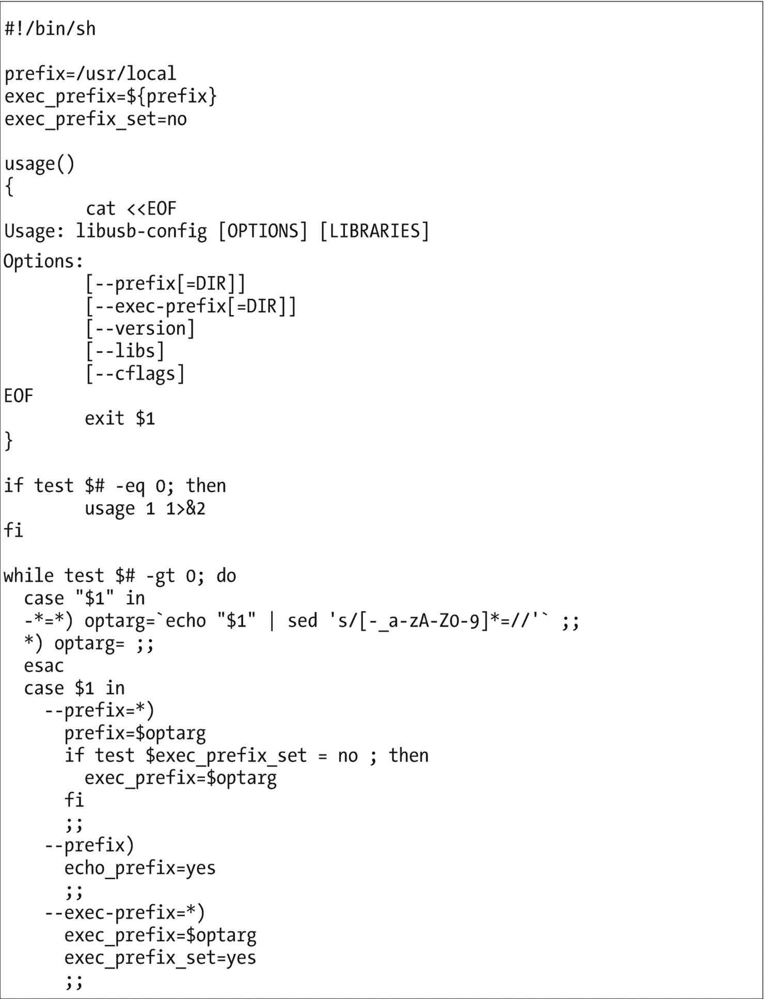
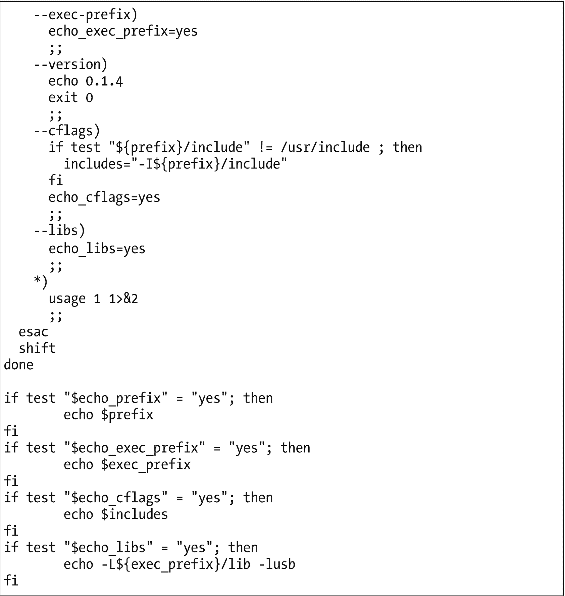

# 十八、力求简单

> UNIX *基本上是一个简单的操作系统，但是你必须是一个天才才能理解这种简单性。* <sup>1</sup>
> 
> —丹尼斯·里奇

我绝不会屈尊不同意 Unix 的创造者之一。然而，自从我开始使用 Unix 和 Linux 以来，我自己的观点已经发生了变化。Linux 哲学的原则帮助我巩固了我对这样一个事实的理解，即 Linux 是简单的，并且这种简单是由哲学所阐明的。

本书中的许多原则相互交叉并相互加强。我毫不怀疑你已经开始自己看到了这一点。在第十七章中，我讨论了优雅，但有一件事我没有列出，那就是简单，尽管它在书中顺便提到了。我相信简单的概念应该在*系统* *管理员*的 Linux 哲学中有自己的一章。

在这一章中，我们寻找 Linux 的简单性。

## 数字的复杂性

是的，GNU/Linux 表面上很复杂。据我所知的一本书， *Linux 简而言之*、<sup>、、2 、</sup>包含了 372 个 Linux 命令的列表。是的，我数过了。另一本书，我最喜欢的初学者的书，*Linux、命令、编辑器和 Shell 编程实用指南*， <sup>3</sup> 涵盖了“… 98 个实用程序…”。

但是这些数字与我想出的另一个数字相比是微不足道的。实验 1 展示了一种估计 Linux 计算机上命令总数的方法。大多数作为命令行命令的可执行文件都位于/usr/bin 目录中，因此计算该目录中文件的数量是一个非常好的估计。

### 实验 18-1

以学生用户的身份执行此实验。确定/usr/bin 中有多少可执行文件。

```sh
[student@testvm1 ~]$ ls  /usr/bin | wc -w
2635

```

是的，这是一大堆命令。当然你看到的数字会不一样。我的技术审查人员本·科顿告诉我，他的笔记本电脑上的/usr/bin 中有 1，992 个文件。您可以看到，根据您拥有的发行版和已安装的软件包，会有一个范围。

我用来创建和测试这些实验的测试虚拟机是一个非常基本的安装，带有 KDE 和 MATE 桌面以及一些应用，如 LibreOffice。该虚拟机有 2，633 个可执行 Linux 文件，其中大部分是 CLI 命令。对于刚刚学习 Linux 的人来说，这些数字看起来太多了。我刚开始做系统管理员的时候，他们就是这么对我的。

大约在 1996 年或 1997 年，当我刚开始学习 Linux 的时候，我拿起了几本关于 Linux 的书——当时并没有那么多可用的——并且发现了当时对我来说难以想象的大量命令。我认为我不可能学会所有这些命令。

当我看到标题为“您将实际使用的 77 个 Linux 命令和实用程序”， <sup>4</sup> 和“50 个最常用的 UNIX / Linux 命令(带示例)”的文章时，我感到很害怕这些标题暗示着你必须记住一些命令，或者知道大量的命令是很重要的。

我确实读过许多这样的文章，但是我通常寻找新的和有趣的命令:可以帮助我解决问题或简化命令行程序的命令。

## 简单的基础

虽然我妈妈认为我是个天才，但我真的不是。但是我很执着。我从来没有尝试去学习所有的 Linux 命令，不管你会想出多少个“所有”的总数。

我只是开始学习在任何给定的时刻，无论手头有什么项目，我都需要的命令。我开始学习更多的命令，因为我接受个人项目和工作项目，这些项目将我的知识延伸到极限，并迫使我找到以前我不知道的命令，以完成这些项目。随着时间的推移，我的命令越来越多，在解决问题时，我越来越熟练地应用这些命令。我开始寻找报酬越来越高的工作，让我玩我最喜欢的玩具 Linux。

随着我对管道和重定向、标准流和标准 I/O 的了解，以及对 Unix 哲学和 Linux 哲学的了解，我开始理解命令行是如何以及为什么让 Linux 和核心实用程序变得如此强大。我学到了编写命令行程序的优雅之处，这些程序以惊人的方式操纵数据流。

我还发现，有些命令即使没有完全过时，也很少使用，而且只在不寻常的情况下使用。仅仅因为这个原因，找到一个 Linux 命令列表并记住它们是没有意义的。作为一名系统管理员，学习许多可能永远都不需要的命令并不是对时间的有效利用。

这里的简单性是了解你需要什么来完成手头的任务。将来会有大量的任务需要您学习其他命令。当你需要的时候，总有办法发现和学习这些命令。我发现在需要的时候发现和学习新的命令对我来说非常有效。几乎任何新项目，包括写这本书，都会导致寻找新的命令来学习。

## 永无止境的简化过程

然而，仅仅因为一个解决方案有效并不意味着你应该停止寻找更好的方法。系统管理员的一个共同特点是，我们总是在寻找更好的方法来做我们已经在做的事情。有时我发现一个我以前不知道的命令，我意识到它比我已经用来完成任务的一个、两个或更多的命令更合适。

在我十多年前编写的一个程序中，我在一个管道中使用了一系列以`dmidecode`开头的命令来确定系统的硬件架构是 32 位还是 64 位。这很麻烦，但大部分工作。我后来发现了一个 Linux 命令，`arch`，它可以完成以前需要几个命令才能完成的工作。我修改了我的剧本；结果没有改变，但是程序更简单、更高效、更优雅。

简单与性能或效率无关——至少没有直接关系——它更关乎优雅。通过简化，我的程序变得更有效率，性能也提高了。这就是优雅。

简单是一个永无止境的过程。它从未停止，因为我总是在学习新的东西和新的方法来应用我已经知道的东西。

## 简单的程序做一件事

我们大多数直接与计算机打交道的人确实喜欢找乐子。早期的计算机程序员也不例外。他们写了大量的程序，让我们都有一些严肃的乐趣。我们极客也只是想找乐子！

大约在 1970 年，我是俄亥俄州托莱多一家小公司的夜间电脑操作员之一。在所有真正的工作完成之后，我们将在 IBM 1401 大型机上获得一些乐趣。我们会玩像井字游戏这样的游戏，或者打印不应该在这里复制的 ASCII 艺术页面。井字游戏很有趣，但在那台旧电脑上玩也很有趣，也很有挑战性。计算机总是将第一步棋作为“X ”,并在一张计算机纸上打印出最终的 3×3 矩阵。人类玩家必须打开前面板上的一个感应开关来指示他们想要放置“O”的方块的号码，然后按下一个按钮来告诉计算机继续运行程序。那些是美好的旧时光。

早期的 Unix 程序员给了我们一些有趣的东西，比如 adventure、fortune 和 cowsay。最后两个可以用来说明简单性。这种简单性是因为这两个程序都被设计为只做一件事。fortune 程序将随机的运气打印到 STDOUT，cowsay 从 STDIN 获取文本字符串，并将它们显示在一只卡通牛的语音气球中。

使用您的软件包管理器安装 fortune 和 cowsay，因为它们不太可能已经安装在您的计算机上。在 Fedora 的当前版本上，它们是“fortune-mod”和“cowsay”。对于 Fedora 和其他发行版的早期版本，您可能需要使用“fortune”作为包名。

### 实验 18-2

安装 fortune-mod 和 cowsay，以防它们还没有安装。以 root 身份做这部分实验。

```sh
[root@testvm1 ~]# dnf -y install fortune-mod cowsay

```

本实验的其余部分应该以学生用户的身份进行。现在运行几次 fortune 命令来查看结果。

```sh
[student@testvm1 ~]$ fortune
Vulcans believe peace should not depend on force.
-- Amanda, "Journey to Babel", stardate 3842.3

```

我承认在这个特殊的结果显示出来之前，我尝试了几次。如果您想检查，现在/usr/bin 中可能还有一两个文件。

没关系——继续玩一会儿财富程序吧。

完成了吗？那么让我们继续和考赛玩吧。cowsay 程序需要一个文本串作为输入，所以做实验 18-3 中所示的事情。cowsay 获取文本字符串并将其放入奶牛的语音气球中。看起来很傻，但它会让人上瘾。只是当你使用它的时候，要小心谁在你身后看着你。

### 实验 18-3

让我们单独尝试一下 cowsay 程序。

```sh
[root@testvm1 ~]# cowsay hello world!
 ______________
< hello world! >
 --------------
        \   ^__^
         \  (oo)\_______
            (__)\       )\/\
                ||----w |
                ||     ||

```

这个玩一会儿也是可以的。我可以看到有人可能在 shell 程序中使用 cowsay 而不是 echo 来打印消息，但是 cowsay 不维护原始消息文本的列格式；它只是把所有东西混在一起。

我们有两个小程序，每个程序只做一件事。让我们把它们放在一起，利用 cowsay 程序在 STDIN 上接受输入这一事实。实验 18-4 展示了如何做和结果。在这里，我不得不再次承认，为了得到这个结果，我运行了几次程序，但这是其中一次运行的真实输出。

### 实验 18-4

从`fortune`到`cowsay`的管道输出。

```sh
[student@testvm1 ~]$ fortune | cowsay
 ________________________________________
/ But I have a holy crusade. I dislike   \
| waste. I dislike over-engineering. I   |
| absolutely detest the "because we can" |
| mentality. I think small is beautiful, |
| and the guildeline should always be    |
| that performance and size are more     |
| important than features.               |
|                                        |
\ - Linus Torvalds on linux-kernel       /
 ----------------------------------------
        \   ^__^
         \  (oo)\_______
            (__)\       )\/\
                ||----w |
                ||     ||

```

将两个简单的程序结合起来，每个程序都很小，每个程序都做一件事，这样就可以创建更复杂的程序。我也花了一段时间才得到这个结果。拼写错误在原文中。

fortune 和 cowsay 都有简单的接口，他们都执行一个单一的任务，他们做得很好，他们使用 STDIO。它们都有一些命令行选项，可以用来稍微修改它们的行为，但是一旦你像实验 18-4 中所示的那样一起使用它们，就没有什么其他的东西可以学习了。如果您想了解他们为数不多的命令行选项，可以查看他们的手册页。

## 简单的程序很小

为了看看这两个程序有多小，请运行实验 18-5 中的命令来查找信息。两个都不是很大。小程序易于理解和维护。

### 实验 18-5

这个命令让我们找到`cowsay`和`fortune`程序的大小。

```sh
[student@testvm1 ~]$ ls -l `which cowsay` `which fortune`
-rwxr-xr-x 1 root root  4460 Nov 20 11:20 /usr/bin/cowsay
-rwxr-xr-x 1 root root 28576 Aug  2 19:54 /usr/bin/fortune

```

这些程序之所以小，是因为它们都只做一件事。向这些程序中的任何一个添加更多的功能都会显著增加它们的大小，并使它们更难维护。此外，这有什么意义呢？这两个程序是完美的，因为它们都符合为它们设置的要求。

现在以同样的方式考虑其余的 GNU/Unix/Linux 实用程序。这个`ls`程序应该完成什么？它唯一的功能是列出一个目录中包含的文件，记住目录本身就是文件。它可以通过使用一个或多个选项，或者根本不使用选项，以多种不同的方式完成这项任务。

如果没有选项，`ls`命令只列出当前目录(PWD)中的非隐藏文件名，并且在每行输出中列出尽可能多的文件名。l 选项是一个很长的列表，在一个易于阅读的漂亮的柱状列表中显示了文件的权限、大小和其他数据。-a 选项显示所有文件，包括隐藏的文件。r 选项列出文件，递归遍历每个子目录，并列出每个子目录中的文件。如果没有参数，`ls`命令会列出 PWD 中的文件。使用不同的目录路径作为参数，它可以列出其他目录中的文件。该参数的其他变体允许您列出特定的文件。

`ls`实用程序有许多其他有趣的选项和参数变体，可以与它一起使用。阅读`ls`的手册页，查看所有的可能性。

注意，文件 globbing 是由 shell 而不是由`ls`命令处理的。因为 shell 为所有以文件名作为参数的程序和脚本处理文件 globbing，所以这些程序都不需要这样做。shell 将与 globs 匹配的文件名扩展到程序和脚本操作的文件列表中。这也是简单。为什么要在每个程序中包含文件打包功能，而它只需要在一个地方，即 shell 中。

关于`ls`实用程序，您应该注意的是，每个选项、每个参数变化都有助于生成文件列表。就是这样——这就是它所做的一切，列出文件。这就是它的简单之处，它只做一件事，而且做得很好。给这个程序增加更多的功能是没有意义的，因为它不需要这些功能。

## 简单和哲学

> 起初我希望这样一个技术上不健全的项目会失败，但我很快意识到它注定会成功。只要有足够的决心，软件中的几乎任何东西都可以实现、出售甚至使用。一个单纯的科学家说什么都无法抵挡一亿美元的洪流。但是有一种品质不能用这种方式买到，那就是可靠性。 ***可靠性的代价是追求极致的简单性。*** *这是非常富有的人最难支付的价格。* <sup>6</sup>
> 
> — C. A. R. Hoare， <sup>7</sup> 写关于编程语言 PL/I <sup>8</sup> (重点是我的。)

我遇到的许多更有趣的软件问题都涉及到现有代码的简化——尤其是我自己的代码。给程序增加新的功能会增加它的复杂性。一个快速的新特性被添加到现有的代码中，并被用来满足最后期限，这增加了复杂性。

最难做的事情之一是降低代码的复杂性。但从长远来看，这是有回报的。

### 简化我自己的程序

我自己编写的一个程序，一个 bash shell 脚本，在一个基本的 Fedora 安装程序不止一次失控后，我编写它来执行许多任务。我已经在第九章“自动化一切”中提到了这个后安装程序但现在我需要讨论它的阴暗面。

由于 Fedora 版本之间的变化，程序的需求也发生了变化。需要修改程序来安装一些在默认安装过程中不再安装的软件包。有时我需要添加代码来删除自动安装的包，因为我不想要或不需要它们。

添加新代码来做这些事情增加了程序的复杂性。在某些情况下，当程序初始化时，我添加了更多的选项进行评估，以便我的选项保持开放——可以说——关于我的程序所需的更改。经过几年的时间，这个项目变得很大，资金也很充足。我最近花了一些时间使用`shellcheck`实用程序和我自己对代码的观察来删除 cruft——大部分是未使用和不再需要的过程——这将代码的大小减少了几百行。

## 简化他人的程序

谈论我如何修复别人的代码总是更有趣。我过去的一项咨询工作涉及到对一组现有的 Perl 程序进行几乎完全的重写。在一台小型英特尔服务器上运行着大约 25 个这样的程序。由于杂乱的代码和缺乏注释，维护这些程序来添加新功能、定位和修复错误变得不可能了。我被分配的任务是修复这些程序的缺陷，并给它们增加一些额外的功能。

当我开始尝试理解复杂得吓人的代码时，很明显我的首要任务是简化代码。在对代码进行了大量的注释并修复了一些错误之后，我开始收集一些已经被插入到两个或更多程序中的代码，并将它们收集到 Perl 库中。这使得修复问题变得更加容易，因为它们只需要在一个地方修复——库。我理顺了其他代码，简化了常见的执行路径。

修改后的程序更快，更小，更容易维护。问题可以在几小时和几分钟内找到并解决，而不是几天。

### 未注释的代码

我翻遍了我的个人档案，找到了图 18-1 中的代码。我根本不知道它是从哪里来的。我不知道为什么我还留着它。它没有任何评论。少数几个变量名的长度不仅仅是几个字符，但是它们几乎没有告诉我们程序的目的或者它应该如何工作。

即使是图 18-1 中的“用法”程序——显然是“帮助”功能——也不是特别有用，因为它只显示了一点关于用法语法的内容，实际上仍然没有说明程序的目的。嗯——除了程序名。这表明它可能与 USB 库有关。这是可以理解的吗？我不这么认为。我花了不少时间想弄明白。

 

图 18-1

这段代码是做什么的？

我看到的几个变量在第二个 case 语句中被赋值，然后用于确定通过底部的一系列 if 语句的流程。事实上，可以通过删除所有 if 语句并将 echo 语句移到 case 语句的匹配部分来重构这段代码，使之更简单。这将消除代码中对这些变量的需求。

我将这个脚本复制到一个虚拟机上，用不同的选项组合尝试了几次。结果如图 18-2 所示，并没有太多启发性。


图 18-2

运行这个程序的结果也没有帮助

一点也不像蹩脚的代码。在不知道这段代码应该做什么的情况下，我该如何修复它呢？看起来**这段代码可能只是一个测试，或者是某个更大的脚本的开始，打算做些什么。这段代码的真正问题在于，它需要花费宝贵的时间来发现它显然没有做任何有用的事情。**

 **我最终使用了下面实验 18-6 中显示的`dnf`命令，发现这个脚本是 USB 开发库的一部分。我不知道它是如何出现在我的个人~/bin 目录中的。

### 实验 18-6

可以使用`dnf`命令定位到为其配置主机的某个存储库中的 RPM 包中的文件。

```sh
[root@david ~]# dnf whatprovides *libusb-config
Last metadata expiration check: 2:10:49 ago on Sat 24 Feb 2018 01:50:16 PM EST.
libusb-devel-1:0.1.5-10.fc27.i686 : Development files for libusb
Repo        : fedora
Matched from:
Other       : *libusb-config

libusb-devel-1:0.1.5-10.fc27.x86_64 : Development files for libusb
Repo        : fedora
Matched from:
Other       : *libusb-config

```

我们现在知道哪个 RPM 包提供了这个文件，所以让我们看看这个包是否安装在我们的主机上。

```sh
[root@david ~]# dnf list libusb-devel
Last metadata expiration check: 2:11:35 ago on Sat 24 Feb 2018 01:50:16 PM EST.
Available Packages
libusb-devel.i686         1:0.1.5-10.fc27                 fedora
libusb-devel.x86_64       1:0.1.5-10.fc27                 fedora

```

这些 rpm 是可用的，这意味着它们尚未安装。

在这种情况下，结果表明该脚本来自一个没有安装在我的主机上的 RPM。因为它是一个开发包，所以我也不太可能自己安装它。底线是我可以删除这个脚本，因为——至少对我来说——它是 cruft。

当然，这也是系统管理员工作的一部分。在执行一些需要的任务的脚本中找到这些无用的脚本，并去掉它们。它还包括在有用的脚本中找到无用的变量、永远不会被执行的代码行和其他垃圾，并将其删除。识别和清除积垢需要时间和一定程度的投入。

## 五金器具

我们已经在第十七章“追求优雅”中谈到了一些硬件在讨论简单性时，这也是一个合适的话题。毕竟，硬件是软件运行的引擎。

如今硬件并不是特别复杂。有标准的主板尺寸，ATX，迷你 ATX，微型 ATX，和扩展 ATX。大多数台式和塔式计算机机箱都是标准化的，可以接受这些尺寸中的任何一种，除了扩展 ATX。

稍加研究，就有可能买到与市场上任何标准主板兼容的 CPU 和 RAM 内存 DIMMs。GPU、SATA 和 USB 插入式适配器等其他适配器通过标准主板通用的标准化 PCI Express 总线实现。

电源是标准化的，并且都适合专门分配给它们的空间。唯一真正的区别是它们能够提供的总功率瓦数。电源连接器及其提供的电压早已标准化。

USB 和 SATA 连接器使得将设备从硬盘连接到鼠标变得非常简单和快速。在当今情况下，硬盘等设备都是标准尺寸，很容易放入为其设计的空间中。

我确实说过如今硬件并不特别复杂，但严格来说这并不正确。在主板、机箱、适配器、电源等等宏观层面上，确实如此。但是这些装置在微米和纳米水平上都变得更加复杂。随着芯片变得越来越小、越来越复杂，它们包含了越来越多的必要逻辑，使最终用户的生活变得更简单。

也许在 80 年代早期，当最初的 IBM 个人电脑首次发布时，你还不在。集成电路(IC)可能只包含现在的一小部分组件，而且它们的运行速度也只是我们现在认为理所当然的速度的一小部分，更不用说那些超频人群可以达到的速度了。

1981 年，英特尔 8088 单核 CPU 在 33 平方毫米的面积上容纳了 29，000 个晶体管。<sup>10</sup>10 核酷睿 i7 Broadwell-E 是维基百科页面脚注 10 中列出的最新英特尔 I 系列处理器，在 246 平方毫米中包含 32 亿个晶体管。这是仅 7.5 倍面积内晶体管数量的 11 万多倍。所有这些额外的能力使得在 CPU 内部完成过去手工完成的复杂任务成为可能。

在早期，集成电路比较简单，晶体管也少得多。跳线插针和 DIP 开关是配置硬件的常见和令人困惑的方式。现在，我可以将计算机引导至 BIOS 配置模式，并在 GUI 环境中进行更改。但是在大多数情况下，甚至这也不是必需的，因为硬件和操作系统几乎都是自己配置的。

## Linux 和硬件

今天的 Linux 为配置硬件带来了惊人的简单性。大多数时候不需要用户干预。过去，Linux 用户经常需要为某些硬件安装设备驱动程序。现在，Linux 几乎总是为我们做所有的工作。

在第五章中，我们看了 Udev 守护进程及其机制，它使 Linux 能够在引导时识别硬件，并在引导后的任意时间热插拔硬件。让我们看一下当新设备连接到主机时会发生什么的简化版本。我在这里规定主机系统已经在 multi-user.target(运行级别 3)或 graphical.target(运行级别 5)上启动并运行。

1.  用户插入新设备，通常是外部 USB、SATA 或 eSATA 连接器。

2.  内核检测到这一点，并向 Udev 发送一条消息来宣布新设备。

3.  基于设备属性及其在硬件总线树中的位置，Udev 为新设备创建一个名称(如果还不存在的话)。

4.  Udev 系统在/dev 中创建设备专用文件。

5.  如果需要新的设备驱动程序，它会被加载。

6.  设备已初始化。

7.  Udev 可以向桌面发送通知，使得桌面可以向用户显示新设备的通知。

将新硬件设备热插拔到正在运行的 Linux 系统并使其准备就绪的整个过程非常复杂——对于操作系统而言。对于只想插入新设备并让它工作的用户来说，这非常简单。这极大地简化了最终用户的工作。对于 USB 和 SATA 硬盘、USB 拇指驱动器、键盘、鼠标、打印机、显示器和几乎任何其他东西，作为用户，我需要做的只是将设备插入适当的 USB 或 SATA 端口，它就可以工作了。

## 困境

对我来说，最终目标是让最终用户尽可能地简单。我们不能忘记，我们系统管理员也是最终用户。我更喜欢完成实际工作，而不是花几个小时摆弄一个新设备，只是为了让它工作。那是旧的做事方式。但是这种新的做事方式将复杂性从等式的人的一面转移到了软件的一面。并且硬件复杂性的成倍增加也增加了软件的复杂性。

所以我们的困惑是，一方面我们被告知我们的程序应该简单，但另一方面我们应该将复杂性转移到软件中或者完全摆脱它。希望用户不需要处理它。

调和复杂性和简单性之间的矛盾是开发人员和系统管理员的任务。我们为“自动化一切”而创建的程序和脚本确实需要尽可能简单。但是他们还需要能够执行手头的任务，以便尽可能简化最终用户的任务。

> 计算机不可靠，但人类更不可靠。
> 
> —吉尔布不可靠性定律

当您作为系统管理员工作了一段时间后，前面那句话的真实性就显而易见了。在某些时候，我们的用户总会找到一种方法去做一些意想不到的事情，这将比我们在程序和脚本中可能做的任何事情造成更大的破坏和混乱。这意味着我们的目标必须是遵循编写小程序的基本原则，每个小程序都做好一件事，并使用 STDIO 进行交互。

让我们不要忘记最大的讽刺——我们系统管理员也是人，至少现在是这样——这使我们成为自己脚本的用户。我发现作为一名系统管理员，作为一名用户，我是自己最大的噩梦。如果我写脚本来处理我知道我会犯的粗心错误，它们将是相当可靠的。我确保我的脚本尽可能的可靠，我尽可能的简化它们，并继续努力进一步简化它们。

## 最后一句话

> *愚者忽视复杂性；实用主义者深受其害；专家回避；天才移除它。*
> 
> —艾伦·珀利斯<sup>11</sup>

<aside class="FootnoteSection" epub:type="footnotes">Footnotes 1

azquotes.com， [`http://www.azquotes.com/quote/246027?ref=unix`](http://www.azquotes.com/quote/246027?ref=unix)

  2

Siever，Figgins，Love & Robbins，*第六版* (O'Reilly，2009)，ISBN 978-0-596-15448-6。

  3

Sobell，*Linux、命令、编辑器和 Shell 编程实用指南，第三版* (Prentice Hall，2013)，ISBN 978-0-13-308504-4。

  4

TechTarget.com， [`http://searchdatacenter.techtarget.com/tutorial/77-Linux-commands-and-utilities-youll-actually-use`](http://searchdatacenter.techtarget.com/tutorial/77-Linux-commands-and-utilities-youll-actually-use)

  5

[`http://www.thegeekstuff.com/2010/11/50-linux-commands/?utm_source=feedburner`](http://www.thegeekstuff.com/2010/11/50-linux-commands/?utm_source=feedburner) 极客的玩意儿

  6

维基百科配额， *C .A.R.Hoare* 、 [`https://en.wikiquote.org/wiki/C._A._R._Hoare`](https://en.wikiquote.org/wiki/C._A._R._Hoare)

  7

维基百科，*托尼·霍雷*， [`https://en.wikipedia.org/wiki/Tony_Hoare`](https://en.wikipedia.org/wiki/Tony_Hoare)

  8

维基百科，??/I，??，??，??，??

  9

更多信息请参见第二十章“记录一切”。

  10

维基百科，*晶体管计数*，[，`https://en.wikipedia.org/wiki/Transistor_count`](https://en.wikipedia.org/wiki/Transistor_count)

  11

维基百科，*阿兰·珀尔利斯*， [`https://en.wikipedia.org/wiki/Alan_Perlis`](https://en.wikipedia.org/wiki/Alan_Perlis)

 </aside>**