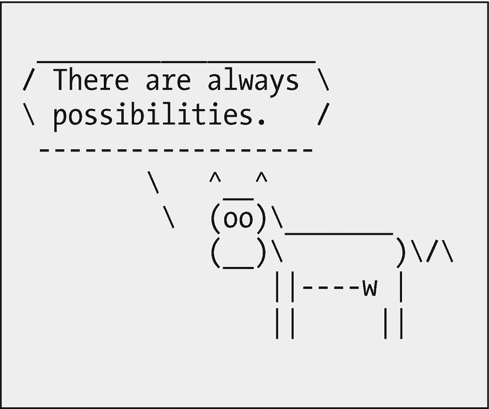

# 二十三、没有应该

直到我开始写这本书，尤其是关于我为 Opensource.com 创作的竞赛的部分，这才真正成为我的信条之一。当我在写这一节的时候，我突然意识到我已经不止一次地使用了“没有应该”这个短语。我甚至在第二章中简单地讨论过它，所以我开始以一种新的方式思考这个问题，并决定它真的应该成为一个信条。

这个原则是关于可能性的。这也是本书所有章节中最具禅意的一章。它更多的是关于我们的大脑如何工作来解决问题，而不是特定的技术。这也是关于克服或至少认识到一些阻碍我们充分利用自身潜力的障碍。

## 总是有可能的

本书涵盖的每一个原则都揭示了一些关于 Linux 的基本事实，以及作为一名系统管理员，您可以如何与之交互。我并不是说这些事实是关于你“应该”如何与 Linux 交互的。在 Linux 中没有“应该”

在《卡恩之怒》中，斯波克说，“凡事皆有可能。”有了 Linux，总是有各种可能性——有许多方法来处理和解决问题。这意味着您可能以一种方式执行任务，而另一个系统管理员可能以另一种方式执行。没有一种“应该”完成任务的方法。只有你做这件事的方式。如果结果符合要求，那么达到要求的方式就是完美的。

我在第四章“转换数据流”的“管道挑战”一节中提供了一个很好的例子来自世界各地的 80 多名系统管理员提交了他们对我在 Opensource.com 竞赛中提出的一个问题的解决方案。一些解决方案非常接近相同，但是没有两个是完全相同的，许多是非常不同的。每个系统管理员都有一个独特的、创造性的解决方案来满足竞赛的要求。

一个单一的问题，在面对如此多不同的人时，怎么会产生如此广泛的解决方案呢？这里有两个因素在起作用。这是因为乍一看，Linux 表面上的复杂性实际上是其难以置信的灵活性。这个特定问题的许多不同解决方案是 Linux 系统管理员可以使用的许多不同命令和实用程序的直接结果。

第二个因素是，哪些 Linux 系统管理员通过许多不同的方式学习了 Linux，而我们的体验是如此不同。也正是这些经历让我们认识到，Linux 和开源软件不受限制的特性让我们对操作系统有了更充分的理解和推理。即使使用完全相同的命令，我们也可以找到不同的方法来解决手头的问题。

## 释放力量

我读到和听到很多人谈论“利用……的力量”，不管他们今天在宣传什么。这些都是多次营销活动。许多自助大师谈论驾驭心灵的力量，或“内在的力量”，尽管“内在的力量”从来没有确切的定义，也没有被提及。

我在谷歌上搜索了“驾驭 Linux 的力量”,找到了大约 14 篇关于这个短语的文章。我谷歌了一下“释放 Linux 的力量”，得到了六个结果。这对我说明了一个问题的角度。当我们谈论驾驭某物的时候，我们暗示我们想要包含某物或者把它置于控制之下；当我们谈论释放某物时，我们是从释放它的角度来思考的。

在某些方面，这是关于语义的 1 ，因为语义是我们如何思考的指示。语义学是对意义的研究，它考虑诸如词语选择及其对意义的影响。我们使用的词语对说话者或作者来说有不同于听者和读者赋予它们的意义。我认为在计算领域，尤其是在 Linux 领域，选择“释放”与“利用”是很有启发性的。

我非常不科学的观察让我得出了这样一个理论:我们这些 Linux 系统管理员倾向于更多地考虑“释放”或“释放”Linux 的力量。我相信，我们 Linux 系统管理员在解决 Linux 问题时，比那些似乎更多地考虑“利用”和“限制”的人对我们的思维限制更少我们有如此多简单而强大的工具可用，以至于我们不会发现自己受到操作系统或任何关于我们使用的工具或我们可能应用它们的操作方法的束缚。

当成千上万的人的想象力被释放到可以用开源软件解决的问题上时，就有了无法估量的力量。

## 问题解决

我们大多数人几乎不知道如何解决问题。这可能会削弱我们这样做的能力。解决问题是一门非常依赖科学方法和批判性思维的艺术。理解这个概念可以把我们从制度化思维强加给我们的认知限制中解放出来。

教育系统教导我们以特定的方式思考，似乎在宣扬当今解决问题的方法。例如，我用所谓的传统方法学习数学基础。我学习了数字系统，计算和与差的算法，包括位置值，进位和借位的概念；我记住了乘法表、除法的具体算法等等。我的孩子用不同的方法学习数学，这可能是“新数学”今天，我的孙子们正在学习新的数学。

读过一些关于当前数学教学的方法，我希望我也是这样学习的。我喜欢这样一个事实，学生们被教授定义明确的、可重复的、可教授的解决数学问题的过程。

在 2017 年发表在*Journal of Physics:Conference Series*、、 3 、的一篇文章中，作者建立了学习数学的调查方法与批判性思维技能增加之间的正相关关系。批判性思维是系统管理员解决问题时的一项关键技能。

问题是，我喜欢用别人教我的方式做数学。对我来说，这比最近的方法更容易，尽管我现在对这些方法有了更好的理解，这是我为这一章所做研究的结果。我看过我的孙子们解决数学问题，我不知道他们在做什么，也不知道他们如何得出正确的结果。用我的“旧数学”方法检查他们的结果，我得到了相同的结果——除了他们出错的那些。或者是我犯了错误。主要是我的结果错了。但是当我们都答对的时候，答案肯定是一样的。

那么，谁是对的？我们中谁用了正确的方法来解决这些问题？当我们在学校的时候，得到正确的答案只是解决问题的一部分。另一部分是使用正确的算法，也就是今天教授的算法，来得出正确的答案。教授的是算法，以及我们如何选择正确的算法，并将其应用于手头的数学问题。在教育系统之外，在所谓的现实世界中，唯一重要的是计算的数字结果是正确的。

在 Linux 和计算机领域，最重要的是解决手头的问题。无论这是硬件问题、软件问题还是其他问题，都无关紧要。修复它是衡量系统管理员成功的标准。

打破机构教学方法教给我们的“应该”,特别是我们盲目遵循的死记硬背和算法，可以解放我们，让我们以新的方式思考解决问题。这并不意味着这些方法是错误的，只是其他方法也可以考虑，它们可能更适合特定的情况，特别是解决技术问题。

用“应该”囚禁我的不仅仅是机构。很多时候，是我自己。我发现自己在盒子里思考，因为那是我认为我“应该”在的地方。当我发现自己被“应该”困住时，有一些方法可以防止这种情况的发生并恢复过来。

在第二十四章，“指导年轻的系统管理员”，我们将详细探索一种植根于科学方法的解决问题的算法。现在，让我们来看看解决问题和避免思维受限所需的两项重要技能——批判性思维和推理。

### 批判性思维

早在第一章中，我简单提到了我在一些我工作过的地方参加了对潜在新员工的面试。我们会先问受访者一些基本问题，然后再问一些更难的问题，旨在探索他们知识的极限。我们考虑的大多数人都能相当容易地通过这一阶段的面试。

当我们开始问一些问题时，我们对许多潜在新员工产生了担忧，这些问题要求他们观察问题情况，并通过一系列步骤进行推理，使他们能够确定假设问题的原因。大多数人做不到这一点。他们解决问题的标准方法是重启计算机，而不做任何真正的问题分析。然后，他们通常的方法是在一个序列中使用一组特定的脚本动作，希望能够根据一组特定动作修复特定症状的概率来解决问题。从来没有人试图去理解为什么要采取具体行动的原因，或者找出问题的根源。

我称之为“症状-修复”方法。它基本上是一个脚本——一系列选择——可以在很少或根本不了解底层系统如何工作的情况下执行。当涉及限制性系统时，这是修复损坏的计算机和其他设备的常用方法。这是唯一真正有效的方法，因为限制性和封闭的系统不可能像开放系统那样真正为人所知，尤其是像 Linux 这样的操作系统。

那些能够通过我们为他们设置的麻烦场景进行推理的绝大多数人往往对 Unix 和 Linux 有丰富的经验。在我看来，这是因为 Unix 和 Linux 用户和系统管理员考虑解决问题的方式与那些使用限制性更强的操作系统的人不同。使用和管理 Unix 和 Linux 系统需要更高水平的推理技能。Unix 和 Linux 不受约束的特性也邀请我们学习和提高这些技能。凭借对功能强大的操作系统的深刻了解、对可用工具的透彻理解以及成熟的批判性思维技能， 4 Linux 系统管理员能够快速解决问题，并在选择和使用工具时拥有极大的自由度。

批判性思维是 Linux 和 Unix 系统管理员如此擅长我们工作的关键因素。它让我们能够观察问题的症状，确定什么是重要的，什么是不重要的，将这些症状与我们以前的经验或知识联系起来，并利用这些来确定问题的一个或多个可能的根本原因。

请不要误解我。有许多非常聪明的系统管理员使用 Windows 和其他封闭的专有操作系统。所有这些非常聪明的系统管理员也使用批判性思维和推理来解决问题。真正的问题是他们工作的系统的封闭性，这限制了他们可以利用的可能性。

### 解决问题的推理

另一项有助于系统管理员解决问题的技能是推理。 5 在我们的批判性思维使我们能够看待问题的症状之后，我们可以使用不同形式的推理来确定出现症状的一些可能的根本原因，以便确定下一步的步骤。

有四种被广泛认可的推理形式，我们系统管理员使用它们来帮助我们解决问题。我们使用归纳、演绎、溯因和综合推理 6 来引导我们得出结论，指出观察到的症状的一个或多个可能的原因。让我们简单看一下这些推理形式，看看它们是如何应用于问题解决的。

#### 演绎推理

这是我们大多数人都知道的最常见的理性形式。它用于从大量更一般的观察中得出关于特定实例的结论，从而形成一般规则。例如，下面的三段论阐释了演绎推理——及其主要缺陷。

**一般规则:**电脑温度升高是由一个机械设备(风扇)故障引起的。

**观察实例:**我的电脑过热了。

**结论:**我电脑里的风扇坏了。

这种演绎推理多次成功地解决了过热问题。然而，结论完全取决于规则和当前观察的准确性。

考虑其他可能性。计算机房的环境温度可能非常高，导致计算机内部的温度更高。或者 CPU 上的散热片可能被灰尘堵塞，从而减少气流，从而降低冷却系统的效率。我也能想到其他可能的原因。

这个三段论和所有演绎推理一样，有一个巨大的谬误。为了使结论为真，规则和断言必须总是正确的。这种谬误并没有让使用这种类型的推理变得错误，但它确实告诉我们，我们确实需要小心。

#### 归纳推理

归纳推理流向相反的方向。结论是从一些观察中得出的，有时只是一个观察。这个归纳推理的例子也显示了潜在的内在谬误。

**观察:**一个风扇的故障导致我的电脑过热。

**结论:**电脑总是因为风扇故障而过热。

实际上，从中可以得出更多同样糟糕的结论。一种是所有风扇故障都会导致电脑过热，这也是不正确的。另一个是所有电脑迷都失败了。还有一个原因是所有的电脑都会因为风扇故障而过热。

同样，我们必须小心我们得出的结论。在这种类型的归纳推理中，我们很可能会综合出一个一般规则，当我们把这个规则作为演绎三段论中的一个断言来应用时，这个规则会把我们引入歧途。

#### 理性失败

演绎推理和归纳推理都包含着失败的种子，因为它们错误地假设所有的证据都是可用的，所有的断言都是正确的。这两种类型的推理都是僵化和不灵活的。演绎推理和演绎推理都不考虑可能性、概率、不完整的数据、不正确的断言、随机性、直觉或创造性。

让我们来探讨一下这个问题。首先，我声明在这个思维实验中，我们没有任何经验或训练来帮助我们确定问题的原因。

我的电脑过热了。我能感觉到箱子的顶部，它比我过去经历过的任何时候都要热。我关掉电脑，打开机箱后，我又把它打开了一会儿。我现在可以看到一个大型机箱风扇不旋转。

因为我没有理由认为故障的风扇是问题所在，所以我只是碰碰运气，换了一个新的可以正常工作的风扇。这解决了问题，计算机不再过热。

我用了一点归纳推理如下。

**观察:**我通过更换机箱风扇修复了一台过热的电脑。

**规则:**更换机箱风扇可以解决电脑过热问题。

我举了一个例子，并把它归纳成一条规则。现在我们来看另一个问题。在这种情况下，另一台计算机过热。下面是我的演绎逻辑。

**规则:**更换机箱风扇修复电脑过热问题。

**断言:**电脑过热。

**结论:**我应该换掉 case fan。

在这一点演绎逻辑中，我把我从过热的单一经验中创造的规则应用于计算机过热的第二个实例。我采用了一个通用规则，并将其应用于一个具体的实例。逻辑是正确的。逻辑上没有错误，但是更换机箱风扇并不能解决问题。为什么呢？因为在第二种情况下，电源过热，因为空气入口被环境中的灰尘堵塞。

这里的困难首先在于这样一个事实，即我们第一次过热经历所产生的规则是有缺陷的，因为它太笼统了。第二个问题是，基于这个单一的错误规则和这种推理形式强加的僵化，如果迫使我得出一个结论，那可能是问题的唯一可能原因，所以我停止寻找其他根本原因。这种逻辑导致我甚至懒得去检查风扇是否工作。

这一套僵化逻辑的另一个问题是，没有其他可能性的灵活性。我们的规则集太有限，无法解决这个问题。这就提出了一个问题:我们是否能有一个足够大的规则集来解决所有可能的问题，或者任何一个规则都可能足够复杂来解决任何时候的单一症状。你明白我的意思了吗？

#### 溯因推理

溯因推理是第三种公认的推理形式，它更复杂，也更灵活。它允许不完全的信息和特定关系存在的概率。它还允许有时最好的方法是根据现有信息进行有根据的猜测。

溯因推理利用了所有可用的数据——我们的观察——并允许我们得出结论，指出所观察到的症状的一个或多个最可能的根本原因。无论我们是否掌握了所有的信息，溯因推理都会起作用。它允许我们根据手头的最佳信息得出结论。它允许灵活性，因为我们从以前的归纳推理中制定的任何规则，以及我们使用演绎推理从这些规则中得出的任何结论，都不是严格执行的。

有了溯因推理，我们不需要像归纳推理和演绎推理那样接受结论是唯一可能的结果。然后，我们可以自由地调整我们的规则，用新的数据重新开始我们的推理过程，也就是说，以前的推理是不正确的——*,在这个例子中是*。因此，我们现在拥有的推理自由是综合推理的基础。

### 综合原因

我相信系统管理员使用前面讨论的所有三种推理形式来解决问题。事实上，我们做得如此天衣无缝，以至于很难确定我们思维过程中代表三种公认推理形式之一的特定部分。事实上，这种类型的组合推理是成功的系统管理员所使用的，而不是单一的风格。这叫综合理性。

例如，我已经有了关于过热的规则，用来推断可能的原因。这个例子说明了灵活性和使用有限的信息来分析问题，并使用额外的测试来获得更多的数据。它还考虑到了归纳过程，这种过程可以向我们在演绎过程中使用的规则集添加更多的规则。也有可能忽略和抛弃明显不正确、过时或不再需要的规则。

综合推理对我来说感觉天衣无缝，也许对你来说也是如此。例如，当我在解决问题的过程中从演绎推理转换到溯因推理时，我几乎不知道我正在做这件事，而且几乎没有任何迹象表明我在做这件事。综合推理，有意或无意，有意识或无意识，帮助我避免“应该”的陷阱。不总是，但肯定是大部分时间。通过理解我自己的推理过程，我可以更容易地认识到我什么时候陷入了“应该”的陷阱，并且更容易地找到摆脱它的方法。对于我们过热的计算机，这可能意味着一个更像这样的推理过程。

电脑过热，我从以前的经验知道，至少有两种可能的原因。我检查了电脑，发现没有一个风扇出现故障，电源也没有过热。由于我已经知道的两个可能原因都不是当前问题的根源，我使用`hddtemp`命令和 touchy-feely 方法做了一些进一步的检查，这两种方法都显示了一个硬盘非常热的事实。

我可以更换硬盘，但我发现硬盘周围没有气流。进一步研究发现，有一个地方可以安装一个风扇，在硬盘上产生冷却气流。我安装了一个新风扇。然后我检查硬盘，它的温度现在低多了。

在这个实际问题的情况下，我不只是盲目地更换过热的组件。硬盘本身不是问题的原因，尽管可以观察到它非常热。缺少风扇来提供冷却气流也是一个原因，还有其他因素。首先，尽管风扇提供了足够的气流将驱动器冷却到正常水平，但我很好奇，所以我使用 System Activity Reporter–SAR 检查了它的使用模式。SAR 日志显示该驱动器一直处于频繁使用状态。使用`htop`和`glances`进行的额外调查显示,/home 文件系统被一个名为 baloo 的程序频繁访问。

我的文件系统分布在两个物理硬盘上，但是最常用的两个/home 和/var 在同一个硬盘上。为了减少硬盘上的压力，我的第一步是安装一个新的硬盘来分散负载，并将最常用的/home 文件系统移到这个新的硬盘上。然后，我对 baloo 做了一些研究，它是一个文件索引器，是 KDE 桌面环境的一部分。我想出了如何关闭它，这将/home 中的磁盘活动减少到几乎为零，除了我自己的工作。

事实上，这种过热的单一症状有多种原因，我实施的所有修复都是适当的。根本原因是一个流氓程序在单个文件系统中产生大量活动。这导致了高水平的磁盘活动，从而使磁盘驱动器过热。由于没有冷却风扇，硬盘上的气流不足，这加剧了问题的严重性。

是的，这是一个真实的事件，并不罕见。遵循严格的逻辑形式永远不会把我们带到真正解决问题的地方，并减少问题再次发生的机会。溯因推理让我们既有逻辑又有创造力，并能跳出所谓的框框去思考。它还允许我们采取预防措施，以确保相同或相关的问题不再发生。

溯因推理允许我们从经验中学习。这不仅在事情进展顺利并且我们解决了问题的时候是正确的，尤其是在事情进展不顺利并且我们没有把事情做好的时候。

## 自我认知

当然，这些推理风格是人工结构，旨在使哲学家、心理学家、精神病学家和认知科学家拥有一个词汇和共同的结构参照，以讨论和探索我们如何思考。

这些纯粹人为的结构不应该被解释为对系统管理员应该如何工作的限制。它们仅仅是帮助我们了解自己和思考方式的工具。一点自省可以帮助我们在工作中做得更好。

### 寻找你的中心

作为一名瑜伽学生，当我开始(几乎)每天的练习时，无论是在我自己的小瑜伽室还是在课堂上，我做的第一件事就是找到我的中心。现在是时候做自己了，用我的思维去探索我存在的物质层面，同时敞开心扉去体验仅仅存在的体验。

根据我自己的经验，我认为这是探索我们作为系统管理员的思维和推理的一个极好的方法。这并不是说我使用这种技术来解决问题，而是探索我自己解决问题的方法。

很多时候，在解决了一个问题之后，尤其是一个新的或者特别困难的问题，我会花一些时间去思考这个问题。我从症状、我的思考过程以及这些症状把我引向何处开始。我会花时间思考是什么最终引导我找到了解决方案，哪些事情我本可以做得更好，哪些新东西我想学。

它给了我一个机会，作为一个个人，在我以前工作的地方进行我们过去称之为“经验教训”的会议。这是一个机会，看看我们作为一个团队做对了什么，我们可以做得更好。现在最棒也是最难的是，我没有其他人来帮助我理解我本可以做得更好。这使得尽可能多地做这件事对我来说更加重要。

没有必要为了做到这一点而练习瑜伽。只要留出一些时间，找一个你不会被打扰的空旷地方，闭上眼睛沉思。在回顾事件之前，深呼吸，放松，让你的心平静下来。从头开始，思考整个事件。回顾事件的完整顺序和您用来最终找到解决方案的步骤。你需要知道和学习的事情会让你明白的。我发现这种形式的自我评估非常有效。

我也喜欢在开始处理一个新问题之前花点时间让自己集中注意力。这让我对各种可能性敞开了心扉。首先是代表问题可能原因的可能性。然后是代表我必须找到问题原因的方法和工具的可能性。最后，这些可能性代表了解决问题的方法。

## 多样性的含义

作为个体，我们的推理过程是复杂多样的。我们每个人都有不同的经历，这些经历构成了我们在推理中使用的结构和过程的基础。由于这些差异，我们中没有两个人会以相同的方式解决问题。

我不可能要求比我为 Opensource.com 创建的命令行挑战更好的说明这个特殊的原则，“没有应该”，我们在第 4 “转换数据流”中探索过思想、创造力和解决问题的方法的多样性令人难以置信，其范围令人震惊，其影响令人振奋。

挑战的结果说明了将一些小的、普通的实用程序组合起来产生正确结果的各种方法。在使用 Linux 时，这是需要记住的重要一点。有多少系统管理员、开发人员、开发人员等等，就有多少解决问题的正确方法。重要的是结果。

## 测量狂热

> 技术由两类人主导:一类人了解他们不管理的东西，另一类人管理他们不了解的东西。
> 
> —archibald putt， *Linux Journal*

我仍然听到 PHB 谈论 KLOCs、 7 击键、错误计数和其他类型的数字测量，这些数字测量被设计为低级别 PHB 用来向高级 PHB 报告结果，并且旨在表明正在取得进展。这些量化开发人员和系统管理员执行的工作的质量和数量的尝试完全没有抓住要点，并且可能导致开发人员的代码膨胀。如果你付我钱，让我每天写 X 行代码，我会写，不管它们是否是执行程序设计的任务所需要的。

对于系统管理员来说，这种尝试性的量化只能解决症状，而不能解决问题的根本原因。在特定时间段内获取和解决的票据数量是一种极其无知的绩效衡量方式。生产率测量概念基于时间和运动研究 8 实践，由泰勒、吉尔布雷斯和吉尔布雷斯在 19 世纪中期开发，并在当时的实业家管理中流行开来。维基百科有一篇关于时间和运动的简短但有趣的文章。 9

像这样使用超过 150 年历史的度量策略，贬低了系统管理员和开发人员所做的工作。他们关注错误的事情。他们以一种 PHB 可以理解的方式创造了应该包含我们的界限，PHB 不知道如何与我们打交道。

在这本书里，我们已经看到了懒惰的系统管理员。衡量一个有思想的头脑的生产力是不可能的。我希望这样的事情永远不会成为可能。然而，系统管理员思维的结果可以根据从该思考得出的结论所实现的生产率来间接测量。例如，每一个新的脚本——在我们深思熟虑的状态下构思的脚本，每一种安装和管理计算机及其操作系统的新的和改进的方法，以及每一种为寻找更好的方法而分析的故障模式，都提高了整体生产力，并减少了将来系统管理员和其他人干预的需要。这使得系统管理员有更多的时间进行无拘无束的思考。

在本书中，我一直以贬损的方式谈论 PHB。多亏了《呆伯特》连环漫画，PHB 现在成了真正糟糕的经理的同义词。我遇到过一些这样的经理，他们对优秀的团队和有创造力的成功的系统管理员来说是毁灭性的。我见过许多优秀的系统管理员因为有毒的管理者而离开组织。

## 好经理

尽管现实世界中有许多博士，但也有许多真正优秀的经理，我很幸运在我的职业生涯中有一些这样的人。优秀的员工——那些了解技术并知道如何管理直接与技术打交道的员工的员工——通常是少数从普通员工中脱颖而出的人。他们在以前的工作中是 CEs，开发人员，系统管理员，测试人员，甚至是黑客。

这些令人惊叹的经理知道，与我们这些正在工作的人打交道的最佳方式是问一些有见识的问题，以了解情况，然后让我们解决任何问题，同时尽可能让更高级别的经理和 PHB 了解情况。他们明白，没有持续的微观管理，我们工作得最好，做必要事情的自由是这种管理者的标志。

## 一起工作

现在我已经让你相信了“没有应该”并且用你自己的方式去做每一件事是很好的，这给我们留下了一个问题。我们这些完全不同的系统管理员如何在团队中一起工作？

团队？！什么团队？我们不需要讨厌的团队。

事实上，我们确实需要团队，我们确实需要在这些团队中一起工作。我们有一些优秀的团队例子，以及他们在几乎所有开源软件中的成果。

由来自世界各地的开发人员组成的团队一起工作，生产我们都使用和欣赏的开源软件。一些团队成员可能有报酬，但大多数没有，他们自愿付出时间和精力来编写代码。其他志愿者扮演系统管理员的角色，帮助开发系统保持正常运行。其他人测试生成的代码，还有一些人开发文档。

团队在地理上是多样化的，因为组成团队的个人在工作方式上是独一无二的。这种人才的地理分散给团队工作带来了一些有趣而重要的限制。

2012 年，Ryan Tomayko 根据他作为 GitHub 早期员工的经历写了一篇博文。这篇文章的标题是，“你的团队应该像一个开源项目一样工作”，这篇文章的前提是，地理上兼容并能在同一办公空间工作的团队，如果地理上对广泛分散的开源团队施加的通信和人际互动的约束类型相同，将会工作得更好。根据 Tomayko 的说法，“……为符合开源约束而设计的过程会产生一个运行良好的项目，吸引人们的注意，并且似乎会自我延续，而同样的项目结构更传统地需要更多的手动协调和权威激励……[它]创造了在没有协调的情况下合作的可能性。…"

我强烈建议你看一下 Tomayko 的帖子。它有一些有趣的事情要思考。他列举了一些限制因素，并表示办公室作为一个工作空间正在减少，将主要用作专门为移动工作者设计的空间，提供在像你最喜欢的咖啡馆这样的地方工作所需的相同服务。

作为系统管理员，我们经常被要求跨时区工作，并与我们只通过电子交互认识的团队成员一起工作。我自己的经验与 Tomayko 的一致，并表明这比每个人都是本地人并应用传统的所谓管理更有效。显然，大多数开放源码项目都是这种成功的极好例子。

### 筒仓城

我在一个组织工作了大约一年，这是传统团队方法走向极端失败的一个极好的例子。最糟糕的是，这也是一个可怕的日常通勤。

在这个组织中，管理层创造了非常窄、非常高的筒仓来容纳一切。有多个团队，Unix 团队、应用团队、网络团队、硬件团队、DNS 团队、机架团队、电缆团队、电源团队——几乎是你能想到的任何团队。

手术过程令人难以置信。例如，我的一个项目是在几台服务器上安装 Linux，这些服务器将用于组织网站的各个方面。第一步是订购服务器，但这一请求需要几周时间才能通过行政官僚程序。

服务器交付后，Unix 团队会将它们安装在安装实验室中，并安装操作系统。我们很好地完成了那部分。但是首先我们必须请求一个 IP 地址。在我们交付服务器之前，我们不能这样做，因为请求 IP 地址需要服务器的序列号和网卡的 MAC 地址。

这里的问题是，每个孤岛必须与其他所有孤岛签订服务级别协议(SLA ),并且 SAL 定义的响应时间至少为两周。并且每个筒仓花费的响应时间不低于 SLA 中指定的时间。

但是，在服务器机房中分配了机架位置之前，我们无法获得 IP 地址，因为 IP 地址是按机架和机架中的位置分配的。因此，我们必须发送一个机架分配请求，并等待两周才能提供。

因此，获取 IP 地址后的下一步是将其发送到处理 DHCP 配置的思洛存储器。然后，在获得 IP 地址至少两周后，我们必须等待 DHCP 设置完成。

只有在 DHCP 服务器上配置了服务器的网络配置数据后，才能发送将服务器从我们的机架移动到服务器机房的请求。又是两周的转机。

在移动请求获得批准后，我们才可以发送将计算机安装到机架上的请求。安装完成后，我们可以发送请求，为服务器连接网络和电源。只有当这一步完成后，我们才能向服务器发送加电请求。

除了安装操作系统，我们碰不到服务器。我们甚至不被允许进入服务器机房。永远不会。

不用说，安装每台服务器、让它运行并为生产团队接管做好准备需要几个月的时间。我还可以举出更多的例子来说明这个地方是一场功能性灾难，但我想你已经明白了。他们所谓的团队只是政治领地，被密不透风的筒仓保护着。

### 简单的方法

我和布鲁斯在思科的经历要好得多。在下一章你会学到更多关于布鲁斯的知识。他和我设计了一个非常棒的系统。

服务器通常在我们订购后不到一周就送到了。布鲁斯和我会在早上将其中的四个装上机架，分配 IP 地址，配置它们所连接的交换机，将它们添加到 DNS 和 DHCP 服务器上，并在其上安装 Linux。下午我们会再做四个。

不同之处在于所有的团队都在一起工作。处理网络寻址和配置的团队已经编写了脚本(自动化所有工作),并给予我们访问权限，以便我们可以使用这些脚本来完成 DHCP 和 DNS 的所有网络配置。我编写的脚本用于执行 Linux 安装。

BRuce 和我完全负责机架和其中与启动和运行服务器有关的一切。他和我作为一个团队工作得很好，因为我们每天都花一点时间来确定需要做什么，并决定我们中的哪些人将承担我们需要完成的各种任务。这不是一次会议；这一点也不正式。没有人根据某种武断的标准给我们分配任务。布鲁斯和我都是个性很强的系统管理员。当我们独自做自己的工作时，我们做得又快又轻松。我们只是在我们之间分配任务，因为我们都觉得合适，然后开始做我们的事情。很多时候，我们需要本地和远程的其他系统管理员的帮助，我们只是继续进行我们的小晨会讨论来决定一天的工作，根据我们的人数，在三到四个人之间分配。我们与其他团队合作得很好，通常会在服务器交付到实验室的当天晚些时候将它们移交给开发人员或测试人员。

管理层在这一方法上给予了合作。我们只是被告知，一个新项目正在启动，或者需要对现有项目进行更改。我们将与项目负责人协商，确定他们的需求和目标。正如你将在下一章中看到的，有时 BRuce 和我不得不努力获取我们需要的信息，但是一旦我们得到了信息，我们就很少或根本没有管理层的干预或监督来处理剩下的事情。

## 思想

我们中那些在 Unix 和 Linux 系统管理方面取得成功的人天生就好奇和善于思考。我们抓住一切机会扩大我们的知识基础。

出于好奇和“因为它就在那里”，我们喜欢尝试新知识、新硬件和新软件当电脑坏掉时，我们享受着向我们敞开的机会。每一个问题都是学习的新可能。我们喜欢参加技术会议，因为可以接触到其他系统管理员，也因为我们可以从预定的演示中收集到大量的新信息。

僵化的逻辑和规则没有给我们系统管理员足够的灵活性来有效地执行我们的工作。我们并不特别关心事情“应该”怎么做。系统管理员不容易被别人试图约束我们的“应该”所限制。我们使用灵活的逻辑和批判性思维，并产生出色的结果。我们用独立的、批判性的思维和综合的推理创造自己的做事方式，这使我们在做的时候能够学到更多。

我们系统管理员是个性很强的人——为了做好自己的工作，尤其是以“正确”的方式做事，我们需要这样。这不是关于我们“应该”如何执行我们需要做的任务，而是关于使用最佳实践并确保最终结果符合那些实践。

我们不只是跳出框框思考。我们是破坏别人试图让我们在里面工作的盒子的人。对我们来说，没有“应该”

<aside class="FootnoteSection" epub:type="footnotes">Footnotes 1

维基百科，*语义*， [`https://en.wikipedia.org/wiki/Semantics`](https://en.wikipedia.org/wiki/Semantics)

  2

我没有得出任何结论的科学依据，但我当然可以根据我的观察进行推理。

  3

N Sumarna、Wahyudin 和 T Herman，*通过数学调查方法增加批判性思维技能*，《物理学杂志:会议系列》，第 812 卷，第 1 期，第 012067 篇， [`http://iopscience.iop.org/article/10.1088/1742-6596/812/1/012067/meta`](http://iopscience.iop.org/article/10.1088/1742-6596/812/1/012067/meta)

  4

网站需要的技能，*批判性思维技能*，[，`https://www.skillsyouneed.com/learn/critical-thinking.html`，](https://www.skillsyouneed.com/learn/critical-thinking.html)

  5

维基百科，*原因*， [`https://en.wikipedia.org/wiki/Reason`](https://en.wikipedia.org/wiki/Reason)

  6

孤山学院，*演绎，归纳，*溯因推理， [`http://www.butte.edu/departments/cas/tipsheets/thinking/reasoning.html`](http://www.butte.edu/departments/cas/tipsheets/thinking/reasoning.html)

  7

KLOC 是“千(K)行代码”的首字母缩写，IT 经理使用它来衡量绩效。

  8

时间和运动研究。BusinessDictionary.com。网络金融公司 [`http://www.businessdictionary.com/definition/time-and-motion-study.html`](http://www.businessdictionary.com/definition/time-and-motion-study.html) (访问时间:2018 年 04 月 01 日)。

  9

维基百科，时间与运动研究， [`https://en.wikipedia.org/wiki/Time_and_motion_study`](https://en.wikipedia.org/wiki/Time_and_motion_study)

  10

托迈科、瑞安、*你们的团队应该像开源项目一样工作*、 [`https://tomayko.com/blog/2012/adopt-an-open-source-process-constraints`](https://tomayko.com/blog/2012/adopt-an-open-source-process-constraints)

 </aside>