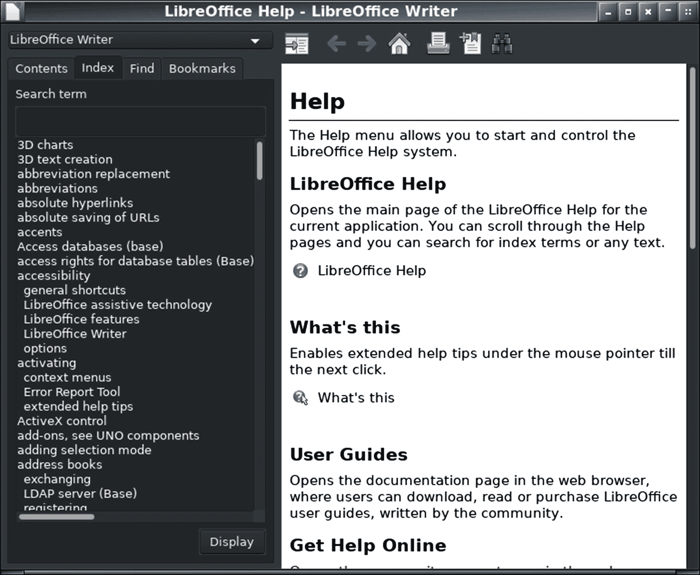

# 二十五、支持你最喜欢的开源项目

Linux 和我们在其上运行的大部分程序都是开源程序。许多较大的项目，如内核本身，是由专门为此目的而建立的基金会(如 Linux 基金会)和/或对此感兴趣的公司和其他组织直接支持的。

作为一名系统管理员，我写了很多脚本，我喜欢这样做，但我不是一名应用程序员。我也不想成为系统管理员，因为我喜欢系统管理员的工作，这允许不同类型的编程。因此，在很大程度上，为开源项目贡献代码对我来说不是一个好的选择。还有其他贡献的方式，我使用这些选项。本章将帮助你探索一些你可以做出贡献的方式。

## 项目选择

在我们讨论我们为开源项目做贡献的不同方式之前，我们将看看如何选择我们想要贡献的项目。这可能看起来令人生畏，因为许多项目需要这样或那样的支持。

我主要考虑的是我是否使用项目生产的软件或硬件。比如我每天都用 LibreOffice。我依赖它，并发现它对我的工作效率非常有用。所以我支持的一个项目是 LibreOffice。

我也支持高层次的组织，那些监督开源的某些方面的组织，比如 Linux 基金会，它支持并鼓励开源软件的使用，并且支持许多不同的开源社区。

选择一些对你有意义的项目并支持它。但是不要忘记“隐藏”的项目。其中一些项目对开源软件的成功至关重要，但是没有人知道它们，所以它们得不到支持。几年前的 Heartbleed 1 漏洞就是这类项目的一个例子。由于只有一个维护者和很少的预算，几乎在每个 Linux 发行版和其他操作系统中使用的 OpenSSL 软件都有一个缺陷——一个漏洞——危及每台使用 OpenSSL 的计算机。这个漏洞从 2012 年2开始就存在了，但直到 2014 年才被发现。

这个漏洞很快就被修复了，一些组织参与了这个项目，以确保开发人员可以继续工作，并帮助确保代码中不存在其他漏洞。

无论你选择什么，找一些你能支持的项目，并以对你有意义且有趣的方式去做。应该一直都很好玩吧！

## 密码

仅仅因为我选择不向开源项目贡献代码，并不意味着你也应该避免。我知道许多系统管理员都是优秀的程序员，他们可能对数百个开源项目中的一个或多个非常有帮助。没有编码员，一开始就不会有项目。

许多项目有很大的开发团队，而其他项目则很小，有时只有一个开发人员，他将开源项目作为第二份无报酬的工作。其他开发人员为更大的组织工作，这些组织付钱给他们为开源项目编码，通常是因为组织对那个项目有一些特别的兴趣。在大多数情况下，小项目的新开发人员是非常受欢迎的，但是大项目也非常欢迎新开发人员。

不同的项目使用不同的编码语言。许多项目是用 C 或 C++编写的，而其他项目则使用解释语言，如 Perl、PHP、Python、Ruby、bash 或其他 shell 脚本语言。

无论你的技能水平如何，你都可以找到一个有大量任务需要你去完成的项目。

## 试验

代码写好之后，需要有人来测试。测试和编写代码一样重要。我们在第十一章“尽早测试，经常测试”中详细讨论了测试，由于它的重要性，我们为它单独指定了一章。

一些项目需要专门的测试人员，他们在开发人员完成代码后立即获取代码，并通过一系列正式的测试来运行代码。这和我在思科工作时的一半职责非常相似。这种类型的测试需要写一个正式的测试计划，然后系统地完成这个计划。失败的测试被报告给开发人员来修复。

您还可以下载和测试许多常见和流行的软件包的测试版。这些测试版中的大部分都是公开发布的，目的很明确，就是为了引出错误报告——如果你愿意的话，还有修正。这种类型的测试通常不太严格。项目领导使产品可以在现实世界中使用，并可能提供一些指导，例如测试特定的功能。您可以像使用最终版本一样使用该产品，但是当您发现一个 bug 时，您可以将其报告给项目进行修复。

## 提交错误报告

提交 bug 报告是支持开源项目的一种非常重要的方式。我已经做了一些，这很容易做到。

大多数项目都有定义良好并记录在案的报告 bug 的方法。许多项目使用 Bugzilla 报告 bug，有些项目使用其他工具，包括一些自主开发的工具，甚至只是给开发人员发电子邮件。如何提交 bug 的细节通常可以通过项目主页上的链接找到。

在这种情况下，我们不像上一节那样讨论 beta 测试。这里我们使用的最终发布代码已经通过了所有的 alpha 和 beta 测试。这是真实世界，“生产中的测试”类型的测试；因为生产是最好的，也是最后的检验。

当我们在生产产品中发现一个 bug 时，即使这不是任何类型的官方测试程序的一部分，我们也有责任向项目提交一份 bug 报告。几乎每个项目都有报告 bug 的方法。

向开发人员请求更多信息是很常见的，这样他们就可以缩小问题的来源。这些请求很重要，快速响应非常有帮助。大多数情况下，这些请求是为了澄清错误发生的条件，例如操作系统版本，或者故障发生时可用的空闲内存、交换空间和磁盘空间的数量。有一次，一个内核开发人员要求我安装一个带有检查点的内核版本，这些检查点旨在帮助开发人员定位存在问题的代码部分。

报告生产软件中的错误有助于使它对所有用户都更好，而不仅仅是我们自己。

## 文件

不管我们是否编码，文档是我们许多人都可以参与的领域。虽然有很多关于人们不读文档(RTFM)的笑话，但是文档非常重要。

有不同类型的文件。从命令行实用程序和工具的手册页，到大型应用(如 LibreOffice)的完整在线手册。LibreOffice 有一系列精心编写的手册，可以下载为 PDF 文件，也可以通过浏览器在线使用。

LibreOffice 还有一个非常好的帮助工具，包括目录、索引和搜索工具。图 25-1 显示了 LibreOffice 帮助工具的第一页。它有明确的使用说明和不同的查找信息的方法。这是我见过的最好的帮助设施之一。

对于我们这些喜欢写作的人来说，创建和维护文档是一种很好的贡献方式。

图 25-1

LibreOffice 帮助工具的主页提供了多个选项来查找有关当前应用的信息。大卫两个，抄送。

## 帮助

帮助他人是支持开源软件的另一个好方法。这种类型的参与提供了许多不同的选择。

一种选择是参加本地聚会，在那里开源爱好者与不熟悉开源的人讨论开源的优势。在许多这样的聚会中，有时被称为安装节，有经验的用户帮助新手安装 Linux 并从基础开始。另一个选择是简单地向你的朋友和家人介绍 Linux，并帮助他们入门。一些 Linux 用户喜欢逛各种论坛和 IRC 聊天室，通过回答问题来帮助人们。

我有时会这样做，但这不是我最擅长的。

## 教

我喜欢教书。根据这些年来我收到的课程评估表，我很擅长。自从 1978 年我开始在 IBM 担任课程开发代表以来，我已经教授了许多不同的硬件和软件课程。

在过去的 15 年里，我编写了关于 Linux 的课程，并为我工作过的各种组织教授这些课程。后来，当我创办了自己的 Linux 咨询公司(几年前我关闭了它)时，我写了三个为期几天的课程，涵盖了从入门到高级系统管理的所有内容。

如果你有这样的倾向，并且你有一些做演讲的技巧，教书可能很适合你。会议时间可能从一小时到一周不等。在我的两个雇主那里，我参加了长达一小时的午餐和学习会议，这些会议只是对 Linux 和其他开源软件各个部分的概述。在其他地方，我参加了一两天的课程，旨在向 Windows 管理员介绍一些基本的 Linux 命令和文件系统之类的东西。

这是我做出贡献的主要方式之一——传播我的知识。我还设法加入了一些关于我的 Linux 哲学的指导和信息。无论你教别人做什么，都是在帮助他们学习 Linux 和开源软件。

## 写

我也喜欢写作。这本书只是我的写作项目之一，其他的是我经常为 Opensource.com3和我自己的网站写的文章，尤其是 Linux DataBook 4 网站。DataBook 网站是我尝试记录我学到的很难找到的东西。

DataBook web 站点起源于我在 IBM 工作的时候，是一个关于 OS/2 的信息数据库。该数据库的设计允许我和其他 OS/2 支持人员快速找到关于 OS/2 的信息。我还用它来确保一旦我发现了如何做某事，或者发现了一个特别难以捉摸的信息，我就不必再花时间去获取它。它对我来说基本上是一种记忆辅助工具。许多关于 OS/2 的信息也出现在硬拷贝书《OS/2 Warp 内部的*的第六章“文件系统”和第二十二章“故障排除”中。* 5 “在我离开 IBM 之后，这些信息成为了 OS/2 的 *DataBook 的基础，它和它的前身一样，是我在我的独立咨询公司的记忆工具。*

在 OS/2 被 IBM 放弃后，我开始写两本新书，*Linux 管理员数据手册*和*Linux 用户数据手册。这两本新书是分别为系统管理员和用户收集的关于 Linux，尤其是 Fedora Linux 的资料。它们包含了我在使用 Linux 的这些年中发现的信息，我需要为自己维护这些信息——再次作为记忆辅助。我也想让每个人都能得到这些信息，所以我把它们都放在了我的网站上。*

我为 Opensource.com 写了许多文章，这些文章大多深入一些重要的主题，如文件系统、各种服务器软件、桌面以及其他 Linux 和开放源码软件。

撰写文章和书籍来帮助系统管理员和其他想成为系统管理员的人是我自己回报开源社区的主要方式，也是提供某种程度的指导，即使这与预期的接收者有些距离。

同样，如果你擅长写作，你会发现写关于 Linux 和开源的文章是一个很好的帮助方式。

## 捐赠

最后，大多数项目接受货币捐赠。乍一看，这似乎是为开源项目提供支持的一种相当笨拙、不干涉的方式，但是所有的项目都需要资金支持。我选择了三个，我会时不时地给它们捐点钱。

因为它在我日常工作中的重要性，我用小额捐款支持图书馆办公室。我也支持一些高层组织。我向 Linux 基金会 7 捐款，因为他们支持 Linux 基础设施，他们直接支持 Linus Torvalds，付钱让他继续他在内核方面的工作，他们还支持其他对 Linux 的健康和发展很重要的开源社区。我还向开源倡议组织 8 捐款，该组织负责批准各种许可证，并证明它们符合开源原则。

还有许多其他开源组织和项目需要资金。你的捐款可以直接支持那些站在开源运动最前沿的人的工作。

## 思想

开源就是以这样或那样的方式做出贡献。我的主要贡献是在教学和写作方面。我喜欢做这两件事，而且我很擅长。

我不打算在这里列出一堆项目。主要原因是有太多，我肯定会错过一些。此处打印的任何此类列表都将是某个时间点的快照——即使我可以列出所有列表——并且在我将第一稿提交给出版商之前就会过时。在撰写本文时，我只是简单地列出了我支持的几个例子。

因此，如果你想支持一个项目，选择一个你熟悉的、对你有影响的项目，找到它的主页，在那里找到如何以对你有意义的方式做出贡献。

那就投稿吧！

<aside class="FootnoteSection" epub:type="footnotes">Footnotes 1

心出血网站， [`http://heartbleed.com/`](http://heartbleed.com/)

  2

维基百科，*【heartbleed】*， [`https://en.wikipedia.org/wiki/Heartbleed`](https://en.wikipedia.org/wiki/Heartbleed)

  3

Opensource.com， [`https://opensource.com/`](https://opensource.com/)

  4

Linux 数据手册， [`http://www.linux-databook.info/`](http://www.linux-databook.info/)

  5

马克·米纳西等人，《OS/2 Warp 内部的*》，新骑手出版社，1995 年*

*  6

书店网站，*【支持书店】*、 [`https://www.libreoffice.org/donate/`](https://www.libreoffice.org/donate/)

  7

Linux 基金会，*捐赠给 Linux 基金会*， [`https://www.linuxfoundation.org/about/donate/`](https://www.linuxfoundation.org/about/donate/)

  8

*开源倡议，*[`https://opensource.org/civicrm/contribute/transact?reset=1&id=2`](https://opensource.org/civicrm/contribute/transact%253Freset=1%2526id=2)

 *</aside>