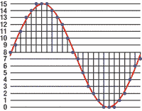
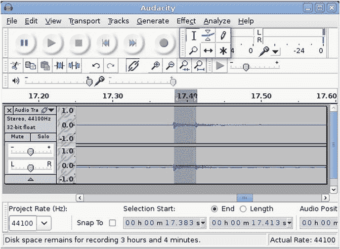

# 一、声音的基本概念

本章着眼于音频的一些基本概念，包括模拟音频和数字音频。以下是一些资源:

*   《科学家和工程师数字信号处理指南》( [`www.dspguide.com/`](http://www.dspguide.com/) )
*   音乐和计算机:一种理论和历史的方法( [`http://music.columbia.edu/cmc/MusicAndComputers/`](http://music.columbia.edu/cmc/MusicAndComputers/) )作者:菲尔·伯克，拉里·波兰斯基，道格拉斯·雷佩托，玛丽·罗伯茨，丹·罗克莫尔

## 样本音频

音频是一种模拟现象。声音以各种方式产生，通过声音、乐器和自然事件，如森林中的树木倒下(无论是否有人听到)。在某一点接收到的声音可以被绘制成振幅对时间的曲线图，并且可以呈现几乎任何功能状态，包括不连续的。

对声音的分析通常是通过观察它的频谱来完成的。从数学上来说，这是通过傅里叶变换实现的，但是耳朵仅通过耳朵的结构来执行几乎类似的变换。耳朵听到的“纯”声音对应于简单的正弦波，谐波对应于正弦波，其频率是基本正弦波的倍数。

系统中的模拟信号，例如模拟音频放大器，被设计成与这些频谱信号一起工作。他们试图在整个音频范围内产生相同的放大效果。

计算机和越来越多的电子设备处理由 1 和 0 组成的数字信号。位被组合成具有 256 个可能值的字节、具有 65，536 个可能值的 16 位字，甚至更大的组合，例如 32 位或 64 位字。

## 抽样率

将模拟信号数字化意味着以固定的时间间隔从该信号中取样，并以离散的尺度表示这些样本。采样的频率就是采样率。例如，CD 上的音频采样频率为 44，100Hz，即每秒 44，100 次。在 DVD 上，每秒可以采样 192，000 次，采样率为 192kHz。相反，标准电话采样速率为 8kHz。

图 1-1 表示取样。

图 1-1。

Analog and sampled signal (Wikipedia: [`http://en.wikipedia.org/wiki/Pulse-code_modulation`](http://en.wikipedia.org/wiki/Pulse-code_modulation) )

采样率影响两个主要因素。首先，采样率越高，数据量越大。在其他条件相同的情况下，采样速率加倍将导致数据需求加倍。另一方面，奈奎斯特-香农定理( [`http://en.wikipedia.org/wiki/Nyquist_theorem`](http://en.wikipedia.org/wiki/Nyquist_theorem) )对连续数据的采样精度设置了限制:如果信号中的最高频率低于采样速率的一半，则模拟信号只能从数字信号中重构(换句话说，是无失真的)。

这也是关于黑胶唱片和 CD 唱片“质量”的争论结束的地方，就像“黑胶唱片和 CD 唱片的神话不会消亡”( [`www.eetimes.com/electronics-blogs/audio-designline-blog/4033509/Vinyl-vs-CD-myths-refuse-to-die`](http://www.eetimes.com/electronics-blogs/audio-designline-blog/4033509/Vinyl-vs-CD-myths-refuse-to-die) )。采样速率为 44.1kHz 时，当转换回模拟信号以用于扬声器或耳机时，原始信号中高于 22.05kHz 的频率可能无法准确再现。由于人类的典型听力范围只有 20，000 赫兹(我的听力范围现在降到了 10，000 赫兹)，所以这应该不是一个大问题。但是一些音响发烧友声称他们的耳朵非常灵敏！

## 样本格式

样本格式是音频数字化的另一个主要特征:用于离散样本的位数。例如，电话信号使用 8kHz 采样速率和 8 位分辨率，因此电话信号只能传送 2⁸(换句话说，256 个)级别(参见 [`http://electronics.howstuffworks.com/telephone3.htm`](http://electronics.howstuffworks.com/telephone3.htm) “电话如何工作”)。

大多数 CD 和计算机系统使用 16 位格式，提供非常精细的信号渐变，允许 96dB 的范围(参见[`http://manual.audacityteam.org/man/Digital_Audio`](http://manual.audacityteam.org/man/Digital_Audio)“Audacity:数字采样”)。

## 框架

一个帧保存一个时间实例的所有样本。对于立体声设备，每帧保存两个样本，而对于五扬声器设备，每帧保存五个样本。

## 脉冲编码调制

脉码调制(PCM)是代表数字化模拟信号的标准形式。根据维基百科( [`http://en.wikipedia.org/wiki/Pulse-code_modulation`](http://en.wikipedia.org/wiki/Pulse-code_modulation) )，“脉冲编码调制是一种用于数字表示采样模拟信号的方法。它是计算机和各种蓝光、DVD 和 CD 格式的数字音频的标准格式，也是数字电话系统等其他应用的标准格式。PCM 流是模拟信号的数字表示，其中模拟信号的幅度以均匀的间隔有规律地采样，每个样本被量化为数字步长范围内最接近的值。

PCM 流有两个基本属性，决定了它们对原始模拟信号的保真度:采样率，即每秒采样的次数；位深度，决定了每个样本可以采用的可能数字值的数量。

然而，即使这是标准，也有变体( [`http://wiki.multimedia.cx/index.php?title=PCM`](http://wiki.multimedia.cx/index.php?title=PCM) )。主要的一个是关于基于单词的系统中的字节表示:小端或大端( [`http://searchnetworking.techtarget.com/definition/big-endian-and-little-endian`](http://searchnetworking.techtarget.com/definition/big-endian-and-little-endian) )。下一个变化是有符号对无符号( [`http://en.wikipedia.org/wiki/Signedness`](http://en.wikipedia.org/wiki/Signedness) )。

还有许多其他不太重要的变量，例如数字化是线性的还是对数的。参见 [`http://wiki.multimedia.cx/index.php?title=PCM`](http://wiki.multimedia.cx/index.php?title=PCM) 的多媒体维基，了解关于这些的讨论。

## 超限和欠载

根据“用 ALSA 进行声音编程的介绍”( [`www.linuxjournal.com/article/6735?page=0,1`](http://www.linuxjournal.com/article/6735?page=0,1) )，“当声音设备处于活动状态时，数据在硬件和应用缓冲区之间不断地传输。在数据捕获(记录)的情况下，如果应用读取缓冲区中的数据不够快，循环缓冲区将被新数据覆盖。由此导致的数据丢失称为溢出。在回放过程中，如果应用没有足够快地将数据传入缓冲区，它就会变得缺乏数据，从而导致称为欠载运行的错误。”

## 潜伏

延迟是指从信号进入系统到信号(或其等效物，如放大版本)离开系统所经过的时间。

根据伊恩·沃(Ian Waugh)的《修复音频延迟第一部分》( [`www.practicalpc.co.uk/computing/sound/latency1.htm`](http://www.practicalpc.co.uk/computing/sound/latency1.htm) )，“延迟就是延迟。在基于计算机的音乐音频系统中，这一问题最为明显，表现为触发信号和听到信号之间的延迟，例如，按下 MIDI 键盘上的一个键，然后通过声卡听到声音播放。”

这就像一个延迟的反应，如果延迟很大，就不可能及时播放任何东西，因为你听到的声音总是比你正在播放的声音落后一点点，这让人分心。

这种延迟在引起问题之前不必太大。许多人可以在大约 40 毫秒的延迟下工作，即使延迟是显而易见的，尽管如果你正在播放烟火音乐，它可能太长了。

理想的延迟是 0，但许多人很难注意到小于 8 毫秒或 10 毫秒的延迟，许多人可以在 20 毫秒的延迟下愉快地工作。

在谷歌上搜索测量音频延迟会出现很多网站。我使用一个简单的测试。我在一台单独的电脑上安装了 Audacity，用它同时录制我发出的声音和测试电脑拾取和播放的声音。我用勺子猛敲瓶子，发出尖锐的敲击声。当放大时，记录的声音显示两个峰值，选择峰值之间的区域向我显示了选择开始/结束的潜伏期。在图 1-2 中，这两个是 17.383 和 17.413 秒，延迟为 30 毫秒。

图 1-2。

Measuring latency with Audacity

## 振动

将定期对模拟信号进行采样。理想情况下，回放应该使用完全相同的时间间隔。但是，特别是在网络系统中，周期可能没有规律。任何不规则都称为抖动( [`http://en.wikipedia.org/wiki/Jitter`](http://en.wikipedia.org/wiki/Jitter) )。我没有测试抖动的简单方法；我的主要问题仍然是延迟！

## 混合

混合意味着从一个或多个源获取输入，可能对这些输入信号进行一些处理，然后将它们发送到一个或多个输出。当然，起源是物理混频器，它作用于模拟信号。在数字世界中，同样的功能将在数字信号上执行。

描述模拟混音器的一个简单文档是“混音指南”( [`www.soundcraft.com/support/gtm_booklet.aspx`](http://www.soundcraft.com/support/gtm_booklet.aspx) )。它包括以下功能:

*   将输入路由至输出
*   为不同的输入和输出信号设置增益和输出电平
*   应用特殊效果，如混响、延迟和音高移动
*   将输入信号混合到公共输出
*   将一个输入信号分成多个输出

## 结论

这短短的一章介绍了一些基本概念，它们将占据本书其余部分的大部分篇幅。Steven W. Smith 的《科学家和工程师数字信号处理指南( [`www.dspguide.com/`](http://www.dspguide.com/) )有大量的进一步细节，