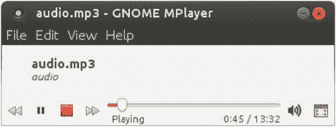

# 2.用户级工具

本章着眼于 Linux 系统下典型的用户级工具，包括播放器、各种声音处理工具和编辑器。

## 演员

下面几节说说玩家。

### MPlayer

我认为 MPlayer 很棒，可能比其他玩家用得都多。我通常从命令行运行它，但也有可用的 GUI 版本。它可以播放几乎任何媒体类型——视频和音频。我两样都用。它还将接受 HTTP URLs、DVD URLs 和 VCD URLs 等。

MPlayer 的手册页位于 [`www.mplayerhq.hu/DOCS/man/en/mplayer.1.html`](http://www.mplayerhq.hu/DOCS/man/en/mplayer.1.html) ，参考页位于 [`www.mplayerhq.hu/DOCS/HTML/en/index.html`](http://www.mplayerhq.hu/DOCS/HTML/en/index.html) 。

MPlayer 有一个名为 MPlayerGUI 的 GUI 版本，但在 Ubuntu 的当前版本(如 16.04)下会出现问题，而且显然不会得到修复。有一个 Gnome 版本叫做 GNOME MPlayer，看起来像图 [2-1](#Fig1) 。



图 2-1。

GNOME MPlayer

### 可见光通讯

VLC 是我第二喜欢的运动员。它也可以播放几乎任何东西，并接受 HTTP，DVD 和 VCD 的网址。它有一个默认的 GUI，但是也可以在没有 GUI 的情况下用命令`cvlc`运行。GUI 看起来如图 [2-2](#Fig2) 所示。


图 2-2。

VLC

它的主页面是 VideoLAN( [`www.videolan.org/vlc/index.html`](http://www.videolan.org/vlc/index.html) )，你可以在欢迎使用 VideoLAN 的文档( [`http://wiki.videolan.org/Documentation:Documentation`](http://wiki.videolan.org/Documentation:Documentation) )找到一些文档。

### 图腾

图腾是常用的，但不是我的最爱之一。

## 声音工具

有许多声音工具能够执行多种任务，例如转换格式和应用效果。下面几节将介绍其中的一些。

### 短袜

是声音处理程序的瑞士军刀。最简单的用法是按如下方式更改文件格式:

```sh
sox audio.mp3 audio.ogg

```

这会将 MP3 文件转换成 Ogg-Vorbis 文件(您可能需要安装`libsox-fmt-all`包才能处理所有文件格式)。

但是，它还可以执行许多其他功能，例如:

*   转换成单声道，如下图:

    ```sh
    sox audio.mp3 audio.ogg channels 1

    ```

*   加倍音量，如下图:

    ```sh
    sox audio.mp3 audio.ogg vol 2

    ```

*   改变采样率，如下图:

    ```sh
    sox audio.mp3 audio.ogg rate 16k

    ```

它还可以执行更复杂的效果，如合并文件，分裂文件时，它检测到沉默，以及许多其他。

它的主页在 [`http://sox.sourceforge.net/`](http://sox.sourceforge.net/) 。

### FFmpeg/avconv

FFmpeg 通常用作从一种格式到另一种格式的转换器。网站上有一系列不错的教程，shredder12 的初学者 FFmpeg 教程( [`http://linuxers.org/tutorial/ffmpeg-tutorial-beginners`](http://linuxers.org/tutorial/ffmpeg-tutorial-beginners) )。

它也可用于从 ALSA 设备如`hw:0`或默认设备进行记录。从`hw:0`开始的记录可通过以下方式完成:

```sh
ffmpeg -f alsa -i hw:0 test.mp3

```

这可以通过默认的 ALSA 输入完成，如下所示:

```sh
ffmpeg -f alsa -i default test.mp3

```

几年前，FFmpeg 出现了一个分支，产生了 avconv，这是 Ubuntu 系统的默认设置。这两者之间有一些差异，但不足以证明对用户的滋扰因素。FFmpeg 和 avconv 在第 [12](12.html) 章中有详细讨论。

### GStreamer

GStreamer 允许您构建可以使用`gst-launch`播放的“管道”。例如，要使用 ALSA 播放 MP3 文件，您将拥有以下管道:

```sh
gst-launch-1.0 filesrc location="concept.mp3" ! decodebin ! alsasink

```

管道可以执行更复杂的任务，如格式转换、混合等。查看马切伊·卡塔菲亚斯的教程“用 GStreamer 进行多用途多媒体处理”( [`www.ibm.com/developerworks/aix/library/au-gstreamer.html?ca=dgr-lnxw07GStreamer`](http://www.ibm.com/developerworks/aix/library/au-gstreamer.html?ca=dgr-lnxw07GStreamer) )。

GStreamer 还可以使用以下内容播放 MIDI 文件:

```sh
gst-launch-1.0 filesrc location="rehab.mid" ! wildmidi ! alsasink

```

### 大胆

根据它的网站( [`http://audacity.sourceforge.net/`](http://audacity.sourceforge.net/) )，“Audacity 是一款免费、易用、多语言的音频编辑器和录音机，适用于 Windows、Mac OS X、GNU/Linux 和其他操作系统。”这是一个神奇的工具，非常值得使用。后面的章节将会举例说明。

## 结论

这个简短的章节介绍了 Linux 下的一些用户级工具。这些是我经常使用的。虽然我已经列出了几个主要工具，但随便搜索一下就会发现更多。维基百科“Linux 音频软件列表”页面( [`https://en.wikipedia.org/wiki/List_of_Linux_audio_software`](https://en.wikipedia.org/wiki/List_of_Linux_audio_software) )有详尽的列表。