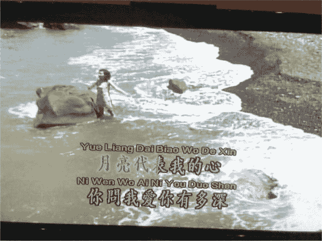
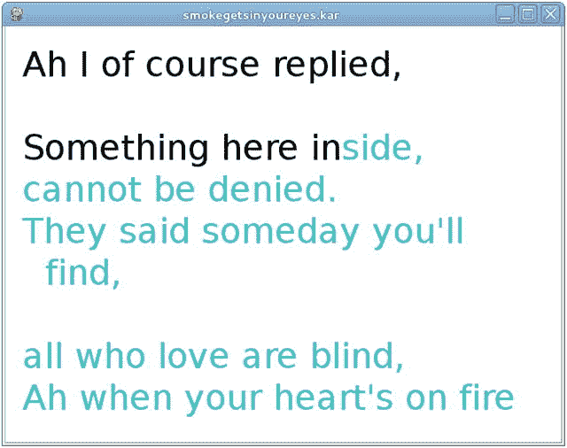

# 二十三、Karaoke 用户级工具

Karaoke 是一种“观众参与”的音响系统，在这种系统中，配乐和通常的旋律随着歌词的移动显示一起播放。在此范围内，可以有变化或不同的特征。

*   歌词可以一次全部显示，而音乐按顺序播放。
*   歌词可以与旋律线同步突出显示。
*   旋律线可能会一直播放或可以关闭。
*   一些球员还将包括一个歌手唱这首歌。
*   有些有人声的玩家会在有人唱歌的时候关掉人声。
*   有些演奏者会给出旋律音符的图形显示。
*   一些演奏者会给出旋律的图形显示，还会显示歌手所唱的音符。
*   有些选手会根据对歌手准确性的一些评价来打分。这种评分的基础通常是未知的。
*   有些播放器允许你改变播放速度和播放音高。
*   大多数播放器将接受两个麦克风，并可以为歌手的声音添加混响效果。
*   很多播放器会让你提前选择歌曲，建立动态播放列表。

Karaoke 在亚洲很受欢迎，在欧洲国家也有追随者。Karaoke 系统被认为起源于亚洲，尽管根据维基百科( [`http://en.wikipedia.org/wiki/Karaoke`](http://en.wikipedia.org/wiki/Karaoke) )记载的历史有点模糊。

在 [`www.karawin.fr/defenst.php`](http://www.karawin.fr/defenst.php) 中描述了 Karaoke 的各种文件格式。本章考虑了播放 Karaoke 的功能、格式和用户级工具。

## 视频光盘系统

视频 CD 是光盘上一种较老的视频存储形式。分辨率相当低，一般为 352×240 像素，帧率为每秒 25 帧。虽然它们被一些电影使用，但是它们已经被 DVD 电影所取代。然而，它们曾一度被广泛用于 Karaoke 唱片。

来自亚洲的较便宜的 CD/DVD 播放器通常有麦克风输入，可以与 VCD 光盘一起用作 Karaoke 播放器。通常文件是 AVI 或 MPEG 格式的简单电影，所以你可以跟着唱。虽然歌词通常会随着旋律及时突出显示，但没有诸如乐谱或旋律显示之类的高级功能。

如果您有 VCD 光盘，它们可以作为 IC9660 文件安装在您的计算机上，但是在 Linux 系统上，您不能直接提取这些文件。像 VLC、MPlayer 和图腾这样的玩家可以播放它们的文件。

你需要使用类似`vcdimager`的东西从 VCD 光盘中提取文件。这可能在你的包系统中，或者你可以从 GNU 开发者网站( [`www.gnu.org/software/vcdimager/`](http://www.gnu.org/software/vcdimager/) )下载并从源代码编译它。然后，可以使用以下内容将视频文件提取为 MPEG 或 AVI 文件:

```sh
          vcdxrip --cdrom-device=/dev/cdrom --rip

```

(在我的系统上，我不得不将`/dev/cdrom`替换为`/dev/sr1`,因为我无法从默认的 DVD 播放器中提取。我通过运行`mount`找到了它是什么设备，然后用`umount`卸载了它。)

## CD+G 光盘

根据维基百科的“CD+G”页面( [`https://en.wikipedia.org/wiki/CD%2BG`](https://en.wikipedia.org/wiki/CD%2BG) )，“CD+G(也称为 CD+Graphics)是光盘标准的扩展，当在兼容设备上播放时，可以在光盘上的音频数据旁边呈现低分辨率的图形。CD+G 光盘通常用于 Karaoke 机，Karaoke 机利用这一功能在屏幕上显示光盘上歌曲的歌词。

每首歌曲由两个文件组成:一个音频文件和一个包含歌词的视频文件(可能还有一些背景场景)。

您可以使用这种格式购买许多光盘。你不能在电脑上直接播放它们。Rhythmbox 将播放音频，但不播放视频。VLC 和图腾不喜欢他们。

将文件翻录到电脑上存储在硬盘上并不那么简单。音频光盘没有正常意义上的文件系统。例如，您不能使用 Unix `mount`命令挂载它们；它们甚至不是 ISO 格式的。相反，你需要使用一个类似于`cdrdao`的程序将文件解压成一个二进制文件，然后对其进行处理。

```sh
 $ cdrdao read-cd --driver generic-mmc-raw --device /dev/cdroms/cdrom0 --read-subchan rw_raw mycd.toc

```

前面的代码创建了一个数据文件和一个目录文件。

CDG 文件的格式显然还没有公开发布，但是由 Jim Bumgardner(早在 1995 年！)在“CD+G 揭示:在软件中回放 Karaoke 曲目”( [`http://jbum.com/cdg_revealed.html`](http://jbum.com/cdg_revealed.html) )。

声音榨汁机等程序会提取音轨，但留下视频。

## MP3+G 文件

MP3+G 文件是适用于普通电脑的 CD+G 文件。它们由包含音频的 MP3 文件和包含歌词的 CDG 文件组成。通常它们是用拉链拉在一起的。

很多卖 CD+G 文件的网站也卖 MP3+G 文件。各种网站给出了如何创建自己的 MP3+G 文件的说明。免费网站不多。

来自`cdgtools-0.3.2`的程序`cgdrip.py`可以从音频光盘中抓取 CD+G 文件，并将其转换为一对 MP3+G 文件。(Python)源代码中的指令如下:

```sh
# To start using cdgrip immediately, try the following from the
# command-line (replacing the --device option by the path to your
# CD device):
#
#  $ cdrdao read-cd --driver generic-mmc-raw --device /dev/cdroms/cdrom0 --read-subchan rw_raw mycd.toc
#  $ python cdgrip.py --with-cddb --delete-bin-toc mycd.toc
#
# You may need to use a different --driver option or --read-subchan mode
# to cdrdao depending on your CD device. For more in depth details, see
# the usage instructions below.

```

## 购买 CD+G 或 MP3+G 文件

有很多卖 CD+G 和 MP3+G 歌曲的网站。只要在谷歌上搜索一下。然而，每首歌的平均价格约为 3 美元，如果你想建立一个大的收藏，这可能会变得昂贵。一些网站会对大量购买给予折扣，但即使 100 首歌曲 30 美元，费用也可能很高。

拥有大量收藏的网站来来去去。在撰写本文时，aceume.com 为我们提供了 14000 首英文歌曲，售价 399 美元。但你可以花 600 美元购买他们的 AK3C Android 一体机云 Karaoke 播放器，其中包含 21，000 首英文歌曲和 35，000 首中文歌曲。这使得建造自己的 Karaoke 播放器的经济性变得不稳定。我将忽略这个问题，这是你的选择！

## 将 MP3+G 转换为视频文件

工具`ffmpeg`可以将音频和视频合并成一个视频文件，例如:

```sh
ffmpeg -i Track1.cdg -i Track1.mp3 -y Track1.avi

```

使用以下内容创建包含视频和音频的 AVI 文件:

```sh
avconv -i Track1.cdg -i Track1.mp3 test.avi
avconv -i test.avi -c:v libx264 -c:a copy outputfile.mp4

```

这个可以用 VLC，MPlayer，Rhythmbox 等等来玩。

有一个程序叫做 [`cdg2video`](http://code.google.com/p/cdg2video/) 。它的最后日期是 2011 年 2 月，FFmpeg 内部的变化意味着它不再编译。即使您修复了这些明显的变化，C 编译器也会对不推荐使用的 FFmpeg 函数提出大量的抱怨。

## MPEG-4 文件

使用 MPEG-4 视频播放器的 Karaoke 系统越来越普遍。这些将所有信息嵌入到视频中。这些档案的球员没有计分系统。

有些人认为它们的音质更好；例如 [`http://boards.straightdope.com/sdmb/showthread.php?t=83441`见](http://boards.straightdope.com/sdmb/showthread.php?t=83441)。我认为与其说是格式的问题，不如说是合成器的问题。当然高端合成器制造商如雅马哈不会同意！

MPEG-4 文件肯定比相应的 MIDI 文件要大，你需要一个大容量的磁盘来存放它们。

有很多卖 MP4 歌曲的网站。只要在谷歌上搜索一下。然而，每首歌的平均价格约为 3 美元，如果你想建立一个大的收藏，这可能会变得非常昂贵。

在撰写本文时，似乎还没有一个网站出售大量的 MPEG-4 歌曲。但是，过去有过，将来也可能有。

## Karaoke 机

有许多 Karaoke 机都配有 DVD。在大多数情况下，歌曲存储为 MIDI 文件，歌曲轨道在一个 MIDI 文件中，歌词在另一个文件中。一些较新的系统将使用 WMA 文件的配乐，这使得一个轨道有声乐供应和其他没有声乐。这种系统通常包括评分机制，尽管评分的依据并不明确。最新的是基于硬盘的，通常是 MP4 文件。他们似乎没有计分系统。这些系统的供应商定期更换，即使系统本身只是重新贴牌。我拥有 Malata 和 Sonken 的系统，但它们是多年前购买的。我不相信更新的型号一定是改进的。

我拥有的两个系统表现出不同的特点。Sonken MD-388 <sup>1</sup> 可播放多种语言的歌曲，如中文、韩语、英语等。我妻子是中国人，但我看不懂汉字。有一个英文化的脚本叫做拼音，Sonken 显示了汉字和拼音，所以我也可以跟着唱。看起来像图 23-1 。



图 23-1。

Screen dump of Sonken player

万利达 MDVD-6619 <sup>2</sup> 播放中文歌曲不显示拼音。但它确实显示了你应该唱的音符和你实际唱的音符。图 23-2 显示我跑调了。


图 23-2。

Screen dump of Malata player

## MIDI 播放器

MIDI 格式的 Karaoke 文件可以从几个站点找到，通常以`.kar`结尾。任何 MIDI 播放器如 TiMidity 都可以播放这样的文件。然而，它们并不总是显示与旋律同步的歌词。

## 查找 MIDI 文件

网上有几个网站提供 MIDI 格式的文件。

*   MIDIZone ( [`www.free-midi.org/`](http://www.free-midi.org/) )
*   midworld([`www.midiworld.com/`](http://www.midiworld.com/)
*   CoolMIDI ( [`www.cool-midi.com/`](http://www.cool-midi.com/)
*   电鲜( [`http://electrofresh.com/`](http://electrofresh.com/) )
*   Freemidi ( [`http://freemidi.org/`](http://freemidi.org/)
*   Karaoke 版([`www.karaoke-version.com/`](http://www.karaoke-version.com/))——比如第四轨的《旭日之家》旋律
*   MIDaoke([`www.midaoke.com/`](http://www.midaoke.com/))——比如平克·弗洛伊德第二轨的《希望你在这里》旋律
*   家庭音乐家([`http://karaoke.homemusician.net/`](http://karaoke.homemusician.net/))——例如，老鹰乐队的《加州旅馆》在第四轨的单簧管上标注了“旋律”

## KAR 文件格式

卡拉 MIDI 文件没有正式的标准。有一种被广泛接受的行业格式，称为 MIDI Karaoke 类型 1 文件格式。

以下来自迷笛 Karaoke FAQ([`http://gnese.free.fr/Projects/KaraokeTime/Fichiers/karfaq.html`](http://gnese.free.fr/Projects/KaraokeTime/Fichiers/karfaq.html)):

*   什么是 MIDI 卡拉 Type 1(。KAR)文件格式？MIDI Karaoke 文件是一种标准的 MIDI 文件类型 1，它包含一个单独的轨道，其中歌曲的歌词作为文本事件输入。将一个 MIDI Karaoke 文件加载到音序器中，以检查该文件曲目的内容。第一个轨道包含文本事件，用于将文件识别为 MIDI Karaoke 文件。`@KMIDI KARAOKE FILE`文本事件就是为此目的而使用的。可选文本事件`@V0100`表示格式版本号。以`@I`开头的任何内容都是您想要包含在文件中的任何信息。
*   第二个轨道包含歌曲歌词的文本元事件。第一个事件是`@LENGL`。它标识了歌曲的语言，在本例中是英语。接下来的几个事件从`@T`开始，它标识了歌曲的标题。您最多可以有三个这样的事件。第一个事件应该包含歌曲的标题。一些程序(如 Soft Karaoke)读取此事件以获取要在文件打开对话框中显示的歌曲名称。第二个事件通常包含歌曲的表演者或作者。第三个事件可以包含任何版权信息或任何其他内容。
*   第二音轨的剩余部分包含歌曲的歌词。每个事件都是事件发生时应该唱的音节。如果文字以\开头，则表示清空屏幕，在屏幕顶部显示文字。如果文本以/开头，则表示转到下一行。
*   重要提示:一个`.kar`文件中每个屏幕只能有三行，以便软 Karaoke 正确播放该文件。换句话说，一行歌词的每一行开头只能有两个正斜杠。下一行必须以反斜杠开始。

这种格式有几个缺点，列举如下:

*   没有指定可能的语言列表，只有英语。
*   未指定文本的编码(例如，Unicode UTF-8)。
*   没有办法识别传送旋律的通道。

## 皮卡拉奥克

PyKaraoke 是用 Python 写的专用 Karaoke 播放器，使用了 Pygame、WxPython 等多种库。它会播放歌曲并显示你在歌词中的位置。一个“烟雾进入你的眼睛”( [`www.midikaraoke.com/cgi-bin/songdir/jump.cgi?ID=1280`](http://www.midikaraoke.com/cgi-bin/songdir/jump.cgi?ID=1280) )的屏幕截图看起来像图 23-3 。



图 23-3。

Screen dump of PyKaraoke

PyKaraoke 播放配乐并显示歌词。它不能通过播放歌手的输入来充当合适的 Karaoke 系统。但是 PyKaraoke 使用 PulseAudio 系统，所以你可以同时播放其他节目。特别是，你可以让 PyKaraoke 在一个窗口运行，而`pa-mic-2-speaker`在另一个窗口运行。PulseAudio 将混合两个输出流，并一起播放两个源。当然，没有额外的工作，在这样的系统中不可能得分。

## kmid<sup>【3】</sup>

是 KDE 的一名 Karaoke 歌手。它会播放歌曲并显示你在歌词中的位置。一个“烟雾进入你的眼睛”的屏幕截图看起来像图 23-4 。


图 23-4。

`kmid` screen dump. `kmid` uses either TiMidity or FluidSynth as a MIDI back end.

`kmid`播放音轨并显示歌词。它不能通过播放歌手的输入来充当合适的 Karaoke 系统。但是`kmid`可以使用 PulseAudio 系统，所以可以同时播放其他节目。特别是，你可以让`kmid`在一个窗口中运行，而`pa-mic-2-speaker`在另一个窗口中运行。PulseAudio 将混合两个输出流，并一起播放两个源。当然，没有额外的工作，在这样的系统中不可能得分。

## 麦克风输入和混响效果

几乎所有的个人电脑和笔记本电脑都有声卡来播放音频。虽然几乎所有这些都有麦克风输入，但有些没有。例如，我的戴尔笔记本电脑没有，Raspberry Pi 没有，许多 Android 电视媒体盒也没有。

那些没有麦克风输入的电脑通常有 USB 端口。他们通常会接受 USB 声卡，如果 USB 有麦克风输入，那么这是公认的。

如果你想支持两个或更多的麦克风，那么你需要相应数量的声卡或混音设备。我见过百灵达 MX-400 MicroMix，四通道紧凑型低噪声混音器，20 美元，或者你可以在电子产品网站上找到电路图(音频混音器的谷歌电路图)。

混响是一种效果，通过添加具有不同延迟的(人工)回声，赋予声音更饱满的“身体”。百灵达还生产 MIX800 MiniMix，它可以混合两个具有混响效果的麦克风，还具有一个用于线路输入的直通端口(因此您可以播放音乐并控制麦克风)。(我没有百灵达的链接。)一个类似的单元是 UNIFY K9 混响电脑 Karaoke 混音器。

中国的 DVD 播放器通常有双麦克风输入，具有混音和混响功能。因为它们的价格只有 13 美元。诚然，对于 1000 台来说，说明混音和混响应该不会太贵。我猜他们用的是三菱 M65845AFP ( [`www.datasheetcatalog.org/datasheet/MitsubishiElectricCorporation/mXuuvys.pdf`](http://www.datasheetcatalog.org/datasheet/MitsubishiElectricCorporation/mXuuvys.pdf) )，“带麦克风混音电路的数字回声”数据手册显示了许多可能的配置，适合喜欢自己构建的用户。

## 结论

有各种各样的 Karaoke 系统，使用 VCD 光盘或专用系统。MIDI 格式的 Karaoke 文件可以用普通的 MIDI 软件来播放，还有几个 Linux 的 Karaoke 播放器。

Footnotes 1

这个 Sonken 已经不卖了。然而，也有不同品牌下销售的类似型号。

  2

较新的型号在中国销售，但目前只有非常有限的英语曲目。

  3

似乎已经从当前的 KDE 版本中消失了。这是一个真正的耻辱，因为它非常好。