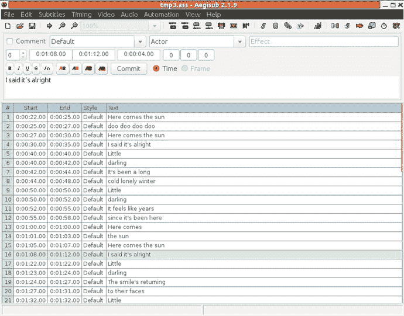
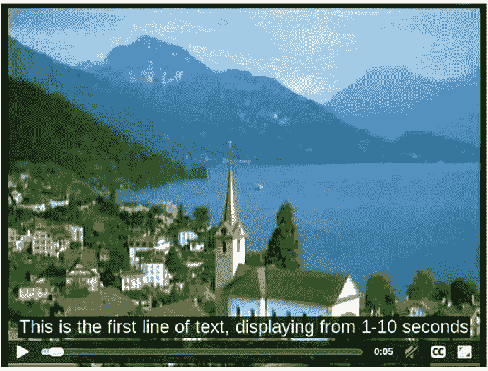

# 二十六、字幕和隐藏字幕

许多Karaoke 系统使用字幕 [<sup>1</sup>](#Fn1) 叠加在某种电影上。像`kmid`这样的程序和我的 Java 程序在某种画布对象上播放歌词。这给了一个相当无聊的背景。视频 CD 或 MPEG-4 文件有更好的背景，但歌词被硬编码到背景视频中，所以对它们进行操作的机会很小。CD+G 文件将歌词与视频分开，但似乎没有任何方法可以直接从 Linux 播放它们。它们可以被转换成 MP3+G，并且它们可以由 VLC 播放，它加载 MP3 文件并拾取相应的`.cdg`文件。

本章考虑可以独立制作的字幕，以某种方式与视频和音频结合，然后播放。目前的情况并不完全令人满意。

## 资源

查看以下资源:

*   《用 Linux 做字幕教程》( [`http://sub.wordnerd.de/linux-subs.html`](http://sub.wordnerd.de/linux-subs.html) )

## 字幕格式

本章关注的是所谓的软字幕，字幕存储在一个独立于视频或音频的文件中，并在渲染过程中被合并。维基百科页面“字幕(captioning)”([`http://en.wikipedia.org/wiki/Subtitle_(captioning`](http://en.wikipedia.org/wiki/Subtitle_(captioning)`)`)是一篇长文，探讨了许多关于字幕的问题。它还包含一个字幕格式列表，但是在这个上下文中最有用的是 SubStation Alpha。

### MPlayer

根据 MPlayer 页面“字幕和 OSD”([`www.mplayerhq.hu/DOCS/HTML/en/subosd.htm`](http://www.mplayerhq.hu/DOCS/HTML/en/subosd.htm))，以下是 MPlayer 可识别的格式:

1.  沃博布
2.  外出留言
3.  闭路字幕
4.  微 DVD
5.  subrip(子 ip)
6.  子观众
7.  萨米人
8.  虚拟播放器
9.  无线电报
10.  社会保障总署(Social Security Administration)
11.  PJS(凤凰日本学会)
12.  MPsub
13.  aititle
14.  JACOsub

### 可见光通讯

根据 VLC ( [`www.videolan.org/vlc/features.php?cat=sub`](http://www.videolan.org/vlc/features.php?cat=sub) ，Linux 下支持的字幕格式包括以下几种:

1.  数字影碟
2.  文本文件(MicroDVD、SubRIP、SubViewer、SSA1-5、SAMI、VPlayer)
3.  隐藏字幕
4.  沃博布
5.  通用字幕格式(USF)
6.  SVCD/CVD
7.  二乙烯基苯
8.  外出留言
9.  CMML(移动通信)
10.  凯特

如果您播放某种视频文件，比如说`XYZ.mpg`，并且还有一个具有相同根名称和适当扩展名的文件，比如`XYZ.ass`(变电站 Alpha 的扩展名)，那么 VLC 将自动加载字幕文件并播放它。如果字幕文件有不同的名称，那么它可以从 VLC 菜单视频➤字幕轨道加载。然而，这似乎没有共享名称可靠。

### Gnome 字幕制作

看到“Gnome 字幕 1.3 出来了！”( [`http://gnome-subtitles.sourceforge.net/`](http://gnome-subtitles.sourceforge.net/) )。Gnome 支持 Adobe Encore DVD、Advanced Sub Station、Alpha AQ、Title DKS 字幕格式 FAB 副标题Karaoke 歌词 LRC Karaoke 歌词 VKT MAC Sub MicroDVD MPlayer MPlayer 2 MP Sub Panimator Phoenix Japanimation Society Power DivX Sofni Sub creator 1 . x Sub rip Sub Station Alpha Sub viewer 1.0、SubViewer 2.0 和 ViPlay 字幕文件。

### 阿尔法变电站

SSA/ASS 规范位于 MooDub.free ( [`http://moodub.free.fr/video/ass-specs.doc`](http://moodub.free.fr/video/ass-specs.doc) )。它很简短，似乎包含了一些关于后来的规范和实现的小错误。比如时间格式不一样。还是后来的都是错的？

SSA/ASS 文件可以独立使用。它们也可以包含在诸如 Matroska 文件的容器格式中，这将在第 [3](03.html) 章中简要讨论。当它们被嵌入到 MKV 文件中时，会受到一些限制( [`www.matroska.org/technical/specs/subtitles/ssa.html`](http://www.matroska.org/technical/specs/subtitles/ssa.html) )，例如文本被转换成 UTF-8 Unicode。

ASS 文件分为几个部分。

1.  关于字幕文件期望的环境的一般信息，例如 X 和 Y 分辨率
2.  颜色和字体等样式信息
3.  事件信息，其中给出了字幕文本以及定时信息和要应用的任何特殊效果

在正常情况下，您不会使用文本编辑器直接创建这样的文件。相反，程序 Aegisub 为您提供了一个创建文件的 GUI 环境。实际上，您只需输入文本行，以及要显示的每行的开始和结束时间。

图 [26-1](#Fig1) 为屏幕截图。



图 26-1。

Aegisub screenshot

许多特殊效果是可能的。比尔·克雷斯韦尔博客上的视频( [`https://billcreswell.wordpress.com/tag/aegisub/`](https://billcreswell.wordpress.com/tag/aegisub/) )就是一个很好的例子。下面是 YouTube 的直接链接: [`www.youtube.com/watch?v=0Z0dgdglrAo`](http://www.youtube.com/watch?v=0Z0dgdglrAo) 。

为了完整起见，下面是我创建的一个 ASS 文件的一部分:

```sh
[Script Info]
; Script generated by Aegisub 2.1.9
; http://www.aegisub.org/
Title: Default Aegisub file
ScriptType: v4.00+
WrapStyle: 0
PlayResX: 640
PlayResY: 480
ScaledBorderAndShadow: yes
Video Aspect Ratio: 0
Video Zoom: 6
Video Position: 0

[V4+ Styles]
Format: Name, Fontname, Fontsize, PrimaryColour, SecondaryColour, OutlineColour, BackColour, Bold, Italic, Underline, StrikeOut, ScaleX, ScaleY, Spacing, Angle, BorderStyle, Outline, Shadow, Alignment, MarginL, MarginR, MarginV, Encoding
Style: Default,Arial,20,&H00FFFFFF,&H00B4FCFC,&H00000008,&H80000008,0,0,0,0,100,100,0,0,1,2,2,2,10,10,10,1

[Events]
Format: Layer, Start, End, Style, Name, MarginL, MarginR, MarginV, Effect, Text
Dialogue: 0,0:00:18.22,0:00:19.94,Default,,0000,0000,0000,,Here comes the sun
Dialogue: 0,0:00:20.19,0:00:21.75,Default,,0000,0000,0000,,doo doo doo doo
Dialogue: 0,0:00:22.16,0:00:24.20,Default,,0000,0000,0000,,Here comes the sun
Dialogue: 0,0:00:24.61,0:00:28.24,Default,,0000,0000,0000,,I said it's alright
...

```

## 屁股文件里的Karaoke 效果

ASS 文件中的一行基本上由开始显示的时间、结束显示的时间和文本本身组成。然而，Karaoke 用户习惯于在播放时突出显示文本。

ASS 支持两大高光样式。

1.  一次突出显示一个单词。
2.  文本通过从左侧填充来突出显示。

这些效果是通过在文本中嵌入“Karaoke 覆盖”来实现的。这些都在`{}`中，持续时间为百分之一秒。

详情如下:

1.  单词高亮显示对表单`{\k<time>}`的覆盖将高亮显示后面的单词`time`百分之一秒。下面是一个例子:

    ```sh
    {\k100}Here {\k150}comes {\k50}the {\k150}sun

    ```

2.  填充高亮显示对表单`{\kf<time>}`的覆盖将在百分之一秒的时间内逐渐填充接下来的单词`time`。下面是一个例子:

    ```sh
    {\kf100}Here {\kf150}comes {\kf50}the {\kf150}sun

    ```

    三种风格出现如下:
3.  Lines with no highlighting (see Figure [26-2](#Fig2))

    

    图 26-2。

    Subtitles without highlighting  
4.  Word highlighting (see Figure [26-3](#Fig3))

    

    图 26-3。

    Subtitles with word highlighting  
5.  Fill highlighting (see Figure [26-4](#Fig4))

    

    图 26-4。

    Subtitles with fill highlighting  

## 多线Karaoke

理想情况下，Karaoke 系统应该有一个“前瞻”机制，这样你就可以在唱出下一行之前看到它。这可以通过在不同高度显示两行重叠时间的文本来实现。算法如下:

```sh
When line N with markup is shown,
    show line N+1 without markup
After line N is finished, continue showing line N+1
When line N+1 is due to show,
     finish showing unmarked line N+1
     show line N+1 with markup

```

下面是歌曲《太阳来了》的歌词:

```sh
Here comes the sun
doo doo doo doo
Here comes the sun
I said it's alright

```

生成的 ASS 文件应该如下所示:

```sh
Dialogue: 0,0:00:18.22,0:00:19.94,Default,,0000,0000,0100,,{\kf16}Here {\kf46}comes {\kf43}the {\kf67}sun
Dialogue: 0,0:00:18.22,0:00:20.19,Default,,0000,0000,0000,,doo doo doo doo
Dialogue: 0,0:00:20.19,0:00:21.75,Default,,0000,0000,0000,,{\kf17}doo {\kf25}doo {\kf21}doo {\kf92}doo
Dialogue: 0,0:00:20.19,0:00:22.16,Default,,0000,0000,0100,,Here comes the sun
Dialogue: 0,0:00:22.16,0:00:24.20,Default,,0000,0000,0100,,{\kf17}Here {\kf46}comes {\kf43}the {\kf97}sun
Dialogue: 0,0:00:22.16,0:00:24.61,Default,,0000,0000,0000,,I said it's alright

```

图 [26-5](#Fig5) 显示了它的样子。


图 26-5。

Multiline subtitles

## 利巴斯

变电站阿尔法和它的渲染器似乎经历了复杂的历史。据《古今:VSFilter》([`http://blog.aegisub.org/2010/02/old-and-present-vsfilter.html`](http://blog.aegisub.org/2010/02/old-and-present-vsfilter.html))记载，ASS 格式大约在 2004 年定型，渲染器 vs filter 就是在那个时候开源的。然而，在 2007 年左右，VSFilter 的开发停止了，出现了几个分支。这些对格式引入了几个扩展，比如 Aegisub 的`blur`标签。其中一些分支后来被合并了，一些被放弃了，其中一些分支的代码仍然存在。

libass ( [`http://code.google.com/p/libass/`](http://code.google.com/p/libass/) )是 Linux 的主要渲染库。另一种替代方法 xy-vsfilter 号称更快、更可靠等等，但似乎没有 Linux 实现。libass 支持一些后来的扩展。这些似乎是 Aegisub 2008 的扩展，根据“vs filter hacks”([`http://blog.aegisub.org/2008/07/vsfilter-hacks.html`](http://blog.aegisub.org/2008/07/vsfilter-hacks.html))。

## 将 KAR 文件转换成带屁股字幕的 MKV 文件

请遵循以下步骤:

1.  要从 KAR 或 MIDI 文件中提取歌词，使用第 [18](18.html) 章中给出的 Java `DumpSequence`，如下所示，获取所有事件的转储:

    ```sh
    java DumpSequence  song.kar  > song.dump

    ```

2.  对于仅行显示，使用 Aegisub 2.1.9 生成的以下 Python 脚本提取歌词并保存为 ASS 格式:

    ```sh
    #!/usr/bin/python

    import fileinput
    import string
    import math

    TEXT_STR = "Dialogue: 0,%s,%s,Default,,0000,0000,0000,Karaoke,"

    textStr = TEXT_STR
    startTime = -1
    endTime = -1

    def printPreface():
        print '[Script Info]\r\n\
    ; Script generated by Aegisub 2.1.9\r\n\
    ; http://www.aegisub.org/\r\n\
    Title: Default Aegisub file\r\n\
    ScriptType: v4.00+\r\n\
    WrapStyle: 0\r\n\
    PlayResX: 640\r\n\
    PlayResY: 480\r\n\
    ScaledBorderAndShadow: yes\r\n\
    Video Aspect Ratio: 0\r\n\
    Video Zoom: 6\r\n\
    Video Position: 0\r\n\
    \r\n\
    [V4+ Styles]\r\n\
    Format: Name, Fontname, Fontsize, PrimaryColour, SecondaryColour, OutlineColour, BackColour, Bold, Italic, Underline, StrikeOut, ScaleX, ScaleY, Spacing, Angle, BorderStyle, Outline, Shadow, Alignment, MarginL, MarginR, MarginV, Encoding\r\n\
    Style: Default,Arial,36,&H00FFFFFF,&H000000FF,&H00000000,&H00000000,0,0,0,0,100,100,0,0,1,2,2,2,10,10,10,1\r\n\
    \r\n\
    [Events]\r\n\
    Format: Layer, Start, End, Style, Name, MarginL, MarginR, MarginV, Effect, Text'

    def timeFormat(s):
        global microSecondsPerTick

        tf = float(s)
        tf /= 62.6  #ticks per sec

        # This should be right , but is too slow
        #tf = (tf * microSecondsPerTick) / 1000000

        t = int(math.floor(tf))
        hundredths = round((tf-t)*100)
        secs = t % 60
        t /= 60
        mins = t % 60
        t /= 60
        hrs = t
        return "%01d:%02d:%02d.%02d" % (hrs, mins, secs, hundredths)

    def doLyric(words):
        global textStr
        global startTime
        global endTime
        global TEXT_STR

        if words[1] == "0:":
            #print "skipping"
            return

        time = string.rstrip(words[1], ':')
        if startTime == -1:
            startTime = time
        #print words[1],
        if len(words) == 5:
            if words[4][0] == '\\' or words[4][0] == '/':
                #print "My name is %s and weight is %d kg!" % ('Zara', 21)
                #print startTime, endTime
                print textStr % (timeFormat(startTime), timeFormat(endTime)) + "\r\n",
                textStr = TEXT_STR + words[4][:1]
                startTime = -1
            else:
                textStr += words[4]
        else:
            textStr += ' '

        endTime = time

    printPreface()

    for line in fileinput.input():
        words = line.split()

        if len(words)  >= 2:
            if words[0] == "Resolution:":
                ticksPerBeat = words[1]
            elif words[0] == "Length:":
                numTicks = int(words[1])
            elif words[0] == "Duration:":
                duration = int(words[1])
                microSecondsPerTick = duration/numTicks
                # print "Duration %d numTicks %d microSecondsPerTick %d" % (duration, numTicks, microSecondsPerTick)

        if len(words) >= 3 and words[2] == "Text":
            doLyric(words)

    ```

    下面是一个例子:

    ```sh
    python lyric2ass4kar.py song.dump > song.ass

    ```

3.  对于填充歌词显示，使用下面的 Python 脚本提取歌词并以 ASS 格式保存:

    ```sh
     #!/usr/bin/python

    import fileinput
    import string
    import math

    TEXT_STR = "Dialogue: 0,%s,%s,Default,,0000,0000,0000,,"

    textStr = "{\kf%d}"
    plainTextStr = ""
    startTime = -1
    startWordTime = -1
    endTime = -1

    def printPreface():
        print '[Script Info]\r\n\
    ; Script generated by Aegisub 2.1.9\r\n\
    ; http://www.aegisub.org/\r\n\
    Title: Default Aegisub file\r\n\
    ScriptType: v4.00+\r\n\
    WrapStyle: 0\r\n\
    PlayResX: 640\r\n\
    PlayResY: 480\r\n\
    ScaledBorderAndShadow: yes\r\n\
    Video Aspect Ratio: 0\r\n\
    Video Zoom: 6\r\n\
    Video Position: 0\r\n\
    \r\n\
    [V4+ Styles]\r\n\
    Format: Name, Fontname, Fontsize, PrimaryColour, SecondaryColour, OutlineColour, BackColour, Bold, Italic, Underline, StrikeOut, ScaleX, ScaleY, Spacing, Angle, BorderStyle, Outline, Shadow, Alignment, MarginL, MarginR, MarginV, Encoding\r\n\
    Style: Default,Arial,36,&H00FFFFFF,&H000000FF,&H00000000,&H00000000,0,0,0,0,100,100,0,0,1,2,2,2,10,10,10,1\r\n\
    \r\n\
    [Events]\r\n\
    Format: Layer, Start, End, Style, Name, MarginL, MarginR, MarginV, Effect, Text'

    def timeFormat(s):
        global microSecondsPerTick

        tf = float(s)

        # frames per sec should be 60: 120 beats/min, 30 ticks per beat
        # but it is too slow on 54154
        tf /= 62.6  #ticks per sec

        # This should be right , but is too slow
        # tf = (tf * microSecondsPerTick) / 1000000

        t = int(math.floor(tf))
        hundredths = round((tf-t)*100)
        secs = t % 60
        t /= 60
        mins = t % 60
        t /= 60
        hrs = t
        return "%01d:%02d:%02d.%02d" % (hrs, mins, secs, hundredths)

    def durat(end, start):
        fend = float(end)
        fstart = float(start)
        d = (fend - fstart) / 62.9
        #print end, start, d
        return round(d*100)

    def doLyric(words):
        global textStr
        global plainTextStr
        global startTime
        global endTime
        global TEXT_STR
        global startWordTime
        global lineNum

        if words[1] == "0:":
            #print "skipping"
            return

        time = string.rstrip(words[1], ':')
        if startTime == -1:
            startTime = time
            startWordTime = time
            previousEndTime = time
        #print words[1],
        if len(words) == 5:
            if words[4][0] == '\\' or words[4][0] == '/':
                #print "My name is %s and weight is %d kg!" % ('Zara', 21)
                #print startTime, endTime
                dur = durat(time, startWordTime)
                textStr = textStr % (dur)
                if len(words[4]) == 1:
                    print TEXT_STR % (timeFormat(startTime),
                                      timeFormat(endTime)) + \
                                      textStr + "\r\n",

                # next word
                textStr = "{\kf%d}" + words[4][1:]
                startTime = -1
            else:
                textStr += words[4]
        else:
            # it's a space, gets lost by the split
            dur = durat(time, startWordTime)
            textStr = textStr % (dur) + " {\kf%d}"
            startWordTime = time

        endTime = time

    printPreface()
    # print "Dialogue: 0,0:00:18.22,0:00:19.94,Default,,0000,0000,0000,,{\k16}Here {\k46}comes {\k43}the {\k67}sun"

    for line in fileinput.input():
        words = line.split()

        if len(words)  >= 2:
            if words[0] == "Resolution:":
                ticksPerBeat = words[1]
            elif words[0] == "Length:":
                numTicks = int(words[1])
            elif words[0] == "Duration:":
                duration = int(words[1])
                microSecondsPerTick = duration/numTicks
                # print "Duration %d numTicks %d microSecondsPerTick %d" % (duration, numTicks, microSecondsPerTick)

        if len(words) >= 3 and words[2] == "Text":
            doLyric(words)

    ```

    下面是一个例子:

    ```sh
    python lyric2karaokeass4kar.py song.dump > song.ass

    ```

4.  对于多行歌词显示，使用下面的 Python 脚本提取歌词并以 ASS 格式保存:

    ```sh
     #!/usr/bin/python

    import fileinput
    import string
    import math

    START_EVENTS = ["Dialogue: 0,%s,%s,Default,,0000,0000,0000,,",
                    "Dialogue: 0,%s,%s,Default,,0000,0000,0100,,"]

    TEXT_STR = "Dialogue: 0,%s,%s,Default,,0000,0000,0000,,"
    TEXT_STR2 = "Dialogue: 0,%s,%s,Default,,0000,0000,0100,,"

    textStr = "{\kf%d}"
    plainTextStr = ""
    startTime = -1
    previousStartTime = -1
    startWordTime = -1
    endTime = -1
    previousEndTime = -1
    lineNum = 0

    def printPreface():
        print '[Script Info]\r\n\
    ; Script generated by Aegisub 2.1.9\r\n\
    ; http://www.aegisub.org/\r\n\
    Title: Default Aegisub file\r\n\
    ScriptType: v4.00+\r\n\
    WrapStyle: 0\r\n\
    PlayResX: 640\r\n\
    PlayResY: 480\r\n\
    ScaledBorderAndShadow: yes\r\n\
    Video Aspect Ratio: 0\r\n\
    Video Zoom: 6\r\n\
    Video Position: 0\r\n\
    \r\n\
    [V4+ Styles]\r\n\
    Format: Name, Fontname, Fontsize, PrimaryColour, SecondaryColour, OutlineColour, BackColour, Bold, Italic, Underline, StrikeOut, ScaleX, ScaleY, Spacing, Angle, BorderStyle, Outline, Shadow, Alignment, MarginL, MarginR, MarginV, Encoding\r\n\
    Style: Default,Arial,36,&H00FFFFFF,&H000000FF,&H00000000,&H00000000,0,0,0,0,100,100,0,0,1,2,2,2,10,10,10,1\r\n\
    \r\n\
    [Events]\r\n\
    Format: Layer, Start, End, Style, Name, MarginL, MarginR, MarginV, Effect, Text'

    def timeFormat(s):
        global microSecondsPerTick

        tf = float(s)
        # print "factori is %f instead of %f" % ((1.0*microSecondsPerTick / 1000000), (1.0/62.9))
        # frames per sec should be 60: 120 beats/min, 30 ticks per beat
        # but it is too slow on 54154
        tf /= 62.6  #ticks per sec

        # This should be right , but is too slow
        # tf = (tf * microSecondsPerTick) / 1000000

        t = int(math.floor(tf))
        hundredths = round((tf-t)*100)
        secs = t % 60
        t /= 60#!/usr/bin/python

    import fileinput
    import string
    import math

    START_EVENTS = ["Dialogue: 0,%s,%s,Default,,0000,0000,0000,,",
                    "Dialogue: 0,%s,%s,Default,,0000,0000,0100,,"]

    TEXT_STR = "Dialogue: 0,%s,%s,Default,,0000,0000,0000,,"
    TEXT_STR2 = "Dialogue: 0,%s,%s,Default,,0000,0000,0100,,"

    textStr = "{\kf%d}"
    plainTextStr = ""
    startTime = -1
    previousStartTime = -1
    startWordTime = -1
    endTime = -1
    previousEndTime = -1
    lineNum = 0

    def printPreface():
        print '[Script Info]\r\n\
    ; Script generated by Aegisub 2.1.9\r\n\
    ; http://www.aegisub.org/\r\n\
    Title: Default Aegisub file\r\n\
    ScriptType: v4.00+\r\n\
    WrapStyle: 0\r\n\
    PlayResX: 640\r\n\
    PlayResY: 480\r\n\
    ScaledBorderAndShadow: yes\r\n\
    Video Aspect Ratio: 0\r\n\
    Video Zoom: 6\r\n\
    Video Position: 0\r\n\
    \r\n\
    [V4+ Styles]\r\n\
    Format: Name, Fontname, Fontsize, PrimaryColour, SecondaryColour, OutlineColour, BackColour, Bold, Italic, Underline, StrikeOut, ScaleX, ScaleY, Spacing, Angle, BorderStyle, Outline, Shadow, Alignment, MarginL, MarginR, MarginV, Encoding\r\n\
    Style: Default,Arial,36,&H00FFFFFF,&H000000FF,&H00000000,&H00000000,0,0,0,0,100,100,0,0,1,2,2,2,10,10,10,1\r\n\
    \r\n\
    [Events]\r\n\
    Format: Layer, Start, End, Style, Name, MarginL, MarginR, MarginV, Effect, Text'

    def timeFormat(s):
        global microSecondsPerTick

        tf = float(s)
        # print "factori is %f instead of %f" % ((1.0*microSecondsPerTick / 1000000), (1.0/62.9))
        # frames per sec should be 60: 120 beats/min, 30 ticks per beat
        # but it is too slow on 54154
        tf /= 62.6  #ticks per sec

        # This should be right , but is too slow
        # tf = (tf * microSecondsPerTick) / 1000000

        t = int(math.floor(tf))
        hundredths = round((tf-t)*100)
        secs = t % 60
        t /= 60
        mins = t % 60
        t /= 60
        hrs = t
        return "%01d:%02d:%02d.%02d" % (hrs, mins, secs, hundredths)

    def durat(end, start):
        fend = float(end)
        fstart = float(start)
        d = (fend - fstart) / 62.9
        #print end, start, d
        return round(d*100)

    def doLyric(words):
        global textStr
        global plainTextStr
        global startTime
        global endTime
        global previousStartTime
        global previousEndTime
        global TEXT_STR
        global startWordTime
        global lineNum

        if words[1] == "0:":
            #print "skipping"
            return

        time = string.rstrip(words[1], ':')
        if startTime == -1:
            startTime = time
            startWordTime = time
            previousEndTime = time
        #print words[1],
        if len(words) == 5:
            if words[4][0] == '\\' or words[4][0] == '/':
                #print "My name is %s and weight is %d kg!" % ('Zara', 21)
                #print startTime, endTime
                dur = durat(time, startWordTime)
                textStr = textStr % (dur)

                if len(words[4]) == 1:

                    if previousStartTime != -1:
                        print START_EVENTS[lineNum % 2] % (timeFormat(previousStartTime),
                                                           timeFormat(previousEndTime)) + \
                                                           plainTextStr + "\r\n",
                    print START_EVENTS[lineNum % 2] % (timeFormat(startTime),
                                                       timeFormat(endTime)) + \
                                                       textStr + "\r\n",

                # next word
                lineNum += 1
                #previousEndTime = time
                textStr = "{\kf%d}" + words[4][1:]
                plainTextStr = words[4][1:]
                previousStartTime = startTime
                startTime = -1
            else:
                textStr += words[4]
                plainTextStr += words[4]
        else:
            #print textStr
            #dur = duration(time, startWordTime)
            dur = durat(time, startWordTime)
            textStr = textStr % (dur) + " {\kf%d}"
            plainTextStr += ' '
            startWordTime = time

        endTime = time

    printPreface()
    # print "Dialogue: 0,0:00:18.22,0:00:19.94,Default,,0000,0000,0000,,{\k16}Here {\k46}comes {\k43}the {\k67}sun"

    for line in fileinput.input():
        words = line.split()

        if len(words)  >= 2:
            if words[0] == "Resolution:":
                ticksPerBeat = words[1]
            elif words[0] == "Length:":
                numTicks = int(words[1])
            elif words[0] == "Duration:":
                duration = int(words[1])
                microSecondsPerTick = duration/numTicks
                # print "Duration %d numTicks %d microSecondsPerTick %d" % (duration, numTicks, microSecondsPerTick)

        if len(words) >= 3 and words[2] == "Text":
            doLyric(words)
        mins = t % 60
        t /= 60
        hrs = t
        return "%01d:%02d:%02d.%02d" % (hrs, mins, secs, hundredths)

    def durat(end, start):
        fend = float(end)
        fstart = float(start)
        d = (fend - fstart) / 62.9
        #print end, start, d
        return round(d*100)

    def doLyric(words):
        global textStr
        global plainTextStr
        global startTime
        global endTime
        global previousStartTime
        global previousEndTime
        global TEXT_STR
        global startWordTime
        global lineNum

        if words[1] == "0:":
            #print "skipping"
            return

        time = string.rstrip(words[1], ':')
        if startTime == -1:
            startTime = time
            startWordTime = time
            previousEndTime = time
        #print words[1],
        if len(words) == 5:
            if words[4][0] == '\\' or words[4][0] == '/':
                #print "My name is %s and weight is %d kg!" % ('Zara', 21)
                #print startTime, endTime
                dur = durat(time, startWordTime)
                textStr = textStr % (dur)

                if len(words[4]) == 1:

                    if previousStartTime != -1:
                        print START_EVENTS[lineNum % 2] % (timeFormat(previousStartTime),
                                                           timeFormat(previousEndTime)) + \
                                                           plainTextStr + "\r\n",
                    print START_EVENTS[lineNum % 2] % (timeFormat(startTime),
                                                       timeFormat(endTime)) + \
                                                       textStr + "\r\n",

                # next word
                lineNum += 1
                #previousEndTime = time
                textStr = "{\kf%d}" + words[4][1:]
                plainTextStr = words[4][1:]
                previousStartTime = startTime
                startTime = -1
            else:
                textStr += words[4]
                plainTextStr += words[4]
        else:
            #print textStr
            #dur = duration(time, startWordTime)
            dur = durat(time, startWordTime)
            textStr = textStr % (dur) + " {\kf%d}"
            plainTextStr += ' '
            startWordTime = time

        endTime = time

    printPreface()
    # print "Dialogue: 0,0:00:18.22,0:00:19.94,Default,,0000,0000,0000,,{\k16}Here {\k46}comes {\k43}the {\k67}sun"

    for line in fileinput.input():
        words = line.split()

        if len(words)  >= 2:
            if words[0] == "Resolution:":
                ticksPerBeat = words[1]
            elif words[0] == "Length:":
                numTicks = int(words[1])
            elif words[0] == "Duration:":
                duration = int(words[1])
                microSecondsPerTick = duration/numTicks
                # print "Duration %d numTicks %d microSecondsPerTick %d" % (duration, numTicks, microSecondsPerTick)

        if len(words) >= 3 and words[2] == "Text":
            doLyric(words)

    ```

    下面是一个例子:

    ```sh
    python lyric2karaokeass4kar.py song.dump > song.ass

    ```

5.  使用`fluidsynth`将 MIDI 声音文件转换成 WAV 文件。

    ```sh
    fluidsynth -F song.wav /usr/share/sounds/sf2/FluidR3_GM.sf2 song.kar

    ```

6.  将 WAV 文件转换成 MP3。

    ```sh
    lame song.wav song.mp3

    ```

7.  为你的背景找一个合适的纯视频文件(我用了我的Karaoke 光盘中的一个)，然后把它们合并成一个 MKV 文件。

    ```sh
    mkvmerge -o 54154.mkv 54154.mp3 54154.ass BACK01.MPG

    ```

生成的 MKV 文件可以作为独立文件由 MPlayer 播放。

```sh
mplayer song.mkv

```

它也可以由 VLC 演奏，但只有在屁股文件存在的情况下。

```sh
vlc song.mkv

```

根据所选的Karaoke 效果，屏幕截图在本章的前面已经显示过了。

然而，时机是个问题。默认的 MIDI 速度是每分钟 120 拍，常见的节拍率是每拍 30 拍。这导致每秒 60 个 MIDI 滴答声的速率。但是，您现在播放的是 MP3 文件和 ASS 文件，这两个文件都不再是 MIDI 文件，也不一定是同步的。从 MIDI 到 ASS 的转换速度为每秒 60 个节拍，歌词运行太慢。通过实验，我发现至少对于某些文件来说，62.9 是一个合理的比率。

## HTML5 字幕

HTML5 支持视频类型，尽管具体哪种浏览器支持哪种视频格式是可变的。这包括使用 HTML 5.1 track 元素支持字幕和隐藏字幕。搜索会找到几篇详细讨论这个问题的文章。

你需要准备一份时间和文字说明文件。示例中显示的格式是一个`.vtt`文件，如下所示:

```sh
WEBVTT

1
00:00:01.000 --> 00:00:30.000  D:vertical A:start
This is the first line of text, displaying from 1-30 seconds

2
00:00:35.000 --> 00:00:50.000
And the second line of text
separated over two lines from 35 to 50 seconds

```

这里第一行是`WEBVTT`，文本块由空行分隔。VTT 文件的格式在“Web vtt:Web 视频文本轨迹格式”( [`http://dev.w3.org/html5/webvtt/`](http://dev.w3.org/html5/webvtt/) )中指定。

HTML 然后引用音频/视频文件和字幕文件，如下所示:

```sh
    <video  controls>
      <source src="output.webm" controls>
      <track src="54154.vtt" kind="subtitles" srclang="en" label="English" default />
      <!-- fallback for rubbish browsers -->
    </video>

```

图 [26-6](#Fig6) 显示了一个屏幕截图。



图 26-6。

HTML5 subtitles

似乎没有任何机制来逐步突出显示一行中的单词。JavaScript 也许可以做到这一点，但是粗略看了一下，似乎不太可能。这使得它还不适合Karaoke。

## 结论

本章讨论了将字幕文本叠加到变化的视频图像上的方法。这是可行的，但只有几种可行的机制。

Footnotes [1](#Fn1_source)

严格来说，字幕指的是说话的内容，而隐藏字幕可能包括其他声音，如关门声。对于Karaoke 来说，没必要区分。