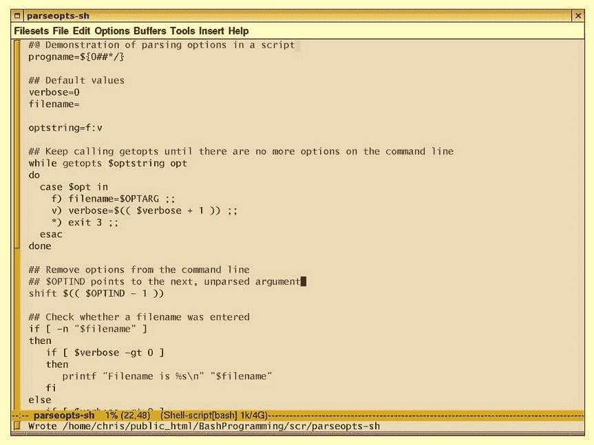

# 一、你好世界：你的第一个 Shell 程序

一个 *shell 脚本*是一个包含一个或多个您可以在命令行上输入的命令的文件。本章描述了如何创建这样的文件并使其可执行。它还涵盖了围绕 shell 脚本的一些其他问题，包括如何命名文件、将文件放在哪里以及如何运行它们。

我将从每种计算机语言中传统演示的第一个程序开始:一个打印“Hello，World！”在你的终端。这是一个简单的程序，但它足以演示许多重要的概念。代码本身是本章最简单的部分。命名文件并决定将它放在哪里并不是复杂的任务，但却很重要。

在本章的大部分时间里，您将在一个终端中工作。它可以是一个虚拟终端，一个终端窗口，甚至是一个哑终端。在您的终端中，shell 将立即执行您键入的任何命令(当然是在您按 Enter 键之后)。

你应该在你的主目录中，你可以在变量`$` `HOME` 中找到:

```sh
echo "$HOME"
```

你可以用`pwd`命令或`PWD`变量找到当前目录:

```sh
pwd
echo "$PWD"
```

如果您不在您的主目录中，您可以通过键入`cd`并在 shell 提示符下按 Enter 键到达那里。

 **注意**如果你在 Mac 上尝试本书中的代码，请注意，当前版本的 Mac OS X，Yosemite，官方支持 Bash 版本 3.2.53(1)。Bash 的当前版本是 4.3，它修复了 Shellshock 漏洞。Bash 4.3 适用于大多数 Linux 发行版。一些代码/功能可能在 Mac OS X 系统上不可用，因为它是特定于 Bash 4.x 的

《守则》

代码无非是这样的:

```sh
echo Hello, World!
```

这个命令行有三个词:命令本身和两个参数。命令`echo`打印其参数，用一个空格分隔，并以换行符结束。

文件

在将代码转换成脚本之前，您需要做出两个决定:将文件命名为什么，以及将它放在哪里。该名称应该是唯一的(也就是说，它不应该与任何其他命令冲突)，并且应该放在 shell 可以找到它的地方。

脚本的命名

初学者经常犯的错误是把一个测试脚本叫做`test`。要了解为什么这样不好，请在命令提示符下输入以下内容:

```sh
type test
```

命令告诉你对于任何给定的命令，shell 将执行什么(如果它是一个外部文件，还可以在哪里找到它)。在`bash`，`type -a test`会显示所有与名称`test`，匹配的命令:

```sh
$ type test
test is a shell builtin
$ type -a test
test is a shell builtin
test is /usr/bin/test
```

如你所见，名为`test`的命令已经存在；它用于测试文件类型和比较值。如果你调用你的脚本`test`，当你在 shell 提示符下键入`test`时，它将不会运行；将运行由`type`标识的第一个命令。(关于`type`和`test`，我将在后面的章节中详细讨论。)

通常，Unix 命令名尽可能短。它们通常是描述性词语的前两个辅音(例如，`mv`代表 **m** o **v** e 或`ls`代表 **l** i **s** t)或描述性短语的第一个字母(例如，`ps`代表**p**process**s**tatus 或`sed`代表**s**stream**ed**itor)

在这个练习中，调用脚本`hw`。很多 shell 程序员都会加一个后缀，比如*。* `sh`，以表示该程序是一个 shell 脚本。脚本不需要它，我只对正在开发的程序使用一个。我的后缀是`-sh`，当程序结束时，我删除它。shell 脚本成为另一个命令，不需要与任何其他类型的命令区分开来。

为脚本选择一个目录

当 shell 被赋予要执行的命令的名称时，它会在`PATH`变量中列出的目录中查找该名称。此变量包含以冒号分隔的目录列表，这些目录包含可执行命令。这是`$PATH`的典型值:

```sh
!"
/bin:/usr/bin:/usr/local/bin:/usr/games
```

如果你的程序不在`PATH`目录中，你必须给出一个路径名，无论是绝对的还是相对的，以便`bash`找到它。一个*绝对*路径名给出了文件系统根目录的位置，比如`/home/chris/bin/hw`；一个*相对*路径名是相对于当前工作目录(当前应该是你的主目录)给出的，如`bin/hw` *。*

命令通常存储在名为`bin`的目录中，用户的个人程序存储在`$HOME`目录下的`bin`子目录中。要创建该目录，请使用以下命令:

```sh
mkdir bin
```

现在它已经存在，必须添加到`PATH`变量中:

```sh
PATH=$PATH:$HOME/bin
```

要将这一更改应用到您打开的每个 shell，请将它添加到一个文件中，当 shell 被调用时，它将*源*。这将是`.bash_profile`、`.bashrc`或`.profile`，取决于`bash`是如何被调用的。这些文件仅用于交互式 shells，不用于脚本。

创建文件并运行脚本

通常您会使用文本编辑器来创建您的程序，但是对于这样一个简单的脚本，没有必要调用编辑器。您可以使用重定向从命令行创建该文件:

```sh
echo echo Hello, World! > bin/hw
```

大于号(`>`)告诉 shell 将命令的输出发送到指定的文件，而不是发送到终端。你将在第 2 章中了解更多关于重定向的内容。

现在，可以通过将该程序作为 shell 命令的参数调用来运行该程序:

```sh
bash bin/hw
```

那行得通，但并不完全令人满意。您希望能够键入`hw`，而不必在前面加上`bash`，并执行命令。为此，授予文件执行权限:

```sh
chmod +x bin/hw
```

现在，只需使用其名称就可以运行该命令:

```sh
!"
$ hw
Hello, World!
```

选择和使用文本编辑器

对许多人来说，电脑软件中最重要的一部分是文字处理器。虽然我用一个来写这本书(LibreOffice 作家 )，但我不经常用它。我最后一次使用文字处理器是在五年前，当时我写了这本书的第一版。另一方面，文本编辑器是不可或缺的工具。我用它来写电子邮件、新闻组文章、shell 脚本、PostScript 程序、网页等等。

文本编辑器对纯文本文件进行操作。它只存储您键入的字符；它没有添加任何隐藏的格式代码。如果我在文本编辑器中键入`A`并按回车键，然后保存它，文件将包含两个字符:*一个*和一个换行符。包含相同文本的文字处理文件要大几千倍。(带*字* ，文件包含 2526 字节；LibreOffice.org 文件包含 7579 个字节。)

您可以在任何文本编辑器中编写脚本，从基本的`e3`或`nano`T5 到全功能的`emacs`或`nedit`T6。更好的文本编辑器允许你一次打开多个文件。例如，它们通过语法突出显示、自动缩进、自动完成、拼写检查、宏、搜索和替换以及撤消来简化代码编辑。最终，你选择哪个编辑器是个人喜好的问题。我使用 GNU `emacs`(见[图 1-1](#Fig1) )。



[图 1-1](#_Fig1) 。GNU `emacs`文本编辑器中的 Shell 代码

 **注意**在 Windows 文本文件中，！“行以两个字符结束:一个*回车符* (CR)和一个*换行符* (LF)。在 Unix 系统上，比如 Linux，行以一个换行符结束。如果在 Windows 文本编辑器中编写程序，则必须用 Unix 行尾保存文件，或者在保存后删除回车。

建设一个更好的“你好，世界！”

在本章的前面，您使用重定向创建了一个脚本。至少可以说，那个剧本是极简主义的。所有的程序，甚至是一行程序，都需要文档。信息至少应该包括作者、日期和命令描述。在文本编辑器中打开文件`bin/` `hw` ，使用*注释*添加[清单 1-1](#list1) 中的信息。

[***清单 1-1***](#_list1) 。`hw`

```sh
#!/bin/bash
#: Title       : hw
#: Date        : 2008-11-26
#: Author      : "Chris F.A. Johnson" <shell@cfajohnson.com>
#: Version     : 1.0
#: Description : print Hello, World!
#: Options     : None

printf "%s\n" "Hello, World!" !"
```

注释在一个*单词*的开头以一个八叉符或者*散列* 开始，一直持续到行尾。Shell 会忽略它们。我经常在散列后添加一个字符来表示注释的类型。然后，我可以在文件中搜索我想要的类型，忽略其他注释。

第一行是一种特殊类型的注释，称为 *shebang* 或 *hash-* *bang* 。它告诉系统使用哪个*解释器*来执行文件。字符`#!` 必须出现在第一行的最开头；换句话说，它们必须是文件的前两个字节才能被识别。

摘要

以下是您在本章中学到的命令、概念和变量。

命令

*   `pwd`:打印当前工作目录的名称
*   `cd`:改变 shell 的工作目录
*   `echo`:打印它的参数，用空格分开，用换行符结束
*   `type`:显示命令的信息
*   `mkdir`:新建一个目录
*   `chmod`:修改文件的权限
*   `source: a.k.a. . (dot)`:在当前 shell 环境中执行脚本
*   `printf`:打印格式字符串指定的参数

概念

*   *脚本*:这是一个包含 shell 要执行的命令的文件。
*   *Word* :单词是 shell 认为是一个单元的字符序列。
*   *输出重定向*:您可以使用`>` `FILENAME` 将命令的输出发送到一个文件而不是终端。
*   *变量*:这些是存储值的名字。
*   *注释*:它们由一个未加引号的*单词*组成，以`#`开头。该行的所有剩余字符构成一个注释，将被忽略。
*   *Shebang 或 hash-bang* :这是一个散列和一个感叹号(`#!`)，后跟应该执行文件的解释器的路径。
*   *解释器*:这是一个读取文件并执行其中包含的语句的程序。它可能是一个 shell 或另一种语言解释器，如`awk`或`python`。

变量

*   `PWD`包含 shell 当前工作目录的路径名。
*   `HOME`存储用户主目录的路径名。
*   `PATH`是一个用冒号分隔的目录列表，其中存储了命令文件。shell 在这些目录中搜索它需要执行的命令。

练习

1.  编写一个脚本，在`$HOME` *中创建一个名为`bpl`的目录。*用两个子目录`bin`和`scripts`填充这个目录。
2.  编写一个脚本来创建“Hello，World！”`$HOME/bpl/bin/`中的脚本`hw`；使其可执行；然后执行它。