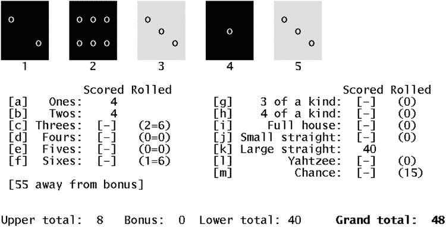
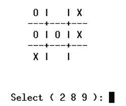

# 十一、命令行编程

这本书是关于用 shell 编程，而不是在命令行使用它。您在这里找不到关于编辑命令行、创建命令提示符(`PS1`变量)或从您的交互历史中检索命令的信息。这一章是关于在命令行中比在其他脚本中更有用的脚本。

本章介绍的许多脚本都是 shell 函数。其中一些必须如此，因为它们改变了环境。其他的是函数，因为它们经常被使用，而且用起来更快。其他的既有函数也有独立的脚本。

操作目录堆栈

`cd`命令会记住之前的工作目录，`cd -`会返回。还有另一个命令，将改变目录，并记住无限数量的目录:`pushd`。目录存储在一个数组中，`DIRSTACK`。为了返回到前一个目录，`popd`将顶部的条目从`DIRSTACK`中取出，并使其成为当前目录。我使用了两个函数使处理`DIRSTACK`更容易，为了完整起见，我在这里添加了第三个函数。

 **注意**本章中创建的一些函数的名称类似于 Bash 中可用的命令。这样做的原因是使用您现有的 shell 脚本，而不需要对它们进行任何更改，并且仍然可以利用一些附加的功能。

激光唱片

`cd`函数替换同名内置命令。该函数使用内置命令`pushd`改变目录并将新目录存储在`DIRSTACK`上。如果没有给出目录，`pushd`使用`$HOME`。如果更改目录失败，`cd`会打印一条错误消息，并且函数返回一个失败的退出代码([清单 11-1](#list1) )。

[***清单 11-1***](#_list1) 。`cd`，改变目录，在目录栈上保存位置

```sh
cd() #@ Change directory, storing new directory on DIRSTACK
{
  local dir error          ## variables for directory and return code

  while :                  ## ignore all options
  do
    case $1 in
      --) break ;;
      -*) shift ;;
      *) break ;;
    esac
  done

  dir=$1

  if [ -n "$dir" ]         ## if a $dir is not empty
  then
    pushd "$dir"           ## change directory
  else
    pushd "$HOME"          ## go HOME if nothing on the command line
  fi 2>/dev/null           ## error message should come from cd, not pushd

  error=$?     ## store pushd's exit code

  if [ $error -ne 0 ]      ## failed, print error message
  then
    builtin cd "$dir"      ## let the builtin cd provide the error message
  fi
  return "$error"          ## leave with pushd's exit code
} > /dev/null
```

标准输出被重定向到位桶，因为`pushd`打印`DIRSTACK`的内容，唯一的其他输出被发送到标准错误(`>&2`)。

 **注意**标准命令(如`cd`)的替代应该接受原始命令接受的任何内容。在`cd`的情况下，选项`-L`和`-P`被接受，即使它们被忽略。也就是说，我确实有时会忽略选项，甚至没有为它们做好准备，尤其是如果它们是我从未使用过的选项。

螺纹中径

这里的`pd`函数是为了完整起见([清单 11-2](#list2) )。是懒人对`popd`的称呼方式；我不用它。

[***清单 11-2***](#_list2) 。`pd`，用`popd`返回上一个目录

```sh
pd ()
{
    popd
} >/dev/null ### for the same reason as cd
```

连续地层（倾角仪）

我不用`pd`的原因不是因为我不懒。远非如此，但我更喜欢保持`DIRSTACK`不变，这样我就可以在目录之间来回移动。出于这个原因，我使用一个菜单来显示`DIRSTACK`中的所有目录。

`cdm`函数将输入字段分隔符(`IFS`)设置为一个换行符(`NL`或`LF`)，以确保`dirs`内置命令的输出在分词后将文件名保持在一起([清单 11-3](#list3) )。包含换行符的文件名仍然会引起问题；带有空格的名字令人讨厌，但是带有换行符的名字令人厌恶。

该函数遍历`DIRSTACK` ( `for dir in $(dirs -l -p)`)中的名字，将每个名字添加到一个数组`item`，除非它已经存在。然后这个数组被用作`menu`函数的参数(下面讨论)，它必须在`cdm`被使用之前获得。

*DIRS* 内置命令

`dirs`内置命令列出了`DIRSTACK`数组中的目录。默认情况下，它在一行中列出它们，用波浪符号表示`HOME`的值。`-l`选项将`~`扩展到`$HOME`，并且`-p`打印目录，每行一个。

[***清单 11-3***](#_list3) 。`cdm`，从已经访问过的目录菜单中选择新目录

```sh
cdm() #@ select new directory from a menu of those already visited
{
  local dir IFS=$'\n' item
  for dir in $(dirs -l -p)             ## loop through diretories in DIRSTACK[@]
  do
    [ "$dir" = "$PWD" ] && continue    ## skip current directory
    case ${item[*]} in
      *"$dir:"*) ;;                    ## $dir already in array; do nothing
      *) item+=( "$dir:cd '$dir'" ) ;; ## add $dir to array
    esac
  done
  menu "${item[@]}" Quit:              ## pass array to menu function
}
```

运行时，菜单如下所示:

```sh
$ cdm

    1\. /public/music/magnatune.com
    2\. /public/video
    3\. /home/jayant
    4\. /home/jayant/tmp/qwe rty uio p
    5\. /home/jayant/tmp
    6\. Quit

 (1 to 6) ==>
```

菜单

`menu`函数的调用语法来自`9menu`，它是 Plan 9 操作系统的一部分。每个参数包含两个用冒号分隔的字段:要显示的项目和要执行的命令。如果参数中没有冒号，它将同时用作显示和命令:

```sh
$ menu who date "df:df ."

    1\. who
    2\. date
    3\. df

 (1 to 3) ==> 3
Filesystem           1K-blocks      Used Available Use% Mounted on
/dev/hda5             48070472  43616892   2011704  96% /home
$ menu who date "df: df ."

    1\. who
    2\. date
    3\. df

 (1 to 3) ==> 1
jayant    tty8         Jun 18 14:00 (:1) 
jayant    tty2         Jun 21 18:10
```

一个`for`循环编号并打印菜单；`read`得到响应；一个`case`语句检查响应中的退出字符`q`、`Q`或`0`。最后间接展开检索选中的项，进一步展开提取命令，`eval`执行:`eval "${!num#*:}"` ( [清单 11-4](#list4) )。

[***清单 11-4***](#_list4) 。菜单、打印菜单和执行相关命令

```sh
menu()
{
  local IFS=$' \t\n'                        ## Use default setting of IFS
  local num n=1 opt item cmd
  echo

  ## Loop though the command-line arguments
  for item
  do
    printf "  %3d. %s\n" "$n" "${item%%:*}"
    n=$(( $n + 1 ))
  done
  echo

  ## If there are fewer than 10 items, set option to accept key without ENTER
  if [ $# -lt 10 ]
  then
    opt=-sn1
  else
    opt=
  fi
  read -p " (1 to $#) ==> " $opt num         ## Get response from user

  ## Check that user entry is valid
  case $num in
    [qQ0] | "" ) return ;;                   ## q, Q or 0 or "" exits
    *[!0-9]* | 0*)                           ## invalid entry
       printf "\aInvalid response: %s\n" "$num" >&2
       return 1
       ;;
  esac
  echo

  if [ "$num" -le "$#" ]   ## Check that number is <= to the number of menu items
  then
    eval "${!num#*:}"      ## Execute it using indirect expansion
  else
    printf "\aInvalid response: %s\n" "$num" >&2
    return 1
  fi
}
```

文件系统功能

这些功能各不相同，从懒惰(给较长的命令起一个短名字)到给标准命令(`cp` 和`mv)`)增加功能。它们列出、复制或移动文件或创建目录。

l

POSIX 规范不需要单个字母的命令，只有一个在大多数 Unixes 上可以找到的命令:`w`，它显示谁登录了以及他们在做什么。我定义了许多单字母函数:

*   `a`:列出当前播放的音乐曲目
*   `c`:清除屏幕(有时比`^L`更快或更容易)
*   `d`:日期`"+%A, %-d %B %Y  %-I:%M:%S %P (%H:%M:%S)"`
*   `k`:相当于`man -k`，或`apropos`
*   `t`:对于 Amiga 和 MS-DOS 命令`type`，调用`less`
*   `v`和`V`:分别降低和提高音量
*   `x`:注销

还有一个是我最常用的，它通过`less`传输一个长文件清单，如[清单 11-5](#list5) 所示。

[***清单 11-5***](#_list5) 。`l`，以长格式列出文件，通过`less`管道传输

```sh
l()
{
  ls -lA "$@" | less        ## the -A option is specific to GNU and *BSD versions
}
```

LSR〔t0〕

我最常用的命令是`l`、`cd`、`xx.sh`、`cdm`、`lsr`；`xx.sh`是用于一次性脚本的文件。我不断在顶部添加新的；`lsr`显示最近的文件(或使用`-o`选项，显示最旧的文件)。默认设置是显示十个文件，但可以通过`-n`选项进行更改。

[清单 11-6](#list6) 中的脚本使用`-t`(或`-tr`)选项来`ls`并将结果传送给`head`。

[***清单 11-6***](#_list6) 。`lsr`，列出最近修改的文件

```sh
num=10                                           ## number of files to print
short=0                                          ## set to 1 for short listing
timestyle='--time-style="+ %d-%b-%Y %H:%M:%S "'  ## GNU-specific time format

opts=Aadn:os

while getopts $opts opt
do
  case $opt in
      a|A|d) ls_opts="$ls_opts -$opt" ;;  ## options passed to ls
      n) num=$OPTARG ;;                   ## number of files to display
      o) ls_opts="$ls_opts -r" ;;         ## show oldest files, not newest
      s) short=$(( $short + 1 )) ;;
  esac
done
shift $(( $OPTIND - 1 ))

case $short in
    0) ls_opts="$ls_opts -l -t" ;;        ## long listing, use -l
    *) ls_opts="$ls_opts -t" ;;           ## short listing, do not use -l
esac

ls $ls_opts $timestyle "$@" | {
    read                                  ## In bash, the same as: IFS= read -r REPLY
    case $line in
        total*) ;;                        ## do not display the 'total' line
        *) printf "%s\n" "$REPLY" ;;
    esac
    cat
} | head -n$num
```

cp，mv〔t0〕

在我的桌面切换到 GNU/Linux 之前，我使用的是 Amiga。如果没有给出目的地，它的`copy`命令会将文件复制到当前目录。这个函数给出了与`cp` ( [清单 11-7](#list7) )相同的能力。`-b`选项是 GNU 特有的，所以如果您使用的是不同版本的`cp`，请删除它。

[***清单 11-7***](#_list7) 。`cp`，复制，如果没有给出目的地，使用当前目录

```sh
cp()
{
  local final
  if [ $# -eq 1 ]                  ## Only one arg,
  then
    command cp -b "$1" .           ## so copy it to the current directory
  else
    final=${!#}
    if [ -d "$final" ]             ## if last arg is a directory
    then
      command cp -b "$@"           ## copy all the files into it
    else
      command cp -b "$@" .         ## otherwise, copy to the current directory
    fi
  fi
}
```

除了在`cp`出现的地方都有`mv`之外，`mv`函数是相同的。

md

使用`md`函数([清单 11-8](#list8) )懒惰是当今的主流。它调用带有`-p`选项的`mkdir`来创建中间目录，如果它们不存在的话。使用`-c`选项，`md`创建目录(如果它还不存在)，然后`cd` s 进入其中。因为有了`-p`选项，如果目录存在，就不会产生错误。

[***清单 11-8***](#_list8) 。`md`，创建一个新目录和中间目录，并可选地将`cd`放入其中

```sh
md() { #@ create new directory, including intermediate directories if necessary
  case $1 in
     -c) mkdir -p "$2" && cd "$2" ;;
     *) mkdir -p "$@" ;;
  esac
}
```

杂项功能

我经常使用下面两个函数，但是它们不属于任何类别。

pr1

我将`pr1`函数作为一个函数和一个独立的脚本([清单 11-9](#list9) )。它将每个参数打印在单独的一行上。默认情况下，它将长度限制为终端中的列数，并根据需要截断行。

有两个选项，`-w`和`-W`。前者消除了截断，所以行总是完整打印，必要时换行。后者指定截断行的宽度。

[***清单 11-9***](#_list9) 。`pr1`，函数打印其参数一行一行

```sh
pr1() #@ Print arguments one to a line
{
  case $1 in
    -w) pr_w=                   ## width specification modifier
        shift
        ;;
    -W) pr_w=${2}
        shift 2
        ;;
    -W*) pr_w=${1#??}
         shift
         ;;
    *) pr_w=-.${COLUMNS:-80}    ## default to number of columns in window
       ;;
  esac
  printf "%${pr_w}s\n" "$@"
 }
```

脚本版本([清单 11-10](#list10) )使用`getopts`；我没有在函数中使用它们，因为我希望它是 POSIX 兼容的。

[***清单 11-10***](#_list10) 。`pr1`，脚本将其参数一行一行打印出来

```sh
while getopts wW: opt
do
  case $opt in
    w) w=
       shift
       ;;
    W) w=$OPTARG ;;
    *) w=-.${COLUMNS:-80} ;;
  esac
done
shift $(( $OPTIND - 1 ))

printf "%${w}s\n" "$@"
```

计算

`Bash`缺乏对小数进行算术运算的能力，所以我编写了这个函数([清单 11-11](#list11) )来使用`awk`来完成这项脏工作。请注意，shell 的特殊字符必须进行转义，或者在命令行上加上引号。这尤其适用于乘法符号`*`。

[***清单 11-11***](#_list11) 。`calc`，打印算术表达式的结果

```sh
calc() #@ Perform arithmetic, including decimal fractions
{
  local result=$(awk 'BEGIN { OFMT="%f"; print '"$*"'; exit}')
  case $result in
    *.*0) result=${result%"${result##*[!0]}"} ;;
  esac
  printf "%s\n" "$result"
}
```

`case`语句删除小数点后的尾随零。

管理手册页

我使用了三个与手册页相关的函数。第一个搜索模式或字符串的手册页，第二个查找 POSIX 手册页，第三个相当于`man -k`。

sman〔t0〕

`sman`函数调用手册页并搜索给定的字符串。它假设`less`是默认的寻呼机([清单 11-12](#list12) )。

[***清单 11-12***](#_list12) 。调用手册页并搜索模式

```sh
sman() #@ USAGE: sman command search_pattern
{
  LESS="$LESS${2:+ +/$2}" man "$1"
}
```

你的〔t0〕

当我想检查给定命令的可移植性，或者更常见的是，检查 POSIX 指定了哪些选项时，我使用`sus`。它在本地存储了一份 POSIX 手册页的副本，这样就不需要在后续查询中获取它了([清单 11-13](#list13) )。

[***清单 11-13***](#_list13) 。在 POSIX 规范中查找手册页

```sh
sus()
{
    local html_file=/usr/share/sus/$1.html    ## adjust to taste
    local dir=9699919799
    local sus_dir=http://www.opengroup.org/onlinepubs/$dir/utilities/
    [ -f "$html_file" ] ||
      lynx -source  $sus_dir${1##*/}.html > $html_file ##>/dev/null 2>&1
    lynx -dump -nolist $html_file | ${PAGER:-less}
}
```

这里的`lynx`是一个文本模式的网络浏览器。虽然通常用于交互访问 Web，但是`-source`和`-dump`指令也可以在脚本中使用。

k

`k`功能保存`apropos`或`man -k`的所有输入。它实际上做得更多一点。它过滤结果，以便只显示用户命令(来自手册页的第一部分)。系统和内核函数以及文件规范等等，没有显示出来([清单 11-14](#list14) )。

[***清单 11-14***](#_list14) 。`k`，列出其简短描述包括搜索字符串的命令

```sh
k() #@ USAGE: k string
{
    man -k "$@" | grep '(1'
}
```

游戏

没有游戏的命令行是什么？无聊，就是这样！我用 shell 写了很多游戏。它们包括`yahtzee` ( [图 11-1](#Fig1) )，一种使用五颗骰子的游戏；`maxit` ( [图 11-2](#Fig2) )，基于 Commodore 64 的一款算术游戏；当然还有`tic-tac-toe` ( [图 11-3](#Fig3) )。所有这些游戏都太大了，无法在本书中包含它们的脚本，但是它们的一些部分(例如`yahtzee`骰子)将在后面的章节中演示。我在这里可以包括的一个游戏是`fifteen`谜题。



[图 11-1](#_Fig1) 。`yahtzee`游戏，玩家试图获得分数、满堂彩或三、四或五个同类的分数


[图 11-2](#_Fig2) 。一种游戏，一名玩家从一行中选择，另一名玩家从一列中选择



[图 11-3](#_Fig3) 。`tic-tac-toe`无处不在的游戏

十五个谜题

`fifteen`拼图由一个框架中的 15 个编号的滑动瓦片组成；目标是按升序排列它们，如下所示:

```sh
        +----+----+----+----+
        |    |    |    |    |
        |  1 |  2 |  3 |  4 |
        |    |    |    |    |
        +----+----+----+----+
        |    |    |    |    |
        |  5 |  6 |  7 |  8 |
        |    |    |    |    |
        +----+----+----+----+
        |    |    |    |    |
        |  9 | 10 | 11 | 12 |
        |    |    |    |    |
        +----+----+----+----+
        |    |    |    |    |
        | 13 | 14 | 15 |    |
        |    |    |    |    |
        +----+----+----+----+
```

在这个脚本([清单 11-15](#list15) )中，磁贴是用光标键移动的。

[***清单 11-15***](#_list15) 。`fifteen`，按升序摆放瓷砖

```sh
########################################
## Meta data
########################################

scriptname=${0##*/}
description="The Fifteen Puzzle"
author="Chris F.A. Johnson"
created=2009-06-20

########################################
## Variables
########################################

board=( {1..15} "" )         ## The basic board array
target=( "${board[@]}" )     ## A copy for comparison (the target)
empty=15                     ## The empty square
last=0                       ## The last move made
A=0 B=1 C=2 D=3              ## Indices into array of possible moves
topleft='\e[0;0H'            ## Move cursor to top left corner of window
nocursor='\e[?25l'           ## Make cursor invisible
normal=\e[0m\e[?12l\e[?25h   ## Resume normal operation

## Board layout is a printf format string
## At its most basic, it could be a simple:

fmt="$nocursor$topleft

     %2s  %2s  %2s  %2s

     %2s  %2s  %2s  %2s

     %2s  %2s  %2s  %2s

     %2s  %2s  %2s  %2s

"

## I prefer this ASCII board
fmt="\e[?25l\e[0;0H\n
\t+----+----+----+----+
\t|    |    |    |    |
\t| %2s | %2s | %2s | %2s |
\t|    |    |    |    |
\t+----+----+----+----+
\t|    |    |    |    |
\t| %2s | %2s | %2s | %2s |
\t|    |    |    |    |
\t+----+----+----+----+
\t|    |    |    |    |
\t| %2s | %2s | %2s | %2s |
\t|    |    |    |    |
\t+----+----+----+----+
\t|    |    |    |    |
\t| %2s | %2s | %2s | %2s |
\t|    |    |    |    |
\t+----+----+----+----+\n\n"

########################################
###  Functions
########################################

print_board() #@ What the name says
{
  printf "$fmt" "${board[@]}"
}

borders() #@ List squares bordering on the empty square
{
  ## Calculate x/y co-ordinates of the empty square
  local x=$(( ${empty:=0} % 4 ))  y=$(( $empty / 4 ))

  ## The array, bordering, has 4 elements, corresponding to the 4 directions
  ## If a move in any direction would be off the board, that element is empty
  ##
  unset bordering     ## clear array before setting it
  [ $y -lt 3 ] && bordering[$A]=$(( $empty + 4 ))
  [ $y -gt 0 ] && bordering[$B]=$(( $empty - 4 ))
  [ $x -gt 0 ] && bordering[$C]=$(( $empty - 1 ))
  [ $x -lt 3 ] && bordering[$D]=$(( $empty + 1 ))
}

check() #@ Check whether puzzle has been solved
{
  ## Compare current board with target
  if [ "${board[*]}" = "${target[*]}" ]
  then
    ## Puzzle is completed, print message and exit
    print_board
    printf "\a\tCompleted in %d moves\n\n"  "$moves"
    exit
  fi
}

move() #@ Move the square in $1
{
  movelist="$empty $movelist"    ## add current empty square to the move list
  moves=$(( $moves + 1 ))        ## increment move counter
  board[$empty]=${board[$1]}     ## put $1 into the current empty square
  board[$1]=""                   ## remove number from new empty square
  last=$empty                    ## .... and put it in old empty square
  empty=$1                       ## set new value for empty-square pointer
}

random_move() #@ Move one of the squares in the arguments
{
  ## The arguments to random_move are the squares that can be moved
  ## (as generated by the borders function)
  local sq
  while :
  do
    sq=$(( $RANDOM % $# + 1 ))
    sq=${!sq}
    [ $sq -ne ${last:-666} ] &&   ## do not undo last move
       break
  done
  move "$sq"
}

shuffle() #@ Mix up the board using legitimate moves (to ensure solvable puzzle)
{
  local n=0 max=$(( $RANDOM % 100 + 150 ))   ## number of moves to make
  while [ $(( n += 1 )) -lt $max ]
  do
    borders                                  ## generate list of possible moves
    random_move "${bordering[@]}"            ## move to one of them at random
  done
}

########################################
### End of functions
########################################

trap 'printf "$normal"' EXIT                 ## return terminal to normal state on exit

########################################
### Instructions and initialization
########################################

clear
print_board
echo
printf "\t%s\n" "$description" "by $author, ${created%%-*}" ""
printf "
 Use the cursor keys to move the tiles around.

 The game is finished when you return to the
 position shown above.

 Try to complete the puzzle in as few moves
 as possible.

        Press \e[1mENTER\e[0m to continue
"
shuffle                                    ## randomize board
moves=0                                    ## reset move counter
read -s                                    ## wait for user
clear                                      ## clear the screen

########################################
### Main loop
########################################

while :
do
  borders
  print_board
  printf "\t   %d move" "$moves"
  [ $moves -ne 1 ] && printf "s"
  check

  ## read a single character without waiting for <ENTER>
  read -sn1 -p $'        \e[K' key

  ## The cursor keys generate three characters: ESC, [ and A, B, C, or D;
  ## this loop will run three times for each press of a cursor key
  ## but will not do anything until it receives a letter
  ## from the cursor key (or entered directly with A etc.), or a 'q' to exit
  case $key in
    A) [ -n "${bordering[$A]}" ] && move "${bordering[$A]}" ;;
    B) [ -n "${bordering[$B]}" ] && move "${bordering[$B]}" ;;
    C) [ -n "${bordering[$C]}" ] && move "${bordering[$C]}" ;;
    D) [ -n "${bordering[$D]}" ] && move "${bordering[$D]}" ;;
    q) echo; break ;;
  esac
done
```

摘要

本章提供的脚本只是在命令行使用脚本的一小部分。在需要改变环境的地方(如在`cd`和`cdm`中)，脚本必须是 shell 函数。这些通常保存在`$HOME/.bashrc`或`.bashrc`提供的文件中。

甚至游戏也可以在不需要 GUI 界面的情况下编程。

练习

1.  修改`menu`函数以从文件中接受其参数。
2.  将`pr1`函数重写为`prx`,它将按照第 8 章中[的`pr4`的方式运行，但是将接受任意列数的选项。](08.html)
3.  在`fifteen`游戏中添加一个`getopts`部分，允许用户在三种不同的棋盘格式中进行选择。写第三种格式。