# 八、包管理

在第 2 章中，你安装了你的第一台 Linux 主机。正如您在该章中了解到的，主机可以安装各种不同的应用程序，从最基本的安装到安装了所有应用程序和工具的安装。但是这并不是安装和管理应用程序的终点。一旦你安装了你的主机，你经常需要添加应用程序，升级和修补它们，有时还需要删除它们。本章解释了如何在 CentOS 和 Ubuntu 上执行这些任务。

在 Linux 发行版中，这种应用程序管理称为包管理。这是因为 Linux 主机上可用的大多数应用程序都是以包的形式提供的。软件包使在主机上添加和删除应用程序变得非常容易。软件包通常包含安装应用程序所需的所有二进制文件、配置文件和其他支持材料。该软件包还知道这些文件需要安装在哪里，通常还知道是否需要安装其他软件包来满足应用程序的任何先决条件。做个比较，Linux 包很像 Windows 安装 msi 或安装可执行文件。

软件包通常由称为软件包管理器的应用程序控制中心安装。大多数 Linux 发行版都有一个包管理器，它通常有一组用于管理包的命令行和图形工具，以及一个记录已安装内容的小型数据库。

在本章结束时，你将很好地理解什么是软件包，如何安装和删除它们，如何找到适合你需要的软件包，以及如何从源代码安装软件。我们将使用命令行工具以及 CentOS 和 Ubuntu 发行版可用的图形用户界面(GUI)来演示所有这些任务。

Note

在“软件包管理简介”一节之后，本章又分为几节，分别介绍在 CentOS、Ubuntu 上的安装以及从源代码安装。您只需要阅读与您选择的发行版相关的部分。我们还建议您阅读如何从源代码安装软件。您不会经常需要这样做(我们建议您坚持使用包来管理应用程序)，但是知道这一点是很有用的。

## 包管理简介

不同的发行版有不同的软件打包方式。例如，Fedora、Red Hat Linux 和 CentOS 使用`RPM` (Red Hat Package Management)包格式，而 Ubuntu 使用 deb(Debian 的缩写，Ubuntu 最初基于的发行版)格式。正如包格式不同一样，您可以用来管理它们的工具也不同。

这些包类型中的每一种都使用不同的工具来安装和管理包。在使用`RPM`包的系统上，基本的包管理器被称为`rpm`，而在使用 deb 包的系统上，它被称为`dpkg`。两者都是非常强大的应用程序，允许您操作系统上的软件包。除了这些基本的包管理器，还有一些应用程序提供额外的功能，比如基于网络的升级、包搜索和 GUI。

Note

拥有不同的包格式和管理器可能看起来很奇怪——毕竟这些都是 Linux 发行版——但是原因主要是历史原因。当最初创建这些发行版时，开发人员没有就软件包系统应该如何工作达成一致，所以他们创建了自己的版本。多年来，对它们的开发一直在继续，现在我们有多种不同的成熟的包系统和格式。当然，如果您只使用一个发行版，那么您只需要学习一种类型的包管理。

尽管所有的 Linux 发行版都可以包含成千上万个包，但广义地说，这些包分为三个主要类别。

*   应用程序包
*   库包
*   开发包

顾名思义，大多数应用程序包都包含应用程序。这些应用程序的范围可以从简单的命令行编辑器到整个 LibreOffice 生产力套件。

Note

LibreOffice 是微软 Office 的开源等价物。它包含一个文字处理器，电子表格程序，演示软件，以及其他工具。它允许您编辑 Microsoft Office 文档，并提供与 Microsoft Office 类似的功能。

库包包含应用程序和操作系统用来提供附加功能的文件。例如，`libssl`包提供了加密支持。就像你的社区图书图书馆一样，Linux 图书馆是应用程序可以找到他们需要的东西的地方，而不必自己拥有它。因为这样的库经常被多个应用程序使用，所以将它们分发到它们自己的包中是有意义的，而不是在每个应用程序中包含每个库的副本。如果更新了库包，所有使用该库的应用程序现在将自动使用更新的版本。这些包的名字往往以`lib`开头。

开发包包含从源代码编译软件所需的源代码和头文件。这些包在 Ubuntu 上通常以`-dev`结尾，在 Red Hat 上以`-devel`结尾。大多数库包都有一个附带的开发包，允许使用这些库进行软件开发。通常，除非您正在开发应用程序，否则您不需要安装这些包。但是一些应用程序确实使用它们，如果您选择从源代码编译应用程序并以这种方式安装它们，您通常需要开发包来完成这项工作。

因为 CentOS 和 Ubuntu 使用的包管理工具完全不同，我们将在各自的章节中介绍它们。我们将首先介绍 CentOS 上的软件包管理，然后介绍 Ubuntu。

What’s a Package?

包旨在简化应用程序的管理。它们通常由应用程序的源代码构造而成，并且具有告诉您的发行版将应用程序的二进制文件、文件和配置放在哪里的逻辑。我们将使用两种类型的包，`RPM` s 和 deb 文件。这两种包类型都是包含其他文件的归档。那么这些包裹里面是什么呢？包包含数据、元数据，有时还包含控制文件。数据是将要安装的文件。控制文件包含有关软件包的描述性信息、用户交互脚本以及管理自动化安装前或安装后任务的脚本。

## CentOS 上的包管理

在最基本的层面上，在基于 Red Hat 的系统上管理应用程序的方式是通过 Red Hat 包管理工具，或`rpm`。它用于 Red Hat Enterprise Linux、CentOS、Mandriva 和 Fedora 项目等发行版。`rpm`工具本身是为在本地系统上安装、操作、查询和删除包而设计的。

Tip

您可以通过后缀`.rpm`来识别 RPM 包。每个 RPM 包都是使用包含在一个`spec`文件中的信息构建的。`spec`文件包含关于每个包中的内容的元数据，并描述了应该如何在您的系统上安装这个包。在这一章的后面，我们将会稍微讨论一下`spec`文件以及如何构建你自己的包。

`rpm`工具提供了基本的包管理任务，如安装和删除包，但它不处理各种其他任务，如从在线存储库中检索依赖包(即，您需要在特定包安装的同时或之前安装的包)或包更新的定期自动化。

Note

长期使用 Linux 之后，我们可以证明，由于智能包管理，管理 Linux 系统现在变得更加容易了。在过去，安装一个软件包或更新一个应用程序可能需要几个小时来寻找依赖项，这些软件包应该在您安装和使用另一个软件包之前就在您的系统上了。在这些经理到来之前，您必须从源代码构建所有的应用程序，并处理所有出现的冲突。如今它简单多了。但是，当然，如果你真的想这么做，你总是可以从源代码开始构建——Linux 是如此强大，它给了你这样的选择。我们将在本章的最后一节讨论从源代码构建。

为了提供一些`rpm`所缺乏的功能，大多数 Red Hat 衍生发行版都有一些额外的工具。这些工具中的大多数都是通过从存储库(存储包的地方；大多数发行版都有许多在线可用的存储库)并展示它们以供安装。这些工具包括 Red Hat 的 Red Hat Network (RHN，这是 Red Hat 的商业更新服务)，杜克大学的 Yellowdog Updater Modified or `yum`，Mandriva 的`urpmi`，以及 Fedora 中名为`dnf`的新包管理器。在这一节中，我们将重点介绍作为 CentOS 的一部分提供的工具，但其中包含的信息也将有助于其他基于 Red Hat 的发行版，如 Red Hat Enterprise Linux (RHEL)、Fedora 和 Mandriva。

在接下来的小节中，我们将带您通过 GUI 界面和命令行完成包的安装，以及如何使用`rpm`工具本身来管理单个的包。

### 入门指南

在基于 Red Hat 的主机上，如 CentOS、Scientific Linux 和 Fedora，通过桌面管理软件包非常简单，不需要订阅。

然而，对于 RHEL 主机，您需要订阅才能获得软件更新和 Red Hat 的服务。RHEL 7 的订阅服务叫做红帽订阅管理。你可以在找到如何加入的详细信息

*   [`https://access.redhat.com/documentation/en-US/Red_Hat_Subscription_Management/1/html-single/RHSM/index.html`](https://access.redhat.com/documentation/en-US/Red_Hat_Subscription_Management/1/html-single/RHSM/index.html)
*   [`https://access.redhat.com/articles/11258`](https://access.redhat.com/articles/11258)

登录到你的桌面后，你会看到通常的 Gnome CentOS 桌面。我们将向您展示如何使用名为应用安装程序的工具。您可以使用应用程序安装程序来列出、搜索、安装和删除您的软件包。

您可以通过选择应用程序➤系统实用程序➤应用程序安装程序找到这两个软件包管理工具。或者，您可以将鼠标移动到屏幕的左上角，调出搜索窗口来搜索应用程序。这就是我们在图 [8-1](#Fig1) 中的做法。


图 8-1。

Finding Application Installer on CentOS

这个工具非常容易使用，我们将在下一节中演示。

### 应用程序安装程序

应用程序安装程序有一个简单的界面，可能类似于您可能见过的许多其他应用程序安装程序界面。在图 [8-2](#Fig2) 中，您可以看到顶部有以下视图，“全部”、“已安装”和“更新”


图 8-2。

Installation application

然后你就有了火狐浏览器和编辑推荐的常用软件包。下一部分是类别。在类别中，您可以找到您可能喜欢的相似应用程序组。我们将安装“虚拟机管理器”软件，该软件为 KVM、Xen 或 LXC 提供管理界面。

在图 [8-3](#Fig3) 中，我们选择系统类别。在这里，我们会发现 Virtual Machine Manager 是一个特色应用程序。如果它不再出现，您可以在系统页面的其他类别下找到它。


图 8-3。

Select System

在图 [8-4](#Fig4) 中你会注意到的一件事是盒子应用程序。您会注意到，我们的系统中已经“安装”了。我们将选择 Virtual Machine Manager 进行安装。


图 8-4。

Selecting Virtual Machine Manager

选择后，我们将看到关于该包的信息屏幕。有一个网站的链接，一些截图，甚至还有程序的评级。

如图 [8-5](#Fig5) 所示，我们所要做的就是点击安装按钮进行安装。如果软件包或您的系统有问题，安装程序将处于等待状态，如图 [8-6](#Fig6) 所示。


图 8-6。

Pending installation

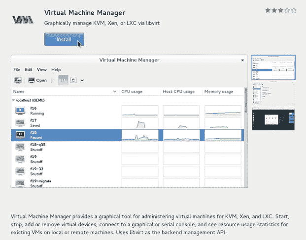

图 8-5。

Virtual Machine Manager information screen

您的安装可能停滞在挂起状态的一些原因如下:

*   您的电脑在连接到互联网时可能会出现问题。这种情况的一个线索是信息屏幕没有显示屏幕截图。现在，您应该能够检查您的界面，使其正常工作；如果没有，返回第 [7 章](07.html)并再次查看`ip`命令。
*   软件包有问题，无法安装。CentOS 论坛通常可以帮助确认这一点。
*   安装软件包的存储库有问题。我们将很快讨论更多关于存储库的内容。

理想情况下，您将看到以下屏幕。


图 8-7。

Installing

安装完成后，您将会看到图 [8-8](#Fig8) 中的屏幕。


图 8-8。

Installation complete, Remove?

如果您希望删除应用程序，只需点击图 [8-8](#Fig8) 中的删除按钮。您将被要求输入密码。

这就是安装和删除软件包所需要做的全部工作。要查看所有已安装的软件包，我们返回初始屏幕并选择顶部的 installed 按钮(参见图 [8-9](#Fig9) )。

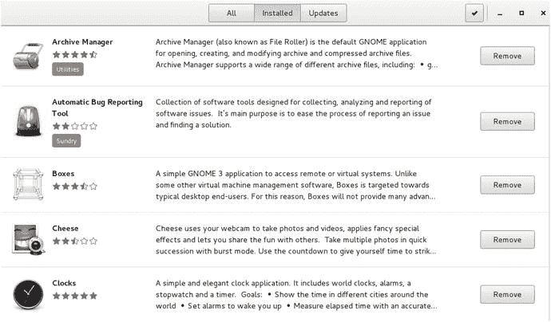

图 8-9。

Installed packages

显然，您可以通过单击 remove 按钮从该屏幕中删除软件包。您也可以通过点击它们来查看已安装软件包的更多详细信息，并且您也可以从那里启动它们。当您打开此屏幕时，您会注意到您无法卸载系统软件包。如果你需要删除其中的任何一个，你必须通过`YUM`包管理器来完成(稍后会有更多)。

通过转到“更新”选项卡，您可以看到您的系统当前需要的任何更新。在图 [8-10](#Fig10) 中，我们可以看到有三个更新在等着我们。我们可以通过单击左上角的刷新按钮来检查这是否是最新的列表。

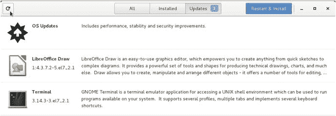

图 8-10。

Refresh Updates

因为我们有一个操作系统更新，我们被要求重新启动和安装；通常我们可以不重启就安装更新。


图 8-11。

Restart & Install Updates message

单击重启和安装按钮后，在重启和安装前的 30 秒内，我们可以选择取消或继续。在主机安装了更新之后，我们会注意到我们安装了一个新的内核，如图 [8-12](#Fig12) 所示。


图 8-12。

New kernel has been installed

这些系统更新已经安装了一个新的内核，你的 grub 配置已经更新了一个新的菜单条目，我们在第 [6](06.html) 章已经讨论过了。您现在可以看到，我们可以选择最新的(新的系统默认值)或旧的内核版本。如果你在新内核上遇到问题，你可以重启并选择旧版本，看看问题是否仍然存在。

现在您的系统是最新的。在图 [8-13](#Fig13) 的底部，您将看到“上次检查:”时间。当你点击如图 [8-10](#Fig10) 所示的刷新按钮时，这个更新。您也可以选择从命令行更新您的系统。在下一节中，我们将看到如何在 CentOS 上实现这一点。


图 8-13。

System up to date

### Yellowdog 更新程序已修改

对于基于 Red Hat 的发行版，用于安装、升级或更新系统的最常用工具之一是基于命令行的工具，称为 Yellowdog Updater Modified (YUM)。`YUM`提供在远程存储库中搜索和查找系统可用软件的功能。如前所述，存储库是由发行版的供应商提供给你的发行版的软件包的集合，并由利益集团、大学和 ISP(互联网服务提供商)进行“镜像”。

Note

`YUM`可用于 Red Hat Enterprise Linux 和 CentOS，以及其他 Red Hat 衍生的发行版。这通常是通过命令行更新和维护这些发行版上的包的默认方法。

YUM 还能够通过获取安装任何单个包所需的包来解决依赖性问题。它使用一个数据库来查询您的主机上安装了哪些软件包，然后将其与存储库提供的软件包列表进行比较。如果您需要一个或多个额外的包来满足任何依赖关系，那么这些包也会被下载和安装。

YUM 使用起来很简单。在命令行上，您只需输入`yum`和一系列可能的操作之一，例如 install、remove 或 list，然后输入您希望对其执行操作的软件包的名称，例如:

```sh
$ sudo yum install nmap

```

Note

您需要 root 权限来运行`yum`命令，要么作为 root 用户登录，要么使用`sudo`命令。我们建议使用`sudo`命令，正如我们在第 [5 章](05.html)中演示的那样。

表 [8-1](#Tab1) 列出了 YUM 提供的主要选项。

表 8-1。

Options Available with YUM

<colgroup><col> <col></colgroup> 
| [计]选项 | 描述 |
| --- | --- |
| 搜索 | 允许您搜索可供下载的软件包。 |
| 目录 | 列出所有可供下载的软件包。 |
| 安装 | 安装一个或多个软件包。 |
| 检查-更新 | 列出可供更新的软件包。 |
| 更新 | 更新指定的软件包或下载并安装任何可用的更新。 |
| 移动 | 从主机中删除一个或多个包。 |
| 信息 | 提供关于包的包信息。 |
| 提供 | 告诉你一个特定的文件或特性属于哪个包。 |
| 列表更新 | 列出所有只提供更新的软件包。 |
| 可用列表 | 仅列出所有可用的软件包。 |
| deplist | 列出包依赖项。 |
| 全部清洗 | 清理不再需要的下载包文件。 |
| 历史 | 显示了在此系统上执行的 YUM 命令的历史记录。 |
| mssnapshot | 此子命令和相关子命令可以在发布 YUM 更新或安装之前管理 LVM 快照的创建和删除。 |
| 重新喷水 | 查看在您的系统上配置的 YUM 存储库。您也可以通过`–v`或使用`repoinfo`命令来获取更多信息。 |

接下来，我们将看看每个动作以及如何使用它。

#### 用 YUM 安装软件包

让我们从`YUM`开始，试着安装一个包。在正常情况下，我们会首先搜索包以确保它是可用的。我们选择安装`nmap`包(如前所述，它是一个有用的网络映射和扫描工具)。我们将使用`search`选项来查看该包是否可用，如清单 [8-1](#Par61) 所示。

```sh
$ sudo yum search nmap
Listing 8-1.Searching with YUM

```

在清单 [8-1](#Par61) 中，我们发出了带有`search`选项的`yum`命令，然后指定了我们希望搜索的包的名称。这将产生一个名称中有`nmap`的可用包列表。`yum`命令不够智能，无法准确知道您在寻找什么，所以它会为您提供名称或描述中带有`nmap`的任何内容。

如果您不确定完整的名称，也可以搜索包名称的一部分。因此，举例来说，您可以输入`yum` search map 并获得所有描述或名称中带有模式映射的包的列表。

Tip

您可以通过使用我们在第 [4](04.html) 章中展示的`grep`命令来优化软件包列表。例如，您可以键入`yum search python | grep boto`，这将通过搜索术语“boto”来细化与`python`相关的包列表，然后显示结果包列表。

您还可以使用 yum list 查看存储库中所有可用的包，并且您可能会发现 yum groups list 对于查看包的分组很有用(`yum help groups`将列出用于管理组的其他可能的子命令)。组是为方便起见而提供特定应用程序的单个包的集合。因此，例如，安装 KDE 等离子工作区组将提供运行您的 KDE 桌面的一切，而安装基本 Web 服务器组将提供 Apache web 服务器和相关的包。

有了这些信息，为了安装`nmap`包，我们运行清单 [8-2](#Par67) 中的命令。

```sh
$ sudo yum install nmap

Listing 8-2.Installing the nmap Package

```

将下载并安装一个名为`nmap`的包。yum install 命令的输出中显示了一些信息。

```sh
Loaded plugins: fastestmirror, langpacks
Loading mirror speeds from cached hostfile
 * base: centos.mirror.crucial.com.au
 * extras: centos.mirror.crucial.com.au
 * updates: centos.mirror.crucial.com.au
Resolving Dependencies
--> Running transaction check
---> Package nmap.x86_64 2:6.40-7.el7 will be installed
--> Finished Dependency Resolution

Dependencies Resolved

=============================================================
 Package      Arch        Version       Repository       Size
=============================================================
Installing:
 nmap        x86_64    2:6.40-7.el7       base          4.0 M

Transaction Summary
=============================================================
Install  1 Package

Total download size: 4.0 M
Installed size: 16 M
Is this ok [y/d/N]:

```

第一行显示了 yum 加载的任何插件，以提供额外的特性或功能。然后我们可以看到这个安装命令使用的存储库`* base:, * extra:`和`* updates:`。接下来我们会看到依赖项和事务检查，然后是我们将要安装的软件包列表，在本例中是一个软件包。我们有更多关于我们正在安装的包的细节，包括所有正在安装的包的名称、架构(`x86_64`)、版本(`2:6.40-7.el7`)、我们正在下载这个包的 yum 存储库(`base`)以及下载包的大小(`4.0M`)。然后显示事务摘要，我们有机会继续安装(`y`)、仅下载软件包(`d`)或不安装软件包(`N`)。如果您想在不提示确认的情况下安装软件包和依赖项，可以发出

```sh
$ sudo yum install –y nmap

```

这将对任何安装问题回答“是”(`-y`)，这在您通过脚本安装软件包时非常有用。

您也可以使用 groups install 命令，如下所示:

```sh
$ sudo yum groups install 'Basic Web Server'

```

这将在 group Basic Web 服务器中安装所有软件包。如果需要任何依赖项，它们也会被下载，并且会询问您是否要安装它们(除非您指定了`groups install –y`)。如果您没有安装所有必需的依赖项，那么您将无法安装您需要的软件包。

#### 更新您的存储库

YUM 存储库缓存由几个文件组成。这些是小型 db 文件，包含文件列表和包列表之类的内容。随着时间的推移，随着新的包被添加到存储库中并在存储库中进行更新，您的 YUM 存储库缓存数据将会过时。

要重建或刷新缓存，而不检查主机是否有任何可用的更新包，可以发出以下命令:

```sh
$ sudo yum makecache

```

这将从存储库中提取缓存文件。要检查您的主机是否有任何更新，您可以发出清单 [8-3](#Par80) 中的命令。

```sh
$ sudo yum check-update
Listing 8-3.Checking for Updated Packages

```

`check-update`子命令将下载最新的 YUM 存储库缓存数据(如果它已经过时),然后使用它来找出您的系统上哪些包有可用的更新。这将显示有可用更新的软件包列表。要安装这些更新，您可以发出

```sh
$ sudo yum update

```

您还可以更新一个或多个单独的包，如清单 [8-4](#Par84) 所示。

```sh
$ sudo yum update nmap
$ sudo yum update nmap mutt
Listing 8-4.Updating Packages with YUM

```

Note

您不应该使用 yum 在操作系统的主要版本之间进行升级(例如，从 6.5 升级到 7.1)。从技术上讲，没有什么可以阻止您将 YUM 存储库指向最新版本并运行 yum update，但是这将产生非常不可预测的结果，并且很可能导致系统丢失。不过，您可以使用 yum 在次要版本之间进行升级(例如，从 7.1 升级到 7.2)。

#### 使用 YUM 删除包

还可以用 YUM 删除包，如清单 [8-5](#Par87) 所示。

```sh
$ sudo yum remove nmap
Listing 8-5.Removing Packages with YUM

```

清单 [8-5](#Par87) 中使用的`remove`选项将从你的系统中移除所有与该包相关的文件。您可以使用这个命令的别名`erase`，它会做同样的事情。任何与原始包版本不同的配置文件都将被保存，扩展名为< `filename>.conf` `.rpmsave`。

#### 执行其他 YUM 任务

您可以使用`yum`命令做许多其他事情。让我们简单地看一下其他一些命令。

以下命令提供了有关您正在查询的包的信息，例如它的大小、版本和安装状态。包的描述；和其他有用的信息。

```sh
$ sudo yum info kernel

```

如果您想找到哪个包提供了一个特定的文件，您可以使用下面的。

```sh
$ sudo yum provides /bin/bash
bash-4.2.46-19.el7.x86_64 : The GNU Bourne Again shell
Repo        : base
Matched from:
Filename    : /bin/bash

```

前面的命令告诉您`/bin/bash`二进制文件是由`bash`包提供的，并描述了这个包的版本和细节。

要列出由文件路径提供的包，还可以使用以下命令:

```sh
$ sudo yum provides */sftp

```

这将列出所有提供`sftp`文件的包。这将列出 openssh-client 包以及其他包。

查看主机可用更新列表的另一种方法是发出以下命令:

```sh
$ sudo yum list updates

```

如果您的主机是最新的，此命令应该不会产生任何结果。

接下来，通过发出以下命令，您可以列出可以安装在您的主机上的所有软件包:

```sh
$ sudo yum list available

```

前面的命令列出了尚未从存储库中为您的主机安装的所有可用软件包。

要获取主机的安全更新列表，请使用以下命令:

```sh
$ sudo yum --security check-update

```

这将提供等待安装到您的主机上的当前安全软件包的列表。要安装，只需安装那些安全补丁。

```sh
$ sudo yum --security update

```

您也可以使用以下命令从特定的 YUM 存储库中安装软件包

```sh
$ sudo yum install --enablerepo=myrepo my-package

```

在前面的命令中，我们告诉 YUM 从我们的`myrepo` YUM 存储库中安装我们的`my-package`。如果存储库被禁用，这意味着我们通常不从该存储库中获取包，我们可以在执行该命令时启用该存储库。除非指定，否则后续的 yum 命令不会从该存储库中提取。不久将有更多关于 YUM 存储库的内容。

最后，您可以清理您的缓存目录(YUM 临时存储您已经下载的包的地方)。如果需要回收一些磁盘空间临时磁盘空间，可以清除缓存。

```sh
$ sudo yum clean all

```

前面的命令删除了包含在`/var/cache/yum cache`目录中的缓存包和头文件。

#### 配置 YUM

YUM 应用程序可以通过多种方式进行配置。YUM 将其配置文件存储在`/etc/yum.conf`和`/etc/yum.repos.d/`下，并将状态文件存储在目录`/var/lib/yum`和`/var/cache/yum`下。

Note

状态文件告诉`YUM`你的主机上已经安装了什么，还保存了下载包的缓存版本。注意不要删除这些目录，因为您很容易损坏您的软件包数据库。

您通常不需要更改默认的`/etc/yum.conf`。例如，当您希望更改配置时，可以添加一个代理服务器，YUM 应该在下载包时使用它。默认设置通常适合大多数环境。YUM 可用配置设置的完整列表可通过`yum.conf`手册页获得。

```sh
$ man yum.conf

```

虽然您很少改变 YUM 的配置方式，但是您可能希望向 YUM 添加额外的存储库，以便从中下载额外的包。定义 YUM 可用的存储库的文件包含在`/etc/yum.repo.d`目录中。让我们看一个通用的存储库文件:

```sh
$ cat /etc/yum.repo.d/myrepo.repo
[myrepo]
name=myrepo
baseurl=http://myrepo.mydomain.com/pub/linux/releases/$releasever/$basearch/os/enabled=1
gpgcheck=1
gpgkey=http://myrepo.mydomain.com/linux/RPM-GPG-KEY-linux

```

表 [8-2](#Tab2) 中解释了这些选项。

表 8-2。

Basic Options for Adding a `yum` Repository

<colgroup><col> <col></colgroup> 
| [计]选项 | 描述 |
| --- | --- |
| `[repo-id]` | `repo_id`是存储库的唯一名称。 |
| `name` | `name`是对存储库的描述。 |
| `baseurl` | `baseurl`是存储库的 URL。这通常是一个 HTTP URL，就像您在 web 浏览器中使用的一样。它也可以是一个`ftp://`或`file:///`资源。 |
| `enabled` | 您可以通过将 0 指定为 disabled 并将`1`指定为 enabled 来启用或禁用程序包。 |
| `gpgcheck` | 这个选项告诉`yum`检查用于“签名”包的 GPG 密钥，这样你就可以确保包没有被篡改。指定`0`关闭检查，`1`表示检查开启。 |
| `gpgkey` | 这是`yum`应该找到存储库的 GPG 键的 URL。它可以是`http://`、`ftp://`或`file:///`资源。 |

在清单 [8-6](#Par122) 中，我们为 CentOS 发行版定义了一个新的存储库，用于下载源 rpm 文件。如果我们希望重新构建我们自己的 rpm 包，将使用源 rpm 文件。这些源文件是 CentOS 维护人员用来生成我们在包中使用的普通二进制 rpm 的文件。

```sh
[source]
name=CentOS-releasever - Sources
baseurl=http://vault.centos.org/centos/$releasever/os/Source/
gpgcheck=1
enabled=1
gpgkey=file:///etc/pki/rpm-gpg/RPM-GPG-KEY-CentOS-7
Listing 8-6.Adding a CentOS Repository in a YUM Repo File

```

您可以看到，在 baseurl 选项中，我们指定了一个名为`$releasever`的变量。在 Red Hat 和 CentOS 上，该变量默认为`redhat-release`包的版本。

```sh
$ cat /etc/redhat-release
CentOS Linux release 7.2.1511 (Core)

```

在这种情况下，`$releasever`将等于`7.2.1511`。这个发布文件由`centos-release-7-2.1511.el7.centos.2.10.x86_64`包放在系统中。

您还会看到我们用于源的 baseurl 指向了`vault.centos.org`主机。在这里，您可以找到 CentOS 的早期历史版本以及用于构建您自己的 rpm 的源文件。在 baseurl 选项中可以列出多个 baseurl。

```sh
baseurl=http://myrepo1.org/centos/...
        http://myrepo2.org/centos/...

```

URL 列表也可以通过`mirrorlist=`选项而不是`baseurl=`从网络服务器中检索。`mirrorlist.txt`文件只包含以下内容:

```sh
mirrorlist=http://myrepo.org/mirrorlist.txt
http://myrepo1.org/centos/...
http://myrepo2.org/centos/...

```

加载了 yum 的`fastestmirror`插件后，YUM 将从列表中找到响应最快的镜像，并在运行时使用它。

YUM 存储库配置中可能存在其他变量:

*   `$arch`–您系统的架构(由 yum 检测)
*   `$basearch`–您系统的基础架构(例如，i686 变成 i386)
*   `$uuid`–为您的系统生成并存储在`/var/lib/yum/uuid`中的唯一标识符
*   `$infra`–目前未使用，但您可以在您的镜像列表 URL ( `&repo=os&infra=$infra`)中看到它。

当变量如下使用时:

`http://myrepo.org/centos/$releasever/$arch/myapp`

这可以推断为

[`http://myrepo.org/centos/7-2.1511/x64_86/myapp`](http://myrepo.org/centos/7-2.1511/x64_86/myapp)

有关 YUM 使用的配置选项的完整列表，请参见`man yum.conf`。当您创建一个新的 Yum 存储库时，您可以使用`makecache`命令来刷新您的存储库缓存，并向其中添加新的存储库。

```sh
$ sudo yum makecache

```

在现代 Fedora 发行版(从版本 22 开始)和即将发布的 Red Hat 和 CentOS 发行版中，您将更新软件包管理器来处理称为 DNF 的 rpm。现在让我们来看看。

### DNF——或者说奢华的美味

DNF 最初是百胜软件包管理器的一个分支，它是百胜的替代版本，而不仅仅是一个新版本。它被设计成保持(大致)与 YUM 当前版本的 CLI(命令行界面)兼容性。因此，您应该已经熟悉了 DNF 软件包管理器的主要命令。

虽然最终用户不应该注意到百胜和 DNF 之间有太多的区别，但实际上有很多区别。不同之处主要在于如何重写代码，以使开发人员更容易使用可预测和记录的 API(应用程序编程接口)进行维护和扩展。在 YUM 不兼容的地方，它也兼容 Python3。此外，包依赖算法已经完全重写。DNF 将会是一个受欢迎的，更快的，即使不被注意到的进步。

类似下面的命令执行与等效的 YUM 命令类似的功能。

```sh
$ dnf search nmap
$ dnf info nmap
$ dnf install  nmap
$ dnf remove nmap

```

这些命令都具有与 YUM 相似的语法。有关可用命令的完整列表，请参见 DNF 文档，网址为

*   [`http://dnf.readthedocs.io/en/latest/command_ref.html`](http://dnf.readthedocs.io/en/latest/command_ref.html)

DNF 的存储库文件也将类似于当前的 YUM 存储库文件，并且来自同一个位置，`/etc/yum.repos.d/*.repo`。

```sh
[fedora]
name=Fedora $releasever - $basearch
failovermethod=priority
#baseurl=http://download.fedoraproject.org/pub/fedora/linux/releases/$releasever/Everything/$basearch/os/
metalink=https://mirrors.fedoraproject.org/metalink?repo=fedora-$releasever&arch=$basearch
enabled=1
metadata_expire=28d
gpgcheck=1
gpgkey=file:///etc/pki/rpm-gpg/RPM-GPG-KEY-fedora-$releasever-$basearch
skip_if_unavailable=False

```

正如您所看到的，在这里我们如何描述一个与 DNF 一起使用的存储库并没有真正的区别。有关 DNF 使用的配置选项的完整列表，请参见手册`dnf.conf`。

### 红帽包管理

我们刚刚看了`yum`和`dnf`命令以及如何使用它们来管理包。YUM 或 DNF 的唯一目的是管理您系统上实际的 Red Hat Package Management (RPM)软件包。每个 RPM 包也可以通过`rpm`命令检查、安装和移除。`rpm`命令是操纵包含软件包的`RPM`文件的基本工具。虽然您可能不经常需要直接使用`rpm`命令，但了解它的工作原理是很重要的。

有许多选项可以传递给`rpm`命令。要获得这些命令的完整列表，我们建议您阅读其`man`页面。

```sh
$ man rpm

```

在`rpm`手册页上，您可以看到`rpm`工具可以执行三个基本功能。

1.  查询包
2.  安装、升级和删除软件包
3.  杂项功能

让我们更详细地看看其中的一些选项。表 [8-3](#Tab3) 显示了你可以传递给`rpm`的主要选项以及它们的作用。每个选项都有许多您添加的标志。

表 8-3。

The Major `rpm` Options and Flags

<colgroup><col> <col></colgroup> 
| 选项和标志 | 描述 |
| --- | --- |
| `-q &#124; --query` | 允许您查询 RPM 数据库，并查找有关主机上已安装的软件包的信息 |
| `-i &#124; --install` | 在您的主机上安装本地软件包 |
| `-e &#124; --erase` | 从主机上删除软件包 |
| `-U &#124; --upgrade` | 升级现有软件包，或者在您的主机上安装软件包(如果尚未安装) |
| `-F &#124; --freshen` | 仅当安装了早期版本时才升级软件包 |
| `-V &#124; --verify` | 验证已安装的软件包 |

#### 查询包

首先，我们将使用-q 或- query 选项来查询安装在您的主机上的包。为了找出您的主机上安装了什么，`rpm`工具查询存储在数据库中的数据。当软件包被安装和删除时，这个数据库被更新。

Note

RPM 数据库只知道您的主机的当前状态；它不知道昨天删除了什么，也不知道软件包的以前版本是什么。当您使用`yum`或`dnf`时会记录该信息，但当您使用`rpm`时不会。

现在让我们使用`rpm`来检查 Linux 操作系统的核心——内核。假设有人问你，“我们安装了什么内核？”要找到答案，您可以使用`rpm`命令，如清单 [8-7](#Par164) 所示。

Note

您也可以通过发出`uname –r`命令找到您当前使用的内核。

```sh
# rpm --query kernel
kernel-3.10.0-327.el7.x86_64
kernel-3.10.0-327.18.2.el7.x86_64
Listing 8-7.Querying the Installed Kernel Version

```

这里我们运行了带有`--query`标志的`rpm`命令，并指定了我们想要查询的包的名称，在我们的例子中是内核。您可以看到，这产生了一个已安装内核的列表。

Note

您会在清单 [8-7](#Par164) 中看到不止一个内核，因为您可以安装不止一个内核。这并不意味着你有多个内核同时运行；相反，你有多个潜在的内核可以运行。

安装的每个内核末尾的数字是不同的版本。一个是 3.10.0-327.el7.x86_64，一个是 3.10.0-327.18.2.el7.x86_64。两者都与 Red Hat Enterprise Linux 7 系统(. el7)兼容。

Tip

我们在第 [6](06.html) 章中讨论了如何选择想要启动的内核。

如果你不知道你要找的包的名字怎么办？或者，如果您想查看所有已安装的软件包，该怎么办？在这些情况下，您可以使用清单 [8-8](#Par170) 中的命令。

```sh
# rpm --query --all
Listing 8-8.Querying All Packages

```

该命令使用- `query`标志和- `all flag`标志，表示您正在查询所有软件包，它列出了所有已安装的软件包。

正如您将看到的，这个列表可能会很长。假设您只想查找任何名称包含 vim 的包。然后，您可以通过`grep`工具来处理输出，该工具会在输出中搜索字符串 vim，如清单 [8-9](#Par173) 所示。

```sh
# rpm --query --all | grep vim
vim-minimal-7.4.160-1.el7.x86_64
vim-filesystem-7.4.160-1.el7.x86_64
vim-enhanced-7.4.160-1.el7.x86_64
vim-common-7.4.160-1.el7.x86_64
Listing 8-9.Querying All Using Piping and grep

```

Note

我们将在第 [4 章](04.html)中介绍`grep`命令和管道。

清单 [8-9](#Par173) 显示，通过管道将查询输出传递给`grep`命令已经将列表从数千个包减少到四个名称中带有字符串`vim`的包(空列表表示没有安装名称中带有该字符串的包)。

让我们了解更多关于内核包的信息。在清单 [8-10](#Par177) 中，我们结合使用查询选项和`--info`选项来查找关于我们安装的一个内核的更多信息。

```sh
# sudo rpm --query --info kernel-3.10.0-327.18.2.el7.x86_64
Name        : kernel
Version     : 3.10.0
Release     : 327.18.2.el7
Architecture: x86_64
Install Date: Thu 26 May 2016 17:43:40 EDT
Group       : System Environment/Kernel
Size        : 142681799
License     : GPLv2
Signature   : RSA/SHA256, Thu 12 May 2016 19:41:18 EDT, Key ID 24c6a8a7f4a80eb5
Source RPM  : kernel-3.10.0-327.18.2.el7.src.rpm
Build Date  : Thu 12 May 2016 07:51:03 EDT
Build Host  : kbuilder.dev.centos.org
Relocations : (not relocatable)
URL         : http://www.kernel.org/
Summary     : The Linux kernel
Description :
The kernel package

contains the Linux kernel (vmlinuz), the core of any
Linux operating system.  The kernel handles the basic functions
of the operating system: memory allocation, process allocation, device
input and output, etc.
Listing 8-10.Getting Information About Packages

```

清单 [8-10](#Par177) 产生了大量的信息。其中一些可能最初对你来说意义不大，但让我们来看看一些数据。您可以看到版本和发布号，以及它的构建和安装日期。您还可以看到该软件包属于哪个组，因为主机上的每个软件包都属于一组相似的软件包。当你在第 [2](02.html) 章安装你的主机并选择你想要的软件包作为这个过程的一部分时，你就看到了这一点。

此外，您可以看到发布软件包的许可证(在本例中是 GPLv2 许可证)、软件包的大小，最重要的是，软件包的描述和摘要以及一些关于软件包的更多信息的链接。

有时你会想知道哪个软件包安装了一个特定的文件或命令。您也可以使用`rpm`工具来查询这些信息。例如，我们在主机上安装了`/bin/bash`命令，我们可以通过使用清单 [8-11](#Par181) 中所示的`rpm`来找出是什么安装了这个命令。

```sh
# rpm  --query  --whatprovides /bin/bash
bash-4.2.46-19.el7.x86_64
Listing 8-11.Using query and whatprovides

```

清单 [8-11](#Par181) 告诉我们包`bash`负责文件`/bin/bash`，它也通知我们安装的`bash`包的版本号(你也可以用更短的格式`$ rpm -qf /bin/bash`)。

所以现在我们知道`bash`提供了那个文件，但是我们系统上还有哪些文件属于`bash`包呢？有了来自`--whatprovides`的信息，我们可以通过使用清单 [8-12](#Par184) 所示的`--query --list`选项来查看还有哪些文件属于`bash`包。

```sh
# rpm  --query  --list bash
/etc/skel/.bash_logout
/etc/skel/.bash_profile
/etc/skel/.bashrc
/usr/bin/alias
<snip> ...
Listing 8-12.Using query and list

```

清单 [8-12](#Par184) 显示了出现在`bash`包中的所有文件的删减列表。我们还可以列出关于软件包的其他有用信息。例如，`rpm –qc <package>`命令会显示与包相关的配置文件，`rpm –qd`会列出文档文件。

软件包通常会在安装或卸载之前或之后运行安装前和安装后以及卸载脚本。这些可能会创建用户，配置和启动服务，或清理自己。您可以使用以下内容查看此类脚本:

```sh
# rpm –q --scripts bash
postinstall scriptlet (using <lua>):
nl        = '\n'
sh        = '/bin/sh'..nl
bash      = '/bin/bash'..nl
f = io.open('/etc/shells', 'a+')
if f then
  local shells = nl..f:read('*all')..nl
  if not shells:find(nl..sh) then f:write(sh) end
  if not shells:find(nl..bash) then f:write(bash) end
  f:close()
end

```

在上面的 Lua 脚本(Lua 是一种编程语言)中，我们可以看到在安装 bash 程序后执行的脚本。在安装 bash 包之后，该脚本执行对`/etc/shells`文件的必要添加。

正如你现在可能看到的，我们可以用`yum`或`dnf`完成类似的任务。让我们继续用`rpm`安装软件包。

#### 使用 RPM 安装软件包和删除软件包

`rpm`工具也可以用来安装或升级软件包；但是，不建议这样做。这与百胜的工作方式相冲突。通过 RPM 安装通常也很烦人。要安装软件包，您需要下载所需的`RPM`文件和任何依赖项，然后使用`rpm`工具将其安装到您的主机上。

移除包会出现同样的问题，也应该避免。

#### 从源代码构建 RPM 包

为什么需要从源代码构建一个包？嗯，有时你需要一个源代码的补丁，或者你想构建一个更新版本的包。如果是这种情况，您可以采取几种方法。

许多包都有所谓的上游`RPM`包，上游`RPM`包包含的应用程序版本比发行版附带的版本更新。它们通常是由应用程序的开发人员或应用程序开发社区的其他成员构建的。它们会有你可能需要的更新的代码补丁或更新的特性，但是它们会更尖锐，可能包含错误和问题。这些上游 ?? 通常可以在应用程序的网站上找到。

Caution

上游`RPM` s 文件任何人都可以建。它们可能不稳定、不安全或没有定期维护。你应该小心使用它们。

第二种方法是下载需要更新的应用程序的源代码，并构建自己的 rpm。网上有一些优秀的参考资料可以帮助你创建自己的`RPM`文件:

*   `Maximum` `RPM` `:` [`www.rpm.org/max-rpm-snapshot/`](http://www.rpm.org/max-rpm-snapshot/)
*   `How to create a RPM:`[`https://fedoraproject.org/wiki/How_to_create_an_RPM_package`](https://fedoraproject.org/wiki/How_to_create_an_RPM_package)
*   `Packaging Software with``RPM``, Part 1``:`[`www.ibm.com/developerworks/library/l-rpm1/`](http://www.ibm.com/developerworks/library/l-rpm1/)
*   `Creating``RPM``s``:`[`http://pmc.ucsc.edu/~dmk/notes/RPMs/Creating_RPMs.html`](http://pmc.ucsc.edu/%7Edmk/notes/RPMs/Creating_RPMs.html)

我们将快速演示构建 RPM 包的过程。这个包将简单地在我们的系统上放置一个脚本。为此，我们需要安装 rpm-build 和 rpmdevtools 包。如果你打算编译一个程序，你也需要合适的开发包。

```sh
$ sudo yum install rpm-build rpmdevtools

```

接下来，我们需要创建一些`rpm build`命令所需的基本目录。为此，我们使用 rpmdevtools 包中的一个命令。

```sh
$ rpmdev-setuptree
$ ls -l rpmbuild/
total 20
drwxrwxr-x. 2 vagrant vagrant 4096 Jul 24 09:46 BUILD
drwxrwxr-x. 2 vagrant vagrant 4096 Jul 24 09:46 RPMS
drwxrwxr-x. 2 vagrant vagrant 4096 Jul 24 09:46 SOURCES
drwxrwxr-x. 2 vagrant vagrant 4096 Jul 24 09:46 SPECS
drwxrwxr-x. 2 vagrant vagrant 4096 Jul 24 09:46 SRPMS

```

当构建 RPM 包时，我们至少需要上面目录中的规范和源代码。构建是我们构建包的地方。构建完成后，我们的包将放在 RPMS。SOURCES 是我们放置用于构建的源文件的地方。SPECS 是放置我们的 spec 文件的地方。SRPMS 是我们的 RPM 源文件所在的地方。我们将进入我们的`rpmbuild`目录。

我们在名为`simple_echo.tar.gz`的 SOURCES 目录中放置了一个压缩的 tarball(一个压缩的归档文件)。它包含一个名为`simple_echo.sh`的文件，我们打算将它安装到`/usr/local/bin directory`中。

在我们继续之前，我们需要创建我们的`simple_echo.spec`文件，并把它放在 SPECS 目录中。在我们的 rpmdevtools 包中，我们使用如下的`rpmdev-newspec`命令:

```sh
$ rpmdev-newspec simple_echo && mv simple_echo.spec SPECS/
simple_echo.spec created; type minimal, rpm version >= 4.11.

```

这已经创建了我们的规范文件，并将其移动到我们的规范目录中。我们现在可以使用我们的 vi 编辑器来编辑文件。spec 文件包含关于我们的包的细节——版本号、许可证等等。它还有几个宏，rpmbuild 用它们来帮助创建包。它们以`%<macro>`开始。

我们的规范文件将如下所示:

```sh
Name:           simple_echo
Version:        1.0
Release:        1%{?dist}
Summary:        Echoes your input
License:        GPLv3+
URL:            http://www.example.com/simple_echo
Source0:        %{name}-%{version}.tar.gz

BuildRequires:  bash
Requires:       bash

%description
This program echoes the first parameter entered.

%prep
%setup -q

%install
rm -rf $RPM_BUILD_ROOT
mkdir -p $RPM_BUILD_ROOT/usr/local/bin
install simple_echo.sh -m0755 $RPM_BUILD_ROOT/usr/local/bin/simple_echo.sh

%files
%doc
%attr(0755,root,root)/usr/local/bin/simple_echo.sh

%changelog
* Sun Jul 24 2016 JSmith <jsmith@example.com>
- First simple_echo package

```

在我们的规范文件中，我们给出了包名和版本。在发布中你可以看到第一个宏，`%{?dist}`。这会将分发详细信息添加到包中。摘要、许可证、来源和 URL 是必需的信息。如果需要，您可以有多个源文件，我们再次使用宏来描述它——它可以是一个 URL 或者必须存在于 SOURCES 目录中。

BuildRequires 和 Requires 用于处理包依赖关系。如果指定，必须在构建或安装之前安装所需的软件包。我们选择 bash 作为我们需要的包。

Tip

您也可以为 RPM 构建创建自己的宏。有关宏的更多信息，请参见 [`www.rpm.org/wiki/PackagerDocs/Macros`](http://www.rpm.org/wiki/PackagerDocs/Macros) 。

我们已经删除了一些用于编译软件的标准宏，因为我们在这里不编译任何东西。prep 和 setup 宏通过清理旧文件并将源文件解包到构建目录中来准备构建空间。接下来是%install 部分，在这里我们删除任何旧的构建数据并创建 BUILDROOT 目录结构。然后，我们使用 install 命令(将文件复制到所需的位置，并为它们提供所需的模式)。

下一节将列出我们正在安装的文件。它们可以是 doc 文件、conf 文件和目录。在本例中，我们列出了一个模式为 0755、所有者和组根的文件。

最后，我们有一个变更日志部分。这应在特定日期格式(`DayofWeek Month Day Year name <email>`)中定义。这需要跟一个以`‘-‘`开头的 changelog 消息。

一旦这个文件被保存，我们现在可以运行构建。构建 RPM 有几种主要的方法。首先是只构建二进制文件。第二步是编译源代码和二进制代码。还有其他选项，您可以使用 man `rpmbuild`命令找到这些选项。

```sh
$ rpmbuild –bb SPEC/simple_echo.spec
Executing(%prep): /bin/sh -e /var/tmp/rpm-tmp.7kXFJS
+ umask 022
+ cd /home/vagrant/rpmbuild/BUILD
+ cd /home/vagrant/rpmbuild/BUILD
+ rm -rf simple_echo-1.0
+ /usr/bin/gzip -dc /home/vagrant/rpmbuild/SOURCES/simple_echo-1.0.tar.gz
+ /usr/bin/tar -xf -
+ STATUS=0
+ '[' 0 -ne 0 ']'
+ cd simple_echo-1.0
+ /usr/bin/chmod -Rf a+rX,u+w,g-w,o-w .
+ exit 0
Executing(%install): /bin/sh -e /var/tmp/rpm-tmp.EJ4LAv
+ umask 022
+ cd /home/vagrant/rpmbuild/BUILD
+ '[' /home/vagrant/rpmbuild/BUILDROOT/simple_echo-1.0-1.el7.centos.x86_64 '!=' / ']'
+ rm -rf /home/vagrant/rpmbuild/BUILDROOT/simple_echo-1.0-1.el7.centos.x86_64
++ dirname /home/vagrant/rpmbuild/BUILDROOT/simple_echo-1.0-1.el7.centos.x86_64
+ mkdir -p /home/vagrant/rpmbuild/BUILDROOT
+ mkdir /home/vagrant/rpmbuild/BUILDROOT/simple_echo-1.0-1.el7.centos.x86_64
+ cd simple_echo-1.0
+ rm -rf /home/vagrant/rpmbuild/BUILDROOT/simple_echo-1.0-1.el7.centos.x86_64
+ mkdir -p /home/vagrant/rpmbuild/BUILDROOT/simple_echo-1.0-1.el7.centos.x86_64/usr/local/bin
+ install simple_echo.sh -m0755 /home/vagrant/rpmbuild/BUILDROOT/simple_echo-1.0-1.el7.centos.x86_64/usr/local/bin/simple_echo.sh
+ '[' '%{buildarch}' = noarch ']'
+ QA_CHECK_RPATHS=1
+ case "${QA_CHECK_RPATHS:-}" in
...
<snip>
...
Processing files: simple_echo-1.0-1.el7.centos.x86_64
Provides: simple_echo = 1.0-1.el7.centos simple_echo(x86-64) = 1.0-1.el7.centos
Requires(rpmlib): rpmlib(CompressedFileNames) <= 3.0.4-1 rpmlib(FileDigests) <= 4.6.0-1 rpmlib(PayloadFilesHavePrefix) <= 4.0-1
Requires: /bin/bash
Checking for unpackaged file(s): /usr/lib/rpm/check-files /home/vagrant/rpmbuild/BUILDROOT/simple_echo-1.0-1.el7.centos.x86_64
Wrote: /home/vagrant/rpmbuild/RPMS/x86_64/simple_echo-1.0-1.el7.centos.x86_64.rpm
Executing(%clean): /bin/sh -e /var/tmp/rpm-tmp.LPOTLL
+ umask 022
+ cd /home/vagrant/rpmbuild/BUILD
+ cd simple_echo-1.0
+ /usr/bin/rm -rf /home/vagrant/rpmbuild/BUILDROOT/simple_echo-1.0-1.el7.centos.x86_64
+ exit 0

```

我们有构建过程的输出。你可以看到我们有线`Wrote ... simple_echo-1.0-1.el7.centos.x86_64.rpm`。我们现在将使用 rpm–IVH 安装该 rpm。

```sh
$ sudo rpm –i RPMS/x86_64/simple_echo-1.0-1.el7.centos.x86_64.rpm

```

现在，我们可以测试脚本是否已安装并正常工作:

```sh
$ simple_echo.sh hello
hello

```

应该指出的是，从源代码创建您自己的包可能需要一些时间，这取决于您要构建的包的复杂性以及它所依赖的包的数量。你还必须支持它，这有时会比你想象更麻烦。因为您可能会选择不常见的选项，所以您可能会发现自己独自面临其他人没有经历过的生产问题。

在您构建自己的包之前，您还可以查看 EPEL 包，它们是基于 Fedora 的上游包，但为 RHEL、CentOS 和 Scientific Linux 进行了重建。这些可能比管理你自己的一套 rpm 更好，但仍然带有相同的警告。

*   [`https://fedoraproject.org/wiki/EPEL`](https://fedoraproject.org/wiki/EPEL)

这并不是说要阻止你去尝试，而是要提醒你，构建你自己的包有时会变得漫长而危险。在“从源代码编译”一节中，我们将向您展示如何从源代码编译您自己的包，并为您提供一种制作 rpm 和 deb 包的方法。

## Ubuntu 上的包管理

在 Ubuntu 服务器上管理软件包通常是使用命令行工具来完成的，因为 Ubuntu Server Edition 在默认情况下不安装 GUI。在这一节中，我们将首先介绍管理包的命令行工具。之后，我们将看看 Unity 桌面上的图形化软件包管理器。

在 Ubuntu 主机上添加软件最常见的方式是通过命令行工具从在线软件仓库安装软件包。该发行版提供了包含 22，000 多个现成安装包的在线软件库。这些年来，已经开发了一些工具来帮助你从远程仓库向你的 Ubuntu 主机添加应用程序。这些工具为基于 Red Hat 的发行版提供了相当于`rpm and yum`的 Ubuntu。我们将看看两个命令行工具:

*   `aptitude`
*   `dpkg`

这些工具都默认安装在 Ubuntu 主机上。`aptitude`工具允许您安装、删除、更新和搜索在线存储库中的包。这是管理包的首选方式，所以我们将最详细地介绍这个工具。另一个具有类似用途的流行工具是`Apt` ( [`https://wiki.debian.org/Apt`](https://wiki.debian.org/Apt) )。

`dpkg`工具是用于安装和移除软件包的基本命令行工具。Aptitude 在内部使用`dpkg`来管理包。我们将只简要地看一下`dpkg`，因为你不太需要经常使用它。

### 才能

你可以用两种方式使用`aptitude`工具:通过菜单和对话框交互，或者通过命令行向它传递指令。对于初级用户，最简单的方法是使用`aptitude`的基于菜单的用户界面。让我们启动它看看。

```sh
$ aptitude

```

处理完包列表后，`aptitude`显示其主窗口，如图 [8-14](#Fig14) 所示。

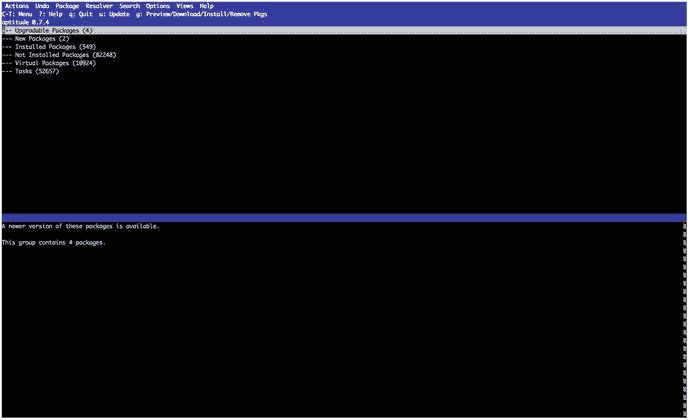

图 8-14。

The main `aptitude` screen

主屏幕由菜单栏、命令列表、窗口列表、状态信息、软件包列表窗口和信息窗口组成。您的光标将首先出现在软件包列表窗口中。您可以使用箭头键在列表中上下移动，并通过按 Enter 键展开突出显示的项目。

按 Enter 键展开已安装的软件包列表，然后展开主列表。您将在`main`部分看到按字母顺序排列的当前已安装软件包列表。突出显示某个包时，该包的描述会显示在信息窗口中。通过按 Tab 键切换到此窗口，然后使用箭头键上下滚动信息。再次按 Tab 键切换回列表窗口。在图 [8-15](#Fig15) 中，您可以看到我们突出显示了`adduser`包。


图 8-15。

Displaying the package description

要显示更详细的包信息，请滚动以突出显示包名称并按 Enter 键，如图 [8-16](#Fig16) 所示。您现在可以看到诸如依赖项、维护者等信息。


图 8-16。

Displaying detailed package information

按 q 关闭信息窗口并返回软件包列表。

因为滚动这个列表并不快，所以能够搜索它是有用的。按下正斜杠(/)并输入所需的搜索词，调出搜索对话框。我们找找 Ubuntu 内核包，叫`linux-image`。当您键入时，`aptitude`将在列表中向下跳转，显示第一个匹配的包。你可以在图 [8-17](#Fig17) 中看到这样的例子。

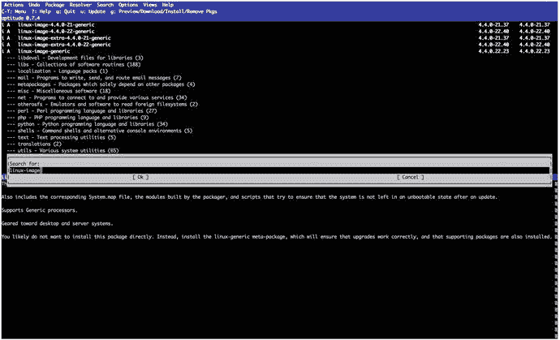

图 8-17。

Searching packages by name

按 Enter 键关闭搜索对话框。要跳转到下一个匹配的包名，请按 n。如果您继续按 n，您最终会发现自己在未安装包的列表中，其中包含更多的内核。要在屏幕上显示更多的软件包名称，您可以通过按 d 键切换信息窗口。

现在让我们安装一个包。一个小但有用的网络实用程序是`nmap`，所以我们将选择它。使用`find`命令在列表中找到这个包，然后突出显示它。要标记此软件包以便安装，请按加号(+)。你会看到一个警告对话框，告诉你`aptitude`不能安装包，除非你成为 root 用户，如图 [8-18](#Fig18) 所示。

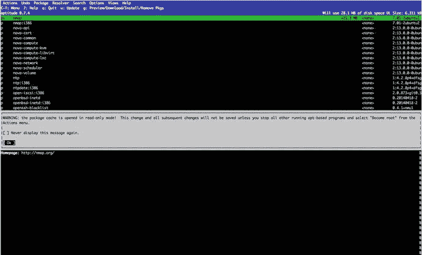

图 8-18。

root user warning dialog

您可以禁止此警告在将来出现。您会注意到有一个“不再显示此消息”复选框。首先按 Tab 跳转到复选框，按空格键选中它，然后再次按 Tab 选择 OK 按钮并回车接受。要确认此警告，请按 Enter 键。

Tip

如果我们通过`sudo`启动`aptitude`，警告对话框就不会出现。然而，作为一个`non-root`用户进行选择增加了一层防止错误的保护。因为不作为根用户是不可能意外删除包的，所以作为`non-root`用户运行`aptitude`并成为根用户来应用挂起的更改是一个好主意。

您将看到软件包状态已经从 p 变为 pi，而不是立即安装软件包。现在它被标记为安装。这允许您在将更改应用到系统之前，选择任意数量的软件包进行安装或删除。

现在您将只安装`nmap`应用程序，但是首先您必须成为 root 用户。为此，按 Ctrl+T 激活动作菜单(参见图 [8-19](#Fig19) )。

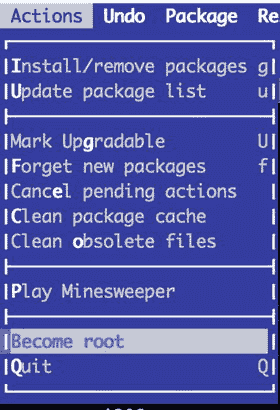

图 8-19。

Selecting Become root

使用箭头键选择成为 root(避免玩扫雷游戏的诱惑)，按回车键，`aptitude`现在会为你运行`sudo`。输入密码后，它会以根用户权限重新启动。虽然软件包列表会恢复到最初的折叠状态，但是安装软件包的命令会添加到内部待办事项列表中。

为了处理你的待安装，按 g. `aptitude`发现`nmap`包需要其他几个包存在于系统中，因此它被自动选择安装(用 piA 标记)，如图 [8-20](#Fig20) 所示。

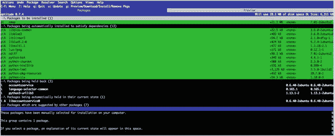

图 8-20。

Added package dependencies

再次按 g 确认您想要安装这个依赖项，然后`aptitude`现在将下载所需的包文件并安装它们。在这个过程中，你会被告知正在发生的事情(见图 [8-21](#Fig21) )。


图 8-21。

Processing installation tasks

安装完成后，按回车键，返回到`Aptitude`菜单。您现在将学习如何通过移除刚刚安装的`nmap`包来移除包(参见图 [8-22](#Fig22) )。再次使用`/`键进行搜索。您会看到它旁边有一个(I)表示已安装。按连字符(`-`)键标记要移除的包。您将看到所需的包状态字符从 I 变为 id。如果您已经定制了配置文件，并希望确保在此阶段也删除这些文件，您可以按下下划线(`_`)键来标记要清除的包；如果这样做，您将看到所需的状态变为 p。在图 [8-22](#Fig22) 中，您可以看到`nmap`现在被设置为 id，因为它被标记为删除。要应用排队的更改，请按 g。


图 8-22。

Package removal via `aptitude`

安装 nmap 时作为依赖项添加的软件包，由于没有被任何其他软件包使用，因此也被设置为删除。再次按 g 确认并处理更改(参见图 [8-23](#Fig23) )。

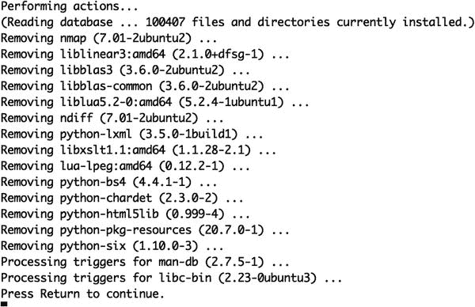

图 8-23。

Process pending removals

有关`Aptitude`中可用命令的更多信息，请按问号(`?`)键。图 [8-24](#Fig24) 显示了可用命令的列表。

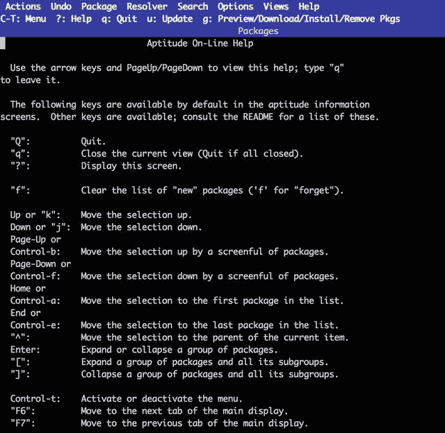

图 8-24。

The `aptitude` command list

您可以按 q 退出帮助列表。然后您可以再次按 q 退出`aptitude`。

#### 非交互模式

所有这些导航和窗口切换可能是用户友好的，但它很难快速。为此，`aptitude`还有一个命令行模式，不使用交互菜单，而是以动作命令和包名作为参数。为了证明以这种方式使用`aptitude`和使用 GUI 一样方便，我们将再次安装`nmap`包。当以非交互方式使用`aptitude`时，您需要以 root 用户身份运行它来执行安装和卸载任务。看看如何在清单 [8-13](#Par255) 中再次安装`nmap`。

```sh
$ sudo aptitude install nmap
The following NEW packages will be installed:
  libblas-common{a} libblas3{a} liblinear3{a} liblua5.2-0{a} libxslt1.1{a} lua-lpeg{a} ndiff{a} nmap python-bs4{a} python-chardet{a} python-html5lib{a} python-lxml{a} python-pkg-resources{a}
  python-six{a}
0 packages upgraded, 14 newly installed, 0 to remove and 4 not to upgrade.
Need to get 0 B/6,311 kB of archives. After unpacking 28.1 MB will be used.
Do you want to continue? [Y/n/?] y
Selecting previously unselected package libblas-common.
(Reading database ... 99366 files and directories currently installed.)
Preparing to unpack .../libblas-common_3.6.0-2ubuntu2_amd64.deb ...
Unpacking libblas-common (3.6.0-2ubuntu2) ...
...<snip>...
update-alternatives: using /usr/lib/libblas/libblas.so.3 to provide /usr/lib/libblas.so.3 (libblas.so.3) in auto mode
Setting up nmap (7.01-2ubuntu2) ...
Processing triggers for libc-bin (2.23-0ubuntu3) ...
Listing 8-13.Installing nmap with aptitude in Noninteractive Mode

```

首先，`aptitude`检查软件包数据库以确保系统能够安装软件包；如果有部分配置或挂起的软件包，它会告诉您并中止安装。

接下来，`aptitude`通知我们`nmap`有几个依赖项也将被安装，并通知我们这些包将使用多少磁盘空间(28.1 MB)。请注意，它告诉我们需要获得 6，311KB 归档文件中的 0 个。因为我们之前已经安装了`nmap`，原始的包文件仍然缓存在机器上，否则一旦你输入 y 开始安装，你就会看到 aptitude 下载这些包。

它在内部使用`dpkg`命令来处理这一部分。完成后，它处理可能由刚刚添加的包定义的触发器，并重新检查包状态数据库以确保一切成功。

现在我们可以通过从命令行执行以下命令来检查是否安装了`nmap`。

```sh
$ nmap –v
Starting Nmap 7.01 ( https://nmap.org ) at 2016-05-31 23:37 AEST

```

The Apt Cache

当您从互联网安装软件包时，它们首先被下载到您的计算机并存储在位于`/var/cache/apt/archives`的缓存中。如果您删除一个包，然后重新添加它，它不需要重新下载。有一些实用程序可以让您在多台计算机之间共享这样的缓存，如果您的互联网连接速度很慢或很贵，这很有用。这类实用程序的例子有`apt-cacher`、`apt-cacher-ng`和`apt-proxy`，它们都可以作为软件包获得。

#### 使用 Aptitude 移除包

清单 [8-14](#Par263) 展示了如何使用`aptitude`移除一个包。同样，像使用`dpkg`一样，您可以删除或清除一个包。当然，删除会从主机上删除除配置文件之外的所有内容，而清除会删除整个软件包，包括所有配置文件。

```sh
$ sudo aptitude remove nmap
The following packages will be REMOVED:
  libblas-common{u} libblas3{u} liblinear3{u} liblua5.2-0{u} libxslt1.1{u} lua-lpeg{u} ndiff{u} nmap python-bs4{u} python-chardet{u} python-html5lib{u} python-lxml{u} python-pkg-resources{u}
  python-six{u}
0 packages upgraded, 0 newly installed, 14 to remove and 4 not to upgrade.
Need to get 0 B of archives. After unpacking 28.1 MB will be freed.
Do you want to continue? [Y/n/?] y
(Reading database ... 100407 files and directories currently installed.)
Removing nmap (7.01-2ubuntu2) ...
Removing libblas3 (3.6.0-2ubuntu2) ...
...<snip>...
Processing triggers for man-db (2.7.5-1) ...
Processing triggers for libc-bin (2.23-0ubuntu3) ...
Listing 8-14.Removing Packages with aptitude

```

如果您还想删除任何配置文件，您可以将`purge`选项传递给`aptitude`。

```sh
$ sudo aptitude purge nmap

```

Repositories

高级打包工具(APT)和`Aptitude`都从在线存储库中获取包。如前所述，存储库是由包维护者为您的特定发行版维护的包的集合。我们要看的两个工具都使用特殊的配置文件，称为 APT 源文件，来定义它们将去哪里找到这些库，以及它们想要什么类型的包可用。

APT 和`Aptitude`使用这些源文件来查找数万个包的信息。默认存储库的配置信息通常存储在`/etc/apt/sources.list`文件中，该文件是在主机安装过程中创建的。在`/etc/apt/sources.list.d/`目录中还可以定义更多的库。

一般来说，不同的发行版有不同的存储库，在这些发行版中，发行版的每个版本都有不同的存储库。对于不同类型的软件，还存在一组存储库。听起来很复杂？当你分解它的时候就不是了。再来看 Ubuntu 16.04 版本(代号 Xenial Xerus)。如果您安装了这个版本，您应该会在`/etc/apt/sources.list`文件中看到如下一行:

```sh
deb http://archive.ubuntu.com/ubuntu/ xenial main restricted

```

存储库定义从存储库类型和 URL 开始。URL 可能会被本地化到离您最近的存储库，如“ [`http://au.archive.ubuntu.com`](http://au.archive.ubuntu.com) ”。类型指示存储库是包含二进制包还是源代码。存储库类型`deb`包含二进制包，存储库类型`deb-src`包含包含应用程序源代码的包。你通常不需要使用`deb-src`库，除非你正在创建反向端口(见侧栏“Ubuntu 反向端口”)。URL 指向托管存储库的服务器。下一个字段是版本，对于 Ubuntu 16.04 是“xenial”，你可以在 [`https://en.wikipedia.org/wiki/List_of_Ubuntu_releases`](https://en.wikipedia.org/wiki/List_of_Ubuntu_releases) 找到 Ubuntu 的其他版本。最后，我们有一个由一个或多个部分组成的列表，这些部分定义了您希望哪些包集可用。

这些软件包按照许可证类型和支持级别分为以下几个部分。Ubuntu 有四个部分。首先是“`main`”，它包含了 Ubuntu 的开发者 Canonical 支持的所有自由软件。“`restricted`”包由规范但不完全免费的许可证支持，如 Nvidia 驱动程序包。还有其他类型的。Canonical 不直接支持“`universe`”包，但是它受到更广泛的 Linux 社区的支持。最后，可能受到专利或法律问题阻碍的软件——如 MP3 播放器或 DVD 播放器软件——可从“`multiverse`获得你可以在 [`https://help.ubuntu.com/community/Repositories/Ubuntu`](https://help.ubuntu.com/community/Repositories/Ubuntu) 了解更多。

通过不指定这些部分中的一个或多个，您可以限制在您的主机上安装什么类型的软件包。例如，您可能希望只安装 Canonical 提供的受支持的免费软件包，在这种情况下，您的源代码行可能如下所示:

```sh
deb http://archive.ubuntu.com/ubuntu xenial main

```

作为一个练习，为什么不把你的浏览器指向 [`http://archive.ubuntu.com/ubuntu`](http://archive.ubuntu.com/ubuntu) ，看看一个存储库是如何布局的呢？

您可以在 [`https://help.ubuntu.com/community/Repositories/Ubuntu`](https://help.ubuntu.com/community/Repositories/Ubuntu) 找到更多关于存储库和分区以及如何设置它们的信息。

#### 使用 Aptitude 更新包

升级的另一个标准任务是，首先更新可用软件包的列表(检查您是否拥有存储库中可用的最新更新软件包记录)，然后在您的主机上执行需要升级的软件包的升级。

清单 [8-15](#Par278) 展示了如何更新可用包的列表。这里发生的事情是，`aptitude`程序使用在`/etc/apt/sources.list`文件中找到的库列表(以及包含在`/etc/apt/sources.list.d/`中的任何附加库)并为您的主机编译一个可用包列表。

```sh
$ sudo aptitude update
Listing 8-15.
aptitude Update

```

现在当你升级时，你有两个选择:`safe-upgrade`和`full-upgrade`。`safe-upgrade`不会删除已安装的软件包来升级正在升级的软件包，这有时是必需的。有时，为了升级第二个软件包，您可能需要删除第三方软件包。有了`safe-upgrade`，这个包就不会升级到新版本。在这种情况下，您必须使用`full-upgrade`，它将通过移除和安装完成工作所需的任何包来升级所有已安装的包。

清单 [8-16](#Par281) 显示了这些命令的语法。

```sh
$ sudo aptitude safe-upgrade
$ sudo aptitude full-upgrade
Listing 8-16.Automatically Install Pending Package Upgrades

```

Advanced Packaging Tool

在`aptitude`之前，APT 工具套件在基于 deb 的发行版上提供了大部分在线包管理功能。这些工具仍然存在，但是它们提供的一些功能在`aptitude`中不存在或者不容易使用，所以熟悉它们是值得的。组成 APT 的命令有`apt-get`、`apt-cache`、`apt-file`。`apt-get`命令下载、安装和删除软件包和源文件。`apt-cache`命令搜索包列表并显示包信息。`apt-file`命令搜索包提供文件的文件内容列表。

`aptitude`工具是作为`apt-get`的替代工具编写的，所以在所有非交互式运行`aptitude`的情况下，都可以用`apt-get`来替代它。然而，`aptitude`有更高级的算法来解决包依赖和冲突，所以我们建议您尽可能使用`aptitude`。例如，如果您想安装带有`apt-get`的`nmap`包，您可以使用以下命令:

```sh
$ sudo apt-get install nmap

```

要使用`apt-cache`命令找出关于特定包的信息，可以按如下方式使用:

```sh
$ sudo apt-cache showpkg nmap

```

要使用`apt-file`命令找出哪个包提供了系统上尚未安装的特定文件，您可以使用`apt-file`来搜索由存储库提供的包内容文件:

```sh
$ apt-file search /usr/sbin/foo

```

这需要您的系统上有最新的内容列表。如果您认为这些内容可能已经过时，您可以通过以下方式更新到最新版本:

```sh
$ sudo apt-file update

```

或者，您可以通过 [`http://packages.ubuntu.com`](http://packages.ubuntu.com) 在线搜索套餐列表。

### 使用 Ubuntu 软件应用程序进行软件包管理

如果你已经在 Ubuntu 上安装了 Unity desktop，你还有另外一种管理软件安装的方式。在 Unity desktop 中有一个应用商店 Ubuntu Software，它与我们在 CentOS desktop 中看到的非常相似。

如果您的服务器上没有安装 Unity desktop，您可以跳过此部分。大多数服务器安装在机架中，没有屏幕或键盘，因此安装大型复杂的桌面环境毫无意义。如果你想添加一个完整的 GUI，你应该能够安装`unity8-desktop-session-mir`包。

安装完成后，通过`sudo service lightdm start`启动显示管理器，并使用您的用户名和密码登录。

访问 Ubuntu 软件商店非常容易，你可以通过图 [8-25](#Fig25) 所示的图标访问它。


图 8-25。

Starting the Ubuntu Software app store

打开后如图 [8-26](#Fig26) 所示。


图 8-26。

The Ubuntu Software app store

这个界面非常容易导航。在顶部，我们看到了与 CentOS、All、Installed 和 Updates 相同的视图。我们已经看到有四个更新等待安装。下面是搜索栏，底部是热门应用和推荐应用的快速链接。

让我们搜索一个叫做“终结者”的程序，这是一个很棒的小高级终端。在搜索栏中输入，会返回一个可能匹配的列表。由于这是唯一的“终结符”，我们返回了一个包(见图 [8-27](#Fig27) )。


图 8-27。

Finding the terminal package

我们可以点击安装按钮开始安装，或者点击列表上的任意位置获取更多信息(参见图 [8-28](#Fig28) )。

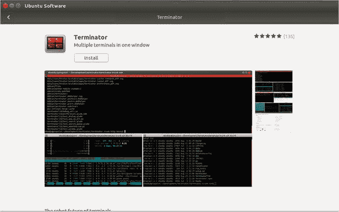

图 8-28。

More information for terminal

现在我们要安装这个包(见图 [8-29](#Fig29) )。

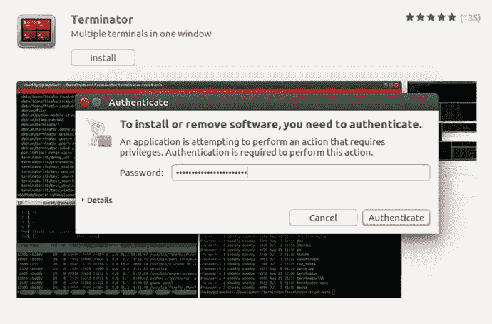

图 8-29。

Entering our password to get root privileges to install packages

我们被要求输入密码，然后才能安装软件。

一旦安装完毕(见图 [8-30](#Fig30) )，我们可以从这里启动应用程序，也可以将其移除(见图 [8-31](#Fig31) )。

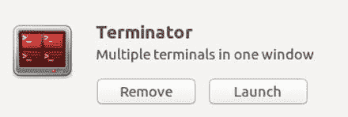

图 8-31。

Our installation is finished


图 8-30。

Installing the package

现在让我们移除包(参见图 [8-32](#Fig32) )。就像点击删除按钮一样简单。


图 8-32。

Are we sure we want to remove?

一旦我们确认要移除软件包，可能会要求您再次确认您的密码，然后我们开始移除应用程序(参见图 [8-33](#Fig33) )。


图 8-33。

Removing the terminator application

如果我们单击 Installed 视图，我们将获得所有已安装软件包的列表(参见图 [8-34](#Fig34) )。

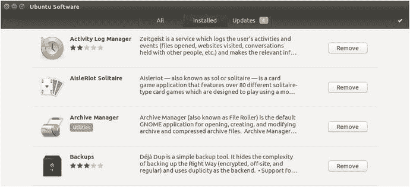

图 8-34。

Listing our installed packages

在已安装的页面中，我们可以单击任何列出的软件包，并获得更多相关信息，如果您愿意，也可以删除某个软件包。

转到更新页面，我们看到以下内容(参见图 [8-35](#Fig35) ):

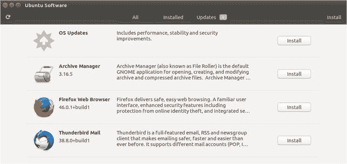

图 8-35。

Updates view

我们再次看到，我们可以刷新列表，确保我们有最新的列表，方法是单击左上角的 reload 图标。我们可以通过单击安装按钮来安装个别更新，也可以通过右上角的安装按钮来安装所有更新。

如果我们想看看将安装什么，我们可以点击更新。

在图 [8-36](#Fig36) 中，我们看到了将随操作系统更新一起安装的软件包列表。

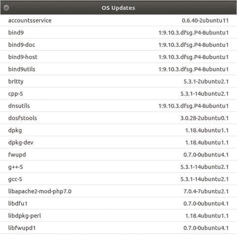

图 8-36。

Listing the packages in the OS Updates update

现在我们将安装所有更新(见图 [8-37](#Fig37) )。

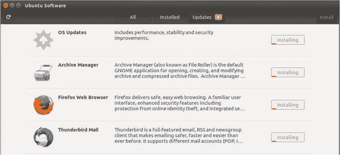

图 8-37。

Installing updates

最后，当所有更新都已安装后，您应该会看到以下屏幕(图 [8-38](#Fig38) ):

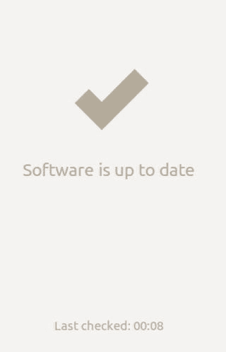

图 8-38。

All up to date

这就是使用桌面应用安装程序的全部内容，现在让我们来看看 Ubuntu 上最基本的打包工具。

### 使用`dpkg`

Ubuntu 上最基本的包管理工具是`dpkg`(读作“dee-package”)。`apt`和`aptitude`工具都是`dpkg`的包装器，就像`yum`是`rpm`命令的包装器一样。

Tip

我们建议您使用`aptitude`而不是`dpkg`来管理您的软件包。命令`aptitude`处理依赖关系并管理包之间的关系；`dpkg`命令不会。

`dpkg`命令允许你列出已经安装的软件包，安装你之前下载的软件包文件，并找出系统上的软件包文件属于哪个。通过发出 man `dpkg`命令，您可以找到对`dpkg`可用的所有选项(有很多)，如清单 [8-17](#Par317) 所示。

```sh
$ man dpkg
Listing 8-17.The dpkg man page

```

表 [8-4](#Tab4) 列出了`dpkg`命令的一些主要选项和标志。

表 8-4。

Options and Flags for `dpkg`

<colgroup><col> <col></colgroup> 
| 选项和标志 | 描述 |
| --- | --- |
| `-l &#124; --list` | 列出主机上所有已安装的软件包。 |
| `-p &#124; --print-avail` | 打印包信息。 |
| `-c &#124; --contents` | 列出特定已卸载软件包的内容。 |
| `-L &#124; --listfiles` | 列出已安装软件包的内容。 |
| `-i &#124; --install` | 在您的主机上安装软件包。 |
| `-S &#124; --search` | 查找安装的文件属于哪个包。 |
| `-r &#124; --remove` | 从主机上删除软件包。留下相关的配置文件。 |
| `-P &#124; --purge` | 从主机中清除软件包。删除关联的配置文件。 |

首先，我们将获得已经安装在我们新的 Ubuntu 系统上的软件包列表，如清单 [8-18](#Par320) 所示。

```sh
$ dpkg -l
Listing 8-18.Listing Installed Packages

```

这将生成我们主机上所有包的完整列表。这通常是一个很长的列表，但是我们可以将来自`dpkg`的输出通过管道传输到 more 命令，并逐页显示输出(参见清单 [8-19](#Par322) )。然后我们可以在闲暇时浏览它。

```sh
$ dpkg -l | more
Listing 8-19.Piping the dpkg -l Output to More

```

注意在图 [8-39](#Fig39) 中`dpkg`列出了四列输出:状态、名称、版本和描述。我们通过`head`命令传输这个输出，默认情况下，它只给出前十行输出。


图 8-39。

Viewing results of `dpkg -l` Note

虽然从清单 [8-20](#Par337) 的输出中没有自动清除，但前三行实际上是状态栏。

让我们看一下这些列。“状态”列实际上由包可能处于的三种状态组成。

*   期望的状态
*   当前状态
*   错误

通常情况下，状态会是`ii`，这意味着软件包当前已经安装，如果有更新的版本，将会升级。表 [8-5](#Tab5) 列出了最常见的状态代码及其含义。

表 8-5。

The `dpkg` Status Codes

<colgroup><col> <col></colgroup> 
| 密码 | 意义 |
| --- | --- |
| `ii` | 软件包已安装，并将在有更新时安装。 |
| `hi` | 程序包已暂停并已安装，但不会安装更新。 |
| `un` | 软件包未安装。 |
| `rc` | 软件包未安装，但有剩余的配置文件(通常意味着软件包已被删除)。 |

其他专栏不言自明。它们包含软件包名称、版本(如果当前安装了软件包)和简短描述。

您通常不希望列出所有内容，所以让我们通过传递一个字符串让`dpkg`来匹配，从而将输出限制在提供 Linux 内核的包中。Ubuntu 中的 Linux 内核被命名为`linux-image`，这与 RHEL 不同，在那里它只是被称为内核。l 通过在我们的目标字符串前后使用*符号，使用一个 glob 字符串列出安装在我们主机上的所有`linux-image`(意味着我们捕获所有包含字符串`linux-image`的结果)。

Tip

Glob strings 是处理字符串的非常有用的方法，尤其是像文件名这样的字符串。你可以在 [`www.faqs.org/docs/abs/HTML/globbingref.html`](http://www.faqs.org/docs/abs/HTML/globbingref.html) 阅读关于使用 glob strings 的内容。

在这种情况下，我们使用的是`*linux-image*`(您应该阅读一些关于 globbing 的知识，并测试当您使用`linux-image` *和`linux-image`作为搜索字符串时返回的结果)。

在图 [8-40](#Fig40) 中，你可以看到有几个`linux-image`包，它们的名字都基于它们包含的内核版本。这就是为什么不同的内核包没有相同的名字，从而允许你安装多个内核。此外，您会发现`linux-image`包，这是一个所谓的虚拟包。这个包实际上不包含任何文件，但是它包含一个到最新可用内核的链接，所以正常的升级总是包含任何可用的新 Linux 内核包。


图 8-40。

Listing the Linux Kernel Tip

因为缺省的 Linux 终端只有 80 个字符宽，而`dpkg`想要在一行中显示每个包的信息，所以如果包名超过 14 个字符，它就不能显示完整的包名。对于许多包来说，这不是问题，但是内核包有很长的名字，所以不能完全显示。要解决这个问题，您可以使用环境变量覆盖`dpkg`的终端大小，这样它将显示更多信息。要做到这一点，给命令加上前缀如下:$ COLUMNS=200 `dpkg -l` ' `*linux-image*`'。这告诉你的主机你的屏幕有 200 个字符宽，所以它显示了更多的列。

### 检查包详细信息

我们先来看看 Ubuntu 上的一个常用包 adduser 用`dpkg`的一些信息。清单 [8-20](#Par337) 显示了`dpkg –p`命令查询我们的`adduser`包的信息的输出。

```sh
$ dpkg -p adduser
Package: adduser
Priority: required
Section: admin
Installed-Size: 648
Origin: Ubuntu
Maintainer: Ubuntu Core Developers <ubuntu-devel-discuss@lists.ubuntu.com>
Bugs: https://bugs.launchpad.net/ubuntu/+filebug
Architecture: all
Multi-Arch: foreign
Version: adduser-3.113+nmu3ubuntu4
Replaces: manpages-it (<< 0.3.4-2), manpages-pl (<= 20051117-1)
Depends: perl-base (>= 5.6.0), passwd (>= 1:4.1.5.1-1.1ubuntu6), debconf | debconf-2.0
Suggests: liblocale-gettext-perl, perl-modules, ecryptfs-utils (>= 67-1)
Filename: pool/main/a/adduser/adduser_3.113+nmu3ubuntu4_all.deb
Size: 161698
MD5sum: 36f79d952ced9bde3359b63cf9cf44fb
Description: add and remove users and groups
Original-Maintainer: Debian Adduser Developers <adduser-devel@lists.alioth.debian.org>
SHA1: 6a5b8f58e33d5c9a25f79c6da80a64bf104e6268
SHA256: ca6c86cb229082cc22874ed320eac8d128cc91f086fe5687946e7d05758516a3
Homepage: http://alioth.debian.org/projects/adduser/
Description-md5: 7965b5cd83972a254552a570bcd32c93
Supported: 5y
Task: minimal
Listing 8-20.Output of the dpkg -p Command

```

adduser 包包含用于系统用户管理的命令。您可以在清单 [8-20](#Par337) 中看到，除了描述和版本之外，每个包还包含一个支持联系人的电子邮件以及安装时使用的磁盘空间信息。Depends 部分还详细说明了在安装软件包本身之前需要安装的软件包，这称为依赖性。

### 检查包裹内容

除了关于软件包的描述信息之外，您还可以查询它安装了哪些文件以及将它们安装到了哪些目录。您可以使用`dpkg -L`命令找出包内容，如下所示:

```sh
$ dpkg –L adduser

```

这将返回由`adduser`包安装的文件的完整列表。

Tip

找出软件包提供了哪些命令的一个简单方法是列出它安装到包含可执行应用程序的目录中的文件。让`dpkg`列出包的内容，并通过管道将输出传递给`grep`，以将输出限制在包含字符串 bin 的文件和目录中，例如:`dpkg -L` <package name="">|</package> `grep bin`。

### 执行文件搜索

对于主机上已经存在的文件，您可以使用`dpkg`来确定它们属于哪个包:

```sh
$ dpkg -S /usr/sbin/userdel

```

这个命令告诉你哪个包提供了`userdel`命令。

### 安装软件包

所有的 Ubuntu 包文件都由三部分组成:包名、包版本和目标架构。例如，用于 32 位 Intel 机器的 foobar 包的 2.17 版应该是“foobar-2.17_i386.deb”。如果你能在任何架构上安装这个包，它将是“foobar-2.17_all.deb”

Note

目标体系结构是您的主机的处理器技术(例如，i386 或 x64)。

在您获得了适用于您的 Ubuntu 版本和架构的包文件之后，您可以使用`dpkg`来安装它。因为软件包包含需要安装到特权系统位置的文件(比如`/bin, /usr/sbin`等)。)，安装需要以`root`用户的身份进行。在 Ubuntu 上，你可以使用第 [5](05.html) 章讨论的`sudo`命令，以`root`用户的身份执行安装命令:

```sh
$ sudo dpkg -i wget_1.17.1-1ubuntu1_amd64.deb

```

在安装过程中,`dpkg`命令会让您了解进度。根据软件包的不同，它可能还会询问您一些关于如何配置软件包的问题。不要担心，你可以在以后更改这些问题的答案。

安装手动下载的软件包时要小心。如果该软件包不是为您的 Ubuntu 版本创建的，它所依赖的其他软件包可能在正确的版本中不可用。无论如何安装都可能会导致“无法解析的依赖关系”，这可能会使您的软件包系统处于不一致的状态，在这种状态下，软件包被部分安装，并阻止进一步的软件包管理，直到问题得到解决。会警告你，不强迫你就不让你这么做。一个最佳实践是，在从第三方来源下载软件包之前，总是检查该软件包在发行版中是否可用。

### 移除包

你有两种不同的方法来移除一个 Ubuntu 包:一种是移除这个包，另一种是从系统中清除这个包。当您使用`--remove`选项时，您将从主机上删除除该包的已修改配置文件之外的所有内容。当您使用`--purge`选项时，您是在告诉`dpkg`删除该软件包安装到您主机上的所有东西，包括您自己修改的配置文件。

为什么有这两种方法？因为有时您希望完全删除所有内容，有时您希望删除某些内容，以便在以后的某个阶段重新安装。

清单 [8-21](#Par355) 展示了用`dpkg`命令从主机删除包的两种方法。

```sh
$ sudo dpkg --remove wget
Listing 8-21.Package Removal

```

或者

```sh
$ sudo dpkg --purge wget

```

## 从源代码编译

尽管打包软件的列表很广泛，但并不是所有东西都可以作为方便的 deb 或`RPM`包获得。如果一个软件没有打包格式，甚至没有用于反向移植的源代码包(见侧栏“Ubuntu 反向移植”)，你可能需要从源代码构建它。

Ubuntu Backports

有时，如果您需要的特定包版本不可用，您可能会被告知创建一个 backport。如果您使用的是发行版的旧版本，或者您的发行版中还没有打包应用程序的新版本，就可能会出现这种情况。创建一个 backport 需要从一个较新(或较旧)的 Ubuntu 版本中获取源码包，并在你自己的机器上编译它。反向端口超出了本书的范围，但是网上有一些很好的参考资料，你可以从中学习如何使用和创建它们。一个好的起点是 [`https://help.ubuntu.com/community/UbuntuBackports`](https://help.ubuntu.com/community/UbuntuBackports) 。

在这一节中，我们将向您展示如何从源代码编译软件，并给出一些关于如何保持这种源代码安装可管理性的提示。

从源代码构建应用程序通常有三个阶段:

1.  配置应用程序。
2.  编译或制作应用程序。
3.  安装应用程序。

我们将带您经历这三个阶段，并以`nginx` web 服务器为例。这一次，我们将在撰写本文时构建最新的源代码(版本 1.10.1)，而不是从包中安装我们的应用程序。首先，让我们使用`wget`工具从 [`http://nginx.org/`](http://nginx.org/) 中抓取 tarball。

```sh
$ wget –c http://nginx.org/download/nginx-1.10.1.tar.gz

```

Note

tarball 是包含一组文件和/或目录的文件(通常是压缩的)。用来创建这些 tarballs 的应用程序被称为`tar`(磁带存档)，这样命名是因为它最初被用来将存档写入磁带。Tarballs 的文件扩展名通常表示归档文件是如何压缩的。例子包括`tar.gz`或者。`tgz`为`gzip`和`tar.bz2`或。`tbz`为`bzip2`压缩。你可以在它的`man`页面上看到更多关于 tar 的信息。

c 标志告诉`wget`恢复部分下载。这意味着如果下载由于某种原因被中断，它不会重新开始下载。使用-c 选项，如果下载失败，您可以重新运行该命令，下载将从它停止的地方恢复。

`wget`命令将文件下载到当前目录，所以我们现在有了一个可以解压的 tarball。扩展告诉我们它是用`gzip`压缩的，所以我们需要`-z`标志让`tar`使用`gzip`解压缩。我们传递–x 来告诉 tar 提取归档文件。–f 用于提供要处理的文件。

```sh
$ tar -xvzf nginx-1.10.1.tar.gz

```

Tip

如果您不知道 tarball 使用什么压缩方式，您可以使用`file`命令来查找。运行`file <tarball>`和`file`将检查 tarball 的魔术字节，这表明了文件类型。数千种文件类型的神奇字节列表存储在`/usr/share/file/magic`中。一旦你知道 tarball 是如何被压缩的，你就可以打开它了。

`-v`参数告诉`tar`要详细并打印它从存档中提取的每个文件的路径。如果您知道归档中包含哪些文件，您可能希望删除此参数，这样您的终端就不会滚动显示冗余信息。额外的好处是，不打印文件名意味着提取操作完成得更快。

tarball 现在已经被提取出来了，所以我们应该转到源文件目录并查看一下，看看那里有哪些文件。

```sh
$ cd  nginx-1.10.1
∼/ nginx-1.10.1$ ls

```

在许多情况下，编译和安装应用程序的说明将包含在一个名为 README 或 INSTALL 的文件中。对于`nginx`，似乎没有安装文件，但有一个自述文件。通过阅读这个文件，我们应该能够找到安装应用程序的说明。

```sh
$ less README

```

我们从这个文件中了解到，安装文档是在线的，不包含在 tarball 中。详细信息可参考 [`http://nginx.org/`](http://nginx.org/) 的`nginx`具体在线文档。我们将在这里使用这些指令( [`http://nginx.org/en/docs/configure.html`](http://nginx.org/en/docs/configure.html) )来编译和安装应用程序。

但是在编译我们的应用程序之前，我们需要安装一个编译器及其相关的库和实用程序。这些通常是打包的，所以我们将简单地通过包系统安装它们。表 [8-6](#Tab6) 显示了 Red Hat 和 Ubuntu 所需的包。

表 8-6。

Installing a Compiler and Essential Build Tools

<colgroup><col> <col></colgroup> 
| 分配 | 命令 |
| --- | --- |
| CentOS | `yum install gcc make` |
| 人的本质 | `aptitude install build-essential` |

### 安装ˌ使成形

安装了编译器之后，我们现在可以配置编译的源代码了。大多数软件都是高度可配置的，不仅在可用特性方面，而且在安装位置方面。为了在构建应用程序之前配置它，我们使用了`configure`命令。在清单 [8-22](#Par380) 中，我们运行带有`--help`选项的配置命令来显示所有可用于配置我们的应用程序的选项。

```sh
∼/nginx-1.10.1$ ./configure --help

  --help                                    print this message

  --prefix=PATH                      set installation prefix
  --sbin-path=PATH                set nginx binary pathname
  --modules-path=PATH         set modules path
  --conf-path=PATH                set nginx.conf pathname
  --error-log-path=PATH         set error log pathname
  --pid-path=PATH                  set nginx.pid pathname
  --lock-path=PATH                 set nginx.lock pathname

  --user=USER                        set non-privileged user for
                                                       worker processes
  --group=GROUP                   set non-privileged group for
                                                       worker processes

Listing 8-22.Shortened List of Configuration Help

```

Note

注意，在清单 7-28 中，我们在`configure`命令前面指定了`./`。这告诉 Linux 运行它在当前目录中找到的`configure`脚本。

输出还在继续，但是我们将在最重要的选项`--prefix`处停止。这个选项决定了软件的安装位置，重要的是这个位置不能被打包的软件使用。否则，您可能会遇到从源文件安装的文件覆盖打包文件的情况。这将使包系统混乱，当您删除有问题的包时，您编译的文件也将被删除。

通常，当您从源代码安装应用程序时，它们被部署在`/usr/`本地目录结构中。这通常是`--prefix`的默认选项。我们将把`nginx`安装在另一个安装你自己软件包的公共目录下，`/opt`。

其他需要注意的选项是那些决定软件中可用特性的选项。它们决定了在配置期间是否应该检查第三方库，如果存在，是否应该使用第三方库。这些选项通常以`--with` -和`--without` -为前缀。我们将编译最基本的默认`nginx`服务器。有关可用选项的更多信息，请参考上面的文档链接。

有了这些新的知识，我们现在可以用默认选项配置我们的`nginx`源，如清单 [8-23](#Par386) 所示。

```sh
∼/nginx-1.10.1$ ./configure --prefix=/opt/nginx
checking for OS
 + Linux 4.4.0-22-generic x86_64
checking for C compiler ... found
 + using GNU C compiler
 + gcc version: 5.3.1 20160413 (Ubuntu 5.3.1-14ubuntu2.1)
checking for gcc -pipe switch ... found
checking for -Wl,-E switch ... found
checking for gcc builtin atomic operations ... found
checking for C99 variadic macros ... found
checking for gcc variadic macros ... found
...<snip>...
checking for sha1 in system md library ... not found
checking for sha1 in system OpenSSL crypto library ... not found
checking for zlib library ... not found

./configure: error: the HTTP gzip module requires the zlib library.
You can either disable the module by using --without-http_gzip_module
option, or install the zlib library into the system, or build the zlib library
statically from the source with nginx by using --with-zlib=<path> option.

Listing 8-23.Configuring Our Source Tree

```

脚本检查我们的系统是否存在编译器、所需的头文件以及这些头文件中的函数和数据结构的定义。我们在本章开始时讨论了头文件和库，并提到通常只有在从源代码编译软件时才需要它们。在清单 7-29 中，注意脚本无法找到 zlib 头。我们可以选择给出 zlib 文件的安装路径(`--with-zlib=<path>`)，或者在没有 zlib 的情况下编译(`--without-http_gzip_module`)。对于我们的 Ubuntu 主机，我们将安装 zlib1g-dev 和 libpcre3-dev，它们提供了必要的压缩和 perl 头文件。根据您在构建时包含的选项，您可能需要其他包。

```sh
$ sudo aptitude install -y zlib1g-dev libpcre3-dev

```

如果您指定`--without-<option>`，该选项将被禁用。我们现在再次运行编译命令。

```sh
∼/nginx-1.10.1$ ./configure --prefix=/opt/nginx
checking for OS
 + Linux 4.4.0-22-generic x86_64
checking for C compiler ... found
 + using GNU C compiler
 + gcc version: 5.3.1 20160413 (Ubuntu 5.3.1-14ubuntu2.1)
checking for gcc -pipe switch ... found
checking for -Wl,-E switch ... found
checking for gcc builtin atomic operations ... found
checking for C99 variadic macros ... found
checking for gcc variadic macros ... found
...<snip>...
creating objs/Makefile

Configuration summary
  + using system PCRE library
  + OpenSSL library is not used
  + using builtin md5 code
  + sha1 library is not found
  + using system zlib library

  nginx path prefix: "/opt/nginx"
  nginx binary file: "/opt/nginx/sbin/nginx"
  nginx modules path: "/opt/nginx/modules"
  ...<snip>...
  nginx http proxy temporary files: "proxy_temp"
  nginx http fastcgi temporary files: "fastcgi_temp"
  nginx http uwsgi temporary files: "uwsgi_temp"
  nginx http scgi temporary files: "scgi_temp

```

输出显示了 nginx 的成功配置，并提供了一个摘要。

### 编译和制作

完成后，`configure`命令会写入一个配置头文件和一个名为`Makefile`的特殊文件。前者包含向编译器指示可用函数和库的代码，后者包含通过`make`命令构建软件所需的命令。`make`命令读取`Makefile`并执行其中包含的命令和有序步骤(参见 [`http://www.tutorialspoint.com/makefile/why_makefile.htm`](http://www.tutorialspoint.com/makefile/why_makefile.htm) 了解更多关于 make 的信息)。我们发出`make`命令开始构建清单 [8-24](#Par393) 中的`nginx`。

```sh
∼/nginx-1.10.1$ make
make -f objs/Makefile
make[1]: Entering directory '/home/jsmith/nginx-1.10.1'
cc -c -pipe  -O -W -Wall -Wpointer-arith -Wno-unused-parameter -Werror -g  -I src/core -I src/event \
              -I src/event/modules -I src/os/unix -I objs \
        -o objs/src/core/nginx.o \
        src/core/nginx.c
cc -c -pipe  -O -W -Wall -Wpointer-arith -Wno-unused-parameter -Werror -g  -I src/core -I src/event \
              -I src/event/modules -I src/os/unix -I objs \
        -o objs/src/core/ngx_log.o \
        src/core/ngx_log.c
sed -e "s|%%PREFIX%%|/opt/nginx|" \
        -e "s|%%PID_PATH%%|/opt/nginx/logs/nginx.pid|" \
        -e "s|%%CONF_PATH%%|/opt/nginx/conf/nginx.conf|" \
        -e "s|%%ERROR_LOG_PATH%%|/opt/nginx/logs/error.log|" \
        < man/nginx.8 > objs/nginx.8
make[1]: Leaving directory '/home/jsmith/nginx-1.10.1'
Listing 8-24.Compiling nginx

```

如果`make`过程成功完成，应用程序就构建好了。如果失败，您通常会收到一条错误消息，指出原因，并希望得到一些关于如何修复它的指导。构建应用程序失败的原因有很多——太多了，无法在此详述——但一般来说，您可能会遇到别人以前发现过的问题。您遇到的问题可能在应用程序的网站上有详细说明，例如，在安装文档或常见问题部分。通过谷歌搜索特定的错误信息也可能指出可能的解决方案。此外，联系支持列表，通常会有人非常乐意提供帮助。

### 安装

现在我们的`nginx`应用程序已经编译好了，我们需要让它对系统上的所有用户都可用，方法是将它安装到我们之前配置时选择的前缀位置。Makefile 也包含这样的命令，您可以在清单 [8-25](#Par396) 中看到安装过程。

```sh
∼/nginx-1.10.1$ sudo make install
[sudo] password for jsmith:
make -f objs/Makefile install
make[1]: Entering directory '/home/jsmith/nginx-1.10.1'
test -d '/opt/nginx' || mkdir -p '/opt/nginx'
test -d '/opt/nginx/sbin' \
        || mkdir -p '/opt/nginx/sbin'
test ! -f '/opt/nginx/sbin/nginx' \
        || mv '/opt/nginx/sbin/nginx' \
                '/opt/nginx/sbin/nginx.old'
<snip>
test -d '/opt/nginx/logs' \
        || mkdir -p '/opt/nginx/logs'
make[1]: Leaving directory '/home/jsmith/nginx-1.10.1'
Listing 8-25.Installing nginx

```

我们需要使用`sudo`，因为作为普通用户，我们不允许在`/opt/nginx`下创建新文件。同样，`make`处理`Makefile`中的规则，并执行命令在系统上安装`nginx`及其相关文件。我们现在可以运行新安装的应用程序来确保一切正常，如清单 [8-26](#Par398) 所示。

```sh
∼/nginx-1.10.1$ sudo /opt/nginx/sbin/nginx -v
nginx version: nginx/1.10.1
Listing 8-26.Running nginx

```

### 从计算机上卸载

当您想从系统中删除它们时，管理源代码安装的棘手部分就来了。一些(但不是全部)包含卸载规则。对于`nginx`，没有一个，但是我们将调用下面的:

```sh
∼/<some-package-source>$ sudo make uninstall

```

这意味着我们需要在我们的系统中保存配置好的资源。这并不理想，因为我们不仅需要跟踪我们从源代码安装了哪些软件，还需要跟踪我们将这些源代码保存在哪里。这也是我们建议您避免从源代码安装应用程序，而是依靠软件包来提供应用程序的原因之一。因为我们在`/opt/nginx`中安装了我们的应用程序，这意味着我们可以通过发出`rm -rf /opt/nginx`有效地“卸载”，这将删除整个`nginx`目录。

### 使用 FPM 创建包

FPM 是一个应用程序，它从各种不同的源类型构建 deb 或 rpm 包(以及其他包类型)，包括 deb 源包和 RPM 源包。我们将构建一个 nginx 安装包作为 deb，但是这个过程对于 RPM 包也是一样的。

从安装 FPM 开始，它就像一个 Ruby 宝石，一个封装和分发软件的另一种方式的宝石，特别是对于 Ruby 应用程序。

首先，在 Ubuntu 上，我们将发布以下内容:

```sh
$ sudo aptitude install –y install ruby ruby-dev

```

如果您正在运行 CentOS:

```sh
$ sudo yum install -y ruby ruby-devel

```

下面的步骤对于 CentOS 和 Ubuntu 是一样的。我们将在我们的 Ubuntu 主机上构建并执行它(但是如果你已经安装了所需的包，你可以在任一发行版上构建 rpm 和 deb)。然后 FPM 通过宝石命令:

```sh
$ sudo gem install fpm

```

我们现在创建一个临时安装目录来保存我们的 nginx 安装。

```sh
$ sudo mkdir /tmp/installdir

```

然后我们转到 nginx 源目录，在那里我们编译了 nginx 源，如清单 [8-25](#Par396) 所示，现在发出下面的命令将 nginx 安装到我们的临时安装目录中。

```sh
$ sudo make install DESTDIR=/tmp/installdir

```

如果你查看`/tmp/installdir`目录，你会看到我们已经在那个目录中安装了 nginx。我们现在指示 FPM 进入那个目录，为我们创建一个 deb 包。我们让 FPM 施展它的魔法，发布了以下内容:

```sh
$ sudo fpm -s dir -t deb -n nginx -v 1-10.1 -C /tmp/installdir/

```

这里我们为 dir 的源类型指定了–s，这意味着目录。目标(-t)是一个 debian 包。如果我们正在构建一个 RPM 包，这将是`-t rpm`。我们将其命名为(`-n` ) `nginx`，并给出版本(`-v`)或`1-10.1`。最后，我们告诉 FPM 转到(`-C /tmp/installdir`)并将目录中的内容打包。

这将在本地目录中创建一个`nginx_1-10.1_amd64.deb`包。您现在可以用`dpkg`命令安装它。

```sh
$ sudo dpkg -i nginx_1-10.1_amd64.deb
Selecting previously unselected package nginx.
(Reading database ... 213564 files and directories currently installed.)
Preparing to unpack nginx_1-10.1_amd64.deb ...
Unpacking nginx (1-10.1) ...
Setting up nginx (1-10.1) ...

```

我们可以通过发出以下命令来测试它是否工作:

```sh
$ /opt/nginx/sbin/nginx -v
nginx version: nginx/1.10.1

```

这就是我们，一个由我们编译的源代码制作的 debian 包。你可以在这里看到更多关于 FPM 的信息:

*   [`https://github.com/jordansissel/fpm`](https://github.com/jordansissel/fpm)
*   [`www.digitalocean.com/community/tutorials/how-to-use-fpm-to-easily-create-packages-in-multiple-formats`](http://www.digitalocean.com/community/tutorials/how-to-use-fpm-to-easily-create-packages-in-multiple-formats)

## 摘要

在这一章中，我们已经看到了很多。现在，您应该能够在您的 Linux 服务器上安装、删除、更新和维护这些包了。我们展示了以下内容:

*   CentOS 应用程序安装程序
*   百胜包管理和 DNF
*   RPM 包管理
*   Ubuntu 软件应用程序
*   智能包管理
*   Dpkg 包管理
*   从源代码编译
*   创建一个 debian 或 RPM 包

在下一章中，我们将看看如何设置您的存储以获得最大的可靠性，您将学习如何避免硬盘问题并从中恢复。