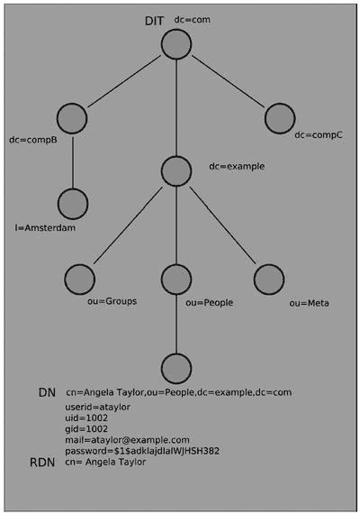
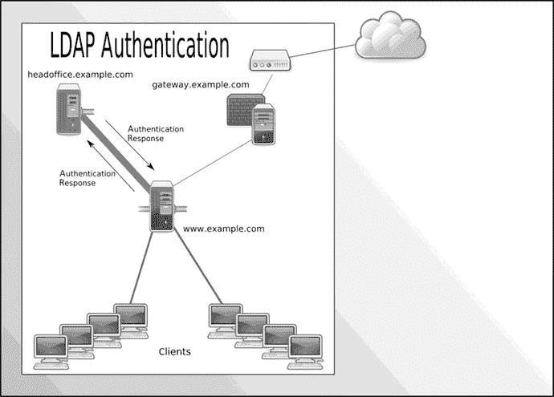
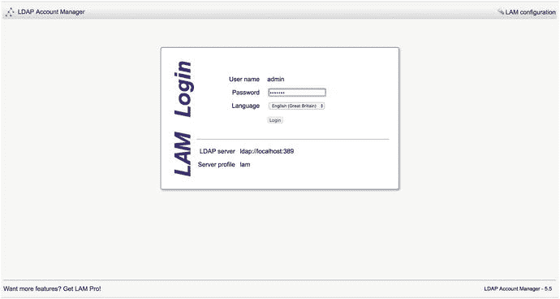
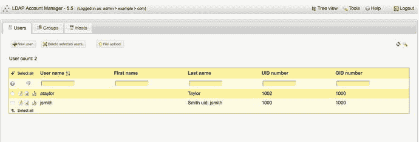
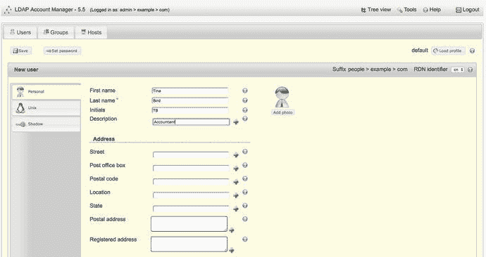
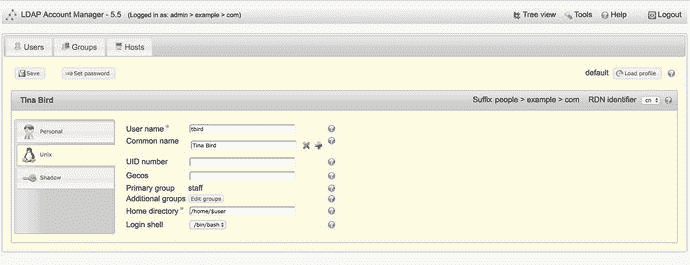
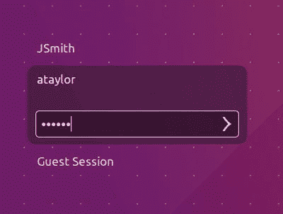
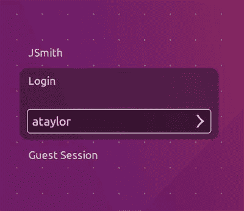
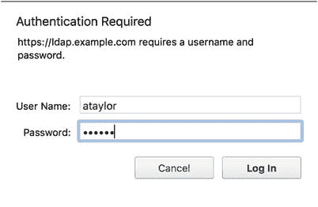

# 十六、目录服务

目录服务在主要的计算机网络中广泛存在。轻量级目录访问协议(LDAP)目录就是这种服务的一个例子。LDAP 目录是特殊的数据库，通常包含用户名、密码、常用名、电子邮件地址、业务地址和其他属性。组织首先使用目录服务来促进地址簿和用户信息的分发。从那时起，目录服务已经发展成为所有用户信息和身份验证服务的中央存储库。开发的应用程序能够根据目录服务进行身份验证，这进一步增强了它们在组织中的重要性。

在本章中，我们将向您展示如何安装和配置 OpenLDAP 服务器。我们还将讨论通过添加您自己的模式来扩展您的 OpenLDAP 目录服务器。我们将向您展示如何设计访问控制列表来保护您的安装，以及如何通过命令行工具和基于 web 的 GUI 来管理 LDAP 服务器。最后，您将看到如何将 LDAP 服务器与现有的网络和应用程序集成，包括实现单点登录服务和 Apache web 身份验证的能力。

目录服务的实现可能很复杂。虽然安装很简单，但要安全地配置它们通常很复杂。OpenLDAP 没有商业支持的版本，但即使是 OpenLDAP 邮件列表中最简单的问题，也会由该项目的高级工程师和设计师定期回答(这对他们的奉献精神是一个巨大的帮助和绝对的荣誉)。也就是说，在您开始安装之前，购买一本专门介绍该主题的书会对您有所帮助，从而加深您对该软件的理解。我们向您推荐以下内容:

*   如果您需要专家支持，请查看技术支持页面: [`www.openldap.org/support/`](http://www.openldap.org/support/)
*   部署 OpenLDAP
*   Matt Butcher 的《掌握 OpenLDAP:配置、保护和集成目录服务》(Packt Publishing，2007)

Tip

OpenLDAP 网站在 [`www.openldap.org`](http://www.openldap.org) 也包含了很好的管理指南和常见问题解答。

## 概观

在这一章中，我们将探索 OpenLDAP 并把它作为一种认证服务。我们可以将它用作任何支持 LDAP 的身份验证机制的单点登录服务。它可以用来集中保存我们所有用户的身份信息，包括用户名、密码、电子邮件地址以及其他用户和组信息。在本章中，我们将带您了解以下内容:

*   安装和设置 OpenLDAP 服务
*   解释模式并创建一个属性，我们可以使用该属性作为过滤器来检查活动和非活动用户
*   向我们的 LDAP 服务添加用户
*   使用访问控制列表保护服务以保护敏感数据
*   使用 LDAP 工具，如`ldapmodify`、`ldapadd`和`ldapsearch`
*   设置 web GUI 来管理 LDAP
*   使用 SSSD 和 LDAP 执行单点登录
*   使用 LDAP 实现 web 身份验证

您可以搜索、添加、修改、删除和验证 LDAP 服务中的条目。这些操作受访问列表的限制，不同的用户可以有不同的访问权限。在确定访问级别的初始阶段会发生一个身份验证过程，这称为绑定。这可以由一个用户代表另一个用户完成，也可以匿名完成，具体取决于您如何配置您的访问列表。完成后，我们就可以访问服务中的条目了。

请继续阅读，我们将解释什么是 LDAP，并让您了解构成 LDAP 服务的组件。

## 什么是 LDAP？

轻型目录访问协议用于访问从目录访问协议(DAP)派生的基于 X.500 的目录服务。X.500 是一组协议，概述了应该如何存储用户信息以及应该如何访问这些信息。LDAP 是由没有 TCP/IP 功能的目录访问协议产生的。

Note

有关 X.500 OSI 协议的更多信息，请参见 [`http://en.wikipedia.org/wiki/X.500`](http://en.wikipedia.org/wiki/X.500) 。

存在几种常见类型的目录服务，它们都是从 X.500 DAP OSI 模型派生出来的。一些常见的例子有:微软的活动目录、Red Hat 的目录服务和 Oracle 目录服务器企业版。

在这一章中，我们将集中讨论常用且健壮的 OpenLDAP 服务器。OpenLDAP 是从密歇根大学最初设计的原始项目中分出来的，现在通过 OpenLDAP 项目( [`www.openldap.org/project/`](http://www.openldap.org/project/) )的工程师和开发人员社区的工作继续进行。

Note

另一个建议是 FreeIPA 项目，尽管本书没有探讨。它允许您管理身份(用户帐户等)，执行策略授权，如 DNS 和`sudo`的 Kerberos 策略，并在其他身份服务(如 Microsoft AD)之间创建相互信任。您可以在 [`https://www.freeipa.org/page/Main_Page`](https://www.freeipa.org/page/Main_Page) 查看更多相关信息。还有一篇关于在 [`https://www.dragonsreach.it/2014/10/12/the-gnome-infrastructures-freeipa-move-behind-the-scenes/`](https://www.dragonsreach.it/2014/10/12/the-gnome-infrastructures-freeipa-move-behind-the-scenes/) 从 OpenLDAP 迁移到 FreeIPA 的文章。

X.500 DAP OSI 模型描述了 LDAP 遵循的一些基本概念。首先，您需要有一个单一的目录信息树(DIT)。这是条目的层次结构。这些条目中的每一个都需要一个可分辨名称(DN)。条目的 DN 由相对可分辨名称(RDN)及其所属的祖先条目组成。图 16-1 显示了 DIT、DN 和 RDN 之间的基本关系。



图 16-1。

DITs, DNs, and RDNs

DIT 是目录树，在这种情况下，它的根 DN 是`dc=com`。有几种方法来定义你的根和主分支。有些人根据他们的 DNS 域名选择布局，就像我们这里一样，有些人使用地理位置，如`o=US`、`o=AU`或`o=DE`作为他们的根。在我们的例子中，我们选择使用 DNS 命名标准，因为我们不太关心我们组织的地理位置。如果我们愿意，我们总是可以在树的更下面引入`LocalityName`属性，就像我们在`compB`分支中指定`l=Amsterdam`的位置一样。应该考虑如何布置目录结构，但最终你希望它尽可能简单易懂。

Tip

现在定义一种命名分支机构和描述组织的标准方式并坚持下去是很重要的。

分支用于将信息组织成逻辑组。这些逻辑组被称为组织单元，表示为`ou`。您可以将您喜欢的任何东西分组在一起，但是您通常会在 LDAP 树中看到的主要组织单位是`People`、`Groups`和`Machines`。你将与你的人相关的一切都存储在`ou=people`下，将你的用户组存储在`ou=groups`下，将你的非人类资产存储在`ou=Machines`(通常也叫做`ou=hosts`)下。组织单元可以包含其他组织单元，并且可以像您希望的那样复杂，尽管我们再次建议在设计您的 DIT 时越简单越好。

DN 是根下的唯一条目，它由 RDN 及其祖先组成。你可以在图 16-1 中看到我们有一个`cn=Angela Taylor,ou=people,dc=example,dc=com`的 DN。它由 RDN `cn=Angela Taylor`和`ou=people`、`dc=example`、`dc=com`的祖先组成。同样，`ou=people,dc=example,dc=com`是`People`组织单元的 DN，`ou=people`是它的 RDN。

每个 DN 条目都由描述该条目的对象类和属性组成。对象类描述了什么属性必须存在或者允许存在。这些类可以支持其他类，以便为它们提供扩展属性。这些属性由 RDN 值描述。类和属性必须在模式中定义，并且必须是唯一的。

模式是一组定义，描述可以存储在目录服务器中的数据。模式用于描述可用类和属性定义的语法和匹配规则。如果您发现可用的模式文件不能正确描述您的组织，您可以根据需要为您的公司创建自己的模式文件。一旦创建了模式文件，就可以将它包含在 OpenLDAP 配置文件中。

组织通常需要某些属性来描述您的用户或内部系统，这些属性在提供的模式文件中没有提供。在这种情况下，您将在自己的模式文件中创建自己的对象类和属性。创建模式文件时，必须记住使对象类和属性的名称是唯一的。

为所有创建的属性和类添加前缀以确保它们是唯一的，这是一个很好的做法。假设我们想自己添加一个属性，让我们知道用户何时被禁用。在这种情况下，我们可以为我们的示例公司定义一个“活动”属性为`exampleActive`。然后，我们可以通过将`exampleActive`设置为`TRUE`或`FALSE`来启用和禁用条目。

下面是它在 LDAP 条目中的样子:

```sh
dn: uid=user1,ou=people,dc=example,dc=com
uid: user1
exampleActive: TRUE

```

一旦这个属性被添加到 LDAP 中的一个条目，我们就可以使用过滤器在 LDAP 目录中搜索所有的`exampleActive = TRUE`实例，这将加快活动用户的搜索速度。这只是一个如何使用自己的模式定义的例子；可能有其他方法可以达到同样的效果。

Note

《OpenLDAP 管理员指南》在这里有关于如何创建模式文件的解释: [`www.openldap.org/doc/admin24/schema.html`](http://www.openldap.org/doc/admin24/schema.html) 。

OpenLDAP 可以使用各种后端。默认情况下，OpenLDAP 使用内存映射数据库(MDB ),它基于 Lightning 内存映射数据库(LMDB)。LMDB 是由 Symas 开发的，Symas 是一个软件组织，由核心 OpenLDAP 开发团队中的许多人(如果不是全部的话)创建。它速度极快，可伸缩性也很强，数据库可以容纳数百万条记录。它针对阅读、搜索和浏览进行了优化。如果您愿意，OpenLDAP 可以使用其他数据库作为后端。

Note

你可以在 [`https://symas.com/products/lightning-memory-mapped-database/`](https://symas.com/products/lightning-memory-mapped-database/) 了解更多关于 LMDB 的信息。

## 总则

Ubuntu 和 CentOS 提供了不同版本的 OpenLDAP。CentOS 和 Ubuntu 都提供了最新的 OpenLDAP 2.4 版本。以下是它支持的一些功能:

*   镜像模式和多主控复制
*   代理同步复制
*   扩展文档
*   LDAP 版本 3 扩展
    *   LDAP 链接操作支持
    *   不使用复制控制支持
    *   LDAP 动态目录服务(RFC 2589)
*   添加覆盖层以获得更强大的功能

如果您正在寻求对多主控复制功能的支持(即拥有多个 LDAP 主目录服务的能力)，多主控可以增强 LDAP 安装的冗余性。

你也可以利用叠加。覆盖为 OpenLDAP 提供了高级功能，以改变或扩展正常的 LDAP 行为。密码策略(ppolicy)覆盖等覆盖层支持 OpenLDAP 基本代码中未提供的密码控制。ppolicy 覆盖允许您设置密码时效和最小字符长度等内容。

您还需要决定您的组织将支持哪种身份验证方法。OpenLDAP 支持两种认证方法，简单和 SASL。简单方法有三种操作模式。

*   匿名:不提供用户名或密码。
*   未经验证:提供了用户名，但没有密码。
*   用户名/密码验证:必须提供有效的用户名和密码。

对于 SASL 方法,《OpenLDAP 管理员指南》说，您需要一个现有的塞勒斯 says 安装来提供 SASL 机制。这并不完全正确，这取决于您想要实现的 SASL 机制。您可以非常容易地设置`PLAIN` / `LOGIN`和 DIGESTMD5 机制。然而，你必须安装赛勒斯 SASL。SASL 提供了以下机制:

*   普通/登录
*   DIGESTMD5
*   GSSAPI (Kerberos v5)
*   外部(X.509 公钥/私钥身份验证)

Note

SASL (PLAIN/LOGIN，DIGESTMD5)要求在`userPasswd`属性中使用明文密码。这对于安全来说是好是坏是一个激烈的争论。争论的一方是这样的:“一旦我进入了你的数据库，我就可以访问你所有的密码。”对此的反驳是，“如果你能进入我的数据库，游戏就结束了。至少我不会通过可能被拦截的线路发送密码。”

您可以在《OpenLDAP 管理员指南》的以下页面中了解有关这些不同认证方法的更多信息:

*   [`www.openldap.org/doc/admin24/security.html#Authentication%20Methods`](http://www.openldap.org/doc/admin24/security.html#Authentication%20Methods)
*   [`www.openldap.org/doc/admin24/sasl.html`](http://www.openldap.org/doc/admin24/sasl.html)

## 履行

在我们向您展示如何在我们的示例系统上安装 OpenLDAP 服务器之前，我们需要回顾一下实现的一些细节。

*   我们将在 DNS 中设置一个 CNAME，它将把`ldap.example.com`指向`headoffice.example.com`记录，或者为安装 LDAP 服务器的主机定义一些其他的 DNS A 记录。有关 DNS 的说明，请参见第十章。
*   我们没有使用任何目录服务的副本。复制是指我们的网络上可以有多个 LDAP 服务器共享我们的全部或部分 LDAP 数据，并响应客户端请求。这需要额外的配置。

让我们只看一下网络的一部分。假设我们的网络上有一个 web 服务器，我们想确保只有我们组织中某个组的人才能访问它。通常，我们需要在网站上添加复杂的登录机制，使用某种用户数据库来存储信息，等等。有了 Apache web 服务器，我们可以使用 Apache LDAP 模块让 web 服务器使用 LDAP 服务器来验证请求。如果没有此身份验证，网站将无法访问。我们还可以让其他服务对我们的 OpenLDAP 目录服务器进行认证。在图 16-2 中，你可以看到我们如何认证我们的 web 服务器。



图 16-2。

LDAP authentication of web services

图 16-2 给出了一个简单的图表，显示了一个 web 服务器使用 LDAP 向 web 服务认证我们的桌面或互联网客户端(如果没有必要的硬件资源，LDAP 服务和 web 服务可以在同一个主机上)。当网站收到请求时，发出请求的用户需要在被授予访问权限之前进行验证。在`headoffice.example.com`向 LDAP 服务发送认证请求。如果用户通过验证，LDAP 服务器会将响应发送给 web 服务，用户就可以访问站点了。

我们在本书中描述的许多服务都可以使用 LDAP 服务。这使您可以将身份认证服务集中在一台主机上，降低了复杂性，提高了身份认证安全性，并为您的所有员工详细信息提供了一个中央存储库。

我们将向您展示如何为 Apache web 服务设置 LDAP 服务和身份验证。

## 装置

在 CentOS 和 Ubuntu 上都可以通过它们的在线存储库获得 OpenLDAP。同样，对于 OpenLDAP，这两个发行版之间存在细微的差异，我们将在接下来详述它们。

### CentOS 安装指南

现在，我们将带您在 CentOS 主机上安装 OpenLDAP 服务器。二进制文件可以从 CentOS 存储库中获得，您可以通过`yum`命令或软件包管理器 GUI 来安装它们。我们将通过`yum`命令安装它们，如下所示:

```sh
$ sudo yum install openldap openldap-clients openldap-servers

```

这将安装配置、运行和管理 LDAP 服务器所需的文件。`openldap`包安装允许主机与 OpenLDAP 服务器集成所需的基础包。`openldap-clients`包安装管理和查询 LDAP 服务器的工具。`openldap-servers`包安装运行 OpenLDAP 服务器所需的文件。

### Ubuntu 安装指南

要在 Ubuntu 主机上安装 OpenLDAP，我们需要安装`ldap-utils`包和`slapd`包。以下命令将安装这些软件包:

```sh
$ sudo aptitude install ldap-utils slapd

```

当您发出这个命令时，`slapd`包将要求您提供根 LDAP 用户的密码。您可以输入密码并继续安装。如果您不想提供密码，只需按两次 Enter 键(我们将在接下来的“配置”部分向您展示如何创建密码)。一旦安装完毕，`ldap-utils`包将安装管理和搜索 LDAP 目录所需的文件。`slapd`包安装运行和配置 LDAP 目录所需的文件。

客户端配置包是`auth-client-config` (PAM 和 NSS 配置文件切换器)和`ldap-auth-client`(用于 LDAP 认证和`ldap-auth-config`的元包)。你可能也想安装这些。

## 配置

我们将向您展示如何配置 LDAP 目录服务。LDAP 服务器被称为 SLAPD。我们将向您展示如何配置该服务。

OpenLDAP 使用动态运行时配置来管理 SLAPD，这意味着它通过自己的 DIT(目录树)来配置自己。这意味着 SLAPD 配置更改可以通过使用用于更改其他 LDAP 记录的标准工具来更改 DIT 中的记录来动态完成，使用的命令有`ldapmodify`之类。

在我们的例子中，我们将在 Ubuntu 主机上配置我们的 SLAPDCentOS 的某些目录路径会有所不同。对于 CentOS 主机，配置目录称为`/etc/openldap`，而不是 Ubuntu 主机上的`/etc/ldap`。两个发行版都将数据库存储在`/var/lib/ldap`。

例如，CentOS 主机上 OpenLDAP 的配置文件存储在`/etc/openldap/`中。

```sh
$ sudo ls -l /etc/openldap/
total 12
drwxr-xr-x. 2 root root   85 Oct 26 12:46 certs
-rw-r--r--. 1 root root  121 Mar 31  2016 check_password.conf
-rw-r--r--. 1 root root  365 Oct  3 13:47 ldap.conf
drwxr-xr-x. 2 root root 4096 Oct 26 12:46 schema
drwx------. 3 ldap ldap   43 Oct 26 12:46 slapd.d

```

机密存储在`certs`目录中。专门用于配置 LDAP 客户端的配置文件是`ldap.conf`。`schema`目录包含我们的`ldap`服务的模式文件。在那里你会找到`.schema`文件和`.ldif`文件。LDIF 文件是 LDAP 交换格式文件，这是一种在 LDAP 中指定数据更改的特殊格式。在`slapd.d`目录中，您将找到包含 SLAPD DIT 的文件。我们将在本章中解释这些。

### 要求

在配置 OpenLDAP 之前，我们将设置一些要求。我们需要创建一个 TLS 证书和密钥以及一个 DNS 名称条目。

第一步是创建 DNS 记录。像 LDAP 这样的身份验证系统通常不会向公众公开，如果公开，它们可能会受到外部攻击。因此，我们通常不会提供公共 IP 地址。对于需要针对服务进行身份验证的外部办公室，我们建议您使用专用 VPN 进行访问。

这个 OpenLDAP 服务将被安装在我们的`headoffice.example.com`主机上。我们将为我们的 DNS 服务器提供`CNAME`记录，以将`ldap.example.com`指向`headoffice.example.com`。我们需要在我们的 DNS 服务器上发出以下命令:

```sh
$ sudo nsupdate -k /etc/bind/ddns_update.key
> server localhost
> update add ldap.example.com 8600 CNAME headoffice.example.com
> send
> quit
$ host ldap.example.com
ldap.example.com is an alias for headoffice.example.com.
headoffice.example.com has address 192.168.0.1

```

由于这指向一个内部私有 IPv4 地址，我们将无法使用 Let's Encrypt 来创建我们的 TLS 证书，而必须使用我们自己的私有 CA。连接到我们的 LDAP 服务器的客户端需要安装 CA 根证书。

首先，创建一个名为`/etc/ldap/certs`的新目录，然后更改它的权限。

```sh
$ sudo mkdir /etc/ldap/certs

```

我们将在我们的`ldap.example.com`主机上创建密钥和 CSR，并从`/etc/ldap/certs`目录中运行以下内容:

```sh
$ sudo openssl req -new -newkey rsa:4096 -nodes -keyout
ldap.example.com.key -out ldap.example.com.req

```

继续，像我们在第 11 和 15 章中所做的那样，通过我们的私人 CA 在请求上签名。然后，我们需要将生成的公共证书和根 CA 一起添加到`/etc/ssl/certs`目录中，如果根 CA 不在那里的话，`cacert.pem`。

当证书被安装到`certs`目录中时，我们应该将所有权和权限更改如下:

```sh
$ sudo chown openldap:openldap –R /etc/ldap/certs
$ sudo chmod 600 /etc/ldap/certs/ldap.example.com.key

```

在 CentOS 上运行 LDAP 服务的用户是`ldap`，需要在前面的`chown`命令中使用。

### 配置 SLAPD

有了这些要求，我们现在可以开始配置 OpenLDAP 服务器了。当我们在 Ubuntu 上安装了`slapd`包并被要求输入管理员密码时，基本的 OpenLDAP 服务器被配置、安装并启动(在 CentOS 上，您必须在运行该命令之前启动`slapd`服务)。

在清单 16-1 中，我们有`ldapsearch`命令的输出。该命令是用于与 LDAP 服务器(或任何 LDAP 服务器)交互的命令套件的一部分。在这个例子中，我们将`–Q`参数传递给`ldapsearch`来启用 SASL 安静模式(因为我们使用提升的`sudo`特权)。这三个字母(`-LLL`)都有一个意思。拥有一个意味着以 LDIF 格式打印；另外两个减少输出。`–H`参数是我们想要连接的 URI，`ldapi:///`，也就是说，通过本地主机上的 Unix 套接字连接到本地 LDAP 服务器。这样，我们可以将用户的 UID 和 GID 传递给 LDAP 服务器进行身份验证。接下来，`-b`定义搜索基数；我们使用`dn`作为过滤器，在`cn=config` DIT 中搜索每个`dn`(或识别名)。

```sh
$ sudo ldapsearch -Q -LLL -Y EXTERNAL -H ldapi:/// -b cn=config dn
dn: cn=config
dn: cn=module{0},cn=config
dn: cn=schema,cn=config
dn: cn={0}core,cn=schema,cn=config
dn: cn={1}cosine,cn=schema,cn=config
dn: cn={2}nis,cn=schema,cn=config
dn: cn={3}inetorgperson,cn=schema,cn=config
dn: olcBackend={0}mdb,cn=config
dn: olcDatabase={-1}frontend,cn=config
dn: olcDatabase={0}config,cn=config
dn: olcDatabase={1}mdb,cn=config
Listing 16-1.Viewing the Default Configuration

```

在清单 16-1 中，您还可以看到我们已经通过了`–Y`选项。这指定了我们想要使用的 SASL 认证机制。`EXTERNAL`这里说在这种情况下使用 localhost 的认证。我们通过 Unix 套接字将 root 用户的 UID 和 GID 传递给 LDAP 进行身份验证。默认安装允许本地超级用户访问已安装的 LDAP 服务器。

LDIF Format

LDAP 目录交换格式(LDIF)是如何在 LDAP 数据库中添加和删除条目的规范。它有自己的 RFC ( [`https://www.ietf.org/rfc/rfc2849.txt`](https://www.ietf.org/rfc/rfc2849.txt) )，LDAP 工具可以使用它来更改 LDAP 数据库中的记录。

LDIF 文件的格式如下:

```sh
dn: <the distinguished name you wish to change>
changetype: optional change type of either add, replace, or delete
<attribute or objectclass>: value

```

下面是一个例子:

```sh
dn: dc=example,dc=com
objectclass: dcObject
objectclass: organizationalUnit
dc: example
ou: example

```

这里我们已经描述了 DIT 的顶层。DN `dc=example,dc=com`将由那些特定的对象类和属性组成。

要修改现有的 DN 条目，我们可以像这样使用:

```sh
dn: uid=ffrank,ou=people,dc=example,dc=com
changetype: replace
replace: userPassword
userPassword: <new password>
-

```

这里我们用一个 LDIF 格式的文本文件修改了`ffrank`的`userPassword`。可以看到我们要更改的 DN，我们要执行的更改类型(`replace`，我们要替换的属性(`userPassword`)；最后，我们将新值赋给属性。我们可以在一个文件中有很多这样的语句，我们用`-`在新的一行中把每个语句分开。

然后在清单 16-1 中，我们有了在`cn=config`全局配置 DIT 中的全局指令 dn 列表。你可以看到全局 DIT 由根`cn=config`组成，然后域名嵌套在它下面，如图 16-3 所示。


图 16-3。

cn=config DIT

从清单 16-1 和图 16-3 中可以看到，LDAP 模式`cn={1}cosine,cn=schema,cn=config`位于`cn=schema` DN 下，DN 位于`cn=config`下。`{1}`表示模式 DN 的索引。

此外，在清单 16-1 中，还有其他几个全局指令，如`olcBackend`和`olcDatabase`。顾名思义，它们描述了后端数据存储。

```sh
dn: olcBackend={0}mdb,cn=config
dn: olcDatabase={-1}frontend,cn=config
dn: olcDatabase={0}config,cn=config
dn: olcDatabase={1}mdb,cn=config

```

要获得`cn=config` DIT 的完整列表或备份，可以发出以下命令:

```sh
sudo ldapsearch -Q -LLL -Y EXTERNAL -H ldapi:/// -b cn=config > slapd.ldif

```

我们使用了与之前相同的命令，但是从末尾移除了`dn`过滤器，并将输出定向到`slapd.ldif`文件。如果您查看该文件，您将会看到这些指令是如何配置的。

看第一个声明，我们有了`cn=config`的 DN。它有一个`olcGlobal`的`ObjectClass`，它是定义全局 DIT 的对象类。您还可以看到，我们可以声明通用名称(`cn:`)、用于`slapd` ( `olcArgsFile:`)的参数文件、日志级别(`olcLogLevel:`)、进程 ID ( `olcPidFile:`)和要使用的线程(`olcToolThreads:`)。

`olcToolThreads`指令告诉`slapd`守护进程只使用一个 CPU 来运行索引。如果您有多个 CPU，您可以将其设置为一个较大的数字，但不能高于您拥有的 CPU 数量。可以开启其他性能设置，包括`olcThreads`、`olcTimeLimits`、`olcSockBuffMaxIncoming`和`olcSockBuffMinIncoming`。

Tip

你可以转动的另一个调节旋钮是在一次点击中从一个`ldapsearch`返回的条目的数量，`olcSizeLimit`。

每次您声明一个 DN 时，您都需要提供它所属的对象类。该对象类将具有它所采用的属性。因此，`olcGlobal`对象类将`olcArgsFile`作为属性，这将在模式文件中描述。

#### 定义日志级别

在`olcGobal`对象类中，我们可以定义我们的日志记录。默认设置为`none`。这是一个关键字，但也可以用数字(甚至十六进制)来表示，如表 16-1 所述。

表 16-1。

Additive Logging Levels

<colgroup><col> <col></colgroup> 
| 水平 | 关键词/描述 |
| --- | --- |
| `-1` | (任何)打开所有调试信息。这有助于在更细粒度地记录日志之前找出 LDAP 服务器的故障所在。 |
| `0` | 关闭所有调试。这是生产模式的推荐选项。 |
| `1` | (`0x1` trace)跟踪函数调用。 |
| `2` | (`0x2` packets)调试数据包处理。 |
| `4` | (`0x4` args)提供重跟踪调试(函数 args)。 |
| `8` | (`0x8` conns)提供连接管理。 |
| `16` | 打印出发送和接收的数据包。 |
| `32` | (`0x20` filter)提供搜索过滤处理。 |
| `64` | (`0x40` config)提供配置文件处理。 |
| `128` | (`0x80` ACL)提供访问控制列表处理。 |
| `256` | (`0x100` stats)提供连接、LDAP 操作和结果(推荐)。 |
| `512` | (`0x200` stats2)表示已发送的统计日志条目。 |
| `1024` | (`0x400` shell)打印与 shell 后端的通信。 |
| `2048` | (`0x800` parse)解析条目。 |
| `16384` | (`0x4000` sync)提供 LDAPSync 复制。 |
| `32768` | (`0x8000`无)无论设置了什么日志级别，都只记录消息。 |

日志级别对于帮助调试您的安装非常重要。老实说，对于新用户来说，报告的内容可能非常混乱。然而，日志级别是附加的，您可以在日志中获得更细粒度的细节。在生产环境中，我们建议将该值设置为`0`，如果您愿意，可以使用审计覆盖来监控您的安装发生了什么(覆盖是一个软件模块，可以连接到后端以提供特定的信息，在本例中是审计跟踪)。

我们希望将日志级别设置为 480。这将在我们的日志中显示搜索过滤器、配置文件处理、访问控制和连接信息。如上所述，`Loglevel`设置是附加的，这意味着您可以通过添加想要记录的内容的值来启用更多的日志记录。您可能已经知道了，我们的`480`的`Loglevel`由层次`32`(搜索过滤器)、`64`(配置处理)、`128`(访问控制列表处理)和`256`(连接和 LDAP 操作结果)组成。当我们设置 LDAP 服务时，这是一个很好的设置，因为它提供了很好的信息。如果我们卡住了，我们可以将`Loglevel`改为`-1`来打开调试，这将打开所有的日志功能。另外，请记住，在生产环境中，您通常希望将`Loglevel`设置为`0`。要设置`Loglevel`，也可以在一行中列出十六进制数，达到同样的效果；在这种情况下，我们会将日志级别设置为`Loglevel 0x20 0x40 0x80 0x100`。

##### 使用 ldapmodify 修改日志级别配置

让我们修改`LogLevel`到我们想要的水平。为此，我们将使用`ldapmodify`命令。这采用了与我们之前使用的`ldapsearch`命令相似的参数。我们将为该命令提供一个名为`loglevel.ldif`的文件，如下所示:

```sh
dn: cn=config
changetype: modify
replace: olcLogLevel
olcLogLevel: 480

```

要修改一个属性，我们需要提供要修改的`dn`值(`dn: cn=config`)、变化类型(`changetype: modify`)、要替换的属性(`replace: olcLogLevel`)，最后是要设置的属性(`olcLogLevel: 480`)。

现在，让我们使用`ldapmodify`来修改日志属性。

```sh
$ sudo ldapmodify -Q -Y EXTERNAL -H ldapi:/// -f loglevel.ldif

```

为了确认这已经被设置，我们可以再次发出`ldapsearch`命令来验证。

```sh
$ sudo ldapsearch –Q -LLL -Y EXTERNAL -H ldapi:/// -b cn=config cn=config
dn: cn=config
objectClass: olcGlobal
cn: config
olcArgsFile: /var/run/slapd/slapd.args
olcPidFile: /var/run/slapd/slapd.pid
olcToolThreads: 1
olcLogLevel: 480

```

很好，这就是我们请求的日志设置。因为我们已经设置了这个属性，所以任何其他的 SLAPD 配置属性都可以以类似的方式设置。

#### 添加模块

在`slapd.ldif`文件中，我们有模块部分。模块被添加到配置中以提供对某些功能的访问。

```sh
dn: cn=module{0},cn=config
objectClass: olcModuleList
cn: module{0}
olcModulePath: /usr/lib/ldap
olcModuleLoad: {0}back_mdb

```

这里我们声明了找到我们的模块的路径，`olcModulePath: /usr/lib/ldap`。我们加载了一个模块，`back_mdb`，这是我们前面提到的层次内存映射数据库。

我们还希望启用政策覆盖模块。ppolicy 模块允许我们通过密码到期和其他密码控制功能对数据库中的密码进行更好的控制。如果我们检查前面描述的模块路径，我们可以验证所需的文件在那里。

```sh
$ ll /usr/lib/ldap/pp*
-rw-r--r-- 1 root root 39328 May 11 17:11 /usr/lib/ldap/ppolicy-2.4.so.2.10.5
-rw-r--r-- 1 root root   948 May 11 17:11 /usr/lib/ldap/ppolicy.la

```

为了加载策略，我们将创建一个名为`ppolicy_module.ldif`的文件，并使用`ldapmodify`来添加它。

```sh
dn: cn=module{0},cn=config
changetype: modify
add: olcModuleLoad
olcModuleLoad: ppolicy.la

```

当我们执行`ldapmodify`命令时，您可以看到我们现在要求它添加模块`ppolicy.la`。如果我们现在仅对那些包含对象类`olcModuleList`的 DNs 进行`ldapearch`过滤，我们会看到以下内容:

```sh
$ sudo ldapsearch -H ldapi:// -Y EXTERNAL -b "cn=config" -LLL -Q "objectClass=olcModuleList"
dn: cn=module{0},cn=config
objectClass: olcModuleList
cn: module{0}
olcModulePath: /usr/lib/ldap
olcModuleLoad: {0}back_mdb
olcModuleLoad: {1}ppolicy.la

```

在“密码策略覆盖”一节中，当我们将 LDIFs 加载到 OpenLDAP 数据库中时，我们将进一步添加到 ppolicy 覆盖配置中。

#### 设置后缀、RootDN 和 RootPW

我们现在将配置保存 DIT 的后端数据库。如果需要，我们可以更改默认的数据库后端，这里有几个选项。一般情况下，你会选择默认的`mdb`。其他类型可以选择(`ldap`、`ldif`、`metadirectory`、`perl`等)。)用于代理您的 LDAP 服务器。

Note

有关后端数据库选择的更多信息，请参见在线文档: [`www.openldap.org/doc/admin24/backends.html`](http://www.openldap.org/doc/admin24/backends.html) 。

为了查看当前的数据库设置，我们可以发出下面的`ldapsearch`:

```sh
$ sudo ldapsearch -H ldapi:/// -Y EXTERNAL -b "olcDatabase={1}mdb,cn=config" -LLL  -Q
dn: olcDatabase={1}mdb,cn=config
objectClass: olcDatabaseConfig
objectClass: olcMdbConfig
olcDatabase: {1}mdb
olcDbDirectory: /var/lib/ldap
olcAccess: {0}to attrs=userPassword by self write by anonymous auth by * none
olcAccess: {1}to attrs=shadowLastChange by self write by * read
olcAccess: {2}to * by * read
olcLastMod: TRUE
olcDbCheckpoint: 512 30
olcDbIndex: objectClass eq
olcDbIndex: cn,uid eq
olcDbIndex: uidNumber,gidNumber eq
olcDbIndex: member,memberUid eq
olcDbMaxSize: 1073741824
olcSuffix: dc=nodomain
olcRootDN: cn=admin,dc=nodomain
olcRootPW: {SSHA}EEyEuYme4zBPYbRzHc+l4rApfvrXjXnV

```

我们的数据库类型的默认值在这里定义:`olcDatabase: {1}mdb`。您可以声明多个数据库实例。我们配置的下一个细节是 DIT 的顶部，后缀，以及一个可以完全访问它的用户，比如根用户。

Note

如果您在 Ubuntu 服务器上安装 OpenLDAP 服务器时配置了它，您就不需要执行这个步骤。

这里我们将创建一个名为`db.ldif`的文件，它包含以下内容:

```sh
dn: olcDatabase={1}mdb,cn=config
changetype: modify
replace: olcSuffix
olcSuffix: dc=example,dc=com
-
replace: olcRootDN
olcRootDN: cn=admin,dc=example,dc=com
-
replace: olcRootPW
olcRootPW: {SSHA}QN+NZNjLxIsG/+PGDvb/6Yg3qX2SsX95

```

`olcSuffix`将对`dc=example,dc=com`的查询指向这个数据库实例。因为这些属性已经有了值，所以我们在 LDIF 文件中使用 replace 指令，例如:`replace: olcRootPW`。您可以在这里声明多个后缀。`olcRootDN`是根用户，对数据库有完全的访问权；密码在`olcRootPW`中声明。您可以使用`slappasswd`命令创建密码，如下所示:

```sh
$ sudo slappasswd

```

然后可以像前面一样将打印的密码复制并粘贴到`olcRootPW`中。在应用此 LDIF 之前，我们将查看我们的索引。

#### 创建索引

接下来，我们可以设置我们的索引。索引用于加快数据库的搜索速度。您可以通过运行以下命令来查看数据库的当前索引:

```sh
$ sudo ldapsearch -H ldapi:/// -Y EXTERNAL -b "olcDatabase={1}mdb,cn=config" -LLL –Q olcDbIndex
olcDbIndex: objectClass eq
olcDbIndex: cn,uid eq
olcDbIndex: uidNumber,gidNumber eq
olcDbIndex: member,memberUid eq

```

作为一个规则，你应该索引你的客户通常会搜索什么。当电子邮件客户端的地址簿寻找人们的名字来填充其地址簿条目时，它可能会搜索常用名，或`cn`。在这种情况下，您可能希望为子字符串`sub`优化`cn`属性的索引。表 16-2 列出了可用的常用索引类型。

表 16-2。

Common Index Types

<colgroup><col> <col></colgroup> 
| 类型 | 描述 |
| --- | --- |
| `sub` | 对于优化包含通配符`cn=Jane*`的字符串搜索非常有用 |
| `eq` | 有助于优化对精确字符串的搜索，如`sn=Smith` |
| `pres` | 有助于优化对象类或属性的搜索，如`objectclass=person` |
| `approx` | 有助于优化类似声音的搜索，如`sn∼=Smi*` |

其他索引类型也是可用的，您可以在`slapd.conf`手册页上阅读它们。我们想要索引`objectclass`、`cn`和`uid`，我们知道当用户尝试进行身份验证时会经常搜索到它们。在前面的代码中，你可以看到我们已经在索引这些东西了。我们将为即将创建的属性`exampleActive`添加一个索引。我们将在`db.ldif`中添加以下内容:

```sh
add: olcDbIndex
olcDbIndex: exampleActive pres,eq

```

现在让我们继续使用`ldapmodify`来应用我们的`db.ldif`更改。

```sh
$ sudo ldapmodify -Q -Y EXTERNAL -H ldapi:/// -f db.ldif

```

Note

你可以在这里阅读更多关于配置引擎数据库: [`www.openldap.org/doc/admin24/slapdconf2.html`](http://www.openldap.org/doc/admin24/slapdconf2.html) 。

### 列出、添加和创建模式

模式向 SLAPD 服务器提供对象的类和属性的结构。虽然与数据库模式不同，但 LDAP 模式描述了 LDAP 服务器将拥有的对象类和属性，就像数据库模式描述表和行一样。您可以使用下面的`ldapsearch`查看当前加载的模式:

```sh
$ sudo ldapsearch -Q -LLL -Y EXTERNAL -H ldapi:/// -b cn=schema,cn=config dn
dn: cn=schema,cn=config
dn: cn={0}core,cn=schema,cn=config
dn: cn={1}cosine,cn=schema,cn=config
dn: cn={2}nis,cn=schema,cn=config
dn: cn={3}inetorgperson,cn=schema,cn=config

```

最上面的`dn`是`cn=schema,cn=config`，那是我们图式的父代。然后，我们有了一些由我们的安装提供的默认模式。核心模式提供了诸如`dcObject` ( `dc`)和`organizationalUnit` ( `ou`)这样的对象类。`cosine`模式提供了`dNSDomain`对象类和`host`属性。`nis`模式提供用户帐户对象和属性，例如`posixAccount`和影子密码设置。`inetorgperson`保存其他各种与员工相关的对象和类。您可以使用也可以不使用这些提供的对象和属性。

要查看所有可用的模式，可以列出`/etc/ldap/schema`目录。例如，我们可以看到在该目录中存在 ppolicy 模式的`ppolicy.schema`和`ppolicy.ldif`文件。

```sh
$ ls /etc/ldap/schema/pp*
/etc/ldap/schema/ppolicy.ldif  /etc/ldap/schema/ppolicy.schema

```

对于我们来说,`ppolicy.ldif`文件是从`ppolicy.schema`文件中派生出来的。我们将把我们的`ppolicy.ldif`模式添加到 SLAPD 中。我们通过使用`ldapadd`命令来做到这一点。它采用了与`ldapsearch`和`ldapmodify`相似的论点。

```sh
$ sudo ldapadd -Q -Y EXTERNAL -H ldapi:/// -f /etc/ldap/schema/ppolicy.ldif
adding new entry "cn=ppolicy,cn=schema,cn=config"

```

让我们看看是否已经加载。

```sh
$ sudo ldapsearch -Q -LLL -Y EXTERNAL -H ldapi:/// -b cn=schema,cn=config dn
dn: cn=schema,cn=config
dn: cn={0}core,cn=schema,cn=config
dn: cn={1}cosine,cn=schema,cn=config
dn: cn={2}nis,cn=schema,cn=config
dn: cn={3}inetorgperson,cn=schema,cn=config
dn: cn={4}ppolicy,cn=schema,cn=config

```

您可以看到我们的 ppolicy 模式已经添加到索引`{4}`处。记住这个索引号，因为我们在添加自己的模式时会用到它。让我们看看如何创建和添加我们自己的模式。

#### 创建我们的模式

我们将创建一个名为`/etc/ldap/schema/exampleactive.schema`的文件。在这个模式文件中，我们将包含一个简单的类和属性，用于指示用户帐户是否处于活动状态。

首先，让我们看看如何在模式中声明一个对象类。以下内容出现在`schema`目录下的`core.schema`文件中:

```sh
objectclass ( 1.3.6.1.4.1.1466.344 NAME 'dcObject'
        DESC 'RFC2247: domain component object'
        SUP top AUXILIARY MUST dc )

```

这是将包含在 DIT 中的主要对象类之一。我们需要声明我们正在使用什么类型的实体，对于一个对象类，我们从`objectclass` ( `schema detail`)开始。空白在声明对象类和属性时很重要，并且在每一端的`( )`中必须有一个空格。对象类声明应遵循以下格式:

```sh
objectclass ( <OID> NAME <name> DESC <description> SUP <parent class> <class type> <MUST|MAY> attritubutes )

```

你看到的数字，`1.3.6.1.4.1.1466.344`，是私企号(PEN)，或者说是对象标识符(OID)，是用于识别对象的唯一的一系列数字；如果您熟悉 SNMP 之类的东西，您应该认识到这一点，因为它们使用相同的 OID 概念。

Note

您可以在互联网号码分配机构(IANA)网站: [`http://pen.iana.org/pen/PenApplication.page`](http://pen.iana.org/pen/PenApplication.page) 注册自己的 OID 或 PEN。

对象类被赋予一个名称、`dcObject`和一个描述(`DESC`)。下一行告诉你这将继承对象类`SUP top`。`SUP`代表上级，`top`表示该对象类没有父对象类；它是对象类层次结构中的最高级别。其他后续的对象类可以使用这个对象类作为它们的`SUP`或继承的对象类。

`AUXILIARY`表示对象类的类型。有三种类型的对象类。

*   `AUXILIARY`:允许您向条目添加属性，但不能创建条目
*   `STRUCTURAL`:允许您创建有效条目
*   `ABSTRACT`:可以定义其他对象类的基础对象；`top`是一个`ABSTRACT`的例子

`MUST dc`表示如果这个对象是在目录服务器中声明的，那么属性`dc`也必须被添加。对于对象类来说，非强制但可用的属性可以声明为`MAY`。

Note

声明对象类的全部细节包含在这个 RFC 中: [`www.rfc-editor.org/rfc/rfc4512.txt`](http://www.rfc-editor.org/rfc/rfc4512.txt) 。扩展你的图式的快速解释可以在这里找到: [`www.openldap.org/doc/admin24/schema.html`](http://www.openldap.org/doc/admin24/schema.html) 。

属性也有一定的规则。它们必须在模式中声明，并且同一属性可以包含在一个或多个对象类中。另外，默认情况下，属性是`MULTI-VALUE`，这意味着我们可以为 DN 声明多个值。常见的例子是电子邮件地址；一个用户可以有多个电子邮件地址。其他属性被声明为`SINGLE-VALUE`，并且只能声明一次，比如用户的密码。

属性可以是分层的，并且可以继承其父属性。它们以不同的方式表示为对象类层次结构，如下所示:

*   它们没有以顶部结束。
*   上级定义的缺失表明了等级制度的终结。

属性继承的常见例子是`name`属性。`name`属性是普通名(`cn`)、名(`gn`)和姓(`sn`)的父属性。

让我们来看看我们自己创建的模式文件，`/etc/ldap/schema/exampleactive.schema`:

```sh
# $Id$

attributetype ( 1.1.3.10 NAME 'exampleActive'
DESC 'Example User Active'
SINGLE-VALUE
EQUALITY booleanMatch
SYNTAX 1.3.6.1.4.1.1466.115.121.1.7)

objectclass ( 1.1.1.2 NAME 'exampleClient'
SUP top AUXILIARY
DESC 'Example.com User objectclass'
MAY ( exampleActive ))

```

在这两个模式对象中，我们有两个 oid，这是我们编造的。本例中的文件可能与其他现有的模式文件冲突，并且仅用于演示。为了避免这种情况，我们通常会申请我们自己的笔。我们将假设我们这样做了，并且我们收到了 1.3.6.1.4.1.111111 的 OID，其中 1.3.6.1.4.1 是 IANA 弧或节点，111111 是区分我们公司和其他公司的特殊数字。我们现在可以使用我们的 OID 来代替前面模式中的那些。

Caution

正如我们提到的，我们已经为此次演示构建了 1.3.6.1.4.1.111111 OID。请不要在您的生产环境中编造数字或使用此 OID。你真的应该有自己的笔；否则，你就有发生冲突和打破东西的风险。有关 oid 和 LDAP 的更多信息，请同时查看以下内容: [`www.zytrax.com/books/ldap/apa/oid.html`](http://www.zytrax.com/books/ldap/apa/oid.html) 。

```sh
attributetype ( 1.3.6.1.4.1.111111.3.1.1 NAME 'exampleActive'
DESC 'Example User Active'
SINGLE-VALUE
EQUALITY booleanMatch
SYNTAX 1.3.6.1.4.1.1466.115.121.1.7 )

objectclass ( 1.3.6.1.4.1.111111.3.2.1 NAME 'exampleClient' SUP top AUXILIARY DESC
'Example.com User objectclass'
MAY ( exampleActive ))

```

一旦有了钢笔或 OID，就可以将其分成有用的线段(也称为节点或弧)。通常，您不仅可以将 OID 用于 LDAP 模式对象，还可以用于 SNMP MIBs 之类的对象。如您所见，我们已经为 LDAP 模式定义分支了 1.3.6.1.4.1.111111.3。在那之下，我们将把我们所有的对象类定义放在 1.3.6.1.4.1.111111.3.2 下，把我们的属性放在 1.3.6.1.4.1.111111.3.1 下。

Note

将 1.3.6.1.4.1.111111.3.1 和 1.3.6.1.4.1.111111.3.2 分配给 LDAP 类和属性完全是任意的。您可以选择任何您想要的编号方案。

我们的属性`exampleActive`只能声明一次，所以我们将它设为`SINGLE-VALUE`。如果我们试图为一个特定的 DN 多次声明这个属性，我们将得到一个违例错误。

我们将`exampleActive`属性设置为布尔匹配，这意味着它可以是真或假。将该属性设置为`TRUE`将意味着我们的帐户是活动的。将它设置为`FALSE`将意味着该帐户是不活跃的。我们可以索引这个属性，这将再次加快我们的搜索。这就是为什么我们在前面的`db.ldif`中添加了以下内容:

```sh
olcDbIndex: exampleActive pres,eq

```

`exampleClient`对象类定义了当我们在 DN 条目中包含该对象类时，我们可能会出现`exampleActive`属性(如`MAY`所示)。如果我们想加强它的存在，我们可以指定`MUST`来代替。对象类的类型是`AUXILARY`，并且具有由`SUP top`定义的超类。默认的对象类型是`STRUCTURAL`。条目中必须有一个`STRUCTURAL`对象类，不能有两个`STRUCTURAL`对象类指向同一个父类或上级类。

Note

您可以在 [`www.rfc-editor.org/rfc/rfc4512.txt`](http://www.rfc-editor.org/rfc/rfc4512.txt) 找到描述 LDAP 模式文件的 RFC。

#### 添加我们的模式

要添加我们的模式，我们需要经历以下过程:

*   通过`slaptest`将我们的模式转换为 LDIF 模式
*   编辑输出，为输入模式做准备
*   通过`ldapadd`将其添加到我们的 SLAPD 中

为了将模式文件转换成 LDIF，我们使用了`slaptest`命令。`slaptest`命令对于将基于文本的模式文件转换成 LDIF 格式很有用。

我们将把`/etc/ldap/schema/exampleactive.schema`传递给`slaptest`，输出文件将在一个临时的 SLAPD 配置目录中生成。

首先创建一个临时目录来保存我们转换后的文件。

```sh
$ sudo mkdir /etc/ldap/ldif_converted && cd /etc/ldap

```

在这个目录中，我们现在将创建一个名为`schema_load.conf`的文件，格式为`old slapd.conf`，它将用于指导`slaptest`命令读取我们的模式文件。它有以下内容:

```sh
include /etc/ldap/schema/exampleactive.schema

```

现在我们可以用它作为我们的`slaptest`命令的输入文件。

```sh
$ sudo slaptest –f schema_load.conf –F ldif_converted

```

这会创建一个 LDIF 格式的文件。

```sh
 /etc/ldap/ldif_converted/cn\=config/cn\=schema/cn={0}exampleactive.ldif

```

如果出现以下错误:

```sh
58180fbb schema/exampleactive.schema: line 1 attributetype: Missing closing parenthesis before end of input

```

这表明模式文件中有空白错误。您可以将声明放在一行中，没有回车，并注意空格。这里有一个例子:

```sh
attributetype ( attribute detail )

objectclass ( object detail )

```

我们将使用我们的`vi`编辑器编辑已经输出的 LDIF 文件，并使用`sudo`提升我们的特权。

```sh
# AUTO-GENERATED FILE - DO NOT EDIT!! Use ldapmodify.

# CRC32 39f1bf5a

dn: cn={0}exampleactive
objectClass: olcSchemaConfig
cn: {0}exampleactive
olcAttributeTypes: {0}( 1.3.6.1.4.1.111111.3.1.1 NAME 'exampleActive' DESC '
 Example User Active' EQUALITY booleanMatch SYNTAX 1.3.6.1.4.1.1466.115.121.
 1.7 SINGLE-VALUE )
olcObjectClasses: {0}( 1.3.6.1.4.1.111111.3.2.1 NAME 'exampleClient' DESC 'E
 xample.com User objectclass' SUP top AUXILIARY MAY exampleActive )

structuralObjectClass: olcSchemaConfig

entryUUID: 53a98d60-3432-1036-9ae2-35c34321a848

creatorsName: cn=config

createTimestamp: 20161101035217Z

entryCSN: 20161101035217.399551Z#000000#000#000000

modifiersName: cn=config

modifyTimestamp: 20161101035217Z

```

我们需要删除粗体字的行，比如从`structuralObjectClass: olcSchemaConf`到`modifyTimestamp: 20161101035217Z`以及最上面的两个`#`行。接下来，您可以看到下面一行:

```sh
dn: cn={0}exampleactive

```

记住,`{0}`指的是索引，如果我们试图加载这个 DN，我们将与任何具有`cn={0}`的现有模式冲突，回到我们的`ldapsearch`输出，它是核心模式。当我们添加 ppolicy 模式时，我们说过要记住索引号(`{4}`)，现在我们需要给它添加一个，以确保我们的索引不冲突。

```sh
dn: cn={5}exampleactive

```

然后我们会将该文件保存到`/etc/ldap/schema/exampleactive.ldif`。您现在可以使用`ldapadd`命令将创建的 LDIF 添加到我们的 SLAPD 服务器中。

```sh
$ sudo ldapadd -Q -Y EXTERNAL -H ldapi:/// -f schema/exampleactive.ldif
adding new entry "cn={5}exampleactive,cn=schema,cn=config"

```

当我们在本章的“LDIFs 和添加用户”一节中声明我们的用户时，我们将使用`exampleactive.schema`文件。

### 访问控制列表

如果您希望它是安全的，那么每个访问您的 LDAP 服务器的连接都必须被赋予对树的各个部分的特定访问权。OpenLDAP 默认访问权限是 read，如果您存储了密码之类的秘密，那么您将希望锁定它。您可以指定从何处接受连接、安全级别或连接必须具有的加密以获得访问权限，直到您允许访问的分支或属性。您还可以授予请求连接几个级别的访问权限:`manage`、`write`、`read`、`search`和`auth`。

#### 列出访问控制

访问控制附加到数据库配置。要查看当前的访问控制列表，我们需要执行以下命令:

```sh
$ sudo ldapsearch -H ldapi:/// -Y EXTERNAL -b "olcDatabase={1}mdb,cn=config" -LLL  -Q
dn: olcDatabase={1}mdb,cn=config
objectClass: olcDatabaseConfig
objectClass: olcMdbConfig
olcDatabase: {1}mdb
olcDbDirectory: /var/lib/ldap
olcSuffix: dc=example,dc=com

olcAccess: {0}to attrs=userPassword by self write by anonymous auth by * none

olcAccess: {1}to attrs=shadowLastChange by self write by * read

olcAccess: {2}to * by * read

olcLastMod: TRUE
...

```

在前面几行中，您可以看到访问列表。它们以`olcAccess`开头，并被分配了一个索引号`{0}`。我们可以查看指标`{0}`如下:

```sh
(access) to attrs=userPassword

    by self write

    by anonymous auth

    by * none

```

这允许用户写入他们自己的`userPassword`属性，并且匿名用户可以进行身份验证。其他一切都做不了什么(`by * none`)。

#### 如何定义访问控制列表

您将看到“旧的`slapd.conf`”风格和动态或 LDIF 格式的访问控制列表文档。在旧的格式中，您将使用`access`指令来引导访问列表。在 LDIF 格式中，你会有索引号。

在其最基本的形式中，访问是使用以下语法给出的:

```sh
[access|{n}]to what [ by who [ access-level ] [ control ] ]

```

`what`是 LDAP 数据库中的一个实体，`who`是请求信息的客户端，`access-level`是您希望该客户端拥有的访问级别。`control`指定该条目后如何处理列表，可选。

Note

在本节中，当我们显示访问列表指令时，我们将忽略访问指令或索引号。最终的访问列表将采用 LDIF 格式。

在下面这个简单的例子中，我们给出了对 DIT 中所有内容的读取权限。

```sh
to *
   by * read stop

```

您可以使用通配符*来允许一般的无限制访问。这里的访问控制表示任何用户都拥有对任何内容的读取权限。接下来是一个控制语句，告诉`slapd`停止处理任何其他指令。顺序在访问控制列表中很重要，顺序较高的指令在顺序较低的指令之前被处理。当您给出一个特权或访问级别时，它意味着所有以前的特权或访问级别。例如，读访问自动授予前面的`disclose`、`auth`、`compare`和`search`访问级别，包括`read`访问权限。表 16-3 列出了可以分配给实体访问请求的访问级别。

表 16-3。

Access Privileges

<colgroup><col> <col></colgroup> 
| 接近 | 特权 |
| --- | --- |
| `none` | 不允许任何访问 |
| `disclose` | 不允许访问，但返回错误 |
| `auth` | 启用绑定操作(身份验证) |
| `compare` | 允许您比较实体 |
| `search` | 允许您搜索 DIT 的这一部分 |
| `read` | 允许读取访问 |
| `write` | 允许写访问 |
| `manage` | 允许所有访问和删除实体的能力 |

当您选择`none`时，您拒绝对实体的所有访问，而不会向请求者返回错误。这有助于防止您的 DIT 中有什么和没有什么的信息泄露。与`none`不同，`disclose`访问将向请求客户端返回一个错误。

##### 定义谁

进一步看请求对实体的访问，您需要知道谁在请求访问。可以有多个`who`声明，每个声明使用特定的关键字。这些关键字可以与一个`style`限定符结合，这个限定符可以是类似于`regex`或`exact`的东西。`regex`风格指的是可以用来匹配 DN 各个部分的正则表达式。处理访问控制列表的成本更高。

Tip

关于使用正则表达式的技巧以及我们在这里讨论的其他主题，请参见 OpenLDAP 管理员指南: [`www.openldap.org/doc/admin24/access-control.html`](http://www.openldap.org/doc/admin24/access-control.html) 。

从处理的角度来看，它总是成本较低，但更精确地描述您希望向谁提供访问权限。这里有一个例子:

```sh
to dn.subtree=ou=people,dc=example,dc=com
   by dn.exact="cn=admin,ou=meta,dc=example,dc=com" read

```

在这里，我们再次授予对组织单位`People`下所有内容的读取权限。我们很明确地定义了这个访问权限只授予 DN `cn=admin,ou=meta, dc=example,dc=com`。

定义授予什么访问权限会变得很棘手。有几种标准方法可用于授予访问权限。您可以使用以下内容:

```sh
dn.base
dn.one
dn.subtree
dn.children

```

为了解释这些与我们正在处理的对象的关系，我们将借用 OpenLDAP 管理员指南中的一个例子。假设我们有以下列表:

```sh
0: dc=example,dc=com
1: cn=Manager,dc=example,dc=com
2: ou=people,dc=example,dc=com
3: uid=jsmith,ou=people,dc=example,dc=com
4: cn=addresses,uid=jsmith,ou=people,dc=example,dc=com
5: uid=ataylor,ou=people,dc=example,dc=com

```

当我们试图处理 DIT 的一部分时，我们可以声明模式匹配的范围。

```sh
dn.base="ou=people,dc=example,dc=com" match 2;

dn.one="ou=people,dc=example,dc=com" match 3, and 5;

dn.subtree="ou=people,dc=example,dc=com" match 2, 3, 4, and 5; and

dn.children="ou=people,dc=example,dc=com" match 3, 4, and 5.

```

声明正确的范围将捕获 DIT 树的正确部分。如您所见，范围`dn.base`将只引用声明的树的级别`ou=people,dc=example,dc=com`。`dn.one`的范围将在`ou=people,dc=example,dc=com`后作用于树的直接部分。

`dn.subtree`范围将作用于`ou=people,dc=example,dc=com`下的所有东西及其自身，而`dn.children`将作用于`ou=people,dc=example,dc=com`下的所有东西。

##### 通过过滤器定义人员

在 LDAP 中，您可以使用过滤器，这是一种剔除不需要的数据并留下您想要的确切结果的方法。在访问控制列表中，您可以使用过滤器来更具体地确定您要授予的访问权限。请看下面一行:

```sh
to dn.subtree="ou=people,dc=example,dc=com" attrs="userPassword"
   by dn.exact="cn=admin,ou=meta,dc=example,dc=com" write
   by * none

```

在这个例子中，我们已经声明我们希望这个应用于所有在`ou=people,dc=example,dc=com`下的东西，以及任何可能在那里找到的名为`userPassword`的属性。在这种情况下，属性`userPassword`就是过滤器。我们给予管理员用户对`userPassword`的写访问权限，一切都将被无声地拒绝。

关于访问控制列表的更多信息，手册页是很好的资源，OpenLDAP 管理员指南也很好: [`www.openldap.org/doc/admin24/access-control.html`](http://www.openldap.org/doc/admin24/access-control.html) 。

#### 定义我们的访问控制列表

现在，我们将带您浏览我们将在`example.com` LDAP DIT 中使用的访问控制列表。这是我们想要做的:

*   我们希望用户更改自己的密码并绑定。
*   我们想要创建一个能够代表用户绑定的`meta`用户组。
*   我们希望一个管理组能够管理用户的条目。

我们将为我们的系统 root 用户授予对 DIT 的管理访问权限。这可以在以后的阶段删除，但它为我们提供了访问权限，以防我们的访问列表出错。这与在`cn=config`数据库上提供的默认访问相同。

```sh
to *
     by dn.exact=gidNumber=0+uidNumber=0,cn=peercred,cn=external,cn=auth manage
     by * break

```

这表示根用户(`uid 0, gid 0`)被允许`manage`整个 DIT (to *)。然后我们进行`break`处理，并进入下一个访问列表。正如我们之前提到的，这个用户是由外部提供者进行认证的(系统认证，或 PAM)。当我们提供`-Y EXTERNAL`时，LDAP 将允许访问 UID 和 GID 0(或 root 用户),而不提示身份验证本身。

接下来，我们将定义对密码信息的访问。正如我们前面提到的，访问控制列表是自顶向下读取和实现的。将敏感的访问控制列表放在顶部很重要，这样它们就不会被更高的条目覆盖。

在本节中，我们限制了对用户密码信息的访问，这些密码信息存储在整个 DIT 的属性`userPassword`、`shadowLastChange`、`entry`和`member`中。`entry`是一个特殊的伪属性，我们必须指定它来访问一个条目，而`member`是用来访问组成员。

我们将只允许管理员拥有特殊访问权限。`webadmin`用户将用于从我们的 web 服务器绑定到我们的 LDAP 服务器，以便我们的 web 用户可以进行身份验证。我们只允许 TLS 安全强度因子(`tls_ssf`)等于或大于 128 的连接访问这些属性。我们将在本章的“使用 TLS 保护 SLAPD”一节中进一步解释`ssf`,但是现在，`tls_ssf`指定了访问这些属性所需的最小 TLS 密钥大小，这意味着只有当这些属性具有足够安全的传输层时，我们才允许访问这些属性。

Note

我们将很快解释安全强度因素。您可以使用其他选项来限制对您的属性的访问，例如指定接受连接的对等名称或域。有关该列表和一般访问控制列表的更多信息，请参见 [`www.openldap.org/doc/admin24/access-control.html`](http://www.openldap.org/doc/admin24/access-control.html) 。

我们授予`anonymous auth`访问权；也就是说，客户端不需要绑定(或认证)到我们的 LDAP 服务器来进行认证。有三种方法进行身份验证；一种是不提供用户名或密码(匿名)，另一种是只提供用户名，另一种是提供用户名和密码。在没有严格准入条件的情况下，不特别推荐匿名。如果您的 LDAP 服务器在互联网上是公开的，就不应该使用匿名。

Note

您可以使用用户和密码对 LDAP 服务器进行初始身份验证，以执行绑定操作(对用户进行身份验证)。在本章的后面，当我们使用 Apache 进行身份验证时，我们将向您展示如何做到这一点。

匿名认证对于我们实现单点登录服务是必需的，我们将在本章的“单点登录:集中式 Linux 认证”部分解释这一点。只有当匿名的 TLS 安全强度因子(`tls_ssf`)为 128 时，我们才能保证匿名的身份验证。我们还允许用户通过`self write`访问来更改他们自己的密码细节。

清单 16-2 中的最后一行很重要。这是一个控制语句，用于阻止访问列表中的下一级访问。

```sh
olcAccess: {1}to attrs=userPassword,shadowLastChange,entry,member
        by dn.exact="cn=webadmin,ou=meta,dc=example,dc=com" tls_ssf=128 auth
        by anonymous tls_ssf=128 auth
        by group.exact="cn=admins,ou=groups,dc=example,dc=com" tls_ssf=128 write
        by self tls_ssf=128 write
        by * tls_ssf=128 search
        by * none stop
Listing 16-2.Access List for Sensitive Attributes

```

```sh
```

它表示任何其他用户(`*`)没有访问权限(`none`)，然后停止进一步处理。

我们已经说过，秩序很重要。当一个访问请求进入您的 LDAP 主机时，访问控制列表被解析，如果发现匹配，访问被授予或拒绝。您可以通过将访问控制列表按照请求最多的访问到最少的访问的顺序排列来加快您的访问请求。您希望所有这些常见的请求位于访问控制列表的顶部，不太常见的请求位于底部。假设在这个例子中，一些元用户可以访问我们的目录服务器的各个部分，并且这些用户有最常见的访问请求。这就是为什么我们将处理元用户组的访问控制放在列表顶部，就在用户密码条目的下面。

分支`ou=meta`包含我们用来将我们的认证代理到我们的目录服务器的用户。我们并不总是要求用户直接绑定到我们的目录服务器，但是有时我们仍然希望他们能够根据目录服务器进行身份验证，比如当我们执行 web 身份验证时。您已经看到，我们已经将用户密码条目的授权访问权授予了`webadmin`。现在，我们宣布这些域名能够看到自己的信息。

```sh
to dn.children="ou=meta,dc=example,dc=com"
        by dn.exact="cn=webadmin,ou=meta,dc=example,dc=com" read
        by group.exact="cn=admins,ou=groups,dc=example,dc=com" write
        by self read

```

我们允许`cn=admins`组对这个组织单元进行`write`访问，在这个组中，我们将把我们的系统管理员用户和`read`访问放在元用户本身。这防止了在`ou=meta`组织单元下定义的用户能够改变他们自己的任何条目，并且这为那些用户提供了更大的安全性。

接下来，我们授予对`ou=people`分支下所有内容的访问权，记住我们已经在前面的访问控制列表中定义了对用户密码属性的访问。先前的访问定义将覆盖我们在这里为先前定义的属性详述的任何访问。管理员帐户至少需要读取权限，我们已经给了`admins`组`write`访问权限。我们将希望`admins`组也不时改变细节。`webadmin`用户只需要只读权限。我们用关键字`self`赋予条目本身的读权限。

```sh
to dn.children="ou=people,dc=example,dc=com"
        by dn.exact="cn=webadmin,ou=meta,dc=example,dc=com" read
        by group.exact="cn=admins,ou=groups,dc=example,dc=com" write
        by self write
        by users read

```

在您的网络中，您可能有不同的需求，将`self`访问改为`write`是很常见的。该设置将使用户能够更改定义其个人信息的属性细节，而`read` access 则不能。

在下面的代码中，我们授予对`ou=groups`分支的访问权，在那里我们将保存所有的组信息。

```sh
to dn.children="ou=groups,dc=example,dc=com"
        by dn.exact="cn=webadmin,ou=meta,dc=example,dc=com" read
        by group.exact="cn=admins,ou=groups,dc=example,dc=com" write
        by anonymous read

```

如您所见，这类似于`ou=people`分支，相同的管理员帐户拥有相同的访问权限。然而，我们已经允许认证用户通过指定`users read`来读取组。

接下来，我们有`ou=hosts`组织单位。有人把这个单位命名为`machines`，但选择权在你。它将保存您所有的主机信息、IP 地址、位置等等。我们已经使用了`subtree`的作用域，除了`cn=admins`组之外，对任何事物都授予了最小的`write`访问权限。

```sh
to dn.children="ou=hosts,dc=example.com"
        by group.exact="cn=admins,ou=groups,dc=example,dc=com" write
        by anonymous read

```

这里，`cn=admins`组将需要`write`访问。我们给予`anonymous`客户端读权限，这些客户端没有建立绑定连接(未经身份验证)。各种应用程序可以利用`ou=hosts`组织单元，包括 Samba 这样的应用程序。

最后一条规则是全面拒绝规则。这将强制拒绝所有其他访问。这基本上是多余的，因为任何未被授予显式访问权限的内容都将被拒绝；但是，它显示了您的访问控制列表集的结尾，并防止可能出现在它下面的任何访问控制列表被错误地读入。

```sh
to * by * none stop

```

这里的通配符匹配所有内容，这意味着任何访问排序都会被拒绝，并且所有进一步的处理都会被 control 字段中的 stop 选项停止。其他可用的加工控制有`break`和`continue`。

在匹配时,`break`控制选项将停止访问控制组中的进一步处理，并跳到下一个。匹配后,`continue`选项将继续进一步处理访问控制组，允许授予增量特权。`stop`选项只是立即停止任何进一步的处理，并且是默认的控件。清单 16-3 显示了我们完整的访问控制列表。

Note

你在清单 16-3 中看到的`olcAccess:`指令清单被分成不同的行，只是为了文档的清晰。如果您对空白有任何错误，请尝试将每个指令放在一行中。

```sh
dn: olcDatabase={1}mdb,cn=config
changetype: modify
replace: olcAccess
olcAccess: {0}to *
        by dn.exact=gidNumber=0+uidNumber=0,cn=peercred,cn=external,cn=auth manage
        by * break
-
add: olcAccess
olcAccess: {1}to attrs=userPassword,shadowLastChange,entry,member
        by dn.exact="cn=webadmin,ou=meta,dc=example,dc=com" tls_ssf=128 auth
        by anonymous tls_ssf=128 auth
        by group.exact="cn=admins,ou=groups,dc=example,dc=com" tls_ssf=128 write
        by self tls_ssf=128 write
        by * tls_ssf=128 search
        by * none stop
-
add: olcAccess
olcAccess: {2}to dn.children="ou=meta,dc=example,dc=com"
        by dn.exact="cn=webadmin,ou=meta,dc=example,dc=com" read
        by group.exact="cn=admins,ou=groups,dc=example,dc=com" write
        by self read
-
add: olcAccess
olcAccess: {3}to dn.children="ou=people,dc=example,dc=com"
        by dn.exact="cn=webadmin,ou=meta,dc=example,dc=com" read
        by group.exact="cn=admins,ou=groups,dc=example,dc=com" write
        by self write
        by users read
-
add: olcAccess
olcAccess: {4}to dn.children="ou=groups,dc=example,dc=com"
        by dn.exact="cn=webadmin,ou=meta,dc=example,dc=com" read
        by group.exact="cn=admins,ou=groups,dc=example,
dc=com" write
        by anonymous read
-
add: olcAccess
olcAccess: {5}to dn.children="ou=hosts,dc=example.com"
        by group.exact="cn=admins,ou=groups,dc=example,dc=com" write
        by dn.exact="cn=webadmin,ou=meta,dc=example,dc=com" search
-
add: olcAccess
olcAccess: {6}to * by * none
Listing 16-3.The Complete Access Control List

```

关于更新访问控制列表，有一些事情需要注意。在清单 16-3 中，我们看到我们正在使用 LDIF 格式来添加这些访问列表。先拿第一节来解释一下。

```sh
dn: olcDatabase={1}mdb,cn=config
changetype: modify
replace: olcAccess
olcAccess: {0}<access list>
-
add: olcAccess
olcAccess: {1}<access list>

```

第一行是 DN，在本例中是主配置数据库，我们希望在上面工作。第二行是变更类型，即修改。对于第一个索引元素`{0}`,我们需要使用替换修改类型。对于之后的访问列表，我们需要添加列表。当使用动态访问列表和`ldapmodify`时，需要记住一些规则。

*   如果替换一个索引元素，需要加载完整的访问列表。
*   只能用一个`add`指令追加到访问列表的末尾。
*   访问列表是从头到尾读取的。

我们现在可以将这些访问列表指令放入一个名为`access.ldif`的文件中，然后使用`ldapmodify`来应用它们。

```sh
$ sudo ldapmodify -H ldapi:/// -Y EXTERNAL  -f access.ldif

```

我们将很快解释如何搜索测试这些。

### 使用 slapd 守护程序

您可以通过两种方式运行您的`slapd`守护进程:使用`slapd.d`配置引擎(动态配置)或不使用它。如前所述，配置引擎支持使用 LDIF 语法和 LDAP 命令动态更改 SLAPD 配置。

另一种方法是加载一个有旧样式指令的`slapd.conf`文件。当我们把我们的`exampleactive.schema`文件转换成 LDIF 格式时，我们看到了一个`slapd.conf`语法的例子。

这两种方式都受支持，但是用旧式的`slapd.conf`运行会被否决，所以我们不建议用它启动`slapd`。您可以通过发出以下命令将您的旧式`slapd.conf`转换为动态 LDIF 配置引擎(SLAPD 不能已经在运行):

```sh
$ sudo slapd -f slapd.conf -F slapd.d -u openldap -g openldap

```

这类似于我们之前运行的`slaptest`命令。您会注意到这是在前台运行的，当它试图启动时，您可以看到是否有任何问题。对于 CentOS 主机，运行 OpenLDAP 的用户可以使用`-u ldap -g ldap`,而不是运行 Ubuntu 主机的`-u openldap`。然后`-f slapd.conf`指向我们想要读入的配置文件，`-F`指向`slapd.d`目录，该目录将保存您的配置引擎的 LDIF 文件。

当您的`slapd`实例启动时，您将看到`slapd.d`目录现在包含几个文件和目录。这些文件包含您在`slapd.conf`中指定的 LDAP 设置以及其他 LDIF 文件格式的附带文件。

Note

您可以在 [`https://help.ubuntu.com/lts/serverguide/openldap-server.html`](https://help.ubuntu.com/lts/serverguide/openldap-server.html) 查看更多关于管理您的 OpenLDAP 服务器配置的信息。

对于故障排除，在前台以调试模式运行 SLAPD 守护进程来查看服务正在做什么通常是很有用的。为此，您可以发出以下命令(在 Ubuntu 上，使用`–u ldap`和`–g ldap`表示 CentOS):

```sh
$ sudo slapd -F /etc/ldap/slapd.d -d -1 -u openldap -g openldap -h ldapi:///

```

您可以在 CentOS 或 Ubuntu 上使用以下命令手动启动或停止 SLAPD 服务器服务:

```sh
$ sudo systemctl start slapd
$ sudo systemctl stop slapd

```

然后，您可以使用以下命令检查守护程序的状态:

```sh
$ sudo systemctl status slapd

```

您可以使用以下命令在启动时启用:

```sh
$ sudo systemctl enable slapd

```

一旦服务启动，您可以跟踪日志以查看任何日志记录信息。

```sh
$ sudo journalctl -xfe -u slapd

```

您可以使用日志来监控和解决您的访问请求问题。

#### 用 TLS 保护 SLAPD

因为 LDAP 通常包含敏感数据，所以确保在 LDAP 客户端和 LDAP 服务器之间传输的数据是加密的是一个很好的预防措施。LDAP 可用于地址簿之类的东西，但也可用于存储更敏感的数据，如密码、员工详细信息等。

我们可以配置传输层安全性(TLS)来保护我们的网络传输。TLS 用于加密我们的服务器和它的客户端之间的通信。我们将创建一个 LDIF 文件来添加这些记录。

```sh
dn: cn=config
changetype: modify
add: olcTLSCACertificateFile
olcTLSCACertificateFile: /etc/ldap/certs/cacert.pem
-
add: olcTLSCertificateFile
olcTLSCertificateFile: /etc/ldap/certs/ldap.example.com.cert
-
add: olcTLSCertificateKeyFile
olcTLSCertificateKeyFile: /etc/ldap/certs/ldap.example.com.key
-
add: olcTLSVerifyClient
olcTLSVerifyClient: allow

```

在这里，我们从我们的私钥创建一个证书文件，并添加细节。发布证书文件被添加到`cacert.pem`文件中。我们还为`TLSVerifyClient`指定了`allow`。这意味着我们将验证在 TLS 交换期间提交给我们的任何客户端证书，但如果我们无法验证证书，我们不会失败。其他选项有`never`、`allow`、`try`、`demand. try`、`demand`未验证证书连接失败。

我们像以前一样用`ldapmodify`来应用`tls.ldif`。

```sh
$ sudo ldapmodify -Q -Y EXTERNAL -H ldapi:/// -f tls.ldif

```

我们可以验证我们仍然可以使用 root 用户来查询 LDAP 服务器并查看我们的 TLS 条目。

```sh
$ sudo ldapsearch -H ldapi:/// -Y EXTERNAL -b "cn=config" -LLL  -Q |grep TLS
olcTLSCACertificateFile: /etc/ldap/certs/cacert.pem
olcTLSCertificateFile: /etc/ldap/certs/ldap.example.com.cert
olcTLSCertificateKeyFile: /etc/ldap/certs/ldap.example.com.key

```

我们将无法针对`ldap:///` URI 发出`ldapsearch`请求，直到我们对`/etc/ldap/ldap.conf`文件进行一些调整。我们将在下一节中这样做(在前面的章节中，我们使用了 Unix 套接字`ldapi:///`)。

##### 与 SSF 合作

我们现在将讨论安全强度因子指令，或`ssf`。我们可以为我们的连接定义最小的安全强度，并为更敏感的角色指定更高安全强度的通信。

例如，如果我们有一个如下所示的`sec.ldif`文件，它描述了我们对某些连接类型所要求的安全因素:

```sh
dn: cn=config
changetype: modify
add: olcSecurity
olcSecurity: ssf=128 update_ssf=256 simple_bind=128 tls=256

```

`ssf=128`设置描述了基于加密密钥大小的服务所需的整体安全强度因子。更大的密钥意味着更强的加密强度。

如果我们在全局 DIT 中定义了`ssf`安全性，那么它是为所有其他 DIT 定义的。我们将其设置为 128，这是合理的，并且我们可以限制具有更强安全需求的更敏感的 DITs。`update_ssf=256`设置描述了目录更新所需的整体安全强度，`simple_bind=128`设置是`simple_bind`操作所需的安全因素。`ssf`值如下:

*   0(零)表示无保护。
*   `1`仅表示完整性保护。
*   `56`允许 DES 或其他弱密码。
*   `112`允许三重 DES 和其他强密码。
*   允许 RC4、河豚和其他强密码。
*   256 允许 AES、SHA 密码。

默认为`0`。您可以在访问控制列表中组合它们，根据连接的安全强度来控制这些连接可以访问的内容。

我们目前不打算应用这个配置，但是我们已经在我们的访问控制列表中用`ssf_tls=128`保护了我们的敏感用户数据。

如果我们想对用户密码或其他敏感数据进行调整，我们现在必须用 TLS 证书的详细信息设置 LDAP 客户端。

### 设置您的 LDAP 客户端

Ubuntu 和 CentOS 都使用`ldap.conf`文件为客户端配置系统范围的 LDAP 默认值(还有另一种使用`sssd`程序的方法，我们将在“单点登录:集中式 Linux 身份验证”一节中讨论)。使用 OpenLDAP 库的应用程序将使用这些文件来获取 LDAP 细节。你会在目录`/etc/ldap`中找到 Ubuntu 的文件，在`/etc/openldap`中找到 CentOS 的文件。

Note

重要的是，不要把这个与`libnss-ldap`文件提供的文件混淆，这个文件也叫做`ldap.conf`，在两个发行版中都可以找到:`/etc/ldap.conf`。该文件用于为您的系统配置用户和主机信息，而`/etc/(open)ldap/ldap.conf`供`ldapmodify`、`ldapadd`等 OpenLDAP 工具使用。

您需要通过添加以下几行文本来编辑您的`ldap.conf`文件。在我们的例子中，我们将稍微欺骗一下，不用担心为 LDAP 客户端设置客户端 SSL 证书。如果这台主机用于复制我们的 LDAP 服务器，我们肯定会确保服务器和客户机都启用了 SSL 验证。详情请查看`ldap.conf`的`man`页面。

```sh
URI ldap://ldap.example.com/
BASE dc=example,dc=com
TLS_CACERT /etc/ldap/certs/cacert.pem
TLS_REQCERT demand

```

`URI`指向我们的 LDAP 服务器。`BASE`是 LDAP 操作的默认基本 DN。`TLS_CACERT`指向我们的 CA 证书文件，其中将包含我们的`example.com` CA 证书。在某些客户端上，您可能已经将 CA 证书安装到默认位置`/etc/ssl/certs`。我们在`TLS_REQCERT`字段中指定的`demand`意味着我们将尝试验证证书，如果无法验证，我们将取消连接(这是默认设置)。其他选项有`try`，表示如果不提供证书，连接将继续，但如果提供了一个坏的证书，则立即停止连接；`allow`，这意味着如果提供的证书是坏的，会话仍然可以继续；和`never`，这意味着在建立连接之前，您的主机不会请求或检查服务器证书。

如果您正在查看 CentOS 主机，您很可能会在`/etc/pki/tls/certs`目录中找到您的 SSL CA 证书。

## LDAP 管理和工具

那么如何用 LDAP 管理条目呢？有几种工具可用于此目的。使用命令行，您可以从文本文件添加条目、搜索现有条目以及删除条目。文本文件必须是一种叫做 LDIF 的格式。LDIF 文件的格式如下:

```sh
dn: <dn entry>
objectclass: <objectclass to be included>
attribute: <attribute value described in an objectclass>

```

通常，为处理的不同部分创建单独的 LDIF 文件是个好主意。比如`ou=people,dc=example,dc=com`下的东西都可以在`people.ldif`里，`ou=groups,dc=example,dc=com`下的东西都可以在`groups.ldif`里。或者，对于新的 LDAP 服务器，您可以将所有条目放在一个文件中，但是要注意，在具有现有条目的 LDAP 服务器中，如果您再次尝试添加现有条目，将会出现错误。在这种情况下，可以在条目的每一行的开头使用#符号，在 LDIF 文件中注释掉该条目。LDAP 工具可以通过使用`–f` `filename`选项来使用 LDIF 文件，我们将在下面的章节中详细介绍。

管理条目的另一种方法是使用众多可用的 GUI 工具之一。我们将在“LDAP 帐户管理器:基于 web 的 GUI”一节中展示如何安装和配置基于 Web 的 GUI。

### LDIFs 和添加用户

DIT 的顶端是`rootDN`。DIT 从`dcObject`类的声明开始。下面是我们将用来填充 LDAP 服务器的 LDIF 文本文件的一个片段:

```sh
dn: dc=example,dc=com
objectclass: dcObject
objectClass: organization
dc: example
o: example

```

这表明我们将创建`rootDN dc=example,dc=com`。根据 Ubuntu 上`core.schema`中的`dcObject`对象类，我们必须包含`dc`属性。让我们看看来自`core.schema`文件的对象类声明:

```sh
objectclass ( 1.3.6.1.4.1.1466.344 NAME 'dcObject'
         DESC 'RFC2247: domain component object'
         SUP top AUXILIARY MUST dc )

```

您可以看到我们如何在 DN: `dc=example, dc=com`的声明中使用前面的 object 类。我们指定了被指示使用的`dc`属性，由对象定义中的`MUST`子句指示。记住，这是一个`AUXILLARY`对象类，不能用于创建条目。我们需要一个`STRUCTUAL`对象类，而`organization`就是这样一个类。它需要`organization`的`o`属性。我们将在下一节添加用户时添加这个条目。这应该是您添加到 LDAP 服务器的第一个条目。

这里需要注意的是，根据你使用的是不是 Ubuntu，`rootDN`可能已经存在。您可以通过运行以下命令来找到答案:

```sh
$ sudo ldapsearch -D "cn=admin,dc=example,dc=com" -b "dc=example,dc=com" –ZZ -H ldap://ldap.example.com –W
# example.com
dn: dc=example,dc=com
objectClass: top
objectClass: dcObject
objectClass: organization
o: example
dc: example

```

如果是这种情况，请不要将其包含在`users.ldif`中，否则当您尝试添加它时，会出现如下错误:

```sh
adding new entry "dc=example,dc=com"
ldap_add: Already exists (68)

```

接下来，我们希望在我们的组织中设置用户，因此我们现在将声明我们的`people`组织单位。如果需要的话，我们可以将这个部分单独放入一个新文件中，只存放我们的`people`条目。

```sh
dn: ou=people,dc=example,dc=com
objectclass: organizationalUnit
ou: people

```

您可以看到，LDIF 格式要求声明 DN，后面是我们想要使用的对象类和属性。每个声明都应该用一个空行隔开。声明的顺序也很重要；在创建组织单位之前，您不能在`ou=people,dc=example,dc=com`中创建用户。对象类`organizationalUnit`要求我们像这里的`ou: people`一样声明`ou`属性。

现在我们要添加一个用户，`jsmith`。

```sh
dn: uid=jsmith,ou=people,dc=example,dc=com
objectclass: top
objectclass: person
objectclass: posixAccount
objectclass: exampleClient
cn: Jane Smith
sn: Smith
uid: jsmith
uidNumber: 1000
gidNumber: 1000
exampleActive: TRUE
homeDirectory: /home/jsmith
userPassword: {SSHA}IZ6u7bmw12t345s3GajRt4D4YHkDScH8

```

所以，我们先来看看 DN。您可以看到我们使用`uid`属性声明了我们的 DN。除了`uid=jsmith: cn=Jane Smith`或`uid=jane.smith@example.com`，我们还可以在这里使用一些变体。您最终在您的系统上使用哪一个取决于您认为哪一个最适合您的服务器(记住索引)，并且您应该意识到这些必须是唯一的(`SINGLE-VALUE`)。

接下来，我们必须声明对象类`top`和`person`。`top`对象类，一个`ABSTRACT`超类，需要提供其他对象类，并用于终止层次结构。

`person`对象类提供了`sn`(姓氏)和`cn`(常用名)属性。让我们快速查看一下这个对象类的模式。

```sh
objectclass ( 2.5.6.6 NAME 'person'
        DESC 'RFC2256: a person'
        SUP top STRUCTURAL
        MUST ( sn $ cn )
        MAY ( userPassword $ telephoneNumber $ seeAlso $ description ) )

```

`person`对象类的父类是`top` ( `SUP top`)，它是一个`STRUCTURAL`对象类，这意味着它的属性可以在 d it 中形成一个条目。对于`person`类，我们`MUST`提供了一个`cn`和一个`sn`条目。我们`MAY`提供`userPassword`、`telephone`、`seeAlso`和`description`。

包含`posixAccount`和`exampleClient`对象类是可选的。对象类`posixAccount`将提供对 Unix/Linux 主机有用的属性，例如`userPassword`、`uid`、`uidNumber`、`gidNumber`和`homeDirectory`。我们在模式部分创建的`exampleClient`对象类提供了`exampleActive`属性，我们可以用它来激活和停用我们的用户。请注意，布尔属性如`exampleActive`的属性值必须是大写的，因为它是一个`SINGLE-VALUE`属性，所以我们只能声明它一次。

我们现在将添加`groups`作为`organizationalUnit`，这样我们就可以利用组来管理对用户的访问。同样，我们可以为我们的组创建一个新的 LDIF 文本文件。

```sh
dn: ou=groups,dc=example,dc=com
objectclass: top
objectclass: organizationalUnit
ou: groups

```

您可以看到为`groups`创建组织单位与我们之前声明`people`组织单位的方式相似。按照模式定义的要求，我们使用并声明了`ou`属性来命名我们的 DN。接下来，我们声明将用于对管理员进行分组的组`admins`。

```sh
dn: cn=admins,ou=groups,dc=example,dc=com
objectclass: top
objectclass: groupOfNames
cn: admins
member: uid=ataylor,ou=people,dc=example,dc=com

```

我们用`groupOfNames`对象类声明一个组列表，这允许我们只添加成员。我们也可以使用`posixGroup`对象类，这也允许我们使用`gidNumbers`。我们可以通过在单独一行添加`member: DN`来添加任意多的成员。

现在我们可以看看如何将我们的详细信息添加到 LDAP 数据库中。为此，我们将使用 OpenLDAP 附带的`ldapadd`工具。

### 从 LDIF 文件添加用户

LDAP 工具都共享一组公共选项，您可以提供这些选项来连接到 LDAP 服务器。OpenLDAP 客户端工具可用于连接其他软件制造商提供的其他 LDAP 服务器。表 16-4 列出了大多数 LDAP 工具可用的公共选项。

表 16-4。

Common LDAP Tool Options

<colgroup><col> <col></colgroup> 
| [计]选项 | 描述 |
| --- | --- |
| `-x` | 执行简单绑定。 |
| `-v` | 指定详细输出。 |
| `-W` | 提示输入密码。 |
| `-f` | 指向一个输入文件，该文件在不同的工具上下文中可以是不同的类型。 |
| `-D` | 指定要绑定的 DN。此 DN 必须具有适当的访问权限才能处理条目。 |
| `-Z` | 尝试使用 TLS 建立 LDAP 连接。`ZZ`表示在继续连接之前必须成功使用 TLS。 |
| `-Y` | 指定连接到 LDAP 服务器的 SASL 身份验证机制。您必须将 SASL 配置为使用此选项。 |
| `-X` | 指定 SASL authzid，或为 SASL 绑定请求的授权 id。 |
| `-U` | 指定 SASL 绑定的 SASL 身份验证 id 或身份验证 ID。 |
| `-b` | 指定基本 DN。不用查询整个树，你可以指定一个基数开始，比如`ou=people,dc=example,dc=com`。 |
| `-s` | 指示搜索查询的范围。可以是`base`、`one`、`sub`或`children`。 |

最常见的是，您将使用`–D`选项来指定您正在绑定的用户，以进行查询或修改，并将使用`-xW`选项来执行简单的绑定，并被提示输入密码(与 SASL 绑定`–Y`相反)。我们在表 16-4 中显示的一些选项并不适用于所有的 LDAP 工具。LDAP 工具命令的语法通常如下所示:

```sh
ldaptool <options> filter entry

```

有几个可用的 LDAP 工具。主要的选项有`ldapadd`、`ldapmodify`、`ldapsearch`和`ldapdelete`，正如我们所说的，它们都共享一些或所有前面显示的公共选项。有关可用的确切选项，请参考这些工具的`man`页面。在接下来的章节中，我们将举例说明如何使用这些命令和选项。

既然我们已经创建了 LDIF 文件，那么向 LDAP 服务器添加用户就很容易了。让我们看看完整的 LDIF 档案。正如我们已经提到的，我们需要在这个文件的顶部添加`dc`条目，或者我们的 DIT 的顶层(如果它已经存在，记得从文件中删除它)。如果您要添加数百个用户，您可能希望使用一个脚本或程序来处理现有用户(或在尝试重新添加现有用户或 DN 时生成的 LDAP 错误)。

```sh
$ sudo cat users.ldif
dn: dc=example,dc=com
objectclass: dcObject
objectclass: organizationalUnit
dc: example
ou: example

dn: ou=people,dc=example,dc=com
objectclass: organizationalUnit
ou: people

dn: uid=jsmith,ou=people,dc=example,dc=com
objectclass: top
objectclass: person
objectclass: posixAccount
objectclass: exampleClient
cn: Jane Smith
sn: Smith
uid: jsmith
uidNumber: 1000
gidNumber: 1000
exampleActive: TRUE
homeDirectory: /home/jsmith
userPassword: {SSHA}IZ6u7bmw12t345s3GajRt4D4YHkDScH8

dn: uid=ataylor,ou=people,dc=example,dc=com
objectclass: top
objectclass: person
objectclass: posixAccount
objectclass: exampleClient
cn: Angela Taylor
sn: Taylor
uid: ataylor
uidNumber: 1002
gidNumber: 1000
exampleActive: TRUE
homeDirectory: /home/ataylor
userPassword: {SSHA}PRqu69QU5WK5i8/dvqQuvFXo0xJ74OFG

dn: ou=meta,dc=example,dc=com
objectclass: organizationalUnit
objectclass: top
ou: meta

dn: cn=webadmin,ou=meta,dc=example,dc=com
objectClass: organizationalRole
objectclass: simpleSecurityObject
userPassword: {SSHA}KE0JMvJjYjQ/9lpigDCbLla5iNoBb8O8

dn: ou=groups,dc=example,dc=com
objectclass: top
objectclass: organizationalUnit
ou: groups

dn: cn=staff,ou=groups,dc=example,dc=com
objectclass: top
objectclass: posixGroup
gidNumber: 1000
cn: staff

dn: cn=admins,ou=groups,dc=example,dc=com
objectclass: top
objectclass: groupOfNames
cn: admins
member: uid=ataylor,ou=people,dc=example,dc=com

dn: ou=hosts,dc=example,dc=com
objectclass: top
objectclass: organizationalUnit
ou: hosts

```

我们现在将使用文件`users.ldif`添加我们的用户。`ldapadd`工具是多功能的，并且有许多选项。我们将使用它的方式如下:

```sh
$ sudo ldapadd -D "cn=admin,dc=example,dc=com" -ZZ -H ldap://ldap.example.com
 -xWv -f users.ldif

```

`ldapadd`命令可以使用 SASL 认证方法或简单方法。正如我们前面提到的，如果您设置了 SASL，您可以在不通过网络发送密码的情况下进行绑定，使用简单身份验证方法，密码被发送到 LDAP 服务器上进行验证，因此应该通过 TLS 之类的安全传输进行发送。`-x`会让`ldapadd`使用简单的方法。`-W`告诉`ldapadd`我们希望被提示输入密码。`-v`就是信息要啰嗦。当您指定`-D`时，您给出了想要绑定的用户名。在本例中，我们使用的是`cn=admin,dc=example,dc=com`用户，您可能还记得，这是我们添加到`SLAPD server earlier`中的`rootDN`。`-h`开关是主机名，`ldap.example.com. -Z`告诉命令使用`STARTTLS`，或者建立到 LDAP 主机的 TLS 连接，但是如果您已经在`/etc/ldap/ldap.conf`或`/etc/openldap/ldap.conf`中设置了 TLS，您的命令将会失败。最后，`-f`表示我们想要用来添加用户的文件，`users.ldif`。

这里使用的选项对于所有其他 LDAP 工具都是一样的；更多详情见`man`页。当您发出这个命令时，您将得到类似这样的内容:

```sh
jsmith@ldap:/etc/ldap$ ldapadd -xWv -D cn=admin,dc=example,dc=com
-h ldap.example.com -Z -f users.ldif
ldap_initialize( ldap://ldap.example.com )
Enter LDAP Password:
add objectclass:
        top
        person
        exampleClient
        posixAccount
add cn:
        Jane Smith
add sn:
        Smith
add uid:
        jsmith
add uidNumber:
        1000
add gidNumber:
        1000
add exampleActive:
        TRUE
add homeDirectory:
        /home/jsmith
add userPassword:
        {SSHA}IZ6u7bmw12t345s3GajRt4D4YHkDScH8
adding new entry "uid=jsmith,ou=people,dc=example,dc=com"
modify complete

```

如果成功，您将看到“修改完成”消息。如果出现问题，您将在控制台输出上收到一个错误，您可以使用`journalctl`来进一步检查生成的日志条目。

```sh
$ journalctl –xe –u slapd

```

如果您在日志中没有看到足够的细节，记得像前面描述的那样调整您的`LogLevel`条目。

### 搜索您的 LDAP 树

现在我们的 LDAP 数据库中有了一些条目，我们可以搜索它以确保我们可以返回有用的信息。让我们看看搜索 LDAP 目录的方法。

```sh
$ ldapsearch -xvW -H ldap://ldap.example.com -ZZ \
-D cn=admin,dc=example,dc=com \
-b ou=people,dc=example,dc=com -s sub \
'(&(&(objectclass=person)(uid=jsmith))(exampleActive=TRUE))' cn

```

我们用于搜索的参数类似于我们用于`ldapadd`命令的参数。我们首先指定我们正在执行一个带有详细输出的简单绑定，我们希望得到输入密码的提示，`-xvW. -h`声明我们想要连接的主机，`-Z`说尝试使用 TLS 建立连接(一个`-ZZ`意味着在继续之前确认 TLS 连接成功)。安吉拉·泰勒是我们放在`cn=admins,ou=groups,dc=example,dc=com`的用户；记住，我们已经通过访问控制列表给了`write`访问`ou=people,dc=example,dc=com`下所有条目的权限。我们刚刚将用户简·史密斯添加到我们的 LDAP 目录中，我们将进行搜索以查看她的详细信息。

在我们的`ldapsearch`命令中，您可以看到我们包含了一个过滤器来利用索引并减少我们的搜索响应时间。我们知道所有用户条目都有对象类`person`。正如我们解释过的，在我们的`slapd.conf`文件中，所有的对象类都被索引，所以选择一个你知道在你要找的实体中的对象将会加快你的搜索。`uid`属性也被编入索引，所以我们还想过滤我们正在寻找的条目的`uid`。我们的搜索过滤器如下所示:

```sh
 (&(&(objectclass=person)(uid=jsmith))(exampleActive=TRUE)),

```

这些是从里到外读的；让我们开始第一部分。

```sh
&(objectclass=person)(uid=jsmith)

```

这意味着过滤对象类别为`person AND uid is jsmith`的条目。第二部分是这样的:

```sh
(&(<first match>)(exampleActive=TRUE))

```

这里，我们在第一次匹配时进行匹配，并且账户是活动的，如`exampleActive=TRUE`所示。`&`操作符表示我们正在搜索一个和另一个。我们也可以使用`|`符号来表示我们想要搜索其中一个。

我们指定我们希望开始搜索的 DIT 树的基础，`-b ou=people, dc=example,dc=com,`，我们的搜索范围是`-s sub`，或者它下面的所有内容。最后，我们在寻找简的普通名字，或`cn`。该搜索的结果将如下所示:

```sh
ldap_initialize( ldap://ldap.example.com )
filter: (&(&(objectclass=person)(uid=jsmith))(exampleActive=TRUE))requesting: cn
# extended LDIF
#
# LDAPv3
# base <ou=people,dc=example,dc=com> with scope subtree

# filter: (&(&(objectclass=person)(uid=jsmith))(exampleActive=TRUE))
# requesting: cn
#

# jsmith, People, example.com
dn: uid=jsmith,ou=people,dc=example,dc=com
cn: Jane Smith

# search result
search: 3
result: 0 Success

# numResponses: 2
# numEntries: 1

```

在这里，您可以看到我们已经返回了我们正在寻找的 DN 和那个条目的公共名称。接下来，我们来看看删除条目。

### 从 LDAP 目录中删除条目

另一件你需要经常做的事情是删除 LDAP 目录中的条目。要删除条目，使用`ldapdelete`命令。同样，这采用了与`ldapadd`和`ldapsearch`相同的参数。要删除多个条目，您可以输入文本文件，也可以单独删除条目。假设我们在一个新的`users.ldif`文件中有以下条目，我们想删除它们。

```sh
uid=jbob,ou=people,dc=example,dc=com uid=tbird,ou=people,dc=example,dc=com

```

我们现在可以将这两个条目添加到名为`deluser.ldif`的文件中，然后运行带有`-f`参数的`ldapdelete`命令，如下所示:

```sh
ldapdelete -xvW -D uid=ataylor,ou=people,dc=example,dc=com \
-h ldap.example.com -Z -f deluser.ldif
ldap_initialize( ldap://ldap.example.com )
deleting entry "uid=jbob,ou=people,dc=example,dc=com"
deleting entry "uid=tbird,ou=people,dc=example,dc=com"

```

因此，这些条目已不在我们的目录中，并已被删除。

Note

OpenLDAP 不区分大小写，这意味着`uid=jsmith,ou=people,dc=example,dc=com`与`uid=jSmith,ou=people,dc=example,dc=com`被同等对待。尝试添加两个 Jane Smiths，一个带有小写 S，一个带有大写 S，将返回重复错误。

### 密码策略覆盖

通过设置密码策略覆盖，我们可以更好地控制密码老化和更改历史。如前所述，覆盖层为 OpenLDAP 服务器提供了额外的功能。我们希望将我们的密码时效设置为`7776000` (90 天(秒)】,将我们的密码历史设置为`3`，这意味着我们将存储用户提供的前三个密码，这样他们就不能一直使用同一个密码。密码至少需要八个字符。

#### 添加我们的策略覆盖

是时候添加我们的密码策略覆盖了。如前所述，覆盖层提供了 OpenLDAP 服务器通常不提供的某些附加功能。在本例中，我们声明了 ppolicy 覆盖，它有助于管理我们的密码。

我们将创建一个名为`ppolicy.ldif`的文件，其内容如下:

```sh
dn: ou=policies,dc=example,dc=com
objectClass: organizationalUnit
ou: policies

dn: olcOverlay={0}ppolicy,olcDatabase={1}mdb,cn=config
objectClass: olcOverlayConfig
objectClass: olcPPolicyConfig
olcOverlay: {0}ppolicy
olcPPolicyDefault: cn=default,ou=policies,dc=example,dc=com
olcPPolicyHashCleartext: FALSE
olcPPolicyUseLockout: TRUE
olcPPolicyForwardUpdates: FALSE

```

首先，您可以看到我们创建了一个`organizationalUnit`，一种在我们的 DIT 中收集类似项目的方式，称为`ou=policies,dc=example,dc=com`。这提供了放置我们稍后将定义的默认策略的结构。

ppolicy 覆盖提供了某些功能，可让您更好地控制 LDAP 服务器上的密码安全性。OpenLDAP 本身不提供密码管理特性，比如密码到期和密码历史。这个覆盖允许您声明一个策略，或者将不同的策略与 DIT 树的不同部分相关联。这里我们用 DN `cn=default,ou=Policies,dc=example,dc=com`声明一个默认策略。我们还声明希望使用策略的锁定功能。这允许我们在请求客户端被锁定时向其发回消息。这可以为攻击者提供信息，然后他们将知道用户名是否存在，所以您可能需要关闭它。我们在这个阶段也关闭`HashCleartext`和`ForwardUpdate`。

我们现在必须定义实际的策略，该策略设置我们希望在密码体系中实施的值。为此，我们需要将以下 LDIF 添加到我们的 LDAP 服务器:

```sh
dn: cn=default,ou=policies,dc=example,dc=com

objectClass: top

objectClass: device

objectClass: pwdPolicy

cn: default

pwdAttribute: userPassword

pwdMaxAge: 7776000

pwdExpireWarning: 6912000

pwdInHistory: 3

pwdCheckQuality: 1

pwdMinLength: 8

pwdMaxFailure: 4

pwdLockout: TRUE

pwdLockoutDuration: 1920

pwdGraceAuthNLimit: 0

pwdFailureCountInterval: 0

pwdMustChange: TRUE

pwdAllowUserChange: TRUE

pwdSafeModify: FALSE

```

我们现在已经将密码策略添加到我们的 LDAP 服务器中，它有一些基本设置，如密码年龄(90 天，以秒为单位)和历史密码(3)。这个覆盖现在将使所有密码帐户遵守密码策略。

我们将使用`ldapadd`来应用这个`ppolicy.ldif`文件。在本例中，由于我们正在修改 SLAPD 数据库配置，我们将使用本地 root 用户的权限来进行这一更改:

```sh
$ sudo ldapadd -H ldapi:/// -Y EXTERNAL -f ppolicy.ldif

```

Note

参见`man slapo-ppolicy`页了解密码策略覆盖的更多详情。

### 测试您的访问控制列表

由于访问控制列表功能不正确，您有时会遇到权限问题。有一个叫做`slapacl`的工具可以用来测试你的 ACL。此工具通过要授予访问权限的 DN 来测试对属性和对象类的访问权限。例如，如果我们想要确保 DN `cn=webadmin,ou=meta,dc=example,dc=com`，即我们在认证期间用来绑定我们的 web 服务的用户，拥有对我们的用户 Angela Taylor 的`userPassword`属性的`auth`访问权，我们将发出以下命令:

```sh
sudo slapacl -F /etc/ldap/slapd.d \
  -b uid=ataylor,ou=people,dc=example,dc=com \
  -D cn=webadmin,ou=meta,dc=example,dc=com \
  -o tls_ssf=128 \
  -v userPassword/auth

```

`slapacl`命令需要`sudo`访问。您需要在 Ubuntu 主机上使用`-F /etc/ldap/slapd.d`指定您想要测试的`slapd config`目录；在 CentOS 主机上，您需要使用`/etc/openldap/slapd.d`目录。`-b uid=ataylor,ou=people,dc=example,dc=com` DN 是我们想要在其上测试我们的访问的 DN。`-D cn=webadmin,ou=meta,dc=example,dc=com`是我们要确认的 DN 是否有`auth`访问`uid=ataylor,ou=people,dc=example,dc=com`的 DN。`–o`允许我们提供与`slapd`访问相关的选项。在这种情况下，因为我们需要模拟我们的 TLS 安全强度因子，所以我们添加了`tls_ssf=128`。`–v`用于详细说明。我们指定想要测试的属性和认证级别，在本例中是针对访问权限`auth`的属性`userPassword`。如您所知，我们至少需要对 DN `cn=webadmin,ou=meta,dc=example,dc=com`的`auth`访问权，以便与`userPassword`进行认证。如果我们成功了，我们会得到以下结果:

```sh
authcDN: "cn=webadmin,ou=meta,dc=example,dc=com"
auth access to userPassword: ALLOWED

```

这证实了我们的访问控制列表中的行像我们预期的那样工作。

```sh
olcAccess: {1}to attrs=userPassword,shadowLastChange,entry,member
        by dn.exact="cn=webadmin,ou=meta,dc=example,dc=com" tls_ssf=128 auth

```

我们将进行测试，看看我们是否可以对同一个属性进行写访问，以确认我们的访问控制列表中没有安全漏洞。

```sh
sudo slapacl -F /etc/ldap/slapd.d \
  -b uid=ataylor,ou=people,dc=example,dc=com \
  -D cn=webadmin,ou=meta,dc=example,dc=com \
  -o tls_ssf=128 \
  -v userPassword/write
 authcDN: "cn=webadmin,ou=meta,dc=example,dc=com"
write access to uid: DENIED

```

这是我们所期望的:我们应该被拒绝除了`auth`访问和以下的一切。您还可以传入其他选项，这些选项允许您根据诸如`peernames`和`ssf`之类的东西来测试访问。

了解访问控制列表情况的另一个有用的方法是，在测试时在访问控制列表中包含以下内容，这可能很难做到正确:

```sh
access to * by * search

```

您可以将此与修改您的`SLAPD`中的日志配置结合起来，将您的日志级别更改为如下所示:

```sh
olcLogLevel:  416

```

这将显示搜索过滤器和访问控制列表处理，以及连接管理和配置文件处理。您可以使用`journalctl`命令来访问日志。当一个请求进来时，它将产生如下输出:

```sh
$ journalctl –xe –u slapd

slapd[1350]: conn=1011 op=2 SRCH base="ou=people,dc=example,dc=com" scope=2 deref=0 filter=”(&(objectClass=person)(uid=jsmith))"

slapd[1350]: conn=1011 op=2 SRCH attr=uid

...<snip>...

slapd[1350]: => access_allowed: read access to "uid=jsmith,ou=people,dc=example,dc=com" "uid" requested

slapd[1350]: => acl_get: [1] attr uid

slapd[1350]: => acl_mask: access to entry "uid=jsmith,ou=people,dc=example,dc=com", attr "uid" requested

slapd[1350]: => acl_mask: to value by "uid=ataylor,ou=people,dc=example,dc=com", (=0)

slapd[1350]: <= check a_dn_pat: gidNumber=0+uidNumber=0,cn=peercred,cn=external,cn=auth

slapd[1350]: <= check a_dn_pat: *

slapd[1350]: <= acl_mask: [2] applying +0 (break)

slapd[1350]: <= acl_mask: [2] mask: =0

slapd[1350]: => dn: [3] ou=people,dc=example,dc=com

slapd[1350]: => acl_get: [3] matched

slapd[1350]: => acl_get: [3] attr uid

slapd[1350]: => acl_mask: access to entry "uid=jsmith,ou=people,dc=example,dc=com", attr "uid" requested

slapd[1350]: => acl_mask: to value by "uid=ataylor,ou=people,dc=example,dc=com", (=0)

slapd[1350]: <= check a_dn_pat: cn=webadmin,ou=meta,dc=example,dc=com

slapd[1350]: <= check a_group_pat: cn=admins,ou=groups,dc=example,dc=com

slapd[1350]: <= acl_mask: [2] applying write(=wrscxd) (stop)

slapd[1350]: <= acl_mask: [2] mask: write(=wrscxd)

slapd[1350]: => slap_access_allowed: read access granted by write(=wrscxd)

slapd[1350]: => access_allowed: read access granted by write(=wrscxd)

```

第一行显示了请求的搜索字符串`SRCH base="ou=people,dc=example,dc=com" scope=2 deref=3 filter="(&(objectClass=*)(uid=jsmith))"`，我们正在寻找属性 UID。

输出还显示了发出请求的用户，`uid=ataylor,ou=people,dc=example,dc=com`。您可以看到，访问请求的过程从搜索`ou=people,dc=example,dc=com`开始，然后通过`check a_group_pat: cn=admins,ou=groups,dc=example,dc=com`最终接受搜索(和读取)，这给了 ataylor 写访问权限。

通过日志、`slapacl`和`ldapsearch`工具以及有用的 OpenLDAP 邮件列表的组合，您可以实现复杂的访问控制列表。让我们看看可以用来管理 LDAP 服务器的其他工具，包括我们刚刚提到的`ldapsearch`工具。

### 备份您的 LDAP 目录

基于文本的文件非常适合构建或恢复 LDAP 目录。一旦实现了您的目录，我们建议您设置一个脚本，该脚本可能会定期将您的 LDAP 数据库输出到一个文本文件中并保存它。在第十四章中，我们向您介绍了 Bareos 备份服务器，并向您展示了在备份 MySQL 数据库时如何使用`Client Run Before Job`和`Client Run After Job`选项。您可以对 LDAP 数据库做类似的事情，如清单 16-4 所示。

```sh
#!/bin/bash

case $1 in
start)
   slapcat -b dc=example,dc=com -l /var/lib/ldap/backup.ldif
    if [ $? -eq 0 ] ; then
         echo "backup successful"
     else
        echo "backup failed"
        exit 1;
   fi
;;

stop)
  if [ -e /var/lib/ldap/backup.ldif ] ; then
      rm -f /var/lib/ldap/backup.ldif
      if [ $? -eq 0 ] ; then
           echo "removal of file successful"
       else
           echo "failed to remove file"
         exit 1;
     fi

  fi
 ;;
esac
exit 0

Listing 16-4.slapcat LDIF Dump

```

为了获得一个完美的备份，您可能希望在运行清单 16-4 中的命令之前停止 OpenLDAP 目录服务器；然而，这并不总是可能的，热备份比完全不备份更可取。

使用`Client Run Before Job`脚本，使用`slapcat`命令将 LDAP 数据库转储到磁盘上的一个文件中。然后你让 Bareos 做备份；Bareos 可以通过运行`Client Run After Job`脚本删除它(参见清单 16-5 )。

```sh
Job {
   Name = ldap.example.com
   Client = ldap-fd
   Enabled = yes
   JobDefs = "DefaultLinux"
   Client Run Before Job = "/usr/local/bin/ldap_backup start"
   Client Run After Job = "/usr/local/bin/ldap_backup stop"
}
Listing 16-5.The Job Definition for Bareos Backup Service

```

这是基于这样一个条件:您已经在您的`ldap.example.com`主机上的`/usr/local/bin`中安装了 LDAP 备份脚本。

恢复您的 LDAP 数据库只需在您的主机上恢复文件，并运行带有以下参数的`slapadd`命令(在此过程中应该关闭 OpenLDAP):

```sh
$ slapadd -b dc=example,dc=com -F /etc/ldap/slapd.d -l restored.ldif.backup.file

```

这里，我们将 LDAP 数据库恢复到了上次保存时的状态。因为 LDAP 没有预写日志，所以您不能像在全功能的事务关系数据库中那样重放对 LDAP 目录服务器的最新更新，所以定期备份很重要。我们建议您至少每晚做一次备份。

通过文本文件管理你的目录服务器会变得很无聊。幸运的是，如果您是那些喜欢基于 web 的 GUI 为您做所有繁琐工作的人之一，我们有一个解决方案，我们将在接下来讨论这个问题。

### LDAP 帐户管理器:基于 Web 的 GUI

有几个工具可以用来管理 LDAP 目录。我们决定在本书中关注其中的一个，LDAP 客户管理器(LAM)。这是一个基于 web 的 GUI，可以减轻更新文本文件的管理负担。它有两个版本:免费版和需要付费的企业版。如果您发现自己不喜欢使用这个工具，您可能希望尝试其他一些工具，例如:

*   亮度: [`http://luma.sourceforge.net/`](http://luma.sourceforge.net/)
*   GQ: [`http://sourceforge.net/projects/gqclient/`](http://sourceforge.net/projects/gqclient/)
*   phpldapAdmin: [`http://phpldapadmin.sourceforge.net/`](http://phpldapadmin.sourceforge.net/)
*   web2ldap: [`https://web2ldap.de/web2ldap.html`](https://web2ldap.de/web2ldap.html)
*   LDAPAdmin: [`https://github.com/ibv/LDAP-Admin`](https://github.com/ibv/LDAP-Admin) (Linux 版)

有些是旧的，有些是新的。OpenLDAP 这些年来没有太大的变化，所以您可以自由地尝试您选择的任何一个。我们选择向您展示 LAM，因为它不仅设计用于管理 LDAP，还用于提供用户帐户。它允许您基于易于遵循的模板创建用户。它也足够灵活，允许您集成 Samba 用户管理，如果您愿意的话。

### 安装和配置

LAM 可以从 Ubuntu 的在线仓库下载。它已经发布了几个版本，如果你正在寻找一个更新的版本，你可以从网站的下载页面( [`https://www.ldap-account-manager.org/lamcms/releases`](https://www.ldap-account-manager.org/lamcms/releases) )或者从 Debian 仓库获得`.deb`包。

对于 LAM，您需要在您的主机上安装高于或等于 5.2.4 的 PHP 版本。

要安装它，您可以发出以下命令:

```sh
$ sudo aptitude install php-mcrypt php-zip ldap-account-manager apache2

```

在撰写本文时，Ubuntu 资源库(`5.2-1ubuntu1`)中提供的版本不支持 Xenial 安装的默认 PHP (7.x)。解决方案是首先从下载页面安装`.deb`包，然后手动安装，就像我们使用 CentOS 一样。

对于 CentOS 主机，您必须从网站( [`https://www.ldap-account-manager.org/lamcms/releases`](https://www.ldap-account-manager.org/lamcms/releases) )下载 Fedora/CentOS rpm。这将链接到一个 SourceForge 下载，您可以获得直接链接的副本(从 URL 中删除镜像信息)。然后使用`yum`安装软件包，如下例所示:

```sh
$ sudo yum install -y httpd php php-ldap php-xml
$ sudo yum install -y http://downloads.sourceforge.net/project/lam/LAM/5.5/ldap-account-manager-5.5-0.fedora.1.noarch.rpm

```

CentOS 安装将所有的 LAM 文件放在`/usr/share/ldap-account-manager`下。所有的配置文件都安装在`/var/lib/ldap-account-manager/config/`下。

LAM 相当容易配置。在 Ubuntu 上，一些配置文件被安装到`/etc/ldap-account-manager`中。您将看到 Apache web 服务器的示例配置和配置文件`/etc/ldap-account-manager/config.cfg`，其中包含 LAM 安装的默认用户名和密码。

```sh
$ sudo vi /etc/ldap-account-manager/config.cfg
# password to add/delete/rename configuration profiles
password: {SSHA}tj1yDeQfLJbmISXwh8JfjMb2ro3v5u44

# default profile, without ".conf"
default: lam

```

在`config.cfg`文件中，您可以看到我们已经将自己的密码设置为`{SSHA}tj1yDeQfLJbmISXwh8JfjMb2ro3v5u44`(注意您的所有权和权限)。我们还需要更改以下文件来添加我们自己的 LDAP 目录细节。首先，我们复制一份文件`/var/lib/ldap-account-manager/config/lam.conf`。然后我们用粗体字对`/var/lib/ldap-account-manager/config/lam.conf`文件进行修改。

```sh
$ sudo vi /var/lib/ldap-account-manager/config/lam.conf
# LDAP Account Manager configuration

# server address (e.g. ldap://localhost:389 or ldaps://localhost:636)
ServerURL: ldaps://ldap.example.com

# list of users who are allowed to use LDAP Account Manager
Admins: cn=admin,dc=example,dc=com

# password to change these preferences via webfrontend
Passwd: somepassword

# suffix of tree view

treesuffix: dc=example,dc=com

# maximum number of rows to show in user/group/host lists
maxlistentries: 30

# default language (a line from config/language)
defaultLanguage: en_GB.utf8:UTF-8:English (Great Britain)

# Number of minutes LAM caches LDAP searches.
cachetimeout: 5

# Module settings
modules: posixAccount_minUID: 1000

modules: posixAccount_maxUID: 30000

modules: posixAccount_minMachine: 50000

modules: posixAccount_maxMachine: 60000

modules: posixGroup_minGID: 1000

modules: posixGroup_maxGID: 20000

modules: posixGroup_pwdHash: SSHA
modules: posixAccount_pwdHash: SSHA

```

在这个文件的第一部分，我们添加了 LDAP 目录的细节，包括连接细节、树信息、Posix UID、GID 和机器号。当我们在 LAM 界面中创建新用户时，会用到 UID 和 GIDs 它们将在前面列出的范围内递增。

```sh
# List of active account types.

activeTypes: user,group,host

types: suffix_user: ou=people,dc=example,dc=com

types: attr_user: #uid;#givenName;#sn;#uidNumber;#gidNumber
types: modules_user: person,posixAccount,shadowAccount,exampleClient

types: suffix_group: ou=groups,dc=example,dc=com

types: attr_group: #cn;#gidNumber;#memberUID;#description
types: modules_group: posixGroup

types: suffix_host: ou=hosts,dc=example,dc=com

types: attr_host: #cn;#description;#uidNumber;#gidNumber
types: modules_host: account,posixAccount

# Access rights for home directories scriptRights: 750

```

在文件的最后一部分，我们详细说明了我们希望在`activeTypes`部分启用的帐户类型以及包含这些帐户的 LDAP 分支。LAM 管理工具将使用这些详细信息在 LDAP 服务器中为我们创建用户帐户。

### 为 LAM 添加 Apache 虚拟主机

我们将向我们的 web 服务器添加一个 Apache 虚拟主机来托管我们的 LAM 站点。在第十一章中，我们向你展示了如何建立一个 Apache 虚拟主机。web 服务可以在任何主机上运行；它不必与 LDAP 服务器在同一个主机上，但是在我们的例子中，情况就是这样。我们选择将这个站点放在我们的主机上，IP 地址为 192.168.0.1，DNS 名称为`ldap.example.com`，也称为`headoffice.example.com`。

Note

我们的`headoffice.example.com`主机现在可能超载了安全虚拟主机(`https`)，我们可能不得不选择一个非标准端口，比如 8443，来运行我们的`ldap.example.com`网站。或者，我们可以在完全不同的主机上运行它。

在我们的 Ubuntu 主机上，我们将有如下配置:这个虚拟主机的主要部分已经由 LAM 包提供，可以在`/etc/ldap-account-manager/apache.conf`中找到。我们将把这个文件包含在我们的`VirtualHost`信息中。`VirtualHost`号将被放置在`/etc/apache2/sites-available`并被命名为`ldap.example.com.conf`。在 CentOS 上，我们会将文件包含在`/etc/httpd/conf.d/`目录中。

```sh
$ sudo vi /etc/apache2/sites-available/ldap.example.com.conf
<VirtualHost 192.168.0.1:443>
  ServerName ldap.example.com
  SSLEngine on
  SSLCertificateFile /etc/ldap/certs/ldap.example.com.cert
  SSLCertificateKeyFile /etc/ldap/certs/ldap.example.com.key
  SSLCACertificateFile /etc/ldap/certs/cacert.pem

  LogFormat "%v %l %u %t \"%r\" %>s %b" comonvhost
  CustomLog /var/log/apache2/ldap.example.com_access.log comonvhost
  ErrorLog /var/log/apache2/ldap.example.com_error.log
  Loglevel debug

  Include /etc/ldap-account-manager/apache.conf

</VirtualHost>

```

我们在`<VirtualHost> </VirtualHost>`标签之间创建了一个`VirtualHost`。在这个`VirtualHost`中，我们添加了指向我们的`/etc/ldap/certs`目录的 TLS/SSL 密钥，并在`/var/log/apache2`目录中创建了单独的日志文件，以帮助诊断与这个`VirtualHost`相关的任何问题。

我们已经包含了(`Include /etc/.../apache.conf`)LAM 包提供的 Apache 配置文件。这允许该包由包管理器管理并相应地更新。

在 Ubuntu 上，我们需要启用站点，并确保 SSL 也已启用。我们通过以下方式做到这一点:

```sh
$ sudo a2ensite ldap.example.com.conf
$ sudo a2enmod ssl

```

在 CentOS 主机上，`/etc/httpd/conf.d/`目录中有一个`lam.apache.conf`文件。您可能希望将 Ubuntu 示例中的`VirtualHost`指令添加到该文件的副本中，以包含 SSL 和日志指令。如果不这样做，LAM GUI 将从 [`http://ldap.example.com/lam`](http://ldap.example.com/lam.) 可用。有关管理 CentOS 虚拟主机的更多信息，请参考第十一章。

接下来，我们启动 Apache web 服务器，将浏览器指向 [`https://ldap.example.com/lam`](https://ldap.example.com/lam) 。我们现在看到的是 LAM 配置工具的登录页面，如图 16-4 所示。



图 16-4。

LAM login page

请注意右上角的 LAM 配置链接。这用于对 LAM 配置工具执行一般维护。在登录页面，您将被要求输入您添加到`/var/lib/ldap-account-manager/config.cfg`的密码。您可以在这里更改管理员的常规登录设置和密码。

您在图 16-4 中看到的`admin`用户就是我们在`/var/lib/ldap-account-manager/config/lam.conf`中指定的`rootDN`。当我们输入`rootDN`的密码时，我们会看到已经配置好的用户，如图 16-5 所示。



图 16-5。

Front page of the LAM web GUI

我们现在将使用标准配置文件创建一个新用户。简档用作创建用户的模板。我们首先点击 New User 按钮，调出如图 16-6 所示的页面。



图 16-6。

Creating a new user

我们现在需要单击“个人”选项卡，并填写所需的详细信息。我们将在个人选项卡中输入的唯一详细信息是名字、姓氏和描述(见图 16-6)；当然，您可以根据需要添加更多细节。

在 Unix 选项卡中，我们填写添加 Unix/Linux 帐户所需的详细信息，如图 16-7 所示。如果我们不输入 UID 号，将根据我们在`lam.conf`文件中指定的限制为我们生成一个。我们将用户附加到 staff 组，如果组已经存在，我们可以通过单击“Edit groups”按钮添加更多用户。



图 16-7。

Linux(Unix) details

在启用阴影部分之前，我们需要启用阴影扩展。完成后，您将看到图 16-8 中的屏幕。


图 16-8。

Shadow details

在“Shadow”选项卡中，我们将保持默认值不变。你可以在图 16-9 中看到这些默认值。


图 16-9。

User add complete

要完成创建我们的用户，我们返回到主选项卡并单击 Create Account 按钮。然后我们会看到一个如图 16-9 所示的确认屏幕，显示操作成功。

如图 16-10 所示，我们的新用户`tbird`已经创建完毕。


图 16-10。

Listing the new user

您可以使用 LAM 在 LDAP 目录中添加和删除组和主机条目，我们将留给您自己进一步探索。记住，LAM 不是唯一的 LDAP 管理工具。如果您不喜欢这个 LDAP 管理客户端来管理您的 LDAP 服务，我们建议您尝试我们前面提到的其他客户端之一。

有关配置 LAM 的更多文档，请访问:

*   [`https://www.ldap-account-manager.org/static/doc/manual-onePage/index.html`](https://www.ldap-account-manager.org/static/doc/manual-onePage/index.html)

## 与其他服务的集成

部署 LDAP 服务器的主要目的是能够将需要认证的不同服务集成到一个认证服务中。我们希望在尽可能多的服务中使用相同的用户名和密码。这使我们能够更好地管理用户，并允许我们在所有服务中设置通用的密码管理策略，从而提供更高的安全性。

我们的第一步将是集中我们的 Linux 认证，以便我们所有的 Linux 桌面和服务器共享相同的认证凭证。接下来，我们将展示如何向 web 服务添加 LDAP 认证。最后，我们将展示一个基于 web 的应用程序如何将 LDAP 用于其认证服务。

### 单点登录:集中式 Linux 认证

我们现在将向您展示如何在您的 Linux 主机上集中您的用户帐户。拥有几个 Linux 主机，每个主机上有几个用户帐户，管理起来会很麻烦。密码可能会不同步，并且当用户离开您的公司时，您可能不会将他们从您的所有主机上删除，从而产生潜在的安全风险。为了简化这种用户管理，您可以通过将 Linux 主机指向 LDAP 服务器来集中您的认证服务。为了向您展示如何做到这一点，我们将首先安装必要的软件，然后检查配置中使用的文件。好的一面是，您应该能够使用发行版提供的身份验证工具来配置使单点登录工作的必要文件。

我们需要修改我们的访问列表。我们需要匿名访问某些条目。当我们对 LDAP 服务器进行身份验证时，我们需要首先访问某些条目。有两种方法可以做到这一点；第一种是使用绑定 DN 和密码，就像代理一样，绑定并访问条目，第二种是匿名绑定，其中不进行绑定(记住绑定是身份验证的另一种说法)。如果我们使用代理绑定 DN，我们需要在每台连接的主机上设置明文密码。在本练习中，我们选择不这样做。

除了简单身份验证，您还可以选择使用其他几种身份验证方法。如果你愿意，你可以用 SASL 或 Kerberos 设置认证，我们在第十三章讨论了这些认证方法。

访问控制列表现在看起来像这样。你会看到粗体的变化；我们已经给了 anonymous 读取某些属性的能力，这些属性是在认证过程中查找的，并且已经给了`auth`访问`userPassword`属性的权限。我们还防止用户更改他们不应该拥有写权限的某些属性，比如`uidNumber`、`homeDirectory`等等。

```sh
dn: olcDatabase={1}mdb,cn=config
changetype: modify
replace: olcAccess
olcAccess: {0}to *
        by dn.exact=gidNumber=0+uidNumber=0,cn=peercred,cn=external,cn=auth manage
        by * none break
-
add: olcAccess

olcAccess: {1}to attr=entry,member,objectClass,uid,uidNumber,gidNumber,homeDirectory,cn,shadowWarning,modifyTimestamp

        by group.exact="cn=admins,ou=Groups,dc=example,dc=com" tls_ssf=128 write

        by dn.exact="cn=webadmin,ou=meta,dc=example,dc=com" tls_ssf=128 read

        by anonymous tls_ssf=128 read

        by self tls_ssf=128 read

-
add: olcAccess
olcAccess: {2}to attrs=userPassword
        by dn.exact="cn=webadmin,ou=meta,dc=example,dc=com" tls_ssf=128 auth
        by group.exact="cn=admins,ou=Groups,dc=example,dc=com" tls_ssf=128 write
        by self tls_ssf=128 write
        by anonymous tls_ssf=128 auth

        by * none stop
-
add: olcAccess
olcAccess: {3}to dn.children="ou=People,dc=example,dc=com"
        by dn.exact="cn=webadmin,ou=meta,dc=example,dc=com" read
        by group.exact="cn=admins,ou=Groups,dc=example,dc=com" write
        by self write
        by users read
-
add: olcAccess

olcAccess: {4}to dn.children="ou=Groups,dc=example,dc=com"
        by dn.exact="cn=webadmin,ou=meta,dc=example,dc=com" read
        by group.exact="cn=admins,ou=Groups,dc=example,dc=com" write
-
add: olcAccess
olcAccess: {5}to dn.children="ou=meta,dc=example,dc=com"
        by dn.exact="cn=webadmin,ou=meta,dc=example,dc=com" read
        by group.exact="cn=admins,ou=Groups,dc=example,dc=com" write
        by self read
-
add: olcAccess

olcAccess: {6}to dn.children="ou=Hosts,dc=example.com"
        by group.exact="cn=admins,ou=Groups,dc=example,dc=com" write
        by dn.exact="cn=webadmin,ou=meta,dc=example,dc=com" search
-
add: olcAccess
olcAccess: {7}to * by * none

```

#### 设置 sssd

为了从我们的 Linux 客户机对 LDAP 服务器进行认证，我们将安装一个名为`sssd`的包。它被设计为一个守护进程，将根据包括 LDAP 在内的各种身份验证服务进行身份验证。

在 Ubuntu 上，您需要安装以下软件包:

```sh
$ sudo aptitude install sssd

```

当然，在 CentOS 上，您可以使用 YUM 安装相同的包名。它们也采用相同的配置。我们需要创建一个名为`/etc/sssd/sssd.conf`的文件。此文件需要设置 0600 权限。

该文件本身将包含以下内容:

```sh
[sssd]
config_file_version = 2
services = nss, pam
domains = LDAP

[domain/LDAP]
cache_credentials = true

id_provider = ldap
auth_provider = ldap

ldap_uri = ldap://ldap.example.com
ldap_search_base = dc=example,dc=com
ldap_id_use_start_tls = true
ldap_tls_reqcert = demand
ldap_tls_cacert = /etc/ssl/certs/cacert.pem
chpass_provider = ldap
ldap_chpass_uri = ldap://ldap.example.com
entry_cache_timeout = 6
ldap_network_timeout = 2
ldap_group_member = uniquemember
ldap_pwdlockout_dn = cn=ppolicy,ou=policies,dc=example,dc=com
ldap_access_order = lockout

```

该文件中的主要指令可以在`man sssd.conf`和`sssd-ldap`中找到。但是第一部分告诉`sssd`我们将使用`nss`和`pam`来运行我们的 LDAP 域。在 LDAP 域部分，我们有`id`和`auth`的提供者，然后是连接细节，包括 TLS 设置和密码策略细节。

当 Linux 寻找一条信息，比如主机或密码时，它会检查一个名为`/etc/nsswitch.conf`的文件，看看在哪里可以找到这条信息。需要用以下信息更新`nsswitch.conf`文件，告诉它对`passwd`、`group`和`shadow`文件使用`sssd`；这是登录所需的信息。

```sh
passwd:     files sss
group:      files sss
shadow:     files sss
gshadow:    files

hosts:      files mdns4_minimal [NOTFOUND=return] dns
networks:   files

protocols:  db files
services:   db files sss
ethers:     db files
rpc:        db files

# pre_auth-client-config # netgroup:       nis
netgroup:   nis sss
sudoers:    files sss

```

左边是我们要寻找的信息，右边是我们在哪里寻找这些信息以及寻找它们的顺序。例如，当我们需要通常包含在`/etc/passwd`文件中的信息(如用户名)时，我们首先查看该文件。如果在文件中没有找到用户名，我们就查询`sssd`守护进程(或`sss`)。这同样适用于`group`和`shadow`。

我们需要更新的下一部分是 PAM 身份验证模块。我们需要允许我们通过 PAM 使用`sss(d)`进行认证。在 Ubuntu 上，我们通过改变以下内容来做到这一点(我们已经从示例中删除了注释):

```sh
/etc/pam.d/common-auth
auth    [success=3 default=ignore]     pam_unix.so nullok_secure

auth    [success=2 default=ignore]     pam_sss.so use_first_pass

auth    [success=1 default=ignore]     pam_ldap.so use_first_pass
auth    requisite                      pam_deny.so
auth    required                       pam_permit.so

/etc/pam.d/common-password
password   requisite                   pam_pwquality.so retry=3
password   [success=3 default=ignore]   pam_unix.so obscure use_authtok try_first_pass sha512

password   sufficient                  pam_sss.so use_authtok

password   [success=1 user_unknown=ignore default=die]  pam_ldap.so use_authtok try_first_pass
password   requisite                   pam_deny.so
password   required                    pam_permit.so
password   optional                    pam_gnome_keyring.so

/etc/pam.d/common-account
account    [success=2 new_authtok_reqd=done default=ignore]    pam_unix.so
account    [success=1 default=ignore]  pam_ldap.so
account    requisite                   pam_deny.so
account    required                    pam_permit.so
account    sufficient                  pam_localuser.so

account    [default=bad success=ok user_unknown=ignore]    pam_sss.so

/etc/pam.d/common-session
session    [default=1]        pam_permit.so
session    requisite          pam_deny.so
session    required           pam_permit.so
session    optional           pam_umask.so
session    required           pam_unix.so

session    optional           pam_sss.so

session    optional           pam_ldap.so
session    optional           pam_systemd.so

session    required           pam_mkhomedir.so skel=/etc/skel umask=0022

```

当你在 Ubuntu 上安装了`sssd`之后，这些文件就会自动更新，我们不需要修改它们。你会注意到在`common-session`文件的末尾，我们允许认证用户创建他们自己的主目录，并用`/etc/skel`的内容填充它们。

在 CentOS 上，您可能需要自己将这些`pam`指令添加到`/etc/pam.d/system-auth`中。这两个发行版略有不同，但基本相同。

```sh
auth        required      pam_env.so
auth        sufficient    pam_fprintd.so
auth        sufficient    pam_unix.so nullok try_first_pass

auth        sufficient    pam_sss.so use_first_pass

auth        requisite     pam_succeed_if.so uid >= 1000 quiet_success
auth        required      pam_deny.so

account     required      pam_unix.so
account     sufficient    pam_localuser.so
account     sufficient    pam_succeed_if.so uid < 1000 quiet

account     [default=bad success=ok user_unknown=ignore]  pam_sss.so

account     required      pam_permit.so

password    requisite     pam_pwquality.so try_first_pass local_users_only retry=3 authtok_type=
password    sufficient    pam_unix.so sha512 shadow nullok try_first_pass use_authtok

password    sufficient    pam_sss.so use_authtok

password    required      pam_deny.so

session     optional      pam_keyinit.so revoke
session     required      pam_limits.so
-session    optional      pam_systemd.so
session     [success=1 default=ignore] pam_succeed_if.so service in crond quiet use_uid

session     optional      pam_mkhomedir.so skel=/etc/skel umask=0022

session     required      pam_unix.so

```

我们在第五章中讨论了配置 PAM，但是我们将在接下来的“PAM 如何工作”一节中进一步讨论。

现在我们已经配置了 PAM 和`sssd`,我们只需要确保我们可以从客户端连接到 LDAP 服务器。在我们的`sssd.conf`文件中，我们指定了`ldap_tls_cacert`。我们需要确保将`/etc/ssl/certs/cacert.pem`安装在正确的位置；否则，我们将被 LDAP 服务器拒绝。

一旦我们将`cacert.pem`放在正确的位置，我们就可以测试是否可以查询 LDAP 服务器上的用户。

```sh
$ grep ataylor /etc/passwd

```

在我们的主机上，这没有返回任何结果，这意味着用户`ataylor`还没有被创建，但是我们在 LDAP 配置中创建了她。我们将使用名为`getent`的命令来查询`passwd`文件和`sssd`(根据我们在`nsswitch.conf`中的配置指示；`getent`是查询那些条目的工具)。

```sh
$ getent passwd ataylor
ataylor:*:1002:1000:Angela Taylor:/home/ataylor:

```

我们已经返回了 Angela Taylor 的用户详细信息，包括 UID/GID 和主目录信息。这意味着我们可以成功地与 LDAP 服务器对话并返回信息。

下一步是证明我们可以以她的身份登录。为此，我们将使用`su`命令，或超级用户命令。此命令允许您以 root 用户身份登录或登录到另一个帐户。当我们发出这个命令时，我们将被要求提供 Angela 的密码。

```sh
jsmith@au-mel-ubuntu-2:∼$ su - ataylor
Password:
ataylor@au-mel-ubuntu-2:∼$

```

在这里，我们已经成功地登录到一个只存在于 LDAP 中的用户。我们第一次登录时，已经创建了一个主目录。现在，任何 LDAP 用户都可以登录我们的主机并创建他们的主目录。

我们可以进一步细化我们的`sssd.conf`文件来过滤某些用户，比如只有当他们将`exampleActive`设置为`TRUE`时。

```sh
ldap_access_filter = (exampleActive=TRUE)

```

如果您使用的是 Ubuntu Unity 桌面，您需要对以下文件进行更改，以允许其他用户从桌面登录:

```sh
/usr/share/lightdm/lightdm.conf.d/50-unity-greeter.conf
[Seat:*]
greeter-session=unity-greeter
greeter-show-manual-login=true

```

这将允许你在重启 Ubuntu 桌面后看到如图 16-11 所示的屏幕。输入用户名后，输入密码，如图 16-12 所示。



图 16-12。

Providing the LDAP password



图 16-11。

Logging in via LDAP to the desktop

您也可以使用 CentOS 提供 LDAP 用户名和密码，而无需进行任何特殊配置。

### PAM 是如何工作的

正如在第五章中所解释的，Linux 可以使用可插拔认证模块(PAM)来认证你的 LDAP 服务。PAM 针对 LDAP 服务器为主机提供身份验证、授权和密码更改功能。PAM 通过位于`/etc/pam.d`目录中的文件进行配置。如第五章所述，CentOS 主机上的主 PAM 文件是`/etc/pam.d/system-auth`文件。清单 16-6 显示了在您的主机上建立 LDAP 认证所需的设置示例。

```sh
auth        required      pam_env.so
auth        sufficient    pam_fprintd.so
auth        sufficient    pam_unix.so nullok try_first_pass

auth        sufficient    pam_sss.so use_first_pass

auth        requisite     pam_succeed_if.so uid >= 1000 quiet_success
auth        required      pam_deny.so

account     required      pam_unix.so
account     sufficient    pam_localuser.so
account     sufficient    pam_succeed_if.so uid < 1000 quiet

account     [default=bad success=ok user_unknown=ignore]  pam_sss.so

account     required      pam_permit.so

password    requisite     pam_pwquality.so try_first_pass local_users_only retry=3 authtok_type=
password    sufficient    pam_unix.so sha512 shadow nullok try_first_pass use_authtok

password    sufficient    pam_sss.so use_authtok

password    required      pam_deny.so

session     optional      pam_keyinit.so revoke
session     required      pam_limits.so
-session    optional      pam_systemd.so
session     [success=1 default=ignore] pam_succeed_if.so service in crond quiet use_uid

session     optional      pam_mkhomedir.so skel=/etc/skel umask=0022

session     required      pam_unix.so

Listing 16-6.PAM Settings for system-auth on CentOS

```

这个文件是为您生成的，除非有充分的理由，否则您不应该自己修改它。从清单 16-6 可以看出，该文件由四个独立的管理组组成:`auth`、`account`、`password`和`session`。

看看下面一行，这是`auth`管理组的一个例子:

```sh
auth        sufficient    pam_sss.so use_first_pass

```

该组通常通过某种密码质询-响应机制来验证用户。`sufficient`控制值表示，如果该模块成功，则认为用户通过了身份验证。`pam_sss.so`是要使用的 PAM 共享对象，即决定如何对用户进行身份验证的代码。最后，`use_first_pass`是一个可选的语法，它告诉你不要再次询问你的密码，而是使用栈中较高模块提供的第一个密码。

在 Ubuntu 主机上，对应的文件是`/etc/pam.d`目录下的`common-auth`、`common-password`、`common-session`和`common-account`。

Note

你可以在系统管理员指南中阅读更多关于 PAM 的内容: [`www.linux-pam.org/Linux-PAM-html/Linux-PAM_SAG.html`](http://www.linux-pam.org/Linux-PAM-html/Linux-PAM_SAG.html) 。

PAM 针对 LDAP 服务进行身份验证的另一个核心文件是`/etc/nsswitch.conf`。该文件要求`passwd`、`group`和 shadow 关键字具有以下值:

```sh
passwd: files ldap
group:  files ldap
shadow: files ldap

```

正如我们已经解释过的，它们告诉 PAM 使用什么认证数据库以及使用它们的顺序。因此，当我们寻找通常会在`/etc/passwd`中找到的信息时，我们会首先使用主机上的文件，然后使用 LDAP。同样的道理也适用于`group`和`shadow`。PAM 和`nsswitch.conf`文件应该由您的发行版提供的认证配置工具来配置。

Note

使用不同的身份验证服务时，您可能需要映射某些属性。当认证服务需要 OpenLDAP 通常不提供的某个属性时，例如 AD 服务器需要的属性，就完成了属性的映射。你可以在 [`https://access.redhat.com/documentation/en-US/Red_Hat_Enterprise_Linux/7/html/Windows_Integration_Guide/sssd-ad-integration.html`](https://access.redhat.com/documentation/en-US/Red_Hat_Enterprise_Linux/7/html/Windows_Integration_Guide/sssd-ad-integration.html) 找到做这件事的红帽文档。

### LDAP 和 Apache 认证

现在让我们看看如何让我们的 web 服务器使用我们的 LDAP 服务器来认证客户端。当客户试图访问 [`https://ldap.example.com`](https://ldap.example.com) 网站时，他们将被要求输入其 LDAP 用户名和密码才能获得访问权限。我们将对我们的 web 服务器做两件事来实现这一点:通过在我们的 web 主机上启用 SSL 来确保我们与 web 服务器的所有通信的安全，并将 LDAP 细节添加到`ldap.example.com`虚拟主机。

Note

第十一章讨论了 Apache 虚拟主机。

我们将假设它是从`ldap.example.com`主机上运行的，并且没有其他 Apache 服务在其上运行。

接下来，让我们检查我们将对我们的`ldap.example.com`虚拟主机文件进行的更改。

```sh
$ sudo vi /etc/apache2/sites-available/ldap.example.com.conf
LDAPTrustedGlobalCert CA_BASE64 /etc/ldap/certs/cacert.pem
LDAPTrustedMode TLS

<VirtualHost 192.168.0.1:443>
  ServerName ldap.example.com
  SSLEngine on
  SSLCertificateFile /etc/ldap/certs/ldap.example.com.cert
  SSLCertificateKeyFile /etc/ldap/certs/ldap.example.com.key
  SSLCACertificateFile /etc/ldap/certs/cacert.pem

  LogFormat "%v %l %u %t \"%r\" %>s %b" comonvhost
  CustomLog /var/log/apache2/ldap.example.com_access.log comonvhost
  ErrorLog /var/log/apache2/ldap.example.com_error.log
  Loglevel debug

  <Location /lam >
     AuthType Basic

     AuthName "LDAP example.com"

     AuthBasicProvider ldap

     AuthLDAPBindAuthoritative on

     AuthLDAPURL ldap://ldap.example.com/ou=people,dc=example,dc=com?uid?sub

     AuthLDAPBindDN cn=webadmin,ou=meta,dc=example,dc=com

     AuthLDAPBindPassword <thewebadminpasswordincleartext>

     Require valid-user

     Require ldap-group cn=admins,ou=groups,dc=example,dc=com

  </Location>

  Include /etc/ldap-account-manager/apache.conf

</VirtualHost>

```

Note

在 CentOS 主机上，该文件可以在`/etc/httpd/conf.d/vhost.conf`中找到，这取决于您在 CentOS 上管理虚拟主机的方式。

在`<VirtualHost>`标签中，我们添加了一个`Location`指令。`Location`指令说，任何匹配`/lam`的 URI 现在都会触发以下配置，提示用户通过 LDAP 进行身份验证:

```sh
AuthType Basic
AuthName "LDAP example.com"
AuthBasicProvider ldap
AuthLDAPBindAuthoritative on
AuthLDAPURL ldap://ldap.example.com/ou=people,dc=example,dc=com?uid?sub
AuthLDAPBindDN cn=webadmin,ou=meta,dc=example,dc=com
AuthLDAPBindPassword Zf3If7Ay
Require valid-user
Require ldap-group cn=admins,ou=groups,dc=example,dc=com

```

我们将`AuthType`设置为`Basic`，将`AuthName`设置为`LDAP example.com. AuthType`来定义认证方法，您可以在`Basic`和`Digest`之间进行选择。LDAP 认证要求`Basic. AuthName`是弹出的认证窗口中的名称。

`AuthBasicProvider ldap`定义我们将要使用的服务器，在本例中是 LDAP 服务器，以提供我们的认证机制。我们通过指定`AuthzLDAPAuthoritative on`来表明我们希望 LDAP 服务器成为接受或拒绝访问的权威服务。接下来是我们将用于认证服务的 LDAP URL，`AuthLDAPURL ldap:// ldap.example.com/ou=people,dc=example,dc=com?uid?sub`。它指定了我们搜索的基础，`ou=people,dc=example,dc=com`；我们感兴趣的属性，`uid`；以及我们搜索的范围，`sub`。在这里，您现在可以看到我们在哪里使用了`cn=webadmin,ou=meta,dc=example,dc=com`元帐户，该帐户将绑定到我们的 LDAP 服务器，同时还提供了密码。您不必以明文形式提供密码；如果这让你不舒服，你也可以试试其他方法:

*   [`https://httpd.apache.org/docs/2.4/mod/mod_authnz_ldap.html#authldapbindpassword`](https://httpd.apache.org/docs/2.4/mod/mod_authnz_ldap.html#authldapbindpassword)

最后，我们指定我们需要一个有效的用户，并且认证用户也必须属于 LDAP 组`cn=admin,ou=groups,dc=example,dc=com`。

Note

要了解关于 LDAP 和 Apache 认证的更多信息，请阅读以下内容: [`https://httpd.apache.org/docs/2.4/mod/mod_authnz_ldap.html`](https://httpd.apache.org/docs/2.4/mod/mod_authnz_ldap.html) 。

在我们继续之前，我们需要确保模块被添加到我们的 web 主机中，在 Ubuntu 上我们要做以下事情:

```sh
$ sudo a2enmod authnz_ldap
$ sudo a2enmod ldap
$ sudo a2enmod ssl

```

对于 CentOS，我们需要确保安装了包`mod_ssl`和`mod_ldap`；这将在`conf.modules.d`目录下创建文件。

```sh
$ cat /etc/httpd/conf.modules.d/01-ldap.conf
# This file configures the LDAP modules:
LoadModule ldap_module modules/mod_ldap.so
LoadModule authnz_ldap_module modules/mod_authnz_ldap.so

```

我们现在需要重启我们的 Apache 服务。

```sh
$ sudo systemctl restart httpd

```

我们现在使用 web 浏览器连接到 LAM web GUI，地址如下: [`https://ldap.example.com/lam`](https://ldap.example.com/lam) 。

在图 16-13 中，您可以看到 Apache 提供的认证挑战。我们已经输入了`ataylor`的`uid`，我们知道他是`cn=admins,ou=groups,dc=example,dc=com`组的成员，这是我们的 Apache 配置所要求的。



图 16-13。

The Apache request for username and password

您现在应该能够访问 LAM 了，并且应该在 Apache 日志中看到成功的登录。

```sh
...authorization result of Require ldap-group cn=admins,ou=groups,dc=example,dc=com...
...auth_ldap authenticate: accepting ataylor....
...authorization result of Require valid-user : granted...

```

这表明 LDAP 服务器正在使用用户名`ataylor`验证我们的请求，并测试这个用户是`cn=admin,ou=groups,dc=example,dc=com`组的成员。这种详细程度是由虚拟主机`LogLevel`指令中的调试日志选项提供的。

## 摘要

在本章中，我们讨论了什么是目录服务器以及目录信息树中的条目是如何组织的。我们向您展示了如何配置和安装 OpenLDAP 目录服务器，并使用用户帐户和管理帐户填充它。我们讨论了模式、索引和访问控制列表。我们向您展示了如何使用 OpenLDAP 提供的各种客户机工具来查询和管理 LDAP 服务器。现在，您可以设置一个 web GUI 来管理 LDAP 目录，并将 LDAP 集成到您的网络和现有应用程序中。

现在，您应该能够执行以下操作:

*   在 Ubuntu 和 CentOS 主机上安装和配置 OpenLDAP
*   了解和配置访问控制列表
*   查询和管理您的 LDAP 目录
*   安装和配置 LAM web GUI
*   为 Linux 到 LDAP 设置单点登录
*   将 Apache web 服务器配置为使用 LDAP 身份验证来验证客户端访问

正如我们已经说过的，目录服务可以在你的网络中扮演一个中心角色，而且关于这个主题还有很多东西我们在本章中还没有涉及到。我们建议您购买一本关于该主题的书籍，阅读位于 [`www.openldap.org`](http://www.openldap.org) 的在线文档，并使用邮件列表来帮助您进一步了解该领域的知识。

在下一章，你将会读到性能监控和优化。