# 一、电器控制：让东西做事情

Abstract

对于大多数人来说，家庭自动化始于并止于电器控制原理。当任何家用设备(如视频或电视)由除其前面板上的按钮或其原始遥控器之外的东西控制时，它被认为有点神奇，是进一步研究的主题，特别是如果控制是远程进行的。电灯和烤面包机不需要由墙上的开关控制，你的电视也不需要从 PVR、DVD 播放器或卫星接收器接收信号。每个设备都有自己的特性和控制方法，并且每个设备都有特定的功能，这些功能不容易被抽象成任何通用形式的控制接口。但是，可以使用两种基本方法中的一种来控制其中的大多数:

对于大多数人来说，家庭自动化始于并止于电器控制原理。当任何家用设备(如视频或电视)由除其前面板上的按钮或其原始遥控器之外的东西控制时，它被认为有点神奇，是进一步研究的主题，特别是如果控制是远程进行的。电灯和烤面包机不需要由墙上的开关控制，你的电视也不需要从 PVR、DVD 播放器或卫星接收器接收信号。每个设备都有自己的特性和控制方法，并且每个设备都有特定的功能，这些功能不容易被抽象成任何通用形式的控制接口。但是，可以使用两种基本方法中的一种来控制其中的大多数:

*   电源线供电控制(灯泡、烤面包机、电茶壶)
*   红外(IR)遥控器(电视、视频)

虽然现代机顶盒的背面可能有串行、USB 或网络插座，但这些是对前两种方法的补充，并不排斥它们。因此，能够控制 IR 信号和电源线涵盖了现代家庭中的大多数设备。如果你知道如何控制电源，即使是相对简单的电器，如茶壶，也可以远程控制，因为它们的建造并没有任何被其他方式控制的意图。毕竟，如果你确保茶壶装满水并插入墙壁开关插座，茶壶本身也打开了，那么开始烧水的唯一必要任务就是轻触墙壁插座上的开关——这可以通过电源控制来控制。我将首先介绍这些控制电源的方法。

## X10

X10 是我将介绍的方法之一，它允许你远程控制任何插入家中标准环形电源的设备的电源。灯、电茶壶和烤面包机都是这类现有设备的例子。此外，我将介绍最初发明的由 X10 控制的设备，如电动窗帘轨道。X10 通过相当便宜和非常容易安装实现了市场渗透。

### 关于 X10

X10 是一种控制协议，它沿着主电源线发送数据包，并带有诸如“打开设备”或“调暗至 50%”的消息数据包通过计算机接口或定制遥控器等发射器应用于电力线，然后由一个简单得多的接收设备(如灯开关)进行处理，进而控制本地设备的电源。

X10 的工作原理是将数据编码成高频脉冲串(120KHz)，并将其添加到现有的电力线上。因为所有国家的市电不是 50Hz 就是 60Hz(其中日本和大溪地两个都用！)，这些高频信号通常会被大多数只考虑功耗的器件丢失。另一方面，可以将一种特殊的设备插入对高频脉冲感兴趣的电力线。因此，每当电压从正变到负时，就可以识别出一个二进制数字，反之亦然。

Caution

有几种基于这一原理的设备，大多数 DIY 商店都有自己的变体。但是，如果它们不包含 X10 标志，则它们与 X10 不兼容，因为它们的协议不同。它们也可能相互冲突。

X10 控制的每个设备都必须有一个地址。这个地址由两部分组成:房屋代码和单位代码。房屋代码只是一个字母，从 A 到 P，应该是你的房子所独有的。显然，只有 16 个字母可供选择，房屋代码不会对世界上的每所房子都是唯一的，但它应该对任何与你共用直接电源的房产都是唯一的。这通常包括你的邻居，偶尔也包括两三个门外的房产，因为你所有的电线都汇聚在道路下更大的管道中。因此，任何共享这些线路的房子也将共享 X10 消息，这使得控制你邻居的电器以及(或代替)你自己的电器成为可能。目前，很少有人参与家庭自动化(尤其是 X10)来解决这个实际问题。现在，你可以在电表和家里其他电源之间安装一个过滤器，让自己安心一些。这通常被称为全屋滤波器，有几种品牌和型号，如 PZZ01，允许 200A 的电流。很自然地，考虑到所涉及的电流水平(以及某些国家的法律)，许多人雇佣合格的电工来安装这样的设备。

地址的第二部分是单元代码，共有 16 个单元代码，由 0 到 f 之间的十六进制数字表示。虽然这看起来不是很多，但 16 个设备允许您在中等大小的四居室房子的每个房间中拥有两个设备(一个灯和另一个)。大多数房间只有一盏灯，而电视和收音机等电器更有可能通过红外线甚至以太网进行有效控制。

除了地址之外，每个 X10 接收器模块都适合两大类中的一种，要么是灯，要么是电器。这是 X10 模块本身存在的差异，决定了它将如何向插入其中的设备供电以及它将接受哪些消息。电器模块只对插入其中的任何东西提供开/关控制，并且通常具有足够高的额定功率来接受大多数家用电器(烤箱除外)。相比之下，灯模块也将响应亮度控制消息，改变施加到插入其中的灯泡的电压。因此，将烤面包机插入灯模块会有问题，并且有潜在的火灾危险。另一方面，将灯添加到电器模块中可以很好地工作，并且只受到失去调光功能的限制。

Note

一些类型的灯(如荧光灯和节能灯泡)通常不能在灯模块上工作，必须与电器模块一起使用。

每个 X10 消息由三部分组成:

*   开始消息块(1110 的半字节)
*   地址(房屋代码和/或单位代码)
*   命令代码(例如，“打开”)

有几种不同的命令，主要分为两组——针对所有设备的房屋代码信息和针对单个设备的单元代码信息。如前所述，每个 X10 模块都被构建为接受或忽略特定的消息，通常根据它是被指定为灯模块还是电器模块；然而，设备模块也将忽略“所有灯打开”的消息，但尊重“所有单元关闭”，这是由区分灯和单元的命令的微妙措辞所暗示的。有趣的是，它们的相反变体(“所有灯关闭”和“所有单元打开”)并不存在。这是故意的。“所有灯都亮着”的意图之一是作为一种安全特征。意外调用“所有单元开启”命令可能会导致茶壶干烧或类似的危险。相反，“所有单元关闭”为房子提供了一个快速关闭程序。

一旦消息被发送出去，其他什么都不会发生。永远！接收方不会生成消息的确认，发送方也不会查询最近控制的设备的状态来确认其到达。这是因为发射电路比接收器更复杂和昂贵，并且因为增加信息设备会增加最简单的灯开关的成本和体积。一些双向开关确实存在，为您提供了一种查询其状态的方法，但它们更昂贵。

然而，为了确保数据的有效性，消息被发送两次，并且两个消息被比较是否相等，因为电力线上的电噪声可能已经破坏了部分信号。因此，接收一条 X10 消息大约需要 0.64 秒。虽然这是礼仪中被接受的一面，但当客人住在你家时，这并不特别友好，因为当他们试图开灯时，灯似乎没有工作...所以他们再次按下开关，这样就关掉了！为了克服这一点，许多设备都有一个直接影响灯光的本地开关，而无需发送 X10 消息。对于 X10 照明开关来说，这是最真实的，它的作用就像普通的墙壁开关，而不是由现有(即普通)照明开关控制的原位 X10 插座。

X10 可能出现的另一个问题是死角，由于某些设备产生的电噪声，所有的消息都可能(有时确实)被吞噬。已知某些 MacBooks 的电源存在此问题。因此，有时需要将 X10 设备移动到不同的插座上才能工作。当电路中有变压器或有分相系统时，X10 信号也会丢失。同样，您可能需要将发射器和接收器移至问题设备的同一侧。

Note

在进行 X10 安装之前，先用几个设备进行试验，以确保房子中有一个位置能够发出 X10 消息，其他绝大多数区域都可以听到。

### 总体设计

在购买和安装任何设备之前，你必须首先考虑你想要控制什么设备，以及你想要如何控制它们。这个问题的重要部分不是你将使用多少设备，而是如何控制它们。这可以很简单，也可以很复杂。并且根本不需要涉及计算机。

#### 简单案例

在这种情况下，您的设备将由本地开关或一个或多个插入电源的有线控制器控制。有线控制器在这里是必要的，因为你总是需要某种方式将 X10 信号引入电力线。有些有线控制器(SD7233)包括定时电路，因此它们可以在一天中的特定时间自动开灯或关灯——有时在随机的时间框架内，以迷惑潜在的窃贼。这些工作很好，并提供了一个更便宜的替代运行计算机整天，每天。

除了基本的定时器功能，这种设置只能由与控制器进行物理接触的人来控制。这是探索 X10 最便宜的方式，但是设备不能通过网站、电子邮件或手持控制器无线遥控。

如果美学很重要，有一些控制器(例如，TMD4，如图 1-11 所示)将安装在墙上的插座中，允许您使用现有的灯开关来控制多个灯，而无需在茶几上安装类似于《星际迷航》的控制器。然而，这需要购买一个 X10 开关(发送信息)和一个 X10 灯具(响应信息),对于这种简单的设置来说通常是多余的。

#### 标准案例

在前面显示的简单情况之后，下一步是利用无线控制器。市场上的大多数设备使用无线电频率(RF，433MHz)，允许从花园、穿过墙壁、穿过地板和穿过天花板来控制设备。精确的范围根据信号传播的材料、在 433MHz 范围内工作的其他设备(如电视发送器或 RFID 阅读器)以及发射器的强度而变化，一些中等价位的设备在无障碍时具有 25 米的范围。

由于 RF 与电力线没有连接，因此它还需要使用 RF-to-X10 网关，该网关可插入墙上的插座，接收任何合适的控制器发送的 RF 信号，并将数据消息发送到 X10 电力线。尽管这种设备有一个可配置的房屋代码，但是它们的单元代码总是被硬编码为一个，所以如果您计划从一个更简单的环境中迁移，一定要避免对任何设备使用这样的代码。

以这种方式采用 RF-to-X10 网关为自动化提供了更大的空间，因为控制器是无线的，不再需要位于电源插座旁边，使它们能够出现在浴室中，而在许多国家，这种插座与水龙头的距离在 1.5 米以内，这违反了国内住房法规，例如在英国。有贴在墙上，坐在桌子上，甚至可以戴在钥匙圈上的射频控制器！

射频遥控的主要问题是很难过滤掉恶意传输， 1 意味着外面的人可能会控制你的车内灯。

#### 全自动

这与标准自动化示例的最大区别是包含了一个计算机接口，通常是 CM11，这将在本章后面介绍，如图 1-14 所示。它没有 X10 地址，但它被动地监控电源线上的信息，并通过串行或 USB 端口将它们传回计算机。类似地，计算机可以使用该设备将新信息传送到电力线上，这些信息将被您已经拥有的设备接收到。一旦有了计算机，可能性就出现了。我将在本章稍后讨论 X10 设备时讨论这些可能性。

完全有可能使用不使用 RF 无线或遭受其问题的计算机实现全自动解决方案。除了射频，您还可以使用更安全的传输和协议，如 HTTPS，通过 iPod touch、iPhone 或其他适当连接的手持设备(如移动电话)上的网络浏览器将信息发送到电脑，电脑再将合适的数据传输到电力线。

#### 分配地址

因为你家里的每一个自动化设备都需要一个地址，所以在这个过程开始的时候给它们分配一个合理的、容易记忆的地址是有意义的。这里要记住的最重要的事情是，你的 X10 配置可以随着你的预算增加而增加，你更有可能在你的房子里增加几个新设备，而不是增加几个新房间！

确定房屋代码非常简单。如果你的一个或多个邻居有 X10 系统，那么选择他们不用的字母。这听起来可能很明显，但你应该和他们谈谈他们是否有一个，以及他们使用什么代码。仅仅因为你目前没有看到任何非理性行为，并不意味着未来不会有冲突。我也会避免使用 P，因为一些设备(例如，TM13UAH)认为 P 是“接受任何房屋代码上的消息”，这可能会造成混乱和问题。我唯一的其他建议是避免 A，这是大多数设备的默认设置。这有两个好处。首先，它确保了任何在附近“玩”X10 设备的人不会无意中闯入你的网络并造成损害。第二点是，通过改变默认设置，你可以确定系统被成功地重新编程，而不是因为一个幸运的巧合而暂时停止工作。

为单元代码生成赋值是你自己判断的事情，但是你不能通过创建一个模式而走得太远。我从 2 开始给我的设备编号，并以逆时针顺序在我家的房间里工作，从楼上开始，到厨房结束。我假设每个房间有两个设备。我的推理和思考过程如下:

*   从 2 开始，因为 RF-to-X10 网关使用 1。
*   每个房间两个设备意味着每个房间从 2，4，6，8 开始，以此类推，这很容易记住。
*   我唯一需要记住数字的时候是在黑暗中摸索遥控器的时候。这是我在床上找电灯开关的时候。因为主卧在楼上，我开始在楼上数数。当我躺在床上时，我面对着房子的其余部分，第二个卧室在我的正前方，第三个在它的左侧，这使得逆时针运动更加自然。
*   如果楼上和楼下的分离没有发生在单元代码 8 上，我会留下一个间隙，这样它就发生了。
*   我把休息室/餐厅分成两个逻辑房间，尽管它是一个空间。这意味着我可以在一个空间中放置多达四个设备，这很可能发生在更大的开放式区域中。
*   随着时间的推移，厨房更有可能获得设备，所以我把它放在列表的最后。

如果您浏览可用控制器的选择，您会注意到大多数都有一个选择器开关，可以将按钮从 1–4 重新分配到 5–8，或者从 1–8 重新分配到 9–16。另一种方法是让第一组(比如 1-4 个)只控制房子里的灯，第二组(5-8 个)用来控制相同房间里的电器，使它在“灯和电器”之间切换，而不是“楼上楼下”。这确保了尽管选择了第一个存储体，但是当你想要控制灯时，不可能意外地关闭电器，反之亦然。

最后要考虑的是您计划使用的控制器模块的物理大小，因为许多模块只支持八个设备。如果您最方便的编号系统碰巧使用设备 9-16，那么您将不得不重新考虑您的模式或只购买更大的控制器。

#### 使用多个房屋代码

一处房产可能有两个或更多的房屋代码，使家用设备的总数达到最多 256 个。这对最大的豪宅来说已经足够了！这种设置的唯一考虑是诸如“所有灯关闭”的控制消息只能应用于单个房屋代码。对于基于计算机的控制，您可以很容易地修改软件，以发送两个(或更多个)“所有单元关闭”类型的消息，这将影响指定房屋代码上的所有设备。然而，如果你选择只使用独立的遥控器，比如你将在本章后面学习的桌面控制器，当你依次关闭每个房子的代码时，这可能需要一些拨弄。在这种情况下，您可能希望将房屋代码划分为一楼、二楼等，并为每一层设置单独的控制器。

### 设备模块

我现在将介绍市场上可以通过 X10 控制的众多设备，换句话说，就是那些包含接收器的设备。这些分为三类:

*   内部:X10 接收机和它控制的东西在同一个物理外形中。电动窗帘轨就是一个例子。
*   本地控制:X10 接收器处理信息，但控制直接接入其中的电源。电灯开关就是一个例子。
*   插入式模块:这些模块可以插入标准电源插座，外部设备可以插入其中。X10 逻辑决定是否允许电流在它们之间流动。电器单元就是一个例子。

#### 控制灯光

这是迄今为止最常见的设备类型，因此有几种不同的设备可供选择，在 X10 术语中称为灯模块。然而，应该注意的是，一些灯根本不能附接到灯模块。这些包括在大多数厨房里都能找到的荧光照明带和它们的紧凑型荧光灯(通常被称为节能灯泡)现在正在全国各地的家庭中出现。更糟糕的是，这些灯泡还会在电源线上引入尖峰信号，从而关闭附近的 X10 灯。 2

各种灯模块之间的主要功能差异在于所讨论的设备是否支持调光。当光线变暗时，交流电压的幅度不会减小。相反，功率正弦波的一小部分被移除，这有效地短时间关闭灯。因此，灯泡灯丝每秒钟充电和放电的次数比平常多得多，这就产生了一个不断变化的电磁场。这可能导致灯丝开始振动并产生可听见的嗡嗡声。这通常不是灯泡的问题(你总是可以购买粗糙的维修灯泡，使灯丝更加稳定，以防止这种移动)，但对于其他不是为它制造的电器来说，这是危险的。

请注意，与 LED、紧凑型荧光灯和卤素灯等更新的替代品相比，许多国家正在逐步淘汰旧的白炽灯泡，因为它们的效率相对较低。

##### 灯模块(LM12U)

这是一件简单的事情，需要零安装。你只需将它插入一个空闲的墙上插座，使用前面的拨号盘设置地址，然后将灯插入前面的插座，如图 1-1 所示。

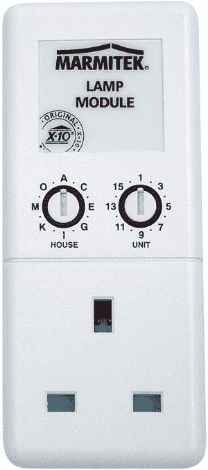

图 1-1。

The LM12U lamp module, 122 × 52 × 42mm

这将支持 60 至 300 瓦之间的任何白炽灯，并且可以通过设置为相同房屋代码的任何 X10 控制器来打开和关闭或调暗。LM12U 有一个姐妹设备，AM12U，在同一作品中工作。主要区别在于，AM12U 适用于设备，因此会忽略任何“暗淡”消息。LM12U 还将响应两个特殊消息，“所有灯打开”和“所有单元关闭”，前提是它们使用匹配的房屋代码发送。这个模块，像这里介绍的许多其他模块一样，与电力线串联放置，起到逻辑与门的作用。也就是说，灯的开关和墙上的电源开关都必须打开，X10“打开”消息才能生效。

Note

这里给出的代码是这些设备的英国版本。由于世界各国使用的电源系统略有不同，但差异很大，因此根据您所在的国家，需要不同的备用模块。例如，意大利的 LM12U 被称为 LM12I。

##### 卡口灯模块(LM15EB)

这也是一个简单的零安装设备，但需要更多的配置。要安装它，你把它插到一个现有的灯座上，然后把灯泡(最高 150 瓦)重新插入它的自由端。然而，荧光灯和低能量灯都不应该使用。通过关闭并再次打开灯来设置地址，然后在灯重新打开后的 30 秒内，按下控制器上所需的房屋/单元代码三次，每秒一次。一旦代码被读入，灯就会亮。该设备还有一个拧入版本(LM15ES，ES 代表爱迪生螺丝)，尽管它是图 1-2 中所示的卡口版本(LM15EB)。

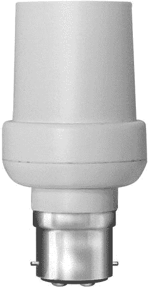

图 1-2。

The LM15EB, 45 × 45 × 95mm

LM15EBs 缺乏较大的 LM12U 的调光功能，但因为它们只比传统配件延伸 62 毫米，所以它们足够小，可以隐藏在大多数灯罩内，使房间保持现有的美学品质。

同样，该模块的作用类似于一个与门，仅当 X10“on”命令已发送且灯开关正常打开时，灯才发光。

##### 墙壁开关(LW10U)

正如你从图 1-3 中看到的，这些是标准灯开关的完全替代品，这意味着你只能使用白色塑料。然而，它们很容易安装到现有的嵌入式开关盒中，仅从墙壁伸出 16 毫米。该装置的地址由翘板开关后面的一对拨号盘设定，用螺丝刀轻轻撬开即可访问。然而，应该小心，因为将开关固定在 Shell 上的塑料接线片非常脆弱，在断裂之前只能承受三四次拆卸。

除了通过“开”、“关”、“暗”和“亮”命令进行远程控制之外，还可以通过开关在本地实现相同的功能。触摸它一次会将灯完全打开或关闭，而按住它会使灯变暗(如果它很亮)或变亮(如果它很暗)。唉，当你关掉它然后再打开时，不能保持最后的亮度，你也不能在没有首先使它完全变暗的情况下稍微增加昏暗灯的亮度，但本地控制意味着灯在按下按钮后立即亮起，以便不混淆任何客人。

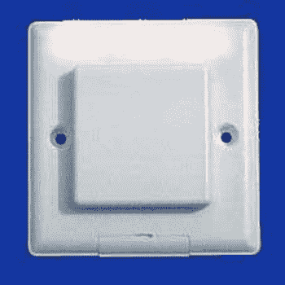

图 1-3。

The LW10U, 85 × 85 × 30mm

该设备还响应“所有灯打开”和“所有单元关闭”消息，以匹配房屋代码。

##### 带调光器的微型模块(LWM1)

该模块是 LM10U 的涡轮增压版本，如图 1-4 所示。它的工作方式与 LM10U 相同，但足够小，可以安装在墙壁插座内，允许您使用任何您喜欢的开关面板。

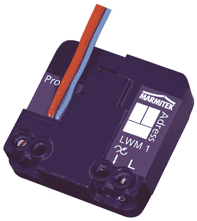

图 1-4。

The LWM1, 40 × 40 × 15mm

它支持 LM10U 的所有现有功能，但也可以记住最后的亮度设置，允许灯光在第一次打开时平滑地改变，这有助于延长灯泡的寿命。

Note

较便宜的模块在全亮度下打开，所以如果你喜欢情调照明，那么这是一个值得考虑的变体。

此外，这是本产品中少数支持双向 X10 通信的器件之一。这意味着您可以向设备发送消息，询问其当前的亮度状态，并且设备能够回复。这对于大多数其他设备是不可用的，这意味着您(或者更具体地说，您的控制器设备)必须记住它发送的最后一条消息，希望它到达，以便模拟灯状态的查询。如果亮度被局部改变，甚至这个结果也可能是有缺陷的。然而，在大多数情况下，这种功能是不必要的，因为您很少想知道灯是否亮着。如果你要去睡觉，那么你不感兴趣的是灯是否亮着，只关心你是否能关掉它。除非你有一个非常大的房子，否则你通常可以在一个漆黑的房子里看到一盏灯亮着，因此知道你是否需要重新发送“所有单元关闭”的消息。

这种设备的缺点是它的价格大约是 LM10U 的三倍。但是，LW12 中有一款中端产品具有相同的规格，但没有双向通信功能。

##### DIN 轨道调光器(LD11)

这是一个(非常)高功率模块，能够控制高达 700W 的设备，因此它适用于主卤素以及传统的主照明。该设备不是用来代替开关(如 LWM11)或与灯泡连接(如 LM15EB)，而是远程放置在保险丝盒附近，LD11 输出电缆直接进入灯具。这是 LD11 上的一个开关终端，允许设备打开和关闭，就像在本地一样。然而，由于从设备到 LD11 有四条(潜在的)长电缆(两条用于电源，两条用于控制，如图 1-5 所示)，其目的并不那么明显。

图 1-5。

The LD11, 50 × 80 × 70mm

LD11 的主要用途是情绪照明，因为它支持卤素，以及场景照明，因为它具有柔和的调光和记忆功能。因为它们通常被放置在远离设备本身的地方，所以你会得到一个更干净的安装。令人欣慰的是，模块成本的降低抵消了布线成本。

如果您使用 LD11 为照明插座供电，只有灯具必须使用它们，因为调光功能会损坏许多其他类型的电器。为此，你可以为灯具和 LD11 供电插座使用非常规插头和插座。如果你的国家使用方形插头，请使用圆形插头，反之亦然。

##### 家用电器微型模块(AWM2)

此模块使用前缀 A，因为它主要用于控制设备；然而，它的功能也适用于灯光。如图 1-6 所示，AWM2 位于标准墙壁插座内，支持两个开关。一个开关控制本地连接的灯泡(并将等效的 X10 消息发送到电力线)，而另一个开关将 X10“开”或“关”消息依次发送到下一个地址。因此，如果您的 AWM2 配置为 E2，您也可以从同一台交换机控制 E3。通过在楼梯的顶部和底部安装两个相同配置的单元，您可以从任何位置控制楼上和楼下的灯，而无需重新布线。因为这是一个内部模块，你可以使用任何开关面对你的选择。但是，请注意，该设备不支持调光。

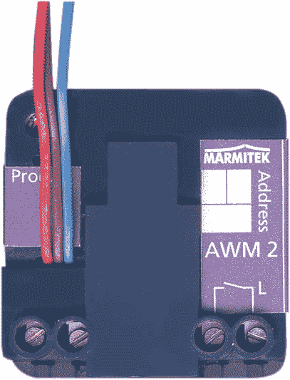

图 1-6。

The AWM2, 46 × 46 × 18mm

#### 控制设备

对于不带 X10 的电器，如茶壶、烤面包机和高保真音响设备，需要第二种类型的设备。这些设备的功能与 LM12U 或 LM15EB/LM15ES 非常相似，即设备插入现有的电源插座，相关设备插入 X10 模块。如前所述，这些要求墙上插座上的开关以及电器本身上的任何开关都必须保持永久开启。这进一步意味着任何插入这种模块的可以远程控制的设备在任何时候都必须是安全的。以茶壶为例，它必须含有足够的水，这样它就不会烧干。

##### 设备模块(AM12U)

像它的姐妹模块 LM12U 一样，这是一个非常简单的“即插即用”设备，尽管它看起来相同(见图 1-7 )，但有三个非常重要的区别:

*   它没有调光器支持
*   它可以控制荧光灯
*   它可以在更高的负载下工作(白炽灯高达 500W，电风扇等感性 3 电器为 1A，加热器等电阻性负载 4 为 16A)

因此，它的预期目的是实现风扇和茶壶等设备的自动化。然而，真空吸尘器和风扇加热器等高功率设备很少在这些模块上工作，因为当电机打开或关闭时，电机周围的磁场崩溃会产生反电动势。这种反电动势会产生一个很大的电压尖峰，可能会烧断 AM12U 中的保险丝(如果你幸运的话)或该设备(如果你不幸运的话)。

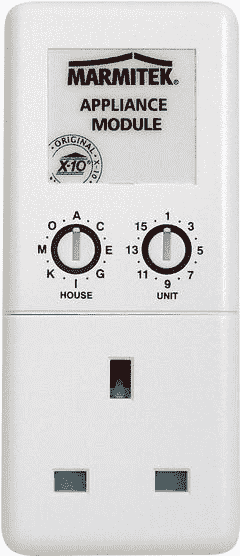

图 1-7。

The AM12U, 52 × 122 × 33mm

有一个嵌入式版本，称为 AW12U，具有类似的规格。

Note

当互联网连接不可用时，通常是由于路由器被阻塞或崩溃，您可以经常使用这些设备来自动重启路由器和调制解调器。

##### 家用电器微型模块(AWM2)

这是之前(以及图 1-6 中)作为灯光控制合适候选的同一模块，因为它也可以用于控制电器。除了尺寸更小(46×46×18 毫米)之外，与 AM12U 相比，它的主要优势是额定功率更高，可以为风扇加热器等设备供电。该装置的给定功率规格为白炽灯 2kW，感应设备 3A，电阻负载 16A。

如前所述，这种设备安装在墙上的插座，使其更难规避。因此，该模块可让您在夜间关闭儿童的电视或立体声系统，而无需像 AM12U 那样拔掉插头。

表 1-1 给出了之前提到的设备的分类。

表 1-1。

Basic X10 Modules

<colgroup><col> <col></colgroup> 
| 装置 | 名字 |
| --- | --- |
| AM12U | 设备模块(插头) |
| AWM2 | 家用电器微型模块(墙内) |
| LD11 | DIN 导轨调光器 |
| LM10U | 墙壁开关 |
| LM12U | 灯模块 |
| LM15EB | 卡口灯模块 |
| lm15 是 | 拧入式灯模块 |
| LWM1 | 带调光器的微型模块 |
| LW12 | 带调光器的墙内模块(类似 LWM1，但无双向通信) |
| TMD4 | 微型模块发射器调光器(四开关，墙内，无电源处理器) |

#### 内部设备

这些设备很少见，通常属于新奇类。一个很好的例子是 REX-10，一个犬吠报警系统！在接收到合适的 X10 消息(例如，来自运动检测器)时，该设备播放狗吠声，片刻之后，发送 X10 消息以打开灯。作为一个想法，这是好的，但很难配置这些硬连线设备，因为你可以用一个简短的计算机程序或简单的脚本有效。

#### 组合设备

我将简要介绍一些设备，尽管它们没有附带 X10 控制，但总是与 X10 控制一起使用。还应该注意，电源控制同样可以来自替代的功率控制方法(例如，C-Bus)。

##### 电子窗帘轨:改装

只需将 U 形拉绳缠绕在电动马达上，就可以实现多种窗帘的自动化。当然，细节是关键，所以市场上有一些预装的电机和滑轮系统，可以打开和关闭窗帘，安装在顶部导轨上。它们包括 Regency PowerMotion、通用窗帘电机(UCM)和 Add-a-Motor 80 (CM80)。

使用翻新解决方案需要您有一个良好的现有顶部导轨，因为这决定了电机能够处理的窗帘的最大重量——如果卡住，电机可能会烧毁。具体重量会因设备而异，但一个很好的指南是，带有滚珠轴承的顶部导轨将管理高达 30 公斤的窗帘，而没有滚珠轴承的顶部导轨可能会停止在 10 公斤。

所有这些设备都需要手动安装，以将电线固定到电机上，配置窗帘的打开和关闭位置，并调整电子设备以结合单独的 X10 接收器。根据设备的不同，这可能涉及一个简单的 AWM2 或 AM12U 单元，也可能是一个串联模块。

一旦安装好，控制窗帘是一件简单的开/关事情，例如，需要一些额外的控制逻辑来自动将它们定位在“50%打开”的位置；但是，您可以随时手动发出“off”命令来阻止它们进一步打开。有专门为窗帘控制设计的开关，如 Marmitek X10 电机驱动开关(SW10)，它将标准 X10 信息“开”、“关”和“亮”分别转换为“完全打开”、“完全关闭”和“部分打开”。

Tip

在安装后的最初几天，你不应该让控制帘无人看管，因为电机可能会试图将它们移动得太远而烧坏。

##### 电子窗帘轨:预建

一个这样的解决方案是无声的 Gliss AutoGlide。这就提供了一个带有预装电机和遥控装置的定制窗帘轨道。因为窗帘轨道是定制的，你必须事先知道你的窗户的尺寸和形状，因为 DIY 改装是不可能的，只有制造商才能弯曲它(以适合凸窗)。电机可以由 X10 设备模块控制，使用的 DIY 量与改造版本相似。

### 独立控制器

除非你有办法控制它们，否则拥有大量遥控灯具和电器没有多大用处。本节所述的所有设备都包含某种形式的 X10 发射器，可将 X10 数据信息发送到电力线，然后由前面所述的任何 X10 模块接收。

#### 桌面发射器模块

这些模块都提供了从基本键盘向特定设备发送 X10 消息的方式。由于它们由市电供电，信号可以直接放在电力线上，从而无需 RF-to-X10 网关。该组支持最大的设备选择，每个设备都添加了自己独特的卖点。这里我只介绍一小部分。

##### 迷你控制器(MC460)

这是一个标准但实用的有线设备，支持八个单元，可在两个组(1–4，5–8)中切换，以及标准的“所有灯打开”/“所有单元关闭”选项和亮度控制。为了减少按钮数量，亮度控制只影响最近一次打开或关闭的灯。这在大多数发射器模块中是相当标准的。

##### 日落/黎明控制器(SD7233/SD533)

从表面上看，这就像早期的标准迷你控制器，连接到电源，控制八个设备，以及“所有灯打开”/“所有单元关闭”和亮度控制。然而，它还包括一个光线传感器，当天黑时，它会打开预定的一组灯，当它再次亮时，它会关闭它们。这些亮度设置可以通过一点点试错来调整，尽管黄昏和黎明在一年中不断变化，但这不一定能用作自然的唤醒电话。

##### 迷你计时器(MT10U)

如图 1-8 所示，这种装置通过使用计时器而不是传感器来解决黄昏到黎明的问题。这允许您控制多达八个照明或电器模块，但只允许您预编程其中的四个，使它们一天打开或关闭(最多)两次。这可以让你模仿一个“住在”房子里的感觉。此外，它还包括一个随机选项，将改变 30 分钟的编程时间，给人一种“人类居住”的感觉。这个装置也可以兼作闹钟。

这种设备和以前的设备都减少了对计算机服务器的需求，因为它们可以根据(简单的)逻辑发送预定的消息。

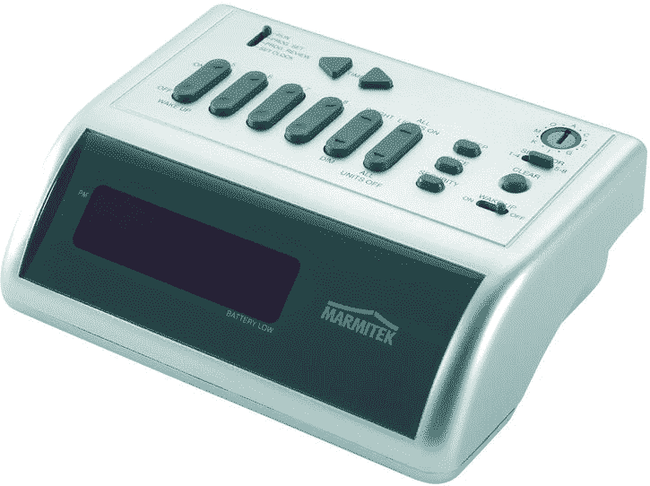

图 1-8。

The MT10U, 55 × 150 × 110mm

##### Maxi 控制器(SC2800)

虽然该设备是作为安全系统(MS9780)的一部分设计的，但它也可以提供对房屋中所有 X10 设备的完全有线控制，如图 1-9 所示。虽然它没有任何计时功能，但它有一个电话插座，可以让你从外面拨号和开关灯(通过使用按键式电话输入单元代码，然后分别按*或#键)。

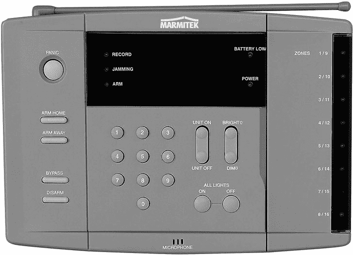

图 1-9。

The SC2800 provides easy access to your light switches via telephone

表 1-2 总结了这些桌面设备。

表 1-2。

Desktop Controller X10 Modules

<colgroup><col> <col></colgroup> 
| 桌面控制器 | 名字 |
| --- | --- |
| MC460 | 迷你控制器(4 × 2) |
| MT10U | 迷你小时 |
| SC2800 | Maxi 控制器 |
| SD7233/SD533 | 日落/黎明控制器(8) |

#### 手持式发射器模块

这些模块以无线方式工作，因此需要一个 RF-to-X10 网关。除此之外，它们执行与桌面发射机模块相同的任务，只是它们需要电池供电。

##### 手持式射频遥控器(HR10U)

这些是相对便宜的设备，能够控制任何给定房屋代码中的所有 16 个设备。它们支持亮度控制，但不支持“所有灯打开”/“所有单元关闭”，并且它们以开/关的顺序排列按钮，而不是更符合极客逻辑的开/关。

这种设备的一个有用的特点是，它的左侧有一张纸条，你可以在上面写下每个按钮控制的设备的名称。除此之外，这是一个相当简单的设备，“做它在锡说。”

还有一个更小的版本，只包含三个设备按钮，称为操纵杆开关(SS13E，如图 1-10 所示)，它也是无线的，因此可以放置在任何墙上。这使得你可以在浴室里控制设备，而在浴室里，电源供电的控制器是非法的。

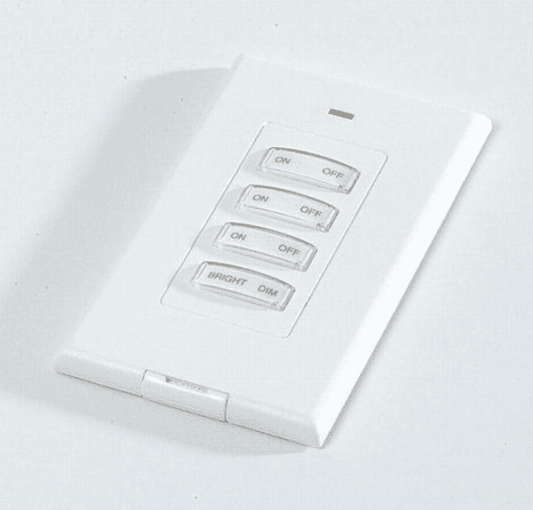

图 1-10。

The SS13E Stick-a-Switch

##### 遥控钥匙(KR22E)

这个几乎是新奇的设备允许你从你的钥匙圈使用“开”、“关”、“亮”和“暗”信息控制四个连续编号的设备。它没有很大的范围，电池也不会持续很长时间。

##### EasyTouch 面板 10 RF

这种 Marmitek 设备是最接近廉价触摸屏的设备之一。这是一个电池驱动的 RF-to-X10 发射机(就像 HR10U 一样)，但通过触摸屏幕来操作。然而，屏幕仅仅是玻璃面板后面的图像。这就是它比其他解决方案便宜的原因。虽然这确实会阻止您从设备接收任何视觉反馈，但是您可以自定义图像(通过用 GIMP 和您的打印机制作一个图像)并控制按钮在触摸屏上的显示位置；因此，您可以让这看起来像一个更昂贵的单位。与 HR10U 不同的是，HR10U 有一组固定的 16 个按钮，它可以操作多达 30 个按钮，提供足够的空间来通过 Minerva 系统的一部分 Cosmic 控制所有的灯和其他设备(参见[第七章](http://dx.doi.org/978-1-4302-5888-9_7))，该系统允许您仅使用基本的 X10 消息集来设置定时器、收听新闻和播放 MP3 收藏。

##### EasyTouch35 通用遥控器

这种设备的外观是传统的“一体化”红外遥控器，具有八个 AV 设备的独立菜单，并能够从其他遥控器学习代码。然而，除了红外功能之外，它还包括一个 RF 发射器，用于通过 TM13 等 RF-to-X10 网关控制 X10 设备。

作为一个标准的红外遥控器，它工作得足够好，尽管背光时屏幕略有嗡嗡声。触摸屏很好用，你可以使用每个功能的预定义图标自己设计菜单。

我将在本章后面更详细地介绍通用遥控器。对于标准 X10 无线控制器，请参考表 1-3 。

表 1-3。

Wireless Controllers for X10

<colgroup><col> <col></colgroup> 
| 无线控制器 | 名字 |
| --- | --- |
| EasyTouch35 | 通用遥控器 |
| KR22E 号 | 遥控钥匙 |
| 断续器 10U | 手持式射频遥控器 |
| SS13E | 操纵杆开关 |

#### 墙内发射器模块

这些看起来像我前面提到的墙壁开关，因为它们隐藏在现有的墙壁插座中。但是，这些并不直接控制任何设备。相反，它们只向特定设备(如灯或电器模块)发送 X10 消息，依靠它来控制与之相连的硬件。因此，要将它们用作自动照明开关，你需要两个设备:墙内发射器和电器接收器。

一种类型的墙内模块是微型模块发射器调光器(TMD4，如图 1-11 所示)，它可以通过连接到其中的四个开关控制多达四个不同的 X10 单元。如果您想要控制灯光或电器的简单开/关，这些信息包括调光控制。拥有大客厅的人和喜欢情调照明和多光源的人可能在一个房间里有四盏灯，这是少数几个让你从一个简单的面板控制所有灯的设备之一。然而，注意，每个灯仍然需要它自己的灯模块。当然，没有必要每个交换机命令一个 X10 设备；它可以简单地把信息放在电源线上，让 PC 控制器做一些事情，比如改变立体声的音量。

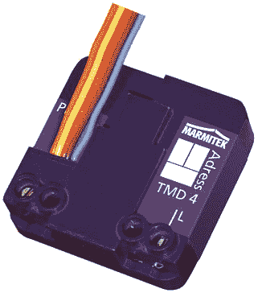

图 1-11。

The TMD4

#### 运动传感器

市场上的大多数传感器是无源红外传感器(PIR ),有室内和室外两种，后者通常用作安装在传感器所在区域的安全灯。PIRs 与 EagleEye 运动传感器(MS14)一样，每当检测到运动时，会向特定但用户可选择的 X10 模块发送“on”消息。大多数型号还可以配置为分别在黄昏和黎明时发送“开”和“关”信息。尽管一些设备可以将消息发送到多个设备(PR511 和 PSH01 跃然脑海，两者都包含内置泛光灯)，但大多数设备只能与单个设备通信，需要 X10 设置中的计算机在需要时将此消息转发到其他设备。稍后你会发现如何！

### 网关和其他外来设备

网关是允许通信数据流过的任何设备，尽管对话的每一方有不同的协议。在大多数技术中，网关执行双向功能，在任一方向上转换协议。在 X10 网关中，一般只有一个方向，即进入 X10。

这一类别的主要器件是 TM13U，这是我已经提到过的 RF 至 X10 网关。如图 1-12 所示，其中一种设备允许无线射频遥控器将信息放在电力线上，供 X10 设备处理。它永远不会反过来。该设备将监听来自其前部拨号盘上设置的相同房屋代码的所有射频信息，并将它们(使用相同的房屋代码)转发到电源线(假设插座已打开)。但是，如果将拨号盘设置为 P，它将对所有房屋代码的射频信号做出响应，但会根据原始房屋代码转发这些信号。该设备的硬连线地址通常为 1。

图 1-12。

The TM13U, 122 × 52 × 33mm, or 224 × 52 × 22mm with aerial extended

要在两个或多个相位上传输，您需要一个耦合器。这将在电源的一个相位上监听 X10 信号，并在另一个相位上复制它。这既可以在单个单元中发生(如 TF678)，也可以为需要耦合的每相需要一个单独的器件(FD10，如图 1-13 所示)。

事实上，这两种耦合器设备都被称为过滤器/耦合器，这意味着它们可以完全过滤掉 X10 消息，而不是复制 X10 消息，从而防止消息泄露到邻居的房子里。通过扩展，它们可以防止您邻居的 X10 设备控制您的设备。

图 1-13。

The FD10, an interesting filter/coupler module, looking very uninteresting

网桥是一种充当两种不同协议之间媒介的设备。在这种情况下，总是存在桥接家庭自动化系统的协议，例如从 X10 到 C-Bus 或从 X10 到 UPB pulse work x。此类设备对于逐段升级系统或控制系统中不存在的和/或没有合适的软件驱动程序的特定设备非常有用。然而，在大多数情况下，桥接设备和原始模块的成本必须非常特殊，才能物有所值。

表 1-4 中涵盖了这一设备以及许多其他外来设备。

表 1-4。

Miscellaneous X10 Controllers

<colgroup><col> <col></colgroup> 
| 杂项设备 | 名字 |
| --- | --- |
| FD10 | DIN 滤波器和耦合器 |
| MS14 | PIR-鹰眼运动传感器 |
| PR511 | 带泛光灯的 PIR |
| PSH01 | 电动喇叭警报器 |
| TF678 | 全屋过滤器 |
| TM13UAH | RF-X10 网关，适用于所有房屋代码 |

### 计算机控制

但是目前最强大和最有创意的设备是电脑界面，比如 CM11，如图 1-14 所示。这是一个收发器，它能够将信息从电力线传输到计算机，并将信息从计算机发送回电力线。与大多数 X10 设备不同，CM11 上的电源插座不由 X10 控制，而是一个简单的直通端口。因此，如果你想用 X10 控制你的电脑，你有两个选择。

Caution

小心不要把计算机的电源加到正常的房子代码上，因为你可能会在发出“所有单元关闭”的信息时不小心关掉它。

首先，您可以为计算机分配一个未使用的单元代码，并配置计算机在电源线上看到它时发出关机命令。(我将很快向您展示如何操作。)其次，你可以使用一个单独的设备模块，只需将计算机插入其中。这是一个可行但不太好的解决方案，因为您可能会将机器插入不间断电源(UPS)中。

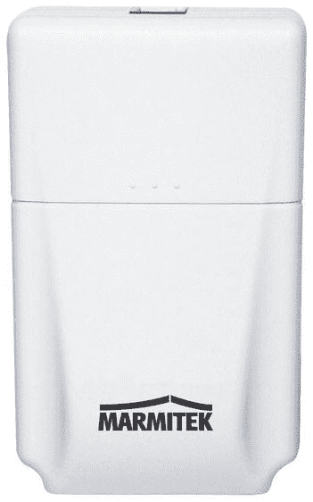

图 1-14。

The CM11EFL

除了作为一个控制器，这个设备还可以作为一个事件调度和信息中继系统，即使没有连接到计算机。因此，您可以使用软件(即提供的 Microsoft Windows 版本或 Linux 等效版本，如何裕)对设备进行编程，并让它独立运行，因为这些编程信息现在存储在它自己的 EEPROM 中，即使没有电源，它也能保留数据，允许它从一个地方移动到另一个地方，而无需重新编程。(这也意味着有可能拥有一个没有一台电脑的稍微自动化的房子！)但是，您必须保留上传到 CM11 的文件和数据的副本，因为无法从设备下载。

Caution

从电源或计算机上拔下 CM11U 时，请务必先从设备上拔下串行电缆，因为电缆的杂散噪音会影响内部存储器及其设置。

事件调度程序允许您在一天中的任何时间、一周中的任何一天、一年中的任何日期发送任何 X10 消息。就其本身而言，该设备没有随机改变时间的能力，但它有一个黄昏和黎明设置，在你以经度和纬度的形式向它提供你的物理位置细节后，它就会工作。你可以从地图上找到你的经度/纬度，或者(如果我们现在是认真的)从网上的许多地理网站中找到。对于这些计算，您的 IP 地址通常足够准确，并且可以从以下网站获得:

[`http://api.hostip.info/get_html.php?position=true`](http://api.hostip.info/get_html.php?position=true)

[`http://whatismyipaddress.com`](http://whatismyipaddress.com/)

按照 CM11 的说法，消息中继系统被称为宏。这允许一个 X10 消息(例如“卧室灯亮了”)向您的任何或所有其他设备产生额外的自定义消息。一个典型的宏可能包括“着陆灯到 50%”，“浴室灯亮”等等。这些消息可以在时间上分开，允许一个单独的“浴室灯亮着”消息变成这样的短程序:

`Bathroom light on`

`Stairs light to 50%`

`Wait 5 minutes`

`Bathroom light off`

`Wait 2 minutes`

`Stairs light off`

因此，简而言之，CM11 可以提供自动化房屋可能需要的大部分功能，尽管是以非常静态的方式。为了让您的 CM11 动态处理 X10 消息，您需要电脑永久开机并安装一些软件。不幸的是，CM11 目前随附的软件仅适用于 Microsoft Windows。因此，相反，你可以呼吁社区软件，如何裕，作为一个替代品。

#### 和宇

何裕是一个简单的命令行工具，可用于大多数*nix 系统(包括大多数 Linux 发行版、BSD 和 Mac OS X)，能够与 X10 计算机模块进行双向通信，以及用宏和预定事件对 EEPROM 进行编程。也可以在 [`www.heyu.org`](http://www.heyu.org/) 首页下载。这不是 OSI 认为的自由软件或开放源码，但是源码是免费的，可以免费使用。

安装后，软件会在首次运行时自动配置。这需要几秒钟的时间，包括打开串行端口(默认为`/dev/ttyS0`)并验证 CM11 是否真正插入并正常工作。最好的方法是通过运行以下命令将何裕包括在启动序列中:

`heyu engine`

这确保了何裕后台进程正在运行，从而允许接收传入的消息，触发外部脚本。engine 参数还启动何裕内部的状态机，允许它记住每个灯和设备的最后设置，这很有用，因为许多设备(尤其是较便宜的设备)不允许您查询它们的状态。在非计算机化的环境中，这种反馈循环是不必要的，因为作为一个人，你可以看到当你按下按钮时灯是否亮了，所以你可以看到你是否需要再试一次。电脑没那么有天赋。对于任何计算机界面来说，指示模块的当前状态也是一个很好的设计实践，这使得这个特性更加重要。如果您可能在家中使用大量基于计算机的界面(比如，通过网页)，那么升级到前面介绍的双向灯和电器模块是值得的。

##### 配置

配置保存在`/etc/heyu`内的各种文件中，特别是`x10.conf`，其中保存了串行设备、默认房屋代码、别名、场景和脚本。默认情况下，所有日志信息都被写入`/var/log/heyu`。

顾名思义，别名为您想要在`x10.conf`文件中设置的每个设备提供了一种人性化的房屋和单元代码，以及该设备是灯具模块(`StdLM`)还是电器模块(`StdAM`):

`ALIAS lounge e5  StdLM`

`ALIAS stereo e6  StdAM`

一旦指定了别名，就可以在配置文件和对其发出的命令中使用它。这种抽象减少了当你需要对你的家用电器重新编号时所需要的改变的数量。

场景是何裕描述中继消息或宏的方式。每一行都包含一个标签名和一列分号分隔的命令:

`SCENE movie_mode on tv; on stereo; dimb lounge 10;`

何裕的调光范围在 1 到 22 之间，由相对和绝对亮度变化命令支持(分别为`dim`和`dimb`)。请注意，如果在何裕配置文件运行时对其进行更改，则必须发出以下命令来刷新参数:

`heyu restart`

##### 发送消息

这可以通过如下命令简单地完成:

`heyu turn studio on`

`heyu onstate studio`

`heyu bright lounge 5`

`heyu lightsoff _ # the underscore means current house code`

它可以放在更大的 shell 脚本中，从其他语言调用，或者通过带有 CGI 的网站触发。注意，这些都是阻塞命令，所以在 X10 消息被发送之前，脚本的其余部分不会执行——当然，除非您在后台模式下开始该任务:

`heyu turn studio on &`

这些命令也可以放在 crontab 中，这样就不需要将更改上传到 CM11U 的内部 EEPROM:

`export EDITOR=vi`

`crontab -e`

然后，作为示例行，添加以下内容:

`30 9 * * 1-5   /usr/bin/play /usr/share/sounds/alsa/Noise.wav`

这就增加了一个早上 9:30 的闹铃(还能是什么时候！？)在一年中每个月的每一天(第一个通配符)(第二个通配符)，同时也是工作日(星期一=1，星期五=5)。

如果您想添加一个随机元素，比如说在 9:30 的半小时内，那么您可以使用一些简单的`bash`来代替调用这个:

`00 9 * * 1-5 sleep `echo $((RANDOM%60))m`; /usr/bin/play`ⅱ

`/usr/share/sounds/alsa/Noise.wav`

请注意，我已经提前 30 分钟开始延迟，但是创建了一个持续 60 分钟的随机值。

##### 接收消息

无论何时收到命令，何裕都能启动配置文件中指定的外部脚本。在许多情况下，这可能是打开额外的灯光，就像场景或微距一样:

`SCRIPT bedroom on :: /usr/local/bin/heyu turn bedside_light1_mine on`

`SCRIPT bedroom on :: /usr/local/bin/heyu turn bedside_light2_theirs on`

它可以运行外部脚本，而不是只控制灯光。这有一个好处，除了 root 用户之外，其他用户也可以编辑它，它不需要`heyu restart`，并且它提供了很大的灵活性，不能压缩到一行中。类似如下的代码:

`SCRIPT bedroom off :: ∼steev/bin/housenight`

将运行一个私人脚本，关闭家中所有重要的灯和电器(请记住，没有“关闭所有设备”的命令)，在您的 Twitter feed 上发布一些内容，并播放“晚安”音效:

`#!/bin/bash`

`wavplayer default play ∼steev/media/good-night-gorgeous.wav`

`tweet Good night all`

`/usr/local/bin/heyu turn studio_light off`

`/usr/local/bin/heyu turn kitchen_light off`

`/usr/local/bin/heyu turn lounge_light off`

`shutdown –h now`

或者，它可以检测传感器发射器发送的信息，该信息根本不发送到任何设备，而是被转发到其他几个设备:

`SCRIPT pir_detect_msg on :: /usr/local/bin/heyu lightson _`

除了控制 X10 设备，还可以控制 PC 本身。此示例截取来自单个交换机的消息，以控制 CM11 所连接的 PC 的音量:

`SCRIPT E6 on :: /usr/local/minerva/bin/mixer default dec master 10`

`SCRIPT E6 off :: /usr/local/minerva/bin/mixer default inc master 10`

运行这些命令的用户权限与发出初始命令的用户权限相同:

`heyu engine`

这确保了该用户可以使用命令和设备(如`/dev/dsp`)。仅仅使用 X10 消息就可以构建复杂的脚本和交互。在第七章中，我将讨论宇宙。

##### EEPROM 编程

CM11 的 EEPROM 的所有功能都可以通过何裕进行编程。连接 CM11U 时，您只需创建一个名为`/etc/heyu/x10.sched`的文本文件(此目录中也有一个示例文件)，其中包含合适的命令和类型列表:

`heyu upload`

该过程会将该文本文件转换为合适的二进制图像，并通过现有的串行电缆将其上传到设备。因为不可能从 CM11 中检索该数据，所以您会希望确保保留一份`x10.sched`文件或结果图像的备份以备后用:

`/etc/heyu/x10image`

文件格式的全部细节可以在手册中找到，包括如何将日期格式从默认的 YMD 切换到 DMY。现在，我将通过一个例子来包括我自己的时间表的一些片断:

`macro movies_on 0 dimb lounge 22; 0 on tv; 0 on stereo;`

`macro lounge_off 0 off lounge; 0 off lounge_table; 0 off tv; 0 off stereo;`

`timer ...wt..  01/01-12/31 21:00 00:02 movies_on lounge_off`

`trigger e1 on movies_on`

## z 波

Z-Wave 是由成立于 1999 年的 Zen-Sys 创建的，作为家庭自动化领域无线控制产品的专有协议。2008 年，公司和技术被西格玛设计公司接管，该公司仍然生产和供应大部分芯片。这意味着所有生产 Z-Wave 品牌设备的制造商都必须从适马(或其附属公司，三美)购买，并且都必须经过测试和验证程序，才能获准将其产品标记为“Z-Wave”这些供应商是 Z-Wave 联盟的一部分，目前共有 200 家制造商，提供大约 600 种不同的产品。

### 系统设计

Z-Wave 使用的通信信道是 900MHz 射频信号(根据您的地理位置略有不同)，传输速度约为 40 千比特/秒。(尽管采用 400 系列芯片的较新设备可以支持高达 100kbs。)虽然信号强度通常会受到墙壁和地板的影响，但每个设备的覆盖范围可达 20-30 米，并且可以以网状形式连接，这样一个设备可以向下一个设备重复消息，从而扩展覆盖范围。除了在它们之间发送消息，这些设备还与集线器或主控制器通信，集线器或主控制器用于通过以太网路由器或计算机将它们连接到更大的网络。典型的控制器包括 Tricklestar 和 Z Wave Aeon USB 适配器，这需要一台 PC，以及不需要的 VeraLitz Z Wave 控制器。还有一个 RaZberry Z Wave 控制器，可以直接连接到您的 Raspberry Pi 的 GPIO 控制器，如果您希望采用该路径的话。

当每个新的 Z-Wave 设备添加到系统中时，它会与附近的控制器配对，确定它们之间的信号强度，然后在路由算法中使用。这使得向放置在地下和车库中的设备发送信号成为可能，只要至少有一个设备在它和网络的其余部分的范围内。然而，在如此低的数据速率下，如果试图强迫节点像中继器一样工作，很容易使节点过载。

为了安全起见，Z-Wave 依赖于这种配对安排，因为每个单元上的按钮都是以类似于蓝牙配对的方式按下的，以确保每个单元都可以与另一个单元通话。这远非理想，但考虑到相对较低的使用率，中间人攻击的可能性相当低。

像 X10 一样，Z-Wave 有一个房屋代码(称为网络 ID)和一个用于寻址的单元代码(其节点 ID)。这些允许在单个网络上有 232 个不同的节点，虽然略少于 X10 的可用数量，但对于大多数房屋来说已经足够了，尽管如果需要的话，在网络之间桥接并不困难。

Z-Wave 的最大优势一直是兼容性，因为 Z-Wave 联盟的互操作性实验室确保了几乎所有设备都可以相互通信。然而，这种封闭的商店确保了任何开源软件都无法工作。但是现在这种情况已经改变了...

### 绕过 NDA

因为 Z-Wave alliance 的每个成员都必须签署一份 NDA 和保密协议才能访问正式的规范和白皮书，所以开源开发者不可能构建一个真正的 Z-Wave 设备——直到黑客开始对协议进行逆向工程！现在有几个选择。

#### 开放式 Z 波

有了这样一个直接且典型的开源名称，这个项目获得了很多关注也就不足为奇了。它有两个主要部分，库和基于 web 的配置界面，后者带有自己的迷你 web 服务器。该库依赖于 libudev，根据您的系统，可能需要显式安装 libudev。例如:

`apt-get install libudev-dev`

然后，您可以通过传统方式从源构建开放的 Z-Wave:

`svn checkout`[`http://open-zwave.googlecode.com/svn/trunk/`](http://open-zwave.googlecode.com/svn/trunk/)

`cd open-zwave/cpp/build/linux/`

`make`

由于 web 服务器的原因，控制面板需要最新版本的 httpd 库，因此通常最好从源代码安装。大多数问题都发生在省略这一步的时候:

`wget``ftp://ftp.gnu.org/gnu/libmicrohttpd/libmicrohttpd-0.9.19.tar.gz`

`tar zxvf libmicrohttpd-0.9.19.tar.gz`

`cd libmicrohttpd-0.9.19`

`./configure`

`make`

`sudo make install`

然后，您可以获取控制面板的信号源:

`svn checkout`[`http://openzwave-control-panel.googlecode.com/svn/trunk/`](http://openzwave-control-panel.googlecode.com/svn/trunk/)

并通过取消注释第 36 行周围的三个特定于 Linux 的配置条目来修改配置。然后使用 make 正常构建，将 web 配置目录链接到开放的 Z-Wave 库:

`ln –s../open-zwave/config/`

并运行它，指定端口:

`./ozwcp -d -p 13112`

然后，您可以浏览到该页面，输入您的设备名称(或勾选 USB 框，对于以这种方式连接的控制器)，并单击“初始化”。通过使用`–d`标志，您将在控制台上看到调试信息，这在这种情况下总是很有帮助的。你现在可以和你的房子说话了！

#### linuxmce，你好吗

LinuxMCE 项目已经收集了免费的 Z-Wave 信息有一段时间了，并在他们的 wiki 中专门描述了它:

[`http://wiki.linuxmce.org/index.php/ZWave`](http://wiki.linuxmce.org/index.php/ZWave)

更重要的是，他们已经成功实现了该协议的一个版本:

[`http://svn.linuxmce.org/svn/branches/LinuxMCE-0810/src/ZWave/`](http://svn.linuxmce.org/svn/branches/LinuxMCE-0810/src/ZWave/)

虽然这主要是一个媒体中心项目，但您可能会发现它引入了更多您通常想要的依赖项，特别是如果将它安装在较小的 PC 上，如 Raspberry Pi。但是，如果您的控制器不被 Open Z-Wave 支持，而 LinuxMCE 能够使用它，那么您应该微笑着接受开销！

## 网络

有时(不公平地)被称为“其他 Z 协议”，ZigBee ( [`http://www.zigbee.org`](http://www.zigbee.org/) )是一种使用射频在 10 到 100 米范围内的设备之间进行通信的协议。与大多数其他系统不同，不需要单独的控制器，所有设备都可以成为网络的协调器(ZC)、路由器(ZR)或终端设备(ZED)。 5 通过这种方式，它们被连接成一个网状结构，让范围自然延伸到房子的其他部分。它还支持 128 位密钥的安全性，而且由于许多供应商都提供芯片，它们相对便宜。

从政治上来说，ZigBee 有一个联盟(不出所料，称为 ZigBee 联盟)，它为来自 400 多家不同公司的 600 多种产品的规范、标准和细节提供了一个焦点。由于会员资格对所有人开放，低准入门槛提供了一些创新产品，如 AlertMe、LG 的空调和能源监控器，以及常见的按钮、灯、调光器和传感器。

### Linux 软件

由于比 Z-Wave 更开放，规范可以免费获得，软件的范围应该已经超过了 Z-Wave。但是没有！这是因为 ZigBee 联盟包括一个单一的条款，要求所有使用 ZigBee 标志的被许可方成为联盟的成员。加入联盟需要花钱。很多钱！GPL 的第 2c 条(Linux 内核就是根据它编写的)规定:

您必须根据本许可证的条款将整个作品免费许可给所有第三方。

因此，不能在内核中包含 ZigBee。一些项目试图称自己为 Xbee 以避免这种情况，并且寿命很短。其他的( [`http://sourceforge.net/apps/trac/linux-zigbee`](http://sourceforge.net/apps/trac/linux-zigbee) )已经从 ZigBee 转向其他基于无线电的协议，比如 IPSO 和 6LoWPAN。

自然，没有什么可以阻止开发人员开发最终用户集成到内核中的库，但是这在某种程度上增加了入门的障碍。其中一个项目是:

[`http://support.robotis.com/en/software/zigbee_sdk/zig2serial/linux.htm`](http://support.robotis.com/en/software/zigbee_sdk/zig2serial/linux.htm)

这是一项勇敢的努力，但和其他努力一样，注定要被否决，除非联盟引入零成本层(像蓝牙那样)，允许代码包含在主线内核中，从而实现大规模采用。

### 与 Z-Wave 的区别

似乎编码者只需要一个普通的字母就可以开始问这个问题，就好像它可能是一个叉子或者有一些与发展政治相关的有趣的八卦。事实上，ZigBee 是一种类似的协议，只是因为它使用 RF 从集线器到一组类似目的的设备进行通信。(而且都是“Z”开头的！但是说一个比另一个好是错误的，因为它们的目的不同。在考虑是否使用 X10 照明或色调时应该问的相同问题，应该在这里作为一个更大的问题来问“哪个是对我来说最好的解决方案？”

在大多数情况下，Z-Wave 设备之间具有更好的兼容性。虽然关门可能会令人懊恼，但它确保了一系列设备能够愉快地相互交谈——作为硬件，似乎人们不能轻易改变固件。鉴于我们能够与 Z-Wave 和 ZigBee 设备自由通信，这样的哲学观点是没有实际意义的。相反，它归结于用例。如果你想要来自不同制造商的设备，而你没有能力预测它们的兼容性，那么 Z-Wave 可能是更好的选择。另一方面，如果只有一部分设备，或者你计划建造自己的设备，那么 Zigbee 更有可能吸引人。尤其是考虑到 Arduino XBee 盾( [`http://arduino.cc/en/Main/ArduinoXbeeShield`](http://arduino.cc/en/Main/ArduinoXbeeShield) )及其继任者( [`http://arduino.cc/en/Main/ArduinoWirelessShield`](http://arduino.cc/en/Main/ArduinoWirelessShield) )依然可用。

接下来，看看你家的物理空间。例如，如果您有大量的地下室空间或类似的情况，需要多个单元来允许 RF“查看角落”，那么 ZigBee 是一个更好的选择，因为它更好的带宽可以促进更多的消息被重复，以便将信号发送到目的地。这里的警告是，如果你的传统 WiFi 信号无法穿透墙壁，那么 ZigBee 也不会，因为它们工作在相同的频率上，当两个设备试图共存时，会有更多的带宽损失。

## c 总线

虽然有几个众所周知的电器控制协议，但 X10 和 Z-Wave 更为人所知，有知识的公众成员知道它们，主要是因为它们的准入门槛普遍较低。然而，在 HA 社区中，Clipsal C-Bus 系统的所有权成为了目标。 6

### 关于中巴

C-Bus 系统由澳大利亚公司 Clipsal 开发，作为远程控制各种照明系统的一种手段。Clipsal 的初衷不是在 HA 领域，而是在体育场照明设备、商业舞台和会议中心。这意味着系统必须支持比家庭设置更长的电缆线路和更大的地址空间。它在两个方面都取得了成功，一个子网中的 100 个设备可以使用 1 公里长的电缆，每个子网可以通过基本网桥连接到另外 6 个设备，或者通过现在可用的以太网网桥连接到更多设备。

### X10 和 C 总线的区别

C-Bus 的主要区别在于它的安装。虽然 X10 通过现有的电力电缆传输数据，但 C-Bus 设备是通过利用一种专有协议来控制的，该协议通过一根单独的 Cat-5 电缆传输。因此，这种安装只能由合格的 Clipsal 批准的工作人员进行，从而增加了初始成本。然而，一旦所有电缆铺设完毕，由于互连将始终存在，并且不会过时，因此维护水平几乎为零。它还提供了开关和计算机之间的双向通信，使查询调光器或电器的状态变得很简单。此外，由于信号速度不受电力线中过零事件的限制，所有光线变化都是瞬间发生的，只有拥有多年 X10 系统经验的人才能真正体会到这一优势。

为了降低这种初始开销，Clipsal 最近推出了一种无线版本的 C-Bus，它消除了昂贵的安装需求，因此我将集中讨论这部分设备。这可选地支持其数据流的 128 位加密，使其比(未过滤的)X10 无线解决方案更安全，尽管它仍然可以被确定的黑客攻击。其无线范围并不比之前介绍的 RF-X10 组合更好，根据材料不同，范围为 5 至 20 米。不幸的是，一个 C-Bus 无线子网上最多有 30 个设备，这使得它的功能不如使用两个房屋代码的 X10 系统。通常采用的 C-Bus 安装方法是，有线版本用于初始房屋配置，无线版本作为一种廉价的升级途径添加进来。

对于极客来说，主要的区别在于软件，因为协议是封闭的，使得 Linux 工具无法使用。为了重新占领这个市场，Clipsal 发布了一个包含二进制驱动程序的 RPM，并在其网站上免费提供。

Note

Red Hat package manager (RPM)可以在 SUSE 等非 Red Hat 平台上使用，也可以使用 Alien 等工具进行转换。然而，以这种方式打包的驱动程序的最大问题是它与 Linux 内核的兼容性。驱动程序 API 的任何变化，或者内核版本号之间的类似中断，都会使驱动程序(以及您的 C-Bus 系统)变得无用。在这些情况下，当没有更多开放的解决方案可用时，最好是保留一个低级的遗留系统，并准备在必要时将其他软件从机器中迁移出来。

与 X10 不同，每个 C-Bus 设备都包含一个微处理器，可以在没有计算机的情况下远程控制其他设备。这是通过将设备切换到五种模式之一来实现的，大致分为以下几种:

*   普通、独立、开关
*   基本对等交换控制
*   网络化开关控制
*   网络开关控制，带远程
*   与有线 C-Bus 安装接口

附加的计算机对较小的 HA 装置和那些关心复杂照明 UI 的人是有益的。但对于我们这些打算控制其他设备的人来说，包含 PC 不是问题。

### 设备

像 X10 设备一样，C-Bus 具有调光和控制连接到它的电器的能力。它们的不同之处在于，C-Bus 灯开关能够直接控制一个或多个其他设备，并且只需最少的设备上配置。

Note

由于前面给出的原因，这里我只考虑无线设备。

#### 控制灯光

灯光开关有两种设计，Neo 和 Saturn，分别属于 5850 和 5880 产品系列，仅装饰风格不同，但在每组中，您都可以选择两个、四个、六个和八个按钮的版本。它们总是成对的，前两个按钮控制相连灯泡的调光功能。要求每个后续对将按钮按压信息(无线)传输到另一个设备、7、或设备。由于内置微控制器，这些开关可以配置为调光开关、开/关对、远程触发器或场景触发器(后者是宏编程的 C 总线术语，其中几个器件可以同时发生几种状态变化)。场景编程也可以通过 C-Bus Toolkit 软件进行，尽管这目前仅适用于 Microsoft Windows。

每个系列都有几个设备，能够支持各种负载和特性，但一般来说，C-Bus 调光器将支持 25W 至 500W 之间的白炽灯和卤素灯(高达 2A)，以及风扇电机(高达 2A)。

这两个系列还提供基本的开关单元。除了缺少调光功能之外，它们看起来与它们的灯控制对应物相同。作为补偿，它们可以支持更大范围的设备(最高 2KW，有些地方 8A)，包括荧光灯。

Note

似乎没有墙内单元出售，这意味着你不能使用你自己风格的面板无线 C-Bus 电子设备。

#### 控制设备

像 X10 一样，C-Bus 提供了一个插入墙壁并控制电流流向相应插座的电器模块。这些被称为 5812 系列插头适配器，看起来像它们的 X10 对应物，除了它们也支持调光和开关版本。

因为每个 C-Bus 设备都包括一个微控制器，并且 C-Bus 协议支持其他设备的远程编程，所以通过对开关上的“关联”进行编程(相当于 Linux 符号链接),前面提到的任何灯开关也可以用于控制电器开关。

### 控制器

5888 系列无线遥控器是这里的主要设备。它是一个 RF 发射器(工作频率为 433.92 MHz)，支持 10 台设备，最远可达 70 米(尽管在一栋建筑内更有可能支持 25 台设备)。由于所有 C-Bus 模块的统一设计，通过使用遥控器控制一个开关，进而通过使用场景控制另外两个开关，在技术上可以控制超过分配的十个设备。此外，使用此遥控器不需要射频网关，因为 C-Bus 无线网络已经在射频上运行。这也意味着多个遥控器可以控制任何单个设备，任何单个按钮可以控制多个设备。

像 X10 一样，它也支持“全部关闭”消息。

### 方法

由于对无线网络的重视，有时有必要回归到有线网络。这就是无线网关 C-Bus 5800 系列的用武之地。这是一个必要的特性，也是有线和无线版本的 C-Bus 能够连接在一起的唯一方式。此外，通过使用 C-Bus Toolkit 等软件，它可以连接到计算机进行远程、顺序和智能控制。因此，该设备对于需要 PC 控制的纯无线网络也是必要的，因为商用路由器使用的 802.11 无线协议不适合作为 C-Bus 无线网关。

## 照明控制

除了我已经讨论过的通用电器控制器之外，还有许多用于照明的专用控制器。这是最近的发展，但并不令人惊讶，因为照明是家庭自动化发展的主要因素之一。毕竟，我们大多数人都是从控制灯开关开始的。鉴于灯是一种特殊的情况，因此有可能向通信协议添加额外的功能，如果它是一种传统的设备，如颜色，这将是没有意义的。

Note

虽然许多灯泡将自己归类为 WiFi，但这种情况很少发生，因为它们与集线器通信，集线器又与网络对话。

### 顺化(越南城市)

由电子巨头飞利浦设计，这是目前最突出的照明解决方案。基本的初学者工具包提供了一个控制中心和三个灯泡，虽然该单位可以支持多达 50 个。该集线器连接到有线以太网端口和电源插座。然后，它使用 ZigBee 光链路(无线)协议直接与灯泡对话。

Hue 最大的卖点是色彩；或者说，它的颜色范围。每个螺旋灯泡支持动态范围的颜色，可从应用程序上的色轮中选择。这些颜色可以从照片中选取，并编程到场景中，这样三种灯光就可以反映出你房间的配色方案，例如，可以通过增强壁炉架照片中的颜色来实现。

配置是自动的(正如您对消费设备的期望)，集线器从您的 DHCP 服务器获取其 IP，该服务器提供一个网页，该网页重定向到 Hue online 服务，您可以在该服务中注册您的设备，并在(在线)帐户和您的网桥之间建立连接。一旦发生这种情况，您可以通过网站远程操作它。这通过轮询协议工作，由此 Hue 桥每半秒向 Hue 服务器发出请求任何新命令的呼叫，并更新桥的 IP 的服务器。你可以通过浏览 [`http://www.meethue.com/api/nupnp.`](http://www.meethue.com/api/nupnp) 来验证 Hue 网站是否能看到你的桥

或者，你可以通过手机控制 Hue，目前 iOS 和 Android 设备都支持。

对于我们这些从事开源工作的人来说，对应用程序的依赖是一种偶然的束缚，尽管 Phillips 刚刚推出了他们的 API，允许你直接与中枢对话来控制灯光。这在 [`http://developers.meethue.com/coreconcepts.html`](http://developers.meethue.com/coreconcepts.html) 都有。获得网桥的 IP 后，您必须通过按网桥顶部的“link”按钮来设置用户，然后在 30 秒内发出命令:

`$ curl -H "Content-Type: application/json" -X POST -d '{"devicetype":"myhome"}'`[`http://192.168.0.27/api/`](http://192.168.0.27/api/)

它返回一个带有用户名的 JSON 对象，比如 d 7 AE 8 b 2151d 50 df 1 e 61 f 380289 f 33 BF，这个用户名应该在所有将来的请求中使用。

然后，您可以要求网桥使用以下命令搜索系统上的灯:

`$ curl`[`http://192.168.0.27/api/d7ae8b2151d50df1e61f380289f33bf/lights`](http://192.168.0.27/api/d7ae8b2151d50df1e61f380289f33bf/lights)

扫描需要一些时间，然后您才能重新发出命令以获取可用的，以下列形式返回:

`{"1":{"name": "Hue Lamp 1"}}`

从这里开始，您可以查询状态:

`$ curl`[`http://192.168.0.27/api/d7ae8b2151d50df1e61f380289f33bf/lights/1`](http://192.168.0.27/api/d7ae8b2151d50df1e61f380289f33bf/lights/1)

`{`

`"state": {`

`"on": true,`

`"bri": 254,`

`"hue": 14922,`

`"sat": 144,`

`"xy": [`

`0.4595,`

`0.4105`

`],`

`"ct": 369,`

`"alert": "none",`

`"effect": "none",`

`"colormode": "ct",`

`"reachable": true`

`},`

`"type": "Extended color light",`

`"name": "Hue Lamp 1",`

`"modelid": "LCT001",`

`"swversion": "65003148",`

`"pointsymbol": {`

`"1": "none",`

`"2": "none",`

`"3": "none",`

`"4": "none",`

`"5": "none",`

`"6": "none",`

`"7": "none",`

`"8": "none"`

`}`

`}`

更改颜色和亮度:

`$ curl -X PUT -d '{"transitiontime":0, "bri":255, "hue":28000, "sat":200}'`[`http://192.168.0.27/api/d7ae8b2151d50df1e61f380289f33bf/lights/1/state`](http://192.168.0.27/api/d7ae8b2151d50df1e61f380289f33bf/lights/1/state)

除此之外还有很多。你应该知道，顾名思义，色调使用 HSB 颜色空间，即色调、饱和度和亮度，这使它能够发出更自然的白色和更好的柔和色调。它还支持通过 CIE 模型(在色度图上绘制颜色，详见 [`http://developers.meethue.com/coreconcepts.html#color_gets_more_complicated`](http://developers.meethue.com/coreconcepts.html#color_gets_more_complicated) )进行编程控制，这意味着如果你习惯于更传统的 RGB 符号，你将需要调整你的思维或代码。

有几个网站可以提供颜色转换的可视化表示，比如 [`http://www.workwithcolor.com/color-converter-01.htm`](http://www.workwithcolor.com/color-converter-01.htm) 。要将 HSB 值转换为色调参数，您必须:

*   色相乘以 200(技术上是乘以 182.04！)
*   将亮度和饱和度的百分比重新调整为 0 到 255 之间的值

Tip

色调在每个状态改变操作之间有一个过渡时间。这提供了一个比你在代码中能管理的更平滑的过程，并且推荐在长渐强或渐弱中使用它。

网桥上还有一个开放端口 30000，您可以`telnet`到这个端口并直接发出命令，比如`[Link,Touchlink]`不管结果有多有趣，它们都不提供 API 中已经没有的任何功能，因此无需进一步讨论。同样，更多非官方的好消息，你应该去参观一下`everyhue.com`。

Note

当 Hue 灯泡关闭时，您不能改变它们的颜色，尽管您仍然可以向灯泡发出“警报”,让它们暂时亮起，以指示邮件的到达或门铃的按下。

### 英斯特朗

虽然 Insteon 能够控制的不仅仅是灯泡，但它已经在照明领域找到了自己的位置。它采用了 X10 的理念，通过电力线传递所有信息，但通过其射频网络提供了第二个“网格”，从而扩展了这一理念。它还改进了 X10 型号，允许每台设备接收和发送信息，这意味着每台设备也是一个中继器，确保更好地覆盖整个房子。

Note

虽然 X10 和 Insteon 可以在相同的电力线上工作，但 Insteon 不会像它自己那样重复 X10 信号。

事实上，在大多数情况下，Insteon 是比 X10 更好的选择——它的反应速度更快，数据吞吐量更高，在所有情况下都可以查询设备状态，并且所有地址在工厂都是唯一分配的，因此不存在房屋代码或邻居纠纷的问题。缺少的是可用设备的范围(正在弥补)和 Linux 软件。

与 X10 一样，你将需要一个特殊的单元，比如一个 PowerLinc 调制解调器 8 ，以允许你的 Linux 机器或 Raspberry Pi 与 Insteon 设备进行通信。您还需要合适的 USB 驱动程序(iplcd)和控制软件。这就是问题所在！这个领域唯一真正的竞争者是在 [`http://www.bobsplace.com/ilinks`](http://www.bobsplace.com/ilinks) ，但即使这样也已经停止了开发工作。幸运的是，这些代码保留了下来，并在大多数旧设备上运行。否则，你应该看看名仕屋(`misterhouse.sourceforge.net`)，因为它包含一个 Insteon 驱动程序，比其他可用的驱动程序更新。虽然这意味着安装比必要的更多的代码，但它确实有比平均水平更好的工作机会！

### 利夫

最初是在 2012 年作为 kickstarter 项目开始的，它被列在“值得一看”的标题下。根据供应情况，灯泡可以设置为主灯泡或从灯泡。主灯泡被赋予一个 IP 地址，连接到 Wi-Fi 网络，并能够以网状形式向从灯泡分发命令。目前的说法表明，每个主机可以连接 9 个从机。智能手机控制应用程序和黑客软件开发工具包预计将与灯泡同时上市，并将于 2013 年底前上市。

### 夜灯

这是你能找到的最便宜、最简单的自动灯。这些智能为零，由一个插头、一个灯泡和一个光传感器组成。天黑时，它们会亮起来。天一亮，他们就关掉。就这么简单。然而，尽管简单，人们不能忽视他们的好处。毕竟，它们非常便宜。因此，如果你想为着陆提供低水平的照明，这是最划算的方法。对于那些坚持要进行一些黑客活动的人，你可以考虑用一圈电致发光线(EL-wire)代替灯泡，这将为房子提供一种 Tron 式的感觉，引导你在卧室和浴室之间移动。

### 射灯

对大多数人来说，自动灯是一个很好的方式，让房子看起来有人居住，更重要的是，当你不在的时候有人居住。然而，有了控制它们颜色的能力，你可以做的不仅仅是在早上淡化它们，模仿日出，或者在晚上淡化它们。你可以在整个晚上改变灯光的色调。这里的关键术语是“蓝光”

平板电脑或个人电脑上明亮的屏幕是一件坏事，因为它会欺骗大脑认为现在还是白天，因此更难入睡。通过在晚上逐渐降低亮度，它可以帮助一个宁静的睡眠。或者更具体地说，降低蓝色分量的亮度会有所帮助。这是因为蓝色提醒我们百万年的进化过程，蓝天依然可见，我们应该警惕。

有几个选项可以自动改变你的 Linux 显示器的颜色设置，f.lux 和 Redshift，它们都在 X Window 下工作。

Note

随着变色灯泡(如 Hue)的出现，预计在不久的将来会有实现蓝光解决方案的脚本。

#### f .拉克斯

这是来自 Stereopsis 的免费软件(如啤酒),可从以下网址获得:

[`http://stereopsis.com/flux`](http://stereopsis.com/flux)

在 Windows、OS X 和 Linux 的可执行版本中。然而，与大多数免费啤酒软件不同的是，它也可以作为源代码获得，当与 Linux 一起工作时，它更容易安装，也可以从以下网站获得:

`wget`[`http://secure.herf.org/flux/xflux.tgz`](http://secure.herf.org/flux/xflux.tgz)

`tar -xvzf xflux.tgz`

`sudo cp xflux /usr/local/bin`

`sudo chmod 755 /usr/local/bin/xflux`

通过指定您的经度(`-g`)和纬度(`-l`)，它可以作为用户应用程序运行:

`./xflux -l 51 -g 0`

如果你不确定这些参数，你可以用众多在线工具中的一个来确定你的位置，比如 [`http://itouchmap.com/latlong.html`](http://itouchmap.com/latlong.html) 。

该程序将在后台运行，并使用您的地理位置来确定日落，然后根据需要重新着色您的窗口管理器。它还有一个选项，可以禁用自己一个小时，这样你就可以做任何依赖颜色的工作，如照片处理，甚至游戏。

#### 红移

有一个相当于 f.lux 的完全开放的源代码，称为 RedShift，大多数存储库中都有。例如，在 Debian 中，你可以把 apt 和:

`apt-get install redshift`

这与 f.lux 的工作方式完全相同，作为一个 userland 应用程序，它接受经度和纬度参数，并以相同的方式影响显示器的颜色(尽管使用的特定颜色略有不同，所以您可能希望两种颜色都进行试验，看看使用其中一种是否会获得更好的睡眠模式)。

因为它不作为守护进程运行，所以您应该这样调用它:

`redshift -l 51:0 &`

如果您需要暂时禁用它，那么您需要发送一个 USR1 信号:

`kill –USR1 1195`

其中 1195 是进程 ID，当然，可以通过执行以下命令来检索:

`echo $!`

紧跟在`redshift`命令之后，或在进程列表中搜索:

`ps ax | grep redshift`

## 联网设备

虽然 X10、Z-Wave 和 C-Bus 都是向简单设备发送简单控制的好方法，但更复杂的通信需要更好的方法。更具体地说，它需要更大的带宽。当命令是“播放这首歌”时，它需要明显更多的带宽。最容易实现的方式是通过本地以太网，因为它可以高速发送命令和数据，而没有 USB、RS-232 或并行电缆的距离限制。而且，与 X10 不同，双向通信作为规范的一部分是免费提供的。

### 以太网设备

有许多设备支持通过以太网进行通信，或者是控制它，或者是向它提供数据。有些可以独立工作，无需额外的硬件，如个人录像机(PVR)和媒体 Shell。两者都包括存储媒体的方法和播放技术。另一些则需要服务器为其提供数据。该设备的功能及其在自动化家庭中的使用总是通过利用联网能力来改进。这意味着您将需要某种服务器，用于大多数未来的设备。这引出了由局域网连接的两个必要部分——前端和后端——的区别，无论它是有线的还是无线的。

前端或头单元通常由连接到附近的 HiFi 或电视的设备组成，以便播放位于物理上远程的机器上的媒体。因为这样的单元放在客厅或卧室，应该是小巧、静音、有吸引力的。优选地，它还应该相当便宜，因为想要参与流媒体的房子中的每个房间都需要一个前端单元。

相比之下，后端存储在远离主生活区的地方(因为它通常是一台带有噪音风扇的大型 PC)，但能够通过网络向室内的所有主机提供媒体流。

我将在第三章中介绍各种面向媒体的主机，尽管大多数显示的主机可以用运行适当软件的 Linux 机器重新创建。然而，功耗、噪音和成本通常会比定制的嵌入式设备大，即使这些设备中的许多本身可能运行 Linux！然而，要连接这些单元，您需要知道如何设置网络。

### 网络入门

为了最好地利用这里的设备，您需要将一台 Linux 机器配置为合适的服务器。大多数计算机科学书籍将从描述 OSI 七层网络模型开始其网络部分...我不会！相反，您将只学习提供和配置适合自动化的家庭网络的必要、实用的步骤。

Note

这里以及整本书中的每个 Linux 例子都是基于 Debian 和其中的包。这不是我的主张，仅仅是实用性，因为这是我所使用的。一些发行版可能会将文件放在稍微不同的地方，或者有稍微不同的名称，但是原则总是相同的，并且很容易找到等价的文件。

#### 概念

家庭网络是家中每台计算机共享一组公共资源(如打印机、扫描仪和存储空间)的一种方式。从这个意义上说，它非常像一个办公网络。这种住宅的不同之处在于技术水平，因此也在于运行它所需的专业知识。办公 IT 系统中的一个主要问题是安全问题。有了家庭网络，使用家庭网络的人之间的关系就大不相同了，社会习俗也受到了影响。

标准网络配置有两部分—内部和外部。内部部分是一个网络，它将所有的家用计算机及其外围设备连接在一起，使它们对外界不可见。这些设备可以通过电缆或无线网络连接在一起。

外网就是一切！家里的电脑通常无法使用大而宽的互联网；只有通过调制解调器、宽带连接、3G 卡或类似设备连接到 ISP，才能使用该功能。

要将网络的这两端连接在一起，您需要一台路由器。有时路由器是一个小盒子，作为 DSL/电缆/宽带包的一部分，自动分离内部和外部流量。有时候你需要买一个。它们有一个承载外部网络流量的 RJ-45 插座，您可以将宽带调制解调器的网线插入其中，还有一个或多个通向内部网络的输出。

或者，您可以使用带有两个网卡的 PC—一个配置为与外部网络通信，另一个配置为与内部网络通信。如果你有一个 3G 卡，那么这就像你的外部配置的网卡。

由于路由器同时存在于内部和外部网络中，它能够自动将两组流量分开，并阻止任何您不希望在两者之间传输的数据或软件。默认情况下，大多数路由器配置为允许所有传出流量，但阻止所有传入流量，特定端口上的流量除外。端口是流量协议流经的路由，由一个数字来表示。例如，所有网页都在端口 80 上被请求。因此，如果您的路由器阻止了端口 80 上的传入流量，您将无法从家庭内部网络之外访问您的内部 web 服务器。

根据网络上的计算机数量，您可能还需要一个提供额外网络插座的交换机，以便您可以插入更多的计算机。虽然不太可能有很多人会用计算机填满八个插座，但非计算机设备也使用以太网传输数据，从而耗尽可用插座的情况并不少见。

#### 访问

网络上的每台设备都必须有唯一的地址。目前有两种寻址形式，IPv4 和 IPv6。IPv4 最初是通过点状四元组(如 89.16.172.66)来描述地址的形式，几乎被地球上的每一台机器和家庭设备所使用。IPv6 于 1998 年由互联网工程任务组引入，旨在克服 IPv4 的各种问题，如地址耗尽。然而，它的采用并不普遍，许多小型的面向家庭的设备并不使用它，所以我将集中讨论 IPv4。

一台机器要有一个地址，必须由人或适当配置的计算机给它一个地址。它不能随机生成一个地址，以防地址与网络上的另一台机器冲突，或者是保留地址之一，如 127.0.0.1。家庭中所有联网的机器都应该存在于一个特定的地址范围(称为子网)内，并且应该被分配给 IPv4 规范提供的私有地址范围之一。这不仅停止了与 Internet 上其他现有站点的冲突，还确保了这些网络内的数据是安全的，并且对于网络外的机器是不可见的，因为所有路由器、交换机和网关都不会使用本地网络外的私有地址范围重新传输任何流量。这些私有地址范围是 10.x.x.x， 9 172.16-31.x.x 和 192.168.x.x，其中 x 可以表示 0 到 255 之间的任何值。出于演示的目的，我将把我的子网分配到 192.168.1.x 范围，给我 254 个 10 可能的网络设备。大多数人将此用于私有网络，因为几乎所有家用路由器都在此范围内分配地址。此外，在各种互联网论坛上发现的大多数问题可能会有详细的答案，使用相同的地址，因为你有。

现在知道了网络的地址范围，您必须考虑各个地址。第一个要分配的是路由器，它通常获得 192.168.1.1 的名称， 11 ，然后是 Linux 服务器，我将分配 192.168.1.2。

Caution

配置 IP 地址等属性需要您以 root 用户身份登录，因此要小心行事！

您可以通过使用桌面 GUI 中的工具或者直接配置`/etc/network/interfaces`文件来为 Linux 机器提供一个静态地址:

`auto eth1`

`iface eth1 inet static`

`address 192.168.1.2`

`netmask 255.255.0.0`

`broadcast 192.168.1.255`

`network 192.168.1.0`

这告诉系统使用分配为 eth1 12 的网卡作为静态 IPv4 地址 192.168.1.2，带有所有标准参数。

您可以使用这种方法为网络上的每台机器分配静态 IPv4 地址，只需记下哪台机器分配了哪个号码。然而，过一段时间后，这可能会变得令人厌倦，许多嵌入式设备不允许对配置进行这样的控制。这两种情况都要求您升级到 DHCP。

DHCP 代表动态主机配置协议，是一种配置网络上每台客户机网络设施的方式。该软件由两部分组成，客户端和服务器。客户简单地说，“我是一台机器；网络在哪里？”通过电缆向所有机器传送信息。服务器侦听所有这些消息，并通过返回发送方用于联网的所有配置数据(如其 IPv4 地址、域名等)进行响应。

在 Linux 中配置 DHCP 客户机很容易，只需用以下内容替换前面的`/etc/network/interfaces`文件:

`auto eth1`

`iface eth1 inet dhcp`

创建 DHCP 服务器需要更多的工作，但通常可以避免，因为许多网络路由器都包含一个 DHCP 服务器，尽管有时默认情况下它是禁用的。

要在 Linux 中准备一个，您应该首先使用如下命令安装 DHCP 服务器软件:

`apt-get install dhcp3-server`

然后，您可以编辑`/etc/dhcpd.conf`文件，为每台机器分配地址。在编辑之前，您可能需要运行以下命令:

`ln -s /etc/dhcp3/dhcpd.conf /etc/dhcpd.conf`

`ln -s /usr/sbin/dhcpd3 /usr/sbin/dhcpd`

可以按照以下步骤分配每台机器的地址:

Giving it the next free number in a series, say 100–254\. These are pooled addresses.   Looking at the MAC address of the network card that sent the message (all MACs are unique) and giving it a specific address based on that number.   Doing any combination of 1 and 2.  

因为这些汇集的地址在数量上是有限的，所以它们永远不会被分配给机器。相反，它们是租用的，每台机器的 DHCP 客户机必须重新请求地址，如果它在一段时间后仍在使用它。软件在后台自动完成这项工作。如果你家有很多访客(谁愿意用互联网而不是和你聊天！)，那么租用地址是最简单的方法，因为每个朋友都不需要静态地址，而静态地址需要配置。

汇集地址的配置如下:

`subnet 192.168.1.0 netmask 255.255.255.0 {`

`option routers    192.168.1.1;`

`range 192.168.1.5 192.168.1.115;`

`}`

否则，您家中的机器数量可能是有限的，因此静态地址几乎不会增加什么工作，并且可以更快地排除故障，因为您预先知道每台计算机应该有什么 IP 地址。典型的配置如下所示:

`host teddyspc {`

`hardware ethernet 00:A1:68:8E:9E:AA;`

`fixed-address 192.168.1.4;`

`}`

此主机部分可以包含在前面显示的子网部分中，以便在池规则中创建例外。

您可以通过键入以下命令来确定已经授予了哪些租约:

`more /var/lib/dhcp3/dhcpd.leases`

DHCP 服务器中还有许多其他选项，但这些选项足以让一切正常工作。我将在适当的时候介绍特定的额外案例。

#### 电脑游戏

我叫史蒂文，通常简称为斯蒂夫。我电脑的名字是 192.168.1.110，对于非极客来说不太好记。很可能你的房子里会有比极客更多的非极客，极客会用诸如“霍利的电脑”或“安吉拉的笔记本电脑”这样的名字来称呼每台电脑这里有两类问题:让房子里的计算机有可用的名称，让它们知道房子外面互联网上每台计算机的名称。

计算机名通常会自动分布在本地网络中，所以它们不是问题，尽管有时信息传播到所有机器可能需要 30 秒。如果出现问题，您可以通过添加如下一行来强制提供 IP 地址和计算机名称之间的映射:

`192.168.1.110  mediapc`

到位于`/etc/hosts`或`C:\WINDOWS\SYSTEM32\DRIVERS\etc\hosts`的文件，这分别取决于您使用的是 Linux 还是 Windows。

将互联网域名转换成数字是通过一种称为域名系统(DNS)的服务器来完成的。这是一个简单的客户机/服务器过程，其中客户机提供一个域名，如`google.com`，服务器返回计算机的全局可访问 IPv4 地址。世界上有许多这样的服务器，按层次排列。因此，如果您的本地 DNS 服务器不知道某个特定的域，它会询问其父 DNS 服务器，依此类推，一直到主根区域服务器。您所需要做的就是配置您的家庭机器使用这个链中的第一个 DNS 服务器，搜索将会自动发生。如果您的 ISP 为您提供了 DNS 服务器地址，您可以直接使用它。或者，如果您使用的是路由器，那么它通常会通过在网络的外部(只有它能看到)寻找 DNS 服务器来自动配置自己，然后充当 DNS 中继，它假装是内部网络的 DNS 服务器，而是在将结果返回给您之前传递 ISP 的 DNS 的所有请求。

有了 DNS 服务器的 IP 地址(在这个例子中，您将使用路由器的 192.168.1.1)，当它也请求自己的 IP 地址时，您可以使用 DHCP 服务器将这个信息分发给每台机器。因为相同的 DNS 服务器用于所有本地机器，这可以通过在`/etc/dhcpd.conf`文件的顶部设置全局选项来实现:

`option domain-name-servers 192.168.1.1;`

或者，如果您不使用 DHCP 来提供网络凭证，那么您必须恢复到您指定其静态地址的同一个`/etc/network/interfaces`文件，并添加以下内容:

`dns-nameservers 192.168.1.1`

#### 网络服务

在工作网络中拥有一台机器并不足以让一台机器与另一台机器一起做某些事情。需要进行交流。您已经看到了两个正在运行的服务(DHCP 和 DNS)，您可能还知道其他服务，比如访问网站的 HTTP 和传输文件的 FTP。为了让你的机器像这样工作，你需要安装某种服务器。诀窍在于知道任何特定的任务需要什么样的服务器。我将根据需要介绍这些服务器。我要展示第一件事是如何设置一个文件共享服务器，它能够通过本地网络提供文件，允许音乐收藏位于一台机器上，但可以由子网中的任何其他机器播放。

Note

让内部网络的文件对外部可用是可能的，但是我将在本书的后面讨论这个问题。

使文件可用的服务称为 Samba，它允许文件(和打印机)在机器之间共享。因为它基于一种广为人知的协议(称为 SMB/CIFS)运行，所以它可以在不同的操作系统(包括 Linux、Windows 和 Mac OS X)之间共享这些资源。 13

它以通常的方式作为您的发行版安装，如下所示:

`apt-get install samba`

它是通过编辑以下文件来配置的:

`/etc/samba/smb.conf`

这用于指定本地计算机上的哪些文件夹对其他计算机可用，以及在什么条件下可用，例如密码或读/写权限。因为有问题的机器位于私有地址范围内，所以文件只能由本地机器访问，所以通常可以将所有这些文件夹设置为公共可访问，因为在这个上下文中“公共”指的是家中的每个人。与企业网络不同，在家庭环境中滥用网络设施(通常是孩子们！)可以通过不给他们提供任何晚餐来掩盖！

有许多方法可以配置 Samba 来提供文件，但是默认方法适合家庭环境。我个人通过三种特定方式添加共享各种文件的部分。第一个提供对我的媒体服务器上的音乐和视频文件的完全访问，比如`//mediapc`。它们安装在如下所示的目录结构中:

`/media/mp3`

`/media/tv`

`/media/movies`

并提供了配置部分，就像这样:

`[media]`

`comment = Media Server`

`path = /media`

`browseable = yes`

`public = yes`

`writable = no`

`read only = yes`

`guest ok = yes`

这让在家的任何人，包括游客，都有机会听我一直热衷的任何乐队。它是公开的(意味着我的访问者不需要我的电脑上的用户帐户)和可浏览的(所以它可以在网络上找到，没有人知道它的确切名称)。然而，它是只读的，防止访问者意外地(或恶意地，也许是流氓病毒)删除文件。

他们可以从他们的 Windows 网上邻居(或通过键入`\\mediapc\media`)或从 Linux(通过桌面或命令行，用`smbmount //mediapc/media local_media_folder -o guest` 14 )看到它。

接下来，我将第二个共享到同一个位置。这有一个密码，这意味着只有我可以添加最新的 DVD 或音乐购买到系统中。

`[media_incoming]`

`comment = Media Incoming`

`path = /media`

`browseable = no`

`public = no`

`writable = yes`

`read only = no`

`guest ok = no`

最后一个共享是我电脑的 DVD 光驱。这在我家里几乎没有使用过，因为我有时间把我所有的 CD 和 DVD 翻录到本地机器上的文件中，但它偶尔还是有用的。默认安装提供了一个关于此方法的合适示例:

`[cdrom]`

`comment = Media server's DVD`

`writable = no`

`locking = no`

`path = /dvd`

`public = yes`

`preexec = /bin/mount /dvd`

`postexec = /bin/umount /dvd`

最后两行将在请求时自动挂载磁盘，并在磁盘短期闲置后卸载它。系统被告知如何处理`/media/dvd`的安装(拆卸),在`/etc/fstab`中有适当的描述:

`/dev/scd0    /dvd  udf,iso9660 user,noauto   0    0`

根据网络上的范围和登录配置，您可能需要设置特定的 Samba 用户。如果您是一名系统管理员，为所有机器(Windows/Linux/Mac)设置一个集中的登录数据库可能看起来是一项简单的任务。但是对于我们其他人来说，每台机器都有自己的用户名和密码。因此，Samba 服务器无法知道这些其他机器，也无法知道它们各自的用户何时决定更改密码。这使得 Samba 无法知道它应该从另一台机器接受什么样的用户名/密码组合。因此，它使用单独的设置密码表。

您只需以 root 用户身份为每个拥有特定 Samba 共享文件夹密码访问权限的用户键入以下内容:

`smbpasswd -a steev`

对于每个用户，您将被要求提供以下信息:

`New SMB password:`

`Retype new SMB password:`

此时，您可以向家庭成员询问密码，或者给他们分配一个密码，因为只有这台机器上的 root 用户才能更改密码。但是，一旦用户从特定的机器登录，操作系统通常会记住凭证，因此不会不断地提示任何人输入这些信息。

然后，您应该重新启动 Samba 服务，使这些更改对全世界可见。

`/etc/init.d/samba restart`

这是使文件在您的网络中可用所必需的。这允许您使用目前可用的各种媒体流设备或主机。

### 闭路电视摄像机

尽管人们对 CCTV 的印象是贴在小电视屏幕上的颗粒状黑白镜头，但现实却相去甚远，特别是因为彩色 CCTV 现在非常便宜，图像通常通过以太网传输。虽然网络摄像头和闭路电视摄像头背后的技术相似，但使用廉价的网络摄像头作为更昂贵的闭路电视摄像头的合适替代品并不是特别容易:

*   网络摄像头使用 USB 传输数据，这将电缆长度限制在 5 米左右，无需特殊的延长线
*   网络摄像头在弱光环境下工作不太好
*   网络摄像头在物理上不够坚固或防水，不足以在户外使用

所以，虽然你可以在白天通过电脑旁边的摄像头窥视窗外，但你不会走得更远。相反，你需要一个特别设计的相机，通常通过无线网络传输图像，这样你就可以将相机放在需要的地方——而不是你是否可以用电缆连接它。

Note

几个版本的闭路电视摄像机可用于有线室内只。与传统网络摄像头相比，这些摄像头的主要优势在于它们通过 IP 网络传输数据，这意味着它们不需要直接连接到 PC。

事实上，市场上的每台 CCTV 摄像机都需要一根电源线(尽管以太网供电通常就足够了)，因此无论您选择有线还是无线网络，都必须至少有一根电缆连接到摄像机的位置。除此之外，主要选择是室内或室外安装，后者更能适应天气。如果您购买了室内设备(如 Y-cam ),但后来又改变了主意，您通常可以将它放在壁挂式装置(Y-cam Shell)中，并将其安装在拱腹下方。

对于可能用作婴儿监控器的室内闭路电视，有像松下无线 IP 摄像机(BLC-20)这样的摄像机，它具有运动检测和内置网络服务器，因此它不需要 PC 来操作，只要在路由器上打开适当的网络端口，就可以远程查看。它的哥哥(BLC-131)也提供了摇摄和俯仰功能的摄像机遥控。

当一个摄像头位于内部但指向外部时，那么最好是寻找那些支持某种形式的“夜视模式”的摄像头使用 CMOS 传感器的传感器在这方面更好，因为它们可以在低至 0.2 勒克斯的光照水平下工作，而传统的 CCD(如网络摄像头中使用的)仅为 3 勒克斯。大多数声称具有夜间模式的 CCD 相机通常都是通过软件实现的，不会做任何好的 GIMP 会话无法解决的事情，所以尽可能选择 CMOS。

在很大程度上，所有的闭路电视都以同样的方式工作；这是在你的预算内平衡规格和价格的问题。考虑图像的大小、FTP 上传、网络访问、是否收到关于移动侦测的电子邮件通知等等。

#### 不是的无线摄像头

市场上的许多 CCTV 摄像机在并非指 WiFi 的上下文中使用“无线”一词。XCAM2 无线摄像机系统就是这样一种设备。他们实际上使用工业、科学和医疗(ICM)无线电波段将信号传输到定制的接收器，通常用于在连接的监控器上显示。因此，它们不适合集成式家庭自动化解决方案，因为需要远程查看闭路电视输出。

但是，如果特定的接收器向 RCA 复合视频提供输出，您可以将这些接收器插入电视卡并从中进行录制，或者使用 Emprex ME-1 等硬件媒体录像机。这将限制您只能使用一台摄像机，并防止您在 CCTV 处于活动状态时使用电视卡(用于录制或观看)。其中，第二个问题很容易通过购买第二张电视卡来解决。前者更难。

如果您需要多个摄像机，那么您将需要使用一些额外的控制硬件，这可能会使成本超过一体式 IPCCTV 摄像机。这个问题有两种解决方法。

第一种涉及使用几个摄像机，但只有一个接收器。然后，您可以使用 X10 根据需要打开和关闭特定的摄像机。接收器将拾取现在存在的(唯一的)信号，并像以前一样将其传递给电视卡。这是为 XCAM2 建议的方法，但这意味着您无法一目了然地查看所有摄像机。

第二种解决方案使用多个接收器(因此成本更高)和一个电视切换器来选择不同的输入。有些甚至会把所有的图像合成一张。切换这些单元需要使用基于计算机的红外发射器并对其进行编程，因为大多数都不是 IP 可控的。(我们稍后将了解 IR 控制。)

#### 定制硬件

在许多情况下，没有必要构建自己的 CCTV 配置，因为这是一个已知的问题，制造商已经提供了自己的解决方案。一个这样的单元是 CCTV 记录器/DVR，它通常带有 CD 重写器和视频输出。这个盒子将捕获来自多个摄像机的信号，并通过 S-video 或 composite 提供它们的输出，然后可以像以前一样输入到电视卡中，用于远程观看和录制。有些型号还配有红外遥控器和网络端口。

另一种选择是，如果你想让一切都基于 PC，那么可以使用 PCI 卡进行实时监控，这样就可以从一个卡上监控四个或更多的输入通道，比如 RW-1240R。然而，大多数软件和驱动程序目前都是基于 Windows 的，所以我们不再赘述。

Caution

许多独立的闭路电视设备接受来自 BNC 视频连接器的摄像头输入，而基于网络摄像头的设备使用 RCA。

#### Linux 软件

一旦网络摄像头图像以数字格式提供，无论是通过 USB 驱动器还是连接到电视卡的复合输入，图像都可以随意处理或传输。通常，处理将通过 Linux 驱动程序的标准视频(V4L)进行，现在是第二个主要版本。这使得数据可以被任何兼容的软件处理。以下是一些例子:

*   xawtv:一个 X window 实用程序，用于回放和录制视频流，包括复合输入和电视台。它有一些一次预览许多视频流的功能，但因为大多数(模拟)卡必须在设备之间重新调谐，结果不是实时的
*   camserv:它提供了自己的网络服务器，你可以通过任何网络浏览器实时观看视频输入，支持 motion JPEG 格式。然而，这里没有声音支持
*   mencoder:`mplayer`包的一部分，它提供了一个命令行接口来记录来自 V4L 通道的 AV 信号
*   motion:一个集成了运动检测的小工具，这样你只需要在有东西在外面移动的时候记录 feed(并因此耗尽硬盘空间)。具体的移动量是用户可配置的，以防止它浪费在风中摇摆的树木或你的猫走过视图的空间

### 独立 BitTorrent 客户端

这是近年来兴起的众多“Linux in-a-box”设备之一，毫无疑问还会有更多。这些，如 Emprex NDS-100，取代了全功能 PC，并提供 BitTorrent 和文件及打印机共享功能。本质上，它是您希望从一台永远在线的机器上获得的低功耗功能，而无需运行它的高功耗硬件。如果你已经有了自己的家庭服务器，或者打算用它来做其他事情，那么根据你所用的服务器类型，这并不能为你节省太多。例如，迷你 ITX 盒将具有类似的功耗，并提供更好的功能。

## 红外遥控

对于坐在沙发上看电视的人来说，没有什么比红外遥控器更方便的了。手机中的一个小红外 LED 按预定的顺序闪烁，接收设备上的“眼睛”可以对其进行解码，以改变频道、提高音量等。红外遥控器非常便宜，每个设备都有一次。这是第一个问题，因为随着设备数量的增加，沙发上的可用空间成比例地减少！

第二个问题是视线，所有的红外遥控器都是靠视线工作的。这意味着您必须在适度的容差范围内将遥控器指向设备，以便接收信号。但是把设备放在你面前并不总是很方便；例如，投影仪通常会在你身后。如果电视音频连接到 HiFi，由于空间或电源插座不足，它们可能位于房间的不同位置。或者，您可能希望将 DVD 播放机的电缆连接到卧室或厨房，以便不间断地继续播放电影。在每种情况下，如果不移动自己或设备，您可能无法远程控制设备。

红外遥控器偶尔会出现的第三个问题是接收眼，它并不总是能看到信号。第三个问题通常可以通过在“眼睛”上放置一块磨砂玻璃或透明胶带 15 来解决这将从更大的角度范围衍射入射光，使其更加敏感。前两个问题需要更多的硬件。

### 多功能遥控器

有这么多组合一体式遥控器，不试一下很难知道该买哪个。不幸的是，这是您通常必须做的事情，因为每一个都有这样或那样的怪癖，使得它不适合您的特定设备。

尽管存在多种多样的“一体化”遥控器，但它们的设计并不相同。您需要考虑您想要控制的每个设备的具体情况，因为在英国和爱尔兰，例如，Sky Plus 使用的红外协议与正常情况略有不同，因此除非您的遥控器专门设计来处理它，否则您的设备将显示为静音。

现在有很多学习遥控器，这些都是很好的投资。另一个有用的特性是宏，它将按顺序存储许多命令。例如，电影模式宏可以将电视切换到 DVD 输入，打开并弹出 DVD 托盘，并将 HiFi 设置为接受 DVD 输入。

### 红外继电器

这些设备通过将红外信号从一个地方转发到另一个地方来克服视线问题。它们由一个发射机(监控红外信号并通过无线电转播)和一个匹配的接收机(向设备回放相同的红外信息)组成。有了合适的传输范围，就可以从楼上遥控楼下的电视。

有时可能会有多个发射器，一个在厨房，一个在卧室，两者都将信号发送到一个地方，让您可以从任何地方遥控电视。

同样，有时也可能有多个接收器，使多功能遥控器能够从卧室向楼下的电视和隔壁房间的 HiFi 发送命令。然而，这种配置不太常见，因为如果你已经安装了一个红外继电器，设备的位置并不重要，所以它通常在同一物理位置；因此，您只需要安装一个红外接收器，它会将中继信号一次发送到所有设备。如果设备彼此相当接近，但接收器看不到两个设备，则通常使用 Y 形分离器和两个 IR LEDs，而不是购买另一个接收器单元。

两个发射器和接收器之间的通信是通过下面概述的方式之一完成的。

#### 通过架空电缆

如果您的主要目的是中继电视的红外控制，那么您可以获得将红外数据嵌入现有同轴天线电缆的设备，隐藏它的结果与 X10 类似。例如，Labgear MRX120 HandyLink 就提供了这样的解决方案。当然，这种方法需要在每个房间都有一根天线，如果你的重点是电视控制，就会有。如果空中电缆已经存在，那么扩大规模就很容易，因为增加额外的放大器相当便宜，而且是一件简单的即插即用的事情。然而，如果没有现有的电缆，考虑到 IR-RF-IR 的可能性，这可能会更加麻烦，但它可以在 RF 接收特别差的情况下提供解决方案。

在这两种情况下，不可能在每个房间观看不同的频道，即使有 Sky，因为它从调谐器分发单一信号。

Note

当通过同轴电缆传递红外信号时，您可能需要一个红外旁路套件，因为信息在通过分配放大器时会变得混乱。

#### 红外-射频-红外网关

这些设备在重播之前，以如此多的无线设备使用的 433MHz 无线电频率，通过空气中继红外数据。对于这些设备，您可以选择仅红外传输或电视发送器。

仅红外发射器，如 Powermid XL，是这些设备中最简单的一种，它允许您远程控制设备，而无需安装电缆或插座。它们相当便宜，但只传递红外数据，所以当你在另一个房间时，受控设备必须能够对你产生影响。

电视发送器是无线版本的空中电缆或旧的电视分配系统，其中涉及到一个天线放大器和一个单独的天线电缆进入家中的每台电视。电视发送器接收一个输入信号，然后将其发送给任何正在收听的接收器，对它看到的任何红外信号进行编码。市场上有许多变体，包括那些带有 SCART 插座(而不是老式的同轴天线插座)和 RCA 复合视频。即使是更便宜的型号也经常有一个“频道”开关，允许在同一栋房子里使用多个接收器-发射器对，而不会混淆信号。随着这些设备变得越来越主流，一些设备几乎与仅红外发射器一样便宜，电视功能成为免费的附加功能。

#### IP 上的 IR

也可以使用诸如 KIRA Keene IR Anywhere over IP 这样的设备，通过现有的以太网电缆发送数据。这消除了其他方法可能带来的任何距离或干扰问题，还提供了一种从电脑远程控制红外设备的方法，而无需将电脑及其红外发射器置于设备的物理范围内。

受 IP 控制也意味着红外信号可以通过互联网发送。虽然这本身毫无意义(因为当你不坐着看电视时，你不能从更换电视频道中获得任何好处)，但它确实提供了一种从远程计算机控制基于红外的设备的现成方法。如果某样东西可以从电脑上控制，那么它就可以从任何连接到电脑的东西上控制，比如网页或 cron 作业。

使用 KIRA 转发红外代码首先需要你教它这些代码。这是通过使用图 1-15 所示的软件生成文本文件来完成的。

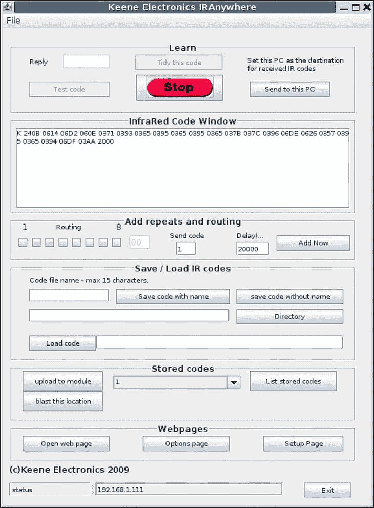

图 1-15。

Configuring KIRA

该软件可从基恩网站 16 获得，并且已经用 Java 精心编写，使其对 Linux 友好。将 KIRA 连接到您的网络并使用您的 DHCP 服务器为其提供 IP 地址后，您可以添加新命令。首先，您请求将所有红外信息发送到这台机器，然后在按遥控器上的第一个键之前按“Learn”。这将显示如下代码，然后可以复制并粘贴到一个文本文件中供以后使用:

`K 240C 037F 0369 03AC 034D 0624 035A 0378 0382 0378 0381 0396 0366 0377`

`0382 0396 0365 0396 06E0 03AF 034C 072C 0353 0378 2000`

我为每个设备使用了一个目录层次结构，这样我的电视的开/关按钮就在目录`ir/tv/codes/on`中。由于同一个按钮执行两种功能，我在`off`和`on`之间创建了一个符号链接。那些拥有更大房子和更多电视的人可能会喜欢用一个比电视更具描述性的名字。

虽然 KIRA 有一个网页，但它不是很容易配置，并且限制你只能使用四个预存的红外代码。幸运的是，它还监听 UDP 端口 30303 和 65432 上发送的命令。前者用于设备发现和配置，因此无法更改端口。后者是红外控制端口，它处理所有基本命令来控制范围内的各种红外设备。对这些命令的所有响应也由 UDP 返回，因此您需要运行网络实用工具的两个实例瑞士军刀`netcat`来处理它。

首先创建两个终端窗口，并通过键入以下命令在其中一个窗口中启动 UDP 服务器:

`nc -u -l -p 30303`

现在，它将在端口 30303 上侦听发送给它的任何 UDP 消息。现在，在另一个窗口中，在同一个端口上向 KIRA(其 IP 地址已被 DHCP 服务器确定为 192.168.1.111)发送一条消息:

`echo disD | nc -q 0 -u 192.168.1.111 30303`

您应该看到另一个窗口活跃起来，并报告有关设备的各种统计信息。如果没有，检查端口是否打开，并且正在使用(网络的另一把瑞士军刀)`netstat`:

`netstat -ntpl`

通过一些普通聪明的`bash`编码，您可以使用如下脚本获得相同的结果:

`#!/bin/bash`

`TEMPFILE=`mktemp``

`nc -u -l -p 30303 >$TEMPFILE &`

`PROCESS=$!`

`echo disD | nc -q 0 -u 192.168.1.111 30303`

`# Wait for a second so the output has finished writing`

`sleep 1`

`kill $PROCESS`

`cat $TEMPFILE`

`rm $TEMPFILE`

发送红外信息的过程是相同的，只是您需要切换到红外端口。这里有一个例子:

`cat ir/codes/tv/off | nc -q 0 -u 192.168.1.111 65432`

发送到端口 65432 的唯一响应是 ACK，可以安全地忽略它。但是，如果您决定监听端口 65432(并且您已经请求将所有 IR 消息转发到您的 PC)，那么您将会看到键码出现。这些可以从终端窗口(而不是使用 web 界面)复制到您自己的配置文件中。有一个提供的 API 文档详细说明了每个端口处理的每个命令。注意，通过使用您的 Linux 机器来维护 IR 代码，您不需要将 keycode 文件上传到它的 web 服务器上的四个插槽之一。

Note

您的网络上可以有几个 KIRA 设备，每个设备向不同的设备发送消息，尽管 KIRA 要接收消息并将它们发送回 PC，您必须从其 web 界面显式启用该功能，并给它一个 IP 地址，在那里`netcat`或类似的设备将被监听。

### 红外控制

如果您的电脑离您想要控制的红外设备很近，则很容易为其添加合适的基于 USB 的发射器或接收器。这些可以从 RedRat 这样的地方买到，也可以根据 LIRC (Linux 红外线遥控)提供的电路图制作，该公司也提供了软件。

Caution

大多数个人电脑将 USB 端口直接连接到主板上，如果你在构建自己的设备时出错，你可能会毁掉它。购买一个单独的带有 USB 插座的 PCI 板应该可以提供一些保护，防止意外事故的发生。

对于红外传输，您需要知道您想要控制的设备的特定控制代码。如果你有一台标准的电视机或录像机，这些数据通常可以在网上获得([`http://lirc.sourceforge.net/remotes/`](http://lirc.sourceforge.net/remotes/))；否则，你也需要购买或建立一个红外接收器来教 LIRC 现有的代码。幸运的是，如果你接受了早期的提示，买了一个 RedRat，你将有一个内置的接收器，与提供的 Windows 软件或 LIRC 一起，可以直接用于编程代码。

LIRC 17 是读取和传输红外数据的 Linux 标准方法。它由一个标准的守护进程`lircd`和一组工具组成，这些工具记录输入的消息并把它们再次传送回来。它采用模块化方法来支持各种可用的 LIRC 设备。在这里复制安装指南可能有些鲁莽，但可以说有三种主要类型的支持控件:

*   GPIO 设备:这些设备通常与电视卡一起提供，例如 Hauppauge 的电视卡。这些模块通常被编译成标准的守护程序版本
*   串行端口设备:这涵盖了各种不同的设备，包括自制的发射器，因为它们直接处理串行数据，所以不需要任何特定的驱动程序代码。典型电路可从 LIRC 网站获得。如果你不确定要不要把自己的电子设备连接到你的电脑主板上，你可以买串行 PCI 卡，它可以提供一定程度的保护，防止流氓电子设备
*   内核驱动程序:这些驱动程序，比如 RedRat3 设备，要求您从源代码构建 LIRC，并且(在某些情况下)将新的驱动程序代码复制到 LIRC 目录中。从这里，您可以重新构建安装(`data2setup.sh`)文件，并正常构建。这些设备将使用`/dev/lircd`设备，该设备应该拥有`ugo+rw`权限

一旦构建完成，就可以根据 LIRC、 18 的表格配置和准备驱动程序，该表格还提供了各种设备的示例配置文件，这些文件用人性化的名称描述了每个按钮以及要发送的红外信号的详细信息。从这里，您可以在`.lircrc`文件中添加在各种按钮按下时触发的特定命令，其格式如下:

`begin`

`prog = mythtv`

`button = Rew`

`config = Left`

`end`

遥控器上的每个按钮都以这种方式映射到软件的一个功能(`prog`)。

一般来说，使用 RedRat 和 LIRC 的最大好处之一是它可以包含在许多标准媒体播放器、混音器和电视应用中。因此，如果这是您的 IR 的主要目的，那么您已经完成了您的媒体安装，因为这些命令可以触发现有软件中的一些有用的东西！

LIRC 也有一个网络模式，您可以通过网络套接字与 LIRC 守护程序通信，允许外部应用程序像本地红外遥控器一样工作。这对于测试是有用的，并且作为一种远程基于 PC 的媒体播放器的方法，无需编写新的代码。

对于更具体的应用，您将需要使用`irexec`，如下所示:

`begin`

`prog = irexec`

`button = ok`

`config = /usr/bin/someprogram with arguments here`

`end`

通过这种方式，您可以使用 IR 遥控器与其他任意应用程序进行交互，包括其他机器上的媒体播放器。此外，你可以采用与 Cosmic 相同的想法(本章前面提到过，在第七章中有更详细的介绍)来开发一个基于状态的控制机制，使用非常便宜的红外发射器。

## 结论

您家中的每个设备都应该能够被远程控制，或者通过电源线(X10 或 C-Bus)，以太网插座，或者通过基本的红外线。这是两阶段过程的第一步。第二种是当你有一台计算机能够向这些设备发出控制信息。届时，这些设备可以在世界任何地方无缝使用。当设备不支持这样的功能时，你就得黑它。这就是极客乐趣的开始！

Footnotes 1

法拉第笼可以工作，但在家庭环境中通常不实用！

  2

您可以通过观察 [`http://jvde.us/x10/x10_cfls.htm`](http://jvde.us/x10/x10_cfls.htm) 处显示的示波器轨迹来见证引入的噪声。

  3

感性负载使用磁场，通常以电机或螺线管为特征。

  4

阻性负载将电流转换成其他形式的能量，如热能。

  5

一些标有 ZED 的设备可能无法作为 ZC 或 ZR 使用，因为需要的功能较少，所以可能是故意这样设计的。价格可能是一个指南。

  6

C-Bus 主要在英国和澳大利亚使用，在美国相当于 SquareD Clipsal。这是为了避免与利用消费电子总线(CEBus)的类似技术 CEBus/EIA-600 相混淆。

  7

只要它们是以网络模式配置的。

  8

旧的电力线控制器与新的 Insteon 设备不兼容。

  9

您可能还会看到它被列为 10.0.0.0/8，其中 8 表示地址中 32 位二进制数字的前 8 位是固定的，因此在 10.0.0.0 到 10.255.255.255 之间有超过 1600 万个地址。类似地，您可能还会看到以下使用中的地址:172.16.0.0/12(在 172.16.0.0 到 172.31.255.255 之间提供超过一百万个地址的范围)和 192.168.0.0/16(在 192.168.0.0 到 192.168.255.255 之间提供 65，536 个地址的范围)。

  10

有两个地址保留给子网(0)和广播(255)，因此总数从 256 减少到 254。

  11

有些路由器不能离开 192.168.1.1 进行配置，因此最好避免将此号码用于其他用途。

  12

通过检查`dmesg | grep eth`的输出或将别名`eth1 mynetcarddevice`添加到`/etc/modules`来确定这是 eth0 还是 eth1。

  13

10.2 及更低版本。

  14

除非挂载在`/etc/fstab`中，否则只能通过使用 umount 目录作为根目录来卸载。

  15

[`www.cleverandeasy.com/Multimedia/increase-operating-angle-of-infrared-remote-control.html`见](http://www.cleverandeasy.com/Multimedia/increase-operating-angle-of-infrared-remote-control.html)。

  16

[`www.keene.co.uk/electronics/multi.php?mycode=KIRA`见](http://www.keene.co.uk/electronics/multi.php?mycode=KIRA)。

  17

[`lirc.org`](http://lirc.org/)

  18

[`www.lirc.org/html/table.html`](http://www.lirc.org/html/table.html)