# 三、语言支持和代码编辑功能

VSCode 不仅仅是另一个具有语法着色和自动缩进的文本编辑器。相反，它是一个非常强大的以代码为中心的开发环境，旨在使使用不同开发平台可用的语言编写 web、移动和云应用变得更加容易。

为了提供一个强大、丰富的开发环境，VSCode 集成了许多编辑功能，旨在提高代码的生产率和质量。本章讨论 VSCode 中支持哪些语言以及所有可用的代码编辑功能，从所有支持的语言都支持的最基本的功能开始，到特定语言(如 C#、JavaScript 和 TypeScript)都支持的最高级的生产力工具。

Note

本章中使用的键盘快捷键基于 VSCode 中的默认设置。

## 语言支持

开箱即用，VSCode 内置了对许多语言的支持。表 3-1 通过编辑功能对支持的语言进行分组。

表 3-1

按功能的语言支持

<colgroup><col class="tcol1 align-left"> <col class="tcol2 align-left"></colgroup> 
| 

语言

 | 

编辑功能

 |
| --- | --- |
| Batch、C、C#、C++、Clojure、CoffeeScript、Diff、Dockerfile、F#、Go、HLSL、Jade、Java、HandleBars、Ini、Lua、Makefile、Objective-C、Objective-C++、Perl、PowerShell、Properties、Pug、Python、R、Razor、Ruby、Rust、SCSS、ShaderLab、Shell 脚本、SQL、Visual Basic、XML | 常见功能(语法着色、括号匹配、基本单词补全) |
| Groovy，Markdown，PHP，Swift | 常见功能和代码片段 |
| CSS，HTML，JSON，带注释的 JSON，Less，Sass | 通用功能、代码片段、智能感知、大纲 |
| 类型脚本，类型脚本反应，JavaScript，JavaScript 反应 | 通用功能、代码段、IntelliSense、大纲、参数提示、重构、查找所有引用、转到定义、查看定义 |

VSCode 可以用开发人员社区开发的其他语言进行扩展，也可以从 Visual Studio Marketplace 下载。这在第六章中有更详细的讨论，但是，与此同时，你可以看看现成可用的语言。出于本书的目的，为了方便起见，提供了对 C#和 C++的介绍。

### 使用 C#和 C++

C#编程语言值得更详细的介绍，因为它很受欢迎，因为它现在是一种跨平台语言，不仅可以在 Windows 上使用，还可以在 macOS 和 Linux 上使用。从表 3-1 中可以看出，VSCode 为 C#提供的开箱即用的编辑体验仅限于常见功能。

然而，通过微软 C#免费扩展( [`https://marketplace.visualstudio.com/items?itemName=ms-vscode.csharp`](https://marketplace.visualstudio.com/items%253FitemName%253Dms-vscode.csharp) )提供了对 C#编码体验的全面而丰富的支持。这为提供了优化的体验.NET Core development，包含了用 C#构建应用所需的所有支持和工具，包括对.NET 核心调试器。有了这个扩展，您基本上可以获得与 TypeScript 相同的体验，包括基于.NET 编译器平台(也称为 Roslyn ),可以更容易地在您键入时修复代码问题。如果你打算使用 C#，我强烈建议你安装这个扩展，特别是因为本章讨论了一些只能通过扩展使用的编辑特性。

扩展性在第六章中有更详细的解释，但是您可以通过打开任何 C#代码文件(.cs ),并在检测到该文件类型有合适的扩展名时按照 VSCode 显示的说明进行操作。

类似地，您可能希望安装 Microsoft C/C++扩展，该扩展为 C 和 C++语言添加了增强的编辑功能，以及对 Windows (PDB、MinGW、Cygwin)、macOS 和 Linux 的调试支持。该扩展可从 [`https://marketplace.visualstudio.com/items?itemName=ms-vscode.cpptools`](https://marketplace.visualstudio.com/items%253FitemName%253Dms-vscode.cpptools) 获得，您可以通过打开 a .c .，按照与刚才描述的 C#扩展相同的简单安装步骤进行安装。h 或者。cpp 文件。

## 基本代码编辑功能

VSCode 提供了许多您期望从功能强大的代码编辑器中获得的功能。本节描述了这个工具的哪些编辑特性让您的编码体验变得令人惊叹。如果您熟悉 Microsoft Visual Studio，您还会看到一些功能是如何从该 IDE 继承而来的。值得一提的是，VSCode 为几乎所有的编辑功能提供了键盘快捷键，让您可以更快地编辑代码。由于这个原因，键盘快捷键也被提到了许多描述的功能。

Note

本节描述的功能适用于表 3-1 中描述的所有支持的语言，除非另有明确说明。

### 使用文本

正如您所料，VS Code 中的代码编辑器提供了文本操作和文本选择命令。**编辑**菜单提供了**撤销**、**重做**、**复制**、**剪切**、**粘贴**、**查找**、**替换**、**在文件中查找**和**在文件中替换**命令。这些命令在每个文本编辑器中都可用，不需要任何进一步的解释。

**编辑**菜单还包括**切换行注释**和**切换块注释**命令，根据语言分别添加单行注释或块注释。例如，在 C#中，第一个命令会注释这样一行:

```sh
// int a = 0;

```

相比之下，块注释工具将添加多行注释，如下所示:

```sh
/* int a = 0;
int b = 0; */

```

**编辑**菜单也提供了一个命令来处理代码片段， **Emmet:扩展缩写**。此命令是代码编辑器提供的键盘快捷键的菜单表示形式，用于添加代码段。代码片段将在本章的“可重用代码片段”一节中详细讨论。

**选择**菜单不仅提供了文本选择命令，还提供了更容易在当前行上下移动或复制代码行的命令。**在**上方添加光标、**在**下方添加光标和**在行尾添加光标**命令允许使用多光标，如本章“多光标”一节所述。

如果您在编辑器中单击一个标识符、保留字或类型名称，您可以使用**添加下一个事件**、**添加上一个事件**和**选择所有事件**命令，这些命令允许快速选择所选单词的事件，事件将以不同的颜色突出显示，这取决于当前主题。

### 语法着色

对于表 3-1 中总结的所有语言，VSCode 中的代码编辑器提供了正确的语法着色。图 3-1 显示了一个基于类型脚本代码文件的例子。

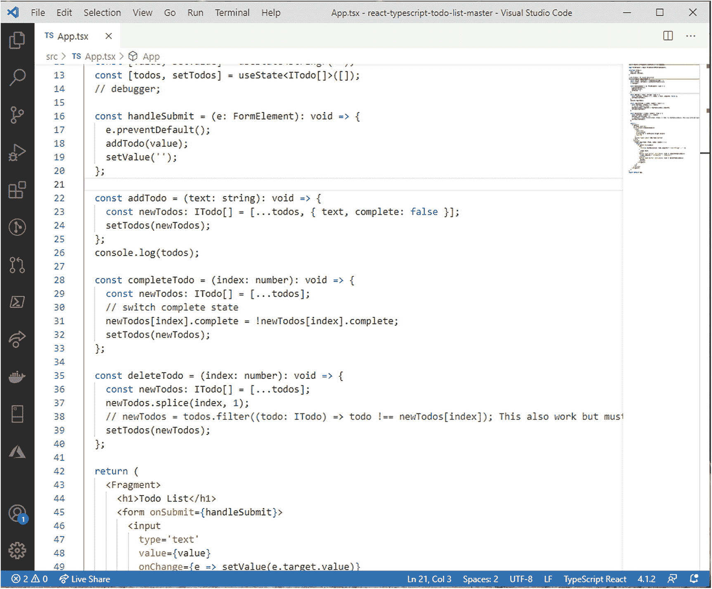

图 3-1

语法着色

通过可扩展性，语法着色可用于其他语言。如果您需要使用不包含在 VSCode 中的现成语言，可以查看 Visual Studio 市场，看看是否有支持这种语言的扩展。有关扩展性的信息，请参见第六章。顺便提一下，语法着色是扩展为增加对新语言的支持而必须提供的最低要求。

### 分隔符匹配和文本选择

代码编辑器可以突出显示匹配的分隔符，如方括号和圆括号(包括方括号和圆括号)。这个特性对于分隔代码块非常有用，当光标靠近其中一个分隔符时就会被触发。图 3-2 显示了一个基于构造函数定义中括号匹配的例子。

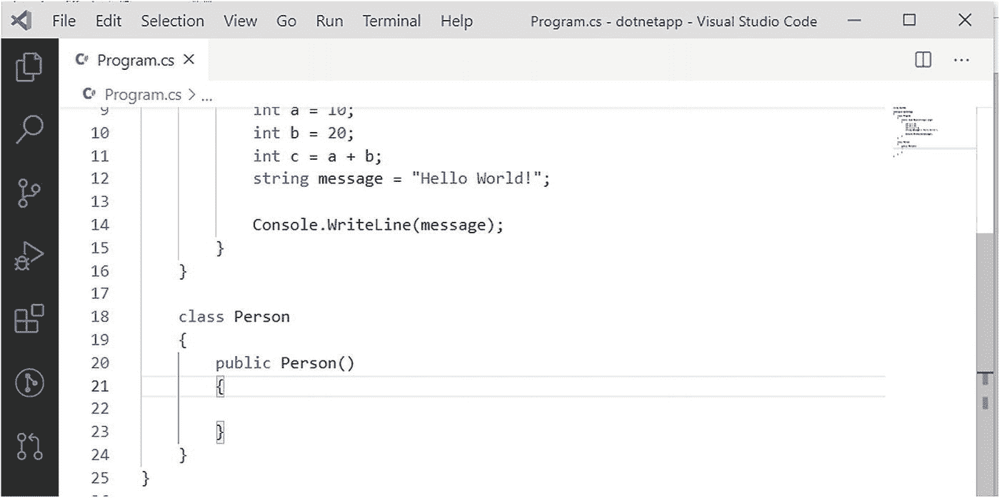

图 3-2

分隔符匹配

当您需要直观地分隔嵌套块以及复杂而长的表达式时，此功能也非常有用。值得一提的是，可以按 Ctrl+D 快速选择光标右侧的一个单词或标识符。您还可以通过按 Shift+Alt+向右箭头键来快速选择代码块分隔符内的所有文本，并且可以通过按 Shift+Alt+向左箭头键来快速取消选择同一代码块。

### 代码块折叠

代码编辑器允许折叠分隔的代码块。只要将光标悬停在行号上，一个表示向下箭头的符号就会出现在代码块的开头附近。只需单击折叠，此时您将看到>符号，单击它可以展开代码块。图 3-3 提供了一个例子。


图 3-3

代码块折叠

Note

如果在代码编辑器中没有启用代码块折叠，打开 VS 代码的设置，然后在**文本编辑器**组中启用**折叠**和**折叠高亮**选项。

### 多光标

代码编辑器支持多光标。每个光标独立操作，您可以通过按住 Alt 键并单击所需位置来添加辅助光标。使用多光标的最典型的情况是当您想要在代码文件的不同位置添加(或替换)相同的文本时。

### 可重用的代码片段

VSCode 附带了许多内置代码段，您可以通过使用 Emmet 缩写语法并按 Tab 键来轻松添加这些代码段。请参见“语言支持”部分的表 3-1 查看哪些语言本身支持代码片段。例如，在一个 Swift 文件中，你可以通过使用`do`代码片段很容易地添加一个`do..catch`块定义，如图 3-4 所示。


图 3-4

添加代码片段

当您在代码编辑器中键入代码时，代码段是可用的，您可以通过代表一个小的白色表单的图标来识别它们。请注意工具提示如何显示代码片段的预览。在前一个代码片段上按 Tab 会产生如图 3-5 所示的结果。

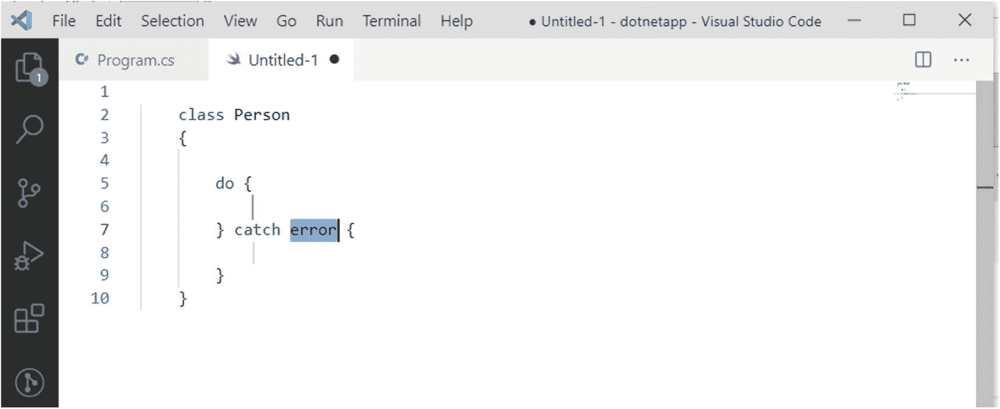

图 3-5

突出显示变量名的新添加的代码片段

请注意，如果代码片段包含变量名或标识符，这些可能会被高亮显示，以建议您给它们一个不同的名称(如图 3-5 中的`error`标识符)。重命名突出显示的标识符时，所有出现的标识符也会被重命名。

VSCode 不限于内置的代码片段。您可以从 Visual Studio Marketplace 下载其他开发人员为多种语言制作的代码片段。实际上，大多数引入或扩展编程语言支持的扩展也包含了许多代码片段。

### 单词补全

VSCode 中的代码编辑器为所有受支持的语言实现了基本的单词完成功能。此功能可帮助您在键入时完成单词和语句。例如，图 3-6 显示了代码编辑器如何根据开发人员键入的内容，建议在 Visual Basic 文件中用`Class`关键字终止一条语句。

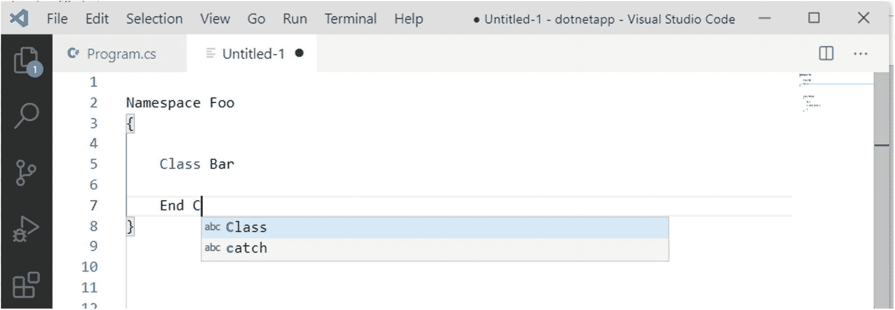

图 3-6

使用单词补全功能完成语句

只需按 Enter 或 Tab 键插入建议的单词。单词完成引擎在您编码时学习，并可以根据您声明的变量和成员名称提供建议。例如，图 3-7 展示了编辑器如何建议添加一个名为`Test`的变量，这个变量之前在代码中声明过。

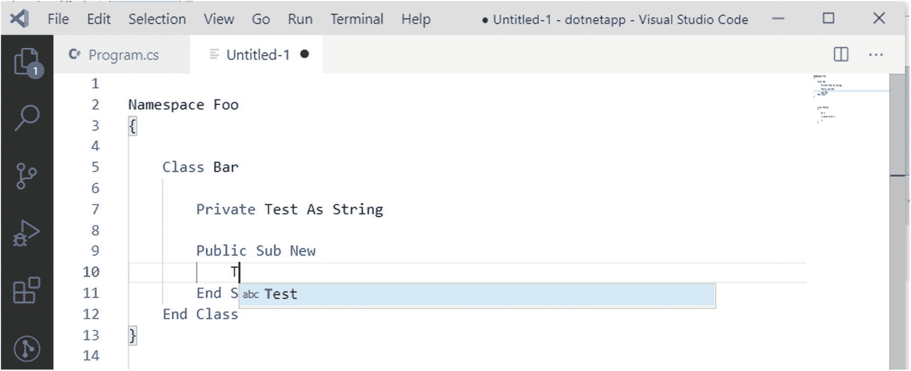

图 3-7

代码编辑器可以建议代码中声明的标识符

### Minimap 模式

有时很难找到光标在源代码文件中的位置，尤其是对于非常长的文件。VSCode 提供了小地图，这是代码编辑器滚动条上源代码文件的一个小预览。图 3-8 提供了一个例子。


图 3-8

小地图允许在滚动条上预览源代码

如果您单击小地图，代码编辑器中可见的源代码部分会在滚动条中突出显示，这样您可以更好地了解光标的当前位置。使用**视图** ➤ **显示小地图**命令可以禁用和启用小地图。

### 空白渲染和面包屑

文本编辑器的一个非常常见的特性是显示亮点而不是空白。在 VSCode 中，缩进中的空白是可能的。为此，您选择**视图** ➤ **渲染空白**。图 3-9 显示了一个如何用圆点替换缩进的空白的例子。对于此图，为了在纸上更好地可视化，使用了日晒浅色主题。

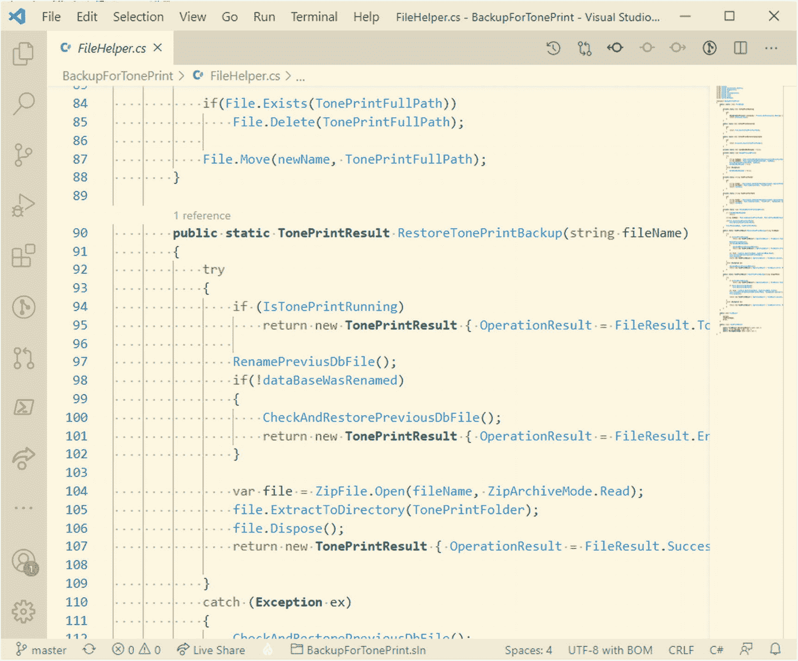

图 3-9

用点呈现缩进空间

只需使用相同的命令返回空白。另一个非常有用的命令是**切换面包屑**，在**视图**菜单中可用。使用支持的语言，如 JavaScript、TypeScript、安装了扩展的 C#，该命令在编辑器顶部显示当前代码文件中定义的类型和成员列表，可以展开查看其成员，如图 3-10 所示。


图 3-10

使用面包屑在类型和成员之间导航

单击类型或成员名称会将光标移动到其定义处，并突出显示相关的代码块，从而使代码导航变得更加容易。

### 减价预览

VSCode 支持 Markdown 语法，用于在非常流行的。md 文件格式。除了语法着色，对于这种特定的语言，VSCode 还提供了文档外观的预览。只需在代码编辑器中按 Ctrl+Shift+V(MAC OS 上为 Cmd+Shift+V)，预览就会出现在单独的窗口中，如图 3-11 所示。

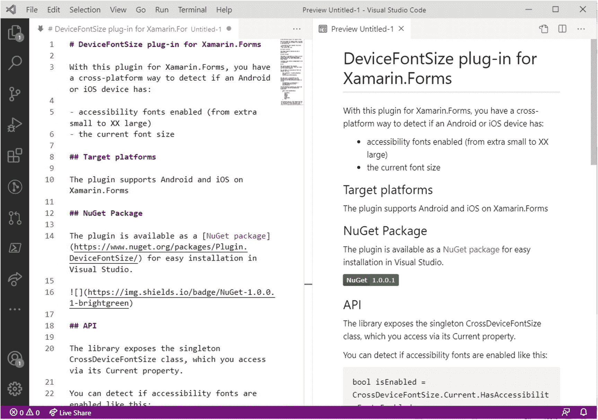

图 3-11

集成降价预览

此功能非常有用，因为它允许您预览文档，而不需要外部程序，如 web 浏览器。

## 进化的代码编辑

VSCode 是一个非常强大的代码编辑工具，它为跨平台和多语言环境带来了微软 Visual Studio 多年来一直可用的许多功能，提供了所谓的*进化代码编辑*。本节解释了对于诸如 TypeScript 和 JavaScript 之类的语言，以及安装了适当扩展的 C#、C++和 Python 之类的语言，现成可用的所有高级代码编辑特性。

### 使用智能感知

IntelliSense 通过在您键入时出现的方便的弹出列表提供丰富的高级单词补全功能。在来自微软的开发者工具中，比如 Visual Studio，IntelliSense 一直是最受欢迎的功能之一，原因就在于它不是简单的单词补全。事实上，IntelliSense 会在您键入时提供建议，显示有关成员的文档(如果有的话),并在每个建议旁边显示一个图标，描述某个单词代表哪种语法元素。图 3-12 显示了使用 C#代码文件时的智能感知。


图 3-12

IntelliSense 在您键入时显示建议和高级单词完成功能

正如你在图 3-12 中看到的，对于给定的类型(在本例中为`Console`)，智能感知会在你编写时显示可用成员的列表。当您用键盘滚动列表并停留在完成列表中的一个单词上时，VSCode 会显示成员文档。对话框右侧的小箭头可用于关闭文档。

Note

只有开发人员提供了类型或成员的文档，该文档才可用。例如，在 C#中，类型和成员的文档必须提供 XML 注释。这使得 IntelliSense 能够在工具提示中显示它，如图 3-12 所示。

按 Tab 或 Enter 来完成单词插入，或者只需单击。不限于此，VSCode 中的 IntelliSense 支持建议筛选:基于 CamelCase 约定，您可以键入成员名称的大写字母来筛选建议列表。例如，如果您正在处理`System.Console`类型，并且您键入了`cv`，建议列表将显示`CursorVisible`属性，如图 3-13 所示。

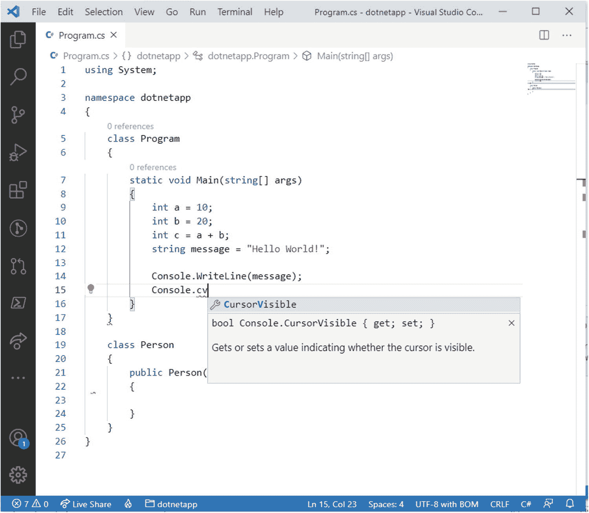

图 3-13

智能感知中的建议过滤

IntelliSense 还为代码编辑器中依赖于它的其他高级功能提供了基础，这些功能将在下一小节中介绍。

### 参数提示

当您编写函数调用时，IntelliSense 还会显示描述每个参数的工具提示。这个特性被称为*参数提示*，只有在函数参数的文档已经实现的情况下才可用。在图 3-14 中可以看到一个例子。

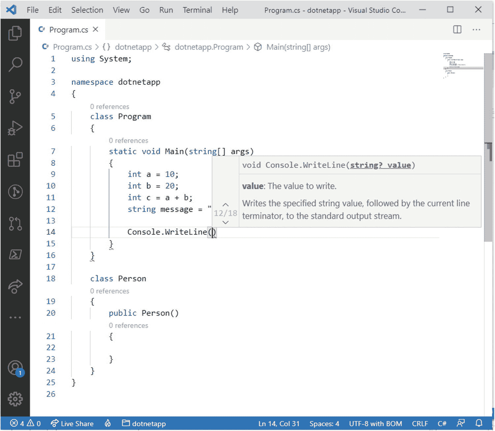

图 3-14

智能感知显示参数提示

对于 C#和 TypeScript 等语言，或者更一般地说，对于允许函数重载的语言，参数提示显示每个重载的参数说明。您也可以使用向上和向下箭头键滚动重载列表，以选择不同的重载。

### 带工具提示的内嵌文档

如果将光标悬停在类型、变量和类型成员上，VSCode 会显示一个工具提示，其中包含所选对象的文档。图 3-15 提供了一个例子。

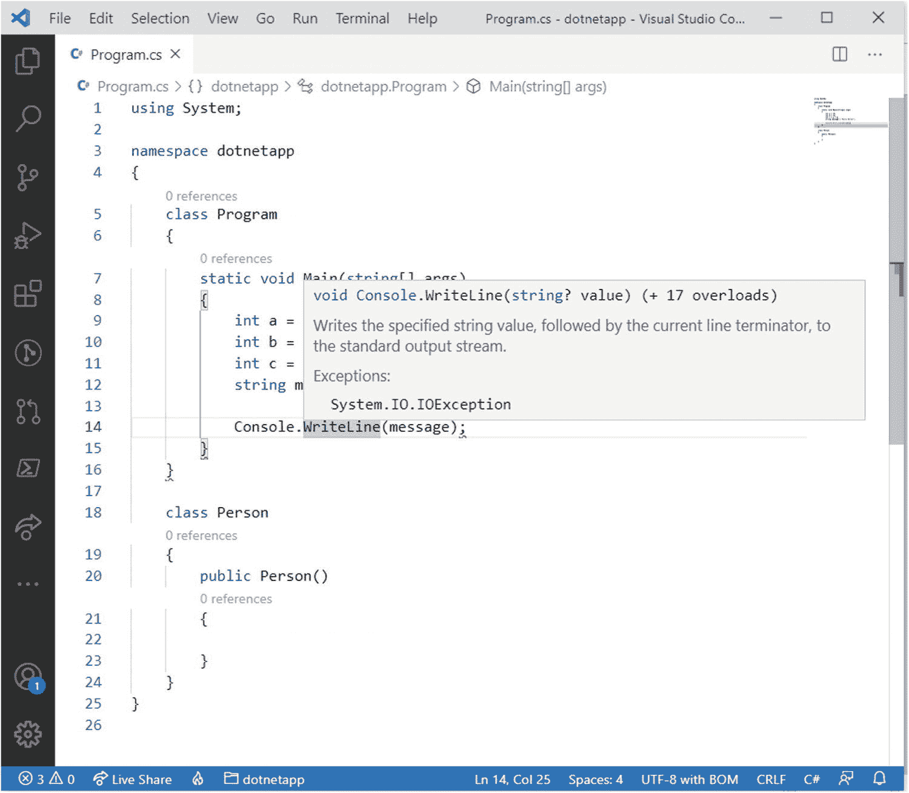

图 3-15

工具提示提供快速、内嵌的文档

与参数提示一样，只有在文档已经实现的情况下，此功能才可用

Note

如果将光标悬停在变量名称上，工具提示将仅显示该变量的类型。

### 转到定义并查看定义

VSCode 提供了另一个有趣的特性，叫做*转到定义*。如果您将光标悬停在某个符号上并按下 Ctrl(或 macOS 上的⌘)，该符号会显示为超链接；另外，工具提示显示了声明该符号的代码。如果在按住 Ctrl 键的同时单击类型名称，您将被重定向到定义该类型的代码。图 3-16 显示了当你按住 Ctrl 键并将鼠标悬停在一个类型名上时，代码编辑器是如何出现的。

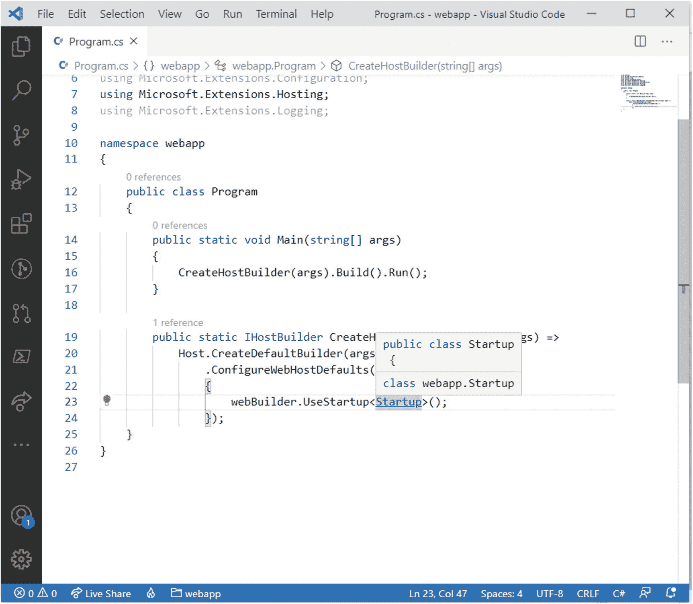

图 3-16

Ctrl +悬停在某个类型上可以转到定义

如果选择一个类型名称并按 F12，或者右键单击一个类型名称，然后从上下文菜单中选择 **Go to Definition** ，也可以使用相同的工具。这是一个非常有用的特性，可以让您快速浏览不同代码文件中的类型定义。

Note

对于 C#，转到定义还可以打开由.NET 核心库和任何包含类型定义信息的 NuGet 包，而不仅仅是您的代码。

现在假设您有几十个代码文件，并且想要查看或编辑您当前正在使用的类型的定义。使用其他编辑器，您可能会在代码文件中搜索，这不仅令人讨厌，而且会将您的注意力从原始代码上移开。VSCode 用一个叫做 Peek Definition 的特性出色地解决了这个问题。

你可以简单的右击一个类型名，然后选择**peek**➤**peek definition**(键盘快捷键是 alt+F12)；将出现一个交互式弹出窗口，显示定义该类型的代码，不仅提供查看代码的选项，还提供直接编辑的选项。图 3-17 显示了正在运行的 Peek 定义窗口。您可以按 Esc 键快速关闭 Peek 定义窗口，作为单击关闭按钮的替代方法。


图 3-17

使用 Peek 定义处理另一个文件中定义的类型

如您所见,“查看定义”窗口与“查找所有引用”功能非常相似，它仍然在顶部显示定义该类型的文件名。只需单击文件名，在单独的编辑器中打开代码文件。

### 转到实现并查看实现

有时，您可能需要了解一个接口或抽象类已经实现了多少次以及在哪里实现。

虽然您可以通过查找类型的引用来实现这一点(请参见下一节)，但 VSCode 现在提供了更方便的方法，其工作方式类似于转到定义和查看定义，分别称为转到实现和查看实现。你可以右击一个接口或者抽象类定义，然后选择**转到实现**或者**查看** ➤ **查看实现**。这两个操作都会打开一个交互式的嵌套编辑器，在右侧显示所选类型的实现列表，以及第一次出现的实现代码，如图 3-18 所示。


图 3-18

在类型实现中导航

这两个操作的区别如下:使用 Go to Implementation，当您单击列表中的一个实现时，VS Code 会打开一个新的编辑器窗口，指向包含该实现的文件；对于 Peek 实现，当您单击列表中的一个实现时，它会显示在一个交互式弹出窗口中，类似于 Peek 定义的工作方式。

### 查找参考

您经常需要知道在代码中何处使用了类型或成员，VSCode 提供了两个很好的工具来检索引用。

第一个工具称为“查找所有引用”,如果您有在 Windows 上使用 Visual Studio 的经验，您可能已经熟悉它了。运行这个工具有不同的选项:你可以右击一个类型或成员名，然后选择**查找所有引用**或者你可以按 Shift+Alt+F12(在 macOS 上是 Option+Shift+F12)。图 3-19 显示了一个基于查找一个叫做`Startup`的类型的所有引用的例子。

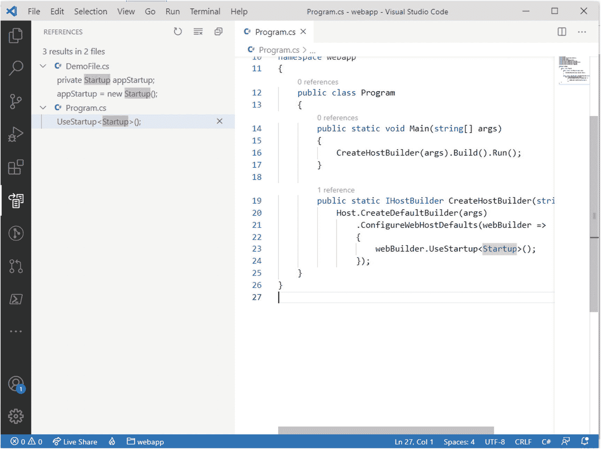

图 3-19

查找类型和成员的所有引用

“引用”面板在屏幕左侧打开，显示按代码文件分组的引用列表，以及引用和涉及的代码文件的总数。它还会在侧栏中添加一个新条目，一旦关闭“参考”面板，该条目将被禁用。事件被突出显示；当您单击其中一个时，将打开一个编辑器，打开包含所选事件的文件，该文件将在代码中突出显示。

还有另一个称为“转到引用”的工具(Shift+F12)，它在活动编辑器窗口中工作。右键单击对象名称，然后选择**转到引用**，或者单击成员定义顶部的引用数量，即可启用转到引用(参见图 3-19 )。您可以在代码中的任何地方使用第一个选项，而只有当类型或成员定义在代码编辑器中获得焦点时，才可以使用第二个选项。

“转到引用”的用户界面与“查找所有引用”的用户界面相同。VSCode 还提供了另一个用于查找类型和成员引用的有用工具，称为 Peek 引用。右键单击对象名称，然后选择**查看** ➤ **查看引用**，可以启用该工具。顾名思义，Peek References 显示活动编辑器中的所有参考，在交互式面板内，类似于您之前在 Peek Definition 中看到的内容。图 3-20 显示了一个例子，也是基于找到一个叫做`Startup`的类型的所有引用。


图 3-20

查找带有 Peek 引用的引用

如果单击右侧列表中的某个匹配项，代码编辑器将打开一个弹出窗口，其中包含找到该匹配项的代码。需要注意的是，这个弹出窗口是交互式的，这意味着您可以直接编辑代码，而不需要单独打开包含代码的文件。这使您能够将注意力集中在代码上，从而节省时间。另外，请注意交互式弹出窗口在顶部显示了包含所选引用的文件名。

与查找所有引用类似的是查找所有实现，这使得查找接口或抽象类的实现变得容易。图 3-21 显示了一个名为`IPerson`的接口由两个类`Person`和`Employee`实现的例子。“查找所有实现”在树视图中显示接口的所有实现，并在代码编辑器中突出显示类定义。

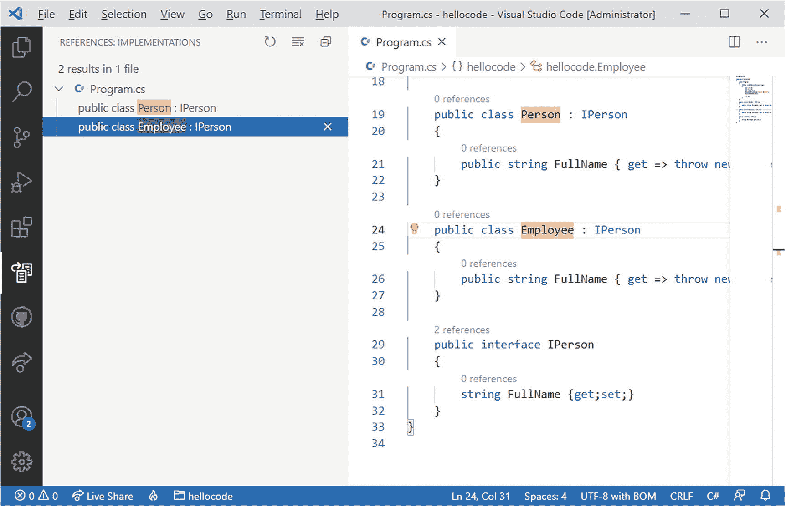

图 3-21

查找所有类型实现

### 重命名符号和标识符

重命名符号是一项频繁的任务，因此 VSCode 提供了一种方便的方法来完成这项任务。如果您在想要重命名的符号上按 F2 键，或右击并选择**重命名符号**命令，会出现一个小的交互式弹出框。在那里，您可以在没有任何对话框的情况下编写新名称，将注意力集中在代码上。图 3-22 显示了一个基于符号`app`的例子。


图 3-22

重命名符号

如果在重命名前按 Shift+Enter，VSCode 会显示符号如何被重命名的预览(参见图 3-22 底部的重构预览选项卡)。选项卡中的工具栏按钮使您能够接受更改(“应用重构”按钮)和拒绝更改(“放弃重构”按钮)。

通过按 Enter 键，该符号的所有引用将被相应地重命名。此外，您可以重命名标识符的所有出现。你只需右击标识符，然后选择**更改所有事件**(或者在 Windows/Linux 上按 Ctrl+F2，在 macOS 上按⌘+f2)；所有事件都将高亮显示，并在您键入时用新名称更新。

### 实时代码分析

有了 C#、TypeScript 和可以通过 Python 等扩展增强支持的语言，VSCode 可以在您键入时检测代码问题，提出修复建议并提供代码重构。这是该工具中最强大的特性之一，这是大多数其他代码编辑器中所没有的。接下来的示例基于 C#编程语言，因为它(和 TypeScript 一起)支持 VSCode 中最丰富的体验，因此讨论可用的强大编码功能是一个不错的选择。当然，这里讨论的所有内容都适用于支持相同增强特性的所有其他语言。

根据代码问题的严重程度，VSCode 用曲线给需要您注意的代码段加下划线。绿色曲线表示警告；红色曲线表示必须修复的错误。如果您将鼠标悬停在带有曲线的线条或符号上，您会看到描述该问题的工具提示。图 3-23 显示了两个代码问题，一个是绿色曲线(一个未使用的局部变量)，另一个是红色曲线(一个不存在的符号)。


图 3-23

键入时检测代码问题

键入时会检测到代码问题，这些问题也会在“问题”面板中列出。再次查看图 3-23 ，注意灯泡形状的图标。这个图标是一个叫做灯泡的工具的快捷方式。单击该图标时，VSCode 会显示当前上下文可能的代码修复。例如，图 3-24 显示了灯泡提供的建议，以修复红色波浪线下划线的缺失符号。

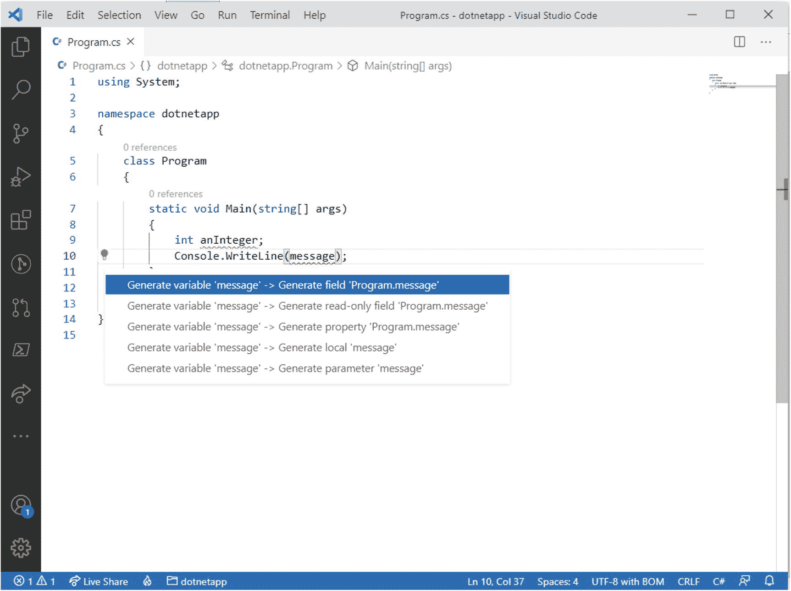

图 3-24

电灯泡建议的潜在解决方案

在这种特殊情况下，编辑器建议了五个选项:创建字段、创建只读字段、创建属性、创建局部变量或创建参数。在这种特殊情况下，将按如下方式创建一个字段:

```sh
private static bool welcomeMessage;

```

将会生成如下属性:

```sh
public static bool welcomeMessage { get; private set; }

```

可能`bool`不是您在这里期望的类型，但是 VSCode 没有足够的信息来推断不同的类型，所以它将基于方法的第一个重载接受的类型参数生成一个类型，这是`bool`的`WriteLine`。但是，当代码包含一些 VSCode 可以用来理解正确类型的信息时，它会生成预期类型的属性、字段、局部变量和参数。有了电灯泡，动态生成类型也变得更加容易。图 3-25 显示了一个基于名为`person`的对象的例子，其类型尚未定义。正如您所看到的，对于这个上下文，代码编辑器显示了一个更大的可能修复列表，包括在当前文件或一个单独的文件中生成一个新类，包括嵌套类的选项。

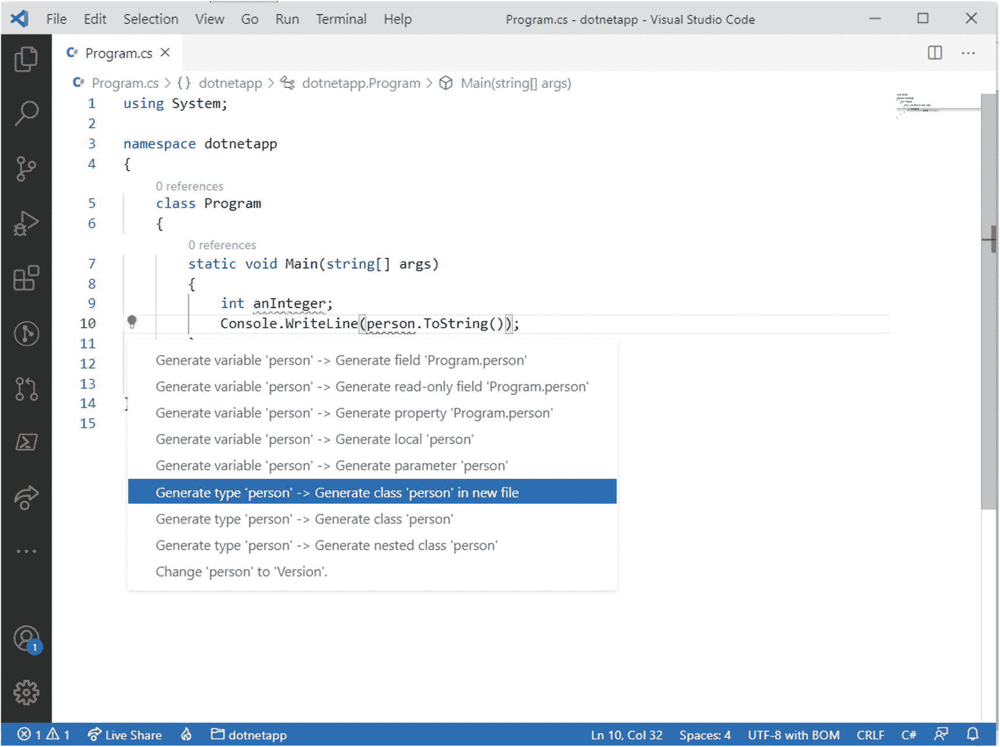

图 3-25

动态生成类型

灯泡还可以帮助你重构代码，让代码更整洁。例如，你可以点击任何一个`using`指令(或者其他语言中的等效指令)，当灯泡出现时，你可以看到它是如何提供移除未使用代码的，如图 3-26 所示。

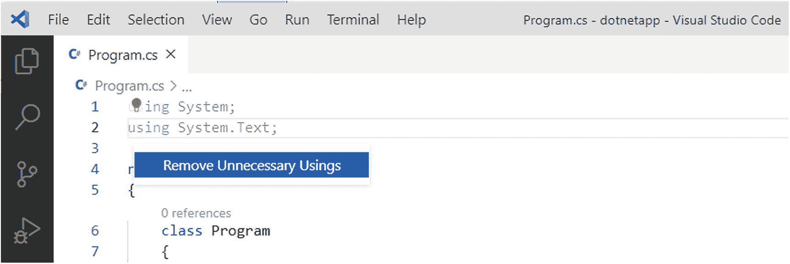

图 3-26

代码重构变得简单

实际上，灯泡工具提供了更多的能量。假设您想要创建一个实现`IDisposable`接口的类。如图 3-27 所示，代码编辑器找不到该接口的定义，并显示一条红色曲线，但是灯泡提供了快速修复该问题的快捷方式。例如，它建议添加一个`using System;`指令，这是代码所需要的。

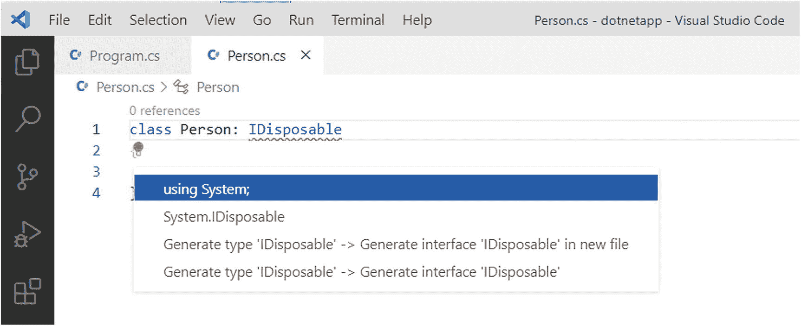

图 3-27

添加缺失的指令

此时，`IDisposable`仍然带有红色的下划线，因为代码还没有实现接口。当在类型的使用上检测到代码问题时，您可以将光标悬停在带下划线的代码上，并看到一个信息工具提示，如图 3-28 所示。

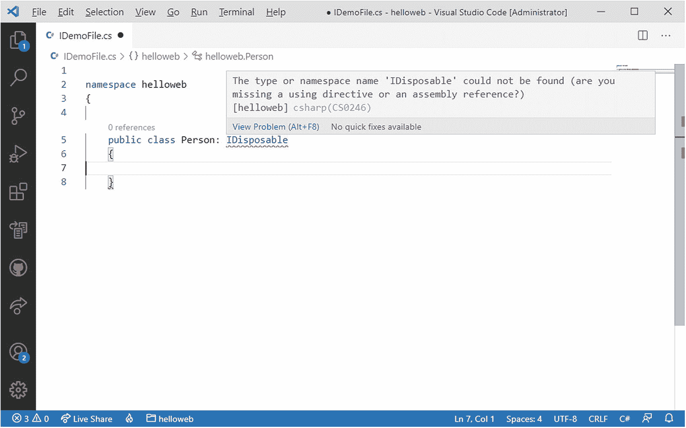

图 3-28

关于代码问题的信息工具提示

当您将光标从问题上移开时，工具提示会消失，但是您可以单击**查看问题**并将错误描述停靠在代码编辑器中的红色框内。如果你的灯泡还亮着，你会看到代码编辑器如何根据当前的上下文给出潜在的修复建议，比如用不同的方式实现接口(见图 3-29 )。

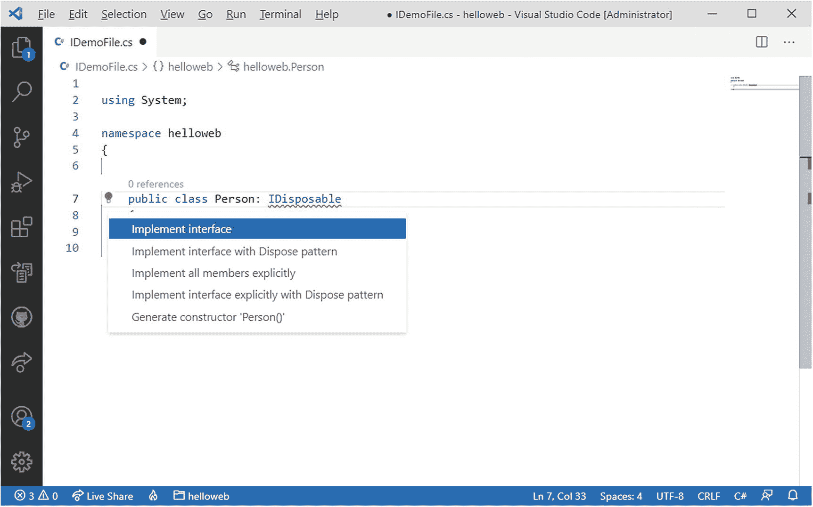

图 3-29

灯泡根据当前环境提供建议

为了让您了解这个工具的强大之处，如果您选择了带有 Dispose pattern 选项的 **Implement interface，下面是生成的代码:**

```sh
using System;

public class Person: IDisposable
{
    #region IDisposable Support

    private bool disposedValue = false; // To detect redundant calls

    protected virtual void Dispose(bool disposing)
    {
        if (!disposedValue)
        {
            if (disposing)
            {
                // TODO: dispose managed state (managed objects).
            }

            // TODO: free unmanaged resources (unmanaged objects)
            // TODO: set large fields to null.
            disposedValue = true;
        }
    }

    // // TODO: override a finalizer only if Dispose(bool disposing) above has code to free unmanaged resources.
    // ~Person() {

        // Do not change this code. Put cleanup code in Dispose(bool disposing) above.
        // Dispose(false);
    // }

    // This code added to correctly implement the disposable pattern.
    public void Dispose()
    {
        // Do not change this code. Put cleanup code in Dispose(bool disposing) above.
        Dispose(disposing: true);
        GC.SuppressFinalize(this);
    }
    #endregion
}

```

如果您选择其他可能的代码修复，您会得到类似的结果，但是实现不同。虽然不可能显示 VSCode 可以应用的所有代码修复的示例，但您必须记住的是，建议和代码修复是基于代码问题的上下文的，这是一个非常强大的功能，使 VSCode 成为一个独特的编辑器。

## 摘要

VSCode 是一个以代码为中心的工具，它支持各种现成的语言，提供了所有受支持语言通用的编码功能，如语法着色、分隔符匹配、代码块折叠、多指针、代码片段和代码完成。

此外，TypeScript 和 C#等语言通过 IntelliSense、Go to Definition 和 Peek Definition、Find All References 以及极其强大的灯泡等集成工具提供了所谓的进化代码编辑体验，这些工具可以在您键入时检测代码问题，并根据上下文提出潜在的修复建议。

既然你已经了解了 VSCode 所提供的强大的编码特性，那么在第四章中，是时候看看如何在单独的源代码文件和结构化文件夹中使用它们了。