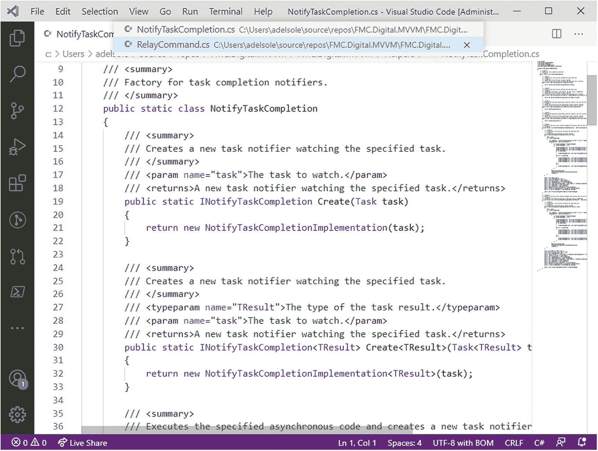
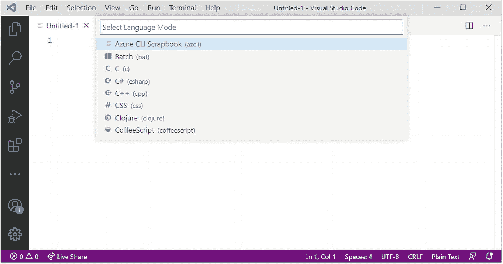
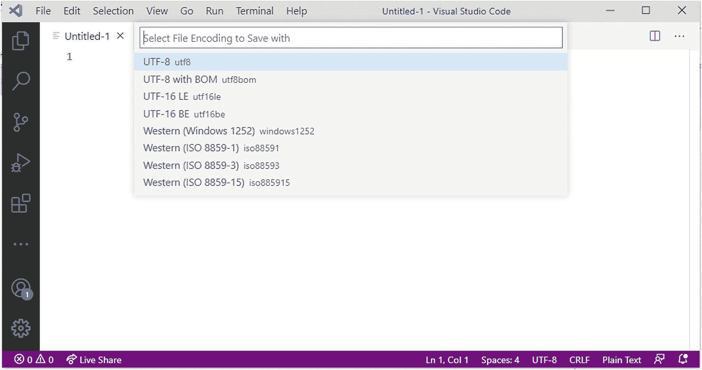
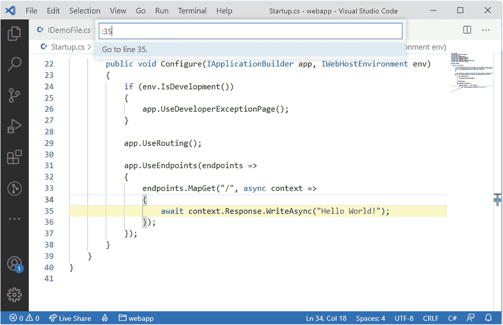
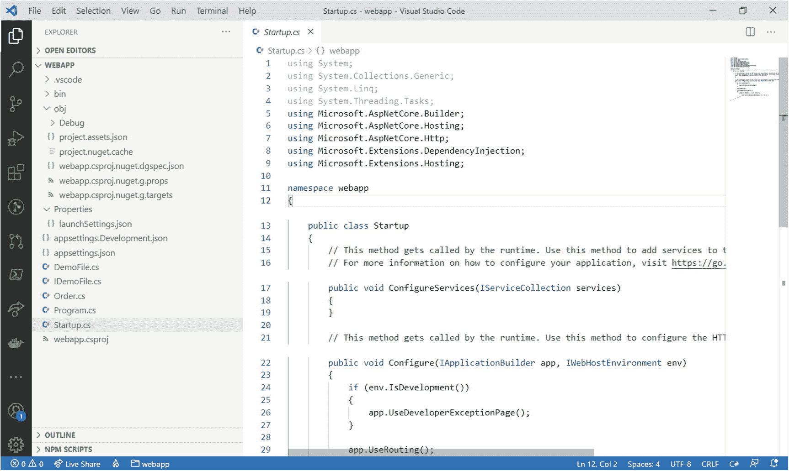
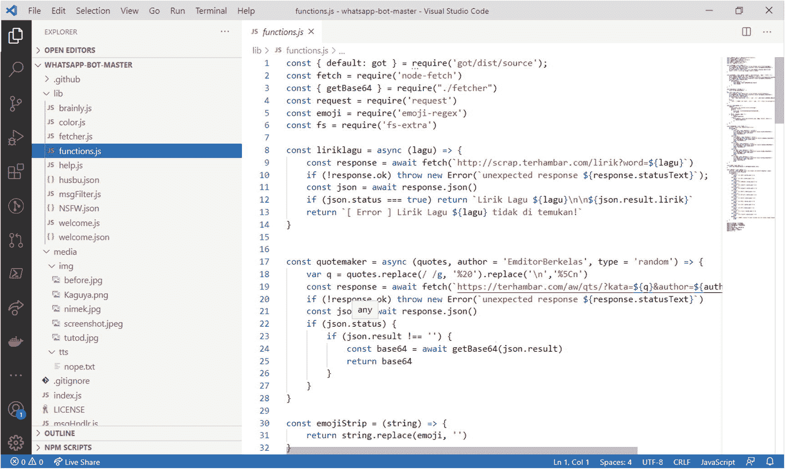
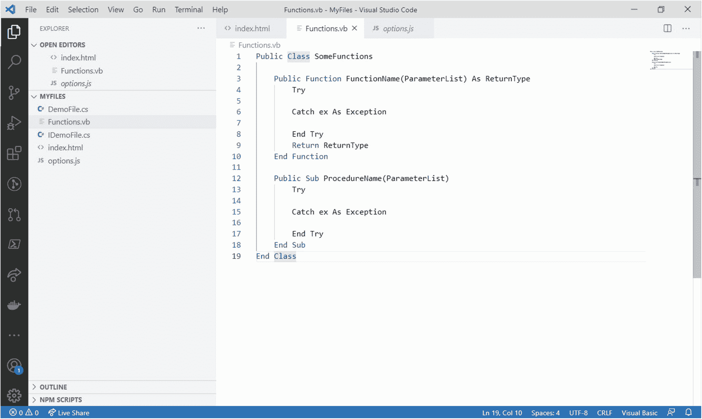
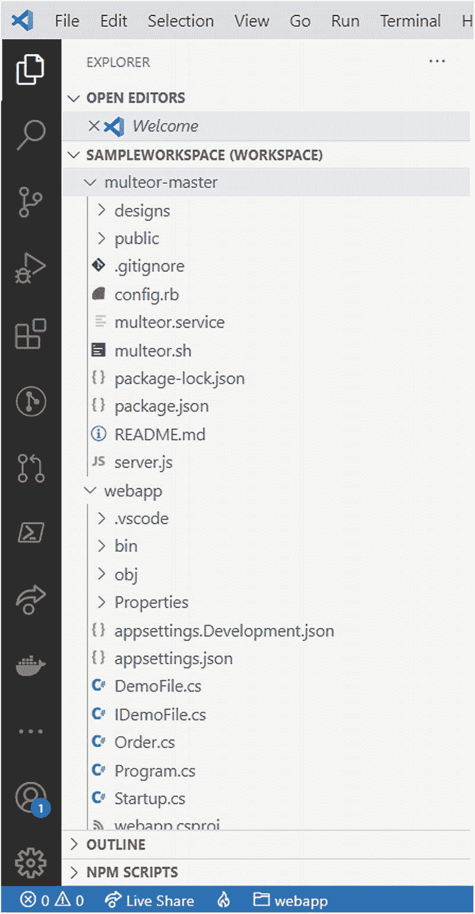

# 四、使用文件和文件夹

作为功能强大的编辑器，VSCode 提供了一种处理包含松散文件和项目的代码文件和文件夹的便捷方式。在本章中，你将学习如何处理单个文件、包含源代码文件的文件夹以及工作区。您还将了解 VS Code 独立于专有项目系统，以及它对一些流行项目类型的内置支持。

## VSCode 和项目系统

VSCode 是基于文件和文件夹的。这意味着您可以单独打开一个或多个代码文件，但也意味着您可以打开一个包含源代码文件的文件夹，并以结构化、有组织的方式处理它们。当您打开文件夹时，VSCode 会搜索下列文件之一，以组织文件夹中文件列表的结构化视图:

*   Tsconfig.json 文件

*   Jsconfig.json

*   Package.json

*   Project.json

*   。和的 sln Visual Studio 解决方案。的 csproj 项目文件。安装了 C#扩展的. NET

如果 VS 代码找到了这些文件中的一个，它就能够将文件结构组织成一种方便的编辑体验，并且可以提供额外的丰富的编辑功能，比如智能感知和代码重构。如果一个文件夹只包含源代码文件，没有任何上述内容。json 或者。sln 文件，它仍然会打开并显示该文件夹中的所有源代码文件，提供了一种在所有源代码文件之间切换的便捷方式。本章描述如何在 VSCode 中使用单个文件和文件夹，有关它如何管理项目的更多详细信息将在“使用文件夹和项目”小节中提供

## 使用单个文件

开始编辑 VSCode 的最简单方法是使用一个代码文件。你可以用**文件** ➤ **打开**打开一个已有的支持的代码文件(macOS 上的 Ctrl+O 或⌘+O)。VSCode 自动检测代码文件的语言，并启用适当的编辑功能。此外，它还会检查市场上是否有针对所选语言的扩展，如果有，它会提供安装以改善编辑体验。当然，你当然可以通过按 Ctrl+Tab(或者 macOS 上的^+Tab)打开更多的文件，轻松地在文件之间切换。如图 4-1 所示，一个方便的弹出框显示了打开的文件列表；通过按 Ctrl+Tab，您可以浏览文件并在列表中的文件之间循环，当您释放这些键时，选定的文件将成为活动的编辑窗口。



图 4-1

在打开的编辑器之间快速导航

只需点击每个选项卡右上角的**关闭**按钮，或者使用**文件** ➤ **关闭编辑器**即可关闭编辑器。您也可以使用右上角选项中 **…** 快捷方式下的**关闭所有**命令快速关闭所有打开的编辑器。

Note

在 VSCode 术语中，通常将打开的文件称为*活动编辑器*或*打开的编辑器*。这是因为编辑器窗口不限于代码文件，还可以显示文档文件或提供其他类型文件(例如，图像和电子表格)内容的格式化预览。

### 创建文件

创建新文件有几种方法:

*   Via **文件** ➤ **新文件**

*   通过按 ctrl+n(MAC OS 上的⌘+N)

*   通过使用欢迎页面上的**新文件**快捷方式

*   当文件夹当前打开时，点击浏览器栏中的**新文件**按钮

默认情况下，新文件被视为纯文本文件。要更改新文件的语言，单击状态栏右上角微笑图标附近的**选择语言模式**项。在这种情况下，您将看到纯文本作为当前模式，因此单击它。如图 4-2 所示，你会看到一个支持语言的列表，你可以从中选择当前文件的新语言。您也可以开始键入语言名称来过滤列表。



图 4-2

为新文件选择语言

当您选择一种新语言时，**选择语言模式**项会用当前语言更新，编辑器会启用所选语言的支持功能，如语法着色、单词补全和代码片段。

显然，您可以更改任何打开的代码文件的语言，而不仅仅是新文件。

### 文件编码、行终止符和行浏览

VSCode 允许您为新文件和现有文件指定编码。新文件的默认编码是 UTF-8。您可以通过点击状态栏中的**选择编码**项来更改当前编码(在前面的图中，它用 UTF-8 表示，即当前编码)。首先要求你在**用编码**重新打开和**用编码**保存之间选择一个动作。单击第一个选项，会出现一个支持编码的长列表和一个搜索框，您可以在键入时过滤列表(参见图 4-3 )。



图 4-3

选择文件编码

类似地，您可以通过点击**选择行序列结束**项来更改行终止符(在前面的图中它由 CRLF 表示)。VSCode 支持 CRLF(回车和换行符)和 LF(换行符)，默认选择是 CRLF。在 Windows 上，默认序列是 CRLF，而在 macOS 和 Linux 上是 LF。您也可以通过点击**转到第**行项目，快速移动到一行代码，由状态栏中的行号/列组表示。这将打开一个搜索框，您可以在其中键入您想要转到的行号，并且在您键入时该行代码会立即突出显示(参见图 4-4 )。按 Enter 键时，光标会移动到选定行的开头。



图 4-4

快速移动到特定代码行用 ***转到行***

## 使用文件夹和项目

与其他开发环境(如 Microsoft Visual Studio)不同，VSCode 是基于文件夹的，而不是基于项目的。这使得 VSCode 独立于专有的项目系统。VS 代码可以打开磁盘上包含多个代码文件的文件夹，并在环境中以最佳方式组织它们，它还支持各种项目文件。更具体地说，当您打开一个文件夹时，VS 代码首先搜索以下内容:

*   *MSBuild 解决方案文件(。sln)* :在这种情况下，VS 代码期望找到一个由 C#项目构成的. NET 核心解决方案，所以扫描引用的项目(*。csproj 文件)并以适当的方式组织文件和子文件夹。请记住，VS 代码需要安装 Microsoft C#扩展来正确处理解决方案文件。注意 VS 代码可以打开任何。sln 解决方案，但目前仅提供对的全面支持.NET 核心。这种情况的一个例子将在第八章中提供。

*   *tsconfig.json 文件*:如果找到了，VS Code 知道这些代表了 TypeScript 项目的根，所以它扫描被引用的文件并提供正确的文件和文件夹表示。

*   jsconfig.json 文件:如果找到了，VS 代码知道这些代表了一个 JavaScript 项目的根。因此，类似于 TypeScript，它扫描引用的文件并提供正确的文件和文件夹表示。

*   *package.json 文件*:这些文件通常包含在 JavaScript 项目和.NET 核心项目，所以 VS 代码会根据文件夹的内容自动解析项目类型。

*   *project.json 文件*:如果找到，VS 代码会把这个文件夹当作一个. NET 核心项目。

Note

打开一个. sln，。csproj 或。json 文件将直接导致编辑单个文件的内容。因此，您必须打开文件夹，而不是解决方案或项目文件。

额外的项目系统可以通过可扩展性来支持。如果找不到任何受支持的项目，VSCode 会将文件夹中的所有代码文件作为松散的组合加载，将它们组织到一个虚拟文件夹中，以便于导航。现在让我们通过相应的示例来探索如何在 VSCode 中使用文件夹和支持的项目。

### 打开文件夹

您可以通过**文件** ➤ **打开文件夹**或通过欢迎页面上的**打开文件夹**快捷方式打开文件夹。您还可以将文件夹名称从 Windows 资源管理器或 macOS Finder 拖放到 VSCode 中。

Note

在 Windows 上，VS 代码安装程序还提供了一个选项，当您在文件资源管理器中右键单击文件夹或文件名时，可以启用一个名为**的快捷方式，用代码**打开。

无论您打开哪个文件夹，VS Code 都会在浏览器栏中创建一个结构化视图，其中显示属于主文件夹的所有文件和子文件夹。图 4-5 显示了一个基于 TypeScript 项目的例子。


图 4-5

资源管理器中文件和文件夹的结构化视图

根容器是文件夹名称。嵌套您可以看到文件和子文件夹，您可以展开每个子文件夹来浏览它包含的每个文件。只需点击一个文件打开一个编辑器窗口。

### 正在打开。网络解决方案

当您打开包含基于 MSBuild 项目系统的. NET 解决方案的文件夹时。sln 文件)或 C#项目(。csproj 文件)，VSCode 将所有代码文件组织到浏览器栏中，并启用 C#的所有可用编辑功能。图 4-6 显示了一个例子。



图 4-6

a.NET 解决方案在 VSCode 中打开

请注意，资源管理器中的根级别是项目名称。您可以浏览文件夹、浏览代码文件以及编辑 VSCode 可以正确识别的任何内容。值得一提的是，VS 代码当然可以打开任何 MSBuild 解决方案，不仅仅是.NET 核心解决方案，但它只能运行和调试.NET 核心应用，而不是.NET 框架解决方案。例如，最新版本的.NET Core 允许创建 Windows 演示基础(WPF)和 Windows 窗体项目；VSCode 和 C#扩展支持打开这种类型的解决方案以及运行和调试代码。为创建的 WPF 和 Windows 窗体项目.NET Framework 仍然可以在 VS 代码中打开，您仍然可以从浏览器栏中的结构化文件夹视图和完整的 C#语言支持中受益，但您将无法构建、运行和调试代码。相反，用.NET Core 还集成了调试支持，允许直接在 VS 代码中运行、调试和测试代码。这将在第九章中讨论。

### 打开 JavaScript 和 TypeScript 项目

类似于.NET 核心解决方案，VSCode 可以通过搜索 jsconfig.json 或 package.json 文件来管理 JavaScript 文件夹。如果找到，代码以适当的方式组织文件夹和文件的列表，并为它支持的所有文件启用所有可用的编辑功能，如图 4-7 所示。



图 4-7

在 VSCode 中打开的 JavaScript 项目

TypeScript 项目的行为与 JavaScript 的行为相同，只是 VSCode 搜索名为 tsconfig.json 的文件作为根。

### 打开松散的文件夹

VSCode 支持打开包含不相关的松散文件组合的文件夹。VS 代码基于文件夹名创建一个逻辑根目录，显示文件和子文件夹。图 4-8 显示了一个基于名为 MyFiles 的示例文件夹的示例，该文件夹包含不同语言的文件。



图 4-8

包含各种松散文件的文件夹

有了这个选项，您基本上可以在 VS 代码中打开任何文件夹并编辑所有支持的文件，利用每个文件单独的代码编辑特性。

## 使用工作空间

VSCode 有一个*工作空间*的概念。工作区可以被认为是文件夹的逻辑容器。

Note

如果您有使用 Microsoft Visual Studio 的经验，可以将 VSCode 中的工作区比作作为项目容器的 Visual Studio 解决方案。

工作区对于将多个项目和/或文件夹组织到一个地方非常有用。例如，您可能有一个. NET 核心 Web API 项目、一个使用此类 API 的 JavaScript 应用和一个包含文档的文件夹。您可以将它们放在同一个工作区中，并同时在 VSCode 中使用它们，而不是分别处理每个文件夹。图 4-9 显示了一个名为 SampleWorkspace 的工作区，它包括一个. NET 核心 Web API 项目、一个 JavaScript 项目和一个松散文件夹。



图 4-9

一个工作区可以将多个项目和文件夹分组到一个逻辑容器中

multeor-master 文件夹包含一个名为 multeor 的示例开源项目的文件，您可以从 [`https://github.com/filidorwiese/multeor`](https://github.com/filidorwiese/multeor) 下载用于教学目的。浏览器栏用大写字母显示了工作区的名称和**(工作区)**文字，这样更容易识别。在接下来的部分中，我将更详细地解释如何创建和打开工作区，以及工作区文件的结构是什么。

### 创建工作区

无论是否已经打开了文件夹，您都可以创建工作区。如果你已经打开了一个文件夹，选择**文件** ➤ **将工作区另存为**，VS Code 会要求你为新的工作区指定位置和文件名。一个工作区由一个 JSON 文件来表示。代码工作空间扩展，它的结构将很快解释。

工作区名称只是没有。codeworkspace 扩展，并显示在浏览器栏中(参见图 4-9 )。然后您可以通过选择**文件** ➤ **将文件夹添加到工作区**来将其他文件夹添加到工作区。添加的文件夹显示在工作区根目录下的浏览器栏中。

如果您还没有打开任何文件夹，您可以从**文件** ➤ **将工作区另存为**开始，或者从**文件** ➤ **将文件夹添加到工作区**开始。对于第一个选项，基本上是创建一个带有名称的空工作区，然后按照前面的描述添加文件夹。使用第二个选项，您可以从现有文件夹开始创建一个空的、无标题的工作区。在这种情况下，实际上，浏览器栏显示 **UNTITLED (WORKSPACE)** 作为新的工作空间名称。当您按照上文所述保存工作区时，浏览器栏会显示基于工作区文件名的新名称。请记住，工作区只是逻辑容器，不会以任何方式影响项目和文件夹的结构或行为。

Note

添加到工作区的文件夹可以在磁盘上的任何位置；VSCode 会将它们的内容分组到工作区根目录下，让您可以像在同一位置一样工作。

### 打开现有工作区

您可以通过**文件** ➤ **打开工作区**打开一个已有的工作区。您还可以将工作区文件名从操作系统的文件浏览程序拖放到 VSCode 图面上。直接打开. code-workspace 文件只会导致查看文件内容，而不会打开工作区。同样，打开包含. code-workspace 文件的文件夹会导致只打开文件夹，而不是工作区。您只能使用本段开头描述的特定命令。

### 工作空间结构

VSCode 工作区的信息存储在扩展名为. code-workspace 的文件中。工作空间文件是一个 JSON 文件，其根元素叫做`folders`。这是一个由`path`元素组成的数组，每个元素都被赋予一个包含在工作区中的文件夹的名称。以下 JSON 标记表示图 4-9 中所示示例的工作空间文件在我的机器上的外观，并且在您的计算机上会有所不同:

```sh
{
    "folders": [
        {
            "path": ".\MyFiles"
        },
        {
            "path": "C:\\Source\\webapp"
        },
        {
            "path": "C:\\Source\\multeor-master"
        }
    ]
}

```

请注意，只有当文件夹不在工作区文件的相同位置时，才会提供文件夹的完整路径名。在这种情况下。代码工作区文件、webapp 文件夹和 multeor-master 文件夹都在同一位置；相反，MyFiles 文件夹位于不同的文件夹下。如果您想亲自查看工作区文件的结构，您可以通过**文件** ➤ **打开文件**在 VSCode 中打开它。

## 摘要

VSCode 基于文件和文件夹，它允许处理单个文件以及包含源代码文件的文件夹，并以结构化、有组织的方式处理它们。

VSCode 还支持许多项目系统，如.NET Core、TypeScript 和 JavaScript，它允许创建和管理工作区。工作区是文件夹的逻辑容器，使得在同一个可视根目录下拥有多个项目和文件夹变得容易。VS Code 不仅是一个非常强大的代码编辑器，而且是一个非常灵活的环境，可以通过多种方式进行定制。定制是下一章的主题。