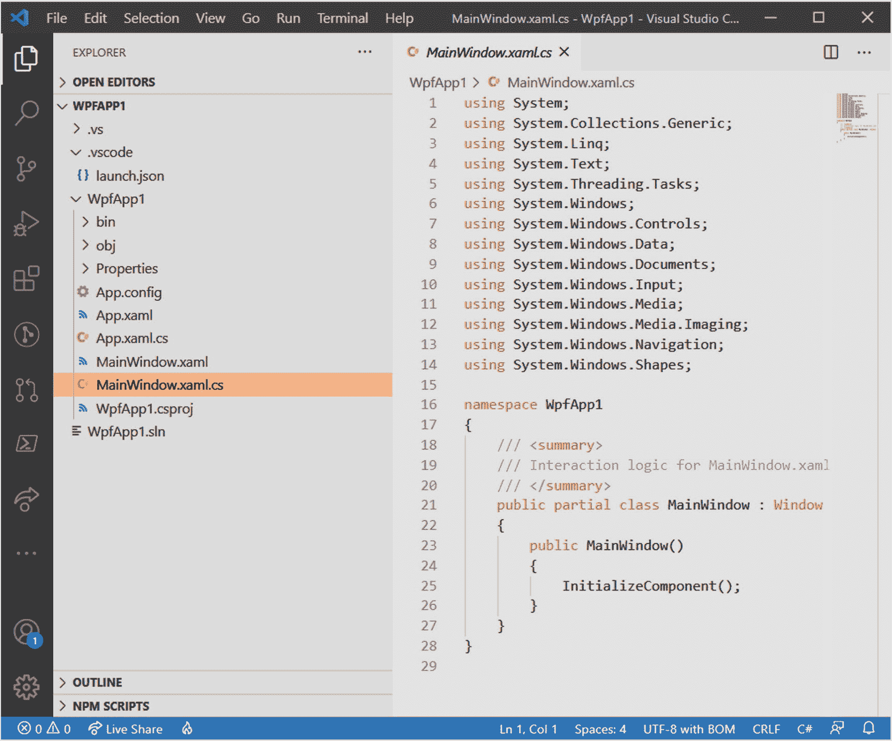
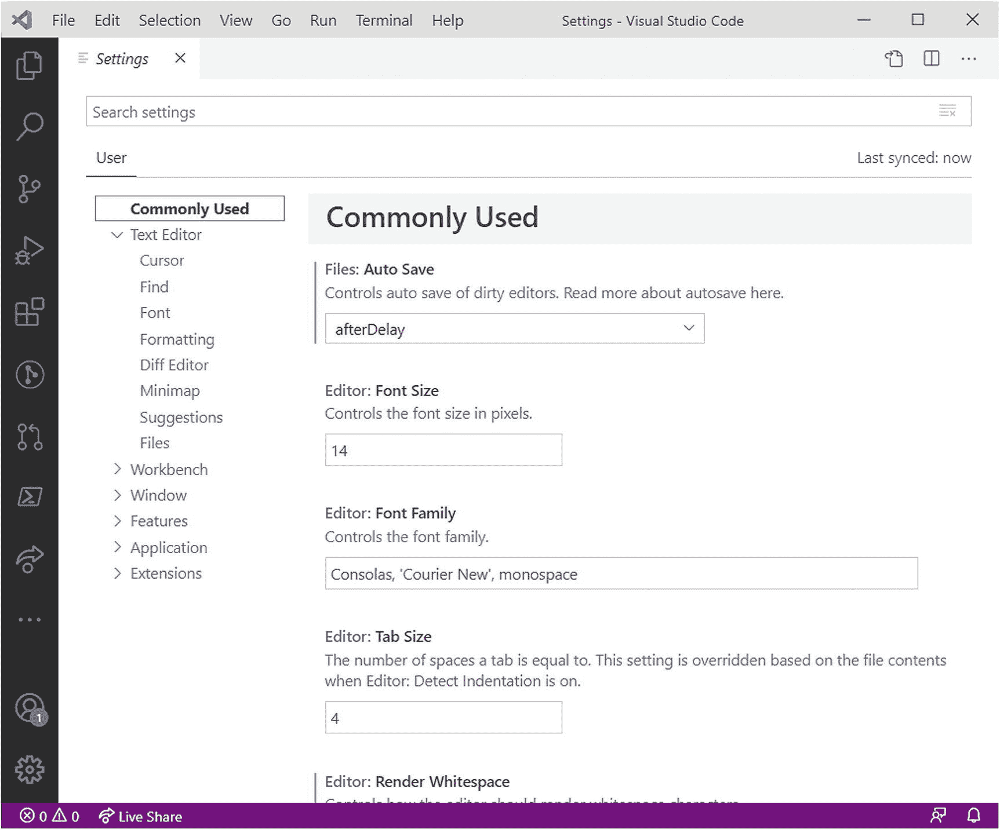
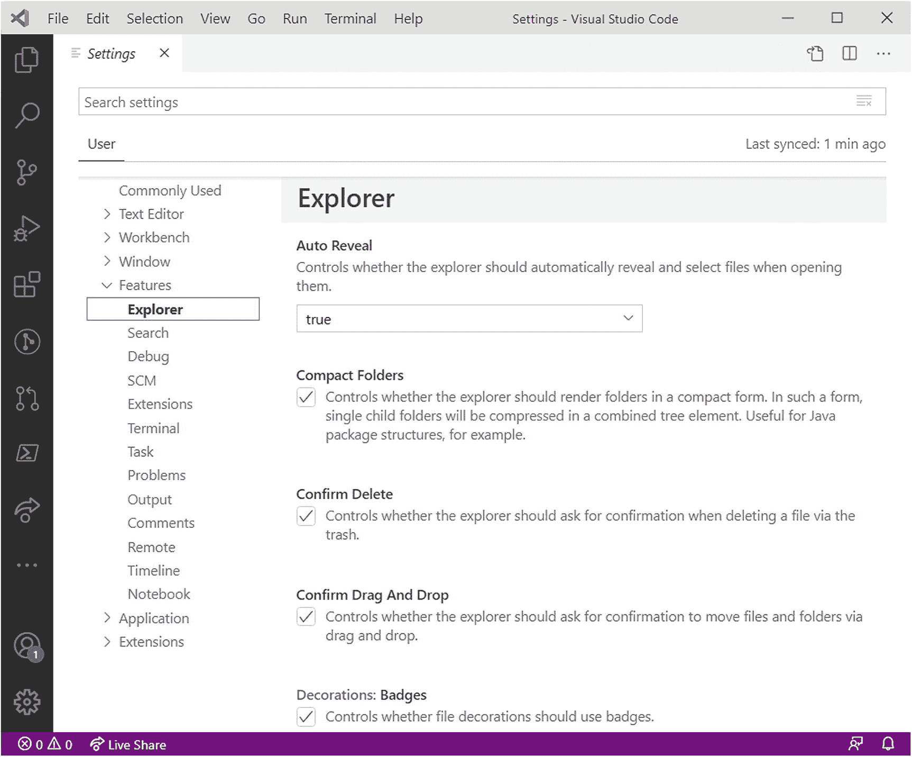
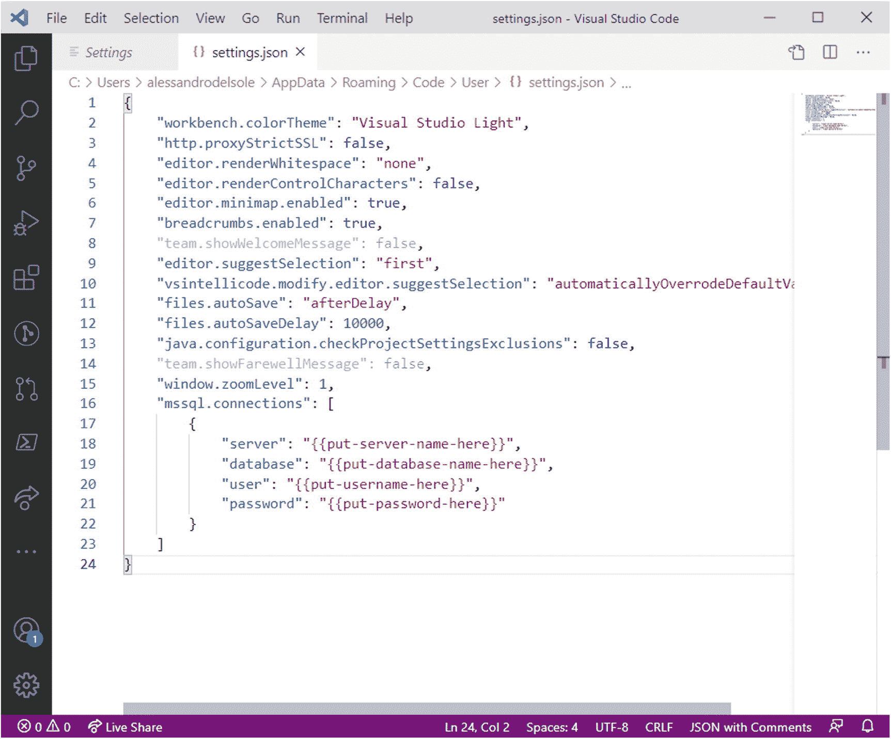
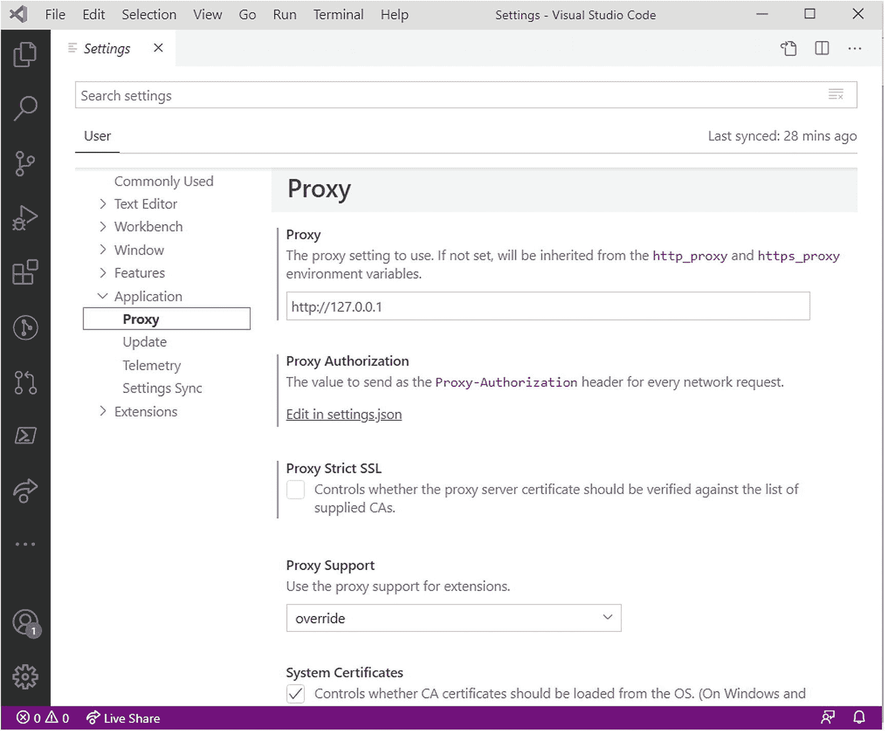
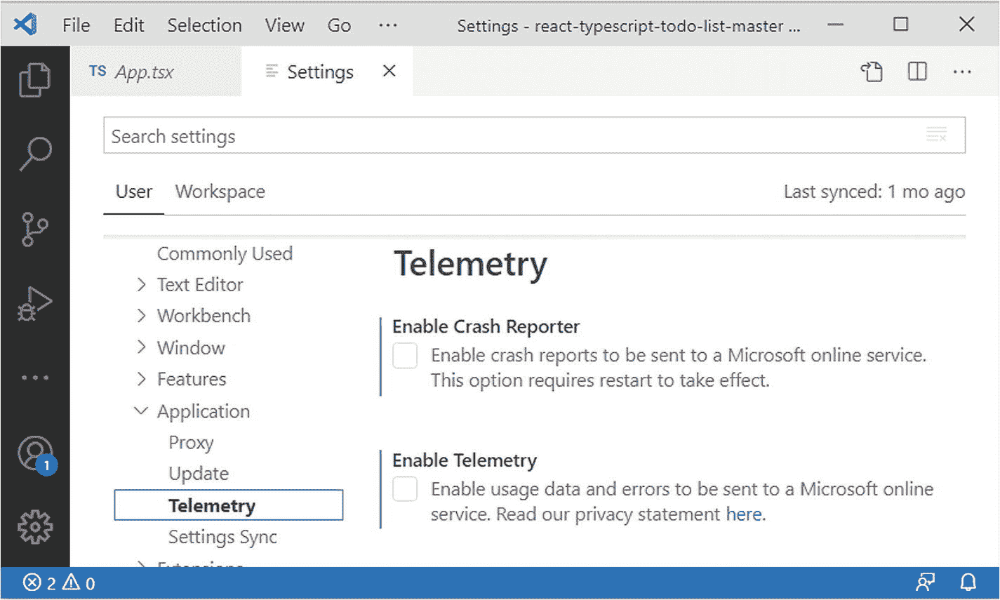
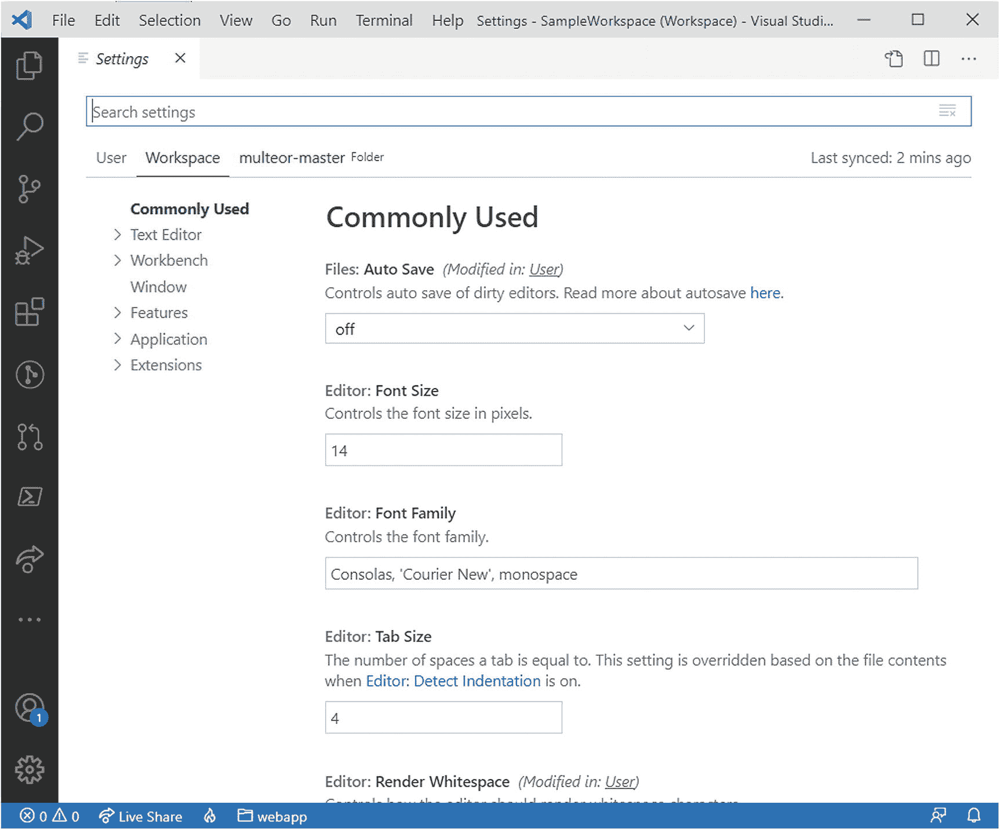
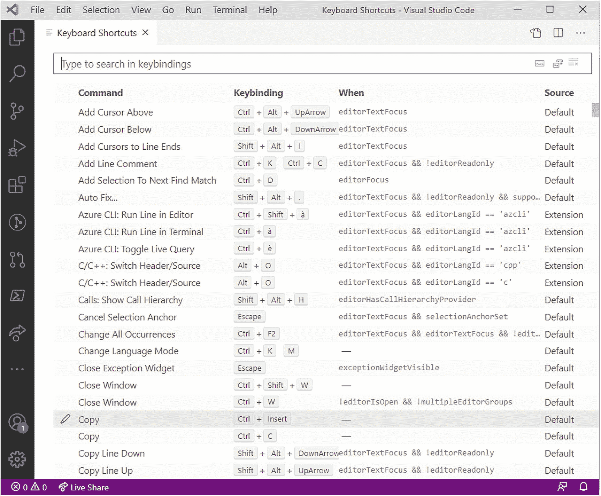
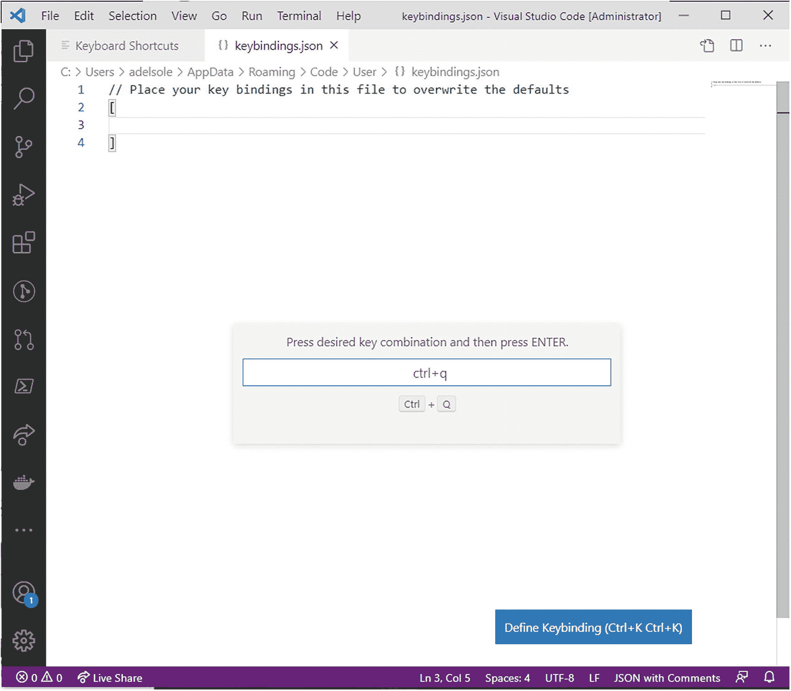
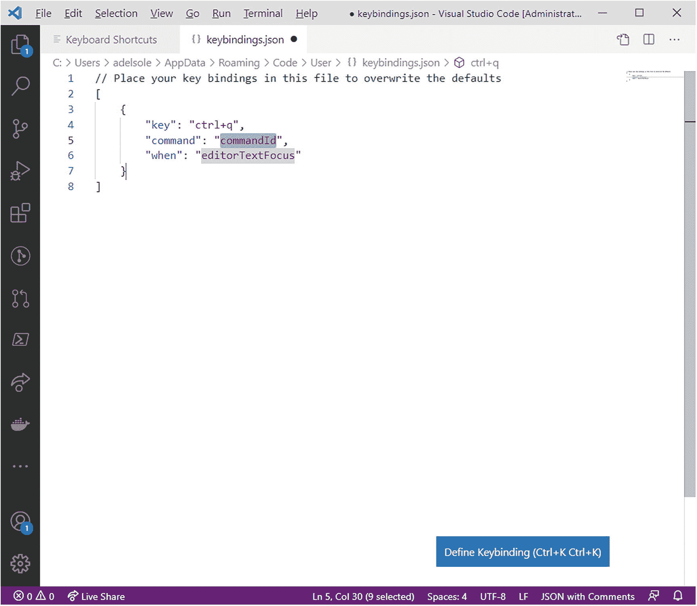

# 五、自定义 Visual Studio Code

Visual Studio Code是一个非常通用的开发工具，可以通过多种方式进行自定义和扩展。事实上，您可以自定义它的外观、代码编辑器和快捷键，使您的编辑体验变得非常个性化。

此外，您可以安装第三方扩展，如新语言、调试器、主题、linters 和代码片段。本章解释如何自定义 Visual Studio Code，解释自定义和扩展之间的区别。然后，在下一章，你将学习如何使用扩展。

## 解释了定制和扩展

您可以通过自定义和扩展来个性化 Visual Studio Code的环境。不同之处在于，扩展添加了新的工具，或者它们向工具添加了功能，或者改变了现有功能的行为。为默认情况下没有智能感知的语言实现智能感知、向状态栏添加命令以及添加自定义调试器都是扩展的示例。

相反，自定义与环境设置相关，并不为工具添加功能。常见的自定义示例有颜色主题和按键绑定。表 [5-1](#Tab1) 总结了 VS 代码中的定制和扩展。

表 5-1

自定义和扩展

<colgroup><col class="tcol1 align-left"> <col class="tcol2 align-left"> <col class="tcol3 align-left"></colgroup> 
| 

特征

 | 

描述

 | 

类型

 |
| --- | --- | --- |
| 颜色主题 | 用不同的颜色设计环境布局。 | 用户化 |
| 用户和工作区设置 | 指定环境首选项。 | 用户化 |
| 按键绑定 | 重新定义键盘快捷键。 | 用户化 |
| 语言语法和语法着色程序 | 使用语法着色程序添加对其他语言的支持。 | 用户化 |
| 代码片段 | 添加 TextMate 和 Sublime 文本片段，更快地键入重复代码。 | 用户化 |
| 调试器 | 为特定的语言和平台添加新的调试器。 | 延长 |
| 语言服务器 | 为在 VS 代码中打开的文件实现您的验证逻辑。 | 延长 |
| 激活 | 当检测到特定文件类型或在命令选项板中选择命令时，加载扩展名。 | 延长 |
| 编者ˌ编辑 | 处理代码编辑器的内容，包括文本操作和选择。 | 延长 |
| 工作空间 | 增强状态栏、工作文件列表和其他工具。 | 延长 |
| 事件 | 与 VS 代码的生命周期事件交互，比如打开和关闭。 | 延长 |
| 进化编辑 | 使用 IntelliSense、查看定义、转到定义和所有支持的高级编辑功能来改进语言支持。 | 延长 |

在本章中，您将看到如何通过更改现有的首选项来自定义 Visual Studio Code。然后在下一章中，您将看到如何安装扩展，包括向开发环境添加新的定制的扩展，比如主题和键绑定。

## 自定义 Visual Studio Code

在本节中，您将发现通过浏览表 [5-1](#Tab1) 中描述的定制类型来定制 Visual Studio Code是多么容易。

### 主题选择

您可以在几个主题中进行选择，以赋予 Visual Studio Code不同的外观和感觉。在第 [1](01.html) 章的开始已经给出了颜色主题的简要介绍，但是现在你会得到更多的细节。

你可以用**文件** ➤ **偏好设置** ➤ **颜色主题**或者通过点击**设置**按钮然后**颜色主题**来选择颜色主题。可用颜色主题的列表显示在命令调色板中，如图 [5-1](#Fig1) 所示。


图 5-1

选择主题

主题分为浅色主题、深色主题和高对比度主题。一旦您选择了不同的颜色主题，它会立即应用。此外，当你用键盘滚动列表时，你可以预览主题。图 [5-2](#Fig2) 展示了应用于 VS 代码的黑暗(Visual Studio)主题，这是一个非常受欢迎的选择；尝试其他主题，找到适合自己的主题。



图 5-2

应用于 Visual Studio Code的黑暗(Visual Studio)主题

正如您所料，应用主题还会影响代码编辑器中使用的颜色，以便达到适当的亮度和对比度平衡。在下一章，你将看到如何安装额外的主题作为扩展。

### 定制环境

在大多数应用中，包括其他 ide，您可以通过一个方便的用户界面来设置环境设置和参数，VS 代码也不例外。有两种不同类型的设置:用户设置和工作空间设置。用户设置全局应用于开发环境，而工作区设置仅应用于当前项目或文件夹。以下小节涵盖了用户设置和工作区设置。

#### 了解用户设置

用户设置全局应用于 VS 代码的开发环境。通过选择**文件** ➤ **首选项** ➤ **设置**来完成定制用户设置。当你这样做时，设置编辑器出现，如图 [5-3](#Fig3) 所示。



图 5-3

使用用户设置

在编辑器的左侧，设置按类别分组。在**搜索设置**栏中，你可以根据你输入的内容快速搜索设置，还可以看到找到的设置总数，这取决于 VS 代码的版本和你安装的扩展的数量。您可以手动展开设置类别，也可以滚动设置列表，相关类别会在您滚动时自动高亮显示。例如，您可以通过定位并选择**功能**类别下的**浏览器**来控制浏览器栏的行为，并在那里更改当前设置，如图 [5-4](#Fig4) 所示。



图 5-4

更改用户设置

类似地，您可以更改文本编辑器、整个应用和扩展设置的设置和首选项。事实上，允许定制参数的扩展将它们的设置存储在与 VS 代码相同的位置，这样你就有了一个独特的设置编辑器。有数百种设置，数量根据您的配置和安装的扩展而有所不同，因此不可能在此列出所有设置。有关可用设置的更多详细信息，请访问官方文档( [`https://code.visualstudio.com/docs/getstarted/settings`](https://code.visualstudio.com/docs/getstarted/settings) )。

##### 幕后:settings.json 文件

在后台，VS 代码(和扩展)将设置存储在一个名为 settings.json 的文件中。

了解该文件的工作原理很重要，因此单击位于搜索栏上方的**打开设置(JSON)** 按钮，该按钮由一个带有加号的表单图标表示(从左到右第一个)。图 [5-5](#Fig5) 显示了编辑器此时的样子。



图 5-5

使用 settings.json 文件

如您所见，settings.json 的编辑器允许您通过覆盖一个或多个默认设置来定义自定义设置。值得一提的是，您在这个文件中所做的更改只是在用户或工作区级别，并不影响 VS 代码的一般设置。图 [5-5](#Fig5) 显示了如何更改主题、如何控制白色字符、如何在代码编辑器中控制字符和面包屑以及如何启用小地图模式的示例。此外，您将看到 IntelliSense 如何在您键入时帮助您在可用设置中进行选择。代码编辑器还会报告错误，比如缺少逗号或花括号，这是您在编辑 JSON 文件时会想到的。在图 [5-5](#Fig5) 中，您还可以看到为扩展定制设置是可能的:我的机器上安装了 Microsoft SQL Server 扩展，settings.json 允许指定扩展设置，如服务器地址和凭证。每次在用户界面中修改设置时，settings.json 中的相关 JSON 都会更新。

IntelliSense 还允许您通过单击鼠标悬停来获取有关给定设置的更多信息，鼠标悬停会通过方便的工具提示显示有关设置的提示，正如您在第 [3](03.html) 章中了解 IntelliSense 功能后所期望的那样。完成后，不要忘记保存 settings.json 否则您的更改将会丢失。

##### 一个真实的例子:使用代理

如果你为企业工作，网络可能在代理服务器后面。在这种情况下，您或系统管理员可能需要配置 Visual Studio Code来使用代理。否则，您将无法下载软件包、扩展和产品更新。Visual Studio Code应该自动检测代理并询问您的凭据，但这并不总是发生，因此您可能需要采取一些手动步骤。

首先要做的是确保表 [5-2](#Tab2) 中描述的站点在防火墙的允许应用列表中。

表 5-2

防火墙允许的站点

<colgroup><col class="tcol1 align-left"> <col class="tcol2 align-left"></colgroup> 
| 

统一资源定位器

 | 

描述

 |
| --- | --- |
| update.code.visualstudio.com | Visual Studio Code下载和更新服务器 |
| code.visualstudio.com | Visual Studio Code文档 |
| go.microsoft.com | Microsoft 链接转发服务 |
| vscode.blob.core.windows.net | Visual Studio Code的 Blob 存储 |
| marketplace.visualstudio.com | Visual Studio 市场 |
| *.gallery.vsassets.io | Visual Studio 市场 |
| * . gallerrycdn . vsassets . io .中 | Visual Studio 市场 |
| rink.hockeyapp.net | 崩溃报告服务 |
| bingsettingssearch.trafficmanager.net | 产品内设置搜索 |
| vscode.search.windows.net | 产品内设置搜索 |
| raw.githubusercontent.com | GitHub 存储库原始文件访问 |
| vsmarketplacebadge.apphb.com | Visual Studio 市场徽章服务 |
| az764295.vo.msecnd.net | 用于 Visual Studio Code下载的内容交付网络(CDN) |
| download.visualstudio.microsoft.com | Visual Studio 下载服务，包括对 C#和 C++等扩展的依赖 |

下一步是配置 VS 代码来使用代理。实际上，如果已经在系统级定义了`http_proxy`和`https_proxy`环境变量，VS 代码就会使用它们的值。如果没有设置这些变量，您必须在用户设置中提供代理地址。在设置编辑器中，在**应用**类别下找到**代理**。然后，如图 [5-6](#Fig6) 所示，在**代理**文本框中输入代理地址。



图 5-6

配置 VS 代码在代理服务器后面工作

如果您的代理还需要授权头，这必须在 settings.json 文件中指定，因此您必须单击 settings.json 中的**编辑**超链接，然后输入网络管理员提供的值作为`http.proxyAuthorization`键的值。此外，如果证书应根据提供的证书颁发机构列表进行验证，请选中**代理严格 SSL** 复选框。

保存您的更改并检查 Visual Studio Code是否能够下载某些语言所需的扩展、包和库以及产品更新。如果您仍然遇到网络问题，您应该请网络管理员帮助您配置代理设置。

Note

一些保护程序(如 Symantec Endpoint Protection)会阻止一些 Visual Studio Code安装(和更新)文件，因为它们被识别为 CryptoLocker 病毒实例。显然，这些都是误报，但是您可能需要与网络管理员联系，以查看 Visual Studio Code的保护规则。

##### 隐私设置:遥测

默认情况下，Visual Studio Code匿名收集并向 Microsoft 发送有关使用、错误和崩溃的信息。您可以通过将用户设置滚动到位于**应用**类别下的**遥测**组来禁用这些遥测设置中的一个或多个(参见图 [5-7](#Fig7) )。



图 5-7

在 Visual Studio Code中管理遥测

**启用崩溃报告器**选项允许向微软发送崩溃报告，而**启用遥测**允许发送使用数据和错误。隐私策略的快捷方式也是可用的，我建议您在启用一个或两个选项之前阅读它。

##### 同步设置

在第 [1](01.html) 章中，您了解到 Visual Studio Code允许跨不同安装同步设置。通过**应用**类别下的**设置同步**组，您可以完全控制可以同步的项目。

您可以决定同步哪些扩展，不同步哪些扩展，可以从同步中排除特定设置，还可以禁用或重新启用键绑定同步。除了后者(通过一个简单的复选框管理)之外，您需要在 settings.json 文件中进行更改。**忽略的扩展**和**忽略的设置**超链接使您能够分别编辑关于扩展和常规设置的特定设置块。如前所述，IntelliSense 将帮助添加可用设置。图 [5-8](#Fig8) 显示了一个例子，但是请记住，可用的设置可能在您的机器上有所不同，尤其是取决于您已经安装的扩展。


图 5-8

IntelliSense 帮助管理同步设置

#### 了解工作空间设置

与全局应用于 VS 代码环境的用户设置不同，工作区设置应用于当前工作区和工作区中的文件夹。这意味着，您首先需要打开一个现有的工作区，或者将一个现有的文件夹添加到一个新的工作区，以定制工作区设置。

接下来你仍然选择**文件** ➤ **偏好设置** ➤ **设置**。此时，设置编辑器显示三个选项卡:一个用于用户设置，一个用于工作区设置，一个用于工作区内的单个文件夹，如图 [5-9](#Fig9) 所示。



图 5-9

自定义工作区设置

您可以像自定义用户设置一样自定义工作区和文件夹设置，因此在设置编辑器中不仅有第二个视图，还有另外两个 JSON 文件，您可以在其中指定您的首选项。更具体地说，工作区设置存储在。code-workspace 文件(可以在资源管理器中看到)，而文件夹设置存储在 settings.json 文件中。那个。code-workspace 文件保存在 workspace 文件夹下，settings.json 保存在。Visual Studio Code在打开的文件夹中创建的 vscode 子文件夹，将设置的可用性限制为仅在当前文件夹中可用。

### 自定义键盘快捷键

Visual Studio Code包括大量的键盘快捷键，您可以用自定义值重写这些快捷键。如果您习惯于使用其他开发工具，并且希望在 Visual Studio Code中使用相同的键盘快捷键，这将非常有用。

Note

在下一章，你将学习如何下载现成的键盘快捷键，这将节省你很多时间，但首先重要的是你要知道他们实际上是如何工作的。

像用户和工作区设置一样，键盘快捷键用 JSON 标记表示，每个快捷键由两个元素组成:`key`，它存储一个或多个与动作相关联的键，以及`command`，它表示要调用的动作。在某些情况下，VS 代码可能为不同的场景提供相同的快捷方式。这是 Esc 键的典型情况，它针对许多操作，具体取决于您正在处理的内容，如代码编辑器或工具窗口。为了识别正确的动作，键盘快捷键设置支持 **when** 元素，该元素根据上下文指定正确的动作。选择**文件** ➤ **首选项** ➤ **键盘快捷键**可以快速获得当前键盘快捷键列表。此时，Visual Studio Code显示了一个格式良好的命令和快捷键列表，如图 [5-10](#Fig10) 所示。



图 5-10

当前键盘快捷键列表

要自定义键盘快捷键，您只需点击位于窗口右上角的**打开键盘快捷键**按钮，该按钮由一个带有加号的工作表图标表示。这将打开 keybindings.json 文件，在这里您可以用自定义快捷键覆盖默认快捷键(参见图 [5-11](#Fig11) )。



图 5-11

添加键盘快捷键

Note

请记住，Visual Studio Code有(并允许自定义)不同的默认键盘快捷键，这取决于它运行的操作系统。

您可以通过点击 **Define Keybinding** 按钮或使用按钮文本中建议的快捷键(因您的操作系统而异)来快速添加自定义键盘快捷键。当你这样做时，会出现一个弹出框，要求你指定键盘快捷键，如图 [5-11](#Fig11) 所示。

当你按回车键时，新键盘快捷键的 JSON 标记被添加，如图 [5-12](#Fig12) 所示。



图 5-12

编辑新的键盘快捷键

您需要使用您想要映射的命令以及针对哪个场景来编辑`command`和`when`元素。此外，当手动编辑 keybindings.json 时，您需要为旧的快捷方式和新的快捷方式提供标记。例如，假设您想用 Shift+Alt+O 替换 C/C++扩展的 Alt+O 快捷方式(开关:头/源)，您需要编写的标记如下所示:

```sh
{
    "key": "shift+alt+o",
    "command": "C_Cpp.SwitchHeaderSource",
    "when": "editorTextFocus && editorLangId == 'cpp'"
},
{
    "key": "alt+o",
    "command": "-C_Cpp.SwitchHeaderSource",
    "when": "editorTextFocus && editorLangId == 'cpp'"
}

```

实际上，`when`元素是可选的。将更改保存到 keybindings.json 文件，以准备好新的键盘快捷键。

## 摘要

Visual Studio Code使您能够进行多种自定义，这将有助于您感觉宾至如归，尤其是如果您习惯于使用其他开发工具或代码编辑器。您可以从列表中选择不同的颜色主题，可以自定义全局或特定文件夹的环境设置，甚至可以创建自定义键盘快捷键。

但非常好的消息是，定制也可以作为扩展下载，以及新的语言、调试器和工具。扩展性将在下一章讨论。