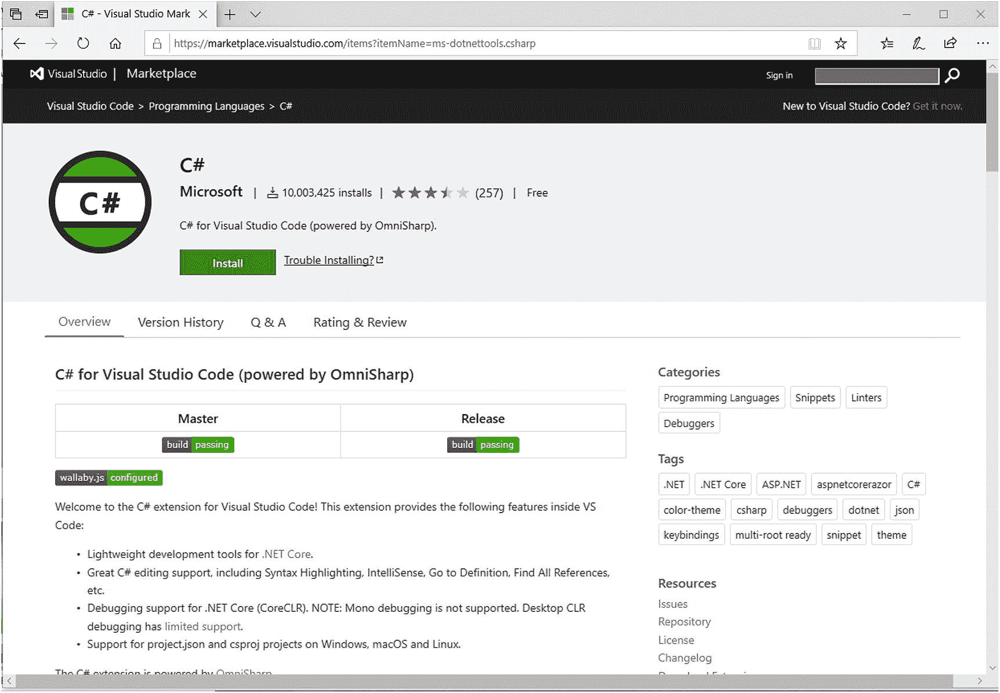
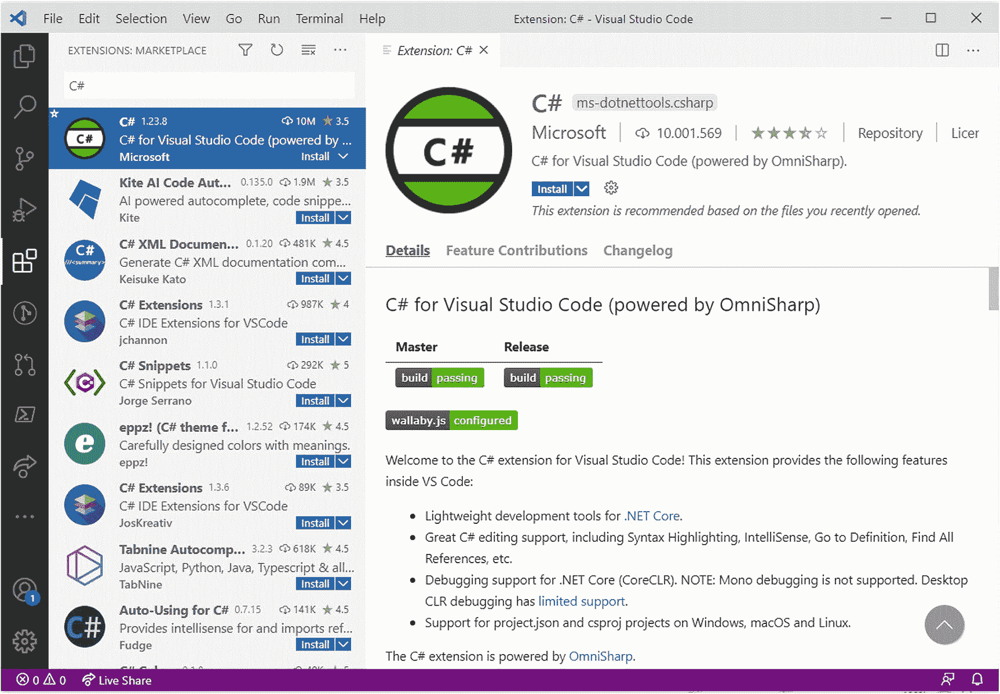
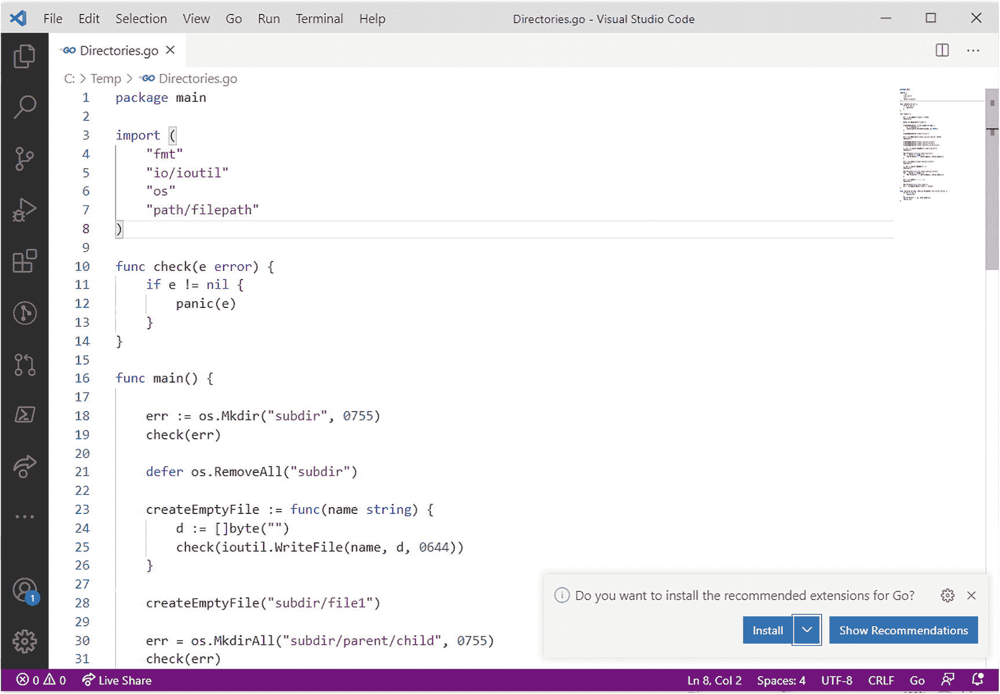
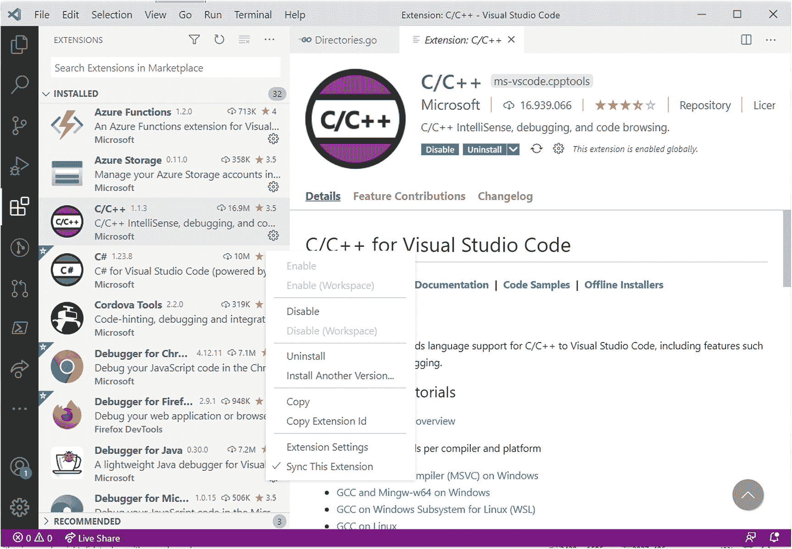
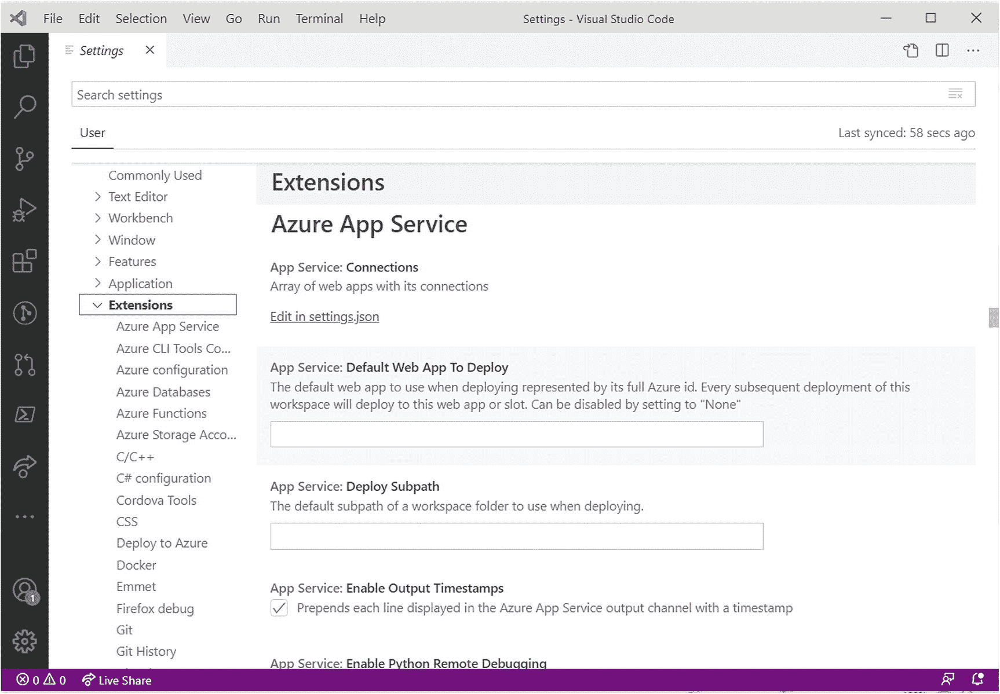
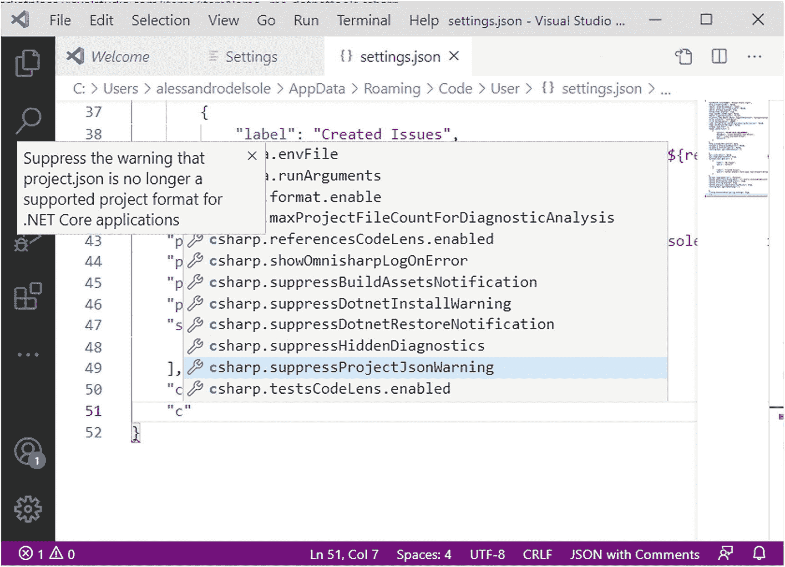

# 六、安装和管理扩展

扩展性是 Visual Studio Code中的关键功能之一，因为您可以添加工具、语言、代码段、调试器、键绑定和主题。扩展性在语言领域尤其有益，因为 Visual Studio Code使您能够使用特定的语法支持来扩展代码编辑器，这些语法支持还可以包括 IntelliSense、代码段和代码重构。

这一切都意味着 Visual Studio Code对任何平台上的任何语言和任何工具都有开放的支持，为无限的开发场景提供了可能性。本章解释了如何查找和安装扩展，以及如何在您的系统上管理扩展。

## 安装扩展

您有两种浏览和安装扩展的方式:从 Visual Studio 市场和从 Visual Studio Code中。Visual Studio Marketplace 是一个包含最流行的 Microsoft 开发工具和服务的扩展的网站，如 Visual Studio、Visual Studio Code 和 Azure DevOps。在 [`https://marketplace.visualstudio.com`](https://marketplace.visualstudio.com) 有，需要点击 Visual Studio Code标签才能看到 Visual Studio Code的扩展列表。图 61 显示了 Visual Studio Code的市场。

图 6-1

Visual Studio 市场

您可以通过在搜索框中键入内容来搜索扩展，也可以浏览下面的组，如“特色”、“趋势”、“最受欢迎”和“最近添加的”。如果您滚动到页面底部，还可以按类别或集合浏览扩展。找到您感兴趣的扩展后，单击其名称可查看详细页面。图 [6-2](#Fig2) 显示了一个基于微软 C#扩展的例子。

图 6-2

扩展的详细信息页面

扩展的页面提供了关于使用扩展的详细描述和指导，通常提供到附加文档、资源和源代码(如果是开源的)的链接。我强烈建议您阅读详细信息页，以获得有关该扩展包括哪些内容的信息，尤其是添加了语言支持的扩展，因为了解是只支持新语法还是还支持 IntelliSense、代码片段和调试非常重要。

如果你点击**安装**按钮，你的浏览器会要求你确认打开 Visual Studio Code的下载链接。当这开始时，扩展将被自动安装。您也可以下载扩展的离线安装程序，以便以后重用。为此，点击页面右侧**资源**组下的**下载扩展**超链接。这样，您将能够下载一个. vsix 安装程序文件，然后可以手动启动该文件。

Note

如果您有使用 Microsoft Visual Studio 开发环境的经验，您可能知道 VSIX 是 Microsoft 用于扩展安装程序文件的格式。但是，Visual Studio Code的 VSIX 格式并不相同。Visual Studio Code的扩展与一个名为 **vsce** 的工具打包在一起，不能与 Windows 上的 Visual Studio 2019 或 Mac 上的 Visual Studio 一起使用。

安装扩展的第二种方式是在 Visual Studio Code中。您可以打开扩展栏并搜索一个扩展，然后单击特定的扩展以获取详细信息，如图 [6-3](#Fig3) 所示。

图 6-3

从 Visual Studio Code中安装扩展

准备就绪后可以点击**安装**按钮。您需要点击 **Reload** 按钮(一旦安装完成就会出现)来启用 VS 代码中的扩展。您还可以筛选搜索结果；例如，如果在搜索框中键入 category:linters，Visual Studio Code将列出所有为特定语言提供语法着色的林挺支持的扩展。您可以使用在 Visual Studio 市场中看到的相同类别名称。

或者，您可以使用命令面板来下载(和管理)扩展。打开命令面板，输入`ext`，会出现一个与扩展管理相关的不言自明的命令列表。当您不想失去活动编辑器窗口的焦点时，您通常会更喜欢使用命令选项板中的扩展；否则，使用扩展栏的用户界面肯定更容易。

Note

许多扩展，尤其是提供完整语言支持的扩展，如 C#和 C/C++，依赖于调试器和库等附加工具。这些附加工具通常在您第一次使用该扩展时下载。例如，在 C#扩展的情况下，当您第一次创建或打开 C#文件时，会下载所需的工具和库。这些包括要支持的库.NET 核心调试和工具，通过智能感知和实时静态分析来改善编辑体验。此外，新下载的扩展可能需要一些初始配置。在这种情况下，将出现一个弹出框，解释您需要做些什么来开始。

### 扩展建议

Visual Studio Code可以根据您的活动提供有关推荐扩展的建议。当你打开扩展栏时，你会在已安装的扩展列表下看到一个名为**推荐的**的组。

推荐的扩展列表因您的活动而异，第一次使用 Visual Studio Code时可能为空。作为一种选择，Visual Studio Code可以根据您打开的文件建议扩展名。例如，假设您打开了一个用 Go 语言编写的代码文件，但是您还没有安装任何 Go 扩展。Visual Studio Code具有对 Go 语言语法的内置支持，因此编辑器提供了语法着色和基本的单词完成功能，但是您可能希望使用更丰富的编辑体验，包括代码段、代码导航和丰富的 IntelliSense 支持。在这种情况下，VS Code 会建议有一个扩展可以帮助你处理 Go 文件，并提供安装它，如图 [6-4](#Fig4) 所示。

图 6-4

基于当前文件的扩展建议

你可以点击**安装**，Visual Studio Code会自动安装它认为最合适的扩展，或者你可以点击**显示建议**查看可能的扩展列表。在这两种情况下，扩展栏都会打开，你会看到可用的推荐扩展列表，但是当你点击**安装**时，推荐的扩展已经在安装了。

### 有用的扩展

Visual Studio Marketplace 包含大量有用的扩展，但在日常工作中长时间使用 Visual Studio Code后，我个人推荐一组扩展。表 [6-1](#Tab1) 总结了这组有用的扩展。

表 6-1

Visual Studio Code的推荐扩展

<colgroup><col class="tcol1 align-left"> <col class="tcol2 align-left"> <col class="tcol3 align-left"></colgroup> 
| 

名字

 | 

描述

 | 

类型

 |
| --- | --- | --- |
| C# | C#完全语言支持 | 语言，调试器，编辑 |
| C/C++ | C 和 C++完全语言支持 | 语言，调试器，编辑 |
| 计算机编程语言 | Python 全语言支持 | 语言，调试器，编辑 |
| Java 的语言支持 | Java 全语言支持 | 语言，编辑 |
| SQL Server (mssql) | SQL Server 支持 | 语言，编辑，工具 |
| Chrome 调试器 | 使用 Chrome 浏览器调试 JavaScript | 调试器 |
| Java 调试器 | Java 调试支持 | 调试器 |
| Microsoft Edge 调试器 | 使用 Edge 浏览器调试 JavaScript | 调试器 |
| 科尔多瓦工具 | 使用 Apache Cordova 进行移动开发 | 编辑，工具 |
| 节点调试 | Node.js 的调试支持 | 调试器 |
| Visual Studio Keymap | 基于 Microsoft Visual Studio 的键盘快捷键 | 按键绑定 |
| 原子键盘映射 | 基于 Atom 的键盘快捷键 | 按键绑定 |
| 记事本++键盘映射 | 基于记事本++的键盘快捷键 | 按键绑定 |
| 码头工人 | Dockerfile 的语言支持 | 语言，编辑，工具 |
| vscode 图标 | 浏览器栏的彩色图标 | 工具 |
| 走吧 | 为 Visual Studio Code扩展 Git 集成特性 | 工具 |
| 管理员 | PowerShell 脚本支持 | 语言，编辑，工具 |
| 实时分享 | 协作式实时开发的扩展，与其他开发人员共享 VS 代码实例 | 工具 |

当您在项目和您选择的操作系统上使用 Visual Studio Code时，您将能够找到并微调有助于提高工作效率的扩展。

## 管理扩展

扩展栏允许您快速管理扩展。显示已安装的扩展列表，如图 [6-5](#Fig5) 所示。然后，对于每个扩展，带有齿轮图标的按钮会打开一个弹出菜单，其中包含禁用或卸载扩展的命令。

图 6-5

扩展管理快捷方式

也可以点击扩展名，详情页会显示**禁用**和**卸载**按钮。请注意，当您禁用或卸载一个扩展时，在大多数情况下，您需要单击一个名为 **Reload** (当扩展被禁用或卸载时出现)的按钮来刷新开发环境。值得一提的是，您可以通过点击**扩展**组顶部的 **…** 按钮并选择**视图**子菜单来更改扩展栏的默认视图(显示已安装的扩展列表)。然后，您可以在不同的选项中进行选择，例如查看流行的扩展、检查扩展更新以及从安装扩展。vsix 文件。

Note

命令选项板中还提供了扩展管理的快捷方式。

### 配置扩展

Visual Studio Code有一些选项，允许您控制扩展的全局行为。你可以在用户设置中的**扩展**组下看到这些选项，如图 [6-6](#Fig6) (基于我机器上安装的扩展列表，可能与你的不同)。

图 6-6

关于扩展管理的自定义选项

有详细的注释解释每个选项是关于什么的。每个扩展都允许在用户设置中定制自己的行为，也可以在众所周知的 settings.json 文件中进行编辑。例如，假设您安装了 C#扩展。如果你查看用户设置，你会发现一个名为 C#配置的组。如果您展开这个组，您将看到关于 C#扩展的选项的完整列表，其中包括代码编辑和扩展添加的工具的选项。图 [6-7](#Fig7) 显示了这些选项。

图 6-7

自定义扩展选项

如果您想改为编辑 settings.json 文件中的扩展设置，IntelliSense 将通过在您滚动列表时显示设置名称和带有设置说明的工具提示来简化您的工作。图 [6-8](#Fig8) 显示了一个例子，智能感知显示了 C#扩展的一些设置，用`csharp`文字标识。

图 6-8

在 settings.json 中自定义扩展选项

通常，扩展作者会提供详细的注释，解释选项是关于什么的，以便您更容易微调扩展行为，例如在 C#扩展的情况下。

## 关于扩展创作的提示

您可以为 Visual Studio Code构建扩展，并通过 Visual Studio 市场共享它们。您基本上可以构建任何类型的受支持的扩展，例如语言支持、编辑功能、主题、代码片段、调试器适配器和键绑定。您还需要在 Marketplace 上注册为发布者，这需要您拥有一个 Microsoft 帐户。

扩展通常是用 TypeScript 编写的，对于大多数扩展，您可以使用 Node.js 上的 Yeoman 工具之类的扩展生成器。如果您对扩展创作感兴趣，可以浏览一下官方文档( [`https://code.visualstudio.com/api`](https://code.visualstudio.com/api) )，其中提供了许多场景的示例和指导。

## 摘要

扩展性是 Visual Studio Code中的一个关键特性，因为它允许您为开发环境增加功能。扩展可以添加新的语言(有或没有丰富的编辑支持)、调试器、键盘快捷键、主题、代码片段和工具。您可以通过扩展栏或命令面板从 Visual Studio 市场或 Visual Studio Code中安装扩展。

Visual Studio Code还可以根据上下文提供扩展建议，例如当您打开一个用没有内置支持的语言编写的文件时。Visual Studio Code makes 还简化了扩展的管理，提供了禁用和卸载扩展的快捷方式以及通过用户设置文件配置扩展行为的能力。在下一章中，你将看到如何利用扩展将特性添加到 Visual Studio Code的另一个核心特性中，这使它比它的竞争对手前进了一步:Git 版本控制。