# 十、使用 Python 构建应用

Python 是一种非常流行和强大的编程语言，可用于开发任何类型的应用，对于构建数据科学和数据分析应用尤其有用。

Python 是一种解释性的、面向对象的编程语言，任何经验的开发人员都可以学习。本章描述 VSCode 如何支持构建和调试 Python 代码，包括特定的代码编辑功能。显然，本章的重点不是 Python 语言，而是 Python 如何与 VS 代码一起使用。

## 章节先决条件

在这一章中，我提供了运行和调试 Python 代码的例子。遵循这些示例要求您在继续阅读之前安装以下组件:

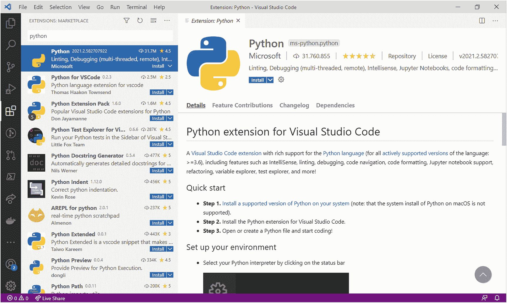

图 10-1

来自微软的官方 Python 扩展

*   Python 解释器及其工具，可以从 Python 官方网站( [`https://www.python.org/downloads`](https://www.python.org/downloads) )下载。下载页面会自动检测您的操作系统，并提供适用于 Windows、macOS 和 Linux 发行版的下载包。

*   Microsoft 提供的 VSCode 的 Python 扩展，可以通过扩展面板安装。市场上有几个 Python 的扩展，但我建议您下载官方的，如图 10-1 所示，因为它通过调试器和额外的编码工具极大地改善了开发体验。

Note

本章介绍了一个简单的代码示例，但是在现实世界中，您可能想要构建更复杂的应用，在这种情况下，您需要额外的组件。例如，构建数据科学应用需要 Anaconda ( [`https://www.anaconda.com`](https://www.anaconda.com) )，一个包含 Python 和 R 编程语言的发行版，外加一组数据科学专用的库。如果你需要做 web 开发，你可以考虑 Django ( [`https://www.djangoproject.com`](https://www.djangoproject.com) )，一个用 Python 构建的 web 框架。

如果您还没有为代码示例在磁盘上创建一个专用文件夹(我的文件夹名为 VSCode)，正如前面章节中所建议的，我建议您在本章中这样做。

现在，您已经安装了所有最低要求的工具，可以开始在 VSCode 中使用 Python 进行编码和调试了。

### 创建 Python 应用

在本书的前面，您已经了解到 VSCode 独立于专有的项目系统和平台，因此不提供任何用于创建项目的内置选项，对于 Python 编程语言也是如此。

使用 VSCode 可以打开现有的 Python 文件和项目，或者从开发环境中创建新的代码文件。作为一个例子，让我们考虑一个简单的战舰游戏，在`pythonfiddle.com/battleships-game-in-python/`的一个代码文件中。在 VSCode 中，创建一个新文件，然后从位于右下角的下拉菜单中选择 Python 作为语言。当前状态下的源代码不能与最新版本的 Python 解释器一起工作，因为它缺少了包围`print`函数参数的括号和一些字符串到整数的转换。为了方便起见，这里列出了修改后的 Python 工作代码:

```sh
import random

board = []

for x in range(0,5):
  board.append(["O"] * 5)

def print_board(board):
  for row in board:
    print (" ".join(row))

print ("Let's play Battleship!")
print_board(board)

def random_row(board):
  return random.randint(0,len(board)-1)

def random_col(board):
  return random.randint(0,len(board[0])-1)

ship_row = random_row(board)
ship_col = random_col(board)
print (ship_row)
print (ship_col)

for turn in range(4):
        guess_row =  int(input("Guess Row:"))
        guess_col = int(input("Guess Col:"))

        if guess_row == ship_row and guess_col == ship_col:
          print ("Congratulations! You sunk my battleship!")
          break

        else:
            if turn == 3:
                    board[guess_row][guess_col] = "X"
                    print_board(board)
                    print ("Game Over")
                    print ("My ship was here:
                    [" + str(ship_row) + "][" + str(ship_col)
                    + "]")
            else:
                    if (guess_row < 0 or guess_row > 4) or
                       (guess_col < 0 or guess_col > 4):
                        print ("Oops, that's not even
 in the ocean.")
                    elif(board[guess_row][guess_col] == "X"):
                        print
                              ("You guessed that one already.")
                    else:
                        print ("You missed my battleship!")
                        board[guess_row][guess_col] = "X"
                    print (turn + 1)
                    print_board(board)

```

将文件另存为 BattleshipsGame.py，这是战列舰游戏的简化实现，主要用于学习目的，但足以理解 VSCode 如何支持 Python 开发。当您键入源代码时，您会立即注意到强大的编辑功能，例如(但不限于)IntelliSense 和参数提示，但是在突出显示特定于 Python 的编辑功能之前，我将带您运行和调试 Python 代码。

### 运行 Python 代码

当您将这种语言分配给代码文件或打开现有文件时，VSCode 会自动尝试在您的计算机上检索适当的 Python 解释器。有时，即使您之前成功安装了 Python 解释器，VS 代码也可能无法做到这一点，在这种情况下，您会收到类似于图 10-2 所示的警告。


图 10-2

VSCode 找不到 Python 解释器

点击警告卡中的**选择 Python 解释器**按钮或状态栏左下角的同名项目，可以选择您最喜欢的 Python 解释器版本(见图 10-3 )。


图 10-3

选择 Python 解释器的版本

如果您需要选择一个特定的版本，而不一定是最新的版本，这是一个非常好的选择。一旦选择了 Python 解释器，其名称就会出现在状态栏上，取代“选择 Python 解释器”按钮，并且您可以运行或调试代码。让我们从运行代码开始，你可以通过选择**运行** ➤ **运行**来完成，不需要调试。Python 运行时构建代码文件，如果没有发现错误，代码的输出将显示在终端面板的实例中。图 10-4 显示了一个基于之前提供的示例游戏的例子。

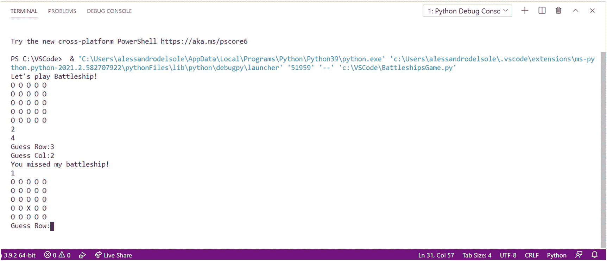

图 10-4

Python 代码在终端中的输出

终端允许用户输入，所以你可以输入战舰的数值。在幕后，VSCode 调用一个名为 Launcher 的工具，该工具与 Python 解释器一起安装，使从命令行运行 Python 代码成为可能。

Note

在基于 Anaconda 库的更具体的开发场景中，例如 data science，VSCode 能够显示额外的工具窗口，并在开发环境中显示图表和计算结果。更多详情请见官方数据科学教程(`code.visualstudio.com/docs/python/data-science-tutorial`)。

对于下一个例子，确保在第 30 行添加一个断点(如第九章所述)。这是为了演示 Python 的调试工具是如何工作的。你可以通过按 F5 键，点击运行面板中的**运行和调试**按钮，或者选择**运行** ➤ **开始调试**来开始调试 Python 代码。此时，VSCode 会询问您想要调试什么文件或程序，如图 10-5 所示。


图 10-5

选择调试目标

您可以选择任何一种配置，这些配置由 Python 扩展为 VS 代码提供，如表 10-1 中所述。

表 10-1

Python 的调试配置

<colgroup><col class="tcol1 align-left"> <col class="tcol2 align-left"> <col class="tcol3 align-left"> <col class="tcol4 align-left"></colgroup> 
| 

配置名称

 | 

VS 代码描述

 | 

描述

 |   |
| --- | --- | --- | --- |
| Python 文件 | 调试当前活动的 Python 文件 | 开始调试当前活动的 Python 文件，其中“活动”是指活动编辑器中的文件。 |   |
| 组件 | 通过使用`-m`调用 Python 模块来调试它 | Python 模块可以被视为代码库，类似于 C#库中的名称空间。用`-m`开关调试使 VS 代码也能调试一个模块。 |   |
| 远程连接 | 连接到远程调试服务器 | 允许将 VS 代码连接到远程调试服务。 |   |
| 使用进程 ID 附加 | 附加到本地进程 | 允许将调试器连接到已经运行的进程。您需要检索进程 ID(例如，在 Windows 上，您可以通过任务管理器进行检索)。 |   |
| Django | 启动并调试 Django web 应用 | Django 是一个高级 Python web 框架，支持快速开发安全且可维护的网站。使用这个选项，您可以在 VS 代码中调试 Django 项目。 |   |
| FastAPI | 启动并调试 FastAPI web 应用 | FastAPI 是一个用 Python 构建 API 的现代 web 框架(需要 3.6 或更高版本)。通过这种配置，您可以使用 VS 代码来调试 FastAPI 项目。 |   |
| 瓶 | 启动并调试 Flask web 应用 | Flask 是另一个允许用 Python 构建 web 应用的框架。通过这种配置，VS 代码使得调试 Flask 项目成为可能。 |   |
| 金字塔 | 启动和调试金字塔 web 应用 | Pyramid 是 Python 的一个框架，允许基于模型-视图-控制器(MVC)模式创建 web 应用。通过这种配置，您可以在 VS 代码中调试金字塔项目。 |   |

对于当前示例，选择第一个选项 **Python 文件**，这允许调试当前代码文件。应用在集成终端中启动，VS 代码的状态栏变为橙色，这表明应用处于调试模式。在终端中，您将能够输入战列舰游戏的值，然后，因为您先前设置了一个断点，执行将在第 30 行中断。这将启用运行面板中的所有工具箱以及代码编辑器中的数据提示(参见图 10-6 )。


图 10-6

调试模式下的应用和已启用的调试工具

如果将光标悬停在代码编辑器中的变量名上，您将能够看到它的当前值。例如，如果您将鼠标悬停在`guess_col`变量上，您将看到它包含您在执行过程中输入的整数值。然而，Python 调试工具提供了更多:如果您将鼠标悬停在复杂类型上，如数组的`list`变量`board`，您将看到复杂的数据提示如何显示列表中每个数组的值。您可以扩展**特殊变量**和**函数变量**组，以获得关于运行时函数的更多信息。

您通过数据提示看到的值也可以在运行面板的变量工具的**局部变量**组中看到。Python 的调试工具也能够捕捉运行时异常，并显示适当的信息来解决它们。为了理解这是如何工作的，您可以有意地在当前的示例文件中引入一个运行时异常。考虑第 27 行，如下所示:

```sh
guess_row = int(input("Guess Row:"))

```

按如下方式更改该行:

```sh
guess_row = input("Guess Row:")

```

这一行仍然有效，因为它仍然等待用户从键盘输入一些东西；与原始行的区别只是类型为`str`的输入没有被转换成`int`。然而，虽然使用等式操作符的比较将会成功，但是使用第 40 行的`<`和`>`操作符进行的比较将会失败，因为这一行试图将用户输入(现在是一个字符串)与一个整数值进行比较，而这样的比较不受支持，因此将会发生运行时异常。图 10-7 展示了 VSCode 在遇到运行时异常时是如何中断应用执行的。

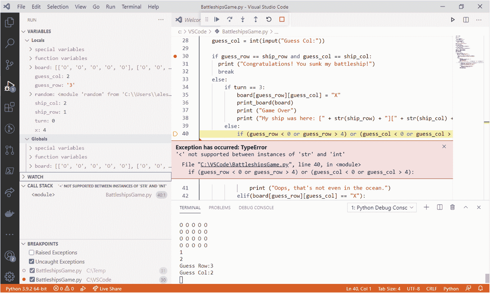

图 10-7

在 Python 中调试运行时异常

更具体地说，异常信息显示在不同颜色的工具提示中，该工具提示显示在导致错误的代码行的正下方。在这个工具提示中，您可以看到异常类型(本例中为`TypeError`)、代码行的编号和内容，以及完整的错误消息。实际上，工具提示还会以超链接的形式显示导致异常的文件的名称。当异常由执行层次结构中的不同文件引发时，这非常有用，使您能够通过单击文件名快速找到问题。

正如您所看到的，在 VSCode 中调试 Python 代码是一种丰富的体验，但实际上 Python 扩展提供了更多的功能，如专用语言服务和其他特性，这些将在下一节中讨论。

## Python 的代码编辑功能

VSCode 的 Python 扩展为 Python 文件带来了第三章中描述的大多数强大的代码编辑特性。这一节将带您浏览进化的代码编辑特性，描述这些特性如何提高您的工作效率。

### 使用智能感知增强单词补全

对于任何语言来说，最有效的代码编辑特性可能是增强的单词完成引擎，VS 代码为 Python 带来了智能感知。IntelliSense 在您键入时出现，并显示有关当前在 IntelliSense 弹出框中选择的类型或成员的文档工具提示。图 10-8 显示了一个基于`bin`函数的例子，在这里你也可以看到语法着色是如何在工具提示中提供的，从而更容易理解方法的用法。

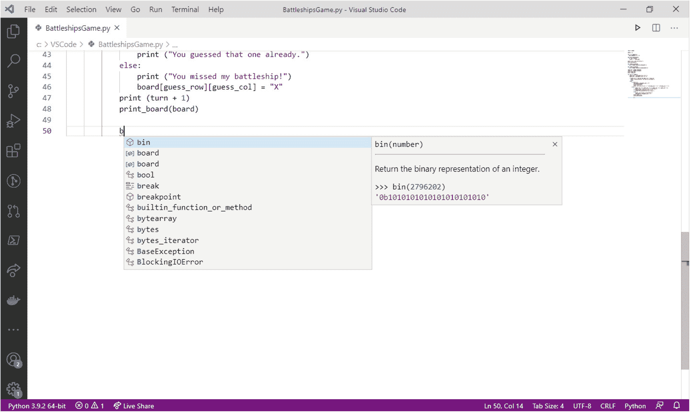

图 10-8

Python 中的智能感知

### 使用参数提示理解函数参数

连接到 IntelliSense 的是参数提示。当你键入一个函数名时，你会得到如何提供参数的建议，如图 10-9 所示，它是基于`pow`函数的。


图 10-9

参数提示解释了如何提供函数参数

如您所见，您当前提供的参数以粗体和下划线突出显示，而参数本身的描述作为工具提示的文本内容提供。

### 快速检索类型定义

在代码编辑器的生产力特性中，Go to Definition 和 Peek Definition(参见第三章)当然非常有用和受欢迎，这些也适用于 Python 代码文件。要理解它们在 Python 中是如何工作的，右键单击代码文件最后一行中的`print_board`语句的`board`参数。

如果点击**转到定义**，光标移动到声明`board`变量的地方。如果您选择 **Peek** ，然后选择 **Peek Definition** ，定义将显示在一个交互式弹出框中，您可以在其中直接进行编辑(参见图 10-10 )。


图 10-10

查看类型定义

### 查找参考

正如在第三章中所解释的，就像其他语言如 C#一样，你可以在 Python 中快速搜索给定类型、成员或变量的所有引用。只需在代码编辑器中右键单击您选择的对象，并选择**查找所有引用**。例如，您可以在示例代码文件中使用`board`变量来实现这一点，您将通过已经众所周知的交互式编辑器看到它在代码中的使用位置，该编辑器突出显示出现的位置，并在面板的右侧显示引用列表。图 10-11 展示了这一点。

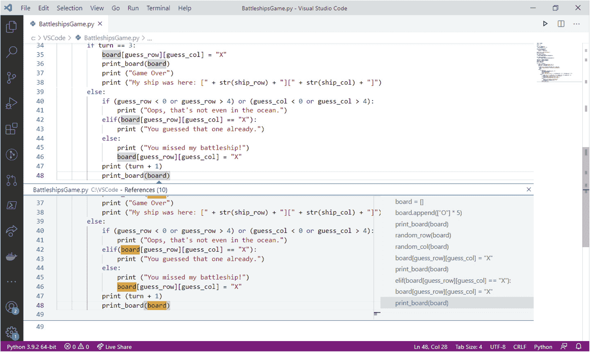

图 10-11

查找对象引用

Note

“查找所有引用”用户界面基本上是 Peek 定义的扩展版本。后者显示了一个对象的单独引用，表示它被定义的位置。“查找所有引用”显示所有类型或成员引用。

### 重命名符号

使用 Python 扩展，重命名符号是一项简单的任务。您只需右键单击一个符号，选择**重命名符号**(或按 F2)，并提供新名称，源代码中出现的所有内容都会相应地被重命名。当键入新名称时，您也可以按 Shift+Enter 并查看将被重命名的所有实例的预览。

图 10-12 显示了一个基于`board`变量的例子，并启用了预览。

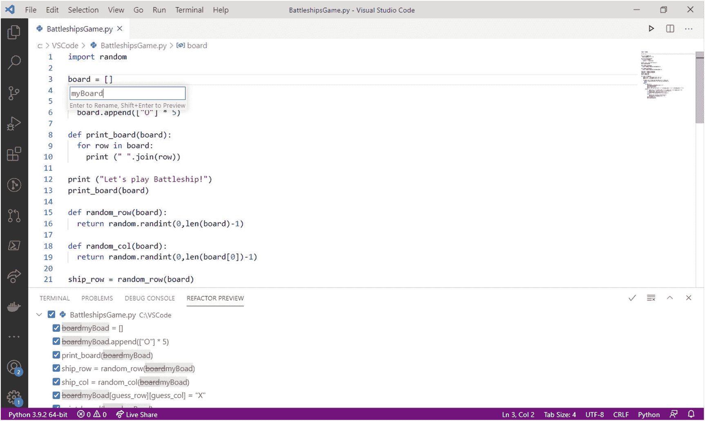

图 10-12

重命名符号

如果您启用了“重构预览”面板，您需要单击勾号图标以接受您的更改。如果您没有查看预览就输入了新名称，只需按 Enter 键，所有出现的符号(包括引用的符号)都将被重命名。

### 查找链接器的代码问题

Linters 突出了代码中的语法和风格问题。仅举一个例子，linters 突出显示代码块中缺少的括号或圆括号，或者突出显示未定义变量的用法，用曲线给代码加下划线。默认情况下不启用林挺，但是您可以通过命令选项板快速完成此操作。你可以直接输入 **Python Select Linter** ，或者只输入 **Python** ，然后选择合适的命令。图 10-13 显示了如何在我输入时使用过滤后的命令列表启用林挺。


图 10-13

启用 Python linters

选择此命令时，命令调板还会显示 Python 可用的 linters 列表。这实际上取决于你的选择，但是我建议使用 **pylint** ，这是通过 Python 扩展提供的微软官方 linter。启用 linter 后，代码编辑器会在有问题的代码下显示波浪线，这些代码问题也会在问题面板中详细说明，如图 10-14 所示。

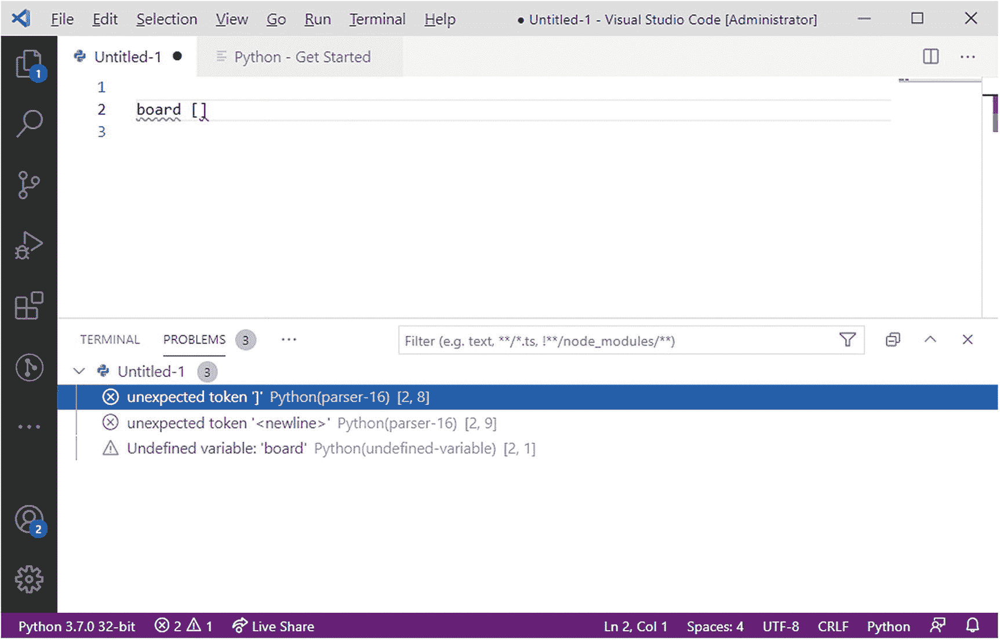

图 10-14

Linters 在编辑器和“问题”面板中突出显示代码问题

Note

如果您在 VSCode 中有使用 C#的经验，您可能会期望与您键入时相同的实时代码分析行为，但是，使用 Python，只有在保存代码文件或通过从命令面板显式调用 linter 之后，linter 才能在有问题的代码下显示曲线。Pylance 扩展对此进行了增强，下面将简要介绍。

Note

通过 Settings.json 文件，可以使用 Settings 用户界面进一步定制 Linters 和其他编辑功能。因为这本书的目标是提供快速获得生产力的最有效方法的指导，所以我展示了只需点击几下鼠标即可获得的最快配置选项。如果您想深入了解设置定制，请将相关文档添加到 [`https://code.visualstudio.com/docs/python/linting`](https://code.visualstudio.com/docs/python/linting) 的书签中，在那里您还可以找到关于 pylint linter 的更多详细信息以及关于命令面板中列出的其他 linter 的摘要信息。

## 使用 planche 进行高级代码编辑

毫无疑问，VSCode 的 Python 扩展极大地提高了开发人员的生产率和编码体验，但是微软做得更多。事实上，微软正在提供一个名为 Pylance 的新扩展，目前正在预览中，它引入了代码重构、IntelliCode(一种由人工智能驱动的进化代码完成引擎)和其他改进。

当你打开(或创建)一个 Python 代码文件时，VSCode 会显示一个弹出框，提示安装 Pylance，如图 10-15 所示。或者，你可以直接从扩展工具下载 Pylance 扩展(见图 10-16 )。

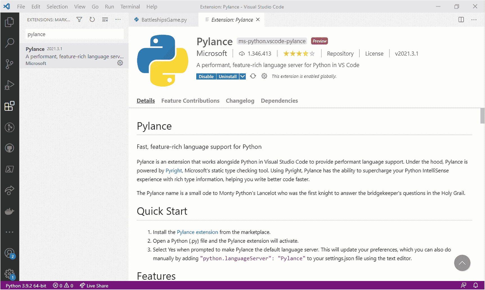

图 10-16

挂架延伸详图

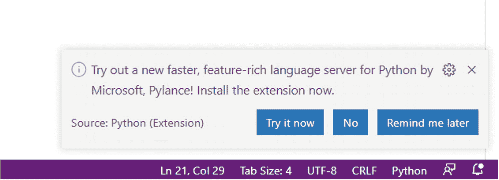

图 10-15

VSCode 提供安装 Pylance 扩展

一旦安装了 Pylance，IntelliSense 将由 IntelliCode 提供支持。该工具从您的代码和模式中学习，并根据您的编码风格提供改进的编辑体验，使 IntelliSense 能够根据编码上下文提供更好的建议。

Pylance 并不局限于提供一个改进的 IntelliSense 引擎，而是通过新的代码重构和实时代码分析，让编写更好的代码变得更加容易。例如，Pylance 可以让 linters 在你输入的时候显示错误的曲线。作为另一个例子，Python 扩展默认情况下只允许排序`import`指令，而 Pylance 引入了新的重构:**提取方法**、**提取变量**以及在通过智能感知或代码片段添加代码时自动添加所需的`import`指令。为了更好地理解这是如何工作的，选择示例文件第 5 行到第 13 行的代码块，如图 10-17 所示。您将看到一个灯泡图标出现，这意味着有一些重构所选代码块的建议。

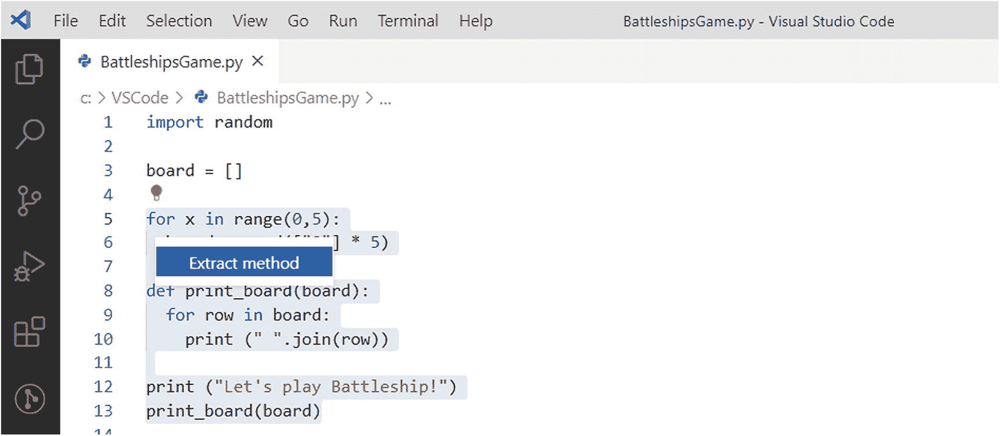

图 10-17

启用代码修复建议

如果您将光标悬停在灯泡图标上，您将看到一个工具提示，上面写着 **Show fixes** 。单击它可查看当前上下文的可用建议；在这种情况下有一个建议，**提取方法**。单击这个建议，VS 代码将为选中的块提取一个新方法，并添加相关的方法调用。这显示在图 10-18 中。

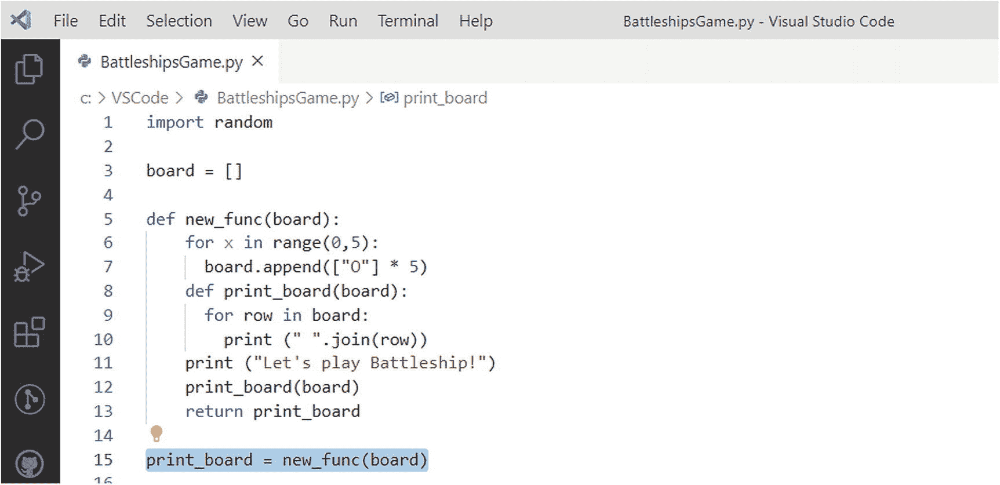

图 10-18

提取方法

您需要手动重命名新方法，因为 Pylance 提供了一个默认名称，并且不进入重命名模式。类似地，名为 **Extract variable** 的代码修复使您能够从代码块中提取变量，并且只有在代码的上下文允许提取变量时，才可以通过灯泡图标使用它。灯泡图标不是检索代码块的代码修复的唯一快捷方式；您也可以选择一个代码块，右键单击，然后从上下文菜单中选择 **Refactor** 。

### 管理 Pylance 设置

正如我之前提到的，在我写这篇文章的时候，Pylance 还处于预览状态，但是你可以看看微软正在通过内部渠道进行扩展更新。您可以在 VS 代码的设置中(见图 10-19 )通过将 **Pylance: Insiders Channel** 选项的值更改为 **daily** 来实现。

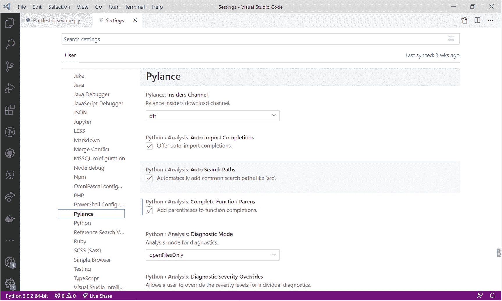

图 10-19

更改挂架设置

一旦 Pylance 达到生产里程碑，我们有理由期待对它进行更多的添加和改进。

## 运行 Python 脚本

Python 也是一种解释型语言，因此它允许运行任意代码，而不需要后台构建过程。VSCode 支持 Python 作为解释器，提供了通过 REPL(读取-评估-打印-循环)交互式控制台编写和运行代码的选项，该控制台位于终端内。

通过选择 **Python: Start REPL 命令**，可以在命令面板中启用 Python REPL(参见图 10-20 )。


图 10-20

启用 Python REPL 控制台

此时，终端出现并加载 Python REPL，在这里您将能够编写和运行任意代码。图 10-21 显示了一个基于声明变量并在屏幕上打印其内容的例子。


图 10-21

在 Python REPL 控制台中运行任意代码

对于 Python 开发人员来说，这是另一个重要的工具，因为这是使用这种语言的一种非常常见的方式，当然也是利用其最强大的特性之一的一种方式。

## 摘要

Python 是一种非常流行和强大的编程语言，它完全受 VSCode 的支持。它完全支持进化的代码编辑、调试，甚至支持使用数据科学工具和库进行高级开发。

VSCode 通过官方的 Python 扩展增强了对 Python 的支持，这使得使用 Python 与使用其他语言和平台非常相似，因此，如果您是第一次使用 Python，但已经有了使用 C#或 Node.js 的经验，您可以应用现有的技能和知识。

微软还投资了一个名为 Pylance 的新扩展，它通过智能代码和额外的代码重构提供了改进的智能感知体验。用于解释代码的交互式 REPL 完成了 Python 的集成工具。

VSCode 再次展示了它的多功能性，为 Python 及其最流行的风格提供了一个完美的环境。